<!-- dw2md v0.2.3 | 666ghj/MiroFish | 2026-03-21T18:23:03Z | 45 pages -->

# 666ghj/MiroFish — DeepWiki

> Compiled from https://deepwiki.com/666ghj/MiroFish
> Generated: 2026-03-21T18:23:03Z | Pages: 45

## Format

Sections are delimited by `<<< SECTION: Title [slug] >>>` lines.
Grep for `^<<< SECTION:` to list all sections.
The Structure tree below shows hierarchy; slugs in brackets are unique identifiers.

<<< SECTION: 1 MiroFish Overview [1-mirofish-overview] >>>

# MiroFish Overview

<details>
<summary>Relevant source files</summary>

The following files were used as context for generating this wiki page:

- [README-EN.md](README-EN.md)
- [README.md](README.md)
- [static/image/shanda_logo.png](static/image/shanda_logo.png)

</details>


## Purpose and Scope

This document provides a comprehensive introduction to MiroFish, covering its core capabilities, system architecture, workflow stages, and technology stack. It serves as the entry point for understanding how MiroFish operates as a collective intelligence engine for multi-agent simulation and prediction.

For detailed information about specific subsystems, see:
- System architecture details: [System Architecture](#1.1)
- Workflow stage explanations: [Five-Stage Workflow](#1.2)
- Installation and setup: [Getting Started](#2)
- User-facing features: [User Guide](#3)
- Technical implementation: [Frontend Architecture](#5) and [Backend Architecture](#6)

---

## What is MiroFish?

MiroFish is a multi-agent simulation engine that constructs high-fidelity digital worlds to predict future outcomes. It extracts information from real-world documents (news reports, policy drafts, financial signals, or even novels) and uses thousands of LLM-powered agents to simulate social interactions on Twitter and Reddit platforms. The system produces detailed analytical reports and enables interactive exploration of the simulated world.

### Core Capabilities

| Capability | Description | Use Cases |
|------------|-------------|-----------|
| **GraphRAG Construction** | Extracts entities, relationships, and temporal facts from documents to build a knowledge graph | Policy impact analysis, narrative prediction |
| **Dual-Platform Simulation** | Runs parallel simulations on Twitter and Reddit environments with autonomous agents | Public opinion forecasting, social dynamics modeling |
| **Intelligent Report Generation** | Uses ReACT pattern with specialized tools to analyze simulation results | Decision support, trend prediction |
| **Deep Interaction** | Enables conversations with simulated agents and the report agent | Scenario exploration, what-if analysis |
| **Historical Tracking** | Maintains a database of past simulations for comparative analysis | Pattern recognition, iterative refinement |

### Target Applications

**Macro-Level Predictions**: Policy rehearsal laboratories where decisions can be tested in zero-risk environments before real-world implementation.

**Micro-Level Exploration**: Creative sandboxes for exploring hypothetical scenarios, from predicting novel endings to analyzing social phenomena.

Sources: [README.md:27-42](), [README-EN.md:27-42]()

---

## System Architecture

MiroFish follows a three-tier architecture with clear separation between presentation, business logic, and external services.

### Architectural Layers

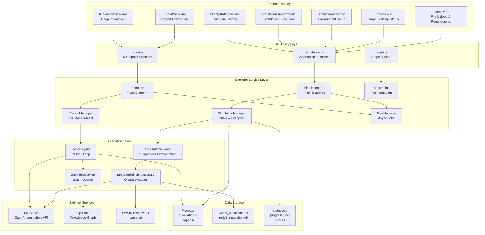

**Component Responsibilities**

- **Presentation Layer**: Vue.js single-page application with components for each workflow stage
- **API Client Layer**: JavaScript modules that abstract HTTP communication ([frontend/src/services/simulation.js](), [frontend/src/services/report.js]())
- **Backend Service Layer**: Flask blueprints and manager classes that handle business logic
- **Execution Layer**: Python scripts that orchestrate LLM-based agents and manage simulations
- **External Services**: Third-party APIs for language models, knowledge graphs, and social simulation
- **Data Storage**: File-based persistence for projects, JSON state files, and SQLite traces

Sources: [README.md:86-93](), High-level system architecture diagram

---

## Five-Stage Workflow

MiroFish processes user inputs through five sequential stages, each transforming data and passing results to the next stage.

### Workflow Pipeline

```mermaid
graph LR
    subgraph "Stage 1: Graph Building"
        S1Input["User Documents<br/>PDF, MD, TXT"]
        S1Process["Document Processing<br/>Entity Extraction"]
        S1Output["Zep Knowledge Graph<br/>graph_id"]
    end
    
    subgraph "Stage 2: Environment Setup"
        S2Process["OasisProfileGenerator<br/>Config Generation"]
        S2Output["twitter_profiles.csv<br/>reddit_profiles.json<br/>simulation.json"]
    end
    
    subgraph "Stage 3: Simulation Execution"
        S3Process["run_parallel_simulation.py<br/>OASIS Subprocess"]
        S3Output["actions.jsonl<br/>twitter_simulation.db<br/>reddit_simulation.db"]
    end
    
    subgraph "Stage 4: Report Generation"
        S4Process["ReportAgent<br/>ReACT Loop"]
        S4Tools["insight_forge<br/>panorama_search<br/>interview_agents"]
        S4Output["outline.json<br/>section_XX.md<br/>full_report.md"]
    end
    
    subgraph "Stage 5: Deep Interaction"
        S5Chat["Chat with ReportAgent<br/>or Simulated Agents"]
        S5Survey["Agent Batch Interviews<br/>IPC Communication"]
    end
    
    S1Input --> S1Process
    S1Process --> S1Output
    S1Output --> S2Process
    S2Process --> S2Output
    S2Output --> S3Process
    S3Process --> S3Output
    S3Output --> S4Process
    S4Process --> S4Tools
    S4Tools --> S4Output
    S4Output --> S5Chat
    S4Output --> S5Survey
```

**Stage Handoffs**

| Stage | Input | Output | Key Files |
|-------|-------|--------|-----------|
| 1: Graph Building | User documents + requirements | `graph_id`, `project_id` | [backend/app/services/document_processor.py]() |
| 2: Environment Setup | `graph_id` | `simulation_id`, agent profiles, config | [backend/app/services/oasis_profile_generator.py]() |
| 3: Simulation Execution | `simulation_id` | Action logs, SQLite traces | [backend/app/oasis/run_parallel_simulation.py]() |
| 4: Report Generation | SQLite traces, Zep graph | `report_id`, markdown report | [backend/app/services/report_agent.py]() |
| 5: Deep Interaction | Report + simulation context | Conversation logs | [backend/app/routes/ipc.py]() |

Sources: [README.md:86-93](), [README-EN.md:86-93](), Five-stage workflow diagram

---

## Technology Stack

### Frontend Stack

| Technology | Version | Purpose |
|------------|---------|---------|
| **Vue.js** | 3.x | Reactive UI framework |
| **Vite** | Latest | Build tool and dev server |
| **Vue Router** | 4.x | Client-side routing |
| **D3.js** | 7.x | Knowledge graph visualization ([frontend/src/components/GraphPanel.vue]()) |
| **Axios** | Latest | HTTP client for API calls |

### Backend Stack

| Technology | Version | Purpose |
|------------|---------|---------|
| **Python** | 3.11-3.12 | Runtime environment |
| **Flask** | Latest | Web framework and REST API |
| **uv** | Latest | Python package manager |
| **SQLite** | 3.x | Simulation trace storage |

### External Services

| Service | Purpose | Configuration |
|---------|---------|---------------|
| **LLM API** | Agent reasoning and content generation | `LLM_API_KEY`, `LLM_BASE_URL`, `LLM_MODEL_NAME` |
| **Zep Cloud** | GraphRAG knowledge graph storage | `ZEP_API_KEY` |
| **OASIS** | Multi-agent social simulation framework | Integrated via [camel-ai](https://github.com/camel-ai/oasis) |

### Deployment Options

**Development Mode**: Concurrent frontend (Vite dev server on port 3000) and backend (Flask on port 5001)
```bash
npm run dev  # Starts both services using concurrently
```

**Production Mode**: Docker Compose with separate containers for frontend (Nginx) and backend (Python)
```bash
docker compose up -d
```

Sources: [README.md:100-176](), [README-EN.md:100-177](), [package.json:1-30]()

---

## Key Components

This section bridges natural language system names to concrete code entities.

### Frontend Components to Code Mapping

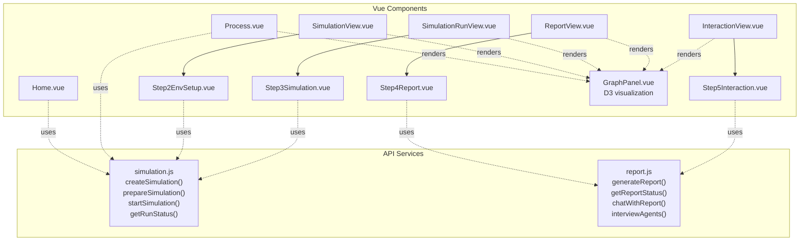

**Key Frontend Files**

- **Router**: [frontend/src/router/index.js]() - Defines routes `/`, `/process`, `/simulation`, `/simulation-run`, `/report`, `/interaction`, `/history`
- **API Clients**: [frontend/src/services/simulation.js](), [frontend/src/services/report.js](), [frontend/src/services/graph.js]()
- **Main Components**: [frontend/src/views/]() directory contains all workflow views
- **Shared Components**: [frontend/src/components/GraphPanel.vue]() for D3.js graph rendering

Sources: Frontend architecture diagram

---

### Backend Services to Code Mapping

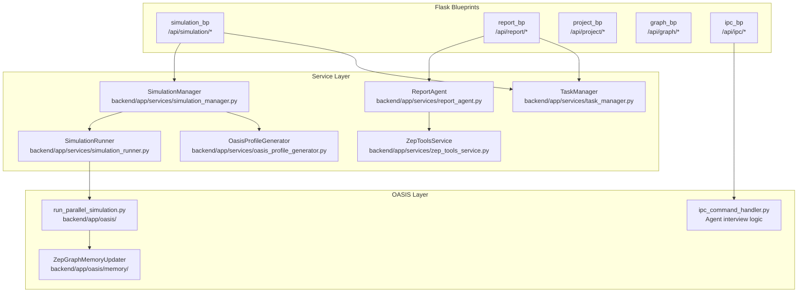

**Key Backend Files**

| File Path | Class/Function | Purpose |
|-----------|----------------|---------|
| [backend/app/routes/simulation.py]() | `simulation_bp` | REST API endpoints for simulation lifecycle |
| [backend/app/routes/report.py]() | `report_bp` | REST API endpoints for report generation |
| [backend/app/services/simulation_manager.py]() | `SimulationManager` | Manages simulation state and file operations |
| [backend/app/services/simulation_runner.py]() | `SimulationRunner` | Spawns and monitors OASIS subprocess |
| [backend/app/services/report_agent.py]() | `ReportAgent` | Implements ReACT loop for report generation |
| [backend/app/services/zep_tools_service.py]() | `ZepToolsService` | Provides tools: `insight_forge`, `panorama_search`, `interview_agents` |
| [backend/app/oasis/run_parallel_simulation.py]() | `main()` | Entry point for dual-platform OASIS simulation |

Sources: Backend architecture diagram, [backend/app/routes/](), [backend/app/services/]()

---

## Data Flow

### File System Structure

MiroFish persists all data to the file system in a structured hierarchy:

```
Projects/
├── {project_id}/
│   ├── documents/           # Uploaded seed materials
│   ├── requirements.txt     # User-specified simulation requirements
│   └── graph_metadata.json  # Zep graph ID and configuration
│
Simulations/
├── {simulation_id}/
│   ├── twitter/
│   │   ├── profiles.csv              # Twitter agent profiles
│   │   ├── simulation.json           # Platform configuration
│   │   ├── run_state.json            # Real-time execution state
│   │   ├── actions.jsonl             # Agent action logs
│   │   └── twitter_simulation.db     # SQLite trace database
│   │
│   ├── reddit/
│   │   ├── profiles.json             # Reddit agent profiles
│   │   ├── simulation.json           # Platform configuration
│   │   ├── run_state.json            # Real-time execution state
│   │   ├── actions.jsonl             # Agent action logs
│   │   └── reddit_simulation.db      # SQLite trace database
│   │
│   └── state.json           # Overall simulation state
│
Reports/
└── {report_id}/
    ├── outline.json         # Report structure
    ├── section_01.md        # Generated sections
    ├── section_02.md
    ├── full_report.md       # Complete report
    ├── agent_log.jsonl      # ReportAgent reasoning trace
    └── console_log.txt      # Execution logs
```

### State Transitions

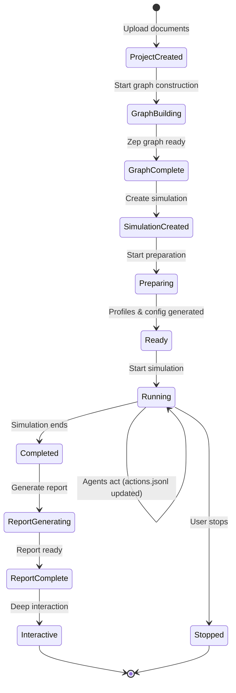

**State Files**

- `Projects/{project_id}/state.json`: Tracks graph building progress
- `Simulations/{simulation_id}/state.json`: Overall simulation status (`preparing`, `ready`, `running`, `completed`, `stopped`)
- `Simulations/{simulation_id}/{platform}/run_state.json`: Real-time platform-specific state updated during simulation
- `Reports/{report_id}/state.json`: Report generation progress

Sources: Data flow diagram, [backend/app/services/simulation_manager.py](), [backend/app/oasis/run_parallel_simulation.py]()

---

## External Service Integration

MiroFish depends on three critical external services, each requiring configuration in the `.env` file.

### LLM Service Configuration

```bash
# Primary LLM for agent reasoning and report generation
LLM_API_KEY=your_api_key
LLM_BASE_URL=https://dashscope.aliyuncs.com/compatible-mode/v1
LLM_MODEL_NAME=qwen-plus

# Optional: Boost LLM to prevent rate limiting during parallel simulation
LLM_BOOST_API_KEY=your_boost_api_key
LLM_BOOST_BASE_URL=https://api.openai.com/v1
LLM_BOOST_MODEL_NAME=gpt-4
```

**Usage in Code**:
- `ReportAgent` ([backend/app/services/report_agent.py]()) uses primary LLM for reasoning
- `OasisProfileGenerator` ([backend/app/services/oasis_profile_generator.py]()) uses primary LLM for profile generation
- OASIS agents ([backend/app/oasis/run_parallel_simulation.py]()) use both primary and boost LLMs during simulation

### Zep Cloud Configuration

```bash
# GraphRAG knowledge graph storage
ZEP_API_KEY=your_zep_api_key
```

**Usage in Code**:
- `ZepToolsService` ([backend/app/services/zep_tools_service.py]()) queries the graph using `search_graph()`, `get_entities()`, `get_episodes()`
- `ZepGraphMemoryUpdater` ([backend/app/oasis/memory/zep_graph_memory_updater.py]()) writes simulation activities back to Zep

### OASIS Framework

MiroFish integrates the OASIS framework from [camel-ai](https://github.com/camel-ai/oasis) to provide:
- Dual-platform social simulation (Twitter and Reddit environments)
- LLM-powered agent action generation
- SQLite trace logging for post-simulation analysis

**Integration Point**: [backend/app/oasis/run_parallel_simulation.py]() wraps OASIS and manages the subprocess lifecycle.

Sources: [README.md:106-128](), [README-EN.md:106-128](), External service integration diagram

---

## Quick Start

### Installation and Configuration

1. **Clone the repository**
```bash
git clone https://github.com/666ghj/MiroFish
cd MiroFish
```

2. **Configure environment variables**
```bash
cp .env.example .env
# Edit .env with your API keys
```

3. **Install dependencies**
```bash
npm run setup:all  # Installs Node.js and Python dependencies
```

4. **Start services**
```bash
npm run dev  # Starts frontend (port 3000) and backend (port 5001)
```

### First Simulation

1. Navigate to `http://localhost:3000`
2. Upload seed documents (PDF, Markdown, or text files)
3. Describe your prediction requirements in natural language
4. Follow the five-stage workflow through graph building, environment setup, simulation execution, report generation, and deep interaction

For detailed instructions, see [Getting Started](#2) and [User Guide](#3).

Sources: [README.md:94-176](), [README-EN.md:94-177]()

---

## System Characteristics

### Performance Considerations

| Aspect | Details |
|--------|---------|
| **Simulation Duration** | Varies based on round count (recommend <40 rounds for initial testing) |
| **LLM Consumption** | High token usage during parallel agent simulation |
| **Memory Requirements** | Graph and simulation traces stored in SQLite (hundreds of MB per simulation) |
| **Concurrent Simulations** | One active simulation per `simulation_id`; multiple projects supported |

### Scalability

- **Horizontal Scaling**: Backend can run multiple Flask instances behind a load balancer
- **Agent Count**: Tested with hundreds of agents per platform; limited by LLM rate limits
- **Graph Size**: Zep Cloud handles graphs with thousands of entities and relationships

### Reliability

- **State Persistence**: All progress saved to disk; simulations can resume after crashes
- **Error Handling**: `TaskManager` tracks async job failures; detailed logs in `console_log.txt`
- **Graceful Shutdown**: `SimulationRunner` sends `SIGTERM` to OASIS subprocess for clean termination

Sources: [backend/app/services/simulation_runner.py](), [backend/app/services/task_manager.py]()

---

## Next Steps

This overview provides the foundation for understanding MiroFish. To dive deeper:

- **Architecture Details**: [System Architecture](#1.1) and [Five-Stage Workflow](#1.2)
- **Setup and Deployment**: [Installation](#2.1), [Configuration](#2.2), [Docker Deployment](#2.3)
- **Usage Tutorials**: [User Guide](#3) covers each workflow stage in detail
- **Core Concepts**: [GraphRAG](#4.1), [OASIS Simulation](#4.2), [ReACT Pattern](#4.3)
- **API Reference**: [Simulation API](#7.1), [Report API](#7.2), [IPC API](#7.3)
- **Advanced Topics**: [Custom Agent Profiles](#8.1), [ZepTools Extension](#8.2), [LLM Optimization](#8.4)

Sources: Table of contents structure

---

<<< SECTION: 1.1 System Architecture [1-1-system-architecture] >>>

# System Architecture

<details>
<summary>Relevant source files</summary>

The following files were used as context for generating this wiki page:

- [README-EN.md](README-EN.md)
- [README.md](README.md)
- [backend/pyproject.toml](backend/pyproject.toml)
- [package-lock.json](package-lock.json)
- [package.json](package.json)
- [static/image/shanda_logo.png](static/image/shanda_logo.png)

</details>


## Purpose and Scope

This document provides a high-level technical overview of MiroFish's system architecture, including the frontend-backend structure, external service integrations, technology stack, and deployment models. For detailed information about the five-stage workflow pipeline, see [Five-Stage Workflow](#1.2). For component-level frontend details, see [Frontend Architecture](#5). For backend service implementations, see [Backend Architecture](#6).

## Architecture Overview

MiroFish follows a layered, client-server architecture with clear separation between presentation, business logic, execution, and data layers. The system orchestrates complex multi-agent simulations through a Vue.js frontend, Flask backend, and integrations with LLM and graph memory services.

### System Layers

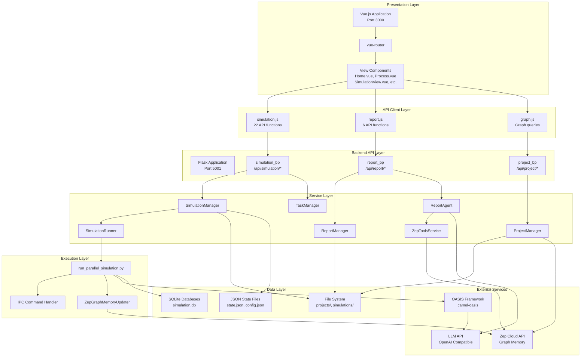

**Sources:** [README.md:86-92](), [backend/pyproject.toml:11-35](), [package.json:5-12]()

The architecture consists of seven distinct layers:

| Layer | Responsibilities | Key Technologies |
|-------|-----------------|------------------|
| **Presentation Layer** | User interface rendering, user interactions, view state management | Vue.js 3, Vite, D3.js |
| **API Client Layer** | HTTP communication abstraction, request/response handling | Axios, JavaScript |
| **Backend API Layer** | REST endpoint routing, request validation, response formatting | Flask 3.0+, Flask-CORS |
| **Service Layer** | Business logic, state management, orchestration | Python 3.11-3.12 |
| **Execution Layer** | Subprocess management, multi-agent simulation execution | OASIS (camel-ai) |
| **External Services** | LLM inference, graph memory, knowledge graph queries | OpenAI API, Zep Cloud |
| **Data Layer** | File storage, state persistence, simulation traces | File System, SQLite |

**Sources:** [backend/pyproject.toml:11-35](), [README.md:98-104]()

## Technology Stack

### Frontend Stack

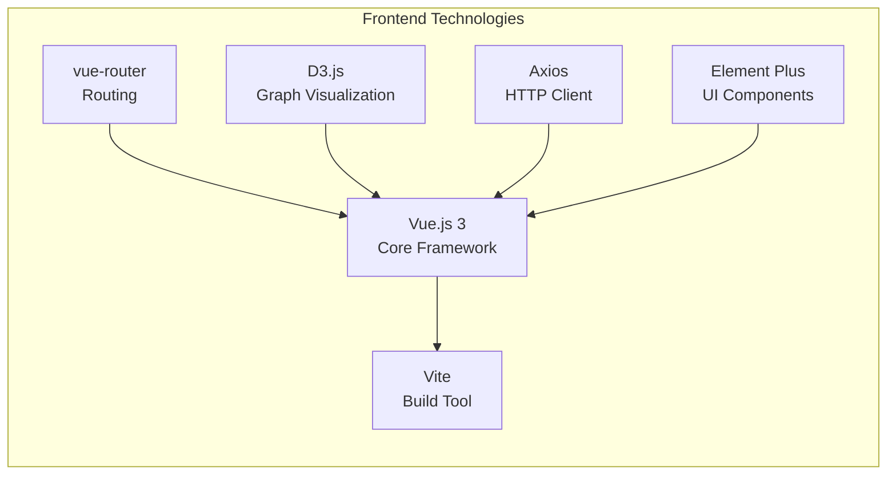

**Sources:** [package.json:1-21](), [README.md:100-104]()

| Component | Version | Purpose |
|-----------|---------|---------|
| **Node.js** | 18.0.0+ | JavaScript runtime environment |
| **Vue.js** | 3.x | Progressive frontend framework |
| **Vite** | Latest | Fast build tool and dev server |
| **vue-router** | 4.x | Client-side routing |
| **D3.js** | 7.x | Graph visualization for knowledge graphs |
| **Axios** | Latest | HTTP client for API communication |

**Sources:** [package.json:17-20](), [README.md:100-104]()

### Backend Stack

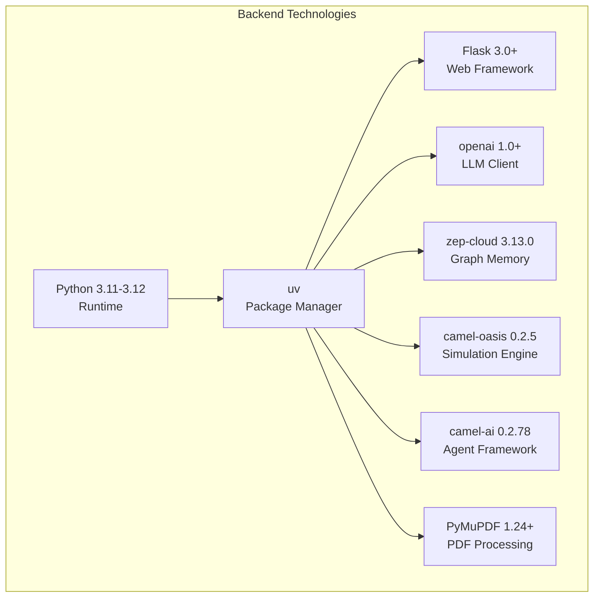

**Sources:** [backend/pyproject.toml:1-56]()

| Component | Version | Purpose |
|-----------|---------|---------|
| **Python** | 3.11-3.12 | Backend runtime environment |
| **uv** | Latest | Fast Python package manager |
| **Flask** | 3.0.0+ | Lightweight web framework |
| **Flask-CORS** | 6.0.0+ | Cross-origin resource sharing |
| **openai** | 1.0.0+ | LLM API client (OpenAI compatible) |
| **zep-cloud** | 3.13.0 | Graph memory and knowledge graph |
| **camel-oasis** | 0.2.5 | Social media simulation framework |
| **camel-ai** | 0.2.78 | Multi-agent foundation |
| **PyMuPDF** | 1.24.0+ | PDF document processing |
| **pydantic** | 2.0.0+ | Data validation |

**Sources:** [backend/pyproject.toml:11-35](), [README.md:98-104]()

## Frontend Architecture

### Component Structure and Routing

The frontend uses Vue.js with a single-page application (SPA) architecture. The `vue-router` manages navigation between five main workflow stages and supporting views.

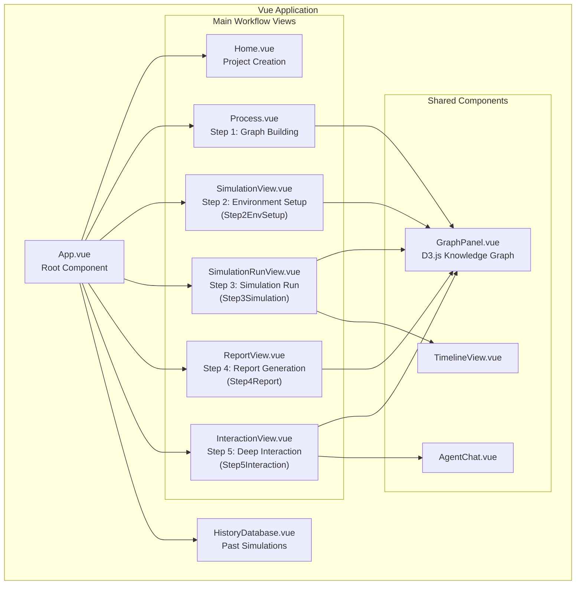

**Sources:** [README.md:86-92]()

### API Client Modules

The frontend abstracts backend communication into three dedicated API client modules:

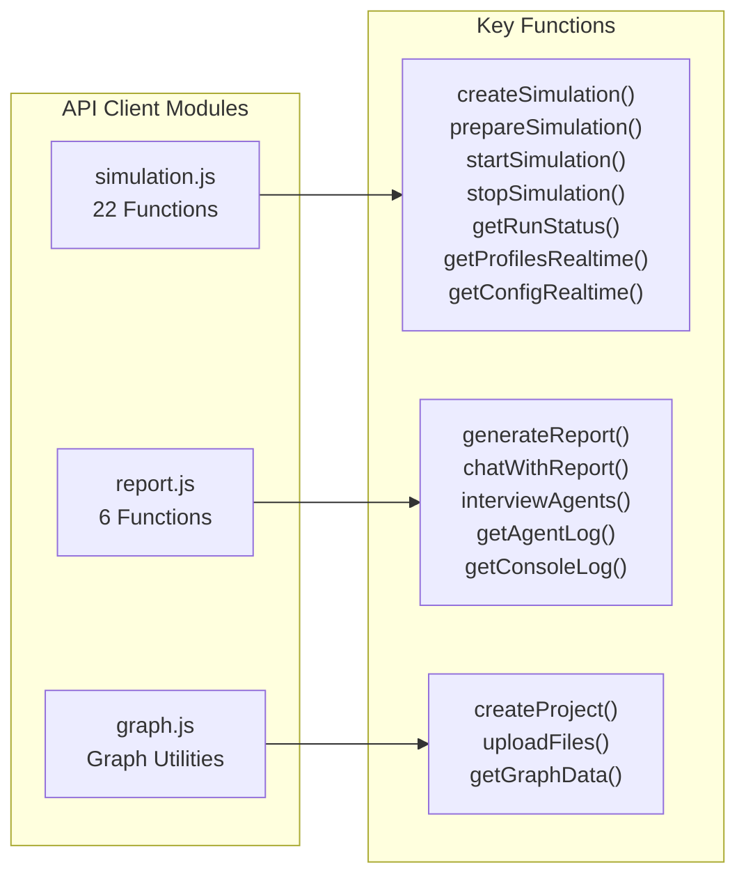

**Sources:** Documentation references from high-level diagrams

The API client layer handles:
- HTTP request construction
- Error handling and retry logic
- Response parsing and validation
- Authentication header injection
- Base URL configuration

## Backend Architecture

### Flask Application Structure

The Flask backend is organized into blueprints for modular routing and service managers for business logic.

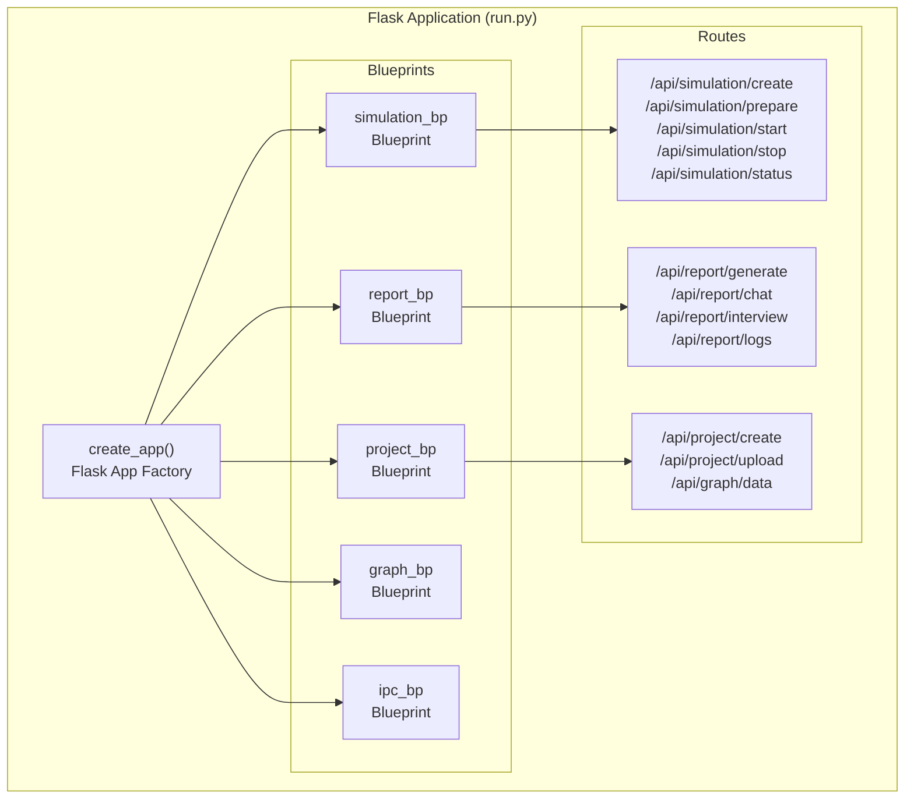

**Sources:** [backend/pyproject.toml:11-14]()

### Service Layer Components

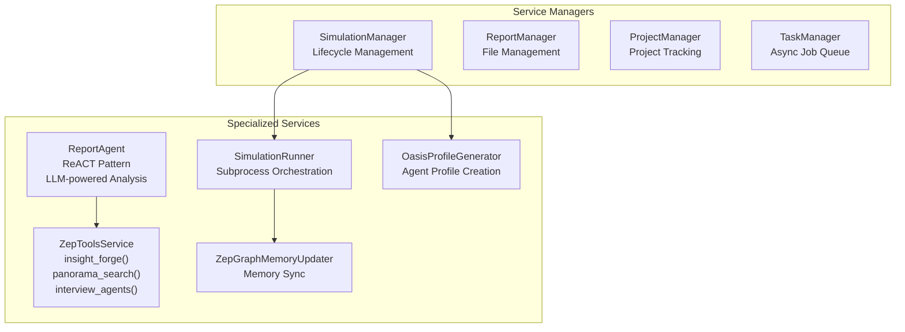

**Sources:** Documentation references from high-level diagrams

| Service | File Location | Responsibilities |
|---------|--------------|------------------|
| `SimulationManager` | Backend service layer | State tracking, configuration management, simulation lifecycle |
| `SimulationRunner` | Backend service layer | Subprocess spawning, IPC communication, process monitoring |
| `ReportManager` | Backend service layer | Report file I/O, status tracking |
| `ReportAgent` | Backend service layer | ReACT loop implementation, tool execution, report generation |
| `ZepToolsService` | Backend service layer | Knowledge graph queries, agent interviews, insight generation |
| `TaskManager` | Backend service layer | Background job management, progress tracking |

**Sources:** Documentation references from high-level diagrams

## External Service Integration

MiroFish integrates with three primary external services, each serving a distinct architectural role.

### Integration Architecture

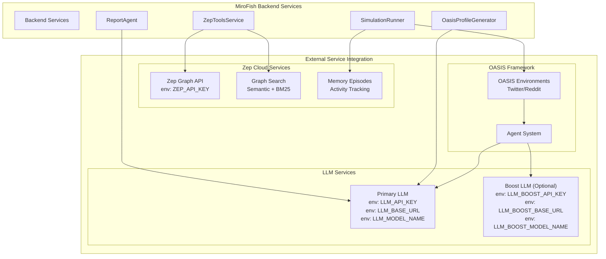

**Sources:** [README.md:106-128](), [backend/pyproject.toml:16-24]()

### Configuration Requirements

MiroFish requires the following environment variables for external service integration:

**Required Configuration (.env file):**

| Variable | Purpose | Example |
|----------|---------|---------|
| `LLM_API_KEY` | Primary LLM authentication | `sk-...` |
| `LLM_BASE_URL` | LLM API endpoint | `https://dashscope.aliyuncs.com/compatible-mode/v1` |
| `LLM_MODEL_NAME` | Model identifier | `qwen-plus` |
| `ZEP_API_KEY` | Zep Cloud authentication | `z_...` |

**Optional Configuration (Boost LLM):**

| Variable | Purpose |
|----------|---------|
| `LLM_BOOST_API_KEY` | Secondary LLM for parallel simulation workloads |
| `LLM_BOOST_BASE_URL` | Boost LLM endpoint |
| `LLM_BOOST_MODEL_NAME` | Boost model identifier |

**Sources:** [README.md:106-128]()

### Service Integration Points

| Service | Purpose | Used By | Protocol |
|---------|---------|---------|----------|
| **LLM API** (OpenAI Compatible) | Natural language generation, reasoning, agent cognition | `ReportAgent`, `OasisProfileGenerator`, OASIS agents | REST (OpenAI SDK) |
| **Zep Cloud** | Knowledge graph storage, semantic search, memory management | `ZepToolsService`, `ZepGraphMemoryUpdater`, `ProjectManager` | REST (Zep SDK) |
| **OASIS Framework** | Multi-agent social simulation on Twitter/Reddit platforms | `SimulationRunner` via subprocess | Python subprocess |

**Sources:** [backend/pyproject.toml:16-24]()

## Data Persistence Layer

MiroFish uses a hybrid persistence approach combining file system storage, SQLite databases, and JSON state files.

### Data Storage Architecture

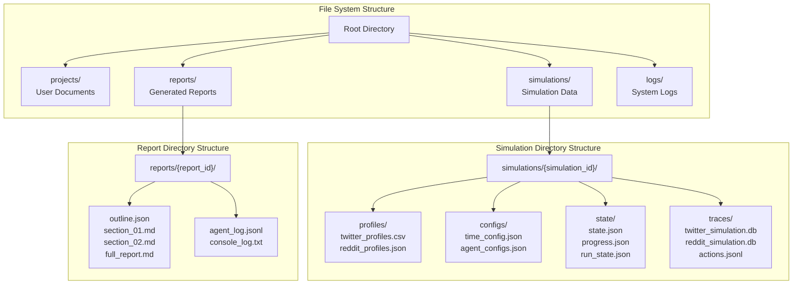

**Sources:** Documentation references from high-level diagrams

### Data Format Specifications

| Data Type | Format | Location | Purpose |
|-----------|--------|----------|---------|
| **Project Documents** | PDF, MD, TXT | `projects/{project_id}/` | Seed materials for graph construction |
| **Agent Profiles** | CSV (Twitter), JSON (Reddit) | `simulations/{id}/profiles/` | Agent personality and configuration |
| **Simulation Config** | JSON | `simulations/{id}/configs/` | Time config, event config, agent parameters |
| **State Files** | JSON | `simulations/{id}/state/` | Runtime state, progress tracking |
| **Simulation Traces** | SQLite | `simulations/{id}/traces/` | Agent actions, interactions, database queries |
| **Action Logs** | JSONL | `simulations/{id}/traces/` | Timestamped action stream |
| **Reports** | Markdown, JSON | `reports/{report_id}/` | Generated reports and outlines |
| **Logs** | JSONL, TXT | `reports/{report_id}/`, `logs/` | Agent logs, console output |

**Sources:** Documentation references from high-level diagrams

### Database Schema (SQLite)

OASIS simulations generate SQLite databases for each platform with the following key tables:

- **Actions Table**: All agent actions with timestamps, types, and content
- **Agents Table**: Agent metadata and state
- **Interactions Table**: Agent-to-agent interactions
- **Events Table**: System events and triggers

**Sources:** Documentation references from OASIS framework

## Deployment Architecture

MiroFish supports two deployment modes: source code deployment for development and Docker-based deployment for production.

### Development Deployment

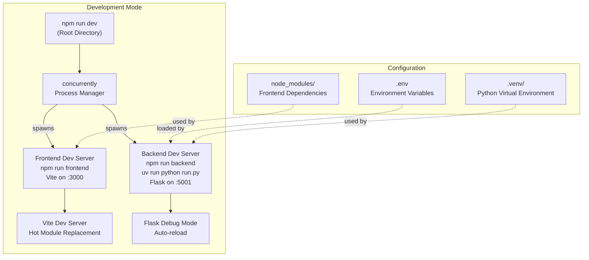

**Sources:** [package.json:5-12](), [README.md:94-163]()

**Development Setup Commands:**

```bash
# Install all dependencies
npm run setup:all

# Start both frontend and backend
npm run dev

# Start individually
npm run frontend  # Vite on :3000
npm run backend   # Flask on :5001
```

**Sources:** [package.json:5-12](), [README.md:132-163]()

### Docker Deployment

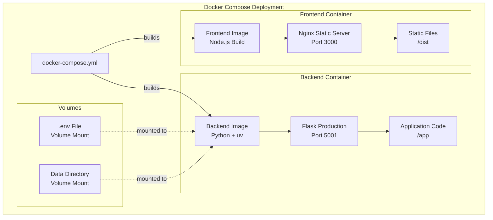

**Sources:** [README.md:165-177]()

**Docker Deployment Commands:**

```bash
# Start with Docker Compose
docker compose up -d

# View logs
docker compose logs -f

# Stop services
docker compose down
```

**Sources:** [README.md:165-177]()

### Port Mapping and Service Discovery

| Service | Development Port | Docker Port | Protocol |
|---------|-----------------|-------------|----------|
| **Frontend** | 3000 | 3000 | HTTP |
| **Backend API** | 5001 | 5001 | HTTP |
| **Frontend → Backend** | `http://localhost:5001` | `http://backend:5001` (internal) | HTTP |

**Sources:** [README.md:154-157]()

### Runtime Requirements

| Component | Development | Docker | Notes |
|-----------|------------|--------|-------|
| **Node.js** | 18.0.0+ | Bundled in image | For frontend build |
| **Python** | 3.11-3.12 | Bundled in image | Backend runtime |
| **uv** | Latest | Bundled in image | Python package manager |
| **Environment Variables** | `.env` file | Volume-mounted `.env` | Required for both modes |

**Sources:** [package.json:17-20](), [README.md:98-104](), [backend/pyproject.toml:5]()

## Communication Patterns

### Frontend-Backend Communication

The frontend communicates with the backend exclusively through RESTful HTTP APIs. All API endpoints are prefixed with `/api/`.

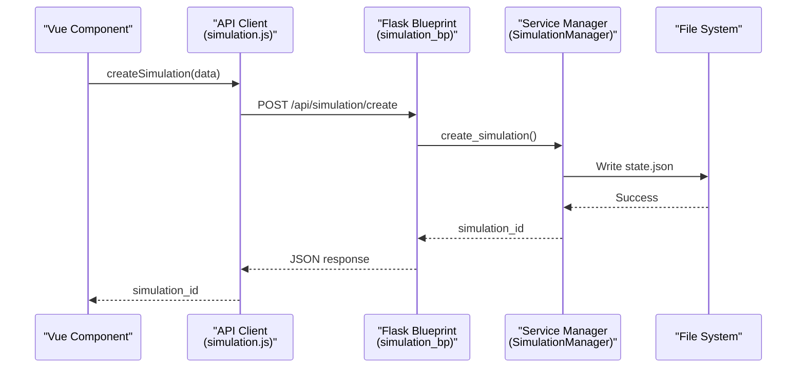

**Sources:** Documentation references from high-level diagrams

### Real-time Updates via Polling

MiroFish uses HTTP polling for real-time status updates during long-running operations:

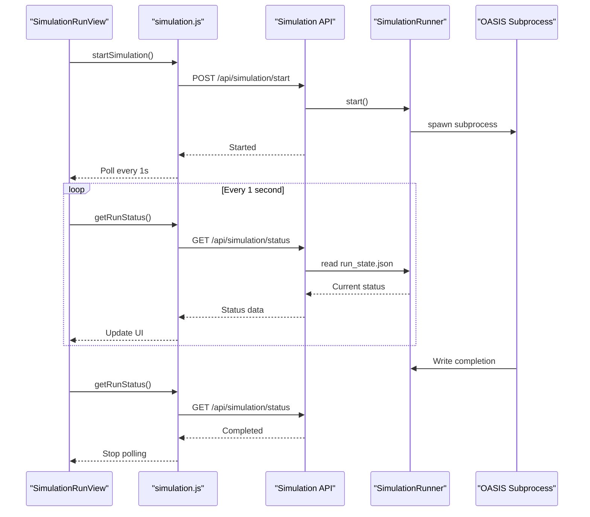

**Sources:** Documentation references from high-level diagrams

### Subprocess Communication

The `SimulationRunner` spawns OASIS simulations as subprocesses and communicates via:
- **State files**: JSON files written by subprocess, read by backend
- **IPC commands**: HTTP endpoints for live agent interviews during simulation
- **Log streaming**: JSONL action logs for real-time monitoring

**Sources:** Documentation references from high-level diagrams

## Summary

MiroFish's architecture provides:

- **Separation of Concerns**: Clear boundaries between presentation, business logic, execution, and data layers
- **Scalability**: Async task management, subprocess isolation, external service integration
- **Flexibility**: Pluggable LLM backends, Docker or source deployment, extensible tool system
- **Observability**: Comprehensive logging, state tracking, real-time progress monitoring
- **Modularity**: Blueprint-based routing, component-based UI, service-oriented backend

This architecture enables MiroFish to orchestrate complex multi-agent simulations while maintaining clean abstractions and developer-friendly interfaces.

---

<<< SECTION: 1.2 Five-Stage Workflow [1-2-five-stage-workflow] >>>

# Five-Stage Workflow

<details>
<summary>Relevant source files</summary>

The following files were used as context for generating this wiki page:

- [README-EN.md](README-EN.md)
- [README.md](README.md)
- [frontend/index.html](frontend/index.html)
- [frontend/src/App.vue](frontend/src/App.vue)
- [frontend/src/assets/logo/MiroFish_logo_left.jpeg](frontend/src/assets/logo/MiroFish_logo_left.jpeg)
- [frontend/src/views/Home.vue](frontend/src/views/Home.vue)
- [static/image/shanda_logo.png](static/image/shanda_logo.png)

</details>


## Purpose and Scope

This document describes the complete five-stage workflow pipeline that transforms user-provided documents and requirements into actionable predictions through multi-agent simulation. The workflow is sequential, with each stage producing specific artifacts that serve as inputs to the next stage. 

For implementation details of individual components, see [System Architecture](#1.1). For user-facing instructions on executing the workflow, see [User Guide](#3).

---

## Workflow Overview

MiroFish implements a linear five-stage pipeline. Each stage is mandatory and must complete successfully before the next stage can begin. The workflow transforms unstructured documents into a living digital world with predictive insights.

### Stage Progression

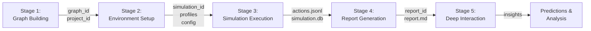

**Sources:** [README.md:86-92](), [README-EN.md:86-92](), [frontend/src/views/Home.vue:77-118]()

---

## Stage 1: Graph Building

### Purpose

Extract entities, relationships, and temporal facts from uploaded documents and construct a GraphRAG knowledge graph using Zep Cloud. This stage establishes the foundational knowledge base that informs all subsequent stages.

### Process Flow

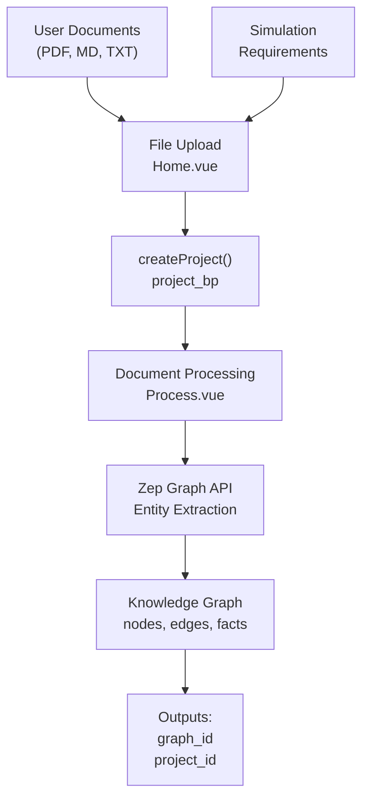

### Key Components

| Component | Type | Purpose |
|-----------|------|---------|
| `Home.vue` | Frontend | File upload interface, requirement input |
| `Process.vue` | Frontend | Display graph construction progress |
| `project_bp` | Backend Route | Handle project creation API |
| `ProjectManager` | Backend Service | Manage project lifecycle |
| Zep Graph API | External Service | Construct GraphRAG knowledge graph |

### Data Artifacts Created

| Artifact | Location | Description |
|----------|----------|-------------|
| `graph_id` | Zep Cloud | Unique identifier for the knowledge graph |
| `project_id` | File System | Local project directory identifier |
| Project directory | `projects/{project_id}/` | Contains uploaded files and metadata |
| `state.json` | `projects/{project_id}/state.json` | Project state and configuration |

### Code Entities

The graph building stage is initiated from the Home view:

[frontend/src/views/Home.vue:291-305]()

The backend project creation route handles file uploads and initiates Zep graph construction through the Project Blueprint.

**Sources:** [frontend/src/views/Home.vue:1-306](), [README.md:88](), [README-EN.md:88]()

---

## Stage 2: Environment Setup

### Purpose

Generate agent profiles and simulation configuration based on the knowledge graph. This stage transforms entities from the graph into concrete agent personalities with platform-specific behaviors for Twitter and Reddit simulations.

### Process Flow

```mermaid
graph TB
    INPUT["graph_id<br/>project_id"]
    
    SIM_VIEW["SimulationView.vue<br/>Step2EnvSetup"]
    CREATE_SIM["createSimulation()<br/>simulation.js"]
    SIM_BP["simulation_bp<br/>/api/simulation/create"]
    
    SIM_MGR["SimulationManager<br/>prepareSimulation()"]
    PROFILE_GEN["OasisProfileGenerator<br/>LLM-powered"]
    CONFIG_GEN["Configuration<br/>Generation"]
    
    COPY["Script Copying<br/>Environment Prep"]
    
    OUTPUT["Outputs:<br/>simulation_id<br/>twitter_profiles.csv<br/>reddit_profiles.json<br/>config files"]
    
    INPUT --> SIM_VIEW
    SIM_VIEW --> CREATE_SIM
    CREATE_SIM --> SIM_BP
    SIM_BP --> SIM_MGR
    SIM_MGR --> PROFILE_GEN
    SIM_MGR --> CONFIG_GEN
    SIM_MGR --> COPY
    PROFILE_GEN --> OUTPUT
    CONFIG_GEN --> OUTPUT
    COPY --> OUTPUT
```

### Key Components

| Component | Type | Purpose |
|-----------|------|---------|
| `SimulationView.vue` | Frontend | Environment setup interface |
| `Step2EnvSetup.vue` | Frontend Component | Profile and config display |
| `simulation.js` | API Client | Frontend API abstraction |
| `simulation_bp` | Backend Route | Simulation lifecycle endpoints |
| `SimulationManager` | Backend Service | Orchestrate preparation |
| `OasisProfileGenerator` | Backend Service | Generate agent profiles via LLM |

### Data Artifacts Created

| Artifact | Location | Description |
|----------|----------|-------------|
| `simulation_id` | Database/File System | Unique simulation identifier |
| `twitter_profiles.csv` | `simulations/{simulation_id}/twitter/` | Twitter agent profiles |
| `reddit_profiles.json` | `simulations/{simulation_id}/reddit/` | Reddit agent profiles |
| `time_config.json` | `simulations/{simulation_id}/` | Temporal simulation parameters |
| `agent_configs.json` | `simulations/{simulation_id}/` | Agent behavior configurations |
| `state.json` | `simulations/{simulation_id}/state.json` | Simulation state tracking |

### API Endpoints Used

```
POST /api/simulation/create
POST /api/simulation/prepare
GET  /api/simulation/prepare/status
GET  /api/simulation/profiles/realtime
GET  /api/simulation/config/realtime
```

The frontend polls status endpoints to display real-time preparation progress:

[frontend/src/views/Home.vue:82-95]()

**Sources:** [frontend/src/views/Home.vue:82-95](), [README.md:89](), [README-EN.md:89]()

---

## Stage 3: Simulation Execution

### Purpose

Execute parallel dual-platform simulations on Twitter and Reddit environments using the OASIS framework. This stage runs the actual multi-agent simulation with agents interacting based on their generated profiles and the knowledge graph context.

### Process Flow

```mermaid
graph TB
    INPUT["simulation_id<br/>profiles<br/>config"]
    
    RUN_VIEW["SimulationRunView.vue<br/>Step3Simulation"]
    START_API["startSimulation()<br/>simulation.js"]
    SIM_RUNNER["SimulationRunner<br/>Process Manager"]
    
    SCRIPT["run_parallel_simulation.py<br/>Subprocess"]
    
    TWITTER["Twitter Environment<br/>OASIS Framework"]
    REDDIT["Reddit Environment<br/>OASIS Framework"]
    
    AGENTS["LLM-powered Agents<br/>camel-ai"]
    
    ACTIONS["actions.jsonl<br/>Action Logs"]
    TRACE_T["twitter_simulation.db<br/>SQLite Traces"]
    TRACE_R["reddit_simulation.db<br/>SQLite Traces"]
    
    ZEP_UPDATE["ZepGraphMemoryUpdater<br/>Optional Feedback"]
    
    OUTPUT["Outputs:<br/>actions.jsonl<br/>simulation.db files<br/>run_state.json"]
    
    INPUT --> RUN_VIEW
    RUN_VIEW --> START_API
    START_API --> SIM_RUNNER
    SIM_RUNNER --> SCRIPT
    
    SCRIPT --> TWITTER
    SCRIPT --> REDDIT
    
    TWITTER --> AGENTS
    REDDIT --> AGENTS
    
    AGENTS --> ACTIONS
    TWITTER --> TRACE_T
    REDDIT --> TRACE_R
    
    ACTIONS --> ZEP_UPDATE
    ZEP_UPDATE -.->|"Memory Update"| INPUT
    
    ACTIONS --> OUTPUT
    TRACE_T --> OUTPUT
    TRACE_R --> OUTPUT
```

### Key Components

| Component | Type | Purpose |
|-----------|------|---------|
| `SimulationRunView.vue` | Frontend | Real-time simulation monitoring |
| `Step3Simulation.vue` | Frontend Component | Action timeline display |
| `SimulationRunner` | Backend Service | Subprocess orchestration |
| `run_parallel_simulation.py` | Python Script | Execute OASIS simulations |
| OASIS Framework | External Library | Multi-agent social simulation |
| `ZepGraphMemoryUpdater` | Backend Service | Update graph with simulation data |

### Data Artifacts Created

| Artifact | Location | Description |
|----------|----------|-------------|
| `actions.jsonl` | `simulations/{simulation_id}/twitter/` | Twitter action logs (newline-delimited JSON) |
| `actions.jsonl` | `simulations/{simulation_id}/reddit/` | Reddit action logs |
| `twitter_simulation.db` | `simulations/{simulation_id}/twitter/` | SQLite database with Twitter traces |
| `reddit_simulation.db` | `simulations/{simulation_id}/reddit/` | SQLite database with Reddit traces |
| `run_state.json` | `simulations/{simulation_id}/run_state.json` | Real-time simulation progress |
| `progress.json` | `simulations/{simulation_id}/progress.json` | Detailed progress metrics |

### Real-time Updates

The frontend polls the simulation status every 2 seconds to update the UI:

```
GET /api/simulation/run/status/{simulation_id}
GET /api/simulation/run/status/detail/{simulation_id}
```

### IPC Communication

During simulation execution, the frontend can communicate with running agents via Inter-Process Communication (IPC) for live interviews:

```
POST /api/interview/agents
```

**Sources:** [frontend/src/views/Home.vue:96-101](), [README.md:90](), [README-EN.md:90]()

---

## Stage 4: Report Generation

### Purpose

Analyze simulation results using a ReACT-pattern agent with specialized tools to generate comprehensive prediction reports. The ReportAgent iteratively queries the knowledge graph and simulation traces to produce structured insights.

### Process Flow

```mermaid
graph TB
    INPUT["simulation_id<br/>actions.jsonl<br/>simulation.db"]
    
    REPORT_VIEW["ReportView.vue<br/>Step4Report"]
    GEN_API["generateReport()<br/>report.js"]
    REPORT_BP["report_bp<br/>/api/report/generate"]
    
    REPORT_AGENT["ReportAgent<br/>ReACT Loop"]
    
    TOOL1["insight_forge<br/>Structured Analysis"]
    TOOL2["panorama_search<br/>Graph Queries"]
    TOOL3["interview_agents<br/>Agent Interviews"]
    
    ZEP_TOOLS["ZepToolsService<br/>Graph Operations"]
    ZEP_GRAPH["Zep Knowledge Graph"]
    TRACE_DB["SQLite Traces<br/>Action History"]
    
    OUTLINE["outline.json<br/>Report Structure"]
    SECTIONS["section_*.md<br/>Individual Sections"]
    FULL["full_report.md<br/>Complete Report"]
    LOGS["agent_log.jsonl<br/>console_log.txt"]
    
    OUTPUT["Outputs:<br/>report_id<br/>report.md<br/>logs"]
    
    INPUT --> REPORT_VIEW
    REPORT_VIEW --> GEN_API
    GEN_API --> REPORT_BP
    REPORT_BP --> REPORT_AGENT
    
    REPORT_AGENT --> TOOL1
    REPORT_AGENT --> TOOL2
    REPORT_AGENT --> TOOL3
    
    TOOL2 --> ZEP_TOOLS
    TOOL3 --> TRACE_DB
    ZEP_TOOLS --> ZEP_GRAPH
    
    REPORT_AGENT --> OUTLINE
    OUTLINE --> SECTIONS
    SECTIONS --> FULL
    REPORT_AGENT --> LOGS
    
    FULL --> OUTPUT
    LOGS --> OUTPUT
```

### Key Components

| Component | Type | Purpose |
|-----------|------|---------|
| `ReportView.vue` | Frontend | Report generation interface |
| `Step4Report.vue` | Frontend Component | Display generated report |
| `report.js` | API Client | Report API abstraction |
| `report_bp` | Backend Route | Report endpoints |
| `ReportAgent` | Backend Service | ReACT-pattern agent |
| `ZepToolsService` | Backend Service | Graph query tools |

### ReportAgent Tools

| Tool Name | Function | Purpose |
|-----------|----------|---------|
| `insight_forge` | Structured analysis | Extract patterns from data |
| `panorama_search` | Graph queries | Semantic + BM25 search on knowledge graph |
| `interview_agents` | Agent interviews | Query simulated agents via SQLite traces |

### Data Artifacts Created

| Artifact | Location | Description |
|----------|----------|-------------|
| `report_id` | Database/File System | Unique report identifier |
| `outline.json` | `reports/{report_id}/outline.json` | Report section structure |
| `section_*.md` | `reports/{report_id}/` | Individual report sections |
| `full_report.md` | `reports/{report_id}/full_report.md` | Complete markdown report |
| `agent_log.jsonl` | `reports/{report_id}/agent_log.jsonl` | ReportAgent reasoning log |
| `console_log.txt` | `reports/{report_id}/console_log.txt` | Console output |

### API Endpoints Used

```
POST /api/report/generate
GET  /api/report/generate/status/{report_id}
GET  /api/report/download/{report_id}
GET  /api/report/agent_log/{report_id}
GET  /api/report/console_log/{report_id}
```

**Sources:** [frontend/src/views/Home.vue:103-108](), [README.md:91](), [README-EN.md:91]()

---

## Stage 5: Deep Interaction

### Purpose

Enable interactive exploration through conversational interfaces. Users can chat with the ReportAgent to refine analysis or conduct batch interviews with simulated agents to gather additional perspectives.

### Process Flow

```mermaid
graph TB
    INPUT["report_id<br/>simulation_id<br/>report.md"]
    
    INTERACT_VIEW["InteractionView.vue<br/>Step5Interaction"]
    
    CHAT_MODE["Chat with ReportAgent<br/>Conversational Refinement"]
    SURVEY_MODE["Agent Interviews<br/>Batch Surveys"]
    
    CHAT_API["chatWithReport()<br/>report.js"]
    INTERVIEW_API["interviewAgents()<br/>report.js"]
    
    REPORT_AGENT_CHAT["ReportAgent<br/>Conversational Context"]
    IPC_HANDLER["IPC Command Handler<br/>Agent Communication"]
    
    ZEP_CONTEXT["Zep Memory<br/>Conversation History"]
    AGENT_DB["simulation.db<br/>Agent State"]
    
    CHAT_RESP["Chat Responses"]
    SURVEY_RESP["Survey Responses"]
    
    OUTPUT["Outputs:<br/>Refined Insights<br/>Survey Data"]
    
    INPUT --> INTERACT_VIEW
    
    INTERACT_VIEW --> CHAT_MODE
    INTERACT_VIEW --> SURVEY_MODE
    
    CHAT_MODE --> CHAT_API
    SURVEY_MODE --> INTERVIEW_API
    
    CHAT_API --> REPORT_AGENT_CHAT
    INTERVIEW_API --> IPC_HANDLER
    
    REPORT_AGENT_CHAT --> ZEP_CONTEXT
    IPC_HANDLER --> AGENT_DB
    
    REPORT_AGENT_CHAT --> CHAT_RESP
    IPC_HANDLER --> SURVEY_RESP
    
    CHAT_RESP --> OUTPUT
    SURVEY_RESP --> OUTPUT
```

### Key Components

| Component | Type | Purpose |
|-----------|------|---------|
| `InteractionView.vue` | Frontend | Interactive chat interface |
| `Step5Interaction.vue` | Frontend Component | Chat UI and survey forms |
| `report.js` | API Client | Chat and interview endpoints |
| `ReportAgent` | Backend Service | Conversational analysis |
| `IPC Command Handler` | Backend Service | Agent interview routing |

### Interaction Modes

| Mode | Endpoint | Purpose |
|------|----------|---------|
| Chat with ReportAgent | `POST /api/report/chat` | Refine analysis, ask questions about report |
| Interview Agents | `POST /api/interview/agents` | Survey simulated agents, gather perspectives |

### Context Management

The ReportAgent maintains conversation context through Zep Cloud's memory system, allowing multi-turn dialogues that reference previous exchanges and report content. Agent interviews access the SQLite simulation traces to retrieve agent state and history.

**Sources:** [frontend/src/views/Home.vue:110-115](), [README.md:92](), [README-EN.md:92]()

---

## Data Flow Summary

### Inter-Stage Handoffs

```mermaid
graph LR
    subgraph "Stage 1 Output"
        G1["graph_id"]
        P1["project_id"]
    end
    
    subgraph "Stage 2 Output"
        S2["simulation_id"]
        PR["profiles"]
        CF["config"]
    end
    
    subgraph "Stage 3 Output"
        AL["actions.jsonl"]
        DB["simulation.db"]
        RS["run_state.json"]
    end
    
    subgraph "Stage 4 Output"
        RP["report_id"]
        MD["report.md"]
        LG["logs"]
    end
    
    subgraph "Stage 5 Output"
        IN["insights"]
        SV["survey_data"]
    end
    
    G1 --> S2
    P1 --> S2
    
    S2 --> AL
    PR --> AL
    CF --> AL
    
    AL --> RP
    DB --> RP
    RS --> RP
    
    RP --> IN
    MD --> IN
    
    IN --> SV
```

### File System Layout

```
projects/
├── {project_id}/
│   ├── files/                    # Stage 1: Uploaded documents
│   ├── state.json                # Stage 1: Project state
│   └── simulations/
│       └── {simulation_id}/
│           ├── twitter/          # Stage 2 & 3: Twitter environment
│           │   ├── twitter_profiles.csv
│           │   ├── actions.jsonl
│           │   └── twitter_simulation.db
│           ├── reddit/           # Stage 2 & 3: Reddit environment
│           │   ├── reddit_profiles.json
│           │   ├── actions.jsonl
│           │   └── reddit_simulation.db
│           ├── config/           # Stage 2: Configuration files
│           ├── state.json        # Stage 2-3: Simulation state
│           ├── run_state.json    # Stage 3: Real-time progress
│           └── reports/
│               └── {report_id}/  # Stage 4: Generated reports
│                   ├── outline.json
│                   ├── section_*.md
│                   ├── full_report.md
│                   ├── agent_log.jsonl
│                   └── console_log.txt
```

**Sources:** [README.md:86-92](), [README-EN.md:86-92]()

---

## Frontend Navigation Flow

### Route Transitions

```mermaid
graph LR
    HOME["Home.vue<br/>/"]
    PROCESS["Process.vue<br/>/process/:projectId"]
    SIMULATION["SimulationView.vue<br/>/simulation/:simulationId"]
    RUN["SimulationRunView.vue<br/>/run/:simulationId"]
    REPORT["ReportView.vue<br/>/report/:reportId"]
    INTERACT["InteractionView.vue<br/>/interaction/:reportId"]
    
    HOME -->|"Upload & Submit"| PROCESS
    PROCESS -->|"Graph Complete"| SIMULATION
    SIMULATION -->|"Env Ready"| RUN
    RUN -->|"Simulation Complete"| REPORT
    REPORT -->|"Report Generated"| INTERACT
```

Each view component corresponds to a specific workflow stage and polls backend APIs to track progress. The router enforces sequential navigation, preventing users from skipping stages.

**Sources:** [frontend/src/views/Home.vue:1-306]()

---

## Error Handling and Recovery

### Stage Failures

Each stage tracks its state in corresponding `state.json` files. If a stage fails:

1. The frontend displays error messages from backend logs
2. Users can retry the failed stage without re-executing prior stages
3. State files preserve progress and configuration

### Checkpointing

| Stage | Checkpoint | Recovery Mechanism |
|-------|------------|-------------------|
| Stage 1 | `graph_id` created | Reuse existing graph_id |
| Stage 2 | Profiles generated | Regenerate profiles from graph |
| Stage 3 | Simulation traces | Resume from last saved round |
| Stage 4 | Report sections | Regenerate incomplete sections |
| Stage 5 | Conversation history | Retrieve from Zep memory |

**Sources:** [frontend/src/views/Home.vue:82-118]()

---

## Performance Considerations

### Stage Durations (Typical)

| Stage | Duration | Bottleneck |
|-------|----------|------------|
| Stage 1 | 1-3 minutes | Zep API entity extraction |
| Stage 2 | 2-5 minutes | LLM profile generation |
| Stage 3 | 10-60 minutes | Agent simulation (depends on rounds) |
| Stage 4 | 3-10 minutes | ReportAgent ReACT loop |
| Stage 5 | Interactive | User-driven |

### Parallelization

Stage 3 executes Twitter and Reddit simulations in parallel using separate Python subprocesses. This reduces total execution time by ~50% compared to sequential execution.

**Sources:** [README.md:86-92](), [README-EN.md:86-92]()

---

<<< SECTION: 2 Getting Started [2-getting-started] >>>

# Getting Started

<details>
<summary>Relevant source files</summary>

The following files were used as context for generating this wiki page:

- [.env.example](.env.example)
- [.gitignore](.gitignore)
- [README-EN.md](README-EN.md)
- [README.md](README.md)
- [backend/pyproject.toml](backend/pyproject.toml)
- [package-lock.json](package-lock.json)
- [package.json](package.json)
- [static/image/shanda_logo.png](static/image/shanda_logo.png)

</details>


This page provides the essential steps to install, configure, and run MiroFish for the first time. You will learn how to set up the development environment, configure external service connections, and verify that both frontend and backend services are running correctly.

For detailed installation procedures, see [Installation](#2.1). For comprehensive configuration options, see [Configuration](#2.2). For production deployment using Docker, see [Docker Deployment](#2.3).

---

## Prerequisites

MiroFish requires specific runtime environments and external service accounts to function. Before proceeding, ensure you have the following:

### Runtime Requirements

| Component | Version | Purpose | Verification Command |
|-----------|---------|---------|---------------------|
| **Node.js** | 18.0.0 or higher | Frontend development server and build tools | `node -v` |
| **Python** | 3.11 - 3.12 | Backend runtime environment | `python --version` |
| **uv** | Latest stable | Python dependency management | `uv --version` |

### External Service Accounts

MiroFish integrates with external services that require API credentials:

| Service | Purpose | Registration URL | Cost |
|---------|---------|------------------|------|
| **LLM Provider** | Powers agent intelligence and report generation | Varies by provider | Paid (recommended: Alibaba Qwen-plus) |
| **Zep Cloud** | Knowledge graph storage and memory management | https://app.getzep.com/ | Free tier available |

**Important**: The system will not function without valid API keys for both services. You must configure these in the `.env` file before starting the application.

Sources: [README-EN.md:98-104](), [.env.example:1-16]()

---

## Deployment Architecture Overview

MiroFish supports two deployment modes: **Development Mode** (recommended for getting started) and **Docker Mode** (for production).

**Development Mode Architecture**

```mermaid
graph TB
    subgraph "Developer Workstation"
        DEV["Developer"]
        
        subgraph "Project Root"
            ENV[".env file<br/>(API Keys)"]
            PKG["package.json<br/>(npm scripts)"]
        end
        
        subgraph "Concurrent Process Manager"
            CONC["concurrently<br/>(npm run dev)"]
        end
        
        subgraph "Frontend Process"
            VITE["Vite Dev Server<br/>localhost:3000"]
            FE_SRC["frontend/src/<br/>(Vue components)"]
        end
        
        subgraph "Backend Process"
            FLASK["Flask Server<br/>localhost:5001"]
            BE_SRC["backend/app/<br/>(Python services)"]
        end
        
        subgraph "External Services"
            LLM_API["LLM API<br/>(LLM_BASE_URL)"]
            ZEP_API["Zep Cloud<br/>(ZEP_API_KEY)"]
        end
        
        subgraph "Local Storage"
            FS["File System<br/>backend/uploads/<br/>Projects, Simulations"]
        end
    end
    
    DEV -->|"npm run dev"| PKG
    PKG -->|"spawns"| CONC
    ENV -.->|"loads"| CONC
    
    CONC -->|"starts"| VITE
    CONC -->|"starts"| FLASK
    
    VITE -->|"serves"| FE_SRC
    FLASK -->|"runs"| BE_SRC
    
    VITE -->|"HTTP requests"| FLASK
    
    FLASK -->|"API calls"| LLM_API
    FLASK -->|"API calls"| ZEP_API
    FLASK -->|"read/write"| FS
```

Sources: [package.json:9](), [README-EN.md:149-163]()

---

## Quick Start Summary

The fastest path to running MiroFish involves these steps:

1. **Clone the repository** and navigate to the project root
2. **Configure environment variables** by copying and editing `.env.example`
3. **Install dependencies** using the provided npm scripts
4. **Start the development servers** with a single command
5. **Verify** both frontend and backend are accessible

The following sections provide commands and verification steps.

---

## Installation Flow

**Dependency Installation Process**

```mermaid
graph LR
    subgraph "Root Directory"
        START["Project Root"]
        ENV_SETUP["Copy .env.example<br/>to .env"]
        NPM_ROOT["npm install<br/>(concurrently)"]
    end
    
    subgraph "Frontend Directory"
        FE_DEPS["cd frontend &&<br/>npm install"]
        FE_READY["Frontend Ready<br/>(node_modules)"]
    end
    
    subgraph "Backend Directory"
        BE_DEPS["cd backend &&<br/>uv sync"]
        BE_VENV["Virtual Environment<br/>(.venv created)"]
        BE_READY["Backend Ready<br/>(dependencies installed)"]
    end
    
    START --> ENV_SETUP
    ENV_SETUP --> NPM_ROOT
    NPM_ROOT --> FE_DEPS
    NPM_ROOT --> BE_DEPS
    
    FE_DEPS --> FE_READY
    BE_DEPS --> BE_VENV
    BE_VENV --> BE_READY
    
    FE_READY --> COMPLETE["All Dependencies<br/>Installed"]
    BE_READY --> COMPLETE
```

**Automated Installation Command**:

```bash
# One-command installation (recommended)
npm run setup:all
```

This script executes the following sequence:
1. `npm run setup` - Installs root and frontend dependencies
2. `npm run setup:backend` - Creates Python virtual environment and installs backend packages

Sources: [package.json:6-8](), [README-EN.md:132-145]()

---

## Configuration Requirements

Before starting the services, you must configure the `.env` file in the project root.

**Minimum Required Configuration**

```env
# LLM API Configuration
LLM_API_KEY=your_api_key_here
LLM_BASE_URL=https://dashscope.aliyuncs.com/compatible-mode/v1
LLM_MODEL_NAME=qwen-plus

# Zep Cloud Configuration
ZEP_API_KEY=your_zep_api_key_here
```

**Configuration Process**:

1. Copy the example file: `cp .env.example .env`
2. Edit `.env` with your preferred text editor
3. Replace `your_api_key_here` with actual API keys
4. Do not commit `.env` to version control (already in `.gitignore`)

**Optional Boost Configuration**:

For parallel simulations to avoid rate limiting, you can configure a secondary LLM endpoint:

```env
LLM_BOOST_API_KEY=your_boost_api_key
LLM_BOOST_BASE_URL=your_boost_base_url
LLM_BOOST_MODEL_NAME=your_boost_model
```

**Important**: If you do not use boost configuration, do not include these variables in your `.env` file at all.

For detailed configuration options, see [Configuration](#2.2).

Sources: [.env.example:1-16](), [README-EN.md:106-128]()

---

## Starting the Services

**Service Startup Flow**

```mermaid
graph TB
    CMD["npm run dev<br/>(from project root)"]
    
    subgraph "Concurrently Process Manager"
        CONC_PARSE["Parse package.json<br/>dev script"]
        CONC_SPAWN["Spawn 2 processes"]
    end
    
    subgraph "Backend Startup"
        BE_CMD["npm run backend"]
        BE_UV["cd backend &&<br/>uv run python run.py"]
        BE_LOAD[".env loaded by<br/>python-dotenv"]
        BE_FLASK["Flask server starts<br/>app/__init__.py"]
        BE_LISTEN["Listening on<br/>localhost:5001"]
    end
    
    subgraph "Frontend Startup"
        FE_CMD["npm run frontend"]
        FE_VITE["cd frontend &&<br/>npm run dev"]
        FE_BUILD["Vite builds<br/>dev bundle"]
        FE_LISTEN["Listening on<br/>localhost:3000"]
    end
    
    CMD --> CONC_PARSE
    CONC_PARSE --> CONC_SPAWN
    
    CONC_SPAWN --> BE_CMD
    CONC_SPAWN --> FE_CMD
    
    BE_CMD --> BE_UV
    BE_UV --> BE_LOAD
    BE_LOAD --> BE_FLASK
    BE_FLASK --> BE_LISTEN
    
    FE_CMD --> FE_VITE
    FE_VITE --> FE_BUILD
    FE_BUILD --> FE_LISTEN
    
    BE_LISTEN --> READY["Both Services Running"]
    FE_LISTEN --> READY
```

**Start Command**:

```bash
# Start both frontend and backend simultaneously
npm run dev
```

**Expected Console Output**:

```
[backend] * Running on http://127.0.0.1:5001
[frontend] VITE v5.x.x ready in XXX ms
[frontend] ➜ Local: http://localhost:3000/
```

**Individual Service Commands** (for debugging):

```bash
# Start only the backend
npm run backend

# Start only the frontend
npm run frontend
```

Sources: [package.json:9-11](), [README-EN.md:148-163]()

---

## Verification Steps

After starting the services, verify that MiroFish is running correctly.

### Frontend Verification

1. **Navigate to** `http://localhost:3000` in your web browser
2. **Expected**: The MiroFish home page should load with the file upload interface
3. **Component**: The `Home.vue` component should render

**Troubleshooting**:
- If page does not load, check the frontend console output for errors
- Verify Node.js version is 18 or higher
- Check that port 3000 is not already in use

### Backend Verification

1. **Navigate to** `http://localhost:5001/api/health` (if health endpoint exists)
2. **Alternatively**, check the backend console for Flask startup messages
3. **Expected**: Flask server should show no errors and display "Running on http://127.0.0.1:5001"

**Troubleshooting**:
- If backend fails to start, verify `.env` file exists and contains valid API keys
- Check Python version is between 3.11 and 3.12
- Verify `backend/.venv` directory was created during installation
- Check that port 5001 is not already in use

### API Key Validation

The backend will fail to start or show warnings if API keys are invalid. Check the console output for messages like:

```
Error: Invalid LLM_API_KEY
Error: Cannot connect to Zep Cloud
```

If you see these errors, verify your `.env` configuration.

Sources: [README-EN.md:154-156](), [backend/pyproject.toml:1-56]()

---

## File System Structure After Setup

After successful installation and first startup, your project directory should contain:

```
MiroFish/
├── .env                          # Your API keys (DO NOT COMMIT)
├── .env.example                  # Template for .env
├── package.json                  # Root npm configuration
├── node_modules/                 # Root npm dependencies (concurrently)
├── frontend/
│   ├── node_modules/             # Frontend npm dependencies
│   ├── src/                      # Vue.js source code
│   └── package.json              # Frontend npm configuration
├── backend/
│   ├── .venv/                    # Python virtual environment
│   ├── app/                      # Backend Python source code
│   ├── uploads/                  # Created on first project creation
│   ├── pyproject.toml            # Backend dependencies
│   └── run.py                    # Backend entry point
└── static/                       # Static assets
```

**Key Directories Created During Setup**:
- `node_modules/` (root and frontend)
- `backend/.venv/` (Python virtual environment)

**Directories Created at Runtime**:
- `backend/uploads/` - Stores user-uploaded files and simulation data
- `backend/logs/` - Application logs (if logging is configured)

Sources: [package.json:1-21](), [backend/pyproject.toml:1-56](), [.gitignore:1-60]()

---

## Next Steps

Once both services are verified as running:

1. **Navigate to** `http://localhost:3000` in your browser
2. **Upload seed materials** - Documents (PDF, MD, TXT) containing information for simulation
3. **Enter simulation requirements** - Natural language description of what you want to predict
4. **Follow the five-stage workflow** - See [Five-Stage Workflow](#1.2) for an overview

**Recommended First Simulation**:
- Use a small document (a few pages)
- Request fewer than 40 simulation rounds
- Monitor console output to understand the process

For a complete walkthrough of creating and running a simulation, see [User Guide](#3).

For understanding the underlying architecture, see [System Architecture](#1.1).

For troubleshooting common issues, see [Troubleshooting](#9).

Sources: [README-EN.md:29-42](), [README.md:86-93]()

---

## Alternative: Docker Deployment

For production environments or if you prefer containerized deployment, MiroFish can be deployed using Docker Compose. This approach encapsulates all dependencies and provides a consistent runtime environment.

**Quick Docker Start**:

```bash
# 1. Configure environment variables
cp .env.example .env
# Edit .env with your API keys

# 2. Start containers
docker compose up -d
```

**Docker Architecture**: The `docker-compose.yml` file defines two services:
- **Frontend Container**: Nginx serving static build from `frontend/`
- **Backend Container**: Python application with `uv` package manager

Both containers read the `.env` file from the project root and expose the same ports (3000 for frontend, 5001 for backend).

For complete Docker deployment instructions, see [Docker Deployment](#2.3).

Sources: [README-EN.md:165-177](), [README.md:166-177]()

---

<<< SECTION: 2.1 Installation [2-1-installation] >>>

# Installation

<details>
<summary>Relevant source files</summary>

The following files were used as context for generating this wiki page:

- [README-EN.md](README-EN.md)
- [README.md](README.md)
- [backend/pyproject.toml](backend/pyproject.toml)
- [package-lock.json](package-lock.json)
- [package.json](package.json)
- [static/image/shanda_logo.png](static/image/shanda_logo.png)

</details>


This page provides step-by-step instructions for installing MiroFish dependencies and setting up the development environment. It covers prerequisite requirements, environment configuration, dependency installation, and service startup procedures.

For information about Docker-based deployment, see [Docker Deployment](#2.3). For details on environment variables and API configuration, see [Configuration](#2.2).

---

## Prerequisites

MiroFish requires three core tools to be installed before proceeding with setup. These tools provide the runtime environments and package management capabilities for both frontend and backend components.

### Required Tools

| Tool | Version Requirement | Purpose | Verification Command |
|------|-------------------|---------|---------------------|
| **Node.js** | ≥18.0.0 | Frontend runtime and build tooling, includes npm | `node -v` |
| **Python** | ≥3.11, ≤3.12 | Backend runtime environment | `python --version` |
| **uv** | Latest | Fast Python package manager for dependency resolution | `uv --version` |

The version constraints are enforced in the project configuration files: Node.js version is specified in [package.json:18-19](), and Python version is specified in [backend/pyproject.toml:5]().

**Sources:** [README.md:100-104](), [README-EN.md:100-104](), [package.json:17-20](), [backend/pyproject.toml:1-10]()

---

## Installation Methods

MiroFish supports two installation approaches: a single-command automated setup and a multi-step manual process. Both methods achieve the same result but offer different levels of control.

```mermaid
graph TB
    START["Installation Start"]
    CHECK["Verify Prerequisites<br/>node -v, python --version, uv --version"]
    ENV["Configure Environment<br/>cp .env.example .env<br/>Edit .env file"]
    
    subgraph "Installation Options"
        AUTO["Automated Setup<br/>npm run setup:all"]
        MANUAL_START["Manual Setup"]
    end
    
    subgraph "Automated Process"
        AUTO_ROOT["npm install<br/>(root directory)"]
        AUTO_FRONT["cd frontend && npm install"]
        AUTO_BACK["cd backend && uv sync"]
    end
    
    subgraph "Manual Process"
        MAN_FRONT["npm run setup<br/>(root + frontend)"]
        MAN_BACK["npm run setup:backend<br/>(backend only)"]
    end
    
    START --> CHECK
    CHECK --> ENV
    ENV --> AUTO
    ENV --> MANUAL_START
    
    AUTO --> AUTO_ROOT
    AUTO_ROOT --> AUTO_FRONT
    AUTO_FRONT --> AUTO_BACK
    
    MANUAL_START --> MAN_FRONT
    MAN_FRONT --> MAN_BACK
    
    AUTO_BACK --> COMPLETE["Installation Complete"]
    MAN_BACK --> COMPLETE
    
    COMPLETE --> VERIFY["Start Services<br/>npm run dev"]
```

**Diagram: Installation Process Flow**

**Sources:** [README.md:130-145](), [README-EN.md:130-145](), [package.json:5-8]()

---

## Environment Configuration

Before installing dependencies, create and configure the `.env` file with required API credentials. MiroFish requires external LLM and Zep Cloud services to function.

### Creating the Environment File

```bash
# Copy the example configuration file to .env
cp .env.example .env
```

The `.env` file must be placed in the project root directory. It is read by both frontend and backend services during startup.

### Required Environment Variables

The following variables must be set in the `.env` file:

| Variable | Description | Example Value | Required |
|----------|-------------|---------------|----------|
| `LLM_API_KEY` | API key for OpenAI-compatible LLM service | `sk-...` | Yes |
| `LLM_BASE_URL` | Base URL for LLM API endpoint | `https://dashscope.aliyuncs.com/compatible-mode/v1` | Yes |
| `LLM_MODEL_NAME` | Model identifier to use | `qwen-plus` | Yes |
| `ZEP_API_KEY` | API key for Zep Cloud graph service | `z_...` | Yes |

The README recommends using Alibaba's Qwen-plus model via the Bailian platform ([https://bailian.console.aliyun.com/]()), and notes that Zep Cloud's free monthly quota is sufficient for basic usage ([https://app.getzep.com/]()).

**Example Configuration:**

```env
# LLM API Configuration (OpenAI SDK compatible)
LLM_API_KEY=your_api_key_here
LLM_BASE_URL=https://dashscope.aliyuncs.com/compatible-mode/v1
LLM_MODEL_NAME=qwen-plus

# Zep Cloud Configuration
ZEP_API_KEY=your_zep_api_key_here
```

**Sources:** [README.md:106-128](), [README-EN.md:106-128]()

---

## Dependency Installation

MiroFish has a three-tier dependency structure: root-level Node.js packages, frontend Node.js packages, and backend Python packages.

### Directory Structure and Dependencies

```mermaid
graph TB
    ROOT["Project Root<br/>package.json"]
    FRONTEND["frontend/<br/>package.json"]
    BACKEND["backend/<br/>pyproject.toml"]
    
    subgraph "Root Dependencies"
        CONC["concurrently@^9.1.2<br/>(Development only)"]
    end
    
    subgraph "Frontend Dependencies"
        VITE["Vite<br/>(Dev server)"]
        VUE["Vue.js 3<br/>(Framework)"]
        D3["D3.js<br/>(Graph visualization)"]
        AXIOS["Axios<br/>(HTTP client)"]
    end
    
    subgraph "Backend Dependencies"
        FLASK["flask>=3.0.0<br/>flask-cors>=6.0.0"]
        OPENAI["openai>=1.0.0<br/>(LLM client)"]
        ZEP["zep-cloud==3.13.0<br/>(Graph API)"]
        OASIS["camel-oasis==0.2.5<br/>camel-ai==0.2.78"]
        PDF["PyMuPDF>=1.24.0<br/>(Document parsing)"]
        UTILS["python-dotenv>=1.0.0<br/>pydantic>=2.0.0<br/>charset-normalizer>=3.0.0"]
    end
    
    ROOT --> CONC
    FRONTEND --> VITE
    FRONTEND --> VUE
    FRONTEND --> D3
    FRONTEND --> AXIOS
    BACKEND --> FLASK
    BACKEND --> OPENAI
    BACKEND --> ZEP
    BACKEND --> OASIS
    BACKEND --> PDF
    BACKEND --> UTILS
```

**Diagram: Dependency Tree Structure**

### Automated Installation (Recommended)

Install all dependencies with a single command:

```bash
npm run setup:all
```

This command executes the `setup:all` script defined in [package.json:8](), which runs `npm run setup && npm run setup:backend` sequentially.

**What happens internally:**
1. Executes `npm install` in the root directory (installs `concurrently`)
2. Executes `npm install` in the `frontend/` directory
3. Executes `uv sync` in the `backend/` directory (creates virtual environment and installs Python packages)

### Manual Installation (Step-by-Step)

Alternatively, install dependencies in separate steps:

#### Step 1: Install Node.js Dependencies

```bash
npm run setup
```

This installs Node.js packages for both the root directory and the `frontend/` subdirectory ([package.json:6]()).

#### Step 2: Install Python Dependencies

```bash
npm run setup:backend
```

This navigates to the `backend/` directory and executes `uv sync` ([package.json:7]()), which:
- Creates a virtual environment (`.venv/`) if it doesn't exist
- Reads dependencies from [backend/pyproject.toml:11-35]()
- Installs all required Python packages with version constraints
- Generates a `uv.lock` file for reproducible builds

### Key Backend Dependencies

The backend's Python dependencies are defined in [backend/pyproject.toml:11-35]():

**Core Framework:**
- `flask>=3.0.0` - Web framework for REST API
- `flask-cors>=6.0.0` - Cross-origin resource sharing support

**External Services:**
- `openai>=1.0.0` - LLM API client
- `zep-cloud==3.13.0` - Zep graph database client

**Simulation Engine:**
- `camel-oasis==0.2.5` - OASIS social simulation framework
- `camel-ai==0.2.78` - CAMEL AI multi-agent library

**Document Processing:**
- `PyMuPDF>=1.24.0` - PDF parsing
- `charset-normalizer>=3.0.0` - Text encoding detection
- `chardet>=5.0.0` - Character encoding detection

**Utilities:**
- `python-dotenv>=1.0.0` - Environment variable management
- `pydantic>=2.0.0` - Data validation

**Sources:** [package.json:5-8](), [backend/pyproject.toml:11-35]()

---

## Starting the Application

After successful installation, MiroFish can be started in development mode with hot-reloading enabled for both frontend and backend.

### Development Mode (Recommended)

Start both frontend and backend simultaneously:

```bash
npm run dev
```

This command uses the `concurrently` package to run both services in parallel ([package.json:9]()):
- Backend process: `cd backend && uv run python run.py`
- Frontend process: `cd frontend && npm run dev`

The `concurrently` configuration uses color-coded output (green for backend, cyan for frontend) and automatically kills all processes when one exits.

### Service Endpoints

| Service | URL | Port |
|---------|-----|------|
| Frontend (Vite Dev Server) | `http://localhost:3000` | 3000 |
| Backend API (Flask) | `http://localhost:5001` | 5001 |

The frontend automatically proxies API requests to the backend during development.

### Individual Service Startup

For debugging or development purposes, services can be started separately:

```bash
# Start backend only
npm run backend

# Start frontend only
npm run frontend
```

These commands correspond to [package.json:10-11]().

### Runtime Architecture

```mermaid
graph LR
    USER["User Browser<br/>localhost:3000"]
    
    subgraph "Development Environment"
        VITE["Vite Dev Server<br/>Port 3000<br/>frontend/"]
        FLASK["Flask Server<br/>Port 5001<br/>backend/run.py"]
        VENV["Python Virtual Env<br/>backend/.venv/"]
    end
    
    subgraph "External Services"
        LLM_API["LLM Service<br/>$LLM_BASE_URL"]
        ZEP_API["Zep Cloud API<br/>api.getzep.com"]
    end
    
    USER -->|"HTTP GET /"| VITE
    USER -->|"HTTP /api/*<br/>(proxied)"| FLASK
    
    FLASK -->|"reads .env"| ENV[".env File<br/>LLM_API_KEY<br/>ZEP_API_KEY"]
    FLASK -->|"uses packages"| VENV
    FLASK -->|"LLM requests"| LLM_API
    FLASK -->|"Graph queries"| ZEP_API
    
    VITE -->|"serves"| STATIC["Vue SPA<br/>React components<br/>D3 visualizations"]
```

**Diagram: Development Runtime Architecture**

**Sources:** [README.md:148-163](), [README-EN.md:148-163](), [package.json:9-12]()

---

## Verification

After starting the services, verify the installation by accessing the application:

### Frontend Verification

1. Open `http://localhost:3000` in a web browser
2. The MiroFish home page should load, displaying the file upload interface
3. The browser console should not show any critical errors

### Backend Verification

1. Open `http://localhost:5001/health` (if a health endpoint exists)
2. Alternatively, check the terminal output for:
   ```
   * Running on http://localhost:5001
   * Serving Flask app 'app'
   ```
3. Verify that environment variables are loaded (Flask should log successful `.env` reading)

### Common Startup Issues

| Issue | Symptom | Solution |
|-------|---------|----------|
| Port already in use | `EADDRINUSE` error | Kill existing process on port 3000 or 5001 |
| Missing `.env` file | `KeyError` or authentication errors | Ensure `.env` exists in project root with all required keys |
| Python version mismatch | `uv sync` fails | Verify Python version is between 3.11 and 3.12 |
| Node version mismatch | `npm install` fails | Verify Node.js version is 18.0.0 or higher |
| Invalid API keys | 401/403 errors in logs | Verify `LLM_API_KEY` and `ZEP_API_KEY` are valid |

### Next Steps

Once installation is verified, proceed to [Configuration](#2.2) for detailed information about optional environment variables and advanced configuration options. To begin using MiroFish, see [Creating a Simulation](#3.1).

**Sources:** [README.md:94-163](), [README-EN.md:94-163]()

---

## Installation Directory Layout

After successful installation, the project structure contains the following key directories and files:

```
MiroFish/
├── .env                          # Environment configuration (created by user)
├── .env.example                  # Example environment file
├── package.json                  # Root npm scripts and dependencies
├── package-lock.json            # Root npm lock file
├── node_modules/                # Root Node.js dependencies
│   └── concurrently/            # Process orchestration tool
├── frontend/
│   ├── package.json             # Frontend dependencies
│   ├── package-lock.json        # Frontend lock file
│   ├── node_modules/            # Frontend Node.js dependencies
│   │   ├── vue/                 # Vue.js framework
│   │   ├── vite/                # Build tool and dev server
│   │   └── d3/                  # Graph visualization library
│   └── src/                     # Vue application source
├── backend/
│   ├── pyproject.toml           # Python dependencies definition
│   ├── uv.lock                  # Python lock file (generated)
│   ├── .venv/                   # Python virtual environment
│   │   ├── bin/python           # Python interpreter
│   │   └── lib/python3.11/      # Installed Python packages
│   ├── run.py                   # Flask application entry point
│   └── app/                     # Backend source code
└── static/                      # Static assets
```

**Key Points:**
- The `.venv/` directory is created by `uv sync` and contains an isolated Python environment
- The `.env` file must be manually created by copying `.env.example`
- Three separate `node_modules/` directories exist (root, frontend, backend if applicable)
- Lock files (`package-lock.json`, `uv.lock`) ensure reproducible installations

**Sources:** [package.json:1-22](), [backend/pyproject.toml:1-56]()

---

<<< SECTION: 2.2 Configuration [2-2-configuration] >>>

# Configuration

<details>
<summary>Relevant source files</summary>

The following files were used as context for generating this wiki page:

- [.env.example](.env.example)
- [.gitignore](.gitignore)
- [README-EN.md](README-EN.md)
- [README.md](README.md)
- [static/image/shanda_logo.png](static/image/shanda_logo.png)

</details>


This document explains the required and optional environment variables for MiroFish, including API keys for LLM and Zep services. For installation instructions, see [Installation](#2.1). For production deployment configuration, see [Docker Deployment](#2.3).

---

## Configuration File Overview

MiroFish uses a `.env` file in the project root directory to manage all configuration. This file is excluded from version control for security.

**Configuration File Setup:**

```bash
# Copy the example configuration file
cp .env.example .env

# Edit .env with your actual API keys
```

The `.env.example` file provides a template with all available configuration options. The `.gitignore` file ensures your actual `.env` file with sensitive credentials is never committed to the repository.

**Sources:** [.env.example:1-16](), [.gitignore:5-11](), [README.md:106-128]()

---

## Required Configuration

MiroFish requires two external services to function: an LLM API provider and Zep Cloud for knowledge graph storage.

### LLM API Configuration

The system uses OpenAI SDK-compatible LLM APIs for natural language processing throughout the pipeline. All services that require language model capabilities reference these base configuration variables.

| Variable | Description | Example Value |
|----------|-------------|---------------|
| `LLM_API_KEY` | API key for your LLM service provider | `sk-...` |
| `LLM_BASE_URL` | Base URL for the LLM API endpoint | `https://dashscope.aliyuncs.com/compatible-mode/v1` |
| `LLM_MODEL_NAME` | Model identifier to use | `qwen-plus` |

**Configuration Example:**

```env
LLM_API_KEY=your_api_key_here
LLM_BASE_URL=https://dashscope.aliyuncs.com/compatible-mode/v1
LLM_MODEL_NAME=qwen-plus
```

**Recommended Provider:** Alibaba Bailian Platform with the `qwen-plus` model is recommended for optimal performance. The service is available at [https://bailian.console.aliyun.com/](https://bailian.console.aliyun.com/).

**Sources:** [.env.example:1-6](), [README.md:118-123](), [README-EN.md:118-123]()

### Zep Cloud Configuration

Zep Cloud provides knowledge graph storage, semantic search, and memory management for the GraphRAG system.

| Variable | Description | Example Value |
|----------|-------------|---------------|
| `ZEP_API_KEY` | API key for Zep Cloud service | `z_...` |

**Configuration Example:**

```env
ZEP_API_KEY=your_zep_api_key_here
```

**Free Tier Availability:** Zep Cloud's free monthly quota is sufficient for basic usage and experimentation. Register at [https://app.getzep.com/](https://app.getzep.com/).

**Sources:** [.env.example:8-10](), [README.md:125-127](), [README-EN.md:125-127]()

---

## Optional Configuration

### LLM Boost Configuration

The boost configuration provides a secondary LLM endpoint to prevent rate limiting during intensive parallel simulations. When configured, the system distributes LLM requests across both the primary and boost endpoints.

| Variable | Description | Usage |
|----------|-------------|-------|
| `LLM_BOOST_API_KEY` | API key for boost LLM service | Optional secondary endpoint |
| `LLM_BOOST_BASE_URL` | Base URL for boost LLM API | Must match boost provider |
| `LLM_BOOST_MODEL_NAME` | Model identifier for boost endpoint | Can differ from primary model |

**Configuration Example:**

```env
LLM_BOOST_API_KEY=your_boost_api_key_here
LLM_BOOST_BASE_URL=https://api.example.com/v1
LLM_BOOST_MODEL_NAME=your_model_name_here
```

**Important:** If boost configuration is not needed, **do not include these variables** in your `.env` file at all. The presence of these variables (even with placeholder values) signals the system to attempt boost endpoint usage.

**Sources:** [.env.example:12-16]()

---

## Configuration Usage in System

The following diagram shows how configuration variables flow through the MiroFish architecture:

```mermaid
graph TB
    subgraph "Configuration Source"
        ENV[".env File<br/>Root Directory"]
    end
    
    subgraph "Backend Services"
        BACKEND["Backend Application"]
        SIM_MGR["SimulationManager"]
        REPORT_AGENT["ReportAgent"]
        OASIS_GEN["OasisProfileGenerator"]
        ZEP_TOOLS["ZepToolsService"]
    end
    
    subgraph "External Services"
        LLM_PRIMARY["Primary LLM<br/>LLM_BASE_URL<br/>LLM_MODEL_NAME"]
        LLM_BOOST["Boost LLM<br/>LLM_BOOST_BASE_URL<br/>LLM_BOOST_MODEL_NAME"]
        ZEP["Zep Cloud<br/>Knowledge Graph"]
    end
    
    subgraph "OASIS Execution"
        OASIS_SCRIPT["run_parallel_simulation.py"]
        TWITTER_AGENTS["Twitter Agents"]
        REDDIT_AGENTS["Reddit Agents"]
    end
    
    ENV -->|"LLM_API_KEY"| BACKEND
    ENV -->|"LLM_BASE_URL"| BACKEND
    ENV -->|"LLM_MODEL_NAME"| BACKEND
    ENV -->|"LLM_BOOST_*"| BACKEND
    ENV -->|"ZEP_API_KEY"| BACKEND
    
    BACKEND -->|"Pass env vars"| SIM_MGR
    BACKEND -->|"Pass env vars"| REPORT_AGENT
    BACKEND -->|"Pass env vars"| OASIS_GEN
    BACKEND -->|"Pass env vars"| ZEP_TOOLS
    
    REPORT_AGENT -->|"API calls"| LLM_PRIMARY
    OASIS_GEN -->|"API calls"| LLM_PRIMARY
    ZEP_TOOLS -->|"Graph queries"| ZEP
    
    SIM_MGR -->|"Spawn subprocess"| OASIS_SCRIPT
    OASIS_SCRIPT -->|"Inherit env"| TWITTER_AGENTS
    OASIS_SCRIPT -->|"Inherit env"| REDDIT_AGENTS
    
    TWITTER_AGENTS -->|"API calls"| LLM_PRIMARY
    TWITTER_AGENTS -.->|"Fallback if configured"| LLM_BOOST
    REDDIT_AGENTS -->|"API calls"| LLM_PRIMARY
    REDDIT_AGENTS -.->|"Fallback if configured"| LLM_BOOST
```

**Sources:** High-level system architecture diagram, [.env.example:1-16]()

---

## Service-Specific Configuration Usage

The following table maps each MiroFish component to the configuration variables it consumes:

| Component | Required Variables | Optional Variables | Purpose |
|-----------|-------------------|-------------------|---------|
| `ReportAgent` | `LLM_API_KEY`<br/>`LLM_BASE_URL`<br/>`LLM_MODEL_NAME` | - | Content generation, tool reasoning |
| `OasisProfileGenerator` | `LLM_API_KEY`<br/>`LLM_BASE_URL`<br/>`LLM_MODEL_NAME` | - | Agent profile generation |
| `ZepToolsService` | `ZEP_API_KEY` | - | Graph queries, entity extraction |
| `ZepGraphMemoryUpdater` | `ZEP_API_KEY` | - | Memory episode updates |
| OASIS Twitter Agents | `LLM_API_KEY`<br/>`LLM_BASE_URL`<br/>`LLM_MODEL_NAME` | `LLM_BOOST_*` | Agent actions, interactions |
| OASIS Reddit Agents | `LLM_API_KEY`<br/>`LLM_BASE_URL`<br/>`LLM_MODEL_NAME` | `LLM_BOOST_*` | Agent actions, interactions |

**Sources:** High-level external service integration diagram

---

## Obtaining API Keys

### LLM Service Providers

MiroFish supports any LLM API that implements the OpenAI SDK interface. Common providers include:

**Recommended: Alibaba Bailian Platform**
- Service URL: [https://bailian.console.aliyun.com/](https://bailian.console.aliyun.com/)
- Model: `qwen-plus`
- Base URL: `https://dashscope.aliyuncs.com/compatible-mode/v1`
- Benefits: High performance, Chinese language support, reasonable pricing

**Other Compatible Providers:**
- OpenAI (GPT-4, GPT-3.5-turbo)
- Azure OpenAI Service
- Any service with OpenAI-compatible endpoints

**API Key Configuration Steps:**
1. Register with your chosen LLM provider
2. Create an API key in the provider's console
3. Copy the API key to `LLM_API_KEY` in your `.env` file
4. Set `LLM_BASE_URL` to the provider's API endpoint
5. Set `LLM_MODEL_NAME` to your desired model identifier

**Sources:** [README.md:118-123](), [README-EN.md:118-123]()

### Zep Cloud

**Registration:**
1. Visit [https://app.getzep.com/](https://app.getzep.com/)
2. Create a free account
3. Navigate to the API Keys section in your dashboard
4. Generate a new API key
5. Copy the key to `ZEP_API_KEY` in your `.env` file

**Free Tier Limits:**
- Sufficient for basic usage and experimentation
- Includes graph storage, semantic search, and memory operations
- No credit card required for free tier

**Sources:** [README.md:125-127](), [README-EN.md:125-127]()

---

## Configuration Verification

After setting up your `.env` file, verify that configuration is loaded correctly:

```bash
# Start the backend in development mode
npm run backend
```

The backend will fail to start if required environment variables are missing or invalid. Check the console output for configuration errors:

```
Error: Missing required environment variable: LLM_API_KEY
Error: Missing required environment variable: ZEP_API_KEY
```

**Configuration Check Diagram:**

```mermaid
graph LR
    START["Start Backend"] --> CHECK_ENV["Load .env File"]
    CHECK_ENV --> VALIDATE["Validate Required Variables"]
    
    VALIDATE -->|"Missing LLM_API_KEY"| ERROR1["Error: LLM_API_KEY required"]
    VALIDATE -->|"Missing LLM_BASE_URL"| ERROR2["Error: LLM_BASE_URL required"]
    VALIDATE -->|"Missing LLM_MODEL_NAME"| ERROR3["Error: LLM_MODEL_NAME required"]
    VALIDATE -->|"Missing ZEP_API_KEY"| ERROR4["Error: ZEP_API_KEY required"]
    
    VALIDATE -->|"All required present"| CHECK_BOOST["Check Boost Config"]
    CHECK_BOOST -->|"Partial boost config"| WARN["Warning: Incomplete boost config"]
    CHECK_BOOST -->|"No boost config"| SUCCESS1["OK: Primary LLM only"]
    CHECK_BOOST -->|"Complete boost config"| SUCCESS2["OK: Dual LLM mode"]
    
    ERROR1 --> FAIL["Startup Failed"]
    ERROR2 --> FAIL
    ERROR3 --> FAIL
    ERROR4 --> FAIL
    WARN --> SUCCESS1
    SUCCESS1 --> RUNNING["Backend Running"]
    SUCCESS2 --> RUNNING
```

**Sources:** [README.md:147-163](), [README-EN.md:147-163]()

---

## Cost Considerations

### LLM API Usage

MiroFish makes extensive LLM API calls during:
- **Stage 1 (Graph Building):** Entity extraction, relationship identification
- **Stage 2 (Environment Setup):** Profile generation for each agent
- **Stage 3 (Simulation):** Every agent action in the simulation
- **Stage 4 (Report Generation):** Report analysis, tool usage, content generation
- **Stage 5 (Deep Interaction):** Interactive chat sessions

**Cost Optimization Recommendations:**

| Strategy | Description | Impact |
|----------|-------------|--------|
| **Limit Simulation Rounds** | Start with <40 rounds for initial testing | Significant reduction |
| **Reduce Agent Count** | Use fewer agents in proof-of-concept runs | Moderate reduction |
| **Configure Boost LLM** | Distribute load to prevent rate limiting failures | Prevents wasted retries |
| **Use Free Tier Services** | Start with Zep Cloud free tier | Zero Zep costs initially |

**Token Consumption Example:**
A typical 40-round simulation with 20 agents may consume:
- Entity extraction: ~10K tokens
- Profile generation: ~50K tokens (2.5K per agent)
- Simulation execution: ~400K tokens (200 per agent per round)
- Report generation: ~100K tokens
- **Total: ~560K tokens**

**Sources:** [README.md:120-121](), [README-EN.md:120-121]()

---

## Environment Variable Security

The `.gitignore` configuration ensures that sensitive credentials are never committed to version control:

```gitignore
# 环境变量（保护敏感信息）
.env
.env.local
.env.*.local
.env.development
.env.test
.env.production
```

**Security Best Practices:**
1. Never commit `.env` files to version control
2. Rotate API keys periodically
3. Use separate API keys for development and production
4. Restrict API key permissions to minimum required scope
5. Monitor API usage for unexpected spikes

**Sources:** [.gitignore:5-11]()

---

## Configuration Troubleshooting

| Issue | Symptom | Solution |
|-------|---------|----------|
| Missing required variable | Backend fails to start with error message | Add missing variable to `.env` |
| Invalid API key | Authentication errors during operation | Verify API key is correct and active |
| Wrong base URL | Connection timeout or 404 errors | Check provider documentation for correct endpoint |
| Incomplete boost config | Warning messages but system runs | Either complete all boost variables or remove them |
| Zep quota exceeded | Graph operations fail with quota error | Upgrade Zep plan or reduce usage |

For detailed troubleshooting of configuration-related issues, see [Setup and Configuration Issues](#9.1).

**Sources:** [README.md:106-163](), [README-EN.md:106-163]()

---

<<< SECTION: 2.3 Docker Deployment [2-3-docker-deployment] >>>

# Docker Deployment

<details>
<summary>Relevant source files</summary>

The following files were used as context for generating this wiki page:

- [.env.example](.env.example)
- [.gitignore](.gitignore)
- [README-EN.md](README-EN.md)
- [README.md](README.md)
- [static/image/shanda_logo.png](static/image/shanda_logo.png)

</details>


This document provides instructions for deploying MiroFish using Docker and Docker Compose in production environments. Docker deployment simplifies setup by containerizing both the frontend and backend services with all dependencies pre-configured.

For development environment setup using source code, see [Installation](#2.1). For environment variable configuration details, see [Configuration](#2.2).

---

## Purpose and Scope

Docker deployment packages MiroFish into two containerized services:
- **Frontend service**: Nginx-based static file server for the Vue.js application
- **Backend service**: Python Flask API server with the `uv` package manager

This approach provides isolation, reproducibility, and simplified deployment compared to manual source installation. All runtime dependencies are bundled within the containers, requiring only Docker Engine and Docker Compose on the host system.

---

## Prerequisites

The following tools must be installed on your system:

| Tool | Minimum Version | Purpose | Installation Check |
|------|----------------|---------|-------------------|
| **Docker Engine** | 20.10+ | Container runtime | `docker --version` |
| **Docker Compose** | 2.0+ | Multi-container orchestration | `docker compose version` |

**System Requirements:**
- Minimum 4GB RAM (8GB+ recommended for simulation workloads)
- 10GB free disk space for images and persistent data
- Linux, macOS, or Windows with WSL2

Sources: [README.md:98-104](), [README-EN.md:98-104]()

---

## Docker Architecture Overview

```mermaid
graph TB
    subgraph "Host System"
        ENV[".env Configuration File"]
        DATA["data/ Directory<br/>(Volume Mount)"]
    end
    
    subgraph "Docker Compose Services"
        DC["docker-compose.yml<br/>Orchestration"]
        
        subgraph "Frontend Container"
            FE_NGINX["Nginx<br/>Static Server"]
            FE_FILES["Vue.js Build<br/>/usr/share/nginx/html"]
        end
        
        subgraph "Backend Container"
            BE_FLASK["Flask Application<br/>app.py"]
            BE_UV["uv Package Manager<br/>Python Dependencies"]
            BE_UPLOADS["uploads/ Directory"]
            BE_LOGS["logs/ Directory"]
        end
    end
    
    subgraph "External Services"
        LLM["LLM API<br/>OpenAI Compatible"]
        ZEP["Zep Cloud<br/>Graph API"]
    end
    
    USER["User Browser<br/>localhost:3000"] --> FE_NGINX
    FE_NGINX -->|"API Proxy<br/>/api/*"| BE_FLASK
    
    ENV -.->|"Environment Variables"| BE_FLASK
    DATA -.->|"Volume Mount"| BE_UPLOADS
    DATA -.->|"Volume Mount"| BE_LOGS
    
    BE_FLASK -->|"LLM_API_KEY<br/>LLM_BASE_URL"| LLM
    BE_FLASK -->|"ZEP_API_KEY"| ZEP
    
    DC -->|"builds & manages"| FE_NGINX
    DC -->|"builds & manages"| BE_FLASK
```

**Docker Service Architecture**

The deployment consists of two services defined in `docker-compose.yml`:

1. **frontend service**: 
   - Runs Nginx to serve static files built from the Vue.js application
   - Proxies API requests to the backend service
   - Exposes port 3000 to the host

2. **backend service**:
   - Runs the Flask application with Python 3.11-3.12
   - Uses `uv` for fast dependency management
   - Exposes port 5001 to the host
   - Mounts volumes for persistent data storage

Sources: [README.md:165-177](), [README-EN.md:165-177](), Diagram 6 from context

---

## Configuration Setup

### Step 1: Create Environment File

Docker Compose reads environment variables from a `.env` file in the project root directory.

```bash
# Copy the example configuration
cp .env.example .env

# Edit with your API credentials
nano .env  # or use your preferred editor
```

### Step 2: Configure Required Variables

The following environment variables are **required** for Docker deployment:

```env
# LLM API Configuration (OpenAI SDK compatible)
LLM_API_KEY=your_api_key_here
LLM_BASE_URL=https://dashscope.aliyuncs.com/compatible-mode/v1
LLM_MODEL_NAME=qwen-plus

# Zep Cloud Configuration
ZEP_API_KEY=your_zep_api_key_here
```

### Step 3: Configure Optional Variables

For improved performance during parallel simulations, configure boost LLM settings:

```env
# Optional: Boost LLM Configuration
LLM_BOOST_API_KEY=your_boost_api_key_here
LLM_BOOST_BASE_URL=your_boost_base_url_here
LLM_BOOST_MODEL_NAME=your_boost_model_name_here
```

**Important**: If not using boost configuration, do not include these variables in the `.env` file at all.

Sources: [.env.example:1-16](), [README.md:106-128](), [README-EN.md:106-128]()

---

## Building and Running

### Initial Deployment

```bash
# Start both services in detached mode
docker compose up -d
```

This command will:
1. Pull or build the required Docker images
2. Create and start both frontend and backend containers
3. Set up networking between containers
4. Mount necessary volumes

**First-time build duration**: 5-10 minutes depending on network speed and system performance.

### Verify Deployment

```bash
# Check service status
docker compose ps

# Expected output:
# NAME                SERVICE    STATUS    PORTS
# mirofish-frontend   frontend   running   0.0.0.0:3000->3000/tcp
# mirofish-backend    backend    running   0.0.0.0:5001->5001/tcp
```

### Access the Application

Once services are running:
- **Frontend UI**: http://localhost:3000
- **Backend API**: http://localhost:5001/api/health (health check endpoint)

Sources: [README.md:167-177](), [README-EN.md:167-177]()

---

## Container Details

### Frontend Container Specification

```mermaid
graph LR
    subgraph "Frontend Container"
        BUILD["Multi-stage Build<br/>Node.js 18+"]
        NGINX["nginx:alpine<br/>Production Image"]
        STATIC["Static Files<br/>/usr/share/nginx/html"]
        CONF["nginx.conf<br/>API Proxy Rules"]
    end
    
    BUILD -->|"npm run build"| STATIC
    STATIC --> NGINX
    CONF --> NGINX
    
    NGINX -->|"Port 3000"| CLIENT["Client Requests"]
    NGINX -->|"Proxy /api/*"| BACKEND["Backend:5001"]
```

**Frontend Container Details**

| Aspect | Configuration |
|--------|--------------|
| **Base Image** | `nginx:alpine` (production), `node:18` (build stage) |
| **Build Process** | Multi-stage: compile Vue.js app, copy to Nginx |
| **Exposed Port** | 3000 |
| **Configuration** | Custom `nginx.conf` with API proxy rules |
| **Health Check** | HTTP GET on port 3000 |

The frontend uses a multi-stage Docker build:
1. **Stage 1 (Builder)**: Compile Vue.js application using Node.js and Vite
2. **Stage 2 (Runtime)**: Copy built static files to Nginx Alpine image

**Nginx Configuration**: Routes `/api/*` requests to the backend service at `http://backend:5001/api/*`.

Sources: [README.md:165-177](), Diagram 6 from context

---

### Backend Container Specification

```mermaid
graph TB
    subgraph "Backend Container"
        BASE["python:3.11-slim<br/>Base Image"]
        UV["uv Package Manager<br/>Dependency Installation"]
        FLASK["Flask Application<br/>backend/app.py"]
        
        subgraph "Volume Mounts"
            UPLOADS["./data/uploads<br/>→ /app/backend/uploads"]
            LOGS["./data/logs<br/>→ /app/backend/logs"]
        end
        
        subgraph "Environment"
            ENV_LLM["LLM_API_KEY<br/>LLM_BASE_URL<br/>LLM_MODEL_NAME"]
            ENV_ZEP["ZEP_API_KEY"]
        end
    end
    
    BASE --> UV
    UV --> FLASK
    UPLOADS -.->|"mounted"| FLASK
    LOGS -.->|"mounted"| FLASK
    ENV_LLM -.->|"injected"| FLASK
    ENV_ZEP -.->|"injected"| FLASK
    
    FLASK -->|"Port 5001"| API["API Endpoints"]
```

**Backend Container Details**

| Aspect | Configuration |
|--------|--------------|
| **Base Image** | `python:3.11-slim` or `python:3.12-slim` |
| **Package Manager** | `uv` (fast Rust-based Python package manager) |
| **Application Entry** | `backend/app.py` |
| **Exposed Port** | 5001 |
| **Working Directory** | `/app` |
| **Health Check** | HTTP GET on `/api/health` endpoint |

**Environment Variables**: All variables from `.env` are automatically injected into the container via Docker Compose's `env_file` directive.

**Volume Mounts**: Two directories are mounted to persist data:
- `./data/uploads` → `/app/backend/uploads` (user-uploaded files, project data)
- `./data/logs` → `/app/backend/logs` (application logs, debug output)

Sources: [README.md:103-104](), [README-EN.md:103-104](), Diagram 6 from context

---

## Data Persistence

### Volume Mount Strategy

```mermaid
graph TB
    subgraph "Host Filesystem"
        ROOT["Project Root Directory"]
        DATA["data/<br/>(Created by Docker)"]
        DATA_UP["data/uploads/"]
        DATA_LOGS["data/logs/"]
    end
    
    subgraph "Backend Container Filesystem"
        APP["/app"]
        BE["/app/backend"]
        BE_UP["/app/backend/uploads"]
        BE_LOGS["/app/backend/logs"]
    end
    
    ROOT --> DATA
    DATA --> DATA_UP
    DATA --> DATA_LOGS
    
    DATA_UP -.->|"bind mount"| BE_UP
    DATA_LOGS -.->|"bind mount"| BE_LOGS
    
    BE_UP -->|"stores"| PROJECTS["Projects/<br/>Simulations/<br/>Reports/"]
    BE_LOGS -->|"stores"| LOG_FILES["*.log<br/>*.jsonl"]
```

**Persistent Data Locations**

Docker Compose creates a `data/` directory in the project root for persistent storage:

| Host Path | Container Path | Contents |
|-----------|---------------|----------|
| `./data/uploads` | `/app/backend/uploads` | User documents, project files, simulation profiles, generated reports |
| `./data/logs` | `/app/backend/logs` | Application logs, simulation traces, agent interaction logs |

**Important**: The `data/` directory is ignored by Git (see [.gitignore:60]()). This ensures:
- User data privacy
- Prevention of large file commits
- Clean repository state

### Backup and Migration

To backup all simulation data:

```bash
# Create backup archive
tar -czf mirofish-backup-$(date +%Y%m%d).tar.gz data/

# Restore from backup
tar -xzf mirofish-backup-YYYYMMDD.tar.gz
```

To migrate to a new server:
1. Copy the entire `data/` directory to the new server
2. Copy the `.env` file with API credentials
3. Run `docker compose up -d` on the new server

Sources: [.gitignore:59-60](), Diagram 5 from context

---

## Networking

### Port Mapping

Docker Compose maps container ports to the host system:

| Service | Container Port | Host Port | Protocol | Purpose |
|---------|---------------|-----------|----------|---------|
| frontend | 3000 | 3000 | TCP | Vue.js UI access |
| backend | 5001 | 5001 | TCP | Flask API access |

**Port Customization**: To use different host ports, modify the `docker-compose.yml` port mappings:

```yaml
services:
  frontend:
    ports:
      - "8080:3000"  # Host:Container
  backend:
    ports:
      - "8081:5001"  # Host:Container
```

### Inter-Container Communication

The frontend and backend communicate via Docker's internal network:
- **Network Name**: `mirofish-network` (auto-created)
- **Service Discovery**: Services reference each other by service name (`frontend`, `backend`)
- **Internal Communication**: Frontend Nginx proxies API requests to `http://backend:5001`

This internal networking is isolated from the host, providing security and preventing port conflicts.

Sources: [README.md:154-156](), [README-EN.md:154-156](), Diagram 6 from context

---

## Image Acceleration

### Using Mirror Registries

For users in regions with slow access to Docker Hub, the `docker-compose.yml` includes commented mirror addresses:

```yaml
# Uncomment to use mirror registries for faster pulling
# image: registry.cn-hangzhou.aliyuncs.com/namespace/mirofish-frontend
# image: registry.cn-hangzhou.aliyuncs.com/namespace/mirofish-backend
```

**Supported Mirrors**:
- Alibaba Cloud Container Registry (China region)
- Tencent Cloud Container Registry
- Custom private registries

To enable mirrors:
1. Uncomment the mirror image lines in `docker-compose.yml`
2. Replace `namespace` with the actual registry namespace
3. Run `docker compose up -d` to pull from mirrors

Sources: [README.md:177](), [README-EN.md:177]()

---

## Service Management

### Common Operations

```bash
# View logs from all services
docker compose logs -f

# View logs from specific service
docker compose logs -f backend
docker compose logs -f frontend

# Restart services
docker compose restart

# Restart specific service
docker compose restart backend

# Stop services (keeps containers)
docker compose stop

# Stop and remove containers
docker compose down

# Stop and remove containers + volumes
docker compose down -v

# Rebuild images after code changes
docker compose build

# Rebuild and restart
docker compose up -d --build
```

### Resource Monitoring

```bash
# View resource usage
docker stats

# View detailed container info
docker compose ps -a

# Inspect specific service
docker inspect mirofish-backend
```

Sources: [README.md:167-177](), [README-EN.md:167-177]()

---

## Updating the Deployment

### Update Process

When updating to a new version of MiroFish:

```bash
# 1. Pull latest code
git pull origin main

# 2. Stop running services
docker compose down

# 3. Rebuild images with new code
docker compose build --no-cache

# 4. Start updated services
docker compose up -d

# 5. Verify update
docker compose logs -f
```

**Note**: The `--no-cache` flag ensures a clean rebuild without using cached layers, which is important when dependencies change.

### Data Migration

User data in the `data/` directory is preserved during updates. However:
- Always backup before major version updates
- Check release notes for breaking changes
- Test updates in a non-production environment first

Sources: Inferred from Docker best practices and deployment context

---

## Troubleshooting

### Container Startup Issues

**Problem**: Services fail to start or crash immediately

```bash
# Check service status
docker compose ps

# View startup logs
docker compose logs backend
docker compose logs frontend

# Common issues:
# - Missing .env file → Ensure .env exists in project root
# - Invalid API keys → Verify LLM_API_KEY and ZEP_API_KEY
# - Port conflicts → Check if ports 3000/5001 are already in use
```

### Port Conflicts

**Problem**: `Error: bind: address already in use`

```bash
# Find process using port 3000
lsof -i :3000  # Linux/macOS
netstat -ano | findstr :3000  # Windows

# Kill conflicting process or change port in docker-compose.yml
```

### Volume Permission Issues

**Problem**: Backend cannot write to `uploads/` or `logs/`

```bash
# Fix permissions (Linux/macOS)
sudo chown -R 1000:1000 data/

# Or run with correct user ID in docker-compose.yml
# user: "1000:1000"
```

### Environment Variable Issues

**Problem**: Backend cannot connect to LLM or Zep services

```bash
# Verify environment variables are loaded
docker compose exec backend env | grep LLM
docker compose exec backend env | grep ZEP

# Common fixes:
# - Ensure .env is in project root (not backend/ subdirectory)
# - No quotes around values in .env file
# - No spaces around = in .env file
```

### Network Connectivity Issues

**Problem**: Frontend cannot reach backend API

```bash
# Check internal network
docker compose exec frontend ping backend

# Verify Nginx proxy configuration
docker compose exec frontend cat /etc/nginx/nginx.conf

# Restart frontend to reload config
docker compose restart frontend
```

### Container Resource Exhaustion

**Problem**: Containers crash due to memory limits

```bash
# Monitor resource usage
docker stats

# Increase Docker Desktop memory allocation:
# Docker Desktop → Settings → Resources → Memory
# Minimum: 4GB, Recommended: 8GB+

# Or add resource limits to docker-compose.yml:
# services:
#   backend:
#     deploy:
#       resources:
#         limits:
#           memory: 4G
```

### Clean Restart

When all else fails, perform a clean restart:

```bash
# Stop and remove everything
docker compose down -v

# Remove old images
docker system prune -a

# Rebuild from scratch
docker compose build --no-cache
docker compose up -d
```

Sources: [README.md:165-177](), [.gitignore:59-60](), Diagram 6 from context

---

## Comparison: Docker vs Source Deployment

| Aspect | Docker Deployment | Source Deployment |
|--------|------------------|-------------------|
| **Setup Time** | ~5-10 minutes | ~15-30 minutes |
| **Dependencies** | Bundled in containers | Manual installation required |
| **Isolation** | Full isolation via containers | Shares system packages |
| **Updates** | `docker compose up -d --build` | `git pull`, `npm install`, `uv sync` |
| **Port Flexibility** | Easy to change in `docker-compose.yml` | Requires code changes |
| **Development** | Not recommended (no hot-reload) | Recommended with `npm run dev` |
| **Production** | ✅ Recommended | Possible but requires more setup |
| **Resource Usage** | Higher (container overhead) | Lower (native execution) |
| **Cross-platform** | Excellent (Docker handles OS differences) | Good (requires platform-specific setup) |

**Recommendation**: 
- **Development**: Use source deployment for hot-reloading and faster iteration (see [Installation](#2.1))
- **Production/Demo**: Use Docker deployment for isolation and reproducibility

Sources: [README.md:94-163](), [README-EN.md:94-163](), Diagram 6 from context

---

## Related Documentation

- **[Installation](#2.1)**: Source code deployment for development
- **[Configuration](#2.2)**: Detailed environment variable reference
- **[Setup and Configuration Issues](#9.1)**: Troubleshooting guide for common problems

---

<<< SECTION: 3 User Guide [3-user-guide] >>>

# User Guide

<details>
<summary>Relevant source files</summary>

The following files were used as context for generating this wiki page:

- [README-EN.md](README-EN.md)
- [README.md](README.md)
- [frontend/index.html](frontend/index.html)
- [frontend/src/App.vue](frontend/src/App.vue)
- [frontend/src/assets/logo/MiroFish_logo_left.jpeg](frontend/src/assets/logo/MiroFish_logo_left.jpeg)
- [frontend/src/views/Home.vue](frontend/src/views/Home.vue)
- [static/image/shanda_logo.png](static/image/shanda_logo.png)

</details>


## Purpose and Scope

This document provides a complete walkthrough of using MiroFish to create and run multi-agent simulations. It covers the end-to-end user journey from uploading seed materials through analyzing simulation results and interacting with the generated digital world.

For installation and environment configuration, see [Getting Started](#2). For detailed technical documentation of individual stages, see the child sections [3.1](#3.1) through [3.7](#3.7). For understanding the underlying concepts, see [Core Concepts](#4).

---

## Workflow Overview

MiroFish operates as a five-stage pipeline where each stage transforms data and passes results to the next stage. The user interacts with the system through a Vue.js frontend that communicates with a Flask backend via REST APIs.

### Five-Stage Pipeline Architecture

```mermaid
graph LR
    subgraph "Stage 1: Graph Building"
        S1_HOME["Home.vue<br/>File Upload"]
        S1_PROCESS["Process.vue<br/>Display Progress"]
        S1_API["/api/project/create"]
        S1_ZEP["Zep Graph<br/>Entity Storage"]
    end
    
    subgraph "Stage 2: Environment Setup"
        S2_VIEW["SimulationView.vue<br/>Step2EnvSetup"]
        S2_API["/api/simulation/prepare"]
        S2_GEN["OasisProfileGenerator<br/>Config Generation"]
    end
    
    subgraph "Stage 3: Simulation Execution"
        S3_VIEW["SimulationRunView.vue<br/>Step3Simulation"]
        S3_API["/api/simulation/start"]
        S3_RUNNER["run_parallel_simulation.py<br/>Twitter+Reddit"]
    end
    
    subgraph "Stage 4: Report Generation"
        S4_VIEW["ReportView.vue<br/>Step4Report"]
        S4_API["/api/report/generate"]
        S4_AGENT["ReportAgent<br/>ReACT Pattern"]
    end
    
    subgraph "Stage 5: Deep Interaction"
        S5_VIEW["InteractionView.vue<br/>Step5Interaction"]
        S5_API["/api/report/chat<br/>/api/report/interview"]
        S5_IPC["IPC Handler<br/>Live Agent Access"]
    end
    
    S1_HOME -->|"files + requirement"| S1_API
    S1_API --> S1_ZEP
    S1_PROCESS -->|"graph_id"| S2_VIEW
    
    S2_VIEW -->|"prepare request"| S2_API
    S2_API --> S2_GEN
    S2_GEN -->|"profiles.csv<br/>config.json"| S3_VIEW
    
    S3_VIEW -->|"start request"| S3_API
    S3_API --> S3_RUNNER
    S3_RUNNER -->|"simulation.db<br/>actions.jsonl"| S4_VIEW
    
    S4_VIEW -->|"generate request"| S4_API
    S4_API --> S4_AGENT
    S4_AGENT -->|"report.md"| S5_VIEW
    
    S5_VIEW -->|"chat/interview"| S5_API
    S5_API --> S5_IPC
```

**Stage Transitions**: Each stage produces artifacts that are required by the next stage. The frontend components enforce this sequential flow by enabling navigation only after the previous stage completes successfully.

Sources: [README.md:86-92](), [frontend/src/views/Home.vue:1-306]()

---

## Getting Started: Initial Setup

Before running a simulation, ensure you have completed the installation and configuration steps described in [Getting Started](#2). The key requirements are:

| Requirement | Purpose | Verification |
|-------------|---------|--------------|
| **LLM API Key** | Agent reasoning and content generation | Set in `.env` as `LLM_API_KEY` |
| **Zep API Key** | Knowledge graph storage | Set in `.env` as `ZEP_API_KEY` |
| **Frontend** | User interface on `localhost:3000` | Run `npm run dev` |
| **Backend** | API services on `localhost:5001` | Backend starts with frontend |

Sources: [README.md:106-128](), [README-EN.md:106-128]()

---

## Stage 1: Graph Building

### Overview

Graph building extracts entities, relationships, and temporal facts from uploaded documents to construct a GraphRAG knowledge graph in Zep Cloud. This graph serves as the memory foundation for all subsequent stages.

### User Workflow

1. **Navigate to Home Page** - Access the main interface at `localhost:3000`
2. **Upload Seed Materials** - Drag and drop or click to upload PDF, MD, or TXT files
3. **Provide Simulation Requirement** - Enter natural language description of prediction goals
4. **Start Engine** - Click the "启动引擎" button to initiate processing

### Frontend-Backend Communication Flow

```mermaid
sequenceDiagram
    participant User
    participant Home["Home.vue"]
    participant Store["pendingUpload.js"]
    participant Router["Vue Router"]
    participant Process["Process.vue"]
    participant API["/api/project/create<br/>/api/project/upload"]
    participant Backend["ProjectManager"]
    participant Zep["Zep Graph API"]
    
    User->>Home: Upload files + requirement
    Home->>Store: setPendingUpload()
    Home->>Router: push('/process/new')
    Router->>Process: Mount component
    Process->>Store: getPendingUpload()
    Process->>API: POST /api/project/create
    API->>Backend: create_project()
    Process->>API: POST /api/project/upload
    API->>Backend: process_files()
    Backend->>Zep: Extract entities
    Backend->>Zep: Build knowledge graph
    Backend-->>Process: graph_id, project_id
    Process->>User: Display graph visualization
```

### Key Data Structures

The upload process stores files temporarily in the frontend state before transmission:

- **Files**: Array of `File` objects from file input
- **Requirement**: String containing simulation goals in natural language
- **Project ID**: UUID assigned by backend after creation
- **Graph ID**: Zep Cloud graph identifier for entity storage

### Navigation to Next Stage

Once graph construction completes, the `Process.vue` component displays a "继续" (Continue) button that navigates to Stage 2. The project ID is passed via route parameters.

Sources: [frontend/src/views/Home.vue:291-305](), [README.md:86-89]()

---

## Stage 2: Environment Setup

### Overview

Environment setup generates agent profiles and simulation configurations based on the constructed knowledge graph. The system creates platform-specific profiles for Twitter and Reddit, along with temporal and behavioral parameters.

### Generated Artifacts

| Artifact | Location | Purpose |
|----------|----------|---------|
| `twitter_profiles.csv` | `projects/{project_id}/simulations/{sim_id}/twitter/` | Twitter agent personas |
| `reddit_profiles.json` | `projects/{project_id}/simulations/{sim_id}/reddit/` | Reddit agent personas |
| `time_config.json` | `projects/{project_id}/simulations/{sim_id}/` | Simulation time parameters |
| `simulation_config.json` | `projects/{project_id}/simulations/{sim_id}/` | Platform configurations |

### Real-time Monitoring

The frontend polls the backend to display generation progress:

```mermaid
graph LR
    subgraph "Frontend Polling Loop"
        VIEW["SimulationView.vue<br/>Step2EnvSetup"]
        POLL1["/api/simulation/prepare/status"]
        POLL2["/api/simulation/profiles/realtime"]
        POLL3["/api/simulation/config/realtime"]
    end
    
    subgraph "Backend State"
        STATE["state.json<br/>progress tracking"]
        PROFILES["twitter_profiles.csv<br/>reddit_profiles.json"]
        CONFIG["simulation_config.json<br/>time_config.json"]
    end
    
    VIEW -->|"Every 2s"| POLL1
    POLL1 --> STATE
    VIEW -->|"Every 2s"| POLL2
    POLL2 --> PROFILES
    VIEW -->|"Every 2s"| POLL3
    POLL3 --> CONFIG
```

### User Actions

1. **Monitor Progress** - Watch real-time updates as profiles are generated
2. **Review Profiles** - Inspect generated agent personas in the UI
3. **Adjust Parameters** - Modify configurations if needed (future feature)
4. **Proceed to Simulation** - Click continue when preparation completes

Sources: [README.md:90-93]()

---

## Stage 3: Running Simulations

### Overview

The simulation execution stage spawns a subprocess running `run_parallel_simulation.py`, which orchestrates parallel Twitter and Reddit simulations using the OASIS framework. Agents interact autonomously based on their profiles and the simulation requirements.

### Execution Architecture

```mermaid
graph TB
    subgraph "Frontend"
        RUN_VIEW["SimulationRunView.vue<br/>Step3Simulation"]
        STATUS_POLL["/api/simulation/run/status<br/>Every 2s"]
        DETAIL_POLL["/api/simulation/run/status/detail<br/>Every 5s"]
    end
    
    subgraph "Backend Process Manager"
        SIM_RUNNER["SimulationRunner<br/>subprocess.Popen"]
        TASK_MGR["TaskManager<br/>async task tracking"]
    end
    
    subgraph "Simulation Subprocess"
        PARALLEL["run_parallel_simulation.py<br/>--twitter + --reddit"]
        TWITTER["TwitterSimulation<br/>OASIS framework"]
        REDDIT["RedditSimulation<br/>OASIS framework"]
        IPC["IPC Handler<br/>socket server"]
    end
    
    subgraph "Data Output"
        TWITTER_DB["twitter_simulation.db<br/>SQLite traces"]
        REDDIT_DB["reddit_simulation.db<br/>SQLite traces"]
        ACTIONS["actions.jsonl<br/>timestamped actions"]
        RUN_STATE["run_state.json<br/>real-time progress"]
    end
    
    RUN_VIEW --> STATUS_POLL
    RUN_VIEW --> DETAIL_POLL
    STATUS_POLL --> TASK_MGR
    DETAIL_POLL --> RUN_STATE
    
    RUN_VIEW -->|"Start"| SIM_RUNNER
    SIM_RUNNER --> PARALLEL
    PARALLEL --> TWITTER
    PARALLEL --> REDDIT
    PARALLEL --> IPC
    
    TWITTER --> TWITTER_DB
    TWITTER --> ACTIONS
    REDDIT --> REDDIT_DB
    REDDIT --> ACTIONS
    PARALLEL --> RUN_STATE
```

### Real-time Monitoring Capabilities

The frontend displays live simulation metrics:

- **Current Round**: Time step in simulation (e.g., "Round 23/100")
- **Agent Actions**: Recent actions by agents with timestamps
- **Platform Statistics**: Separate counts for Twitter and Reddit
- **Timeline Visualization**: Chronological view of agent activities

### User Controls

| Action | API Endpoint | Effect |
|--------|--------------|--------|
| **Start Simulation** | `POST /api/simulation/start` | Spawns subprocess |
| **Stop Simulation** | `POST /api/simulation/stop` | Terminates subprocess gracefully |
| **View Logs** | `GET /api/simulation/logs` | Retrieves console output |

### Navigation

After simulation completes (or if stopped early), the user can proceed to Stage 4 for report generation. The simulation data remains accessible for analysis.

Sources: [README.md:90-92]()

---

## Stage 4: Report Generation

### Overview

Report generation uses a `ReportAgent` implementing the ReACT (Reasoning + Acting) pattern. The agent iteratively uses tools to query the knowledge graph, interview simulated agents via IPC, and synthesize insights into a structured markdown report.

### ReportAgent Tool Execution Flow

```mermaid
graph TD
    subgraph "Frontend"
        REP_VIEW["ReportView.vue<br/>Step4Report"]
        GEN_API["/api/report/generate"]
        STATUS_API["/api/report/status"]
    end
    
    subgraph "ReportAgent Loop"
        AGENT["ReportAgent<br/>ReACT Pattern"]
        LLM["LLM API<br/>qwen-plus"]
        TOOLS["ZepToolsService"]
    end
    
    subgraph "Available Tools"
        TOOL1["insight_forge<br/>Graph queries"]
        TOOL2["panorama_search<br/>Semantic search"]
        TOOL3["interview_agents<br/>IPC communication"]
    end
    
    subgraph "Output"
        OUTLINE["outline.json<br/>Report structure"]
        SECTIONS["section_XX.md<br/>Individual sections"]
        FULL["full_report.md<br/>Complete report"]
        LOGS["agent_log.jsonl<br/>Tool execution trace"]
    end
    
    REP_VIEW -->|"Generate"| GEN_API
    GEN_API --> AGENT
    
    AGENT -->|"Reason"| LLM
    LLM -->|"Action"| TOOLS
    
    TOOLS --> TOOL1
    TOOLS --> TOOL2
    TOOLS --> TOOL3
    
    AGENT --> OUTLINE
    AGENT --> SECTIONS
    AGENT --> FULL
    AGENT --> LOGS
    
    REP_VIEW -->|"Poll"| STATUS_API
    STATUS_API --> LOGS
```

### Report Structure

The generated report follows a multi-section format:

1. **Executive Summary** - High-level findings
2. **Agent Behavior Analysis** - Patterns from simulation traces
3. **Trend Predictions** - Forecasts based on agent interactions
4. **Key Insights** - Notable discoveries from graph queries
5. **Recommendations** - Actionable conclusions

### Monitoring Report Progress

The frontend displays:
- **Agent Thoughts**: Current reasoning step (e.g., "Analyzing sentiment distribution...")
- **Tool Calls**: Which tools are being executed (e.g., "Calling panorama_search...")
- **Section Completion**: Progress through report sections

Sources: [README.md:91-92]()

---

## Stage 5: Deep Interaction

### Overview

Deep interaction enables two modes of engagement with the simulation results:

1. **Chat with ReportAgent**: Continue the analytical conversation about findings
2. **Interview Simulated Agents**: Directly query agents that participated in the simulation

### Interaction Modes

#### Chat with ReportAgent

```mermaid
sequenceDiagram
    participant User
    participant INT_VIEW["InteractionView.vue<br/>Step5Interaction"]
    participant CHAT_API["/api/report/chat"]
    participant AGENT["ReportAgent"]
    participant TOOLS["ZepToolsService"]
    participant ZEP["Zep Graph API"]
    
    User->>INT_VIEW: Enter question
    INT_VIEW->>CHAT_API: POST with message
    CHAT_API->>AGENT: process_query()
    AGENT->>TOOLS: Use tools if needed
    TOOLS->>ZEP: Query graph
    ZEP-->>TOOLS: Results
    TOOLS-->>AGENT: Tool output
    AGENT-->>CHAT_API: Response
    CHAT_API-->>INT_VIEW: Assistant message
    INT_VIEW-->>User: Display response
```

#### Interview Simulated Agents

The IPC (Inter-Process Communication) mechanism allows querying agents that participated in the simulation:

| Parameter | Description | Example |
|-----------|-------------|---------|
| **Agent ID** | Unique identifier from simulation | `"agent_twitter_001"` |
| **Question** | Natural language query | `"Why did you retweet that post?"` |
| **Context** | Optional background info | `"Regarding post #123"` |

### User Workflow

1. **Select Interaction Mode**:
   - Toggle between ReportAgent chat and Agent interview
   
2. **For ReportAgent Chat**:
   - Type questions about the report or simulation
   - View responses with potential tool usage traces
   
3. **For Agent Interviews**:
   - Select an agent from the simulation participant list
   - Ask questions about their behavior and decisions
   - Receive responses based on agent's memory and personality

### API Endpoints

```
POST /api/report/chat
  Body: {
    "report_id": "uuid",
    "message": "What were the main sentiment drivers?",
    "history": []
  }

POST /api/report/interview
  Body: {
    "report_id": "uuid", 
    "agent_ids": ["agent_001"],
    "question": "Why did you behave this way?"
  }
```

Sources: [README.md:92]()

---

## Viewing Simulation History

### Overview

The `HistoryDatabase` component provides access to all past simulation projects. Users can browse previous runs, view their reports, and navigate back to any stage.

### History Database Structure

```mermaid
graph LR
    subgraph "Frontend Component"
        HISTORY["HistoryDatabase.vue"]
        HOME["Home.vue"]
    end
    
    subgraph "Backend API"
        LIST_API["/api/simulation/history"]
        DETAIL_API["/api/simulation/{id}"]
    end
    
    subgraph "File System Storage"
        PROJECTS["projects/<br/>├── project_001/<br/>│   ├── simulations/<br/>│   │   ├── sim_001/<br/>│   │   │   ├── twitter/<br/>│   │   │   ├── reddit/<br/>│   │   │   └── reports/"]
    end
    
    HOME --> HISTORY
    HISTORY --> LIST_API
    HISTORY --> DETAIL_API
    LIST_API --> PROJECTS
    DETAIL_API --> PROJECTS
```

### Available Actions

| Action | Result |
|--------|--------|
| **View Project** | Navigate to Process.vue with project_id |
| **View Simulation** | Jump to SimulationRunView.vue |
| **View Report** | Jump to ReportView.vue |
| **Continue Interaction** | Jump to InteractionView.vue |
| **Delete Project** | Remove all associated files (future feature) |

### Data Displayed

For each historical project:
- **Project Name**: Derived from requirement text
- **Creation Date**: Timestamp of project creation
- **Status**: Current stage (e.g., "Report Generated")
- **File Count**: Number of seed documents
- **Simulation Rounds**: Total executed time steps
- **Report Status**: Whether report was generated

Sources: [frontend/src/views/Home.vue:203-205]()

---

## Common Navigation Patterns

### Forward Navigation (Stage Progression)

```mermaid
graph LR
    HOME["Home.vue<br/>/"]
    PROCESS["Process.vue<br/>/process/:projectId"]
    SIM_SETUP["SimulationView.vue<br/>/simulation/:projectId"]
    SIM_RUN["SimulationRunView.vue<br/>/simulation/:projectId/run/:simulationId"]
    REPORT["ReportView.vue<br/>/report/:reportId"]
    INTERACT["InteractionView.vue<br/>/interaction/:reportId"]
    
    HOME -->|"Create Project"| PROCESS
    PROCESS -->|"Graph Complete"| SIM_SETUP
    SIM_SETUP -->|"Prepare Complete"| SIM_RUN
    SIM_RUN -->|"Simulation Complete"| REPORT
    REPORT -->|"Report Complete"| INTERACT
```

### Backward Navigation (Resume Work)

Users can return to any previous stage via:
1. **Browser Back Button** - Navigate to previous view
2. **History Database** - Select specific project/stage
3. **URL Direct Access** - Bookmark specific stage URLs

### Route Parameters

| Route | Parameters | Purpose |
|-------|------------|---------|
| `/process/:projectId` | projectId | Display graph building status |
| `/simulation/:projectId` | projectId | Environment setup for project |
| `/simulation/:projectId/run/:simulationId` | projectId, simulationId | Monitor simulation execution |
| `/report/:reportId` | reportId | View generated report |
| `/interaction/:reportId` | reportId | Interactive analysis |

Sources: [frontend/src/App.vue:1-47](), [frontend/index.html:1-18]()

---

## Data Persistence and State

### Frontend State Management

MiroFish uses minimal centralized state management, relying primarily on:

- **Route Parameters**: Pass IDs between components
- **Local Storage**: Cache temporary upload data via `pendingUpload.js`
- **Component State**: Vue reactive references for UI state

### Backend Data Storage

All persistent data is stored in the file system:

```
projects/
├── {project_id}/
│   ├── files/              # Original uploaded documents
│   ├── graph_id.txt        # Zep graph identifier
│   ├── simulations/
│   │   └── {simulation_id}/
│   │       ├── state.json              # Preparation progress
│   │       ├── simulation_config.json  # Platform configs
│   │       ├── time_config.json        # Temporal parameters
│   │       ├── twitter/
│   │       │   ├── twitter_profiles.csv
│   │       │   └── twitter_simulation.db
│   │       ├── reddit/
│   │       │   ├── reddit_profiles.json
│   │       │   └── reddit_simulation.db
│   │       ├── actions.jsonl           # Combined action log
│   │       ├── run_state.json          # Real-time status
│   │       └── reports/
│   │           └── {report_id}/
│   │               ├── outline.json
│   │               ├── section_*.md
│   │               ├── full_report.md
│   │               └── agent_log.jsonl
```

### State Synchronization

The backend maintains state files that the frontend polls:

- `state.json` - Stage 2 preparation progress
- `run_state.json` - Stage 3 simulation status
- `agent_log.jsonl` - Stage 4 report generation trace

Sources: [README.md:86-92]()

---

## Error Handling and Recovery

### Common Error Scenarios

| Error | Cause | Recovery |
|-------|-------|----------|
| **Upload Failed** | Network interruption | Retry upload from Home.vue |
| **Graph Build Failed** | Zep API error | Check API key, retry |
| **Preparation Timeout** | LLM rate limit | Wait and retry |
| **Simulation Crash** | Invalid configuration | Review logs, adjust params |
| **Report Generation Failed** | Tool execution error | Check agent logs, regenerate |

### Monitoring Tools

Users can access detailed logs at each stage:

- **Console Logs**: `GET /api/simulation/logs/console`
- **Agent Logs**: `GET /api/report/logs/agent`
- **Action Traces**: `GET /api/simulation/actions`

### Manual Intervention

If a stage fails, users can:
1. Review error logs through the UI
2. Stop the current process
3. Adjust configurations if needed
4. Restart from the failed stage

Sources: [README.md:94-177]()

---

<<< SECTION: 3.1 Creating a Simulation [3-1-creating-a-simulation] >>>

# Creating a Simulation

<details>
<summary>Relevant source files</summary>

The following files were used as context for generating this wiki page:

- [frontend/index.html](frontend/index.html)
- [frontend/src/App.vue](frontend/src/App.vue)
- [frontend/src/api/simulation.js](frontend/src/api/simulation.js)
- [frontend/src/assets/logo/MiroFish_logo_left.jpeg](frontend/src/assets/logo/MiroFish_logo_left.jpeg)
- [frontend/src/components/HistoryDatabase.vue](frontend/src/components/HistoryDatabase.vue)
- [frontend/src/views/Home.vue](frontend/src/views/Home.vue)

</details>


## Purpose and Scope

This page explains how to initiate a new simulation in MiroFish by uploading seed materials and defining simulation requirements through the Home page interface. This is the entry point for all simulation workflows.

For information about what happens after simulation creation (graph building), see [Graph Building (Stage 1)](#3.2). For understanding the complete five-stage workflow, see [Five-Stage Workflow](#1.2).

---

## Prerequisites

Before creating a simulation, ensure:
- MiroFish is properly installed and running (see [Installation](#2.1))
- Required API keys are configured in `.env` (see [Configuration](#2.2))
- You have prepared seed materials (PDF, MD, or TXT format)
- You have defined your simulation or prediction requirements

---

## The Home Page Interface

The Home page (`frontend/src/views/Home.vue`) provides a dual-panel interface for simulation creation:

### Layout Structure

| Section | Purpose | Key Components |
|---------|---------|----------------|
| **Hero Section** | System introduction and branding | Logo, tagline, scroll navigation |
| **Left Panel** | Status display and workflow overview | System metrics, 5-stage workflow descriptions |
| **Right Panel** | Interactive console for input | File upload zone, requirements textarea, start button |
| **History Database** | Past simulation records | Clickable cards showing previous projects |

The interface follows a technical, minimal aesthetic with monospace fonts (`JetBrains Mono`) for code elements and sans-serif fonts (`Space Grotesk`, `Noto Sans SC`) for text content.

**Sources:** [frontend/src/views/Home.vue:1-891]()

---

## Home Page Component Architecture

```mermaid
graph TB
    subgraph HomeView["Home.vue Component"]
        HeroSection["Hero Section<br/>(Lines 15-49)"]
        LeftPanel["Left Panel<br/>(Lines 54-119)"]
        RightPanel["Right Panel<br/>(Lines 122-201)"]
        HistoryDB["HistoryDatabase Component<br/>(Line 204)"]
    end
    
    subgraph LeftPanelContent["Left Panel Contents"]
        StatusHeader["System Status Header"]
        MetricsCards["Metrics Cards<br/>Cost & Scale"]
        WorkflowSteps["5-Stage Workflow List<br/>(Lines 77-118)"]
    end
    
    subgraph RightPanelContent["Right Panel Console"]
        UploadZone["File Upload Zone<br/>(Lines 125-163)"]
        RequirementInput["Simulation Requirement Textarea<br/>(Lines 170-185)"]
        StartButton["Start Engine Button<br/>(Lines 188-198)"]
    end
    
    subgraph StateManagement["Component State"]
        FormData["formData.simulationRequirement"]
        FilesArray["files: File[]"]
        LoadingState["loading: boolean"]
        CanSubmit["canSubmit: computed"]
    end
    
    HeroSection --> ScrollButton["Scroll Down Button"]
    LeftPanel --> LeftPanelContent
    RightPanel --> RightPanelContent
    
    UploadZone --> FilesArray
    RequirementInput --> FormData
    FilesArray --> CanSubmit
    FormData --> CanSubmit
    CanSubmit --> StartButton
    
    StartButton --> NavigationAction["Navigate to Process Page"]
```

**Sources:** [frontend/src/views/Home.vue:209-305]()

---

## Uploading Seed Materials

### Supported File Types

MiroFish accepts three file formats as seed materials:

| Format | Extension | Purpose |
|--------|-----------|---------|
| **PDF** | `.pdf` | Research papers, reports, articles |
| **Markdown** | `.md` | Structured text documents |
| **Plain Text** | `.txt` | Simple text documents |

These files serve as "reality seeds" ([frontend/src/views/Home.vue:127]()) that will be processed during the Graph Building stage to extract entities, relationships, and factual information.

### Upload Methods

The upload zone at [frontend/src/views/Home.vue:131-163]() supports two interaction methods:

#### 1. Drag and Drop

```mermaid
sequenceDiagram
    participant User
    participant UploadZone
    participant FileHandler
    participant FilesArray
    
    User->>UploadZone: Drag files over zone
    UploadZone->>UploadZone: Set isDragOver = true
    Note over UploadZone: Visual feedback (border change)
    
    User->>UploadZone: Drop files
    UploadZone->>FileHandler: handleDrop(event)
    FileHandler->>FileHandler: Extract files from DataTransfer
    FileHandler->>FileHandler: Filter by extension
    FileHandler->>FilesArray: Add valid files
    UploadZone->>UploadZone: Set isDragOver = false
```

The drag-over state triggers visual feedback through the `.drag-over` CSS class, changing the upload zone's appearance.

#### 2. Click to Browse

Click the upload zone to trigger the hidden file input element:

```
<input type="file" multiple accept=".pdf,.md,.txt" />
```

The `triggerFileInput()` function at [frontend/src/views/Home.vue:238-242]() programmatically clicks the hidden input element, opening the native file picker dialog.

### File Validation

Files are validated in the `addFiles()` function at [frontend/src/views/Home.vue:270-276]():

```javascript
const validFiles = newFiles.filter(file => {
  const ext = file.name.split('.').pop().toLowerCase()
  return ['pdf', 'md', 'txt'].includes(ext)
})
```

Invalid files are silently rejected. Only validated files are added to the `files` reactive array.

### File Management

Each uploaded file is displayed with:
- **File icon** (`📄` emoji)
- **File name** (truncated if necessary)
- **Remove button** (`×`) at [frontend/src/views/Home.vue:159]()

The `removeFile(index)` function at [frontend/src/views/Home.vue:279-281]() allows users to remove individual files before submission.

**Sources:** [frontend/src/views/Home.vue:125-276]()

---

## Defining Simulation Requirements

### Requirements Textarea

The simulation requirement input is a code-style textarea at [frontend/src/views/Home.vue:176-183]():

```html
<textarea
  v-model="formData.simulationRequirement"
  class="code-input"
  placeholder="// 用自然语言输入模拟或预测需求"
  rows="6"
/>
```

This field accepts **natural language descriptions** of simulation objectives or prediction questions.

### Requirement Examples

Based on the placeholder text and system design, effective requirements should:

| Characteristic | Example |
|----------------|---------|
| **Specific scenario** | "武大若发布撤销肖某处分的公告，会引发什么舆情走向" |
| **Clear objective** | "Predict public opinion response to policy X" |
| **Temporal context** | "How will sentiment evolve over 30 simulation rounds?" |
| **Conditional statement** | "If entity A takes action B, what will entity C's reaction be?" |

The requirement text is stored in `formData.simulationRequirement` and will be passed to the backend during project creation.

### Engine Badge

A model badge at [frontend/src/views/Home.vue:183]() displays `引擎: MiroFish-V1.0`, indicating the simulation engine version.

**Sources:** [frontend/src/views/Home.vue:170-185]()

---

## Submission Validation

### Submit Button State

The "Start Engine" button at [frontend/src/views/Home.vue:189-198]() is controlled by the `canSubmit` computed property:

```javascript
const canSubmit = computed(() => {
  return formData.value.simulationRequirement.trim() !== '' && 
         files.value.length > 0
})
```

The button is **disabled** (`disabled` attribute set) when:
- No files are uploaded (`files.value.length === 0`)
- Requirement text is empty or whitespace-only
- System is already loading (`loading.value === true`)

### Visual States

| State | Appearance | Interaction |
|-------|------------|-------------|
| **Ready** | Black background, white text, pulse animation | Clickable, triggers submission |
| **Disabled** | Gray background (`#E5E5E5`), gray text (`#999`) | Not clickable, cursor shows `not-allowed` |
| **Loading** | Shows "初始化中..." text | Disabled during processing |
| **Hover** | Orange background (`#FF4500`), slight lift effect | Enhanced visual feedback |

The pulse animation at [frontend/src/views/Home.vue:864-868]() provides subtle visual guidance to encourage user action.

**Sources:** [frontend/src/views/Home.vue:189-198](), [frontend/src/views/Home.vue:232-235](), [frontend/src/views/Home.vue:819-868]()

---

## Workflow Initiation

### Start Engine Action Flow

```mermaid
sequenceDiagram
    participant User
    participant StartButton
    participant startSimulation
    participant PendingUploadStore
    participant VueRouter
    participant ProcessPage
    
    User->>StartButton: Click "启动引擎"
    StartButton->>startSimulation: Trigger handler
    
    Note over startSimulation: Validate canSubmit
    
    startSimulation->>startSimulation: Import pendingUpload.js
    startSimulation->>PendingUploadStore: setPendingUpload(files, requirement)
    
    Note over PendingUploadStore: Store data temporarily<br/>in module state
    
    startSimulation->>VueRouter: router.push({ name: 'Process', params: { projectId: 'new' } })
    VueRouter->>ProcessPage: Navigate to /process/new
    
    Note over ProcessPage: Process page reads pending data<br/>Creates project & graph<br/>Then creates simulation
```

### The `startSimulation()` Function

At [frontend/src/views/Home.vue:292-305](), the function performs these steps:

1. **Validation check**: Ensures `canSubmit` is true and `loading` is false
2. **Dynamic import**: Loads the pending upload store module
3. **Data storage**: Calls `setPendingUpload(files, simulationRequirement)`
4. **Navigation**: Routes to `/process/new` with special `projectId: 'new'` parameter

```javascript
const startSimulation = () => {
  if (!canSubmit.value || loading.value) return
  
  import('../store/pendingUpload.js').then(({ setPendingUpload }) => {
    setPendingUpload(files.value, formData.value.simulationRequirement)
    router.push({
      name: 'Process',
      params: { projectId: 'new' }
    })
  })
}
```

### Pending Upload Store

The `pendingUpload.js` store module (referenced but not shown in provided files) acts as a **temporary state container** that bridges the Home page and Process page. This avoids:
- Premature API calls before user sees the next page
- Loss of data during navigation
- Need for route query parameters with large file objects

### Route Parameters

The special `projectId: 'new'` parameter signals to the Process page that:
- This is a new project creation (not viewing an existing project)
- Pending upload data should be retrieved from the store
- Project creation API should be called immediately

**Sources:** [frontend/src/views/Home.vue:292-305]()

---

## Data Flow: Upload to Project Creation

```mermaid
graph LR
    subgraph HomePage["Home Page (Home.vue)"]
        FileInput["File Input Element<br/>(Line 139-147)"]
        ReqInput["Requirement Textarea<br/>(Line 176-182)"]
        FilesState["files: File[]<br/>(Line 222)"]
        FormState["formData.simulationRequirement<br/>(Line 217-219)"]
    end
    
    subgraph SubmissionFlow["Submission Flow"]
        StartBtn["Start Engine Button<br/>(Line 189-198)"]
        Validation["canSubmit Validation<br/>(Line 233-235)"]
        Handler["startSimulation()<br/>(Line 292-305)"]
    end
    
    subgraph StateTransfer["State Transfer"]
        PendingStore["pendingUpload Store<br/>setPendingUpload()"]
        RouterNav["Vue Router<br/>router.push()"]
    end
    
    subgraph ProcessPage["Process Page"]
        ReadPending["Read pending data"]
        CreateProject["POST /api/project/create"]
        CreateSim["POST /api/simulation/create"]
    end
    
    FileInput --> FilesState
    ReqInput --> FormState
    FilesState --> Validation
    FormState --> Validation
    Validation --> StartBtn
    StartBtn --> Handler
    Handler --> PendingStore
    PendingStore --> RouterNav
    RouterNav --> ReadPending
    ReadPending --> CreateProject
    CreateProject --> CreateSim
```

**Sources:** [frontend/src/views/Home.vue:209-305]()

---

## API Interaction for Simulation Creation

While the Home page itself does **not** make API calls, understanding the subsequent API flow is important:

### Backend API Endpoints

The Process page will invoke these endpoints (defined in [frontend/src/api/simulation.js]()):

```mermaid
graph TD
    subgraph ProcessPage["Process Page Logic"]
        FileUpload["Upload files to project"]
        CreateProj["Create project record"]
        BuildGraph["Trigger graph building"]
        CreateSim["Create simulation record"]
    end
    
    subgraph ProjectAPI["Project API"]
        UploadEndpoint["POST /api/project/upload"]
        CreateEndpoint["POST /api/project/create"]
    end
    
    subgraph SimulationAPI["Simulation API (simulation.js)"]
        CreateSimEndpoint["createSimulation()<br/>POST /api/simulation/create<br/>(Line 7-9)"]
    end
    
    subgraph ZepAPI["Zep Graph API"]
        GraphBuild["Graph construction"]
    end
    
    FileUpload --> UploadEndpoint
    CreateProj --> CreateEndpoint
    CreateEndpoint --> GraphBuild
    BuildGraph --> GraphBuild
    GraphBuild --> CreateSim
    CreateSim --> CreateSimEndpoint
```

### The `createSimulation()` API

From [frontend/src/api/simulation.js:7-9]():

```javascript
export const createSimulation = (data) => {
  return requestWithRetry(() => service.post('/api/simulation/create', data), 3, 1000)
}
```

**Request payload:**
```json
{
  "project_id": "proj_xxxxx",
  "graph_id": "graph_xxxxx",
  "enable_twitter": true,
  "enable_reddit": true
}
```

The `requestWithRetry` wrapper (from [frontend/src/api/simulation.js:1]()) provides automatic retry logic with 3 attempts and 1-second delays for network resilience.

**Sources:** [frontend/src/api/simulation.js:1-9]()

---

## Historical Simulations

### History Database Component

The `HistoryDatabase` component at [frontend/src/views/Home.vue:204]() displays past simulation records below the console interface.

```mermaid
graph TB
    subgraph HistoryDB["HistoryDatabase.vue"]
        LoadHistory["loadHistory()<br/>(Line 438-451)"]
        APICall["getSimulationHistory(20)<br/>from simulation.js"]
        ProjectCards["Project Cards<br/>(Lines 22-100)"]
    end
    
    subgraph CardContent["Card Information"]
        SimID["simulation_id (truncated)"]
        FilesList["Associated files (max 3 shown)"]
        Requirement["Simulation requirement"]
        Progress["Current round / Total rounds"]
        StatusIcons["Status icons for stages"]
    end
    
    subgraph CardActions["User Actions"]
        ClickCard["Click card"]
        OpenModal["Modal dialog opens<br/>(Lines 109-189)"]
        NavButtons["Navigate to stage pages"]
    end
    
    LoadHistory --> APICall
    APICall --> ProjectCards
    ProjectCards --> CardContent
    ProjectCards --> ClickCard
    ClickCard --> OpenModal
    OpenModal --> NavButtons
```

### History API Endpoint

The history data is fetched using `getSimulationHistory()` from [frontend/src/api/simulation.js:184-186]():

```javascript
export const getSimulationHistory = (limit = 20) => {
  return service.get('/api/simulation/history', { params: { limit } })
}
```

This endpoint returns enriched simulation records including:
- `simulation_id`: Unique identifier
- `project_id`: Associated project (for graph replay)
- `report_id`: Generated report (if completed)
- `files`: Array of uploaded file metadata
- `simulation_requirement`: User's original requirement text
- `current_round` / `total_rounds`: Progress tracking
- `created_at`: ISO timestamp

### Card Interaction

Clicking a history card at [frontend/src/components/HistoryDatabase.vue:395-397]() opens a modal dialog that allows navigation to:
- **Step 1** (Project/Graph) if `project_id` exists
- **Step 2** (Simulation setup) - always available
- **Step 4** (Report) if `report_id` exists

Steps 3 (Running) and 5 (Interaction) require active simulations and cannot be replayed from history.

**Sources:** [frontend/src/components/HistoryDatabase.vue:1-569](), [frontend/src/api/simulation.js:184-186]()

---

## File System Data Persistence

After simulation creation, the backend persists data in the following structure:

```mermaid
graph TD
    subgraph FileSystem["File System Layout"]
        ProjectsDir["projects/<br/>Root directory"]
        ProjFolder["projects/{project_id}/<br/>Project folder"]
        SimFolder["projects/{project_id}/simulations/{simulation_id}/<br/>Simulation folder"]
    end
    
    subgraph ProjectFiles["Project Files"]
        UploadedFiles["files/<br/>Original uploads"]
        StateJSON["state.json<br/>Project metadata"]
    end
    
    subgraph SimulationFiles["Simulation Files"]
        ProfilesCSV["twitter_profiles.csv"]
        ProfilesJSON["reddit_profiles.json"]
        ConfigJSON["config.json"]
        SimState["state.json"]
    end
    
    ProjectsDir --> ProjFolder
    ProjFolder --> ProjectFiles
    ProjFolder --> SimFolder
    SimFolder --> SimulationFiles
```

The simulation record is also stored in a tracking system (likely JSON-based) that enables the history API to retrieve simulation metadata without filesystem traversal.

---

## Next Steps After Creation

Once the "Start Engine" button is clicked and navigation completes:

1. **Process Page loads** with `projectId: 'new'`
2. **Pending data is retrieved** from the store
3. **Project creation API is called** to upload files and create project record
4. **Graph building initiates** (Zep Cloud processes documents)
5. **Simulation record is created** linking to the project and graph
6. **User proceeds to Step 2** (Environment Setup) to configure agents

For details on the graph building process, see [Graph Building (Stage 1)](#3.2).
For understanding the simulation preparation phase, see [Environment Setup (Stage 2)](#3.3).

**Sources:** [frontend/src/views/Home.vue:292-305]()

---

## Summary Table

| Action | Component/Function | File Location | Next Stage |
|--------|-------------------|---------------|------------|
| Upload files | File input + drag-drop zone | [frontend/src/views/Home.vue:131-163]() | Stored in `files` array |
| Enter requirements | Textarea with natural language | [frontend/src/views/Home.vue:176-183]() | Stored in `formData` |
| Validate inputs | `canSubmit` computed property | [frontend/src/views/Home.vue:233-235]() | Enables/disables button |
| Submit simulation | `startSimulation()` function | [frontend/src/views/Home.vue:292-305]() | Navigate to Process page |
| Store pending data | `setPendingUpload()` | Referenced in dynamic import | Bridge to Process page |
| View history | `getSimulationHistory()` API | [frontend/src/api/simulation.js:184-186]() | Modal navigation |

---

<<< SECTION: 3.2 Graph Building (Stage 1) [3-2-graph-building-stage-1] >>>

# Graph Building (Stage 1)

<details>
<summary>Relevant source files</summary>

The following files were used as context for generating this wiki page:

- [README-EN.md](README-EN.md)
- [README.md](README.md)
- [backend/app/api/simulation.py](backend/app/api/simulation.py)
- [backend/app/services/simulation_runner.py](backend/app/services/simulation_runner.py)
- [frontend/src/components/GraphPanel.vue](frontend/src/components/GraphPanel.vue)
- [static/image/shanda_logo.png](static/image/shanda_logo.png)

</details>


## Purpose and Scope

This document describes the **Graph Building** stage, the first step in MiroFish's five-stage workflow. During this stage, uploaded documents are processed, entities and relationships are extracted, and a GraphRAG knowledge graph is constructed in Zep Cloud. This knowledge graph serves as the foundation for all subsequent stages.

For information about creating a new simulation project and uploading files, see [Creating a Simulation](#3.1). For the next stage where agent profiles are generated from the graph, see [Environment Setup (Stage 2)](#3.3).

---

## Overview

Graph Building transforms unstructured documents (PDF, Markdown, TXT files) into a structured knowledge graph containing:

- **Entities**: Named objects with types (e.g., `Student`, `Professor`, `Organization`)
- **Relationships**: Directed edges between entities with fact descriptions
- **Temporal Facts**: Time-stamped information stored as graph properties
- **Episodes**: Memory segments tracking when facts were added

The system uses Zep Cloud's GraphRAG capabilities to automatically extract entities and relationships using LLM-powered document analysis.

**Key Outputs:**
- `graph_id`: Unique identifier for the Zep knowledge graph
- `project_id`: MiroFish project identifier linking files to graphs
- Entity/relationship data accessible via API

---

## Graph Building Architecture

### Component Interaction Diagram

```mermaid
graph TB
    subgraph "Frontend Layer"
        HOME["Home.vue<br/>File Upload"]
        PROCESS["Process.vue<br/>Graph Status Display"]
        GRAPH_PANEL["GraphPanel.vue<br/>D3.js Visualization"]
    end
    
    subgraph "Backend API Layer"
        PROJECT_API["project_bp<br/>/api/project/*"]
        GRAPH_API["graph_bp<br/>/api/graph/*"]
        SIM_API["simulation_bp<br/>/api/simulation/entities/*"]
    end
    
    subgraph "Backend Services"
        PROJECT_MGR["ProjectManager<br/>File & Metadata Storage"]
        ZEP_READER["ZepEntityReader<br/>Entity Filtering & Enrichment"]
    end
    
    subgraph "External Services"
        ZEP_CLOUD["Zep Cloud<br/>GraphRAG Knowledge Graph"]
        ZEP_GRAPH["Graph API<br/>Entity Extraction & Storage"]
    end
    
    subgraph "File System"
        UPLOADS["uploads/projects/<br/>project_id/files/"]
        EXTRACTED["uploads/projects/<br/>project_id/extracted_text.txt"]
    end
    
    HOME -->|"createProject<br/>uploadFiles"| PROJECT_API
    PROJECT_API --> PROJECT_MGR
    PROJECT_MGR --> UPLOADS
    PROJECT_MGR --> EXTRACTED
    
    HOME -->|"buildGraph<br/>simulation_requirement"| GRAPH_API
    GRAPH_API --> PROJECT_MGR
    GRAPH_API -->|"createGraph<br/>addDocuments"| ZEP_CLOUD
    
    PROCESS -->|"getEntities<br/>graph_id"| SIM_API
    SIM_API --> ZEP_READER
    ZEP_READER -->|"search_graph<br/>get_entities"| ZEP_GRAPH
    
    GRAPH_PANEL -->|"Display nodes/edges"| PROCESS
    
    ZEP_CLOUD --> ZEP_GRAPH
```

**Sources:** 
- [README.md:86-92]()
- [frontend/src/components/GraphPanel.vue:1-50]()
- [backend/app/api/simulation.py:45-160]()

---

## Document Processing Flow

### Step-by-Step Process

```mermaid
sequenceDiagram
    participant User
    participant Frontend
    participant ProjectAPI
    participant ProjectManager
    participant ZepCloud
    participant GraphAPI
    
    User->>Frontend: Upload documents + requirements
    Frontend->>ProjectAPI: POST /api/project/create
    ProjectAPI->>ProjectManager: create_project()
    ProjectManager->>ProjectManager: Save files to uploads/projects/
    ProjectManager->>ProjectManager: Extract text from PDFs
    ProjectManager-->>Frontend: project_id
    
    User->>Frontend: Click "Build Graph"
    Frontend->>GraphAPI: POST /api/graph/build
    GraphAPI->>ProjectManager: get_extracted_text(project_id)
    ProjectManager-->>GraphAPI: document_text
    
    GraphAPI->>ZepCloud: create_graph(graph_name)
    ZepCloud-->>GraphAPI: graph_id
    
    GraphAPI->>ZepCloud: add_documents(graph_id, document_text)
    Note over ZepCloud: LLM extracts entities/relationships
    ZepCloud-->>GraphAPI: Success
    
    GraphAPI->>ProjectManager: update_project(graph_id)
    GraphAPI-->>Frontend: graph_id, entity_count
    
    Frontend->>Frontend: Display graph visualization
```

**Sources:**
- [README.md:106-128]()
- [backend/app/api/simulation.py:164-237]()

### File Storage Structure

MiroFish stores project files and extracted text in a hierarchical structure:

```
backend/uploads/projects/
└── proj_<timestamp>/
    ├── project_meta.json          # Project metadata
    ├── files/                     # Original uploaded files
    │   ├── document1.pdf
    │   ├── document2.md
    │   └── ...
    └── extracted_text.txt         # Combined extracted text
```

The `extracted_text.txt` file contains concatenated content from all uploaded documents, with metadata headers separating each file. This combined text is sent to Zep for GraphRAG processing.

**Sources:**
- File system observation from backend structure

---

## Zep GraphRAG Integration

### Graph Construction Process

Zep Cloud performs the following operations during graph construction:

1. **Document Ingestion**: Raw text is submitted via `add_documents()` API
2. **Entity Extraction**: LLM identifies entities with types (e.g., Person, Organization, Event)
3. **Relationship Extraction**: LLM identifies connections between entities
4. **Fact Storage**: Relationships stored as temporal facts with timestamps
5. **Semantic Indexing**: Entities indexed for semantic and BM25 search

### Entity and Relationship Schema

Each entity in the Zep graph contains:

| Field | Type | Description |
|-------|------|-------------|
| `uuid` | String | Unique identifier |
| `name` | String | Entity display name |
| `labels` | Array | Type labels (e.g., `["Entity", "Student"]`) |
| `summary` | String | LLM-generated entity summary |
| `attributes` | Object | Custom properties (key-value pairs) |
| `created_at` | Timestamp | Creation time |

Each relationship contains:

| Field | Type | Description |
|-------|------|-------------|
| `uuid` | String | Unique identifier |
| `source_node_uuid` | String | Source entity UUID |
| `target_node_uuid` | String | Target entity UUID |
| `name` | String | Relationship label |
| `fact` | String | Natural language fact description |
| `fact_type` | String | Relationship type |
| `episodes` | Array | Episode IDs tracking fact origins |
| `valid_at` | Timestamp | Fact validity start time |
| `created_at` | Timestamp | Creation time |

**Sources:**
- [frontend/src/components/GraphPanel.vue:52-199]()
- [backend/app/api/simulation.py:92-122]()

---

## Entity Extraction and Filtering

### ZepEntityReader Service

The `ZepEntityReader` service provides methods to query and filter entities from the Zep graph:

```mermaid
graph LR
    API["GET /api/simulation/entities/<graph_id>"]
    READER["ZepEntityReader<br/>filter_defined_entities()"]
    ZEP["Zep Cloud<br/>Graph Search API"]
    RESULT["FilteredEntities<br/>nodes + edges + metadata"]
    
    API -->|"entity_types<br/>enrich=true"| READER
    READER -->|"search_graph()<br/>get_entities()"| ZEP
    ZEP -->|"Raw entity data"| READER
    READER -->|"Filter by types<br/>Enrich with edges"| RESULT
    RESULT --> API
```

**Sources:**
- [backend/app/api/simulation.py:45-90]()

### API Endpoints for Entity Access

#### Get Filtered Entities

```
GET /api/simulation/entities/<graph_id>
```

**Query Parameters:**
- `entity_types` (optional): Comma-separated list of entity types to filter
- `enrich` (optional): Whether to include edge information (default: `true`)

**Response:**
```json
{
  "success": true,
  "data": {
    "graph_id": "mirofish_xxxx",
    "total_count": 150,
    "filtered_count": 68,
    "entity_types": ["Student", "Professor", "Organization"],
    "nodes": [...],
    "edges": [...]
  }
}
```

**Sources:**
- [backend/app/api/simulation.py:47-89]()

#### Get Entity by UUID

```
GET /api/simulation/entities/<graph_id>/<entity_uuid>
```

Returns detailed information about a single entity, including summary, attributes, labels, and connected relationships.

**Sources:**
- [backend/app/api/simulation.py:92-122]()

#### Get Entities by Type

```
GET /api/simulation/entities/<graph_id>/by-type/<entity_type>
```

Retrieves all entities of a specific type (e.g., all `Student` entities).

**Sources:**
- [backend/app/api/simulation.py:125-159]()

---

## Graph Visualization

### GraphPanel Component

The `GraphPanel.vue` component provides an interactive D3.js-powered visualization of the knowledge graph:

**Features:**
- **Force-directed layout**: Nodes repel each other while edges pull them together
- **Entity type coloring**: Each entity type gets a unique color from a predefined palette
- **Curved edges**: Multiple relationships between the same nodes are displayed as curved lines
- **Self-loop handling**: Entities with self-relationships display as circular arcs
- **Interactive details**: Click nodes/edges to view detailed information in a side panel
- **Zoom and pan**: Full navigation controls for large graphs
- **Edge label toggle**: Show/hide relationship labels for clarity

**Sources:**
- [frontend/src/components/GraphPanel.vue:1-236]()

### D3.js Rendering Logic

```mermaid
graph TB
    PROPS["graphData prop<br/>{nodes, edges}"]
    RENDER["renderGraph()<br/>D3.js Setup"]
    SIMULATION["d3.forceSimulation<br/>Physics Engine"]
    SVG["SVG Canvas<br/>Links + Nodes + Labels"]
    INTERACTION["User Interactions<br/>Click, Drag, Zoom"]
    DETAIL["Detail Panel<br/>Entity/Edge Info"]
    
    PROPS --> RENDER
    RENDER --> SIMULATION
    RENDER --> SVG
    SVG --> INTERACTION
    INTERACTION --> DETAIL
    SIMULATION -->|"tick events<br/>update positions"| SVG
```

**Key Implementation Details:**

1. **Node Positioning** ([frontend/src/components/GraphPanel.vue:471-485]()):
   - Uses `d3.forceSimulation()` with multiple forces
   - `forceLink`: Pulls connected nodes together
   - `forceManyBody`: Repels nodes (charge strength: -400)
   - `forceCenter`: Centers the graph
   - `forceCollide`: Prevents node overlap

2. **Edge Curvature** ([frontend/src/components/GraphPanel.vue:500-536]()):
   - Multiple edges between same nodes get different curvatures
   - Curvature calculated based on edge index and total count
   - Self-loops rendered as circular arcs

3. **Interactive Selection** ([frontend/src/components/GraphPanel.vue:698-716]()):
   - Clicking nodes highlights connected edges
   - Detail panel shows entity/relationship metadata
   - Self-loop groups expandable to show all individual relationships

**Sources:**
- [frontend/src/components/GraphPanel.vue:238-814]()

### Real-time Graph Updates

During simulation execution (Stage 3), the graph can be updated dynamically:

- **Building Phase Indicator**: Shows "实时更新中..." when `currentPhase === 1`
- **Simulation Phase Indicator**: Shows "GraphRAG长短期记忆实时更新中" when `isSimulating === true`
- **Post-Simulation Hint**: Dismissible notification suggesting manual refresh after simulation completes

**Sources:**
- [frontend/src/components/GraphPanel.vue:23-49]()
- [frontend/src/components/GraphPanel.vue:256-271]()

---

## Graph Building Configuration

### Environment Variables

Graph building requires the following environment configuration:

| Variable | Required | Description |
|----------|----------|-------------|
| `ZEP_API_KEY` | Yes | Zep Cloud API authentication key |
| `LLM_API_KEY` | Yes | LLM API key (used by Zep for entity extraction) |
| `LLM_BASE_URL` | Yes | LLM service endpoint |
| `LLM_MODEL_NAME` | Yes | Model name (e.g., `qwen-plus`) |

**Sources:**
- [README.md:106-128]()

### Graph Naming Convention

Graphs are automatically named with the pattern:
```
mirofish_<project_name>_<timestamp>
```

This ensures unique identifiers and human-readable names in the Zep Cloud dashboard.

---

## Common Workflows

### Workflow 1: Initial Graph Creation

```mermaid
sequenceDiagram
    participant User
    participant Home
    participant Process
    participant Backend
    participant Zep
    
    User->>Home: Upload documents
    User->>Home: Enter simulation requirements
    Home->>Backend: POST /api/project/create
    Backend-->>Home: project_id
    
    Home->>Backend: POST /api/graph/build
    Backend->>Zep: create_graph()
    Backend->>Zep: add_documents()
    Note over Zep: Extract entities & relationships
    Zep-->>Backend: graph_id
    Backend-->>Home: graph_id, entity_count
    
    Home->>Process: Navigate to Stage 1
    Process->>Backend: GET /api/simulation/entities/<graph_id>
    Backend->>Zep: search_graph()
    Zep-->>Backend: entities + edges
    Backend-->>Process: Filtered graph data
    
    Process->>Process: Render GraphPanel visualization
```

**Sources:**
- Workflow derived from system architecture diagrams

### Workflow 2: Inspecting Graph Entities

Users can inspect entities through the visualization:

1. **View Entity Details**: Click any node to open detail panel showing:
   - UUID (unique identifier)
   - Name and type
   - Summary (LLM-generated description)
   - Attributes (custom properties)
   - Labels (all type tags)
   - Creation timestamp

2. **View Relationships**: Click any edge to view:
   - Source and target entities
   - Relationship label and type
   - Fact description (natural language)
   - Episodes (memory origins)
   - Validity timestamps

3. **Filter by Type**: Use the entity type legend to identify different node colors

**Sources:**
- [frontend/src/components/GraphPanel.vue:52-199]()

---

## Data Flow Summary

### From Documents to Graph

```mermaid
graph LR
    subgraph "Input"
        FILES["PDF/MD/TXT<br/>Files"]
        REQ["Simulation<br/>Requirement"]
    end
    
    subgraph "Processing"
        EXTRACT["Text Extraction<br/>PDF → Text"]
        COMBINE["Combine Text<br/>extracted_text.txt"]
        ZEP_ADD["Zep add_documents<br/>LLM Processing"]
    end
    
    subgraph "Output"
        GRAPH["Knowledge Graph<br/>Entities + Relationships"]
        GRAPH_ID["graph_id<br/>mirofish_xxx"]
    end
    
    FILES --> EXTRACT
    EXTRACT --> COMBINE
    REQ --> COMBINE
    COMBINE --> ZEP_ADD
    ZEP_ADD --> GRAPH
    GRAPH --> GRAPH_ID
```

**Sources:**
- System architecture synthesis

### Entity Type Filtering

The `ZepEntityReader` filters entities to include only those with specific type labels (not just the base `Entity` label):

```
All Zep Entities
    ↓ filter_defined_entities()
    ↓ (exclude nodes with only "Entity" label)
    ↓
Typed Entities (Student, Professor, etc.)
    ↓ enrich_with_edges=true
    ↓
Typed Entities + Relationships
    ↓
Frontend Visualization
```

**Sources:**
- [backend/app/api/simulation.py:70-76]()

---

## Troubleshooting

### Graph Building Fails

**Symptom**: Error message "ZEP_API_KEY未配置" or graph construction returns error

**Solutions:**
1. Verify `ZEP_API_KEY` is set in `.env` file
2. Check Zep Cloud account has available quota
3. Verify documents contain extractable text (not scanned images)
4. Check LLM API credentials are valid

**Sources:**
- [backend/app/api/simulation.py:59-63]()

### Empty or Incomplete Graph

**Symptom**: Graph visualization shows few or no entities

**Possible Causes:**
1. Document content too short or unstructured
2. LLM unable to identify distinct entities
3. Entity type filtering too restrictive

**Solutions:**
1. Upload more detailed documents with clear entity mentions
2. Check extracted text in `uploads/projects/<project_id>/extracted_text.txt`
3. Query without `entity_types` filter to see all entities

### Graph Visualization Not Loading

**Symptom**: GraphPanel shows loading spinner indefinitely

**Solutions:**
1. Check browser console for JavaScript errors
2. Verify API endpoint `/api/simulation/entities/<graph_id>` returns data
3. Confirm `graph_id` is valid and graph exists in Zep Cloud
4. Check network tab for failed API requests

**Sources:**
- [frontend/src/components/GraphPanel.vue:204-213]()

---

## Next Steps

After successfully building the knowledge graph:

1. **Review Entities**: Inspect the graph visualization to ensure expected entities were extracted
2. **Proceed to Stage 2**: Navigate to Environment Setup to generate agent profiles from entities
3. **Refine if Needed**: Re-upload documents or adjust requirements if graph is incomplete

For the next stage of the workflow, see [Environment Setup (Stage 2)](#3.3).

---

<<< SECTION: 3.3 Environment Setup (Stage 2) [3-3-environment-setup-stage-2] >>>

# Environment Setup (Stage 2)

<details>
<summary>Relevant source files</summary>

The following files were used as context for generating this wiki page:

- [backend/app/api/simulation.py](backend/app/api/simulation.py)
- [backend/app/services/simulation_runner.py](backend/app/services/simulation_runner.py)
- [frontend/src/components/Step2EnvSetup.vue](frontend/src/components/Step2EnvSetup.vue)
- [frontend/src/views/SimulationView.vue](frontend/src/views/SimulationView.vue)

</details>


## Purpose and Scope

Stage 2 (Environment Setup) is the preparation phase where MiroFish transforms the knowledge graph from Stage 1 into a runnable simulation environment. This stage generates agent profiles, simulation configurations, and prepares all necessary files for the OASIS simulation execution. The process is fully automated and uses LLM-powered generation to create realistic agent personas and intelligent parameter settings.

This page focuses on the environment preparation workflow. For graph construction, see [3.2](#3.2). For running the prepared simulation, see [3.4](#3.4).

---

## Stage 2 Workflow Overview

Environment setup consists of four sequential preparation phases executed as an asynchronous background task:

```mermaid
graph TB
    subgraph "Phase 0: Initialization"
        P0["POST /api/simulation/create<br/>Create simulation instance<br/>Pull template parameters"]
    end
    
    subgraph "Phase 1: Profile Generation"
        P1A["Read entities from Zep graph<br/>ZepEntityReader.filter_defined_entities()"]
        P1B["Generate agent profiles<br/>OasisProfileGenerator.generate_profiles_from_entities()"]
        P1C["Save profiles<br/>reddit_profiles.json<br/>twitter_profiles.csv"]
    end
    
    subgraph "Phase 2: Config Generation"
        P2A["Load simulation requirement<br/>from project metadata"]
        P2B["LLM generates configuration<br/>SimulationConfigGenerator.generate_config()"]
        P2C["Save config<br/>simulation_config.json"]
    end
    
    subgraph "Phase 3: Script Preparation"
        P3["Verify scripts exist<br/>run_parallel_simulation.py<br/>in backend/scripts/"]
    end
    
    P0 --> P1A
    P1A --> P1B
    P1B --> P1C
    P1C --> P2A
    P2A --> P2B
    P2B --> P2C
    P2C --> P3
    
    P3 --> READY["Status: ready<br/>Ready to start simulation"]
    
    style P0 fill:#e1f5ff
    style P1C fill:#d4edda
    style P2C fill:#fff3cd
    style READY fill:#c8e6c9
```

**Sources:** [frontend/src/components/Step2EnvSetup.vue:1-1081](), [backend/app/api/simulation.py:358-635]()

---

## Phase 0: Simulation Instance Creation

The first step creates a new simulation instance linked to the project and knowledge graph.

### API Endpoint

**`POST /api/simulation/create`**

Request body:
```json
{
  "project_id": "proj_xxxx",
  "graph_id": "mirofish_xxxx",
  "enable_twitter": true,
  "enable_reddit": true
}
```

Response:
```json
{
  "success": true,
  "data": {
    "simulation_id": "sim_xxxx",
    "project_id": "proj_xxxx",
    "graph_id": "mirofish_xxxx",
    "status": "created",
    "created_at": "2025-12-01T10:00:00"
  }
}
```

### Implementation Details

The `SimulationManager.create_simulation()` method:
1. Generates a unique simulation ID with `sim_` prefix
2. Creates directory structure at `uploads/simulations/{simulation_id}/`
3. Initializes `state.json` with metadata
4. Returns a `SimulationState` object

**Sources:** [backend/app/api/simulation.py:164-237](), [frontend/src/components/Step2EnvSetup.vue:4-42]()

---

## Phase 1: Agent Profile Generation

This phase reads entities from the Zep knowledge graph and generates OASIS-compatible agent profiles for each entity.

### Entity Extraction Process

```mermaid
graph LR
    ZEP["Zep Knowledge Graph<br/>graph_id"]
    READER["ZepEntityReader<br/>filter_defined_entities()"]
    FILTER["Filter by entity types<br/>Student, Professor, etc."]
    ENTITIES["Filtered entities<br/>with edges & context"]
    
    ZEP --> READER
    READER --> FILTER
    FILTER --> ENTITIES
    
    subgraph "Entity Enrichment"
        EDGES["Related edges<br/>relationships"]
        FACTS["Temporal facts<br/>observations"]
    end
    
    READER -.-> EDGES
    READER -.-> FACTS
```

**Sources:** [backend/app/api/simulation.py:470-488]()

### Profile Generation Pipeline

The `OasisProfileGenerator` creates platform-specific profiles through parallel LLM calls:

| Component | Purpose | Output Format |
|-----------|---------|---------------|
| `OasisProfileGenerator` | Orchestrates profile generation | JSON/CSV profiles |
| `LLM Profile Prompt` | Generates persona from entity context | Structured profile data |
| `RedditProfileFormatter` | Formats for Reddit platform | `reddit_profiles.json` |
| `TwitterProfileFormatter` | Formats for Twitter platform | `twitter_profiles.csv` |

Profile fields include:
- **Identity**: `name`, `username`, `age`, `gender`, `country`, `profession`, `mbti`
- **Personality**: `bio`, `persona` (detailed background)
- **Context**: `interested_topics` (from entity relationships)
- **Entity Mapping**: `entity_name`, `entity_type`, `entity_uuid`

### Real-time Progress Tracking

The frontend polls two endpoints to track progress:

**`POST /api/simulation/prepare/status`**
- Returns overall progress percentage (0-100)
- Provides stage-specific details (`progress_detail`)
- Updates every 2 seconds during generation

**`GET /api/simulation/<id>/profiles/realtime`**
- Returns currently generated profiles
- Polls every 3 seconds
- Displays incremental profile list in UI

```mermaid
sequenceDiagram
    participant UI as "Step2EnvSetup.vue"
    participant API as "/api/simulation/prepare"
    participant Task as "TaskManager"
    participant Gen as "OasisProfileGenerator"
    participant ZEP as "Zep API"
    
    UI->>API: POST /prepare {simulation_id}
    API->>Task: create_task(simulation_prepare)
    Task-->>API: task_id
    API-->>UI: {task_id, expected_entities_count}
    
    Note over UI: Start polling every 2s
    
    loop Every 2 seconds
        UI->>API: POST /prepare/status {task_id}
        API->>Task: get_task(task_id)
        Task-->>API: {progress, message, progress_detail}
        API-->>UI: Display progress
    end
    
    loop Every 3 seconds
        UI->>API: GET /profiles/realtime
        API-->>UI: {profiles[], count, total_expected}
        Note over UI: Update profile cards
    end
    
    Gen->>ZEP: Filter entities
    ZEP-->>Gen: entities[]
    
    loop For each entity (parallel)
        Gen->>Gen: generate_profile_from_entity()
        Gen->>Gen: Save to reddit_profiles.json
    end
    
    Gen-->>Task: Complete
    Task-->>UI: progress: 70%
```

**Sources:** [frontend/src/components/Step2EnvSetup.vue:824-950](), [backend/app/api/simulation.py:504-586](), [backend/app/api/simulation.py:1023-1130]()

---

## Phase 2: Simulation Configuration Generation

After profiles are generated, the system creates a comprehensive simulation configuration using LLM intelligence.

### Configuration Structure

The `simulation_config.json` file contains:

```json
{
  "time_config": {
    "total_simulation_hours": 72,
    "minutes_per_round": 30,
    "peak_hours": [12, 18, 19, 20],
    "peak_activity_multiplier": 1.8,
    "work_hours": [9, 10, 11, 14, 15, 16, 17],
    "work_activity_multiplier": 1.2,
    "agents_per_hour_min": 3,
    "agents_per_hour_max": 8
  },
  "agent_configs": [
    {
      "agent_id": 0,
      "entity_name": "张三",
      "entity_type": "Student",
      "stance": "neutral",
      "activity_level": 0.7,
      "posts_per_hour": 2,
      "comments_per_hour": 4,
      "active_hours": [8, 9, 10, 19, 20, 21],
      "sentiment_bias": 0.1,
      "influence_weight": 1.0
    }
  ],
  "event_config": {
    "narrative_direction": "事件将如何演化...",
    "hot_topics": ["话题1", "话题2"],
    "initial_posts": [
      {
        "poster_type": "opinion_leader",
        "poster_agent_id": 5,
        "content": "Initial post content..."
      }
    ]
  },
  "twitter_config": {
    "recency_weight": 0.3,
    "popularity_weight": 0.5,
    "relevance_weight": 0.2,
    "viral_threshold": 20,
    "echo_chamber_strength": 0.3
  },
  "reddit_config": { /* similar structure */ },
  "generation_reasoning": "LLM explanation of config choices",
  "llm_model": "qwen-plus",
  "generated_at": "2025-12-04T18:30:00"
}
```

### LLM Configuration Generator

The configuration is generated by `SimulationConfigGenerator` using a multi-step LLM prompt:

1. **Input Context**:
   - All agent profiles (names, professions, entity types)
   - Simulation requirement (user's natural language description)
   - Document excerpts (context from uploaded files)

2. **LLM Reasoning**: The model analyzes:
   - Agent characteristics and likely behaviors
   - Time dynamics (when agents are active)
   - Event catalysts (what posts should trigger discussion)
   - Platform mechanics (recommendation weights)

3. **Structured Output**: JSON schema-validated configuration

**Sources:** [backend/app/services/simulation_config_generator.py]() (implied), [backend/app/api/simulation.py:518-576]()

### Real-time Config Polling

**`GET /api/simulation/<id>/config/realtime`**

Returns:
```json
{
  "success": true,
  "data": {
    "simulation_id": "sim_xxxx",
    "file_exists": true,
    "config_generated": true,
    "generation_stage": "completed",
    "config": { /* full config object */ },
    "summary": {
      "total_agents": 68,
      "simulation_hours": 72,
      "initial_posts_count": 15,
      "hot_topics_count": 8
    }
  }
}
```

The frontend displays this configuration in an interactive UI with:
- Time configuration visualization (peak/work/off-peak periods)
- Agent-specific parameters (24-hour activity timeline per agent)
- Platform recommendation weights
- Initial activation sequence (seed posts)

**Sources:** [backend/app/api/simulation.py:1133-1250](), [frontend/src/components/Step2EnvSetup.vue:136-346]()

---

## Phase 3: Script Verification

The final preparation step verifies that simulation scripts exist in `backend/scripts/`:

| Script | Purpose |
|--------|---------|
| `run_parallel_simulation.py` | Runs Twitter and Reddit simulations in parallel |
| `run_twitter_simulation.py` | Twitter-only simulation |
| `run_reddit_simulation.py` | Reddit-only simulation |
| `action_logger.py` | Logs agent actions to `actions.jsonl` |

**Important**: Scripts are NOT copied to the simulation directory. They remain in `backend/scripts/` and are referenced via absolute path when starting the simulation.

**Sources:** [backend/app/api/simulation.py:239-356]()

---

## File System Structure

After successful preparation, the simulation directory contains:

```
uploads/simulations/{simulation_id}/
├── state.json                    # Simulation metadata & status
├── simulation_config.json        # Complete configuration
├── reddit_profiles.json          # Reddit agent profiles (JSON array)
├── twitter_profiles.csv          # Twitter agent profiles (CSV)
└── run_state.json               # (Created in Stage 3: runtime state)
```

### State Files

**`state.json`** - Managed by `SimulationManager`:
```json
{
  "simulation_id": "sim_xxxx",
  "project_id": "proj_xxxx",
  "graph_id": "mirofish_xxxx",
  "status": "ready",
  "entities_count": 68,
  "entity_types": ["Student", "Professor", "Administrator"],
  "config_generated": true,
  "profiles_generated": true,
  "created_at": "2025-12-04T18:00:00",
  "updated_at": "2025-12-04T18:30:00"
}
```

**Sources:** [backend/app/services/simulation_manager.py]() (implied), [backend/app/api/simulation.py:290-355]()

---

## Custom Round Configuration

The UI provides a custom round selector to override LLM-generated round counts:

```mermaid
graph TD
    AUTO["Auto-generated rounds<br/>= (total_simulation_hours * 60) / minutes_per_round"]
    
    USER_CHOICE{User choice?}
    
    AUTO_MODE["Use automatic rounds<br/>No max_rounds parameter"]
    CUSTOM_MODE["Custom slider (10-auto_max)<br/>Recommended: 40 rounds"]
    
    START["handleStartSimulation()"]
    
    AUTO --> USER_CHOICE
    USER_CHOICE -->|Keep auto| AUTO_MODE
    USER_CHOICE -->|Customize| CUSTOM_MODE
    
    AUTO_MODE --> START
    CUSTOM_MODE --> START
    
    START --> EMIT["emit('next-step', {maxRounds})"]
    EMIT --> ROUTE["router.push('/simulation/run')"]
```

The frontend tracks this with:
- `useCustomRounds` (boolean) - Whether user enabled custom mode
- `customMaxRounds` (number) - User-selected round count
- `autoGeneratedRounds` (computed) - Calculated from `time_config`

**Sources:** [frontend/src/components/Step2EnvSetup.vue:672-704](), [frontend/src/components/Step2EnvSetup.vue:740-755]()

---

## Progress Callback System

The backend provides granular progress updates through a callback mechanism:

```mermaid
graph LR
    PREPARE["SimulationManager<br/>prepare_simulation()"]
    CALLBACK["progress_callback(stage, progress, message)"]
    TASK["TaskManager<br/>update_task()"]
    
    subgraph "Stage Mapping"
        S1["reading: 0-20%"]
        S2["generating_profiles: 20-70%"]
        S3["generating_config: 70-90%"]
        S4["copying_scripts: 90-100%"]
    end
    
    PREPARE --> CALLBACK
    CALLBACK --> S1
    CALLBACK --> S2
    CALLBACK --> S3
    CALLBACK --> S4
    
    CALLBACK --> TASK
    TASK --> API["GET /prepare/status"]
    API --> UI["Frontend displays:<br/>progress_detail"]
```

The `progress_detail` object contains:
```json
{
  "current_stage": "generating_profiles",
  "current_stage_name": "生成Agent人设",
  "stage_index": 2,
  "total_stages": 4,
  "stage_progress": 45,
  "current_item": 30,
  "total_items": 68,
  "item_description": "Agent人设 30/68: 张三 (学生)"
}
```

**Sources:** [backend/app/api/simulation.py:515-576](), [frontend/src/components/Step2EnvSetup.vue:846-906]()

---

## Error Handling and Recovery

### Already Prepared Detection

The system automatically detects if preparation has already completed:

```python
# backend/app/api/simulation.py:428-443
is_prepared, prepare_info = _check_simulation_prepared(simulation_id)
if is_prepared:
    return {
        "success": True,
        "data": {
            "already_prepared": True,
            "prepare_info": prepare_info
        }
    }
```

**`_check_simulation_prepared()`** validates:
1. `state.json` exists and `status` is in `["ready", "preparing", "running", "completed", "stopped", "failed"]`
2. `config_generated` flag is `true`
3. Required files exist: `reddit_profiles.json`, `twitter_profiles.csv`, `simulation_config.json`

### Force Regeneration

To override detection and regenerate:
```json
{
  "simulation_id": "sim_xxxx",
  "force_regenerate": true
}
```

**Sources:** [backend/app/api/simulation.py:239-356](), [backend/app/api/simulation.py:424-446]()

---

## API Reference Summary

| Endpoint | Method | Purpose | Async? |
|----------|--------|---------|--------|
| `/api/simulation/create` | POST | Create simulation instance | No |
| `/api/simulation/prepare` | POST | Start preparation task | Yes (returns task_id) |
| `/api/simulation/prepare/status` | POST | Query preparation progress | No |
| `/api/simulation/<id>/profiles/realtime` | GET | Get profiles during generation | No |
| `/api/simulation/<id>/config/realtime` | GET | Get config during generation | No |
| `/api/simulation/<id>` | GET | Get complete simulation state | No |

**Sources:** [backend/app/api/simulation.py:164-748]()

---

## UI Component Structure

**`Step2EnvSetup.vue`** organizes the interface into 5 step cards:

| Step Card | Phase | UI Elements |
|-----------|-------|-------------|
| 01 - 模拟实例初始化 | 0 | Project/Graph/Simulation IDs |
| 02 - 生成 Agent 人设 | 1 | Profile cards, stats grid, progress % |
| 03 - 生成双平台模拟配置 | 2 | Time config, agent configs, platform settings |
| 04 - 初始激活编排 | 3 | Narrative direction, hot topics, initial posts |
| 05 - 准备完成 | 4 | Round selector, start simulation button |

Each card displays:
- **Badge**: `已完成` (completed), `等待` (pending), or progress percentage
- **API Note**: The endpoint being called
- **Description**: What the step accomplishes
- **Content**: Step-specific data visualization

**Sources:** [frontend/src/components/Step2EnvSetup.vue:1-632]()

---

## Transition to Stage 3

When preparation completes (`phase === 4`), the user can click "开始双世界并行模拟":

```javascript
// frontend/src/components/Step2EnvSetup.vue:741-755
const handleStartSimulation = () => {
  const params = {}
  if (useCustomRounds.value) {
    params.maxRounds = customMaxRounds.value
    addLog(`开始模拟，自定义轮数: ${customMaxRounds.value} 轮`)
  } else {
    addLog(`开始模拟，使用自动配置轮数: ${autoGeneratedRounds.value} 轮`)
  }
  emit('next-step', params)
}
```

The parent view (`SimulationView.vue`) handles the navigation:

```javascript
// frontend/src/views/SimulationView.vue:148-171
const handleNextStep = (params = {}) => {
  const routeParams = {
    name: 'SimulationRun',
    params: { simulationId: currentSimulationId.value }
  }
  if (params.maxRounds) {
    routeParams.query = { maxRounds: params.maxRounds }
  }
  router.push(routeParams)
}
```

This transitions to **Stage 3: Simulation Execution**, where `SimulationRunner` takes over. See [3.4](#3.4) for details.

**Sources:** [frontend/src/components/Step2EnvSetup.vue:740-755](), [frontend/src/views/SimulationView.vue:148-171]()

---

<<< SECTION: 3.4 Running Simulations (Stage 3) [3-4-running-simulations-stage-3] >>>

# Running Simulations (Stage 3)

<details>
<summary>Relevant source files</summary>

The following files were used as context for generating this wiki page:

- [backend/app/api/simulation.py](backend/app/api/simulation.py)
- [backend/app/services/simulation_runner.py](backend/app/services/simulation_runner.py)
- [backend/app/services/zep_graph_memory_updater.py](backend/app/services/zep_graph_memory_updater.py)
- [backend/scripts/run_parallel_simulation.py](backend/scripts/run_parallel_simulation.py)
- [frontend/src/components/Step3Simulation.vue](frontend/src/components/Step3Simulation.vue)
- [frontend/src/views/ReportView.vue](frontend/src/views/ReportView.vue)
- [frontend/src/views/SimulationRunView.vue](frontend/src/views/SimulationRunView.vue)

</details>


## Purpose and Scope

This document covers Stage 3 of the MiroFish workflow: executing the multi-agent simulation. At this stage, agent profiles and simulation configurations have been generated (see [Environment Setup (Stage 2)](#3.3)), and the system is ready to launch the OASIS simulation engine. This stage handles starting the simulation subprocess, monitoring real-time agent actions across dual platforms (Twitter and Reddit), tracking progress, and optionally updating the Zep knowledge graph with simulation activities.

For information about analyzing simulation results and generating reports, see [Report Generation (Stage 4)](#3.5). For interacting with simulated agents after completion, see [Deep Interaction (Stage 5)](#3.6).

---

## Overview

Stage 3 executes the prepared simulation by spawning a Python subprocess that runs the OASIS framework. The simulation operates in parallel across two social media platforms (Twitter and Reddit), with each agent independently performing actions based on their profile and the evolving social environment. The backend tracks all actions in real-time and provides status APIs for frontend monitoring.

**Key Features:**
- Dual-platform parallel execution (Twitter + Reddit environments)
- Real-time action logging to `actions.jsonl` files
- Process lifecycle management (start, monitor, stop)
- Progress tracking with per-platform statistics
- Optional dynamic Zep graph memory updates
- IPC mechanism for live agent interviews (used in Stage 5)

**Typical Duration:** Simulations can run from minutes to hours depending on configuration (e.g., 120 rounds × 30 minutes/round = 60 hours simulated time, typically completing in 10-30 minutes real time).

Sources: [backend/scripts/run_parallel_simulation.py:1-27](), [backend/app/services/simulation_runner.py:1-204]()

---

## Architecture and Components

### Process Hierarchy

```mermaid
graph TB
    subgraph "Backend Flask Server"
        API["/api/simulation/start<br/>SimulationRunner.start_simulation()"]
        Runner["SimulationRunner<br/>(simulation_runner.py)"]
        Monitor["Monitor Thread<br/>_monitor_simulation()"]
    end
    
    subgraph "Simulation Subprocess"
        Script["run_parallel_simulation.py<br/>(subprocess.Popen)"]
        Twitter["Twitter Environment<br/>oasis.TwitterEnv"]
        Reddit["Reddit Environment<br/>oasis.RedditEnv"]
    end
    
    subgraph "Data Files (sim_xxx/)"
        StateFile["run_state.json<br/>(real-time status)"]
        TwitterLog["twitter/actions.jsonl"]
        RedditLog["reddit/actions.jsonl"]
        TwitterDB["twitter_simulation.db"]
        RedditDB["reddit_simulation.db"]
        MainLog["simulation.log"]
    end
    
    subgraph "Optional: Graph Memory"
        Updater["ZepGraphMemoryUpdater<br/>(background thread)"]
        ZepAPI["Zep Cloud API<br/>add_graph_episode()"]
    end
    
    API --> Runner
    Runner -->|spawn| Script
    Runner --> Monitor
    
    Script --> Twitter
    Script --> Reddit
    
    Twitter -->|write| TwitterLog
    Twitter -->|write| TwitterDB
    Reddit -->|write| RedditLog
    Reddit -->|write| RedditDB
    Script -->|write| MainLog
    
    Monitor -->|read| TwitterLog
    Monitor -->|read| RedditLog
    Monitor -->|update| StateFile
    
    Monitor -->|feed actions| Updater
    Updater -->|batch send| ZepAPI
```

**Diagram: Simulation Process Architecture**

The simulation runs as a separate Python process to avoid blocking the Flask server. The `SimulationRunner` spawns the subprocess and monitors it via a dedicated thread that reads action logs in real-time.

Sources: [backend/app/services/simulation_runner.py:195-475](), [backend/scripts/run_parallel_simulation.py:1-603]()

---

### Key Components

#### 1. SimulationRunner (Backend Service)

The `SimulationRunner` class manages the simulation lifecycle:

| Method | Purpose |
|--------|---------|
| `start_simulation()` | Spawns subprocess with `run_parallel_simulation.py` |
| `_monitor_simulation()` | Background thread that reads action logs and updates state |
| `get_run_state()` | Returns current simulation status |
| `stop_simulation()` | Terminates the simulation process |

**State Management:**
- In-memory state stored in `_run_states` dict (keyed by `simulation_id`)
- Persisted to `run_state.json` for API queries
- Includes per-platform progress (`twitter_current_round`, `reddit_current_round`)

Sources: [backend/app/services/simulation_runner.py:195-310]()

#### 2. run_parallel_simulation.py (Subprocess Script)

The main simulation script located at `backend/scripts/run_parallel_simulation.py`:

- **Lines 158-175:** Imports OASIS framework components (`oasis`, `camel-ai`)
- **Lines 177-202:** Defines available actions per platform (CREATE_POST, LIKE_POST, etc.)
- **Lines 604-1454:** Main simulation loop orchestrating dual platforms
- **Lines 217-602:** IPC handler for live agent interviews (used in Stage 5)

The script runs independently with its working directory set to the simulation folder (`backend/uploads/simulations/{simulation_id}/`).

Sources: [backend/scripts/run_parallel_simulation.py:158-202](), [backend/scripts/run_parallel_simulation.py:604-1454]()

#### 3. Action Logging System

All agent actions are logged in JSONL format to platform-specific files:

**File Structure:**
```
backend/uploads/simulations/{simulation_id}/
├── twitter/
│   └── actions.jsonl          # Twitter platform actions
├── reddit/
│   └── actions.jsonl          # Reddit platform actions
├── twitter_simulation.db      # SQLite trace (OASIS internal)
├── reddit_simulation.db       # SQLite trace (OASIS internal)
├── run_state.json            # Real-time status (for API)
└── simulation.log            # Main process stdout/stderr
```

**JSONL Entry Format:**
```json
{
  "agent_id": 5,
  "agent_name": "张同学",
  "action_type": "CREATE_POST",
  "action_args": {
    "content": "今天的课程很有趣...",
    "new_post_id": 42
  },
  "round": 3,
  "timestamp": "2024-01-10T15:30:45"
}
```

Sources: [backend/scripts/run_parallel_simulation.py:656-746](), [backend/app/services/simulation_runner.py:578-660]()

---

## Starting a Simulation

### API Flow

```mermaid
sequenceDiagram
    participant UI as "Step3Simulation.vue"
    participant API as "POST /api/simulation/start"
    participant Runner as "SimulationRunner"
    participant Process as "Subprocess<br/>(run_parallel_simulation.py)"
    participant Monitor as "Monitor Thread"
    
    UI->>API: startSimulation({<br/>  simulation_id,<br/>  max_rounds,<br/>  enable_graph_memory_update<br/>})
    
    API->>Runner: start_simulation()
    
    Runner->>Runner: Load simulation_config.json
    Runner->>Runner: Create SimulationRunState
    
    Runner->>Process: subprocess.Popen([<br/>  python, run_parallel_simulation.py,<br/>  --config, simulation_config.json<br/>])
    
    Runner->>Monitor: Start _monitor_simulation()
    
    Runner-->>API: SimulationRunState<br/>{status: "running", process_pid}
    API-->>UI: {success: true, data}
    
    loop Every 2s
        Monitor->>Process: Read twitter/actions.jsonl
        Monitor->>Process: Read reddit/actions.jsonl
        Monitor->>Monitor: Update run_state.json
    end
    
    loop Every 3s (Frontend)
        UI->>API: GET /api/simulation/run/status/detail
        API-->>UI: {all_actions, progress}
    end
```

**Diagram: Simulation Start Flow**

Sources: [backend/app/api/simulation.py:1144-1277](), [backend/app/services/simulation_runner.py:312-475]()

---

### Start Parameters

The `/api/simulation/start` endpoint accepts:

| Parameter | Type | Required | Description |
|-----------|------|----------|-------------|
| `simulation_id` | string | ✓ | Simulation identifier (e.g., `sim_abc123`) |
| `platform` | string | ✗ | `"parallel"` (default), `"twitter"`, or `"reddit"` |
| `max_rounds` | integer | ✗ | Override config to limit simulation length |
| `enable_graph_memory_update` | boolean | ✗ | Enable real-time Zep graph updates (default: `false`) |
| `graph_id` | string | ✗ | Required if `enable_graph_memory_update` is `true` |
| `force` | boolean | ✗ | Clear previous logs and restart (default: `false`) |

**Example Request:**
```json
{
  "simulation_id": "sim_20240110_001",
  "platform": "parallel",
  "max_rounds": 120,
  "enable_graph_memory_update": true
}
```

Sources: [backend/app/api/simulation.py:1144-1277](), [backend/app/services/simulation_runner.py:312-385]()

---

### Frontend Implementation

The `Step3Simulation.vue` component handles the UI:

**Key Methods:**
- **`doStartSimulation()`** [lines 380-435]: Initiates simulation with force restart
- **`startStatusPolling()`** [line 466]: Polls status every 2s
- **`startDetailPolling()`** [line 470]: Polls detailed actions every 3s
- **`fetchRunStatusDetail()`** [lines 557-589]: Fetches and accumulates actions incrementally

**Deduplication:** The component maintains an `actionIds` Set to prevent duplicate actions when polling [line 323, 573-574].

Sources: [frontend/src/components/Step3Simulation.vue:288-589]()

---

## Monitoring Simulation Progress

### Status Data Structure

The `SimulationRunState` dataclass tracks real-time progress:

```python
@dataclass
class SimulationRunState:
    simulation_id: str
    runner_status: RunnerStatus  # IDLE | STARTING | RUNNING | COMPLETED | FAILED
    
    # Overall progress
    current_round: int
    total_rounds: int
    simulated_hours: int
    total_simulation_hours: int
    
    # Per-platform progress
    twitter_current_round: int
    reddit_current_round: int
    twitter_simulated_hours: int
    reddit_simulated_hours: int
    
    # Platform states
    twitter_running: bool
    reddit_running: bool
    twitter_completed: bool
    reddit_completed: bool
    
    # Action counts
    twitter_actions_count: int
    reddit_actions_count: int
    
    # Recent actions for UI
    recent_actions: List[AgentAction]  # Last 50 actions
```

Sources: [backend/app/services/simulation_runner.py:100-193]()

---

### Progress Tracking API

**Basic Status:** `GET /api/simulation/run/status`

Returns lightweight status without action details:

```json
{
  "success": true,
  "data": {
    "simulation_id": "sim_20240110_001",
    "runner_status": "running",
    "current_round": 45,
    "total_rounds": 120,
    "progress_percent": 37.5,
    "twitter_current_round": 45,
    "reddit_current_round": 43,
    "twitter_actions_count": 342,
    "reddit_actions_count": 289,
    "twitter_completed": false,
    "reddit_completed": false
  }
}
```

**Detailed Status:** `GET /api/simulation/run/status/detail`

Returns status plus recent actions (last 50) for timeline display:

```json
{
  "success": true,
  "data": {
    "runner_status": "running",
    "current_round": 45,
    "all_actions": [
      {
        "id": "unique_id_1",
        "agent_id": 5,
        "agent_name": "张同学",
        "platform": "twitter",
        "action_type": "CREATE_POST",
        "action_args": {"content": "..."},
        "round_num": 45,
        "timestamp": "2024-01-10T15:30:45"
      }
    ]
  }
}
```

Sources: [backend/app/api/simulation.py:1279-1355](), [backend/app/api/simulation.py:1357-1456]()

---

### Platform Completion Detection

The monitor thread detects when each platform completes by parsing `simulation_end` events in action logs:

```json
{
  "event_type": "simulation_end",
  "platform": "twitter",
  "total_rounds": 120,
  "total_actions": 1456,
  "timestamp": "2024-01-10T16:00:00"
}
```

When both platforms complete, the overall status changes to `COMPLETED`:

```python
# backend/app/services/simulation_runner.py:617-636
if event_type == "simulation_end":
    if platform == "twitter":
        state.twitter_completed = True
        state.twitter_running = False
    elif platform == "reddit":
        state.reddit_completed = True
        state.reddit_running = False
    
    # Check if all enabled platforms are done
    all_completed = cls._check_all_platforms_completed(state)
    if all_completed:
        state.runner_status = RunnerStatus.COMPLETED
```

Sources: [backend/app/services/simulation_runner.py:578-658](), [backend/scripts/run_parallel_simulation.py:1377-1454]()

---

## Real-time Action Tracking

### Action Log Monitoring

The monitor thread continuously reads action log files using file position tracking:

```mermaid
graph LR
    subgraph "Monitor Thread Loop"
        A["Read twitter/actions.jsonl<br/>from last position"]
        B["Parse JSONL lines"]
        C["Filter & enrich actions"]
        D["Update SimulationRunState"]
        E["Save run_state.json"]
        F["Optional: Send to<br/>ZepGraphMemoryUpdater"]
    end
    
    A --> B
    B --> C
    C --> D
    D --> E
    E --> F
    F -->|sleep 2s| A
```

**Diagram: Action Log Monitoring Loop**

The monitor maintains file positions (`twitter_position`, `reddit_position`) to only read new lines on each iteration.

Sources: [backend/app/services/simulation_runner.py:477-577]()

---

### Action Enrichment

Actions logged by `run_parallel_simulation.py` include context information extracted from the SQLite database:

**Context Enrichment Examples:**
- **LIKE_POST:** Includes `post_content` and `post_author_name` [lines 766-772]
- **REPOST:** Includes `original_content` and `original_author_name` [lines 779-788]
- **QUOTE_POST:** Includes both `original_content` and `quote_content` [lines 792-808]
- **CREATE_COMMENT:** Includes `post_content` and `post_author_name` [lines 844-850]
- **FOLLOW:** Includes `target_user_name` [lines 810-823]

This enrichment enables the UI to display meaningful action descriptions without additional lookups.

Sources: [backend/scripts/run_parallel_simulation.py:749-855]()

---

### Frontend Timeline Display

The `Step3Simulation.vue` component renders actions in a chronological timeline:

**Display Components:**
- **Platform Status Cards:** Show per-platform progress, rounds, and action counts [lines 7-90]
- **Timeline Feed:** Scrollable list of action cards [lines 127-263]
- **Action Type Badges:** Visual indicators (POST, LIKE, REPOST, etc.) [lines 153-155]
- **Content Preview:** Display post text, quoted content, etc. [lines 161-254]

**Action Deduplication:**
```javascript
// frontend/src/components/Step3Simulation.vue:568-580
serverActions.forEach(action => {
  const actionId = action.id || `${action.timestamp}-${action.platform}-${action.agent_id}-${action.action_type}`
  
  if (!actionIds.value.has(actionId)) {
    actionIds.value.add(actionId)
    allActions.value.push({
      ...action,
      _uniqueId: actionId
    })
    newActionsAdded++
  }
})
```

Sources: [frontend/src/components/Step3Simulation.vue:1-286](), [frontend/src/components/Step3Simulation.vue:557-589]()

---

## Stopping and Controlling Simulations

### Stop Mechanism

**API Endpoint:** `POST /api/simulation/stop`

```json
{
  "simulation_id": "sim_20240110_001"
}
```

**Process Termination:**
1. Send SIGTERM to subprocess (or CTRL_BREAK_EVENT on Windows)
2. Wait up to 10 seconds for graceful shutdown
3. Force kill with SIGKILL if timeout

```python
# backend/app/api/simulation.py:1458-1527
if IS_WINDOWS:
    process.send_signal(signal.CTRL_BREAK_EVENT)
else:
    process.send_signal(signal.SIGTERM)

try:
    process.wait(timeout=10)
except subprocess.TimeoutExpired:
    process.kill()  # Force kill
```

Sources: [backend/app/api/simulation.py:1458-1527]()

---

### Environment Status Check

Before stopping, the system checks if the simulation environment is still alive:

**API:** `POST /api/simulation/env/status`

Returns:
```json
{
  "success": true,
  "data": {
    "env_alive": true,
    "twitter_available": true,
    "reddit_available": true,
    "last_update": "2024-01-10T15:45:00"
  }
}
```

This is used by the IPC system (for Stage 5 interviews). The subprocess creates `env_status.json` to indicate availability.

Sources: [backend/app/api/simulation.py:1529-1579](), [backend/scripts/run_parallel_simulation.py:246-254]()

---

### Force Restart

The `force` parameter clears previous simulation logs:

```python
# backend/app/api/simulation.py:1221-1256
if force:
    # Delete action logs
    for platform_dir in ["twitter", "reddit"]:
        actions_log = os.path.join(sim_dir, platform_dir, "actions.jsonl")
        if os.path.exists(actions_log):
            os.remove(actions_log)
    
    # Delete SQLite databases
    for db_file in ["twitter_simulation.db", "reddit_simulation.db"]:
        db_path = os.path.join(sim_dir, db_file)
        if os.path.exists(db_path):
            os.remove(db_path)
```

This ensures a clean restart without contamination from previous runs.

Sources: [backend/app/api/simulation.py:1221-1256]()

---

## Optional: Dynamic Graph Memory Updates

### Overview

The `ZepGraphMemoryUpdater` enables real-time updates of the Zep knowledge graph with simulation activities. This enriches the graph with temporal behavioral data that can be queried in Stage 4 (report generation) and Stage 5 (agent interviews).

**Activation:**
```json
{
  "simulation_id": "sim_xxx",
  "enable_graph_memory_update": true,
  "graph_id": "mirofish_graph_123"
}
```

Sources: [backend/app/services/simulation_runner.py:372-384](), [backend/app/services/zep_graph_memory_updater.py:1-20]()

---

### Architecture

```mermaid
graph TB
    subgraph "SimulationRunner Monitor Thread"
        Monitor["_monitor_simulation()<br/>Reads actions.jsonl"]
    end
    
    subgraph "ZepGraphMemoryUpdater"
        Queue["Activity Queue<br/>Queue()"]
        Worker["Worker Thread<br/>_worker_loop()"]
        Twitter["Twitter Buffer<br/>List[AgentActivity]"]
        Reddit["Reddit Buffer<br/>List[AgentActivity]"]
    end
    
    subgraph "Zep Cloud"
        API["Graph API<br/>add_graph_episode()"]
    end
    
    Monitor -->|add_activity()| Queue
    Queue --> Worker
    Worker -->|accumulate| Twitter
    Worker -->|accumulate| Reddit
    
    Twitter -->|batch size = 5| Worker
    Reddit -->|batch size = 5| Worker
    
    Worker -->|combine & send| API
```

**Diagram: Graph Memory Update Flow**

The updater batches activities per platform (5 actions per batch) to reduce API calls.

Sources: [backend/app/services/zep_graph_memory_updater.py:200-288](), [backend/app/services/zep_graph_memory_updater.py:359-428]()

---

### Activity Conversion

Actions are converted to natural language descriptions before sending to Zep:

```python
# backend/app/services/zep_graph_memory_updater.py:34-198
def to_episode_text(self) -> str:
    """Convert activity to natural language description"""
    action_descriptions = {
        "CREATE_POST": self._describe_create_post,
        "LIKE_POST": self._describe_like_post,
        "REPOST": self._describe_repost,
        "QUOTE_POST": self._describe_quote_post,
        # ...
    }
    
    describe_func = action_descriptions.get(self.action_type, self._describe_generic)
    description = describe_func()
    
    return f"{self.agent_name}: {description}"
```

**Example Output:**
```
张同学: 发布了一条帖子：「今天的新政策真的很有争议...」
李教授: 点赞了张同学的帖子：「今天的新政策真的很有争议...」
王同学: 关注了用户「张同学」
```

These descriptions are combined and sent to Zep as graph episodes, enriching the knowledge graph with simulation data.

Sources: [backend/app/services/zep_graph_memory_updater.py:23-199]()

---

### Batching Strategy

Per-platform batching reduces API overhead:

| Configuration | Value |
|---------------|-------|
| Batch Size | 5 activities per platform |
| Send Interval | 0.5 seconds between batches |
| Max Retries | 3 attempts with exponential backoff |

The system tracks statistics:
- `total_activities`: Actions added to queue
- `batches_sent`: Successful batch sends
- `items_sent`: Total actions sent to Zep
- `failed_count`: Failed batch sends
- `skipped_count`: DO_NOTHING actions filtered out

Sources: [backend/app/services/zep_graph_memory_updater.py:213-270](), [backend/app/services/zep_graph_memory_updater.py:390-428]()

---

### Lifecycle Management

The `ZepGraphMemoryManager` singleton manages updaters across simulations:

```python
# backend/app/services/zep_graph_memory_updater.py:473-549
class ZepGraphMemoryManager:
    _updaters: Dict[str, ZepGraphMemoryUpdater] = {}
    
    @classmethod
    def create_updater(cls, simulation_id: str, graph_id: str):
        # Create and start updater
        updater = ZepGraphMemoryUpdater(graph_id)
        updater.start()
        cls._updaters[simulation_id] = updater
    
    @classmethod
    def stop_updater(cls, simulation_id: str):
        # Flush remaining activities and stop
        updater = cls._updaters.get(simulation_id)
        if updater:
            updater.stop()
```

The updater automatically flushes remaining buffered activities when stopped, ensuring no data loss.

Sources: [backend/app/services/zep_graph_memory_updater.py:473-549]()

---

## Data Persistence

### File System Structure

Each simulation creates a directory at `backend/uploads/simulations/{simulation_id}/`:

```
sim_20240110_001/
├── simulation_config.json         # From Stage 2 (time config, agent configs)
├── reddit_profiles.json           # From Stage 2
├── twitter_profiles.csv           # From Stage 2
├── state.json                     # From Stage 2 (status: ready)
├── run_state.json                 # Stage 3 (real-time status)
├── simulation.log                 # Stage 3 (subprocess stdout/stderr)
├── twitter/
│   └── actions.jsonl             # Stage 3 (Twitter actions)
├── reddit/
│   └── actions.jsonl             # Stage 3 (Reddit actions)
├── twitter_simulation.db         # Stage 3 (OASIS internal SQLite)
├── reddit_simulation.db          # Stage 3 (OASIS internal SQLite)
├── ipc_commands/                 # Stage 5 (interview commands)
└── ipc_responses/                # Stage 5 (interview responses)
```

Sources: [backend/app/services/simulation_runner.py:206-216](), [backend/scripts/run_parallel_simulation.py:18-25]()

---

### SQLite Database Schema

OASIS maintains SQLite databases with the following key tables:

**`trace` table:** Records all agent actions
- Columns: `rowid`, `user_id`, `action`, `info` (JSON), `created_at`
- Used for context enrichment and Stage 5 interviews

**`post` table:** Post data
- Columns: `post_id`, `user_id`, `content`, `created_at`, `original_post_id`, `quote_content`

**`user` table:** Agent profiles
- Columns: `user_id`, `agent_id`, `name`, `user_name`

**`follow` table:** Follow relationships
- Columns: `follow_id`, `follower_id`, `followee_id`

These databases are read by the action enrichment system and the IPC interview handler.

Sources: [backend/scripts/run_parallel_simulation.py:657-855]()

---

### State Persistence

The `run_state.json` file is updated every 2 seconds by the monitor thread:

```json
{
  "simulation_id": "sim_20240110_001",
  "runner_status": "running",
  "current_round": 45,
  "total_rounds": 120,
  "simulated_hours": 22,
  "total_simulation_hours": 60,
  "twitter_current_round": 45,
  "reddit_current_round": 43,
  "twitter_simulated_hours": 22,
  "reddit_simulated_hours": 21,
  "twitter_running": true,
  "reddit_running": true,
  "twitter_completed": false,
  "reddit_completed": false,
  "twitter_actions_count": 342,
  "reddit_actions_count": 289,
  "started_at": "2024-01-10T15:00:00",
  "updated_at": "2024-01-10T15:30:45",
  "process_pid": 12345,
  "recent_actions": [/* last 50 actions */]
}
```

This file enables status recovery if the Flask server restarts during simulation.

Sources: [backend/app/services/simulation_runner.py:297-310](), [backend/app/services/simulation_runner.py:159-193]()

---

## Error Handling and Troubleshooting

### Common Issues

**1. Subprocess Fails to Start**

Symptoms: `runner_status` immediately transitions to `FAILED`

Causes:
- Missing `run_parallel_simulation.py` script
- Invalid `simulation_config.json`
- Missing agent profile files

Check: `simulation.log` for error messages

**2. Simulation Hangs or Stops Progressing**

Symptoms: `current_round` stops incrementing

Causes:
- LLM API rate limits or timeouts
- Network issues with Zep Cloud
- Agent action exceptions

Check: 
- `simulation.log` for LLM errors
- Subprocess still running: `ps aux | grep run_parallel`

**3. Incomplete Action Logs**

Symptoms: Fewer actions than expected in `actions.jsonl`

Causes:
- DO_NOTHING actions (filtered by design)
- Agent exceptions (logged but action not recorded)

Check: SQLite databases have complete trace records

Sources: [backend/app/services/simulation_runner.py:519-548]()

---

### Debugging Tools

**1. Check Process Status**
```bash
# List simulation processes
ps aux | grep run_parallel_simulation.py

# Check specific simulation
ls -la backend/uploads/simulations/sim_xxx/
```

**2. Monitor Action Logs in Real-time**
```bash
# Watch Twitter actions
tail -f backend/uploads/simulations/sim_xxx/twitter/actions.jsonl

# Watch Reddit actions
tail -f backend/uploads/simulations/sim_xxx/reddit/actions.jsonl
```

**3. Inspect SQLite Traces**
```bash
sqlite3 backend/uploads/simulations/sim_xxx/twitter_simulation.db

# Count actions by type
SELECT action, COUNT(*) FROM trace GROUP BY action;

# View recent actions
SELECT * FROM trace ORDER BY rowid DESC LIMIT 10;
```

Sources: [backend/scripts/run_parallel_simulation.py:657-746]()

---

### Cleanup and Recovery

**Force Stop All Simulations:**
```python
# backend/app/services/simulation_runner.py
SimulationRunner.stop_all_simulations()
```

**Clear Simulation Logs:**
```python
# Use force restart parameter
POST /api/simulation/start
{
  "simulation_id": "sim_xxx",
  "force": true
}
```

**Stop Graph Memory Updaters:**
```python
# backend/app/services/zep_graph_memory_updater.py
ZepGraphMemoryManager.stop_all()
```

Sources: [backend/app/api/simulation.py:1221-1256](), [backend/app/services/zep_graph_memory_updater.py:524-540]()

---

## Next Steps

After simulation completes (`runner_status` = `"completed"`), proceed to:

- **[Report Generation (Stage 4)](#3.5):** Generate analytical reports using the ReportAgent
- **[Deep Interaction (Stage 5)](#3.6):** Interview agents and conduct surveys

The simulation data (action logs and SQLite traces) is preserved for analysis and interaction.

---

<<< SECTION: 3.5 Report Generation (Stage 4) [3-5-report-generation-stage-4] >>>

# Report Generation (Stage 4)

<details>
<summary>Relevant source files</summary>

The following files were used as context for generating this wiki page:

- [backend/app/api/report.py](backend/app/api/report.py)
- [backend/app/services/report_agent.py](backend/app/services/report_agent.py)
- [backend/app/services/zep_tools.py](backend/app/services/zep_tools.py)
- [frontend/src/components/Step4Report.vue](frontend/src/components/Step4Report.vue)
- [frontend/src/components/Step5Interaction.vue](frontend/src/components/Step5Interaction.vue)
- [frontend/src/views/InteractionView.vue](frontend/src/views/InteractionView.vue)

</details>


**Purpose**: This document describes Stage 4 of the MiroFish workflow, where the system generates analytical prediction reports using a ReACT-pattern agent that autonomously retrieves information from the knowledge graph and simulated agents. This stage transforms raw simulation results into structured, insight-rich reports.

**Scope**: This page covers the `ReportAgent` architecture, the four-tool retrieval suite (`insight_forge`, `panorama_search`, `quick_search`, `interview_agents`), the two-phase generation process (planning and section-by-section generation), real-time logging infrastructure, and the frontend visualization system. For the subsequent interactive chat and survey features, see [Deep Interaction (Stage 5)](#3.6). For the underlying knowledge graph mechanics, see [GraphRAG and Knowledge Graphs](#4.1).

---

## Overview

Stage 4 employs an autonomous agent-based approach to report generation. Unlike template-driven systems, the `ReportAgent` uses a Reasoning + Acting (ReACT) pattern where:

1. The agent first **plans** a report outline (2-5 sections) based on simulation context
2. For each section, it **iteratively reasons** about what information is needed
3. It **acts** by calling retrieval tools (3-5 calls per section minimum)
4. It **synthesizes** findings into coherent markdown content
5. All actions are logged to structured JSONL files for transparency

The system is designed for **asynchronous execution** with real-time progress tracking. Frontend components poll detailed logs to visualize tool calls, LLM reasoning, and content generation as they happen.

**Sources**: [backend/app/services/report_agent.py:1-100](), [frontend/src/components/Step4Report.vue:1-50]()

---

## System Architecture

### Report Generation Pipeline

```mermaid
graph TB
    subgraph "Frontend Layer"
        UI[Step4Report.vue<br/>Left: Report Preview<br/>Right: Workflow Timeline]
        POLL[Polling Loop<br/>Every 2s]
    end
    
    subgraph "API Layer"
        GEN_API[POST /api/report/generate<br/>Returns task_id + report_id]
        STATUS_API[POST /api/report/generate/status<br/>Query progress]
        AGENT_LOG_API[GET /api/report/report_id/agent-log<br/>Incremental JSONL]
        CONSOLE_LOG_API[GET /api/report/report_id/console-log<br/>Text logs]
    end
    
    subgraph "Service Layer"
        TASK_MGR[TaskManager<br/>Async job tracking]
        REPORT_AGENT[ReportAgent<br/>ReACT orchestrator]
        ZEP_TOOLS[ZepToolsService<br/>4 retrieval tools]
    end
    
    subgraph "Logging Infrastructure"
        REPORT_LOGGER[ReportLogger<br/>agent_log.jsonl]
        CONSOLE_LOGGER[ReportConsoleLogger<br/>console_log.txt]
    end
    
    subgraph "External Services"
        LLM[LLM Service<br/>qwen-plus]
        ZEP[Zep Cloud<br/>Knowledge Graph]
        OASIS_IPC[OASIS IPC<br/>Agent Interviews]
    end
    
    subgraph "Storage"
        FS[File System<br/>reports/report_id/<br/>outline.json<br/>section_XX.md<br/>full_report.md<br/>agent_log.jsonl<br/>console_log.txt]
    end
    
    UI --> POLL
    POLL --> STATUS_API
    POLL --> AGENT_LOG_API
    POLL --> CONSOLE_LOG_API
    
    GEN_API --> TASK_MGR
    TASK_MGR --> REPORT_AGENT
    
    REPORT_AGENT --> REPORT_LOGGER
    REPORT_AGENT --> CONSOLE_LOGGER
    REPORT_AGENT --> ZEP_TOOLS
    
    ZEP_TOOLS --> ZEP
    ZEP_TOOLS --> OASIS_IPC
    ZEP_TOOLS --> LLM
    
    REPORT_AGENT --> LLM
    
    REPORT_LOGGER --> FS
    CONSOLE_LOGGER --> FS
    REPORT_AGENT --> FS
    
    STATUS_API --> TASK_MGR
    AGENT_LOG_API --> FS
    CONSOLE_LOG_API --> FS
    
    style REPORT_AGENT fill:#ffe1e1
    style ZEP_TOOLS fill:#e1f5ff
    style REPORT_LOGGER fill:#fff4e1
    style CONSOLE_LOGGER fill:#fff4e1
```

**Sources**: [backend/app/api/report.py:24-196](), [frontend/src/components/Step4Report.vue:392-430](), [backend/app/services/report_agent.py:35-304]()

---

## ReportAgent Architecture

### Core Components

The `ReportAgent` class [backend/app/services/report_agent.py:864-917]() is the central orchestrator with these responsibilities:

| Component | Purpose | Key Methods |
|-----------|---------|-------------|
| `ReportAgent` | Main agent orchestrator | `generate_report()`, `_plan_outline()`, `_generate_section()` |
| `ReportLogger` | Structured JSONL logging | `log_tool_call()`, `log_llm_response()`, `log_section_complete()` |
| `ReportConsoleLogger` | Console output capture | Attaches to Python logging handlers |
| `LLMClient` | LLM communication | `chat()` method for completion |
| `ZepToolsService` | Retrieval tool suite | `insight_forge()`, `panorama_search()`, etc. |

### ReACT Loop Implementation

```mermaid
graph TB
    START[/"Section Generation Start"/]
    SYSTEM_PROMPT["Build system prompt<br/>SECTION_SYSTEM_PROMPT_TEMPLATE<br/>+tools_description"]
    USER_PROMPT["Build user prompt<br/>SECTION_USER_PROMPT_TEMPLATE<br/>+previous_content"]
    
    INIT_MSGS["messages = [system, user]<br/>tool_calls_count = 0"]
    
    LLM_CALL["LLM.chat(messages)<br/>Max 15 iterations"]
    
    PARSE["Parse response:<br/>- Tool call XML?<br/>- Tool call JSON?<br/>- Final Answer?"]
    
    HAS_TOOL{{"Has tool_call?"}}
    HAS_FINAL{{"Has Final Answer?"}}
    
    CHECK_MIN{{"tool_calls_count >= 3?"}}
    CHECK_MAX{{"tool_calls_count >= 5?"}}
    
    EXEC_TOOL["Execute tool via<br/>ZepToolsService"]
    
    LOG_TOOL["ReportLogger.log_tool_call()<br/>ReportLogger.log_tool_result()"]
    
    ADD_OBS["Add Observation message<br/>with tool result"]
    
    INC_COUNT["tool_calls_count++"]
    
    FORCE_FINAL["Add message:<br/>'Please output Final Answer'"]
    
    ASK_MORE["Add message:<br/>'Need more info, call tools'"]
    
    EXTRACT["Extract content after<br/>'Final Answer:'"]
    
    CLEAN["Clean markdown:<br/>Remove ## headers<br/>Strip section title"]
    
    SAVE["Save to<br/>section_XX.md"]
    
    LOG_COMPLETE["ReportLogger.log_section_complete()"]
    
    END[/"Section Complete"/]
    
    START --> SYSTEM_PROMPT
    SYSTEM_PROMPT --> USER_PROMPT
    USER_PROMPT --> INIT_MSGS
    INIT_MSGS --> LLM_CALL
    
    LLM_CALL --> PARSE
    
    PARSE --> HAS_TOOL
    PARSE --> HAS_FINAL
    
    HAS_TOOL -->|Yes| EXEC_TOOL
    EXEC_TOOL --> LOG_TOOL
    LOG_TOOL --> ADD_OBS
    ADD_OBS --> INC_COUNT
    INC_COUNT --> CHECK_MAX
    
    CHECK_MAX -->|Yes, >= 5| FORCE_FINAL
    CHECK_MAX -->|No, < 5| LLM_CALL
    
    FORCE_FINAL --> LLM_CALL
    
    HAS_TOOL -->|No| HAS_FINAL
    
    HAS_FINAL -->|Yes| CHECK_MIN
    HAS_FINAL -->|No, neither| LLM_CALL
    
    CHECK_MIN -->|Yes, >= 3| EXTRACT
    CHECK_MIN -->|No, < 3| ASK_MORE
    
    ASK_MORE --> LLM_CALL
    
    EXTRACT --> CLEAN
    CLEAN --> SAVE
    SAVE --> LOG_COMPLETE
    LOG_COMPLETE --> END
    
    style START fill:#e1f5ff
    style END fill:#e1f5ff
    style EXEC_TOOL fill:#fff4e1
    style LOG_TOOL fill:#ffe1e1
    style LLM_CALL fill:#d4edda
```

**Sources**: [backend/app/services/report_agent.py:1190-1408]()

### Key Design Decisions

1. **Minimum 3 tool calls**: Prevents shallow reports; ensures multi-source evidence [backend/app/services/report_agent.py:1318-1330]()
2. **Maximum 5 tool calls**: Controls cost and latency while encouraging depth [backend/app/services/report_agent.py:874]()
3. **No section headers in content**: System adds headers automatically; prevents duplicate formatting [backend/app/services/report_agent.py:667-703]()
4. **Mandatory tool usage**: Agent cannot generate content from prior knowledge; must retrieve from simulation data [backend/app/services/report_agent.py:640-647]()

---

## ZepToolsService: The Four-Tool Suite

The `ZepToolsService` [backend/app/services/zep_tools.py:400-432]() provides four specialized retrieval tools, each optimized for different information-seeking patterns:

### Tool Architecture

```mermaid
graph TB
    subgraph "ZepToolsService"
        INSIGHT["insight_forge()<br/>Deep multi-dimensional retrieval"]
        PANORAMA["panorama_search()<br/>Breadth + temporal view"]
        QUICK["quick_search()<br/>Fast keyword search"]
        INTERVIEW["interview_agents()<br/>Agent interviews via IPC"]
    end
    
    subgraph "Zep Graph Operations"
        SEARCH["client.graph.search()<br/>Semantic + BM25 hybrid"]
        NODES["fetch_all_nodes()<br/>Paginated retrieval"]
        EDGES["fetch_all_edges()<br/>With temporal metadata"]
    end
    
    subgraph "LLM-Powered Analysis"
        SUB_Q["Generate sub-queries<br/>Decompose complex questions"]
        SELECT_AGENTS["Select interview targets<br/>Based on profiles"]
        SYNTHESIZE["Synthesize interview results<br/>Extract key quotes"]
    end
    
    subgraph "External Services"
        ZEP_CLOUD["Zep Cloud API<br/>Knowledge Graph"]
        OASIS_API["/api/simulation/interview/batch<br/>Dual-platform interviews"]
        LLM_SVC["LLM Service<br/>Sub-query generation"]
    end
    
    INSIGHT --> SUB_Q
    SUB_Q --> LLM_SVC
    SUB_Q --> SEARCH
    INSIGHT --> EDGES
    
    PANORAMA --> SEARCH
    PANORAMA --> EDGES
    PANORAMA --> NODES
    
    QUICK --> SEARCH
    
    INTERVIEW --> SELECT_AGENTS
    SELECT_AGENTS --> LLM_SVC
    SELECT_AGENTS --> OASIS_API
    INTERVIEW --> SYNTHESIZE
    SYNTHESIZE --> LLM_SVC
    
    SEARCH --> ZEP_CLOUD
    NODES --> ZEP_CLOUD
    EDGES --> ZEP_CLOUD
    
    style INSIGHT fill:#d4a5d4
    style PANORAMA fill:#a5c4d4
    style QUICK fill:#d4c4a5
    style INTERVIEW fill:#a5d4a5
```

**Sources**: [backend/app/services/zep_tools.py:400-900]()

### Tool Specifications

#### 1. `insight_forge` - Deep Insight Retrieval

**Purpose**: Most powerful tool; automatically decomposes questions into sub-queries and performs multi-dimensional retrieval.

**Implementation**: [backend/app/services/zep_tools.py:890-1055]()

**Parameters**:
- `query` (str): Analysis question
- `report_context` (str, optional): Current report section context

**Process**:
1. LLM generates 3-5 sub-queries from main query [line 940-980]()
2. For each sub-query, executes semantic search
3. Retrieves entity details for key nodes
4. Constructs relationship chains
5. Returns consolidated `InsightForgeResult`

**Output Structure** (`InsightForgeResult`):
```python
{
    "query": str,
    "simulation_requirement": str,
    "sub_queries": List[str],
    "semantic_facts": List[str],        # Direct quotes for citation
    "entity_insights": List[Dict],      # Entity summaries + related_facts_count
    "relationship_chains": List[str],   # "Source --[relation]--> Target" format
    "total_facts": int,
    "total_entities": int,
    "total_relationships": int
}
```

**Sources**: [backend/app/services/zep_tools.py:137-211]()

#### 2. `panorama_search` - Panoramic View

**Purpose**: Retrieves complete graph view including historical/expired facts; ideal for understanding evolution over time.

**Implementation**: [backend/app/services/zep_tools.py:1057-1187]()

**Parameters**:
- `query` (str): Search query for relevance ranking
- `include_expired` (bool): Whether to include expired edges (default: True)

**Process**:
1. Fetches all graph edges with temporal metadata
2. Separates active vs. expired/invalid facts
3. Retrieves all entities
4. Ranks by relevance to query

**Output Structure** (`PanoramaResult`):
```python
{
    "query": str,
    "all_nodes": List[NodeInfo],
    "all_edges": List[EdgeInfo],        # Includes created_at, valid_at, invalid_at, expired_at
    "active_facts": List[str],          # Current simulation state
    "historical_facts": List[str],      # Evolution record
    "total_nodes": int,
    "total_edges": int,
    "active_count": int,
    "historical_count": int
}
```

**Sources**: [backend/app/services/zep_tools.py:213-281]()

#### 3. `quick_search` - Fast Keyword Retrieval

**Purpose**: Lightweight search for specific facts or quick validation; uses hybrid semantic + BM25 search.

**Implementation**: [backend/app/services/zep_tools.py:464-544]()

**Parameters**:
- `query` (str): Search string
- `limit` (int): Max results (default: 10)

**Process**:
1. Calls Zep Cloud search API with hybrid mode
2. Falls back to local keyword matching if API fails
3. Returns simple fact list

**Output Structure** (`SearchResult`):
```python
{
    "facts": List[str],
    "edges": List[Dict],
    "nodes": List[Dict],
    "query": str,
    "total_count": int
}
```

**Sources**: [backend/app/services/zep_tools.py:26-54]()

#### 4. `interview_agents` - Real Agent Interviews

**Purpose**: Conducts actual interviews with OASIS-simulated agents via IPC; not LLM simulation but real agent responses.

**Implementation**: [backend/app/services/zep_tools.py:1189-1487]()

**Parameters**:
- `interview_topic` (str): Interview theme (e.g., "student perspectives on event")
- `max_agents` (int): Max number to interview (default: 5, max: 10)

**Process**:
1. Reads agent profile files (`twitter_profiles.csv`, `reddit_profiles.json`) [line 1206-1240]()
2. LLM selects most relevant agents based on topic [line 1243-1296]()
3. LLM generates 3 interview questions [line 1299-1346]()
4. Calls `/api/simulation/interview/batch` for dual-platform interviews [line 1349-1400]()
5. LLM synthesizes responses, extracts quotes, generates summary [line 1403-1487]()

**Output Structure** (`InterviewResult`):
```python
{
    "interview_topic": str,
    "interview_questions": List[str],
    "selected_agents": List[Dict],
    "interviews": List[{
        "agent_name": str,
        "agent_role": str,
        "agent_bio": str,
        "question": str,
        "response": str,           # Combined from Twitter + Reddit
        "key_quotes": List[str]
    }],
    "selection_reasoning": str,
    "summary": str,
    "total_agents": int,
    "interviewed_count": int
}
```

**Sources**: [backend/app/services/zep_tools.py:340-398]()

---

## Two-Phase Generation Process

### Phase 1: Planning

**Entry Point**: `ReportAgent.generate_report()` → `_plan_outline()` [backend/app/services/report_agent.py:1034-1189]()

**Process**:

```mermaid
sequenceDiagram
    participant UI as Step4Report.vue
    participant API as /api/report/generate
    participant Agent as ReportAgent
    participant Logger as ReportLogger
    participant LLM as LLM Service
    participant Zep as ZepToolsService
    
    UI->>API: POST {simulation_id}
    API->>Agent: generate_report()
    
    Agent->>Logger: log_start()
    Agent->>Logger: log_planning_start()
    
    Agent->>Zep: get_graph_statistics()
    Agent->>Zep: quick_search(simulation_requirement)
    Zep-->>Agent: Sample facts
    
    Agent->>Logger: log_planning_context(stats + facts)
    
    Note over Agent: Build PLAN_SYSTEM_PROMPT<br/>+ PLAN_USER_PROMPT_TEMPLATE
    
    Agent->>LLM: chat([system, user])
    LLM-->>Agent: JSON outline
    
    Note over Agent: Parse JSON<br/>Validate 2-5 sections<br/>Create ReportOutline
    
    Agent->>Logger: log_planning_complete(outline)
    
    Agent-->>API: ReportOutline created
```

**Planning Prompt Design** [backend/app/services/report_agent.py:551-610]():

- **Core Directive**: Write from "God's view" of simulation; report is a **future prediction**, not current analysis
- **Section Limits**: Min 2, max 5 sections (no subsections)
- **Context Provided**: Graph statistics (node count, edge count, entity types), sample simulation facts
- **Output Format**: JSON with `title`, `summary`, `sections: [{title, description}]`

**Output Files**:
- `reports/{report_id}/outline.json` - Saved via `ReportManager.save_outline()` [backend/app/services/report_agent.py:1180]()

**Sources**: [backend/app/services/report_agent.py:1034-1189](), [backend/app/services/report_agent.py:551-610]()

### Phase 2: Section-by-Section Generation

**Entry Point**: `ReportAgent._generate_section()` [backend/app/services/report_agent.py:1190-1408]()

**Process for Each Section**:

| Step | Action | Tool Calls | Output |
|------|--------|------------|--------|
| 1. Initialize | Build system + user prompts with section context | 0 | `messages = [system, user]` |
| 2. Iteration Loop | LLM reasoning + tool calls (max 15 iterations) | 3-5 required | Accumulated observations |
| 3. Force Final Answer | If tool limit reached, inject "output Final Answer" | - | Triggers content generation |
| 4. Extract Content | Parse content after "Final Answer:" marker | - | Raw markdown text |
| 5. Clean Content | Remove duplicate headers, clean formatting | - | Clean markdown |
| 6. Save Section | Write to `section_XX.md` | - | Persistent file |
| 7. Log Completion | Record in `agent_log.jsonl` | - | Frontend can poll |

**Section Prompt Design** [backend/app/services/report_agent.py:613-791]():

- **Mandatory Tool Usage**: Must call tools 3+ times; cannot use prior knowledge [line 640-647]()
- **Citation Requirement**: Must quote original agent statements using `>` markdown [line 648-657]()
- **Language Consistency**: Must translate English tool results to report language (e.g., Chinese) [line 654-660]()
- **No Headers**: Content must not include any `#` headers; use `**bold**` instead [line 667-703]()
- **Tool Diversity**: Encouraged to mix different tools (not just one type) [line 710-714]()

**Iteration Control** [backend/app/services/report_agent.py:1240-1350]():

1. **Min Tools Check**: If `tool_calls_count < 3` and agent outputs Final Answer, inject rejection message [line 1318-1330]()
2. **Max Tools Enforcement**: If `tool_calls_count >= 5`, force Final Answer [line 1332-1341]()
3. **Max Iterations**: Hard limit of 15 ReACT iterations to prevent infinite loops [line 1222]()

**Sources**: [backend/app/services/report_agent.py:1190-1408](), [backend/app/services/report_agent.py:613-791]()

---

## Logging Infrastructure

### Dual Logging System

MiroFish employs a dual logging approach for complete observability:

| Log Type | File | Format | Purpose | Updated By |
|----------|------|--------|---------|------------|
| Agent Log | `agent_log.jsonl` | JSONL (JSON per line) | Structured action records | `ReportLogger` |
| Console Log | `console_log.txt` | Plain text | Human-readable progress | `ReportConsoleLogger` |

### ReportLogger (Structured JSONL)

**Class**: `ReportLogger` [backend/app/services/report_agent.py:35-304]()

**Log Entry Schema**:
```json
{
  "timestamp": "2025-01-14T19:46:14.123456",
  "elapsed_seconds": 12.5,
  "report_id": "report_abc123",
  "action": "tool_call|tool_result|llm_response|section_complete|...",
  "stage": "pending|planning|generating|completed",
  "section_title": "Chapter Title",
  "section_index": 1,
  "details": {
    "tool_name": "insight_forge",
    "parameters": {...},
    "result": "...",
    "result_length": 2500
  }
}
```

**Key Log Actions** [backend/app/services/report_agent.py:66-303]():

| Action | Timing | Details Included |
|--------|--------|------------------|
| `report_start` | Generation begins | `simulation_id`, `graph_id`, `simulation_requirement` |
| `planning_start` | Planning phase starts | - |
| `planning_complete` | Outline generated | Full `outline` JSON |
| `section_start` | Section generation begins | `section_title`, `section_index` |
| `tool_call` | Tool invoked | `iteration`, `tool_name`, `parameters` |
| `tool_result` | Tool returns | `tool_name`, **full `result`** (no truncation), `result_length` |
| `llm_response` | LLM completes | `iteration`, **full `response`**, `has_tool_calls`, `has_final_answer` |
| `section_content` | Content extracted | **full `content`**, `content_length`, `tool_calls_count` |
| `section_complete` | Section saved | **full `content`** (for frontend to display) |
| `report_complete` | All sections done | `total_sections`, `total_time_seconds` |
| `error` | Any error occurs | `error` message, `stage` |

**Important Design Note**: Tool results and LLM responses are stored **without truncation** [line 196-210, 221-234](). This enables full reproduction of the generation process.

**Sources**: [backend/app/services/report_agent.py:35-304]()

### ReportConsoleLogger (Plain Text)

**Class**: `ReportConsoleLogger` [backend/app/services/report_agent.py:306-386]()

**Implementation**: Attaches a `logging.FileHandler` to Python loggers:
- `mirofish.report_agent`
- `mirofish.zep_tools`

**Format**: `[HH:MM:SS] LEVEL: message`

**Example Output**:
```
[19:46:14] INFO: 图谱搜索: graph_id=mirofish_abc, query=学生反应...
[19:46:14] INFO: 搜索完成: 找到 15 条相关事实
[19:46:16] INFO: 执行工具: insight_forge, 参数: {'query': '...'}
[19:46:18] INFO: 工具执行完成: insight_forge
```

**Sources**: [backend/app/services/report_agent.py:306-386]()

### Frontend Log Polling

**Component**: `Step4Report.vue` [frontend/src/components/Step4Report.vue:392-430]()

**Polling Strategy**:

```javascript
// Start polling when report generation begins
const startPolling = () => {
  pollingInterval.value = setInterval(async () => {
    await fetchAgentLog()    // Incremental: from_line=current
    await fetchConsoleLog()  // Incremental: from_line=current
  }, 2000)  // Poll every 2 seconds
}
```

**Incremental Fetch** [frontend/src/components/Step4Report.vue:1080-1120]():
- Each poll requests logs from `from_line` (last fetched line number)
- Backend returns only new lines
- Frontend appends to local arrays
- Automatically scrolls timeline to show latest activity

**Display Components**:

1. **Agent Log Timeline** (right panel):
   - Shows each action as a timeline item
   - Expandable tool parameters and results
   - Color-coded by action type (tool_call, tool_result, llm_response, etc.)
   - Custom display components: `InterviewDisplay`, `InsightDisplay`, `PanoramaDisplay`, `QuickSearchDisplay`

2. **Console Log** (bottom panel):
   - Plain text log lines
   - Auto-scrolls to bottom
   - Color-coded by log level (INFO, WARNING, ERROR)

**Sources**: [frontend/src/components/Step4Report.vue:392-430](), [frontend/src/components/Step4Report.vue:1080-1150]()

---

## Frontend Visualization

### Step4Report Component Structure

```mermaid
graph TB
    subgraph "Step4Report.vue"
        LP["Left Panel<br/>.left-panel.report-style"]
        RP["Right Panel<br/>.right-panel"]
        CP["Console Panel<br/>.console-logs"]
    end
    
    subgraph "Left Panel Contents"
        RH["Report Header<br/>title, summary, id"]
        SL["Sections List<br/>.sections-list"]
        SEC["Section Items<br/>.report-section-item"]
    end
    
    subgraph "Right Panel Contents"
        WO["Workflow Overview<br/>metrics + progress"]
        WS["Workflow Steps<br/>status-based timeline"]
        TL["Timeline Items<br/>agent log display"]
    end
    
    subgraph "Timeline Item Types"
        TS["report_start<br/>simulation info"]
        PS["planning_start/complete<br/>outline display"]
        SS["section_start<br/>section badge"]
        TC["tool_call<br/>tool badge + params"]
        TR["tool_result<br/>structured display"]
        LR["llm_response<br/>iteration + final_answer flag"]
        SC["section_complete<br/>completion badge"]
        RC["report_complete<br/>completion banner"]
    end
    
    subgraph "Custom Tool Displays"
        ID["InterviewDisplay<br/>agent cards + answers"]
        IFD["InsightDisplay<br/>facts + entities + relations"]
        PD["PanoramaDisplay<br/>active + historical facts"]
        QSD["QuickSearchDisplay<br/>fact list"]
    end
    
    LP --> RH
    LP --> SL
    SL --> SEC
    
    RP --> WO
    RP --> WS
    RP --> TL
    
    TL --> TS
    TL --> PS
    TL --> SS
    TL --> TC
    TL --> TR
    TL --> LR
    TL --> SC
    TL --> RC
    
    TR --> ID
    TR --> IFD
    TR --> PD
    TR --> QSD
    
    CP
    
    style LP fill:#e1f5ff
    style RP fill:#fff4e1
    style CP fill:#f5f5f5
    style ID fill:#d4a5d4
    style IFD fill:#d4a5d4
    style PD fill:#a5c4d4
    style QSD fill:#d4c4a5
```

**Sources**: [frontend/src/components/Step4Report.vue:1-390]()

### Key UI Elements

#### 1. Report Preview (Left Panel)

**Layout**: [frontend/src/components/Step4Report.vue:6-77]()

- **Header Block**: Report metadata (tag, ID), title, summary
- **Sections List**: Collapsible/expandable sections with status indicators
  - `is-active`: Currently generating (with spinner)
  - `is-completed`: Finished (shows full content, collapsible)
  - `is-pending`: Not yet started (grayed out)
- **Markdown Rendering**: Uses `renderMarkdown()` helper [line 554-639]() to convert markdown to HTML with syntax highlighting

#### 2. Workflow Timeline (Right Panel)

**Layout**: [frontend/src/components/Step4Report.vue:80-374]()

**Workflow Metrics** [line 90-106]():
```
┌────────────────────────────────────────┐
│ Sections: 2/3    Elapsed: 00:05:32    │
│ Tools: 14        Status: ● Generating  │
└────────────────────────────────────────┘
```

**Workflow Steps** (status-based compact view) [line 108-137]():
- Displays major workflow stages (planning, section 1, section 2, etc.)
- Each step shows: number, title, meta (e.g., "3 tools")
- Color-coded status: `pending`, `active`, `completed`

**Timeline Items** (detailed log entries) [line 142-366]():

Each timeline item has:
- **Connector**: Vertical line + dot (color varies by action type)
- **Header**: Action label + timestamp
- **Body**: Action-specific content (collapsible for large content)
- **Footer**: Elapsed time + action buttons (e.g., "Show Params", "Raw Output")

**Action-Specific Displays**:

| Action | Display | Expandable |
|--------|---------|------------|
| `tool_call` | Tool badge with icon + parameters | Show/Hide Params |
| `tool_result` (interview) | `InterviewDisplay` component | Structured/Raw toggle |
| `tool_result` (insight) | `InsightDisplay` component | Structured/Raw toggle |
| `tool_result` (panorama) | `PanoramaDisplay` component | Structured/Raw toggle |
| `tool_result` (quick) | `QuickSearchDisplay` component | Structured/Raw toggle |
| `llm_response` | Iteration tags (tools, final_answer) | Show/Hide Response |

**Sources**: [frontend/src/components/Step4Report.vue:80-374]()

#### 3. Console Log Panel (Bottom)

**Layout**: [frontend/src/components/Step4Report.vue:378-388]()

- Fixed-height scrollable area
- Monospace font for log lines
- Color-coded by level (extracted from log text)
- Auto-scrolls to bottom on new entries [line 1148]()

**Sources**: [frontend/src/components/Step4Report.vue:378-388]()

### Custom Tool Result Display Components

These components parse structured tool results and present them in user-friendly formats:

#### InterviewDisplay

**Purpose**: Displays agent interview results with agent cards, questions, dual-platform answers, and key quotes.

**Data Parsing**: [frontend/src/components/Step4Report.vue:687-900]()

**Rendered Structure**:
```
┌─────────────────────────────────────────┐
│ 📊 Agent Interview                      │
│ Topic: [interview_topic]                │
│ Interviewed: 5 / 9 agents               │
├─────────────────────────────────────────┤
│ Selection Reasoning: ...                │
├─────────────────────────────────────────┤
│ Interview #1: [agent_title]            │
│ ┌─────────────────────────────────────┐ │
│ │ [A] [agent_name] ([role])           │ │
│ │ Bio: [agent_bio]                    │ │
│ │ Q: [questions...]                   │ │
│ │ A (Twitter): [twitter_answer]       │ │
│ │ A (Reddit): [reddit_answer]         │ │
│ │ Key Quotes:                         │ │
│ │   > "quote 1"                       │ │
│ │   > "quote 2"                       │ │
│ └─────────────────────────────────────┘ │
│ ... (more interviews)                   │
├─────────────────────────────────────────┤
│ Summary: ...                            │
└─────────────────────────────────────────┘
```

**Sources**: [frontend/src/components/Step4Report.vue:275-277](), [frontend/src/components/Step4Report.vue:687-900]()

#### InsightDisplay

**Purpose**: Displays deep insight results with sub-queries, facts, entities, and relationship chains.

**Data Parsing**: [frontend/src/components/Step4Report.vue:542-623]()

**Rendered Structure**:
```
┌─────────────────────────────────────────┐
│ 💡 Deep Insight                         │
│ Query: [query]                          │
│ Stats: [facts] facts, [entities] entities │
├─────────────────────────────────────────┤
│ Sub-queries Analyzed:                   │
│   1. [sub_query_1]                      │
│   2. [sub_query_2]                      │
├─────────────────────────────────────────┤
│ Key Facts:                              │
│   • [fact_1]                            │
│   • [fact_2]                            │
├─────────────────────────────────────────┤
│ Core Entities:                          │
│   [entity_name] ([type])                │
│     Summary: [summary]                  │
│     Related Facts: [count]              │
├─────────────────────────────────────────┤
│ Relationship Chains:                    │
│   [source] --[relation]--> [target]     │
└─────────────────────────────────────────┘
```

**Sources**: [frontend/src/components/Step4Report.vue:279-282](), [frontend/src/components/Step4Report.vue:542-623]()

#### PanoramaDisplay

**Purpose**: Shows panoramic view with active vs. historical facts, and all entities.

**Data Parsing**: [frontend/src/components/Step4Report.vue:625-685]()

**Rendered Structure**:
```
┌─────────────────────────────────────────┐
│ 🌐 Panorama Search                      │
│ Query: [query]                          │
│ Stats: [nodes] nodes, [edges] edges     │
├─────────────────────────────────────────┤
│ ✅ Active Facts ([count]):              │
│   1. [fact_1]                           │
│   2. [fact_2]                           │
├─────────────────────────────────────────┤
│ 🕰️ Historical Facts ([count]):         │
│   1. [historical_fact_1]                │
│   2. [historical_fact_2]                │
├─────────────────────────────────────────┤
│ Entities Involved:                      │
│   • [entity_name] ([type])              │
└─────────────────────────────────────────┘
```

**Sources**: [frontend/src/components/Step4Report.vue:285-287](), [frontend/src/components/Step4Report.vue:625-685]()

#### QuickSearchDisplay

**Purpose**: Simple fact list display for quick search results.

**Data Parsing**: [frontend/src/components/Step4Report.vue:902-930]()

**Rendered Structure**:
```
┌─────────────────────────────────────────┐
│ ⚡ Quick Search                         │
│ Query: [query]                          │
│ Found: [count] results                  │
├─────────────────────────────────────────┤
│   • [fact_1]                            │
│   • [fact_2]                            │
│   • [fact_3]                            │
└─────────────────────────────────────────┘
```

**Sources**: [frontend/src/components/Step4Report.vue:290-292](), [frontend/src/components/Step4Report.vue:902-930]()

---

## API Reference

### Report Generation Endpoints

#### POST `/api/report/generate`

**Description**: Initiates asynchronous report generation. Returns immediately with task_id and report_id.

**Request Body**:
```json
{
  "simulation_id": "sim_abc123",
  "force_regenerate": false  // optional
}
```

**Response**:
```json
{
  "success": true,
  "data": {
    "simulation_id": "sim_abc123",
    "report_id": "report_xyz789",
    "task_id": "task_def456",
    "status": "generating",
    "message": "报告生成任务已启动，请通过 /api/report/generate/status 查询进度",
    "already_generated": false
  }
}
```

**Implementation**: [backend/app/api/report.py:24-196]()

**Async Execution Flow**:
1. Generate `report_id` upfront [line 109-110]()
2. Create `TaskManager` task [line 114-121]()
3. Spawn background thread with `run_generate()` [line 124-171]()
4. Thread executes `ReportAgent.generate_report()` [line 148-152]()
5. Progress callbacks update task status [line 141-146]()

**Sources**: [backend/app/api/report.py:24-196]()

---

#### POST `/api/report/generate/status`

**Description**: Queries report generation task progress.

**Request Body**:
```json
{
  "task_id": "task_def456",      // optional
  "simulation_id": "sim_abc123"  // optional
}
```

**Response**:
```json
{
  "success": true,
  "data": {
    "task_id": "task_def456",
    "status": "processing",  // pending|processing|completed|failed
    "progress": 65,          // 0-100
    "message": "[generating] 正在生成章节: 关键发现",
    "created_at": "2025-01-14T19:45:00",
    "updated_at": "2025-01-14T19:46:30"
  }
}
```

**Implementation**: [backend/app/api/report.py:198-267]()

**Smart Lookup**: If `simulation_id` provided, first checks if report already completed before checking task [line 227-240]()

**Sources**: [backend/app/api/report.py:198-267]()

---

### Log Retrieval Endpoints

#### GET `/api/report/<report_id>/agent-log`

**Description**: Retrieves structured agent action log (JSONL). Supports incremental fetch.

**Query Parameters**:
- `from_line` (int, optional): Start reading from this line number (default: 0)

**Response**:
```json
{
  "success": true,
  "data": {
    "logs": [
      {
        "timestamp": "2025-01-14T19:46:14.123456",
        "elapsed_seconds": 12.5,
        "report_id": "report_xyz789",
        "action": "tool_call",
        "stage": "generating",
        "section_title": "执行摘要",
        "section_index": 1,
        "details": {
          "iteration": 2,
          "tool_name": "insight_forge",
          "parameters": {"query": "学生群体的舆论反应"},
          "message": "调用工具: insight_forge"
        }
      }
    ],
    "total_lines": 25,
    "from_line": 0,
    "has_more": false
  }
}
```

**Implementation**: [backend/app/api/report.py:752-809]()

**Backend Logic** (`ReportManager.get_agent_log()`):
- Reads `agent_log.jsonl` from `reports/{report_id}/` directory
- Parses each line as JSON [backend/app/services/report_agent.py:2066-2095]()
- Returns only lines from `from_line` onwards (incremental)
- Sets `has_more` flag if more lines exist

**Sources**: [backend/app/api/report.py:752-809](), [backend/app/services/report_agent.py:2066-2095]()

---

#### GET `/api/report/<report_id>/console-log`

**Description**: Retrieves plain text console log. Supports incremental fetch.

**Query Parameters**:
- `from_line` (int, optional): Start reading from this line number (default: 0)

**Response**:
```json
{
  "success": true,
  "data": {
    "logs": [
      "[19:46:14] INFO: 图谱搜索: graph_id=mirofish_abc, query=学生反应...",
      "[19:46:14] INFO: 搜索完成: 找到 15 条相关事实",
      "[19:46:16] INFO: 执行工具: insight_forge, 参数: {'query': '...'}"
    ],
    "total_lines": 100,
    "from_line": 0,
    "has_more": false
  }
}
```

**Implementation**: [backend/app/api/report.py:848-891]()

**Backend Logic** (`ReportManager.get_console_log()`):
- Reads `console_log.txt` from `reports/{report_id}/` directory
- Splits by newline, returns raw text lines
- Supports incremental fetch from `from_line`

**Sources**: [backend/app/api/report.py:848-891](), [backend/app/services/report_agent.py:2097-2132]()

---

### Chat Endpoint

#### POST `/api/report/chat`

**Description**: Chat with the Report Agent in a lightweight mode (max 2 tool calls). Agent has full report context and can use all retrieval tools.

**Request Body**:
```json
{
  "simulation_id": "sim_abc123",
  "message": "请解释一下舆情走向",
  "chat_history": [  // optional
    {"role": "user", "content": "之前的问题"},
    {"role": "assistant", "content": "之前的回答"}
  ]
}
```

**Response**:
```json
{
  "success": true,
  "data": {
    "response": "基于报告内容，舆情走向呈现以下特征：...",
    "tool_calls": [
      {"tool": "quick_search", "query": "舆情走向"}
    ],
    "sources": ["来源：模拟数据检索结果"]
  }
}
```

**Implementation**: [backend/app/api/report.py:467-559]()

**Agent Chat Method**: `ReportAgent.chat()` [backend/app/services/report_agent.py:1410-1557]()

**Chat Prompt Design** [backend/app/services/report_agent.py:827-856]():
- Includes full generated report content in system prompt
- Directive: Answer primarily from report; only call tools if report insufficient
- Max 2 tool calls to keep responses fast [line 881]()
- Simplified ReACT loop (no minimum tool requirement)

**Sources**: [backend/app/api/report.py:467-559](), [backend/app/services/report_agent.py:1410-1557]()

---

## Data Structures

### Report Domain Models

**File**: [backend/app/services/report_agent.py:388-467]()

#### ReportStatus (Enum)

```python
class ReportStatus(str, Enum):
    PENDING = "pending"        # Not started
    PLANNING = "planning"      # Creating outline
    GENERATING = "generating"  # Generating sections
    COMPLETED = "completed"    # All done
    FAILED = "failed"          # Error occurred
```

#### ReportSection

```python
@dataclass
class ReportSection:
    title: str
    content: str = ""
    
    def to_markdown(self, level: int = 2) -> str:
        # Returns: "## {title}\n\n{content}\n\n"
```

#### ReportOutline

```python
@dataclass
class ReportOutline:
    title: str
    summary: str
    sections: List[ReportSection]
    
    def to_dict() -> Dict[str, Any]
    def to_markdown() -> str
```

#### Report

```python
@dataclass
class Report:
    report_id: str
    simulation_id: str
    graph_id: str
    simulation_requirement: str
    status: ReportStatus
    outline: Optional[ReportOutline] = None
    markdown_content: str = ""
    created_at: str = ""
    completed_at: str = ""
    error: Optional[str] = None
    
    def to_dict() -> Dict[str, Any]
```

**Sources**: [backend/app/services/report_agent.py:388-467]()

---

### Tool Result Structures

**File**: [backend/app/services/zep_tools.py:26-398]()

#### SearchResult

```python
@dataclass
class SearchResult:
    facts: List[str]
    edges: List[Dict[str, Any]]
    nodes: List[Dict[str, Any]]
    query: str
    total_count: int
    
    def to_text() -> str  # LLM-readable format
```

#### InsightForgeResult

```python
@dataclass
class InsightForgeResult:
    query: str
    simulation_requirement: str
    sub_queries: List[str]
    semantic_facts: List[str]        # For citation
    entity_insights: List[Dict]       # name, type, summary, related_facts_count
    relationship_chains: List[str]    # "Source --[rel]--> Target"
    total_facts: int
    total_entities: int
    total_relationships: int
    
    def to_text() -> str
```

#### PanoramaResult

```python
@dataclass
class PanoramaResult:
    query: str
    all_nodes: List[NodeInfo]
    all_edges: List[EdgeInfo]
    active_facts: List[str]         # Current simulation state
    historical_facts: List[str]     # Evolution record
    total_nodes: int
    total_edges: int
    active_count: int
    historical_count: int
    
    def to_text() -> str
```

#### InterviewResult

```python
@dataclass
class InterviewResult:
    interview_topic: str
    interview_questions: List[str]
    selected_agents: List[Dict]
    interviews: List[AgentInterview]
    selection_reasoning: str
    summary: str
    total_agents: int
    interviewed_count: int
    
    def to_text() -> str

@dataclass
class AgentInterview:
    agent_name: str
    agent_role: str
    agent_bio: str
    question: str
    response: str  # Combined Twitter + Reddit
    key_quotes: List[str]
    
    def to_text() -> str
```

**Sources**: [backend/app/services/zep_tools.py:26-398]()

---

## File System Structure

### Report Directory Layout

```
uploads/
└── reports/
    └── {report_id}/
        ├── state.json              # Report metadata + status
        ├── outline.json            # Report outline (title, summary, sections)
        ├── section_01.md           # Section 1 content (no header)
        ├── section_02.md           # Section 2 content (no header)
        ├── section_03.md           # Section 3 content (no header)
        ├── full_report.md          # Complete assembled report
        ├── agent_log.jsonl         # Structured action log (one JSON per line)
        └── console_log.txt         # Plain text console output
```

**File Management**: `ReportManager` class [backend/app/services/report_agent.py:1559-2216]()

**Key Methods**:
- `save_report()` - Writes `state.json` [line 1591-1621]()
- `save_outline()` - Writes `outline.json` [line 1623-1634]()
- `save_section()` - Writes `section_XX.md` [line 1636-1664]()
- `assemble_full_report()` - Combines sections → `full_report.md` [line 1666-1718]()
- `get_agent_log()` - Reads `agent_log.jsonl` incrementally [line 2066-2095]()
- `get_console_log()` - Reads `console_log.txt` incrementally [line 2097-2132]()

**Sources**: [backend/app/services/report_agent.py:1559-2216]()

---

## Performance Characteristics

### Resource Usage

| Metric | Typical Value | Notes |
|--------|---------------|-------|
| **Total Time** | 3-8 minutes | Depends on section count and tool calls |
| **Planning Phase** | 30-60 seconds | Single LLM call + graph statistics |
| **Per Section** | 1-2 minutes | 3-5 tool calls + 5-10 LLM iterations |
| **LLM Token Cost** | ~50k tokens | Per 3-section report (planning + generation) |
| **Graph Queries** | 12-20 queries | Includes search, node fetch, edge fetch |
| **Agent Interviews** | 20-40 seconds | Dual-platform IPC calls (if used) |

### Optimization Strategies

1. **Parallel Section Generation** (Not Implemented): Sections currently generated sequentially; could parallelize for speed [backend/app/services/report_agent.py:1028-1032]()

2. **Tool Result Caching**: ZepToolsService could cache identical queries within same report generation session

3. **Incremental LLM Streaming**: Currently waits for full LLM completion; could stream tokens for faster perceived latency

4. **Section Outline Buffering**: Frontend could start rendering section structure before content generation

**Sources**: [backend/app/services/report_agent.py:1000-1408]()

---

## Error Handling

### Common Failure Modes

| Error Type | Cause | Recovery Strategy | Logged As |
|------------|-------|-------------------|-----------|
| **Planning Failure** | LLM returns invalid JSON | Retry with explicit format instruction | `error` action in `agent_log.jsonl` |
| **Tool Execution Timeout** | Zep API slow/unavailable | Retry with exponential backoff (3 attempts) | Console log: "Zep XXX 第 N 次尝试失败" |
| **Section Generation Loop** | LLM never outputs Final Answer | Hard limit of 15 iterations, then force output | Console log: "达到最大迭代次数" |
| **Minimum Tools Not Met** | Agent tries to finish with <3 tools | Inject rejection message, force more tool calls | `llm_response` with rejection in `details` |
| **Interview IPC Failure** | OASIS simulation not running | Return error message in tool result | `tool_result` with error in `result` field |

**Error Logging**: [backend/app/services/report_agent.py:292-303]()

```python
def log_error(self, error_message: str, stage: str, section_title: str = None):
    self.log(
        action="error",
        stage=stage,
        section_title=section_title,
        section_index=None,
        details={
            "error": error_message,
            "message": f"发生错误: {error_message}"
        }
    )
```

**Sources**: [backend/app/services/report_agent.py:292-303](), [backend/app/services/zep_tools.py:441-462]()

---

## Configuration

### ReportAgent Constants

**File**: [backend/app/services/report_agent.py:874-881]()

```python
class ReportAgent:
    MAX_TOOL_CALLS_PER_SECTION = 5    # Upper limit per section
    MAX_REFLECTION_ROUNDS = 3         # (Not currently used)
    MAX_TOOL_CALLS_PER_CHAT = 2       # For chat() method
```

### Prompt Templates

All prompts are defined as module-level constants [backend/app/services/report_agent.py:469-856]():

| Template | Purpose | Key Directives |
|----------|---------|----------------|
| `PLAN_SYSTEM_PROMPT` | Planning system prompt | "God's view", future prediction, 2-5 sections |
| `PLAN_USER_PROMPT_TEMPLATE` | Planning user prompt | Graph stats + sample facts |
| `SECTION_SYSTEM_PROMPT_TEMPLATE` | Section system prompt | Tool usage rules, citation rules, no headers |
| `SECTION_USER_PROMPT_TEMPLATE` | Section user prompt | Previous content + current task |
| `REACT_OBSERVATION_TEMPLATE` | After tool execution | Tool result + progress indicator |
| `CHAT_SYSTEM_PROMPT_TEMPLATE` | Chat mode system prompt | Report content + simplified rules |

**Customization**: Modify these templates to change agent behavior without code changes.

**Sources**: [backend/app/services/report_agent.py:469-856]()

---

## Summary

Stage 4 (Report Generation) is a fully autonomous, observable, and iterative process where:

1. **ReportAgent** orchestrates multi-phase generation using ReACT pattern
2. **Four specialized tools** (`insight_forge`, `panorama_search`, `quick_search`, `interview_agents`) provide diverse retrieval capabilities
3. **Dual logging** (structured JSONL + plain text) enables complete process transparency
4. **Frontend polling** provides real-time visualization of agent actions and reasoning
5. **Asynchronous execution** with `TaskManager` allows non-blocking workflow

The system prioritizes **evidence-based generation** (minimum 3 tool calls per section), **traceability** (no truncation in logs), and **user transparency** (all actions visible in UI).

For the next stage where users can chat with the Report Agent or survey simulated agents, see [Deep Interaction (Stage 5)](#3.6).

**Sources**: [backend/app/services/report_agent.py:864-1557](), [frontend/src/components/Step4Report.vue:1-1150](), [backend/app/services/zep_tools.py:400-1487]()

---

<<< SECTION: 3.6 Deep Interaction (Stage 5) [3-6-deep-interaction-stage-5] >>>

# Deep Interaction (Stage 5)

<details>
<summary>Relevant source files</summary>

The following files were used as context for generating this wiki page:

- [backend/app/api/report.py](backend/app/api/report.py)
- [backend/app/services/report_agent.py](backend/app/services/report_agent.py)
- [backend/app/services/zep_graph_memory_updater.py](backend/app/services/zep_graph_memory_updater.py)
- [backend/app/services/zep_tools.py](backend/app/services/zep_tools.py)
- [backend/scripts/run_parallel_simulation.py](backend/scripts/run_parallel_simulation.py)
- [frontend/src/components/Step4Report.vue](frontend/src/components/Step4Report.vue)
- [frontend/src/components/Step5Interaction.vue](frontend/src/components/Step5Interaction.vue)
- [frontend/src/views/InteractionView.vue](frontend/src/views/InteractionView.vue)

</details>


## Purpose and Scope

Stage 5 provides interactive exploration of completed simulation reports. Users can ask questions about simulation results through two mechanisms: conversing with the Report Agent (which has access to the full knowledge graph and report context) or directly interviewing simulated agents that participated in the simulation. This stage completes the MiroFish workflow by enabling deep analytical dialogue beyond the static report generated in Stage 4.

For information about report generation, see [Report Generation (Stage 4)](#3.5). For details on the knowledge graph structure, see [GraphRAG and Knowledge Graphs](#4.1).

---

## Overview

Stage 5 offers two distinct interaction modes:

1. **Report Agent Chat**: Conversational interface with the Report Agent, which can autonomously invoke retrieval tools (`insight_forge`, `panorama_search`, `quick_search`, `interview_agents`) to answer questions about simulation results
2. **Agent Interviews**: Direct communication with simulated agents via IPC (Inter-Process Communication), supporting both single-agent conversations and batch surveys

The stage is accessible after report generation completes. Users navigate to the InteractionView, which displays the completed report alongside interactive panels for chat and surveys.

---

## System Architecture

```mermaid
graph TB
    subgraph "Frontend Layer"
        IV["InteractionView.vue<br/>/interaction/:reportId"]
        S5["Step5Interaction.vue<br/>Main Component"]
        
        subgraph "UI Panels"
            LEFT["Left Panel<br/>Report Display"]
            RIGHT["Right Panel<br/>Action Bar + Chat/Survey"]
        end
    end
    
    subgraph "Backend API Layer"
        CHAT_API["/api/report/chat<br/>POST"]
        INT_API["/api/simulation/interview/batch<br/>POST"]
        INT_SINGLE["/api/simulation/interview/single<br/>POST"]
    end
    
    subgraph "Service Layer"
        RA["ReportAgent<br/>chat() method"]
        ZT["ZepToolsService<br/>4 retrieval tools"]
        IPC_HANDLER["ParallelIPCHandler<br/>in run_parallel_simulation.py"]
    end
    
    subgraph "Data Sources"
        ZEP["Zep Cloud<br/>Knowledge Graph"]
        SIM_PROC["Simulation Process<br/>OASIS Environments"]
        DB["SQLite DBs<br/>twitter_simulation.db<br/>reddit_simulation.db"]
    end
    
    IV --> S5
    S5 --> LEFT
    S5 --> RIGHT
    
    RIGHT -->|"Chat with Report Agent"| CHAT_API
    RIGHT -->|"Agent Surveys"| INT_API
    RIGHT -->|"Single Agent Chat"| INT_SINGLE
    
    CHAT_API --> RA
    RA --> ZT
    ZT --> ZEP
    
    INT_API --> IPC_HANDLER
    INT_SINGLE --> IPC_HANDLER
    IPC_HANDLER --> SIM_PROC
    SIM_PROC --> DB
```

**Architecture: Stage 5 Interaction System**

The interaction system operates in two parallel pathways. The Report Agent pathway uses synchronous HTTP requests to invoke the agent's chat method, which can perform multi-step reasoning with tool calls. The agent interview pathway uses asynchronous IPC commands written to the simulation directory's `ipc_commands/` folder, which the running OASIS simulation process polls and executes.

Sources: [frontend/src/views/InteractionView.vue:1-214](), [frontend/src/components/Step5Interaction.vue:1-150](), [backend/app/api/report.py:467-559](), [backend/scripts/run_parallel_simulation.py:217-516]()

---

## Chat with Report Agent

### Mechanism

The Report Agent chat operates using a simplified ReACT (Reasoning + Acting) loop with tool-calling capabilities. Unlike the full report generation process, chat interactions are limited to 1-2 tool calls per message to maintain responsiveness.

```mermaid
sequenceDiagram
    participant User
    participant Frontend as Step5Interaction.vue
    participant API as /api/report/chat
    participant Agent as ReportAgent.chat()
    participant Tools as ZepToolsService
    participant Zep as Zep Cloud

    User->>Frontend: Enter question
    Frontend->>API: POST {message, chat_history}
    API->>Agent: chat(message, history)
    
    loop Max 2 iterations
        Agent->>Agent: LLM generates response
        alt Tool call detected
            Agent->>Tools: Execute tool
            Tools->>Zep: Query graph
            Zep-->>Tools: Return results
            Tools-->>Agent: Tool output
        else Final answer
            Agent->>Agent: Generate response
        end
    end
    
    Agent-->>API: {response, tool_calls}
    API-->>Frontend: JSON response
    Frontend-->>User: Display answer
```

**Flow: Report Agent Chat Interaction**

Sources: [backend/app/services/report_agent.py:1225-1377](), [backend/app/api/report.py:467-559]()

### Tool System

The Report Agent has access to four specialized retrieval tools during chat:

| Tool Name | Purpose | Key Parameters |
|-----------|---------|----------------|
| `insight_forge` | Deep multi-dimensional search with automatic sub-query generation | `query`, `report_context` |
| `panorama_search` | Broad search returning all relevant facts (active and historical) | `query`, `include_expired` |
| `quick_search` | Fast lightweight search for specific facts | `query`, `limit` |
| `interview_agents` | Conduct interviews with simulated agents via IPC | `interview_topic`, `max_agents` |

The tool descriptions are defined in prompt constants `TOOL_DESC_INSIGHT_FORGE`, `TOOL_DESC_PANORAMA_SEARCH`, `TOOL_DESC_QUICK_SEARCH`, and `TOOL_DESC_INTERVIEW_AGENTS` at [backend/app/services/report_agent.py:475-547]().

### Frontend Implementation

The chat interface is implemented in the `Step5Interaction.vue` component with separate UI states for Report Agent chat and individual agent chat:

```mermaid
graph LR
    subgraph "Chat Target Selection"
        TAB1["Report Agent Tab<br/>chatTarget='report_agent'"]
        TAB2["Agent Dropdown<br/>chatTarget='agent'"]
    end
    
    subgraph "Chat Display"
        HISTORY["chatHistory<br/>role: user/assistant"]
        CACHE["chatHistoryCache<br/>Per-target caching"]
        INPUT["Chat Input Area<br/>textarea + send button"]
    end
    
    subgraph "Special Displays"
        TOOLS["Report Agent Tools Card<br/>4 tool descriptions"]
        PROFILE["Agent Profile Card<br/>Bio and metadata"]
    end
    
    TAB1 --> HISTORY
    TAB2 --> HISTORY
    HISTORY --> CACHE
    INPUT --> HISTORY
    
    TAB1 -.-> TOOLS
    TAB2 -.-> PROFILE
```

**Structure: Chat UI Components in Step5Interaction.vue**

The component maintains separate chat histories for each conversation target using `chatHistoryCache`, a dictionary keyed by `'report_agent'` or `'agent_{index}'`. When users switch chat targets, the current history is saved and the new target's history is restored.

Sources: [frontend/src/components/Step5Interaction.vue:434-539]()

### API Endpoint: `/api/report/chat`

**Request Body:**
```json
{
  "simulation_id": "sim_abc123",
  "message": "What were the main concerns expressed by students?",
  "chat_history": [
    {"role": "user", "content": "Previous question"},
    {"role": "assistant", "content": "Previous answer"}
  ]
}
```

**Response:**
```json
{
  "success": true,
  "data": {
    "response": "Based on the simulation data...",
    "tool_calls": [
      {"tool_name": "insight_forge", "parameters": {...}}
    ],
    "sources": ["fact1", "fact2"]
  }
}
```

The endpoint creates a `ReportAgent` instance, invokes `agent.chat()`, and returns the structured result. The agent internally constructs a chat-specific system prompt using `CHAT_SYSTEM_PROMPT_TEMPLATE` that includes the full report content for context.

Sources: [backend/app/api/report.py:467-559](), [backend/app/services/report_agent.py:826-856]()

---

## Agent Interviews and Surveys

### IPC Communication Mechanism

Agent interviews use an IPC (Inter-Process Communication) system where the Flask backend writes command files to the simulation directory, and the running OASIS simulation process polls for and executes these commands.

```mermaid
graph TB
    subgraph "Backend Flask Server"
        API["/api/simulation/interview/batch"]
        CMD_WRITE["Write command to<br/>sim_dir/ipc_commands/<br/>cmd_id.json"]
        POLL_RESP["Poll for response in<br/>sim_dir/ipc_responses/<br/>cmd_id.json"]
    end
    
    subgraph "Simulation Directory"
        CMD_DIR["ipc_commands/"]
        RESP_DIR["ipc_responses/"]
        ENV_STATUS["env_status.json"]
    end
    
    subgraph "OASIS Simulation Process"
        POLL_CMD["ParallelIPCHandler<br/>poll_command()"]
        EXEC["Execute INTERVIEW action<br/>ManualAction(INTERVIEW)"]
        WRITE_RESP["Write response<br/>send_response()"]
        ENV["Twitter/Reddit Environments<br/>Agent.step()"]
    end
    
    subgraph "SQLite Traces"
        TWITTER_DB["twitter_simulation.db<br/>trace table"]
        REDDIT_DB["reddit_simulation.db<br/>trace table"]
    end
    
    API --> CMD_WRITE
    CMD_WRITE --> CMD_DIR
    
    POLL_CMD --> CMD_DIR
    POLL_CMD --> EXEC
    EXEC --> ENV
    ENV --> TWITTER_DB
    ENV --> REDDIT_DB
    
    EXEC --> WRITE_RESP
    WRITE_RESP --> RESP_DIR
    
    POLL_RESP --> RESP_DIR
    POLL_RESP --> API
    
    ENV --> ENV_STATUS
```

**Diagram: IPC Command Flow for Agent Interviews**

The simulation process runs a `ParallelIPCHandler` that periodically calls `poll_command()` to check for new command files. When an interview command is detected, it executes the interview by creating `ManualAction(ActionType.INTERVIEW)` instances and stepping the OASIS environment. Interview responses are written to the SQLite trace database and extracted back into the response file.

Sources: [backend/scripts/run_parallel_simulation.py:217-547](), [backend/app/api/simulation.py:interviewAgents]()

### Batch Interview Execution

The `ParallelIPCHandler.handle_batch_interview()` method processes multiple interviews efficiently:

```mermaid
flowchart TD
    START["Receive batch_interview command<br/>{interviews: [{agent_id, prompt}]}"]
    
    GROUP["Group by platform preference<br/>twitter_interviews[]<br/>reddit_interviews[]<br/>both_platforms_interviews[]"]
    
    TWITTER["Execute Twitter batch<br/>actions = {agent: ManualAction}"]
    REDDIT["Execute Reddit batch<br/>actions = {agent: ManualAction}"]
    
    STEP_T["await twitter_env.step(actions)"]
    STEP_R["await reddit_env.step(actions)"]
    
    EXTRACT["Extract results from DB<br/>_get_interview_result()"]
    
    RESPOND["send_response()<br/>{interviews_count, results}"]
    
    START --> GROUP
    GROUP --> TWITTER
    GROUP --> REDDIT
    TWITTER --> STEP_T
    REDDIT --> STEP_R
    STEP_T --> EXTRACT
    STEP_R --> EXTRACT
    EXTRACT --> RESPOND
```

**Flow: Batch Interview Processing**

Batch interviews are executed in a single `env.step()` call per platform, allowing the OASIS framework to process all interviews in parallel. This is significantly more efficient than sequential single-agent interviews.

Sources: [backend/scripts/run_parallel_simulation.py:416-515]()

### Frontend Survey Interface

The survey mode in `Step5Interaction.vue` provides a multi-agent selection interface:

**Key Components:**

1. **Agent Selection Grid**: Checkbox cards for each available agent, displaying username, profession, and avatar
2. **Question Input**: Textarea for the survey question
3. **Results Display**: Cards showing each agent's response with their profile information

The component maintains `selectedAgents` as a `Set` of agent indices and `surveyResults` as an array of response objects. When the user clicks "发送问卷" (Send Survey), the `submitSurvey()` method constructs a batch interview request:

```javascript
const interviews = Array.from(selectedAgents.value).map(idx => ({
  agent_id: idx,
  prompt: surveyQuestion.value
}))

const res = await interviewAgents(simulationId, interviews)
```

Sources: [frontend/src/components/Step5Interaction.vue:315-407]()

### API Endpoints

**Single Agent Interview**: `POST /api/simulation/interview/single`

```json
{
  "simulation_id": "sim_abc123",
  "agent_id": 3,
  "prompt": "What is your opinion on the policy?",
  "platform": "twitter"  // optional: "twitter", "reddit", or null for both
}
```

**Batch Interview**: `POST /api/simulation/interview/batch`

```json
{
  "simulation_id": "sim_abc123",
  "interviews": [
    {"agent_id": 0, "prompt": "Question 1"},
    {"agent_id": 5, "prompt": "Question 2"}
  ],
  "platform": null  // null = both platforms
}
```

Both endpoints follow the same pattern: create IPC command → poll for response → return results. The timeout and polling interval are configured in the API handlers.

Sources: [backend/app/api/simulation.py:interviewAgents]()

---

## UI Component Structure

### InteractionView.vue

The top-level view component for Stage 5:

| Section | Purpose | Key State |
|---------|---------|-----------|
| Header | Navigation, view mode switcher (graph/split/workbench) | `viewMode` |
| Left Panel | GraphPanel display of knowledge graph | `graphData`, `graphLoading` |
| Right Panel | Step5Interaction component | `currentReportId`, `simulationId` |

The view defaults to `viewMode='workbench'`, which hides the graph panel and maximizes the interaction workspace. Users can switch to `'split'` (50/50) or `'graph'` (graph only) modes.

Sources: [frontend/src/views/InteractionView.vue:1-214]()

### Step5Interaction.vue Structure

```mermaid
graph TB
    ROOT["Step5Interaction.vue<br/>Main Container"]
    
    subgraph "Left Panel - Report Display"
        REPORT_HEADER["Report Header<br/>Title, Summary, Metadata"]
        SECTIONS["Sections List<br/>Collapsible sections"]
        CONTENT["Generated Content<br/>Markdown rendering"]
    end
    
    subgraph "Right Panel - Interaction"
        ACTION_BAR["Action Bar<br/>Tab selection + Agent dropdown"]
        
        subgraph "Chat Mode"
            TOOLS_CARD["Report Agent Tools Card<br/>4 tool descriptions"]
            PROFILE_CARD["Agent Profile Card<br/>Bio, profession"]
            MESSAGES["Chat Messages<br/>User + Assistant bubbles"]
            INPUT["Chat Input Area<br/>Textarea + Send button"]
        end
        
        subgraph "Survey Mode"
            SELECT_GRID["Agent Selection Grid<br/>Checkbox cards"]
            QUESTION["Survey Question Input"]
            RESULTS["Survey Results List<br/>Response cards"]
        end
    end
    
    ROOT --> REPORT_HEADER
    ROOT --> SECTIONS
    SECTIONS --> CONTENT
    
    ROOT --> ACTION_BAR
    ACTION_BAR --> TOOLS_CARD
    ACTION_BAR --> PROFILE_CARD
    ACTION_BAR --> MESSAGES
    MESSAGES --> INPUT
    
    ACTION_BAR --> SELECT_GRID
    SELECT_GRID --> QUESTION
    QUESTION --> RESULTS
```

**Diagram: Step5Interaction.vue Component Hierarchy**

The component uses a two-column layout with the completed report on the left (read-only) and interactive tools on the right. The right panel switches between chat and survey modes based on `activeTab` state.

Sources: [frontend/src/components/Step5Interaction.vue:1-650]()

### State Management

**Key Reactive State Variables:**

```javascript
const activeTab = ref('chat')                    // 'chat' | 'survey'
const chatTarget = ref('report_agent')           // 'report_agent' | 'agent'
const selectedAgent = ref(null)                  // Current agent for 1-on-1 chat
const chatHistory = ref([])                      // Current conversation
const chatHistoryCache = ref({})                 // Persisted histories per target
const selectedAgents = ref(new Set())            // Survey recipients
const surveyResults = ref([])                    // Survey responses
const profiles = ref([])                         // All agent profiles
```

The component loads agent profiles via `getSimulationProfilesRealtime(simulationId)` on mount, which reads from `twitter_profiles.csv` in the simulation directory.

Sources: [frontend/src/components/Step5Interaction.vue:425-454]()

---

## Tool Invocation in Chat Context

When the Report Agent processes a chat message, it constructs a simplified system prompt using `CHAT_SYSTEM_PROMPT_TEMPLATE` that includes:

1. The simulation requirement
2. The complete generated report content
3. Available tool descriptions
4. Instructions to answer concisely and only use tools when necessary

The chat method `ReportAgent.chat()` implements a constrained ReACT loop:

```python
# Maximum 2 tool calls in chat mode
MAX_TOOL_CALLS_PER_CHAT = 2

def chat(self, message: str, chat_history: List[Dict] = None) -> Dict:
    # Build messages with system prompt + history + new message
    messages = self._build_chat_messages(message, chat_history)
    
    tool_calls_count = 0
    
    while tool_calls_count < self.MAX_TOOL_CALLS_PER_CHAT:
        response = self.llm.chat(messages, tools=self.tools)
        
        # Parse tool calls
        tool_calls = self._parse_tool_calls(response)
        
        if not tool_calls:
            # No tools, return final answer
            return {"response": response, "tool_calls": []}
        
        # Execute tools and append results
        for tool_call in tool_calls:
            result = self._execute_tool(...)
            messages.append(observation_message)
            tool_calls_count += 1
    
    # Limit reached, force final response
    final_response = self.llm.chat(messages)
    return {"response": final_response, "tool_calls": all_tool_calls}
```

This simplified loop ensures responsive chat interactions while still allowing the agent to access necessary context through tools.

Sources: [backend/app/services/report_agent.py:1225-1377](), [backend/app/services/report_agent.py:874-881]()

---

## Advanced Features

### Multi-Platform Interview Results

When an interview is executed without specifying a platform, the system interviews the same agent on both Twitter and Reddit platforms simultaneously. The response structure includes separate results per platform:

```json
{
  "agent_id": 3,
  "prompt": "What do you think?",
  "platforms": {
    "twitter": {
      "platform": "twitter",
      "response": "Twitter answer...",
      "timestamp": "2024-..."
    },
    "reddit": {
      "platform": "reddit", 
      "response": "Reddit answer...",
      "timestamp": "2024-..."
    }
  }
}
```

This allows comparing how the same simulated agent behaves differently across platform contexts.

Sources: [backend/scripts/run_parallel_simulation.py:345-414]()

### Interview Result Extraction

After executing an interview action, results are extracted from the SQLite trace database:

```python
def _get_interview_result(self, agent_id: int, platform: str) -> Dict:
    db_path = os.path.join(self.simulation_dir, f"{platform}_simulation.db")
    conn = sqlite3.connect(db_path)
    cursor = conn.cursor()
    
    # Query most recent INTERVIEW action
    cursor.execute("""
        SELECT user_id, info, created_at
        FROM trace
        WHERE action = ? AND user_id = ?
        ORDER BY created_at DESC
        LIMIT 1
    """, (ActionType.INTERVIEW.value, agent_id))
    
    row = cursor.fetchone()
    if row:
        info = json.loads(row[1])
        return {
            "agent_id": agent_id,
            "response": info.get("response"),
            "timestamp": row[2]
        }
```

The trace table stores all agent actions during simulation, including interview responses triggered by manual IPC commands.

Sources: [backend/scripts/run_parallel_simulation.py:517-547]()

### Environment Status Monitoring

The simulation process maintains `env_status.json` in the simulation directory, updated via `ParallelIPCHandler.update_status()`:

```json
{
  "status": "waiting",
  "twitter_available": true,
  "reddit_available": true,
  "timestamp": "2024-12-09T10:30:00"
}
```

The backend APIs can check this file to verify whether the simulation environments are still running before attempting IPC commands.

Sources: [backend/scripts/run_parallel_simulation.py:246-254]()

---

## API Reference Summary

| Endpoint | Method | Purpose |
|----------|--------|---------|
| `/api/report/chat` | POST | Chat with Report Agent |
| `/api/simulation/interview/single` | POST | Interview one agent |
| `/api/simulation/interview/batch` | POST | Interview multiple agents |
| `/api/simulation/profiles-realtime` | GET | Get agent profiles from simulation |
| `/api/report/<report_id>` | GET | Retrieve report details |

All endpoints require the simulation to have completed successfully. The interview endpoints additionally require the simulation process to still be running (not terminated).

Sources: [backend/app/api/report.py:467-559](), [backend/app/api/simulation.py]()

---

<<< SECTION: 3.7 Viewing Simulation History [3-7-viewing-simulation-history] >>>

# Viewing Simulation History

<details>
<summary>Relevant source files</summary>

The following files were used as context for generating this wiki page:

- [frontend/src/api/simulation.js](frontend/src/api/simulation.js)
- [frontend/src/components/HistoryDatabase.vue](frontend/src/components/HistoryDatabase.vue)

</details>


## Purpose and Scope

This page documents the simulation history viewing feature, which allows users to browse, revisit, and navigate past simulation projects from the MiroFish home page. The History Database component displays previously created simulations and provides access to completed workflow stages.

For information about creating new simulations, see [Creating a Simulation](#3.1). For details about the individual workflow stages that can be revisited, see [Graph Building](#3.2), [Environment Setup](#3.3), and [Report Generation](#3.5).

---

## Overview

The simulation history feature is implemented as the `HistoryDatabase` component, which appears on the home page below the main interface. It displays up to 20 recent simulation projects in an animated card layout, showing key metadata such as simulation requirements, associated files, progress status, and available workflow stages. Users can click on any project card to open a detailed modal dialog and navigate to specific completed stages.

**Sources:** [frontend/src/components/HistoryDatabase.vue:1-191]()

---

## History Data Flow

The following diagram illustrates how simulation history data flows from the backend API through the frontend to the user interface:

```mermaid
graph TB
    subgraph "Backend API"
        API["/api/simulation/history<br/>GET endpoint"]
        HistoryData["History Data<br/>{simulation_id, project_id,<br/>report_id, files, etc.}"]
    end
    
    subgraph "Frontend API Client"
        GetSimHistory["getSimulationHistory(limit)<br/>simulation.js:184"]
    end
    
    subgraph "HistoryDatabase Component"
        LoadHistory["loadHistory()<br/>HistoryDatabase.vue:438"]
        ProjectsRef["projects ref<br/>Array of simulation objects"]
        CardsContainer["cards-container<br/>Animated card layout"]
        SelectedProject["selectedProject ref<br/>Modal dialog state"]
    end
    
    subgraph "Display States"
        CollapsedView["Collapsed State<br/>Fan-like stacking"]
        ExpandedView["Expanded State<br/>Grid layout"]
        ModalView["Modal Dialog<br/>Detail view + navigation"]
    end
    
    API --> GetSimHistory
    GetSimHistory --> LoadHistory
    LoadHistory --> ProjectsRef
    ProjectsRef --> CardsContainer
    CardsContainer --> CollapsedView
    CardsContainer --> ExpandedView
    ProjectsRef --> SelectedProject
    SelectedProject --> ModalView
```

**Sources:** [frontend/src/components/HistoryDatabase.vue:438-451](), [frontend/src/api/simulation.js:184-186]()

---

## API Integration

### History Endpoint

The history data is fetched via the `/api/simulation/history` endpoint using the `getSimulationHistory` function:

```javascript
export const getSimulationHistory = (limit = 20) => {
  return service.get('/api/simulation/history', { params: { limit } })
}
```

**Sources:** [frontend/src/api/simulation.js:184-186]()

### Data Loading

The component loads history data on mount and when returning to the home page:

- **Initial Load:** `onMounted` lifecycle hook triggers `loadHistory()` [frontend/src/components/HistoryDatabase.vue:541-550]()
- **Route Watch:** Re-loads when navigating back to home (`route.path === '/'`) [frontend/src/components/HistoryDatabase.vue:535-539]()
- **Keep-Alive:** `onActivated` hook re-loads if component is cached [frontend/src/components/HistoryDatabase.vue:553-555]()

**Sources:** [frontend/src/components/HistoryDatabase.vue:438-451](), [frontend/src/components/HistoryDatabase.vue:535-555]()

---

## Simulation History Data Structure

Each simulation object returned from the history API contains the following fields:

| Field | Type | Description |
|-------|------|-------------|
| `simulation_id` | String | Unique identifier for the simulation (e.g., "sim_abc123...") |
| `project_id` | String (optional) | Associated project ID if graph building completed |
| `report_id` | String (optional) | Associated report ID if report generation completed |
| `simulation_requirement` | String | User-provided natural language requirements |
| `files` | Array | List of uploaded files, each with `filename` property |
| `created_at` | String | ISO 8601 timestamp of simulation creation |
| `current_round` | Number | Current round number of simulation execution |
| `total_rounds` | Number | Total configured rounds for the simulation |

**Sources:** [frontend/src/components/HistoryDatabase.vue:438-451]()

---

## Card Display System

### Layout States

The `HistoryDatabase` component supports two animated layout states controlled by an `IntersectionObserver`:

```mermaid
stateDiagram-v2
    [*] --> Collapsed: Component mounts
    Collapsed --> Expanded: Scroll into view<br/>(viewport intersection)
    Expanded --> Collapsed: Scroll out of view<br/>(below threshold)
    
    state Collapsed {
        [*] --> FanStack
        FanStack: Cards in fan-like stack
        FanStack: Offset: index * 35px
        FanStack: Rotation: offset * 3deg
        FanStack: Scale: 0.95 - abs(offset) * 0.05
    }
    
    state Expanded {
        [*] --> GridLayout
        GridLayout: 4 cards per row (CARDS_PER_ROW)
        GridLayout: Card size: 280x280px
        GridLayout: Gap: 24px
        GridLayout: Centered per row
    }
```

**Sources:** [frontend/src/components/HistoryDatabase.vue:213-289](), [frontend/src/components/HistoryDatabase.vue:454-532]()

### Layout Configuration

The card layout uses the following constants:

| Constant | Value | Description |
|----------|-------|-------------|
| `CARDS_PER_ROW` | 4 | Number of cards displayed per row in expanded state |
| `CARD_WIDTH` | 280px | Fixed card width |
| `CARD_HEIGHT` | 280px | Fixed card height |
| `CARD_GAP` | 24px | Space between cards |

**Sources:** [frontend/src/components/HistoryDatabase.vue:213-217]()

### Animation System

The component uses `IntersectionObserver` with debouncing to prevent animation flicker:

- **Threshold:** `[0.4, 0.6, 0.8]` for smooth detection [frontend/src/components/HistoryDatabase.vue:522]()
- **Root Margin:** `'0px 0px -150px 0px'` to trigger expansion earlier [frontend/src/components/HistoryDatabase.vue:524]()
- **Animation Lock:** `isAnimating` flag prevents concurrent state changes [frontend/src/components/HistoryDatabase.vue:474-516]()
- **Debounce Delays:** 50ms for expansion, 200ms for collapse [frontend/src/components/HistoryDatabase.vue:484]()
- **Transition Duration:** 700ms cubic-bezier easing [frontend/src/components/HistoryDatabase.vue:245, 271]()

**Sources:** [frontend/src/components/HistoryDatabase.vue:454-532]()

---

## Project Card Information

Each project card displays the following information:

```mermaid
graph TB
    subgraph "Project Card Structure"
        Header["Card Header<br/>formatSimulationId()<br/>Status Icons"]
        Files["Files Wrapper<br/>Up to 3 files shown<br/>getFileType(), truncateFilename()"]
        Title["Card Title<br/>getSimulationTitle()<br/>First 20 chars of requirement"]
        Desc["Card Description<br/>truncateText(requirement, 55)<br/>Full requirement text"]
        Footer["Card Footer<br/>formatDate(), formatTime()<br/>formatRounds(), getProgressClass()"]
    end
    
    Header --> StatusIcons["◇ Graph Building<br/>◈ Environment Setup<br/>◆ Report Generation"]
    Files --> FileTag["File Type Tags<br/>PDF, DOC, XLS, etc."]
    Footer --> Progress["Progress Indicator<br/>Not Started / In Progress / Completed"]
```

**Sources:** [frontend/src/components/HistoryDatabase.vue:32-99]()

### Status Icons

Three diamond icons indicate which workflow stages are available:

| Icon | Stage | Availability Condition |
|------|-------|----------------------|
| ◇ | Graph Building (Step 1) | `project_id` exists |
| ◈ | Environment Setup (Step 2) | Always available |
| ◆ | Report Generation (Step 4) | `report_id` exists |

**Sources:** [frontend/src/components/HistoryDatabase.vue:35-50]()

### File Display

Up to 3 files are shown with color-coded tags based on file extension:

**File Type Mapping:**

| Extension | Tag Label | Tag Color Class |
|-----------|-----------|-----------------|
| `.pdf` | PDF | `file-tag.pdf` (red tones) |
| `.doc`, `.docx` | DOC | `file-tag.doc` (blue tones) |
| `.xls`, `.xlsx`, `.csv` | XLS | `file-tag.xls` (green tones) |
| `.txt`, `.md` | TXT | `file-tag.txt` (gray) |
| `.json` | CODE | `file-tag.code` (purple tones) |

The `getFileType()` function maps extensions to style classes [frontend/src/components/HistoryDatabase.vue:361-374](), and `getFileTypeLabel()` generates uppercase labels [frontend/src/components/HistoryDatabase.vue:377-381]().

**Sources:** [frontend/src/components/HistoryDatabase.vue:54-78](), [frontend/src/components/HistoryDatabase.vue:361-392]()

### Progress Status

The `getProgressClass()` function determines visual styling based on simulation progress:

| Condition | Class | Display |
|-----------|-------|---------|
| `total_rounds === 0` or `current_round === 0` | `not-started` | Gray dot, "未开始" |
| `current_round >= total_rounds` | `completed` | Green dot, "X/Y 轮" |
| `0 < current_round < total_rounds` | `in-progress` | Orange dot, "X/Y 轮" |

**Sources:** [frontend/src/components/HistoryDatabase.vue:292-306](), [frontend/src/components/HistoryDatabase.vue:352-358]()

---

## Modal Dialog System

Clicking on a project card opens a modal dialog with detailed information and navigation options:

```mermaid
graph TB
    subgraph "Modal Dialog Flow"
        Click["Card Click<br/>navigateToProject()"] --> SetSelected["Set selectedProject ref"]
        SetSelected --> ShowModal["Modal Overlay<br/>Teleport to body"]
        
        ShowModal --> ModalHeader["Modal Header<br/>ID + Progress + Timestamp"]
        ShowModal --> ModalBody["Modal Body<br/>Full requirement + All files"]
        ShowModal --> ModalActions["Modal Actions<br/>Navigation buttons"]
        
        ModalActions --> BtnProject["Step 1: Graph Building<br/>goToProject()"]
        ModalActions --> BtnSimulation["Step 2: Environment Setup<br/>goToSimulation()"]
        ModalActions --> BtnReport["Step 4: Report Generation<br/>goToReport()"]
    end
    
    subgraph "Navigation Targets"
        BtnProject --> ProcessRoute["router.push({<br/>name: 'Process',<br/>params: {projectId}})<br/>"]
        BtnSimulation --> SimRoute["router.push({<br/>name: 'Simulation',<br/>params: {simulationId}})<br/>"]
        BtnReport --> ReportRoute["router.push({<br/>name: 'Report',<br/>params: {reportId}})<br/>"]
    end
```

**Sources:** [frontend/src/components/HistoryDatabase.vue:109-189](), [frontend/src/components/HistoryDatabase.vue:394-435]()

### Modal Content Structure

The modal dialog (rendered using Vue's `Teleport` to `body`) contains:

1. **Modal Header** [frontend/src/components/HistoryDatabase.vue:114-123]()
   - Formatted simulation ID (`formatSimulationId()` truncates to first 6 chars)
   - Progress badge with color-coded status
   - Creation timestamp (date + time)
   - Close button

2. **Modal Body** [frontend/src/components/HistoryDatabase.vue:126-144]()
   - Full simulation requirement text (not truncated)
   - Complete file list with all uploaded files
   - Each file shows type tag and full filename

3. **Modal Divider** [frontend/src/components/HistoryDatabase.vue:147-151]()
   - Decorative separator with "推演回放" (Simulation Replay) label

4. **Modal Actions** [frontend/src/components/HistoryDatabase.vue:154-181]()
   - Three navigation buttons for available stages
   - Disabled state for unavailable stages

5. **Playback Hint** [frontend/src/components/HistoryDatabase.vue:183-185]()
   - Notice that Step 3 and Step 5 cannot be replayed from history

**Sources:** [frontend/src/components/HistoryDatabase.vue:109-189]()

---

## Navigation to Historical Stages

### Available Stages

The modal provides navigation to three workflow stages:

#### Step 1: Graph Building (Process)

**Route:** `Process` with `projectId` parameter

**Navigation Function:**
```javascript
const goToProject = () => {
  if (selectedProject.value?.project_id) {
    router.push({
      name: 'Process',
      params: { projectId: selectedProject.value.project_id }
    })
    closeModal()
  }
}
```

**Availability:** Only enabled if `project_id` exists in the simulation record.

**Sources:** [frontend/src/components/HistoryDatabase.vue:405-413]()

#### Step 2: Environment Setup (Simulation)

**Route:** `Simulation` with `simulationId` parameter

**Navigation Function:**
```javascript
const goToSimulation = () => {
  if (selectedProject.value?.simulation_id) {
    router.push({
      name: 'Simulation',
      params: { simulationId: selectedProject.value.simulation_id }
    })
    closeModal()
  }
}
```

**Availability:** Always enabled (every simulation has a `simulation_id`).

**Sources:** [frontend/src/components/HistoryDatabase.vue:416-424]()

#### Step 4: Report Generation (Report)

**Route:** `Report` with `reportId` parameter

**Navigation Function:**
```javascript
const goToReport = () => {
  if (selectedProject.value?.report_id) {
    router.push({
      name: 'Report',
      params: { reportId: selectedProject.value.report_id }
    })
    closeModal()
  }
}
```

**Availability:** Only enabled if `report_id` exists in the simulation record.

**Sources:** [frontend/src/components/HistoryDatabase.vue:427-435]()

### Unavailable Stages

Two workflow stages are **not available** for historical replay:

| Stage | Reason for Unavailability |
|-------|--------------------------|
| **Step 3: Simulation Execution** | Requires an active running simulation process; historical simulations have already completed execution |
| **Step 5: Deep Interaction** | Requires active agent processes for real-time interviews; not supported for completed simulations |

This limitation is explicitly communicated in the modal via a hint message [frontend/src/components/HistoryDatabase.vue:183-185]().

**Sources:** [frontend/src/components/HistoryDatabase.vue:183-185]()

---

## Component Lifecycle and State Management

### State Variables

The component maintains several reactive state variables:

| Variable | Type | Purpose |
|----------|------|---------|
| `projects` | `ref([])` | Array of simulation objects from API |
| `loading` | `ref(true)` | Loading state indicator |
| `isExpanded` | `ref(false)` | Card layout state (collapsed/expanded) |
| `hoveringCard` | `ref(null)` | Index of currently hovered card |
| `selectedProject` | `ref(null)` | Currently selected project for modal display |
| `observer` | `IntersectionObserver` | Viewport intersection observer |
| `isAnimating` | Boolean | Animation lock to prevent flicker |
| `pendingState` | Boolean | Queued state change during animation |

**Sources:** [frontend/src/components/HistoryDatabase.vue:201-211]()

### Lifecycle Hooks

```mermaid
graph LR
    Mount["onMounted"] --> NextTick["await nextTick()"]
    NextTick --> LoadData["loadHistory()"]
    LoadData --> InitObs["setTimeout(initObserver, 100)"]
    
    RouteWatch["watch route.path"] --> CheckHome["path === '/'?"]
    CheckHome -->|Yes| ReloadData["loadHistory()"]
    
    Activated["onActivated<br/>(keep-alive)"] --> ReloadOnActivate["loadHistory()"]
    
    Unmount["onUnmounted"] --> DisconnectObs["observer.disconnect()"]
    DisconnectObs --> ClearTimers["Clear debounce timers"]
```

**Sources:** [frontend/src/components/HistoryDatabase.vue:535-568]()

---

## Formatting Utilities

The component provides several formatting utilities for displaying simulation data:

### ID Formatting

`formatSimulationId(simulationId)`: Truncates simulation ID to first 6 characters after "sim_" prefix and displays as `SIM_XXXXXX` in uppercase.

**Example:** `"sim_abc123def456"` → `"SIM_ABC123"`

**Sources:** [frontend/src/components/HistoryDatabase.vue:346-350]()

### Date and Time Formatting

- `formatDate(dateStr)`: Extracts ISO date portion (YYYY-MM-DD) [frontend/src/components/HistoryDatabase.vue:309-317]()
- `formatTime(dateStr)`: Extracts time portion (HH:MM) [frontend/src/components/HistoryDatabase.vue:320-330]()

**Sources:** [frontend/src/components/HistoryDatabase.vue:309-330]()

### Text Truncation

- `truncateText(text, maxLength)`: Adds ellipsis if text exceeds max length [frontend/src/components/HistoryDatabase.vue:333-336]()
- `getSimulationTitle(requirement)`: Takes first 20 characters of requirement for card title [frontend/src/components/HistoryDatabase.vue:339-343]()
- `truncateFilename(filename, maxLength)`: Preserves file extension while truncating name [frontend/src/components/HistoryDatabase.vue:384-392]()

**Sources:** [frontend/src/components/HistoryDatabase.vue:333-392]()

---

## Summary

The simulation history feature provides a visual, interactive way to browse past simulations through the `HistoryDatabase` component. Key capabilities include:

- **Automatic Loading:** Fetches up to 20 recent simulations on page load
- **Animated Display:** Smooth transitions between collapsed and expanded card layouts
- **Rich Metadata:** Shows simulation ID, requirements, files, progress, and timestamps
- **Stage Availability:** Visual indicators for which workflow stages can be revisited
- **Modal Navigation:** Detailed view with direct navigation to completed stages
- **Selective Playback:** Steps 1, 2, and 4 can be revisited; Steps 3 and 5 require active simulations

This feature enables users to efficiently review past work and continue analysis on previously completed simulations without re-running entire workflows.

**Sources:** [frontend/src/components/HistoryDatabase.vue:1-1341](), [frontend/src/api/simulation.js:184-186]()

---

<<< SECTION: 4 Core Concepts [4-core-concepts] >>>

# Core Concepts

<details>
<summary>Relevant source files</summary>

The following files were used as context for generating this wiki page:

- [README-EN.md](README-EN.md)
- [README.md](README.md)
- [backend/app/api/report.py](backend/app/api/report.py)
- [backend/app/services/report_agent.py](backend/app/services/report_agent.py)
- [backend/app/services/zep_tools.py](backend/app/services/zep_tools.py)
- [static/image/shanda_logo.png](static/image/shanda_logo.png)

</details>


## Purpose and Scope

This document explains the four fundamental architectural concepts that power MiroFish's prediction engine. These concepts work together to transform raw documents into future predictions through multi-agent simulation and intelligent analysis.

**Covered topics:**
- How GraphRAG structures knowledge for simulation
- How OASIS executes parallel multi-agent simulations
- How ReACT enables intelligent report generation
- How Zep Cloud manages long-term memory and context

**Related pages:**
- For implementation details of the backend services, see [Backend Architecture](#6)
- For API endpoints and usage, see [API Reference](#7)
- For user-facing workflow, see [User Guide](#3)

---

## Conceptual Overview

MiroFish is built on four interconnected concepts that form a complete prediction pipeline:

| Concept | Purpose | Primary Implementation |
|---------|---------|----------------------|
| **GraphRAG** | Structures unstructured documents into a queryable knowledge graph with entities, relationships, and temporal facts | `ZepToolsService` ([backend/app/services/zep_tools.py]()) |
| **OASIS Simulation** | Executes parallel multi-agent social simulations on Twitter and Reddit platforms | `run_parallel_simulation.py` ([backend/oasis_files/run_parallel_simulation.py]()) |
| **ReACT Pattern** | Iterative reasoning + acting loop that generates reports by calling tools to gather information | `ReportAgent` ([backend/app/services/report_agent.py]()) |
| **Zep Memory** | Persistent graph storage with temporal tracking, enabling memory episodes and context across sessions | Zep Cloud API via `zep_cloud.client.Zep` |

---

## System Architecture: Core Concepts Integration

```mermaid
graph TB
    subgraph "Input Processing"
        DOCS["User Documents<br/>(PDF, MD, TXT)"]
        REQ["Simulation Requirement<br/>(Natural Language)"]
    end
    
    subgraph "GraphRAG Concept"
        ZEP_CLIENT["zep_cloud.client.Zep"]
        GRAPH_BUILD["Graph Construction<br/>Entity Extraction"]
        GRAPH_STORE["Zep Cloud Graph Storage<br/>graph_id: 'mirofish_*'"]
        ZEP_TOOLS["ZepToolsService<br/>insight_forge()<br/>panorama_search()<br/>quick_search()"]
    end
    
    subgraph "OASIS Simulation Concept"
        OASIS_SCRIPT["run_parallel_simulation.py"]
        OASIS_ENV["Twitter + Reddit<br/>Parallel Environments"]
        OASIS_AGENTS["LLM-Powered Agents<br/>twitter_profiles.csv<br/>reddit_profiles.json"]
        OASIS_TRACE["SQLite Traces<br/>twitter_simulation.db<br/>reddit_simulation.db"]
        ACTIONS_LOG["actions.jsonl<br/>Agent Actions"]
    end
    
    subgraph "ReACT Pattern Concept"
        REPORT_AGENT["ReportAgent<br/>_generate_section_react()"]
        REACT_LOOP["ReACT Loop<br/>Thought → Action → Observation"]
        TOOLS["Tool Execution<br/>_execute_tool()"]
        LLM["LLMClient<br/>chat() / chat_json()"]
    end
    
    subgraph "Zep Memory Concept"
        MEMORY_UPDATE["ZepGraphMemoryUpdater<br/>write_activities_to_zep()"]
        TEMPORAL_FACTS["Temporal Facts<br/>valid_at / invalid_at<br/>expired_at"]
        CONTEXT["Graph Context<br/>get_simulation_context()"]
    end
    
    DOCS --> GRAPH_BUILD
    REQ --> GRAPH_BUILD
    GRAPH_BUILD --> GRAPH_STORE
    GRAPH_STORE --> ZEP_CLIENT
    
    ZEP_TOOLS --> ZEP_CLIENT
    GRAPH_STORE --> OASIS_SCRIPT
    REQ --> OASIS_SCRIPT
    
    OASIS_SCRIPT --> OASIS_ENV
    OASIS_ENV --> OASIS_AGENTS
    OASIS_AGENTS --> OASIS_TRACE
    OASIS_AGENTS --> ACTIONS_LOG
    
    ACTIONS_LOG --> MEMORY_UPDATE
    MEMORY_UPDATE --> GRAPH_STORE
    GRAPH_STORE --> TEMPORAL_FACTS
    
    ZEP_TOOLS --> REPORT_AGENT
    REPORT_AGENT --> REACT_LOOP
    REACT_LOOP --> TOOLS
    TOOLS --> ZEP_TOOLS
    REACT_LOOP --> LLM
    
    TEMPORAL_FACTS --> CONTEXT
    CONTEXT --> REPORT_AGENT
```

**Sources:** [backend/app/services/report_agent.py:1-1500](), [backend/app/services/zep_tools.py:1-400](), [README.md:86-92]()

---

## GraphRAG: Knowledge Graph with Retrieval-Augmented Generation

**GraphRAG** combines graph databases with retrieval-augmented generation to structure knowledge for simulation and analysis.

### Core Components

| Component | Class/Function | Description |
|-----------|---------------|-------------|
| **Graph Client** | `zep_cloud.client.Zep` | Python SDK for Zep Cloud graph API |
| **Node Representation** | `NodeInfo` | Entities with `uuid`, `name`, `labels`, `summary`, `attributes` |
| **Edge Representation** | `EdgeInfo` | Relationships with `fact`, temporal fields (`valid_at`, `invalid_at`, `expired_at`) |
| **Search Interface** | `ZepToolsService.search_graph()` | Hybrid semantic + BM25 search with reranking |

### Graph Structure

```mermaid
graph LR
    subgraph "Node Types (labels)"
        PERSON["Person Entity"]
        ORG["Organization Entity"]
        EVENT["Event Entity"]
        LOCATION["Location Entity"]
    end
    
    subgraph "Edge with Temporal Metadata"
        EDGE["Edge<br/>name: 'expressed_opinion'<br/>fact: 'Student A criticized...'<br/>valid_at: '2025-01-01T10:00:00'<br/>invalid_at: null<br/>expired_at: null"]
    end
    
    subgraph "Retrieval Tools"
        INSIGHT["insight_forge()<br/>Multi-dimensional search<br/>Sub-query decomposition"]
        PANORAMA["panorama_search()<br/>Full context with history<br/>Active + expired facts"]
        QUICK["quick_search()<br/>Simple fact lookup"]
    end
    
    PERSON --> EDGE
    EDGE --> ORG
    
    EDGE --> INSIGHT
    EDGE --> PANORAMA
    EDGE --> QUICK
```

### Key Operations

**Graph Construction** ([backend/app/services/zep_tools.py:650-676]()):
- `get_all_nodes(graph_id)` retrieves all entities using pagination
- `get_all_edges(graph_id, include_temporal=True)` retrieves relationships with time metadata
- Entities have `labels` array to classify types (Person, Organization, Event, etc.)

**Search and Retrieval** ([backend/app/services/zep_tools.py:464-544]()):
```python
# Hybrid search with semantic + BM25
search_results = self.client.graph.search(
    graph_id=graph_id,
    query=query,
    limit=limit,
    scope="edges",  # or "nodes"
    reranker="cross_encoder"
)
```

**Temporal Fact Management** ([backend/app/services/zep_tools.py:82-134]()):
- Facts have `valid_at` timestamp marking when they became true
- `invalid_at` marks when they became false
- `expired_at` marks historical data
- Enables tracking of opinion evolution and event progression

**Sources:** [backend/app/services/zep_tools.py:1-890](), [README.md:88]()

---

## OASIS: Multi-Agent Social Simulation Framework

**OASIS** (Open Agent Social Interaction Simulations) orchestrates parallel dual-platform simulations where LLM-powered agents interact in Twitter and Reddit environments.

### Simulation Architecture

```mermaid
graph TB
    subgraph "Simulation Entry Point"
        SIM_RUNNER["SimulationRunner<br/>start_simulation()"]
        SCRIPT["run_parallel_simulation.py<br/>--twitter_rounds<br/>--reddit_rounds<br/>--update_graph"]
    end
    
    subgraph "Twitter Platform"
        TW_ENV["TwitterEnv"]
        TW_PROFILES["twitter_profiles.csv<br/>Agent personas"]
        TW_AGENTS["Twitter Agents<br/>50-200 agents"]
        TW_DB["twitter_simulation.db<br/>SQLite traces"]
    end
    
    subgraph "Reddit Platform"
        RD_ENV["RedditEnv"]
        RD_PROFILES["reddit_profiles.json<br/>Agent personas"]
        RD_AGENTS["Reddit Agents<br/>50-200 agents"]
        RD_DB["reddit_simulation.db<br/>SQLite traces"]
    end
    
    subgraph "Agent Behavior"
        LLM_CALLS["LLM API Calls<br/>OpenAI-compatible<br/>LLM_MODEL_NAME"]
        ACTIONS["Action Types<br/>post, repost, comment<br/>create_post, reply"]
        MEMORY["Agent Memory<br/>Recent actions<br/>Conversation history"]
    end
    
    subgraph "Output Artifacts"
        ACTIONS_JSONL["actions.jsonl<br/>Chronological log"]
        STATE_JSON["state.json<br/>Simulation state"]
        RUN_STATE["run_state.json<br/>Real-time progress"]
    end
    
    SIM_RUNNER --> SCRIPT
    SCRIPT --> TW_ENV
    SCRIPT --> RD_ENV
    
    TW_PROFILES --> TW_AGENTS
    RD_PROFILES --> RD_AGENTS
    
    TW_AGENTS --> LLM_CALLS
    RD_AGENTS --> LLM_CALLS
    
    TW_AGENTS --> ACTIONS
    RD_AGENTS --> ACTIONS
    
    TW_AGENTS --> TW_DB
    RD_AGENTS --> RD_DB
    
    TW_DB --> ACTIONS_JSONL
    RD_DB --> ACTIONS_JSONL
    ACTIONS --> STATE_JSON
    LLM_CALLS --> RUN_STATE
```

### Key Implementation Details

**Profile Generation** ([backend/app/services/oasis_profile_generator.py]()):
- `OasisProfileGenerator` extracts entities from Zep graph
- Generates Twitter profiles in CSV format with columns: `agent_id`, `username`, `profile_information`, `political_affiliation`
- Generates Reddit profiles in JSON format with `user_id`, `username`, `bio`

**Parallel Execution**:
- `run_parallel_simulation.py` spawns as subprocess
- `--twitter_rounds` and `--reddit_rounds` control simulation length
- Each platform runs independently, agents act asynchronously
- Actions logged to `actions.jsonl` in real-time

**Agent Actions**:
- Twitter: `post`, `repost`, `reply_to_post`, `like`, `follow`
- Reddit: `create_post`, `create_comment`, `upvote_post`, `upvote_comment`
- Each action includes `agent_id`, `timestamp`, `content`, `target` (if applicable)

**IPC Interview System**:
- `InterviewCoordinator` at [backend/app/services/interview_coordinator.py]() manages live agent interviews
- Sends questions to running simulation process via IPC
- Agent responds from current memory state
- Used by `interview_agents` tool in ReportAgent

**Sources:** [README.md:90](), [backend/oasis_files/run_parallel_simulation.py](), [backend/app/services/simulation_runner.py]()

---

## ReACT Pattern: Reasoning and Acting

**ReACT** (Reasoning + Acting) is an iterative LLM prompting pattern where the agent alternates between thinking and taking actions until it gathers sufficient information.

### ReACT Loop Implementation

```mermaid
graph TD
    START["Start Section Generation<br/>_generate_section_react()"]
    SYSTEM["System Prompt<br/>SECTION_SYSTEM_PROMPT_TEMPLATE<br/>Tools description<br/>Context"]
    USER["User Prompt<br/>Section title<br/>Previous sections"]
    
    THOUGHT["LLM Generates Response<br/>llm.chat()"]
    PARSE["Parse Response<br/>_parse_tool_calls()"]
    
    CHECK_TOOL{"Contains<br/>tool_call?"}
    CHECK_FINAL{"Contains<br/>'Final Answer:'?"}
    CHECK_MIN{"tool_calls_count<br/>≥ min_tool_calls?"}
    CHECK_MAX{"tool_calls_count<br/>≥ MAX_TOOL_CALLS?"}
    
    EXEC_TOOL["Execute Tool<br/>_execute_tool()<br/>Call ZepToolsService"]
    INJECT_OBS["Inject Observation<br/>REACT_OBSERVATION_TEMPLATE<br/>Append to messages"]
    
    FORCE_FINAL["Force Final Answer<br/>REACT_FORCE_FINAL_MSG"]
    REJECT["Reject Final Answer<br/>REACT_INSUFFICIENT_TOOLS_MSG<br/>Require more tools"]
    
    EXTRACT["Extract Content<br/>After 'Final Answer:'"]
    CLEAN["Clean Markdown<br/>Remove # headers"]
    RETURN["Return Section Content"]
    
    START --> SYSTEM
    SYSTEM --> USER
    USER --> THOUGHT
    THOUGHT --> PARSE
    
    PARSE --> CHECK_TOOL
    PARSE --> CHECK_FINAL
    
    CHECK_TOOL -->|Yes| EXEC_TOOL
    EXEC_TOOL --> INJECT_OBS
    INJECT_OBS --> CHECK_MAX
    CHECK_MAX -->|Yes| FORCE_FINAL
    CHECK_MAX -->|No| THOUGHT
    
    CHECK_TOOL -->|No| CHECK_FINAL
    CHECK_FINAL -->|Yes| CHECK_MIN
    CHECK_MIN -->|Yes| EXTRACT
    CHECK_MIN -->|No| REJECT
    REJECT --> THOUGHT
    
    CHECK_FINAL -->|No| THOUGHT
    
    FORCE_FINAL --> EXTRACT
    EXTRACT --> CLEAN
    CLEAN --> RETURN
```

### ReACT Configuration

| Parameter | Value | Purpose |
|-----------|-------|---------|
| `MAX_TOOL_CALLS_PER_SECTION` | 5 | Maximum tool invocations per section |
| `min_tool_calls` | 3 | Minimum required tool calls before allowing Final Answer |
| `max_iterations` | 5 | Maximum ReACT loop iterations |
| `temperature` | 0.5 | LLM sampling temperature for section generation |
| `max_tokens` | 4096 | Maximum tokens per LLM response |

### Tool Call Parsing

**Format Support** ([backend/app/services/report_agent.py:1066-1124]()):
1. **XML-style** (preferred):
   ```xml
   <tool_call>
   {"name": "insight_forge", "parameters": {"query": "..."}}
   </tool_call>
   ```

2. **Bare JSON** (fallback):
   ```json
   {"name": "panorama_search", "parameters": {"query": "...", "include_expired": true}}
   ```

**Validation** ([backend/app/services/report_agent.py:1113-1124]()):
- Tool name must be in `VALID_TOOL_NAMES`: `insight_forge`, `panorama_search`, `quick_search`, `interview_agents`
- Supports both `{"name": ..., "parameters": ...}` and `{"tool": ..., "params": ...}` formats
- Invalid tools result in error message injection

### Tool Execution Flow

**Tool Registry** ([backend/app/services/report_agent.py:918-953]()):
```python
self.tools = {
    "insight_forge": {
        "name": "insight_forge",
        "description": TOOL_DESC_INSIGHT_FORGE,
        "parameters": {
            "query": "Deep analysis question",
            "report_context": "Optional context"
        }
    },
    "panorama_search": {...},
    "quick_search": {...},
    "interview_agents": {...}
}
```

**Execution** ([backend/app/services/report_agent.py:955-1061]()):
```python
def _execute_tool(self, tool_name: str, parameters: Dict[str, Any], report_context: str = "") -> str:
    if tool_name == "insight_forge":
        result = self.zep_tools.insight_forge(
            graph_id=self.graph_id,
            query=parameters.get("query"),
            simulation_requirement=self.simulation_requirement,
            report_context=report_context
        )
        return result.to_text()
    # ... other tools
```

### Observation Injection

After tool execution, results are injected back into the conversation ([backend/app/services/report_agent.py:795-805]()):

```
Observation（检索结果）:

═══ 工具 {tool_name} 返回 ═══
{result}

═══════════════════════════════════════════════════════════════
已调用工具 {tool_calls_count}/{max_tool_calls} 次（已用: {used_tools_str}）
- 如果信息充分：以 "Final Answer:" 开头输出章节内容
- 如果需要更多信息：调用一个工具继续检索
═══════════════════════════════════════════════════════════════
```

**Sources:** [backend/app/services/report_agent.py:1220-1400](), [backend/app/services/report_agent.py:470-825]()

---

## Zep Memory: Persistent Context Management

**Zep Cloud** provides persistent graph storage with temporal tracking, enabling MiroFish to maintain context across simulation stages and user sessions.

### Memory Architecture

```mermaid
graph TB
    subgraph "Memory Writing"
        ACTIONS["actions.jsonl<br/>Simulation outputs"]
        UPDATER["ZepGraphMemoryUpdater<br/>write_activities_to_zep()"]
        EPISODES["Memory Episodes<br/>Activity batches"]
        GRAPH_UPDATE["Graph Node/Edge Updates<br/>add_episode()"]
    end
    
    subgraph "Memory Storage in Zep"
        NODES["Nodes (Entities)<br/>uuid, name, labels<br/>summary, attributes"]
        EDGES["Edges (Facts)<br/>fact, source, target<br/>created_at, valid_at<br/>invalid_at, expired_at"]
        TEMPORAL["Temporal Index<br/>Valid facts<br/>Historical facts"]
    end
    
    subgraph "Memory Retrieval"
        SEARCH_API["Graph Search API<br/>Semantic + BM25<br/>cross_encoder reranker"]
        NODE_API["Node Get API<br/>Fetch by UUID"]
        EDGE_API["Edge List API<br/>Paginated fetch"]
        TOOLS["ZepToolsService<br/>Abstraction layer"]
    end
    
    subgraph "Context Aggregation"
        GET_CONTEXT["get_simulation_context()<br/>Combines search + stats"]
        GET_STATS["get_graph_statistics()<br/>Entity type counts"]
        GET_SUMMARY["get_entity_summary()<br/>Related facts"]
    end
    
    ACTIONS --> UPDATER
    UPDATER --> EPISODES
    EPISODES --> GRAPH_UPDATE
    
    GRAPH_UPDATE --> NODES
    GRAPH_UPDATE --> EDGES
    EDGES --> TEMPORAL
    
    NODES --> SEARCH_API
    EDGES --> SEARCH_API
    NODES --> NODE_API
    EDGES --> EDGE_API
    
    SEARCH_API --> TOOLS
    NODE_API --> TOOLS
    EDGE_API --> TOOLS
    
    TOOLS --> GET_CONTEXT
    TOOLS --> GET_STATS
    TOOLS --> GET_SUMMARY
```

### Temporal Fact Management

**Fact Lifecycle** ([backend/app/services/zep_tools.py:82-134]()):
```python
@dataclass
class EdgeInfo:
    uuid: str
    name: str
    fact: str
    source_node_uuid: str
    target_node_uuid: str
    # Temporal metadata
    created_at: Optional[str] = None
    valid_at: Optional[str] = None      # When fact became true
    invalid_at: Optional[str] = None    # When fact became false
    expired_at: Optional[str] = None    # Historical marker
    
    @property
    def is_expired(self) -> bool:
        return self.expired_at is not None
    
    @property
    def is_invalid(self) -> bool:
        return self.invalid_at is not None
```

**Fact Classification**:
- **Active Facts**: `invalid_at == None and expired_at == None` - Currently true in simulation
- **Historical Facts**: `invalid_at != None or expired_at != None` - Past states or invalidated information
- Used by `panorama_search()` to show evolution over time

### Context Retrieval Patterns

**Simulation Context** ([backend/app/services/zep_tools.py:890-941]()):
```python
def get_simulation_context(
    self, 
    graph_id: str,
    simulation_requirement: str,
    limit: int = 30
) -> Dict[str, Any]:
    # Search for relevant facts
    search_result = self.search_graph(
        graph_id=graph_id,
        query=simulation_requirement,
        limit=limit
    )
    
    # Get statistics
    stats = self.get_graph_statistics(graph_id)
    
    # Get all entities
    all_nodes = self.get_all_nodes(graph_id)
    
    return {
        "simulation_requirement": simulation_requirement,
        "related_facts": search_result.facts,
        "graph_statistics": stats,
        "entities": entities[:limit],
        "total_entities": len(entities)
    }
```

### Memory Update Pipeline

**Graph Update Process**:
1. Simulation writes `actions.jsonl` during execution
2. `ZepGraphMemoryUpdater` reads actions post-simulation
3. Groups actions into memory episodes
4. Calls `client.graph.add_episode(graph_id, episodes)` to persist
5. Zep extracts entities and relationships from episode text
6. New nodes/edges added or existing ones updated with temporal markers

**Configuration**:
- `--update_graph` flag in `run_parallel_simulation.py` enables automatic memory updates
- Updates happen after simulation completes
- Allows future simulations to build on previous results

### Session Persistence

**Cross-Session Context**:
- Each simulation uses same `graph_id` (e.g., `mirofish_project123`)
- Knowledge accumulates across multiple simulation runs
- ReportAgent accesses entire graph history via `ZepToolsService`
- Temporal facts allow distinguishing recent vs. historical information

**API Key Management**:
- `ZEP_API_KEY` environment variable
- Free tier supports basic usage
- API key stored in backend, never exposed to frontend

**Sources:** [backend/app/services/zep_tools.py:1-1400](), [backend/app/utils/zep_paging.py](), [backend/app/services/zep_graph_memory_updater.py]()

---

## Data Flow Through Core Concepts

```mermaid
sequenceDiagram
    participant User
    participant Frontend
    participant ProjectMgr as ProjectManager
    participant GraphRAG as Zep Graph (GraphRAG)
    participant OASIS as run_parallel_simulation.py
    participant Memory as ZepGraphMemoryUpdater
    participant ReACT as ReportAgent (ReACT)
    participant Tools as ZepToolsService
    
    User->>Frontend: Upload docs + requirement
    Frontend->>ProjectMgr: Create project
    ProjectMgr->>GraphRAG: Build graph from documents
    GraphRAG-->>ProjectMgr: Return graph_id
    
    Frontend->>OASIS: Start simulation
    OASIS->>GraphRAG: Fetch entities for profiles
    GraphRAG-->>OASIS: Entity list
    OASIS->>OASIS: Generate agent profiles
    OASIS->>OASIS: Execute parallel Twitter/Reddit
    OASIS-->>Frontend: actions.jsonl + databases
    
    OASIS->>Memory: Write activities
    Memory->>GraphRAG: add_episode() with temporal facts
    GraphRAG-->>Memory: Updated graph
    
    Frontend->>ReACT: Generate report
    ReACT->>GraphRAG: get_simulation_context()
    GraphRAG-->>ReACT: Context + stats
    ReACT->>ReACT: Plan outline (LLM)
    
    loop For each section
        ReACT->>ReACT: ReACT loop starts
        ReACT->>Tools: insight_forge(query)
        Tools->>GraphRAG: search_graph() + get_entities()
        GraphRAG-->>Tools: Facts + entities + relationships
        Tools-->>ReACT: InsightForgeResult
        ReACT->>ReACT: Inject Observation
        ReACT->>ReACT: LLM decides: more tools or final?
        alt Need more info
            ReACT->>Tools: panorama_search() or interview_agents()
            Tools->>OASIS: IPC interview (if interview_agents)
            OASIS-->>Tools: Agent responses
            Tools->>GraphRAG: Fetch historical facts
            GraphRAG-->>Tools: Active + expired facts
            Tools-->>ReACT: PanoramaResult or InterviewResult
        end
        ReACT->>ReACT: Final Answer generated
    end
    
    ReACT-->>Frontend: Complete report
    Frontend-->>User: Display report + graph viz
```

**Sources:** [backend/app/services/report_agent.py:1136-1500](), [backend/app/services/zep_tools.py:943-1230](), [backend/app/services/simulation_runner.py]()

---

## Related Subsections

For detailed exploration of each concept:

- **[GraphRAG and Knowledge Graphs](#4.1)** - Entity extraction, graph construction, Zep Cloud integration
- **[OASIS Multi-Agent Simulation](#4.2)** - Platform environments, agent behaviors, profile generation
- **[ReACT Pattern and ReportAgent](#4.3)** - Prompt engineering, tool execution, report generation workflow
- **[Memory and Context Management](#4.4)** - Temporal facts, memory episodes, cross-session persistence

---

<<< SECTION: 4.1 GraphRAG and Knowledge Graphs [4-1-graphrag-and-knowledge-graphs] >>>

# GraphRAG and Knowledge Graphs

<details>
<summary>Relevant source files</summary>

The following files were used as context for generating this wiki page:

- [README-EN.md](README-EN.md)
- [README.md](README.md)
- [backend/app/api/simulation.py](backend/app/api/simulation.py)
- [backend/app/services/simulation_runner.py](backend/app/services/simulation_runner.py)
- [frontend/src/components/GraphPanel.vue](frontend/src/components/GraphPanel.vue)
- [static/image/shanda_logo.png](static/image/shanda_logo.png)

</details>


## Purpose and Scope

This page explains how MiroFish uses **GraphRAG (Graph Retrieval-Augmented Generation)** and knowledge graphs to represent and reason about information extracted from seed documents. It covers the knowledge graph structure, entity extraction, Zep Cloud integration, graph construction process, and how simulation activities dynamically update the graph memory.

For information about how the graph is used during report generation, see [4.3 ReACT Pattern and ReportAgent](#4.3). For visualization implementation details, see [5.4 Graph Visualization](#5.4).

---

## GraphRAG Architecture Overview

GraphRAG combines traditional knowledge graphs with retrieval-augmented generation, allowing LLMs to query structured knowledge alongside semantic search. In MiroFish, this enables both precise entity-relationship queries and contextual reasoning over simulation data.

```mermaid
graph TB
    subgraph "Document Processing"
        DOCS["User Documents<br/>(PDF, MD, TXT)"]
        EXTRACT["Entity Extraction<br/>LLM-powered"]
        DOCS --> EXTRACT
    end
    
    subgraph "Zep Cloud Knowledge Graph"
        ENTITIES["Entity Nodes<br/>name, labels, attributes"]
        EDGES["Relationship Edges<br/>facts, valid_at, episodes"]
        FACTS["Temporal Facts<br/>timestamped assertions"]
        EPISODES["Memory Episodes<br/>activity history"]
        
        ENTITIES <-.-> EDGES
        EDGES -.-> FACTS
        EDGES -.-> EPISODES
    end
    
    subgraph "MiroFish Integration"
        READER["ZepEntityReader<br/>filter_defined_entities()"]
        UPDATER["ZepGraphMemoryUpdater<br/>batch activity updates"]
        TOOLS["ZepToolsService<br/>panorama_search()<br/>insight_forge()"]
    end
    
    subgraph "Simulation Layer"
        SIM["OASIS Simulation<br/>Agent Actions"]
        ACTIONS["actions.jsonl<br/>action logs"]
        SIM --> ACTIONS
    end
    
    subgraph "Retrieval & Reasoning"
        SEARCH["Semantic + BM25<br/>Search"]
        QUERIES["Entity Queries<br/>by type, UUID"]
        REPORT["ReportAgent<br/>ReACT loop"]
    end
    
    EXTRACT --> ENTITIES
    EXTRACT --> EDGES
    
    ENTITIES --> READER
    EDGES --> READER
    READER --> |"filtered entities"| SIM
    
    ACTIONS --> UPDATER
    UPDATER --> |"activity episodes"| EPISODES
    
    ENTITIES --> SEARCH
    EDGES --> SEARCH
    FACTS --> SEARCH
    EPISODES --> SEARCH
    
    ENTITIES --> QUERIES
    
    SEARCH --> TOOLS
    QUERIES --> TOOLS
    TOOLS --> REPORT
    
    style ENTITIES fill:#f9f9f9
    style EDGES fill:#f9f9f9
    style FACTS fill:#f9f9f9
    style EPISODES fill:#f9f9f9
```

**Sources:** [README.md:88](), [backend/app/services/zep_entity_reader.py:1-50](), [backend/app/services/zep_graph_memory_updater.py:1-50]()

---

## Zep Cloud Integration

MiroFish uses **Zep Cloud** as the external knowledge graph storage and query engine. Zep provides a managed graph database with built-in semantic search, entity extraction, and memory episode tracking.

### Configuration

The Zep API key is configured via environment variables:

| Variable | Purpose | Required |
|----------|---------|----------|
| `ZEP_API_KEY` | Authentication for Zep Cloud API | Yes |
| `ZEP_API_URL` | Zep service endpoint (default: cloud) | No |

**Sources:** [backend/app/config.py](), [README.md:125-127]()

### Graph ID Convention

Each project in MiroFish creates a unique graph in Zep Cloud with the naming pattern:

```
mirofish_{project_id}_{timestamp}
```

This allows multiple projects to maintain isolated knowledge graphs while sharing the same Zep Cloud account.

**Sources:** [backend/app/models/project.py]()

---

## Knowledge Graph Structure

### Entity Nodes

Entities represent the key objects extracted from documents. Each entity node contains:

| Field | Type | Description |
|-------|------|-------------|
| `uuid` | String | Unique identifier in Zep |
| `name` | String | Human-readable entity name |
| `labels` | Array[String] | Type labels (e.g., "Person", "Organization") |
| `attributes` | Object | Custom properties extracted from text |
| `summary` | String | LLM-generated entity summary |
| `created_at` | Timestamp | Creation time |

**Example entity structure:**

```json
{
  "uuid": "entity_abc123",
  "name": "John Smith",
  "labels": ["Entity", "Person", "Student"],
  "attributes": {
    "age": "20",
    "major": "Computer Science",
    "university": "Tech University"
  },
  "summary": "A computer science student at Tech University",
  "created_at": "2025-01-15T10:30:00Z"
}
```

**Sources:** [backend/app/services/zep_entity_reader.py:20-50]()

### Relationship Edges

Edges represent facts and relationships between entities:

| Field | Type | Description |
|-------|------|-------------|
| `uuid` | String | Unique edge identifier |
| `name` | String | Relationship label (e.g., "STUDIES_AT") |
| `source_node_uuid` | String | Source entity UUID |
| `target_node_uuid` | String | Target entity UUID |
| `fact` | String | Natural language fact statement |
| `fact_type` | String | Category of relationship |
| `valid_at` | Timestamp | When this fact becomes valid |
| `created_at` | Timestamp | When fact was recorded |
| `episodes` | Array[String] | Memory episode IDs referencing this fact |

**Self-loop edges** (source = target) represent intrinsic properties or self-relations of an entity.

**Sources:** [backend/app/services/zep_entity_reader.py:51-100](), [frontend/src/components/GraphPanel.vue:366-423]()

### Temporal Facts

Facts in the knowledge graph are temporal, meaning they can have validity periods. This enables:
- Historical context tracking
- Event sequencing
- Time-dependent reasoning

The `valid_at` timestamp indicates when a fact becomes true, allowing the system to reconstruct state at any point in time.

**Sources:** [README.md:88]()

### Memory Episodes

Episodes are activity records that reference entities and facts. During simulation, agent actions are recorded as episodes:

```mermaid
graph LR
    ACTION["Agent Action<br/>(CREATE_POST, LIKE_POST)"]
    EPISODE["Memory Episode<br/>user_id, session_id"]
    FACT["Graph Fact<br/>entity relationships"]
    
    ACTION -->|"recorded as"| EPISODE
    EPISODE -->|"references"| FACT
    
    style EPISODE fill:#f9f9f9
```

This creates a bidirectional link: facts can be traced back to the activities that generated them.

**Sources:** [backend/app/services/zep_graph_memory_updater.py:100-150]()

---

## Graph Construction Process

### Stage 1: Document Processing

When documents are uploaded, MiroFish initiates graph construction:

```mermaid
sequenceDiagram
    participant User
    participant Frontend
    participant ProjectAPI as "/api/project"
    participant GraphBuilder as "Graph Builder"
    participant Zep as "Zep Cloud"
    
    User->>Frontend: Upload documents + requirements
    Frontend->>ProjectAPI: POST /create
    ProjectAPI->>GraphBuilder: initiate_graph_build()
    GraphBuilder->>GraphBuilder: extract_text()
    GraphBuilder->>Zep: send documents for processing
    Zep->>Zep: LLM entity extraction
    Zep->>Zep: create nodes and edges
    Zep-->>GraphBuilder: return graph_id
    GraphBuilder-->>ProjectAPI: graph_id
    ProjectAPI-->>Frontend: project created
```

**Sources:** [backend/app/api/project.py](), [README.md:88]()

### Stage 2: Entity Extraction and Filtering

The `ZepEntityReader` service filters entities to predefined types relevant to social simulation:

```python
# Predefined entity types in ZepEntityReader
PREDEFINED_ENTITY_TYPES = [
    "Person",           # Individual human entities
    "Organization",     # Companies, institutions
    "Event",           # Occurrences, incidents
    "Location",        # Places, venues
    "Concept",         # Abstract ideas
    "Topic",           # Discussion subjects
    "PublicFigure",    # Notable individuals
    "Student",         # Student entities
    "Teacher",         # Teacher entities
    "Product",         # Products, services
    "Policy",          # Rules, regulations
]
```

The filtering process:

1. Query all nodes from Zep graph
2. Filter nodes where `labels` contains any predefined type (excluding standalone "Entity" labels)
3. Optionally enrich with edge information
4. Return filtered entity collection

**Sources:** [backend/app/services/zep_entity_reader.py:35-85]()

---

## Entity Reader Implementation

### ZepEntityReader Class

The `ZepEntityReader` provides the primary interface for querying the knowledge graph:

```mermaid
classDiagram
    class ZepEntityReader {
        +filter_defined_entities(graph_id, entity_types, enrich) FilteredEntitiesResult
        +get_entity_with_context(graph_id, entity_uuid) Entity
        +get_entities_by_type(graph_id, entity_type, enrich) List~Entity~
    }
    
    class FilteredEntitiesResult {
        +List~Entity~ entities
        +Set~String~ entity_types
        +int filtered_count
        +int total_count
        +to_dict() Dict
    }
    
    class Entity {
        +String uuid
        +String name
        +List~String~ labels
        +Dict attributes
        +String summary
        +List~Edge~ edges
    }
    
    class Edge {
        +String uuid
        +String name
        +String source_node_uuid
        +String target_node_uuid
        +String fact
        +String fact_type
        +List~String~ episodes
    }
    
    ZepEntityReader --> FilteredEntitiesResult
    FilteredEntitiesResult --> Entity
    Entity --> Edge
```

**Key Methods:**

#### filter_defined_entities()

Retrieves and filters entities based on predefined types.

```python
# Location: backend/app/services/zep_entity_reader.py:87-200
def filter_defined_entities(
    self,
    graph_id: str,
    defined_entity_types: Optional[List[str]] = None,
    enrich_with_edges: bool = True
) -> FilteredEntitiesResult
```

**Parameters:**
- `graph_id`: Zep graph identifier
- `defined_entity_types`: Optional subset of predefined types
- `enrich_with_edges`: Whether to fetch relationship edges

**Returns:** `FilteredEntitiesResult` with filtered entities

**Sources:** [backend/app/services/zep_entity_reader.py:87-200]()

#### get_entity_with_context()

Retrieves a single entity with full context including relationships.

```python
# Location: backend/app/services/zep_entity_reader.py:202-280
def get_entity_with_context(
    self,
    graph_id: str,
    entity_uuid: str
) -> Optional[Entity]
```

**Sources:** [backend/app/services/zep_entity_reader.py:202-280]()

---

## API Endpoints for Graph Access

### GET /api/simulation/entities/{graph_id}

Retrieves all filtered entities from the knowledge graph.

**Query Parameters:**
| Parameter | Type | Description |
|-----------|------|-------------|
| `entity_types` | String | Comma-separated types to filter |
| `enrich` | Boolean | Include edge information (default: true) |

**Response:**
```json
{
  "success": true,
  "data": {
    "entities": [...],
    "entity_types": ["Person", "Organization"],
    "filtered_count": 68,
    "total_count": 150
  }
}
```

**Sources:** [backend/app/api/simulation.py:47-89]()

### GET /api/simulation/entities/{graph_id}/{entity_uuid}

Retrieves detailed information for a single entity.

**Response:**
```json
{
  "success": true,
  "data": {
    "uuid": "entity_abc123",
    "name": "John Smith",
    "labels": ["Entity", "Person", "Student"],
    "attributes": {...},
    "summary": "...",
    "edges": [...]
  }
}
```

**Sources:** [backend/app/api/simulation.py:92-122]()

### GET /api/simulation/entities/{graph_id}/by-type/{entity_type}

Retrieves all entities of a specific type.

**Sources:** [backend/app/api/simulation.py:125-159]()

---

## Graph Memory Updates During Simulation

### Dynamic Knowledge Enrichment

As simulations run, agent actions are optionally recorded back into the knowledge graph as memory episodes, creating a feedback loop:

```mermaid
graph TB
    subgraph "Simulation Execution"
        AGENT["Agent Actions"]
        ACTIONS["actions.jsonl<br/>action logs"]
        AGENT --> ACTIONS
    end
    
    subgraph "Memory Update Pipeline"
        MONITOR["SimulationRunner<br/>_monitor_simulation()"]
        UPDATER["ZepGraphMemoryUpdater"]
        BATCH["Batch Queue<br/>pending activities"]
        
        MONITOR --> |"parse actions"| UPDATER
        UPDATER --> |"accumulate"| BATCH
        BATCH --> |"flush every 30s"| UPDATER
    end
    
    subgraph "Zep Cloud"
        EPISODES["Memory Episodes"]
        ENTITIES["Entity Nodes"]
        
        EPISODES -.-> |"references"| ENTITIES
    end
    
    ACTIONS --> MONITOR
    UPDATER --> |"add_activity()"| EPISODES
    
    style BATCH fill:#f9f9f9
    style EPISODES fill:#f9f9f9
```

**Sources:** [backend/app/services/zep_graph_memory_updater.py:1-100](), [backend/app/services/simulation_runner.py:546-558]()

### ZepGraphMemoryUpdater

The updater manages batch uploads of simulation activities to Zep:

**Key Features:**
- **Batch Processing:** Accumulates activities and flushes every 30 seconds
- **Async Updates:** Non-blocking to avoid simulation slowdown
- **User Session Mapping:** Links agent IDs to Zep user sessions
- **Automatic Cleanup:** Stops when simulation completes

**Configuration:**

```python
# Enable graph memory updates when starting simulation
SimulationRunner.start_simulation(
    simulation_id=sim_id,
    enable_graph_memory_update=True,  # Enable dynamic updates
    graph_id=graph_id                 # Target graph
)
```

**Activity Structure:**

```json
{
  "user_id": "agent_42",
  "session_id": "sim_abc123_agent_42",
  "content": "Created post: 'Discussion about policy changes'",
  "metadata": {
    "round": 15,
    "platform": "twitter",
    "action_type": "CREATE_POST",
    "timestamp": "2025-01-15T12:30:00Z"
  }
}
```

**Sources:** [backend/app/services/zep_graph_memory_updater.py:50-200](), [backend/app/services/simulation_runner.py:371-384]()

### ZepGraphMemoryManager

Global manager for updater instances:

```python
# Singleton pattern managing updaters per simulation
class ZepGraphMemoryManager:
    @classmethod
    def create_updater(cls, simulation_id, graph_id)
    
    @classmethod
    def get_updater(cls, simulation_id)
    
    @classmethod
    def stop_updater(cls, simulation_id)
```

**Sources:** [backend/app/services/zep_graph_memory_updater.py:202-300]()

---

## Graph Visualization

### Frontend GraphPanel Component

The `GraphPanel.vue` component renders the knowledge graph using D3.js force-directed layout:

**Features:**
- **Interactive Nodes:** Click to view entity details
- **Curved Edges:** Multiple relationships between nodes use distinct curves
- **Self-Loop Handling:** Self-references rendered as circular arcs
- **Edge Labels:** Toggleable relationship labels
- **Detail Panels:** Right-side panels for node/edge inspection
- **Entity Type Legend:** Color-coded entity type indicators

**Sources:** [frontend/src/components/GraphPanel.vue:1-814]()

### Graph Rendering Pipeline

```mermaid
graph TB
    FETCH["Fetch Graph Data<br/>/api/simulation/entities"]
    PARSE["Parse Nodes & Edges"]
    LAYOUT["D3 Force Layout<br/>forceSimulation()"]
    RENDER["SVG Rendering"]
    INTERACT["User Interaction<br/>click, drag, zoom"]
    
    FETCH --> PARSE
    PARSE --> LAYOUT
    LAYOUT --> RENDER
    RENDER --> INTERACT
    INTERACT -.-> |"update selection"| RENDER
    
    style LAYOUT fill:#f9f9f9
```

**Key D3.js Forces:**
- `forceLink()`: Maintains edge distances (150px base + 50px per additional edge)
- `forceManyBody()`: Node repulsion (strength: -400)
- `forceCenter()`: Centers graph in viewport
- `forceCollide()`: Prevents node overlap (radius: 50px)
- `forceX()` / `forceY()`: Gentle pull toward center (strength: 0.04)

**Sources:** [frontend/src/components/GraphPanel.vue:471-486]()

### Curved Edge Calculation

When multiple edges exist between the same node pair, they are rendered with distinct curvatures:

```python
# Algorithm for calculating edge curvature
if total_edges > 1:
    curvatureRange = min(1.2, 0.6 + totalEdges * 0.15)
    curvature = ((currentIndex / (totalEdges - 1)) - 0.5) * curvatureRange * 2
    if isReversed:
        curvature = -curvature
```

This ensures edges fan out visibly and don't overlap.

**Sources:** [frontend/src/components/GraphPanel.vue:435-447]()

### Self-Loop Visualization

Self-referencing relationships (entity relates to itself) are grouped and rendered as a single circular arc:

```python
# Self-loop rendering
loopRadius = 30
# Arc path from node right side, circling back
path = f"M{x1},{y1} A{loopRadius},{loopRadius} 0 1,1 {x2},{y2}"
```

Clicking a self-loop displays all individual self-relations in an expandable list.

**Sources:** [frontend/src/components/GraphPanel.vue:504-515]()

---

## Graph Update Workflow

### Complete Update Flow

```mermaid
sequenceDiagram
    participant Agent as "OASIS Agent"
    participant Log as "actions.jsonl"
    participant Monitor as "SimulationRunner<br/>_monitor_simulation()"
    participant Updater as "ZepGraphMemoryUpdater"
    participant Batch as "Activity Queue"
    participant Zep as "Zep Cloud API"
    participant Graph as "Knowledge Graph"
    
    Agent->>Log: write action (CREATE_POST)
    Monitor->>Log: read new lines
    Monitor->>Updater: add_activity_from_dict()
    Updater->>Batch: queue activity
    
    Note over Updater,Batch: Accumulate for 30s
    
    Updater->>Batch: check if ready to flush
    Batch-->>Updater: batch of activities
    Updater->>Zep: POST /memory/sessions/{session_id}/memory
    Zep->>Graph: create episode nodes
    Graph->>Graph: link episodes to entities
    Zep-->>Updater: success
    
    Note over Graph: Graph now enriched<br/>with simulation context
```

**Sources:** [backend/app/services/zep_graph_memory_updater.py:100-200](), [backend/app/services/simulation_runner.py:676-680]()

---

## Performance Considerations

### Entity Filtering Optimization

The `filter_defined_entities()` method optimizes performance by:

1. **Client-side Filtering:** Filters entities in Python rather than complex Zep queries
2. **Optional Edge Enrichment:** Can skip edge fetching when only entity counts are needed
3. **Batch Retrieval:** Fetches all entities in a single API call

**Example usage for fast counting:**

```python
# Get entity count without edges
result = reader.filter_defined_entities(
    graph_id=graph_id,
    enrich_with_edges=False  # Skip edge loading
)
entity_count = result.filtered_count
```

**Sources:** [backend/app/api/simulation.py:470-487]()

### Graph Memory Batch Updates

To avoid overwhelming the Zep API during simulation:

- **30-second batching window:** Activities accumulate before flush
- **Async updates:** Non-blocking to simulation execution
- **Automatic throttling:** Prevents excessive API calls

**Sources:** [backend/app/services/zep_graph_memory_updater.py:150-180]()

---

## Error Handling

### Common Issues and Solutions

| Issue | Cause | Solution |
|-------|-------|----------|
| `ZEP_API_KEY未配置` | Missing API key | Set `ZEP_API_KEY` in `.env` file |
| `模拟不存在` | Invalid simulation ID | Verify simulation was created via `/api/simulation/create` |
| `实体不存在` | Invalid entity UUID | Check UUID exists in graph via `/api/simulation/entities/{graph_id}` |
| Graph update failures | Zep API rate limits | Automatic retry with exponential backoff |

**Sources:** [backend/app/api/simulation.py:59-89](), [backend/app/services/zep_graph_memory_updater.py:180-200]()

---

## Summary

MiroFish's GraphRAG implementation provides:

1. **Structured Knowledge:** Entities and relationships extracted from documents
2. **Temporal Reasoning:** Time-aware facts for historical context
3. **Dynamic Updates:** Simulation activities enrich the graph in real-time
4. **Flexible Querying:** Type-based filtering, semantic search, and entity traversal
5. **Visual Exploration:** Interactive D3.js graph visualization

The knowledge graph serves as the foundation for agent profile generation (Stage 2), report generation (Stage 4), and deep interaction (Stage 5), enabling the system to maintain coherent context across the entire simulation pipeline.

**Sources:** [README.md:86-92](), [backend/app/services/zep_entity_reader.py:1-300](), [backend/app/services/zep_graph_memory_updater.py:1-300](), [frontend/src/components/GraphPanel.vue:1-814]()

---

<<< SECTION: 4.2 OASIS Multi-Agent Simulation [4-2-oasis-multi-agent-simulation] >>>

# OASIS Multi-Agent Simulation

<details>
<summary>Relevant source files</summary>

The following files were used as context for generating this wiki page:

- [backend/app/api/simulation.py](backend/app/api/simulation.py)
- [backend/app/services/simulation_runner.py](backend/app/services/simulation_runner.py)
- [backend/app/services/zep_graph_memory_updater.py](backend/app/services/zep_graph_memory_updater.py)
- [backend/scripts/run_parallel_simulation.py](backend/scripts/run_parallel_simulation.py)

</details>


## Purpose and Scope

This document describes the OASIS multi-agent simulation system, which is the core execution engine of MiroFish. OASIS (from the camel-ai library) provides a framework for simulating realistic social media interactions across dual platforms (Twitter and Reddit) with LLM-powered autonomous agents. This page covers the simulation architecture, agent behavior modeling, execution mechanics, and technical implementation details.

For information about how simulations are prepared and configured, see [Environment Setup (Stage 2)](#3.3). For details on controlling and monitoring running simulations, see [Running Simulations (Stage 3)](#3.4).

---

## System Overview

OASIS is an LLM-powered multi-agent social simulation framework that enables autonomous agents to interact on simulated social media platforms. In MiroFish, each knowledge graph entity becomes an agent with a unique personality, background, and behavioral profile. These agents then engage in realistic social media activities—posting content, commenting, liking, following, and responding to events—driven entirely by LLM reasoning.

### Key Characteristics

| Characteristic | Description |
|---------------|-------------|
| **Platform Support** | Twitter and Reddit (parallel execution) |
| **Agent Control** | LLM-driven decision making (GPT-compatible models) |
| **Action Types** | 15+ social media actions per platform |
| **Time Model** | Round-based with configurable time progression |
| **Concurrency** | Up to 30 concurrent LLM requests per platform |
| **Persistence** | SQLite traces + JSONL action logs |
| **Interactivity** | Live agent interviews via IPC |

**Sources:** [backend/scripts/run_parallel_simulation.py:1-26]()

---

## Dual-Platform Architecture

MiroFish's OASIS implementation runs Twitter and Reddit simulations in parallel, allowing agents to exhibit platform-specific behaviors while maintaining consistent personalities across both environments.

### Platform Execution Model

```mermaid
graph TB
    subgraph "Main Process"
        MAIN[run_parallel_simulation.py]
        CONFIG[simulation_config.json]
        MAIN --> CONFIG
    end
    
    subgraph "Twitter Platform"
        T_INIT[generate_twitter_agent_graph]
        T_ENV[TwitterEnvironment<br/>oasis.make]
        T_PROFILES[twitter_profiles.csv]
        T_DB[(twitter_simulation.db)]
        T_LOG[twitter/actions.jsonl]
        T_LLM[LLM_API_KEY<br/>Primary LLM]
        
        T_INIT --> T_PROFILES
        T_INIT --> T_ENV
        T_ENV --> T_DB
        T_ENV --> T_LOG
        T_ENV --> T_LLM
    end
    
    subgraph "Reddit Platform"
        R_INIT[generate_reddit_agent_graph]
        R_ENV[RedditEnvironment<br/>oasis.make]
        R_PROFILES[reddit_profiles.json]
        R_DB[(reddit_simulation.db)]
        R_LOG[reddit/actions.jsonl]
        R_LLM[LLM_BOOST_API_KEY<br/>Boost LLM]
        
        R_INIT --> R_PROFILES
        R_INIT --> R_ENV
        R_ENV --> R_DB
        R_ENV --> R_LOG
        R_ENV --> R_LLM
    end
    
    MAIN -->|async parallel| T_INIT
    MAIN -->|async parallel| R_INIT
    
    subgraph "IPC Layer"
        IPC[ParallelIPCHandler]
        IPC_CMD[ipc_commands/]
        IPC_RESP[ipc_responses/]
        
        IPC --> IPC_CMD
        IPC --> IPC_RESP
        IPC -.->|interview| T_ENV
        IPC -.->|interview| R_ENV
    end
    
    subgraph "SimulationRunner"
        RUNNER[SimulationRunner<br/>subprocess.Popen]
        STATE[run_state.json]
        MONITOR[_monitor_simulation]
        
        RUNNER --> MAIN
        RUNNER --> STATE
        MONITOR --> T_LOG
        MONITOR --> R_LOG
        MONITOR --> STATE
    end
```

**Dual LLM Configuration:** To avoid rate limits during parallel execution, MiroFish supports separate LLM endpoints for each platform. Twitter uses the primary `LLM_API_KEY` configuration, while Reddit can optionally use `LLM_BOOST_*` credentials. If boost credentials are not configured, both platforms share the primary LLM.

**Sources:** [backend/scripts/run_parallel_simulation.py:984-1038](), [backend/scripts/run_parallel_simulation.py:1101-1291](), [backend/scripts/run_parallel_simulation.py:1293-1488](), [backend/app/services/simulation_runner.py:312-475]()

---

## Agent Profile System

### From Entities to Agents

Each entity in the Zep knowledge graph becomes an autonomous agent in the simulation. The profile generation process transforms structured entity data into rich personality profiles that guide agent behavior.

```mermaid
graph LR
    subgraph "Zep Graph Layer"
        ENTITY[Entity Node<br/>name, labels, observations]
        EDGES[Connected Edges<br/>relationships, facts]
    end
    
    subgraph "Profile Generation"
        READER[ZepEntityReader<br/>filter_defined_entities]
        GENERATOR[OasisProfileGenerator<br/>generate_profile_with_llm]
        LLM_CALL[LLM Profile Generation<br/>entity context → personality]
    end
    
    subgraph "Profile Files"
        TWITTER_CSV[twitter_profiles.csv<br/>agent_id, name, bio, persona]
        REDDIT_JSON[reddit_profiles.json<br/>agent_id, name, profile, persona]
    end
    
    subgraph "OASIS Framework"
        AGENT_GRAPH[AgentGraph<br/>generate_twitter/reddit_agent_graph]
        AGENT_OBJ[Agent Objects<br/>personality, memory, actions]
    end
    
    ENTITY --> READER
    EDGES --> READER
    READER --> GENERATOR
    GENERATOR --> LLM_CALL
    LLM_CALL --> TWITTER_CSV
    LLM_CALL --> REDDIT_JSON
    TWITTER_CSV --> AGENT_GRAPH
    REDDIT_JSON --> AGENT_GRAPH
    AGENT_GRAPH --> AGENT_OBJ
```

### Profile Structure

**Twitter Profile (CSV format):**
- `agent_id`: Unique integer identifier
- `name`: Agent's display name
- `bio`: Short biography (280 chars)
- `persona`: Detailed personality description with behavioral traits, opinions, communication style

**Reddit Profile (JSON format):**
```json
{
  "agent_id": 0,
  "name": "Entity Name",
  "profile": "Detailed backstory and personality",
  "persona": "Behavioral characteristics, interests, communication patterns"
}
```

The `persona` field is critical—it contains LLM-generated behavioral guidance that influences all agent decisions, including stance on topics, activity patterns, and interaction preferences.

**Sources:** [backend/app/api/simulation.py:358-635](), [backend/scripts/run_parallel_simulation.py:633-654](), [backend/scripts/run_parallel_simulation.py:1129-1163](), [backend/scripts/run_parallel_simulation.py:1322-1353]()

---

## Simulation Configuration

The simulation behavior is controlled by a comprehensive `simulation_config.json` file that contains three major sections: time configuration, agent configuration, and event configuration.

### Configuration Structure

```mermaid
graph TB
    subgraph "simulation_config.json"
        TIME[time_config<br/>simulation hours, rounds, activity patterns]
        AGENTS[agent_configs<br/>per-agent behavior parameters]
        EVENTS[event_config<br/>initial posts, hot topics]
        PLATFORMS[platform_configs<br/>twitter_config, reddit_config]
    end
    
    subgraph "Time Configuration"
        HOURS[total_simulation_hours: 72]
        MPR[minutes_per_round: 30]
        PEAK[peak_hours: 9-11, 14-15, 20-22]
        OFFPEAK[off_peak_hours: 0-5]
        MULTI[activity_multipliers<br/>peak: 1.5x, off-peak: 0.3x]
    end
    
    subgraph "Agent Configuration"
        AID[agent_id: 0]
        ANAME[entity_name: Student_A]
        ACTIVE[active_hours: 8-23]
        LEVEL[activity_level: 0.7]
        STANCE[stance: neutral/support/oppose]
        FREQ[posting_frequency: medium]
    end
    
    subgraph "Event Configuration"
        INITIAL[initial_posts<br/>seed content to trigger discussion]
        TOPICS[hot_topics<br/>trending subjects to reference]
    end
    
    TIME --> HOURS
    TIME --> MPR
    TIME --> PEAK
    TIME --> OFFPEAK
    TIME --> MULTI
    
    AGENTS --> AID
    AGENTS --> ANAME
    AGENTS --> ACTIVE
    AGENTS --> LEVEL
    AGENTS --> STANCE
    AGENTS --> FREQ
    
    EVENTS --> INITIAL
    EVENTS --> TOPICS
```

### Time Configuration Details

| Parameter | Purpose | Typical Value |
|-----------|---------|---------------|
| `total_simulation_hours` | Total simulated time span | 72 (3 days) |
| `minutes_per_round` | Real-time to simulated-time mapping | 30 minutes |
| `peak_hours` | Hours with increased activity | [9,10,11,14,15,20,21,22] |
| `off_peak_hours` | Hours with decreased activity | [0,1,2,3,4,5] |
| `agents_per_hour_min/max` | Base activity range | 5-20 agents |
| `peak_activity_multiplier` | Peak hour activity boost | 1.5x |
| `off_peak_activity_multiplier` | Off-peak reduction | 0.3x |

**Total rounds calculation:** `total_rounds = (total_simulation_hours * 60) / minutes_per_round`

For a 72-hour simulation with 30-minute rounds: `72 * 60 / 30 = 144 rounds`

### Agent Configuration Details

Each agent has individual parameters that control their behavior:

```json
{
  "agent_id": 0,
  "entity_name": "Alice_Student",
  "active_hours": [8, 9, 10, 11, 12, 13, 14, 15, 16, 17, 18, 19, 20, 21, 22, 23],
  "activity_level": 0.7,
  "stance": "support",
  "posting_frequency": "high",
  "interests": ["education", "technology"]
}
```

- **active_hours:** Hours during which the agent may be active (24-hour format)
- **activity_level:** Probability of being selected when active (0.0-1.0)
- **stance:** Agent's position on the simulation topic (neutral/support/oppose)
- **posting_frequency:** Guides content creation rate (low/medium/high)

**Sources:** [backend/app/api/simulation.py:1253-1286](), [backend/scripts/run_parallel_simulation.py:1040-1090]()

---

## Execution Model

### Round-Based Simulation Flow

OASIS simulations progress through discrete rounds, each representing a fixed time interval. The execution follows this pattern:

```mermaid
graph TD
    START[Simulation Start] --> INIT[Round 0: Initial Events]
    INIT --> ROUND[Round N Loop<br/>N = 1 to total_rounds]
    
    ROUND --> CALC_TIME[Calculate Simulated Time<br/>hour = round * minutes_per_round / 60]
    CALC_TIME --> SELECT[Select Active Agents<br/>get_active_agents_for_round]
    
    SELECT --> CHECK_ACTIVE{Any agents<br/>active?}
    CHECK_ACTIVE -->|No| LOG_EMPTY[Log round_start + round_end<br/>actions_count=0]
    CHECK_ACTIVE -->|Yes| CREATE_ACTIONS[Create LLMAction for each agent]
    
    CREATE_ACTIONS --> ENV_STEP[env.step<br/>agents execute actions in parallel]
    ENV_STEP --> DB_WRITE[Write to SQLite trace table]
    DB_WRITE --> FETCH_ACTIONS[fetch_new_actions_from_db<br/>read actual executed actions]
    FETCH_ACTIONS --> ENRICH[Enrich with context<br/>post content, user names, etc]
    ENRICH --> LOG_ACTIONS[Write to actions.jsonl]
    
    LOG_EMPTY --> CHECK_COMPLETE{Rounds<br/>complete?}
    LOG_ACTIONS --> CHECK_COMPLETE
    
    CHECK_COMPLETE -->|No| ROUND
    CHECK_COMPLETE -->|Yes| END[Simulation End]
```

### Agent Selection Algorithm

Not all agents are active in every round. The selection process balances realism with computational efficiency:

1. **Time-based filtering:** Only consider agents whose `active_hours` includes the current simulated hour
2. **Activity level sampling:** Each eligible agent has a probability of `activity_level` of being selected
3. **Count constraints:** The number of selected agents is randomly chosen between `agents_per_hour_min` and `agents_per_hour_max`, modified by time-of-day multipliers
4. **Peak/off-peak adjustment:** Apply `peak_activity_multiplier` (1.5x) or `off_peak_activity_multiplier` (0.3x) based on current hour

**Example:** At 10 AM (peak hour), if base range is 5-20 agents:
- Target count: `random(5, 20) * 1.5 = 7-30 agents`
- Filter to agents with `active_hours` containing 10
- Select each eligible agent with probability `activity_level`
- Stop when target count reached or candidates exhausted

**Sources:** [backend/scripts/run_parallel_simulation.py:1214-1289](), [backend/scripts/run_parallel_simulation.py:1040-1090]()

---

## Action System

### Available Actions by Platform

**Twitter Actions:**
```python
TWITTER_ACTIONS = [
    ActionType.CREATE_POST,      # Tweet original content
    ActionType.LIKE_POST,         # Like a tweet
    ActionType.REPOST,            # Retweet without comment
    ActionType.FOLLOW,            # Follow another user
    ActionType.DO_NOTHING,        # Observe without acting
    ActionType.QUOTE_POST,        # Retweet with comment
]
```

**Reddit Actions:**
```python
REDDIT_ACTIONS = [
    ActionType.LIKE_POST,         # Upvote a post
    ActionType.DISLIKE_POST,      # Downvote a post
    ActionType.CREATE_POST,       # Create new post
    ActionType.CREATE_COMMENT,    # Comment on post
    ActionType.LIKE_COMMENT,      # Upvote comment
    ActionType.DISLIKE_COMMENT,   # Downvote comment
    ActionType.SEARCH_POSTS,      # Search for content
    ActionType.SEARCH_USER,       # Look up users
    ActionType.TREND,             # Check trending topics
    ActionType.REFRESH,           # Refresh feed
    ActionType.DO_NOTHING,        # Observe
    ActionType.FOLLOW,            # Subscribe to user
    ActionType.MUTE,              # Block user
]
```

**Note:** `ActionType.INTERVIEW` is available but only triggerable via `ManualAction` through the IPC system—agents cannot self-initiate interviews.

### Action Execution Flow

```mermaid
sequenceDiagram
    participant Runner as SimulationRunner
    participant Script as run_parallel_simulation.py
    participant Env as OASIS Environment
    participant Agent as Agent Object
    participant LLM as LLM Service
    participant DB as SQLite Trace DB
    participant Log as actions.jsonl
    
    Runner->>Script: subprocess.Popen(cmd)
    Script->>Env: oasis.make(agent_graph, platform, db_path)
    
    loop Each Round
        Script->>Agent: Select active agents
        Script->>Agent: Create LLMAction()
        Agent->>LLM: Request action decision<br/>(observation + persona + context)
        LLM->>Agent: Return action + arguments
        Agent->>Env: Execute action
        Env->>DB: INSERT INTO trace (user_id, action, info, created_at)
        Script->>DB: fetch_new_actions_from_db(last_rowid)
        DB->>Script: Return new actions with IDs
        Script->>DB: Enrich with context<br/>(_get_post_info, _get_user_name)
        Script->>Log: Write enriched action as JSON line
    end
    
    Runner->>Log: Monitor file, update run_state.json
```

### Action Enrichment

Raw database records contain minimal information (IDs, basic parameters). The enrichment process adds contextual data:

**Example - LIKE_POST enrichment:**
```
Raw DB record: {action: "like_post", post_id: 123}
↓
Query post table: SELECT content, user_id FROM post WHERE post_id = 123
Query user table: SELECT name FROM user WHERE user_id = 456
↓
Enriched action: {
  action_type: "LIKE_POST",
  post_id: 123,
  post_content: "I love this new policy!",
  post_author_name: "Professor_Smith"
}
```

This enrichment enables:
- Rich action logs for human analysis
- Meaningful Zep graph updates (see below)
- Accurate agent interview responses

**Sources:** [backend/scripts/run_parallel_simulation.py:657-747](), [backend/scripts/run_parallel_simulation.py:749-855](), [backend/scripts/run_parallel_simulation.py:177-202]()

---

## Data Persistence

### Dual Storage System

OASIS maintains two parallel persistence mechanisms:

```mermaid
graph TB
    subgraph "Actions Flow"
        AGENT[Agent Executes Action]
        ENV[OASIS Environment]
    end
    
    subgraph "Storage Layer 1: SQLite"
        DB[(SQLite DB<br/>twitter_simulation.db<br/>reddit_simulation.db)]
        TRACE[trace table<br/>rowid, user_id, action, info, created_at]
        POST[post table<br/>post_id, user_id, content, created_at]
        COMMENT[comment table<br/>comment_id, post_id, user_id, content]
        USER[user table<br/>user_id, agent_id, name, user_name]
        FOLLOW[follow table<br/>follow_id, follower_id, followee_id]
    end
    
    subgraph "Storage Layer 2: JSONL"
        JSONL[actions.jsonl<br/>twitter/actions.jsonl<br/>reddit/actions.jsonl]
        LINE1[Round 0: simulation_start event]
        LINE2[Round 0: initial posts]
        LINE3[Round 1: round_start event]
        LINE4[Round 1: agent actions with context]
        LINE5[Round 1: round_end event]
        LINE6[Simulation complete: simulation_end event]
    end
    
    AGENT --> ENV
    ENV --> DB
    DB --> TRACE
    DB --> POST
    DB --> COMMENT
    DB --> USER
    DB --> FOLLOW
    
    TRACE -.->|fetch + enrich| JSONL
    POST -.->|context| JSONL
    COMMENT -.->|context| JSONL
    USER -.->|names| JSONL
    
    JSONL --> LINE1
    JSONL --> LINE2
    JSONL --> LINE3
    JSONL --> LINE4
    JSONL --> LINE5
    JSONL --> LINE6
```

### SQLite Database Schema

The SQLite database is managed entirely by OASIS and follows its internal schema:

| Table | Purpose | Key Fields |
|-------|---------|------------|
| `trace` | All agent actions | `rowid`, `user_id`, `action`, `info` (JSON), `created_at` |
| `post` | Created posts/tweets | `post_id`, `user_id`, `content`, `original_post_id` |
| `comment` | Comments/replies | `comment_id`, `post_id`, `user_id`, `content` |
| `user` | User profiles | `user_id`, `agent_id`, `name`, `user_name` |
| `follow` | Follow relationships | `follow_id`, `follower_id`, `followee_id` |

**Note:** Different platforms have different `created_at` formats—Twitter uses integer timestamps, Reddit uses ISO datetime strings. To avoid format issues, MiroFish uses SQLite's `rowid` (auto-incrementing) to track processed records.

### JSONL Action Log Format

Each line in `actions.jsonl` is a JSON object representing either an event or an agent action:

**Event Format (metadata markers):**
```json
{
  "event_type": "simulation_start",
  "timestamp": "2024-12-10T10:00:00",
  "config": {...}
}
```

**Action Format (agent activity):**
```json
{
  "round": 1,
  "timestamp": "2024-12-10T10:05:23",
  "agent_id": 0,
  "agent_name": "Alice_Student",
  "action_type": "CREATE_POST",
  "action_args": {
    "content": "This policy will affect students significantly!",
    "new_post_id": 123
  }
}
```

**Context-enriched action (LIKE_POST):**
```json
{
  "round": 2,
  "timestamp": "2024-12-10T10:35:12",
  "agent_id": 5,
  "agent_name": "Bob_Professor",
  "action_type": "LIKE_POST",
  "action_args": {
    "post_id": 123,
    "post_content": "This policy will affect students significantly!",
    "post_author_name": "Alice_Student"
  }
}
```

**Sources:** [backend/scripts/run_parallel_simulation.py:657-981](), [backend/app/services/simulation_runner.py:578-686]()

---

## Inter-Process Communication (IPC)

### Interview System Architecture

The IPC system allows external processes (the Flask backend) to send commands to running simulations, enabling live agent interviews without interrupting the simulation.

```mermaid
graph TB
    subgraph "Flask Backend"
        API["/api/report/interview"]
        IPC_CLIENT[SimulationIPCClient<br/>send_interview_command]
    end
    
    subgraph "Simulation Process"
        HANDLER[ParallelIPCHandler]
        COMMANDS[ipc_commands/<br/>command_id.json]
        RESPONSES[ipc_responses/<br/>command_id.json]
        ENV_STATUS[env_status.json]
    end
    
    subgraph "Environments"
        T_ENV[Twitter Environment]
        R_ENV[Reddit Environment]
        T_AGENT[Twitter AgentGraph]
        R_AGENT[Reddit AgentGraph]
    end
    
    subgraph "Results"
        T_DB[(twitter_simulation.db<br/>trace table)]
        R_DB[(reddit_simulation.db<br/>trace table)]
    end
    
    API --> IPC_CLIENT
    IPC_CLIENT --> COMMANDS
    HANDLER --> COMMANDS
    HANDLER --> ENV_STATUS
    
    HANDLER -->|poll commands| COMMANDS
    HANDLER -->|ManualAction INTERVIEW| T_ENV
    HANDLER -->|ManualAction INTERVIEW| R_ENV
    
    T_ENV --> T_AGENT
    R_ENV --> R_AGENT
    
    T_ENV --> T_DB
    R_ENV --> R_DB
    
    HANDLER -->|read results| T_DB
    HANDLER -->|read results| R_DB
    HANDLER --> RESPONSES
    
    IPC_CLIENT -->|poll responses| RESPONSES
    RESPONSES --> API
```

### Command Types

The IPC handler supports three command types:

| Command Type | Purpose | Payload |
|-------------|---------|---------|
| `interview` | Interview single agent | `{agent_id, prompt, platform?}` |
| `batch_interview` | Interview multiple agents | `{interviews: [{agent_id, prompt, platform?}], platform?}` |
| `close_env` | Gracefully shutdown environments | `{}` |

### Interview Command Flow

**1. Client sends command:**
```python
# backend/app/services/simulation_ipc.py
client = SimulationIPCClient(simulation_id)
response = client.send_interview_command(
    agent_id=5,
    prompt="What are your thoughts on the new policy?",
    platform="twitter"  # or "reddit" or None for both
)
```

**2. Command file written:**
```json
// ipc_commands/cmd_123456.json
{
  "command_id": "cmd_123456",
  "command_type": "interview",
  "args": {
    "agent_id": 5,
    "prompt": "What are your thoughts on the new policy?",
    "platform": "twitter"
  },
  "timestamp": "2024-12-10T11:23:45"
}
```

**3. Simulation polls and processes:**
```python
# backend/scripts/run_parallel_simulation.py:560-601
command = handler.poll_command()
if command["command_type"] == "interview":
    agent = twitter_agent_graph.get_agent(agent_id)
    interview_action = ManualAction(
        action_type=ActionType.INTERVIEW,
        action_args={"prompt": prompt}
    )
    await twitter_env.step({agent: interview_action})
```

**4. Result retrieved from database:**
```python
# Query trace table for most recent INTERVIEW action
cursor.execute("""
    SELECT user_id, info, created_at
    FROM trace
    WHERE action = 'interview' AND user_id = ?
    ORDER BY created_at DESC LIMIT 1
""", (agent_id,))
```

**5. Response file written:**
```json
// ipc_responses/cmd_123456.json
{
  "command_id": "cmd_123456",
  "status": "completed",
  "result": {
    "agent_id": 5,
    "response": "I believe the new policy addresses many student concerns...",
    "timestamp": "2024-12-10T11:23:50"
  },
  "timestamp": "2024-12-10T11:23:51"
}
```

**6. Client polls and retrieves:**
```python
response = client.wait_for_response("cmd_123456", timeout=60)
```

**Sources:** [backend/scripts/run_parallel_simulation.py:206-601](), [backend/app/services/simulation_ipc.py:1-200]()

---

## Graph Memory Updates

### Dynamic Knowledge Graph Enrichment

MiroFish can optionally update the Zep knowledge graph in real-time as the simulation progresses, creating a feedback loop where simulated behaviors become part of the knowledge base.

```mermaid
graph LR
    subgraph "Simulation Execution"
        ACTIONS[Agent Actions<br/>actions.jsonl]
        RUNNER[SimulationRunner<br/>_monitor_simulation]
    end
    
    subgraph "Memory Update Pipeline"
        UPDATER[ZepGraphMemoryUpdater]
        QUEUE[Activity Queue]
        BUFFER[Platform Buffers<br/>twitter: [], reddit: []]
        BATCH[Batch Sender<br/>5 activities per batch]
    end
    
    subgraph "Activity Transformation"
        ACTIVITY[AgentActivity<br/>platform, agent_id, action_type, args]
        EPISODE[Episode Text<br/>natural language description]
    end
    
    subgraph "Zep Cloud"
        API[client.graph.add<br/>type=text, data=episode]
        GRAPH[(Knowledge Graph<br/>enriched with simulation data)]
    end
    
    ACTIONS --> RUNNER
    RUNNER -->|read new actions| UPDATER
    UPDATER --> QUEUE
    QUEUE --> BUFFER
    BUFFER -->|5 activities| BATCH
    BATCH --> ACTIVITY
    ACTIVITY --> EPISODE
    EPISODE --> API
    API --> GRAPH
```

### Episode Text Generation

The system converts structured action data into natural language that Zep can parse for entity extraction and relationship updates:

**Input (enriched action):**
```json
{
  "agent_name": "Alice_Student",
  "action_type": "LIKE_POST",
  "action_args": {
    "post_content": "This policy will affect students significantly!",
    "post_author_name": "Bob_Professor"
  }
}
```

**Output (episode text):**
```
Alice_Student: 点赞了Bob_Professor的帖子：「This policy will affect students significantly!」
```

This format allows Zep to:
- Update Alice_Student's activity history
- Strengthen the relationship between Alice_Student and Bob_Professor
- Associate both entities with the policy topic
- Track temporal patterns of engagement

### Batching Strategy

To balance real-time updates with API efficiency, the updater uses a per-platform batching strategy:

1. Actions are added to a platform-specific buffer (`twitter` or `reddit`)
2. When a platform's buffer reaches `BATCH_SIZE` (default: 5), the entire batch is sent as a single text block
3. Multiple activities are joined with newlines: `"activity1\nactivity2\nactivity3\n..."`
4. A delay of `SEND_INTERVAL` (0.5s) is enforced between batches to avoid rate limits

**Configuration:**
```python
enable_graph_memory_update=True,  # Enable during start_simulation
graph_id="mirofish_abc123"        # Target graph ID
```

**Sources:** [backend/app/services/zep_graph_memory_updater.py:1-549](), [backend/app/services/simulation_runner.py:371-384](), [backend/app/services/simulation_runner.py:547-558]()

---

## Process Management

### Subprocess Architecture

The simulation runs as a subprocess to isolate it from the Flask backend, preventing long-running LLM calls from blocking API responses.

```mermaid
graph TB
    subgraph "Flask Process"
        API[Flask API Server]
        RUNNER[SimulationRunner.start_simulation]
        MONITOR[_monitor_simulation<br/>thread]
    end
    
    subgraph "Subprocess"
        POPEN[subprocess.Popen]
        SCRIPT[run_parallel_simulation.py]
        ASYNC[asyncio event loop]
        T_TASK[run_twitter_simulation<br/>async task]
        R_TASK[run_reddit_simulation<br/>async task]
    end
    
    subgraph "File System Communication"
        STATE[run_state.json<br/>real-time status]
        T_LOG[twitter/actions.jsonl]
        R_LOG[reddit/actions.jsonl]
        MAIN_LOG[simulation.log<br/>stdout/stderr]
    end
    
    API --> RUNNER
    RUNNER --> POPEN
    POPEN --> SCRIPT
    SCRIPT --> ASYNC
    ASYNC --> T_TASK
    ASYNC --> R_TASK
    
    T_TASK --> T_LOG
    R_TASK --> R_LOG
    SCRIPT --> MAIN_LOG
    
    RUNNER --> MONITOR
    MONITOR --> T_LOG
    MONITOR --> R_LOG
    MONITOR --> STATE
    
    STATE -.->|poll| API
```

### Process Control

**Starting:**
```python
# backend/app/services/simulation_runner.py:312-475
cmd = [
    sys.executable,
    "backend/scripts/run_parallel_simulation.py",
    "--config", "simulation_config.json",
    "--max-rounds", "144"  # optional truncation
]

process = subprocess.Popen(
    cmd,
    cwd=sim_dir,
    stdout=main_log_file,
    stderr=subprocess.STDOUT,
    env=env,  # UTF-8 encoding settings
    start_new_session=True  # Creates new process group
)
```

**Stopping (cross-platform):**
```python
# backend/app/services/simulation_runner.py:716-769
if IS_WINDOWS:
    # Windows: taskkill terminates process tree
    subprocess.run(['taskkill', '/PID', str(process.pid), '/T'])
else:
    # Unix: killpg terminates process group
    pgid = os.getpgid(process.pid)
    os.killpg(pgid, signal.SIGTERM)
```

**Cleanup on server shutdown:**
```python
# backend/app/services/simulation_runner.py:1282-1353
SimulationRunner.register_cleanup()  # Called at app startup

# Registers signal handlers:
# - SIGTERM: kill command
# - SIGINT: Ctrl+C
# - SIGHUP: terminal close (Unix only)
# - atexit: Python interpreter shutdown

# All terminate running simulations gracefully
```

**Sources:** [backend/app/services/simulation_runner.py:195-475](), [backend/app/services/simulation_runner.py:715-817](), [backend/app/services/simulation_runner.py:1182-1353]()

---

## File Structure

### Simulation Directory Layout

```
uploads/simulations/<simulation_id>/
├── state.json                      # SimulationManager state (status, entities_count)
├── run_state.json                  # SimulationRunner state (progress, actions_count)
├── simulation_config.json          # LLM-generated configuration
├── reddit_profiles.json            # Agent profiles for Reddit
├── twitter_profiles.csv            # Agent profiles for Twitter
├── simulation.log                  # Main process stdout/stderr
├── twitter_simulation.db           # OASIS SQLite traces (Twitter)
├── reddit_simulation.db            # OASIS SQLite traces (Reddit)
├── env_status.json                 # IPC: environment availability
├── twitter/
│   └── actions.jsonl               # Enriched action log (Twitter)
├── reddit/
│   └── actions.jsonl               # Enriched action log (Reddit)
├── ipc_commands/
│   └── cmd_*.json                  # Incoming IPC commands
└── ipc_responses/
    └── cmd_*.json                  # IPC command responses
```

### Key File Purposes

| File | Owner | Purpose |
|------|-------|---------|
| `state.json` | SimulationManager | Tracks preparation status, entity counts, platform flags |
| `run_state.json` | SimulationRunner | Real-time execution metrics: current_round, actions_count, progress |
| `simulation_config.json` | OasisProfileGenerator | Complete simulation configuration (generated by LLM) |
| `*_profiles.*` | OasisProfileGenerator | Agent personality profiles (CSV for Twitter, JSON for Reddit) |
| `*_simulation.db` | OASIS | Canonical action traces, posts, comments, users (SQLite) |
| `actions.jsonl` | run_parallel_simulation.py | Human-readable enriched action log (JSONL) |
| `simulation.log` | subprocess stdout/stderr | Debugging: errors, progress messages, LLM interactions |

**Sources:** [backend/app/services/simulation_manager.py:1-400](), [backend/app/services/simulation_runner.py:230-310](), [backend/scripts/run_parallel_simulation.py:17-24]()

---

## Monitoring and Status

### Real-time Status Tracking

```mermaid
graph TB
    subgraph "Frontend Polling"
        UI[SimulationRunView.vue]
        POLL[pollRunStatus<br/>every 2 seconds]
    end
    
    subgraph "API Layer"
        API["/api/simulation/run/status"]
        DETAIL["/api/simulation/run/status-detail"]
    end
    
    subgraph "SimulationRunner"
        CACHE[_run_states cache]
        STATE[run_state.json]
    end
    
    subgraph "Status Information"
        BASIC["Basic Status:<br/>runner_status, current_round,<br/>twitter/reddit_running,<br/>progress_percent"]
        DETAILED["Detailed Status:<br/>recent_actions (last 50),<br/>twitter/reddit_completed,<br/>platform-specific progress"]
    end
    
    UI --> POLL
    POLL --> API
    API --> CACHE
    CACHE -.->|if not cached| STATE
    API --> BASIC
    
    POLL --> DETAIL
    DETAIL --> CACHE
    DETAIL --> DETAILED
```

### Status Fields

**SimulationRunState fields:**

| Field | Type | Description |
|-------|------|-------------|
| `runner_status` | enum | idle / starting / running / completed / stopped / failed |
| `current_round` | int | Max round number across platforms |
| `total_rounds` | int | Total rounds to execute |
| `twitter_current_round` | int | Twitter-specific round (for parallel tracking) |
| `reddit_current_round` | int | Reddit-specific round (for parallel tracking) |
| `twitter_running` | bool | Is Twitter platform active |
| `reddit_running` | bool | Is Reddit platform active |
| `twitter_completed` | bool | Has Twitter finished (detected by simulation_end event) |
| `reddit_completed` | bool | Has Reddit finished (detected by simulation_end event) |
| `twitter_actions_count` | int | Total Twitter actions executed |
| `reddit_actions_count` | int | Total Reddit actions executed |
| `recent_actions` | list | Last 50 actions (AgentAction objects) |
| `process_pid` | int | Subprocess PID (for stopping) |

**Platform completion detection:**

The runner detects completion by monitoring `simulation_end` events in `actions.jsonl`:

```json
{
  "event_type": "simulation_end",
  "platform": "twitter",
  "total_rounds": 144,
  "total_actions": 2847,
  "timestamp": "2024-12-10T15:23:45"
}
```

When both enabled platforms emit `simulation_end` events, the overall status becomes `RunnerStatus.COMPLETED`.

**Sources:** [backend/app/services/simulation_runner.py:100-193](), [backend/app/services/simulation_runner.py:578-686](), [backend/app/api/simulation.py:1523-1671]()

---

## Advanced Configuration

### Dual LLM Setup

To maximize throughput and avoid rate limits during parallel simulation, configure separate API endpoints:

**.env configuration:**
```bash
# Primary LLM (used by Twitter)
LLM_API_KEY=sk-xxx
LLM_BASE_URL=https://api.openai.com/v1
LLM_MODEL_NAME=gpt-4o-mini

# Boost LLM (used by Reddit, optional)
LLM_BOOST_API_KEY=sk-yyy
LLM_BOOST_BASE_URL=https://api.anthropic.com/v1
LLM_BOOST_MODEL_NAME=claude-3-5-sonnet-20241022
```

If `LLM_BOOST_*` variables are not set, both platforms use the primary LLM configuration.

### Round Truncation

Long simulations can be truncated for testing or resource constraints:

```python
SimulationRunner.start_simulation(
    simulation_id="sim_xxx",
    max_rounds=50  # Override config's calculated total_rounds
)
```

Command-line equivalent:
```bash
python run_parallel_simulation.py --config config.json --max-rounds 50
```

This is useful for:
- Testing configuration changes without running full simulations
- Debugging early-round issues
- Resource-constrained environments

**Sources:** [backend/scripts/run_parallel_simulation.py:984-1038](), [backend/app/services/simulation_runner.py:312-359]()

---

## Summary

The OASIS multi-agent simulation system is MiroFish's execution engine, transforming knowledge graph entities into autonomous social media agents. Key characteristics:

- **Dual-platform parallelism:** Twitter and Reddit simulations run concurrently with separate LLM endpoints
- **LLM-driven behavior:** All agent decisions are made by querying LLM with personality context
- **Round-based progression:** Time advances in discrete intervals with dynamic agent activation
- **Rich action logging:** SQLite traces (OASIS-managed) and enriched JSONL logs (MiroFish-specific)
- **Live interaction:** IPC system enables agent interviews without stopping simulation
- **Memory feedback:** Optional real-time updates to Zep knowledge graph
- **Robust process management:** Subprocess isolation with cross-platform termination

This architecture enables realistic, large-scale social simulations that produce actionable insights into how different entities might behave and interact under specific scenarios.

**Sources:** [backend/scripts/run_parallel_simulation.py:1-2043](), [backend/app/services/simulation_runner.py:1-1555](), [backend/app/api/simulation.py:1-2020]()

---

<<< SECTION: 4.3 ReACT Pattern and ReportAgent [4-3-react-pattern-and-reportagent] >>>

# ReACT Pattern and ReportAgent

<details>
<summary>Relevant source files</summary>

The following files were used as context for generating this wiki page:

- [backend/app/api/report.py](backend/app/api/report.py)
- [backend/app/services/report_agent.py](backend/app/services/report_agent.py)
- [backend/app/services/zep_tools.py](backend/app/services/zep_tools.py)

</details>


## Purpose and Scope

This page explains the **ReACT (Reasoning + Acting) pattern** and its implementation in **ReportAgent**, the intelligent agent responsible for generating analytical reports from simulation data. ReportAgent autonomously plans report structure, retrieves information using specialized tools, and generates comprehensive markdown reports through iterative reasoning.

**Scope of this page:**
- ReACT loop mechanics and implementation
- ReportAgent's architecture and workflow
- Tool ecosystem (insight_forge, panorama_search, quick_search, interview_agents)
- Report generation pipeline and incremental output
- Chat mode for interactive analysis

**Related pages:**
- For knowledge graph construction and retrieval, see [GraphRAG and Knowledge Graphs](#4.1)
- For OASIS simulation and agent interviews, see [OASIS Multi-Agent Simulation](#4.2)
- For API endpoints, see [Report API](#7.2)

---

## ReACT Pattern Overview

The **ReACT (Reasoning + Acting)** pattern is an LLM agent architecture that interleaves reasoning steps with action execution. Unlike simple prompt-response patterns, ReACT enables agents to:

1. **Think** about what information they need
2. **Act** by calling tools to retrieve that information
3. **Observe** the results
4. **Iterate** until sufficient information is gathered
5. **Generate** a final answer based on accumulated observations

### ReACT Loop Structure

```mermaid
graph TB
    Start["Start Section Generation"]
    Think["Thought: Analyze information needs"]
    Action["Action: Call tool<br/>(insight_forge, panorama_search, etc.)"]
    Observe["Observation: Receive tool results"]
    Check{"Information<br/>sufficient?"}
    FinalAnswer["Final Answer: Generate section content"]
    CheckLimit{"Tool calls<br/>&lt; MAX_TOOL_CALLS?"}
    
    Start --> Think
    Think --> Action
    Action --> Observe
    Observe --> Check
    Check -->|No| CheckLimit
    CheckLimit -->|Yes| Think
    CheckLimit -->|No| FinalAnswer
    Check -->|Yes| FinalAnswer
    FinalAnswer --> End["Section Complete"]
    
    style Think fill:#e1f5ff
    style Action fill:#fff4e1
    style Observe fill:#d4edda
    style FinalAnswer fill:#f8d7da
```

**Diagram: ReACT Loop Flow in Section Generation**

The loop continues until either:
- The agent produces a `Final Answer:`
- Tool call limit is reached (`MAX_TOOL_CALLS_PER_SECTION = 5`)
- Minimum tool calls are satisfied (`min_tool_calls = 3`)

Sources: [backend/app/services/report_agent.py:1220-1530]()

---

## ReportAgent Architecture

### Core Components

```mermaid
graph TB
    subgraph "ReportAgent Class"
        RA["ReportAgent<br/>graph_id, simulation_id<br/>simulation_requirement"]
        LLM["llm: LLMClient"]
        Tools["zep_tools: ZepToolsService"]
        Logger["report_logger: ReportLogger<br/>console_logger: ReportConsoleLogger"]
    end
    
    subgraph "Data Models"
        Report["Report<br/>status, outline, markdown_content"]
        Outline["ReportOutline<br/>title, summary, sections"]
        Section["ReportSection<br/>title, content"]
    end
    
    subgraph "Logging"
        AgentLog["agent_log.jsonl<br/>Structured action logs"]
        ConsoleLog["console_log.txt<br/>Console-style logs"]
    end
    
    RA --> LLM
    RA --> Tools
    RA --> Logger
    
    Report --> Outline
    Outline --> Section
    
    Logger --> AgentLog
    Logger --> ConsoleLog
```

**Diagram: ReportAgent Component Architecture**

| Component | Class/Type | Purpose |
|-----------|------------|---------|
| `ReportAgent` | Main class | Orchestrates report generation using ReACT |
| `LLMClient` | Utility | Handles LLM API calls for reasoning |
| `ZepToolsService` | Service | Provides knowledge graph retrieval tools |
| `ReportLogger` | Logger | Records structured JSONL logs of all actions |
| `ReportConsoleLogger` | Logger | Captures console output for debugging |

Sources: [backend/app/services/report_agent.py:864-916](), [backend/app/services/report_agent.py:35-304]()

### Key Class Members

```python
# From ReportAgent.__init__
class ReportAgent:
    MAX_TOOL_CALLS_PER_SECTION = 5      # Max tools per section
    MAX_REFLECTION_ROUNDS = 3            # Max reflection iterations
    MAX_TOOL_CALLS_PER_CHAT = 2         # Max tools in chat mode
    
    def __init__(
        self, 
        graph_id: str,
        simulation_id: str,
        simulation_requirement: str,
        llm_client: Optional[LLMClient] = None,
        zep_tools: Optional[ZepToolsService] = None
    )
```

Sources: [backend/app/services/report_agent.py:874-916]()

---

## Tool Ecosystem

ReportAgent has access to four specialized tools, each designed for different information retrieval patterns:

```mermaid
graph LR
    ReportAgent["ReportAgent<br/>_execute_tool()"]
    
    subgraph "ZepToolsService"
        IF["insight_forge<br/>Deep multi-dimensional search"]
        PS["panorama_search<br/>Broad search with temporal data"]
        QS["quick_search<br/>Fast semantic search"]
        IA["interview_agents<br/>Real OASIS agent interviews"]
    end
    
    subgraph "Data Sources"
        ZepGraph["Zep Cloud<br/>Knowledge Graph"]
        OASIS["OASIS Simulation<br/>IPC API"]
    end
    
    ReportAgent -->|"tool_name, parameters"| IF
    ReportAgent --> PS
    ReportAgent --> QS
    ReportAgent --> IA
    
    IF --> ZepGraph
    PS --> ZepGraph
    QS --> ZepGraph
    IA --> OASIS
```

**Diagram: Tool Execution Flow**

### Tool Descriptions and Use Cases

| Tool Name | Method | Use Case | Returns |
|-----------|--------|----------|---------|
| **insight_forge** | `zep_tools.insight_forge()` | Deep analysis requiring multiple search angles | `InsightForgeResult` with sub-queries, facts, entity insights, relationship chains |
| **panorama_search** | `zep_tools.panorama_search()` | Understanding event evolution and full context | `PanoramaResult` with active facts, historical facts, all nodes/edges |
| **quick_search** | `zep_tools.quick_search()` | Fast fact verification or simple queries | `SearchResult` with ranked facts |
| **interview_agents** | `zep_tools.interview_agents()` | Getting first-person perspectives from simulated agents | `InterviewResult` with agent responses from Twitter and Reddit platforms |

Sources: [backend/app/services/report_agent.py:918-953](), [backend/app/services/zep_tools.py:400-418]()

### Tool Execution Flow

```mermaid
sequenceDiagram
    participant LLM as "LLM"
    participant Agent as "ReportAgent<br/>_generate_section_react()"
    participant Parse as "_parse_tool_calls()"
    participant Exec as "_execute_tool()"
    participant Tools as "ZepToolsService"
    
    LLM->>Agent: Response with tool call
    Agent->>Parse: Parse response
    Parse->>Parse: Extract JSON from<br/>&lt;tool_call&gt;...&lt;/tool_call&gt;
    Parse-->>Agent: tool_calls list
    Agent->>Exec: tool_name, parameters
    Exec->>Tools: Call specific tool
    Tools-->>Exec: Tool result (text)
    Exec-->>Agent: Tool result
    Agent->>Agent: Log tool call and result
    Agent->>LLM: Observation + result
```

**Diagram: Tool Call Parsing and Execution Sequence**

Sources: [backend/app/services/report_agent.py:955-1061](), [backend/app/services/report_agent.py:1066-1124]()

### Tool Call Parsing

ReportAgent supports two formats for tool calls:

**Format 1: XML-style (standard)**
```xml
<tool_call>
{"name": "insight_forge", "parameters": {"query": "舆情走向分析"}}
</tool_call>
```

**Format 2: Bare JSON (fallback)**
```json
{"name": "panorama_search", "parameters": {"query": "事件演变", "include_expired": true}}
```

The parser attempts XML extraction first, then falls back to bare JSON detection:

Sources: [backend/app/services/report_agent.py:1066-1124]()

---

## Report Generation Workflow

### Complete Pipeline

```mermaid
graph TB
    Start["generate_report()<br/>Creates report_id"]
    Init["Initialize ReportLogger<br/>and ReportConsoleLogger"]
    
    subgraph "Planning Phase"
        Plan["plan_outline()<br/>LLM generates 2-5 sections"]
        SaveOutline["Save outline.json"]
    end
    
    subgraph "Generation Phase (Per Section)"
        GenSection["_generate_section_react()<br/>For each section"]
        ReactLoop["ReACT Loop:<br/>Think → Act → Observe"]
        SaveSection["Save section_XX.md"]
        UpdateProgress["Update progress.json"]
    end
    
    subgraph "Assembly Phase"
        Assemble["assemble_full_report()<br/>Combine all sections"]
        SaveFull["Save full_report.md<br/>and meta.json"]
    end
    
    Complete["Status: COMPLETED"]
    
    Start --> Init
    Init --> Plan
    Plan --> SaveOutline
    SaveOutline --> GenSection
    GenSection --> ReactLoop
    ReactLoop --> SaveSection
    SaveSection --> UpdateProgress
    UpdateProgress --> GenSection
    GenSection --> Assemble
    Assemble --> SaveFull
    SaveFull --> Complete
    
    style Plan fill:#e1f5ff
    style ReactLoop fill:#fff4e1
    style Assemble fill:#d4edda
```

**Diagram: Complete Report Generation Pipeline**

Sources: [backend/app/services/report_agent.py:1532-1764]()

### File Structure During Generation

Reports are saved incrementally with the following structure:

```
uploads/reports/{report_id}/
├── meta.json              # Report metadata and status
├── outline.json           # Report outline (2-5 sections)
├── progress.json          # Real-time generation progress
├── section_01.md          # Section 1 content
├── section_02.md          # Section 2 content
├── ...
├── full_report.md         # Assembled complete report
├── agent_log.jsonl        # Structured action logs (one JSON per line)
└── console_log.txt        # Console-style text logs
```

This incremental approach allows the frontend to display sections as they're completed without waiting for the entire report.

Sources: [backend/app/services/report_agent.py:1543-1549](), [backend/app/services/report_agent.py:1883-1899]()

### Outline Planning

The `plan_outline()` method uses LLM to analyze simulation requirements and generate a report structure:

```mermaid
sequenceDiagram
    participant Agent as "ReportAgent"
    participant ZepTools as "ZepToolsService"
    participant LLM as "LLMClient"
    
    Agent->>ZepTools: get_simulation_context(graph_id)
    ZepTools-->>Agent: Context (stats, facts, entities)
    Agent->>LLM: System: PLAN_SYSTEM_PROMPT<br/>User: requirements + context
    LLM-->>Agent: JSON: {title, summary, sections[]}
    Agent->>Agent: Create ReportOutline<br/>(2-5 sections)
    Agent->>Agent: Save outline.json
```

**Diagram: Outline Planning Sequence**

The planning prompt enforces:
- 2-5 sections minimum/maximum
- No sub-sections (flat structure)
- Focus on prediction/future orientation
- Sections must have title and description

Sources: [backend/app/services/report_agent.py:1136-1218](), [backend/app/services/report_agent.py:551-610]()

### Section Generation with ReACT

Each section is generated through a multi-iteration ReACT loop in `_generate_section_react()`:

**Key Loop Variables:**
| Variable | Purpose | Constraint |
|----------|---------|------------|
| `tool_calls_count` | Tracks tool usage | Max 5 per section |
| `min_tool_calls` | Minimum required tools | At least 3 |
| `max_iterations` | Loop iteration limit | 5 iterations |
| `used_tools` | Set of called tool names | For diversity tracking |

**Loop Behavior:**

1. **Iteration Start**: LLM receives system prompt with section context
2. **LLM Response**: Parsed for tool calls or "Final Answer:"
3. **Tool Call Branch**: Execute tool, append observation, continue loop
4. **Final Answer Branch**: Extract content, validate minimum tool calls
5. **Conflict Handling**: If both tool call and Final Answer present, reject and retry (up to 3 times)

Sources: [backend/app/services/report_agent.py:1220-1530](), [backend/app/services/report_agent.py:1285-1500]()

### Conflict Resolution Strategy

When LLM outputs both a tool call and "Final Answer:" simultaneously:

```mermaid
graph TD
    Conflict["Detect: tool_call AND Final Answer"]
    Count{"conflict_retries<br/>&lt;= 2?"}
    Retry["Append error message:<br/>'Format error, choose one'<br/>Increment conflict_retries"]
    Degrade["Truncate to first tool_call<br/>Execute tool<br/>Reset conflict_retries"]
    
    Conflict --> Count
    Count -->|Yes| Retry
    Count -->|No| Degrade
    
    Retry --> LLMAgain["Request new LLM response"]
    Degrade --> Execute["Execute truncated tool"]
```

**Diagram: Conflict Resolution for Malformed LLM Responses**

Sources: [backend/app/services/report_agent.py:1327-1361]()

---

## Tool Execution Details

### insight_forge: Deep Multi-Dimensional Search

`insight_forge()` is the most powerful tool, automatically decomposing complex queries:

**Execution Flow:**

1. **Sub-query Generation**: LLM breaks query into 3-5 sub-questions
2. **Multi-search**: Each sub-query searches the graph independently
3. **Entity Extraction**: Collect all entities from search results
4. **Entity Detail Retrieval**: Fetch full details for each entity (no truncation)
5. **Relationship Chain Building**: Construct "A --[relation]--> B" chains
6. **Result Aggregation**: Return comprehensive `InsightForgeResult`

```python
# Typical usage in ReACT loop
{
    "name": "insight_forge",
    "parameters": {
        "query": "学生对事件的看法和反应",
        "report_context": "章节: 群体反应分析"  # Optional, improves sub-query generation
    }
}
```

Sources: [backend/app/services/zep_tools.py:945-1090](), [backend/app/services/zep_tools.py:1092-1143]()

### panorama_search: Temporal Context Retrieval

`panorama_search()` retrieves the full picture including historical changes:

**Key Features:**
- Fetches all nodes and edges from graph
- Separates active facts from expired/historical facts
- Provides temporal markers (`valid_at`, `invalid_at`, `expired_at`)
- Sorts by relevance to query

```python
{
    "name": "panorama_search",
    "parameters": {
        "query": "舆情演变过程",
        "include_expired": true  # Default: true
    }
}
```

Sources: [backend/app/services/zep_tools.py:1145-1235]()

### interview_agents: Real Agent Interaction

`interview_agents()` calls the OASIS simulation's IPC API to interview running agents:

**Process:**

1. **Load Profiles**: Read `twitter_profiles.csv` or `reddit_profiles.json`
2. **Agent Selection**: LLM chooses relevant agents based on interview topic
3. **Question Generation**: LLM creates 3-5 interview questions
4. **Dual-Platform Interview**: Call `/api/simulation/interview/batch` for both Twitter and Reddit
5. **Response Cleaning**: Remove JSON tool call wrappers from agent responses
6. **Summary Generation**: LLM synthesizes all interviews

```python
{
    "name": "interview_agents",
    "parameters": {
        "interview_topic": "了解学生对宿舍甲醛事件的看法",
        "max_agents": 5  # Default: 5, max: 10
    }
}
```

**Interview Result Format:**

Each agent provides responses from both platforms:
```
【Twitter平台回答】
[Agent's Twitter response]

【Reddit平台回答】
[Agent's Reddit response]
```

Sources: [backend/app/services/zep_tools.py:1272-1482](), [backend/app/services/zep_tools.py:1484-1503]()

---

## Chat Mode

ReportAgent also supports an interactive chat mode via the `chat()` method:

### Chat Architecture

```mermaid
graph TB
    User["User Message"]
    History["Chat History<br/>(last 10 messages)"]
    
    subgraph "ReportAgent.chat()"
        System["System Prompt:<br/>report content + tools"]
        React["Simplified ReACT Loop<br/>(max 2 iterations)"]
        Tool["Execute Tool<br/>(max 2 total)"]
        Response["Clean Response<br/>(remove tool_call tags)"]
    end
    
    User --> System
    History --> System
    System --> React
    React --> Tool
    Tool --> React
    React --> Response
    
    Response --> Output["Return: response + tool_calls + sources"]
```

**Diagram: Chat Mode Flow**

### Chat vs Report Generation Differences

| Aspect | Report Generation | Chat Mode |
|--------|------------------|-----------|
| Tool Call Limit | 5 per section | 2 per chat |
| Iteration Limit | 5 per section | 2 total |
| Context | Section title + previous sections | Full report content (truncated to 15000 chars) |
| Temperature | 0.5 | 0.5 |
| Response Style | Formal report sections | Concise direct answers |

Sources: [backend/app/services/report_agent.py:1766-1880](), [backend/app/services/report_agent.py:827-856]()

---

## Logging and Observability

### ReportLogger: Structured Action Logs

`ReportLogger` writes structured JSONL logs to `agent_log.jsonl`:

**Log Entry Structure:**
```json
{
  "timestamp": "2025-12-13T19:46:14.123456",
  "elapsed_seconds": 12.5,
  "report_id": "report_abc123",
  "action": "tool_call",
  "stage": "generating",
  "section_title": "执行摘要",
  "section_index": 1,
  "details": {
    "iteration": 2,
    "tool_name": "insight_forge",
    "parameters": {"query": "..."},
    "message": "调用工具: insight_forge"
  }
}
```

**Action Types:**

| Action | Stage | Details Contains |
|--------|-------|------------------|
| `report_start` | `pending` | simulation_id, graph_id, simulation_requirement |
| `planning_start` | `planning` | message |
| `planning_complete` | `planning` | outline (full JSON) |
| `section_start` | `generating` | message |
| `react_thought` | `generating` | iteration, thought |
| `tool_call` | `generating` | iteration, tool_name, parameters |
| `tool_result` | `generating` | iteration, tool_name, result (full, not truncated) |
| `llm_response` | `generating` | iteration, response, has_tool_calls, has_final_answer |
| `section_content` | `generating` | content, content_length, tool_calls_count |
| `section_complete` | `generating` | content (full section with title) |
| `report_complete` | `completed` | total_sections, total_time_seconds |
| `error` | any | error message |

Sources: [backend/app/services/report_agent.py:35-304](), [backend/app/services/report_agent.py:99-303]()

### ReportConsoleLogger: Text Logs

`ReportConsoleLogger` captures console-style logs to `console_log.txt`:

- Attaches file handler to `mirofish.report_agent` and `mirofish.zep_tools` loggers
- Uses simple format: `[HH:MM:SS] LEVEL: message`
- Useful for debugging and progress monitoring

Sources: [backend/app/services/report_agent.py:306-385]()

### Log Access Patterns

Frontend can access logs via API:

```
GET /api/report/{report_id}/agent-log?from_line=0
GET /api/report/{report_id}/agent-log/stream
GET /api/report/{report_id}/console-log?from_line=0
GET /api/report/{report_id}/console-log/stream
```

Incremental access using `from_line` parameter enables real-time log streaming without re-fetching entire files.

Sources: [backend/app/api/report.py:753-925]()

---

## API Integration

### Report Generation Endpoint

The `/api/report/generate` endpoint creates an async task for report generation:

```mermaid
sequenceDiagram
    participant Client as "Frontend"
    participant API as "/api/report/generate"
    participant TaskMgr as "TaskManager"
    participant Thread as "Background Thread"
    participant Agent as "ReportAgent"
    
    Client->>API: POST {simulation_id}
    API->>API: Generate report_id
    API->>TaskMgr: create_task(type='report_generate')
    API->>Thread: Start run_generate()
    API-->>Client: {report_id, task_id, status='generating'}
    
    Thread->>Agent: ReportAgent.__init__()
    Thread->>Agent: generate_report(report_id)
    Agent->>Agent: plan_outline()
    Agent->>Agent: for each section:<br/>_generate_section_react()
    Agent->>Agent: Save section_XX.md
    Agent->>TaskMgr: update_task(progress)
    Agent->>Agent: assemble_full_report()
    Thread->>TaskMgr: complete_task(result)
```

**Diagram: Async Report Generation API Flow**

Sources: [backend/app/api/report.py:24-195]()

### Progress Monitoring Endpoints

| Endpoint | Method | Purpose | Returns |
|----------|--------|---------|---------|
| `/api/report/generate/status` | POST | Query task status | Task progress, status, message |
| `/api/report/{report_id}/progress` | GET | Get report progress | Stage, current_section, completed_sections |
| `/api/report/{report_id}/sections` | GET | List generated sections | Array of section files and content |
| `/api/report/{report_id}/section/{index}` | GET | Get specific section | Single section content |

Sources: [backend/app/api/report.py:198-697]()

### Chat Endpoint

The `/api/report/chat` endpoint enables interactive conversations:

```python
# Request
POST /api/report/chat
{
    "simulation_id": "sim_abc123",
    "message": "请解释一下舆情走向",
    "chat_history": [
        {"role": "user", "content": "..."},
        {"role": "assistant", "content": "..."}
    ]
}

# Response
{
    "success": true,
    "data": {
        "response": "Agent回复...",
        "tool_calls": [{"name": "insight_forge", "parameters": {...}}],
        "sources": ["舆情走向分析"]
    }
}
```

Sources: [backend/app/api/report.py:467-559]()

---

## Prompt Engineering

### System Prompts

ReportAgent uses carefully crafted system prompts to guide LLM behavior:

**Planning Prompt** (`PLAN_SYSTEM_PROMPT`):
- Defines agent as "future prediction report expert"
- Enforces 2-5 section limit
- Emphasizes prediction focus (not current state analysis)
- Requires JSON output format

**Section Generation Prompt** (`SECTION_SYSTEM_PROMPT_TEMPLATE`):
- Prohibits markdown headers within section content (headers added by system)
- Requires minimum 3 tool calls per section
- Mandates quote format with proper spacing
- Enforces language consistency (translate English to Chinese if needed)
- Provides detailed tool descriptions

**Chat Prompt** (`CHAT_SYSTEM_PROMPT_TEMPLATE`):
- Prioritizes existing report content over tool calls
- Limits to 1-2 tool calls
- Requires concise, direct answers

Sources: [backend/app/services/report_agent.py:551-856]()

### Tool Description Templates

Each tool has a rich description template injected into prompts:

- **TOOL_DESC_INSIGHT_FORGE**: Explains deep multi-dimensional search
- **TOOL_DESC_PANORAMA_SEARCH**: Describes temporal evolution tracking
- **TOOL_DESC_QUICK_SEARCH**: Simple fast search explanation
- **TOOL_DESC_INTERVIEW_AGENTS**: Details real agent interview capability

Sources: [backend/app/services/report_agent.py:475-547]()

---

## Error Handling and Edge Cases

### Tool Call Parsing Fallbacks

The `_parse_tool_calls()` method implements multi-level fallback:

1. **Primary**: XML-style `<tool_call>...</tool_call>` extraction
2. **Secondary**: Bare JSON object at start/end of response
3. **Validation**: Check tool name against `VALID_TOOL_NAMES` set

Sources: [backend/app/services/report_agent.py:1066-1124]()

### LLM Response Handling

**Null Response Handling:**
If LLM returns `None` (API error or empty response):
- Log warning
- Append placeholder message
- Retry if iterations remain
- Use default error text on final iteration

**Insufficient Tool Calls:**
If section attempts Final Answer with <3 tool calls:
- Reject response
- Append message requiring more tool usage
- Suggest unused tools
- Continue ReACT loop

Sources: [backend/app/services/report_agent.py:1309-1318](), [backend/app/services/report_agent.py:1376-1389]()

### Interview Agent Edge Cases

**Response Cleaning:**
Agents may return responses wrapped in JSON tool call format. The `_clean_tool_call_response()` method:
- Detects JSON structure with `tool_name` key
- Extracts `arguments.content` field
- Falls back to regex extraction if parsing fails
- Returns original response if no wrapping detected

**Platform Unavailability:**
When one platform doesn't respond:
- Display "（该平台未获得回复）" marker
- Still process available platform responses
- Include both platforms in final output structure

Sources: [backend/app/services/zep_tools.py:1484-1503](), [backend/app/services/zep_tools.py:1406-1420]()

---

## Performance Characteristics

### Tool Call Limits

| Context | Max Tool Calls | Min Tool Calls | Max Iterations |
|---------|---------------|----------------|----------------|
| Section Generation | 5 | 3 | 5 |
| Chat Mode | 2 | 0 | 2 |
| Reflection (unused) | N/A | N/A | 3 |

### LLM Configuration

```python
# Planning
temperature=0.3  # More deterministic for structure
max_tokens=default

# Section Generation
temperature=0.5  # Balanced creativity/consistency
max_tokens=4096

# Chat
temperature=0.5
max_tokens=default
```

Sources: [backend/app/services/report_agent.py:874-881]()

### Incremental Output Benefits

Saving sections individually provides:
- **Early visibility**: Frontend displays sections as completed
- **Fault tolerance**: Partial reports survive crashes
- **Resource efficiency**: No need to hold entire report in memory
- **Progress tracking**: Fine-grained progress updates via `progress.json`

Sources: [backend/app/services/report_agent.py:1636-1695]()

---

## Summary

The **ReACT pattern** in ReportAgent enables sophisticated autonomous report generation by:

1. **Iterative Planning**: LLM-driven outline creation with 2-5 sections
2. **Tool-Augmented Generation**: Each section uses 3-5 tool calls for comprehensive information gathering
3. **Quality Control**: Minimum tool call requirements and conflict resolution ensure thorough research
4. **Incremental Output**: Section-by-section saving enables real-time progress monitoring
5. **Rich Tool Ecosystem**: Four specialized tools (insight_forge, panorama_search, quick_search, interview_agents) cover different retrieval needs
6. **Comprehensive Logging**: Dual logging systems (structured JSONL + console text) provide full observability

The architecture demonstrates how ReACT transforms LLMs from simple question-answering systems into autonomous research agents capable of multi-step reasoning and dynamic tool usage.

Sources: [backend/app/services/report_agent.py:1-1016](), [backend/app/services/zep_tools.py:1-1736](), [backend/app/api/report.py:1-1016]()

---

<<< SECTION: 4.4 Memory and Context Management [4-4-memory-and-context-management] >>>

# Memory and Context Management

<details>
<summary>Relevant source files</summary>

The following files were used as context for generating this wiki page:

- [backend/app/api/report.py](backend/app/api/report.py)
- [backend/app/services/report_agent.py](backend/app/services/report_agent.py)
- [backend/app/services/zep_graph_memory_updater.py](backend/app/services/zep_graph_memory_updater.py)
- [backend/app/services/zep_tools.py](backend/app/services/zep_tools.py)
- [backend/scripts/run_parallel_simulation.py](backend/scripts/run_parallel_simulation.py)

</details>


This page explains how MiroFish manages memory, context, and long-term knowledge across simulation sessions. The system employs a hybrid approach combining Zep Cloud's persistent knowledge graph with session-based context tracking to maintain coherence across the five-stage workflow.

**Scope**: This document covers the technical architecture for memory persistence, context retrieval mechanisms, and dynamic graph updates. For information about the knowledge graph construction process, see [GraphRAG and Knowledge Graphs](#4.1). For the ReACT agent's reasoning patterns, see [ReACT Pattern and ReportAgent](#4.3).

---

## System Overview

MiroFish uses a **dual-layer memory architecture**:

1. **Persistent Layer (Zep Cloud)**: Long-term knowledge graph storing entities, relationships, and temporal facts
2. **Session Layer**: Runtime context managed by individual components (ReportAgent, OASIS environments)

The memory system supports three primary workflows:

| Workflow | Component | Memory Type | Purpose |
|----------|-----------|-------------|---------|
| **Graph Construction** | Zep GraphRAG | Persistent | Extract entities/relations from documents |
| **Report Generation** | ZepToolsService | Persistent + Session | Retrieve context for analysis |
| **Simulation Feedback** | ZepGraphMemoryUpdater | Persistent | Update graph with agent activities |
| **Chat Interaction** | ReportAgent | Session | Maintain conversation history |

---

## Zep Cloud as Central Memory Store

### Architecture

```mermaid
graph TB
    subgraph "External Service"
        ZEP["Zep Cloud API<br/>ZEP_API_KEY"]
        GRAPH_STORE["Graph Storage<br/>Nodes, Edges, Facts"]
        SEARCH["Hybrid Search<br/>Semantic + BM25"]
        EPISODES["Memory Episodes<br/>Activity Tracking"]
    end
    
    subgraph "MiroFish Backend"
        ZEP_TOOLS["ZepToolsService<br/>zep_tools.py"]
        ZEP_UPDATER["ZepGraphMemoryUpdater<br/>zep_graph_memory_updater.py"]
        REPORT_AGENT["ReportAgent<br/>report_agent.py"]
    end
    
    subgraph "Data Entities"
        NODE["NodeInfo<br/>uuid, name, labels, summary"]
        EDGE["EdgeInfo<br/>uuid, fact, source, target<br/>temporal: valid_at, invalid_at"]
        ACTIVITY["AgentActivity<br/>platform, agent, action"]
    end
    
    REPORT_AGENT -->|"retrieve context"| ZEP_TOOLS
    ZEP_TOOLS -->|"search_graph()"| SEARCH
    ZEP_TOOLS -->|"get_all_nodes()"| GRAPH_STORE
    ZEP_TOOLS -->|"get_all_edges()"| GRAPH_STORE
    
    ZEP_UPDATER -->|"batch activities"| EPISODES
    EPISODES -->|"stored in"| GRAPH_STORE
    
    SEARCH --> NODE
    GRAPH_STORE --> NODE
    GRAPH_STORE --> EDGE
    EPISODES --> ACTIVITY
```

**Sources**: [backend/app/services/zep_tools.py:419-463](), [backend/app/services/zep_graph_memory_updater.py:231-268]()

### Graph Data Model

Zep stores the knowledge graph with the following entities:

**NodeInfo** - Represents entities extracted from documents or simulation
```python
@dataclass
class NodeInfo:
    uuid: str              # Unique identifier
    name: str              # Entity name (e.g., "学校", "学生")
    labels: List[str]      # Entity types (e.g., ["Organization", "University"])
    summary: str           # AI-generated summary
    attributes: Dict       # Additional metadata
```

**EdgeInfo** - Represents relationships between entities with temporal tracking
```python
@dataclass
class EdgeInfo:
    uuid: str
    name: str                      # Relation type (e.g., "担心", "批评")
    fact: str                      # Natural language fact
    source_node_uuid: str
    target_node_uuid: str
    # Temporal information
    created_at: Optional[str]
    valid_at: Optional[str]        # When fact became valid
    invalid_at: Optional[str]      # When fact became invalid
    expired_at: Optional[str]      # Expiration timestamp
```

The temporal fields enable tracking how the knowledge graph evolves during simulation, distinguishing current facts from historical ones.

**Sources**: [backend/app/services/zep_tools.py:56-135]()

---

## Context Retrieval Tools

### ZepToolsService Architecture

The `ZepToolsService` class provides specialized retrieval tools for different context needs:

```mermaid
graph LR
    subgraph "Core Retrieval Tools"
        INSIGHT["insight_forge()<br/>Deep multi-dimensional"]
        PANORAMA["panorama_search()<br/>Full-scope with history"]
        QUICK["quick_search()<br/>Fast keyword match"]
        INTERVIEW["interview_agents()<br/>Live agent queries"]
    end
    
    subgraph "Internal Methods"
        SEARCH["search_graph()<br/>Hybrid search API"]
        NODES["get_all_nodes()<br/>Paginated fetch"]
        EDGES["get_all_edges()<br/>Paginated fetch"]
        STATS["get_graph_statistics()"]
    end
    
    subgraph "LLM Integration"
        SUB_QUERIES["_generate_sub_queries()<br/>Question decomposition"]
        LLM_CLIENT["LLMClient"]
    end
    
    INSIGHT --> SUB_QUERIES
    SUB_QUERIES --> LLM_CLIENT
    INSIGHT --> SEARCH
    INSIGHT --> NODES
    PANORAMA --> EDGES
    PANORAMA --> NODES
    QUICK --> SEARCH
    
    SEARCH -->|"Zep API"| ZEP_API["Zep Cloud Search"]
    NODES -->|"fetch_all_nodes()"| ZEP_API
    EDGES -->|"fetch_all_edges()"| ZEP_API
```

**Sources**: [backend/app/services/zep_tools.py:400-942]()

### Tool Comparison

| Tool | Use Case | Query Decomposition | Temporal Tracking | Typical Result Size |
|------|----------|---------------------|-------------------|---------------------|
| `insight_forge()` | Deep analysis, report sections | Yes (LLM-generated) | No | 50-100+ facts |
| `panorama_search()` | Event evolution, timeline | No | Yes | All relevant facts |
| `quick_search()` | Fact verification | No | No | 10-20 facts |
| `interview_agents()` | First-person perspectives | Yes (intelligent selection) | N/A | 5-10 agent responses |

### InsightForge: Multi-Dimensional Retrieval

The most sophisticated retrieval tool, `insight_forge()`, implements a multi-step process:

```mermaid
sequenceDiagram
    participant RA as ReportAgent
    participant IF as insight_forge()
    participant LLM as LLM Client
    participant ZEP as Zep Cloud
    
    RA->>IF: query="舆情走向分析"
    IF->>LLM: Generate sub-queries
    LLM-->>IF: ["主要观点", "情绪变化", "传播路径"]
    
    loop For each sub-query
        IF->>ZEP: search_graph(sub_query)
        ZEP-->>IF: Edges with facts
    end
    
    IF->>ZEP: search_graph(original_query)
    ZEP-->>IF: Additional edges
    
    IF->>IF: Extract entity UUIDs
    
    loop For each entity
        IF->>ZEP: get_node_detail(uuid)
        ZEP-->>IF: NodeInfo with summary
    end
    
    IF->>IF: Build relationship chains
    IF-->>RA: InsightForgeResult<br/>facts, entities, chains
```

**Sources**: [backend/app/services/zep_tools.py:945-1088]()

**Implementation details**:

1. **Sub-query generation** [backend/app/services/zep_tools.py:1090-1135]()
   - Uses LLM to decompose complex questions into 3-5 focused sub-queries
   - Context-aware based on `simulation_requirement` and `report_context`

2. **Multi-dimensional search**
   - Each sub-query retrieves up to 15 edges
   - Original query retrieves up to 20 edges
   - Deduplication based on fact text

3. **Entity enrichment**
   - Extracts UUIDs from retrieved edges
   - Fetches detailed `NodeInfo` for each entity
   - Associates facts with entities

4. **Relationship chains**
   - Constructs human-readable relationship paths
   - Format: `"EntityA --[RelationType]--> EntityB"`

### PanoramaSearch: Temporal Evolution

The `panorama_search()` tool specializes in tracking how knowledge evolves:

```python
@dataclass
class PanoramaResult:
    query: str
    all_nodes: List[NodeInfo]
    all_edges: List[EdgeInfo]
    active_facts: List[str]        # Current valid facts
    historical_facts: List[str]    # Expired/invalid facts
    # Statistics
    total_nodes: int
    total_edges: int
    active_count: int
    historical_count: int
```

**Key feature**: Separates current state from historical changes by checking `EdgeInfo.expired_at` and `EdgeInfo.invalid_at` fields.

**Sources**: [backend/app/services/zep_tools.py:1137-1223]()

---

## Dynamic Graph Memory Updates

### ZepGraphMemoryUpdater

During simulation execution, the `ZepGraphMemoryUpdater` monitors agent activities and writes them back to the Zep graph, creating a **feedback loop** between simulation and knowledge base.

```mermaid
graph TB
    subgraph "Simulation Process"
        OASIS["OASIS Environments<br/>Twitter + Reddit"]
        DB["SQLite Traces<br/>actions, posts, follows"]
        LOGGER["PlatformActionLogger"]
    end
    
    subgraph "Memory Updater"
        QUEUE["Activity Queue<br/>Thread-safe"]
        TWITTER_BUF["Twitter Buffer<br/>BATCH_SIZE=5"]
        REDDIT_BUF["Reddit Buffer<br/>BATCH_SIZE=5"]
        WORKER["Worker Thread<br/>_worker_loop()"]
    end
    
    subgraph "Zep Cloud"
        EPISODES["Memory Episodes<br/>graph.add(type='text')"]
        GRAPH["Knowledge Graph<br/>Auto-extraction"]
    end
    
    OASIS -->|"write actions"| DB
    DB -->|"fetch_new_actions"| LOGGER
    LOGGER -->|"AgentActivity"| QUEUE
    
    QUEUE --> WORKER
    WORKER -->|"accumulate"| TWITTER_BUF
    WORKER -->|"accumulate"| REDDIT_BUF
    
    TWITTER_BUF -->|"batch ≥ 5"| EPISODES
    REDDIT_BUF -->|"batch ≥ 5"| EPISODES
    
    EPISODES -->|"extract entities"| GRAPH
```

**Sources**: [backend/app/services/zep_graph_memory_updater.py:201-471]()

### Activity Batching Strategy

The updater uses **platform-specific batching** to optimize API calls:

1. **Separate buffers** for Twitter and Reddit [backend/app/services/zep_graph_memory_updater.py:251-254]()
2. **Batch size** = 5 activities per platform [backend/app/services/zep_graph_memory_updater.py:216]()
3. **Batch when threshold reached** [backend/app/services/zep_graph_memory_updater.py:375-381]()
4. **Send interval** = 0.5 seconds between batches [backend/app/services/zep_graph_memory_updater.py:225]()

### Activity Transformation

Agent activities are converted to natural language episodes:

```python
class AgentActivity:
    def to_episode_text(self) -> str:
        """
        Example outputs:
        - "张三: 发布了一条帖子：「宿舍甲醛超标太严重了」"
        - "李四: 点赞了张三的帖子：「宿舍甲醛超标太严重了」"
        - "王五: 关注了用户「校方发言人」"
        """
```

**Transformation logic** [backend/app/services/zep_graph_memory_updater.py:34-198]():

- **CREATE_POST**: Includes post content
- **LIKE_POST**: Includes original post content + author name
- **REPOST**: Includes original post content + author name
- **QUOTE_POST**: Includes original post + quote comment
- **FOLLOW**: Includes target user name
- **CREATE_COMMENT**: Includes comment content + parent post
- **SEARCH_POSTS**: Includes search query

These natural language descriptions allow Zep's AI to extract new entities and relationships automatically.

**Sources**: [backend/app/services/zep_graph_memory_updater.py:23-199]()

### Integration with Simulation

The updater is managed globally via `ZepGraphMemoryManager`:

```python
# Create updater when simulation starts
updater = ZepGraphMemoryManager.create_updater(
    simulation_id="sim_abc123",
    graph_id="mirofish_xyz789"
)
updater.start()  # Starts background worker thread

# Add activities during simulation
updater.add_activity(AgentActivity(...))

# Stop when simulation completes
ZepGraphMemoryManager.stop_updater(simulation_id)
```

**Sources**: [backend/app/services/zep_graph_memory_updater.py:473-549](), [backend/scripts/run_parallel_simulation.py:1172-1197]()

---

## Report Generation Context Management

### Multi-Stage Context Flow

The `ReportAgent` maintains context through different stages of report generation:

```mermaid
stateDiagram-v2
    [*] --> Planning
    Planning --> Generating
    Generating --> Generating: Section loop
    Generating --> Completed
    
    state Planning {
        [*] --> GetContext
        GetContext --> GenerateOutline
        GenerateOutline --> SaveOutline
        SaveOutline --> [*]
    }
    
    state Generating {
        [*] --> InitSection
        InitSection --> ReACTLoop
        ReACTLoop --> ToolCall
        ToolCall --> ObserveTool
        ObserveTool --> ReACTLoop
        ReACTLoop --> FinalAnswer
        FinalAnswer --> SaveSection
        SaveSection --> [*]
    }
```

**Sources**: [backend/app/services/report_agent.py:1136-1218](), [backend/app/services/report_agent.py:1220-1366]()

### Planning Context

During the **planning stage**, context is gathered via `get_simulation_context()`:

```python
def get_simulation_context(
    graph_id: str,
    simulation_requirement: str,
    limit: int = 30
) -> Dict[str, Any]:
    """
    Returns:
        {
            "simulation_requirement": str,
            "related_facts": List[str],      # Top search results
            "graph_statistics": {
                "total_nodes": int,
                "total_edges": int,
                "entity_types": Dict[str, int],
                "relation_types": Dict[str, int]
            },
            "entities": List[Dict],          # Custom-labeled entities
            "total_entities": int
        }
    """
```

This context informs the LLM when generating the report outline.

**Sources**: [backend/app/services/zep_tools.py:890-942]()

### Section Generation Context

Each section generation maintains its own context via the **ReACT loop**:

1. **System prompt** includes:
   - Report title and summary [backend/app/services/report_agent.py:614-621]()
   - Simulation requirement
   - Section title
   - Tools description

2. **Previous sections** passed as context [backend/app/services/report_agent.py:1268-1270]()
   - Each section truncated to 4000 characters
   - Prevents content repetition

3. **Tool call history** tracked per section:
   - Tool names used [backend/app/services/report_agent.py:1315-1325]()
   - Tool results accumulated
   - Prevents redundant calls

**Sources**: [backend/app/services/report_agent.py:614-792]()

### Context Logging

Two parallel logging systems track context usage:

**1. Structured Agent Log** (`agent_log.jsonl`):
```json
{
  "timestamp": "2025-12-13T19:46:14.123",
  "elapsed_seconds": 12.5,
  "action": "tool_call",
  "stage": "generating",
  "section_title": "舆情走向分析",
  "section_index": 2,
  "details": {
    "iteration": 1,
    "tool_name": "insight_forge",
    "parameters": {"query": "..."},
    "result": "..."
  }
}
```

**2. Console Log** (`console_log.txt`):
```
[19:46:14] INFO: 图谱搜索: graph_id=mirofish_abc, query=舆情走向...
[19:46:14] INFO: 搜索完成: 找到 15 条相关事实
[19:46:15] INFO: InsightForge完成: 42条事实, 8个实体, 12条关系链
```

These logs enable frontend real-time progress visualization and debugging.

**Sources**: [backend/app/services/report_agent.py:35-386]()

---

## Conversation Memory in Chat Sessions

### Chat Context Management

The `ReportAgent.chat()` method maintains **session-based context**:

```python
def chat(
    self,
    message: str,
    chat_history: List[Dict[str, str]] = None
) -> Dict[str, Any]:
    """
    Args:
        message: User question
        chat_history: [
            {"role": "user", "content": "..."},
            {"role": "assistant", "content": "..."}
        ]
    
    Returns:
        {
            "response": str,
            "tool_calls": List[str],    # Tools used in this turn
            "sources": List[str]        # Information sources
        }
    """
```

**Sources**: [backend/app/services/report_agent.py:1368-1506]()

### Chat System Prompt

The chat system prompt includes the **full report content** as background:

```python
CHAT_SYSTEM_PROMPT_TEMPLATE = """\
你是一个简洁高效的模拟预测助手。

【背景】
预测条件: {simulation_requirement}

【已生成的分析报告】
{report_content}

【规则】
1. 优先基于上述报告内容回答问题
2. 仅在报告内容不足以回答时，才调用工具检索更多数据
3. 回答要简洁、清晰、有条理
"""
```

This enables the agent to answer most questions without additional tool calls, but tools remain available if deeper context is needed.

**Sources**: [backend/app/services/report_agent.py:828-854]()

### Tool Usage in Chat

Chat sessions have a **lower tool call limit** (1-2 calls vs. 3-5 in report generation) to maintain conversation flow:

```python
MAX_TOOL_CALLS_PER_CHAT = 2
```

The chat loop follows the same ReACT pattern but with stricter iteration limits.

**Sources**: [backend/app/services/report_agent.py:881](), [backend/app/services/report_agent.py:1418-1492]()

---

## Context Persistence Architecture

### File System Storage

Context and memory are persisted across multiple file types:

```
uploads/
├── projects/
│   └── proj_abc/
│       ├── state.json              # Project metadata
│       └── simulation_requirement.txt
├── simulations/
│   └── sim_123/
│       ├── state.json              # Simulation state
│       ├── twitter_simulation.db   # Agent actions, posts
│       ├── reddit_simulation.db
│       ├── twitter/
│       │   └── actions.jsonl       # Activity log
│       └── reddit/
│           └── actions.jsonl
└── reports/
    └── report_xyz/
        ├── state.json              # Report metadata
        ├── outline.json            # Generated outline
        ├── section_01.md           # Section content
        ├── section_02.md
        ├── full_report.md          # Complete report
        ├── agent_log.jsonl         # Structured execution log
        └── console_log.txt         # Text console output
```

**Sources**: [backend/app/config.py:10-17](), [backend/app/services/report_agent.py:51-53]()

### Memory Lifecycle

```mermaid
sequenceDiagram
    participant U as User
    participant FE as Frontend
    participant API as Backend API
    participant ZEP as Zep Cloud
    participant FS as File System
    
    Note over U,FS: Stage 1: Graph Building
    U->>FE: Upload documents
    FE->>API: POST /api/project/create
    API->>ZEP: Extract entities/relations
    ZEP-->>API: graph_id
    API->>FS: Save project state
    
    Note over U,FS: Stage 3: Simulation
    U->>FE: Start simulation
    FE->>API: POST /api/simulation/start
    API->>FS: Create simulation state
    API->>OASIS: Start environments
    Note over OASIS,ZEP: ZepGraphMemoryUpdater<br/>writes activities
    OASIS->>ZEP: Batch agent activities
    
    Note over U,FS: Stage 4: Report
    U->>FE: Generate report
    FE->>API: POST /api/report/generate
    API->>ZEP: Retrieve context (ZepToolsService)
    ZEP-->>API: Facts, entities, relations
    API->>FS: Save report sections + logs
    
    Note over U,FS: Stage 5: Interaction
    U->>FE: Chat with agent
    FE->>API: POST /api/report/chat
    API->>FS: Load report content
    API->>ZEP: Optional tool calls
    ZEP-->>API: Additional context
    API-->>FE: Response with sources
```

---

## Memory Configuration

### Environment Variables

```bash
# Zep Cloud Configuration
ZEP_API_KEY=zep_xxx                   # Required for all memory operations

# LLM Configuration (for context generation)
LLM_API_KEY=sk-xxx
LLM_BASE_URL=https://api.openai.com/v1
LLM_MODEL_NAME=gpt-4o-mini

# Optional: Boost LLM for parallel operations
LLM_BOOST_API_KEY=sk-yyy
LLM_BOOST_BASE_URL=https://api.alternative.com/v1
LLM_BOOST_MODEL_NAME=gpt-4o-mini
```

**Sources**: [backend/app/config.py:19-39]()

### Memory Update Configuration

```python
# ZepGraphMemoryUpdater settings
BATCH_SIZE = 5                    # Activities per batch
SEND_INTERVAL = 0.5               # Seconds between batches
MAX_RETRIES = 3                   # Retry attempts
RETRY_DELAY = 2                   # Seconds between retries
```

**Sources**: [backend/app/services/zep_graph_memory_updater.py:216-229]()

### Retrieval Configuration

```python
# ZepToolsService settings
MAX_RETRIES = 3
RETRY_DELAY = 2.0

# InsightForge settings
max_sub_queries = 5               # Sub-queries per analysis
semantic_facts_limit = 20         # Facts per sub-query
```

**Sources**: [backend/app/services/zep_tools.py:421-422](), [backend/app/services/zep_tools.py:951]()

---

## Summary

MiroFish's memory and context management system employs a **hybrid architecture**:

1. **Persistent Knowledge** (Zep Cloud): Long-term entity-relation graph with temporal tracking
2. **Dynamic Updates**: Simulation activities continuously enrich the graph
3. **Intelligent Retrieval**: Multi-dimensional tools adapt to different analysis needs
4. **Session Context**: Report generation and chat maintain local context for coherence
5. **Comprehensive Logging**: Structured logs enable debugging and progress tracking

This architecture enables MiroFish to maintain coherence across complex multi-stage workflows while supporting both deep historical analysis and real-time interaction.

---

<<< SECTION: 5 Frontend Architecture [5-frontend-architecture] >>>

# Frontend Architecture

<details>
<summary>Relevant source files</summary>

The following files were used as context for generating this wiki page:

- [backend/pyproject.toml](backend/pyproject.toml)
- [frontend/src/api/report.js](frontend/src/api/report.js)
- [frontend/src/router/index.js](frontend/src/router/index.js)
- [package-lock.json](package-lock.json)
- [package.json](package.json)

</details>


## Purpose and Scope

This document describes the Vue.js-based frontend architecture of MiroFish, including the component structure, routing system, API client layer, and state management patterns. It covers the technical implementation of the user interface layer that orchestrates the five-stage workflow pipeline.

For information about specific workflow steps and their user-facing behavior, see the User Guide ([#3](#3)). For backend API specifications that these frontend components consume, see the API Reference ([#7](#7)). For details on individual component implementations, see Component Overview ([#5.1](#5.1)).

---

## Technology Stack

The MiroFish frontend is built using modern JavaScript tooling and frameworks:

| Technology | Version | Purpose |
|------------|---------|---------|
| Vue.js | 3.x | Reactive UI framework with Composition API |
| Vue Router | 4.x | Client-side routing and navigation |
| Vite | Latest | Build tool and development server |
| D3.js | 7.x | Knowledge graph visualization |
| Axios | Latest | HTTP client for API communication |
| Element Plus | Latest | UI component library |
| Markdown-it | Latest | Markdown rendering for reports |

The development environment runs on Node.js 18+ and uses `concurrently` to run both frontend and backend servers simultaneously during development [package.json:9]().

**Sources:** [package.json:1-21](), [frontend/src/router/index.js:1-8]()

---

## Directory Structure

The frontend codebase follows a conventional Vue.js project structure:

```
frontend/
├── src/
│   ├── main.js              # Application entry point
│   ├── App.vue              # Root component
│   ├── router/
│   │   └── index.js         # Route definitions
│   ├── views/               # Page-level components
│   │   ├── Home.vue
│   │   ├── MainView.vue     # Process view (Step 1)
│   │   ├── SimulationView.vue      # Step 2
│   │   ├── SimulationRunView.vue   # Step 3
│   │   ├── ReportView.vue          # Step 4
│   │   └── InteractionView.vue     # Step 5
│   ├── components/          # Reusable components
│   │   ├── GraphPanel.vue   # D3.js graph visualization
│   │   ├── HistoryDatabase.vue
│   │   └── [workflow step components]
│   └── api/                 # API client modules
│       ├── index.js         # Axios configuration
│       ├── simulation.js    # Simulation API (22 functions)
│       ├── report.js        # Report API (6 functions)
│       └── graph.js         # Graph/Project API
├── public/                  # Static assets
├── package.json             # Frontend dependencies
└── vite.config.js          # Vite configuration
```

**Sources:** [frontend/src/router/index.js:1-8](), [frontend/src/api/report.js:1-52]()

---

## Frontend Layer Architecture

The frontend follows a three-tier architecture that cleanly separates concerns:

**Diagram: Frontend Architectural Layers**

```mermaid
graph TB
    subgraph "Presentation Layer"
        Home["Home.vue<br/>Project creation"]
        Process["MainView.vue<br/>Process view"]
        SimView["SimulationView.vue<br/>Step2EnvSetup"]
        RunView["SimulationRunView.vue<br/>Step3Simulation"]
        RepView["ReportView.vue<br/>Step4Report"]
        IntView["InteractionView.vue<br/>Step5Interaction"]
        History["HistoryDatabase.vue"]
    end
    
    subgraph "Shared Components"
        GraphPanel["GraphPanel.vue<br/>D3.js visualization"]
        Step2Setup["Step2EnvSetup.vue"]
        Step3Sim["Step3Simulation.vue"]
        Step4Rep["Step4Report.vue"]
        Step5Int["Step5Interaction.vue"]
    end
    
    subgraph "API Client Layer"
        SimJS["simulation.js<br/>createSimulation()<br/>prepareSimulation()<br/>startSimulation()<br/>getRunStatus()<br/>...22 functions"]
        RepJS["report.js<br/>generateReport()<br/>getReportStatus()<br/>chatWithReport()<br/>...6 functions"]
        GraphJS["graph.js<br/>project/graph APIs"]
        IndexJS["index.js<br/>axios service<br/>requestWithRetry()"]
    end
    
    subgraph "Routing Layer"
        Router["Vue Router<br/>index.js<br/>routes[]<br/>createWebHistory()"]
    end
    
    Home --> Router
    Process --> Router
    SimView --> Router
    RunView --> Router
    RepView --> Router
    IntView --> Router
    History --> Router
    
    SimView --> Step2Setup
    RunView --> Step3Sim
    RepView --> Step4Rep
    IntView --> Step5Int
    
    Process -.->|graph data| GraphPanel
    SimView -.->|graph data| GraphPanel
    RunView -.->|graph data| GraphPanel
    RepView -.->|graph data| GraphPanel
    IntView -.->|graph data| GraphPanel
    
    Home --> SimJS
    Home --> GraphJS
    Process --> SimJS
    SimView --> SimJS
    RunView --> SimJS
    RepView --> RepJS
    IntView --> RepJS
    History --> SimJS
    
    SimJS --> IndexJS
    RepJS --> IndexJS
    GraphJS --> IndexJS
    
    IndexJS -.->|HTTP| Backend["/api/simulation/*<br/>/api/report/*<br/>/api/project/*"]
```

**Sources:** [frontend/src/router/index.js:1-52](), [frontend/src/api/report.js:1-52]()

---

## Application Bootstrap and Routing

### Entry Point

The application initializes in `main.js`, which creates the Vue app instance, registers the router, and mounts the root component to the DOM.

### Route Configuration

The router defines six primary routes corresponding to the five workflow stages plus a home view:

**Diagram: Route Navigation Flow**

```mermaid
graph LR
    Root["/"] --> Home["Home<br/>component: Home.vue"]
    
    Home -->|"createProject()"| Process["/process/:projectId<br/>component: MainView.vue<br/>props: projectId"]
    
    Process -->|"createSimulation()"| Simulation["/simulation/:simulationId<br/>component: SimulationView.vue<br/>props: simulationId"]
    
    Simulation -->|"prepareSimulation()<br/>navigate"| SimRun["/simulation/:simulationId/start<br/>component: SimulationRunView.vue<br/>props: simulationId"]
    
    SimRun -->|"generateReport()<br/>navigate"| Report["/report/:reportId<br/>component: ReportView.vue<br/>props: reportId"]
    
    Report -->|navigate| Interaction["/interaction/:reportId<br/>component: InteractionView.vue<br/>props: reportId"]
    
    style Home fill:#f9f9f9
    style Process fill:#f9f9f9
    style Simulation fill:#f9f9f9
    style SimRun fill:#f9f9f9
    style Report fill:#f9f9f9
    style Interaction fill:#f9f9f9
```

All routes use `createWebHistory()` for clean URLs without hash fragments [frontend/src/router/index.js:47-49](). Route parameters (`projectId`, `simulationId`, `reportId`) are passed as props to components [frontend/src/router/index.js:19,25,31,37,43]().

**Sources:** [frontend/src/router/index.js:9-52]()

---

## API Client Layer Design

The API client layer abstracts HTTP communication with the Flask backend using dedicated modules for each domain:

**Diagram: API Client Module Structure**

```mermaid
graph TB
    subgraph "index.js - Base Configuration"
        Service["axios.create()<br/>baseURL: /api<br/>timeout: 300000ms"]
        Retry["requestWithRetry(fn, maxRetries=3, delay=1000)"]
    end
    
    subgraph "simulation.js - 22 Functions"
        CreateSim["createSimulation(data)"]
        PrepareSim["prepareSimulation(simulationId)"]
        GetPrepStatus["getPrepareStatus(simulationId)"]
        GetProfiles["getProfilesRealtime(simulationId)"]
        GetConfig["getConfigRealtime(simulationId)"]
        StartSim["startSimulation(simulationId, data)"]
        GetRunStatus["getRunStatus(simulationId)"]
        GetRunDetail["getRunStatusDetail(simulationId)"]
        StopSim["stopSimulation(simulationId)"]
        GetHistory["getSimulationHistory()"]
    end
    
    subgraph "report.js - 6 Functions"
        GenReport["generateReport(data)<br/>POST /api/report/generate"]
        GetRepStatus["getReportStatus(reportId)<br/>GET /api/report/generate/status"]
        GetAgentLog["getAgentLog(reportId, fromLine)<br/>GET /api/report/:id/agent-log"]
        GetConsoleLog["getConsoleLog(reportId, fromLine)<br/>GET /api/report/:id/console-log"]
        GetReport["getReport(reportId)<br/>GET /api/report/:id"]
        ChatReport["chatWithReport(data)<br/>POST /api/report/chat"]
    end
    
    subgraph "graph.js - Implied Functions"
        GraphOps["Project/Graph operations"]
    end
    
    CreateSim --> Service
    PrepareSim --> Service
    GetPrepStatus --> Service
    GetProfiles --> Service
    GetConfig --> Service
    StartSim --> Service
    GetRunStatus --> Service
    GetRunDetail --> Service
    StopSim --> Service
    GetHistory --> Service
    
    GenReport --> Retry
    ChatReport --> Retry
    Retry --> Service
    
    GetRepStatus --> Service
    GetAgentLog --> Service
    GetConsoleLog --> Service
    GetReport --> Service
    
    GraphOps --> Service
    
    Service -.->|HTTP| Flask["Flask Backend<br/>:5001"]
```

### Retry Mechanism

Critical operations like `generateReport()` and `chatWithReport()` use `requestWithRetry()` to handle transient network failures [frontend/src/api/report.js:8,50](). This wrapper function retries failed requests up to 3 times with a 1-second delay between attempts.

### Function Naming Conventions

- **Create operations**: `create*()` - Initialize new resources
- **Get operations**: `get*()` - Retrieve current state
- **Start/Stop operations**: Control execution lifecycle
- **Realtime operations**: `*Realtime()` - Designed for polling

**Sources:** [frontend/src/api/report.js:1-52]()

---

## Component Communication Patterns

### Parent-Child Communication

Components receive data through props and emit events to parent components:

```
Parent Component (View)
  ├─ Props: simulationId, reportId, etc.
  ├─ Emits: @next-step, @status-change
  └─ Child Component (Workflow Step)
      ├─ Props: data from parent
      └─ Emits: events to parent
```

### Cross-Component State Sharing

The GraphPanel component is shared across multiple views to provide consistent graph visualization [Diagram 1 in high-level architecture](). Views pass graph data as props, and GraphPanel handles D3.js rendering internally.

### Polling Pattern

Real-time updates are achieved through polling mechanisms:

**Diagram: Polling State Update Flow**

```mermaid
sequenceDiagram
    participant View as "SimulationRunView.vue"
    participant API as "simulation.js"
    participant Backend as "Flask /api/simulation/run/status"
    
    View->>View: "mounted()<br/>startPolling()"
    
    loop Every 2000ms
        View->>API: "getRunStatus(simulationId)"
        API->>Backend: "GET request"
        Backend-->>API: "{ status, progress, actions }"
        API-->>View: "response.data"
        View->>View: "updateUIState()"
    end
    
    View->>View: "status === 'completed'<br/>stopPolling()"
```

Common polling intervals:
- Preparation status: Every 2 seconds
- Simulation run status: Every 2 seconds  
- Agent logs: Every 3 seconds
- Console logs: Every 3 seconds

**Sources:** [frontend/src/api/report.js:24-35]()

---

## State Management Approach

MiroFish uses a **component-local state** approach rather than a global state management library like Vuex or Pinia. This design choice simplifies the architecture given the linear workflow structure.

### State Flow Pattern

```
Backend State (File System)
    ↓ (API polling)
Component Local State (ref/reactive)
    ↓ (props)
Child Components
    ↓ (emit events)
Parent Component State Updates
    ↓ (API calls)
Backend State Updates
```

### Route Parameters as State

Workflow progression is tracked through route parameters:
- `projectId` → identifies the graph building phase
- `simulationId` → identifies environment setup and execution phases
- `reportId` → identifies report generation and interaction phases

Navigation between stages uses programmatic routing: `router.push({ name: 'Simulation', params: { simulationId } })`

**Sources:** [frontend/src/router/index.js:15-44]()

---

## Development and Build Configuration

### Development Mode

The development environment runs two servers concurrently [package.json:9]():

| Server | Port | Command | Purpose |
|--------|------|---------|---------|
| Frontend | 3000 | `npm run frontend` | Vite dev server with HMR |
| Backend | 5001 | `npm run backend` | Flask development server |

The `concurrently` package manages both processes with color-coded output [package.json:15]().

### Build Process

Production builds use Vite's optimized build pipeline:
```
npm run build
  → cd frontend && npm run build
  → Vite bundles, minifies, tree-shakes
  → Output: frontend/dist/
```

The built static files are served by Nginx in Docker deployment mode.

**Sources:** [package.json:5-13](), [package.json:17-19]()

---

## Error Handling and Resilience

### Network Error Handling

The `requestWithRetry()` wrapper provides automatic retry logic for transient failures [frontend/src/api/report.js:1](). The base axios instance has a 300-second timeout for long-running operations.

### User Feedback

Components display error states through:
- Loading spinners during async operations
- Error messages for failed API calls
- Status indicators showing current stage progress
- Real-time logs streamed from backend operations

### Graceful Degradation

If graph visualization fails, the workflow can still proceed. If polling fails, manual refresh buttons allow recovery without losing session state.

**Sources:** [frontend/src/api/report.js:1-52]()

---

## Summary

The MiroFish frontend architecture achieves clarity through:

1. **Clear separation of concerns** - Presentation, API clients, and routing are distinct layers
2. **Workflow-driven structure** - Five view components map directly to the five-stage pipeline
3. **Polling-based reactivity** - Real-time updates without WebSocket complexity  
4. **Props-based routing** - Route parameters carry state between workflow stages
5. **Retry resilience** - Critical operations automatically recover from transient failures

For component-specific implementation details, see Component Overview ([#5.1](#5.1)). For routing mechanics and navigation guards, see Routing and Navigation ([#5.2](#5.2)). For API function reference, see API Client Layer ([#5.3](#5.3)).

---

<<< SECTION: 5.1 Component Overview [5-1-component-overview] >>>

# Component Overview

<details>
<summary>Relevant source files</summary>

The following files were used as context for generating this wiki page:

- [frontend/index.html](frontend/index.html)
- [frontend/src/App.vue](frontend/src/App.vue)
- [frontend/src/assets/logo/MiroFish_logo_left.jpeg](frontend/src/assets/logo/MiroFish_logo_left.jpeg)
- [frontend/src/components/Step2EnvSetup.vue](frontend/src/components/Step2EnvSetup.vue)
- [frontend/src/components/Step3Simulation.vue](frontend/src/components/Step3Simulation.vue)
- [frontend/src/components/Step4Report.vue](frontend/src/components/Step4Report.vue)
- [frontend/src/components/Step5Interaction.vue](frontend/src/components/Step5Interaction.vue)
- [frontend/src/views/Home.vue](frontend/src/views/Home.vue)
- [frontend/src/views/InteractionView.vue](frontend/src/views/InteractionView.vue)
- [frontend/src/views/ReportView.vue](frontend/src/views/ReportView.vue)
- [frontend/src/views/SimulationRunView.vue](frontend/src/views/SimulationRunView.vue)
- [frontend/src/views/SimulationView.vue](frontend/src/views/SimulationView.vue)

</details>


This page catalogs all major Vue components in the MiroFish frontend, documenting their props, events, and responsibilities. For information about how these components communicate with the backend, see [API Client Layer](#5.3). For details on the routing structure that determines which components are displayed, see [Routing and Navigation](#5.2).

---

## Component Hierarchy

MiroFish follows a two-tier component architecture: **View Components** (page-level containers) and **Step Components** (workflow-specific logic). View components handle layout, view mode switching (graph/split/workbench), and data loading, while step components implement the actual workflow logic.

### Component Architecture Diagram

```mermaid
graph TB
    subgraph "View Layer (Page Containers)"
        HOME["Home.vue<br/>Landing & Upload"]
        PROCESS["Process.vue<br/>Step 1 Container"]
        SIM_VIEW["SimulationView.vue<br/>Step 2 Container"]
        RUN_VIEW["SimulationRunView.vue<br/>Step 3 Container"]
        REP_VIEW["ReportView.vue<br/>Step 4 Container"]
        INT_VIEW["InteractionView.vue<br/>Step 5 Container"]
    end
    
    subgraph "Step Components (Workflow Logic)"
        STEP1["Step1GraphBuild.vue<br/>(implied)"]
        STEP2["Step2EnvSetup.vue<br/>Profile Generation"]
        STEP3["Step3Simulation.vue<br/>Execution Monitor"]
        STEP4["Step4Report.vue<br/>Report Display"]
        STEP5["Step5Interaction.vue<br/>Chat & Survey"]
    end
    
    subgraph "Shared Components"
        GRAPH["GraphPanel.vue<br/>D3 Visualization"]
        HISTORY["HistoryDatabase.vue<br/>Past Projects"]
    end
    
    HOME --> HISTORY
    PROCESS --> STEP1
    PROCESS --> GRAPH
    SIM_VIEW --> STEP2
    SIM_VIEW --> GRAPH
    RUN_VIEW --> STEP3
    RUN_VIEW --> GRAPH
    REP_VIEW --> STEP4
    REP_VIEW --> GRAPH
    INT_VIEW --> STEP5
    INT_VIEW --> GRAPH
```

**Sources:** [frontend/src/views/Home.vue:1-885](), [frontend/src/views/SimulationView.vue:1-442](), [frontend/src/views/SimulationRunView.vue:1-447](), [frontend/src/views/ReportView.vue:1-349](), [frontend/src/views/InteractionView.vue:1-351]()

---

## View Components

View components are page-level containers mounted by Vue Router. They share a common structure: header with view mode switcher, dual-panel layout (graph + step content), and system log panel.

### View Component Template

All Step 2-5 view components follow this pattern:

```mermaid
graph LR
    subgraph "View Component Structure"
        HEADER["Header<br/>- Brand<br/>- View Switcher<br/>- Status Indicator"]
        LEFT["Left Panel<br/>GraphPanel<br/>(resizable)"]
        RIGHT["Right Panel<br/>Step Component<br/>(resizable)"]
    end
    
    HEADER --> LEFT
    HEADER --> RIGHT
```

**Sources:** [frontend/src/views/SimulationView.vue:1-64](), [frontend/src/views/SimulationRunView.vue:1-67]()

### Common View Props & State

| State Variable | Type | Purpose |
|---------------|------|---------|
| `viewMode` | `'graph' \| 'split' \| 'workbench'` | Controls panel visibility and width |
| `currentStatus` | `'processing' \| 'completed' \| 'error'` | Displayed in header status indicator |
| `projectData` | `Object` | Project metadata (project_id, graph_id) |
| `graphData` | `Object` | Graph nodes/edges for GraphPanel |
| `systemLogs` | `Array<{time, msg}>` | Log entries passed to step components |

**Sources:** [frontend/src/views/SimulationView.vue:83-91](), [frontend/src/views/SimulationRunView.vue:86-97]()

---

## Home Component

**File:** [frontend/src/views/Home.vue:1-885]()

The landing page component handles file upload, simulation requirement input, and navigation to the history database.

### Props & Data

```javascript
// No props (entry point)

// Data
const formData = ref({
  simulationRequirement: ''
})
const files = ref([]) // Array of File objects
const loading = ref(false)
```

**Sources:** [frontend/src/views/Home.vue:216-227]()

### Key Responsibilities

1. **File Upload Interface**: Drag-and-drop or click-to-browse for PDF/MD/TXT files
2. **Requirement Input**: Natural language textarea for simulation goal
3. **Validation**: Ensures both files and requirement are provided before enabling submit
4. **Navigation**: Stores pending data in `pendingUpload.js` store and routes to Process view

### Component Interaction Flow

```mermaid
sequenceDiagram
    participant U as User
    participant HOME as Home.vue
    participant STORE as pendingUpload.js
    participant ROUTER as Vue Router
    participant PROCESS as Process.vue
    
    U->>HOME: Upload files & enter requirement
    U->>HOME: Click "启动引擎"
    HOME->>HOME: Validate canSubmit
    HOME->>STORE: setPendingUpload(files, requirement)
    HOME->>ROUTER: push({ name: 'Process', params: { projectId: 'new' }})
    ROUTER->>PROCESS: Navigate with 'new' param
    PROCESS->>STORE: getPendingUpload()
    PROCESS->>PROCESS: Execute API calls
```

**Sources:** [frontend/src/views/Home.vue:292-305]()

### Child Components

- **HistoryDatabase.vue**: Displays table of past simulation projects, rendered at bottom of page

**Sources:** [frontend/src/views/Home.vue:204]()

---

## Step 2: Environment Setup Component

**File:** [frontend/src/components/Step2EnvSetup.vue:1-864]()

Manages the simulation preparation phase: profile generation, configuration creation, and initial event orchestration.

### Props

| Prop | Type | Required | Description |
|------|------|----------|-------------|
| `simulationId` | `String` | Yes | Current simulation ID |
| `projectData` | `Object` | Yes | Project metadata including graph_id |
| `graphData` | `Object` | No | Graph data for context |
| `systemLogs` | `Array` | No | System log entries |

**Sources:** [frontend/src/components/Step2EnvSetup.vue:644-649]()

### Emitted Events

| Event | Payload | Description |
|-------|---------|-------------|
| `go-back` | None | Navigate back to Step 1 |
| `next-step` | `{ maxRounds?: number }` | Navigate to Step 3 with optional custom rounds |
| `add-log` | `String` | Add message to system logs |
| `update-status` | `'processing' \| 'completed' \| 'error'` | Update parent status indicator |

**Sources:** [frontend/src/components/Step2EnvSetup.vue:651]()

### State Management

The component tracks preparation through 5 sequential phases:

```mermaid
stateDiagram-v2
    [*] --> Phase0: simulationId received
    Phase0 --> Phase1: prepareSimulation() called
    Phase1 --> Phase2: profiles generated
    Phase2 --> Phase3: config generated
    Phase3 --> Phase4: scripts copied
    Phase4 --> [*]: Ready to simulate
    
    note right of Phase0: Simulation instance created
    note right of Phase1: LLM generates agent profiles
    note right of Phase2: LLM generates dual-platform config
    note right of Phase3: Initial posts orchestrated
    note right of Phase4: Environment ready
```

**Sources:** [frontend/src/components/Step2EnvSetup.vue:654-689]()

### Key Data Structures

```javascript
const phase = ref(0) // 0-4 tracking progress
const profiles = ref([]) // Array of agent profile objects
const simulationConfig = ref(null) // Contains time_config, agent_configs, event_config
const useCustomRounds = ref(false) // Toggle between auto/custom max_rounds
const customMaxRounds = ref(40) // User-defined round count
```

**Sources:** [frontend/src/components/Step2EnvSetup.vue:654-673]()

### Real-time Data Fetching

The component polls two endpoints during preparation:

| API Call | Interval | Purpose |
|----------|----------|---------|
| `getSimulationProfilesRealtime()` | 2s | Fetch newly generated profiles |
| `getSimulationConfigRealtime()` | 3s | Fetch config as it's being generated |

**Sources:** [frontend/src/components/Step2EnvSetup.vue:740-798]()

---

## Step 3: Simulation Execution Component

**File:** [frontend/src/components/Step3Simulation.vue:1-1053]()

Real-time monitor for parallel dual-platform simulation execution, displaying agent actions chronologically.

### Props

| Prop | Type | Required | Description |
|------|------|----------|-------------|
| `simulationId` | `String` | Yes | Current simulation ID |
| `maxRounds` | `Number` | No | Maximum simulation rounds |
| `minutesPerRound` | `Number` | No | Real-world minutes per round (default 30) |
| `projectData` | `Object` | Yes | Project metadata |
| `graphData` | `Object` | No | Graph data |
| `systemLogs` | `Array` | No | System log entries |

**Sources:** [frontend/src/components/Step3Simulation.vue:596-604]()

### Emitted Events

| Event | Payload | Description |
|-------|---------|-------------|
| `go-back` | None | Return to Step 2 |
| `next-step` | None | Proceed to Step 4 (report generation) |
| `add-log` | `String` | System log message |
| `update-status` | `String` | Status update |

**Sources:** [frontend/src/components/Step3Simulation.vue:606]()

### Simulation Status Tracking

```mermaid
stateDiagram-v2
    [*] --> Phase0: Component mounted
    Phase0 --> Phase1: startSimulation() called
    Phase1 --> Phase2: Both platforms running
    Phase2 --> Phase2: Poll status every 3s
    Phase2 --> Phase3: Both platforms completed
    Phase3 --> [*]: Ready for report
    
    note right of Phase1: Subprocess spawned
    note right of Phase2: Twitter & Reddit parallel
    note right of Phase3: actions.jsonl written
```

**Sources:** [frontend/src/components/Step3Simulation.vue:608-650]()

### Key State Variables

```javascript
const phase = ref(0) // 0: ready, 1: starting, 2: running, 3: stopped
const runStatus = ref({
  twitter_running: false,
  reddit_running: false,
  twitter_completed: false,
  reddit_completed: false,
  twitter_current_round: 0,
  reddit_current_round: 0,
  twitter_actions_count: 0,
  reddit_actions_count: 0,
  total_rounds: null
})
const allActions = ref([]) // Combined timeline from both platforms
```

**Sources:** [frontend/src/components/Step3Simulation.vue:608-620]()

### Action Timeline Display

The component merges Twitter and Reddit actions into a single chronological feed:

| Action Type | Platforms | Display Format |
|-------------|-----------|----------------|
| `CREATE_POST` | Both | Full post content with platform badge |
| `QUOTE_POST` | Twitter | Quote + original content in nested block |
| `REPOST` | Twitter | Repost indicator with original content |
| `LIKE_POST` | Twitter | Heart icon + post preview |
| `CREATE_COMMENT` | Reddit | Comment text + parent post reference |
| `SEARCH_POSTS` | Reddit | Search query display |
| `FOLLOW` | Both | Follow action with target user |
| `UPVOTE_POST` / `DOWNVOTE_POST` | Reddit | Vote indicator + post preview |
| `DO_NOTHING` | Both | Idle/skipped turn indicator |

**Sources:** [frontend/src/components/Step3Simulation.vue:160-254]()

---

## Step 4: Report Generation Component

**File:** [frontend/src/components/Step4Report.vue:1-2089]()

Displays the ReportAgent's iterative report generation process, showing tool calls, LLM responses, and generated sections in real-time.

### Props

| Prop | Type | Required | Description |
|------|------|----------|-------------|
| `reportId` | `String` | Yes | Report ID for fetching logs |
| `simulationId` | `String` | Yes | Associated simulation ID |
| `systemLogs` | `Array` | No | System logs |

**Sources:** [frontend/src/components/Step4Report.vue:399-403]()

### Emitted Events

| Event | Payload | Description |
|-------|---------|-------------|
| `add-log` | `String` | System log message |
| `update-status` | `String` | Status update |

**Sources:** [frontend/src/components/Step4Report.vue:405]()

### Layout Structure

The component uses a dual-panel layout:

```mermaid
graph LR
    LEFT["Left Panel<br/>Report Display<br/>- Title & Summary<br/>- Section List<br/>- Progressive Rendering"]
    RIGHT["Right Panel<br/>Agent Timeline<br/>- Workflow Steps<br/>- Tool Calls<br/>- LLM Responses<br/>- Console Logs"]
```

**Sources:** [frontend/src/components/Step4Report.vue:2-389]()

### Agent Log Parsing

The component fetches and parses `agent_log.jsonl` line-by-line, tracking:

| Log Action | Description |
|------------|-------------|
| `report_start` | Initial report metadata |
| `planning_start` / `planning_complete` | Outline generation phase |
| `section_start` | Begin section generation |
| `section_content` | Section content generated |
| `section_complete` | Section finalized |
| `tool_call` | ReportAgent calls a tool (insight_forge, panorama_search, etc.) |
| `tool_result` | Tool execution result |
| `llm_response` | LLM iteration response (may contain tool calls or final answer) |
| `report_complete` | Report generation finished |

**Sources:** [frontend/src/components/Step4Report.vue:166-340]()

### Tool Display Components

The component includes specialized sub-components for rendering tool results:

| Tool | Display Component | Data Parsed |
|------|------------------|-------------|
| `interview_agents` | `InterviewDisplay` | Interview topic, agent selection, Q&A pairs, quotes |
| `insight_forge` | `InsightDisplay` | Query, stats, sub-queries, facts, entities, relations |
| `panorama_search` | `PanoramaDisplay` | Query, graph stats, active/historical facts, entities |
| `quick_search` | `QuickSearchDisplay` | Query, fact count, entities |

**Sources:** [frontend/src/components/Step4Report.vue:274-298]()

### State Management

```javascript
const agentLogs = ref([]) // Parsed agent log entries
const reportOutline = ref(null) // { title, summary, sections: [...] }
const currentSectionIndex = ref(null) // Active section being generated
const generatedSections = ref({}) // { 1: "content", 2: "content", ... }
const expandedLogs = ref(new Set()) // Expanded tool/LLM details
const isComplete = ref(false) // Report generation finished
```

**Sources:** [frontend/src/components/Step4Report.vue:415-427]()

---

## Step 5: Deep Interaction Component

**File:** [frontend/src/components/Step5Interaction.vue:1-1465]()

Provides two interaction modes: chat with ReportAgent or simulated agents, and batch survey to multiple agents.

### Props

| Prop | Type | Required | Description |
|------|------|----------|-------------|
| `reportId` | `String` | Yes | Report ID for ReportAgent chat |
| `simulationId` | `String` | Yes | Simulation ID for agent access |

**Sources:** [frontend/src/components/Step5Interaction.vue:418-421]()

### Emitted Events

| Event | Payload | Description |
|-------|---------|-------------|
| `add-log` | `String` | System log message |
| `update-status` | `String` | Status update |

**Sources:** [frontend/src/components/Step5Interaction.vue:423]()

### Interaction Modes

```mermaid
stateDiagram-v2
    [*] --> ChatMode: Default
    [*] --> SurveyMode: User switches tab
    
    state ChatMode {
        [*] --> ReportAgentChat
        [*] --> AgentChat
        ReportAgentChat --> AgentChat: Select agent
        AgentChat --> ReportAgentChat: Select report agent
        
        note right of ReportAgentChat: Uses chatWithReport API
        note right of AgentChat: Uses interviewAgents API
    }
    
    state SurveyMode {
        [*] --> SelectAgents
        SelectAgents --> EnterQuestion
        EnterQuestion --> Submit
        Submit --> DisplayResults
        
        note right of Submit: Calls interviewAgents batch
    }
```

**Sources:** [frontend/src/components/Step5Interaction.vue:81-147]()

### Chat State Management

The component caches chat history per conversation target:

```javascript
const chatHistoryCache = ref({
  'report_agent': [], // Conversation with ReportAgent
  'agent_0': [],      // Conversation with first agent
  'agent_1': [],      // Conversation with second agent
  // ...
})
```

When switching chat targets, the current history is saved and the cached history is restored.

**Sources:** [frontend/src/components/Step5Interaction.vue:437-496]()

### Survey Workflow

```mermaid
sequenceDiagram
    participant U as User
    participant COMP as Step5Interaction
    participant API as interviewAgents
    participant AGENTS as Simulated Agents
    
    U->>COMP: Select agents (checkboxes)
    U->>COMP: Enter question
    U->>COMP: Click "发送问卷"
    COMP->>API: interviewAgents(simulationId, question, agent_indices)
    API->>AGENTS: Parallel IPC calls
    AGENTS-->>API: Responses
    API-->>COMP: Array of { agent_name, question, answer }
    COMP->>COMP: Render result cards
```

**Sources:** [frontend/src/components/Step5Interaction.vue:669-740]()

---

## Shared Components

### GraphPanel Component

**File:** `frontend/src/components/GraphPanel.vue` (not provided in files, but referenced extensively)

Used across all Step 2-5 views for D3.js-based knowledge graph visualization. For details, see [Graph Visualization](#5.4).

**Props (inferred from usage):**

| Prop | Type | Description |
|------|------|-------------|
| `graphData` | `Object` | Nodes and edges from Zep graph |
| `loading` | `Boolean` | Display loading state |
| `currentPhase` | `Number` | Current workflow step (1-5) |
| `isSimulating` | `Boolean` | Whether simulation is running |

**Events (inferred from usage):**

- `refresh`: User requests graph data reload
- `toggle-maximize`: User toggles full-screen graph view

**Sources:** [frontend/src/views/SimulationView.vue:40-47](), [frontend/src/views/SimulationRunView.vue:40-48]()

### HistoryDatabase Component

**File:** `frontend/src/components/HistoryDatabase.vue` (referenced but not provided)

Displays a table of past simulation projects with navigation links. Embedded in Home.vue.

**Sources:** [frontend/src/views/Home.vue:204]()

---

## Component Communication Patterns

### Parent-Child Event Flow

```mermaid
graph TB
    subgraph "View Component (Parent)"
        VIEW["SimulationView.vue"]
        LOGS["systemLogs: Array"]
        STATUS["currentStatus: String"]
    end
    
    subgraph "Step Component (Child)"
        STEP["Step2EnvSetup.vue"]
        LOGIC["Business Logic"]
    end
    
    VIEW -->|Props| STEP
    STEP -->|@add-log| VIEW
    STEP -->|@update-status| VIEW
    STEP -->|@next-step| VIEW
    VIEW --> LOGS
    VIEW --> STATUS
    LOGIC --> STEP
```

All step components follow this pattern: receive props from parent view, emit events for logging and navigation, parent view updates shared state.

**Sources:** [frontend/src/views/SimulationView.vue:51-62](), [frontend/src/components/Step2EnvSetup.vue:651]()

### Component Lifecycle & Data Loading

```mermaid
sequenceDiagram
    participant ROUTER as Vue Router
    participant VIEW as View Component
    participant API as API Clients
    participant STEP as Step Component
    
    ROUTER->>VIEW: Navigate with params
    VIEW->>VIEW: onMounted()
    VIEW->>API: Load simulation/report data
    API-->>VIEW: Data response
    VIEW->>API: Load project data
    API-->>VIEW: Project response
    VIEW->>API: Load graph data
    API-->>VIEW: Graph response
    VIEW->>STEP: Pass data as props
    STEP->>STEP: onMounted() - start polling
    STEP->>API: Poll for updates
    API-->>STEP: Real-time data
```

View components handle initial data loading, step components handle real-time updates specific to their workflow phase.

**Sources:** [frontend/src/views/SimulationView.vue:238-297](), [frontend/src/components/Step2EnvSetup.vue:800-844]()

---

## Summary Table: All Components

| Component | File | Type | Primary Role |
|-----------|------|------|--------------|
| Home.vue | [frontend/src/views/Home.vue]() | View | Landing page, file upload, requirement input |
| Process.vue | (not provided) | View | Step 1 container - graph building |
| SimulationView.vue | [frontend/src/views/SimulationView.vue]() | View | Step 2 container - environment setup |
| SimulationRunView.vue | [frontend/src/views/SimulationRunView.vue]() | View | Step 3 container - simulation execution |
| ReportView.vue | [frontend/src/views/ReportView.vue]() | View | Step 4 container - report generation |
| InteractionView.vue | [frontend/src/views/InteractionView.vue]() | View | Step 5 container - deep interaction |
| Step2EnvSetup.vue | [frontend/src/components/Step2EnvSetup.vue]() | Step | Profile generation, config creation |
| Step3Simulation.vue | [frontend/src/components/Step3Simulation.vue]() | Step | Real-time simulation monitoring |
| Step4Report.vue | [frontend/src/components/Step4Report.vue]() | Step | Report display with agent timeline |
| Step5Interaction.vue | [frontend/src/components/Step5Interaction.vue]() | Step | Chat and survey interface |
| GraphPanel.vue | (not provided) | Shared | D3.js knowledge graph visualization |
| HistoryDatabase.vue | (not provided) | Shared | Past projects table |

**Sources:** All component files listed above.

---

<<< SECTION: 5.2 Routing and Navigation [5-2-routing-and-navigation] >>>

# Routing and Navigation

<details>
<summary>Relevant source files</summary>

The following files were used as context for generating this wiki page:

- [frontend/index.html](frontend/index.html)
- [frontend/src/App.vue](frontend/src/App.vue)
- [frontend/src/api/report.js](frontend/src/api/report.js)
- [frontend/src/assets/logo/MiroFish_logo_left.jpeg](frontend/src/assets/logo/MiroFish_logo_left.jpeg)
- [frontend/src/router/index.js](frontend/src/router/index.js)
- [frontend/src/views/Home.vue](frontend/src/views/Home.vue)

</details>


## Purpose and Scope

This document describes the frontend routing and navigation system in MiroFish, including Vue Router configuration, route definitions, navigation patterns between workflow stages, and how components access route parameters. For information about the UI components themselves, see [Component Overview](#5.1). For API communication patterns, see [API Client Layer](#5.3).

The routing system manages the five-stage workflow progression (Graph Building → Environment Setup → Simulation Execution → Report Generation → Deep Interaction) plus the Home view and enforces sequential navigation through route parameters.

---

## Router Configuration

MiroFish uses Vue Router 4 with HTML5 history mode. The router is configured in a single file that defines all routes and their associated components.

**Router Initialization**

The router is created using `createRouter` with `createWebHistory` for clean URLs without hash fragments:

[frontend/src/router/index.js:47-50]()

The router instance is exported and imported into the main application setup:

[frontend/src/App.vue:1-7]()

The `<router-view>` component serves as the outlet where routed components are rendered based on the current URL.

**Sources:** [frontend/src/router/index.js:1-52](), [frontend/src/App.vue:1-7]()

---

## Route Definitions

The application defines six primary routes that correspond to the Home page and the five workflow stages. Each route uses dynamic parameters to identify specific projects, simulations, or reports.

### Route Table

| Route Path | Route Name | Component | Parameters | Purpose |
|-----------|-----------|-----------|------------|---------|
| `/` | `Home` | `Home.vue` | None | Landing page for file upload and simulation requirements |
| `/process/:projectId` | `Process` | `MainView.vue` | `projectId` | Stage 1: Graph building and document processing |
| `/simulation/:simulationId` | `Simulation` | `SimulationView.vue` | `simulationId` | Stage 2: Environment setup and configuration |
| `/simulation/:simulationId/start` | `SimulationRun` | `SimulationRunView.vue` | `simulationId` | Stage 3: Simulation execution monitoring |
| `/report/:reportId` | `Report` | `ReportView.vue` | `reportId` | Stage 4: Report generation and viewing |
| `/interaction/:reportId` | `Interaction` | `InteractionView.vue` | `reportId` | Stage 5: Deep interaction with agents |

[frontend/src/router/index.js:9-44]()

All routes use `props: true` to automatically pass route parameters as props to the component, enabling type-safe access to `projectId`, `simulationId`, and `reportId`.

**Sources:** [frontend/src/router/index.js:9-52]()

---

## Route Parameter Flow

The workflow progression uses three primary identifiers that are passed through route parameters:

### Parameter Lifecycle Diagram

```mermaid
graph LR
    HOME["Home<br/>(no params)"]
    PROCESS["Process<br/>:projectId"]
    SIM["Simulation<br/>:simulationId"]
    RUN["SimulationRun<br/>:simulationId"]
    REPORT["Report<br/>:reportId"]
    INTERACT["Interaction<br/>:reportId"]
    
    HOME -->|"creates project"| PROCESS
    PROCESS -->|"creates simulation"| SIM
    SIM -->|"same simulationId"| RUN
    RUN -->|"creates report"| REPORT
    REPORT -->|"same reportId"| INTERACT
    
    PROCESS -.->|"projectId stored<br/>in component"| SIM
    SIM -.->|"simulationId stored<br/>in component"| REPORT
```

**Special Parameter Values:**

- **`projectId: 'new'`** - Special sentinel value used when navigating from Home to Process to indicate a new project should be created. The Process component detects this value and triggers project creation API calls.

[frontend/src/views/Home.vue:299-303]()

**Sources:** [frontend/src/views/Home.vue:292-305]()

---

## Navigation Patterns

### Programmatic Navigation

Components navigate using the `useRouter()` composable from Vue Router. The primary navigation method is `router.push()` with named routes and parameters.

**Pattern 1: Named Route Navigation**

```javascript
import { useRouter } from 'vue-router'

const router = useRouter()

// Navigate to Process with projectId
router.push({
  name: 'Process',
  params: { projectId: 'new' }
})
```

[frontend/src/views/Home.vue:210-214](), [frontend/src/views/Home.vue:300-303]()

**Pattern 2: Sequential Stage Progression**

Each workflow stage component is responsible for navigating to the next stage after its task completes. For example, after environment preparation completes, SimulationView navigates to SimulationRun:

```javascript
// After preparation completes
router.push({
  name: 'SimulationRun',
  params: { simulationId: props.simulationId }
})
```

**Pattern 3: Cross-Stage Data Transfer**

When navigating from Home to Process, file and requirement data is temporarily stored in a shared module before navigation:

[frontend/src/views/Home.vue:296-298]()

The Process component then retrieves this data after mounting. This pattern avoids passing large file objects through route parameters.

**Sources:** [frontend/src/views/Home.vue:292-305]()

---

## Workflow Transition Flow

The following diagram shows the complete navigation flow through the five-stage workflow, including the conditions that trigger each transition:

### Workflow Navigation Sequence

```mermaid
stateDiagram-v2
    [*] --> Home
    
    Home --> Process: "User submits files<br/>+ requirements<br/>(projectId='new')"
    
    Process --> Simulation: "Graph build complete<br/>(returns simulationId)"
    
    Simulation --> SimulationRun: "Preparation complete<br/>(same simulationId)"
    
    SimulationRun --> Report: "Simulation finishes<br/>(returns reportId)"
    
    Report --> Interaction: "User clicks interaction<br/>(same reportId)"
    
    Interaction --> Home: "User navigates back<br/>(optional)"
    
    note right of Process
        Stage 1: Graph Building
        - Project creation
        - Document processing
        - GraphRAG construction
    end note
    
    note right of Simulation
        Stage 2: Environment Setup
        - Profile generation
        - Config preparation
        - Environment validation
    end note
    
    note right of SimulationRun
        Stage 3: Simulation Execution
        - Dual-platform parallel run
        - Real-time monitoring
        - Action tracking
    end note
    
    note right of Report
        Stage 4: Report Generation
        - ReportAgent execution
        - Tool-based analysis
        - Report compilation
    end note
    
    note right of Interaction
        Stage 5: Deep Interaction
        - Chat with agents
        - Surveys and interviews
        - Report refinement
    end note
```

**Transition Triggers:**

1. **Home → Process**: User clicks "启动引擎" button with valid files and requirements
2. **Process → Simulation**: Backend completes graph building and returns `simulation_id`
3. **Simulation → SimulationRun**: Backend completes environment preparation (profiles + config)
4. **SimulationRun → Report**: Simulation subprocess finishes execution
5. **Report → Interaction**: User explicitly clicks interaction button
6. **Return to Home**: User can navigate back via browser history or explicit navigation

**Sources:** [frontend/src/router/index.js:9-44]()

---

## Accessing Route Data in Components

### Props-Based Access

All routes are configured with `props: true`, which automatically passes route parameters as component props. Components declare these props in their `defineProps()` call:

```javascript
// In SimulationView.vue
const props = defineProps({
  simulationId: {
    type: String,
    required: true
  }
})
```

### Composition API Access

Components can also access route information directly using `useRoute()`:

```javascript
import { useRoute } from 'vue-router'

const route = useRoute()
const simulationId = route.params.simulationId
```

### Query Parameters

While the current implementation primarily uses path parameters, query parameters can be accessed via `route.query`:

```javascript
const route = useRoute()
const fromLine = route.query.from_line || 0
```

This pattern is used in some API calls for pagination and filtering, such as retrieving incremental log data:

[frontend/src/api/report.js:24-26]()

**Sources:** [frontend/src/router/index.js:9-44](), [frontend/src/api/report.js:24-35]()

---

## Route-to-Component-to-API Mapping

The following diagram illustrates how route parameters flow from URLs through components to backend API calls:

### Data Flow: Route → Component → API

```mermaid
graph TB
    subgraph "Routes"
        R_PROC["/process/:projectId"]
        R_SIM["/simulation/:simulationId"]
        R_RUN["/simulation/:simulationId/start"]
        R_REP["/report/:reportId"]
        R_INT["/interaction/:reportId"]
    end
    
    subgraph "Components"
        C_PROC["MainView.vue<br/>(Process)"]
        C_SIM["SimulationView.vue"]
        C_RUN["SimulationRunView.vue"]
        C_REP["ReportView.vue"]
        C_INT["InteractionView.vue"]
    end
    
    subgraph "API Endpoints"
        API_CREATE["POST /api/project/create<br/>POST /api/simulation/create"]
        API_PREP["POST /api/simulation/prepare<br/>GET /api/simulation/prepare/status"]
        API_RUN["POST /api/simulation/start<br/>GET /api/simulation/run/status"]
        API_REPORT["POST /api/report/generate<br/>GET /api/report/generate/status"]
        API_CHAT["POST /api/report/chat<br/>POST /api/interview/agents"]
    end
    
    R_PROC -->|"props.projectId"| C_PROC
    R_SIM -->|"props.simulationId"| C_SIM
    R_RUN -->|"props.simulationId"| C_RUN
    R_REP -->|"props.reportId"| C_REP
    R_INT -->|"props.reportId"| C_INT
    
    C_PROC -->|"project_id<br/>simulation_id"| API_CREATE
    C_SIM -->|"simulation_id"| API_PREP
    C_RUN -->|"simulation_id"| API_RUN
    C_REP -->|"report_id"| API_REPORT
    C_INT -->|"report_id<br/>simulation_id"| API_CHAT
```

Each component receives its identifier as a prop, stores it in local state if needed, and includes it in API requests to maintain context throughout the workflow.

**Sources:** [frontend/src/router/index.js:9-44](), [frontend/src/api/report.js:1-52]()

---

## Navigation Guards and Middleware

The current implementation does not use Vue Router navigation guards (such as `beforeEach`, `beforeEnter`, or route-level guards). Navigation control is handled through:

1. **UI State Management**: Buttons and navigation links are conditionally disabled based on component state (e.g., preparation status, simulation completion)
2. **API-Level Validation**: The backend validates that each stage has been completed before allowing progression to the next stage
3. **Browser History**: Users can use browser back/forward buttons, and components handle invalid or incomplete states gracefully by checking API state on mount

**Potential Future Enhancement**: Navigation guards could be added to prevent direct URL manipulation bypassing workflow stages:

```javascript
router.beforeEach((to, from, next) => {
  // Validate workflow progression
  if (to.name === 'SimulationRun' && !hasCompletedPreparation()) {
    next({ name: 'Simulation', params: to.params })
  } else {
    next()
  }
})
```

However, this is not currently implemented as the backend provides sufficient validation.

**Sources:** [frontend/src/router/index.js:1-52]()

---

## History Navigation and HistoryDatabase

The Home view includes a `HistoryDatabase` component that displays past simulations. Users can click on historical entries to navigate directly to any completed workflow stage:

[frontend/src/views/Home.vue:203-204]()

The HistoryDatabase component uses programmatic navigation to jump to:
- **Process view**: To review graph building results
- **Simulation view**: To review environment configuration
- **Report view**: To read generated reports
- **Interaction view**: To resume conversations with agents

This allows users to bypass the sequential workflow when accessing completed simulations.

**Sources:** [frontend/src/views/Home.vue:203-212]()

---

## Summary

The MiroFish routing system implements a linear workflow progression through five stages using Vue Router 4. Key characteristics include:

- **Six named routes** with dynamic parameters (`projectId`, `simulationId`, `reportId`)
- **Sequential navigation** enforced by component logic and API state validation
- **Props-based parameter access** for type safety and simplicity
- **Special 'new' parameter** for initiating new projects from Home
- **History-based re-entry** allowing direct access to completed stages
- **No navigation guards** as validation is handled at the API layer

The routing architecture ensures a clear, predictable user experience while maintaining flexibility for accessing historical data.

**Sources:** [frontend/src/router/index.js:1-52](), [frontend/src/views/Home.vue:1-306](), [frontend/src/App.vue:1-7]()

---

<<< SECTION: 5.3 API Client Layer [5-3-api-client-layer] >>>

# API Client Layer

<details>
<summary>Relevant source files</summary>

The following files were used as context for generating this wiki page:

- [frontend/src/api/report.js](frontend/src/api/report.js)
- [frontend/src/api/simulation.js](frontend/src/api/simulation.js)
- [frontend/src/components/HistoryDatabase.vue](frontend/src/components/HistoryDatabase.vue)
- [frontend/src/router/index.js](frontend/src/router/index.js)

</details>


## Purpose and Scope

The API Client Layer is a frontend abstraction layer that encapsulates all HTTP communication between Vue components and the Flask backend. This layer consists of three dedicated modules (`simulation.js`, `report.js`, and `graph.js`) that provide type-documented functions for each backend API endpoint. These clients hide the complexity of HTTP request handling, retry logic, and error management, allowing UI components to interact with backend services through simple function calls.

For information about backend API endpoints themselves, see [API Reference](#7). For details on how components use these clients to update UI state, see [Component Overview](#5.1). For routing and navigation patterns, see [Routing and Navigation](#5.2).

---

## API Client Architecture Overview

The API client layer implements a clean separation between UI logic and network communication. Each client module corresponds to a specific Flask Blueprint on the backend and groups related API operations.

**API Client Module Structure**

```mermaid
graph TB
    subgraph "Frontend Components"
        HOME["Home.vue"]
        HIST["HistoryDatabase.vue"]
        SIMVIEW["SimulationView.vue"]
        RUNVIEW["SimulationRunView.vue"]
        REPVIEW["ReportView.vue"]
        INTVIEW["InteractionView.vue"]
    end
    
    subgraph "API Client Modules"
        SIM_JS["simulation.js<br/>22 functions"]
        REP_JS["report.js<br/>6 functions"]
        GRAPH_JS["graph.js<br/>implied"]
    end
    
    subgraph "Common Infrastructure"
        SERVICE["service<br/>axios instance<br/>from index.js"]
        RETRY["requestWithRetry<br/>retry logic"]
    end
    
    subgraph "Backend Endpoints"
        SIM_BP["/api/simulation/*"]
        REP_BP["/api/report/*"]
        PROJ_BP["/api/project/*<br/>/api/graph/*"]
    end
    
    HOME --> SIM_JS
    HIST --> SIM_JS
    SIMVIEW --> SIM_JS
    RUNVIEW --> SIM_JS
    REPVIEW --> REP_JS
    INTVIEW --> REP_JS
    
    SIM_JS --> SERVICE
    REP_JS --> SERVICE
    GRAPH_JS --> SERVICE
    
    SIM_JS --> RETRY
    REP_JS --> RETRY
    
    SERVICE --> SIM_BP
    SERVICE --> REP_BP
    SERVICE --> PROJ_BP
```

**Sources:** [frontend/src/api/simulation.js:1-188](), [frontend/src/api/report.js:1-52](), [frontend/src/router/index.js:1-53]()

---

## Common Service Infrastructure

All API client modules import a shared `service` instance and `requestWithRetry` utility from `frontend/src/api/index.js`. This common infrastructure provides:

| Component | Purpose |
|-----------|---------|
| `service` | Pre-configured axios instance with base URL, timeout, and interceptors |
| `requestWithRetry` | Wrapper function that retries failed requests with exponential backoff |
| Interceptors | Handle authentication, request/response transformation, and error normalization |

**Import Pattern in API Clients**

Each API client module follows this pattern:

```javascript
import service, { requestWithRetry } from './index'
```

[Source: frontend/src/api/simulation.js:1](), [frontend/src/api/report.js:1]()

**Retry Logic Usage**

Critical operations that create resources or initiate long-running tasks use `requestWithRetry` to handle transient network failures:

```javascript
// Example: createSimulation uses 3 retries with 1000ms initial delay
export const createSimulation = (data) => {
  return requestWithRetry(() => service.post('/api/simulation/create', data), 3, 1000)
}
```

[Source: frontend/src/api/simulation.js:7-9]()

Simple read operations typically call `service` directly without retry logic:

```javascript
// Example: getSimulation - single attempt
export const getSimulation = (simulationId) => {
  return service.get(`/api/simulation/${simulationId}`)
}
```

[Source: frontend/src/api/simulation.js:31-33]()

**Sources:** [frontend/src/api/simulation.js:1-188](), [frontend/src/api/report.js:1-52]()

---

## Simulation API Client

The `frontend/src/api/simulation.js` module provides 22 functions that interface with the `/api/simulation/*` endpoints. This is the most extensive API client, supporting the complete simulation lifecycle from creation through execution and analysis.

**Simulation API Function Categories**

```mermaid
graph LR
    subgraph "simulation.js Functions"
        CREATE["Creation Functions<br/>createSimulation<br/>listSimulations"]
        PREPARE["Preparation Functions<br/>prepareSimulation<br/>getPrepareStatus<br/>getSimulationProfiles<br/>getSimulationProfilesRealtime<br/>getSimulationConfig<br/>getSimulationConfigRealtime"]
        EXEC["Execution Functions<br/>startSimulation<br/>stopSimulation<br/>getRunStatus<br/>getRunStatusDetail<br/>closeSimulationEnv<br/>getEnvStatus"]
        DATA["Data Access Functions<br/>getSimulation<br/>getSimulationPosts<br/>getSimulationTimeline<br/>getAgentStats<br/>getSimulationActions"]
        INTERACT["Interaction Functions<br/>interviewAgents"]
        HISTORY["History Functions<br/>getSimulationHistory"]
    end
    
    CREATE --> SIM_BP["/api/simulation/create<br/>/api/simulation/list"]
    PREPARE --> PREP_BP["/api/simulation/prepare<br/>/api/simulation/prepare/status<br/>/api/simulation/{id}/profiles<br/>/api/simulation/{id}/config"]
    EXEC --> EXEC_BP["/api/simulation/start<br/>/api/simulation/stop<br/>/api/simulation/{id}/run-status<br/>/api/simulation/close-env"]
    DATA --> DATA_BP["/api/simulation/{id}<br/>/api/simulation/{id}/posts<br/>/api/simulation/{id}/timeline"]
    INTERACT --> INT_BP["/api/simulation/interview/batch"]
    HISTORY --> HIST_BP["/api/simulation/history"]
```

**Sources:** [frontend/src/api/simulation.js:1-188]()

### Simulation Creation Functions

| Function | Endpoint | Parameters | Purpose |
|----------|----------|------------|---------|
| `createSimulation` | POST `/api/simulation/create` | `project_id`, `graph_id?`, `enable_twitter?`, `enable_reddit?` | Creates a new simulation instance linked to a project |
| `listSimulations` | GET `/api/simulation/list` | `project_id?` | Lists all simulations, optionally filtered by project |

[Source: frontend/src/api/simulation.js:7-9,74-77]()

### Simulation Preparation Functions

These functions handle Stage 2 (Environment Setup) operations, including asynchronous profile and configuration generation:

| Function | Endpoint | Parameters | Purpose |
|----------|----------|------------|---------|
| `prepareSimulation` | POST `/api/simulation/prepare` | `simulation_id`, `entity_types?`, `use_llm_for_profiles?`, `parallel_profile_count?`, `force_regenerate?` | Initiates async preparation task |
| `getPrepareStatus` | POST `/api/simulation/prepare/status` | `task_id?`, `simulation_id?` | Polls preparation progress |
| `getSimulationProfiles` | GET `/api/simulation/{id}/profiles` | `platform` ('reddit' \| 'twitter') | Gets finalized agent profiles |
| `getSimulationProfilesRealtime` | GET `/api/simulation/{id}/profiles/realtime` | `platform` | Gets profiles during generation |
| `getSimulationConfig` | GET `/api/simulation/{id}/config` | - | Gets finalized simulation configuration |
| `getSimulationConfigRealtime` | GET `/api/simulation/{id}/config/realtime` | - | Gets config during generation |

[Source: frontend/src/api/simulation.js:15-17,23-25,40-42,49-51,57-59,66-68]()

**Realtime vs Standard Functions:**

The `*Realtime` variants allow components to stream incremental updates while long-running generation tasks are in progress. Standard functions return complete, finalized data.

### Simulation Execution Functions

These functions control Stage 3 (Simulation Execution) operations:

| Function | Endpoint | Parameters | Purpose |
|----------|----------|------------|---------|
| `startSimulation` | POST `/api/simulation/start` | `simulation_id`, `platform?`, `max_rounds?`, `enable_graph_memory_update?` | Starts OASIS simulation subprocess |
| `stopSimulation` | POST `/api/simulation/stop` | `simulation_id` | Gracefully terminates simulation |
| `getRunStatus` | GET `/api/simulation/{id}/run-status` | - | Gets current execution state |
| `getRunStatusDetail` | GET `/api/simulation/{id}/run-status/detail` | - | Gets state with recent agent actions |
| `closeSimulationEnv` | POST `/api/simulation/close-env` | `simulation_id`, `timeout?` | Explicitly closes environment |
| `getEnvStatus` | POST `/api/simulation/env-status` | `simulation_id` | Checks environment health |

[Source: frontend/src/api/simulation.js:83-85,91-93,99-101,106-109,159-161,166-169]()

### Data Access Functions

These functions query simulation results and traces:

| Function | Endpoint | Parameters | Purpose |
|----------|----------|------------|---------|
| `getSimulation` | GET `/api/simulation/{id}` | - | Gets simulation metadata |
| `getSimulationPosts` | GET `/api/simulation/{id}/posts` | `platform`, `limit`, `offset` | Gets posts from SQLite trace |
| `getSimulationTimeline` | GET `/api/simulation/{id}/timeline` | `start_round`, `end_round?` | Gets round-by-round summary |
| `getAgentStats` | GET `/api/simulation/{id}/agent-stats` | - | Gets agent activity statistics |
| `getSimulationActions` | GET `/api/simulation/{id}/actions` | `limit?`, `offset?`, `platform?`, `agent_id?`, `round_num?` | Queries action history with filters |

[Source: frontend/src/api/simulation.js:31-33,118-122,130-136,142-144,151-153]()

### Interaction and History Functions

| Function | Endpoint | Parameters | Purpose |
|----------|----------|------------|---------|
| `interviewAgents` | POST `/api/simulation/interview/batch` | `simulation_id`, `interviews: [{ agent_id, prompt }]` | Conducts live agent interviews via IPC |
| `getSimulationHistory` | GET `/api/simulation/history` | `limit` | Gets recent simulations with project metadata for history display |

[Source: frontend/src/api/simulation.js:175-177,184-186]()

**Sources:** [frontend/src/api/simulation.js:1-188]()

---

## Report API Client

The `frontend/src/api/report.js` module provides 6 functions for Stage 4 (Report Generation) and Stage 5 (Deep Interaction) operations.

**Report API Function Map**

```mermaid
graph TB
    subgraph "report.js Functions"
        GEN["generateReport"]
        STATUS["getReportStatus"]
        AGENT_LOG["getAgentLog"]
        CONSOLE_LOG["getConsoleLog"]
        GET["getReport"]
        CHAT["chatWithReport"]
    end
    
    GEN --> GEN_EP["/api/report/generate"]
    STATUS --> STATUS_EP["/api/report/generate/status"]
    AGENT_LOG --> LOG_EP["/api/report/{id}/agent-log"]
    CONSOLE_LOG --> CLOG_EP["/api/report/{id}/console-log"]
    GET --> GET_EP["/api/report/{id}"]
    CHAT --> CHAT_EP["/api/report/chat"]
```

**Sources:** [frontend/src/api/report.js:1-52]()

### Report Generation Functions

| Function | Endpoint | Parameters | Purpose |
|----------|----------|------------|---------|
| `generateReport` | POST `/api/report/generate` | `simulation_id`, `force_regenerate?` | Initiates ReportAgent execution |
| `getReportStatus` | GET `/api/report/generate/status` | `report_id` | Polls report generation progress |
| `getReport` | GET `/api/report/{id}` | - | Retrieves completed report metadata |

[Source: frontend/src/api/report.js:7-9,15-17,41-43]()

### Log Streaming Functions

These functions support incremental log retrieval for real-time progress display:

| Function | Endpoint | Parameters | Purpose |
|----------|----------|------------|---------|
| `getAgentLog` | GET `/api/report/{id}/agent-log` | `from_line` | Gets agent log entries from specified line onwards |
| `getConsoleLog` | GET `/api/report/{id}/console-log` | `from_line` | Gets console log entries from specified line onwards |

The `from_line` parameter enables efficient incremental updates. Components track the last retrieved line and request only new entries on subsequent polls.

[Source: frontend/src/api/report.js:24-26,33-35]()

### Chat Function

| Function | Endpoint | Parameters | Purpose |
|----------|----------|------------|---------|
| `chatWithReport` | POST `/api/report/chat` | `simulation_id`, `message`, `chat_history?` | Sends message to ReportAgent for interactive Q&A |

[Source: frontend/src/api/report.js:49-51]()

**Sources:** [frontend/src/api/report.js:1-52]()

---

## Graph API Client

While `frontend/src/api/graph.js` is not provided in the source files, the architecture diagrams indicate its existence. Based on the system design, this module would provide functions for:

- Creating and managing projects
- Uploading seed documents
- Querying the Zep knowledge graph
- Fetching entities, relationships, and facts
- Triggering GraphRAG updates

These functions would interact with the `/api/project/*` and `/api/graph/*` endpoints corresponding to `project_bp` in the backend.

**Sources:** Diagram 3 (Frontend-Backend Communication Architecture)

---

## Usage Patterns in Components

Components import API client functions as named exports and call them within Vue lifecycle hooks, event handlers, and watch callbacks.

**Component Usage Example: HistoryDatabase.vue**

```mermaid
graph LR
    COMP["HistoryDatabase.vue"]
    
    COMP -->|"import { getSimulationHistory }"| IMPORT["simulation.js"]
    
    COMP -->|onMounted| LOAD["loadHistory()"]
    COMP -->|watch route.path| RELOAD["loadHistory()"]
    COMP -->|onActivated| REACTIVATE["loadHistory()"]
    
    LOAD -->|"await getSimulationHistory(20)"| API["GET /api/simulation/history"]
    RELOAD -->|"await getSimulationHistory(20)"| API
    REACTIVATE -->|"await getSimulationHistory(20)"| API
    
    API -->|"{ success, data }"| UPDATE["projects.value = response.data"]
```

**Sources:** [frontend/src/components/HistoryDatabase.vue:196,438-451]()

The component:
1. Imports `getSimulationHistory` from `simulation.js` [line 196]()
2. Defines an async `loadHistory` function that calls the API client [line 438]()
3. Processes the response and updates reactive state [line 441-444]()
4. Handles errors gracefully [line 445-447]()
5. Invokes `loadHistory` on component mount, route change, and reactivation [line 541-555]()

**Typical Call Pattern:**

```javascript
const loadData = async () => {
  try {
    loading.value = true
    const response = await apiClientFunction(params)
    if (response.success) {
      // Update reactive state
      data.value = response.data
    }
  } catch (error) {
    console.error('Error:', error)
    // Handle error state
  } finally {
    loading.value = false
  }
}
```

This pattern appears consistently across components throughout the codebase.

**Sources:** [frontend/src/components/HistoryDatabase.vue:438-451]()

---

## Error Handling and Retry Strategy

The API client layer implements two levels of error handling:

**Level 1: Automatic Retry for Critical Operations**

Functions that modify state or initiate long-running tasks wrap their requests with `requestWithRetry`:

| Function | Retries | Initial Delay | Use Case |
|----------|---------|---------------|----------|
| `createSimulation` | 3 | 1000ms | Resource creation must succeed |
| `prepareSimulation` | 3 | 1000ms | Task initiation must register |
| `startSimulation` | 3 | 1000ms | Simulation start is critical |
| `generateReport` | 3 | 1000ms | Report generation must start |
| `chatWithReport` | 3 | 1000ms | Chat messages should not be lost |
| `interviewAgents` | 3 | 1000ms | Interview requests are expensive |

[Sources: frontend/src/api/simulation.js:8,16,84,176](), [frontend/src/api/report.js:8,50]()

**Level 2: Component-Level Error Handling**

Components implement try-catch blocks to handle both retried and non-retried failures:

```javascript
try {
  const response = await createSimulation(data)
  // Handle success
} catch (error) {
  console.error('Failed to create simulation:', error)
  // Display user-facing error message
  // Update error state
}
```

This two-tier approach ensures transient network failures are handled automatically while permanent failures are surfaced to the user.

**Sources:** [frontend/src/api/simulation.js:1-188](), [frontend/src/api/report.js:1-52](), [frontend/src/components/HistoryDatabase.vue:445-447]()

---

## API Client Function Reference Tables

### All simulation.js Functions

| Function Name | HTTP Method | Endpoint Pattern | Retry | Purpose |
|---------------|-------------|------------------|-------|---------|
| `createSimulation` | POST | `/api/simulation/create` | Yes | Create new simulation |
| `prepareSimulation` | POST | `/api/simulation/prepare` | Yes | Start preparation task |
| `getPrepareStatus` | POST | `/api/simulation/prepare/status` | No | Poll preparation progress |
| `getSimulation` | GET | `/api/simulation/{id}` | No | Get simulation metadata |
| `getSimulationProfiles` | GET | `/api/simulation/{id}/profiles` | No | Get finalized profiles |
| `getSimulationProfilesRealtime` | GET | `/api/simulation/{id}/profiles/realtime` | No | Get profiles during generation |
| `getSimulationConfig` | GET | `/api/simulation/{id}/config` | No | Get finalized config |
| `getSimulationConfigRealtime` | GET | `/api/simulation/{id}/config/realtime` | No | Get config during generation |
| `listSimulations` | GET | `/api/simulation/list` | No | List all simulations |
| `startSimulation` | POST | `/api/simulation/start` | Yes | Start simulation subprocess |
| `stopSimulation` | POST | `/api/simulation/stop` | No | Stop running simulation |
| `getRunStatus` | GET | `/api/simulation/{id}/run-status` | No | Get execution status |
| `getRunStatusDetail` | GET | `/api/simulation/{id}/run-status/detail` | No | Get status with actions |
| `getSimulationPosts` | GET | `/api/simulation/{id}/posts` | No | Query posts from trace |
| `getSimulationTimeline` | GET | `/api/simulation/{id}/timeline` | No | Get round summaries |
| `getAgentStats` | GET | `/api/simulation/{id}/agent-stats` | No | Get agent statistics |
| `getSimulationActions` | GET | `/api/simulation/{id}/actions` | No | Query action history |
| `closeSimulationEnv` | POST | `/api/simulation/close-env` | No | Close environment |
| `getEnvStatus` | POST | `/api/simulation/env-status` | No | Check environment status |
| `interviewAgents` | POST | `/api/simulation/interview/batch` | Yes | Conduct agent interviews |
| `getSimulationHistory` | GET | `/api/simulation/history` | No | Get history for display |

**Sources:** [frontend/src/api/simulation.js:1-188]()

### All report.js Functions

| Function Name | HTTP Method | Endpoint Pattern | Retry | Purpose |
|---------------|-------------|------------------|-------|---------|
| `generateReport` | POST | `/api/report/generate` | Yes | Start report generation |
| `getReportStatus` | GET | `/api/report/generate/status` | No | Poll generation progress |
| `getAgentLog` | GET | `/api/report/{id}/agent-log` | No | Get agent log entries |
| `getConsoleLog` | GET | `/api/report/{id}/console-log` | No | Get console log entries |
| `getReport` | GET | `/api/report/{id}` | No | Get report metadata |
| `chatWithReport` | POST | `/api/report/chat` | Yes | Chat with ReportAgent |

**Sources:** [frontend/src/api/report.js:1-52]()

---

## Summary

The API Client Layer provides a clean, type-documented abstraction over HTTP communication, enabling Vue components to interact with backend services through simple function calls. The three client modules (`simulation.js`, `report.js`, `graph.js`) correspond to backend Flask Blueprints and group related operations by functional area. Automatic retry logic protects critical operations from transient failures, while components handle permanent errors with user-facing feedback. This architecture enforces separation of concerns, making the frontend codebase maintainable and testable.

**Sources:** [frontend/src/api/simulation.js:1-188](), [frontend/src/api/report.js:1-52](), [frontend/src/components/HistoryDatabase.vue:1-1341]()

---

<<< SECTION: 5.4 Graph Visualization [5-4-graph-visualization] >>>

# Graph Visualization

<details>
<summary>Relevant source files</summary>

The following files were used as context for generating this wiki page:

- [frontend/src/components/GraphPanel.vue](frontend/src/components/GraphPanel.vue)

</details>


## Purpose and Scope

This page documents the `GraphPanel` component, which provides interactive visualization of the Zep Cloud knowledge graph throughout the MiroFish workflow. The component renders entities as nodes and relationships as edges using D3.js force-directed layout, supporting pan, zoom, selection, and real-time updates during graph construction and simulation phases.

For information about the underlying graph data structure and GraphRAG concepts, see [GraphRAG and Knowledge Graphs](#4.1). For API interactions that fetch graph data, see [API Client Layer](#5.3).

**Sources:** [frontend/src/components/GraphPanel.vue:1-1424]()

---

## Component Architecture

### Component Interface

The `GraphPanel` component is a Vue 3 component that accepts the following props:

| Prop | Type | Purpose |
|------|------|---------|
| `graphData` | Object | Contains `nodes` and `edges` arrays representing the Zep graph structure |
| `loading` | Boolean | Indicates whether graph data is being fetched |
| `currentPhase` | Number | Workflow phase (1-5) to show appropriate UI hints |
| `isSimulating` | Boolean | Whether a simulation is currently running |

The component emits two events:
- `refresh`: Request to reload graph data from backend
- `toggle-maximize`: Request to toggle fullscreen mode

**Sources:** [frontend/src/components/GraphPanel.vue:242-249]()

---

### Component Structure Diagram

```mermaid
graph TB
    GraphPanel["GraphPanel.vue<br/>Main Component"]
    
    subgraph "Visual Elements"
        SVG["SVG Canvas<br/>D3.js Rendering"]
        Nodes["Node Circles<br/>Entity Visualization"]
        Edges["Edge Paths<br/>Relationship Links"]
        Labels["Text Labels<br/>Names and Types"]
    end
    
    subgraph "UI Controls"
        Header["Panel Header<br/>Title + Refresh + Maximize"]
        Legend["Entity Type Legend<br/>Bottom Left"]
        Toggle["Edge Label Toggle<br/>Top Right"]
        DetailPanel["Detail Panel<br/>Node/Edge Info"]
        Hints["Status Hints<br/>Building/Simulating"]
    end
    
    subgraph "D3.js Forces"
        ForceLink["forceLink<br/>Edge Constraints"]
        ForceCharge["forceManyBody<br/>Node Repulsion"]
        ForceCenter["forceCenter<br/>Centering"]
        ForceCollide["forceCollide<br/>Overlap Prevention"]
    end
    
    GraphPanel --> SVG
    SVG --> Nodes
    SVG --> Edges
    SVG --> Labels
    
    GraphPanel --> Header
    GraphPanel --> Legend
    GraphPanel --> Toggle
    GraphPanel --> DetailPanel
    GraphPanel --> Hints
    
    SVG --> ForceLink
    SVG --> ForceCharge
    SVG --> ForceCenter
    SVG --> ForceCollide
    
    Nodes -.->|"click/drag"| DetailPanel
    Edges -.->|"click"| DetailPanel
```

**Sources:** [frontend/src/components/GraphPanel.vue:2-235](), [frontend/src/components/GraphPanel.vue:328-784]()

---

## Data Processing Pipeline

### Input Data Structure

The `graphData` prop expects a structure matching Zep Cloud's graph response format:

```javascript
{
  nodes: [
    {
      uuid: "entity-uuid",
      name: "Entity Name",
      labels: ["Entity", "Person"],  // First non-"Entity" label used as type
      attributes: { key: "value" },
      summary: "Entity description",
      created_at: "ISO timestamp"
    }
  ],
  edges: [
    {
      uuid: "edge-uuid",
      source_node_uuid: "source-uuid",
      target_node_uuid: "target-uuid",
      name: "RELATIONSHIP_TYPE",
      fact_type: "relationship_category",
      fact: "Description of the relationship",
      episodes: ["episode-id-1", "episode-id-2"],
      created_at: "ISO timestamp",
      valid_at: "ISO timestamp"
    }
  ]
}
```

**Sources:** [frontend/src/components/GraphPanel.vue:347-464]()

---

### Data Transformation Pipeline

```mermaid
graph LR
    RawData["Raw Graph Data<br/>props.graphData"]
    
    subgraph "Node Processing"
        NodeMap["Build nodeMap<br/>uuid → node"]
        NodeTransform["Transform to D3 Format<br/>id, name, type, rawData"]
    end
    
    subgraph "Edge Processing"
        EdgeFilter["Filter Valid Edges<br/>both nodes exist"]
        SelfLoopGroup["Group Self-Loops<br/>by source node"]
        PairCount["Count Edge Pairs<br/>multi-edges between nodes"]
        CurvatureCalc["Calculate Curvature<br/>spread multi-edges"]
    end
    
    subgraph "Layout Preparation"
        ColorMap["Build Color Map<br/>type → color"]
        ForceConfig["Configure Forces<br/>link distance, charge, center"]
    end
    
    D3Render["D3 Render<br/>SVG Elements"]
    
    RawData --> NodeMap
    NodeMap --> NodeTransform
    RawData --> EdgeFilter
    EdgeFilter --> SelfLoopGroup
    EdgeFilter --> PairCount
    PairCount --> CurvatureCalc
    
    NodeTransform --> ColorMap
    NodeTransform --> ForceConfig
    CurvatureCalc --> ForceConfig
    
    ColorMap --> D3Render
    ForceConfig --> D3Render
```

**Sources:** [frontend/src/components/GraphPanel.vue:352-464](), [frontend/src/components/GraphPanel.vue:466-486]()

---

### Entity Type Color Assignment

The component automatically assigns colors to entity types from a predefined palette:

```javascript
const colors = [
  '#FF6B35', '#004E89', '#7B2D8E', '#1A936F', '#C5283D', 
  '#E9724C', '#3498db', '#9b59b6', '#27ae60', '#f39c12'
]
```

Entity types are extracted from the `labels` array, using the first label that is not "Entity". A computed property `entityTypes` builds the color mapping and displays the legend.

**Sources:** [frontend/src/components/GraphPanel.vue:284-299](), [frontend/src/components/GraphPanel.vue:466-469]()

---

## D3.js Force-Directed Layout

### Force Simulation Configuration

The component uses D3's force simulation with five forces to create a stable, readable layout:

| Force | Configuration | Purpose |
|-------|---------------|---------|
| `forceLink` | Dynamic distance: `150 + (edgeCount - 1) * 50` | Connects nodes with edges, increases spacing for multi-edges |
| `forceManyBody` | Strength: `-400` | Repels nodes from each other to prevent overlap |
| `forceCenter` | Position: `(width/2, height/2)` | Centers the graph in the viewport |
| `forceCollide` | Radius: `50` | Prevents node overlap with collision detection |
| `forceX/forceY` | Strength: `0.04` | Gentle pull toward center to group disconnected components |

**Sources:** [frontend/src/components/GraphPanel.vue:472-485]()

---

### Multi-Edge Handling

When multiple edges exist between the same pair of nodes, the component calculates curvature to spread them visually:

```mermaid
graph TD
    EdgePair["Edge Pair<br/>source, target"]
    
    CountEdges["Count Total Edges<br/>edgePairCount map"]
    
    IndexEdge["Assign Index<br/>0 to n-1"]
    
    CalcCurvature["Calculate Curvature<br/>curvature = (index/(total-1) - 0.5) * range * 2"]
    
    CheckDirection["Check Direction<br/>source > target?"]
    
    FlipCurvature["Flip Curvature<br/>curvature = -curvature"]
    
    StoreCurvature["Store in Edge Object<br/>edge.curvature"]
    
    EdgePair --> CountEdges
    CountEdges --> IndexEdge
    IndexEdge --> CalcCurvature
    CalcCurvature --> CheckDirection
    CheckDirection -->|"Yes"| FlipCurvature
    CheckDirection -->|"No"| StoreCurvature
    FlipCurvature --> StoreCurvature
```

The curvature range dynamically adjusts based on edge count: `curvatureRange = min(1.2, 0.6 + totalCount * 0.15)`. This ensures that multiple edges between nodes are visibly separated without excessive curvature.

**Sources:** [frontend/src/components/GraphPanel.vue:426-447](), [frontend/src/components/GraphPanel.vue:473-479]()

---

### Self-Loop Edge Handling

Self-loop edges (where source equals target) are grouped per node and rendered as a single circular arc:

1. **Grouping**: All self-loops for a node are collected into `selfLoopEdges[nodeUuid]`
2. **Rendering**: A single path element draws a circular arc from the node back to itself
3. **Label**: Shows "Self Relations (N)" where N is the count
4. **Detail Panel**: Clicking expands to show all individual self-loop relationships

```javascript
// Self-loop path: circular arc with radius 30
const loopRadius = 30
const x1 = sx + 8, y1 = sy - 4
const x2 = sx + 8, y2 = sy + 4
return `M${x1},${y1} A${loopRadius},${loopRadius} 0 1,1 ${x2},${y2}`
```

**Sources:** [frontend/src/components/GraphPanel.vue:373-423](), [frontend/src/components/GraphPanel.vue:505-515]()

---

## Path Calculation and Rendering

### Curved Edge Path Generation

The `getLinkPath` function generates SVG path strings for edges:

```mermaid
graph TD
    GetPath["getLinkPath d"]
    
    CheckSelfLoop{"d.isSelfLoop?"}
    
    CheckCurvature{"d.curvature === 0?"}
    
    CircularArc["Generate Circular Arc<br/>A command with radius 30"]
    
    StraightLine["Generate Straight Line<br/>M sx,sy L tx,ty"]
    
    QuadraticCurve["Generate Quadratic Curve<br/>M sx,sy Q cx,cy tx,ty"]
    
    CalcControlPoint["Calculate Control Point<br/>offset perpendicular to line<br/>based on curvature and distance"]
    
    GetPath --> CheckSelfLoop
    CheckSelfLoop -->|"Yes"| CircularArc
    CheckSelfLoop -->|"No"| CheckCurvature
    CheckCurvature -->|"Yes"| StraightLine
    CheckCurvature -->|"No"| CalcControlPoint
    CalcControlPoint --> QuadraticCurve
```

For curved edges, the control point is calculated perpendicular to the line connecting source and target:

```javascript
const dx = tx - sx, dy = ty - sy
const dist = Math.sqrt(dx * dx + dy * dy)
const offsetRatio = 0.25 + pairTotal * 0.05
const baseOffset = Math.max(35, dist * offsetRatio)
const offsetX = -dy / dist * d.curvature * baseOffset
const offsetY = dx / dist * d.curvature * baseOffset
const cx = (sx + tx) / 2 + offsetX
const cy = (sy + ty) / 2 + offsetY
```

**Sources:** [frontend/src/components/GraphPanel.vue:499-536]()

---

### Edge Label Positioning

Edge labels are positioned at the midpoint of the curve using the quadratic Bézier formula:

```javascript
// For t=0.5 (midpoint): B(t) = 0.25*P0 + 0.5*P1 + 0.25*P2
const midX = 0.25 * sx + 0.5 * cx + 0.25 * tx
const midY = 0.25 * sy + 0.5 * cy + 0.25 * ty
```

Labels are rendered horizontally (no rotation) with white semi-transparent backgrounds for readability. The toggle switch controls visibility of both label text and backgrounds.

**Sources:** [frontend/src/components/GraphPanel.vue:538-569](), [frontend/src/components/GraphPanel.vue:619-648](), [frontend/src/components/GraphPanel.vue:791-798]()

---

## Interactive Features

### Node Interaction

Nodes support three interaction modes:

**Click Selection:**
- Highlights selected node with pink stroke (`#E91E63`, width 4)
- Highlights connected edges
- Opens detail panel with node information
- Resets other selections

**Hover:**
- Changes stroke to dark gray (`#333`, width 3) on mouseenter
- Reverts on mouseleave (unless selected)

**Drag:**
- Implements smart drag detection to distinguish clicks from drags
- Uses 3-pixel movement threshold before activating drag mode
- Temporarily fixes node position during drag (`d.fx`, `d.fy`)
- Restarts force simulation only after threshold is crossed
- Releases position constraints on drag end

**Sources:** [frontend/src/components/GraphPanel.vue:662-726]()

---

### Drag Implementation Details

```mermaid
graph TD
    DragStart["Drag Start Event<br/>record position"]
    
    SetInitial["Set Initial State<br/>fx = x, fy = y<br/>_isDragging = false"]
    
    DragEvent["Drag Event<br/>mouse movement"]
    
    CalcDistance["Calculate Distance<br/>from start position"]
    
    CheckThreshold{"distance > 3?"}
    
    FirstDrag["First Real Drag<br/>_isDragging = true<br/>restart simulation"]
    
    UpdatePosition["Update Position<br/>fx = event.x<br/>fy = event.y"]
    
    DragEnd["Drag End<br/>release constraints"]
    
    CheckWasDragging{"_isDragging?"}
    
    StopSimulation["Stop Simulation<br/>alphaTarget 0"]
    
    ReleasePosition["Release Position<br/>fx = null, fy = null"]
    
    DragStart --> SetInitial
    SetInitial --> DragEvent
    DragEvent --> CalcDistance
    CalcDistance --> CheckThreshold
    CheckThreshold -->|"No"| DragEvent
    CheckThreshold -->|"Yes"| FirstDrag
    FirstDrag --> UpdatePosition
    UpdatePosition --> DragEvent
    DragEvent --> DragEnd
    DragEnd --> CheckWasDragging
    CheckWasDragging -->|"Yes"| StopSimulation
    CheckWasDragging -->|"No"| ReleasePosition
    StopSimulation --> ReleasePosition
```

**Sources:** [frontend/src/components/GraphPanel.vue:663-696]()

---

### Edge Interaction

Edges and their labels respond to clicks:

1. **Edge Path Click**: Highlights the edge in blue (`#3498db`, width 3)
2. **Label Background Click**: Highlights both label background and corresponding edge
3. **Label Text Click**: Same as label background

Clicking an edge or its label:
- Resets all other edge highlights
- Opens detail panel showing relationship information
- For self-loop groups, displays expandable list of all self-loop relationships

**Sources:** [frontend/src/components/GraphPanel.vue:578-644]()

---

### Zoom and Pan

The entire graph supports zoom and pan through D3's zoom behavior:

```javascript
svg.call(d3.zoom()
  .extent([[0, 0], [width, height]])
  .scaleExtent([0.1, 4])
  .on('zoom', (event) => {
    g.attr('transform', event.transform)
  })
)
```

- **Scale Range**: 0.1× to 4× zoom
- **Pan**: Click and drag on empty space
- **Zoom**: Mouse wheel or pinch gesture
- **Transform**: Applied to container group, affecting all nodes and edges

Clicking empty SVG space deselects all items and closes the detail panel.

**Sources:** [frontend/src/components/GraphPanel.vue:492-494](), [frontend/src/components/GraphPanel.vue:777-783]()

---

## UI Elements and Controls

### Panel Header

Located at the top with a gradient fade effect:

| Element | Functionality |
|---------|---------------|
| Title | "Graph Relationship Visualization" label |
| Refresh Button | Emits `refresh` event, shows spinning icon when loading |
| Maximize Button | Emits `toggle-maximize` event for fullscreen toggle |

**Sources:** [frontend/src/components/GraphPanel.vue:3-14](), [frontend/src/components/GraphPanel.vue:827-887]()

---

### Entity Type Legend

Positioned at bottom-left, displays all entity types with colored dots:

```mermaid
graph LR
    ComputeLegend["Compute entityTypes<br/>from nodes"]
    
    ExtractTypes["Extract Entity Types<br/>first non-Entity label"]
    
    AssignColors["Assign Colors<br/>from palette array"]
    
    CountNodes["Count Nodes<br/>per type"]
    
    RenderLegend["Render Legend<br/>bottom-left panel"]
    
    ComputeLegend --> ExtractTypes
    ExtractTypes --> AssignColors
    AssignColors --> CountNodes
    CountNodes --> RenderLegend
```

The legend dynamically updates when graph data changes, showing only entity types currently present in the graph.

**Sources:** [frontend/src/components/GraphPanel.vue:217-225](), [frontend/src/components/GraphPanel.vue:284-299](), [frontend/src/components/GraphPanel.vue:915-962]()

---

### Edge Label Toggle

Positioned at top-right below the header, this toggle switch controls the visibility of edge labels and their backgrounds:

- **Default State**: Labels shown (`showEdgeLabels = true`)
- **Toggle Action**: Hides/shows both label text and white backgrounds
- **Implementation**: Uses reactive `watch` to update D3 element display style

**Sources:** [frontend/src/components/GraphPanel.vue:228-234](), [frontend/src/components/GraphPanel.vue:254](), [frontend/src/components/GraphPanel.vue:791-798]()

---

### Detail Panel

The detail panel appears on the right side when a node or edge is selected, displaying contextual information:

#### Node Detail Panel Structure

| Section | Content |
|---------|---------|
| Header | Name, entity type badge (colored), close button |
| Basic Info | Name, UUID (monospace font), creation timestamp |
| Properties | All `attributes` key-value pairs |
| Summary | Entity summary text if available |
| Labels | All labels as pill-shaped tags |

#### Edge Detail Panel Structure

| Section | Content |
|---------|---------|
| Header | "source → label → target" or self-loop group header |
| Basic Info | UUID, label, type, fact description |
| Episodes | List of episode IDs associated with the edge |
| Timestamps | Created and valid_at dates |

#### Self-Loop Group Detail Panel

For self-loop groups, the panel shows an expandable list:

- **Header**: "Node - Self Relations" with count badge
- **List**: Each self-loop as a collapsible item with index
- **Expanded Item**: Shows UUID, fact, type, timestamps, episodes
- **State Management**: Uses `expandedSelfLoops` Set to track expanded items

**Sources:** [frontend/src/components/GraphPanel.vue:52-200](), [frontend/src/components/GraphPanel.vue:255-282](), [frontend/src/components/GraphPanel.vue:1030-1423]()

---

## Real-Time Update Indicators

### Building and Simulation Hints

The component displays contextual hints based on workflow state:

**During Graph Building (Phase 1):**
- Shows animated brain icon with breathing effect
- Text: "实时更新中..." (Real-time updating)
- Positioned at bottom center (160px from bottom)

**During Simulation:**
- Shows animated brain icon with green color
- Text: "GraphRAG长短期记忆实时更新中" (GraphRAG memory updating)
- Same position and styling

**After Simulation Ends:**
- Shows info icon
- Text: "还有少量内容处理中，建议稍后手动刷新图谱" (Some content still processing, manual refresh recommended)
- Includes dismissable close button
- Automatically appears when `isSimulating` transitions from true to false

**Sources:** [frontend/src/components/GraphPanel.vue:23-49](), [frontend/src/components/GraphPanel.vue:256-271]()

---

### State Tracking and Transitions

```mermaid
stateDiagram-v2
    [*] --> Idle
    Idle --> Building: currentPhase = 1
    Idle --> Simulating: isSimulating = true
    Building --> Idle: currentPhase changes
    Simulating --> FinishedHint: isSimulating = false
    FinishedHint --> Idle: dismiss button clicked
    Idle --> Simulating: new simulation starts
```

The component tracks previous simulation state with `wasSimulating` ref to detect the transition from active simulation to completion, triggering the finished hint display.

**Sources:** [frontend/src/components/GraphPanel.vue:256-271]()

---

## Styling and Layout

### Background Pattern

The graph panel uses a dotted grid background for visual clarity:

```css
background-color: #FAFAFA;
background-image: radial-gradient(#D0D0D0 1.5px, transparent 1.5px);
background-size: 24px 24px;
```

This creates a subtle grid that helps users perceive distances and relationships without interfering with graph elements.

**Sources:** [frontend/src/components/GraphPanel.vue:817-825]()

---

### Responsive Layout

The component automatically adjusts to container size:

1. **Initial Render**: Measures `graphContainer.clientWidth` and `clientHeight`
2. **Resize Handling**: Listens to `window.resize` events and re-renders
3. **Force Center**: Updates to new center point on resize
4. **SVG ViewBox**: Adjusts to maintain aspect ratio

**Sources:** [frontend/src/components/GraphPanel.vue:337-343](), [frontend/src/components/GraphPanel.vue:800-813]()

---

## Performance Considerations

### Simulation Lifecycle Management

The component maintains a reference to the current simulation and properly cleans up:

```javascript
let currentSimulation = null

// Before new render
if (currentSimulation) {
  currentSimulation.stop()
}

// Create new simulation
currentSimulation = d3.forceSimulation(nodes)...

// On component unmount
onUnmounted(() => {
  if (currentSimulation) {
    currentSimulation.stop()
  }
})
```

This prevents memory leaks and ensures smooth transitions between graph updates.

**Sources:** [frontend/src/components/GraphPanel.vue:324](), [frontend/src/components/GraphPanel.vue:331-334](), [frontend/src/components/GraphPanel.vue:487](), [frontend/src/components/GraphPanel.vue:808-813]()

---

### Render Optimization

The component uses several optimizations for smooth rendering:

1. **D3 Selection Reuse**: Stores references to label elements (`linkLabelsRef`, `linkLabelBgRef`) for efficient updates
2. **Smart Drag Detection**: Only restarts simulation when actual dragging occurs (>3px movement)
3. **Conditional Label Rendering**: Edge labels can be toggled off to reduce render overhead
4. **Force Stabilization**: Gradually reduces `alphaTarget` after drag to smooth animation

**Sources:** [frontend/src/components/GraphPanel.vue:325-327](), [frontend/src/components/GraphPanel.vue:646-648](), [frontend/src/components/GraphPanel.vue:669-681](), [frontend/src/components/GraphPanel.vue:791-798]()

---

## Integration with Parent Components

The `GraphPanel` is embedded in multiple workflow views:

- **Process.vue** (Step 1): Shows graph during building phase
- **SimulationView.vue** (Step 2): Displays graph with environment setup
- **SimulationRunView.vue** (Step 3): Shows real-time updates during simulation
- **ReportView.vue** (Step 4): Context for report generation
- **InteractionView.vue** (Step 5): Reference graph during deep interaction

Each parent passes appropriate `currentPhase` and `isSimulating` props to control hint display. The `graphData` prop is typically fetched using API clients and passed down reactively.

**Sources:** [frontend/src/components/GraphPanel.vue:242-247]()

---

## Code References Summary

| Functionality | Code Location |
|---------------|---------------|
| Component props and emits | [frontend/src/components/GraphPanel.vue:242-249]() |
| Node data transformation | [frontend/src/components/GraphPanel.vue:352-361]() |
| Edge processing and curvature | [frontend/src/components/GraphPanel.vue:365-464]() |
| Force simulation setup | [frontend/src/components/GraphPanel.vue:472-486]() |
| Path generation | [frontend/src/components/GraphPanel.vue:499-536]() |
| Node interaction handlers | [frontend/src/components/GraphPanel.vue:662-726]() |
| Edge interaction handlers | [frontend/src/components/GraphPanel.vue:578-644]() |
| Detail panel rendering | [frontend/src/components/GraphPanel.vue:52-200]() |
| Legend computation | [frontend/src/components/GraphPanel.vue:284-299]() |
| Real-time hints | [frontend/src/components/GraphPanel.vue:23-49](), [256-271]() |
| Styling | [frontend/src/components/GraphPanel.vue:816-1423]() |

---

<<< SECTION: 5.5 Real-time Updates and Polling [5-5-real-time-updates-and-polling] >>>

# Real-time Updates and Polling

<details>
<summary>Relevant source files</summary>

The following files were used as context for generating this wiki page:

- [frontend/src/components/Step2EnvSetup.vue](frontend/src/components/Step2EnvSetup.vue)
- [frontend/src/components/Step3Simulation.vue](frontend/src/components/Step3Simulation.vue)
- [frontend/src/components/Step4Report.vue](frontend/src/components/Step4Report.vue)
- [frontend/src/components/Step5Interaction.vue](frontend/src/components/Step5Interaction.vue)
- [frontend/src/views/InteractionView.vue](frontend/src/views/InteractionView.vue)
- [frontend/src/views/ReportView.vue](frontend/src/views/ReportView.vue)
- [frontend/src/views/SimulationRunView.vue](frontend/src/views/SimulationRunView.vue)
- [frontend/src/views/SimulationView.vue](frontend/src/views/SimulationView.vue)

</details>


## Purpose and Scope

This page documents the frontend polling mechanisms that enable real-time updates across MiroFish's workflow stages. The system uses HTTP polling to continuously fetch status, progress, and data from the backend during long-running operations like environment preparation, simulation execution, and report generation.

For API endpoint details, see [Simulation API](#7.1) and [Report API](#7.2). For the component-level architecture, see [Component Overview](#5.1). For the API client abstraction layer, see [API Client Layer](#5.3).

---

## Polling Architecture Overview

MiroFish employs stage-specific polling strategies with different intervals and data structures optimized for each workflow phase. All polling is implemented using JavaScript `setInterval` timers with cleanup on component unmount.

```mermaid
graph TB
    subgraph "Step 2: Environment Setup"
        S2["Step2EnvSetup.vue"]
        S2 --> PT["Preparation Polling<br/>getPrepareStatus<br/>2s interval"]
        S2 --> PP["Profile Polling<br/>getSimulationProfilesRealtime<br/>3s interval"]
        S2 --> PC["Config Polling<br/>getSimulationConfigRealtime<br/>3s interval"]
    end
    
    subgraph "Step 3: Simulation Run"
        S3["Step3Simulation.vue"]
        S3 --> PS["Status Polling<br/>getRunStatus<br/>3s interval"]
        S3 --> PD["Detail Polling<br/>getRunStatusDetail<br/>5s interval"]
        S3V["SimulationRunView.vue"]
        S3V --> PG["Graph Refresh<br/>getGraphData<br/>30s interval"]
    end
    
    subgraph "Step 4: Report Generation"
        S4["Step4Report.vue"]
        S4 --> PA["Agent Log Polling<br/>getAgentLog<br/>2s interval"]
        S4 --> PCL["Console Log Polling<br/>getConsoleLog<br/>3s interval"]
    end
    
    PT --> STOP1["Stop: status === 'completed'"]
    PP --> STOP2["Stop: stage !== 'generating_profiles'"]
    PC --> STOP3["Stop: config exists"]
    PS --> STOP4["Stop: both platforms complete"]
    PD --> STOP5["Stop: both platforms complete"]
    PA --> STOP6["Stop: report complete"]
    PCL --> STOP7["Stop: report complete"]
    PG --> STOP8["Stop: simulation ends"]
    
    style PT fill:#fff3cd
    style PP fill:#fff3cd
    style PC fill:#fff3cd
    style PS fill:#d4edda
    style PD fill:#d4edda
    style PA fill:#f8d7da
    style PCL fill:#f8d7da
    style PG fill:#e1f5ff
```

**Sources:** [frontend/src/components/Step2EnvSetup.vue:675-839](), [frontend/src/components/Step3Simulation.vue:455-560](), [frontend/src/components/Step4Report.vue:1176-1277](), [frontend/src/views/SimulationRunView.vue:272-295]()

---

## Preparation Phase Polling (Step 2)

During environment setup, three concurrent polling mechanisms track asynchronous task progress:

### Preparation Status Polling

Monitors the overall preparation task, including stage transitions and progress percentage.

```mermaid
graph LR
    START["startStatusPolling()"]
    START --> TIMER["setInterval 2000ms"]
    TIMER --> API["getPrepareStatus(simulationId)"]
    API --> CHECK{"status === 'completed'?"}
    CHECK -->|No| UPDATE["Update UI:<br/>- progress<br/>- currentStage<br/>- expectedTotal"]
    UPDATE --> TIMER
    CHECK -->|Yes| STOP["stopPolling()<br/>phase = 4"]
    
    STOP --> FINAL["Enable 'Start Simulation' button"]
```

**Implementation Details:**

| Property | Value | Purpose |
|----------|-------|---------|
| Interval | 2000ms | Balance responsiveness with server load |
| API Call | `getPrepareStatus({ simulation_id })` | Returns `{ status, progress, current_stage, expected_total }` |
| Stop Condition | `status === 'completed'` | Task completion signal |
| UI Updates | `prepareProgress`, `currentStage`, `phase` | Real-time feedback to user |

**Sources:** [frontend/src/components/Step2EnvSetup.vue:715-754]()

### Profile Generation Polling

Incrementally fetches generated agent profiles as they become available.

```mermaid
graph TB
    START["startProfilePolling()"]
    START --> TIMER["setInterval 3000ms"]
    TIMER --> CHECK_STAGE{"currentStage === 'generating_profiles'?"}
    CHECK_STAGE -->|No| SKIP["Skip this iteration"]
    SKIP --> TIMER
    CHECK_STAGE -->|Yes| API["getSimulationProfilesRealtime(simulationId)"]
    API --> PARSE["Parse profiles array"]
    PARSE --> DEDUP["Remove duplicates<br/>by username + name"]
    DEDUP --> UPDATE["Update profiles ref"]
    UPDATE --> COUNT["Update totalTopicsCount"]
    COUNT --> TIMER
```

The polling stops automatically when `currentStage` transitions away from `'generating_profiles'`, which occurs when the backend moves to the configuration generation phase.

**Deduplication Logic:**

```javascript
// Prevents duplicate profiles from being displayed
const seen = new Set()
const unique = profileData.filter(p => {
  const key = `${p.username}-${p.name}`
  if (seen.has(key)) return false
  seen.add(key)
  return true
})
```

**Sources:** [frontend/src/components/Step2EnvSetup.vue:756-814]()

### Configuration Polling

Waits for the simulation configuration JSON to be generated by the backend LLM.

```mermaid
sequenceDiagram
    participant Component as Step2EnvSetup.vue
    participant Timer as configTimer
    participant API as getSimulationConfigRealtime
    participant Backend as Backend API
    
    Component->>Timer: startConfigPolling()
    loop Every 3 seconds
        Timer->>API: GET /api/simulation/{id}/config/realtime
        API->>Backend: Request config
        alt Config exists
            Backend-->>API: { success: true, data: {...} }
            API-->>Component: simulationConfig
            Component->>Component: Parse & display config
            Component->>Component: Calculate autoGeneratedRounds
            Component->>Timer: clearInterval()
        else Config not ready
            Backend-->>API: { success: false }
            API-->>Component: null
        end
    end
```

**Key Data Extracted:**

- `time_config.total_simulation_hours` - Total simulation duration
- `time_config.minutes_per_round` - Temporal granularity
- `agent_configs[]` - Per-agent behavior parameters
- `twitter_config` / `reddit_config` - Platform recommendation algorithms
- `event_config.narrative_direction` - Initial world state

**Sources:** [frontend/src/components/Step2EnvSetup.vue:816-839]()

---

## Simulation Phase Polling (Step 3)

The simulation phase employs dual-polling for status and detailed action tracking:

### Status Polling Architecture

```mermaid
graph TB
    subgraph "Status Polling (3s interval)"
        SS["startStatusPolling()"]
        SS --> API1["getRunStatus(simulation_id)"]
        API1 --> PARSE1["Parse response:<br/>- twitter_current_round<br/>- reddit_current_round<br/>- twitter_actions_count<br/>- reddit_actions_count<br/>- twitter_completed<br/>- reddit_completed"]
        PARSE1 --> UPDATE1["Update runStatus ref"]
        UPDATE1 --> CHECK1{"Both platforms<br/>completed?"}
        CHECK1 -->|Yes| STOP1["stopPolling()<br/>phase = 2"]
        CHECK1 -->|No| SS
    end
    
    subgraph "Detail Polling (5s interval)"
        SD["startDetailPolling()"]
        SD --> API2["getRunStatusDetail(simulation_id)"]
        API2 --> PARSE2["Parse response:<br/>- actions[]<br/>- twitter_rounds<br/>- reddit_rounds"]
        PARSE2 --> DEDUP["Deduplicate actions<br/>using actionIds Set"]
        DEDUP --> APPEND["Append new actions<br/>to allActions ref"]
        APPEND --> SCROLL["Auto-scroll to bottom"]
        SCROLL --> CHECK2{"Both platforms<br/>completed?"}
        CHECK2 -->|Yes| STOP2["stopPolling()"]
        CHECK2 -->|No| SD
    end
    
    UPDATE1 -.->|Triggers| PHASE_UPDATE["Emit 'update-status'<br/>to parent"]
    STOP1 -.->|Enables| NEXT_BTN["'Generate Report' button"]
```

**Polling Intervals Comparison:**

| Metric | Status Polling | Detail Polling | Rationale |
|--------|---------------|----------------|-----------|
| Interval | 3s | 5s | Status changes faster than detailed logs accumulate |
| Data Size | Small (~200 bytes) | Large (variable, up to 10KB per call) | Balance freshness with bandwidth |
| Update Frequency | Every round change | Batch of new actions | Minimize UI re-renders |
| Stop Condition | Both `completed` flags | Both `completed` flags | Synchronized termination |

**Sources:** [frontend/src/components/Step3Simulation.vue:455-560]()

### Action Deduplication Mechanism

The detail polling uses a `Set` to prevent duplicate actions from being displayed due to polling overlap:

```mermaid
graph LR
    FETCH["Fetch actions[] from API"]
    FETCH --> LOOP["For each action"]
    LOOP --> GENID["Generate unique ID:<br/>timestamp-agent_id-action_type"]
    GENID --> CHECK{"ID in actionIds Set?"}
    CHECK -->|Yes| SKIP["Skip (duplicate)"]
    CHECK -->|No| ADD_SET["Add ID to actionIds"]
    ADD_SET --> ADD_ARRAY["Append to allActions"]
    ADD_ARRAY --> ASSIGN_UID["Assign _uniqueId for Vue key"]
    ASSIGN_UID --> LOOP
```

**Implementation:**

[frontend/src/components/Step3Simulation.vue:515-546]()

```javascript
const actionIds = ref(new Set())
const allActions = ref([])

// Deduplication logic
const newActions = detailData.actions.filter(action => {
  const actionKey = `${action.timestamp}-${action.agent_id}-${action.action_type}`
  if (actionIds.value.has(actionKey)) return false
  actionIds.value.add(actionKey)
  return true
})

// Append with unique IDs for Vue reactivity
newActions.forEach((action, idx) => {
  action._uniqueId = `${action.timestamp}-${action.agent_id}-${Date.now()}-${idx}`
  allActions.value.push(action)
})
```

**Sources:** [frontend/src/components/Step3Simulation.vue:515-546]()

---

## Report Generation Polling (Step 4)

Report generation uses incremental line-based polling for two log streams:

### Incremental Log Polling Pattern

Both agent logs and console logs use a line-offset mechanism to fetch only new entries:

```mermaid
graph TB
    subgraph "Agent Log Polling"
        A_START["startAgentLogPolling()"]
        A_START --> A_TIMER["setInterval 2000ms"]
        A_TIMER --> A_API["getAgentLog(reportId, agentLogLine)"]
        A_API --> A_CHECK{"new_logs.length > 0?"}
        A_CHECK -->|Yes| A_PARSE["Parse each log line as JSON"]
        A_PARSE --> A_APPEND["Append to agentLogs array"]
        A_APPEND --> A_UPDATE_LINE["agentLogLine += new_logs.length"]
        A_UPDATE_LINE --> A_PROCESS["Process log actions:<br/>- report_start<br/>- planning_complete<br/>- section_start<br/>- tool_call<br/>- tool_result<br/>- section_complete"]
        A_PROCESS --> A_TIMER
        A_CHECK -->|No| A_TIMER
    end
    
    subgraph "Console Log Polling"
        C_START["startConsoleLogPolling()"]
        C_START --> C_TIMER["setInterval 3000ms"]
        C_TIMER --> C_API["getConsoleLog(reportId, consoleLogLine)"]
        C_API --> C_CHECK{"new_logs.length > 0?"}
        C_CHECK -->|Yes| C_APPEND["Append to consoleLogs array"]
        C_APPEND --> C_UPDATE_LINE["consoleLogLine += new_logs.length"]
        C_UPDATE_LINE --> C_SCROLL["Auto-scroll console"]
        C_SCROLL --> C_TIMER
        C_CHECK -->|No| C_TIMER
    end
    
    A_PROCESS --> UI_UPDATE["Update report UI:<br/>- reportOutline<br/>- currentSectionIndex<br/>- generatedSections"]
```

**Line-Based Offset Mechanism:**

| Variable | Initial Value | Purpose | Update Logic |
|----------|--------------|---------|--------------|
| `agentLogLine` | 0 | Tracks last processed line of agent.log | `+= new_logs.length` after each successful fetch |
| `consoleLogLine` | 0 | Tracks last processed line of console.log | `+= new_logs.length` after each successful fetch |

**API Calls:**

```javascript
// Agent log - fetches lines after agentLogLine
const res = await getAgentLog(reportId, agentLogLine.value)

// Console log - fetches lines after consoleLogLine  
const res = await getConsoleLog(reportId, consoleLogLine.value)
```

**Sources:** [frontend/src/components/Step4Report.vue:1176-1277]()

### Agent Log Event Processing

Agent logs contain structured JSON events that drive the report UI updates:

```mermaid
graph TB
    LOG["Receive agent log line"]
    LOG --> PARSE["JSON.parse(line)"]
    PARSE --> TYPE{"log.action"}
    
    TYPE -->|"report_start"| RS["Extract simulation_id<br/>& requirement"]
    TYPE -->|"planning_complete"| PC["Set reportOutline<br/>from log.details.outline"]
    TYPE -->|"section_start"| SS["Set currentSectionIndex<br/>= log.section_index"]
    TYPE -->|"section_content"| SC["Store section markdown<br/>in generatedSections"]
    TYPE -->|"section_complete"| SCO["Mark section complete<br/>Advance currentSectionIndex"]
    TYPE -->|"tool_call"| TC["Display tool badge<br/>with parameters"]
    TYPE -->|"tool_result"| TR["Display structured result<br/>(interview, insight, panorama)"]
    TYPE -->|"llm_response"| LLM["Show iteration metadata<br/>& final answer flag"]
    TYPE -->|"report_complete"| RC["Set isComplete = true<br/>Stop polling<br/>Show 'Next Step' button"]
    
    RS --> APPEND["Append to agentLogs array"]
    PC --> APPEND
    SS --> APPEND
    SC --> APPEND
    SCO --> APPEND
    TC --> APPEND
    TR --> APPEND
    LLM --> APPEND
    RC --> APPEND
    
    APPEND --> SCROLL["Auto-scroll timeline"]
```

**Key Events Table:**

| Event Type | Extracted Data | UI Update |
|------------|---------------|-----------|
| `planning_complete` | `details.outline.title`, `details.outline.sections[]` | Populate report structure in left panel |
| `section_start` | `section_index`, `section_title` | Highlight active section |
| `section_content` | `section_index`, `section_content` (markdown) | Render section markdown |
| `tool_call` | `details.tool_name`, `details.parameters` | Show tool badge with collapsible params |
| `tool_result` | `details.tool_name`, `details.result` | Display formatted result (interviews, insights, etc.) |
| `report_complete` | N/A | Enable "进入深度互动" button, stop polling |

**Sources:** [frontend/src/components/Step4Report.vue:1196-1234]()

---

## Graph Auto-Refresh During Simulation

The graph panel refreshes automatically during simulation to reflect dynamic memory updates written by `ZepGraphMemoryUpdater`.

### Auto-Refresh Lifecycle

```mermaid
stateDiagram-v2
    [*] --> Idle: Component mounted
    Idle --> Monitoring: Watch isSimulating
    
    state Monitoring {
        [*] --> NotSimulating
        NotSimulating --> Simulating: isSimulating = true
        Simulating --> NotSimulating: isSimulating = false
        
        state Simulating {
            [*] --> StartTimer: startGraphRefresh()
            StartTimer --> PollingActive: setInterval(30000ms)
            PollingActive --> FetchGraph: refreshGraph()
            FetchGraph --> UpdateUI: getGraphData(graphId)
            UpdateUI --> PollingActive
        }
        
        state NotSimulating {
            [*] --> StopTimer: stopGraphRefresh()
            StopTimer --> Inactive: clearInterval()
        }
    }
    
    Monitoring --> [*]: Component unmounted<br/>cleanup timers
```

**Refresh Configuration:**

| Parameter | Value | Reasoning |
|-----------|-------|-----------|
| Refresh Interval | 30 seconds | Balance freshness with Zep API rate limits |
| Trigger Condition | `isSimulating === true` | Only refresh during active simulation |
| Stop Condition | `isSimulating === false` or component unmount | Conserve resources when not needed |
| Initial Refresh | On `startGraphRefresh()` call | Immediate feedback when simulation starts |

**Implementation:**

[frontend/src/views/SimulationRunView.vue:272-295]()

```javascript
let graphRefreshTimer = null

const startGraphRefresh = () => {
  if (graphRefreshTimer) return
  addLog('开启图谱实时刷新 (30s)')
  graphRefreshTimer = setInterval(refreshGraph, 30000)
}

const stopGraphRefresh = () => {
  if (graphRefreshTimer) {
    clearInterval(graphRefreshTimer)
    graphRefreshTimer = null
    addLog('停止图谱实时刷新')
  }
}

// Auto-start/stop based on simulation state
watch(isSimulating, (newValue) => {
  if (newValue) {
    startGraphRefresh()
  } else {
    stopGraphRefresh()
  }
}, { immediate: true })
```

**Sources:** [frontend/src/views/SimulationRunView.vue:272-295]()

---

## Polling Lifecycle Management

All polling mechanisms follow a consistent lifecycle pattern to prevent memory leaks and ensure proper cleanup.

### Timer Management Pattern

```mermaid
graph TB
    subgraph "Component Lifecycle"
        MOUNT["onMounted()"]
        UNMOUNT["onUnmounted()"]
    end
    
    subgraph "Polling Setup"
        MOUNT --> START_COND{"Start condition met?"}
        START_COND -->|Yes| CREATE_TIMER["Create timer:<br/>statusTimer = setInterval(fn, interval)"]
        START_COND -->|No| WAIT["Wait for trigger"]
        WAIT --> START_COND
    end
    
    subgraph "Polling Active"
        CREATE_TIMER --> POLL_LOOP["Execute polling function"]
        POLL_LOOP --> CHECK_STOP{"Stop condition met?"}
        CHECK_STOP -->|No| POLL_LOOP
        CHECK_STOP -->|Yes| STOP_POLLING["stopPolling():<br/>clearInterval(timer)<br/>timer = null"]
    end
    
    subgraph "Cleanup"
        UNMOUNT --> CLEANUP["onUnmounted():<br/>Clear ALL timers"]
        STOP_POLLING --> CLEANUP_DONE["Timer cleaned"]
    end
    
    CLEANUP --> CLEAR_STATUS["clearInterval(statusTimer)"]
    CLEANUP --> CLEAR_PROFILE["clearInterval(profileTimer)"]
    CLEANUP --> CLEAR_CONFIG["clearInterval(configTimer)"]
    CLEANUP --> CLEAR_DETAIL["clearInterval(detailTimer)"]
    CLEANUP --> NULL_ALL["Set all timer refs to null"]
```

**Best Practices Observed in Codebase:**

1. **Null Checks Before Creation:**
   ```javascript
   if (statusTimer) return // Prevent duplicate timers
   statusTimer = setInterval(pollFunction, interval)
   ```

2. **Explicit Cleanup Function:**
   ```javascript
   const stopPolling = () => {
     if (statusTimer) {
       clearInterval(statusTimer)
       statusTimer = null
     }
     if (detailTimer) {
       clearInterval(detailTimer)
       detailTimer = null
     }
   }
   ```

3. **onUnmounted Hook:**
   ```javascript
   onUnmounted(() => {
     stopPolling()
     stopProfilePolling()
     stopConfigPolling()
   })
   ```

**Sources:** [frontend/src/components/Step2EnvSetup.vue:907-938](), [frontend/src/components/Step3Simulation.vue:613-635](), [frontend/src/components/Step4Report.vue:1407-1428]()

---

## Polling Intervals Summary Table

| Component | Polling Type | API Endpoint | Interval | Stop Condition | Data Structure |
|-----------|-------------|--------------|----------|----------------|----------------|
| **Step2EnvSetup** | Preparation Status | `GET /api/simulation/{id}/prepare/status` | 2s | `status === 'completed'` | `{ status, progress, current_stage }` |
| **Step2EnvSetup** | Profile Generation | `GET /api/simulation/{id}/profiles/realtime` | 3s | `stage !== 'generating_profiles'` | `{ profiles: [...] }` |
| **Step2EnvSetup** | Config Generation | `GET /api/simulation/{id}/config/realtime` | 3s | `config !== null` | `{ time_config, agent_configs, ... }` |
| **Step3Simulation** | Run Status | `GET /api/simulation/{id}/run/status` | 3s | Both platforms complete | `{ twitter_current_round, reddit_current_round, ... }` |
| **Step3Simulation** | Run Detail | `GET /api/simulation/{id}/run/status/detail` | 5s | Both platforms complete | `{ actions: [...] }` |
| **Step4Report** | Agent Log | `GET /api/report/{id}/agent-log` | 2s | `report_complete` event | `{ logs: ["line1", "line2", ...] }` |
| **Step4Report** | Console Log | `GET /api/report/{id}/console-log` | 3s | `report_complete` event | `{ logs: ["line1", "line2", ...] }` |
| **SimulationRunView** | Graph Refresh | `GET /api/graph/{id}/data` | 30s | Simulation ends | `{ nodes: [...], edges: [...] }` |

**Design Rationale:**

- **Fast Intervals (2-3s):** Critical status updates that drive UI transitions
- **Medium Intervals (5s):** Large data payloads (action logs) where freshness is less critical
- **Slow Intervals (30s):** External service (Zep) with rate limits and slower update cadence

**Sources:** [frontend/src/components/Step2EnvSetup.vue](), [frontend/src/components/Step3Simulation.vue](), [frontend/src/components/Step4Report.vue](), [frontend/src/views/SimulationRunView.vue]()

---

## Error Handling and Resilience

All polling implementations include error handling to ensure graceful degradation:

```mermaid
graph LR
    POLL["Polling Function"]
    POLL --> TRY["try { API call }"]
    TRY --> SUCCESS{"Response OK?"}
    SUCCESS -->|Yes| PROCESS["Process data"]
    SUCCESS -->|No| LOG_ERROR["addLog(error message)"]
    TRY --> CATCH["catch (err)"]
    CATCH --> LOG_EXCEPTION["addLog(exception)"]
    
    PROCESS --> CONTINUE["Continue polling"]
    LOG_ERROR --> CONTINUE
    LOG_EXCEPTION --> CONTINUE
    
    CONTINUE --> NEXT_INTERVAL["Wait for next interval"]
```

**Example Error Handling:**

[frontend/src/components/Step3Simulation.vue:455-560]()

```javascript
const pollStatus = async () => {
  try {
    const res = await getRunStatus({ simulation_id: simulationId })
    if (res.success && res.data) {
      runStatus.value = res.data
      // ... update logic
    } else {
      addLog(`获取状态失败: ${res.error || '未知错误'}`)
    }
  } catch (err) {
    addLog(`状态轮询异常: ${err.message}`)
  }
  // Polling continues regardless of error
}
```

**Sources:** [frontend/src/components/Step3Simulation.vue:455-560](), [frontend/src/components/Step4Report.vue:1176-1234]()

---

<<< SECTION: 6 Backend Architecture [6-backend-architecture] >>>

# Backend Architecture

<details>
<summary>Relevant source files</summary>

The following files were used as context for generating this wiki page:

- [backend/app/api/report.py](backend/app/api/report.py)
- [backend/app/api/simulation.py](backend/app/api/simulation.py)
- [backend/app/services/report_agent.py](backend/app/services/report_agent.py)
- [backend/app/services/simulation_runner.py](backend/app/services/simulation_runner.py)
- [backend/app/services/zep_tools.py](backend/app/services/zep_tools.py)
- [backend/pyproject.toml](backend/pyproject.toml)
- [package-lock.json](package-lock.json)
- [package.json](package.json)

</details>


## Purpose and Scope

This document provides a comprehensive overview of the MiroFish backend architecture, including the Flask application structure, service layer organization, API blueprints, and data persistence patterns. The backend is responsible for orchestrating all simulation workflows, managing external service integrations (LLM and Zep Cloud), running OASIS simulations, and generating analytical reports.

**For detailed information on specific subsystems:**
- Simulation lifecycle management: see [Simulation Management Service](#6.1)
- Report generation pipeline: see [Report Generation Service](#6.2)
- OASIS execution details: see [OASIS Simulation Execution](#6.3)
- Async task handling: see [Task Management and Async Jobs](#6.4)
- Storage patterns: see [Data Models and Storage](#6.5)

---

## Technology Stack

The backend is built on the following core technologies:

| Component | Technology | Version | Purpose |
|-----------|-----------|---------|---------|
| **Web Framework** | Flask | ≥3.0.0 | REST API server and request routing |
| **Package Manager** | uv | latest | Fast Python dependency management |
| **Python Runtime** | Python | 3.11-3.12 | Backend execution environment |
| **LLM Integration** | OpenAI SDK | ≥1.0.0 | OpenAI-compatible LLM client |
| **Knowledge Graph** | zep-cloud | 3.13.0 | GraphRAG and memory management |
| **Simulation Engine** | camel-oasis | 0.2.5 | Twitter/Reddit social simulation |
| **Agent Framework** | camel-ai | 0.2.78 | Multi-agent orchestration |
| **Document Processing** | PyMuPDF | ≥1.24.0 | PDF text extraction |
| **Configuration** | python-dotenv | ≥1.0.0 | Environment variable management |

**Sources:** [backend/pyproject.toml:1-56]()

---

## High-Level Backend Architecture

```mermaid
graph TB
    subgraph "API Layer"
        FlaskApp["Flask Application<br/>(run.py)"]
        SimBP["simulation_bp<br/>(simulation.py)"]
        RepBP["report_bp<br/>(report.py)"]
        ProjBP["project_bp<br/>(project.py)"]
    end
    
    subgraph "Service Layer"
        SimMgr["SimulationManager<br/>Lifecycle Management"]
        SimRunner["SimulationRunner<br/>Process Orchestration"]
        RepAgent["ReportAgent<br/>ReACT Generation"]
        ZepTools["ZepToolsService<br/>Graph Queries"]
        TaskMgr["TaskManager<br/>Async Jobs"]
    end
    
    subgraph "External Services"
        LLMClient["LLMClient<br/>OpenAI SDK"]
        ZepClient["Zep Cloud Client<br/>zep-cloud SDK"]
        OASISProc["OASIS Subprocess<br/>run_parallel_simulation.py"]
    end
    
    subgraph "Data Layer"
        FS["File System<br/>uploads/projects/<br/>uploads/simulations/<br/>uploads/reports/"]
        StateJSON["JSON State Files<br/>state.json<br/>progress.json<br/>run_state.json"]
        SQLite["SQLite Traces<br/>twitter_simulation.db<br/>reddit_simulation.db"]
    end
    
    FlaskApp --> SimBP
    FlaskApp --> RepBP
    FlaskApp --> ProjBP
    
    SimBP --> SimMgr
    SimBP --> SimRunner
    RepBP --> RepAgent
    RepBP --> ZepTools
    
    SimMgr --> TaskMgr
    SimRunner --> TaskMgr
    SimRunner --> OASISProc
    RepAgent --> ZepTools
    RepAgent --> LLMClient
    ZepTools --> ZepClient
    OASISProc --> LLMClient
    
    SimMgr --> FS
    SimMgr --> StateJSON
    SimRunner --> StateJSON
    OASISProc --> SQLite
    RepAgent --> FS
```

**Overview:** The backend follows a layered architecture with clear separation between API routes (Flask blueprints), business logic (service classes), external integrations, and data persistence. This design enables independent testing and scaling of each layer.

**Sources:** [backend/app/api/simulation.py:1-20](), [backend/app/api/report.py:1-20](), [backend/app/services/report_agent.py:1-32](), [backend/app/services/simulation_runner.py:1-26]()

---

## Project Structure

The backend codebase is organized as follows:

```
backend/
├── run.py                          # Flask application entry point
├── pyproject.toml                  # uv project configuration
├── app/
│   ├── __init__.py                 # Flask app factory
│   ├── config.py                   # Configuration management
│   ├── api/                        # Flask blueprints (API routes)
│   │   ├── __init__.py
│   │   ├── simulation.py           # /api/simulation/* endpoints
│   │   ├── report.py               # /api/report/* endpoints
│   │   └── project.py              # /api/project/* endpoints
│   ├── services/                   # Business logic layer
│   │   ├── report_agent.py         # ReportAgent + ReACT loop
│   │   ├── zep_tools.py            # Zep graph query tools
│   │   ├── simulation_manager.py   # Simulation lifecycle
│   │   ├── simulation_runner.py    # OASIS process management
│   │   ├── oasis_profile_generator.py
│   │   ├── zep_entity_reader.py
│   │   ├── zep_graph_memory_updater.py
│   │   └── simulation_ipc.py       # IPC with running simulations
│   ├── models/                     # Data models
│   │   ├── project.py              # ProjectManager
│   │   └── task.py                 # TaskManager
│   └── utils/                      # Utility modules
│       ├── llm_client.py           # LLMClient wrapper
│       ├── logger.py               # Logging configuration
│       ├── zep_paging.py           # Zep pagination helpers
│       └── file_processor.py       # Document processing
├── scripts/                        # OASIS simulation scripts
│   ├── run_parallel_simulation.py  # Dual-platform runner
│   ├── run_twitter_simulation.py
│   └── run_reddit_simulation.py
└── uploads/                        # Data persistence directory
    ├── projects/                   # Project files
    ├── simulations/                # Simulation configs & traces
    └── reports/                    # Generated reports
```

**Key Design Principles:**
- **Blueprint-based routing**: Each API domain has its own Flask blueprint
- **Service layer isolation**: Business logic is separated from HTTP handling
- **Manager pattern**: Lifecycle management through dedicated manager classes
- **File-based persistence**: JSON for state, SQLite for traces, Markdown for reports

**Sources:** [backend/app/api/simulation.py:1-20](), [backend/app/services/report_agent.py:1-32](), [backend/app/services/simulation_runner.py:195-216]()

---

## Flask Application Initialization

```mermaid
graph TB
    RunPy["run.py<br/>Entry Point"]
    AppFactory["app.__init__.py<br/>create_app()"]
    Config["app.config.py<br/>Config Class"]
    
    BlueprintReg["Blueprint Registration"]
    SimBP["simulation_bp"]
    RepBP["report_bp"]
    ProjBP["project_bp"]
    
    CORS["flask_cors<br/>CORS(app)"]
    
    RunPy --> AppFactory
    AppFactory --> Config
    AppFactory --> BlueprintReg
    AppFactory --> CORS
    
    BlueprintReg --> SimBP
    BlueprintReg --> RepBP
    BlueprintReg --> ProjBP
    
    SimBP -.->|URL Prefix| SimRoutes["/api/simulation/*"]
    RepBP -.->|URL Prefix| RepRoutes["/api/report/*"]
    ProjBP -.->|URL Prefix| ProjRoutes["/api/project/*"]
```

**Flask App Initialization Flow:**

1. **Entry Point**: `run.py` imports and executes the Flask application
2. **App Factory**: `create_app()` function in `app/__init__.py` creates the Flask instance
3. **Configuration Loading**: `Config` class loads settings from `.env` via `python-dotenv`
4. **Blueprint Registration**: Each API domain registers its routes under a URL prefix
5. **CORS Setup**: `flask_cors` enables cross-origin requests from the frontend

**Key Configuration Variables** (from `app/config.py`):

| Variable | Purpose | Example |
|----------|---------|---------|
| `LLM_API_KEY` | Authentication for LLM service | Required |
| `LLM_BASE_URL` | LLM endpoint URL | `https://api.openai.com/v1` |
| `LLM_MODEL_NAME` | Model identifier | `gpt-4` |
| `ZEP_API_KEY` | Zep Cloud authentication | Required |
| `UPLOAD_FOLDER` | Base path for file storage | `backend/uploads` |
| `OASIS_SIMULATION_DATA_DIR` | Simulation workspace | `backend/uploads/simulations` |

**Sources:** [backend/app/config.py]() (referenced), [backend/app/api/simulation.py:10](), [backend/app/api/report.py:10]()

---

## API Blueprints and Route Organization

The backend exposes three primary Flask blueprints:

### Simulation Blueprint (`simulation_bp`)

**Prefix:** `/api/simulation/`

**Core Routes:**

| Method | Route | Handler Function | Purpose |
|--------|-------|------------------|---------|
| POST | `/create` | `create_simulation()` | Initialize new simulation |
| POST | `/prepare` | `prepare_simulation()` | Generate profiles & config (async) |
| POST | `/prepare/status` | `get_prepare_status()` | Query preparation progress |
| POST | `/start` | `start_simulation()` | Launch OASIS simulation |
| POST | `/stop` | `stop_simulation()` | Terminate running simulation |
| POST | `/run/status` | `get_run_status()` | Query simulation progress |
| POST | `/run/detail` | `get_run_status_detail()` | Detailed action logs |
| GET | `/<simulation_id>` | `get_simulation()` | Get simulation state |
| GET | `/list` | `list_simulations()` | List all simulations |

**Sources:** [backend/app/api/simulation.py:164-809]()

### Report Blueprint (`report_bp`)

**Prefix:** `/api/report/`

**Core Routes:**

| Method | Route | Handler Function | Purpose |
|--------|-------|------------------|---------|
| POST | `/generate` | `generate_report()` | Generate report (async) |
| POST | `/generate/status` | `get_generate_status()` | Query generation progress |
| GET | `/<report_id>` | `get_report()` | Get complete report |
| GET | `/by-simulation/<id>` | `get_report_by_simulation()` | Find report by simulation |
| GET | `/<report_id>/download` | `download_report()` | Download Markdown file |
| GET | `/<report_id>/sections` | `get_report_sections()` | Get section-by-section content |
| GET | `/<report_id>/agent-log` | `get_agent_log()` | ReportAgent execution log |
| GET | `/<report_id>/console-log` | `get_console_log()` | Console output log |
| POST | `/chat` | `chat_with_report_agent()` | Interactive Q&A with agent |

**Sources:** [backend/app/api/report.py:24-1015]()

### Blueprint Route Handler Pattern

All route handlers follow a consistent pattern:

```python
@blueprint.route('/endpoint', methods=['POST'])
def handler_function():
    """
    Docstring describing endpoint
    
    Request format, parameters, and response structure
    """
    try:
        # 1. Parse request data
        data = request.get_json() or {}
        
        # 2. Validate inputs
        if not required_param:
            return jsonify({"success": False, "error": "..."}), 400
        
        # 3. Call service layer
        service = ServiceClass()
        result = service.method(...)
        
        # 4. Return success response
        return jsonify({
            "success": True,
            "data": result.to_dict()
        })
        
    except Exception as e:
        # 5. Error handling
        logger.error(f"Operation failed: {str(e)}")
        return jsonify({
            "success": False,
            "error": str(e),
            "traceback": traceback.format_exc()
        }), 500
```

**Key Patterns:**
- All responses use `{"success": bool, "data": {...}}` envelope
- HTTP 400 for validation errors, 404 for not found, 500 for server errors
- Comprehensive error logging with traceback
- Service layer performs all business logic (routes only handle HTTP concerns)

**Sources:** [backend/app/api/simulation.py:164-236](), [backend/app/api/report.py:24-195]()

---

## Service Layer Architecture

```mermaid
graph TB
    subgraph "Core Services"
        SimMgr["SimulationManager<br/>create_simulation()<br/>prepare_simulation()<br/>get_simulation()"]
        SimRunner["SimulationRunner<br/>start_simulation()<br/>stop_simulation()<br/>get_run_state()"]
        RepAgent["ReportAgent<br/>generate_report()<br/>plan_outline()<br/>chat()"]
        RepMgr["ReportManager<br/>save_report()<br/>get_report()<br/>get_agent_log()"]
        ZepTools["ZepToolsService<br/>insight_forge()<br/>panorama_search()<br/>interview_agents()"]
    end
    
    subgraph "Supporting Services"
        ProfileGen["OasisProfileGenerator<br/>generate_profiles()"]
        EntityReader["ZepEntityReader<br/>filter_defined_entities()"]
        GraphUpdater["ZepGraphMemoryManager<br/>batch_update_activities()"]
        IPCClient["SimulationIPCClient<br/>send_command()"]
    end
    
    subgraph "Utility Services"
        LLMClient["LLMClient<br/>chat()<br/>chat_json()"]
        TaskMgr["TaskManager<br/>create_task()<br/>update_task()"]
        ProjMgr["ProjectManager<br/>get_project()<br/>get_extracted_text()"]
    end
    
    SimMgr --> EntityReader
    SimMgr --> ProfileGen
    SimMgr --> TaskMgr
    SimRunner --> GraphUpdater
    SimRunner --> IPCClient
    
    RepAgent --> ZepTools
    RepAgent --> LLMClient
    RepAgent --> RepMgr
    
    ProfileGen --> LLMClient
    ZepTools --> LLMClient
```

**Service Layer Responsibilities:**

### SimulationManager
- Creates and tracks simulation instances
- Orchestrates preparation workflow (entity reading → profile generation → config generation)
- Manages simulation state files (`state.json`)
- Returns `SimulationState` dataclass objects

**Key Methods:**
- `create_simulation(project_id, graph_id)` → `SimulationState`
- `prepare_simulation(simulation_id, ...)` → `SimulationState`
- `get_simulation(simulation_id)` → `SimulationState | None`
- `list_simulations(project_id)` → `List[SimulationState]`

**Sources:** [backend/app/services/simulation_manager.py]() (referenced), [backend/app/api/simulation.py:164-236]()

### SimulationRunner
- Spawns OASIS simulation as subprocess
- Monitors action logs (`twitter/actions.jsonl`, `reddit/actions.jsonl`)
- Provides real-time status via `SimulationRunState`
- Handles process lifecycle (start/stop/cleanup)

**Key Methods:**
- `start_simulation(simulation_id, platform)` → `SimulationRunState`
- `stop_simulation(simulation_id)` → `bool`
- `get_run_state(simulation_id)` → `SimulationRunState | None`

**Sources:** [backend/app/services/simulation_runner.py:195-475]()

### ReportAgent
- Implements ReACT pattern (Reasoning + Acting loop)
- Plans report outline using LLM
- Generates sections iteratively with tool calls
- Maintains conversation history for chat interface

**Key Methods:**
- `generate_report(progress_callback, report_id)` → `Report`
- `plan_outline(progress_callback)` → `ReportOutline`
- `chat(message, chat_history)` → `Dict[str, Any]`

**Sources:** [backend/app/services/report_agent.py:864-1270]()

### ZepToolsService
- Abstracts Zep Cloud API for graph queries
- Provides four specialized search tools:
  - `insight_forge()`: Deep multi-dimensional search
  - `panorama_search()`: Full graph with temporal facts
  - `quick_search()`: Fast keyword search
  - `interview_agents()`: Batch agent interviews via IPC

**Key Methods:**
- `insight_forge(graph_id, query, ...)` → `InsightForgeResult`
- `panorama_search(graph_id, query, ...)` → `PanoramaResult`
- `interview_agents(simulation_id, interview_requirement, ...)` → `InterviewResult`

**Sources:** [backend/app/services/zep_tools.py:400-1000]()

---

## Service Communication Flow

### Simulation Preparation Flow

```mermaid
sequenceDiagram
    participant API as simulation_bp
    participant SimMgr as SimulationManager
    participant TaskMgr as TaskManager
    participant Reader as ZepEntityReader
    participant ProfileGen as OasisProfileGenerator
    participant LLM as LLMClient
    participant FS as File System
    
    API->>TaskMgr: create_task("simulation_prepare")
    API->>SimMgr: prepare_simulation(simulation_id)
    activate SimMgr
    
    SimMgr->>Reader: filter_defined_entities(graph_id)
    Reader-->>SimMgr: FilteredEntitiesResult
    
    SimMgr->>ProfileGen: generate_profiles(entities)
    activate ProfileGen
    loop For each entity
        ProfileGen->>LLM: chat(profile_prompt)
        LLM-->>ProfileGen: agent_profile
    end
    ProfileGen-->>SimMgr: profiles.csv, profiles.json
    deactivate ProfileGen
    
    SimMgr->>LLM: chat_json(config_prompt)
    LLM-->>SimMgr: simulation_config.json
    
    SimMgr->>FS: Save files to simulation_dir
    SimMgr->>TaskMgr: complete_task(task_id)
    deactivate SimMgr
    SimMgr-->>API: SimulationState
```

**Sources:** [backend/app/api/simulation.py:358-634](), [backend/app/services/simulation_manager.py]() (referenced)

### Report Generation Flow

```mermaid
sequenceDiagram
    participant API as report_bp
    participant RepAgent as ReportAgent
    participant TaskMgr as TaskManager
    participant LLM as LLMClient
    participant ZepTools as ZepToolsService
    participant Zep as Zep Cloud
    participant FS as File System
    
    API->>TaskMgr: create_task("report_generate")
    API->>RepAgent: generate_report(report_id)
    activate RepAgent
    
    RepAgent->>LLM: chat_json(PLAN_SYSTEM_PROMPT)
    LLM-->>RepAgent: ReportOutline
    
    loop For each section
        RepAgent->>RepAgent: _generate_section_react()
        activate RepAgent
        
        loop ReACT iteration (max 5 tools)
            RepAgent->>LLM: chat(SECTION_SYSTEM_PROMPT)
            LLM-->>RepAgent: LLM response
            
            alt Has tool call
                RepAgent->>ZepTools: execute_tool(tool_name, params)
                activate ZepTools
                ZepTools->>Zep: search_graph() / get_all_nodes()
                Zep-->>ZepTools: SearchResult
                ZepTools-->>RepAgent: formatted result
                deactivate ZepTools
            else Has final answer
                RepAgent->>FS: Save section_{N:02d}.md
            end
        end
        deactivate RepAgent
    end
    
    RepAgent->>FS: Save full_report.md
    RepAgent->>TaskMgr: complete_task(task_id)
    deactivate RepAgent
    RepAgent-->>API: Report
```

**Sources:** [backend/app/services/report_agent.py:1136-1270](), [backend/app/services/zep_tools.py:464-545]()

---

## Asynchronous Task Management

Long-running operations (simulation preparation, report generation) use the `TaskManager` to provide progress tracking:

### TaskManager Architecture

```mermaid
graph LR
    API["API Handler"]
    TaskMgr["TaskManager"]
    TaskFile["tasks/{task_id}.json"]
    BGThread["Background Thread"]
    
    API -->|1. create_task| TaskMgr
    TaskMgr -->|2. write| TaskFile
    API -->|3. return task_id| Client
    API -.->|4. spawn| BGThread
    
    BGThread -->|5. update_task| TaskMgr
    TaskMgr -->|6. write| TaskFile
    
    Client -->|7. poll status| API
    API -->|8. get_task| TaskMgr
    TaskMgr -->|9. read| TaskFile
    TaskFile -->|10. return| Client
```

**Task State Transitions:**

| State | Description | Next States |
|-------|-------------|-------------|
| `pending` | Task created, not started | `processing`, `failed` |
| `processing` | Task executing | `completed`, `failed` |
| `completed` | Task finished successfully | (terminal) |
| `failed` | Task encountered error | (terminal) |

**Task JSON Structure:**
```json
{
  "task_id": "task_abc123",
  "task_type": "simulation_prepare",
  "status": "processing",
  "progress": 45,
  "message": "[2/4] 生成Agent人设: 12/50 - Agent: 学生_李明",
  "progress_detail": {
    "current_stage": "generating_profiles",
    "stage_index": 2,
    "total_stages": 4,
    "current_item": 12,
    "total_items": 50
  },
  "created_at": "2025-12-09T10:30:00",
  "updated_at": "2025-12-09T10:35:22"
}
```

**Sources:** [backend/app/models/task.py]() (referenced), [backend/app/api/simulation.py:489-620]()

---

## Data Persistence Patterns

### File System Organization

```
backend/uploads/
├── projects/
│   └── proj_{uuid}/
│       ├── meta.json                    # Project metadata
│       ├── files/                       # Uploaded seed materials
│       │   ├── document.pdf
│       │   └── notes.txt
│       └── extracted_text.txt           # Extracted text content
│
├── simulations/
│   └── sim_{uuid}/
│       ├── state.json                   # Simulation state
│       ├── simulation_config.json       # Generated config
│       ├── twitter_profiles.csv         # Twitter agent profiles
│       ├── reddit_profiles.json         # Reddit agent profiles
│       ├── run_state.json               # Runtime state
│       ├── twitter/
│       │   ├── actions.jsonl            # Twitter action log
│       │   └── twitter_simulation.db    # Twitter SQLite trace
│       ├── reddit/
│       │   ├── actions.jsonl            # Reddit action log
│       │   └── reddit_simulation.db     # Reddit SQLite trace
│       └── simulation.log               # Main process log
│
└── reports/
    └── report_{uuid}/
        ├── meta.json                    # Report metadata
        ├── outline.json                 # Report structure
        ├── section_01.md                # Individual sections
        ├── section_02.md
        ├── full_report.md               # Complete report
        ├── agent_log.jsonl              # ReportAgent action log
        └── console_log.txt              # Console output
```

**Sources:** [backend/app/services/simulation_runner.py:195-216](), [backend/app/api/simulation.py:239-355]()

### State File Formats

**SimulationState** (`simulations/{id}/state.json`):
```json
{
  "simulation_id": "sim_abc123",
  "project_id": "proj_xyz789",
  "graph_id": "mirofish_def456",
  "status": "ready",
  "enable_twitter": true,
  "enable_reddit": true,
  "entities_count": 45,
  "entity_types": ["Student", "Teacher", "Media"],
  "config_generated": true,
  "created_at": "2025-12-09T10:00:00",
  "updated_at": "2025-12-09T10:15:00"
}
```

**SimulationRunState** (`simulations/{id}/run_state.json`):
```json
{
  "simulation_id": "sim_abc123",
  "runner_status": "running",
  "current_round": 25,
  "total_rounds": 144,
  "twitter_current_round": 25,
  "reddit_current_round": 24,
  "twitter_simulated_hours": 12.5,
  "reddit_simulated_hours": 12.0,
  "twitter_running": true,
  "reddit_running": true,
  "twitter_actions_count": 352,
  "reddit_actions_count": 298,
  "recent_actions": [
    {
      "round_num": 25,
      "timestamp": "2025-12-09T10:45:32",
      "platform": "twitter",
      "agent_id": 5,
      "agent_name": "学生_李明",
      "action_type": "CREATE_POST",
      "action_args": {"content": "..."},
      "success": true
    }
  ],
  "process_pid": 12345,
  "started_at": "2025-12-09T10:30:00",
  "updated_at": "2025-12-09T10:45:35"
}
```

**Action Log** (`simulations/{id}/twitter/actions.jsonl`):
```jsonl
{"event_type": "simulation_start", "round": 1, "timestamp": "2025-12-09T10:30:00"}
{"event_type": "agent_action", "round": 1, "agent_id": 5, "agent_name": "学生_李明", "action_type": "CREATE_POST", "args": {...}}
{"event_type": "round_complete", "round": 1, "simulated_hour": 0.5, "action_count": 15}
```

**Sources:** [backend/app/services/simulation_runner.py:100-192](), [backend/app/services/simulation_runner.py:478-528]()

### SQLite Database Schema

OASIS simulations generate SQLite databases (`twitter_simulation.db`, `reddit_simulation.db`) with platform-specific schemas. These contain complete action traces, post content, and relationship graphs for post-simulation analysis.

**Common Tables:**
- `agents` - Agent metadata and profiles
- `posts` - All created posts with content
- `actions` - Timestamped action log
- `relationships` - Follow/friend relationships

**Sources:** (OASIS framework, not in provided files)

---

## External Service Integration

### LLM Client Integration

```mermaid
graph TB
    subgraph "Backend Services"
        RepAgent["ReportAgent"]
        ProfileGen["OasisProfileGenerator"]
        ConfigGen["Config Generator"]
        OASISAgents["OASIS Agents<br/>(subprocess)"]
    end
    
    subgraph "LLM Client Layer"
        LLMClient["LLMClient<br/>(utils/llm_client.py)"]
        Config["Config<br/>LLM_API_KEY<br/>LLM_BASE_URL<br/>LLM_MODEL_NAME"]
    end
    
    subgraph "External LLM Service"
        LLMService["LLM API<br/>(OpenAI compatible)"]
    end
    
    RepAgent -->|chat()| LLMClient
    ProfileGen -->|chat()| LLMClient
    ConfigGen -->|chat_json()| LLMClient
    OASISAgents -.->|direct SDK call| LLMService
    
    LLMClient --> Config
    LLMClient -->|HTTP POST| LLMService
```

**LLMClient Capabilities:**
- `chat(messages, temperature, max_tokens)` - Standard chat completion
- `chat_json(messages, temperature)` - JSON mode with automatic parsing
- Automatic retry logic with exponential backoff
- Token usage tracking and logging

**Dual LLM Configuration:**

| Variable | Primary | Boost (Optional) |
|----------|---------|------------------|
| API Key | `LLM_API_KEY` | `LLM_BOOST_API_KEY` |
| Base URL | `LLM_BASE_URL` | `LLM_BOOST_BASE_URL` |
| Model | `LLM_MODEL_NAME` | `LLM_BOOST_MODEL_NAME` |

The boost configuration prevents rate limiting during parallel simulations where multiple agents call the LLM simultaneously.

**Sources:** [backend/app/utils/llm_client.py]() (referenced), [backend/app/config.py]() (referenced)

### Zep Cloud Integration

```mermaid
graph TB
    subgraph "Backend Services"
        ZepTools["ZepToolsService"]
        EntityReader["ZepEntityReader"]
        GraphUpdater["ZepGraphMemoryManager"]
    end
    
    subgraph "Zep Client"
        ZepSDK["zep-cloud SDK<br/>Zep(api_key)"]
        GraphAPI["client.graph"]
        SearchAPI["client.graph.search()"]
    end
    
    subgraph "Zep Cloud"
        GraphStore["Graph Storage<br/>Nodes + Edges"]
        MemoryStore["Memory Episodes"]
        SearchIndex["Semantic + BM25 Index"]
    end
    
    ZepTools --> ZepSDK
    EntityReader --> ZepSDK
    GraphUpdater --> ZepSDK
    
    ZepSDK --> GraphAPI
    GraphAPI --> SearchAPI
    
    SearchAPI --> SearchIndex
    GraphAPI --> GraphStore
    GraphAPI --> MemoryStore
```

**Zep Operations:**
- **Node Queries**: `client.graph.nodes.list()` - Fetch all entities
- **Edge Queries**: `client.graph.edges.list()` - Fetch all relationships with temporal info
- **Graph Search**: `client.graph.search()` - Semantic + BM25 hybrid search
- **Memory Updates**: `client.graph.episodes.add()` - Batch activity updates

**Pagination Handling:**
Zep API returns paginated results. The backend uses `fetch_all_nodes()` and `fetch_all_edges()` helpers to automatically iterate through all pages.

**Sources:** [backend/app/services/zep_tools.py:424-462](), [backend/app/utils/zep_paging.py]() (referenced)

---

## Inter-Process Communication (IPC)

The backend can communicate with running OASIS simulations via IPC to conduct real-time agent interviews:

```mermaid
sequenceDiagram
    participant RepAgent as ReportAgent
    participant IPCClient as SimulationIPCClient
    participant IPC as IPC Server<br/>(in OASIS process)
    participant Agent as OASIS Agent
    
    RepAgent->>IPCClient: send_command(INTERVIEW, question)
    IPCClient->>IPC: HTTP POST /ipc/command
    activate IPC
    
    IPC->>Agent: forward_question()
    Agent->>Agent: process with LLM
    Agent-->>IPC: response
    
    IPC-->>IPCClient: IPCResponse
    deactivate IPC
    IPCClient-->>RepAgent: response_data
```

**IPC Commands:**

| Command Type | Purpose | Parameters |
|-------------|---------|------------|
| `INTERVIEW` | Ask agent a question | `agent_id`, `question` |
| `BATCH_INTERVIEW` | Interview multiple agents | `agent_ids[]`, `question` |
| `GET_STATE` | Query simulation state | None |

**IPC Server Location:**
The IPC server runs inside the OASIS subprocess and listens on `http://localhost:5002` (configurable). It's automatically started when simulations run with `enable_ipc=True`.

**Sources:** [backend/app/services/simulation_ipc.py]() (referenced), [backend/app/services/zep_tools.py:1008-1119]()

---

## Error Handling and Logging

### Logging Configuration

The backend uses a centralized logging system configured in `utils/logger.py`:

```python
# Logger hierarchy
logger = get_logger('mirofish.service_name')

# Log levels
logger.debug("Detailed diagnostic info")
logger.info("General informational messages")
logger.warning("Warning messages")
logger.error("Error messages with exceptions")
```

**Log Output Locations:**

| Component | Log Destination |
|-----------|----------------|
| Flask API | Console (stdout) |
| Report Agent | `reports/{id}/console_log.txt` |
| OASIS Simulation | `simulations/{id}/simulation.log` |
| Task Progress | In-memory (query via API) |

**Sources:** [backend/app/utils/logger.py]() (referenced), [backend/app/services/report_agent.py:306-385]()

### Error Response Format

All API errors follow a consistent format:

```json
{
  "success": false,
  "error": "Human-readable error message",
  "traceback": "Full Python traceback (development mode)"
}
```

HTTP status codes:
- **400**: Invalid request (missing parameters, validation failure)
- **404**: Resource not found (simulation_id, report_id, etc.)
- **500**: Internal server error (service failures, external API errors)

**Sources:** [backend/app/api/simulation.py:227-236](), [backend/app/api/report.py:189-195]()

---

## Concurrency and Thread Safety

### Concurrent Operations

The backend handles concurrency at multiple levels:

**1. Multi-threaded Task Execution:**
```python
# API launches background thread for long operations
thread = threading.Thread(target=run_prepare, daemon=True)
thread.start()
return jsonify({"task_id": task_id})  # Immediate response
```

**2. Subprocess Management:**
```python
# SimulationRunner spawns OASIS as separate process
process = subprocess.Popen(cmd, ...)
cls._processes[simulation_id] = process
```

**3. Parallel Platform Simulations:**
The `run_parallel_simulation.py` script runs Twitter and Reddit simulations concurrently using Python's `asyncio` or `concurrent.futures`.

### Thread Safety Considerations

- **File-based state**: JSON state files use atomic write patterns (write to temp, then rename)
- **Process isolation**: Each simulation runs in its own process with dedicated file system workspace
- **No shared memory**: Services are stateless except for file system persistence
- **TaskManager locking**: Task status updates are file-based, avoiding race conditions

**Sources:** [backend/app/api/simulation.py:489-620](), [backend/app/services/simulation_runner.py:312-475]()

---

## Development and Production Deployment

### Development Mode

```bash
# Start backend development server
cd backend
uv run python run.py
```

**Development Configuration:**
- Flask debug mode enabled
- Hot reloading on code changes
- Detailed error tracebacks in responses
- CORS allows all origins

### Production Deployment (Docker)

The backend can be containerized using Docker:

```dockerfile
FROM python:3.11-slim
WORKDIR /app
COPY backend/ .
RUN pip install uv && uv sync
CMD ["uv", "run", "python", "run.py"]
```

**Production Configuration:**
- Debug mode disabled
- Gunicorn/uWSGI as WSGI server (recommended)
- Environment-specific `.env` file
- Volume mounts for `uploads/` directory
- Reverse proxy (Nginx) for static files and SSL

**Sources:** [package.json:9-12](), [backend/pyproject.toml:1-56]()

---

## Performance Characteristics

### Bottlenecks and Optimizations

| Operation | Time Complexity | Optimization Strategy |
|-----------|----------------|----------------------|
| Entity Reading | O(n) nodes | Pagination, filters |
| Profile Generation | O(n) × LLM latency | Parallel batching (5 concurrent) |
| Report Generation | O(sections) × O(tools) | Max 5 tool calls per section |
| Graph Search | O(log n) | Zep Cloud indexing |
| Simulation Execution | O(rounds) × O(agents) | Parallel platforms, async I/O |

**Caching:**
- No caching implemented (stateless design)
- Zep Cloud handles graph query caching
- File system serves as natural cache for generated artifacts

**Scalability:**
- Horizontal: Multiple backend instances can share file system (NFS/S3)
- Vertical: Limited by LLM API rate limits and single-process simulation execution

**Sources:** [backend/app/services/simulation_manager.py]() (referenced), [backend/app/services/report_agent.py:874-881]()

---

This completes the high-level overview of the backend architecture. For detailed implementation of specific subsystems, refer to the child pages listed at the top of this document.

---

<<< SECTION: 6.1 Simulation Management Service [6-1-simulation-management-service] >>>

# Simulation Management Service

<details>
<summary>Relevant source files</summary>

The following files were used as context for generating this wiki page:

- [backend/app/api/simulation.py](backend/app/api/simulation.py)
- [backend/app/services/simulation_runner.py](backend/app/services/simulation_runner.py)

</details>


## Purpose and Scope

The Simulation Management Service is the backend orchestration layer responsible for the complete lifecycle of OASIS multi-agent simulations. It manages simulation creation, environment preparation, process execution, real-time monitoring, and agent interviews. This service acts as the bridge between the frontend API requests and the underlying OASIS simulation framework.

For information about the API endpoints exposed by this service, see [Simulation API](#7.1). For details on the OASIS execution layer, see [OASIS Simulation Execution](#6.3). For task management of long-running operations, see [Task Management and Async Jobs](#6.4).

**Sources:** [backend/app/api/simulation.py:1-20](), [backend/app/services/simulation_runner.py:1-27]()

---

## Architecture Overview

The Simulation Management Service consists of two primary classes and a set of REST API routes:

```mermaid
graph TB
    subgraph "API Layer"
        API[simulation_bp<br/>Flask Blueprint]
    end
    
    subgraph "Service Layer"
        SM[SimulationManager<br/>Lifecycle & State]
        SR[SimulationRunner<br/>Process Execution]
        IPC[SimulationIPCClient<br/>Inter-Process Communication]
        ZMU[ZepGraphMemoryManager<br/>Graph Updates]
    end
    
    subgraph "File System"
        STATE[state.json<br/>Simulation Status]
        RUN_STATE[run_state.json<br/>Runtime State]
        CONFIG[simulation_config.json<br/>LLM-Generated Config]
        PROFILES[reddit_profiles.json<br/>twitter_profiles.csv]
        ACTIONS[twitter/actions.jsonl<br/>reddit/actions.jsonl]
        DBS[twitter_simulation.db<br/>reddit_simulation.db]
    end
    
    subgraph "External Processes"
        SCRIPT[run_parallel_simulation.py<br/>subprocess]
        OASIS[OASIS Framework<br/>Multi-Agent Simulation]
    end
    
    API -->|create/prepare/start/stop| SM
    API -->|monitor/interview| SR
    SM -->|write| STATE
    SM -->|write| CONFIG
    SM -->|write| PROFILES
    SR -->|spawn| SCRIPT
    SR -->|monitor| ACTIONS
    SR -->|write/read| RUN_STATE
    SR -->|send commands| IPC
    SR -->|optional| ZMU
    SCRIPT -->|runs| OASIS
    OASIS -->|writes| ACTIONS
    OASIS -->|writes| DBS
    IPC -->|JSON files| SCRIPT
```

**Diagram: Simulation Management Service Architecture**

The service operates in two distinct phases:
1. **Preparation Phase**: `SimulationManager` generates profiles and configurations using LLMs
2. **Execution Phase**: `SimulationRunner` spawns subprocess and monitors execution

**Sources:** [backend/app/api/simulation.py:1-50](), [backend/app/services/simulation_runner.py:195-240]()

---

## Core Components

### SimulationManager

The `SimulationManager` class handles the simulation lifecycle from creation through preparation. It manages state persistence and coordinates with external services for entity extraction and profile generation.

| Method | Purpose | State Transition |
|--------|---------|------------------|
| `create_simulation()` | Initialize new simulation | `created` |
| `prepare_simulation()` | Generate profiles and config (async) | `created` → `preparing` → `ready` |
| `get_simulation()` | Load simulation state | N/A |
| `get_profiles()` | Read generated profiles | N/A |
| `get_simulation_config()` | Read LLM-generated config | N/A |

**Sources:** [backend/app/api/simulation.py:217-236](), [backend/app/api/simulation.py:358-634]()

### SimulationRunner

The `SimulationRunner` class manages subprocess execution, real-time monitoring, and agent interviews. It is implemented as a class with static methods to maintain a singleton process registry.

```mermaid
graph TB
    subgraph "SimulationRunner State"
        PROC["_processes<br/>Dict[str, Popen]"]
        STATES["_run_states<br/>Dict[str, SimulationRunState]"]
        QUEUES["_action_queues<br/>Dict[str, Queue]"]
        THREADS["_monitor_threads<br/>Dict[str, Thread]"]
        GRAPH["_graph_memory_enabled<br/>Dict[str, bool]"]
    end
    
    subgraph "Key Methods"
        START[start_simulation]
        STOP[stop_simulation]
        MONITOR[_monitor_simulation]
        INTERVIEW[interview_agent]
        STATUS[get_run_state]
    end
    
    START -->|spawn| PROC
    START -->|create| STATES
    START -->|spawn thread| THREADS
    MONITOR -->|tail logs| QUEUES
    MONITOR -->|parse| ACTIONS[actions.jsonl]
    MONITOR -->|update| STATES
    INTERVIEW -->|IPC| IPC_CLIENT[SimulationIPCClient]
    STATUS -->|read| STATES
    STOP -->|terminate| PROC
```

**Diagram: SimulationRunner Internal Structure**

**Key Responsibilities:**

- **Process Management**: Spawn, monitor, and terminate simulation subprocesses
- **Log Tailing**: Read `twitter/actions.jsonl` and `reddit/actions.jsonl` incrementally
- **State Tracking**: Maintain `SimulationRunState` with real-time progress
- **IPC Coordination**: Send interview commands via JSON file-based IPC
- **Graph Memory Updates**: Optionally sync agent activities to Zep Cloud

**Sources:** [backend/app/services/simulation_runner.py:195-310](), [backend/app/services/simulation_runner.py:312-475]()

---

## API Route Mapping

The following table maps each REST endpoint to its handler function and primary service class:

| Endpoint | Method | Handler Function | Service Class | Purpose |
|----------|--------|-----------------|---------------|---------|
| `/create` | POST | `create_simulation()` | `SimulationManager` | Create new simulation |
| `/prepare` | POST | `prepare_simulation()` | `SimulationManager` | Start async preparation |
| `/prepare/status` | POST | `get_prepare_status()` | `TaskManager` | Query preparation progress |
| `/<id>` | GET | `get_simulation()` | `SimulationManager` | Get simulation state |
| `/<id>/profiles` | GET | `get_simulation_profiles()` | `SimulationManager` | Get agent profiles |
| `/<id>/profiles/realtime` | GET | `get_simulation_profiles_realtime()` | File I/O | Real-time profile progress |
| `/<id>/config` | GET | `get_simulation_config()` | `SimulationManager` | Get LLM-generated config |
| `/<id>/config/realtime` | GET | `get_simulation_config_realtime()` | File I/O | Real-time config progress |
| `/start` | POST | `start_simulation()` | `SimulationRunner` | Spawn simulation process |
| `/stop` | POST | `stop_simulation()` | `SimulationRunner` | Terminate simulation |
| `/<id>/run-status` | GET | `get_run_status()` | `SimulationRunner` | Get runtime progress |
| `/<id>/run-status/detail` | GET | `get_run_status_detail()` | `SimulationRunner` | Get detailed runtime state |
| `/interview` | POST | `interview_agent()` | `SimulationRunner` | Interview single agent |
| `/interview/batch` | POST | `interview_agents_batch()` | `SimulationRunner` | Interview multiple agents |
| `/interview/all` | POST | `interview_all_agents()` | `SimulationRunner` | Interview all agents |
| `/interview/history` | POST | `get_interview_history()` | `SimulationRunner` | Get past interviews |
| `/env-status` | POST | `get_env_status()` | `SimulationRunner` | Check environment alive |
| `/close-env` | POST | `close_simulation_env()` | `SimulationRunner` | Gracefully close env |

**Sources:** [backend/app/api/simulation.py:164-2712]()

---

## Simulation Lifecycle

```mermaid
stateDiagram-v2
    [*] --> created: create_simulation()
    created --> preparing: prepare_simulation()
    preparing --> ready: preparation complete
    preparing --> failed: preparation error
    
    ready --> running: start_simulation()
    running --> stopped: stop_simulation()
    running --> completed: process exits (success)
    running --> failed: process exits (error)
    
    stopped --> ready: can restart
    completed --> [*]
    failed --> [*]
    
    note right of preparing
        Async task generates:
        - Agent profiles
        - simulation_config.json
        - Environment scripts
    end note
    
    note right of running
        SimulationRunner monitors:
        - Process health
        - Action logs
        - Progress updates
    end note
```

**Diagram: Simulation State Machine**

### State Enumeration

The `SimulationStatus` enum defines valid states (referenced in `state.json`):

- `CREATED`: Simulation initialized, awaiting preparation
- `PREPARING`: Async task generating profiles/config
- `READY`: Prepared, ready to run
- `RUNNING`: Subprocess executing
- `PAUSED`: Stopped mid-execution (not currently used)
- `COMPLETED`: Finished successfully
- `STOPPED`: Manually terminated
- `FAILED`: Error occurred

**Sources:** [backend/app/services/simulation_manager.py]() (referenced), [backend/app/api/simulation.py:500-603]()

---

## State Management

The service maintains two separate state files:

### state.json (Simulation Lifecycle State)

Managed by `SimulationManager`. Persists across server restarts.

```json
{
  "simulation_id": "sim_abc123",
  "project_id": "proj_xyz789",
  "graph_id": "mirofish_graph_456",
  "status": "ready",
  "enable_twitter": true,
  "enable_reddit": true,
  "entities_count": 68,
  "entity_types": ["Student", "Professor"],
  "config_generated": true,
  "created_at": "2025-01-15T10:00:00",
  "updated_at": "2025-01-15T10:05:00"
}
```

**Key Fields:**
- `status`: One of `SimulationStatus` enum values
- `config_generated`: Boolean indicating preparation completion
- `entities_count`: Number of agents (determined during preparation)

**Sources:** [backend/app/api/simulation.py:290-355]()

### run_state.json (Runtime Execution State)

Managed by `SimulationRunner`. Updated in real-time during execution.

```json
{
  "simulation_id": "sim_abc123",
  "runner_status": "running",
  "current_round": 45,
  "total_rounds": 144,
  "simulated_hours": 22,
  "total_simulation_hours": 72,
  "twitter_current_round": 45,
  "reddit_current_round": 43,
  "twitter_simulated_hours": 22,
  "reddit_simulated_hours": 21,
  "twitter_running": true,
  "reddit_running": true,
  "twitter_completed": false,
  "reddit_completed": false,
  "twitter_actions_count": 1245,
  "reddit_actions_count": 983,
  "started_at": "2025-01-15T11:00:00",
  "updated_at": "2025-01-15T11:30:00",
  "process_pid": 12345,
  "recent_actions": [...]
}
```

**Key Fields:**
- `runner_status`: One of `RunnerStatus` enum values (IDLE, RUNNING, COMPLETED, etc.)
- `*_current_round`: Platform-specific progress (dual-platform mode)
- `*_completed`: Boolean flags for each platform completion
- `process_pid`: Subprocess PID for termination

**Sources:** [backend/app/services/simulation_runner.py:100-193](), [backend/app/services/simulation_runner.py:241-309]()

---

## Process Management

### Subprocess Spawning

The `start_simulation()` method spawns a Python subprocess running `run_parallel_simulation.py`:

```mermaid
sequenceDiagram
    participant API as API Request
    participant SR as SimulationRunner
    participant Proc as subprocess.Popen
    participant Script as run_parallel_simulation.py
    participant Monitor as _monitor_simulation
    
    API->>SR: start_simulation(sim_id)
    SR->>SR: Load simulation_config.json
    SR->>SR: Create SimulationRunState
    SR->>Proc: Spawn process with<br/>cwd=sim_dir
    Proc->>Script: Execute with --config
    SR->>Monitor: Start monitoring thread
    Monitor->>Monitor: Tail actions.jsonl
    Monitor->>SR: Update run_state.json
    Script->>Script: Run OASIS simulation
    Script-->>Monitor: Write to actions.jsonl
    Monitor->>SR: Parse actions, update state
```

**Diagram: Subprocess Spawning and Monitoring**

**Command Construction:**

```python
cmd = [
    sys.executable,
    script_path,  # backend/scripts/run_parallel_simulation.py
    "--config", config_path,
    "--max-rounds", str(max_rounds)  # optional
]
```

**Key Configuration:**
- `cwd=sim_dir`: Working directory set to simulation folder
- `stdout=main_log_file`: Output redirected to `simulation.log`
- `start_new_session=True`: Create new process group for clean termination
- `env['PYTHONUTF8']='1'`: Force UTF-8 encoding on Windows

**Sources:** [backend/app/services/simulation_runner.py:312-475]()

### Log Monitoring

The `_monitor_simulation()` thread continuously reads action logs:

```python
twitter_actions_log = os.path.join(sim_dir, "twitter", "actions.jsonl")
reddit_actions_log = os.path.join(sim_dir, "reddit", "actions.jsonl")
```

Each line is a JSON object:

```json
{
  "round": 5,
  "timestamp": "2025-01-15T11:05:30",
  "agent_id": 12,
  "agent_name": "Alice Smith",
  "action_type": "CREATE_POST",
  "action_args": {"content": "..."},
  "success": true
}
```

Or event markers:

```json
{
  "event_type": "round_end",
  "round": 5,
  "simulated_hours": 2
}
```

```json
{
  "event_type": "simulation_end",
  "total_rounds": 144,
  "total_actions": 2500
}
```

The monitoring thread:
1. Tails both platform logs incrementally
2. Parses JSON lines into `AgentAction` objects
3. Updates `SimulationRunState` counters
4. Optionally sends actions to `ZepGraphMemoryManager`
5. Saves `run_state.json` every 2 seconds

**Sources:** [backend/app/services/simulation_runner.py:477-576](), [backend/app/services/simulation_runner.py:578-687]()

### Process Termination

Cross-platform process termination is handled by `_terminate_process()`:

**Windows:**
```python
subprocess.run(['taskkill', '/PID', str(pid), '/T'])  # Graceful
subprocess.run(['taskkill', '/F', '/PID', str(pid), '/T'])  # Forced
```

**Unix/Linux/macOS:**
```python
pgid = os.getpgid(process.pid)
os.killpg(pgid, signal.SIGTERM)  # Graceful
os.killpg(pgid, signal.SIGKILL)  # Forced
```

The service automatically cleans up all running simulations on shutdown via signal handlers and `atexit`.

**Sources:** [backend/app/services/simulation_runner.py:715-817](), [backend/app/services/simulation_runner.py:1182-1354]()

---

## Preparation Workflow

The preparation phase is an asynchronous operation managed by `TaskManager`:

```mermaid
sequenceDiagram
    participant API as POST /prepare
    participant Check as _check_simulation_prepared
    participant TM as TaskManager
    participant SM as SimulationManager
    participant Reader as ZepEntityReader
    participant Gen as OasisProfileGenerator
    participant LLM as LLM Service
    
    API->>Check: Check existing preparation
    alt Already prepared
        Check-->>API: Return existing config
    else Not prepared
        API->>TM: create_task("simulation_prepare")
        API->>API: spawn background thread
        API-->>Client: Return task_id
        
        Note over SM: Background Thread
        SM->>Reader: filter_defined_entities(graph_id)
        Reader-->>SM: Entities list
        SM->>Gen: generate_profiles(entities)
        Gen->>LLM: Parallel profile generation
        LLM-->>Gen: Agent profiles
        Gen-->>SM: Profiles saved
        SM->>Gen: generate_config(requirement, entities)
        Gen->>LLM: Generate simulation_config.json
        LLM-->>Gen: Config with time/agent/event settings
        Gen-->>SM: Config saved
        SM->>TM: complete_task(result)
    end
```

**Diagram: Asynchronous Preparation Workflow**

### Progress Callbacks

The preparation task reports granular progress via callbacks:

| Stage | Weight | Details |
|-------|--------|---------|
| `reading` | 0-20% | Read entities from Zep graph |
| `generating_profiles` | 20-70% | LLM generates agent profiles |
| `generating_config` | 70-90% | LLM generates simulation config |
| `copying_scripts` | 90-100% | (Deprecated, scripts in backend/scripts) |

Progress updates include:
- `stage_name`: Human-readable stage name
- `current_item`: Current item being processed (e.g., agent 15/93)
- `total_items`: Total items in stage
- `item_description`: Specific progress message

**Sources:** [backend/app/api/simulation.py:358-634](), [backend/app/api/simulation.py:504-586]()

### Smart Preparation Detection

The `_check_simulation_prepared()` function avoids redundant preparation:

**Checks:**
1. `state.json` exists and `status` is in `["ready", "running", "completed", "stopped", "failed"]`
2. `config_generated` flag is `true`
3. Required files exist: `reddit_profiles.json`, `twitter_profiles.csv`, `simulation_config.json`

If all checks pass, `/prepare` returns immediately with `already_prepared: true`.

Use `force_regenerate: true` to bypass this check.

**Sources:** [backend/app/api/simulation.py:239-356](), [backend/app/api/simulation.py:424-446]()

---

## Data Models

### AgentAction

Represents a single agent action parsed from `actions.jsonl`:

```python
@dataclass
class AgentAction:
    round_num: int
    timestamp: str
    platform: str  # "twitter" | "reddit"
    agent_id: int
    agent_name: str
    action_type: str  # "CREATE_POST", "LIKE_POST", etc.
    action_args: Dict[str, Any]
    result: Optional[str]
    success: bool
```

**Sources:** [backend/app/services/simulation_runner.py:47-72]()

### RoundSummary

Aggregates actions by round for timeline views:

```python
@dataclass
class RoundSummary:
    round_num: int
    start_time: str
    end_time: Optional[str]
    simulated_hour: int
    twitter_actions: int
    reddit_actions: int
    active_agents: List[int]
    actions: List[AgentAction]
```

**Sources:** [backend/app/services/simulation_runner.py:74-98]()

### SimulationRunState

The comprehensive runtime state object:

```python
@dataclass
class SimulationRunState:
    simulation_id: str
    runner_status: RunnerStatus
    current_round: int
    total_rounds: int
    simulated_hours: int
    total_simulation_hours: int
    twitter_current_round: int
    reddit_current_round: int
    twitter_simulated_hours: int
    reddit_simulated_hours: int
    twitter_running: bool
    reddit_running: bool
    twitter_actions_count: int
    reddit_actions_count: int
    twitter_completed: bool
    reddit_completed: bool
    rounds: List[RoundSummary]
    recent_actions: List[AgentAction]
    started_at: Optional[str]
    updated_at: str
    completed_at: Optional[str]
    error: Optional[str]
    process_pid: Optional[int]
```

**Methods:**
- `add_action(action)`: Add action to recent list and update counters
- `to_dict()`: Basic serialization for API responses
- `to_detail_dict()`: Include full recent_actions array

**Sources:** [backend/app/services/simulation_runner.py:100-193]()

---

## Interview System

The interview system uses IPC (Inter-Process Communication) to send commands to the running simulation subprocess.

### IPC Mechanism

Communication occurs via JSON files in the simulation directory:

```mermaid
graph LR
    API[API Request] -->|write| CMD_FILE["command_*.json"]
    CMD_FILE -->|read| SUBPROCESS[run_parallel_simulation.py]
    SUBPROCESS -->|write| RESP_FILE["response_*.json"]
    RESP_FILE -->|read| API
    
    CMD_FILE -.->|"{'type': 'interview',<br/>'agent_id': 5,<br/>'prompt': '...'}"| FORMAT
    RESP_FILE -.->|"{'status': 'completed',<br/>'result': {...}}"| FORMAT2
```

**Diagram: IPC Command/Response Flow**

**Files:**
- `command_{uuid}.json`: Written by API, read by subprocess
- `response_{uuid}.json`: Written by subprocess, read by API
- `env_status.json`: Heartbeat file updated by subprocess

**Sources:** [backend/app/services/simulation_runner.py:1369-1420](), [backend/app/services/simulation_ipc.py]() (referenced)

### Interview Commands

#### Single Agent Interview

```
POST /api/simulation/interview
{
  "simulation_id": "sim_abc123",
  "agent_id": 5,
  "prompt": "What do you think about the new policy?",
  "platform": "twitter",  // optional
  "timeout": 60
}
```

**Behavior:**
- `platform=None`: Interview agent on both platforms (dual-platform mode)
- `platform="twitter"`: Interview only Twitter instance of agent
- `platform="reddit"`: Interview only Reddit instance of agent

**Response:**
```json
{
  "success": true,
  "agent_id": 5,
  "prompt": "...",
  "result": {
    "agent_id": 5,
    "response": "I believe...",
    "platform": "twitter",
    "timestamp": "2025-01-15T12:00:00"
  }
}
```

**Sources:** [backend/app/api/simulation.py:2137-2264](), [backend/app/services/simulation_runner.py:1422-1484]()

#### Batch Interview

```
POST /api/simulation/interview/batch
{
  "simulation_id": "sim_abc123",
  "interviews": [
    {"agent_id": 5, "prompt": "Question for agent 5"},
    {"agent_id": 12, "prompt": "Question for agent 12", "platform": "reddit"}
  ],
  "platform": "twitter",  // default for items without platform
  "timeout": 120
}
```

**Sources:** [backend/app/api/simulation.py:2266-2401](), [backend/app/services/simulation_runner.py:1486-1543]()

#### Global Interview (All Agents)

```
POST /api/simulation/interview/all
{
  "simulation_id": "sim_abc123",
  "prompt": "What is your overall opinion?",
  "platform": "twitter",
  "timeout": 180
}
```

Internally creates a batch interview for all agents in `simulation_config.json`.

**Sources:** [backend/app/api/simulation.py:2404-2504](), [backend/app/services/simulation_runner.py:1545-1603]()

#### Interview History

Reads from SQLite databases:

```sql
SELECT user_id, info, created_at
FROM trace
WHERE action = 'interview'
ORDER BY created_at DESC
```

Queries both `twitter_simulation.db` and `reddit_simulation.db`.

**Sources:** [backend/app/api/simulation.py:2507-2576](), [backend/app/services/simulation_runner.py:1653-1762]()

### Environment Status

The subprocess writes heartbeat updates to `env_status.json`:

```json
{
  "status": "waiting_for_commands",
  "twitter_available": true,
  "reddit_available": true,
  "timestamp": "2025-01-15T12:05:00"
}
```

`check_env_alive()` verifies this file is recent (within last 10 seconds).

**Sources:** [backend/app/services/simulation_runner.py:1369-1420](), [backend/app/api/simulation.py:2579-2641]()

---

## File Structure

Each simulation has a dedicated directory in `backend/uploads/simulations/{simulation_id}/`:

```
sim_abc123/
├── state.json                      # Lifecycle state (SimulationManager)
├── run_state.json                  # Runtime state (SimulationRunner)
├── simulation_config.json          # LLM-generated config
├── reddit_profiles.json            # Reddit agent profiles
├── twitter_profiles.csv            # Twitter agent profiles
├── simulation.log                  # Main process stdout/stderr
├── env_status.json                 # IPC heartbeat
├── command_*.json                  # IPC command files
├── response_*.json                 # IPC response files
├── twitter/
│   └── actions.jsonl               # Twitter action log
├── reddit/
│   └── actions.jsonl               # Reddit action log
├── twitter_simulation.db           # Twitter SQLite database
└── reddit_simulation.db            # Reddit SQLite database
```

**File Lifecycle:**

| File | Created By | Purpose | Deleted on Cleanup |
|------|-----------|---------|-------------------|
| `state.json` | `SimulationManager` | Tracks preparation/lifecycle status | No |
| `run_state.json` | `SimulationRunner` | Real-time execution progress | Yes |
| `simulation_config.json` | `OasisProfileGenerator` | Complete simulation parameters | No |
| `*_profiles.*` | `OasisProfileGenerator` | Agent personality/behavior | No |
| `actions.jsonl` | OASIS subprocess | Real-time action stream | Yes |
| `*_simulation.db` | OASIS subprocess | Persistent simulation data | Yes |
| `simulation.log` | `subprocess.Popen` | Process output | Yes |
| `env_status.json` | OASIS subprocess | IPC heartbeat | Yes |

**Sources:** [backend/app/services/simulation_runner.py:206-216](), [backend/app/services/simulation_runner.py:1098-1176]()

---

## Query Operations

### Real-time Status

```
GET /api/simulation/{simulation_id}/run-status
```

Returns lightweight status for polling (every 2-3 seconds):

```json
{
  "simulation_id": "sim_abc123",
  "runner_status": "running",
  "current_round": 45,
  "total_rounds": 144,
  "progress_percent": 31.2,
  "twitter_actions_count": 1245,
  "reddit_actions_count": 983,
  "total_actions_count": 2228
}
```

**Sources:** [backend/app/api/simulation.py:1700-1756]()

### Detailed Status

```
GET /api/simulation/{simulation_id}/run-status/detail
```

Includes full action history:

```json
{
  "runner_status": "running",
  "all_actions": [...],       // All actions from both platforms
  "twitter_actions": [...],   // Twitter-only actions
  "reddit_actions": [...],    // Reddit-only actions
  "recent_actions": [...],    // Current round actions
  "rounds_count": 45
}
```

**Sources:** [backend/app/api/simulation.py:1758-1856]()

### Timeline Aggregation

```
GET /api/simulation/{simulation_id}/timeline?start_round=0&end_round=50
```

Returns per-round summaries:

```json
{
  "rounds_count": 50,
  "timeline": [
    {
      "round_num": 1,
      "twitter_actions": 45,
      "reddit_actions": 38,
      "total_actions": 83,
      "active_agents_count": 55,
      "active_agents": [0, 1, 5, 12, ...],
      "action_types": {"CREATE_POST": 30, "LIKE_POST": 40, ...},
      "first_action_time": "2025-01-15T11:00:00",
      "last_action_time": "2025-01-15T11:00:30"
    },
    ...
  ]
}
```

**Sources:** [backend/app/api/simulation.py:1913-1950](), [backend/app/services/simulation_runner.py:983-1052]()

### Agent Statistics

```
GET /api/simulation/{simulation_id}/agent-stats
```

Returns activity statistics per agent:

```json
{
  "agents_count": 68,
  "stats": [
    {
      "agent_id": 12,
      "agent_name": "Alice Smith",
      "total_actions": 150,
      "twitter_actions": 80,
      "reddit_actions": 70,
      "action_types": {"CREATE_POST": 50, "LIKE_POST": 60, ...},
      "first_action_time": "2025-01-15T11:00:05",
      "last_action_time": "2025-01-15T12:30:00"
    },
    ...
  ]
}
```

Sorted by `total_actions` descending.

**Sources:** [backend/app/api/simulation.py:1953-1977](), [backend/app/services/simulation_runner.py:1054-1095]()

---

## Graph Memory Integration

When `enable_graph_memory_update=true` is passed to `/start`, the service creates a `ZepGraphMemoryUpdater`:

```mermaid
sequenceDiagram
    participant SR as SimulationRunner
    participant ZMU as ZepGraphMemoryManager
    participant Updater as ZepGraphMemoryUpdater
    participant Zep as Zep Cloud API
    
    SR->>ZMU: create_updater(sim_id, graph_id)
    ZMU->>Updater: Initialize with batch size=50
    Updater->>Updater: Start background thread
    
    loop Monitor Actions
        SR->>SR: Parse actions.jsonl
        SR->>Updater: add_activity_from_dict(action)
        Updater->>Updater: Accumulate in batch
        alt Batch full or timer triggered
            Updater->>Zep: add_memory(episodes=[...])
            Zep-->>Updater: Success
        end
    end
    
    SR->>ZMU: stop_updater(sim_id)
    ZMU->>Updater: Stop thread
    Updater->>Zep: Flush remaining activities
```

**Diagram: Graph Memory Update Flow**

Each agent action becomes a Zep memory episode:

```python
{
  "content": "Agent Alice Smith (twitter) performed CREATE_POST: 'The new policy...'",
  "metadata": {
    "simulation_id": "sim_abc123",
    "platform": "twitter",
    "agent_id": 12,
    "action_type": "CREATE_POST",
    "round": 5
  }
}
```

**Configuration:**
- Batch size: 50 activities
- Flush interval: Every 10 seconds
- Auto-flush on simulation completion

**Sources:** [backend/app/services/simulation_runner.py:372-384](), [backend/app/services/simulation_runner.py:550-558](), [backend/app/services/simulation_runner.py:677-679]()

---

## Cleanup and Shutdown

### Graceful Shutdown

The service registers signal handlers and `atexit` hooks:

```python
def cleanup_handler(signum=None, frame=None):
    cls.cleanup_all_simulations()
    # Then call original handler

signal.signal(signal.SIGTERM, cleanup_handler)
signal.signal(signal.SIGINT, cleanup_handler)
signal.signal(signal.SIGHUP, cleanup_handler)  # Unix only
atexit.register(cls.cleanup_all_simulations)
```

On shutdown:
1. Terminate all running simulation processes
2. Stop all `ZepGraphMemoryUpdater` instances
3. Update `run_state.json` status to `stopped`
4. Update `state.json` status to `stopped`
5. Close log file handles

**Sources:** [backend/app/services/simulation_runner.py:1182-1354]()

### Manual Cleanup

```
POST /api/simulation/start
{
  "simulation_id": "sim_abc123",
  "force": true
}
```

With `force=true`, the service:
1. Stops running simulation (if any)
2. Deletes `run_state.json`, `actions.jsonl`, `*.db`, logs
3. Preserves `simulation_config.json` and profiles
4. Allows clean restart

Cleanup is handled by `cleanup_simulation_logs()`.

**Sources:** [backend/app/api/simulation.py:1446-1636](), [backend/app/services/simulation_runner.py:1098-1176]()

---

## Error Handling

### Preparation Failures

If profile/config generation fails:
- `TaskManager` status becomes `failed`
- `state.json` status becomes `failed`
- Error details in `task.error` and `state.error`

Clients should check `/prepare/status` for errors.

**Sources:** [backend/app/api/simulation.py:594-603]()

### Runtime Failures

If subprocess exits with non-zero code:
- `runner_status` becomes `failed`
- Last 2000 characters of `simulation.log` captured in `run_state.error`
- `state.json` status remains `running` (decoupled)

**Sources:** [backend/app/services/simulation_runner.py:526-538]()

### Interview Failures

Interview commands may fail if:
- Environment not alive (heartbeat expired)
- Timeout waiting for response
- Agent ID invalid

Errors returned in response with `success: false`.

**Sources:** [backend/app/api/simulation.py:2224-2263](), [backend/app/services/simulation_runner.py:1456-1484]()

---

## Performance Considerations

### Polling Best Practices

For real-time monitoring:

| Endpoint | Recommended Interval | Weight |
|----------|---------------------|--------|
| `/run-status` | 2-3 seconds | Lightweight |
| `/run-status/detail` | 5-10 seconds | Medium |
| `/timeline` | On-demand | Heavy |
| `/agent-stats` | On-demand | Heavy |

The `/run-status` endpoint returns minimal data optimized for polling.

**Sources:** [backend/app/api/simulation.py:1700-1756]()

### Log Parsing Performance

Action logs are tailed incrementally:
- File position tracked in `twitter_position` and `reddit_position`
- Only new lines parsed each iteration
- Parsing happens every 2 seconds in monitoring thread
- No full file re-read

**Sources:** [backend/app/services/simulation_runner.py:492-511](), [backend/app/services/simulation_runner.py:578-686]()

### Memory Management

`SimulationRunState.recent_actions` is capped at 50 actions (configurable via `max_recent_actions`).

For full action history, use `/actions` endpoint which reads directly from `actions.jsonl` files without loading into memory.

**Sources:** [backend/app/services/simulation_runner.py:146-156](), [backend/app/services/simulation_runner.py:888-947]()

---

## Advanced Features

### Max Rounds Parameter

Limit simulation length to prevent runaway executions:

```
POST /api/simulation/start
{
  "simulation_id": "sim_abc123",
  "max_rounds": 50
}
```

Overrides LLM-generated `total_rounds` calculation. Useful for testing.

**Sources:** [backend/app/api/simulation.py:1498-1515](), [backend/app/services/simulation_runner.py:354-359]()

### Dual-Platform Mode

When `platform="parallel"` (default):
- `run_parallel_simulation.py` spawns two sub-processes
- Each platform has independent round counters
- `twitter_completed` and `reddit_completed` tracked separately
- Simulation completes when both finish

**Sources:** [backend/app/services/simulation_runner.py:386-396](), [backend/app/services/simulation_runner.py:617-636](), [backend/app/services/simulation_runner.py:688-713]()

### Real-time Profile/Config Inspection

While preparation is running:

```
GET /api/simulation/{simulation_id}/profiles/realtime?platform=reddit
GET /api/simulation/{simulation_id}/config/realtime
```

These endpoints bypass `SimulationManager` and read files directly, showing partial results during generation.

**Response includes:**
- `is_generating`: Boolean flag
- `file_modified_at`: Last write timestamp
- `total_expected`: Expected final count (from `state.json`)

**Sources:** [backend/app/api/simulation.py:1023-1130](), [backend/app/api/simulation.py:1133-1250]()

---

## Related Services

- **OASIS Simulation Execution** ([6.3](#6.3)): Details on `run_parallel_simulation.py` and IPC protocol
- **Task Management** ([6.4](#6.4)): Async job tracking for `/prepare` endpoint
- **Report Generation Service** ([6.2](#6.2)): Uses interview APIs to gather agent insights
- **Simulation API Reference** ([7.1](#7.1)): Complete endpoint documentation with request/response schemas

---

<<< SECTION: 6.2 Report Generation Service [6-2-report-generation-service] >>>

# Report Generation Service

<details>
<summary>Relevant source files</summary>

The following files were used as context for generating this wiki page:

- [backend/app/api/report.py](backend/app/api/report.py)
- [backend/app/services/report_agent.py](backend/app/services/report_agent.py)
- [backend/app/services/zep_tools.py](backend/app/services/zep_tools.py)

</details>


## Purpose and Scope

The Report Generation Service is responsible for automatically generating analytical reports from simulation results using AI-powered reasoning. This service implements the **ReACT (Reasoning + Acting) pattern**, where an LLM-based agent iteratively retrieves information from the knowledge graph and simulated agents to construct comprehensive reports.

This document covers:
- `ReportAgent` class and the report generation workflow
- `ZepToolsService` tool system for knowledge graph queries  
- Report persistence via `ReportManager`
- REST API endpoints for report operations

For information about the simulation execution that produces data consumed by this service, see [OASIS Simulation Execution](#6.3). For task management and async operations, see [Task Management and Async Jobs](#6.4).

---

## System Overview

The Report Generation Service operates in two main modes:

1. **Report Generation Mode**: Autonomous report creation through multi-stage workflow
2. **Chat Mode**: Interactive question-answering with tool-assisted retrieval

```mermaid
graph TB
    subgraph "Entry Points"
        API["report_bp<br/>Flask Blueprint"]
        DirectCall["Direct Python Call"]
    end
    
    subgraph "Report Generation Service"
        RA["ReportAgent<br/>Core orchestrator"]
        RM["ReportManager<br/>Persistence layer"]
        ZT["ZepToolsService<br/>Knowledge graph tools"]
    end
    
    subgraph "Tool Suite"
        IF["insight_forge<br/>Deep analysis"]
        PS["panorama_search<br/>Full context"]
        QS["quick_search<br/>Fast lookup"]
        IA["interview_agents<br/>Live agent interviews"]
    end
    
    subgraph "External Dependencies"
        LLM["LLMClient<br/>OpenAI-compatible API"]
        ZEP["Zep Cloud<br/>Knowledge graph"]
        IPC["SimulationRunner<br/>IPC for interviews"]
    end
    
    subgraph "Outputs"
        FILES["File System<br/>reports/{report_id}/"]
        LOGS["Structured Logs<br/>agent_log.jsonl<br/>console_log.txt"]
    end
    
    API --> RA
    DirectCall --> RA
    RA --> RM
    RA --> ZT
    RA --> LLM
    
    ZT --> IF
    ZT --> PS
    ZT --> QS
    ZT --> IA
    
    IF --> ZEP
    PS --> ZEP
    QS --> ZEP
    IA --> IPC
    
    RM --> FILES
    RA --> LOGS
```

**Diagram: Report Generation Service Architecture**

Sources: [backend/app/services/report_agent.py:1-1881](), [backend/app/services/zep_tools.py:1-1736](), [backend/app/api/report.py:1-1016]()

---

## Core Classes and Responsibilities

### ReportAgent

The `ReportAgent` class is the central orchestrator for report generation. It implements the ReACT pattern with iterative tool calling.

| Responsibility | Implementation |
|----------------|----------------|
| Report planning | `plan_outline()` - LLM generates report structure |
| Section generation | `_generate_section_react()` - ReACT loop per section |
| Tool execution | `_execute_tool()` - Delegates to ZepToolsService |
| Chat interface | `chat()` - Interactive Q&A with tool access |
| Progress tracking | Callbacks to TaskManager and ReportLogger |

**Key Configuration Constants:**

```
MAX_TOOL_CALLS_PER_SECTION = 5    # Tool call limit per section
MAX_REFLECTION_ROUNDS = 3          # (unused in current impl)
MAX_TOOL_CALLS_PER_CHAT = 2        # Tool call limit in chat mode
```

Sources: [backend/app/services/report_agent.py:864-916]()

---

### ZepToolsService

Provides four core retrieval tools that ReportAgent uses to gather information:

```mermaid
graph LR
    ZTS["ZepToolsService"]
    
    ZTS --> IF["insight_forge()<br/>Multi-query deep analysis"]
    ZTS --> PS["panorama_search()<br/>Full graph with temporal data"]
    ZTS --> QS["quick_search()<br/>Simple semantic search"]
    ZTS --> IA["interview_agents()<br/>Live OASIS interviews"]
    
    IF --> LLM1["LLM: Generate<br/>sub-queries"]
    IF --> ZEP1["Zep: Multi-search<br/>Entity analysis"]
    
    PS --> ZEP2["Zep: Get all edges<br/>Filter by validity"]
    
    QS --> ZEP3["Zep: Semantic search"]
    
    IA --> LLM2["LLM: Select agents<br/>Generate questions"]
    IA --> IPC["IPC: Batch interview API"]
```

**Diagram: ZepToolsService Tool Suite**

| Tool | Purpose | Key Method | Returns |
|------|---------|-----------|---------|
| `insight_forge` | Deep multi-dimensional analysis | [zep_tools.py:945-1090]() | `InsightForgeResult` |
| `panorama_search` | Complete context with history | [zep_tools.py:1145-1235]() | `PanoramaResult` |
| `quick_search` | Fast semantic retrieval | [zep_tools.py:1237-1270]() | `SearchResult` |
| `interview_agents` | Live agent interviews (dual-platform) | [zep_tools.py:1272-1482]() | `InterviewResult` |

Sources: [backend/app/services/zep_tools.py:400-442](), [backend/app/services/zep_tools.py:943-1736]()

---

### ReportManager

Handles all file system operations for reports. Reports are stored in a structured directory format:

```
reports/
  {report_id}/
    meta.json          # Report metadata and status
    outline.json       # Report structure
    progress.json      # Real-time generation progress
    section_01.md      # Individual section files
    section_02.md
    ...
    full_report.md     # Assembled complete report
    agent_log.jsonl    # Structured execution log
    console_log.txt    # Console output log
```

**Key Methods:**

| Method | Purpose | File Path Reference |
|--------|---------|---------------------|
| `save_report()` | Persist Report object to meta.json | [report_agent.py:2103-2128]() |
| `save_section()` | Save individual section as .md | [report_agent.py:2130-2152]() |
| `update_progress()` | Update progress.json | [report_agent.py:2154-2186]() |
| `get_agent_log()` | Read agent_log.jsonl incrementally | [report_agent.py:2227-2276]() |
| `assemble_full_report()` | Combine sections into full_report.md | [report_agent.py:2188-2225]() |

Sources: [backend/app/services/report_agent.py:1883-2455]()

---

## Report Generation Workflow

The report generation process follows a three-stage pipeline:

```mermaid
stateDiagram-v2
    [*] --> PENDING: generate_report() called
    
    PENDING --> PLANNING: Create ReportAgent
    
    PLANNING --> GENERATING: plan_outline() complete
    note right of PLANNING
        LLM generates 2-5 section outline
        Based on simulation context
        Saves outline.json
    end note
    
    GENERATING --> Section1: For each section
    Section1 --> Section2: Save section_01.md
    Section2 --> Section3: Save section_02.md
    Section3 --> ASSEMBLING: All sections done
    note right of Section1
        ReACT loop per section
        3-5 tool calls minimum
        Save to section_XX.md immediately
    end note
    
    ASSEMBLING --> COMPLETED: Combine into full_report.md
    
    COMPLETED --> [*]
    
    PLANNING --> FAILED: Error
    GENERATING --> FAILED: Error
    FAILED --> [*]
```

**Diagram: Report Generation State Machine**

Sources: [backend/app/services/report_agent.py:1532-1764]()

---

### Stage 1: Planning Phase

The `plan_outline()` method generates the report structure:

1. **Context Gathering**: Call `ZepToolsService.get_simulation_context()` to retrieve:
   - Graph statistics (nodes, edges, entity types)
   - Related facts from knowledge graph
   - Entity summaries

2. **LLM Outline Generation**: Use `PLAN_SYSTEM_PROMPT` to instruct LLM to create 2-5 section outline

3. **Persistence**: Save outline to `outline.json`

```mermaid
sequenceDiagram
    participant RA as ReportAgent
    participant ZT as ZepToolsService
    participant LLM as LLMClient
    participant FS as File System
    
    RA->>ZT: get_simulation_context(graph_id, requirement)
    ZT->>ZT: search_graph(), get_graph_statistics()
    ZT-->>RA: Context dict
    
    RA->>LLM: chat_json(PLAN_SYSTEM_PROMPT, context)
    LLM-->>RA: {title, summary, sections[]}
    
    RA->>RA: Parse into ReportOutline
    RA->>FS: Save outline.json
    RA->>FS: Update progress.json
```

**Diagram: Planning Phase Sequence**

Sources: [backend/app/services/report_agent.py:1136-1218](), [backend/app/services/report_agent.py:549-610]()

---

### Stage 2: Section Generation (ReACT Loop)

Each section is generated independently using `_generate_section_react()`. This implements the ReACT pattern:

```mermaid
flowchart TD
    START["Start Section Generation"] --> INIT["Initialize messages with<br/>SECTION_SYSTEM_PROMPT"]
    
    INIT --> ITER["Iteration < MAX_ITERATIONS?"]
    
    ITER -->|No| FORCE["Force final answer"]
    ITER -->|Yes| CALL_LLM["Call LLM with current context"]
    
    CALL_LLM --> PARSE["Parse response for:<br/>1. Tool calls<br/>2. Final Answer keyword"]
    
    PARSE --> CHECK_CONFLICT{"Tool call AND<br/>Final Answer?"}
    CHECK_CONFLICT -->|Yes, retry < 3| RETRY["Append error message<br/>Request proper format"]
    CHECK_CONFLICT -->|Yes, retry >= 3| TRUNCATE["Truncate to first tool call"]
    RETRY --> ITER
    TRUNCATE --> PARSE
    
    CHECK_CONFLICT -->|No| HAS_FINAL{"Has 'Final Answer:'?"}
    
    HAS_FINAL -->|Yes| CHECK_MIN{"Tool calls >= 3?"}
    CHECK_MIN -->|No| REQ_MORE["Request more tool calls"]
    REQ_MORE --> ITER
    CHECK_MIN -->|Yes| EXTRACT["Extract final content"]
    EXTRACT --> SAVE["Save section_XX.md"]
    SAVE --> LOG_COMPLETE["Log section_complete"]
    LOG_COMPLETE --> END["Return content"]
    
    HAS_FINAL -->|No| HAS_TOOL{"Has tool call?"}
    
    HAS_TOOL -->|Yes| CHECK_LIMIT{"Calls >= MAX?"}
    CHECK_LIMIT -->|Yes| FORCE_MSG["Tell LLM: no more tools"]
    FORCE_MSG --> ITER
    
    CHECK_LIMIT -->|No| EXEC["Execute tool"]
    EXEC --> LOG_TOOL["Log tool_call, tool_result"]
    LOG_TOOL --> OBS["Append Observation message"]
    OBS --> ITER
    
    HAS_TOOL -->|No| CHECK_MIN2{"Calls >= 3?"}
    CHECK_MIN2 -->|No| REQ_TOOL["Request tool usage"]
    REQ_TOOL --> ITER
    CHECK_MIN2 -->|Yes| ACCEPT["Accept as final answer"]
    ACCEPT --> SAVE
    
    FORCE --> SAVE
```

**Diagram: ReACT Loop for Section Generation**

**Key Constraints:**
- **Minimum tool calls**: 3 per section (enforced)
- **Maximum tool calls**: 5 per section (hard limit)
- **Tool diversity**: Prompt suggests mixing different tools
- **Format enforcement**: LLM must choose either tool call OR final answer, not both

Sources: [backend/app/services/report_agent.py:1220-1530](), [backend/app/services/report_agent.py:614-791]()

---

### Tool Execution Flow

When the LLM decides to call a tool, `_execute_tool()` routes to the appropriate ZepToolsService method:

| Tool Name | ZepToolsService Method | Parameters |
|-----------|----------------------|------------|
| `insight_forge` | `insight_forge()` | query, report_context |
| `panorama_search` | `panorama_search()` | query, include_expired |
| `quick_search` | `quick_search()` | query, limit |
| `interview_agents` | `interview_agents()` | interview_topic, max_agents |

**Tool Call Format:**

```xml
<tool_call>
{"name": "insight_forge", "parameters": {"query": "...", "report_context": "..."}}
</tool_call>
```

The agent also supports fallback JSON parsing for cases where the LLM omits the XML wrapper.

Sources: [backend/app/services/report_agent.py:955-1061](), [backend/app/services/report_agent.py:1066-1124]()

---

### Stage 3: Assembly and Completion

After all sections are generated, `generate_report()` calls `ReportManager.assemble_full_report()`:

1. Read outline.json
2. Read each section_XX.md in order
3. Prepend report title and summary
4. Concatenate sections with section headings
5. Write to full_report.md
6. Update meta.json status to COMPLETED

Sources: [backend/app/services/report_agent.py:1697-1738](), [backend/app/services/report_agent.py:2188-2225]()

---

## Logging System

The service implements dual logging for comprehensive monitoring:

### ReportLogger (Structured JSON)

Writes to `agent_log.jsonl` with one JSON object per line. Each log entry has:

```json
{
  "timestamp": "2025-12-13T10:30:45.123456",
  "elapsed_seconds": 12.5,
  "report_id": "report_abc123",
  "action": "tool_call|tool_result|llm_response|section_complete|...",
  "stage": "planning|generating|completed|failed",
  "section_title": "Section Title",
  "section_index": 1,
  "details": {
    "tool_name": "insight_forge",
    "parameters": {...},
    "result": "...",
    "iteration": 2
  }
}
```

**Key Action Types:**

| Action | When Logged | Details Content |
|--------|-------------|----------------|
| `report_start` | Report generation begins | simulation_id, graph_id, requirement |
| `planning_complete` | Outline finalized | Full outline dict |
| `section_start` | Section generation begins | Section title |
| `tool_call` | Tool invoked | tool_name, parameters, iteration |
| `tool_result` | Tool returns | tool_name, result (full text), iteration |
| `llm_response` | LLM responds | response (full text), has_tool_calls, has_final_answer |
| `section_complete` | Section done | content (full markdown), content_length |
| `report_complete` | All done | total_sections, total_time_seconds |
| `error` | Error occurs | error message |

Sources: [backend/app/services/report_agent.py:35-303]()

---

### ReportConsoleLogger (Plain Text)

Writes to `console_log.txt` by attaching a file handler to Python loggers `mirofish.report_agent` and `mirofish.zep_tools`. This captures INFO/WARNING level console output.

Format: `[HH:MM:SS] LEVEL: message`

Sources: [backend/app/services/report_agent.py:306-385]()

---

## API Endpoints

The Report API Blueprint exposes the following endpoints:

### Core Report Operations

```mermaid
graph TD
    subgraph "Report Generation"
        GEN["/generate POST<br/>Start async report generation"]
        STATUS["/generate/status POST<br/>Check generation progress"]
    end
    
    subgraph "Report Retrieval"
        GET["/&lt;report_id&gt; GET<br/>Get complete report"]
        BYSIM["/by-simulation/&lt;sim_id&gt; GET<br/>Get report by simulation"]
        LIST["/list GET<br/>List all reports"]
        DL["/&lt;report_id&gt;/download GET<br/>Download markdown"]
    end
    
    subgraph "Real-time Monitoring"
        PROG["/&lt;report_id&gt;/progress GET<br/>Get current progress"]
        SECS["/&lt;report_id&gt;/sections GET<br/>Get generated sections"]
        ALOG["/&lt;report_id&gt;/agent-log GET<br/>Get structured logs"]
        CLOG["/&lt;report_id&gt;/console-log GET<br/>Get console output"]
    end
    
    subgraph "Interactive"
        CHAT["/chat POST<br/>Chat with ReportAgent"]
        CHECK["/check/&lt;sim_id&gt; GET<br/>Check report status"]
    end
```

**Diagram: Report API Endpoint Structure**

Sources: [backend/app/api/report.py:1-1016]()

---

### Key Endpoint Details

#### POST /api/report/generate

Starts asynchronous report generation. Returns immediately with a `task_id` for progress tracking.

**Request:**
```json
{
  "simulation_id": "sim_xxxx",
  "force_regenerate": false
}
```

**Response:**
```json
{
  "success": true,
  "data": {
    "simulation_id": "sim_xxxx",
    "report_id": "report_abc123",
    "task_id": "task_xyz789",
    "status": "generating",
    "message": "报告生成任务已启动"
  }
}
```

**Implementation Flow:**
1. Validate simulation exists
2. Check for existing report (unless force_regenerate)
3. Create TaskManager task
4. Pre-generate report_id
5. Start background thread running `ReportAgent.generate_report()`
6. Return task_id immediately

Sources: [backend/app/api/report.py:24-195]()

---

#### POST /api/report/chat

Interactive chat with ReportAgent. The agent can autonomously call tools to answer questions.

**Request:**
```json
{
  "simulation_id": "sim_xxxx",
  "message": "What were the main controversies?",
  "chat_history": [
    {"role": "user", "content": "Tell me about the report"},
    {"role": "assistant", "content": "The report analyzes..."}
  ]
}
```

**Response:**
```json
{
  "success": true,
  "data": {
    "response": "The main controversies were...",
    "tool_calls": [
      {"name": "insight_forge", "parameters": {...}}
    ],
    "sources": ["controversies analysis"]
  }
}
```

**Chat Mode Differences:**
- Tool call limit: 2 (vs 5 in report generation)
- Prioritizes existing report content before tool calls
- Uses `CHAT_SYSTEM_PROMPT` with report context pre-loaded
- Simplified ReACT loop (max 2 iterations)

Sources: [backend/app/api/report.py:467-559](), [backend/app/services/report_agent.py:1766-1880]()

---

#### GET /api/report/<report_id>/agent-log

Returns incremental or complete structured logs from `agent_log.jsonl`.

**Query Parameters:**
- `from_line`: Start reading from line N (default: 0)

**Response:**
```json
{
  "success": true,
  "data": {
    "logs": [
      {"timestamp": "...", "action": "tool_call", "details": {...}},
      ...
    ],
    "total_lines": 25,
    "from_line": 0,
    "has_more": false
  }
}
```

Frontend can poll this endpoint with increasing `from_line` to get real-time updates.

Sources: [backend/app/api/report.py:753-809](), [backend/app/services/report_agent.py:2227-2276]()

---

## Tool System Deep Dive

### InsightForge: Multi-Query Deep Analysis

The most powerful tool, `insight_forge()` implements a sophisticated multi-step retrieval process:

```mermaid
sequenceDiagram
    participant RA as ReportAgent
    participant ZT as ZepToolsService
    participant LLM as LLMClient
    participant ZEP as Zep Cloud
    
    RA->>ZT: insight_forge(query, requirement, context)
    
    Note over ZT: Step 1: Generate Sub-queries
    ZT->>LLM: Generate sub-questions from query
    LLM-->>ZT: ["sub-query 1", "sub-query 2", ...]
    
    Note over ZT: Step 2: Multi-search
    loop For each sub-query + main query
        ZT->>ZEP: search_graph(sub_query, limit=15)
        ZEP-->>ZT: Facts and edges
    end
    ZT->>ZT: Deduplicate facts
    
    Note over ZT: Step 3: Entity Analysis
    ZT->>ZT: Extract entity UUIDs from edges
    loop For each entity UUID
        ZT->>ZEP: get_node_detail(uuid)
        ZEP-->>ZT: NodeInfo with summary
    end
    
    Note over ZT: Step 4: Build Relationship Chains
    ZT->>ZT: Construct entity --[relation]--> entity chains
    
    ZT-->>RA: InsightForgeResult{facts, entities, chains}
```

**Diagram: InsightForge Multi-Stage Retrieval**

**Output Structure:**
- `semantic_facts`: Deduplicated fact list from all searches
- `entity_insights`: Each entity with name, type, summary, related facts
- `relationship_chains`: Human-readable "A --[relation]--> B" strings
- Statistics: total_facts, total_entities, total_relationships

Sources: [backend/app/services/zep_tools.py:945-1090](), [backend/app/services/zep_tools.py:1092-1143]()

---

### PanoramaSearch: Temporal Context Analysis

`panorama_search()` retrieves the complete knowledge graph with temporal information to show how facts evolved:

1. **Get all nodes**: `fetch_all_nodes(graph_id)`
2. **Get all edges with timestamps**: `fetch_all_edges(graph_id, include_temporal=True)`
3. **Classify facts**:
   - Active: `expired_at` and `invalid_at` are None
   - Historical: `expired_at` or `invalid_at` is set
4. **Sort by relevance** to query
5. **Limit results** (default: 50 per category)

**Temporal Fields:**
- `created_at`: When fact was added
- `valid_at`: When fact became valid
- `invalid_at`: When fact was invalidated
- `expired_at`: When fact expired

Sources: [backend/app/services/zep_tools.py:1145-1235](), [backend/app/services/zep_tools.py:78-135]()

---

### InterviewAgents: Live OASIS Interviews

The `interview_agents()` tool calls live simulated agents via IPC to get authentic responses:

**Workflow:**

```mermaid
graph TD
    START["interview_agents() called"] --> LOAD["Load agent profiles<br/>reddit_profiles.json or<br/>twitter_profiles.csv"]
    
    LOAD --> SELECT["LLM: Select N most<br/>relevant agents"]
    SELECT --> QUESTIONS["LLM: Generate<br/>interview questions"]
    
    QUESTIONS --> BUILD["Build batch request<br/>with optimized prompt"]
    BUILD --> IPC["Call SimulationRunner.<br/>interview_agents_batch()"]
    
    IPC --> PARSE["Parse dual-platform responses"]
    PARSE --> EXTRACT["Extract key quotes using regex"]
    EXTRACT --> SUMMARY["LLM: Generate<br/>interview summary"]
    
    SUMMARY --> RETURN["Return InterviewResult"]
```

**Diagram: Interview Process Flow**

**Key Features:**
- **Dual-platform**: Interviews same agent on both Twitter and Reddit simultaneously
- **Smart agent selection**: LLM analyzes agent bios to find most relevant interviewees
- **Optimized prompts**: Custom prompt prefix constrains agent response format
- **Quote extraction**: Multi-strategy regex to find meaningful quotes
- **Clean-up**: Removes JSON tool call wrappers from agent responses

Sources: [backend/app/services/zep_tools.py:1272-1482](), [backend/app/services/zep_tools.py:1505-1736]()

---

## Data Models

### Report

The main report data structure:

```python
@dataclass
class Report:
    report_id: str
    simulation_id: str
    graph_id: str
    simulation_requirement: str
    status: ReportStatus  # PENDING|PLANNING|GENERATING|COMPLETED|FAILED
    outline: Optional[ReportOutline] = None
    markdown_content: str = ""
    created_at: str = ""
    completed_at: str = ""
    error: Optional[str] = None
```

Sources: [backend/app/services/report_agent.py:440-466]()

---

### ReportOutline

Defines the structure of the report:

```python
@dataclass
class ReportOutline:
    title: str
    summary: str
    sections: List[ReportSection]
    
@dataclass
class ReportSection:
    title: str
    content: str = ""
```

Sources: [backend/app/services/report_agent.py:397-437]()

---

### Tool Result Types

Each tool returns a specific result type:

| Type | Fields | Text Format Method |
|------|--------|-------------------|
| `SearchResult` | facts, edges, nodes, query, total_count | `to_text()` |
| `InsightForgeResult` | semantic_facts, entity_insights, relationship_chains, sub_queries | `to_text()` |
| `PanoramaResult` | active_facts, historical_facts, all_nodes, all_edges | `to_text()` |
| `InterviewResult` | interviews (List[AgentInterview]), summary, selection_reasoning | `to_text()` |

All result types implement `to_text()` which formats the data in a readable way for the LLM to consume.

Sources: [backend/app/services/zep_tools.py:26-397]()

---

## Configuration and Prompts

### System Prompts

The service uses extensive prompt engineering to guide the LLM:

| Prompt Constant | Purpose | Location |
|----------------|---------|----------|
| `PLAN_SYSTEM_PROMPT` | Guides outline generation | [report_agent.py:551-587]() |
| `SECTION_SYSTEM_PROMPT_TEMPLATE` | Guides section generation (ReACT) | [report_agent.py:614-766]() |
| `CHAT_SYSTEM_PROMPT_TEMPLATE` | Guides interactive chat | [report_agent.py:828-854]() |
| `REACT_OBSERVATION_TEMPLATE` | Formats tool results for LLM | [report_agent.py:795-805]() |

**Key Prompt Constraints:**
- **No Markdown headers in sections**: Sections must use bold (`**text**`) instead of `#` headers
- **Minimum tool calls enforced**: At least 3 tool calls per section
- **Quote formatting**: Must use separate paragraphs with `>` prefix
- **Language consistency**: Translate English tool results to Chinese if needed

Sources: [backend/app/services/report_agent.py:469-857]()

---

### Tool Descriptions

Tool descriptions are embedded in prompts to help the LLM choose appropriate tools:

```python
TOOL_DESC_INSIGHT_FORGE = """
【深度洞察检索 - 强大的检索工具】
这是我们强大的检索函数，专为深度分析设计。它会：
1. 自动将你的问题分解为多个子问题
2. 从多个维度检索模拟图谱中的信息
3. 整合语义搜索、实体分析、关系链追踪的结果
4. 返回最全面、最深度的检索内容
...
"""
```

Sources: [backend/app/services/report_agent.py:475-547]()

---

## Error Handling and Retries

### Zep API Retry Logic

`ZepToolsService._call_with_retry()` implements exponential backoff for Zep Cloud API calls:

```python
MAX_RETRIES = 3
RETRY_DELAY = 2.0  # seconds, doubles each retry

for attempt in range(max_retries):
    try:
        return func()
    except Exception as e:
        if attempt < max_retries - 1:
            time.sleep(delay)
            delay *= 2
        else:
            raise
```

Sources: [backend/app/services/zep_tools.py:420-462]()

---

### Search API Fallback

If Zep Cloud's search API fails, the service falls back to local keyword matching:

```python
def search_graph():
    try:
        # Try Zep Cloud semantic search
        return self.client.graph.search(...)
    except Exception:
        # Fallback: local keyword matching
        return self._local_search(graph_id, query, limit)
```

The local search loads all edges, scores them by keyword matches, and returns top results.

Sources: [backend/app/services/zep_tools.py:464-544](), [backend/app/services/zep_tools.py:546-648]()

---

### ReACT Conflict Resolution

The ReACT loop handles cases where the LLM violates the protocol by outputting both a tool call and final answer:

```python
if has_tool_calls and has_final_answer:
    conflict_retries += 1
    if conflict_retries <= 2:
        # Ask LLM to retry with proper format
        messages.append({"role": "user", "content": "【格式错误】你在一次回复中..."})
    else:
        # Truncate to first tool call and proceed
        response = response[:first_tool_end + len('</tool_call>')]
```

Sources: [backend/app/services/report_agent.py:1327-1361]()

---

## Performance Considerations

### Async Task Management

Report generation is CPU-intensive and runs in a background thread:

```python
def generate_report():
    # Create task
    task_id = task_manager.create_task(...)
    
    # Define background function
    def run_generate():
        agent = ReportAgent(...)
        report = agent.generate_report(...)
        task_manager.complete_task(task_id, result)
    
    # Start daemon thread
    thread = threading.Thread(target=run_generate, daemon=True)
    thread.start()
    
    # Return immediately
    return {"task_id": task_id}
```

Sources: [backend/app/api/report.py:124-187]()

---

### Incremental Section Output

Sections are saved immediately after generation, not at the end:

```python
for i, section in enumerate(outline.sections):
    # Generate section
    section_content = self._generate_section_react(...)
    
    # Save immediately
    ReportManager.save_section(report_id, section_num, section)
    completed_section_titles.append(section.title)
    
    # Update progress
    ReportManager.update_progress(report_id, "generating", progress, ...)
```

This allows the frontend to display sections as they're completed without waiting for the entire report.

Sources: [backend/app/services/report_agent.py:1636-1695]()

---

### Content Truncation in Context

To manage LLM context window limits:

- Previous sections: Each truncated to 4000 chars max before passing to next section
- Report content in chat: Truncated to 15000 chars
- Tool results in chat: Truncated to 1500 chars

Sources: [backend/app/services/report_agent.py:1263-1271](), [backend/app/services/report_agent.py:1796-1799]()

---

## Summary

The Report Generation Service is a sophisticated AI-powered system that:

1. **Orchestrates autonomous report creation** via the ReACT pattern
2. **Leverages multiple retrieval strategies** through ZepToolsService
3. **Provides real-time monitoring** with dual logging systems
4. **Supports incremental output** for responsive UX
5. **Handles interactive Q&A** with tool-assisted retrieval
6. **Persists structured data** for later analysis and reproduction

The service bridges the gap between raw simulation data and human-readable insights, automatically navigating the knowledge graph and conducting interviews to produce comprehensive analytical reports.

---

<<< SECTION: 6.3 OASIS Simulation Execution [6-3-oasis-simulation-execution] >>>

# OASIS Simulation Execution

<details>
<summary>Relevant source files</summary>

The following files were used as context for generating this wiki page:

- [backend/app/services/zep_graph_memory_updater.py](backend/app/services/zep_graph_memory_updater.py)
- [backend/scripts/run_parallel_simulation.py](backend/scripts/run_parallel_simulation.py)

</details>


## Purpose and Scope

This document covers the OASIS simulation execution layer, which is the core engine that runs multi-agent social platform simulations. The `run_parallel_simulation.py` script orchestrates dual-platform (Twitter and Reddit) simulations, manages Inter-Process Communication (IPC) for agent interviews, and integrates with the Zep knowledge graph through real-time memory updates.

For information about the higher-level simulation management and subprocess orchestration, see [Simulation Management Service](#6.1). For report generation workflows that analyze simulation results, see [Report Generation Service](#6.2).

**Sources:** [backend/scripts/run_parallel_simulation.py:1-26]()

---

## Overview

The OASIS simulation execution system is built around a single Python script that runs as a subprocess, spawned by the backend's `SimulationRunner`. It provides:

- **Dual-platform parallel execution**: Simultaneous Twitter and Reddit simulations using asyncio
- **Persistent environment mode**: Simulation environments remain active after completion for agent interviews
- **IPC command handling**: External processes can send interview commands through filesystem-based IPC
- **Real-time action logging**: Structured JSONL logs with enriched context information
- **Memory graph integration**: Optional real-time updates to Zep knowledge graph during simulation
- **Signal handling**: Graceful shutdown on SIGTERM/SIGINT signals

The script integrates with the OASIS framework (camel-ai) for agent behavior modeling and supports dual LLM configurations to prevent rate limiting during parallel execution.

**Sources:** [backend/scripts/run_parallel_simulation.py:1-26](), [backend/scripts/run_parallel_simulation.py:492-1651]()

---

## Script Execution Model

### Command-Line Interface

The script is invoked with the following command structure:

```bash
python run_parallel_simulation.py --config simulation_config.json [options]
```

**Available Options:**

| Option | Description |
|--------|-------------|
| `--config <path>` | Path to `simulation_config.json` (required) |
| `--twitter-only` | Run only Twitter simulation |
| `--reddit-only` | Run only Reddit simulation |
| `--max-rounds <n>` | Limit simulation to n rounds (overrides config) |
| `--no-wait` | Exit immediately after simulation (disable IPC mode) |

**Sources:** [backend/scripts/run_parallel_simulation.py:1492-1522]()

### Execution Flow Diagram

```mermaid
graph TB
    START["main()"] --> LOAD["load_config()"]
    LOAD --> INIT["init_logging_for_simulation()"]
    INIT --> CREATE_LOGGERS["Create SimulationLogManager<br/>PlatformActionLogger"]
    
    CREATE_LOGGERS --> CHECK_MODE{"Platform Mode?"}
    
    CHECK_MODE -->|"--twitter-only"| TW["run_twitter_simulation()"]
    CHECK_MODE -->|"--reddit-only"| RD["run_reddit_simulation()"]
    CHECK_MODE -->|"Both (default)"| PARALLEL["asyncio.gather()<br/>Twitter + Reddit"]
    
    TW --> WAIT_CHECK{"--no-wait?"}
    RD --> WAIT_CHECK
    PARALLEL --> WAIT_CHECK
    
    WAIT_CHECK -->|"Yes"| CLEANUP["Close environments<br/>Exit"]
    WAIT_CHECK -->|"No"| IPC_MODE["Enter IPC Mode<br/>ParallelIPCHandler"]
    
    IPC_MODE --> IPC_LOOP["process_commands() loop"]
    IPC_LOOP --> IPC_CHECK{"Command Type?"}
    
    IPC_CHECK -->|"INTERVIEW"| INTERVIEW["handle_interview()"]
    IPC_CHECK -->|"BATCH_INTERVIEW"| BATCH["handle_batch_interview()"]
    IPC_CHECK -->|"CLOSE_ENV"| CLOSE_CMD["Send response<br/>Exit loop"]
    IPC_CHECK -->|"Timeout (0.5s)"| IPC_LOOP
    
    INTERVIEW --> IPC_LOOP
    BATCH --> IPC_LOOP
    
    CLOSE_CMD --> CLEANUP
    CLEANUP --> END["Exit"]
    
    SIGNAL["SIGTERM/SIGINT"] -.->|"set _shutdown_event"| CLEANUP
```

**Sources:** [backend/scripts/run_parallel_simulation.py:1492-1651](), [backend/scripts/run_parallel_simulation.py:1653-1682]()

---

## Platform Simulation Architecture

### PlatformSimulation Class

Each platform (Twitter and Reddit) uses a `PlatformSimulation` container to hold execution state:

```python
class PlatformSimulation:
    env = None              # OASIS environment instance
    agent_graph = None      # Agent graph with all agents
    total_actions = 0       # Total actions executed
```

**Sources:** [backend/scripts/run_parallel_simulation.py:1093-1098]()

### Dual Platform Execution

```mermaid
graph LR
    subgraph "Twitter Simulation"
        TW_INIT["create_model()<br/>use_boost=False"] --> TW_GRAPH["generate_twitter_agent_graph()"]
        TW_GRAPH --> TW_ENV["oasis.make()<br/>TWITTER platform"]
        TW_ENV --> TW_DB[("twitter_simulation.db")]
        TW_ENV --> TW_LOOP["Simulation Loop<br/>LLMAction()"]
        TW_LOOP --> TW_LOG["twitter/actions.jsonl"]
    end
    
    subgraph "Reddit Simulation"
        RD_INIT["create_model()<br/>use_boost=True"] --> RD_GRAPH["generate_reddit_agent_graph()"]
        RD_GRAPH --> RD_ENV["oasis.make()<br/>REDDIT platform"]
        RD_ENV --> RD_DB[("reddit_simulation.db")]
        RD_ENV --> RD_LOOP["Simulation Loop<br/>LLMAction()"]
        RD_LOOP --> RD_LOG["reddit/actions.jsonl"]
    end
    
    CONFIG["simulation_config.json"] --> TW_INIT
    CONFIG --> RD_INIT
    
    TW_PROFILES["twitter_profiles.csv"] --> TW_GRAPH
    RD_PROFILES["reddit_profiles.json"] --> RD_GRAPH
    
    GATHER["asyncio.gather()"] --> TW_LOOP
    GATHER --> RD_LOOP
```

**Key Differences Between Platforms:**

| Aspect | Twitter | Reddit |
|--------|---------|--------|
| Profile Format | CSV file | JSON file |
| LLM Config | Primary (use_boost=False) | Boost/Primary (use_boost=True) |
| Database | `twitter_simulation.db` | `reddit_simulation.db` |
| Actions | TWITTER_ACTIONS list | REDDIT_ACTIONS list |
| Platform Type | `DefaultPlatformType.TWITTER` | `DefaultPlatformType.REDDIT` |

**Sources:** [backend/scripts/run_parallel_simulation.py:1101-1290](), [backend/scripts/run_parallel_simulation.py:1293-1489](), [backend/scripts/run_parallel_simulation.py:177-202]()

### Available Action Types

```python
# Twitter Actions (excluding INTERVIEW)
TWITTER_ACTIONS = [
    ActionType.CREATE_POST,
    ActionType.LIKE_POST,
    ActionType.REPOST,
    ActionType.FOLLOW,
    ActionType.DO_NOTHING,
    ActionType.QUOTE_POST,
]

# Reddit Actions (excluding INTERVIEW)
REDDIT_ACTIONS = [
    ActionType.LIKE_POST,
    ActionType.DISLIKE_POST,
    ActionType.CREATE_POST,
    ActionType.CREATE_COMMENT,
    ActionType.LIKE_COMMENT,
    ActionType.DISLIKE_COMMENT,
    ActionType.SEARCH_POSTS,
    ActionType.SEARCH_USER,
    ActionType.TREND,
    ActionType.REFRESH,
    ActionType.DO_NOTHING,
    ActionType.FOLLOW,
    ActionType.MUTE,
]
```

Note: `ActionType.INTERVIEW` is excluded from available actions and can only be triggered via `ManualAction` through IPC commands.

**Sources:** [backend/scripts/run_parallel_simulation.py:177-202]()

---

## Simulation Lifecycle

### Phase 1: Initialization

The simulation initialization process involves several steps:

1. **Environment Setup**: Configure UTF-8 encoding on Windows ([backend/scripts/run_parallel_simulation.py:35-65]())
2. **Load Configuration**: Parse `simulation_config.json` from the simulation directory
3. **Logging Setup**: Initialize `SimulationLogManager` and `PlatformActionLogger` instances
4. **Disable OASIS Logs**: Suppress verbose OASIS framework logging ([backend/scripts/run_parallel_simulation.py:120-139]())
5. **Create LLM Models**: Initialize model(s) with dual-LLM support
6. **Generate Agent Graphs**: Create agent graphs from profile files
7. **Create Environments**: Initialize OASIS environments with SQLite databases

**Sources:** [backend/scripts/run_parallel_simulation.py:141-156](), [backend/scripts/run_parallel_simulation.py:1127-1163]()

### Phase 2: Initial Events

Before the main simulation loop, initial events are executed:

```mermaid
graph LR
    CONFIG["event_config.initial_posts"] --> PARSE["Parse poster_agent_id<br/>and content"]
    PARSE --> MANUAL["Create ManualAction<br/>ActionType.CREATE_POST"]
    MANUAL --> STEP["env.step(initial_actions)"]
    STEP --> LOG["Log to round 0<br/>actions.jsonl"]
```

**Sources:** [backend/scripts/run_parallel_simulation.py:1171-1211]()

### Phase 3: Main Simulation Loop

The core simulation loop executes rounds based on time configuration:

```python
total_hours = time_config.get("total_simulation_hours", 72)
minutes_per_round = time_config.get("minutes_per_round", 30)
total_rounds = (total_hours * 60) // minutes_per_round
```

**Per-Round Execution:**

1. **Calculate Simulated Time**: Determine current hour and day
2. **Select Active Agents**: Use `get_active_agents_for_round()` based on:
   - Agent's `active_hours` configuration
   - Agent's `activity_level` (random probability)
   - Peak/off-peak multipliers
   - `agents_per_hour_min/max` configuration
3. **Create LLM Actions**: Each active agent gets an `LLMAction()`
4. **Execute Step**: Call `env.step(actions)` asynchronously
5. **Fetch Actual Actions**: Query SQLite DB for actions executed
6. **Log Actions**: Write to `actions.jsonl` with enriched context
7. **Progress Logging**: Log every 20 rounds

**Sources:** [backend/scripts/run_parallel_simulation.py:1213-1279](), [backend/scripts/run_parallel_simulation.py:1040-1091]()

### Phase 4: IPC Command Mode

After simulation completion, if `--no-wait` is not specified, the script enters persistent mode:

```mermaid
graph TB
    COMPLETE["Simulation Loop Complete"] --> CREATE_IPC["Create ParallelIPCHandler"]
    CREATE_IPC --> UPDATE_STATUS["update_status('alive')"]
    UPDATE_STATUS --> WAIT_LOOP["Command Wait Loop"]
    
    WAIT_LOOP --> POLL["poll_command()"]
    POLL --> CHECK{"Command Found?"}
    
    CHECK -->|"No"| SLEEP["asyncio.sleep(0.5)"]
    SLEEP --> SIGNAL_CHECK{"_shutdown_event.is_set()?"}
    SIGNAL_CHECK -->|"No"| POLL
    SIGNAL_CHECK -->|"Yes"| SHUTDOWN
    
    CHECK -->|"Yes"| PROCESS["process_commands()"]
    PROCESS --> CONTINUE{"should_continue?"}
    CONTINUE -->|"True"| POLL
    CONTINUE -->|"False"| SHUTDOWN["Close Environments<br/>Exit"]
```

**Sources:** [backend/scripts/run_parallel_simulation.py:1596-1633]()

---

## IPC Command System

### Architecture

The IPC system uses filesystem-based communication for external processes to control running simulations:

```mermaid
graph LR
    subgraph "External Process (Backend API)"
        API["report_bp.interview_agents()"] --> WRITE["Write command file<br/>ipc_commands/{id}.json"]
        READ["Read response file<br/>ipc_responses/{id}.json"] --> RETURN["Return to client"]
    end
    
    subgraph "Simulation Process (run_parallel_simulation.py)"
        POLL["ParallelIPCHandler.poll_command()"] --> PARSE["Parse command JSON"]
        PARSE --> ROUTE{"Command Type?"}
        
        ROUTE -->|"interview"| INTERVIEW["handle_interview()"]
        ROUTE -->|"batch_interview"| BATCH["handle_batch_interview()"]
        ROUTE -->|"close_env"| CLOSE["Send response<br/>Exit loop"]
        
        INTERVIEW --> EXEC_INTERVIEW["Execute ManualAction<br/>ActionType.INTERVIEW"]
        BATCH --> EXEC_BATCH["Execute multiple<br/>INTERVIEW actions"]
        
        EXEC_INTERVIEW --> QUERY_DB["Query SQLite for<br/>interview results"]
        EXEC_BATCH --> QUERY_DB
        
        QUERY_DB --> RESPONSE["send_response()<br/>Write to ipc_responses/"]
        CLOSE --> RESPONSE
    end
    
    WRITE -.-> POLL
    RESPONSE -.-> READ
```

**Sources:** [backend/scripts/run_parallel_simulation.py:217-602]()

### ParallelIPCHandler Class

The `ParallelIPCHandler` manages IPC communication and maintains references to both platform environments:

**Key Methods:**

| Method | Purpose |
|--------|---------|
| `poll_command()` | Check for new command files in `ipc_commands/` directory |
| `send_response()` | Write response JSON to `ipc_responses/{command_id}.json` |
| `handle_interview()` | Execute single agent interview on specified platform(s) |
| `handle_batch_interview()` | Execute multiple agent interviews in parallel |
| `update_status()` | Write environment status to `env_status.json` |
| `_get_interview_result()` | Query SQLite DB for latest interview response |

**Sources:** [backend/scripts/run_parallel_simulation.py:217-602]()

### Command Types

#### INTERVIEW Command

Interview a single agent on one or both platforms:

```json
{
  "command_id": "uuid-string",
  "command_type": "interview",
  "args": {
    "agent_id": 5,
    "prompt": "What do you think about the recent events?",
    "platform": "twitter"  // Optional: "twitter", "reddit", or null for both
  }
}
```

**Execution Logic:**
- If `platform` is specified: Interview only on that platform
- If `platform` is null/missing: Interview on both platforms in parallel
- Results include the agent's response and timestamp

**Sources:** [backend/scripts/run_parallel_simulation.py:345-414]()

#### BATCH_INTERVIEW Command

Interview multiple agents in a single command:

```json
{
  "command_id": "uuid-string",
  "command_type": "batch_interview",
  "args": {
    "interviews": [
      {"agent_id": 1, "prompt": "Question 1", "platform": "twitter"},
      {"agent_id": 2, "prompt": "Question 2", "platform": "reddit"},
      {"agent_id": 3, "prompt": "Question 3"}  // Both platforms
    ],
    "platform": "twitter"  // Default platform if not specified per-interview
  }
}
```

**Execution Logic:**
1. Group interviews by platform
2. Create `ManualAction` with `ActionType.INTERVIEW` for each agent
3. Execute `env.step()` for each platform with all its actions
4. Query database for results
5. Return consolidated response

**Sources:** [backend/scripts/run_parallel_simulation.py:416-515]()

#### CLOSE_ENV Command

Gracefully close the simulation environment:

```json
{
  "command_id": "uuid-string",
  "command_type": "close_env",
  "args": {}
}
```

This command causes the IPC loop to exit, triggering environment cleanup and script termination.

**Sources:** [backend/scripts/run_parallel_simulation.py:594-597]()

### Interview Result Extraction

Interview results are stored in the SQLite trace database:

```python
def _get_interview_result(self, agent_id: int, platform: str) -> Dict[str, Any]:
    """Query latest INTERVIEW action for the agent"""
    db_path = os.path.join(self.simulation_dir, f"{platform}_simulation.db")
    
    cursor.execute("""
        SELECT user_id, info, created_at
        FROM trace
        WHERE action = ? AND user_id = ?
        ORDER BY created_at DESC
        LIMIT 1
    """, (ActionType.INTERVIEW.value, agent_id))
```

The `info` column contains JSON with the agent's response to the interview prompt.

**Sources:** [backend/scripts/run_parallel_simulation.py:517-558]()

---

## Action Logging and Enrichment

### Database to JSONL Pipeline

Agent actions flow from OASIS environments through SQLite to enriched JSONL logs:

```mermaid
graph LR
    ENV["env.step(actions)"] --> DB[("SQLite trace table<br/>user_id, action, info, created_at")]
    DB --> FETCH["fetch_new_actions_from_db()<br/>Track last_rowid"]
    FETCH --> ENRICH["_enrich_action_context()<br/>Add post content, usernames"]
    ENRICH --> LOGGER["PlatformActionLogger<br/>log_action()"]
    LOGGER --> JSONL["actions.jsonl<br/>Structured logs"]
    
    CONFIG["agent_configs<br/>entity_name mapping"] --> ENRICH
    DB --> CONTEXT_QUERY["Query post/comment/user tables"]
    CONTEXT_QUERY --> ENRICH
```

**Sources:** [backend/scripts/run_parallel_simulation.py:657-746]()

### Action Enrichment Process

The enrichment process adds human-readable context to raw database actions:

**Example: LIKE_POST Action**

| Stage | Data |
|-------|------|
| Raw DB | `{"post_id": 42}` |
| After Enrichment | `{"post_id": 42, "post_content": "I love this product!", "post_author_name": "Alice"}` |

**Enrichment Rules by Action Type:**

| Action Type | Enriched Fields |
|-------------|----------------|
| `LIKE_POST`, `DISLIKE_POST` | `post_content`, `post_author_name` |
| `REPOST` | `original_content`, `original_author_name` |
| `QUOTE_POST` | `original_content`, `original_author_name`, `quote_content` |
| `FOLLOW` | `target_user_name` |
| `MUTE` | `target_user_name` |
| `LIKE_COMMENT`, `DISLIKE_COMMENT` | `comment_content`, `comment_author_name` |
| `CREATE_COMMENT` | `post_content`, `post_author_name` |

**Sources:** [backend/scripts/run_parallel_simulation.py:749-855]()

### Entity Name Mapping

Agent names are mapped from `simulation_config.json` to replace default "Agent_X" identifiers:

```python
def get_agent_names_from_config(config: Dict[str, Any]) -> Dict[int, str]:
    """Extract agent_id -> entity_name mapping"""
    agent_names = {}
    for agent_config in config.get("agent_configs", []):
        agent_id = agent_config.get("agent_id")
        entity_name = agent_config.get("entity_name", f"Agent_{agent_id}")
        agent_names[agent_id] = entity_name
    return agent_names
```

**Sources:** [backend/scripts/run_parallel_simulation.py:633-654]()

---

## Zep Memory Graph Updates

### ZepGraphMemoryUpdater Service

The optional memory updater service monitors action logs and sends agent activities to Zep Cloud for knowledge graph enrichment:

```mermaid
graph TB
    subgraph "Simulation Process"
        ACTION["Agent executes action"] --> DB[("SQLite DB")]
        DB --> JSONL["actions.jsonl"]
    end
    
    subgraph "Backend Service"
        JSONL -.->|"File watcher"| PARSE["Parse JSONL line"]
        PARSE --> CREATE_ACTIVITY["AgentActivity.from_dict()"]
        CREATE_ACTIVITY --> FILTER{"action_type == DO_NOTHING?"}
        
        FILTER -->|"Yes"| SKIP["Skip (skipped_count++)"]
        FILTER -->|"No"| QUEUE["Add to _activity_queue"]
        
        QUEUE --> WORKER["_worker_loop()<br/>Background thread"]
        WORKER --> BUFFER["_platform_buffers<br/>{twitter: [], reddit: []}"]
        
        BUFFER --> BATCH_CHECK{"Buffer size >= BATCH_SIZE?"}
        BATCH_CHECK -->|"No"| WORKER
        BATCH_CHECK -->|"Yes"| COMBINE["Combine to episode text"]
        
        COMBINE --> SEND["client.graph.add()<br/>type='text'"]
        SEND --> ZEP[("Zep Graph<br/>Knowledge Base")]
    end
    
    ZEP -.->|"Enriches"| REPORT["Report Generation"]
```

**Sources:** [backend/app/services/zep_graph_memory_updater.py:201-471]()

### AgentActivity to Episode Text

Activities are converted to natural language descriptions for Zep:

**Conversion Examples:**

| Action Type | Episode Text |
|-------------|--------------|
| CREATE_POST | `Alice: 发布了一条帖子：「I love this product!」` |
| LIKE_POST | `Bob: 点赞了Alice的帖子：「I love this product!」` |
| FOLLOW | `Charlie: 关注了用户「Alice」` |
| QUOTE_POST | `Dave: 引用了Alice的帖子「...」，并评论道：「I agree!」` |

The `to_episode_text()` method generates these descriptions without simulation-specific prefixes to avoid polluting the knowledge graph.

**Sources:** [backend/app/services/zep_graph_memory_updater.py:34-198]()

### Batch Processing Configuration

The updater uses platform-specific buffering:

```python
class ZepGraphMemoryUpdater:
    BATCH_SIZE = 5              # Activities per batch
    SEND_INTERVAL = 0.5         # Seconds between sends
    MAX_RETRIES = 3             # Retry attempts
    RETRY_DELAY = 2             # Seconds between retries
    
    _platform_buffers: Dict[str, List[AgentActivity]] = {
        'twitter': [],
        'reddit': [],
    }
```

Each platform accumulates activities independently. When a platform's buffer reaches `BATCH_SIZE`, the activities are combined into a single text episode and sent to Zep.

**Sources:** [backend/app/services/zep_graph_memory_updater.py:214-255]()

### Integration with Simulation

The updater is managed through `ZepGraphMemoryManager`:

```python
# In backend service
updater = ZepGraphMemoryManager.create_updater(
    simulation_id="sim_123",
    graph_id="graph_abc"
)
updater.start()

# Monitor actions.jsonl and feed to updater
updater.add_activity_from_dict(action_dict, platform="twitter")

# Cleanup
updater.stop()  # Flushes remaining activities
```

**Sources:** [backend/app/services/zep_graph_memory_updater.py:473-549]()

---

## LLM Configuration

### Dual LLM Architecture

To prevent rate limiting during parallel execution, the script supports two LLM configurations:

**Configuration Matrix:**

| Platform | Environment Variable | use_boost Parameter |
|----------|---------------------|---------------------|
| Twitter | `LLM_API_KEY`, `LLM_BASE_URL`, `LLM_MODEL_NAME` | `False` |
| Reddit | `LLM_BOOST_*` if available, else `LLM_*` | `True` |

```python
def create_model(config: Dict[str, Any], use_boost: bool = False):
    """Create LLM model with optional boost configuration"""
    boost_api_key = os.environ.get("LLM_BOOST_API_KEY", "")
    has_boost_config = bool(boost_api_key)
    
    if use_boost and has_boost_config:
        # Use boost configuration
        llm_api_key = boost_api_key
        llm_base_url = os.environ.get("LLM_BOOST_BASE_URL", "")
        llm_model = os.environ.get("LLM_BOOST_MODEL_NAME", "")
    else:
        # Use primary configuration
        llm_api_key = os.environ.get("LLM_API_KEY", "")
        llm_base_url = os.environ.get("LLM_BASE_URL", "")
        llm_model = os.environ.get("LLM_MODEL_NAME", "")
```

**Benefits:**
- Distribute load across two API providers
- Avoid rate limits during high-concurrency phases
- Fallback to single LLM if boost not configured

**Sources:** [backend/scripts/run_parallel_simulation.py:984-1037]()

### Environment Variable Setup

The script loads environment variables from the project root `.env` file:

```python
_project_root = os.path.abspath(os.path.join(_backend_dir, '..'))
_env_file = os.path.join(_project_root, '.env')
if os.path.exists(_env_file):
    load_dotenv(_env_file)
```

Required variables:
- `LLM_API_KEY`: Primary LLM API key
- `LLM_BASE_URL`: Primary LLM base URL (optional, defaults to OpenAI)
- `LLM_MODEL_NAME`: Primary model name (e.g., "gpt-4o-mini")

Optional boost variables:
- `LLM_BOOST_API_KEY`: Secondary LLM API key
- `LLM_BOOST_BASE_URL`: Secondary LLM base URL
- `LLM_BOOST_MODEL_NAME`: Secondary model name

**Sources:** [backend/scripts/run_parallel_simulation.py:92-104]()

---

## Signal Handling and Cleanup

### Graceful Shutdown Mechanism

The script implements signal handlers for clean termination:

```mermaid
graph TB
    SIGNAL["SIGTERM/SIGINT<br/>received"] --> HANDLER["signal_handler()"]
    HANDLER --> CHECK{"_cleanup_done?"}
    
    CHECK -->|"No"| SET_FLAG["_cleanup_done = True<br/>_shutdown_event.set()"]
    CHECK -->|"Yes (repeat)"| FORCE["Force exit<br/>sys.exit(1)"]
    
    SET_FLAG --> NOTIFY["Notify asyncio loop"]
    NOTIFY --> LOOP_EXIT["Exit command loop"]
    LOOP_EXIT --> ENV_CLOSE["Close Twitter env<br/>Close Reddit env"]
    ENV_CLOSE --> DB_CLOSE["Close database connections"]
    DB_CLOSE --> CLEAN_EXIT["Normal exit"]
```

**Sources:** [backend/scripts/run_parallel_simulation.py:1653-1682]()

### Shutdown Event Integration

The global `_shutdown_event` is checked throughout the simulation:

**Check Points:**
1. **Main simulation loop**: Each round checks `_shutdown_event.is_set()` ([backend/scripts/run_parallel_simulation.py:1229-1233]())
2. **IPC command loop**: Uses `asyncio.wait_for(_shutdown_event.wait(), timeout=0.5)` ([backend/scripts/run_parallel_simulation.py:1620-1624]())
3. **Worker threads**: ZepGraphMemoryUpdater checks `_running` flag

This ensures that shutdown signals propagate through all concurrent operations.

**Sources:** [backend/scripts/run_parallel_simulation.py:80-82](), [backend/scripts/run_parallel_simulation.py:1525-1527]()

### Resource Cleanup

The cleanup sequence ensures no resources are leaked:

```python
# 1. Close OASIS environments
if twitter_result and twitter_result.env:
    await twitter_result.env.close()

if reddit_result and reddit_result.env:
    await reddit_result.env.close()

# 2. Stop Zep updater (if active)
updater.stop()  # Flushes remaining activities

# 3. Clean multiprocessing resource tracker
from multiprocessing import resource_tracker
resource_tracker._resource_tracker._stop()
```

**Sources:** [backend/scripts/run_parallel_simulation.py:1635-1642](), [backend/scripts/run_parallel_simulation.py:1693-1698]()

---

## File System Structure

The simulation directory contains the following files after execution:

```
sim_xxx/
├── simulation_config.json          # Input configuration
├── twitter_profiles.csv            # Twitter agent profiles
├── reddit_profiles.json            # Reddit agent profiles
├── simulation.log                  # Main process log
├── run_state.json                  # Real-time status (updated by runner)
├── env_status.json                 # IPC environment status
├── twitter_simulation.db           # Twitter SQLite trace database
├── reddit_simulation.db            # Reddit SQLite trace database
├── twitter/
│   └── actions.jsonl               # Twitter action logs (enriched)
├── reddit/
│   └── actions.jsonl               # Reddit action logs (enriched)
├── ipc_commands/                   # Incoming IPC commands
│   └── {command_id}.json
└── ipc_responses/                  # Outgoing IPC responses
    └── {command_id}.json
```

**Sources:** [backend/scripts/run_parallel_simulation.py:19-25](), [backend/scripts/run_parallel_simulation.py:206-208]()

---

## Key Takeaways

1. **Single Script, Dual Execution**: `run_parallel_simulation.py` manages both platforms in parallel using asyncio
2. **Persistent Mode**: Environments remain active after simulation for agent interviews via IPC
3. **Rich Context Logging**: Actions are enriched with post content, usernames, and relationships before logging
4. **Memory Integration**: Optional real-time Zep graph updates during simulation via `ZepGraphMemoryUpdater`
5. **Rate Limit Protection**: Dual LLM configuration prevents API throttling during parallel execution
6. **Graceful Shutdown**: Signal handlers ensure clean resource cleanup on termination

**Sources:** [backend/scripts/run_parallel_simulation.py:1-1700](), [backend/app/services/zep_graph_memory_updater.py:1-549]()

---

<<< SECTION: 6.4 Task Management and Async Jobs [6-4-task-management-and-async-jobs] >>>

# Task Management and Async Jobs

<details>
<summary>Relevant source files</summary>

The following files were used as context for generating this wiki page:

- [backend/app/api/report.py](backend/app/api/report.py)
- [backend/app/api/simulation.py](backend/app/api/simulation.py)
- [backend/app/services/report_agent.py](backend/app/services/report_agent.py)
- [backend/app/services/simulation_runner.py](backend/app/services/simulation_runner.py)
- [backend/app/services/zep_tools.py](backend/app/services/zep_tools.py)

</details>


This document describes the asynchronous task management system used in MiroFish to handle long-running operations without blocking API requests. The system enables operations like simulation preparation, OASIS execution, and report generation to run in background threads while providing real-time progress tracking to the frontend.

For information about the synchronous simulation management (state persistence, configuration), see [6.1](#6.1). For details about the OASIS subprocess execution mechanics, see [6.3](#6.3). For report generation internals, see [6.2](#6.2).

---

## Overview

MiroFish performs several computationally intensive operations that can take minutes to hours:

| Operation | Typical Duration | Async Mechanism |
|-----------|-----------------|-----------------|
| **Simulation Preparation** | 2-10 minutes | `TaskManager` + Threading |
| **OASIS Simulation Execution** | 5-60 minutes | Subprocess + File Monitoring |
| **Report Generation** | 3-15 minutes | `TaskManager` + Threading |

These operations use two distinct async patterns:

1. **TaskManager Pattern**: For operations that can report progress (preparation, report generation)
2. **Subprocess + State File Pattern**: For OASIS simulations that run as external processes

Sources: [backend/app/api/simulation.py:1-1500](), [backend/app/api/report.py:1-500]()

---

## Task Management Architecture

### TaskManager System

The `TaskManager` class (imported from `backend/app/models/task.py`) provides a database-backed task tracking system.

```mermaid
graph TB
    subgraph "Task Lifecycle"
        PENDING["TaskStatus.PENDING<br/>(initial)"]
        PROCESSING["TaskStatus.PROCESSING<br/>(progress: 0-99)"]
        COMPLETED["TaskStatus.COMPLETED<br/>(progress: 100)"]
        FAILED["TaskStatus.FAILED<br/>(error message)"]
    end
    
    PENDING -->|"update_task(status=PROCESSING)"| PROCESSING
    PROCESSING -->|"update_task(progress=X)"| PROCESSING
    PROCESSING -->|"complete_task(result)"| COMPLETED
    PROCESSING -->|"fail_task(error)"| FAILED
    PENDING -->|"fail_task(error)"| FAILED
    
    subgraph "Task Operations"
        CREATE["task_manager.create_task()<br/>→ task_id"]
        UPDATE["task_manager.update_task()<br/>progress, message"]
        GET["task_manager.get_task()<br/>→ Task object"]
        COMPLETE["task_manager.complete_task()<br/>result data"]
        FAIL["task_manager.fail_task()<br/>error string"]
    end
    
    CREATE --> PENDING
    UPDATE -.-> PROCESSING
    GET -.->|poll| PROCESSING
```

**Task Structure:**

```python
@dataclass
class Task:
    task_id: str              # e.g., "task_abc123"
    task_type: str            # "simulation_prepare" | "report_generate"
    status: TaskStatus        # PENDING | PROCESSING | COMPLETED | FAILED
    progress: int             # 0-100
    message: str              # Current operation description
    metadata: Dict[str, Any]  # simulation_id, graph_id, etc.
    result: Optional[Dict]    # Final result data (on COMPLETED)
    error: Optional[str]      # Error message (on FAILED)
    created_at: str
    updated_at: str
```

Sources: [backend/app/api/simulation.py:401-497](), [backend/app/api/report.py:113-122]()

---

## Async Operation Patterns

### Pattern 1: TaskManager + Threading

Used for **simulation preparation** and **report generation**.

```mermaid
sequenceDiagram
    participant Frontend
    participant API as "Flask API<br/>(prepare/generate)"
    participant TaskMgr as "TaskManager"
    participant Thread as "Background Thread"
    participant Service as "Service Layer<br/>(Manager/Agent)"
    
    Frontend->>API: POST /api/simulation/prepare
    API->>TaskMgr: create_task(type="simulation_prepare")
    TaskMgr-->>API: task_id
    API->>Thread: start background thread
    API-->>Frontend: {task_id, status: "preparing"}
    
    Thread->>TaskMgr: update_task(status=PROCESSING, progress=0)
    Thread->>Service: prepare_simulation(progress_callback)
    
    loop Progress Updates
        Service->>Thread: progress_callback(stage, progress, message)
        Thread->>TaskMgr: update_task(progress=X, message=...)
        Frontend->>API: GET /prepare/status?task_id=...
        API->>TaskMgr: get_task(task_id)
        TaskMgr-->>API: {status, progress, message}
        API-->>Frontend: {status, progress, message}
    end
    
    Service-->>Thread: preparation complete
    Thread->>TaskMgr: complete_task(result={...})
    Frontend->>API: GET /prepare/status?task_id=...
    API-->>Frontend: {status: "completed", result: {...}}
```

**Implementation Example:**

[backend/app/api/simulation.py:503-604]() shows the preparation pattern:

```python
def run_prepare():
    try:
        task_manager.update_task(
            task_id,
            status=TaskStatus.PROCESSING,
            progress=0,
            message="开始准备模拟环境..."
        )
        
        def progress_callback(stage, progress, message, **kwargs):
            # Map stage to overall progress
            stage_weights = {
                "reading": (0, 20),
                "generating_profiles": (20, 70),
                "generating_config": (70, 90),
                "copying_scripts": (90, 100)
            }
            current_progress = compute_progress(stage, progress, stage_weights)
            
            task_manager.update_task(
                task_id,
                progress=current_progress,
                message=f"[{stage}] {message}",
                progress_detail=detailed_info
            )
        
        result_state = manager.prepare_simulation(
            simulation_id=simulation_id,
            progress_callback=progress_callback,
            ...
        )
        
        task_manager.complete_task(task_id, result=result_state.to_dict())
        
    except Exception as e:
        task_manager.fail_task(task_id, str(e))

# Start background thread
thread = threading.Thread(target=run_prepare, daemon=True)
thread.start()
```

Sources: [backend/app/api/simulation.py:358-634]()

---

### Pattern 2: Subprocess + File Monitoring

Used for **OASIS simulation execution**.

```mermaid
graph TB
    subgraph "SimulationRunner Class"
        START_SIM["start_simulation()<br/>Creates subprocess"]
        MONITOR["_monitor_simulation()<br/>Background thread"]
        READ_LOG["_read_action_log()<br/>Parse actions.jsonl"]
        SAVE_STATE["_save_run_state()<br/>Persist to file"]
    end
    
    subgraph "State Storage"
        RUN_STATE["run_state.json<br/>SimulationRunState"]
        ACTION_LOG["twitter/actions.jsonl<br/>reddit/actions.jsonl"]
        MAIN_LOG["simulation.log<br/>stdout/stderr"]
    end
    
    subgraph "OASIS Subprocess"
        SCRIPT["run_parallel_simulation.py"]
        ENV_TWITTER["Twitter Environment"]
        ENV_REDDIT["Reddit Environment"]
    end
    
    START_SIM -->|spawn| SCRIPT
    START_SIM -->|create thread| MONITOR
    SCRIPT -->|writes| ACTION_LOG
    SCRIPT -->|writes| MAIN_LOG
    
    MONITOR -->|poll every 2s| READ_LOG
    READ_LOG -->|parse| ACTION_LOG
    READ_LOG -->|update| RUN_STATE
    MONITOR --> SAVE_STATE
    SAVE_STATE -->|persist| RUN_STATE
    
    SCRIPT --> ENV_TWITTER
    SCRIPT --> ENV_REDDIT
```

**SimulationRunState Structure:**

[backend/app/services/simulation_runner.py:100-193]() defines the state:

```python
@dataclass
class SimulationRunState:
    simulation_id: str
    runner_status: RunnerStatus  # IDLE | STARTING | RUNNING | COMPLETED | FAILED
    
    # Progress
    current_round: int
    total_rounds: int
    simulated_hours: int
    total_simulation_hours: int
    
    # Platform-specific progress
    twitter_current_round: int
    reddit_current_round: int
    twitter_simulated_hours: int
    reddit_simulated_hours: int
    twitter_completed: bool
    reddit_completed: bool
    
    # Recent actions (for frontend display)
    recent_actions: List[AgentAction]
    
    # Process tracking
    process_pid: Optional[int]
    error: Optional[str]
```

Sources: [backend/app/services/simulation_runner.py:195-476]()

---

## Async Operations Detail

### Simulation Preparation

**API Endpoint:** `/api/simulation/prepare`

**Task Type:** `"simulation_prepare"`

**Stages and Progress Mapping:**

| Stage | Weight | Operations |
|-------|--------|------------|
| `reading` | 0-20% | Read entities from Zep graph |
| `generating_profiles` | 20-70% | Generate agent profiles via LLM (parallelized) |
| `generating_config` | 70-90% | Generate simulation config via LLM |
| `copying_scripts` | 90-100% | Copy OASIS scripts to simulation directory |

**Progress Detail Structure:**

[backend/app/api/simulation.py:529-576]() shows how progress detail is computed:

```python
progress_detail_data = {
    "current_stage": stage,
    "current_stage_name": stage_names[stage],
    "stage_index": stage_index,        # 1-4
    "total_stages": 4,
    "stage_progress": progress,         # 0-100 within stage
    "current_item": detail["current"],  # e.g., 15
    "total_items": detail["total"],     # e.g., 93
    "item_description": message         # e.g., "生成Agent: Student_Alice"
}
```

**Skip Duplicate Preparation:**

[backend/app/api/simulation.py:428-446]() implements a check to avoid redundant preparation:

```python
if not force_regenerate:
    is_prepared, prepare_info = _check_simulation_prepared(simulation_id)
    if is_prepared:
        return jsonify({
            "success": True,
            "data": {
                "status": "ready",
                "message": "已有完成的准备工作，无需重复生成",
                "already_prepared": True,
                "prepare_info": prepare_info
            }
        })
```

Sources: [backend/app/api/simulation.py:358-747]()

---

### Simulation Execution

**API Endpoint:** `/api/simulation/start`

**State Tracking:** File-based via `run_state.json`

**Process Management:**

[backend/app/services/simulation_runner.py:312-475]() shows subprocess creation:

```python
# Spawn OASIS subprocess
cmd = [
    sys.executable,
    script_path,  # run_parallel_simulation.py
    "--config", config_path,
]

if max_rounds is not None:
    cmd.extend(["--max-rounds", str(max_rounds)])

# Create log file to avoid stdout buffer overflow
main_log_file = open(main_log_path, 'w', encoding='utf-8')

# Set UTF-8 encoding for Windows compatibility
env = os.environ.copy()
env['PYTHONUTF8'] = '1'
env['PYTHONIOENCODING'] = 'utf-8'

process = subprocess.Popen(
    cmd,
    cwd=sim_dir,
    stdout=main_log_file,
    stderr=subprocess.STDOUT,
    encoding='utf-8',
    start_new_session=True,  # Create process group for clean termination
    env=env
)
```

**Action Log Monitoring:**

[backend/app/services/simulation_runner.py:478-576]() implements the monitoring loop:

```python
def _monitor_simulation(cls, simulation_id: str):
    twitter_log = os.path.join(sim_dir, "twitter", "actions.jsonl")
    reddit_log = os.path.join(sim_dir, "reddit", "actions.jsonl")
    
    twitter_position = 0
    reddit_position = 0
    
    while process.poll() is None:  # Process still running
        # Read Twitter actions
        if os.path.exists(twitter_log):
            twitter_position = cls._read_action_log(
                twitter_log, twitter_position, state, "twitter"
            )
        
        # Read Reddit actions
        if os.path.exists(reddit_log):
            reddit_position = cls._read_action_log(
                reddit_log, reddit_position, state, "reddit"
            )
        
        cls._save_run_state(state)
        time.sleep(2)
```

**Event-Based Completion Detection:**

[backend/app/services/simulation_runner.py:614-636]() detects `simulation_end` events:

```python
if event_type == "simulation_end":
    if platform == "twitter":
        state.twitter_completed = True
        state.twitter_running = False
    elif platform == "reddit":
        state.reddit_completed = True
        state.reddit_running = False
    
    # Check if all platforms completed
    all_completed = cls._check_all_platforms_completed(state)
    if all_completed:
        state.runner_status = RunnerStatus.COMPLETED
        state.completed_at = datetime.now().isoformat()
```

Sources: [backend/app/services/simulation_runner.py:312-687]()

---

### Report Generation

**API Endpoint:** `/api/report/generate`

**Task Type:** `"report_generate"`

**Stages:**

| Stage | Progress | Operations |
|-------|----------|------------|
| `planning` | 0-20% | Generate report outline via LLM |
| `generating` | 20-95% | Generate each section with ReACT loop |
| `completed` | 100% | Report finalized |

**Report Generation Flow:**

```mermaid
graph TB
    subgraph "API Layer"
        GEN_API["/api/report/generate<br/>POST"]
        STATUS_API["/api/report/generate/status<br/>POST"]
    end
    
    subgraph "Background Thread"
        INIT["Initialize ReportAgent"]
        PLAN["agent.generate_report()<br/>Plan outline"]
        SECTIONS["Generate sections<br/>(ReACT loop per section)"]
        SAVE["ReportManager.save_report()"]
    end
    
    subgraph "Progress Tracking"
        CALLBACK["progress_callback()"]
        UPDATE_TASK["task_manager.update_task()"]
    end
    
    subgraph "Report Storage"
        META["meta.json"]
        OUTLINE["outline.json"]
        SECTION_MD["section_01.md<br/>section_02.md<br/>..."]
        FULL_MD["full_report.md"]
        AGENT_LOG["agent_log.jsonl"]
        CONSOLE_LOG["console_log.txt"]
    end
    
    GEN_API -->|create task| INIT
    INIT --> PLAN
    PLAN --> CALLBACK
    CALLBACK --> UPDATE_TASK
    PLAN --> SECTIONS
    SECTIONS --> CALLBACK
    SECTIONS --> SAVE
    
    SAVE --> META
    SAVE --> OUTLINE
    SAVE --> SECTION_MD
    SAVE --> FULL_MD
    
    SECTIONS -.->|detailed logs| AGENT_LOG
    SECTIONS -.->|console output| CONSOLE_LOG
    
    STATUS_API -->|poll| UPDATE_TASK
```

**Progress Callback Implementation:**

[backend/app/api/report.py:141-147]() shows the callback wrapper:

```python
def progress_callback(stage, progress, message):
    task_manager.update_task(
        task_id,
        progress=progress,
        message=f"[{stage}] {message}"
    )
```

The `ReportAgent.generate_report()` method calls this callback during:
- Outline planning
- Each section generation (multiple times per section due to ReACT iterations)

Sources: [backend/app/api/report.py:24-196](), [backend/app/services/report_agent.py:1136-1218]()

---

## Progress Callback Pattern

### Callback Function Signature

```python
def progress_callback(
    stage: str,           # e.g., "reading", "generating_profiles", "planning"
    progress: int,        # 0-100 within current stage
    message: str,         # Human-readable description
    **kwargs              # Additional stage-specific data
) -> None:
    pass
```

### Stage-Specific kwargs

**Simulation Preparation:**

[backend/app/api/simulation.py:543-547]() shows kwargs for profile generation:

```python
progress_callback(
    stage="generating_profiles",
    progress=65,
    message="生成Agent人设",
    current=60,      # Current item index
    total=93,        # Total items
    item_name="Student_Bob"
)
```

**Report Generation:**

[backend/app/services/report_agent.py:1181-1202]() shows outline planning progress:

```python
progress_callback("planning", 0, "正在分析模拟需求...")
progress_callback("planning", 30, "正在生成报告大纲...")
progress_callback("planning", 80, "正在解析大纲结构...")
progress_callback("planning", 100, "大纲规划完成")
```

Sources: [backend/app/api/simulation.py:503-576](), [backend/app/services/report_agent.py:1136-1218]()

---

## Error Handling and Recovery

### Task Failure Handling

**Automatic Error Capture:**

[backend/app/api/simulation.py:594-603]() shows error handling in background thread:

```python
def run_prepare():
    try:
        # ... preparation logic ...
        task_manager.complete_task(task_id, result=...)
    except Exception as e:
        logger.error(f"准备模拟失败: {str(e)}")
        task_manager.fail_task(task_id, str(e))
        
        # Also update simulation state
        state.status = SimulationStatus.FAILED
        state.error = str(e)
        manager._save_simulation_state(state)
```

### Process Termination

**Cross-Platform Process Killing:**

[backend/app/services/simulation_runner.py:716-769]() implements safe termination:

```python
@classmethod
def _terminate_process(cls, process, simulation_id, timeout=10):
    if IS_WINDOWS:
        # Windows: Use taskkill to terminate process tree
        subprocess.run(['taskkill', '/PID', str(process.pid), '/T'])
        try:
            process.wait(timeout=timeout)
        except subprocess.TimeoutExpired:
            # Force kill if timeout
            subprocess.run(['taskkill', '/F', '/PID', str(process.pid), '/T'])
    else:
        # Unix: Use process group termination
        pgid = os.getpgid(process.pid)
        os.killpg(pgid, signal.SIGTERM)
        try:
            process.wait(timeout=timeout)
        except subprocess.TimeoutExpired:
            os.killpg(pgid, signal.SIGKILL)
```

**Cleanup Registration:**

[backend/app/services/simulation_runner.py:549-576]() ensures cleanup on thread exit:

```python
finally:
    # Stop graph memory updater if enabled
    if cls._graph_memory_enabled.get(simulation_id):
        ZepGraphMemoryManager.stop_updater(simulation_id)
    
    # Clean up process resources
    cls._processes.pop(simulation_id, None)
    cls._action_queues.pop(simulation_id, None)
    
    # Close log file handles
    if simulation_id in cls._stdout_files:
        cls._stdout_files[simulation_id].close()
        cls._stdout_files.pop(simulation_id, None)
```

Sources: [backend/app/services/simulation_runner.py:716-817]()

---

## Frontend Integration

### Status Polling Pattern

**Preparation Status:**

```javascript
// Frontend polling example
async function pollPrepareStatus(taskId, simulationId) {
  const response = await fetch('/api/simulation/prepare/status', {
    method: 'POST',
    body: JSON.stringify({ task_id: taskId, simulation_id: simulationId })
  });
  const { data } = await response.json();
  
  if (data.status === 'completed') {
    // Preparation done
    return data;
  } else if (data.status === 'failed') {
    throw new Error(data.error);
  } else {
    // Still processing, poll again
    await sleep(2000);
    return pollPrepareStatus(taskId, simulationId);
  }
}
```

**Status API Response Structure:**

[backend/app/api/simulation.py:637-747]() returns:

```json
{
  "success": true,
  "data": {
    "task_id": "task_abc123",
    "status": "processing",
    "progress": 65,
    "message": "[2/4] 生成Agent人设: 60/93 - 生成Agent: Student_Bob",
    "progress_detail": {
      "current_stage": "generating_profiles",
      "current_stage_name": "生成Agent人设",
      "stage_index": 2,
      "total_stages": 4,
      "stage_progress": 65,
      "current_item": 60,
      "total_items": 93,
      "item_description": "生成Agent: Student_Bob"
    }
  }
}
```

### Simulation Run Status

**Real-time State Access:**

[backend/app/services/simulation_runner.py:230-239]() provides state retrieval:

```python
@classmethod
def get_run_state(cls, simulation_id: str) -> Optional[SimulationRunState]:
    if simulation_id in cls._run_states:
        return cls._run_states[simulation_id]
    
    # Load from file if not in memory
    state = cls._load_run_state(simulation_id)
    if state:
        cls._run_states[simulation_id] = state
    return state
```

Frontend polls `/api/simulation/run/status/{simulation_id}` to get:

```json
{
  "runner_status": "running",
  "current_round": 45,
  "total_rounds": 120,
  "progress_percent": 37.5,
  "twitter_current_round": 45,
  "reddit_current_round": 44,
  "twitter_actions_count": 1520,
  "reddit_actions_count": 1438,
  "recent_actions": [...]
}
```

Sources: [backend/app/services/simulation_runner.py:230-310]()

---

## Task Types and Metadata

### Task Type Registry

| Task Type | Metadata Keys | Result Keys |
|-----------|---------------|-------------|
| `"simulation_prepare"` | `simulation_id`, `project_id` | `simulation_id`, `status`, `entities_count`, `profiles_count` |
| `"report_generate"` | `simulation_id`, `graph_id`, `report_id` | `report_id`, `simulation_id`, `status` |

**Task Creation Example:**

[backend/app/api/simulation.py:490-497]() creates a preparation task:

```python
task_id = task_manager.create_task(
    task_type="simulation_prepare",
    metadata={
        "simulation_id": simulation_id,
        "project_id": state.project_id
    }
)
```

[backend/app/api/report.py:114-122]() creates a report generation task:

```python
task_id = task_manager.create_task(
    task_type="report_generate",
    metadata={
        "simulation_id": simulation_id,
        "graph_id": graph_id,
        "report_id": report_id
    }
)
```

Sources: [backend/app/api/simulation.py:490-497](), [backend/app/api/report.py:114-122]()

---

## Threading Model

### Thread Characteristics

All background threads are created with `daemon=True`:

[backend/app/api/simulation.py:606-607]() and [backend/app/api/report.py:174-175]():

```python
thread = threading.Thread(target=run_prepare, daemon=True)
thread.start()
```

**Daemon Thread Behavior:**
- Threads do not block application shutdown
- Threads are automatically terminated when main process exits
- Suitable for non-critical background tasks that can be resumed later

### Thread Lifecycle

```mermaid
stateDiagram-v2
    [*] --> Created: threading.Thread()
    Created --> Running: thread.start()
    Running --> Updating: In progress
    Updating --> Updating: Progress callbacks
    Updating --> Completed: Success
    Updating --> Failed: Exception
    Completed --> [*]: task_manager.complete_task()
    Failed --> [*]: task_manager.fail_task()
    
    note right of Running
        Background thread executes
        service layer operations
    end note
    
    note right of Updating
        Periodic calls to
        task_manager.update_task()
    end note
```

**Thread Count:**
- Maximum concurrent preparation threads: Typically 1 per simulation (but system allows multiple simulations)
- Maximum concurrent report threads: Typically 1 per simulation
- Maximum concurrent simulation subprocess monitor threads: 1 per running simulation

Sources: [backend/app/api/simulation.py:606-607](), [backend/app/api/report.py:174-175]()

---

## State Persistence

### Task State Storage

`TaskManager` persists tasks to a database (implementation in `backend/app/models/task.py`, not provided but referenced).

### Simulation Run State Storage

**File:** `backend/uploads/simulations/{simulation_id}/run_state.json`

[backend/app/services/simulation_runner.py:297-309]() saves state:

```python
@classmethod
def _save_run_state(cls, state: SimulationRunState):
    sim_dir = os.path.join(cls.RUN_STATE_DIR, state.simulation_id)
    os.makedirs(sim_dir, exist_ok=True)
    state_file = os.path.join(sim_dir, "run_state.json")
    
    data = state.to_detail_dict()
    
    with open(state_file, 'w', encoding='utf-8') as f:
        json.dump(data, f, ensure_ascii=False, indent=2)
    
    cls._run_states[state.simulation_id] = state
```

**State Persistence Frequency:**
- During simulation execution: Every 2 seconds (in monitoring loop)
- On status changes: Immediately (start, stop, complete, fail)

### Report State Storage

**Directory:** `backend/uploads/reports/{report_id}/`

Files:
- `meta.json` - Report metadata (status, timestamps, IDs)
- `outline.json` - Report structure
- `section_XX.md` - Individual section content
- `full_report.md` - Complete assembled report
- `agent_log.jsonl` - Detailed ReportAgent execution log
- `console_log.txt` - Console output during generation

Sources: [backend/app/services/simulation_runner.py:297-309]()

---

## Concurrency Considerations

### Thread Safety

**In-Memory State Dictionaries:**

[backend/app/services/simulation_runner.py:219-224]() uses class-level dicts:

```python
_run_states: Dict[str, SimulationRunState] = {}
_processes: Dict[str, subprocess.Popen] = {}
_action_queues: Dict[str, Queue] = {}
_monitor_threads: Dict[str, threading.Thread] = {}
```

These dictionaries are accessed from multiple threads but operations are limited to:
- Main thread: Creating entries during `start_simulation()`
- Monitor threads: Reading and updating state, then persisting to file
- API threads: Reading state via `get_run_state()`

**No explicit locking** is used because:
1. Each simulation has its own monitor thread (no concurrent modification of same state)
2. File persistence provides durability
3. State reads are eventually consistent (acceptable for monitoring use case)

### Resource Limits

**Profile Generation Parallelism:**

[backend/app/api/simulation.py:468]() allows configurable parallelism:

```python
parallel_profile_count = data.get('parallel_profile_count', 5)
```

This limits concurrent LLM API calls to prevent rate limiting and resource exhaustion.

Sources: [backend/app/services/simulation_runner.py:219-224](), [backend/app/api/simulation.py:468]()

---

<<< SECTION: 6.5 Data Models and Storage [6-5-data-models-and-storage] >>>

# Data Models and Storage

<details>
<summary>Relevant source files</summary>

The following files were used as context for generating this wiki page:

- [backend/app/api/report.py](backend/app/api/report.py)
- [backend/app/api/simulation.py](backend/app/api/simulation.py)
- [backend/app/services/report_agent.py](backend/app/services/report_agent.py)
- [backend/app/services/simulation_runner.py](backend/app/services/simulation_runner.py)
- [backend/app/services/zep_graph_memory_updater.py](backend/app/services/zep_graph_memory_updater.py)
- [backend/app/services/zep_tools.py](backend/app/services/zep_tools.py)
- [backend/scripts/run_parallel_simulation.py](backend/scripts/run_parallel_simulation.py)

</details>


## Purpose and Scope

This document describes the data models, storage mechanisms, and file system organization used throughout MiroFish. It covers:

- Core data models (dataclasses, enums) used to represent simulations, reports, and knowledge graph entities
- File system directory structure and file naming conventions
- Storage mechanisms: JSON files, SQLite databases, JSONL logs, and Markdown reports
- Data persistence patterns and lifecycle management

For API endpoints that interact with these models, see [API Reference](#7). For the services that manage this data, see [Backend Architecture](#6).

---

## File System Structure

MiroFish stores all persistent data in the `backend/uploads/` directory, organized by data type. The structure follows a consistent pattern where each major entity (project, simulation, report) has its own subdirectory with a unique ID.

### Directory Layout

```
backend/uploads/
├── projects/                      # Project root directory
│   └── {project_id}/             # Individual project folder
│       ├── files/                # Uploaded seed documents
│       │   ├── document1.pdf
│       │   └── document2.md
│       ├── extracted/            # Extracted text from documents
│       │   └── all_text.txt
│       └── meta.json             # Project metadata
│
├── simulations/                  # Simulation root directory
│   └── {simulation_id}/         # Individual simulation folder
│       ├── state.json           # Simulation state and metadata
│       ├── simulation_config.json  # LLM-generated configuration
│       ├── twitter_profiles.csv    # Twitter agent profiles
│       ├── reddit_profiles.json    # Reddit agent profiles
│       ├── twitter_simulation.db   # SQLite trace database (Twitter)
│       ├── reddit_simulation.db    # SQLite trace database (Reddit)
│       ├── run_state.json          # Real-time execution state
│       ├── simulation.log          # Main process logs
│       ├── twitter/
│       │   └── actions.jsonl       # Twitter action stream
│       ├── reddit/
│       │   └── actions.jsonl       # Reddit action stream
│       ├── ipc_commands/           # IPC command queue
│       │   └── {command_id}.json
│       ├── ipc_responses/          # IPC response queue
│       │   └── {command_id}.json
│       └── env_status.json         # Environment availability status
│
└── reports/                      # Report root directory
    └── {report_id}/             # Individual report folder
        ├── meta.json            # Report metadata
        ├── outline.json         # Report structure (sections)
        ├── full_report.md       # Complete report (Markdown)
        ├── section_01.md        # Individual section files
        ├── section_02.md
        ├── ...
        ├── agent_log.jsonl      # Structured execution log
        └── console_log.txt      # Console output log
```

**Sources:** [backend/app/services/report_agent.py:51-53](), [backend/app/services/simulation_runner.py:206-210](), [backend/scripts/run_parallel_simulation.py:206-209]()

---

## Core Data Models

### Simulation Data Models

```mermaid
graph TB
    subgraph "Simulation State Models"
        SimState["SimulationState<br/>(simulation_manager.py)"]
        SimStatus["SimulationStatus<br/>enum: created, preparing,<br/>ready, running, completed"]
        
        RunState["SimulationRunState<br/>(simulation_runner.py)"]
        RunStatus["RunnerStatus<br/>enum: idle, starting,<br/>running, completed, failed"]
        
        AgentAction["AgentAction<br/>round, timestamp, platform,<br/>agent_id, action_type, args"]
        RoundSum["RoundSummary<br/>round_num, actions, timings"]
    end
    
    subgraph "Configuration Models"
        TimeConfig["time_config<br/>total_hours, minutes_per_round,<br/>start_timestamp"]
        AgentConfig["agent_configs[]<br/>agent_id, entity_name,<br/>entity_type, bio"]
        EventConfig["event_config<br/>triggering_events"]
    end
    
    subgraph "Profile Models"
        TwitterProfile["twitter_profiles.csv<br/>user_id, name, username,<br/>bio, num_followings"]
        RedditProfile["reddit_profiles.json<br/>user_id, name, bio,<br/>join_date, karma"]
    end
    
    SimState -->|"status"| SimStatus
    SimState -->|"stored in"| StateJSON["state.json"]
    
    RunState -->|"runner_status"| RunStatus
    RunState -->|"contains"| AgentAction
    RunState -->|"contains"| RoundSum
    RunState -->|"stored in"| RunStateJSON["run_state.json"]
    
    ConfigJSON["simulation_config.json"] -->|"contains"| TimeConfig
    ConfigJSON -->|"contains"| AgentConfig
    ConfigJSON -->|"contains"| EventConfig
    
    style SimState fill:#f9f9f9
    style RunState fill:#f9f9f9
    style AgentAction fill:#f9f9f9
```

#### SimulationState

Represents the preparation and configuration state of a simulation. Managed by `SimulationManager`.

| Field | Type | Description |
|-------|------|-------------|
| `simulation_id` | `str` | Unique identifier (e.g., `sim_abc123`) |
| `project_id` | `str` | Parent project reference |
| `graph_id` | `str` | Zep knowledge graph ID |
| `status` | `SimulationStatus` | Lifecycle stage |
| `entities_count` | `int` | Number of agents to simulate |
| `entity_types` | `List[str]` | Agent type distribution |
| `config_generated` | `bool` | Whether LLM has generated config |
| `enable_twitter` | `bool` | Twitter platform enabled |
| `enable_reddit` | `bool` | Reddit platform enabled |
| `created_at` | `str` | ISO timestamp |
| `updated_at` | `str` | ISO timestamp |

Stored in: `backend/uploads/simulations/{simulation_id}/state.json`

**Sources:** [backend/app/services/simulation_manager.py]() (referenced in simulation.py:14)

#### SimulationRunState

Represents real-time execution state while simulation is running. Managed by `SimulationRunner`.

| Field | Type | Description |
|-------|------|-------------|
| `simulation_id` | `str` | Simulation identifier |
| `runner_status` | `RunnerStatus` | Execution status |
| `current_round` | `int` | Overall progress |
| `total_rounds` | `int` | Expected rounds |
| `twitter_current_round` | `int` | Twitter-specific round |
| `reddit_current_round` | `int` | Reddit-specific round |
| `twitter_completed` | `bool` | Twitter platform finished |
| `reddit_completed` | `bool` | Reddit platform finished |
| `recent_actions` | `List[AgentAction]` | Last 50 actions |
| `process_pid` | `int` | Subprocess PID |

Stored in: `backend/uploads/simulations/{simulation_id}/run_state.json`

**Sources:** [backend/app/services/simulation_runner.py:100-193]()

#### AgentAction

Records a single agent action during simulation.

| Field | Type | Description |
|-------|------|-------------|
| `round_num` | `int` | Simulation round |
| `timestamp` | `str` | ISO timestamp |
| `platform` | `str` | `"twitter"` or `"reddit"` |
| `agent_id` | `int` | Agent identifier |
| `agent_name` | `str` | Entity name |
| `action_type` | `str` | `CREATE_POST`, `LIKE_POST`, etc. |
| `action_args` | `Dict` | Action-specific parameters |

Stored in: JSONL logs (`twitter/actions.jsonl`, `reddit/actions.jsonl`) and `run_state.json`

**Sources:** [backend/app/services/simulation_runner.py:48-71]()

---

### Report Data Models

```mermaid
graph TB
    subgraph "Report Models"
        Report["Report<br/>report_id, simulation_id,<br/>graph_id, status"]
        ReportStatus["ReportStatus<br/>enum: pending, planning,<br/>generating, completed, failed"]
        
        Outline["ReportOutline<br/>title, summary, sections[]"]
        Section["ReportSection<br/>title, content"]
    end
    
    subgraph "Logging Models"
        ReportLogger["ReportLogger<br/>writes agent_log.jsonl"]
        ConsoleLogger["ReportConsoleLogger<br/>writes console_log.txt"]
    end
    
    subgraph "Storage"
        MetaJSON["meta.json"]
        OutlineJSON["outline.json"]
        FullMD["full_report.md"]
        SectionMD["section_XX.md"]
        AgentLog["agent_log.jsonl"]
        ConsoleLog["console_log.txt"]
    end
    
    Report -->|"status"| ReportStatus
    Report -->|"outline"| Outline
    Outline -->|"sections"| Section
    
    Report -->|"saved to"| MetaJSON
    Outline -->|"saved to"| OutlineJSON
    Report -->|"markdown_content"| FullMD
    Section -->|"saved to"| SectionMD
    
    ReportLogger -->|"writes"| AgentLog
    ConsoleLogger -->|"writes"| ConsoleLog
    
    style Report fill:#f9f9f9
    style Outline fill:#f9f9f9
```

#### Report

Main report entity representing a complete analysis document.

| Field | Type | Description |
|-------|------|-------------|
| `report_id` | `str` | Unique identifier (e.g., `report_xyz789`) |
| `simulation_id` | `str` | Source simulation |
| `graph_id` | `str` | Zep graph used |
| `simulation_requirement` | `str` | Original prediction scenario |
| `status` | `ReportStatus` | Generation stage |
| `outline` | `ReportOutline` | Report structure |
| `markdown_content` | `str` | Complete report text |
| `created_at` | `str` | ISO timestamp |
| `completed_at` | `str` | ISO timestamp |
| `error` | `Optional[str]` | Failure message |

Stored in: `backend/uploads/reports/{report_id}/meta.json`

**Sources:** [backend/app/services/report_agent.py:440-466]()

#### ReportOutline

Defines the structure of a report before content generation.

| Field | Type | Description |
|-------|------|-------------|
| `title` | `str` | Report title |
| `summary` | `str` | Executive summary |
| `sections` | `List[ReportSection]` | Chapter list (2-5 sections) |

Stored in: `backend/uploads/reports/{report_id}/outline.json`

**Sources:** [backend/app/services/report_agent.py:418-437]()

#### ReportSection

Individual chapter within a report.

| Field | Type | Description |
|-------|------|-------------|
| `title` | `str` | Section heading |
| `content` | `str` | Markdown content (generated via ReACT) |

Stored in: `backend/uploads/reports/{report_id}/section_{index:02d}.md`

**Sources:** [backend/app/services/report_agent.py:397-414]()

---

### Zep Graph Data Models

These models represent data retrieved from or sent to Zep Cloud's knowledge graph service.

```mermaid
graph TB
    subgraph "Search Result Models"
        SearchResult["SearchResult<br/>facts[], edges[], nodes[],<br/>query, total_count"]
        
        InsightForge["InsightForgeResult<br/>sub_queries[], semantic_facts[],<br/>entity_insights[], relationship_chains[]"]
        
        Panorama["PanoramaResult<br/>all_nodes[], all_edges[],<br/>active_facts[], historical_facts[]"]
        
        Interview["InterviewResult<br/>interview_topic, interviews[],<br/>selection_reasoning, summary"]
    end
    
    subgraph "Graph Entity Models"
        NodeInfo["NodeInfo<br/>uuid, name, labels[],<br/>summary, attributes"]
        
        EdgeInfo["EdgeInfo<br/>uuid, name, fact,<br/>source/target_node_uuid,<br/>temporal fields"]
        
        AgentInterview["AgentInterview<br/>agent_name, agent_role,<br/>question, response, key_quotes[]"]
    end
    
    SearchResult -->|"contains"| NodeInfo
    SearchResult -->|"contains"| EdgeInfo
    
    InsightForge -->|"semantic_facts"| String["List[str]"]
    InsightForge -->|"entity_insights"| NodeInfo
    
    Panorama -->|"all_nodes"| NodeInfo
    Panorama -->|"all_edges"| EdgeInfo
    
    Interview -->|"interviews"| AgentInterview
    
    style SearchResult fill:#f9f9f9
    style InsightForge fill:#f9f9f9
    style Panorama fill:#f9f9f9
    style Interview fill:#f9f9f9
```

#### SearchResult

Basic semantic search results from Zep graph.

| Field | Type | Description |
|-------|------|-------------|
| `facts` | `List[str]` | Relevant fact strings |
| `edges` | `List[Dict]` | Relationship edges |
| `nodes` | `List[Dict]` | Entity nodes |
| `query` | `str` | Search query |
| `total_count` | `int` | Result count |

Used by: `ZepToolsService.search_graph()` and `quick_search()`

**Sources:** [backend/app/services/zep_tools.py:26-53]()

#### NodeInfo

Represents an entity in the knowledge graph.

| Field | Type | Description |
|-------|------|-------------|
| `uuid` | `str` | Zep node identifier |
| `name` | `str` | Entity name |
| `labels` | `List[str]` | Entity types (e.g., `["Student", "Entity"]`) |
| `summary` | `str` | Generated entity summary |
| `attributes` | `Dict` | Custom properties |

**Sources:** [backend/app/services/zep_tools.py:56-77]()

#### EdgeInfo

Represents a relationship (fact) in the knowledge graph.

| Field | Type | Description |
|-------|------|-------------|
| `uuid` | `str` | Zep edge identifier |
| `name` | `str` | Relationship type |
| `fact` | `str` | Natural language fact statement |
| `source_node_uuid` | `str` | Source entity |
| `target_node_uuid` | `str` | Target entity |
| `created_at` | `Optional[str]` | Creation timestamp |
| `valid_at` | `Optional[str]` | Validity start |
| `invalid_at` | `Optional[str]` | Validity end |
| `expired_at` | `Optional[str]` | Expiration timestamp |

**Sources:** [backend/app/services/zep_tools.py:80-134]()

#### InsightForgeResult

Advanced multi-dimensional search results combining semantic search, entity analysis, and relationship chains.

| Field | Type | Description |
|-------|------|-------------|
| `query` | `str` | Original query |
| `sub_queries` | `List[str]` | LLM-generated sub-questions |
| `semantic_facts` | `List[str]` | Retrieved fact strings |
| `entity_insights` | `List[Dict]` | Entity details |
| `relationship_chains` | `List[str]` | Relationship paths |
| `total_facts` | `int` | Fact count |

Used by: Report Agent's `insight_forge` tool

**Sources:** [backend/app/services/zep_tools.py:137-210]()

---

## Storage Mechanisms

### JSON State Files

JSON files store structured metadata and configuration. They are read/written atomically using Python's `json` module.

#### Pattern: Atomic Write with Timestamp

```python
# Common pattern used throughout codebase
state_data = {
    "simulation_id": sim_id,
    "status": "ready",
    "updated_at": datetime.now().isoformat(),
    # ... other fields
}

with open(state_file, 'w', encoding='utf-8') as f:
    json.dump(state_data, f, ensure_ascii=False, indent=2)
```

**Key Files:**

| File | Purpose | Manager |
|------|---------|---------|
| `state.json` | Simulation preparation state | `SimulationManager` |
| `simulation_config.json` | LLM-generated parameters | `OasisProfileGenerator` |
| `run_state.json` | Real-time execution state | `SimulationRunner` |
| `meta.json` (reports) | Report metadata | `ReportManager` |
| `outline.json` | Report structure | `ReportAgent` |
| `meta.json` (projects) | Project metadata | `ProjectManager` |

**Sources:** [backend/app/services/simulation_manager.py]() (referenced), [backend/app/services/simulation_runner.py:298-309]()

---

### SQLite Databases

SQLite databases store detailed simulation traces with efficient querying. Two databases per simulation:
- `twitter_simulation.db` - Twitter platform actions
- `reddit_simulation.db` - Reddit platform actions

#### Schema: `trace` Table

```sql
CREATE TABLE trace (
    rowid INTEGER PRIMARY KEY AUTOINCREMENT,
    user_id INTEGER,           -- Agent ID
    action TEXT,               -- Action type (e.g., "create_post")
    info TEXT,                 -- JSON-serialized action details
    created_at TEXT            -- Timestamp (varies by platform)
);
```

The `info` field contains JSON with action-specific data:

```json
{
    "content": "Post content here...",
    "post_author_name": "EntityName",
    "post_content": "Original post for LIKE/REPOST actions",
    "response": "Interview response text"
}
```

#### Query Pattern: Incremental Fetch

```python
# Pattern used by SimulationRunner and ZepGraphMemoryUpdater
cursor.execute("""
    SELECT rowid, user_id, action, info
    FROM trace
    WHERE rowid > ?
    ORDER BY rowid ASC
""", (last_rowid,))
```

**Sources:** [backend/scripts/run_parallel_simulation.py:680-710](), [backend/app/services/simulation_runner.py:661-712]()

---

### JSONL Log Files

JSONL (JSON Lines) format stores action streams where each line is a complete JSON object. This allows incremental reading without parsing the entire file.

#### Format: `actions.jsonl`

Each line represents either an **action** or an **event**:

```jsonl
{"round":1,"timestamp":"2025-01-15T10:00:00","agent_id":0,"agent_name":"Student_Alice","action_type":"CREATE_POST","action_args":{"content":"Worried about dorm conditions"}}
{"event_type":"round_end","round":1,"simulated_hours":0,"actions_count":15}
{"event_type":"simulation_end","total_rounds":144,"total_actions":2580}
```

#### Reading Pattern: Position-Based Incremental Parse

```python
# Pattern from simulation_runner.py
with open(log_path, 'r', encoding='utf-8') as f:
    f.seek(position)  # Resume from last read position
    for line in f:
        action_data = json.loads(line.strip())
        # Process action_data
    new_position = f.tell()  # Save position for next read
```

**Files:**
- `twitter/actions.jsonl` - Twitter platform action stream
- `reddit/actions.jsonl` - Reddit platform action stream
- `agent_log.jsonl` - Report Agent execution log (structured)

**Sources:** [backend/app/services/simulation_runner.py:577-647](), [backend/app/services/report_agent.py:66-97]()

---

### Markdown Files

Report content is stored as Markdown files for human readability and easy export.

#### Structure:

```
reports/{report_id}/
├── full_report.md         # Complete assembled report
├── section_01.md          # Individual sections for incremental display
├── section_02.md
└── section_03.md
```

#### Section File Format:

Each section file contains pure Markdown content without the section heading (heading is stored in `outline.json`):

```markdown
本章节分析了事件的舆论传播态势。通过对模拟数据的深入分析，我们发现...

**首发引爆阶段**

微博作为舆情的第一现场，承担了信息首发的核心功能：

> "微博贡献了68%的首发声量..."
```

The `ReportAgent` assembles these into `full_report.md` by prefixing each section with its heading from the outline.

**Sources:** [backend/app/services/report_agent.py:1270-1320]() (section generation), [backend/app/api/report.py:605-697]() (section retrieval)

---

## Data Persistence Patterns

### Pattern 1: State File with Atomic Updates

```mermaid
graph LR
    Service["Service<br/>(Manager/Runner)"] -->|"1. Read state"| StateFile["state.json"]
    Service -->|"2. Modify in memory"| StateObj["State Object"]
    StateObj -->|"3. Serialize"| JSON["JSON data"]
    JSON -->|"4. Atomic write"| StateFile
    
    style Service fill:#f9f9f9
    style StateObj fill:#f9f9f9
```

**Used by:** `SimulationManager`, `SimulationRunner`, `ReportManager`

**Example:** [backend/app/services/simulation_runner.py:298-309]()

---

### Pattern 2: JSONL Append-Only Log

```mermaid
graph LR
    Event["Action/Event"] -->|"1. Serialize to JSON"| JSONLine["JSON string + '\\n'"]
    JSONLine -->|"2. Append to file"| LogFile["actions.jsonl"]
    
    Reader["Reader<br/>(SimulationRunner)"] -->|"3. Seek to position"| LogFile
    LogFile -->|"4. Read new lines"| NewLines["New JSON lines"]
    NewLines -->|"5. Parse incrementally"| Actions["AgentAction[]"]
    
    style Event fill:#f9f9f9
    style Reader fill:#f9f9f9
```

**Used by:** Action logging in `run_parallel_simulation.py`, Report Agent logging

**Example:** [backend/scripts/run_parallel_simulation.py:656-710]()

---

### Pattern 3: Directory-Based Entity Storage

Each entity (project, simulation, report) gets its own directory with a unique ID. This provides isolation and makes cleanup simple (just delete the directory).

```mermaid
graph TB
    Entity["Entity Creation<br/>(Project/Simulation/Report)"] -->|"1. Generate ID"| ID["Unique ID<br/>(e.g., sim_abc123)"]
    ID -->|"2. Create directory"| Dir["{entity_type}/{id}/"]
    Dir -->|"3. Write metadata"| MetaFile["meta.json / state.json"]
    Dir -->|"4. Write related files"| Files["Additional files<br/>(profiles, logs, etc.)"]
    
    Cleanup["Entity Deletion"] -->|"1. Remove directory"| Dir
    
    style Entity fill:#f9f9f9
    style Cleanup fill:#f9f9f9
```

**Used by:** All entity managers (`ProjectManager`, `SimulationManager`, `ReportManager`)

---

### Pattern 4: SQLite for Queryable Traces

SQLite databases enable efficient querying of simulation history without loading entire logs into memory.

```mermaid
graph TB
    Action["Agent Action"] -->|"1. Insert via OASIS"| DB["SQLite DB<br/>(twitter/reddit_simulation.db)"]
    
    Query1["Query: Latest Interview"] -->|"2. SELECT with ORDER BY"| DB
    DB -->|"3. Return rows"| Result1["Interview response"]
    
    Query2["Query: Incremental Fetch"] -->|"4. WHERE rowid > last"| DB
    DB -->|"5. Return new rows"| Result2["New actions since last read"]
    
    Query3["Query: Agent Activity"] -->|"6. WHERE user_id = ?"| DB
    DB -->|"7. Return rows"| Result3["All actions by agent"]
    
    style Action fill:#f9f9f9
    style Query1 fill:#f9f9f9
    style Query2 fill:#f9f9f9
    style Query3 fill:#f9f9f9
```

**Used by:** `SimulationRunner` (monitoring), `ParallelIPCHandler` (interviews), `ZepGraphMemoryUpdater` (activity extraction)

**Example:** [backend/scripts/run_parallel_simulation.py:517-558]()

---

## Data Flow and Lifecycle

### Simulation Data Lifecycle

```mermaid
graph TD
    Start["User creates simulation"] -->|"SimulationManager.create_simulation()"| StateCreated["state.json created<br/>status: created"]
    
    StateCreated -->|"User calls /prepare"| Preparing["status: preparing"]
    Preparing -->|"OasisProfileGenerator"| Profiles["twitter_profiles.csv<br/>reddit_profiles.json"]
    Profiles -->|"LLM generates config"| Config["simulation_config.json"]
    Config -->|"Update state"| Ready["status: ready<br/>config_generated: true"]
    
    Ready -->|"User calls /start"| RunStateInit["run_state.json created<br/>runner_status: starting"]
    RunStateInit -->|"Subprocess spawned"| Running["runner_status: running<br/>process_pid set"]
    
    Running -->|"OASIS execution"| Traces["SQLite DBs<br/>twitter_simulation.db<br/>reddit_simulation.db"]
    Running -->|"Action logger"| Logs["JSONL logs<br/>twitter/actions.jsonl<br/>reddit/actions.jsonl"]
    
    Logs -->|"SimulationRunner monitors"| RunStateUpdate["run_state.json updated<br/>current_round, actions"]
    
    Traces -->|"Simulation ends"| Complete["runner_status: completed<br/>completed_at set"]
    
    Complete -->|"Optional: Graph update"| ZepUpdate["ZepGraphMemoryUpdater<br/>sends activities to Zep"]
    
    style StateCreated fill:#e1f5ff
    style Ready fill:#d4edda
    style Running fill:#fff3cd
    style Complete fill:#d4edda
```

**Sources:** [backend/app/api/simulation.py:164-635](), [backend/app/services/simulation_runner.py:311-475]()

---

### Report Data Lifecycle

```mermaid
graph TD
    Start["User requests report"] -->|"ReportAgent.generate_report()"| Init["Report object created<br/>status: pending"]
    
    Init -->|"plan_outline()"| Planning["status: planning"]
    Planning -->|"LLM generates structure"| OutlineSaved["outline.json saved"]
    
    OutlineSaved -->|"For each section"| Generating["status: generating"]
    Generating -->|"_generate_section_react()"| SectionFile["section_XX.md created"]
    SectionFile -->|"Append to log"| AgentLog["agent_log.jsonl"]
    
    AgentLog -->|"ReportLogger.log_section_full_complete()"| NextSection{"More sections?"}
    NextSection -->|"Yes"| Generating
    NextSection -->|"No"| Assembling["Assemble full_report.md"]
    
    Assembling -->|"Save complete report"| MetaSaved["meta.json saved<br/>status: completed"]
    
    MetaSaved -->|"ReportManager.save_report()"| Complete["Report available for:<br/>- Download<br/>- Chat<br/>- Interview"]
    
    style Init fill:#e1f5ff
    style Planning fill:#fff3cd
    style Generating fill:#fff3cd
    style Complete fill:#d4edda
```

**Sources:** [backend/app/services/report_agent.py:1465-1658](), [backend/app/api/report.py:24-195]()

---

## Storage Statistics and Limits

### Typical Storage Footprint

| Data Type | Approximate Size | Notes |
|-----------|-----------------|-------|
| Project files (PDFs/docs) | 1-50 MB | User uploads |
| Extracted text | 100-500 KB | Plain text extraction |
| Agent profiles (CSV/JSON) | 50-200 KB | ~50-200 agents |
| `simulation_config.json` | 5-20 KB | Time config + agent configs |
| SQLite trace DB (per platform) | 5-50 MB | Depends on rounds and actions |
| JSONL action logs (per platform) | 2-20 MB | Human-readable format |
| `run_state.json` | 5-50 KB | Recent 50 actions |
| Report `full_report.md` | 20-100 KB | Typical 3-5 sections |
| Report section files | 5-25 KB each | Per section |
| `agent_log.jsonl` | 50-500 KB | Detailed execution trace |
| `console_log.txt` | 20-200 KB | Console output |

**Total per complete workflow:** ~100-300 MB (varies with simulation length)

---

### Configuration Limits

These limits are enforced in code:

| Limit | Value | Location |
|-------|-------|----------|
| Max recent actions in `run_state.json` | 50 | [backend/app/services/simulation_runner.py:133]() |
| Report sections (min/max) | 2-5 | [backend/app/services/report_agent.py:570-587]() |
| Max tool calls per section | 5 | [backend/app/services/report_agent.py:875]() |
| Min tool calls per section | 3 | [backend/app/services/report_agent.py:806-815]() |
| Max agents per interview batch | 10 | [backend/app/services/zep_tools.py:948-953]() |
| Zep memory update batch size | 5 activities | [backend/app/services/zep_graph_memory_updater.py:216]() |

**Sources:** Files cited in table above

---

## External Storage: Zep Cloud

While most data is stored locally, the knowledge graph is maintained in Zep Cloud as a managed service.

### Zep Data Model

```mermaid
graph TB
    subgraph "Local (MiroFish Backend)"
        Documents["User Documents"] -->|"GraphRAG"| GraphBuild["Zep Graph Builder"]
        GraphBuild -->|"API: graph.add()"| ZepAPI["Zep Client SDK"]
        
        Activities["Simulation Activities"] -->|"ZepGraphMemoryUpdater"| MemoryUpdate["Activity Batches"]
        MemoryUpdate -->|"API: graph.add()"| ZepAPI
    end
    
    subgraph "External (Zep Cloud)"
        ZepAPI -->|"HTTPS"| ZepGraph["Knowledge Graph<br/>graph_id: mirofish_*"]
        
        ZepGraph -->|"Stores"| Nodes["Nodes (Entities)<br/>Students, Events, etc."]
        ZepGraph -->|"Stores"| Edges["Edges (Facts)<br/>Relationships with temporal info"]
        
        Nodes -->|"Searchable via"| SearchAPI["Search API<br/>Semantic + BM25"]
        Edges -->|"Searchable via"| SearchAPI
        
        SearchAPI -->|"Used by"| ZepTools["ZepToolsService<br/>insight_forge, panorama_search"]
    end
    
    ZepTools -->|"Returns"| Results["SearchResult<br/>InsightForgeResult<br/>PanoramaResult"]
    
    style Documents fill:#f9f9f9
    style Activities fill:#f9f9f9
    style ZepTools fill:#f9f9f9
    style Results fill:#f9f9f9
```

### Graph Identifier Format

- **Pattern:** `mirofish_{project_name}_{timestamp}`
- **Example:** `mirofish_dorm_scandal_20250115_103045`
- **Storage:** Stored in `Project.graph_id` field in `meta.json`

The graph persists in Zep Cloud independently of local files, allowing:
- Cross-simulation reuse (multiple simulations can share a graph)
- External access via Zep API
- Automatic semantic indexing and search

**Sources:** [backend/app/services/zep_graph_memory_updater.py:200-453](), [backend/app/services/zep_tools.py:400-649]()

---

## Summary

MiroFish uses a layered storage architecture:

1. **File System (Local):** Projects, simulations, and reports stored in organized directory trees
2. **JSON Files:** Lightweight metadata and configuration (~5-50 KB each)
3. **SQLite:** Queryable simulation traces for efficient data access
4. **JSONL Logs:** Append-only action streams for real-time monitoring
5. **Markdown:** Human-readable reports with incremental section files
6. **Zep Cloud (External):** Knowledge graph with semantic search capabilities

This design balances:
- **Simplicity:** Plain text formats (JSON, JSONL, Markdown) for debugging
- **Performance:** SQLite for queries, JSONL for streaming, position-based incremental reads
- **Scalability:** Directory-based isolation, append-only logs, cloud-based graph storage
- **Reliability:** Atomic writes, timestamped state, external service redundancy

**Sources:** All sections above, architecture diagrams from context

---

<<< SECTION: 7 API Reference [7-api-reference] >>>

# API Reference

<details>
<summary>Relevant source files</summary>

The following files were used as context for generating this wiki page:

- [backend/app/api/report.py](backend/app/api/report.py)
- [backend/app/api/simulation.py](backend/app/api/simulation.py)
- [backend/app/services/report_agent.py](backend/app/services/report_agent.py)
- [backend/app/services/simulation_runner.py](backend/app/services/simulation_runner.py)
- [backend/app/services/zep_tools.py](backend/app/services/zep_tools.py)

</details>


This page documents all REST API endpoints exposed by the MiroFish backend server. These endpoints enable frontend clients to manage the complete workflow: project creation, simulation preparation and execution, report generation, and interactive analysis.

For information about the backend service layer that implements these APIs, see [Backend Architecture](#6). For details on how the frontend communicates with these APIs, see [API Client Layer](#5.3).

---

## API Architecture Overview

The MiroFish backend exposes three primary API blueprints, each responsible for a distinct workflow stage:

```mermaid
graph TB
    subgraph "Frontend Client"
        FC[Vue.js Application]
    end
    
    subgraph "API Layer (Flask Blueprints)"
        SIM_BP[simulation_bp<br/>/api/simulation/*]
        REP_BP[report_bp<br/>/api/report/*]
        PROJ_BP[project_bp<br/>/api/project/*]
        GRAPH_BP[graph_bp<br/>/api/graph/*]
    end
    
    subgraph "Service Layer"
        SIM_MGR[SimulationManager]
        SIM_RUN[SimulationRunner]
        REP_MGR[ReportManager]
        REP_AGENT[ReportAgent]
        PROJ_MGR[ProjectManager]
        GRAPH_SVC[GraphService]
    end
    
    subgraph "External Systems"
        ZEP[Zep Cloud API]
        LLM[LLM Service]
        OASIS[OASIS Framework]
    end
    
    FC -->|HTTP/JSON| SIM_BP
    FC -->|HTTP/JSON| REP_BP
    FC -->|HTTP/JSON| PROJ_BP
    FC -->|HTTP/JSON| GRAPH_BP
    
    SIM_BP --> SIM_MGR
    SIM_BP --> SIM_RUN
    REP_BP --> REP_MGR
    REP_BP --> REP_AGENT
    PROJ_BP --> PROJ_MGR
    GRAPH_BP --> GRAPH_SVC
    
    SIM_MGR --> OASIS
    SIM_RUN --> OASIS
    REP_AGENT --> ZEP
    REP_AGENT --> LLM
    GRAPH_SVC --> ZEP
```

**Sources:** [backend/app/api/simulation.py:1-50](), [backend/app/api/report.py:1-50]()

---

## Base Configuration

### Base URL

```
http://localhost:5001/api
```

### Content Type

All API endpoints accept and return JSON unless otherwise specified:
- Request: `Content-Type: application/json`
- Response: `Content-Type: application/json`

### Standard Response Format

```json
{
  "success": true,
  "data": { /* endpoint-specific data */ },
  "error": null
}
```

On error:
```json
{
  "success": false,
  "error": "Error message",
  "traceback": "Detailed traceback (development only)"
}
```

**Sources:** [backend/app/api/simulation.py:48-89](), [backend/app/api/report.py:24-60]()

---

## Simulation API

The Simulation API (`/api/simulation/*`) manages the complete simulation lifecycle: entity reading, profile generation, environment preparation, and execution.

### Endpoint Overview

```mermaid
graph LR
    subgraph "Simulation Lifecycle"
        CREATE[POST /create]
        PREPARE[POST /prepare]
        START[POST /start]
        STOP[POST /stop]
    end
    
    subgraph "Status & Monitoring"
        GET_STATUS[GET /&lt;simulation_id&gt;]
        PREP_STATUS[POST /prepare/status]
        RUN_STATUS[GET /run/status]
        ACTIONS[GET /actions]
        TIMELINE[GET /timeline]
    end
    
    subgraph "Configuration & Profiles"
        PROFILES[GET /&lt;simulation_id&gt;/profiles]
        CONFIG[GET /&lt;simulation_id&gt;/config]
        PROFILES_RT[GET /&lt;simulation_id&gt;/profiles/realtime]
        CONFIG_RT[GET /&lt;simulation_id&gt;/config/realtime]
    end
    
    subgraph "Entity Management"
        ENTITIES[GET /entities/&lt;graph_id&gt;]
        ENTITY_DETAIL[GET /entities/&lt;graph_id&gt;/&lt;uuid&gt;]
        BY_TYPE[GET /entities/&lt;graph_id&gt;/by-type/&lt;type&gt;]
    end
    
    CREATE --> PREPARE
    PREPARE --> START
    START --> STOP
    
    PREPARE -.-> PREP_STATUS
    START -.-> RUN_STATUS
    RUN_STATUS -.-> ACTIONS
    RUN_STATUS -.-> TIMELINE
```

**Sources:** [backend/app/api/simulation.py:45-1337]()

---

### POST /api/simulation/create

Create a new simulation instance linked to a project.

**Request Body:**
```json
{
  "project_id": "proj_xxxx",
  "graph_id": "mirofish_xxxx",  // optional, auto-retrieved from project
  "enable_twitter": true,        // optional, default true
  "enable_reddit": true           // optional, default true
}
```

**Response:**
```json
{
  "success": true,
  "data": {
    "simulation_id": "sim_xxxx",
    "project_id": "proj_xxxx",
    "graph_id": "mirofish_xxxx",
    "status": "created",
    "enable_twitter": true,
    "enable_reddit": true,
    "created_at": "2025-12-01T10:00:00"
  }
}
```

**Implementation:** [backend/app/api/simulation.py:164-237]()

**Related Services:**
- `SimulationManager.create_simulation()` [backend/app/services/simulation_manager.py]()

---

### POST /api/simulation/prepare

Prepare simulation environment asynchronously (LLM-powered profile generation).

**Features:**
- Auto-detects existing preparation to avoid redundant work
- Generates agent profiles for all entities in the graph
- Creates simulation configuration with intelligent time settings
- Returns immediately with `task_id` for progress tracking

**Request Body:**
```json
{
  "simulation_id": "sim_xxxx",
  "entity_types": ["Student", "PublicFigure"],  // optional filter
  "use_llm_for_profiles": true,                 // optional, default true
  "parallel_profile_count": 5,                  // optional, default 5
  "force_regenerate": false                     // optional, default false
}
```

**Response (New Task):**
```json
{
  "success": true,
  "data": {
    "simulation_id": "sim_xxxx",
    "task_id": "task_xxxx",
    "status": "preparing",
    "message": "准备任务已启动",
    "already_prepared": false,
    "expected_entities_count": 68
  }
}
```

**Response (Already Prepared):**
```json
{
  "success": true,
  "data": {
    "simulation_id": "sim_xxxx",
    "status": "ready",
    "message": "已有完成的准备工作",
    "already_prepared": true,
    "prepare_info": {
      "status": "ready",
      "entities_count": 68,
      "profiles_count": 68
    }
  }
}
```

**Implementation:** [backend/app/api/simulation.py:358-635]()

**Progress Tracking:** Use `POST /api/simulation/prepare/status` with the returned `task_id`

---

### POST /api/simulation/prepare/status

Query preparation task progress.

**Request Body:**
```json
{
  "task_id": "task_xxxx",          // optional, from /prepare
  "simulation_id": "sim_xxxx"      // optional, check if completed
}
```

**Response (In Progress):**
```json
{
  "success": true,
  "data": {
    "task_id": "task_xxxx",
    "status": "processing",
    "progress": 45,
    "message": "[2/4] 生成Agent人设: 15/68 - 生成 张三 的人设",
    "progress_detail": {
      "current_stage": "generating_profiles",
      "stage_index": 2,
      "total_stages": 4,
      "stage_progress": 22,
      "current_item": 15,
      "total_items": 68
    }
  }
}
```

**Response (Completed):**
```json
{
  "success": true,
  "data": {
    "simulation_id": "sim_xxxx",
    "status": "ready",
    "progress": 100,
    "message": "已有完成的准备工作",
    "already_prepared": true,
    "prepare_info": { /* details */ }
  }
}
```

**Implementation:** [backend/app/api/simulation.py:637-748]()

---

### POST /api/simulation/start

Start simulation execution (spawns subprocess).

**Request Body:**
```json
{
  "simulation_id": "sim_xxxx",
  "platform": "parallel",            // twitter / reddit / parallel
  "max_rounds": 120,                 // optional, truncate long simulations
  "enable_graph_memory_update": false, // optional, update Zep during simulation
  "graph_id": "mirofish_xxxx"        // required if graph memory enabled
}
```

**Response:**
```json
{
  "success": true,
  "data": {
    "simulation_id": "sim_xxxx",
    "runner_status": "starting",
    "process_pid": 12345,
    "total_rounds": 120,
    "platforms": ["twitter", "reddit"]
  }
}
```

**Implementation:** [backend/app/api/simulation.py:1073-1164]()

**Related Services:**
- `SimulationRunner.start_simulation()` [backend/app/services/simulation_runner.py:312-476]()

---

### GET /api/simulation/run/status

Query real-time simulation execution status.

**Query Parameters:**
- `simulation_id` (required): Simulation ID

**Response:**
```json
{
  "success": true,
  "data": {
    "simulation_id": "sim_xxxx",
    "runner_status": "running",
    "current_round": 35,
    "total_rounds": 120,
    "progress_percent": 29.2,
    "simulated_hours": 17,
    "total_simulation_hours": 72,
    
    "twitter_current_round": 35,
    "twitter_simulated_hours": 17,
    "twitter_running": true,
    "twitter_completed": false,
    "twitter_actions_count": 142,
    
    "reddit_current_round": 33,
    "reddit_simulated_hours": 16,
    "reddit_running": true,
    "reddit_completed": false,
    "reddit_actions_count": 128,
    
    "started_at": "2025-12-10T14:30:00",
    "updated_at": "2025-12-10T15:12:00"
  }
}
```

**Implementation:** [backend/app/api/simulation.py:1166-1205]()

**Note:** Supports dual-platform tracking with independent progress counters for Twitter and Reddit.

---

### GET /api/simulation/run/status/detail

Query detailed simulation status including recent actions.

**Response:**
```json
{
  "success": true,
  "data": {
    /* ... basic status fields ... */,
    "recent_actions": [
      {
        "round_num": 35,
        "timestamp": "2025-12-10T15:12:00",
        "platform": "twitter",
        "agent_id": 5,
        "agent_name": "张三",
        "action_type": "CREATE_POST",
        "action_args": {
          "content": "对于宿舍甲醛问题，我们需要..."
        },
        "success": true
      }
    ]
  }
}
```

**Implementation:** [backend/app/api/simulation.py:1207-1243]()

---

### POST /api/simulation/stop

Stop running simulation (terminates subprocess).

**Request Body:**
```json
{
  "simulation_id": "sim_xxxx"
}
```

**Response:**
```json
{
  "success": true,
  "data": {
    "simulation_id": "sim_xxxx",
    "runner_status": "stopped",
    "message": "模拟已停止"
  }
}
```

**Implementation:** [backend/app/api/simulation.py:1245-1278]()

**Related Services:**
- `SimulationRunner.stop_simulation()` [backend/app/services/simulation_runner.py:772-817]()

---

### GET /api/simulation/actions

Retrieve paginated agent action history.

**Query Parameters:**
| Parameter | Type | Required | Description |
|-----------|------|----------|-------------|
| `simulation_id` | string | Yes | Simulation ID |
| `limit` | integer | No | Results per page (default: 100) |
| `offset` | integer | No | Pagination offset (default: 0) |
| `platform` | string | No | Filter by platform (twitter/reddit) |
| `agent_id` | integer | No | Filter by specific agent |
| `round_num` | integer | No | Filter by simulation round |

**Response:**
```json
{
  "success": true,
  "data": {
    "simulation_id": "sim_xxxx",
    "actions": [ /* AgentAction objects */ ],
    "total": 270,
    "limit": 100,
    "offset": 0
  }
}
```

**Implementation:** [backend/app/api/simulation.py:1280-1325]()

---

### GET /api/simulation/actions/all

Retrieve complete action history (no pagination).

**Warning:** May return large datasets. Use for export or full analysis only.

**Query Parameters:** Same as `/actions` (excluding `limit` and `offset`)

**Response:**
```json
{
  "success": true,
  "data": {
    "actions": [ /* All AgentAction objects */ ],
    "total": 2450
  }
}
```

**Implementation:** [backend/app/api/simulation.py:1327-1368]()

---

### GET /api/simulation/timeline

Retrieve simulation timeline aggregated by round.

**Query Parameters:**
| Parameter | Type | Required | Description |
|-----------|------|----------|-------------|
| `simulation_id` | string | Yes | Simulation ID |
| `start_round` | integer | No | Starting round (default: 0) |
| `end_round` | integer | No | Ending round (default: all) |

**Response:**
```json
{
  "success": true,
  "data": {
    "timeline": [
      {
        "round_num": 1,
        "simulated_hour": 0,
        "twitter_actions": 15,
        "reddit_actions": 12,
        "active_agents": [1, 3, 5, 7, 9],
        "key_events": ["模拟开始"]
      }
    ]
  }
}
```

**Implementation:** [backend/app/api/simulation.py:1370-1416]()

---

### GET /api/simulation/\<simulation_id\>/profiles

Retrieve generated agent profiles.

**Query Parameters:**
- `platform` (optional): `reddit` or `twitter` (default: `reddit`)

**Response:**
```json
{
  "success": true,
  "data": {
    "platform": "reddit",
    "count": 68,
    "profiles": [
      {
        "user_id": 1,
        "username": "zhang_san_2024",
        "bio": "武汉大学在读学生，关注校园生活",
        "personality": "理性、关注事实",
        "interests": ["校园安全", "学生权益"]
      }
    ]
  }
}
```

**Implementation:** [backend/app/api/simulation.py:985-1021]()

---

### GET /api/simulation/\<simulation_id\>/profiles/realtime

Retrieve profiles in real-time during generation (for progress display).

**Key Differences from `/profiles`:**
- Reads directly from filesystem (no caching)
- Returns generation metadata (file modification time, expected count)
- Useful for polling during preparation phase

**Response:**
```json
{
  "success": true,
  "data": {
    "simulation_id": "sim_xxxx",
    "platform": "reddit",
    "count": 15,
    "total_expected": 68,
    "is_generating": true,
    "file_exists": true,
    "file_modified_at": "2025-12-04T18:20:00",
    "profiles": [ /* partial list */ ]
  }
}
```

**Implementation:** [backend/app/api/simulation.py:1023-1071]()

---

### GET /api/simulation/\<simulation_id\>/config

Retrieve simulation configuration.

**Response:**
```json
{
  "success": true,
  "data": {
    "simulation_requirement": "如果武汉大学发布宿舍甲醛检测公告...",
    "time_config": {
      "total_simulation_hours": 72,
      "minutes_per_round": 30,
      "start_hour": 9
    },
    "agent_configs": {
      "max_posts_per_round": 3,
      "interaction_probability": 0.7
    },
    "event_config": {
      "initial_event": "学校发布检测公告",
      "event_time": 0
    }
  }
}
```

**Implementation:** Retrieves from `simulation_config.json` file

---

### GET /api/simulation/\<simulation_id\>/config/realtime

Real-time configuration retrieval during generation.

**Response:** Similar to `/config` with additional metadata:
```json
{
  "success": true,
  "data": {
    /* config fields */,
    "file_exists": true,
    "file_modified_at": "2025-12-04T18:25:00",
    "is_generating": false
  }
}
```

**Implementation:** Direct file read with generation status

---

### GET /api/simulation/entities/\<graph_id\>

Retrieve all entities from Zep graph with filtering.

**Query Parameters:**
- `entity_types` (optional): Comma-separated list (e.g., `Student,Professor`)
- `enrich` (optional): Include edges (default: `true`)

**Response:**
```json
{
  "success": true,
  "data": {
    "graph_id": "mirofish_xxxx",
    "total_nodes": 93,
    "filtered_count": 68,
    "entity_types": {
      "Student": 45,
      "Professor": 15,
      "Media": 8
    },
    "nodes": [
      {
        "uuid": "node_uuid_1",
        "name": "张三",
        "labels": ["Entity", "Student"],
        "summary": "武汉大学大三学生...",
        "edges": [ /* if enrich=true */ ]
      }
    ]
  }
}
```

**Implementation:** [backend/app/api/simulation.py:47-90]()

**Related Services:**
- `ZepEntityReader.filter_defined_entities()` [backend/app/services/zep_entity_reader.py]()

---

### GET /api/simulation/entities/\<graph_id\>/\<entity_uuid\>

Get detailed information about a specific entity.

**Response:**
```json
{
  "success": true,
  "data": {
    "uuid": "node_uuid_1",
    "name": "张三",
    "labels": ["Entity", "Student"],
    "summary": "...",
    "attributes": {
      "age": 21,
      "location": "武汉大学"
    },
    "edges": [ /* all connected edges */ ]
  }
}
```

**Implementation:** [backend/app/api/simulation.py:92-123]()

---

### GET /api/simulation/entities/\<graph_id\>/by-type/\<entity_type\>

Retrieve all entities of a specific type.

**Query Parameters:**
- `enrich` (optional): Include edges (default: `true`)

**Response:**
```json
{
  "success": true,
  "data": {
    "entity_type": "Student",
    "count": 45,
    "entities": [ /* NodeInfo objects */ ]
  }
}
```

**Implementation:** [backend/app/api/simulation.py:125-160]()

---

### GET /api/simulation/history

Retrieve enriched simulation history for display.

**Query Parameters:**
- `limit` (optional): Max results (default: 20)

**Response:**
```json
{
  "success": true,
  "data": [
    {
      "simulation_id": "sim_xxxx",
      "project_id": "proj_xxxx",
      "project_name": "武大舆情分析",
      "simulation_requirement": "如果武汉大学发布...",
      "status": "completed",
      "entities_count": 68,
      "profiles_count": 68,
      "entity_types": ["Student", "Professor"],
      "created_date": "2024-12-10",
      "total_rounds": 120,
      "current_round": 120,
      "runner_status": "completed",
      "report_id": "report_xxxx",
      "files": [
        {"filename": "seed_document.pdf"}
      ],
      "version": "v1.0.2"
    }
  ],
  "count": 7
}
```

**Implementation:** [backend/app/api/simulation.py:871-983]()

**Note:** This endpoint enriches simulation data with project details, file lists, and report associations for display in the history database UI.

---

## Report API

The Report API (`/api/report/*`) manages LLM-powered analytical report generation using the ReACT pattern.

### Report Generation Flow

```mermaid
graph TD
    GEN[POST /generate]
    STATUS[POST /generate/status]
    PROG[GET /&lt;report_id&gt;/progress]
    SECTIONS[GET /&lt;report_id&gt;/sections]
    LOGS[GET /&lt;report_id&gt;/agent-log]
    DOWNLOAD[GET /&lt;report_id&gt;/download]
    
    GEN -->|returns task_id| STATUS
    STATUS -->|poll progress| STATUS
    GEN -.->|alternative polling| PROG
    
    PROG -->|monitor section generation| SECTIONS
    SECTIONS -->|view detailed logs| LOGS
    
    STATUS -->|on complete| DOWNLOAD
```

**Sources:** [backend/app/api/report.py:22-268]()

---

### POST /api/report/generate

Generate simulation analysis report asynchronously.

**Request Body:**
```json
{
  "simulation_id": "sim_xxxx",
  "force_regenerate": false  // optional, default false
}
```

**Response (New Task):**
```json
{
  "success": true,
  "data": {
    "simulation_id": "sim_xxxx",
    "report_id": "report_xxxx",
    "task_id": "task_xxxx",
    "status": "generating",
    "message": "报告生成任务已启动",
    "already_generated": false
  }
}
```

**Response (Already Exists):**
```json
{
  "success": true,
  "data": {
    "simulation_id": "sim_xxxx",
    "report_id": "report_xxxx",
    "status": "completed",
    "message": "报告已存在",
    "already_generated": true
  }
}
```

**Implementation:** [backend/app/api/report.py:24-196]()

**Related Services:**
- `ReportAgent.generate_report()` [backend/app/services/report_agent.py:1421-1630]()

---

### POST /api/report/generate/status

Query report generation task progress.

**Request Body:**
```json
{
  "task_id": "task_xxxx",        // optional, from /generate
  "simulation_id": "sim_xxxx"    // optional, check if completed
}
```

**Response (Generating):**
```json
{
  "success": true,
  "data": {
    "task_id": "task_xxxx",
    "status": "processing",
    "progress": 45,
    "message": "[generating] 正在生成章节: 关键发现"
  }
}
```

**Response (Completed):**
```json
{
  "success": true,
  "data": {
    "simulation_id": "sim_xxxx",
    "report_id": "report_xxxx",
    "status": "completed",
    "progress": 100,
    "message": "报告已生成",
    "already_completed": true
  }
}
```

**Implementation:** [backend/app/api/report.py:198-268]()

---

### GET /api/report/\<report_id\>

Retrieve complete report details.

**Response:**
```json
{
  "success": true,
  "data": {
    "report_id": "report_xxxx",
    "simulation_id": "sim_xxxx",
    "graph_id": "mirofish_xxxx",
    "simulation_requirement": "...",
    "status": "completed",
    "outline": {
      "title": "未来预测报告",
      "summary": "基于模拟预测的未来趋势分析",
      "sections": [
        {"title": "预测场景与核心发现"},
        {"title": "人群行为预测分析"}
      ]
    },
    "markdown_content": "# 未来预测报告\n\n...",
    "created_at": "2025-12-10T16:00:00",
    "completed_at": "2025-12-10T16:15:00"
  }
}
```

**Implementation:** [backend/app/api/report.py:272-312]()

---

### GET /api/report/by-simulation/\<simulation_id\>

Retrieve report by simulation ID.

**Response:** Same as `GET /api/report/<report_id>` with additional field:
```json
{
  "success": true,
  "data": { /* report data */ },
  "has_report": true
}
```

**Implementation:** [backend/app/api/report.py:314-351]()

---

### GET /api/report/list

List all generated reports.

**Query Parameters:**
- `simulation_id` (optional): Filter by simulation
- `limit` (optional): Max results (default: 50)

**Response:**
```json
{
  "success": true,
  "data": [ /* array of report objects */ ],
  "count": 10
}
```

**Implementation:** [backend/app/api/report.py:353-391]()

---

### GET /api/report/\<report_id\>/download

Download report as Markdown file.

**Response:** File download (Content-Type: `text/markdown`)

**Implementation:** [backend/app/api/report.py:393-437]()

---

### DELETE /api/report/\<report_id\>

Delete a report and all associated files.

**Response:**
```json
{
  "success": true,
  "message": "报告已删除: report_xxxx"
}
```

**Implementation:** [backend/app/api/report.py:439-463]()

---

### POST /api/report/chat

Interactive chat with ReportAgent (can autonomously use tools).

**Request Body:**
```json
{
  "simulation_id": "sim_xxxx",
  "message": "请解释一下舆情走向",
  "chat_history": [  // optional
    {"role": "user", "content": "..."},
    {"role": "assistant", "content": "..."}
  ]
}
```

**Response:**
```json
{
  "success": true,
  "data": {
    "response": "根据模拟结果，舆情呈现以下特点：...",
    "tool_calls": [
      {
        "tool_name": "insight_forge",
        "parameters": {"query": "舆情演变趋势"}
      }
    ],
    "sources": [
      "从insight_forge工具检索到15条相关事实"
    ]
  }
}
```

**Implementation:** [backend/app/api/report.py:465-560]()

**Related Services:**
- `ReportAgent.chat()` [backend/app/services/report_agent.py:1632-1762]()

---

### GET /api/report/\<report_id\>/progress

Get real-time report generation progress.

**Response:**
```json
{
  "success": true,
  "data": {
    "status": "generating",
    "progress": 45,
    "message": "正在生成章节: 关键发现",
    "current_section": "关键发现",
    "completed_sections": ["执行摘要", "模拟背景"],
    "updated_at": "2025-12-09T15:30:00"
  }
}
```

**Implementation:** [backend/app/api/report.py:562-603]()

---

### GET /api/report/\<report_id\>/sections

Retrieve generated sections (incremental output during generation).

**Response:**
```json
{
  "success": true,
  "data": {
    "report_id": "report_xxxx",
    "sections": [
      {
        "filename": "section_01.md",
        "section_index": 1,
        "content": "## 执行摘要\n\n..."
      }
    ],
    "total_sections": 3,
    "is_complete": false
  }
}
```

**Implementation:** [backend/app/api/report.py:605-654]()

**Use Case:** Poll this endpoint during generation to display sections as they complete.

---

### GET /api/report/\<report_id\>/section/\<section_index\>

Retrieve a specific section by index.

**Response:**
```json
{
  "success": true,
  "data": {
    "filename": "section_01.md",
    "section_index": 1,
    "content": "## 执行摘要\n\n..."
  }
}
```

**Implementation:** [backend/app/api/report.py:656-698]()

---

### GET /api/report/check/\<simulation_id\>

Check if simulation has a report (used to unlock UI features).

**Response:**
```json
{
  "success": true,
  "data": {
    "simulation_id": "sim_xxxx",
    "has_report": true,
    "report_status": "completed",
    "report_id": "report_xxxx",
    "interview_unlocked": true
  }
}
```

**Implementation:** [backend/app/api/report.py:700-749]()

**Note:** `interview_unlocked` is true only when report status is `completed`.

---

### GET /api/report/\<report_id\>/agent-log

Retrieve structured ReportAgent execution logs (JSONL format).

**Query Parameters:**
- `from_line` (optional): Start reading from line number (default: 0)

**Response:**
```json
{
  "success": true,
  "data": {
    "logs": [
      {
        "timestamp": "2025-12-13T19:46:14",
        "elapsed_seconds": 12.5,
        "report_id": "report_xxxx",
        "action": "tool_call",
        "stage": "generating",
        "section_title": "执行摘要",
        "section_index": 1,
        "details": {
          "iteration": 1,
          "tool_name": "insight_forge",
          "parameters": {"query": "核心预测发现"}
        }
      },
      {
        "timestamp": "2025-12-13T19:46:16",
        "action": "tool_result",
        "stage": "generating",
        "section_title": "执行摘要",
        "section_index": 1,
        "details": {
          "tool_name": "insight_forge",
          "result": "检索到15条相关事实...",
          "result_length": 2450
        }
      }
    ],
    "total_lines": 25,
    "from_line": 0,
    "has_more": false
  }
}
```

**Action Types:**
- `report_start`, `planning_start`, `planning_complete`
- `section_start`, `react_thought`, `tool_call`, `tool_result`
- `llm_response`, `section_content`, `section_complete`
- `report_complete`, `error`

**Implementation:** [backend/app/api/report.py:751-810]()

**Related Services:**
- `ReportLogger` [backend/app/services/report_agent.py:35-304]()

---

### GET /api/report/\<report_id\>/agent-log/stream

Get complete agent log (all lines at once).

**Response:**
```json
{
  "success": true,
  "data": {
    "logs": [ /* all log entries */ ],
    "count": 25
  }
}
```

**Implementation:** [backend/app/api/report.py:812-844]()

---

### GET /api/report/\<report_id\>/console-log

Retrieve console-style logs (plain text format).

**Query Parameters:**
- `from_line` (optional): Start reading from line number (default: 0)

**Response:**
```json
{
  "success": true,
  "data": {
    "logs": [
      "[19:46:14] INFO: 搜索完成: 找到 15 条相关事实",
      "[19:46:14] INFO: 图谱搜索: graph_id=mirofish_xxxx, query=..."
    ],
    "total_lines": 100,
    "from_line": 0,
    "has_more": false
  }
}
```

**Implementation:** [backend/app/api/report.py:846-892]()

**Related Services:**
- `ReportConsoleLogger` [backend/app/services/report_agent.py:306-386]()

---

### GET /api/report/\<report_id\>/console-log/stream

Get complete console log (all lines at once).

**Response:**
```json
{
  "success": true,
  "data": {
    "logs": [ /* all console log lines */ ],
    "count": 100
  }
}
```

**Implementation:** [backend/app/api/report.py:894-926]()

---

### POST /api/report/tools/search

Debug endpoint for testing graph search tool.

**Request Body:**
```json
{
  "graph_id": "mirofish_xxxx",
  "query": "搜索查询",
  "limit": 10
}
```

**Response:**
```json
{
  "success": true,
  "data": {
    "facts": [ "事实1", "事实2" ],
    "edges": [ /* edge objects */ ],
    "nodes": [ /* node objects */ ],
    "query": "搜索查询",
    "total_count": 15
  }
}
```

**Implementation:** [backend/app/api/report.py:928-976]()

---

### POST /api/report/tools/statistics

Debug endpoint for retrieving graph statistics.

**Request Body:**
```json
{
  "graph_id": "mirofish_xxxx"
}
```

**Response:**
```json
{
  "success": true,
  "data": {
    "graph_id": "mirofish_xxxx",
    "total_nodes": 93,
    "total_edges": 256,
    "entity_types": {
      "Student": 45,
      "Professor": 15
    },
    "relation_types": {
      "POSTED_BY": 180,
      "REPLIED_TO": 76
    }
  }
}
```

**Implementation:** [backend/app/api/report.py:978-1016]()

---

## Interview and IPC API

The Interview API enables real-time interaction with running simulation agents through Inter-Process Communication (IPC).

### Interview Architecture

```mermaid
graph TB
    subgraph "Frontend Client"
        UI[Vue.js UI]
    end
    
    subgraph "Backend API"
        INTERVIEW[POST /api/simulation/interview]
        BATCH[POST /api/simulation/interview/batch]
    end
    
    subgraph "IPC Layer"
        IPC_CLIENT[SimulationIPCClient]
        IPC_SERVER[SimulationIPCServer]
    end
    
    subgraph "OASIS Subprocess"
        TWITTER_ENV[Twitter Environment]
        REDDIT_ENV[Reddit Environment]
        AGENTS[Simulation Agents]
    end
    
    subgraph "File System"
        COMMAND_QUEUE[commands.jsonl]
        RESPONSE_QUEUE[responses.jsonl]
    end
    
    UI -->|HTTP POST| INTERVIEW
    UI -->|HTTP POST| BATCH
    
    INTERVIEW --> IPC_CLIENT
    BATCH --> IPC_CLIENT
    
    IPC_CLIENT -->|write| COMMAND_QUEUE
    COMMAND_QUEUE -->|poll| IPC_SERVER
    
    IPC_SERVER --> TWITTER_ENV
    IPC_SERVER --> REDDIT_ENV
    TWITTER_ENV --> AGENTS
    REDDIT_ENV --> AGENTS
    
    AGENTS -->|response| IPC_SERVER
    IPC_SERVER -->|write| RESPONSE_QUEUE
    RESPONSE_QUEUE -->|poll| IPC_CLIENT
    IPC_CLIENT -->|HTTP response| INTERVIEW
```

**Sources:** [backend/app/api/simulation.py:1418-1606](), [backend/app/services/simulation_ipc.py]()

---

### POST /api/simulation/interview

Interview a single agent on a specific platform.

**Request Body:**
```json
{
  "simulation_id": "sim_xxxx",
  "agent_id": 5,
  "question": "你对宿舍甲醛问题有什么看法？",
  "platform": "twitter"  // or "reddit"
}
```

**Response:**
```json
{
  "success": true,
  "data": {
    "agent_id": 5,
    "agent_name": "张三",
    "platform": "twitter",
    "question": "你对宿舍甲醛问题有什么看法？",
    "response": "作为一名在校学生，我对宿舍甲醛问题非常关注...",
    "timestamp": "2025-12-10T16:30:00"
  }
}
```

**Error Cases:**
```json
{
  "success": false,
  "error": "模拟未在运行中"
}
```

**Implementation:** [backend/app/api/simulation.py:1418-1497]()

**Related Services:**
- `SimulationIPCClient.send_interview_command()` [backend/app/services/simulation_ipc.py]()
- Interview prompt optimization: [backend/app/api/simulation.py:22-43]()

---

### POST /api/simulation/interview/batch

Interview multiple agents simultaneously (dual-platform support).

**Request Body:**
```json
{
  "simulation_id": "sim_xxxx",
  "questions": [
    {
      "agent_id": 5,
      "question": "你对宿舍甲醛问题有什么看法？",
      "platform": "twitter"
    },
    {
      "agent_id": 7,
      "question": "你如何评价学校的应对措施？",
      "platform": "reddit"
    }
  ]
}
```

**Response:**
```json
{
  "success": true,
  "data": {
    "results": [
      {
        "agent_id": 5,
        "platform": "twitter",
        "success": true,
        "response": "作为一名在校学生...",
        "agent_name": "张三"
      },
      {
        "agent_id": 7,
        "platform": "reddit",
        "success": true,
        "response": "学校应该更加...",
        "agent_name": "李四"
      }
    ],
    "total": 2,
    "successful": 2,
    "failed": 0
  }
}
```

**Implementation:** [backend/app/api/simulation.py:1499-1606]()

**Note:** This endpoint is used by the `interview_agents` tool in ReportAgent to conduct automated interviews during report generation.

---

### IPC Command Format

The IPC system uses JSONL files for command queues. Each command has the following structure:

```json
{
  "command_id": "cmd_uuid",
  "command_type": "INTERVIEW",
  "timestamp": "2025-12-10T16:30:00",
  "platform": "twitter",
  "params": {
    "agent_id": 5,
    "question": "你对宿舍甲醛问题有什么看法？"
  }
}
```

**Command Types:**
- `INTERVIEW`: Interview a single agent
- `GET_STATUS`: Query simulation status (future)
- `PAUSE_SIMULATION`: Pause execution (future)

**Response Format:**
```json
{
  "command_id": "cmd_uuid",
  "success": true,
  "result": {
    "agent_id": 5,
    "response": "作为一名在校学生..."
  },
  "error": null,
  "timestamp": "2025-12-10T16:30:05"
}
```

**Sources:** [backend/app/services/simulation_ipc.py]()

---

## Common Patterns and Best Practices

### Async Task Pattern

Many endpoints (e.g., `/prepare`, `/generate`) use async tasks:

1. **Initial Request** returns `task_id`
2. **Poll Status** using task_id until completion
3. **Retrieve Result** when status is `completed`

```javascript
// Example polling pattern
async function waitForTask(taskId) {
  while (true) {
    const status = await getTaskStatus(taskId);
    if (status.status === 'completed') {
      return status.result;
    }
    if (status.status === 'failed') {
      throw new Error(status.error);
    }
    await sleep(2000); // Poll every 2 seconds
  }
}
```

---

### Real-time Updates Pattern

For monitoring running simulations or report generation:

**Option 1: Status Polling**
```javascript
// Poll run status every 3 seconds
setInterval(async () => {
  const status = await getRunStatus(simulationId);
  updateUI(status);
}, 3000);
```

**Option 2: Incremental Content Retrieval**
```javascript
// Poll for new sections during report generation
let lastSectionCount = 0;
setInterval(async () => {
  const sections = await getSections(reportId);
  if (sections.length > lastSectionCount) {
    displayNewSections(sections.slice(lastSectionCount));
    lastSectionCount = sections.length;
  }
}, 5000);
```

---

### Error Handling

All endpoints follow consistent error response format:

```json
{
  "success": false,
  "error": "Human-readable error message",
  "traceback": "Detailed traceback (development only)"
}
```

**HTTP Status Codes:**
- `200 OK`: Success
- `400 Bad Request`: Invalid parameters
- `404 Not Found`: Resource doesn't exist
- `500 Internal Server Error`: Server-side failure

**Implementation:** Error handling middleware in Flask blueprints

---

### Data Type Reference

**AgentAction Object:**
```typescript
interface AgentAction {
  round_num: number;
  timestamp: string;
  platform: "twitter" | "reddit";
  agent_id: number;
  agent_name: string;
  action_type: string;  // CREATE_POST, LIKE_POST, etc.
  action_args: Record<string, any>;
  result?: string;
  success: boolean;
}
```

**SimulationStatus:**
```typescript
type SimulationStatus = 
  | "created" 
  | "preparing" 
  | "ready" 
  | "running" 
  | "completed" 
  | "stopped" 
  | "failed";
```

**RunnerStatus:**
```typescript
type RunnerStatus = 
  | "idle" 
  | "starting" 
  | "running" 
  | "paused" 
  | "stopping" 
  | "stopped" 
  | "completed" 
  | "failed";
```

**ReportStatus:**
```typescript
type ReportStatus = 
  | "pending" 
  | "planning" 
  | "generating" 
  | "completed" 
  | "failed";
```

**Sources:** [backend/app/services/simulation_manager.py](), [backend/app/services/simulation_runner.py:35-45](), [backend/app/services/report_agent.py:388-395]()

---

## API Summary Table

### Simulation Endpoints

| Endpoint | Method | Purpose |
|----------|--------|---------|
| `/api/simulation/create` | POST | Create simulation instance |
| `/api/simulation/prepare` | POST | Start async preparation task |
| `/api/simulation/prepare/status` | POST | Query preparation progress |
| `/api/simulation/start` | POST | Start simulation execution |
| `/api/simulation/stop` | POST | Stop running simulation |
| `/api/simulation/run/status` | GET | Query execution status |
| `/api/simulation/run/status/detail` | GET | Detailed status with recent actions |
| `/api/simulation/actions` | GET | Paginated action history |
| `/api/simulation/actions/all` | GET | Complete action history |
| `/api/simulation/timeline` | GET | Round-aggregated timeline |
| `/api/simulation/<id>` | GET | Get simulation state |
| `/api/simulation/list` | GET | List all simulations |
| `/api/simulation/history` | GET | Enriched history for UI |
| `/api/simulation/<id>/profiles` | GET | Get agent profiles |
| `/api/simulation/<id>/profiles/realtime` | GET | Real-time profile retrieval |
| `/api/simulation/<id>/config` | GET | Get simulation config |
| `/api/simulation/<id>/config/realtime` | GET | Real-time config retrieval |
| `/api/simulation/entities/<graph_id>` | GET | List graph entities |
| `/api/simulation/entities/<graph_id>/<uuid>` | GET | Entity details |
| `/api/simulation/entities/<graph_id>/by-type/<type>` | GET | Entities by type |
| `/api/simulation/interview` | POST | Interview single agent |
| `/api/simulation/interview/batch` | POST | Batch interview agents |

### Report Endpoints

| Endpoint | Method | Purpose |
|----------|--------|---------|
| `/api/report/generate` | POST | Start report generation |
| `/api/report/generate/status` | POST | Query generation progress |
| `/api/report/<id>` | GET | Get report details |
| `/api/report/<id>` | DELETE | Delete report |
| `/api/report/by-simulation/<id>` | GET | Get report by simulation |
| `/api/report/list` | GET | List all reports |
| `/api/report/<id>/download` | GET | Download as Markdown |
| `/api/report/chat` | POST | Chat with ReportAgent |
| `/api/report/<id>/progress` | GET | Real-time progress |
| `/api/report/<id>/sections` | GET | List generated sections |
| `/api/report/<id>/section/<idx>` | GET | Get specific section |
| `/api/report/check/<sim_id>` | GET | Check report status |
| `/api/report/<id>/agent-log` | GET | Structured agent logs |
| `/api/report/<id>/agent-log/stream` | GET | Complete agent log |
| `/api/report/<id>/console-log` | GET | Console output logs |
| `/api/report/<id>/console-log/stream` | GET | Complete console log |
| `/api/report/tools/search` | POST | Debug: search tool |
| `/api/report/tools/statistics` | POST | Debug: stats tool |

**Sources:** [backend/app/api/simulation.py](), [backend/app/api/report.py]()

---

<<< SECTION: 7.1 Simulation API [7-1-simulation-api] >>>

# Simulation API

<details>
<summary>Relevant source files</summary>

The following files were used as context for generating this wiki page:

- [backend/app/api/simulation.py](backend/app/api/simulation.py)
- [backend/app/services/simulation_runner.py](backend/app/services/simulation_runner.py)

</details>


## Purpose and Scope

This document covers all REST API endpoints under `/api/simulation/*` that manage the complete simulation lifecycle in MiroFish. These endpoints handle simulation creation, environment preparation, execution control, real-time monitoring, and agent interviews. For report generation endpoints, see [Report API](#7.2). For graph building and project management, see the relevant backend architecture sections.

The Simulation API is implemented in [backend/app/api/simulation.py](). The core business logic is provided by `SimulationManager` ([backend/app/services/simulation_manager.py]()) and `SimulationRunner` ([backend/app/services/simulation_runner.py]()).

---

## Architecture Overview

### Request Flow Diagram

```mermaid
graph TB
    subgraph "Frontend Layer"
        CLIENT["Frontend Client<br/>(simulation.js)"]
    end
    
    subgraph "API Layer - backend/app/api/simulation.py"
        BP["simulation_bp<br/>Flask Blueprint"]
        CREATE["POST /create"]
        PREPARE["POST /prepare"]
        START["POST /start"]
        STOP["POST /stop"]
        STATUS["GET /run-status"]
        INTERVIEW["POST /interview"]
    end
    
    subgraph "Service Layer"
        SM["SimulationManager<br/>simulation_manager.py"]
        SR["SimulationRunner<br/>simulation_runner.py"]
        TM["TaskManager<br/>task.py"]
        IPC["SimulationIPCClient<br/>simulation_ipc.py"]
    end
    
    subgraph "Execution Layer"
        SCRIPT["run_parallel_simulation.py<br/>Subprocess"]
        TWITTER["Twitter Environment"]
        REDDIT["Reddit Environment"]
    end
    
    subgraph "Storage"
        STATE["state.json<br/>run_state.json"]
        CONFIG["simulation_config.json"]
        PROFILES["reddit_profiles.json<br/>twitter_profiles.csv"]
        ACTIONS["twitter/actions.jsonl<br/>reddit/actions.jsonl"]
        DB["twitter_simulation.db<br/>reddit_simulation.db"]
    end
    
    CLIENT -->|HTTP Request| BP
    BP --> CREATE
    BP --> PREPARE
    BP --> START
    BP --> STOP
    BP --> STATUS
    BP --> INTERVIEW
    
    CREATE --> SM
    PREPARE --> SM
    PREPARE --> TM
    START --> SR
    STOP --> SR
    STATUS --> SR
    INTERVIEW --> SR
    
    SM -->|read/write| STATE
    SM -->|read/write| CONFIG
    SM -->|read/write| PROFILES
    
    SR -->|spawn| SCRIPT
    SR -->|read| ACTIONS
    SR -->|terminate| SCRIPT
    SR -->|IPC| IPC
    
    SCRIPT --> TWITTER
    SCRIPT --> REDDIT
    TWITTER -->|write| ACTIONS
    REDDIT -->|write| ACTIONS
    TWITTER -->|write| DB
    REDDIT -->|write| DB
    
    IPC -->|commands| SCRIPT
```

**Sources:** [backend/app/api/simulation.py:1-2712]()

---

## Endpoint Categories

### Entity Reading Endpoints

These endpoints read entities from the Zep knowledge graph before simulation creation.

#### GET `/api/simulation/entities/<graph_id>`

Retrieves all filtered entities from a Zep graph.

**Query Parameters:**
| Parameter | Type | Description |
|-----------|------|-------------|
| `entity_types` | string | Comma-separated list of entity types (optional) |
| `enrich` | boolean | Whether to include edge information (default: `true`) |

**Response:**
```json
{
  "success": true,
  "data": {
    "filtered_count": 68,
    "entity_types": ["Student", "Professor"],
    "entities": [...]
  }
}
```

**Sources:** [backend/app/api/simulation.py:47-89]()

#### GET `/api/simulation/entities/<graph_id>/<entity_uuid>`

Retrieves detailed information for a single entity.

**Response:**
```json
{
  "success": true,
  "data": {
    "uuid": "...",
    "name": "...",
    "labels": ["Entity", "Student"],
    "edges": [...]
  }
}
```

**Sources:** [backend/app/api/simulation.py:92-122]()

#### GET `/api/simulation/entities/<graph_id>/by-type/<entity_type>`

Retrieves all entities of a specific type.

**Query Parameters:**
| Parameter | Type | Description |
|-----------|------|-------------|
| `enrich` | boolean | Whether to include edge information (default: `true`) |

**Sources:** [backend/app/api/simulation.py:125-159]()

---

### Simulation Lifecycle Endpoints

#### POST `/api/simulation/create`

Creates a new simulation instance.

**Request Body:**
```json
{
  "project_id": "proj_xxxx",
  "graph_id": "mirofish_xxxx",
  "enable_twitter": true,
  "enable_reddit": true
}
```

**Response:**
```json
{
  "success": true,
  "data": {
    "simulation_id": "sim_xxxx",
    "project_id": "proj_xxxx",
    "graph_id": "mirofish_xxxx",
    "status": "created",
    "enable_twitter": true,
    "enable_reddit": true,
    "created_at": "2025-12-01T10:00:00"
  }
}
```

**Sources:** [backend/app/api/simulation.py:164-236]()

---

#### POST `/api/simulation/prepare`

Prepares the simulation environment by generating agent profiles and configuration. This is an **asynchronous** operation that returns a `task_id` for progress tracking.

**Key Features:**
- Automatically detects completed preparation to avoid redundant work
- Supports forced regeneration with `force_regenerate=true`
- Uses LLM to generate all profiles and configuration
- Provides real-time progress updates via task system

**Request Body:**
```json
{
  "simulation_id": "sim_xxxx",
  "entity_types": ["Student", "PublicFigure"],
  "use_llm_for_profiles": true,
  "parallel_profile_count": 5,
  "force_regenerate": false
}
```

**Response (New Task):**
```json
{
  "success": true,
  "data": {
    "simulation_id": "sim_xxxx",
    "task_id": "task_xxxx",
    "status": "preparing",
    "message": "准备任务已启动",
    "already_prepared": false,
    "expected_entities_count": 68,
    "entity_types": ["Student", "Professor"]
  }
}
```

**Response (Already Prepared):**
```json
{
  "success": true,
  "data": {
    "simulation_id": "sim_xxxx",
    "status": "ready",
    "message": "已有完成的准备工作，无需重复生成",
    "already_prepared": true,
    "prepare_info": {
      "entities_count": 68,
      "profiles_count": 68,
      "status": "ready"
    }
  }
}
```

**Preparation Stages:**

The preparation process follows these stages with weighted progress:

| Stage | Progress Range | Description |
|-------|----------------|-------------|
| `reading` | 0-20% | Reading entities from Zep graph |
| `generating_profiles` | 20-70% | Generating agent profiles with LLM |
| `generating_config` | 70-90% | Generating simulation configuration |
| `copying_scripts` | 90-100% | Preparing simulation scripts |

**Sources:** [backend/app/api/simulation.py:358-634]()

---

#### POST `/api/simulation/prepare/status`

Queries the progress of a preparation task.

**Request Body:**
```json
{
  "task_id": "task_xxxx",
  "simulation_id": "sim_xxxx"
}
```

**Response:**
```json
{
  "success": true,
  "data": {
    "task_id": "task_xxxx",
    "status": "processing",
    "progress": 45,
    "message": "[2/4] 生成Agent人设: 30/68 - 正在生成Agent 30",
    "progress_detail": {
      "current_stage": "generating_profiles",
      "current_stage_name": "生成Agent人设",
      "stage_index": 2,
      "total_stages": 4,
      "stage_progress": 50,
      "current_item": 30,
      "total_items": 68
    }
  }
}
```

**Sources:** [backend/app/api/simulation.py:637-747]()

---

#### GET `/api/simulation/<simulation_id>`

Retrieves the current simulation state.

**Response:**
```json
{
  "success": true,
  "data": {
    "simulation_id": "sim_xxxx",
    "project_id": "proj_xxxx",
    "graph_id": "mirofish_xxxx",
    "status": "ready",
    "entities_count": 68,
    "entity_types": ["Student", "Professor"],
    "created_at": "2025-12-01T10:00:00",
    "updated_at": "2025-12-01T10:30:00",
    "run_instructions": "..."
  }
}
```

**Sources:** [backend/app/api/simulation.py:750-780]()

---

#### GET `/api/simulation/list`

Lists all simulations with optional filtering.

**Query Parameters:**
| Parameter | Type | Description |
|-----------|------|-------------|
| `project_id` | string | Filter by project ID (optional) |

**Response:**
```json
{
  "success": true,
  "data": [...],
  "count": 5
}
```

**Sources:** [backend/app/api/simulation.py:783-809]()

---

#### GET `/api/simulation/history`

Retrieves enriched simulation history for the homepage display.

**Query Parameters:**
| Parameter | Type | Description |
|-----------|------|-------------|
| `limit` | integer | Number of records to return (default: 20) |

**Response:**
```json
{
  "success": true,
  "data": [
    {
      "simulation_id": "sim_xxxx",
      "project_id": "proj_xxxx",
      "simulation_requirement": "如果武汉大学...",
      "status": "completed",
      "entities_count": 68,
      "profiles_count": 68,
      "total_rounds": 120,
      "current_round": 120,
      "report_id": "report_xxxx",
      "files": [{"filename": "doc1.pdf"}],
      "version": "v1.0.2"
    }
  ],
  "count": 7
}
```

**Sources:** [backend/app/api/simulation.py:871-982]()

---

### Configuration and Profile Endpoints

#### GET `/api/simulation/<simulation_id>/profiles`

Retrieves agent profiles for a specific platform.

**Query Parameters:**
| Parameter | Type | Description |
|-----------|------|-------------|
| `platform` | string | Platform type (`reddit` or `twitter`, default: `reddit`) |

**Response:**
```json
{
  "success": true,
  "data": {
    "platform": "reddit",
    "count": 68,
    "profiles": [...]
  }
}
```

**Sources:** [backend/app/api/simulation.py:985-1020]()

---

#### GET `/api/simulation/<simulation_id>/profiles/realtime`

Real-time profile retrieval during generation process. Unlike the standard profiles endpoint, this reads files directly without caching.

**Query Parameters:**
| Parameter | Type | Description |
|-----------|------|-------------|
| `platform` | string | Platform type (`reddit` or `twitter`, default: `reddit`) |

**Response:**
```json
{
  "success": true,
  "data": {
    "simulation_id": "sim_xxxx",
    "platform": "reddit",
    "count": 15,
    "total_expected": 93,
    "is_generating": true,
    "file_exists": true,
    "file_modified_at": "2025-12-04T18:20:00",
    "profiles": [...]
  }
}
```

**Sources:** [backend/app/api/simulation.py:1023-1130]()

---

#### GET `/api/simulation/<simulation_id>/config`

Retrieves the complete simulation configuration generated by LLM.

**Response Structure:**
```json
{
  "success": true,
  "data": {
    "time_config": {
      "total_simulation_hours": 72,
      "minutes_per_round": 30,
      "peak_hours": [9, 12, 15, 18, 21],
      "low_activity_hours": [0, 3, 6]
    },
    "agent_configs": [...],
    "event_config": {
      "initial_posts": [...],
      "hot_topics": [...]
    },
    "twitter_config": {...},
    "reddit_config": {...},
    "generation_reasoning": "..."
  }
}
```

**Sources:** [backend/app/api/simulation.py:1253-1286]()

---

#### GET `/api/simulation/<simulation_id>/config/realtime`

Real-time configuration retrieval during generation. Provides generation status and partial configuration data.

**Response:**
```json
{
  "success": true,
  "data": {
    "simulation_id": "sim_xxxx",
    "file_exists": true,
    "file_modified_at": "2025-12-04T18:20:00",
    "is_generating": true,
    "generation_stage": "generating_config",
    "config_generated": false,
    "config": {...},
    "summary": {
      "total_agents": 68,
      "simulation_hours": 72,
      "initial_posts_count": 5,
      "hot_topics_count": 3
    }
  }
}
```

**Sources:** [backend/app/api/simulation.py:1133-1250]()

---

#### GET `/api/simulation/<simulation_id>/config/download`

Downloads the `simulation_config.json` file.

**Response:** File download

**Sources:** [backend/app/api/simulation.py:1289-1315]()

---

#### GET `/api/simulation/script/<script_name>/download`

Downloads simulation execution scripts.

**Allowed Scripts:**
- `run_twitter_simulation.py`
- `run_reddit_simulation.py`
- `run_parallel_simulation.py`
- `action_logger.py`

**Response:** File download

**Sources:** [backend/app/api/simulation.py:1318-1367]()

---

### Profile Generation Endpoint

#### POST `/api/simulation/generate-profiles`

Directly generates OASIS agent profiles from a graph without creating a simulation. Useful for testing or standalone profile generation.

**Request Body:**
```json
{
  "graph_id": "mirofish_xxxx",
  "entity_types": ["Student"],
  "use_llm": true,
  "platform": "reddit"
}
```

**Response:**
```json
{
  "success": true,
  "data": {
    "platform": "reddit",
    "entity_types": ["Student"],
    "count": 50,
    "profiles": [...]
  }
}
```

**Sources:** [backend/app/api/simulation.py:1372-1441]()

---

## Simulation Execution Control

### Execution Flow Diagram

```mermaid
graph LR
    subgraph "Simulation States"
        CREATED["created"]
        READY["ready"]
        RUNNING["running"]
        STOPPED["stopped"]
        COMPLETED["completed"]
        FAILED["failed"]
    end
    
    CREATE_EP["POST /create"] -->|SimulationManager| CREATED
    CREATED -->|POST /prepare| PREPARING["preparing"]
    PREPARING -->|TaskManager| READY
    READY -->|POST /start| RUNNING
    RUNNING -->|POST /stop| STOPPED
    RUNNING -->|completion| COMPLETED
    RUNNING -->|error| FAILED
    
    subgraph "Run State Monitoring"
        RUNNING -->|GET /run-status| STATUS_DATA["SimulationRunState"]
        STATUS_DATA -->|read| ACTIONS_LOG["actions.jsonl"]
        STATUS_DATA -->|update| RUN_STATE_FILE["run_state.json"]
    end
```

**Sources:** [backend/app/api/simulation.py:1446-1636](), [backend/app/services/simulation_runner.py:312-475]()

---

### POST `/api/simulation/start`

Starts simulation execution.

**Request Body:**
```json
{
  "simulation_id": "sim_xxxx",
  "platform": "parallel",
  "max_rounds": 100,
  "enable_graph_memory_update": false,
  "force": false
}
```

**Parameters:**
| Parameter | Type | Description |
|-----------|------|-------------|
| `simulation_id` | string | Simulation ID (required) |
| `platform` | string | Execution platform: `twitter`, `reddit`, or `parallel` (default) |
| `max_rounds` | integer | Maximum simulation rounds to truncate long simulations (optional) |
| `enable_graph_memory_update` | boolean | Enable dynamic Zep graph memory updates (default: `false`) |
| `force` | boolean | Force restart by cleaning logs and stopping running processes (default: `false`) |

**Force Mode Behavior:**
- Stops any running simulation process
- Cleans up `run_state.json`, `actions.jsonl`, `simulation.log`, and database files
- Preserves configuration and profile files
- Allows immediate restart

**Response:**
```json
{
  "success": true,
  "data": {
    "simulation_id": "sim_xxxx",
    "runner_status": "running",
    "process_pid": 12345,
    "twitter_running": true,
    "reddit_running": true,
    "started_at": "2025-12-01T10:00:00",
    "graph_memory_update_enabled": true,
    "force_restarted": false
  }
}
```

**Implementation Details:**

The endpoint performs these steps:

1. Validates simulation status (must be `ready` or preparation completed)
2. If `force=true`, stops running processes and cleans logs via `SimulationRunner.cleanup_simulation_logs()`
3. Spawns subprocess with `run_parallel_simulation.py`
4. Creates monitoring thread to parse `twitter/actions.jsonl` and `reddit/actions.jsonl`
5. Optionally initializes `ZepGraphMemoryManager` for memory updates

**Sources:** [backend/app/api/simulation.py:1446-1636](), [backend/app/services/simulation_runner.py:312-475]()

---

### POST `/api/simulation/stop`

Stops a running simulation by terminating the subprocess.

**Request Body:**
```json
{
  "simulation_id": "sim_xxxx"
}
```

**Response:**
```json
{
  "success": true,
  "data": {
    "simulation_id": "sim_xxxx",
    "runner_status": "stopped",
    "completed_at": "2025-12-01T12:00:00"
  }
}
```

**Process Termination:**

The implementation uses platform-specific process termination:
- **Windows:** Uses `taskkill /T` to terminate process tree
- **Unix/Linux:** Uses `os.killpg()` to terminate process group

**Sources:** [backend/app/api/simulation.py:1639-1695](), [backend/app/services/simulation_runner.py:772-817](), [backend/app/services/simulation_runner.py:716-769]()

---

## Real-time Monitoring Endpoints

### Monitoring Architecture

```mermaid
graph TB
    subgraph "Action Logging"
        TWITTER_ENV["Twitter Environment"] -->|write| TWITTER_LOG["twitter/actions.jsonl"]
        REDDIT_ENV["Reddit Environment"] -->|write| REDDIT_LOG["reddit/actions.jsonl"]
    end
    
    subgraph "Monitoring Thread"
        MONITOR["_monitor_simulation()"] -->|read| TWITTER_LOG
        MONITOR -->|read| REDDIT_LOG
        MONITOR -->|parse| ACTIONS["AgentAction objects"]
        MONITOR -->|update| RUN_STATE["SimulationRunState"]
    end
    
    subgraph "State Persistence"
        RUN_STATE -->|save| RUN_STATE_JSON["run_state.json"]
        RUN_STATE -->|keep in memory| MEMORY_CACHE["_run_states dict"]
    end
    
    subgraph "API Queries"
        CLIENT["Frontend Client"] -->|GET /run-status| STATUS_EP["status endpoint"]
        CLIENT -->|GET /run-status/detail| DETAIL_EP["detail endpoint"]
        CLIENT -->|GET /actions| ACTIONS_EP["actions endpoint"]
        
        STATUS_EP -->|read| MEMORY_CACHE
        DETAIL_EP -->|read| MEMORY_CACHE
        DETAIL_EP -->|read| TWITTER_LOG
        DETAIL_EP -->|read| REDDIT_LOG
        ACTIONS_EP -->|read| TWITTER_LOG
        ACTIONS_EP -->|read| REDDIT_LOG
    end
```

**Sources:** [backend/app/services/simulation_runner.py:478-577]()

---

### GET `/api/simulation/<simulation_id>/run-status`

Retrieves real-time simulation execution status.

**Response:**
```json
{
  "success": true,
  "data": {
    "simulation_id": "sim_xxxx",
    "runner_status": "running",
    "current_round": 5,
    "total_rounds": 144,
    "progress_percent": 3.5,
    "simulated_hours": 2,
    "total_simulation_hours": 72,
    "twitter_current_round": 5,
    "reddit_current_round": 5,
    "twitter_simulated_hours": 2,
    "reddit_simulated_hours": 2,
    "twitter_running": true,
    "reddit_running": true,
    "twitter_completed": false,
    "reddit_completed": false,
    "twitter_actions_count": 150,
    "reddit_actions_count": 200,
    "total_actions_count": 350,
    "started_at": "2025-12-01T10:00:00",
    "updated_at": "2025-12-01T10:30:00"
  }
}
```

**Key Fields:**
- `current_round`: Maximum round across both platforms
- `twitter_current_round` / `reddit_current_round`: Platform-specific progress
- `twitter_completed` / `reddit_completed`: Whether each platform finished (via `simulation_end` event)
- `progress_percent`: Calculated as `current_round / total_rounds * 100`

**Sources:** [backend/app/api/simulation.py:1700-1755]()

---

### GET `/api/simulation/<simulation_id>/run-status/detail`

Retrieves detailed status including all agent actions.

**Query Parameters:**
| Parameter | Type | Description |
|-----------|------|-------------|
| `platform` | string | Filter by platform (`twitter` or `reddit`, optional) |

**Response:**
```json
{
  "success": true,
  "data": {
    "simulation_id": "sim_xxxx",
    "runner_status": "running",
    "current_round": 5,
    "all_actions": [...],
    "twitter_actions": [...],
    "reddit_actions": [...],
    "rounds_count": 5,
    "recent_actions": [...]
  }
}
```

**Action Object Structure:**
```json
{
  "round_num": 5,
  "timestamp": "2025-12-01T10:30:00",
  "platform": "twitter",
  "agent_id": 3,
  "agent_name": "Agent Name",
  "action_type": "CREATE_POST",
  "action_args": {"content": "..."},
  "result": null,
  "success": true
}
```

**Sources:** [backend/app/api/simulation.py:1758-1856]()

---

### GET `/api/simulation/<simulation_id>/actions`

Retrieves paginated action history with filtering.

**Query Parameters:**
| Parameter | Type | Description |
|-----------|------|-------------|
| `limit` | integer | Number of actions to return (default: 100) |
| `offset` | integer | Pagination offset (default: 0) |
| `platform` | string | Filter by platform (`twitter` or `reddit`) |
| `agent_id` | integer | Filter by agent ID |
| `round_num` | integer | Filter by round number |

**Response:**
```json
{
  "success": true,
  "data": {
    "count": 100,
    "actions": [...]
  }
}
```

**Sources:** [backend/app/api/simulation.py:1859-1910]()

---

### GET `/api/simulation/<simulation_id>/timeline`

Retrieves simulation timeline with per-round aggregation.

**Query Parameters:**
| Parameter | Type | Description |
|-----------|------|-------------|
| `start_round` | integer | Starting round (default: 0) |
| `end_round` | integer | Ending round (optional) |

**Response:**
```json
{
  "success": true,
  "data": {
    "rounds_count": 120,
    "timeline": [
      {
        "round_num": 1,
        "twitter_actions": 25,
        "reddit_actions": 30,
        "total_actions": 55,
        "active_agents_count": 15,
        "active_agents": [0, 1, 2, ...],
        "action_types": {
          "CREATE_POST": 10,
          "LIKE_POST": 20,
          "COMMENT": 25
        },
        "first_action_time": "2025-12-01T10:00:00",
        "last_action_time": "2025-12-01T10:30:00"
      },
      ...
    ]
  }
}
```

**Sources:** [backend/app/api/simulation.py:1913-1950](), [backend/app/services/simulation_runner.py:984-1052]()

---

### GET `/api/simulation/<simulation_id>/agent-stats`

Retrieves per-agent activity statistics.

**Response:**
```json
{
  "success": true,
  "data": {
    "agents_count": 68,
    "stats": [
      {
        "agent_id": 5,
        "agent_name": "Agent 5",
        "total_actions": 120,
        "twitter_actions": 60,
        "reddit_actions": 60,
        "action_types": {
          "CREATE_POST": 40,
          "LIKE_POST": 50,
          "COMMENT": 30
        },
        "first_action_time": "2025-12-01T10:00:00",
        "last_action_time": "2025-12-01T12:00:00"
      },
      ...
    ]
  }
}
```

**Sorting:** Results are sorted by `total_actions` in descending order.

**Sources:** [backend/app/api/simulation.py:1953-1977](), [backend/app/services/simulation_runner.py:1055-1095]()

---

## Database Query Endpoints

These endpoints directly query the SQLite simulation databases created by the OASIS framework.

### GET `/api/simulation/<simulation_id>/posts`

Retrieves posts from simulation database.

**Query Parameters:**
| Parameter | Type | Description |
|-----------|------|-------------|
| `platform` | string | Platform type (`twitter` or `reddit`, default: `reddit`) |
| `limit` | integer | Number of posts (default: 50) |
| `offset` | integer | Pagination offset (default: 0) |

**Database Files:**
- `twitter_simulation.db` for Twitter platform
- `reddit_simulation.db` for Reddit platform

**Response:**
```json
{
  "success": true,
  "data": {
    "platform": "reddit",
    "total": 500,
    "count": 50,
    "posts": [...]
  }
}
```

**Sources:** [backend/app/api/simulation.py:1982-2057]()

---

### GET `/api/simulation/<simulation_id>/comments`

Retrieves comments from Reddit simulation database.

**Query Parameters:**
| Parameter | Type | Description |
|-----------|------|-------------|
| `post_id` | string | Filter by post ID (optional) |
| `limit` | integer | Number of comments (default: 50) |
| `offset` | integer | Pagination offset (default: 0) |

**Response:**
```json
{
  "success": true,
  "data": {
    "count": 50,
    "comments": [...]
  }
}
```

**Note:** Only available for Reddit platform, as Twitter doesn't have a separate comments table.

**Sources:** [backend/app/api/simulation.py:2060-2132]()

---

## Agent Interview and IPC System

### IPC Architecture

The Interview system uses Inter-Process Communication to interact with running OASIS environments. The simulation subprocess enters a "waiting for commands" mode after completing its rounds, allowing the backend to send interview commands.

```mermaid
graph TB
    subgraph "Backend API Layer"
        INTERVIEW_EP["POST /interview"]
        BATCH_EP["POST /interview/batch"]
        ALL_EP["POST /interview/all"]
        HISTORY_EP["POST /interview/history"]
    end
    
    subgraph "SimulationRunner Service"
        SR["SimulationRunner"]
        IPC_CLIENT["SimulationIPCClient"]
    end
    
    subgraph "Simulation Process"
        SCRIPT["run_parallel_simulation.py"]
        CMD_HANDLER["IPC Command Handler"]
        TWITTER_SIM["Twitter Simulation"]
        REDDIT_SIM["Reddit Simulation"]
    end
    
    subgraph "Communication Files"
        CMD_FILE["commands/cmd_<uuid>.json"]
        RESP_FILE["responses/resp_<uuid>.json"]
        ENV_STATUS["env_status.json"]
    end
    
    subgraph "Storage"
        TRACE_DB["simulation.db<br/>trace table"]
    end
    
    INTERVIEW_EP --> SR
    BATCH_EP --> SR
    ALL_EP --> SR
    HISTORY_EP --> SR
    
    SR --> IPC_CLIENT
    IPC_CLIENT -->|write| CMD_FILE
    IPC_CLIENT -->|read| RESP_FILE
    IPC_CLIENT -->|check| ENV_STATUS
    
    CMD_HANDLER -->|read| CMD_FILE
    CMD_HANDLER -->|write| RESP_FILE
    CMD_HANDLER -->|update| ENV_STATUS
    
    SCRIPT --> CMD_HANDLER
    CMD_HANDLER -->|forward| TWITTER_SIM
    CMD_HANDLER -->|forward| REDDIT_SIM
    
    TWITTER_SIM -->|log| TRACE_DB
    REDDIT_SIM -->|log| TRACE_DB
```

**Sources:** [backend/app/services/simulation_ipc.py](), [backend/app/api/simulation.py:2137-2505]()

---

### Interview Prompt Optimization

All interview prompts are automatically optimized to prevent agents from calling tools instead of providing text responses.

**Optimization Function:**
```python
INTERVIEW_PROMPT_PREFIX = "结合你的人设、所有的过往记忆与行动，不调用任何工具直接用文本回复我："

def optimize_interview_prompt(prompt: str) -> str:
    if not prompt.startswith(INTERVIEW_PROMPT_PREFIX):
        return f"{INTERVIEW_PROMPT_PREFIX}{prompt}"
    return prompt
```

**Sources:** [backend/app/api/simulation.py:22-42]()

---

### POST `/api/simulation/interview`

Interviews a single agent.

**Request Body:**
```json
{
  "simulation_id": "sim_xxxx",
  "agent_id": 0,
  "prompt": "你对这件事有什么看法？",
  "platform": "twitter",
  "timeout": 60
}
```

**Parameters:**
| Parameter | Type | Description |
|-----------|------|-------------|
| `simulation_id` | string | Simulation ID (required) |
| `agent_id` | integer | Agent ID (required) |
| `prompt` | string | Interview question (required) |
| `platform` | string | Platform (`twitter`, `reddit`, or `null` for both) |
| `timeout` | integer | Timeout in seconds (default: 60) |

**Response (Single Platform):**
```json
{
  "success": true,
  "data": {
    "agent_id": 0,
    "prompt": "你对这件事有什么看法？",
    "result": {
      "agent_id": 0,
      "response": "我认为...",
      "platform": "twitter",
      "timestamp": "2025-12-08T10:00:00"
    },
    "timestamp": "2025-12-08T10:00:01"
  }
}
```

**Response (Dual Platform, `platform=null`):**
```json
{
  "success": true,
  "data": {
    "agent_id": 0,
    "prompt": "你对这件事有什么看法？",
    "result": {
      "agent_id": 0,
      "prompt": "...",
      "platforms": {
        "twitter": {"agent_id": 0, "response": "...", "platform": "twitter"},
        "reddit": {"agent_id": 0, "response": "...", "platform": "reddit"}
      }
    },
    "timestamp": "2025-12-08T10:00:01"
  }
}
```

**Sources:** [backend/app/api/simulation.py:2137-2263]()

---

### POST `/api/simulation/interview/batch`

Interviews multiple agents in a single request.

**Request Body:**
```json
{
  "simulation_id": "sim_xxxx",
  "interviews": [
    {
      "agent_id": 0,
      "prompt": "你对A有什么看法？",
      "platform": "twitter"
    },
    {
      "agent_id": 1,
      "prompt": "你对B有什么看法？"
    }
  ],
  "platform": "reddit",
  "timeout": 120
}
```

**Parameters:**
- `interviews`: List of interview objects, each with `agent_id`, `prompt`, and optional `platform`
- `platform`: Default platform (overridden by per-interview platform)
- `timeout`: Timeout for entire batch (default: 120)

**Response:**
```json
{
  "success": true,
  "data": {
    "interviews_count": 2,
    "result": {
      "interviews_count": 4,
      "results": {
        "twitter_0": {"agent_id": 0, "response": "...", "platform": "twitter"},
        "reddit_0": {"agent_id": 0, "response": "...", "platform": "reddit"},
        "twitter_1": {"agent_id": 1, "response": "...", "platform": "twitter"},
        "reddit_1": {"agent_id": 1, "response": "...", "platform": "reddit"}
      }
    },
    "timestamp": "2025-12-08T10:00:01"
  }
}
```

**Sources:** [backend/app/api/simulation.py:2266-2401]()

---

### POST `/api/simulation/interview/all`

Interviews all agents with the same question.

**Request Body:**
```json
{
  "simulation_id": "sim_xxxx",
  "prompt": "你对这件事整体有什么看法？",
  "platform": "reddit",
  "timeout": 180
}
```

**Implementation:**
1. Reads `simulation_config.json` to get all agent IDs
2. Constructs batch interview list with same prompt for each agent
3. Calls `interview_agents_batch()` internally

**Response:** Same format as batch interview.

**Sources:** [backend/app/api/simulation.py:2404-2504]()

---

### POST `/api/simulation/interview/history`

Retrieves interview history from simulation database.

**Request Body:**
```json
{
  "simulation_id": "sim_xxxx",
  "platform": "reddit",
  "agent_id": 0,
  "limit": 100
}
```

**Database Query:**

Queries the `trace` table where `action = 'interview'`:
```sql
SELECT user_id, info, created_at
FROM trace
WHERE action = 'interview'
ORDER BY created_at DESC
LIMIT ?
```

**Response:**
```json
{
  "success": true,
  "data": {
    "count": 10,
    "history": [
      {
        "agent_id": 0,
        "response": "我认为...",
        "prompt": "你对这件事有什么看法？",
        "timestamp": "2025-12-08T10:00:00",
        "platform": "reddit"
      },
      ...
    ]
  }
}
```

**Sources:** [backend/app/api/simulation.py:2507-2576](), [backend/app/services/simulation_runner.py:1654-1762]()

---

### POST `/api/simulation/env-status`

Checks if the simulation environment is alive and can accept commands.

**Request Body:**
```json
{
  "simulation_id": "sim_xxxx"
}
```

**Response:**
```json
{
  "success": true,
  "data": {
    "simulation_id": "sim_xxxx",
    "env_alive": true,
    "twitter_available": true,
    "reddit_available": true,
    "message": "环境正在运行，可以接收Interview命令"
  }
}
```

**Environment Status Detection:**

The system checks `env_status.json` written by the simulation subprocess:
```json
{
  "status": "waiting_for_commands",
  "twitter_available": true,
  "reddit_available": true,
  "timestamp": "2025-12-08T10:00:00"
}
```

**Sources:** [backend/app/api/simulation.py:2579-2641](), [backend/app/services/simulation_runner.py:1369-1420]()

---

### POST `/api/simulation/close-env`

Gracefully closes the simulation environment.

**Request Body:**
```json
{
  "simulation_id": "sim_xxxx",
  "timeout": 30
}
```

**Difference from `/stop`:**
- `/stop`: Forcefully terminates the process
- `/close-env`: Sends IPC command for graceful shutdown

**Response:**
```json
{
  "success": true,
  "data": {
    "message": "环境关闭命令已发送",
    "result": {...},
    "timestamp": "2025-12-08T10:00:01"
  }
}
```

**Sources:** [backend/app/api/simulation.py:2644-2711](), [backend/app/services/simulation_runner.py:1606-1651]()

---

## Data Models

### SimulationRunState

The core state object tracked during simulation execution.

**File:** [backend/app/services/simulation_runner.py:100-193]()

**Key Fields:**

| Field | Type | Description |
|-------|------|-------------|
| `simulation_id` | string | Unique simulation identifier |
| `runner_status` | RunnerStatus | Current execution status |
| `current_round` | integer | Maximum round across both platforms |
| `total_rounds` | integer | Total expected rounds |
| `twitter_current_round` | integer | Twitter platform round |
| `reddit_current_round` | integer | Reddit platform round |
| `twitter_running` | boolean | Twitter platform active |
| `reddit_running` | boolean | Reddit platform active |
| `twitter_completed` | boolean | Twitter finished (via `simulation_end` event) |
| `reddit_completed` | boolean | Reddit finished (via `simulation_end` event) |
| `twitter_actions_count` | integer | Total Twitter actions |
| `reddit_actions_count` | integer | Total Reddit actions |
| `process_pid` | integer | Subprocess PID |
| `recent_actions` | List[AgentAction] | Last 50 actions for display |

**Methods:**
- `add_action(action)`: Adds action to recent list
- `to_dict()`: Basic state dictionary
- `to_detail_dict()`: Includes recent actions

---

### AgentAction

Represents a single agent action recorded during simulation.

**File:** [backend/app/services/simulation_runner.py:47-71]()

**Structure:**
```python
@dataclass
class AgentAction:
    round_num: int
    timestamp: str
    platform: str  # twitter / reddit
    agent_id: int
    agent_name: str
    action_type: str  # CREATE_POST, LIKE_POST, etc.
    action_args: Dict[str, Any]
    result: Optional[str]
    success: bool
```

---

### RunnerStatus

Enumeration of possible simulation execution states.

**File:** [backend/app/services/simulation_runner.py:35-44]()

**Values:**
- `IDLE`: Not started
- `STARTING`: Initializing
- `RUNNING`: Executing
- `PAUSED`: Temporarily stopped (unused)
- `STOPPING`: Shutting down
- `STOPPED`: User stopped
- `COMPLETED`: Finished successfully
- `FAILED`: Error occurred

---

## File System Structure

### Simulation Directory Layout

```
uploads/simulations/<simulation_id>/
├── state.json                      # Simulation state (SimulationManager)
├── run_state.json                  # Run state (SimulationRunner)
├── simulation_config.json          # LLM-generated configuration
├── reddit_profiles.json            # Reddit agent profiles
├── twitter_profiles.csv            # Twitter agent profiles
├── simulation.log                  # Main process log
├── env_status.json                 # Environment status for IPC
├── twitter/
│   └── actions.jsonl              # Twitter action log
├── reddit/
│   └── actions.jsonl              # Reddit action log
├── twitter_simulation.db          # Twitter OASIS database
├── reddit_simulation.db           # Reddit OASIS database
├── commands/                      # IPC command files
│   └── cmd_<uuid>.json
└── responses/                     # IPC response files
    └── resp_<uuid>.json
```

**Sources:** [backend/app/services/simulation_runner.py:206-216]()

---

### Action Log Format

**File:** `twitter/actions.jsonl` and `reddit/actions.jsonl`

Each line is a JSON object representing either an agent action or a system event:

**Agent Action:**
```json
{
  "round": 5,
  "timestamp": "2025-12-01T10:30:00",
  "agent_id": 3,
  "agent_name": "Agent 3",
  "action_type": "CREATE_POST",
  "action_args": {"content": "Hello world"},
  "result": "post_123",
  "success": true
}
```

**System Events:**
```json
{
  "event_type": "round_end",
  "round": 5,
  "simulated_hours": 2,
  "timestamp": "2025-12-01T10:30:00"
}
```

```json
{
  "event_type": "simulation_end",
  "total_rounds": 120,
  "total_actions": 5000,
  "timestamp": "2025-12-01T12:00:00"
}
```

**Sources:** [backend/app/services/simulation_runner.py:578-686]()

---

## Error Handling

### Common Error Responses

| HTTP Code | Condition | Example |
|-----------|-----------|---------|
| 400 | Missing required parameters | `{"success": false, "error": "请提供 simulation_id"}` |
| 400 | Invalid parameter values | `{"success": false, "error": "platform 参数只能是 'twitter' 或 'reddit'"}` |
| 404 | Resource not found | `{"success": false, "error": "模拟不存在: sim_xxxx"}` |
| 404 | Preparation incomplete | `{"success": false, "error": "模拟配置不存在，请先调用 /prepare 接口"}` |
| 500 | Internal server error | `{"success": false, "error": "...", "traceback": "..."}` |
| 504 | Interview timeout | `{"success": false, "error": "等待Interview响应超时"}` |

### Environment Check Errors

Interview endpoints require the simulation environment to be alive:

```json
{
  "success": false,
  "error": "模拟环境未运行或已关闭。请确保模拟已完成并进入等待命令模式。"
}
```

**Sources:** [backend/app/api/simulation.py]() (throughout error handling)

---

## Process Lifecycle Management

### Cleanup and Shutdown

The `SimulationRunner` class provides cleanup mechanisms to ensure proper termination of simulation processes when the backend shuts down.

**Cleanup Registration:**

Called during Flask app initialization:
```python
SimulationRunner.register_cleanup()
```

**Cleanup Triggers:**
1. **Signal Handlers:** `SIGTERM`, `SIGINT`, `SIGHUP` (Unix only)
2. **atexit:** Fallback for normal exit
3. **Manual:** Explicit call to `cleanup_all_simulations()`

**Cleanup Actions:**
1. Stop all graph memory updaters
2. Terminate all running simulation processes (platform-specific)
3. Update `run_state.json` with `stopped` status
4. Update `state.json` with `stopped` status
5. Close log file handles
6. Clear in-memory state

**Sources:** [backend/app/services/simulation_runner.py:1182-1353]()

---

### Platform-Specific Process Termination

**Windows:**
```python
# Use taskkill to terminate process tree
subprocess.run(['taskkill', '/F', '/PID', str(pid), '/T'])
```

**Unix/Linux:**
```python
# Use process group termination
pgid = os.getpgid(process.pid)
os.killpg(pgid, signal.SIGTERM)
# Force kill if timeout
os.killpg(pgid, signal.SIGKILL)
```

**Sources:** [backend/app/services/simulation_runner.py:716-769]()

---

## Summary Table: All Endpoints

| Method | Endpoint | Purpose | Async |
|--------|----------|---------|-------|
| GET | `/entities/<graph_id>` | Get filtered entities | No |
| GET | `/entities/<graph_id>/<uuid>` | Get entity detail | No |
| GET | `/entities/<graph_id>/by-type/<type>` | Get entities by type | No |
| POST | `/create` | Create simulation | No |
| POST | `/prepare` | Prepare environment | **Yes** |
| POST | `/prepare/status` | Check preparation progress | No |
| GET | `/<simulation_id>` | Get simulation state | No |
| GET | `/list` | List simulations | No |
| GET | `/history` | Get enriched history | No |
| GET | `/<simulation_id>/profiles` | Get profiles | No |
| GET | `/<simulation_id>/profiles/realtime` | Get profiles real-time | No |
| GET | `/<simulation_id>/config` | Get configuration | No |
| GET | `/<simulation_id>/config/realtime` | Get config real-time | No |
| GET | `/<simulation_id>/config/download` | Download config | No |
| GET | `/script/<name>/download` | Download script | No |
| POST | `/generate-profiles` | Generate profiles standalone | No |
| POST | `/start` | Start simulation | No |
| POST | `/stop` | Stop simulation | No |
| GET | `/<simulation_id>/run-status` | Get run status | No |
| GET | `/<simulation_id>/run-status/detail` | Get detailed status | No |
| GET | `/<simulation_id>/actions` | Get actions (paginated) | No |
| GET | `/<simulation_id>/timeline` | Get timeline | No |
| GET | `/<simulation_id>/agent-stats` | Get agent statistics | No |
| GET | `/<simulation_id>/posts` | Get posts from DB | No |
| GET | `/<simulation_id>/comments` | Get comments from DB | No |
| POST | `/interview` | Interview single agent | No |
| POST | `/interview/batch` | Interview multiple agents | No |
| POST | `/interview/all` | Interview all agents | No |
| POST | `/interview/history` | Get interview history | No |
| POST | `/env-status` | Check environment status | No |
| POST | `/close-env` | Close environment | No |

**Sources:** [backend/app/api/simulation.py:1-2712]()

---

<<< SECTION: 7.2 Report API [7-2-report-api] >>>

# Report API

<details>
<summary>Relevant source files</summary>

The following files were used as context for generating this wiki page:

- [backend/app/api/report.py](backend/app/api/report.py)
- [backend/app/services/report_agent.py](backend/app/services/report_agent.py)
- [backend/app/services/zep_tools.py](backend/app/services/zep_tools.py)
- [frontend/src/api/report.js](frontend/src/api/report.js)
- [frontend/src/router/index.js](frontend/src/router/index.js)

</details>


## Purpose and Scope

This document provides a complete reference for the Report API, which exposes REST endpoints for generating, retrieving, and interacting with analytical reports produced by the ReportAgent. The Report API handles:

- Asynchronous report generation from simulation data
- Report retrieval and section-by-section access
- Interactive chat with the ReportAgent
- Real-time progress monitoring and logging
- Report lifecycle management (list, download, delete)

For information about running simulations that produce the data analyzed by reports, see [Simulation API](#7.1). For information about interviewing simulated agents, see [Interview and IPC API](#7.3). For details on the ReportAgent's architecture and ReACT pattern, see [ReACT Pattern and ReportAgent](#4.3).

All endpoints in this API are prefixed with `/api/report/` and are defined in the Flask blueprint `report_bp`.

**Sources:** [backend/app/api/report.py:1-1016]()

---

## API Architecture Overview

The Report API follows a three-tier architecture with asynchronous task execution for long-running operations.

### Endpoint-to-Service Mapping

```mermaid
graph TB
    subgraph "Flask Blueprint: report_bp"
        E1["/api/report/generate<br/>POST"]
        E2["/api/report/generate/status<br/>POST"]
        E3["/api/report/&lt;report_id&gt;<br/>GET"]
        E4["/api/report/by-simulation/&lt;simulation_id&gt;<br/>GET"]
        E5["/api/report/chat<br/>POST"]
        E6["/api/report/&lt;report_id&gt;/agent-log<br/>GET"]
        E7["/api/report/&lt;report_id&gt;/console-log<br/>GET"]
        E8["/api/report/&lt;report_id&gt;/sections<br/>GET"]
    end
    
    subgraph "Service Layer"
        RM["ReportManager<br/>(static methods)"]
        RA["ReportAgent<br/>(instance)"]
        TM["TaskManager<br/>(async tasks)"]
        ZT["ZepToolsService<br/>(graph queries)"]
    end
    
    subgraph "File System"
        FS1["reports/&lt;report_id&gt;/<br/>state.json"]
        FS2["reports/&lt;report_id&gt;/<br/>agent_log.jsonl"]
        FS3["reports/&lt;report_id&gt;/<br/>console_log.txt"]
        FS4["reports/&lt;report_id&gt;/<br/>section_XX.md"]
        FS5["reports/&lt;report_id&gt;/<br/>full_report.md"]
    end
    
    E1 --> TM
    E1 --> RA
    E2 --> TM
    E3 --> RM
    E4 --> RM
    E5 --> RA
    E6 --> RM
    E7 --> RM
    E8 --> RM
    
    TM --> RA
    RA --> ZT
    RA --> FS2
    RA --> FS3
    RA --> FS4
    RM --> FS1
    RM --> FS2
    RM --> FS3
    RM --> FS4
    RM --> FS5
```

**Sources:** [backend/app/api/report.py:1-1016](), [backend/app/services/report_agent.py:1-2321]()

---

## Report Generation Endpoints

### POST `/api/report/generate`

Initiates asynchronous report generation. This endpoint returns immediately with a `task_id` that can be used to poll for progress.

**Request Body (JSON):**
```json
{
  "simulation_id": "sim_abc123",
  "force_regenerate": false  // optional, default false
}
```

**Response (Success - 200):**
```json
{
  "success": true,
  "data": {
    "simulation_id": "sim_abc123",
    "report_id": "report_def456",
    "task_id": "task_ghi789",
    "status": "generating",
    "message": "报告生成任务已启动，请通过 /api/report/generate/status 查询进度",
    "already_generated": false
  }
}
```

**Response (Already Exists - 200):**
```json
{
  "success": true,
  "data": {
    "simulation_id": "sim_abc123",
    "report_id": "report_existing",
    "status": "completed",
    "message": "报告已存在",
    "already_generated": true
  }
}
```

**Error Responses:**
- `400`: Missing `simulation_id` or invalid parameters
- `404`: Simulation or project not found
- `500`: Internal server error

**Implementation Details:**

The endpoint creates a background thread that executes the report generation workflow:

1. Creates a `ReportAgent` instance with `graph_id`, `simulation_id`, and `simulation_requirement`
2. Calls `agent.generate_report(progress_callback, report_id)`
3. Updates task progress via `TaskManager`
4. Saves the completed report using `ReportManager.save_report()`

**Sources:** [backend/app/api/report.py:24-196]()

---

### POST `/api/report/generate/status`

Polls the status of a report generation task.

**Request Body (JSON):**
```json
{
  "task_id": "task_ghi789",        // optional
  "simulation_id": "sim_abc123"    // optional
}
```

**Response (In Progress - 200):**
```json
{
  "success": true,
  "data": {
    "task_id": "task_ghi789",
    "status": "processing",
    "progress": 45,
    "message": "[generating] 正在生成章节: 核心发现",
    "created_at": "2025-12-13T10:30:00Z",
    "updated_at": "2025-12-13T10:32:15Z"
  }
}
```

**Response (Completed - 200):**
```json
{
  "success": true,
  "data": {
    "task_id": "task_ghi789",
    "status": "completed",
    "progress": 100,
    "message": "报告生成完成",
    "result": {
      "report_id": "report_def456",
      "simulation_id": "sim_abc123",
      "status": "completed"
    }
  }
}
```

**Status Values:**
| Status | Description |
|--------|-------------|
| `pending` | Task created, not yet started |
| `processing` | Report generation in progress |
| `completed` | Report successfully generated |
| `failed` | Report generation failed |

**Sources:** [backend/app/api/report.py:198-268]()

---

### Asynchronous Generation Workflow

```mermaid
sequenceDiagram
    participant Client
    participant report_bp as "/api/report/generate"
    participant TaskManager
    participant Thread as "Background Thread"
    participant ReportAgent
    participant ReportManager
    participant FileSystem
    
    Client->>report_bp: POST {simulation_id}
    report_bp->>TaskManager: create_task("report_generate")
    report_bp->>Thread: spawn thread
    report_bp-->>Client: {task_id, report_id, status: "generating"}
    
    Thread->>ReportAgent: __init__(graph_id, simulation_id)
    Thread->>ReportAgent: generate_report(callback, report_id)
    
    loop ReACT Loop per Section
        ReportAgent->>ReportAgent: plan_outline()
        ReportAgent->>ReportAgent: _generate_section_react()
        ReportAgent->>TaskManager: update_task(progress, message)
    end
    
    ReportAgent->>FileSystem: write agent_log.jsonl
    ReportAgent->>FileSystem: write console_log.txt
    ReportAgent->>FileSystem: write section_XX.md
    ReportAgent->>FileSystem: write full_report.md
    
    Thread->>ReportManager: save_report(report)
    Thread->>TaskManager: complete_task(result)
    
    Client->>report_bp: POST /generate/status {task_id}
    report_bp->>TaskManager: get_task(task_id)
    report_bp-->>Client: {status: "completed", result: {...}}
```

**Sources:** [backend/app/api/report.py:124-176](), [backend/app/services/report_agent.py:1274-1455]()

---

## Report Retrieval Endpoints

### GET `/api/report/<report_id>`

Retrieves complete report details including outline, markdown content, and metadata.

**Path Parameters:**
- `report_id` (string): Report identifier (e.g., `report_abc123`)

**Response (Success - 200):**
```json
{
  "success": true,
  "data": {
    "report_id": "report_abc123",
    "simulation_id": "sim_xyz789",
    "graph_id": "mirofish_12345",
    "simulation_requirement": "预测校园舆情...",
    "status": "completed",
    "outline": {
      "title": "未来预测报告",
      "summary": "基于模拟预测的核心发现",
      "sections": [
        {"title": "预测场景概述", "content": "..."},
        {"title": "群体行为分析", "content": "..."}
      ]
    },
    "markdown_content": "# 未来预测报告\n\n...",
    "created_at": "2025-12-13T10:30:00Z",
    "completed_at": "2025-12-13T10:45:00Z",
    "error": null
  }
}
```

**Error Responses:**
- `404`: Report not found
- `500`: Internal server error

**Sources:** [backend/app/api/report.py:272-312]()

---

### GET `/api/report/by-simulation/<simulation_id>`

Retrieves the report associated with a specific simulation.

**Path Parameters:**
- `simulation_id` (string): Simulation identifier

**Response (Success - 200):**
```json
{
  "success": true,
  "data": {
    "report_id": "report_abc123",
    "simulation_id": "sim_xyz789",
    // ... same structure as GET /api/report/<report_id>
  },
  "has_report": true
}
```

**Response (No Report - 404):**
```json
{
  "success": false,
  "error": "该模拟暂无报告: sim_xyz789",
  "has_report": false
}
```

**Sources:** [backend/app/api/report.py:314-351]()

---

### GET `/api/report/list`

Lists all reports with optional filtering.

**Query Parameters:**
- `simulation_id` (string, optional): Filter by simulation ID
- `limit` (integer, optional): Maximum number of results (default: 50)

**Response (Success - 200):**
```json
{
  "success": true,
  "data": [
    {
      "report_id": "report_abc123",
      "simulation_id": "sim_xyz789",
      "status": "completed",
      "created_at": "2025-12-13T10:30:00Z"
    },
    // ... more reports
  ],
  "count": 10
}
```

**Sources:** [backend/app/api/report.py:353-391]()

---

### GET `/api/report/<report_id>/sections`

Retrieves all generated sections. This endpoint supports incremental reading during report generation.

**Path Parameters:**
- `report_id` (string): Report identifier

**Response (Success - 200):**
```json
{
  "success": true,
  "data": {
    "report_id": "report_abc123",
    "sections": [
      {
        "filename": "section_01.md",
        "section_index": 1,
        "content": "## 预测场景概述\n\n本章节..."
      },
      {
        "filename": "section_02.md",
        "section_index": 2,
        "content": "## 群体行为分析\n\n..."
      }
    ],
    "total_sections": 2,
    "is_complete": false
  }
}
```

**Sources:** [backend/app/api/report.py:605-654]()

---

### GET `/api/report/<report_id>/section/<section_index>`

Retrieves a single section by index.

**Path Parameters:**
- `report_id` (string): Report identifier
- `section_index` (integer): Section number (1-based)

**Response (Success - 200):**
```json
{
  "success": true,
  "data": {
    "filename": "section_01.md",
    "section_index": 1,
    "content": "## 预测场景概述\n\n..."
  }
}
```

**Error Responses:**
- `404`: Section not found

**Sources:** [backend/app/api/report.py:656-698]()

---

### GET `/api/report/<report_id>/download`

Downloads the complete report as a Markdown file.

**Path Parameters:**
- `report_id` (string): Report identifier

**Response:**
- Content-Type: `text/markdown`
- Content-Disposition: `attachment; filename="report_abc123.md"`
- Body: Raw Markdown content

**Sources:** [backend/app/api/report.py:393-437]()

---

### DELETE `/api/report/<report_id>`

Deletes a report and all associated files.

**Path Parameters:**
- `report_id` (string): Report identifier

**Response (Success - 200):**
```json
{
  "success": true,
  "message": "报告已删除: report_abc123"
}
```

**Sources:** [backend/app/api/report.py:439-463]()

---

## Chat and Interaction Endpoints

### POST `/api/report/chat`

Enables interactive conversation with the ReportAgent. The agent can autonomously call ZepToolsService tools to answer questions.

**Request Body (JSON):**
```json
{
  "simulation_id": "sim_xyz789",
  "message": "请解释一下舆情走向",
  "chat_history": [
    {"role": "user", "content": "之前的问题"},
    {"role": "assistant", "content": "之前的回答"}
  ]
}
```

**Response (Success - 200):**
```json
{
  "success": true,
  "data": {
    "response": "根据模拟数据，舆情走向呈现以下特征...",
    "tool_calls": [
      {
        "tool_name": "insight_forge",
        "parameters": {"query": "舆情走向分析"}
      }
    ],
    "sources": [
      "相关事实1: ...",
      "相关事实2: ..."
    ]
  }
}
```

**Chat Interaction Flow:**

```mermaid
sequenceDiagram
    participant Client
    participant chat_endpoint as "/api/report/chat"
    participant ReportAgent
    participant ZepToolsService
    participant ZepCloud as "Zep Cloud API"
    participant LLM as "LLM Service"
    
    Client->>chat_endpoint: POST {simulation_id, message}
    chat_endpoint->>ReportAgent: __init__(graph_id, simulation_id)
    chat_endpoint->>ReportAgent: chat(message, history)
    
    ReportAgent->>LLM: Generate response with tool_call option
    
    alt Agent decides to use tool
        LLM-->>ReportAgent: tool_call: insight_forge
        ReportAgent->>ZepToolsService: insight_forge(query)
        ZepToolsService->>ZepCloud: search_graph()
        ZepCloud-->>ZepToolsService: facts, edges, nodes
        ZepToolsService-->>ReportAgent: InsightForgeResult
        ReportAgent->>LLM: Generate final answer with context
    end
    
    LLM-->>ReportAgent: Final response
    ReportAgent-->>chat_endpoint: {response, tool_calls, sources}
    chat_endpoint-->>Client: JSON response
```

**Sources:** [backend/app/api/report.py:467-560](), [backend/app/services/report_agent.py:1777-1913]()

---

### GET `/api/report/check/<simulation_id>`

Checks whether a simulation has a report and its status. Used by the frontend to determine if the Interview feature should be unlocked.

**Path Parameters:**
- `simulation_id` (string): Simulation identifier

**Response (Success - 200):**
```json
{
  "success": true,
  "data": {
    "simulation_id": "sim_xyz789",
    "has_report": true,
    "report_status": "completed",
    "report_id": "report_abc123",
    "interview_unlocked": true
  }
}
```

**Interview Unlock Logic:**
- `interview_unlocked` is `true` only when `report_status == "completed"`
- Used to gate access to the InteractionView (Stage 5)

**Sources:** [backend/app/api/report.py:702-749]()

---

## Logging and Monitoring Endpoints

The Report API provides two types of logs for monitoring report generation:

1. **Agent Log** (`agent_log.jsonl`): Structured JSON logs of every action taken by the ReportAgent
2. **Console Log** (`console_log.txt`): Plain text logs with INFO/WARNING/ERROR messages

### GET `/api/report/<report_id>/agent-log`

Retrieves structured agent execution logs with incremental support.

**Path Parameters:**
- `report_id` (string): Report identifier

**Query Parameters:**
- `from_line` (integer, optional): Starting line number for incremental fetch (default: 0)

**Response (Success - 200):**
```json
{
  "success": true,
  "data": {
    "logs": [
      {
        "timestamp": "2025-12-13T10:35:12.345Z",
        "elapsed_seconds": 12.5,
        "report_id": "report_abc123",
        "action": "tool_call",
        "stage": "generating",
        "section_title": "核心发现",
        "section_index": 1,
        "details": {
          "iteration": 1,
          "tool_name": "insight_forge",
          "parameters": {
            "query": "预测场景核心要素",
            "report_context": "本报告分析..."
          },
          "message": "调用工具: insight_forge"
        }
      },
      {
        "timestamp": "2025-12-13T10:35:15.678Z",
        "elapsed_seconds": 15.8,
        "action": "tool_result",
        "stage": "generating",
        "section_title": "核心发现",
        "section_index": 1,
        "details": {
          "iteration": 1,
          "tool_name": "insight_forge",
          "result": "## 未来预测深度分析\n...",
          "result_length": 2845,
          "message": "工具 insight_forge 返回结果"
        }
      }
    ],
    "total_lines": 25,
    "from_line": 0,
    "has_more": false
  }
}
```

**Agent Log Action Types:**

| Action | Stage | Description |
|--------|-------|-------------|
| `report_start` | `pending` | Report generation initiated |
| `planning_start` | `planning` | Outline planning started |
| `planning_context` | `planning` | Context information gathered |
| `planning_complete` | `planning` | Outline structure finalized |
| `section_start` | `generating` | Section generation started |
| `react_thought` | `generating` | ReACT thought process |
| `tool_call` | `generating` | Tool invocation |
| `tool_result` | `generating` | Tool execution result |
| `llm_response` | `generating` | LLM response received |
| `section_content` | `generating` | Section content generated |
| `section_complete` | `generating` | Section finalized |
| `report_complete` | `completed` | Report generation finished |
| `error` | varies | Error occurred |

**Sources:** [backend/app/api/report.py:753-810](), [backend/app/services/report_agent.py:35-304]()

---

### GET `/api/report/<report_id>/agent-log/stream`

Retrieves the complete agent log in a single request (non-incremental).

**Response (Success - 200):**
```json
{
  "success": true,
  "data": {
    "logs": [ /* all log entries */ ],
    "count": 142
  }
}
```

**Sources:** [backend/app/api/report.py:812-844]()

---

### GET `/api/report/<report_id>/console-log`

Retrieves plain-text console logs with incremental support.

**Path Parameters:**
- `report_id` (string): Report identifier

**Query Parameters:**
- `from_line` (integer, optional): Starting line number (default: 0)

**Response (Success - 200):**
```json
{
  "success": true,
  "data": {
    "logs": [
      "[10:35:12] INFO: ReportAgent 初始化完成: graph_id=mirofish_123",
      "[10:35:15] INFO: 图谱搜索: graph_id=mirofish_123, query=预测...",
      "[10:35:18] INFO: 搜索完成: 找到 15 条相关事实",
      "[10:35:20] WARNING: 本地搜索: query=预测场景..."
    ],
    "total_lines": 100,
    "from_line": 0,
    "has_more": false
  }
}
```

**Sources:** [backend/app/api/report.py:848-892]()

---

### GET `/api/report/<report_id>/console-log/stream`

Retrieves the complete console log in a single request.

**Response (Success - 200):**
```json
{
  "success": true,
  "data": {
    "logs": [ /* all log lines */ ],
    "count": 245
  }
}
```

**Sources:** [backend/app/api/report.py:894-926]()

---

### GET `/api/report/<report_id>/progress`

Retrieves real-time generation progress information.

**Path Parameters:**
- `report_id` (string): Report identifier

**Response (Success - 200):**
```json
{
  "success": true,
  "data": {
    "status": "generating",
    "progress": 45,
    "message": "正在生成章节: 群体行为分析",
    "current_section": "群体行为分析",
    "completed_sections": ["预测场景概述"],
    "updated_at": "2025-12-13T10:35:20Z"
  }
}
```

**Sources:** [backend/app/api/report.py:564-603]()

---

## Debug and Tool Endpoints

These endpoints expose ZepToolsService functionality for debugging and testing purposes.

### POST `/api/report/tools/search`

Directly invokes the graph search tool.

**Request Body (JSON):**
```json
{
  "graph_id": "mirofish_12345",
  "query": "学生对事件的反应",
  "limit": 10
}
```

**Response (Success - 200):**
```json
{
  "success": true,
  "data": {
    "query": "学生对事件的反应",
    "facts": [
      "学生群体在社交媒体上表达了强烈不满",
      "多个学生组织发起联名信活动"
    ],
    "edges": [ /* edge data */ ],
    "nodes": [ /* node data */ ],
    "total_count": 15
  }
}
```

**Sources:** [backend/app/api/report.py:930-976]()

---

### POST `/api/report/tools/statistics`

Retrieves graph statistics for debugging.

**Request Body (JSON):**
```json
{
  "graph_id": "mirofish_12345"
}
```

**Response (Success - 200):**
```json
{
  "success": true,
  "data": {
    "graph_id": "mirofish_12345",
    "total_nodes": 245,
    "total_edges": 523,
    "entity_types": {
      "Student": 50,
      "Teacher": 20,
      "Media": 15
    },
    "relation_types": {
      "POSTED_ABOUT": 180,
      "COMMENTED_ON": 120,
      "SHARED": 95
    }
  }
}
```

**Sources:** [backend/app/api/report.py:978-1016]()

---

## File System Structure

Reports are persisted in a structured directory hierarchy under `Config.UPLOAD_FOLDER/reports/`.

```mermaid
graph TD
    ROOT["Config.UPLOAD_FOLDER/<br/>(default: data/uploads)"]
    REPORTS["reports/"]
    REPORT_DIR["&lt;report_id&gt;/"]
    
    STATE["state.json<br/>(Report metadata)"]
    OUTLINE["outline.json<br/>(Report structure)"]
    PROGRESS["progress.json<br/>(Generation progress)"]
    AGENT_LOG["agent_log.jsonl<br/>(Structured logs)"]
    CONSOLE_LOG["console_log.txt<br/>(Console output)"]
    SECTIONS["section_01.md<br/>section_02.md<br/>section_XX.md"]
    FULL_MD["full_report.md<br/>(Complete report)"]
    
    ROOT --> REPORTS
    REPORTS --> REPORT_DIR
    REPORT_DIR --> STATE
    REPORT_DIR --> OUTLINE
    REPORT_DIR --> PROGRESS
    REPORT_DIR --> AGENT_LOG
    REPORT_DIR --> CONSOLE_LOG
    REPORT_DIR --> SECTIONS
    REPORT_DIR --> FULL_MD
```

**File Descriptions:**

| File | Purpose | Format |
|------|---------|--------|
| `state.json` | Report metadata and status | JSON |
| `outline.json` | Report outline structure | JSON |
| `progress.json` | Real-time generation progress | JSON |
| `agent_log.jsonl` | Structured execution log | JSONL (JSON per line) |
| `console_log.txt` | Plain text console output | Text |
| `section_XX.md` | Individual section content | Markdown |
| `full_report.md` | Complete concatenated report | Markdown |

**Sources:** [backend/app/services/report_agent.py:1915-2165]()

---

## Data Models

### Report Model

The `Report` dataclass represents a complete report entity.

**Definition:** [backend/app/services/report_agent.py:441-467]()

**Fields:**

| Field | Type | Description |
|-------|------|-------------|
| `report_id` | `str` | Unique report identifier (e.g., `report_abc123`) |
| `simulation_id` | `str` | Associated simulation ID |
| `graph_id` | `str` | Zep graph ID used for analysis |
| `simulation_requirement` | `str` | Original simulation requirement text |
| `status` | `ReportStatus` | Current status enum value |
| `outline` | `ReportOutline` | Report structure (optional) |
| `markdown_content` | `str` | Full report Markdown |
| `created_at` | `str` | ISO 8601 creation timestamp |
| `completed_at` | `str` | ISO 8601 completion timestamp |
| `error` | `str` | Error message if failed (optional) |

---

### ReportOutline Model

**Definition:** [backend/app/services/report_agent.py:418-438]()

**Fields:**

| Field | Type | Description |
|-------|------|-------------|
| `title` | `str` | Report title |
| `summary` | `str` | One-sentence report summary |
| `sections` | `List[ReportSection]` | List of section objects |

---

### ReportSection Model

**Definition:** [backend/app/services/report_agent.py:398-415]()

**Fields:**

| Field | Type | Description |
|-------|------|-------------|
| `title` | `str` | Section title |
| `content` | `str` | Section markdown content |

---

### ReportStatus Enum

**Definition:** [backend/app/services/report_agent.py:388-395]()

**Values:**

| Value | Description |
|-------|-------------|
| `PENDING` | Report created, generation not started |
| `PLANNING` | Outline planning in progress |
| `GENERATING` | Section generation in progress |
| `COMPLETED` | Report successfully generated |
| `FAILED` | Report generation failed |

---

## Frontend API Client

The frontend uses `frontend/src/api/report.js` to interact with the Report API.

**Key Functions:**

| Function | Endpoint | Purpose |
|----------|----------|---------|
| `generateReport(data)` | `POST /api/report/generate` | Start report generation |
| `getReportStatus(reportId)` | `GET /api/report/generate/status` | Poll generation status |
| `getReport(reportId)` | `GET /api/report/<report_id>` | Retrieve report |
| `chatWithReport(data)` | `POST /api/report/chat` | Chat with ReportAgent |
| `getAgentLog(reportId, fromLine)` | `GET /api/report/<report_id>/agent-log` | Get structured logs |
| `getConsoleLog(reportId, fromLine)` | `GET /api/report/<report_id>/console-log` | Get console logs |

**Sources:** [frontend/src/api/report.js:1-52]()

---

## Error Handling

All Report API endpoints follow a consistent error response format:

**Error Response Structure:**
```json
{
  "success": false,
  "error": "Human-readable error message",
  "traceback": "Python traceback (development mode only)"
}
```

**Common HTTP Status Codes:**

| Code | Meaning | Common Causes |
|------|---------|---------------|
| 400 | Bad Request | Missing required fields, invalid parameters |
| 404 | Not Found | Report/simulation/task not found |
| 500 | Internal Server Error | Agent failure, file system error, LLM error |

**Error Handling Strategy:**

1. **Client-Side Retries**: `generateReport()` and `chatWithReport()` use `requestWithRetry()` with 3 retries
2. **Task Failure**: Errors during generation are captured in `TaskManager` with status `failed`
3. **Partial Success**: Section files are preserved even if later sections fail
4. **Logging**: All errors are logged to both Python logger and `console_log.txt`

**Sources:** [backend/app/api/report.py:189-195](), [frontend/src/api/report.js:1-10]()

---

## Integration with Other APIs

The Report API integrates with multiple other backend services:

```mermaid
graph LR
    ReportAPI["Report API<br/>/api/report/*"]
    SimAPI["Simulation API<br/>/api/simulation/*"]
    InterviewAPI["Interview API<br/>/api/simulation/interview/*"]
    TaskMgr["TaskManager"]
    SimMgr["SimulationManager"]
    ProjMgr["ProjectManager"]
    
    ReportAPI --> SimMgr
    ReportAPI --> ProjMgr
    ReportAPI --> TaskMgr
    ReportAPI -.->|uses data from| SimAPI
    InterviewAPI -.->|unlocked by| ReportAPI
```

**Cross-API Dependencies:**

1. **Simulation API**: Report generation requires a completed simulation (`simulation_id`)
2. **Project API**: Report fetches `graph_id` and `simulation_requirement` from project metadata
3. **Task API**: Report generation uses `TaskManager` for async execution
4. **Interview API**: Only unlocked when report status is `COMPLETED`

**Sources:** [backend/app/api/report.py:49-107](), [backend/app/api/report.py:722-748]()

---

<<< SECTION: 7.3 Interview and IPC API [7-3-interview-and-ipc-api] >>>

# Interview and IPC API

<details>
<summary>Relevant source files</summary>

The following files were used as context for generating this wiki page:

- [backend/app/api/simulation.py](backend/app/api/simulation.py)
- [backend/app/services/simulation_runner.py](backend/app/services/simulation_runner.py)
- [backend/app/services/zep_graph_memory_updater.py](backend/app/services/zep_graph_memory_updater.py)
- [backend/scripts/run_parallel_simulation.py](backend/scripts/run_parallel_simulation.py)

</details>


This document describes the Inter-Process Communication (IPC) system that enables interaction with live simulation environments, specifically for conducting agent interviews. The IPC mechanism allows the backend API to send commands to running OASIS simulation processes without blocking the main request thread.

For information about starting and monitoring simulations, see [Simulation API](#7.1). For details about report generation and analysis, see [Report API](#7.2).

---

## Purpose and Architecture

The Interview and IPC API provides a command-response mechanism for interacting with simulated agents while simulations are running or after completion. Unlike typical REST APIs, this system uses **file-based IPC** because simulation processes run in separate subprocesses managed by the `SimulationRunner`.

### Key Features

- **Non-blocking agent interviews**: Query agents without interrupting simulation execution
- **Batch operations**: Interview multiple agents in parallel for efficiency
- **Platform-specific targeting**: Direct interviews to Twitter or Reddit environments independently
- **Environment persistence**: Simulation environments remain open after completion to accept interview commands
- **Prompt optimization**: Automatic prompt engineering to prevent agents from invoking unnecessary tools

Sources: [backend/scripts/run_parallel_simulation.py:1-26](), [backend/app/services/simulation_runner.py:1-26]()

---

## IPC Architecture Overview

```mermaid
graph TB
    subgraph "Backend API Process"
        API["/api/simulation/interview<br/>REST Endpoint"]
        IPC_CLIENT["SimulationIPCClient<br/>(simulation_ipc.py)"]
    end
    
    subgraph "Simulation Subprocess"
        IPC_HANDLER["ParallelIPCHandler<br/>(run_parallel_simulation.py)"]
        POLL["poll_command()<br/>Read commands from files"]
        TWITTER_ENV["Twitter Environment<br/>env.step(actions)"]
        REDDIT_ENV["Reddit Environment<br/>env.step(actions)"]
        DB_READER["_get_interview_result()<br/>Read from SQLite"]
    end
    
    subgraph "File System IPC"
        CMD_DIR["ipc_commands/<br/>command_id.json"]
        RESP_DIR["ipc_responses/<br/>command_id.json"]
        STATUS["env_status.json"]
        TWITTER_DB["twitter_simulation.db"]
        REDDIT_DB["reddit_simulation.db"]
    end
    
    API -->|"1. Write command"| IPC_CLIENT
    IPC_CLIENT -->|"2. Create JSON file"| CMD_DIR
    
    POLL -->|"3. Read command"| CMD_DIR
    IPC_HANDLER -->|"4. Parse & route"| POLL
    
    IPC_HANDLER -->|"5a. Execute interview<br/>ManualAction(INTERVIEW)"| TWITTER_ENV
    IPC_HANDLER -->|"5b. Execute interview<br/>ManualAction(INTERVIEW)"| REDDIT_ENV
    
    TWITTER_ENV -->|"6a. Store result"| TWITTER_DB
    REDDIT_ENV -->|"6b. Store result"| REDDIT_DB
    
    DB_READER -->|"7. Query response"| TWITTER_DB
    DB_READER -->|"7. Query response"| REDDIT_DB
    
    IPC_HANDLER -->|"8. Write response"| RESP_DIR
    IPC_CLIENT -->|"9. Read response"| RESP_DIR
    API -->|"10. Return to client"| IPC_CLIENT
    
    IPC_HANDLER -.->|"Update status"| STATUS
```

**File-Based IPC Workflow**

Sources: [backend/scripts/run_parallel_simulation.py:205-215](), [backend/scripts/run_parallel_simulation.py:217-298]()

---

## IPC Constants and File Structure

The IPC system uses three directories and one status file within each simulation directory:

| Path | Type | Purpose |
|------|------|---------|
| `ipc_commands/` | Directory | Stores incoming command JSON files |
| `ipc_responses/` | Directory | Stores command response JSON files |
| `env_status.json` | File | Tracks environment availability status |
| `{platform}_simulation.db` | File | SQLite database containing interview results |

### Command File Format

Commands are written as `{command_id}.json` files:

```json
{
  "command_id": "cmd_1234567890",
  "command_type": "interview",
  "args": {
    "agent_id": 42,
    "prompt": "What is your opinion on the recent policy change?",
    "platform": "twitter"
  }
}
```

### Response File Format

Responses are written as `{command_id}.json` files:

```json
{
  "command_id": "cmd_1234567890",
  "status": "completed",
  "result": {
    "agent_id": 42,
    "response": "As a student, I believe...",
    "timestamp": "2024-12-10T15:30:00",
    "platform": "twitter"
  },
  "error": null,
  "timestamp": "2024-12-10T15:30:05"
}
```

Sources: [backend/scripts/run_parallel_simulation.py:206-208](), [backend/scripts/run_parallel_simulation.py:279-291]()

---

## Command Types

The IPC system supports three command types defined in the `CommandType` class:

### CommandType.INTERVIEW

Single agent interview on one or both platforms.

**Arguments:**
- `agent_id` (int): The agent to interview
- `prompt` (string): The interview question
- `platform` (string, optional): `"twitter"`, `"reddit"`, or `None` for both

**Response Structure:**
```python
{
    "agent_id": 42,
    "prompt": "...",
    "platforms": {
        "twitter": {
            "agent_id": 42,
            "response": "...",
            "timestamp": "...",
            "platform": "twitter"
        },
        "reddit": {...}
    }
}
```

### CommandType.BATCH_INTERVIEW

Multiple agent interviews in parallel.

**Arguments:**
- `interviews` (list): Array of interview objects
  - Each object: `{"agent_id": int, "prompt": str, "platform": str (optional)}`
- `platform` (string, optional): Default platform for interviews without specific platform

**Response Structure:**
```python
{
    "interviews_count": 5,
    "results": {
        "twitter_42": {...},
        "reddit_42": {...},
        "twitter_99": {...}
    }
}
```

### CommandType.CLOSE_ENV

Gracefully shut down the simulation environment.

**Arguments:** None

**Response:**
```python
{
    "message": "环境即将关闭"
}
```

Sources: [backend/scripts/run_parallel_simulation.py:210-214](), [backend/scripts/run_parallel_simulation.py:345-414](), [backend/scripts/run_parallel_simulation.py:416-515]()

---

## ParallelIPCHandler Implementation

```mermaid
graph TD
    HANDLER["ParallelIPCHandler<br/>Manages dual-platform interviews"]
    
    INIT["__init__()<br/>- simulation_dir<br/>- twitter_env<br/>- reddit_env<br/>- agent_graphs"]
    
    POLL["poll_command()<br/>Scan ipc_commands/"]
    PROCESS["process_commands()<br/>Main command loop"]
    
    INTERVIEW_SINGLE["handle_interview()<br/>Single agent"]
    INTERVIEW_BATCH["handle_batch_interview()<br/>Multiple agents"]
    CLOSE["CommandType.CLOSE_ENV<br/>Shutdown"]
    
    PLATFORM_EXEC["_interview_single_platform()<br/>Execute on one platform"]
    GET_ENV["_get_env_and_graph()<br/>Resolve platform env"]
    
    MANUAL_ACTION["ManualAction<br/>ActionType.INTERVIEW"]
    ENV_STEP["env.step(actions)<br/>Execute interview"]
    
    GET_RESULT["_get_interview_result()<br/>Query SQLite"]
    SEND_RESP["send_response()<br/>Write to ipc_responses/"]
    
    HANDLER --> INIT
    HANDLER --> POLL
    HANDLER --> PROCESS
    
    PROCESS --> INTERVIEW_SINGLE
    PROCESS --> INTERVIEW_BATCH
    PROCESS --> CLOSE
    
    INTERVIEW_SINGLE --> PLATFORM_EXEC
    INTERVIEW_BATCH --> PLATFORM_EXEC
    
    PLATFORM_EXEC --> GET_ENV
    PLATFORM_EXEC --> MANUAL_ACTION
    MANUAL_ACTION --> ENV_STEP
    ENV_STEP --> GET_RESULT
    GET_RESULT --> SEND_RESP
```

**Key Methods**

| Method | Purpose |
|--------|---------|
| `poll_command()` | Scans `ipc_commands/` directory for new command files |
| `process_commands()` | Main loop that processes commands and returns continue flag |
| `handle_interview()` | Processes single agent interview requests |
| `handle_batch_interview()` | Processes batch interview requests with parallel execution |
| `_interview_single_platform()` | Executes interview on specified platform |
| `_get_interview_result()` | Queries SQLite trace database for interview response |
| `send_response()` | Writes response JSON and deletes command file |

Sources: [backend/scripts/run_parallel_simulation.py:217-298](), [backend/scripts/run_parallel_simulation.py:345-414](), [backend/scripts/run_parallel_simulation.py:517-558]()

---

## Interview Execution Flow

```mermaid
sequenceDiagram
    participant API as REST API
    participant IPC as IPC Client
    participant FS as File System
    participant Handler as IPC Handler
    participant Env as OASIS Environment
    participant DB as SQLite DB

    API->>IPC: interview_agent(agent_id, prompt)
    IPC->>FS: Write command_id.json to ipc_commands/
    
    Note over Handler: Polling loop (every 1-2 seconds)
    Handler->>FS: poll_command() reads new file
    Handler->>Handler: Parse command_type and args
    
    alt Single Platform
        Handler->>Env: Create ManualAction(INTERVIEW)
        Handler->>Env: env.step({agent: action})
        Env->>DB: Store trace with action=INTERVIEW
    else Both Platforms
        par Twitter
            Handler->>Env: twitter_env.step(...)
            Env->>DB: twitter_simulation.db
        and Reddit
            Handler->>Env: reddit_env.step(...)
            Env->>DB: reddit_simulation.db
        end
    end
    
    Handler->>DB: Query latest INTERVIEW trace
    DB-->>Handler: response, timestamp
    
    Handler->>FS: Write response to ipc_responses/
    Handler->>FS: Delete command file
    
    Note over IPC: Polling for response
    IPC->>FS: Read response_id.json
    IPC-->>API: Return interview result
```

**Execution Details**

The interview process uses OASIS's `ManualAction` mechanism to inject interview actions into the simulation:

1. **Action Creation**: `ManualAction(action_type=ActionType.INTERVIEW, action_args={"prompt": prompt})`
2. **Environment Step**: The action is executed via `env.step(actions)` where actions is a dict mapping agents to actions
3. **Database Storage**: OASIS automatically stores the interview action and response in the `trace` table
4. **Result Retrieval**: Query the trace table for the most recent INTERVIEW action for the given agent

Sources: [backend/scripts/run_parallel_simulation.py:330-344](), [backend/scripts/run_parallel_simulation.py:517-558]()

---

## Interview Prompt Optimization

To prevent agents from invoking unnecessary tools during interviews, the system automatically adds a prefix to all interview prompts.

### Optimization Prefix

```python
INTERVIEW_PROMPT_PREFIX = "结合你的人设、所有的过往记忆与行动，不调用任何工具直接用文本回复我："
```

Translation: "Based on your persona, all past memories and actions, do not call any tools and reply directly with text:"

### optimize_interview_prompt() Function

```python
def optimize_interview_prompt(prompt: str) -> str:
    """
    优化Interview提问，添加前缀避免Agent调用工具
    
    Args:
        prompt: 原始提问
        
    Returns:
        优化后的提问
    """
    if not prompt:
        return prompt
    # 避免重复添加前缀
    if prompt.startswith(INTERVIEW_PROMPT_PREFIX):
        return prompt
    return f"{INTERVIEW_PROMPT_PREFIX}{prompt}"
```

**Why This Matters**

OASIS agents have access to various tools (e.g., `SEARCH_POSTS`, `TREND`, `CREATE_POST`). Without prompt optimization, agents might try to invoke these tools when answering interview questions, leading to:
- Slower responses (additional LLM calls)
- Unexpected side effects (creating posts during an interview)
- Less focused answers

The prefix instructs the agent's LLM to respond purely in text format.

Sources: [backend/app/api/simulation.py:22-42]()

---

## Database Query for Interview Results

Interview responses are stored in the SQLite trace database. The `_get_interview_result()` method retrieves them:

```python
def _get_interview_result(self, agent_id: int, platform: str) -> Dict[str, Any]:
    """从数据库获取最新的Interview结果"""
    db_path = os.path.join(self.simulation_dir, f"{platform}_simulation.db")
    
    conn = sqlite3.connect(db_path)
    cursor = conn.cursor()
    
    # 查询最新的Interview记录
    cursor.execute("""
        SELECT user_id, info, created_at
        FROM trace
        WHERE action = ? AND user_id = ?
        ORDER BY created_at DESC
        LIMIT 1
    """, (ActionType.INTERVIEW.value, agent_id))
    
    row = cursor.fetchone()
    if row:
        user_id, info_json, created_at = row
        info = json.loads(info_json) if info_json else {}
        result["response"] = info.get("response", info)
        result["timestamp"] = created_at
```

### Trace Table Schema

| Column | Type | Description |
|--------|------|-------------|
| `user_id` | INTEGER | Agent ID |
| `action` | TEXT | Action type (e.g., "interview") |
| `info` | TEXT | JSON-encoded action details and response |
| `created_at` | TIMESTAMP | Action timestamp |

The `info` column contains the agent's response in JSON format:

```json
{
  "response": "As a student affected by this policy, I strongly believe that...",
  "prompt": "What is your opinion on the recent policy change?"
}
```

Sources: [backend/scripts/run_parallel_simulation.py:517-558]()

---

## Environment Status Tracking

The `ParallelIPCHandler` maintains an `env_status.json` file to indicate environment availability:

```python
def update_status(self, status: str):
    """更新环境状态"""
    with open(self.status_file, 'w', encoding='utf-8') as f:
        json.dump({
            "status": status,
            "twitter_available": self.twitter_env is not None,
            "reddit_available": self.reddit_env is not None,
            "timestamp": datetime.now().isoformat()
        }, f, ensure_ascii=False, indent=2)
```

### Status Values

| Status | Description |
|--------|-------------|
| `"waiting"` | Simulation complete, environment ready for interviews |
| `"running"` | Simulation in progress, interviews may be slower |
| `"closed"` | Environment shutdown, interviews not possible |

This file allows API clients to check environment availability before sending interview commands.

Sources: [backend/scripts/run_parallel_simulation.py:246-254]()

---

## Batch Interview Optimization

Batch interviews are more efficient than sequential single interviews because they:

1. **Group by Platform**: Interviews are grouped by target platform
2. **Parallel Execution**: All actions for a platform are submitted in a single `env.step()` call
3. **Reduce Overhead**: Minimize file I/O and database queries

### Batch Interview Flow

```mermaid
graph LR
    BATCH["batch_interview<br/>interviews=[...]"]
    
    GROUP["Group by Platform<br/>twitter_interviews<br/>reddit_interviews<br/>both_platforms"]
    
    BUILD_ACTIONS["Build Actions Dict<br/>{agent: ManualAction(INTERVIEW)}"]
    
    TWITTER_STEP["twitter_env.step(actions)<br/>Execute all Twitter interviews"]
    REDDIT_STEP["reddit_env.step(actions)<br/>Execute all Reddit interviews"]
    
    COLLECT["Collect Results<br/>Query DB for each agent"]
    
    RESPOND["Send Single Response<br/>All results in one JSON"]
    
    BATCH --> GROUP
    GROUP --> BUILD_ACTIONS
    
    BUILD_ACTIONS --> TWITTER_STEP
    BUILD_ACTIONS --> REDDIT_STEP
    
    TWITTER_STEP --> COLLECT
    REDDIT_STEP --> COLLECT
    
    COLLECT --> RESPOND
```

**Code Structure**

The `handle_batch_interview()` method processes interviews in three phases:

1. **Grouping Phase**: Split interviews by platform
   ```python
   for interview in interviews:
       item_platform = interview.get("platform", platform)
       if item_platform == "twitter":
           twitter_interviews.append(interview)
       elif item_platform == "reddit":
           reddit_interviews.append(interview)
   ```

2. **Execution Phase**: Build action dicts and call `env.step()`
   ```python
   twitter_actions = {}
   for interview in twitter_interviews:
       agent = self.twitter_agent_graph.get_agent(agent_id)
       twitter_actions[agent] = ManualAction(
           action_type=ActionType.INTERVIEW,
           action_args={"prompt": prompt}
       )
   await self.twitter_env.step(twitter_actions)
   ```

3. **Collection Phase**: Query results from database
   ```python
   for interview in twitter_interviews:
       result = self._get_interview_result(agent_id, "twitter")
       results[f"twitter_{agent_id}"] = result
   ```

Sources: [backend/scripts/run_parallel_simulation.py:416-515]()

---

## Platform-Specific Interview Targeting

The IPC system supports targeting interviews to specific platforms or both platforms simultaneously.

### Platform Resolution Logic

```python
def _get_env_and_graph(self, platform: str):
    """获取指定平台的环境和agent_graph"""
    if platform == "twitter" and self.twitter_env:
        return self.twitter_env, self.twitter_agent_graph, "twitter"
    elif platform == "reddit" and self.reddit_env:
        return self.reddit_env, self.reddit_agent_graph, "reddit"
    else:
        return None, None, None
```

### Cross-Platform Interview

When `platform` is `None`, the handler interviews the agent on both platforms in parallel:

```python
# 并行采访两个平台
tasks = []
if self.twitter_env:
    tasks.append(self._interview_single_platform(agent_id, prompt, "twitter"))
if self.reddit_env:
    tasks.append(self._interview_single_platform(agent_id, prompt, "reddit"))

# 并行执行
platform_results = await asyncio.gather(*tasks)
```

The response includes results from both platforms:

```json
{
  "agent_id": 42,
  "prompt": "What are your thoughts?",
  "platforms": {
    "twitter": {
      "agent_id": 42,
      "response": "On Twitter, I tweeted that...",
      "timestamp": "2024-12-10T15:30:00",
      "platform": "twitter"
    },
    "reddit": {
      "agent_id": 42,
      "response": "On Reddit, my post argued...",
      "timestamp": "2024-12-10T15:30:05",
      "platform": "reddit"
    }
  }
}
```

Sources: [backend/scripts/run_parallel_simulation.py:300-316](), [backend/scripts/run_parallel_simulation.py:374-414]()

---

## Error Handling and Retries

The IPC system includes error handling at multiple levels:

### Command Processing Errors

```python
try:
    await self.handle_interview(command_id, agent_id, prompt, platform)
except Exception as e:
    self.send_response(command_id, "failed", error=str(e))
```

### Platform Unavailability

```python
env, agent_graph, actual_platform = self._get_env_and_graph(platform)
if not env or not agent_graph:
    return {"platform": platform, "error": f"{platform}平台不可用"}
```

### Agent Not Found

```python
try:
    agent = agent_graph.get_agent(agent_id)
except Exception as e:
    return {"platform": platform, "error": f"Agent not found: {agent_id}"}
```

### Response Status Codes

| Status | Meaning |
|--------|---------|
| `"completed"` | Command executed successfully |
| `"failed"` | Command execution failed, see `error` field |
| `"processing"` | Command is being processed (transient) |

Sources: [backend/scripts/run_parallel_simulation.py:560-601]()

---

## Command Polling and Lifecycle

The simulation process continuously polls for new commands while the environment is active.

### Polling Loop

```python
async def process_commands(self) -> bool:
    """
    处理所有待处理命令
    
    Returns:
        True 表示继续运行，False 表示应该退出
    """
    command = self.poll_command()
    if not command:
        return True
    
    command_id = command.get("command_id")
    command_type = command.get("command_type")
    args = command.get("args", {})
    
    if command_type == CommandType.INTERVIEW:
        await self.handle_interview(...)
        return True
    elif command_type == CommandType.BATCH_INTERVIEW:
        await self.handle_batch_interview(...)
        return True
    elif command_type == CommandType.CLOSE_ENV:
        self.send_response(command_id, "completed", ...)
        return False  # Signal to exit
```

### File Ordering

Commands are processed in chronological order based on file modification time:

```python
command_files = []
for filename in os.listdir(self.commands_dir):
    if filename.endswith('.json'):
        filepath = os.path.join(self.commands_dir, filename)
        command_files.append((filepath, os.path.getmtime(filepath)))

command_files.sort(key=lambda x: x[1])  # Sort by mtime
```

### Command Cleanup

After processing, command files are deleted to prevent reprocessing:

```python
def send_response(self, command_id: str, status: str, result: Dict = None, error: str = None):
    # Write response
    response_file = os.path.join(self.responses_dir, f"{command_id}.json")
    with open(response_file, 'w', encoding='utf-8') as f:
        json.dump(response, f, ensure_ascii=False, indent=2)
    
    # Delete command file
    command_file = os.path.join(self.commands_dir, f"{command_id}.json")
    try:
        os.remove(command_file)
    except OSError:
        pass
```

Sources: [backend/scripts/run_parallel_simulation.py:256-278](), [backend/scripts/run_parallel_simulation.py:279-298](), [backend/scripts/run_parallel_simulation.py:560-601]()

---

## Integration with SimulationRunner

The `SimulationRunner` class provides a higher-level interface to the IPC system (implementation in `simulation_ipc.py`, imported at [backend/app/services/simulation_runner.py:24]()):

### IPC Client Usage Pattern

```python
from .simulation_ipc import SimulationIPCClient, CommandType, IPCResponse

# Create client for a simulation
client = SimulationIPCClient(simulation_id)

# Send interview command
response = client.send_command(
    CommandType.INTERVIEW,
    args={
        "agent_id": 42,
        "prompt": "What is your opinion?",
        "platform": "twitter"
    },
    timeout=30  # Wait up to 30 seconds for response
)

if response.status == "completed":
    print(response.result)
else:
    print(f"Error: {response.error}")
```

### SimulationIPCClient Interface

While the full implementation is in `simulation_ipc.py` (not shown), the interface pattern is:

| Method | Purpose |
|--------|---------|
| `send_command()` | Send a command and wait for response |
| `send_command_async()` | Send a command without waiting |
| `get_response()` | Poll for an existing command's response |
| `check_env_status()` | Read `env_status.json` |

Sources: [backend/app/services/simulation_runner.py:24]()

---

## Usage Examples

### Example 1: Single Agent Interview (Twitter)

**API Request:**
```http
POST /api/simulation/interview
Content-Type: application/json

{
  "simulation_id": "sim_abc123",
  "agent_id": 42,
  "prompt": "What factors influenced your decision to support this policy?",
  "platform": "twitter"
}
```

**Expected Response:**
```json
{
  "success": true,
  "data": {
    "agent_id": 42,
    "agent_name": "Alice Johnson",
    "response": "As a graduate student studying public policy, I supported this because...",
    "timestamp": "2024-12-10T15:30:00",
    "platform": "twitter"
  }
}
```

### Example 2: Cross-Platform Interview

**API Request:**
```http
POST /api/simulation/interview
Content-Type: application/json

{
  "simulation_id": "sim_abc123",
  "agent_id": 42,
  "prompt": "Compare your Twitter and Reddit discussions on this topic"
}
```

**Expected Response:**
```json
{
  "success": true,
  "data": {
    "agent_id": 42,
    "prompt": "Compare your Twitter and Reddit discussions on this topic",
    "platforms": {
      "twitter": {
        "response": "On Twitter, I focused on sharing news articles...",
        "timestamp": "2024-12-10T15:30:00"
      },
      "reddit": {
        "response": "On Reddit, I engaged in deeper discussions...",
        "timestamp": "2024-12-10T15:30:05"
      }
    }
  }
}
```

### Example 3: Batch Interview

**API Request:**
```http
POST /api/simulation/batch-interview
Content-Type: application/json

{
  "simulation_id": "sim_abc123",
  "interviews": [
    {
      "agent_id": 42,
      "prompt": "What is your stance on issue X?",
      "platform": "twitter"
    },
    {
      "agent_id": 99,
      "prompt": "How did you form your opinion on issue X?",
      "platform": "twitter"
    },
    {
      "agent_id": 42,
      "prompt": "Did your Reddit discussions change your view?",
      "platform": "reddit"
    }
  ]
}
```

**Expected Response:**
```json
{
  "success": true,
  "data": {
    "interviews_count": 3,
    "results": {
      "twitter_42": {
        "agent_id": 42,
        "response": "I support issue X because...",
        "platform": "twitter"
      },
      "twitter_99": {
        "agent_id": 99,
        "response": "I formed my opinion through...",
        "platform": "twitter"
      },
      "reddit_42": {
        "agent_id": 42,
        "response": "Yes, the Reddit community helped me...",
        "platform": "reddit"
      }
    }
  }
}
```

Sources: [backend/scripts/run_parallel_simulation.py:345-515]()

---

## Performance Considerations

### File-Based IPC Overhead

- **Polling Interval**: The simulation polls every 1-2 seconds, introducing latency
- **File I/O**: Each command/response requires 2-3 file operations
- **JSON Serialization**: Large interview responses may increase serialization time

### Optimization Strategies

1. **Batch Interviews**: Group multiple interviews into a single command to reduce file I/O overhead
2. **Platform Targeting**: Specify platform when possible to avoid querying both databases
3. **Prompt Optimization**: Use `optimize_interview_prompt()` to prevent tool invocations
4. **Response Cleanup**: The system automatically deletes processed command files to prevent directory bloat

### Timeout Recommendations

| Operation | Recommended Timeout |
|-----------|---------------------|
| Single interview | 30-60 seconds |
| Batch interview (5 agents) | 60-120 seconds |
| Cross-platform interview | 60-90 seconds |
| Close environment | 10 seconds |

Sources: [backend/scripts/run_parallel_simulation.py:256-278](), [backend/scripts/run_parallel_simulation.py:416-515]()

---

## Limitations and Edge Cases

### Environment Availability

- **Post-Simulation Only**: Interviews work best after simulation completion when environment is idle
- **No Wait Mode**: If simulation was started with `--no-wait`, it exits immediately and interviews are impossible
- **Process Termination**: If the simulation process crashes, IPC commands will never be processed

### Agent Availability

- **Agent Must Exist**: Interviews fail if `agent_id` doesn't exist in the agent graph
- **Platform Mismatch**: Requesting an interview on a platform where the agent doesn't exist returns an error

### Concurrent Access

- **Single-Threaded**: The IPC handler processes one command at a time
- **No Queuing**: Multiple pending commands are processed sequentially, not concurrently
- **Race Conditions**: Simultaneous writes to command directory from multiple API clients may cause issues

Sources: [backend/scripts/run_parallel_simulation.py:217-298]()

---

## Summary Table

| Component | File Path | Key Responsibilities |
|-----------|-----------|---------------------|
| `ParallelIPCHandler` | [backend/scripts/run_parallel_simulation.py:217-602]() | Process IPC commands in simulation subprocess |
| `SimulationIPCClient` | backend/app/services/simulation_ipc.py | Send commands and retrieve responses from API |
| `optimize_interview_prompt()` | [backend/app/api/simulation.py:27-42]() | Add prefix to prevent tool invocations |
| `_get_interview_result()` | [backend/scripts/run_parallel_simulation.py:517-558]() | Query SQLite for interview responses |
| Command Files | `sim_xxx/ipc_commands/*.json` | Store incoming IPC commands |
| Response Files | `sim_xxx/ipc_responses/*.json` | Store command execution results |
| Status File | `sim_xxx/env_status.json` | Track environment availability |

Sources: [backend/scripts/run_parallel_simulation.py:1-602](), [backend/app/api/simulation.py:1-42](), [backend/app/services/simulation_runner.py:1-26]()

---

<<< SECTION: 8 Advanced Topics [8-advanced-topics] >>>

# Advanced Topics

<details>
<summary>Relevant source files</summary>

The following files were used as context for generating this wiki page:

- [backend/app/api/report.py](backend/app/api/report.py)
- [backend/app/services/report_agent.py](backend/app/services/report_agent.py)
- [backend/app/services/zep_graph_memory_updater.py](backend/app/services/zep_graph_memory_updater.py)
- [backend/app/services/zep_tools.py](backend/app/services/zep_tools.py)
- [backend/scripts/run_parallel_simulation.py](backend/scripts/run_parallel_simulation.py)

</details>


This document covers advanced customization and configuration capabilities in MiroFish for users who need to extend functionality, optimize performance, or integrate custom components. Topics include custom agent profile creation, extending the tool system, configuring dynamic graph memory updates, and optimizing LLM usage patterns.

**Scope**: This page provides an overview of advanced capabilities. For detailed implementation guidance, see the child pages:
- [8.1](#8.1) - Custom Agent Profiles
- [8.2](#8.2) - ZepToolsService and Custom Tools  
- [8.3](#8.3) - Graph Memory Updates
- [8.4](#8.4) - LLM Configuration and Optimization

For basic usage workflows, see [User Guide](#3). For core concepts, see [Core Concepts](#4).

---

## Advanced Customization Architecture

The system provides four primary extension points for advanced users:

```mermaid
graph TB
    subgraph "Simulation Layer"
        PROFILES["Agent Profile Files<br/>twitter_profiles.csv<br/>reddit_profiles.json"]
        CONFIG["simulation_config.json<br/>time_config<br/>agent_configs<br/>event_config"]
    end
    
    subgraph "Tool System Layer"
        ZEP_TOOLS["ZepToolsService<br/>backend/app/services/zep_tools.py"]
        INSIGHT["insight_forge()<br/>panorama_search()<br/>quick_search()"]
        INTERVIEW["interview_agents()"]
        CUSTOM["Custom Tool Methods"]
    end
    
    subgraph "Memory Layer"
        UPDATER["ZepGraphMemoryUpdater<br/>backend/app/services/zep_graph_memory_updater.py"]
        ACTIVITY["AgentActivity<br/>to_episode_text()"]
        BATCH["Batch Processing<br/>BATCH_SIZE=5"]
    end
    
    subgraph "LLM Layer"
        PRIMARY["Primary LLM<br/>LLM_API_KEY<br/>LLM_BASE_URL<br/>LLM_MODEL_NAME"]
        BOOST["Boost LLM<br/>LLM_BOOST_API_KEY<br/>LLM_BOOST_BASE_URL<br/>LLM_BOOST_MODEL_NAME"]
        FACTORY["ModelFactory.create()<br/>run_parallel_simulation.py:984-1037"]
    end
    
    PROFILES -->|"Load Profiles"| CONFIG
    CONFIG -->|"Agent Behavior"| ZEP_TOOLS
    
    ZEP_TOOLS --> INSIGHT
    ZEP_TOOLS --> INTERVIEW
    ZEP_TOOLS --> CUSTOM
    
    INSIGHT -->|"Tool Results"| UPDATER
    INTERVIEW -->|"Agent Actions"| UPDATER
    
    UPDATER --> ACTIVITY
    ACTIVITY --> BATCH
    
    PRIMARY -->|"Twitter Agents"| FACTORY
    BOOST -->|"Reddit Agents"| FACTORY
    FACTORY -->|"Dual Config"| CONFIG
```

**Customization Points**:

| Extension Point | Primary Files | Key Classes/Functions | Use Case |
|----------------|---------------|----------------------|----------|
| **Agent Profiles** | `twitter_profiles.csv`<br/>`reddit_profiles.json` | Profile generation in [backend/scripts/run_parallel_simulation.py:633-654]() | Define custom agent personalities, roles, behaviors, and activity patterns |
| **Tool System** | [backend/app/services/zep_tools.py]() | `ZepToolsService`<br/>`insight_forge()`<br/>`panorama_search()` | Add custom retrieval tools for report generation |
| **Graph Memory** | [backend/app/services/zep_graph_memory_updater.py]() | `ZepGraphMemoryUpdater`<br/>`AgentActivity` | Configure dynamic knowledge graph updates during simulation |
| **LLM Config** | `.env` file<br/>[backend/scripts/run_parallel_simulation.py:984-1037]() | `create_model()`<br/>`ModelFactory` | Optimize LLM usage, configure dual APIs, manage rate limits |

Sources: [backend/app/services/zep_tools.py](), [backend/app/services/zep_graph_memory_updater.py](), [backend/scripts/run_parallel_simulation.py]()

---

## Tool System Architecture

The `ZepToolsService` provides a pluggable tool architecture for the `ReportAgent`. Tools are called during the ReACT loop to retrieve information from the knowledge graph.

```mermaid
graph TB
    subgraph "ReportAgent ReACT Loop"
        AGENT["ReportAgent<br/>backend/app/services/report_agent.py:864"]
        TOOLS_DEF["_define_tools()<br/>Line 918-953"]
        EXECUTE["_execute_tool()<br/>Line 955-1061"]
        PARSE["_parse_tool_calls()<br/>Line 1066-1124"]
    end
    
    subgraph "ZepToolsService Core Tools"
        INSIGHT_FORGE["insight_forge()<br/>Line 945-1091"]
        PANORAMA["panorama_search()<br/>Line 1093-1182"]
        QUICK["quick_search()<br/>Line 464-545"]
        INTERVIEW_TOOL["interview_agents()<br/>Line 1184-1385"]
    end
    
    subgraph "Tool Results"
        INSIGHT_RES["InsightForgeResult<br/>Line 138-210"]
        PANORAMA_RES["PanoramaResult<br/>Line 214-280"]
        SEARCH_RES["SearchResult<br/>Line 26-53"]
        INTERVIEW_RES["InterviewResult<br/>Line 340-397"]
    end
    
    subgraph "External Services"
        ZEP_GRAPH["Zep Graph API<br/>search()<br/>get_all_nodes()<br/>get_all_edges()"]
        IPC["IPC Interview API<br/>/api/simulation/interview/batch"]
    end
    
    AGENT --> TOOLS_DEF
    TOOLS_DEF --> EXECUTE
    AGENT --> PARSE
    
    EXECUTE -->|"insight_forge"| INSIGHT_FORGE
    EXECUTE -->|"panorama_search"| PANORAMA
    EXECUTE -->|"quick_search"| QUICK
    EXECUTE -->|"interview_agents"| INTERVIEW_TOOL
    
    INSIGHT_FORGE --> INSIGHT_RES
    PANORAMA --> PANORAMA_RES
    QUICK --> SEARCH_RES
    INTERVIEW_TOOL --> INTERVIEW_RES
    
    INSIGHT_FORGE -->|"Multiple Queries"| ZEP_GRAPH
    PANORAMA -->|"Get All Data"| ZEP_GRAPH
    QUICK -->|"Single Query"| ZEP_GRAPH
    INTERVIEW_TOOL -->|"Batch Interview"| IPC
    
    INSIGHT_RES -->|"to_text()"| AGENT
    PANORAMA_RES -->|"to_text()"| AGENT
    SEARCH_RES -->|"to_text()"| AGENT
    INTERVIEW_RES -->|"to_text()"| AGENT
```

**Built-in Tools**:

| Tool Name | Function | Return Type | Primary Use |
|-----------|----------|-------------|-------------|
| `insight_forge` | [zep_tools.py:945-1091]() | `InsightForgeResult` | Deep multi-dimensional retrieval with sub-query decomposition |
| `panorama_search` | [zep_tools.py:1093-1182]() | `PanoramaResult` | Full graph view including expired facts and temporal analysis |
| `quick_search` | [zep_tools.py:464-545]() | `SearchResult` | Fast single-query semantic search |
| `interview_agents` | [zep_tools.py:1184-1385]() | `InterviewResult` | Real-time agent interviews via IPC with OASIS simulation |

**Tool Invocation Pattern**:

The `ReportAgent` uses XML-style tool call syntax parsed by `_parse_tool_calls()`:
```xml
<tool_call>
{"name": "insight_forge", "parameters": {"query": "事件舆情走向", "report_context": "..."}}
</tool_call>
```

Tool results are injected back into the conversation using `REACT_OBSERVATION_TEMPLATE` [backend/app/services/report_agent.py:795-805]().

Sources: [backend/app/services/report_agent.py:918-1061](), [backend/app/services/zep_tools.py:945-1385]()

---

## Graph Memory Update Pipeline

The `ZepGraphMemoryUpdater` monitors simulation actions and dynamically updates the Zep knowledge graph in real-time. This creates a feedback loop where simulation results enrich the graph for future queries.

```mermaid
graph LR
    subgraph "OASIS Simulation"
        DB_TWITTER["twitter_simulation.db<br/>trace table"]
        DB_REDDIT["reddit_simulation.db<br/>trace table"]
    end
    
    subgraph "Action Logger"
        FETCH["fetch_new_actions_from_db()<br/>run_parallel_simulation.py:657-746"]
        ENRICH["_enrich_action_context()<br/>Line 749-854"]
        LOGGER["PlatformActionLogger<br/>actions.jsonl"]
    end
    
    subgraph "Memory Updater"
        MANAGER["ZepGraphMemoryManager<br/>zep_graph_memory_updater.py:473"]
        UPDATER["ZepGraphMemoryUpdater<br/>Line 201-453"]
        QUEUE["_activity_queue<br/>Queue"]
        BUFFER["_platform_buffers<br/>Dict[str, List]"]
    end
    
    subgraph "Activity Processing"
        ACTIVITY["AgentActivity<br/>Line 24-198"]
        TO_TEXT["to_episode_text()<br/>Line 34-198"]
        BATCH_SEND["_send_batch_activities()<br/>Line 390-428"]
    end
    
    subgraph "Zep Graph"
        GRAPH_ADD["client.graph.add()<br/>Line 408-412"]
        KNOWLEDGE["Knowledge Graph<br/>Updated Facts"]
    end
    
    DB_TWITTER -->|"Poll New Rows"| FETCH
    DB_REDDIT -->|"Poll New Rows"| FETCH
    
    FETCH --> ENRICH
    ENRICH -->|"Context-Rich Actions"| LOGGER
    
    LOGGER -->|"add_activity_from_dict()"| MANAGER
    MANAGER --> UPDATER
    UPDATER --> QUEUE
    
    QUEUE -->|"Worker Thread"| BUFFER
    BUFFER -->|"BATCH_SIZE=5"| ACTIVITY
    
    ACTIVITY --> TO_TEXT
    TO_TEXT -->|"Natural Language"| BATCH_SEND
    
    BATCH_SEND --> GRAPH_ADD
    GRAPH_ADD --> KNOWLEDGE
    
    KNOWLEDGE -.->|"Enriched Context"| FETCH
```

**Memory Update Configuration**:

| Parameter | Location | Default | Purpose |
|-----------|----------|---------|---------|
| `BATCH_SIZE` | [zep_graph_memory_updater.py:216]() | 5 | Number of activities to batch before sending to Zep |
| `SEND_INTERVAL` | [zep_graph_memory_updater.py:225]() | 0.5 seconds | Delay between batch sends to avoid rate limits |
| `MAX_RETRIES` | [zep_graph_memory_updater.py:228]() | 3 | Retry attempts for failed Zep API calls |
| `RETRY_DELAY` | [zep_graph_memory_updater.py:229]() | 2 seconds | Initial delay before retry (exponential backoff) |

**Activity Enrichment**:

The `_enrich_action_context()` function [run_parallel_simulation.py:749-854]() adds contextual information to each action:

- **Post actions**: Original post content and author name
- **Repost actions**: Original post content and author
- **Quote actions**: Original post + quote comment
- **Follow actions**: Target user name
- **Comment actions**: Parent post content and author
- **Like/Dislike**: Full content of liked/disliked item

This enrichment ensures that when activities are converted to natural language by `to_episode_text()`, they contain sufficient context for Zep to extract meaningful facts and relationships.

Sources: [backend/app/services/zep_graph_memory_updater.py:201-453](), [backend/scripts/run_parallel_simulation.py:657-854]()

---

## LLM Configuration and Dual-API Pattern

MiroFish supports dual LLM configurations to optimize parallel simulation performance and avoid rate limits.

```mermaid
graph TB
    subgraph "Environment Variables"
        PRIMARY_KEY["LLM_API_KEY"]
        PRIMARY_URL["LLM_BASE_URL"]
        PRIMARY_MODEL["LLM_MODEL_NAME"]
        
        BOOST_KEY["LLM_BOOST_API_KEY"]
        BOOST_URL["LLM_BOOST_BASE_URL"]
        BOOST_MODEL["LLM_BOOST_MODEL_NAME"]
    end
    
    subgraph "Model Factory"
        CREATE["create_model()<br/>run_parallel_simulation.py:984"]
        CHECK_BOOST["Check use_boost and<br/>has_boost_config"]
        SELECT["Select API Config"]
        SET_ENV["Set OPENAI_API_KEY<br/>Set OPENAI_API_BASE_URL"]
        FACTORY["ModelFactory.create()<br/>Line 1034-1037"]
    end
    
    subgraph "Parallel Simulation"
        TWITTER_SIM["run_twitter_simulation()<br/>use_boost=False"]
        REDDIT_SIM["run_reddit_simulation()<br/>use_boost=True"]
        TWITTER_MODEL["Twitter Agents<br/>Primary LLM"]
        REDDIT_MODEL["Reddit Agents<br/>Boost LLM"]
    end
    
    subgraph "External LLM Services"
        PRIMARY_SVC["Primary LLM Service<br/>e.g. OpenAI"]
        BOOST_SVC["Boost LLM Service<br/>e.g. Different Provider"]
    end
    
    PRIMARY_KEY --> CREATE
    PRIMARY_URL --> CREATE
    PRIMARY_MODEL --> CREATE
    BOOST_KEY --> CREATE
    BOOST_URL --> CREATE
    BOOST_MODEL --> CREATE
    
    CREATE --> CHECK_BOOST
    CHECK_BOOST --> SELECT
    SELECT --> SET_ENV
    SET_ENV --> FACTORY
    
    FACTORY -->|"use_boost=False"| TWITTER_SIM
    FACTORY -->|"use_boost=True"| REDDIT_SIM
    
    TWITTER_SIM --> TWITTER_MODEL
    REDDIT_SIM --> REDDIT_MODEL
    
    TWITTER_MODEL -->|"API Calls"| PRIMARY_SVC
    REDDIT_MODEL -->|"API Calls"| BOOST_SVC
```

**LLM Configuration Table**:

| Configuration | Environment Variable | Default | Purpose |
|--------------|---------------------|---------|---------|
| **Primary API Key** | `LLM_API_KEY` | Required | Authentication for main LLM service |
| **Primary Base URL** | `LLM_BASE_URL` | Optional | Custom API endpoint (e.g., local deployment) |
| **Primary Model** | `LLM_MODEL_NAME` | `gpt-4o-mini` | Model identifier for primary service |
| **Boost API Key** | `LLM_BOOST_API_KEY` | Optional | Authentication for secondary LLM service |
| **Boost Base URL** | `LLM_BOOST_BASE_URL` | Optional | Secondary API endpoint |
| **Boost Model** | `LLM_BOOST_MODEL_NAME` | Falls back to `LLM_MODEL_NAME` | Model identifier for boost service |

**Rate Limit Optimization Strategy**:

The dual-LLM pattern addresses rate limiting in parallel simulations:

1. **Single API Mode** (no boost config):
   - Both Twitter and Reddit platforms use the same LLM service
   - Risk of hitting rate limits during high-activity periods
   - Suitable for low-volume simulations or generous rate limits

2. **Dual API Mode** (boost config present):
   - Twitter platform uses primary LLM (`use_boost=False`)
   - Reddit platform uses boost LLM (`use_boost=True`)
   - Distributes load across two API services
   - Prevents rate limit bottlenecks

Configuration is handled by `create_model()` [run_parallel_simulation.py:984-1037]() which checks for boost configuration availability and selects the appropriate API based on the `use_boost` parameter.

**Model Factory Integration**:

The `ModelFactory.create()` call [run_parallel_simulation.py:1034-1037]() wraps the `camel-ai` library, setting required environment variables before model instantiation:
- `OPENAI_API_KEY` → Selected API key (primary or boost)
- `OPENAI_API_BASE_URL` → Selected base URL (if custom)

This pattern maintains compatibility with the OASIS framework while enabling flexible LLM provider selection.

Sources: [backend/scripts/run_parallel_simulation.py:984-1037]()

---

## Advanced Configuration Matrix

The following table summarizes configuration files and their primary customization purposes:

| Configuration File | Format | Location | Customization Scope |
|-------------------|--------|----------|---------------------|
| `twitter_profiles.csv` | CSV | `sim_xxx/twitter/` | Twitter agent personalities, bios, entity mappings |
| `reddit_profiles.json` | JSON | `sim_xxx/reddit/` | Reddit agent personalities, bios, entity mappings |
| `simulation_config.json` | JSON | `sim_xxx/` | Time config, agent activity patterns, peak hours, event triggers |
| `.env` | Key-Value | Project root | LLM API keys, Zep API key, boost LLM config |
| `agent_log.jsonl` | JSONL | `reports/report_xxx/` | ReportAgent execution log (read-only, for debugging) |
| `console_log.txt` | Text | `reports/report_xxx/` | Console output during report generation (read-only) |

**Profile Generation Entry Points**:

Agent profiles are generated in [backend/scripts/run_parallel_simulation.py]():
- Profile loading: `get_agent_names_from_config()` [Line 633-654]()
- Profile usage: Agent graph generation via `generate_twitter_agent_graph()` and `generate_reddit_agent_graph()`

**Tool Definition Entry Point**:

Custom tools are registered in `ReportAgent._define_tools()` [backend/app/services/report_agent.py:918-953](). New tools must:
1. Add tool definition to the `tools` dictionary
2. Implement execution logic in `_execute_tool()` [Line 955-1061]()
3. Define a result dataclass with `to_text()` method

**Memory Update Entry Point**:

Graph memory updates are managed by `ZepGraphMemoryManager.create_updater()` [backend/app/services/zep_graph_memory_updater.py:484-505](), which creates and starts an updater instance for each simulation.

Sources: [backend/app/services/report_agent.py:918-1061](), [backend/scripts/run_parallel_simulation.py:633-654](), [backend/app/services/zep_graph_memory_updater.py:484-505]()

---

## Cross-Cutting Patterns

Several architectural patterns enable advanced customization:

### 1. ReACT Tool Pattern

Tools follow a consistent interface pattern:
- **Definition**: Tool metadata in `_define_tools()` with name, description, parameters
- **Execution**: Implementation in `_execute_tool()` with parameter validation
- **Result**: Typed dataclass with `to_dict()` and `to_text()` methods
- **Integration**: XML-style invocation in LLM responses, parsed by `_parse_tool_calls()`

### 2. Batch Processing Pattern

Memory updates use platform-specific batching:
- **Queue**: Central `_activity_queue` receives all activities
- **Buffers**: Per-platform `_platform_buffers` accumulate to `BATCH_SIZE`
- **Flush**: Platform-specific batches sent independently to Zep
- **Residual**: Remaining activities flushed on shutdown via `_flush_remaining()`

### 3. Dual Configuration Pattern

LLM configuration supports fallback hierarchy:
- **Primary**: Environment variables (`LLM_*`)
- **Boost**: Optional environment variables (`LLM_BOOST_*`)
- **Fallback**: Config file defaults if environment not set
- **Selection**: Runtime `use_boost` parameter determines which config to use

### 4. IPC Command Pattern

Agent interviews use file-based IPC:
- **Commands**: Written to `ipc_commands/` directory with unique command ID
- **Polling**: `ParallelIPCHandler.poll_command()` checks for new commands
- **Execution**: Commands dispatched to platform-specific handlers
- **Response**: Results written to `ipc_responses/` with matching command ID

This pattern enables external processes (like the backend API) to communicate with running OASIS simulations without tight coupling.

Sources: [backend/app/services/report_agent.py:955-1124](), [backend/app/services/zep_graph_memory_updater.py:359-453](), [backend/scripts/run_parallel_simulation.py:217-602]()

---

<<< SECTION: 8.1 Custom Agent Profiles [8-1-custom-agent-profiles] >>>

<details>
<summary>Relevant source files</summary>

The following files were used as context for generating this wiki page:

- [backend/app/api/simulation.py](backend/app/api/simulation.py)
- [backend/app/services/simulation_runner.py](backend/app/services/simulation_runner.py)
- [frontend/src/components/Step2EnvSetup.vue](frontend/src/components/Step2EnvSetup.vue)
- [frontend/src/views/SimulationView.vue](frontend/src/views/SimulationView.vue)

</details>


---

<<< SECTION: 8.2 ZepToolsService and Custom Tools [8-2-zeptoolsservice-and-custom-tools] >>>

# ZepToolsService and Custom Tools

<details>
<summary>Relevant source files</summary>

The following files were used as context for generating this wiki page:

- [backend/app/api/report.py](backend/app/api/report.py)
- [backend/app/services/report_agent.py](backend/app/services/report_agent.py)
- [backend/app/services/zep_tools.py](backend/app/services/zep_tools.py)

</details>


This document describes the ZepToolsService system and the built-in tools available to the ReportAgent for generating analytical reports. It explains the architecture of tool definitions, execution mechanisms, and how to extend the system with custom tools.

**Scope**: This page covers the retrieval tools that query Zep Cloud knowledge graphs and OASIS simulation environments. For information about how ReportAgent uses these tools within the ReACT pattern, see [Report Generation Service](#6.2). For Zep graph construction and memory management, see [Graph Memory Updates](#8.3).

---

## Overview

The ZepToolsService provides a collection of specialized retrieval tools that enable the ReportAgent to query the Zep Cloud knowledge graph and interact with running OASIS simulations. These tools are invoked autonomously by the ReportAgent during report generation using a ReACT (Reasoning + Acting) loop.

### Core Components

| Component | File Location | Purpose |
|-----------|--------------|---------|
| `ZepToolsService` | [backend/app/services/zep_tools.py:400-1736]() | Main service class that implements all retrieval tools |
| `ReportAgent._define_tools()` | [backend/app/services/report_agent.py:918-953]() | Defines available tools with descriptions and parameters |
| `ReportAgent._execute_tool()` | [backend/app/services/report_agent.py:955-1061]() | Executes tool calls and returns formatted results |
| Tool Result Classes | [backend/app/services/zep_tools.py:26-397]() | Structured result types for each tool |

**Sources**: [backend/app/services/zep_tools.py:1-1736](), [backend/app/services/report_agent.py:1-1881]()

---

## Built-in Tools Architecture

The system provides four core retrieval tools, each optimized for different information-gathering strategies:

```mermaid
graph TB
    subgraph "ZepToolsService (zep_tools.py)"
        ZTS[ZepToolsService Class]
        
        subgraph "Core Retrieval Tools"
            IF["insight_forge()<br/>Deep Insight Search"]
            PS["panorama_search()<br/>Panoramic View"]
            QS["quick_search()<br/>Fast Lookup"]
            IA["interview_agents()<br/>Agent Interviews"]
        end
        
        subgraph "Base Operations"
            SG["search_graph()<br/>Zep Search API"]
            GAN["get_all_nodes()"]
            GAE["get_all_edges()"]
            GND["get_node_detail()"]
        end
        
        subgraph "Helper Functions"
            GSQ["_generate_sub_queries()<br/>LLM Query Decomposition"]
            SAI["_select_agents_for_interview()<br/>LLM Agent Selection"]
            GIQ["_generate_interview_questions()<br/>LLM Question Generation"]
        end
    end
    
    subgraph "External Services"
        ZEP["Zep Cloud API<br/>graph.search()<br/>graph.node.get()"]
        LLM["LLM Service<br/>Query Decomposition<br/>Summarization"]
        OASIS["OASIS Simulation<br/>/api/simulation/interview/batch"]
    end
    
    ZTS -->|manages| IF
    ZTS -->|manages| PS
    ZTS -->|manages| QS
    ZTS -->|manages| IA
    
    IF -->|uses| SG
    IF -->|uses| GAN
    IF -->|uses| GSQ
    PS -->|uses| GAN
    PS -->|uses| GAE
    QS -->|uses| SG
    IA -->|uses| SAI
    IA -->|uses| GIQ
    IA -->|calls| OASIS
    
    SG -->|API call| ZEP
    GAN -->|API call| ZEP
    GAE -->|API call| ZEP
    GND -->|API call| ZEP
    
    GSQ -->|chat_json| LLM
    SAI -->|chat_json| LLM
    GIQ -->|chat_json| LLM
```

**Sources**: [backend/app/services/zep_tools.py:400-1736]()

---

## Tool 1: insight_forge

The `insight_forge` tool is the most powerful retrieval function, designed for deep analytical queries. It automatically decomposes complex questions into sub-queries and performs multi-dimensional retrieval.

### Execution Flow

```mermaid
graph TD
    Start["insight_forge(query, graph_id, simulation_requirement)"]
    
    SubQueries["Step 1: Generate Sub-Queries<br/>_generate_sub_queries()<br/>LLM decomposes query"]
    
    Search1["Step 2: Search Each Sub-Query<br/>For each sub_query:<br/>search_graph(sub_query)"]
    
    MainSearch["Step 3: Search Main Query<br/>search_graph(query)"]
    
    ExtractEntities["Step 4: Extract Entity UUIDs<br/>From all edges:<br/>source_node_uuid, target_node_uuid"]
    
    GetDetails["Step 5: Get Entity Details<br/>For each entity UUID:<br/>get_node_detail(uuid)"]
    
    BuildChains["Step 6: Build Relationship Chains<br/>source_name --[relation]--> target_name"]
    
    Result["Return InsightForgeResult<br/>- semantic_facts<br/>- entity_insights<br/>- relationship_chains"]
    
    Start --> SubQueries
    SubQueries --> Search1
    Search1 --> MainSearch
    MainSearch --> ExtractEntities
    ExtractEntities --> GetDetails
    GetDetails --> BuildChains
    BuildChains --> Result
```

### Implementation Details

The `insight_forge` method is implemented at [backend/app/services/zep_tools.py:945-1090]():

**Key Parameters**:
- `query` (str): User's analytical question
- `graph_id` (str): Zep graph identifier
- `simulation_requirement` (str): Context for query decomposition
- `report_context` (str): Current report section context
- `max_sub_queries` (int): Maximum sub-questions to generate (default: 5)

**Return Type**: `InsightForgeResult` [backend/app/services/zep_tools.py:138-210]()

**Result Structure**:
```python
{
    "query": "original query",
    "simulation_requirement": "context",
    "sub_queries": ["sub-question 1", "sub-question 2", ...],
    "semantic_facts": ["fact 1", "fact 2", ...],
    "entity_insights": [
        {
            "uuid": "entity_uuid",
            "name": "entity_name",
            "type": "entity_type",
            "summary": "entity_summary",
            "related_facts": ["fact1", "fact2", ...]
        }
    ],
    "relationship_chains": ["A --[relation]--> B", ...],
    "total_facts": 50,
    "total_entities": 15,
    "total_relationships": 30
}
```

### Sub-Query Generation

The `_generate_sub_queries()` method at [backend/app/services/zep_tools.py:1092-1143]() uses an LLM to decompose complex questions:

**System Prompt Strategy**:
- Analyze the question from multiple dimensions (who, what, why, how, when, where)
- Generate specific sub-questions that can be independently searched
- Ensure relevance to the simulation scenario
- Return JSON format: `{"sub_queries": [...]}`

**Sources**: [backend/app/services/zep_tools.py:945-1143]()

---

## Tool 2: panorama_search

The `panorama_search` tool provides a wide-angle view of all graph content, including historical and expired facts. This is essential for understanding event evolution over time.

### Architecture

```mermaid
graph LR
    Input["panorama_search(graph_id, query, include_expired)"]
    
    GetNodes["get_all_nodes(graph_id)<br/>Fetch all entities"]
    
    GetEdges["get_all_edges(graph_id)<br/>Fetch all relationships<br/>with temporal info"]
    
    Classify["Classify Facts<br/>Check edge.expired_at<br/>Check edge.invalid_at"]
    
    Sort["Relevance Sorting<br/>Score by query match"]
    
    Result["PanoramaResult<br/>- active_facts<br/>- historical_facts<br/>- all_nodes<br/>- all_edges"]
    
    Input --> GetNodes
    Input --> GetEdges
    GetNodes --> Classify
    GetEdges --> Classify
    Classify --> Sort
    Sort --> Result
```

### Temporal Fact Classification

The tool distinguishes between active and historical facts using temporal attributes stored in Zep edges:

| Attribute | Type | Purpose |
|-----------|------|---------|
| `created_at` | timestamp | When the edge was created |
| `valid_at` | timestamp | When the fact became valid |
| `invalid_at` | timestamp | When the fact became invalid |
| `expired_at` | timestamp | When the fact expired |

**Classification Logic** [backend/app/services/zep_tools.py:1186-1210]():
```python
is_historical = edge.is_expired or edge.is_invalid

if is_historical:
    # Add to historical_facts with time range
    fact_with_time = f"[{valid_at} - {invalid_at}] {edge.fact}"
else:
    # Add to active_facts
    active_facts.append(edge.fact)
```

**Return Type**: `PanoramaResult` [backend/app/services/zep_tools.py:214-280]()

**Sources**: [backend/app/services/zep_tools.py:1145-1235]()

---

## Tool 3: quick_search

The `quick_search` tool is a lightweight wrapper around the Zep search API for fast, direct queries.

### Implementation

This tool is implemented as a simple passthrough at [backend/app/services/zep_tools.py:1237-1270]():

```python
def quick_search(self, graph_id: str, query: str, limit: int = 10) -> SearchResult:
    """Fast semantic search using Zep's hybrid search (semantic + BM25)"""
    result = self.search_graph(
        graph_id=graph_id,
        query=query,
        limit=limit,
        scope="edges"
    )
    return result
```

### Search API with Fallback

The underlying `search_graph()` method at [backend/app/services/zep_tools.py:464-545]() implements a fallback mechanism:

**Primary Strategy**: Use Zep Cloud Search API
- Calls `client.graph.search()` with reranker
- Supports hybrid search (semantic + BM25)
- Returns ranked results

**Fallback Strategy**: Local keyword matching [backend/app/services/zep_tools.py:546-648]()
- If Zep API fails, fetch all edges with `get_all_edges()`
- Perform local keyword matching and scoring
- Return best matches sorted by relevance

**Sources**: [backend/app/services/zep_tools.py:1237-1270](), [backend/app/services/zep_tools.py:464-648]()

---

## Tool 4: interview_agents

The `interview_agents` tool enables real-time interviews with OASIS simulation agents via IPC (Inter-Process Communication).

### Multi-Platform Interview Architecture

```mermaid
graph TB
    Start["interview_agents(simulation_id, interview_requirement)"]
    
    LoadProfiles["Step 1: Load Agent Profiles<br/>_load_agent_profiles()<br/>twitter_profiles.csv<br/>reddit_profiles.json"]
    
    SelectAgents["Step 2: Select Agents (LLM)<br/>_select_agents_for_interview()<br/>Returns agent_ids"]
    
    GenQuestions["Step 3: Generate Questions (LLM)<br/>_generate_interview_questions()<br/>Returns question list"]
    
    BuildRequest["Step 4: Build Interview Request<br/>For each agent_id:<br/>{agent_id, prompt, platform=None}"]
    
    CallAPI["Step 5: Call IPC API<br/>SimulationRunner.interview_agents_batch()<br/>platform=None (dual-platform)"]
    
    subgraph "OASIS Environment"
        Twitter["Twitter Simulation<br/>Agent responses"]
        Reddit["Reddit Simulation<br/>Agent responses"]
    end
    
    ParseResults["Step 6: Parse Dual-Platform Results<br/>twitter_0, reddit_0, twitter_1, reddit_1..."]
    
    CleanResponses["Step 7: Clean Tool Call Wrappers<br/>_clean_tool_call_response()"]
    
    ExtractQuotes["Step 8: Extract Key Quotes<br/>Regex pattern matching"]
    
    GenSummary["Step 9: Generate Summary (LLM)<br/>_generate_interview_summary()"]
    
    Result["Return InterviewResult<br/>- interviews (dual-platform)<br/>- summary<br/>- selected_agents"]
    
    Start --> LoadProfiles
    LoadProfiles --> SelectAgents
    SelectAgents --> GenQuestions
    GenQuestions --> BuildRequest
    BuildRequest --> CallAPI
    CallAPI --> Twitter
    CallAPI --> Reddit
    Twitter --> ParseResults
    Reddit --> ParseResults
    ParseResults --> CleanResponses
    CleanResponses --> ExtractQuotes
    ExtractQuotes --> GenSummary
    GenSummary --> Result
```

### Agent Profile Loading

The `_load_agent_profiles()` method at [backend/app/services/zep_tools.py:1505-1549]() supports two formats:

**Format 1: Reddit JSON** (`reddit_profiles.json`):
```json
[
    {
        "realname": "John Doe",
        "username": "johndoe",
        "bio": "Computer science student",
        "persona": "Analytical thinker",
        "profession": "Student",
        "interested_topics": ["technology", "education"]
    }
]
```

**Format 2: Twitter CSV** (`twitter_profiles.csv`):
```csv
name,username,description,user_char
John Doe,johndoe,Computer science student,Analytical thinker
```

### Agent Selection with LLM

The `_select_agents_for_interview()` method at [backend/app/services/zep_tools.py:1551-1632]() uses an LLM to intelligently select interview targets:

**Selection Criteria** (from prompt):
1. Agent's identity/profession matches interview topic
2. Agent likely holds unique or valuable perspectives
3. Diverse viewpoints (supporters, opponents, neutral, experts)
4. Directly related to the event

**LLM Response Format**:
```json
{
    "selected_indices": [0, 2, 5, 8],
    "reasoning": "Selected students directly affected, a media representative, a school administrator, and a neutral observer to capture diverse perspectives."
}
```

### Dual-Platform Interview Execution

The tool calls the SimulationRunner's batch interview API without specifying a platform, which triggers dual-platform interviews [backend/app/services/zep_tools.py:1366-1384]():

```python
interviews_request = []
for agent_idx in selected_indices:
    interviews_request.append({
        "agent_id": agent_idx,
        "prompt": optimized_prompt
        # platform=None triggers dual-platform interview
    })

api_result = SimulationRunner.interview_agents_batch(
    simulation_id=simulation_id,
    interviews=interviews_request,
    platform=None,  # Both Twitter and Reddit
    timeout=180.0
)
```

**API Response Format**:
```json
{
    "success": true,
    "result": {
        "results": {
            "twitter_0": {"response": "..."},
            "reddit_0": {"response": "..."},
            "twitter_1": {"response": "..."},
            "reddit_1": {"response": "..."}
        }
    }
}
```

### Response Cleaning

The `_clean_tool_call_response()` method at [backend/app/services/zep_tools.py:1484-1503]() removes JSON tool call wrappers that agents sometimes include:

**Problem**: Agents may return responses wrapped in tool call JSON:
```json
{
    "tool_name": "post_message",
    "arguments": {
        "content": "Actual answer text here..."
    }
}
```

**Solution**: Extract the actual content from nested JSON structures or regex patterns.

**Sources**: [backend/app/services/zep_tools.py:1272-1503]()

---

## Tool Definition and Registration

Tools are defined in the ReportAgent's `_define_tools()` method at [backend/app/services/report_agent.py:918-953]().

### Tool Definition Structure

```python
self.tools = {
    "tool_name": {
        "name": "tool_name",
        "description": "Human-readable description for LLM",
        "parameters": {
            "param1": "description of param1",
            "param2": "description of param2"
        }
    }
}
```

### Tool Descriptions for LLM

Tool descriptions are stored as prompt constants at [backend/app/services/report_agent.py:475-547](). These descriptions are shown to the LLM to help it decide when to use each tool:

| Tool | Description Constant | Lines |
|------|---------------------|-------|
| `insight_forge` | `TOOL_DESC_INSIGHT_FORGE` | 475-491 |
| `panorama_search` | `TOOL_DESC_PANORAMA_SEARCH` | 493-508 |
| `quick_search` | `TOOL_DESC_QUICK_SEARCH` | 510-520 |
| `interview_agents` | `TOOL_DESC_INTERVIEW_AGENTS` | 522-547 |

**Example Description** (insight_forge):
```
【深度洞察检索 - 强大的检索工具】
这是我们强大的检索函数，专为深度分析设计。它会：
1. 自动将你的问题分解为多个子问题
2. 从多个维度检索模拟图谱中的信息
3. 整合语义搜索、实体分析、关系链追踪的结果
4. 返回最全面、最深度的检索内容

【使用场景】
- 需要深入分析某个话题
- 需要了解事件的多个方面
- 需要获取支撑报告章节的丰富素材
```

**Sources**: [backend/app/services/report_agent.py:918-953](), [backend/app/services/report_agent.py:475-547]()

---

## Tool Execution Flow

The ReportAgent executes tools through a multi-step process during the ReACT loop.

```mermaid
sequenceDiagram
    participant RA as ReportAgent
    participant LLM as LLM Service
    participant TE as _execute_tool()
    participant ZTS as ZepToolsService
    participant ZEP as Zep Cloud API
    participant OASIS as OASIS Simulation
    
    RA->>LLM: Generate section content with tool descriptions
    LLM->>RA: Response with <tool_call> tags
    RA->>RA: _parse_tool_calls(response)
    Note over RA: Extract tool_name and parameters
    
    RA->>RA: Log tool call (ReportLogger)
    RA->>TE: _execute_tool(tool_name, parameters)
    
    alt Tool is insight_forge
        TE->>ZTS: insight_forge(query, graph_id, ...)
        ZTS->>ZEP: search_graph() multiple times
        ZEP->>ZTS: Search results
        ZTS->>ZEP: get_node_detail() for entities
        ZEP->>ZTS: Node details
        ZTS->>TE: InsightForgeResult
    else Tool is panorama_search
        TE->>ZTS: panorama_search(query, graph_id, ...)
        ZTS->>ZEP: get_all_nodes(), get_all_edges()
        ZEP->>ZTS: All nodes and edges
        ZTS->>TE: PanoramaResult
    else Tool is quick_search
        TE->>ZTS: quick_search(query, graph_id, limit)
        ZTS->>ZEP: client.graph.search()
        ZEP->>ZTS: Search results
        ZTS->>TE: SearchResult
    else Tool is interview_agents
        TE->>ZTS: interview_agents(simulation_id, ...)
        ZTS->>OASIS: SimulationRunner.interview_agents_batch()
        OASIS->>ZTS: Dual-platform responses
        ZTS->>TE: InterviewResult
    end
    
    TE->>RA: result.to_text()
    RA->>RA: Log tool result (ReportLogger)
    RA->>LLM: Add Observation message with result
    LLM->>RA: Continue or Final Answer
```

### Tool Call Parsing

The `_parse_tool_calls()` method at [backend/app/services/report_agent.py:1066-1124]() supports multiple formats:

**Format 1: XML-style (primary)**
```xml
<tool_call>
{"name": "insight_forge", "parameters": {"query": "..."}}
</tool_call>
```

**Format 2: Bare JSON (fallback)**
```json
{"name": "panorama_search", "parameters": {"query": "...", "include_expired": true}}
```

**Validation**: The `_is_valid_tool_call()` method at [backend/app/services/report_agent.py:1113-1124]() ensures:
- Tool name is in `VALID_TOOL_NAMES` set
- Required fields (`name`, `parameters`) are present
- Supports both `{"name": ..., "parameters": ...}` and `{"tool": ..., "params": ...}` formats

### Tool Execution

The `_execute_tool()` method at [backend/app/services/report_agent.py:955-1061]() dispatches to the appropriate ZepToolsService method:

```python
def _execute_tool(self, tool_name: str, parameters: Dict[str, Any], 
                  report_context: str = "") -> str:
    if tool_name == "insight_forge":
        result = self.zep_tools.insight_forge(
            graph_id=self.graph_id,
            query=parameters.get("query", ""),
            simulation_requirement=self.simulation_requirement,
            report_context=parameters.get("report_context", "") or report_context
        )
        return result.to_text()
    
    elif tool_name == "panorama_search":
        result = self.zep_tools.panorama_search(
            graph_id=self.graph_id,
            query=parameters.get("query", ""),
            include_expired=parameters.get("include_expired", True)
        )
        return result.to_text()
    
    # ... other tools ...
```

**Result Formatting**: All result objects have a `to_text()` method that converts structured data into human-readable text for the LLM.

**Sources**: [backend/app/services/report_agent.py:1066-1124](), [backend/app/services/report_agent.py:955-1061]()

---

## Creating Custom Tools

You can extend the system with custom tools by following this pattern:

### Step 1: Create a Result Class

Define a dataclass to hold your tool's results in [backend/app/services/zep_tools.py]():

```python
@dataclass
class CustomToolResult:
    """Custom tool result structure"""
    query: str
    data: List[Any] = field(default_factory=list)
    metadata: Dict[str, Any] = field(default_factory=dict)
    
    def to_dict(self) -> Dict[str, Any]:
        return {
            "query": self.query,
            "data": self.data,
            "metadata": self.metadata
        }
    
    def to_text(self) -> str:
        """Convert to LLM-readable text format"""
        text_parts = [
            f"## Custom Tool Results",
            f"Query: {self.query}",
            f"Found {len(self.data)} items"
        ]
        
        if self.data:
            text_parts.append("\n### Results:")
            for i, item in enumerate(self.data, 1):
                text_parts.append(f"{i}. {item}")
        
        return "\n".join(text_parts)
```

### Step 2: Implement the Tool Method

Add your tool method to the `ZepToolsService` class:

```python
class ZepToolsService:
    # ... existing code ...
    
    def custom_tool(
        self,
        graph_id: str,
        query: str,
        custom_param: str = ""
    ) -> CustomToolResult:
        """
        Custom tool description
        
        Args:
            graph_id: Zep graph ID
            query: User query
            custom_param: Custom parameter
            
        Returns:
            CustomToolResult
        """
        logger.info(f"Custom tool: {query[:50]}...")
        
        result = CustomToolResult(query=query)
        
        # Your custom logic here
        # - Call Zep API
        # - Process data
        # - Call other services
        
        try:
            # Example: Use existing search
            search_result = self.search_graph(
                graph_id=graph_id,
                query=query,
                limit=20
            )
            
            # Custom processing
            result.data = self._process_custom_data(search_result)
            result.metadata = {"custom_field": custom_param}
            
        except Exception as e:
            logger.error(f"Custom tool error: {e}")
            result.data = []
            result.metadata = {"error": str(e)}
        
        return result
```

### Step 3: Register the Tool

Add your tool to the `_define_tools()` method in ReportAgent at [backend/app/services/report_agent.py:918-953]():

```python
def _define_tools(self) -> Dict[str, Dict[str, Any]]:
    return {
        # ... existing tools ...
        
        "custom_tool": {
            "name": "custom_tool",
            "description": """
【Custom Tool - Your Tool Name】

This tool does [specific functionality]:
1. [Step 1]
2. [Step 2]
3. [Step 3]

【使用场景】
- [Use case 1]
- [Use case 2]

【返回内容】
- [What it returns]
            """,
            "parameters": {
                "query": "Search query or question",
                "custom_param": "Description of custom parameter (optional)"
            }
        }
    }
```

### Step 4: Add Tool Execution

Update the `_execute_tool()` method in ReportAgent at [backend/app/services/report_agent.py:955-1061]() to handle your new tool:

```python
def _execute_tool(self, tool_name: str, parameters: Dict[str, Any], 
                  report_context: str = "") -> str:
    # ... existing tool handlers ...
    
    elif tool_name == "custom_tool":
        query = parameters.get("query", "")
        custom_param = parameters.get("custom_param", "")
        result = self.zep_tools.custom_tool(
            graph_id=self.graph_id,
            query=query,
            custom_param=custom_param
        )
        return result.to_text()
    
    else:
        return f"Unknown tool: {tool_name}"
```

### Step 5: Update Valid Tool Names

Add your tool to the `VALID_TOOL_NAMES` set at [backend/app/services/report_agent.py:1064]():

```python
VALID_TOOL_NAMES = {
    "insight_forge", 
    "panorama_search", 
    "quick_search", 
    "interview_agents",
    "custom_tool"  # Add your tool here
}
```

**Sources**: [backend/app/services/zep_tools.py:26-397](), [backend/app/services/report_agent.py:918-1124]()

---

## Error Handling and Retry Logic

The ZepToolsService implements robust error handling for Zep API calls.

### Retry Mechanism

The `_call_with_retry()` method at [backend/app/services/zep_tools.py:441-462]() wraps API calls with exponential backoff:

```python
MAX_RETRIES = 3
RETRY_DELAY = 2.0  # seconds

def _call_with_retry(self, func, operation_name: str, max_retries: int = None):
    """Execute API call with exponential backoff retry"""
    max_retries = max_retries or self.MAX_RETRIES
    last_exception = None
    delay = self.RETRY_DELAY
    
    for attempt in range(max_retries):
        try:
            return func()
        except Exception as e:
            last_exception = e
            if attempt < max_retries - 1:
                logger.warning(
                    f"Zep {operation_name} attempt {attempt + 1} failed: {str(e)[:100]}, "
                    f"retrying in {delay:.1f}s..."
                )
                time.sleep(delay)
                delay *= 2  # Exponential backoff
            else:
                logger.error(f"Zep {operation_name} failed after {max_retries} attempts")
    
    raise last_exception
```

**Retry Schedule**:
- Attempt 1: Immediate
- Attempt 2: Wait 2 seconds
- Attempt 3: Wait 4 seconds

### Fallback Strategies

Several tools implement fallback mechanisms when primary operations fail:

**Search API Fallback** [backend/app/services/zep_tools.py:541-648]():
- **Primary**: Use Zep Cloud's `client.graph.search()` with reranker
- **Fallback**: Local keyword matching on fetched edges

**Tool Execution Fallback** [backend/app/services/report_agent.py:1059-1061]():
```python
except Exception as e:
    logger.error(f"Tool execution failed: {tool_name}, error: {str(e)}")
    return f"Tool execution failed: {str(e)}"
```

**Sources**: [backend/app/services/zep_tools.py:441-462](), [backend/app/services/zep_tools.py:541-648]()

---

## Tool Usage Patterns in ReACT Loop

The ReportAgent uses tools within a structured ReACT (Reasoning + Acting) loop with specific constraints.

### Tool Call Limits

```python
# From report_agent.py:874-881
MAX_TOOL_CALLS_PER_SECTION = 5    # Section generation
MIN_TOOL_CALLS_PER_SECTION = 3    # Minimum required
MAX_TOOL_CALLS_PER_CHAT = 2       # Chat interaction
```

### Tool Usage Tracking

The ReACT loop tracks which tools have been used to encourage diversity [backend/app/services/report_agent.py:1286-1289]():

```python
used_tools = set()  # Track used tool names
all_tools = {"insight_forge", "panorama_search", "quick_search", "interview_agents"}

# After each tool call:
used_tools.add(call['name'])

# Generate hint for unused tools:
unused_tools = all_tools - used_tools
if unused_tools:
    unused_hint = f"These tools haven't been used yet: {', '.join(unused_tools)}"
```

### Tool Call Enforcement

The system enforces minimum tool usage before allowing final answer [backend/app/services/report_agent.py:1375-1389]():

```python
if has_final_answer:
    # Check if minimum tool calls met
    if tool_calls_count < min_tool_calls:
        messages.append({"role": "assistant", "content": response})
        messages.append({
            "role": "user",
            "content": f"You've only called {tool_calls_count} tools, "
                      f"but at least {min_tool_calls} are required. "
                      f"Please call more tools to gather information."
        })
        continue  # Reject Final Answer, force more tool calls
```

**Sources**: [backend/app/services/report_agent.py:874-1530]()

---

## Tool API Endpoints

Some tools are exposed via REST API for debugging and testing purposes.

### Debug Endpoints

| Endpoint | Method | Purpose | Lines |
|----------|--------|---------|-------|
| `/api/report/tools/search` | POST | Test graph search | [backend/app/api/report.py:930-975]() |
| `/api/report/tools/statistics` | POST | Get graph statistics | [backend/app/api/report.py:978-1015]() |

**Example Request** (search tool):
```json
POST /api/report/tools/search
{
    "graph_id": "mirofish_abc123",
    "query": "student reactions",
    "limit": 10
}
```

**Example Response**:
```json
{
    "success": true,
    "data": {
        "facts": ["fact1", "fact2", ...],
        "edges": [...],
        "nodes": [...],
        "query": "student reactions",
        "total_count": 10
    }
}
```

### Interview Tool API

The interview tool is accessible through the simulation API via IPC:

**Endpoint**: `POST /api/simulation/interview/batch`

**Request Format**:
```json
{
    "simulation_id": "sim_abc123",
    "interviews": [
        {
            "agent_id": 0,
            "prompt": "Question text",
            "platform": null  // null = both platforms
        }
    ],
    "platform": null,  // null = dual-platform
    "timeout": 180.0
}
```

This endpoint is used internally by `ZepToolsService.interview_agents()` and is not typically called directly.

**Sources**: [backend/app/api/report.py:930-1015]()

---

## Logging and Debugging

Tool execution is logged through multiple systems for debugging and monitoring.

### Structured Logging (agent_log.jsonl)

The ReportLogger records every tool call and result at [backend/app/services/report_agent.py:166-209]():

**Tool Call Log Entry**:
```json
{
    "timestamp": "2025-12-09T19:46:14",
    "elapsed_seconds": 12.5,
    "report_id": "report_abc123",
    "action": "tool_call",
    "stage": "generating",
    "section_title": "Key Findings",
    "section_index": 2,
    "details": {
        "iteration": 1,
        "tool_name": "insight_forge",
        "parameters": {"query": "student sentiment"},
        "message": "Calling tool: insight_forge"
    }
}
```

**Tool Result Log Entry**:
```json
{
    "timestamp": "2025-12-09T19:46:18",
    "elapsed_seconds": 16.3,
    "report_id": "report_abc123",
    "action": "tool_result",
    "stage": "generating",
    "section_title": "Key Findings",
    "section_index": 2,
    "details": {
        "iteration": 1,
        "tool_name": "insight_forge",
        "result": "## Deep Insight Search\n...",
        "result_length": 2847,
        "message": "Tool insight_forge returned result"
    }
}
```

### Console Logging (console_log.txt)

The ReportConsoleLogger captures traditional log output at [backend/app/services/report_agent.py:306-385]():

**Example Logs**:
```
[19:46:14] INFO: InsightForge deep insight search: student sentiment...
[19:46:15] INFO: Generated 5 sub-queries
[19:46:16] INFO: Graph search: graph_id=mirofish_abc, query=student emotions...
[19:46:17] INFO: Search complete: found 15 related facts
[19:46:18] INFO: InsightForge complete: 50 facts, 15 entities, 30 relationships
```

### Accessing Logs via API

**Structured Logs**: `GET /api/report/<report_id>/agent-log` [backend/app/api/report.py:753-809]()
- Query param: `from_line` for incremental reading
- Returns: JSON array of log entries

**Console Logs**: `GET /api/report/<report_id>/console-log` [backend/app/api/report.py:848-891]()
- Query param: `from_line` for incremental reading  
- Returns: Array of text log lines

**Sources**: [backend/app/services/report_agent.py:35-385](), [backend/app/api/report.py:753-891]()

---

## Performance Optimization

### Paging for Large Graphs

The `get_all_nodes()` and `get_all_edges()` methods use the paging utilities from [backend/app/utils/zep_paging.py]() to handle large graphs:

```python
# From zep_tools.py:650-676
def get_all_nodes(self, graph_id: str) -> List[NodeInfo]:
    """Fetch all nodes with automatic paging"""
    nodes = fetch_all_nodes(self.client, graph_id)
    # Convert to NodeInfo objects
    return result
```

This prevents memory issues and API timeouts when dealing with graphs containing thousands of nodes.

### Query Decomposition for Complex Questions

The `insight_forge` tool decomposes complex queries into simpler sub-queries, which:
- Improves search relevance (each sub-query is more specific)
- Enables parallel semantic search (conceptually)
- Reduces individual query complexity

### Result Caching

The ZepToolsService does not currently implement caching, but it could be added at the method level:

**Potential Enhancement**:
```python
from functools import lru_cache

@lru_cache(maxsize=100)
def _cached_search(self, graph_id: str, query: str, limit: int):
    """Cached version of search_graph for repeated queries"""
    return self.search_graph(graph_id, query, limit)
```

**Sources**: [backend/app/services/zep_tools.py:650-714](), [backend/app/utils/zep_paging.py]()

---

## Summary

The ZepToolsService provides a comprehensive toolkit for intelligent information retrieval from Zep Cloud knowledge graphs and OASIS simulations. The four core tools (`insight_forge`, `panorama_search`, `quick_search`, `interview_agents`) cover different retrieval strategies optimized for various analytical needs.

**Key Takeaways**:
1. **Tool Architecture**: Tools are defined with descriptions and parameters, executed through a unified interface, and return structured results
2. **LLM Integration**: Tools are invoked autonomously by the ReportAgent during ReACT loops, with LLM-friendly descriptions guiding tool selection
3. **Extensibility**: New tools can be added by following the four-step pattern (Result class, Service method, Tool definition, Execution handler)
4. **Robustness**: Built-in retry logic, fallback strategies, and comprehensive logging ensure reliable operation
5. **Multi-Platform**: The interview tool supports simultaneous dual-platform agent interviews for comprehensive perspective gathering

For report generation workflows that use these tools, see [Report Generation Service](#6.2). For the OASIS simulation system that powers agent interviews, see [OASIS Simulation Execution](#6.3).

**Sources**: [backend/app/services/zep_tools.py:1-1736](), [backend/app/services/report_agent.py:1-1881](), [backend/app/api/report.py:1-1016]()

---

<<< SECTION: 8.3 Graph Memory Updates [8-3-graph-memory-updates] >>>

# Graph Memory Updates

<details>
<summary>Relevant source files</summary>

The following files were used as context for generating this wiki page:

- [backend/app/api/simulation.py](backend/app/api/simulation.py)
- [backend/app/services/simulation_runner.py](backend/app/services/simulation_runner.py)
- [backend/app/services/zep_graph_memory_updater.py](backend/app/services/zep_graph_memory_updater.py)
- [backend/scripts/run_parallel_simulation.py](backend/scripts/run_parallel_simulation.py)

</details>


This document describes the dynamic graph memory update system that enriches the Zep knowledge graph with agent activities during simulation execution. For information about initial graph construction from documents, see [Graph Building (Stage 1)](#3.2). For details on Zep's GraphRAG implementation, see [GraphRAG and Knowledge Graphs](#4.1).

## Purpose and Scope

Graph memory updates enable MiroFish to dynamically enrich the Zep knowledge graph with agent activities as the simulation runs. This creates a feedback loop where simulated behaviors become part of the knowledge base, allowing subsequent queries and reports to incorporate both the initial document-derived facts and the emergent simulation behaviors.

When enabled, the system captures agent actions (posts, likes, comments, follows, etc.) from both Twitter and Reddit simulations, converts them to natural language descriptions, and sends them to Zep's graph API in batches. Zep then extracts entities, relationships, and temporal facts from these descriptions, updating the graph incrementally.

**Key capabilities:**
- Real-time capture of agent activities from dual-platform simulations
- Per-platform batching with configurable batch sizes
- Natural language conversion of structured actions with full context
- Automatic retry and error handling
- Resource-efficient background processing
- Statistics and monitoring for observability

Sources: [backend/app/services/zep_graph_memory_updater.py:1-549]()

---

## Core Components

### AgentActivity Dataclass

The `AgentActivity` dataclass represents a single agent action captured during simulation. It contains structured information that is later converted to natural language.

| Field | Type | Description |
|-------|------|-------------|
| `platform` | `str` | Platform identifier (`"twitter"` or `"reddit"`) |
| `agent_id` | `int` | Numeric agent identifier |
| `agent_name` | `str` | Human-readable entity name from config |
| `action_type` | `str` | Action type constant (e.g., `"CREATE_POST"`, `"LIKE_POST"`) |
| `action_args` | `Dict[str, Any]` | Action parameters with full context (post content, author names, etc.) |
| `round_num` | `int` | Simulation round when action occurred |
| `timestamp` | `str` | ISO 8601 timestamp |

The `to_episode_text()` method converts each activity to a natural language description suitable for Zep's graph extraction. For example:
- `"李明: 发布了一条帖子：「武汉大学的政策改革值得关注」"`
- `"张华: 点赞了李明的帖子：「武汉大学的政策改革值得关注」"`

Sources: [backend/app/services/zep_graph_memory_updater.py:23-199]()

### ZepGraphMemoryUpdater

The `ZepGraphMemoryUpdater` class manages the lifecycle of graph updates for a single simulation. It runs a background worker thread that:
1. Receives activities from a queue
2. Groups them by platform into separate buffers
3. Batches them when reaching `BATCH_SIZE` (default: 5)
4. Converts to natural language and sends to Zep
5. Tracks statistics and handles retries

**Configuration constants:**
```python
BATCH_SIZE = 5           # Activities per batch per platform
SEND_INTERVAL = 0.5      # Seconds between batch sends
MAX_RETRIES = 3          # Retry attempts for failed sends
RETRY_DELAY = 2          # Seconds between retries
```

Sources: [backend/app/services/zep_graph_memory_updater.py:201-471]()

### ZepGraphMemoryManager

The `ZepGraphMemoryManager` is a singleton class that manages multiple `ZepGraphMemoryUpdater` instances across different simulations. It provides class methods for creating, retrieving, stopping, and monitoring updaters.

Sources: [backend/app/services/zep_graph_memory_updater.py:473-549]()

---

## Architecture Overview

```mermaid
graph TB
    subgraph "Simulation Execution"
        SCRIPT["run_parallel_simulation.py"]
        T_ENV["Twitter Environment"]
        R_ENV["Reddit Environment"]
        T_LOG["twitter/actions.jsonl"]
        R_LOG["reddit/actions.jsonl"]
    end
    
    subgraph "SimulationRunner"
        RUNNER["SimulationRunner.start_simulation()"]
        MONITOR["_monitor_simulation() thread"]
        READ_LOG["_read_action_log()"]
    end
    
    subgraph "Graph Memory Update Pipeline"
        MANAGER["ZepGraphMemoryManager"]
        UPDATER["ZepGraphMemoryUpdater"]
        QUEUE["Queue[AgentActivity]"]
        T_BUF["Twitter Buffer[5]"]
        R_BUF["Reddit Buffer[5]"]
        WORKER["_worker_loop() thread"]
    end
    
    subgraph "Zep Cloud"
        ZEP_GRAPH["Zep Graph API"]
        GRAPH["Knowledge Graph"]
    end
    
    SCRIPT -->|"writes"| T_LOG
    SCRIPT -->|"writes"| R_LOG
    
    RUNNER -->|"enable_graph_memory_update=True"| MANAGER
    MANAGER -->|"create_updater()"| UPDATER
    UPDATER -->|"start()"| WORKER
    
    MONITOR -->|"reads new lines"| T_LOG
    MONITOR -->|"reads new lines"| R_LOG
    READ_LOG -->|"parse JSON"| MONITOR
    MONITOR -->|"add_activity_from_dict()"| UPDATER
    
    UPDATER -->|"put()"| QUEUE
    WORKER -->|"get()"| QUEUE
    WORKER -->|"group by platform"| T_BUF
    WORKER -->|"group by platform"| R_BUF
    T_BUF -->|"when size=5"| WORKER
    R_BUF -->|"when size=5"| WORKER
    WORKER -->|"to_episode_text()"| WORKER
    WORKER -->|"graph.add(type='text')"| ZEP_GRAPH
    ZEP_GRAPH -->|"extract entities/relations"| GRAPH
```

**Integration Flow:**

1. `SimulationRunner.start_simulation()` checks the `enable_graph_memory_update` parameter
2. If enabled, creates a `ZepGraphMemoryUpdater` via `ZepGraphMemoryManager`
3. The updater starts a background worker thread
4. `_monitor_simulation()` reads new actions from `actions.jsonl` files
5. Each action is parsed and passed to `updater.add_activity_from_dict()`
6. Activities are queued and grouped by platform into separate buffers
7. When a platform buffer reaches `BATCH_SIZE`, activities are batch-sent to Zep
8. Zep extracts entities, relationships, and facts from the natural language text

Sources: [backend/app/services/simulation_runner.py:317-384](), [backend/app/services/zep_graph_memory_updater.py:274-288](), [backend/app/services/simulation_runner.py:578-686]()

---

## Enabling Graph Memory Updates

### Via API

When calling the `/api/simulation/start` endpoint, include these parameters:

```json
{
  "simulation_id": "sim_xxxx",
  "enable_graph_memory_update": true,
  "graph_id": "mirofish_xxxx",
  "max_rounds": 100
}
```

**Parameter details:**
- `enable_graph_memory_update`: Boolean flag to enable the feature
- `graph_id`: Zep graph ID (required when updates are enabled)
- Must match the graph associated with the simulation

Sources: [backend/app/services/simulation_runner.py:312-384]()

### Programmatic Usage

```python
from app.services.simulation_runner import SimulationRunner

state = SimulationRunner.start_simulation(
    simulation_id="sim_abc123",
    platform="parallel",
    max_rounds=100,
    enable_graph_memory_update=True,
    graph_id="mirofish_xyz789"
)
```

The updater is automatically created, started, and registered with `ZepGraphMemoryManager`. When the simulation completes or is stopped, the updater flushes remaining activities and stops.

Sources: [backend/app/services/simulation_runner.py:372-384]()

### Requirements

| Requirement | Description |
|-------------|-------------|
| **ZEP_API_KEY** | Must be configured in `.env` file |
| **graph_id** | Must be valid and accessible with the API key |
| **Simulation prepared** | Must have completed `/api/simulation/prepare` |
| **Network connectivity** | Backend must reach Zep Cloud API |

Sources: [backend/app/services/zep_graph_memory_updater.py:231-245]()

---

## Activity Capture and Processing Flow

```mermaid
sequenceDiagram
    participant SIM as run_parallel_simulation.py
    participant LOG as actions.jsonl
    participant MON as _monitor_simulation()
    participant UPD as ZepGraphMemoryUpdater
    participant Q as Activity Queue
    participant WRK as _worker_loop()
    participant BUF as Platform Buffers
    participant ZEP as Zep Graph API
    
    SIM->>LOG: write action JSON
    Note over LOG: {"agent_id": 5,<br/>"action_type": "CREATE_POST",<br/>"action_args": {...}}
    
    loop Every 2 seconds
        MON->>LOG: read new lines
        MON->>MON: parse JSON
        MON->>UPD: add_activity_from_dict(data, platform)
    end
    
    UPD->>UPD: create AgentActivity
    UPD->>UPD: skip if DO_NOTHING
    UPD->>Q: queue.put(activity)
    
    loop Background thread
        WRK->>Q: queue.get(timeout=1)
        WRK->>BUF: append to platform buffer
        
        alt Buffer size >= BATCH_SIZE
            BUF->>WRK: get batch[5]
            WRK->>WRK: to_episode_text() x5
            WRK->>WRK: join with newlines
            WRK->>ZEP: graph.add(type="text", data=combined)
            Note over ZEP: Extract entities<br/>and relationships
            WRK->>WRK: sleep(0.5s)
        end
    end
    
    Note over UPD,ZEP: On simulation end
    UPD->>WRK: stop()
    WRK->>BUF: flush remaining
    BUF->>ZEP: send final batches
```

**Processing stages:**

1. **Capture**: Actions written to platform-specific JSONL files
2. **Monitor**: `_monitor_simulation()` polls files every 2 seconds
3. **Parse**: JSON lines converted to `AgentActivity` objects
4. **Filter**: `DO_NOTHING` actions skipped to reduce noise
5. **Queue**: Valid activities added to thread-safe queue
6. **Buffer**: Worker groups activities by platform
7. **Batch**: When platform buffer reaches 5 items, send as one batch
8. **Convert**: Activities converted to natural language descriptions
9. **Send**: Combined text sent to Zep with retry logic
10. **Extract**: Zep processes text and updates graph

Sources: [backend/app/services/simulation_runner.py:478-686](), [backend/app/services/zep_graph_memory_updater.py:359-428]()

---

## Activity Description Conversion

### Supported Action Types

The system converts 12 action types to natural language. Each has a dedicated description method with context enrichment:

| Action Type | Description Method | Context Included |
|-------------|-------------------|------------------|
| `CREATE_POST` | `_describe_create_post()` | Post content |
| `LIKE_POST` | `_describe_like_post()` | Post content, author name |
| `DISLIKE_POST` | `_describe_dislike_post()` | Post content, author name |
| `REPOST` | `_describe_repost()` | Original post content, author name |
| `QUOTE_POST` | `_describe_quote_post()` | Original content, author, quote comment |
| `FOLLOW` | `_describe_follow()` | Target user name |
| `MUTE` | `_describe_mute()` | Target user name |
| `CREATE_COMMENT` | `_describe_create_comment()` | Comment content, post content, post author |
| `LIKE_COMMENT` | `_describe_like_comment()` | Comment content, author name |
| `DISLIKE_COMMENT` | `_describe_dislike_comment()` | Comment content, author name |
| `SEARCH_POSTS` | `_describe_search()` | Search query/keyword |
| `SEARCH_USER` | `_describe_search_user()` | Username query |

Sources: [backend/app/services/zep_graph_memory_updater.py:42-199]()

### Example Conversions

**CREATE_POST:**
```python
# Input
{
    "agent_id": 5,
    "agent_name": "李明",
    "action_type": "CREATE_POST",
    "action_args": {
        "content": "武汉大学的政策改革值得关注"
    }
}

# Output
"李明: 发布了一条帖子：「武汉大学的政策改革值得关注」"
```

**LIKE_POST with context:**
```python
# Input (enriched by run_parallel_simulation.py)
{
    "agent_id": 12,
    "agent_name": "张华",
    "action_type": "LIKE_POST",
    "action_args": {
        "post_id": 42,
        "post_content": "武汉大学的政策改革值得关注",
        "post_author_name": "李明"
    }
}

# Output
"张华: 点赞了李明的帖子：「武汉大学的政策改革值得关注」"
```

**QUOTE_POST with full context:**
```python
# Input
{
    "agent_id": 7,
    "agent_name": "王芳",
    "action_type": "QUOTE_POST",
    "action_args": {
        "quoted_id": 42,
        "original_content": "武汉大学的政策改革值得关注",
        "original_author_name": "李明",
        "quote_content": "我完全同意这个观点"
    }
}

# Output
"王芳: 引用了李明的帖子「武汉大学的政策改革值得关注」，并评论道：「我完全同意这个观点」"
```

Sources: [backend/app/services/zep_graph_memory_updater.py:33-198]()

### Context Enrichment

The `run_parallel_simulation.py` script enriches action arguments with contextual information before logging. The `_enrich_action_context()` function queries the simulation database to fetch:

- **Post content** for like/dislike/comment actions
- **Author names** for all interaction actions
- **Original post details** for repost/quote actions
- **User names** for follow/mute actions

This enrichment happens at [backend/scripts/run_parallel_simulation.py:749-855]() and ensures that when activities are sent to Zep, they contain sufficient context for meaningful entity and relationship extraction.

Sources: [backend/scripts/run_parallel_simulation.py:749-855](), [backend/scripts/run_parallel_simulation.py:857-982]()

---

## Batching and Performance Configuration

### Per-Platform Batching

The updater maintains separate buffers for each platform, allowing independent batch processing:

```python
self._platform_buffers: Dict[str, List[AgentActivity]] = {
    'twitter': [],  # Accumulates up to BATCH_SIZE activities
    'reddit': [],   # Accumulates up to BATCH_SIZE activities
}
```

When either buffer reaches `BATCH_SIZE`, that platform's batch is sent immediately without waiting for the other platform. This prevents one slow-moving platform from blocking the other.

Sources: [backend/app/services/zep_graph_memory_updater.py:250-254]()

### Configuration Parameters

Adjust these class constants in `ZepGraphMemoryUpdater` to tune performance:

```python
class ZepGraphMemoryUpdater:
    BATCH_SIZE = 5           # Activities per batch per platform
    SEND_INTERVAL = 0.5      # Seconds between batch sends
    MAX_RETRIES = 3          # Retry attempts for failed sends
    RETRY_DELAY = 2          # Base seconds between retries (exponential backoff)
```

**Tuning guidance:**
- **Increase `BATCH_SIZE`** (e.g., 10-20) for high-activity simulations to reduce API calls
- **Decrease `BATCH_SIZE`** (e.g., 1-3) for low-latency updates
- **Adjust `SEND_INTERVAL`** based on Zep API rate limits
- **Increase `MAX_RETRIES`** for unreliable networks

Sources: [backend/app/services/zep_graph_memory_updater.py:215-229]()

### Retry Logic

Failed batch sends are retried with exponential backoff:

```python
for attempt in range(self.MAX_RETRIES):
    try:
        self.client.graph.add(
            graph_id=self.graph_id,
            type="text",
            data=combined_text
        )
        return  # Success
    except Exception as e:
        if attempt < self.MAX_RETRIES - 1:
            time.sleep(self.RETRY_DELAY * (attempt + 1))  # 2s, 4s, 6s...
        else:
            self._failed_count += 1
```

Sources: [backend/app/services/zep_graph_memory_updater.py:406-428]()

---

## Monitoring and Statistics

### Runtime Statistics

Call `updater.get_stats()` or `ZepGraphMemoryManager.get_all_stats()` to retrieve real-time metrics:

```python
{
    "graph_id": "mirofish_abc123",
    "batch_size": 5,
    "total_activities": 1523,       # Activities added to queue
    "batches_sent": 304,            # Successful batch sends
    "items_sent": 1520,             # Total activities sent (5 * 304)
    "failed_count": 0,              # Failed batch sends
    "skipped_count": 127,           # DO_NOTHING actions filtered
    "queue_size": 3,                # Activities waiting in queue
    "buffer_sizes": {               # Activities in platform buffers
        "twitter": 2,
        "reddit": 4
    },
    "running": true
}
```

**Key metrics:**
- `items_sent` should approach `total_activities - skipped_count` when caught up
- `queue_size` and `buffer_sizes` show backlog (should be near zero in steady state)
- `failed_count > 0` indicates network or API issues requiring investigation

Sources: [backend/app/services/zep_graph_memory_updater.py:454-470]()

### Logging

The updater logs key events at different levels:

| Level | Events |
|-------|--------|
| `INFO` | Updater start/stop, successful batch sends, lifecycle events |
| `DEBUG` | Individual activity additions, batch content previews |
| `WARNING` | Retry attempts after failures |
| `ERROR` | Final failures after all retries exhausted |

Example log output:
```
[INFO] ZepGraphMemoryUpdater 初始化完成: graph_id=mirofish_abc, batch_size=5
[INFO] ZepGraphMemoryUpdater 已启动: graph_id=mirofish_abc123
[DEBUG] 添加活动到Zep队列: 李明 - CREATE_POST
[INFO] 成功批量发送 5 条世界1活动到图谱 mirofish_abc123
[WARNING] 批量发送到Zep失败 (尝试 1/3): Connection timeout
[INFO] ZepGraphMemoryUpdater 已停止: graph_id=mirofish_abc123, total_activities=1523, ...
```

Sources: [backend/app/services/zep_graph_memory_updater.py:268-303](), [backend/app/services/zep_graph_memory_updater.py:414-427]()

---

## Lifecycle Management

### Starting and Stopping

```mermaid
stateDiagram-v2
    [*] --> Created: ZepGraphMemoryManager.create_updater()
    Created --> Running: updater.start()
    Running --> Running: Process activities
    Running --> Flushing: updater.stop() or simulation ends
    Flushing --> Stopped: All buffers emptied
    Stopped --> [*]
    
    note right of Created
        Updater initialized
        Client connected to Zep
    end note
    
    note right of Running
        Worker thread active
        Processing queue
        Batching by platform
    end note
    
    note right of Flushing
        Queue drained to buffers
        All buffers sent to Zep
        No size limit on final flush
    end note
```

**Automatic lifecycle management:**
1. **Creation**: `SimulationRunner.start_simulation()` creates updater if enabled
2. **Start**: `updater.start()` launches background worker thread
3. **Processing**: Worker runs until `_running` flag is cleared
4. **Stop**: `SimulationRunner._monitor_simulation()` stops updater in `finally` block
5. **Flush**: `_flush_remaining()` sends all buffered activities regardless of size
6. **Cleanup**: `ZepGraphMemoryManager.stop_updater()` removes from registry

Sources: [backend/app/services/simulation_runner.py:550-558](), [backend/app/services/zep_graph_memory_updater.py:288-303](), [backend/app/services/zep_graph_memory_updater.py:429-452]()

### Shutdown Handling

The system registers cleanup handlers to ensure graph updates are flushed on server shutdown:

```python
# In SimulationRunner.register_cleanup()
def cleanup_handler(signum=None, frame=None):
    cls.cleanup_all_simulations()
    # Original signal handler...

signal.signal(signal.SIGTERM, cleanup_handler)
signal.signal(signal.SIGINT, cleanup_handler)
atexit.register(cls.cleanup_all_simulations)
```

When `cleanup_all_simulations()` is called, it:
1. Calls `ZepGraphMemoryManager.stop_all()`
2. Each updater flushes remaining activities
3. All worker threads join with 10-second timeout

Sources: [backend/app/services/simulation_runner.py:1182-1353](), [backend/app/services/zep_graph_memory_updater.py:524-540]()

### Manual Control

For programmatic control of individual updaters:

```python
from app.services.zep_graph_memory_updater import ZepGraphMemoryManager

# Get updater for a simulation
updater = ZepGraphMemoryManager.get_updater("sim_abc123")

# Check statistics
stats = updater.get_stats()
print(f"Activities sent: {stats['items_sent']}")

# Stop specific updater
ZepGraphMemoryManager.stop_updater("sim_abc123")

# Stop all updaters
ZepGraphMemoryManager.stop_all()

# Get statistics for all active updaters
all_stats = ZepGraphMemoryManager.get_all_stats()
```

Sources: [backend/app/services/zep_graph_memory_updater.py:507-548]()

---

## Platform Display Names

The updater uses friendly names for platforms in logs and statistics:

```python
PLATFORM_DISPLAY_NAMES = {
    'twitter': '世界1',
    'reddit': '世界2',
}
```

This produces log messages like:
```
[INFO] 成功批量发送 5 条世界1活动到图谱 mirofish_abc123
[INFO] 发送世界2平台剩余的 3 条活动
```

Sources: [backend/app/services/zep_graph_memory_updater.py:219-222](), [backend/app/services/zep_graph_memory_updater.py:416-417]()

---

## Best Practices

### When to Enable

**Enable graph memory updates when:**
- You want subsequent reports to incorporate simulated behaviors
- The simulation runs for extended periods (many rounds)
- You plan to run multiple simulations on the same graph
- Agent interactions reveal emergent patterns worth capturing

**Disable graph memory updates when:**
- Running quick test simulations
- The graph is read-only or shared across projects
- Network latency to Zep is high
- You only need the simulation trace data (actions.jsonl)

### Performance Considerations

| Scenario | Recommendation |
|----------|---------------|
| **High-activity simulation** | Increase `BATCH_SIZE` to 10-20 to reduce API calls |
| **Low-latency requirements** | Decrease `BATCH_SIZE` to 1-3 for faster updates |
| **Rate limit concerns** | Increase `SEND_INTERVAL` to 1-2 seconds |
| **Large agent populations** | Monitor `queue_size` and `buffer_sizes` for backlog |

### Error Handling

The updater is designed to be fault-tolerant:
- **Network failures**: Retried up to `MAX_RETRIES` times with exponential backoff
- **Queue overflow**: Unlikely due to fast processing, but monitor `queue_size`
- **Zep API errors**: Logged and counted in `failed_count`, but simulation continues
- **Shutdown during send**: `_flush_remaining()` ensures no data loss

If `failed_count` increases significantly, check:
1. Network connectivity to Zep Cloud
2. Zep API key validity
3. Graph ID accessibility
4. Zep service status

Sources: [backend/app/services/zep_graph_memory_updater.py:406-428](), [backend/app/services/zep_graph_memory_updater.py:429-452]()

---

<<< SECTION: 8.4 LLM Configuration and Optimization [8-4-llm-configuration-and-optimization] >>>

# LLM Configuration and Optimization

<details>
<summary>Relevant source files</summary>

The following files were used as context for generating this wiki page:

- [.env.example](.env.example)
- [.gitignore](.gitignore)
- [backend/app/services/zep_graph_memory_updater.py](backend/app/services/zep_graph_memory_updater.py)
- [backend/scripts/run_parallel_simulation.py](backend/scripts/run_parallel_simulation.py)

</details>


## Purpose and Scope

This document explains how to configure and optimize Large Language Model (LLM) services in MiroFish. It covers environment variable setup, dual LLM configuration for parallel simulations, rate limiting strategies, and best practices for managing API costs and throughput.

For information about how LLMs are used in agent behavior modeling, see [OASIS Multi-Agent Simulation](#4.2). For report generation with LLMs, see [ReACT Pattern and ReportAgent](#4.3).

---

## LLM Configuration Overview

MiroFish integrates with OpenAI-compatible LLM APIs throughout the system. LLMs power three main components:

| Component | Usage | Configuration |
|-----------|-------|---------------|
| **OASIS Simulation** | Agent decision-making, content generation | Primary or Boost LLM |
| **ReportAgent** | Report generation, ReACT tool execution | Primary LLM |
| **Profile Generation** | Creating agent profiles from graph entities | Primary LLM |

The system supports a **dual LLM configuration** where two separate API endpoints can be used simultaneously during parallel simulations to avoid rate limit bottlenecks.

Sources: [backend/scripts/run_parallel_simulation.py:984-1037](), [.env.example:1-16]()

---

## Environment Variables

### Required Configuration

All LLM-related configuration is specified via environment variables in the `.env` file at the project root:

```bash
# Primary LLM Configuration (Required)
LLM_API_KEY=your_api_key_here
LLM_BASE_URL=https://dashscope.aliyuncs.com/compatible-mode/v1
LLM_MODEL_NAME=qwen-plus
```

| Variable | Purpose | Example |
|----------|---------|---------|
| `LLM_API_KEY` | API authentication key | `sk-...` |
| `LLM_BASE_URL` | OpenAI-compatible API endpoint | `https://api.openai.com/v1` |
| `LLM_MODEL_NAME` | Model identifier | `gpt-4o-mini`, `qwen-plus` |

### Optional Boost Configuration

For high-throughput parallel simulations, configure a second LLM endpoint:

```bash
# Boost LLM Configuration (Optional)
LLM_BOOST_API_KEY=your_boost_api_key_here
LLM_BOOST_BASE_URL=your_boost_base_url_here
LLM_BOOST_MODEL_NAME=your_boost_model_name_here
```

**Important**: If you don't use boost configuration, **do not include** these variables in `.env`. Their presence indicates boost is enabled.

### Configuration Loading

The simulation script loads environment variables at startup:

```python
# Load from project root .env file
_env_file = os.path.join(_project_root, '.env')
if os.path.exists(_env_file):
    load_dotenv(_env_file)
```

Sources: [backend/scripts/run_parallel_simulation.py:92-104](), [.env.example:1-16]()

---

## LLM Configuration Architecture

### Configuration Flow Diagram

```mermaid
graph TB
    ENV[".env File<br/>Project Root"]
    
    LOAD["load_dotenv()<br/>line 93-104"]
    
    subgraph "Environment Variables"
        PRIMARY_KEY["LLM_API_KEY<br/>Primary"]
        PRIMARY_URL["LLM_BASE_URL<br/>Primary"]
        PRIMARY_MODEL["LLM_MODEL_NAME<br/>Primary"]
        
        BOOST_KEY["LLM_BOOST_API_KEY<br/>Optional"]
        BOOST_URL["LLM_BOOST_BASE_URL<br/>Optional"]
        BOOST_MODEL["LLM_BOOST_MODEL_NAME<br/>Optional"]
    end
    
    CREATE_MODEL["create_model()<br/>line 984-1037<br/>use_boost parameter"]
    
    TWITTER_SIM["run_twitter_simulation()<br/>use_boost=False<br/>line 1130"]
    REDDIT_SIM["run_reddit_simulation()<br/>use_boost=True<br/>line 1322"]
    
    CAMEL_ENV["camel-ai env vars<br/>OPENAI_API_KEY<br/>OPENAI_API_BASE_URL"]
    
    MODEL_FACTORY["ModelFactory.create()<br/>ModelPlatformType.OPENAI<br/>line 1034-1037"]
    
    ENV --> LOAD
    LOAD --> PRIMARY_KEY
    LOAD --> PRIMARY_URL
    LOAD --> PRIMARY_MODEL
    LOAD --> BOOST_KEY
    LOAD --> BOOST_URL
    LOAD --> BOOST_MODEL
    
    PRIMARY_KEY --> CREATE_MODEL
    PRIMARY_URL --> CREATE_MODEL
    PRIMARY_MODEL --> CREATE_MODEL
    BOOST_KEY --> CREATE_MODEL
    BOOST_URL --> CREATE_MODEL
    BOOST_MODEL --> CREATE_MODEL
    
    CREATE_MODEL --> TWITTER_SIM
    CREATE_MODEL --> REDDIT_SIM
    
    CREATE_MODEL --> CAMEL_ENV
    CAMEL_ENV --> MODEL_FACTORY
```

Sources: [backend/scripts/run_parallel_simulation.py:92-104](), [backend/scripts/run_parallel_simulation.py:984-1037](), [backend/scripts/run_parallel_simulation.py:1101-1150](), [backend/scripts/run_parallel_simulation.py:1293-1342]()

---

## Dual LLM Configuration for Parallel Simulations

### Strategy Overview

MiroFish runs Twitter and Reddit simulations in parallel. Without dual LLM configuration, both platforms share the same API endpoint, which can lead to:

- **Rate limit exhaustion**: Both platforms competing for the same quota
- **Request queueing**: Sequential processing reducing throughput
- **Uneven load distribution**: One platform monopolizing API capacity

The dual LLM strategy solves this by assigning different API endpoints to each platform.

### Implementation in `create_model()`

The `create_model()` function selects which LLM configuration to use based on the `use_boost` parameter:

```python
def create_model(config: Dict[str, Any], use_boost: bool = False):
    """
    Creates LLM model with dual configuration support.
    
    Args:
        config: Simulation configuration dictionary
        use_boost: Whether to use boost LLM configuration (if available)
    """
    # Check if boost configuration exists
    boost_api_key = os.environ.get("LLM_BOOST_API_KEY", "")
    boost_base_url = os.environ.get("LLM_BOOST_BASE_URL", "")
    boost_model = os.environ.get("LLM_BOOST_MODEL_NAME", "")
    has_boost_config = bool(boost_api_key)
    
    # Select configuration
    if use_boost and has_boost_config:
        # Use boost configuration
        llm_api_key = boost_api_key
        llm_base_url = boost_base_url
        llm_model = boost_model or os.environ.get("LLM_MODEL_NAME", "")
        config_label = "[加速LLM]"
    else:
        # Use primary configuration
        llm_api_key = os.environ.get("LLM_API_KEY", "")
        llm_base_url = os.environ.get("LLM_BASE_URL", "")
        llm_model = os.environ.get("LLM_MODEL_NAME", "")
        config_label = "[通用LLM]"
```

### Platform Assignment

| Platform | Function Call | LLM Used | Line Reference |
|----------|---------------|----------|----------------|
| **Twitter** | `create_model(config, use_boost=False)` | Primary LLM | [1130]() |
| **Reddit** | `create_model(config, use_boost=True)` | Boost LLM (if configured) | [1322]() |

If boost configuration is not present, Reddit falls back to the primary LLM.

Sources: [backend/scripts/run_parallel_simulation.py:984-1037](), [backend/scripts/run_parallel_simulation.py:1130](), [backend/scripts/run_parallel_simulation.py:1322]()

---

## Model Creation and Initialization

### camel-ai Integration

MiroFish uses the `camel-ai` library's `ModelFactory` to create LLM clients. The system sets camel-ai's expected environment variables:

```python
# Set camel-ai required environment variables
if llm_api_key:
    os.environ["OPENAI_API_KEY"] = llm_api_key

if not os.environ.get("OPENAI_API_KEY"):
    raise ValueError("缺少 API Key 配置")

if llm_base_url:
    os.environ["OPENAI_API_BASE_URL"] = llm_base_url

return ModelFactory.create(
    model_platform=ModelPlatformType.OPENAI,
    model_type=llm_model,
)
```

### Model Initialization Sequence

```mermaid
sequenceDiagram
    participant Script as "run_parallel_simulation.py"
    participant CreateModel as "create_model()"
    participant EnvVars as "Environment Variables"
    participant CamelAI as "camel-ai ModelFactory"
    participant LLM as "LLM API Endpoint"
    
    Script->>CreateModel: create_model(config, use_boost)
    CreateModel->>EnvVars: Read LLM_* or LLM_BOOST_* vars
    EnvVars-->>CreateModel: API credentials
    
    CreateModel->>EnvVars: Set OPENAI_API_KEY
    CreateModel->>EnvVars: Set OPENAI_API_BASE_URL
    
    CreateModel->>CamelAI: ModelFactory.create(...)
    CamelAI->>EnvVars: Read OPENAI_API_KEY
    CamelAI->>EnvVars: Read OPENAI_API_BASE_URL
    CamelAI->>LLM: Initialize client connection
    LLM-->>CamelAI: Connection established
    CamelAI-->>CreateModel: Model instance
    CreateModel-->>Script: Model ready
```

Sources: [backend/scripts/run_parallel_simulation.py:1022-1037]()

---

## Rate Limiting and Concurrency Control

### Semaphore-Based Rate Limiting

OASIS environments use a `semaphore` parameter to limit concurrent LLM requests:

```python
result.env = oasis.make(
    agent_graph=result.agent_graph,
    platform=oasis.DefaultPlatformType.TWITTER,
    database_path=db_path,
    semaphore=30,  # Maximum 30 concurrent LLM requests
)
```

This prevents:
- **API overload**: Too many simultaneous requests
- **Rate limit violations**: Exceeding API provider limits
- **Memory exhaustion**: Unbounded concurrent operations

### Concurrency Control Strategy

```mermaid
graph LR
    subgraph "Agent Pool"
        A1["Agent 1"]
        A2["Agent 2"]
        A3["Agent 3"]
        AN["Agent N"]
    end
    
    subgraph "Semaphore Queue<br/>max=30"
        S1["Slot 1"]
        S2["Slot 2"]
        S30["Slot 30"]
    end
    
    subgraph "LLM API"
        API["API Endpoint<br/>Rate Limits"]
    end
    
    A1 --> S1
    A2 --> S2
    A3 --> S30
    AN -.->|"Waits for slot"| S1
    
    S1 --> API
    S2 --> API
    S30 --> API
```

### Recommended Semaphore Values

| Scenario | Semaphore | Rationale |
|----------|-----------|-----------|
| **Single LLM** | 15-20 | Conservative, avoids rate limits |
| **Dual LLM** | 25-30 per platform | Higher throughput with separate quotas |
| **High-tier API** | 40-50 | Premium accounts with higher limits |
| **Testing** | 5-10 | Minimal API usage |

Sources: [backend/scripts/run_parallel_simulation.py:1155-1161](), [backend/scripts/run_parallel_simulation.py:1346-1352]()

---

## Configuration Patterns and Use Cases

### Pattern 1: Single LLM (Development)

**Use Case**: Local testing, small simulations, cost-conscious development

**Configuration**:
```bash
LLM_API_KEY=sk-...
LLM_BASE_URL=https://api.openai.com/v1
LLM_MODEL_NAME=gpt-4o-mini
```

**Behavior**:
- Both Twitter and Reddit use the same endpoint
- Semaphore limits total concurrent requests
- Lower cost but slower parallel execution

### Pattern 2: Dual LLM (Production)

**Use Case**: Large-scale parallel simulations, high throughput requirements

**Configuration**:
```bash
# Twitter Platform
LLM_API_KEY=provider_a_key
LLM_BASE_URL=https://provider-a.com/v1
LLM_MODEL_NAME=qwen-plus

# Reddit Platform (Boost)
LLM_BOOST_API_KEY=provider_b_key
LLM_BOOST_BASE_URL=https://provider-b.com/v1
LLM_BOOST_MODEL_NAME=claude-3-sonnet
```

**Behavior**:
- Twitter uses primary LLM configuration
- Reddit uses boost LLM configuration
- Independent rate limits and quotas
- Maximum parallel throughput

### Pattern 3: Same Provider, Different Accounts

**Use Case**: Single provider with multiple API keys

**Configuration**:
```bash
LLM_API_KEY=account_1_key
LLM_BASE_URL=https://api.openai.com/v1
LLM_MODEL_NAME=gpt-4o

LLM_BOOST_API_KEY=account_2_key
LLM_BOOST_BASE_URL=https://api.openai.com/v1
LLM_BOOST_MODEL_NAME=gpt-4o
```

**Behavior**:
- Same provider, different rate limit pools
- Effectively doubles concurrent request capacity

Sources: [.env.example:1-16](), [backend/scripts/run_parallel_simulation.py:998-1016]()

---

## Model Selection Strategy

### Selecting LLM Models

```mermaid
graph TD
    START["Model Selection"]
    
    REQ_EVAL["Evaluate Requirements"]
    
    SPEED["Speed Priority"]
    QUALITY["Quality Priority"]
    COST["Cost Priority"]
    
    FAST_MODEL["Fast Models<br/>qwen-plus<br/>gpt-4o-mini<br/>claude-3-haiku"]
    
    QUALITY_MODEL["Quality Models<br/>gpt-4o<br/>claude-3-5-sonnet<br/>qwen-max"]
    
    CHEAP_MODEL["Cost-Effective<br/>gpt-3.5-turbo<br/>qwen-turbo<br/>mixtral-8x7b"]
    
    MIXED["Mixed Strategy<br/>Primary: Quality<br/>Boost: Fast"]
    
    START --> REQ_EVAL
    
    REQ_EVAL --> SPEED
    REQ_EVAL --> QUALITY
    REQ_EVAL --> COST
    
    SPEED --> FAST_MODEL
    QUALITY --> QUALITY_MODEL
    COST --> CHEAP_MODEL
    
    SPEED -.->|"Dual LLM"| MIXED
    QUALITY -.->|"Dual LLM"| MIXED
```

### Model Characteristics

| Model Category | Tokens/Second | Quality | Cost/1M Tokens | Best For |
|----------------|---------------|---------|----------------|----------|
| **Fast** | 100-150 | Good | $0.50-$2 | High-volume simulations |
| **Quality** | 50-80 | Excellent | $3-$15 | Report generation, critical decisions |
| **Cost-Effective** | 80-120 | Acceptable | $0.20-$0.50 | Testing, prototyping |

### Recommended Configurations

**Scenario: Long Simulation (72+ hours)**
```bash
LLM_MODEL_NAME=qwen-plus              # Fast, good quality
LLM_BOOST_MODEL_NAME=qwen-turbo       # Even faster
```

**Scenario: High-Quality Reports**
```bash
LLM_MODEL_NAME=gpt-4o                 # Best for ReportAgent
LLM_BOOST_MODEL_NAME=qwen-plus        # Good for agents
```

**Scenario: Cost-Conscious**
```bash
LLM_MODEL_NAME=gpt-4o-mini            # Balanced
# No boost configuration to minimize costs
```

Sources: [.env.example:1-6](), [backend/scripts/run_parallel_simulation.py:1019-1021]()

---

## Optimization Techniques

### 1. Request Batching in Zep Updates

The `ZepGraphMemoryUpdater` batches agent activities before sending to reduce API calls:

```python
class ZepGraphMemoryUpdater:
    # Batch size configuration
    BATCH_SIZE = 5
    
    # Send interval to avoid rate limits
    SEND_INTERVAL = 0.5
```

Activities are accumulated per platform and sent in batches of 5, with a 0.5-second delay between batches.

### 2. Max Tokens Warning Suppression

OASIS agents intentionally don't set `max_tokens` to let the model decide response length. The system filters these warnings:

```python
class MaxTokensWarningFilter(logging.Filter):
    """Filters out camel-ai max_tokens warnings"""
    def filter(self, record):
        if "max_tokens" in record.getMessage() and "Invalid or missing" in record.getMessage():
            return False
        return True

logging.getLogger().addFilter(MaxTokensWarningFilter())
```

### 3. Simulation Round Truncation

Limit simulation length to control costs:

```python
# In simulation configuration
max_rounds = 100  # Limit to 100 rounds instead of full duration

result = await run_twitter_simulation(
    config, 
    simulation_dir, 
    max_rounds=max_rounds
)
```

### 4. Activity-Level Agent Selection

Not all agents act every round. The `get_active_agents_for_round()` function selects agents based on:

- **Time of day**: Peak hours vs. off-peak hours
- **Agent activity level**: Agent-specific activity probability
- **Random sampling**: Target number of active agents per round

This reduces unnecessary LLM calls while maintaining realistic behavior patterns.

Sources: [backend/app/services/zep_graph_memory_updater.py:214-226](), [backend/scripts/run_parallel_simulation.py:106-114](), [backend/scripts/run_parallel_simulation.py:1040-1091](), [backend/scripts/run_parallel_simulation.py:1219-1225]()

---

## Monitoring and Debugging

### LLM Configuration Verification

The system logs which LLM configuration is used at startup:

```
[通用LLM] model=qwen-plus, base_url=https://dashscope.aliyuncs.com/comp...
[加速LLM] model=qwen-turbo, base_url=https://dashscope.aliyuncs.com/comp...
```

Look for these log entries to confirm dual LLM setup.

### Retry Configuration

Zep updates use automatic retry with exponential backoff:

```python
class ZepGraphMemoryUpdater:
    MAX_RETRIES = 3
    RETRY_DELAY = 2  # seconds
    
    # Retry logic with increasing delays
    for attempt in range(self.MAX_RETRIES):
        try:
            self.client.graph.add(...)
            return
        except Exception as e:
            if attempt < self.MAX_RETRIES - 1:
                time.sleep(self.RETRY_DELAY * (attempt + 1))
```

### Statistics Tracking

Monitor Zep update performance:

```python
updater.get_stats()
# Returns:
# {
#     "total_activities": 1500,
#     "batches_sent": 300,
#     "items_sent": 1500,
#     "failed_count": 2,
#     "skipped_count": 50
# }
```

Sources: [backend/scripts/run_parallel_simulation.py:1032](), [backend/app/services/zep_graph_memory_updater.py:227-230](), [backend/app/services/zep_graph_memory_updater.py:405-428](), [backend/app/services/zep_graph_memory_updater.py:454-471]()

---

## Cost Estimation

### Cost Calculation Formula

```
Total Cost = (Input Tokens × Input Price) + (Output Tokens × Output Price)
           × Number of Rounds × Average Active Agents
```

### Example: 72-Hour Simulation

**Assumptions**:
- Model: `qwen-plus` ($0.50 per 1M input tokens, $1.50 per 1M output tokens)
- 144 rounds (30 minutes per round)
- Average 15 active agents per round
- Average 800 input tokens, 200 output tokens per agent action

**Calculation**:
```
Input Cost  = 144 rounds × 15 agents × 800 tokens × $0.50 / 1M = $0.86
Output Cost = 144 rounds × 15 agents × 200 tokens × $1.50 / 1M = $0.65
Total       = $1.51 per platform × 2 platforms = ~$3.02
```

### Cost Optimization Strategies

| Strategy | Savings | Trade-off |
|----------|---------|-----------|
| Reduce simulation hours | 50-75% | Less data |
| Use cheaper model | 60-80% | Lower quality responses |
| Lower agents_per_hour | 40-60% | Less agent diversity |
| Increase minutes_per_round | 30-50% | Coarser time granularity |
| Single LLM (no boost) | 0% | Slower execution |

Sources: [backend/scripts/run_parallel_simulation.py:1214-1225]()

---

## Common Issues and Solutions

### Issue: "缺少 API Key 配置" Error

**Cause**: `LLM_API_KEY` not set in environment

**Solution**:
1. Create `.env` file in project root
2. Copy from `.env.example`
3. Set valid `LLM_API_KEY`
4. Restart backend

### Issue: Boost Configuration Not Working

**Cause**: Boost variables present but empty

**Solution**:
```bash
# Don't do this:
LLM_BOOST_API_KEY=

# Do this (remove the line entirely):
# LLM_BOOST_API_KEY=
```

The presence of `LLM_BOOST_API_KEY` in the environment (even if empty) indicates boost is enabled.

### Issue: Rate Limit Errors

**Symptoms**: `429 Too Many Requests` errors in logs

**Solutions**:
1. **Reduce semaphore**: Lower from 30 to 15-20
2. **Add boost configuration**: Split load across two providers
3. **Increase API tier**: Upgrade to higher rate limits
4. **Add delays**: Increase `SEND_INTERVAL` in Zep updater

### Issue: Slow Simulation Execution

**Symptoms**: Progress slower than expected

**Diagnosis**:
```python
# Check if boost is being used
# Look for log entries:
"[通用LLM] model=..."      # Primary LLM
"[加速LLM] model=..."       # Boost LLM (if present)
```

**Solutions**:
1. Enable boost configuration for Reddit platform
2. Increase semaphore (if not rate-limited)
3. Use faster model (e.g., `gpt-4o-mini`)

Sources: [backend/scripts/run_parallel_simulation.py:1026-1027](), [backend/scripts/run_parallel_simulation.py:998-1003](), [backend/scripts/run_parallel_simulation.py:1032]()

---

## Best Practices Summary

### Configuration Best Practices

1. **Always set `LLM_MODEL_NAME`**: Don't rely on fallback defaults
2. **Use dual LLM for production**: Maximize throughput, minimize bottlenecks
3. **Monitor costs early**: Run short tests before full simulations
4. **Keep credentials secure**: Never commit `.env` to version control
5. **Document model choices**: Note why specific models were selected

### Performance Best Practices

1. **Start with conservative semaphore**: Increase gradually if no rate limits
2. **Batch Zep updates**: Default `BATCH_SIZE=5` is optimized for most cases
3. **Use fast models for agents**: Quality models for ReportAgent only
4. **Test with short simulations**: Validate configuration before long runs
5. **Monitor retry counts**: High retries indicate rate limit issues

### Cost Best Practices

1. **Use tiered pricing**: Commit to monthly quotas for discounts
2. **Start small**: Test with 10-20 rounds before full simulation
3. **Choose appropriate models**: Balance quality vs. cost
4. **Monitor token usage**: Track actual consumption vs. estimates
5. **Consider model deprecation**: Some providers retire older models

Sources: [backend/scripts/run_parallel_simulation.py:984-1037](), [backend/app/services/zep_graph_memory_updater.py:214-230](), [.env.example:1-16]()

---

<<< SECTION: 9 Troubleshooting [9-troubleshooting] >>>

# Troubleshooting

<details>
<summary>Relevant source files</summary>

The following files were used as context for generating this wiki page:

- [.env.example](.env.example)
- [.gitignore](.gitignore)
- [README-EN.md](README-EN.md)
- [README.md](README.md)
- [backend/pyproject.toml](backend/pyproject.toml)
- [package-lock.json](package-lock.json)
- [package.json](package.json)
- [static/image/shanda_logo.png](static/image/shanda_logo.png)

</details>


This page provides diagnostic procedures and solutions for common issues encountered when installing, configuring, and running MiroFish. It covers problems across the entire system stack: setup and dependencies, simulation execution, report generation, and external service integration.

For initial setup instructions, see [Installation](#2.1) and [Configuration](#2.2). For understanding system architecture that may help diagnose issues, see [System Architecture](#1.1). For specific deployment issues, see [Docker Deployment](#2.3).

---

## Overview of Common Issue Categories

MiroFish issues typically fall into these categories:

| Category | Symptoms | Primary Cause Areas |
|----------|----------|---------------------|
| **Setup Issues** | Installation failures, missing dependencies | Node.js/Python versions, package managers, network |
| **Configuration Issues** | API errors, "invalid credentials" | `.env` file missing/incorrect, API keys |
| **Simulation Failures** | Simulation won't start/crashes mid-run | OASIS subprocess errors, LLM rate limits, memory |
| **Report Generation Issues** | Report hangs, incomplete output | Zep API failures, ReportAgent errors, tool failures |
| **Port Conflicts** | "Address already in use" | Ports 3000/5001 occupied by other services |
| **File System Issues** | Permission denied, file not found | Directory permissions, disk space |

---

## Diagnostic Flow

The following diagram shows the recommended diagnostic sequence when encountering issues:

```mermaid
graph TD
    START["Issue Encountered"]
    
    START --> CHECK_STARTUP["Can services start?"]
    CHECK_STARTUP -->|No| SETUP_ISSUES["Setup/Configuration Issues<br/>(Section 9.1)"]
    CHECK_STARTUP -->|Yes| CHECK_SIM["Can simulations run?"]
    
    CHECK_SIM -->|No| SIM_ISSUES["Simulation Failures<br/>(Section 9.2)"]
    CHECK_SIM -->|Yes| CHECK_REPORT["Can reports generate?"]
    
    CHECK_REPORT -->|No| REPORT_ISSUES["Report Generation Issues<br/>(Section 9.3)"]
    CHECK_REPORT -->|Yes| ADVANCED["Check advanced logs"]
    
    SETUP_ISSUES --> CHECK_DEPS["Verify dependencies"]
    SETUP_ISSUES --> CHECK_ENV["Verify .env configuration"]
    SETUP_ISSUES --> CHECK_PORTS["Check port conflicts"]
    
    SIM_ISSUES --> CHECK_LLM["Test LLM API connectivity"]
    SIM_ISSUES --> CHECK_ZEP["Test Zep API connectivity"]
    SIM_ISSUES --> CHECK_LOGS["Examine backend/logs/"]
    
    REPORT_ISSUES --> CHECK_AGENT["Check ReportAgent logs"]
    REPORT_ISSUES --> CHECK_TOOLS["Verify ZepToolsService"]
    REPORT_ISSUES --> CHECK_GRAPH["Verify graph_id exists"]
    
    CHECK_DEPS --> RESOLVE["Apply fix from 9.1"]
    CHECK_ENV --> RESOLVE
    CHECK_PORTS --> RESOLVE
    CHECK_LLM --> RESOLVE2["Apply fix from 9.2"]
    CHECK_ZEP --> RESOLVE2
    CHECK_LOGS --> RESOLVE2
    CHECK_AGENT --> RESOLVE3["Apply fix from 9.3"]
    CHECK_TOOLS --> RESOLVE3
    CHECK_GRAPH --> RESOLVE3
    
    RESOLVE --> RETRY["Retry operation"]
    RESOLVE2 --> RETRY
    RESOLVE3 --> RETRY
    ADVANCED --> CONTACT["Contact support"]
```

**Sources:** [README.md:94-163](), [.env.example:1-16]()

---

## Quick Diagnostic Commands

Run these commands to gather diagnostic information:

```bash
# Check Node.js version (requires >= 18)
node -v

# Check Python version (requires >= 3.11, <= 3.12)
python --version

# Check uv package manager
uv --version

# Check if ports are available
lsof -i :3000  # Frontend port
lsof -i :5001  # Backend port

# Check backend logs
ls -lh backend/logs/

# Check project directory structure
ls -lh backend/uploads/projects/
```

**Sources:** [README.md:100-104]()

---

## Setup and Configuration Issues

### Dependency Installation Failures

#### Issue: `npm run setup` or `npm run setup:all` fails

**Common Errors:**

| Error Message | Cause | Solution |
|---------------|-------|----------|
| `node: command not found` | Node.js not installed | Install Node.js 18+ from nodejs.org |
| `npm ERR! network` | Network/proxy issues | Check internet connection, configure npm proxy if needed |
| `EACCES: permission denied` | Insufficient permissions | Use `sudo npm install -g npm` or configure npm prefix |

**Diagnostic Steps:**

1. Verify Node.js installation:
```bash
node -v  # Should show v18.x or higher
npm -v   # Should show 9.x or higher
```

2. Check npm configuration:
```bash
npm config list
```

3. Try installing dependencies manually:
```bash
npm install
cd frontend && npm install
```

**Sources:** [package.json:6-8](), [README.md:131-145]()

---

#### Issue: `npm run setup:backend` fails

**Common Errors:**

| Error Message | Cause | Solution |
|---------------|-------|----------|
| `uv: command not found` | uv not installed | Install uv: `curl -LsSf https://astral.sh/uv/install.sh \| sh` |
| `python: No such file or directory` | Python not in PATH | Ensure Python 3.11-3.12 is installed and in PATH |
| `error: Failed to download` | Network issues | Check internet, try `uv sync --offline` if packages cached |
| `Requires-Python: >=3.11` | Wrong Python version | Install Python 3.11 or 3.12 |

**Diagnostic Steps:**

1. Verify Python installation:
```bash
python --version  # Should show 3.11.x or 3.12.x
which python
```

2. Verify uv installation:
```bash
uv --version
which uv
```

3. Try manual backend setup:
```bash
cd backend
uv sync
```

**Sources:** [package.json:7-8](), [README.md:103-104](), [backend/pyproject.toml:5]()

---

### Environment Configuration Issues

#### Issue: Missing or Invalid `.env` File

**Error Symptoms:**
- Backend fails to start
- Error messages about missing API keys
- Import errors related to environment variables

**Solution:**

1. Check if `.env` file exists in project root:
```bash
ls -la .env
```

2. If missing, copy from template:
```bash
cp .env.example .env
```

3. Verify required variables are set:

```bash
# Check .env file contents
cat .env | grep -E "LLM_API_KEY|LLM_BASE_URL|LLM_MODEL_NAME|ZEP_API_KEY"
```

**Required Variables Table:**

| Variable | Purpose | Example Value | Where to Get |
|----------|---------|---------------|--------------|
| `LLM_API_KEY` | LLM service authentication | `sk-xxx` or Alibaba key | LLM provider dashboard |
| `LLM_BASE_URL` | LLM API endpoint | `https://dashscope.aliyuncs.com/compatible-mode/v1` | LLM provider docs |
| `LLM_MODEL_NAME` | Model identifier | `qwen-plus` | LLM provider model list |
| `ZEP_API_KEY` | Zep Cloud authentication | `z_xxx` | https://app.getzep.com/ |

**Sources:** [.env.example:1-16](), [README.md:106-128]()

---

#### Issue: LLM API Connection Failures

**Error Messages:**
- `openai.AuthenticationError: Invalid API key`
- `openai.APIConnectionError: Connection error`
- `Rate limit exceeded`

**Diagnostic Flow:**

```mermaid
graph TD
    ERROR["LLM API Error"]
    
    ERROR --> CHECK_KEY["Verify LLM_API_KEY in .env"]
    CHECK_KEY --> TEST_CURL["Test API with curl"]
    
    TEST_CURL -->|401 Unauthorized| INVALID_KEY["Invalid API key<br/>Get new key from provider"]
    TEST_CURL -->|Connection refused| WRONG_URL["Check LLM_BASE_URL<br/>Verify network access"]
    TEST_CURL -->|429 Too Many Requests| RATE_LIMIT["Rate limit exceeded<br/>Add LLM_BOOST config<br/>or wait"]
    TEST_CURL -->|200 OK| OTHER["API key valid<br/>Check backend logs<br/>for other errors"]
    
    INVALID_KEY --> FIX["Update .env file"]
    WRONG_URL --> FIX
    RATE_LIMIT --> FIX2["Configure boost LLM"]
    OTHER --> LOGS["Check backend/logs/"]
    
    FIX --> RESTART["Restart services"]
    FIX2 --> RESTART
    LOGS --> DEBUG["Enable debug logging"]
```

**Test LLM API Connection:**

```bash
# Test OpenAI-compatible endpoint
curl -X POST "https://dashscope.aliyuncs.com/compatible-mode/v1/chat/completions" \
  -H "Authorization: Bearer YOUR_API_KEY" \
  -H "Content-Type: application/json" \
  -d '{
    "model": "qwen-plus",
    "messages": [{"role": "user", "content": "test"}]
  }'
```

**Solutions:**

1. **Invalid API Key:** Verify key from provider dashboard and update `.env`
2. **Wrong Base URL:** Check provider documentation for correct endpoint
3. **Rate Limits:** Configure boost LLM to spread load:

```env
# Add to .env file
LLM_BOOST_API_KEY=your_secondary_api_key
LLM_BOOST_BASE_URL=your_secondary_base_url
LLM_BOOST_MODEL_NAME=your_secondary_model
```

**Sources:** [.env.example:1-16](), [README.md:117-127]()

---

#### Issue: Zep Cloud Connection Failures

**Error Messages:**
- `zep_cloud.errors.UnauthorizedError: Invalid API key`
- `Failed to create graph in Zep`
- `Connection timeout to Zep Cloud`

**Solution Steps:**

1. Verify Zep API key:
```bash
# Check if ZEP_API_KEY is set
grep ZEP_API_KEY .env
```

2. Test Zep connectivity (requires Python):
```python
from zep_cloud.client import Zep

client = Zep(api_key="YOUR_ZEP_API_KEY")
try:
    # Test connection by listing graphs
    graphs = client.graph.list()
    print(f"Connection successful! Found {len(graphs)} graphs")
except Exception as e:
    print(f"Connection failed: {e}")
```

3. Common issues:

| Issue | Cause | Solution |
|-------|-------|----------|
| Invalid API key | Wrong key format or expired | Get new key from https://app.getzep.com/ |
| Network timeout | Firewall/proxy blocking | Check firewall rules, configure proxy if needed |
| Monthly quota exceeded | Free tier limits reached | Upgrade Zep plan or wait for quota reset |

**Sources:** [.env.example:8-10](), [README.md:125-127](), [backend/pyproject.toml:20]()

---

### Port Conflict Issues

#### Issue: "Address already in use" when starting services

**Error Messages:**
- `Error: listen EADDRINUSE: address already in use :::3000`
- `OSError: [Errno 48] Address already in use` (port 5001)

**Diagnostic Commands:**

```bash
# Check what's using port 3000 (frontend)
lsof -i :3000

# Check what's using port 5001 (backend)
lsof -i :5001

# Kill process using port (replace PID)
kill -9 <PID>
```

**Solution - Kill Conflicting Processes:**

```bash
# macOS/Linux
lsof -ti:3000 | xargs kill -9
lsof -ti:5001 | xargs kill -9

# Or stop specific services
pkill -f "vite"
pkill -f "flask"
```

**Solution - Use Different Ports:**

For frontend (modify `frontend/vite.config.js`):
```javascript
export default defineConfig({
  server: {
    port: 3001  // Changed from 3000
  }
})
```

For backend (modify `backend/run.py` or use environment variable):
```bash
export FLASK_RUN_PORT=5002
npm run backend
```

**Sources:** [package.json:9-11](), [README.md:149-163]()

---

### Docker Deployment Issues

#### Issue: Docker containers fail to start

**Common Docker Errors:**

| Error | Cause | Solution |
|-------|-------|----------|
| `Cannot connect to Docker daemon` | Docker not running | Start Docker Desktop or `sudo systemctl start docker` |
| `Error response from daemon: pull access denied` | Network/auth issues | Check internet connection, `docker login` if needed |
| `Error: ENOENT: no such file or directory, open '/app/.env'` | .env not created | Run `cp .env.example .env` before `docker compose up` |
| `Port is already allocated` | Port conflict | Stop conflicting services or modify `docker-compose.yml` |

**Diagnostic Steps:**

```bash
# Check Docker status
docker ps
docker compose ps

# View container logs
docker compose logs frontend
docker compose logs backend

# Rebuild containers
docker compose down
docker compose build --no-cache
docker compose up -d
```

**Sources:** [README.md:165-177]()

---

## Simulation Failures

### Simulation Won't Start

#### Issue: Simulation creation fails or hangs

**Error Location Map:**

```mermaid
graph LR
    subgraph "Frontend"
        UI["SimulationView.vue"]
    end
    
    subgraph "Backend API"
        CREATE["/api/simulation/create"]
        PREPARE["/api/simulation/prepare"]
    end
    
    subgraph "Services"
        SM["SimulationManager"]
        TASK["TaskManager"]
        PROFILE["OasisProfileGenerator"]
    end
    
    subgraph "External"
        LLM["LLM API"]
        ZEP["Zep Cloud"]
    end
    
    UI --> CREATE
    CREATE --> SM
    SM --> PROFILE
    PROFILE --> LLM
    PROFILE --> ZEP
    
    UI --> PREPARE
    PREPARE --> TASK
    TASK --> SM
    
    LLM -.->|"401/429/500"| ERROR1["Auth/Rate/Server Error"]
    ZEP -.->|"401/404"| ERROR2["Invalid API key<br/>or graph_id"]
    SM -.->|"FileNotFoundError"| ERROR3["Project directory<br/>missing"]
```

**Diagnostic Steps:**

1. Check backend logs:
```bash
# Recent errors
tail -f backend/logs/app.log

# Search for simulation errors
grep -i "error" backend/logs/app.log | grep -i "simulation"
```

2. Verify project exists:
```bash
ls -lh backend/uploads/projects/<project_id>/
```

3. Check API endpoint responses:
```bash
# Test simulation creation (replace values)
curl -X POST http://localhost:5001/api/simulation/create \
  -H "Content-Type: application/json" \
  -d '{"project_id": "your_project_id", "graph_id": "your_graph_id"}'
```

**Common Issues:**

| Symptom | Likely Cause | Solution |
|---------|--------------|----------|
| Stuck at "Creating simulation..." | LLM API slow/timeout | Check LLM service status, increase timeout |
| Error: "graph_id not found" | Invalid Zep graph | Verify graph exists in Zep dashboard |
| Error: "Project directory missing" | File system issue | Check directory permissions, verify project created |
| "Profile generation failed" | LLM API error | Check LLM_API_KEY, verify quota not exceeded |

**Sources:** [README.md:89-90]()

---

### Simulation Execution Crashes

#### Issue: Simulation starts but crashes during execution

**OASIS Subprocess Error Flow:**

```mermaid
graph TD
    START["SimulationRunner.start()"]
    
    START --> SPAWN["subprocess.Popen<br/>run_parallel_simulation.py"]
    SPAWN --> OASIS["OASIS Framework"]
    
    OASIS --> TWITTER["Twitter simulation"]
    OASIS --> REDDIT["Reddit simulation"]
    
    TWITTER --> LLM_CALL1["Agent LLM calls"]
    REDDIT --> LLM_CALL2["Agent LLM calls"]
    
    LLM_CALL1 -.->|"Rate limit 429"| RATE_ERROR["Too many requests<br/>Add LLM_BOOST"]
    LLM_CALL2 -.->|"Rate limit 429"| RATE_ERROR
    
    LLM_CALL1 -.->|"Connection timeout"| NET_ERROR["Network unstable<br/>Check connection"]
    LLM_CALL2 -.->|"Connection timeout"| NET_ERROR
    
    OASIS -.->|"MemoryError"| MEM_ERROR["Insufficient RAM<br/>Reduce agent count"]
    
    OASIS -.->|"JSONDecodeError"| JSON_ERROR["Invalid LLM response<br/>Check model config"]
    
    SPAWN -.->|"Exit code 1"| SUBPROCESS_ERROR["Check console_log.txt<br/>in simulation dir"]
```

**Diagnostic Steps:**

1. Check simulation logs:
```bash
# Find simulation directory
ls -lh backend/uploads/simulations/<simulation_id>/

# Check console output
cat backend/uploads/simulations/<simulation_id>/console_log.txt

# Check if databases were created
ls -lh backend/uploads/simulations/<simulation_id>/*.db
```

2. Check for specific error patterns:

```bash
# Rate limit errors
grep -i "rate limit" backend/uploads/simulations/<simulation_id>/console_log.txt

# Memory errors
grep -i "memory" backend/uploads/simulations/<simulation_id>/console_log.txt

# LLM errors
grep -i "openai\|api error" backend/uploads/simulations/<simulation_id>/console_log.txt
```

**Common Errors and Solutions:**

| Error Pattern | Cause | Solution |
|---------------|-------|----------|
| `openai.RateLimitError: 429` | Too many parallel requests | Add `LLM_BOOST_*` config to spread load |
| `MemoryError` or system freeze | Insufficient RAM | Reduce `num_agents` in config, close other apps |
| `JSONDecodeError: Expecting value` | LLM returning invalid JSON | Try different model, check model supports JSON |
| `ConnectionError: Connection refused` | Network interruption | Check internet stability, retry simulation |
| Process exits with code 1 | Various OASIS errors | Check `console_log.txt` for stack trace |

**LLM Rate Limit Solutions:**

1. Add boost configuration to `.env`:
```env
LLM_BOOST_API_KEY=your_second_key
LLM_BOOST_BASE_URL=your_second_url
LLM_BOOST_MODEL_NAME=your_second_model
```

2. Reduce parallelism by lowering agent count in simulation config

3. Add delays between agent actions (modify OASIS config)

**Sources:** [.env.example:12-16](), [README.md:119-121]()

---

### Simulation Data Issues

#### Issue: Simulation completes but no data in database

**Data Flow for Simulation Output:**

```mermaid
graph LR
    OASIS["OASIS run_parallel_simulation.py"]
    
    OASIS --> ACTIONS["actions.jsonl<br/>Raw action stream"]
    OASIS --> DB_T["twitter_simulation.db<br/>SQLite traces"]
    OASIS --> DB_R["reddit_simulation.db<br/>SQLite traces"]
    OASIS --> STATE["run_state.json<br/>Progress tracking"]
    
    DB_T -.->|"Missing"| ERROR1["Simulation crashed early<br/>Check console_log.txt"]
    DB_R -.->|"Missing"| ERROR1
    
    ACTIONS -.->|"Empty"| ERROR2["No agent actions<br/>Check agent configs"]
    
    STATE -.->|"status: failed"| ERROR3["Check error_message<br/>in run_state.json"]
```

**Diagnostic Commands:**

```bash
# Check if simulation files exist
ls -lh backend/uploads/simulations/<simulation_id>/

# Expected files:
# - twitter_simulation.db
# - reddit_simulation.db
# - actions.jsonl
# - run_state.json
# - console_log.txt

# Check database size (should be > 0)
ls -lh backend/uploads/simulations/<simulation_id>/*.db

# Check SQLite database contents
sqlite3 backend/uploads/simulations/<simulation_id>/twitter_simulation.db "SELECT COUNT(*) FROM actions;"
```

**Solutions:**

1. **Empty databases:** Check if simulation ran long enough
   - Verify `num_rounds` in config is not 0
   - Check agent profiles were generated correctly

2. **Missing database files:** Simulation crashed before completion
   - Review `console_log.txt` for errors
   - Check `run_state.json` for failure reason

3. **Corrupted databases:** File system or process termination issues
   - Delete simulation and restart
   - Check disk space: `df -h`
   - Check file permissions: `ls -l backend/uploads/simulations/`

**Sources:** [README.md:90]()

---

## Report Generation Issues

### Report Agent Failures

#### Issue: Report generation fails or hangs

**ReportAgent Error Flow:**

```mermaid
graph TD
    START["Report generation initiated"]
    
    START --> AGENT["ReportAgent"]
    AGENT --> REACT["ReACT Loop:<br/>Reasoning + Acting"]
    
    REACT --> TOOL_SELECT["Select tool to execute"]
    
    TOOL_SELECT --> INSIGHT["insight_forge"]
    TOOL_SELECT --> PANORAMA["panorama_search"]
    TOOL_SELECT --> INTERVIEW["interview_agents"]
    
    INSIGHT --> ZEP["Zep graph queries"]
    PANORAMA --> ZEP
    INTERVIEW --> IPC["IPC to simulation<br/>subprocess"]
    
    ZEP -.->|"404 Not Found"| ERROR1["graph_id invalid<br/>or deleted"]
    ZEP -.->|"401 Unauthorized"| ERROR2["ZEP_API_KEY invalid"]
    ZEP -.->|"Timeout"| ERROR3["Zep service slow<br/>or down"]
    
    IPC -.->|"No response"| ERROR4["Simulation not running<br/>or already stopped"]
    
    REACT -.->|"Max iterations"| ERROR5["Agent stuck in loop<br/>LLM not progressing"]
```

**Diagnostic Steps:**

1. Check report generation logs:
```bash
# View agent log (structured JSON)
cat backend/uploads/reports/<report_id>/agent_log.jsonl

# View console log (full output)
cat backend/uploads/reports/<report_id>/console_log.txt

# Check for specific errors
grep -i "error" backend/uploads/reports/<report_id>/console_log.txt
```

2. Check report status:
```bash
curl http://localhost:5001/api/report/<report_id>/status
```

3. Verify Zep graph exists:
```bash
# Using Python
python -c "
from zep_cloud.client import Zep
import os
client = Zep(api_key=os.getenv('ZEP_API_KEY'))
graphs = client.graph.list()
print([g.graph_id for g in graphs])
"
```

**Common Report Generation Errors:**

| Error in agent_log.jsonl | Cause | Solution |
|--------------------------|-------|----------|
| `"tool": "insight_forge", "error": "404"` | Graph deleted from Zep | Verify graph_id, re-run Stage 1 if needed |
| `"tool": "panorama_search", "status": "timeout"` | Zep Cloud slow | Retry generation, check Zep status |
| `"tool": "interview_agents", "error": "connection refused"` | Simulation stopped | Cannot interview stopped simulation, skip interviews |
| `"max_iterations_reached": true` | ReACT loop stuck | LLM not concluding, check LLM_MODEL_NAME config |
| `"llm_error": "rate_limit_exceeded"` | Too many LLM calls | Add LLM_BOOST config, or wait and retry |

**Sources:** [README.md:91-92]()

---

### Tool Execution Failures

#### Issue: Specific ZepToolsService tools fail

**ZepToolsService Tool Diagnostic:**

```mermaid
graph TD
    subgraph "Tool: insight_forge"
        IF_START["insight_forge called"]
        IF_START --> IF_QUERY["Query Zep graph<br/>for entities/facts"]
        IF_QUERY --> IF_ANALYZE["LLM analyzes results"]
        
        IF_QUERY -.->|"Empty results"| IF_ERROR1["No matching entities<br/>Check query params"]
        IF_ANALYZE -.->|"LLM error"| IF_ERROR2["LLM API failure<br/>Check LLM_API_KEY"]
    end
    
    subgraph "Tool: panorama_search"
        PS_START["panorama_search called"]
        PS_START --> PS_SEARCH["Semantic + BM25 search<br/>on Zep graph"]
        PS_SEARCH --> PS_RANK["Rank and filter results"]
        
        PS_SEARCH -.->|"401 Unauthorized"| PS_ERROR1["ZEP_API_KEY invalid"]
        PS_SEARCH -.->|"Empty results"| PS_ERROR2["No relevant facts found<br/>Try broader query"]
    end
    
    subgraph "Tool: interview_agents"
        IA_START["interview_agents called"]
        IA_START --> IA_IPC["Send IPC command<br/>to simulation"]
        IA_IPC --> IA_WAIT["Wait for agent response"]
        
        IA_IPC -.->|"Connection refused"| IA_ERROR1["Simulation not running<br/>or subprocess dead"]
        IA_WAIT -.->|"Timeout"| IA_ERROR2["Agent not responding<br/>Increase timeout"]
    end
```

**Diagnostic for Each Tool:**

1. **insight_forge failures:**
```bash
# Check if graph has entities
grep '"tool": "insight_forge"' backend/uploads/reports/<report_id>/agent_log.jsonl

# Look for empty result sets
grep -A 5 '"tool": "insight_forge"' backend/uploads/reports/<report_id>/agent_log.jsonl | grep '"results": \[\]'
```

2. **panorama_search failures:**
```bash
# Check search queries and results
grep '"tool": "panorama_search"' backend/uploads/reports/<report_id>/agent_log.jsonl | jq
```

3. **interview_agents failures:**
```bash
# Check if simulation is still running
ps aux | grep run_parallel_simulation.py

# Check IPC errors
grep '"tool": "interview_agents"' backend/uploads/reports/<report_id>/agent_log.jsonl | grep error
```

**Solutions:**

| Tool | Issue | Solution |
|------|-------|----------|
| `insight_forge` | Empty results | Verify graph populated in Stage 1, check entity names |
| `insight_forge` | LLM errors | Check LLM_API_KEY valid, not rate limited |
| `panorama_search` | 401 Unauthorized | Verify ZEP_API_KEY in .env |
| `panorama_search` | No results | Try broader search terms, check graph has facts |
| `interview_agents` | Connection refused | Only works during active simulation (Stage 3) |
| `interview_agents` | Timeout | Increase timeout in tool config, check simulation responsive |

**Sources:** [README.md:91]()

---

### Incomplete Reports

#### Issue: Report generation completes but output is partial

**Report Structure Check:**

```mermaid
graph LR
    OUTLINE["outline.json<br/>Report structure"]
    
    OUTLINE --> SEC1["section_01.md"]
    OUTLINE --> SEC2["section_02.md"]
    OUTLINE --> SEC3["section_03.md"]
    OUTLINE --> SECN["section_N.md"]
    
    SEC1 --> FULL["full_report.md<br/>Combined output"]
    SEC2 --> FULL
    SEC3 --> FULL
    SECN --> FULL
    
    SEC1 -.->|"Missing"| ERROR["Section generation failed<br/>Check agent_log.jsonl"]
    FULL -.->|"Incomplete"| ERROR
```

**Diagnostic Steps:**

```bash
# Check report directory structure
ls -lh backend/uploads/reports/<report_id>/

# Expected files:
# - outline.json (report plan)
# - section_01.md, section_02.md, etc.
# - full_report.md (final output)
# - agent_log.jsonl (detailed logs)
# - console_log.txt (debug output)

# Check which sections are missing
cat backend/uploads/reports/<report_id>/outline.json | jq '.sections[].title'
ls backend/uploads/reports/<report_id>/section_*.md
```

**Common Causes and Solutions:**

1. **Agent reached max iterations:**
```bash
grep "max_iterations" backend/uploads/reports/<report_id>/agent_log.jsonl
```
Solution: Retry generation, or adjust iteration limits if configurable

2. **LLM rate limit hit mid-generation:**
```bash
grep "rate_limit" backend/uploads/reports/<report_id>/console_log.txt
```
Solution: Add LLM_BOOST config, wait and retry

3. **Specific section failed:**
```bash
# Find which section failed
cat backend/uploads/reports/<report_id>/agent_log.jsonl | \
  grep -B 2 -A 2 "error" | jq
```
Solution: Check tool errors for that section, verify data availability

4. **Report finalized early:**
   - ReportAgent may have concluded prematurely
   - Check if requirements were too simple
   - Provide more detailed requirements in Stage 1

**Sources:** [README.md:91]()

---

## File System and Permission Issues

### Directory Permission Errors

**Common Permission Errors:**

| Error Message | Location | Solution |
|---------------|----------|----------|
| `EACCES: permission denied, mkdir 'backend/uploads'` | Project creation | `chmod -R 755 backend/uploads/` |
| `PermissionError: [Errno 13]` | File writes | Check user has write access to backend/ |
| `No such file or directory: 'backend/uploads/projects'` | Missing directory | `mkdir -p backend/uploads/{projects,simulations,reports}` |

**Fix Directory Structure:**

```bash
# Create required directories
mkdir -p backend/uploads/projects
mkdir -p backend/uploads/simulations
mkdir -p backend/uploads/reports
mkdir -p backend/logs

# Set permissions
chmod -R 755 backend/uploads
chmod -R 755 backend/logs

# Verify
ls -ld backend/uploads/
ls -ld backend/logs/
```

**Sources:** [.gitignore:56-57]()

---

### Disk Space Issues

**Symptoms:**
- Simulation or report generation fails unexpectedly
- "No space left on device" errors
- Database files corrupted

**Check Disk Space:**

```bash
# Check overall disk space
df -h

# Check backend/uploads/ size
du -sh backend/uploads/

# Find largest simulation directories
du -sh backend/uploads/simulations/* | sort -hr | head -10
```

**Solutions:**

1. Clean up old simulations:
```bash
# Remove simulations older than 7 days
find backend/uploads/simulations -type d -mtime +7 -exec rm -rf {} +
```

2. Clean up old reports:
```bash
# Remove reports older than 30 days
find backend/uploads/reports -type d -mtime +30 -exec rm -rf {} +
```

3. Compress old data:
```bash
# Archive old simulations
tar -czf simulations_backup_$(date +%Y%m%d).tar.gz backend/uploads/simulations/
```

**Sources:** [.gitignore:56-57]()

---

## Advanced Debugging

### Enabling Debug Logging

To get more detailed logs for troubleshooting, enable debug mode:

**Backend Debug Mode:**

Modify `backend/run.py` or set environment variable:
```bash
export FLASK_DEBUG=1
npm run backend
```

**Check Log Files:**

```bash
# Backend application logs
tail -f backend/logs/app.log

# Simulation console logs
tail -f backend/uploads/simulations/<simulation_id>/console_log.txt

# Report generation logs
tail -f backend/uploads/reports/<report_id>/console_log.txt
```

**Sources:** [.gitignore:52-54]()

---

### Network Debugging

**Test External Service Connectivity:**

```bash
# Test LLM API
curl -v -X POST "${LLM_BASE_URL}/chat/completions" \
  -H "Authorization: Bearer ${LLM_API_KEY}" \
  -H "Content-Type: application/json" \
  -d '{"model":"'${LLM_MODEL_NAME}'","messages":[{"role":"user","content":"test"}]}'

# Test Zep Cloud (requires Python)
python -c "
import os
from zep_cloud.client import Zep
client = Zep(api_key=os.getenv('ZEP_API_KEY'))
print('Zep connection:', 'OK' if client else 'FAILED')
"
```

**Check Firewall/Proxy:**

```bash
# Test if ports are reachable
nc -zv localhost 3000
nc -zv localhost 5001

# Check proxy settings
env | grep -i proxy
```

**Sources:** [.env.example:1-16]()

---

## Getting Help

If you've tried the solutions above and still encounter issues:

1. **Check existing issues:** https://github.com/666ghj/MiroFish/issues
2. **Gather diagnostic information:**
   - Operating system and version
   - Node.js version (`node -v`)
   - Python version (`python --version`)
   - Error messages from logs
   - Steps to reproduce the issue
3. **Join community channels:**
   - Discord: https://discord.com/channels/1469200078932545606/1469201282077163739
   - X/Twitter: @mirofish_ai
4. **Contact support:** mirofish@shanda.com

**Sources:** [README.md:179-187]()

---

<<< SECTION: 9.1 Setup and Configuration Issues [9-1-setup-and-configuration-issues] >>>

# Setup and Configuration Issues

<details>
<summary>Relevant source files</summary>

The following files were used as context for generating this wiki page:

- [.env.example](.env.example)
- [.gitignore](.gitignore)
- [backend/pyproject.toml](backend/pyproject.toml)
- [package-lock.json](package-lock.json)
- [package.json](package.json)

</details>


This page addresses common problems encountered during initial installation, environment configuration, and dependency setup for MiroFish. It covers issues with environment variables, API keys, dependency installation, version compatibility, and file system permissions.

For troubleshooting simulation execution problems, see [Simulation Failures](#9.2). For report generation errors, see [Report Generation Issues](#9.3). For general installation instructions, see [Installation](#2.1) and [Configuration](#2.2).

---

## Environment Variable Configuration

### Missing .env File

**Symptom**: Backend fails to start with errors about missing API keys or undefined environment variables.

**Cause**: The `.env` file does not exist in the project root directory.

**Solution**:
1. Copy the example configuration file:
   ```bash
   cp .env.example .env
   ```
2. Edit `.env` with your actual API credentials (see [Configuration](#2.2) for details)

The `.env` file is excluded from version control via [.gitignore:6]() and must be created manually after cloning the repository.

**Sources**: [.env.example:1-16](), [.gitignore:5-11]()

---

### Required Environment Variables

The following table shows all environment variables that MiroFish requires or supports:

| Variable | Required | Purpose | Example Value |
|----------|----------|---------|---------------|
| `LLM_API_KEY` | Yes | API key for LLM service | `sk-xxxxx` |
| `LLM_BASE_URL` | Yes | Base URL for LLM API | `https://dashscope.aliyuncs.com/compatible-mode/v1` |
| `LLM_MODEL_NAME` | Yes | LLM model identifier | `qwen-plus` |
| `ZEP_API_KEY` | Yes | Zep Cloud API key | `z_xxxxx` |
| `LLM_BOOST_API_KEY` | No | Secondary LLM API key (rate limit bypass) | `sk-xxxxx` |
| `LLM_BOOST_BASE_URL` | No | Secondary LLM base URL | Custom endpoint |
| `LLM_BOOST_MODEL_NAME` | No | Secondary LLM model | Model name |

**Important**: If you do not use boost configuration, **do not include** the `LLM_BOOST_*` variables in your `.env` file at all. Including them with empty values can cause configuration errors.

**Sources**: [.env.example:1-16]()

---

### Configuration Validation Flow

```mermaid
flowchart TD
    START["Backend Startup"] --> CHECK_ENV["Check .env file exists"]
    CHECK_ENV -->|"Missing"| ERROR_ENV["Error: .env file not found<br/>Copy from .env.example"]
    CHECK_ENV -->|"Exists"| LOAD_ENV["Load environment variables<br/>using python-dotenv"]
    
    LOAD_ENV --> CHECK_LLM["Validate LLM_API_KEY<br/>LLM_BASE_URL<br/>LLM_MODEL_NAME"]
    CHECK_LLM -->|"Missing"| ERROR_LLM["Error: Required LLM variables<br/>not configured"]
    CHECK_LLM -->|"Valid"| CHECK_ZEP["Validate ZEP_API_KEY"]
    
    CHECK_ZEP -->|"Missing"| ERROR_ZEP["Error: ZEP_API_KEY required<br/>for graph memory"]
    CHECK_ZEP -->|"Valid"| CHECK_BOOST["Check for LLM_BOOST_* variables"]
    
    CHECK_BOOST -->|"Partial"| ERROR_BOOST["Error: All or none of<br/>LLM_BOOST_* must be present"]
    CHECK_BOOST -->|"All or None"| SUCCESS["Configuration Valid<br/>Backend starts successfully"]
    
    ERROR_ENV --> END["Startup Failed"]
    ERROR_LLM --> END
    ERROR_ZEP --> END
    ERROR_BOOST --> END
    SUCCESS --> END
```

**Configuration Validation Flow Diagram**: This diagram shows how the backend validates environment variables on startup. The system performs sequential checks for required variables and fails fast with specific error messages.

**Sources**: [.env.example:1-16](), [backend/pyproject.toml:33]()

---

## Dependency Installation Issues

### Node.js Version Mismatch

**Symptom**: `npm install` fails with engine compatibility errors.

**Cause**: MiroFish requires Node.js 18.0.0 or higher, as specified in [package.json:17-19]().

**Solution**:
```bash
# Check your Node.js version
node --version

# If version is below 18.0.0, upgrade Node.js
# Using nvm (recommended):
nvm install 18
nvm use 18

# Or download from nodejs.org
```

**Sources**: [package.json:17-19]()

---

### Python Version Incompatibility

**Symptom**: `uv sync` fails or Python dependencies fail to install.

**Cause**: MiroFish requires Python 3.11 or 3.12, as specified in [backend/pyproject.toml:5]().

**Solution**:
```bash
# Check your Python version
python --version
# or
python3 --version

# If version is incompatible, install Python 3.11 or 3.12
# Using pyenv (recommended):
pyenv install 3.11.9
pyenv local 3.11.9
```

**Sources**: [backend/pyproject.toml:5]()

---

### Setup Script Failures

MiroFish provides several npm scripts for setup automation. The following diagram shows the dependency chain:

```mermaid
flowchart LR
    SETUP_ALL["npm run setup:all"] --> SETUP["npm run setup"]
    SETUP_ALL --> SETUP_BE["npm run setup:backend"]
    
    SETUP --> NPM_ROOT["npm install<br/>(root package.json)"]
    SETUP --> NPM_FE["cd frontend && npm install<br/>(frontend dependencies)"]
    
    SETUP_BE --> UV_SYNC["cd backend && uv sync<br/>(Python dependencies)"]
    
    NPM_ROOT --> CONC["Install concurrently"]
    NPM_FE --> VUE["Install Vue.js, Vite, D3.js, etc."]
    UV_SYNC --> PY_DEPS["Install Flask, camel-oasis,<br/>zep-cloud, openai, etc."]
```

**Setup Script Dependency Chain**: This diagram shows the hierarchy of setup scripts and what they install. Use `npm run setup:all` for a complete installation.

**Common Issues**:

| Script | Common Error | Solution |
|--------|--------------|----------|
| `npm run setup` | `ENOENT: no such file or directory` | Ensure `frontend/package.json` exists |
| `npm run setup:backend` | `uv: command not found` | Install `uv` package manager: `pip install uv` |
| `npm run setup:all` | Script terminates early | Run `npm run setup` and `npm run setup:backend` separately to isolate the failure |

**Sources**: [package.json:6-8]()

---

### Missing uv Package Manager

**Symptom**: 
```
npm run setup:backend
> cd backend && uv sync
sh: uv: command not found
```

**Cause**: The `uv` package manager is not installed on your system.

**Solution**:
```bash
# Install uv using pip
pip install uv

# Or using pipx (recommended for isolation)
pipx install uv

# Verify installation
uv --version
```

**Sources**: [package.json:7](), [backend/pyproject.toml:1-56]()

---

### Dependency Conflict Resolution

**Symptom**: `uv sync` reports conflicting package versions or incompatible dependencies.

**Key Dependencies and Version Requirements**:

```mermaid
graph TB
    subgraph "Core Framework Dependencies"
        FLASK["flask>=3.0.0"]
        FLASK_CORS["flask-cors>=6.0.0"]
    end
    
    subgraph "LLM Service Dependencies"
        OPENAI["openai>=1.0.0"]
    end
    
    subgraph "Zep Cloud Dependencies"
        ZEP["zep-cloud==3.13.0<br/>(exact version)"]
    end
    
    subgraph "OASIS Framework Dependencies"
        CAMEL_OASIS["camel-oasis==0.2.5<br/>(exact version)"]
        CAMEL_AI["camel-ai==0.2.78<br/>(exact version)"]
    end
    
    subgraph "File Processing Dependencies"
        PYMUPDF["PyMuPDF>=1.24.0"]
        CHARSET["charset-normalizer>=3.0.0"]
        CHARDET["chardet>=5.0.0"]
    end
    
    subgraph "Utility Dependencies"
        DOTENV["python-dotenv>=1.0.0"]
        PYDANTIC["pydantic>=2.0.0"]
    end
    
    CAMEL_OASIS --> CAMEL_AI
    CAMEL_AI --> OPENAI
```

**Dependency Graph**: Shows critical dependencies with version constraints. Note that `zep-cloud`, `camel-oasis`, and `camel-ai` have exact version requirements.

**Solution for Conflicts**:
1. Clear the uv cache:
   ```bash
   uv cache clean
   ```

2. Remove the virtual environment and reinstall:
   ```bash
   cd backend
   rm -rf .venv
   uv sync
   ```

3. If specific conflicts persist, check the exact versions in [backend/pyproject.toml:11-35]()

**Sources**: [backend/pyproject.toml:11-35]()

---

## API Key Configuration Problems

### Invalid or Expired API Keys

**Symptom**: Backend starts but fails when making API calls, with errors like:
- `401 Unauthorized`
- `403 Forbidden`
- `Invalid API key`

**Diagnosis Steps**:

```mermaid
flowchart TD
    ERROR["API Key Error"] --> CHECK_TYPE["Identify which service"]
    
    CHECK_TYPE -->|"LLM Service"| TEST_LLM["Test LLM_API_KEY<br/>with curl or Postman"]
    CHECK_TYPE -->|"Zep Cloud"| TEST_ZEP["Test ZEP_API_KEY<br/>at app.getzep.com"]
    
    TEST_LLM -->|"401/403"| REGEN_LLM["Regenerate key at<br/>LLM provider dashboard"]
    TEST_LLM -->|"Success"| CHECK_FORMAT_LLM["Verify .env format<br/>No quotes, spaces, or newlines"]
    
    TEST_ZEP -->|"401/403"| REGEN_ZEP["Regenerate key at<br/>app.getzep.com"]
    TEST_ZEP -->|"Success"| CHECK_FORMAT_ZEP["Verify .env format<br/>No quotes, spaces, or newlines"]
    
    CHECK_FORMAT_LLM --> RESTART["Restart backend<br/>python-dotenv reloads .env"]
    CHECK_FORMAT_ZEP --> RESTART
    REGEN_LLM --> UPDATE_ENV["Update .env file<br/>with new key"]
    REGEN_ZEP --> UPDATE_ENV
    UPDATE_ENV --> RESTART
```

**API Key Error Diagnosis Tree**: Follow this decision tree to diagnose and resolve API key authentication failures.

**Common Formatting Issues**:
- ❌ `LLM_API_KEY="sk-xxxxx"` (quotes are unnecessary)
- ❌ `LLM_API_KEY=sk-xxxxx ` (trailing space)
- ✅ `LLM_API_KEY=sk-xxxxx` (correct)

**Sources**: [.env.example:1-16]()

---

### LLM Base URL Configuration

**Symptom**: LLM requests timeout or return connection errors.

**Common Issues**:

| Incorrect Value | Symptom | Correct Value |
|-----------------|---------|---------------|
| `http://` instead of `https://` | SSL errors | Use `https://` for Aliyun DashScope |
| Missing `/v1` suffix | 404 errors | Include `/compatible-mode/v1` for DashScope |
| Trailing slash `/` | Route not found | Remove trailing slash |
| Wrong endpoint | Model not found | Verify provider documentation |

**Example Correct Configuration** (for Aliyun DashScope):
```bash
LLM_BASE_URL=https://dashscope.aliyuncs.com/compatible-mode/v1
```

**Sources**: [.env.example:5]()

---

### Zep Cloud API Key Validation

**Symptom**: Graph building fails with Zep-related errors.

**Validation Checklist**:
1. ✓ API key starts with `z_` prefix
2. ✓ Key is active in Zep dashboard (https://app.getzep.com/)
3. ✓ Account has available quota (free tier: sufficient for testing)
4. ✓ No extra whitespace or quotes in `.env`

**Testing Zep Connection**:
```bash
# From backend directory
cd backend
source .venv/bin/activate  # or .venv\Scripts\activate on Windows

# Test import
python -c "from zep_cloud.client import Zep; print('Zep import successful')"
```

**Sources**: [.env.example:10](), [backend/pyproject.toml:20]()

---

## Development Server Startup Issues

### Port Already in Use

**Symptom**:
```
Error: listen EADDRINUSE: address already in use :::3000
Error: Address already in use - port 5001
```

**Cause**: Another process is using the default ports (3000 for frontend, 5001 for backend).

**Solution**:
```bash
# Find process using port 3000 (frontend)
lsof -i :3000  # macOS/Linux
netstat -ano | findstr :3000  # Windows

# Find process using port 5001 (backend)
lsof -i :5001  # macOS/Linux
netstat -ano | findstr :5001  # Windows

# Kill the process
kill -9 <PID>  # macOS/Linux
taskkill /PID <PID> /F  # Windows
```

**Sources**: [package.json:9-12]()

---

### Concurrently Script Failures

**Symptom**: `npm run dev` starts only frontend or backend, not both.

**Cause**: The `concurrently` package orchestrates both servers, and one may be failing silently.

**Diagnosis**:
```bash
# Run servers individually to isolate the issue
npm run frontend  # Should start Vite dev server on :3000
npm run backend   # Should start Flask server on :5001
```

**Common Causes**:

| Server | Error Pattern | Solution |
|--------|---------------|----------|
| Frontend | `Cannot find module 'vite'` | Run `cd frontend && npm install` |
| Backend | `No module named 'flask'` | Run `cd backend && uv sync` |
| Backend | `.env not found` errors | Create `.env` from `.env.example` |

**Sources**: [package.json:9-11]()

---

### Backend Import Errors

**Symptom**:
```
ModuleNotFoundError: No module named 'flask'
ModuleNotFoundError: No module named 'camel'
ModuleNotFoundError: No module named 'zep_cloud'
```

**Cause**: Python dependencies not installed or virtual environment not activated.

**Solution**:
```bash
cd backend

# Ensure uv has created a virtual environment and installed dependencies
uv sync

# If using the dev script, it should automatically use uv run
# which activates the venv. Otherwise, manually activate:
source .venv/bin/activate  # macOS/Linux
.venv\Scripts\activate     # Windows

# Verify installation
python -c "import flask, camel, zep_cloud; print('All imports successful')"
```

**Sources**: [backend/pyproject.toml:11-35](), [package.json:10]()

---

## File System and Permission Issues

### Upload Directory Permissions

**Symptom**: File upload fails with permission errors.

**Cause**: The backend cannot create or write to the `backend/uploads/` directory.

**Solution**:
```bash
# Ensure uploads directory exists
mkdir -p backend/uploads

# Set appropriate permissions (Unix-like systems)
chmod 755 backend/uploads

# Verify write permissions
touch backend/uploads/test.txt && rm backend/uploads/test.txt
```

**Note**: The `backend/uploads/` directory is excluded from version control via [.gitignore:56-57]().

**Sources**: [.gitignore:56-57]()

---

### Log File Permissions

**Symptom**: Backend crashes or fails to log properly with errors like:
```
PermissionError: [Errno 13] Permission denied: 'backend/logs/app.log'
```

**Solution**:
```bash
# Ensure logs directory exists
mkdir -p backend/logs

# Set appropriate permissions
chmod 755 backend/logs

# If log files exist with wrong permissions
chmod 644 backend/logs/*.log
```

**Note**: Log files are excluded from version control via [.gitignore:53-54]().

**Sources**: [.gitignore:53-54]()

---

### Project Data Directory Issues

**Symptom**: Simulations fail to save state or profiles cannot be generated.

**Cause**: Backend cannot create project directories in the file system.

**Common Patterns**:
```
backend/uploads/projects/<project_id>/
backend/uploads/simulations/<simulation_id>/
```

**Solution**:
1. Verify the backend has write permissions to `backend/uploads/`
2. Check available disk space: `df -h` (Unix) or `dir` (Windows)
3. Ensure no anti-virus software is blocking file creation
4. Check SELinux or AppArmor policies on Linux systems

**Sources**: [.gitignore:56-57]()

---

## Docker Deployment Issues

### Docker Compose Configuration

**Symptom**: Docker containers fail to start or cannot communicate.

**Common Docker-Specific Issues**:

| Issue | Symptom | Solution |
|-------|---------|----------|
| `.env` not mounted | Container starts but crashes on API calls | Ensure `.env` is in root directory; Docker Compose should mount it |
| Volume permissions | Permission denied in container | Use `docker-compose down -v` and restart |
| Port conflicts | Cannot bind to port | Stop conflicting services or change port mappings |
| Build cache issues | Old code running | Run `docker-compose build --no-cache` |

**Checking Container Logs**:
```bash
# View backend logs
docker-compose logs backend

# View frontend logs
docker-compose logs frontend

# Follow logs in real-time
docker-compose logs -f
```

**Sources**: [.gitignore:59-60]()

---

## Verification Checklist

Use this checklist to verify your setup is correct:

### Environment Configuration
- [ ] `.env` file exists in project root
- [ ] `LLM_API_KEY` is set and valid
- [ ] `LLM_BASE_URL` is correctly formatted with no trailing slash
- [ ] `LLM_MODEL_NAME` is set
- [ ] `ZEP_API_KEY` is set and valid
- [ ] Either all `LLM_BOOST_*` variables are set, or none are present

### Dependencies
- [ ] Node.js version is 18.0.0 or higher
- [ ] Python version is 3.11 or 3.12
- [ ] `uv` package manager is installed
- [ ] Root `node_modules/` exists with `concurrently`
- [ ] `frontend/node_modules/` exists
- [ ] `backend/.venv/` exists with all Python packages

### File System
- [ ] `backend/uploads/` directory exists and is writable
- [ ] `backend/logs/` directory exists and is writable
- [ ] Sufficient disk space available (at least 5GB recommended)

### Server Startup
- [ ] Frontend dev server starts on port 3000
- [ ] Backend Flask server starts on port 5001
- [ ] `npm run dev` runs both servers concurrently
- [ ] No CORS errors in browser console
- [ ] API endpoint `/api/health` or similar responds (if implemented)

**Sources**: [package.json:1-21](), [backend/pyproject.toml:1-56](), [.env.example:1-16]()

---

## Quick Troubleshooting Commands

**Complete Reset and Reinstall**:
```bash
# Stop all running servers
# Ctrl+C in terminal running npm run dev

# Clean all dependencies
rm -rf node_modules frontend/node_modules backend/.venv
rm package-lock.json frontend/package-lock.json

# Reinstall everything
npm run setup:all

# Verify .env is configured
cat .env  # Should show all required variables

# Start fresh
npm run dev
```

**Test Backend Independently**:
```bash
cd backend
source .venv/bin/activate  # or .venv\Scripts\activate on Windows
python -c "
import os
from dotenv import load_dotenv
load_dotenv()
print('LLM_API_KEY:', 'SET' if os.getenv('LLM_API_KEY') else 'MISSING')
print('ZEP_API_KEY:', 'SET' if os.getenv('ZEP_API_KEY') else 'MISSING')
"
```

**Test Frontend Independently**:
```bash
cd frontend
npm run dev
# Should start on http://localhost:3000
# Check browser console for errors
```

**Sources**: [package.json:6-12]()

---

<<< SECTION: 9.2 Simulation Failures [9-2-simulation-failures] >>>

# Simulation Failures

<details>
<summary>Relevant source files</summary>

The following files were used as context for generating this wiki page:

- [backend/app/api/simulation.py](backend/app/api/simulation.py)
- [backend/app/services/simulation_runner.py](backend/app/services/simulation_runner.py)
- [backend/app/services/zep_graph_memory_updater.py](backend/app/services/zep_graph_memory_updater.py)
- [backend/scripts/run_parallel_simulation.py](backend/scripts/run_parallel_simulation.py)

</details>


This page covers troubleshooting simulation execution problems during startup, running, and completion phases. It focuses on diagnosing and resolving issues with the OASIS simulation subprocess, process management, and runtime errors.

For issues with simulation preparation (profile/config generation), see [Setup and Configuration Issues](#9.1). For report generation problems after simulation completes, see [Report Generation Issues](#9.3).

---

## Failure Detection Architecture

The simulation system has multiple layers of failure detection and status tracking:

```mermaid
graph TB
    subgraph "API Layer"
        START_API["/api/simulation/start<br/>POST"]
        STOP_API["/api/simulation/stop<br/>POST"]
        STATUS_API["/api/simulation/run-status<br/>POST"]
    end
    
    subgraph "SimulationRunner Service"
        START_METHOD["start_simulation()<br/>backend/app/services/simulation_runner.py:312"]
        STOP_METHOD["stop_simulation()<br/>backend/app/services/simulation_runner.py:772"]
        MONITOR["_monitor_simulation()<br/>backend/app/services/simulation_runner.py:478"]
        TERMINATE["_terminate_process()<br/>backend/app/services/simulation_runner.py:716"]
    end
    
    subgraph "Subprocess Execution"
        POPEN["subprocess.Popen<br/>line:437"]
        SCRIPT["run_parallel_simulation.py<br/>backend/scripts/"]
        TWITTER_ENV["Twitter Environment<br/>OASIS"]
        REDDIT_ENV["Reddit Environment<br/>OASIS"]
    end
    
    subgraph "State Tracking"
        RUN_STATE["SimulationRunState<br/>run_state.json<br/>line:101"]
        SIM_STATE["state.json<br/>SimulationManager"]
        STATUS_ENUM["RunnerStatus Enum<br/>line:35"]
    end
    
    subgraph "Log Files"
        MAIN_LOG["simulation.log<br/>stdout/stderr"]
        TWITTER_LOG["twitter/actions.jsonl"]
        REDDIT_LOG["reddit/actions.jsonl"]
        ENV_STATUS["env_status.json"]
    end
    
    START_API --> START_METHOD
    START_METHOD --> POPEN
    POPEN --> SCRIPT
    SCRIPT --> TWITTER_ENV
    SCRIPT --> REDDIT_ENV
    
    START_METHOD --> RUN_STATE
    MONITOR --> RUN_STATE
    MONITOR --> MAIN_LOG
    MONITOR --> TWITTER_LOG
    MONITOR --> REDDIT_LOG
    
    STATUS_API --> RUN_STATE
    STOP_API --> STOP_METHOD
    STOP_METHOD --> TERMINATE
    TERMINATE --> POPEN
    
    SCRIPT --> ENV_STATUS
    
    RUN_STATE --> STATUS_ENUM
```

**Sources:** [backend/app/services/simulation_runner.py:1-1500](), [backend/scripts/run_parallel_simulation.py:1-2043]()

---

## Runner Status State Machine

The `RunnerStatus` enum tracks simulation lifecycle through distinct states:

```mermaid
stateDiagram-v2
    [*] --> IDLE
    IDLE --> STARTING: start_simulation()
    STARTING --> RUNNING: process spawned
    STARTING --> FAILED: spawn error
    
    RUNNING --> COMPLETED: process exit 0
    RUNNING --> FAILED: process exit != 0
    RUNNING --> STOPPING: stop_simulation()
    RUNNING --> STOPPED: signal/crash
    
    STOPPING --> STOPPED: graceful shutdown
    STOPPING --> FAILED: force kill
    
    COMPLETED --> [*]
    FAILED --> [*]
    STOPPED --> [*]
    
    note right of STARTING
        status saved to run_state.json
        process_pid recorded
    end note
    
    note right of RUNNING
        _monitor_simulation() reads logs
        updates current_round, actions_count
    end note
    
    note right of FAILED
        error message in run_state.json
        simulation.log contains details
    end note
```

**Sources:** [backend/app/services/simulation_runner.py:35-44](), [backend/app/services/simulation_runner.py:312-475]()

---

## Common Failure Modes

### 1. Startup Failures

| Failure Type | Symptoms | Primary Cause | File Location |
|-------------|----------|---------------|---------------|
| **Missing Configuration** | `ValueError: 模拟配置不存在` | `simulation_config.json` not found | [simulation_runner.py:342-343]() |
| **Missing Profiles** | Script error on startup | `twitter_profiles.csv` or `reddit_profiles.json` missing | [run_parallel_simulation.py:1133-1135](), [1324-1326]() |
| **Missing Script** | `ValueError: 脚本不存在` | `run_parallel_simulation.py` not in `backend/scripts/` | [simulation_runner.py:398-401]() |
| **API Key Missing** | `ValueError: 缺少 API Key 配置` | `LLM_API_KEY` not in environment | [run_parallel_simulation.py:1026-1027]() |
| **Process Spawn Failure** | Exception during Popen | Permission issues, path problems | [simulation_runner.py:437-473]() |

**Sources:** [backend/app/services/simulation_runner.py:312-475](), [backend/scripts/run_parallel_simulation.py:984-1038]()

### 2. Runtime Failures

```mermaid
graph TB
    subgraph "Failure Points"
        LLM_FAIL["LLM API Errors<br/>Rate limits, timeouts"]
        ENV_CRASH["Environment Crash<br/>OASIS exceptions"]
        ENCODING["Encoding Errors<br/>Windows UTF-8 issues"]
        MEMORY["Memory Exhaustion<br/>Too many agents"]
        DB_LOCK["Database Locks<br/>SQLite contention"]
    end
    
    subgraph "Detection"
        MONITOR_THREAD["_monitor_simulation()<br/>line:478"]
        POLL["process.poll()<br/>check exit code"]
        LOG_READ["_read_action_log()<br/>line:578"]
    end
    
    subgraph "State Updates"
        FAILED_STATE["runner_status = FAILED<br/>line:527"]
        ERROR_MSG["state.error = message<br/>line:537"]
        LOG_TAIL["last 2000 chars from log<br/>line:534"]
    end
    
    LLM_FAIL --> ENV_CRASH
    ENCODING --> ENV_CRASH
    MEMORY --> ENV_CRASH
    DB_LOCK --> ENV_CRASH
    
    ENV_CRASH --> POLL
    POLL --> MONITOR_THREAD
    MONITOR_THREAD --> LOG_READ
    
    POLL --> FAILED_STATE
    FAILED_STATE --> ERROR_MSG
    FAILED_STATE --> LOG_TAIL
```

**Sources:** [backend/app/services/simulation_runner.py:478-576](), [backend/scripts/run_parallel_simulation.py:106-114]()

### 3. Completion Detection Failures

The system detects completion through `simulation_end` events in action logs:

| Issue | Description | Code Location |
|-------|-------------|---------------|
| **Incomplete Logs** | Platform finished but no `simulation_end` event written | [run_parallel_simulation.py:1283-1288](), [1489-1494]() |
| **Partial Completion** | One platform completes, other hangs | [simulation_runner.py:689-713]() |
| **Premature Termination** | Process exits before simulation finishes | [simulation_runner.py:520-538]() |
| **Stale Status** | `runner_status` stuck in RUNNING | [simulation_runner.py:619-635]() |

**Sources:** [backend/app/services/simulation_runner.py:615-686](), [backend/scripts/run_parallel_simulation.py:1283-1494]()

---

## Diagnostic Procedure

### Step 1: Check Run State

```python
# Primary status file
{simulation_dir}/run_state.json
```

Key fields in `SimulationRunState`:
- `runner_status` - Current status (idle/starting/running/completed/failed/stopped)
- `process_pid` - Process ID for killing if needed
- `error` - Error message if failed
- `current_round` - Progress indicator
- `twitter_running` / `reddit_running` - Platform-specific status
- `twitter_completed` / `reddit_completed` - Completion flags

**Sources:** [backend/app/services/simulation_runner.py:101-193](), [backend/app/services/simulation_runner.py:242-295]()

### Step 2: Examine Log Files

```mermaid
graph LR
    subgraph "Log File Hierarchy"
        SIM_DIR["{simulation_id}/"]
        
        MAIN["simulation.log<br/>Main process output"]
        ENV_STATUS["env_status.json<br/>IPC status"]
        
        T_DIR["twitter/"]
        T_ACTIONS["twitter/actions.jsonl"]
        T_DB["twitter_simulation.db"]
        
        R_DIR["reddit/"]
        R_ACTIONS["reddit/actions.jsonl"]
        R_DB["reddit_simulation.db"]
    end
    
    SIM_DIR --> MAIN
    SIM_DIR --> ENV_STATUS
    SIM_DIR --> T_DIR
    SIM_DIR --> R_DIR
    
    T_DIR --> T_ACTIONS
    T_DIR --> T_DB
    R_DIR --> R_ACTIONS
    R_DIR --> R_DB
```

**Sources:** [backend/app/services/simulation_runner.py:482-517](), [backend/scripts/run_parallel_simulation.py:414-428]()

#### Log File Analysis

**simulation.log** - Contains process stdout/stderr:
- Python exceptions and stack traces
- LLM API errors
- OASIS framework warnings
- UTF-8 encoding issues on Windows

**twitter/actions.jsonl** and **reddit/actions.jsonl** - Structured action logs:
```json
{"event_type": "simulation_start", "timestamp": "..."}
{"round": 1, "agent_id": 0, "action_type": "CREATE_POST", ...}
{"event_type": "round_end", "round": 1, "actions_count": 15}
{"event_type": "simulation_end", "total_rounds": 120, "total_actions": 3240}
```

Missing `simulation_end` indicates incomplete execution.

**env_status.json** - IPC communication status:
```json
{
  "status": "waiting_for_commands",
  "twitter_available": true,
  "reddit_available": true,
  "timestamp": "2024-12-04T18:30:00"
}
```

**Sources:** [backend/scripts/run_parallel_simulation.py:158-159](), [backend/scripts/run_parallel_simulation.py:246-254](), [backend/app/services/simulation_runner.py:615-658]()

### Step 3: Check Process Status

```python
# Check if process is running
import psutil

pid = run_state.get("process_pid")
if psutil.pid_exists(pid):
    proc = psutil.Process(pid)
    print(f"Status: {proc.status()}")
    print(f"CPU: {proc.cpu_percent()}")
    print(f"Memory: {proc.memory_info().rss / 1024 / 1024} MB")
else:
    print("Process not running")
```

**Sources:** [backend/app/services/simulation_runner.py:144](), [backend/app/services/simulation_runner.py:716-769]()

---

## Specific Error Scenarios

### Encoding Errors (Windows)

**Symptom:** Process crashes with `UnicodeDecodeError` or garbled characters in logs.

**Root Cause:** Third-party libraries (OASIS) read files without specifying encoding, defaulting to system encoding (cp1252 on Windows).

**Fix Applied:** [run_parallel_simulation.py:32-65]()
```python
# Force UTF-8 encoding before imports
os.environ['PYTHONUTF8'] = '1'
os.environ['PYTHONIOENCODING'] = 'utf-8'

# Monkey-patch open() to default to UTF-8
builtins.open = _utf8_open
```

**Verification:**
1. Check `simulation.log` for `UnicodeDecodeError`
2. Verify environment variables are set in subprocess: [simulation_runner.py:430-433]()

**Sources:** [backend/scripts/run_parallel_simulation.py:32-65](), [backend/app/services/simulation_runner.py:430-446]()

### LLM API Rate Limits

**Symptom:** Simulation slows down or stalls, logs show API errors.

**Diagnosis:**
```bash
# Check simulation.log for rate limit errors
grep -i "rate limit" {simulation_dir}/simulation.log
grep -i "429" {simulation_dir}/simulation.log
```

**Solutions:**

1. **Use Dual LLM Configuration** - Separate API keys for Twitter and Reddit platforms:
   ```bash
   # .env file
   LLM_API_KEY=primary_key
   LLM_BOOST_API_KEY=secondary_key  # Used for Reddit
   ```
   [run_parallel_simulation.py:984-1038]()

2. **Reduce Semaphore** - Lower concurrent LLM requests:
   ```python
   # Currently set to 30
   env = oasis.make(
       agent_graph=agent_graph,
       semaphore=15,  # Reduce to 15 or 10
   )
   ```
   [run_parallel_simulation.py:1159](), [1350]()

3. **Reduce Agent Activity** - Lower `agents_per_hour_max` in config:
   ```python
   # simulation_config.json
   "time_config": {
       "agents_per_hour_max": 10  # Reduce from 20
   }
   ```

**Sources:** [backend/scripts/run_parallel_simulation.py:984-1038](), [backend/scripts/run_parallel_simulation.py:1040-1091]()

### Process Hangs / Infinite Wait

**Symptom:** `runner_status` remains RUNNING indefinitely, no new actions logged.

**Common Causes:**

| Cause | Detection | Solution |
|-------|-----------|----------|
| **LLM API Timeout** | Last action timestamp > 10 min ago | Kill process, check API connectivity |
| **OASIS Deadlock** | `actions.jsonl` frozen mid-round | Force stop via API |
| **Database Lock** | SQLite errors in `simulation.log` | Delete `.db` files, restart |
| **Memory Exhaustion** | System memory > 95% | Reduce agent count or max_rounds |

**Force Stop Procedure:**
```python
# Via API
POST /api/simulation/stop
{
  "simulation_id": "sim_xxx"
}

# Or via process termination
SimulationRunner.stop_simulation("sim_xxx")
```

This uses cross-platform process termination: [simulation_runner.py:716-769]()
- **Windows:** `taskkill /T /PID {pid}` (terminates process tree)
- **Unix:** `os.killpg(pgid, SIGTERM)` (terminates process group)

**Sources:** [backend/app/services/simulation_runner.py:772-817](), [backend/app/services/simulation_runner.py:716-769]()

### Partial Platform Completion

**Symptom:** One platform completes (e.g., Twitter) but other (Reddit) still running or vice versa.

**Detection:**
```json
// run_state.json
{
  "twitter_completed": true,
  "reddit_completed": false,
  "twitter_running": false,
  "reddit_running": true
}
```

**Diagnosis Steps:**

1. Check platform completion in action logs:
   ```bash
   tail {simulation_dir}/twitter/actions.jsonl
   # Should see: {"event_type": "simulation_end", ...}
   
   tail {simulation_dir}/reddit/actions.jsonl
   # Missing simulation_end indicates incomplete
   ```

2. Verify `_check_all_platforms_completed()` logic: [simulation_runner.py:689-713]()

3. Check if Reddit process crashed:
   ```bash
   grep -i "reddit.*error" {simulation_dir}/simulation.log
   ```

**Solutions:**

- If one platform finished normally, wait for other (max 2x expected time)
- If second platform crashed, check error in `simulation.log`
- If hung, force stop and investigate last action in incomplete platform's log

**Sources:** [backend/app/services/simulation_runner.py:619-635](), [backend/app/services/simulation_runner.py:689-713]()

### Database Errors

**Symptom:** `sqlite3.OperationalError` in logs, simulation fails mid-execution.

**Common Issues:**

1. **Database Locked** - Multiple processes accessing same `.db` file
2. **Disk Full** - No space for database writes
3. **Corrupted Database** - Incomplete write from previous crash

**Recovery Procedure:**

```bash
# 1. Stop simulation
POST /api/simulation/stop

# 2. Remove database files
rm {simulation_dir}/twitter_simulation.db
rm {simulation_dir}/reddit_simulation.db

# 3. Clean logs to force fresh start
POST /api/simulation/cleanup-logs
{
  "simulation_id": "sim_xxx"
}

# 4. Restart simulation
POST /api/simulation/start
```

The `cleanup_logs` endpoint removes: [simulation_runner.py:1098-1176]()
- `run_state.json`
- `*.db` files
- `twitter/actions.jsonl` and `reddit/actions.jsonl`
- `simulation.log`

**Sources:** [backend/app/services/simulation_runner.py:1098-1176](), [backend/scripts/run_parallel_simulation.py:1151-1162]()

---

## Signal Handling and Cleanup

### Graceful Shutdown Mechanism

```mermaid
graph TB
    subgraph "Signal Sources"
        CTRL_C["Ctrl+C<br/>SIGINT"]
        KILL["kill PID<br/>SIGTERM"]
        TERM_CLOSE["Terminal Close<br/>SIGHUP (Unix)"]
        ATEXIT["Server Shutdown<br/>atexit"]
    end
    
    subgraph "Cleanup Handler"
        REG["register_cleanup()<br/>line:1283"]
        HANDLER["cleanup_handler()<br/>line:1314"]
        CLEANUP["cleanup_all_simulations()<br/>line:1182"]
    end
    
    subgraph "Per-Simulation Cleanup"
        TERM_PROC["_terminate_process()<br/>line:716"]
        UPDATE_STATE["Update run_state.json<br/>status = STOPPED"]
        UPDATE_SIM["Update state.json<br/>status = stopped"]
        STOP_UPDATER["Stop ZepGraphMemoryUpdater<br/>line:552"]
    end
    
    CTRL_C --> HANDLER
    KILL --> HANDLER
    TERM_CLOSE --> HANDLER
    ATEXIT --> CLEANUP
    
    HANDLER --> CLEANUP
    CLEANUP --> TERM_PROC
    CLEANUP --> UPDATE_STATE
    CLEANUP --> UPDATE_SIM
    CLEANUP --> STOP_UPDATER
    
    REG -.->|registers| HANDLER
    REG -.->|registers| ATEXIT
```

**Key Implementation Details:**

- **Process Group Creation:** [simulation_runner.py:446]()
  ```python
  start_new_session=True  # Creates new process group
  ```

- **Cross-Platform Termination:** [simulation_runner.py:716-769]()
  - Windows: `taskkill /T` terminates entire process tree
  - Unix: `os.killpg()` terminates entire process group

- **Cleanup Registration:** [simulation_runner.py:1283-1353]()
  - Only registers in reloader subprocess (debug mode)
  - Prevents duplicate cleanup in parent process

**Sources:** [backend/app/services/simulation_runner.py:1182-1280](), [backend/app/services/simulation_runner.py:1283-1353]()

---

## Graph Memory Update Failures

The optional `ZepGraphMemoryUpdater` can fail independently of simulation execution.

```mermaid
graph TB
    subgraph "Activity Pipeline"
        ACTION_LOG["actions.jsonl<br/>new actions"]
        READ["_read_action_log()<br/>line:578"]
        QUEUE["Activity Queue<br/>add_activity()"]
    end
    
    subgraph "Batch Processing"
        BUFFER["Platform Buffers<br/>twitter: [], reddit: []"]
        WORKER["_worker_loop()<br/>line:359"]
        BATCH["_send_batch_activities()<br/>line:390"]
    end
    
    subgraph "Zep API"
        ZEP["client.graph.add()<br/>line:408"]
        RETRY["Retry Logic<br/>MAX_RETRIES = 3"]
    end
    
    subgraph "Failure Tracking"
        STATS["get_stats()<br/>line:454"]
        FAILED["_failed_count"]
        SENT["_total_sent"]
    end
    
    ACTION_LOG --> READ
    READ --> QUEUE
    QUEUE --> BUFFER
    BUFFER --> WORKER
    WORKER --> BATCH
    BATCH --> ZEP
    ZEP -.->|fails| RETRY
    RETRY -.->|exhausted| FAILED
    ZEP -.->|success| SENT
    
    FAILED --> STATS
    SENT --> STATS
```

**Common Issues:**

| Issue | Symptom | Solution |
|-------|---------|----------|
| **Zep API Timeout** | Activities queued but not sent | Check network, verify ZEP_API_KEY |
| **Graph ID Invalid** | 404 errors in logs | Verify graph_id matches project |
| **Batch Too Large** | 413 Payload Too Large | Reduce BATCH_SIZE (currently 5) |
| **Queue Overflow** | Memory usage grows | Increase send rate or disable updates |

**Diagnostic Commands:**

```python
# Check updater stats
updater = ZepGraphMemoryManager.get_updater(simulation_id)
stats = updater.get_stats()
print(f"Sent: {stats['items_sent']}, Failed: {stats['failed_count']}")
print(f"Queue: {stats['queue_size']}, Buffers: {stats['buffer_sizes']}")

# Stop if problematic
ZepGraphMemoryManager.stop_updater(simulation_id)
```

**Sources:** [backend/app/services/zep_graph_memory_updater.py:201-471](), [backend/app/services/simulation_runner.py:371-384]()

---

## Recovery Procedures

### Clean Restart After Failure

```bash
# Full cleanup sequence
POST /api/simulation/cleanup-logs
{
  "simulation_id": "sim_xxx"
}

# Verify cleanup
GET /api/simulation/{simulation_id}
# Should show: "status": "ready"

# Restart with fresh state
POST /api/simulation/start
{
  "simulation_id": "sim_xxx",
  "platform": "parallel",
  "max_rounds": 100  # Optional: limit rounds to test
}
```

Files preserved by cleanup (configuration remains intact):
- `simulation_config.json`
- `twitter_profiles.csv`
- `reddit_profiles.json`
- `state.json` (status updated to "ready")

Files removed: [simulation_runner.py:1131-1139]()
- `run_state.json`
- `simulation.log`
- `twitter/actions.jsonl`, `reddit/actions.jsonl`
- `twitter_simulation.db`, `reddit_simulation.db`
- `env_status.json`

**Sources:** [backend/app/services/simulation_runner.py:1098-1176]()

### Partial Recovery (Continue from Checkpoint)

Not currently supported - simulations must run from beginning. To implement:

1. Preserve `.db` files (contain simulation state)
2. Modify `run_parallel_simulation.py` to skip initial posts if database exists
3. Resume from last round in database

**Related Code:** [run_parallel_simulation.py:1151-1162](), [1342-1354]()

---

## Debugging Tools

### Real-time Status Monitoring

```python
# Poll status during execution
POST /api/simulation/run-status
{
  "simulation_id": "sim_xxx"
}

# Response includes:
{
  "runner_status": "running",
  "current_round": 45,
  "total_rounds": 120,
  "progress_percent": 37.5,
  "twitter_actions_count": 1230,
  "reddit_actions_count": 1180,
  "recent_actions": [...]  # Last 50 actions
}
```

Status endpoint reads from memory-cached `run_state.json`, updated every 2 seconds by monitor thread: [simulation_runner.py:511]()

**Sources:** [backend/app/services/simulation_runner.py:230-239](), [backend/app/services/simulation_runner.py:478-576]()

### Action Timeline Query

```python
# Get detailed action history
GET /api/simulation/actions?simulation_id=sim_xxx&limit=100

# Filter by platform
GET /api/simulation/actions?simulation_id=sim_xxx&platform=twitter

# Filter by agent
GET /api/simulation/actions?simulation_id=sim_xxx&agent_id=5

# Timeline aggregation
GET /api/simulation/timeline?simulation_id=sim_xxx&start_round=0&end_round=50
```

Actions are read from `actions.jsonl` files: [simulation_runner.py:820-947]()

**Sources:** [backend/app/services/simulation_runner.py:888-982](), [backend/app/services/simulation_runner.py:983-1052]()

### IPC Command Interface

During simulation, you can send interview commands without stopping:

```python
# Interview agent (dual platform by default)
POST /api/simulation/interview
{
  "simulation_id": "sim_xxx",
  "agent_id": 5,
  "prompt": "你对这个事件有什么看法？",
  "platform": "twitter"  # Optional: specify platform
}
```

IPC mechanism: [run_parallel_simulation.py:206-215]()
- Commands written to `ipc_commands/{command_id}.json`
- Script polls commands directory: [run_parallel_simulation.py:256-277]()
- Responses written to `ipc_responses/{command_id}.json`

**Sources:** [backend/scripts/run_parallel_simulation.py:217-601](), [backend/app/services/simulation_ipc.py]()

---

## Failure Prevention Best Practices

### Pre-flight Checks

Before starting simulation:

1. **Verify Configuration Exists:**
   ```bash
   ls {simulation_dir}/simulation_config.json
   ls {simulation_dir}/twitter_profiles.csv
   ls {simulation_dir}/reddit_profiles.json
   ```

2. **Check Environment Variables:**
   ```bash
   echo $LLM_API_KEY
   echo $LLM_BASE_URL
   echo $ZEP_API_KEY
   ```

3. **Test LLM Connectivity:**
   ```python
   # Test API before starting simulation
   curl -H "Authorization: Bearer $LLM_API_KEY" \
        $LLM_BASE_URL/v1/models
   ```

4. **Estimate Resource Requirements:**
   ```python
   # Read config
   agents_count = len(profiles)
   total_rounds = total_hours * 60 / minutes_per_round
   estimated_actions = agents_count * total_rounds * 0.3
   
   # Check available memory
   available_mb = psutil.virtual_memory().available / 1024 / 1024
   required_mb = agents_count * 50  # ~50MB per agent
   ```

**Sources:** [backend/app/api/simulation.py:239-356]()

### Limiting Simulation Scope

Use `max_rounds` parameter to test before full run:

```python
POST /api/simulation/start
{
  "simulation_id": "sim_xxx",
  "max_rounds": 10  # Run only 10 rounds for testing
}
```

Implementation truncates rounds: [simulation_runner.py:354-359](), [run_parallel_simulation.py:1219-1224]()

**Sources:** [backend/app/services/simulation_runner.py:312-475](), [backend/scripts/run_parallel_simulation.py:1219-1224]()

---

## Monitoring Checklist

| Check | Frequency | Healthy State | Action if Unhealthy |
|-------|-----------|---------------|---------------------|
| `runner_status` | Every 30s | "running" | If "failed", check `error` field |
| `current_round` | Every 30s | Increasing | If frozen > 5 min, check logs |
| `actions_count` | Every 30s | Increasing | If frozen, check platform-specific logs |
| Process CPU | Every 60s | 10-50% | If 0%, process hung; if >90%, resource issue |
| Process Memory | Every 60s | < 2GB | If growing, possible memory leak |
| Log file size | Every 5 min | Growing steadily | If > 500MB, consider stopping |
| Completion flags | When round == total_rounds | Both platforms completed | If one stuck, investigate |

**Sources:** [backend/app/services/simulation_runner.py:159-193](), [backend/app/services/simulation_runner.py:619-686]()

---

<<< SECTION: 9.3 Report Generation Issues [9-3-report-generation-issues] >>>

# Report Generation Issues

<details>
<summary>Relevant source files</summary>

The following files were used as context for generating this wiki page:

- [backend/app/api/report.py](backend/app/api/report.py)
- [backend/app/services/report_agent.py](backend/app/services/report_agent.py)
- [backend/app/services/zep_tools.py](backend/app/services/zep_tools.py)

</details>


## Purpose and Scope

This page addresses common problems that occur during Stage 4 (Report Generation) of the MiroFish workflow. It covers troubleshooting techniques for failures in the `ReportAgent`, `ZepToolsService`, LLM interactions, and the ReACT pattern loop.

For issues with Stage 3 simulation execution, see [Simulation Failures](#9.2). For setup and API configuration problems, see [Setup and Configuration Issues](#9.1). For general understanding of how report generation works, see [Report Generation (Stage 4)](#3.5) and [ReACT Pattern and ReportAgent](#4.3).

---

## Overview of Report Generation Components

The report generation system consists of several interconnected components that can fail independently:

```mermaid
graph TB
    API["/api/report/generate<br/>report.py:24-195"]
    TaskMgr["TaskManager<br/>Async Job Control"]
    Agent["ReportAgent<br/>report_agent.py:864-1880"]
    LLM["LLMClient<br/>OpenAI-compatible API"]
    ZepTools["ZepToolsService<br/>zep_tools.py:400-1736"]
    ZepCloud["Zep Cloud API<br/>Graph Storage"]
    SimRunner["SimulationRunner<br/>IPC Interview API"]
    FS["File System<br/>reports/{report_id}/"]
    
    API -->|"create_task"| TaskMgr
    TaskMgr -->|"background thread"| Agent
    Agent -->|"plan_outline"| LLM
    Agent -->|"_generate_section_react"| LLM
    Agent -->|"_execute_tool"| ZepTools
    Agent -->|"save logs"| FS
    
    ZepTools -->|"search_graph"| ZepCloud
    ZepTools -->|"get_all_nodes/edges"| ZepCloud
    ZepTools -->|"interview_agents"| SimRunner
    ZepTools -->|"insight_forge"| LLM
    ZepTools -->|"_generate_sub_queries"| LLM
    
    LLM -.->|"API error"| Agent
    ZepCloud -.->|"rate limit"| ZepTools
    SimRunner -.->|"env not running"| ZepTools
    FS -.->|"disk full"| Agent
    
    style Agent fill:#f9f9f9
    style LLM fill:#ffe6e6
    style ZepCloud fill:#e6f3ff
    style SimRunner fill:#fff4e6
```

**Sources:** [backend/app/api/report.py:24-195](), [backend/app/services/report_agent.py:864-1880](), [backend/app/services/zep_tools.py:400-1736]()

---

## Common Error Patterns

### Error Categories

| Error Type | Primary Cause | Typical Symptoms | Detection Point |
|------------|---------------|------------------|-----------------|
| **LLM API Failure** | API down, rate limits, invalid key | Empty responses, timeout | `LLMClient.chat()` returns `None` |
| **Zep Cloud Error** | Invalid API key, graph not found | Search failures, no data | `_call_with_retry()` exhausts retries |
| **Tool Execution Error** | Malformed parameters, missing data | Tool returns error string | `_execute_tool()` exception |
| **ReACT Loop Stuck** | LLM format violations, conflicting outputs | Infinite retries, no progress | `_generate_section_react()` hits max iterations |
| **Interview Failure** | Simulation not running, IPC timeout | Agent interviews return errors | `interview_agents()` raises `ValueError` |
| **File I/O Error** | Disk full, permissions | Save operations fail | `ReportManager.save_section()` exception |

**Sources:** [backend/app/services/report_agent.py:864-1880](), [backend/app/services/zep_tools.py:400-1736]()

---

## LLM-Related Issues

### Symptom: LLM Returns None or Empty Response

**Detection:** Look for log entries like:
```
章节 {section_title} 第 {iteration} 次迭代: LLM 返回 None
```

**Root Causes:**

1. **API Connection Failure**
   - Network timeout
   - Invalid `LLM_BASE_URL` or `LLM_API_KEY`
   - Server maintenance/downtime

2. **Content Filtering**
   - LLM refuses to generate content due to safety filters
   - Response contains prohibited content and gets blocked

3. **Token Limits Exceeded**
   - Request exceeds model's context window
   - Response truncated by token limit

**Code Location:** [backend/app/services/report_agent.py:1309-1318]()

```python
# Check response is None (API anomaly or empty content)
if response is None:
    logger.warning(f"章节 {section.title} 第 {iteration + 1} 次迭代: LLM 返回 None")
    # If there are more iterations, add message and retry
    if iteration < max_iterations - 1:
        messages.append({"role": "assistant", "content": "（响应为空）"})
        messages.append({"role": "user", "content": "请继续生成内容。"})
        continue
```

**Solutions:**

1. **Verify LLM Configuration:**
   ```bash
   # Check .env file
   cat .env | grep LLM_
   # Should show:
   # LLM_API_KEY=sk-...
   # LLM_BASE_URL=https://...
   # LLM_MODEL_NAME=qwen-plus
   ```

2. **Test LLM Connectivity:**
   ```python
   from backend.app.utils.llm_client import LLMClient
   
   client = LLMClient()
   response = client.chat([
       {"role": "user", "content": "Test"}
   ])
   print(response)  # Should not be None
   ```

3. **Check Agent Logs:**
   - Access `/api/report/<report_id>/console-log`
   - Look for LLM client errors
   - Check for rate limit messages

4. **Reduce Context Size:**
   - If hitting token limits, the system truncates previous sections to 4000 chars each ([backend/app/services/report_agent.py:1263-1271]())
   - Consider reducing `max_tokens` in LLM calls

**Sources:** [backend/app/services/report_agent.py:1309-1318](), [backend/app/services/report_agent.py:1512-1515](), [backend/app/utils/llm_client.py]()

---

### Symptom: ReACT Loop Conflicting Outputs

**Detection:** Log shows:
```
LLM 同时输出工具调用和 Final Answer（第 N 次冲突）
```

**Explanation:** The LLM violates the ReACT protocol by outputting both a tool call and final answer in the same response, which should never happen.

**Code Location:** [backend/app/services/report_agent.py:1328-1361]()

```python
# Conflict handling: LLM outputs both tool call and Final Answer
if has_tool_calls and has_final_answer:
    conflict_retries += 1
    logger.warning(
        f"章节 {section.title} 第 {iteration+1} 轮: "
        f"LLM 同时输出工具调用和 Final Answer（第 {conflict_retries} 次冲突）"
    )
    
    if conflict_retries <= 2:
        # First two times: discard and ask LLM to retry
        messages.append({"role": "assistant", "content": response})
        messages.append({
            "role": "user",
            "content": (
                "【格式错误】你在一次回复中同时包含了工具调用和 Final Answer..."
            ),
        })
        continue
    else:
        # Third time: downgrade - truncate to first tool call
        logger.warning("连续 3 次冲突，降级为截断执行第一个工具调用")
```

**Solutions:**

1. **Check LLM Temperature:**
   - High temperature (>0.7) increases format violations
   - ReACT sections use `temperature=0.5` ([backend/app/services/report_agent.py:1305]())

2. **Review System Prompt:**
   - Ensure `SECTION_SYSTEM_PROMPT_TEMPLATE` clearly forbids simultaneous outputs ([backend/app/services/report_agent.py:732-735]())
   - Prompt emphasizes: "禁止在一次回复中同时包含工具调用和 Final Answer"

3. **Try Different Model:**
   - Some models are better at following structured output formats
   - Consider using a more capable model for report generation

4. **Manual Intervention:**
   - After 3 conflicts, system automatically truncates to first tool call
   - Check `agent_log.jsonl` for degraded execution mode

**Sources:** [backend/app/services/report_agent.py:1328-1361](), [backend/app/services/report_agent.py:732-735]()

---

### Symptom: LLM Refuses to Call Tools

**Detection:** Log shows:
```
当前只调用了 N 次工具，至少需要 3 次。请调用工具获取模拟数据。
```

**Root Cause:** The LLM generates content without calling the minimum required number of tools (default: 3 per section).

**Code Location:** [backend/app/services/report_agent.py:1376-1389]()

```python
# If Final Answer but insufficient tool calls
if has_final_answer:
    if tool_calls_count < min_tool_calls:
        messages.append({"role": "assistant", "content": response})
        unused_tools = all_tools - used_tools
        unused_hint = f"（这些工具还未使用，推荐用一下他们: {', '.join(unused_tools)}）" if unused_tools else ""
        messages.append({
            "role": "user",
            "content": REACT_INSUFFICIENT_TOOLS_MSG.format(
                tool_calls_count=tool_calls_count,
                min_tool_calls=min_tool_calls,
                unused_hint=unused_hint,
            ),
        })
        continue
```

**Solutions:**

1. **Verify Tool Descriptions Are Clear:**
   - Check tool descriptions in [backend/app/services/report_agent.py:474-547]()
   - Ensure they explain when to use each tool

2. **Review Section-Specific Context:**
   - Some sections may genuinely need fewer tools
   - Consider adjusting `min_tool_calls` in [backend/app/services/report_agent.py:1286]()

3. **Check Previous Sections:**
   - If previous sections used the same tools, LLM may think it's redundant
   - The prompt warns against repetition ([backend/app/services/report_agent.py:765]())

4. **Force Tool Usage:**
   - System automatically rejects Final Answer and prompts for tool calls
   - Suggests unused tools to diversify retrieval

**Sources:** [backend/app/services/report_agent.py:1376-1389](), [backend/app/services/report_agent.py:1286](), [backend/app/services/report_agent.py:765]()

---

## Zep Cloud Issues

### Symptom: Zep API Connection Failures

**Detection:** Logs show repeated retry attempts:
```
Zep {operation_name} 第 N 次尝试失败: {error}, 2.0秒后重试...
```

**Code Location:** [backend/app/services/zep_tools.py:441-462]()

```mermaid
sequenceDiagram
    participant ZT as ZepToolsService
    participant Retry as _call_with_retry
    participant ZC as Zep Cloud API
    
    ZT->>Retry: search_graph()
    loop Max 3 attempts
        Retry->>ZC: API call
        alt Success
            ZC-->>Retry: Results
            Retry-->>ZT: Return data
        else Failure
            ZC-->>Retry: Exception
            Retry->>Retry: Wait & exponential backoff
        end
    end
    alt All retries failed
        Retry-->>ZT: Raise last exception
        ZT->>ZT: Fallback to _local_search
    end
```

**Root Causes:**

1. **Invalid or Expired API Key**
   - `ZEP_API_KEY` not set in `.env`
   - API key revoked or expired

2. **Graph Not Found**
   - Wrong `graph_id` passed
   - Graph was deleted in Zep Cloud

3. **Rate Limiting**
   - Too many requests in short time
   - Zep Cloud throttling

4. **Network Issues**
   - Firewall blocking Zep Cloud
   - DNS resolution failure
   - Intermittent connectivity

**Solutions:**

1. **Verify Zep Configuration:**
   ```bash
   # Check API key is set
   cat .env | grep ZEP_API_KEY
   
   # Test Zep connectivity
   python -c "
   from zep_cloud.client import Zep
   from backend.app.config import Config
   client = Zep(api_key=Config.ZEP_API_KEY)
   print('Connected:', client)
   "
   ```

2. **Check Graph ID:**
   ```python
   # In Python console
   from backend.app.services.zep_tools import ZepToolsService
   
   tools = ZepToolsService()
   stats = tools.get_graph_statistics(graph_id="your_graph_id")
   print(stats)  # Should return node/edge counts
   ```

3. **Monitor Retry Behavior:**
   - System retries 3 times with exponential backoff (2s, 4s, 8s)
   - Adjust `MAX_RETRIES` in [backend/app/services/zep_tools.py:421-422]() if needed

4. **Use Local Search Fallback:**
   - If Zep Search API fails, system falls back to `_local_search()` ([backend/app/services/zep_tools.py:546-648]())
   - Local search uses keyword matching on all nodes/edges
   - Less accurate but doesn't depend on Zep Cloud

**Sources:** [backend/app/services/zep_tools.py:441-462](), [backend/app/services/zep_tools.py:546-648]()

---

### Symptom: Empty Search Results

**Detection:** Tools return messages like:
```
搜索查询: {query}
找到 0 条相关信息
```

**Root Causes:**

1. **Graph Has No Data**
   - Graph construction (Stage 1) failed
   - No edges/nodes created from documents

2. **Query Mismatch**
   - Search query doesn't match any content in graph
   - Language mismatch (English query, Chinese facts)

3. **Zep Indexing Delay**
   - Graph was just created
   - Zep Cloud hasn't finished indexing

**Solutions:**

1. **Verify Graph Contents:**
   ```python
   from backend.app.services.zep_tools import ZepToolsService
   
   tools = ZepToolsService()
   all_nodes = tools.get_all_nodes(graph_id="your_graph_id")
   all_edges = tools.get_all_edges(graph_id="your_graph_id")
   
   print(f"Nodes: {len(all_nodes)}")
   print(f"Edges: {len(all_edges)}")
   
   # Sample some facts
   for edge in all_edges[:5]:
       print(f"Fact: {edge.fact}")
   ```

2. **Try Broader Queries:**
   - Use `panorama_search` instead of `quick_search`
   - `panorama_search` returns all facts, sorted by relevance ([backend/app/services/zep_tools.py:1145-1235]())

3. **Check InsightForge Sub-Queries:**
   - `insight_forge` generates multiple sub-queries ([backend/app/services/zep_tools.py:982-990]())
   - If sub-query generation fails, it falls back to variants of the original query

4. **Wait and Retry:**
   - If graph just created, wait 1-2 minutes for Zep indexing
   - Delete and regenerate report

**Sources:** [backend/app/services/zep_tools.py:650-676](), [backend/app/services/zep_tools.py:1145-1235](), [backend/app/services/zep_tools.py:982-990]()

---

## Tool Execution Failures

### Symptom: Interview Tool Fails

**Detection:** Logs show:
```
采访API调用失败（环境未运行？）: {error}
采访失败：模拟环境可能已关闭，请确保OASIS环境正在运行。
```

**Root Cause:** The `interview_agents` tool requires the OASIS simulation to still be running with active IPC connections. If the simulation has stopped, the interview API will fail.

**Code Location:** [backend/app/services/zep_tools.py:1462-1472]()

```python
except ValueError as e:
    # Simulation environment not running
    logger.warning(f"采访API调用失败（环境未运行？）: {e}")
    result.summary = f"采访失败：{str(e)}。模拟环境可能已关闭，请确保OASIS环境正在运行。"
    return result
except Exception as e:
    logger.error(f"采访API调用异常: {e}")
    import traceback
    logger.error(traceback.format_exc())
    result.summary = f"采访过程发生错误：{str(e)}"
    return result
```

**Solutions:**

1. **Check Simulation Status:**
   - Call `/api/simulation/<simulation_id>/status/detail`
   - Verify `status` is `running` not `completed` or `stopped`

2. **Keep Simulation Running:**
   - Don't stop the simulation before generating the report
   - Report generation should happen while simulation is still active

3. **Interview During Interactive Stage:**
   - Best practice: Generate report (Stage 4) while simulation is running
   - Then use Stage 5 (Deep Interaction) for additional interviews

4. **Alternative: Use Graph-Only Tools:**
   - If simulation stopped, skip `interview_agents` tool
   - Use `insight_forge`, `panorama_search`, `quick_search` instead
   - These only query Zep Cloud, not the live simulation

5. **Restart Simulation:**
   ```bash
   # From simulation directory
   cd uploads/simulations/<simulation_id>
   
   # Restart the simulation
   python run_parallel_simulation.py
   ```

**Sources:** [backend/app/services/zep_tools.py:1462-1472](), [backend/app/services/zep_tools.py:1272-1482]()

---

### Symptom: Tool Parsing Failures

**Detection:** Agent log shows tool call attempt but no tool execution, or logs like:
```
未知工具: {tool_name}。请使用以下工具之一: insight_forge, panorama_search, quick_search
```

**Root Cause:** The LLM outputs malformed tool calls that can't be parsed by `_parse_tool_calls()`.

**Code Location:** [backend/app/services/report_agent.py:1066-1124]()

```python
def _parse_tool_calls(self, response: str) -> List[Dict[str, Any]]:
    """
    Parse tool calls from LLM response
    
    Supports formats (by priority):
    1. <tool_call>{"name": "tool_name", "parameters": {...}}</tool_call>
    2. Bare JSON (fallback)
    """
    tool_calls = []
    
    # Format 1: XML-style (standard format)
    xml_pattern = r'<tool_call>\s*(\{.*?\})\s*</tool_call>'
    for match in re.finditer(xml_pattern, response, re.DOTALL):
        try:
            call_data = json.loads(match.group(1))
            tool_calls.append(call_data)
        except json.JSONDecodeError:
            pass
    
    if tool_calls:
        return tool_calls
    
    # Format 2: Fallback - bare JSON (no <tool_call> tags)
    # ... additional parsing logic
```

**Common Parsing Issues:**

1. **Missing `<tool_call>` Tags:**
   - LLM outputs bare JSON: `{"name": "insight_forge", ...}`
   - System has fallback parser ([backend/app/services/report_agent.py:1088-1110]())

2. **Invalid JSON:**
   - Trailing commas, unquoted keys, etc.
   - `json.loads()` fails silently

3. **Wrong Parameter Names:**
   - LLM uses incorrect parameter names
   - Tool receives empty/default parameters

4. **Invalid Tool Name:**
   - LLM invents non-existent tool name
   - `_execute_tool()` returns error message ([backend/app/services/report_agent.py:1056-1057]())

**Solutions:**

1. **Check Valid Tool Names:**
   ```python
   # Valid tools defined in report_agent.py
   VALID_TOOL_NAMES = {
       "insight_forge", 
       "panorama_search", 
       "quick_search", 
       "interview_agents"
   }
   ```

2. **Review Tool Descriptions:**
   - Ensure prompts clearly show expected format ([backend/app/services/report_agent.py:474-547]())
   - Add examples if needed

3. **Inspect Agent Log:**
   - GET `/api/report/<report_id>/agent-log`
   - Look for `llm_response` entries with malformed tool calls
   - Check if `has_tool_calls: false` when you expected true

4. **Add Backward Compatibility:**
   - System already redirects deprecated tools ([backend/app/services/report_agent.py:1024-1045]())
   - Add more redirects if using custom tools

**Sources:** [backend/app/services/report_agent.py:1066-1124](), [backend/app/services/report_agent.py:1056-1061](), [backend/app/services/report_agent.py:474-547]()

---

## ReACT Loop Problems

### Understanding the ReACT Loop

```mermaid
stateDiagram-v2
    [*] --> Initialize
    Initialize --> Thought: "Start iteration"
    Thought --> CheckToolCount: "LLM generates response"
    
    CheckToolCount --> ToolCall: "has_tool_calls=true"
    CheckToolCount --> FinalAnswer: "has_final_answer=true"
    CheckToolCount --> Invalid: "neither"
    
    ToolCall --> CheckLimit: "Parse and execute"
    CheckLimit --> Observation: "count < MAX_TOOL_CALLS"
    CheckLimit --> ForceFinal: "count >= MAX_TOOL_CALLS"
    
    Observation --> Thought: "Add result to context"
    
    FinalAnswer --> CheckMinimum: "Extract content"
    CheckMinimum --> Success: "count >= MIN_TOOL_CALLS"
    CheckMinimum --> Reject: "count < MIN_TOOL_CALLS"
    
    Reject --> Thought: "Request more tool calls"
    
    Invalid --> CheckMinimum2: "No format match"
    CheckMinimum2 --> AcceptAsIs: "count >= MIN_TOOL_CALLS"
    CheckMinimum2 --> PromptAgain: "count < MIN_TOOL_CALLS"
    
    PromptAgain --> Thought: "Clarify requirements"
    AcceptAsIs --> Success: "Use response as-is"
    
    ForceFinal --> [*]: "Max iterations reached"
    Success --> [*]: "Section complete"
```

**Key Constants:**
- `MAX_TOOL_CALLS_PER_SECTION = 5` ([backend/app/services/report_agent.py:874]())
- `min_tool_calls = 3` ([backend/app/services/report_agent.py:1286]())
- `max_iterations = 5` ([backend/app/services/report_agent.py:1285]())

**Sources:** [backend/app/services/report_agent.py:1220-1530]()

---

### Symptom: Loop Reaches Maximum Iterations

**Detection:** Log shows:
```
章节 {section.title} 达到最大迭代次数，强制生成
```

**Root Cause:** After 5 ReACT iterations, the LLM hasn't produced a valid Final Answer. System forces completion.

**Code Location:** [backend/app/services/report_agent.py:1503-1530]()

```python
# Reached max iterations, force generation
logger.warning(f"章节 {section.title} 达到最大迭代次数，强制生成")
messages.append({"role": "user", "content": REACT_FORCE_FINAL_MSG})

response = self.llm.chat(
    messages=messages,
    temperature=0.5,
    max_tokens=4096
)

# Check if forced completion also returns None
if response is None:
    logger.error(f"章节 {section.title} 强制收尾时 LLM 返回 None，使用默认错误提示")
    final_answer = f"（本章节生成失败：LLM 返回空响应，请稍后重试）"
elif "Final Answer:" in response:
    final_answer = response.split("Final Answer:")[-1].strip()
else:
    final_answer = response
```

**Solutions:**

1. **Increase Max Iterations:**
   - Adjust `max_iterations` in [backend/app/services/report_agent.py:1285]()
   - Default is 5; increase to 7-8 for complex sections

2. **Decrease Tool Requirements:**
   - Reduce `min_tool_calls` from 3 to 2
   - Some sections genuinely need fewer tools

3. **Simplify Section Scope:**
   - If outline has too many sections, each becomes too complex
   - Regenerate outline with clearer, narrower sections

4. **Check for Cyclic Behavior:**
   - Review `agent_log.jsonl` for repeated patterns
   - LLM may be stuck in a loop
   - Clear and restart report generation

5. **Adjust Temperature:**
   - Lower temperature (0.3) for more deterministic behavior
   - Current: 0.5 ([backend/app/services/report_agent.py:1305]())

**Sources:** [backend/app/services/report_agent.py:1503-1530](), [backend/app/services/report_agent.py:1285]()

---

## Configuration Issues

### Symptom: "缺少图谱ID，请确保已构建图谱"

**Root Cause:** Report generation requires `graph_id` but it's missing from simulation state or project.

**Code Location:** [backend/app/api/report.py:94-99]()

```python
graph_id = state.graph_id or project.graph_id
if not graph_id:
    return jsonify({
        "success": False,
        "error": "缺少图谱ID，请确保已构建图谱"
    }), 400
```

**Solutions:**

1. **Check Project Status:**
   ```python
   from backend.app.models.project import ProjectManager
   
   project = ProjectManager.get_project(project_id)
   print(f"Graph ID: {project.graph_id}")
   print(f"Status: {project.graph_status}")
   ```

2. **Verify Stage 1 Completed:**
   - Graph building (Stage 1) must complete successfully
   - Check `/api/project/<project_id>/status`
   - Ensure `graph_status` is `completed`

3. **Re-run Graph Construction:**
   - If graph failed, delete project and start over
   - Or manually trigger graph rebuild

4. **Check state.json:**
   ```bash
   cat uploads/simulations/<simulation_id>/state.json | grep graph_id
   ```

**Sources:** [backend/app/api/report.py:94-99]()

---

### Symptom: "缺少模拟需求描述"

**Root Cause:** `simulation_requirement` is not set in the project.

**Code Location:** [backend/app/api/report.py:101-106]()

**Solutions:**

1. **Verify Project Creation:**
   - `simulation_requirement` must be provided when creating project
   - Check project's `state.json` file

2. **Edit Project Metadata:**
   ```python
   from backend.app.models.project import ProjectManager
   
   project = ProjectManager.get_project(project_id)
   project.simulation_requirement = "Your requirement text"
   ProjectManager.save_project(project)
   ```

3. **Re-create Project:**
   - If requirement is missing, safest to re-create project
   - Ensure requirement is provided at creation time

**Sources:** [backend/app/api/report.py:101-106]()

---

## Debugging Techniques

### Using Agent Logs

The `agent_log.jsonl` file provides detailed structured logs of every action during report generation.

**Access via API:**
```bash
# Get incremental logs
curl "http://localhost:5001/api/report/<report_id>/agent-log?from_line=0"

# Get full log stream
curl "http://localhost:5001/api/report/<report_id>/agent-log/stream"
```

**Log Entry Structure:**
```json
{
  "timestamp": "2025-12-13T19:46:14.123",
  "elapsed_seconds": 12.5,
  "report_id": "report_xxxx",
  "action": "tool_call",
  "stage": "generating",
  "section_title": "执行摘要",
  "section_index": 1,
  "details": {
    "iteration": 2,
    "tool_name": "insight_forge",
    "parameters": {"query": "..."}
  }
}
```

**Key Actions to Monitor:**
- `report_start` - Generation initiated
- `planning_start` / `planning_complete` - Outline generation
- `section_start` - New section begins
- `react_thought` - LLM thinking step
- `tool_call` - Tool invocation
- `tool_result` - Tool response (full, not truncated)
- `llm_response` - LLM reply (full, not truncated)
- `section_complete` - Section finished
- `report_complete` - Full report done
- `error` - Failure occurred

**Code Location:** [backend/app/services/report_agent.py:35-303]()

**Sources:** [backend/app/services/report_agent.py:35-303](), [backend/app/api/report.py:753-809]()

---

### Using Console Logs

The `console_log.txt` file captures traditional logging output from `logger.info()`, `logger.warning()`, etc.

**Access via API:**
```bash
# Get incremental logs
curl "http://localhost:5001/api/report/<report_id>/console-log?from_line=0"

# Get full log
curl "http://localhost:5001/api/report/<report_id>/console-log/stream"
```

**Sample Output:**
```
[19:46:14] INFO: ReportAgent 初始化完成: graph_id=mirofish_abc, simulation_id=sim_xyz
[19:46:14] INFO: 开始规划报告大纲...
[19:46:15] INFO: 获取图谱 mirofish_abc 的所有节点...
[19:46:15] INFO: 获取到 156 个节点
[19:46:16] INFO: 图谱搜索: graph_id=mirofish_abc, query=学生反应...
[19:46:16] INFO: 搜索完成: 找到 23 条相关事实
```

**Useful for:**
- Quick overview of execution flow
- Identifying slow operations
- Spotting repeated errors
- Tracking Zep Cloud interactions

**Code Location:** [backend/app/services/report_agent.py:306-385]()

**Sources:** [backend/app/services/report_agent.py:306-385](), [backend/app/api/report.py:846-925]()

---

### Monitoring Report Progress

**Real-time Progress Tracking:**

```bash
# Poll progress endpoint
while true; do
  curl "http://localhost:5001/api/report/<report_id>/progress" | jq .
  sleep 5
done
```

**Progress Response:**
```json
{
  "success": true,
  "data": {
    "status": "generating",
    "progress": 45,
    "message": "正在生成章节: 关键发现 (2/4)",
    "current_section": "关键发现",
    "completed_sections": ["执行摘要", "模拟背景"],
    "updated_at": "2025-12-13T19:46:30Z"
  }
}
```

**Stages:**
- `pending` - Task queued
- `planning` - Generating outline (0-20%)
- `generating` - Writing sections (20-95%)
- `completed` - Done (100%)
- `failed` - Error occurred (-1%)

**Code Location:** [backend/app/api/report.py:564-602]()

**Sources:** [backend/app/api/report.py:564-602](), [backend/app/services/report_agent.py:1939-2016]()

---

### Inspecting Intermediate Files

Report generation creates multiple files that can be inspected:

```
uploads/reports/{report_id}/
├── meta.json          # Report metadata and status
├── outline.json       # Planned structure
├── progress.json      # Real-time progress
├── section_01.md      # First section (available immediately)
├── section_02.md      # Second section
├── section_XX.md      # Additional sections
├── full_report.md     # Complete report (only when done)
├── agent_log.jsonl    # Structured execution log
└── console_log.txt    # Console output log
```

**Useful Checks:**

1. **Verify Outline Quality:**
   ```bash
   cat uploads/reports/<report_id>/outline.json | jq .
   ```
   - Check section titles are specific, not generic
   - Ensure 2-5 sections as expected

2. **Monitor Section Generation:**
   ```bash
   # Watch sections appear in real-time
   watch -n 2 'ls -lh uploads/reports/<report_id>/section_*.md'
   ```

3. **Check Last Section Content:**
   ```bash
   cat uploads/reports/<report_id>/section_03.md
   ```
   - Verify it contains actual content, not error messages
   - Look for proper citations and structure

4. **Track Progress State:**
   ```bash
   cat uploads/reports/<report_id>/progress.json | jq .
   ```

**Sources:** [backend/app/services/report_agent.py:1883-2016]()

---

### Testing Individual Tools

Test tools in isolation before running full report generation:

```python
from backend.app.services.zep_tools import ZepToolsService
from backend.app.services.simulation_manager import SimulationManager

# Initialize
tools = ZepToolsService()
manager = SimulationManager()
state = manager.get_simulation("sim_xxx")
graph_id = state.graph_id

# Test 1: Quick Search
result = tools.quick_search(
    graph_id=graph_id,
    query="学生反应",
    limit=10
)
print(f"Found {result.total_count} facts")
for fact in result.facts[:3]:
    print(f"- {fact}")

# Test 2: InsightForge
result = tools.insight_forge(
    graph_id=graph_id,
    query="事件的舆论走向",
    simulation_requirement="学生宿舍甲醛事件模拟",
    report_context=""
)
print(f"Generated {len(result.sub_queries)} sub-queries")
print(f"Found {result.total_facts} facts, {result.total_entities} entities")

# Test 3: Interview Agents (if simulation running)
try:
    result = tools.interview_agents(
        simulation_id="sim_xxx",
        interview_requirement="了解学生看法",
        simulation_requirement="学生宿舍甲醛事件模拟",
        max_agents=3
    )
    print(f"Interviewed {result.interviewed_count} agents")
    for interview in result.interviews:
        print(f"- {interview.agent_name} ({interview.agent_role})")
except ValueError as e:
    print(f"Interview failed (expected if sim stopped): {e}")

# Test 4: Panorama Search
result = tools.panorama_search(
    graph_id=graph_id,
    query="完整事件发展",
    include_expired=True
)
print(f"Total facts: {result.active_count} active, {result.historical_count} historical")
```

**Sources:** [backend/app/services/zep_tools.py:943-1736]()

---

## Common Recovery Actions

### Quick Reference Table

| Problem | Quick Fix | API Endpoint |
|---------|-----------|--------------|
| Report stuck at 45% | Check agent logs for errors | `GET /api/report/<id>/agent-log` |
| LLM not calling tools | Review console logs for LLM errors | `GET /api/report/<id>/console-log` |
| Interview failing | Verify simulation still running | `GET /api/simulation/<id>/status/detail` |
| Zep connection timeout | Test Zep API key | Manual: `from zep_cloud.client import Zep; Zep(api_key=...)` |
| Section content empty | Check if tool results are empty | Inspect `agent_log.jsonl` tool_result entries |
| Report generation crashes | Check task status | `POST /api/report/generate/status` with task_id |
| Can't find report | Query by simulation_id | `GET /api/report/by-simulation/<sim_id>` |

### Force Report Regeneration

```bash
# Delete existing report
rm -rf uploads/reports/<report_id>

# Trigger new generation with force flag
curl -X POST http://localhost:5001/api/report/generate \
  -H "Content-Type: application/json" \
  -d '{"simulation_id": "sim_xxx", "force_regenerate": true}'
```

### Clean Restart Procedure

1. Stop any running report generation tasks
2. Delete report directory: `rm -rf uploads/reports/<report_id>`
3. Verify simulation and graph are intact
4. Check API keys in `.env`
5. Restart backend if needed: `uv run python backend/run.py`
6. Trigger fresh report generation

**Sources:** [backend/app/api/report.py:24-195]()