<!-- dw2md v0.2.3 | Crosstalk-Solutions/project-nomad | 2026-03-21T18:22:59Z | 30 pages -->

# Crosstalk-Solutions/project-nomad — DeepWiki

> Compiled from https://deepwiki.com/Crosstalk-Solutions/project-nomad
> Generated: 2026-03-21T18:22:59Z | Pages: 30

## Format

Sections are delimited by `<<< SECTION: Title [slug] >>>` lines.
Grep for `^<<< SECTION:` to list all sections.
The Structure tree below shows hierarchy; slugs in brackets are unique identifiers.

<<< SECTION: 1 Overview [1-overview] >>>

# Overview

<details>
<summary>Relevant source files</summary>

The following files were used as context for generating this wiki page:

- [README.md](README.md)
- [admin/docs/about.md](admin/docs/about.md)
- [admin/docs/faq.md](admin/docs/faq.md)
- [admin/docs/getting-started.md](admin/docs/getting-started.md)
- [admin/docs/use-cases.md](admin/docs/use-cases.md)
- [package.json](package.json)

</details>


This document introduces Project N.O.M.A.D., its purpose, architecture, and core capabilities. It provides a high-level understanding of the system before diving into specific features ([Key Features & Capabilities](#1.1)) and architectural details ([System Architecture Overview](#1.2)). For installation procedures, see [Installation & Deployment](#2). For technical stack details, see [Technical Architecture](#3).

## What is Project N.O.M.A.D.

Project N.O.M.A.D. (Node for Offline Media, Archives, and Data) is a self-contained, offline-first knowledge and education server. It is a container orchestration platform that manages a collection of specialized services (Wikipedia library, AI assistant, education platform, maps, etc.) through a central administrative interface called the Command Center.

The system is designed to operate entirely offline once initial content is downloaded. Internet connectivity is only required for:
- Initial installation and dependency downloads
- Downloading content (Wikipedia archives, maps, AI models, educational courses)
- Software updates

**Primary Use Cases:**
- Emergency preparedness and disaster response
- Off-grid and remote location deployments
- Homeschooling and education without internet
- Privacy-conscious information access
- Remote work sites and expeditions

**Sources:** [README.md:1-18](), [admin/docs/about.md:1-9](), [admin/docs/use-cases.md:1-202]()

## Core Capabilities

Project N.O.M.A.D. orchestrates seven primary capability areas, each powered by containerized open-source applications:

| Capability | Service | Container | Description |
|------------|---------|-----------|-------------|
| Information Library | Kiwix | `kiwix` | Offline Wikipedia, medical references, survival guides, ebooks (ZIM format) |
| AI Assistant | Ollama + Qdrant | `ollama`, `qdrant` | Local LLM inference with RAG-based knowledge retrieval |
| Education Platform | Kolibri | `kolibri` | Khan Academy courses with progress tracking and multi-user support |
| Offline Maps | ProtoMaps | `protomaps` | Downloadable regional maps with search and navigation |
| Data Tools | CyberChef | `cyberchef` | Encryption, encoding, hashing, and data analysis |
| Notes | FlatNotes | `flatnotes` | Local markdown note-taking |
| System Benchmark | Built-in | N/A | Hardware performance testing with community leaderboard |

Additional infrastructure services run alongside user-facing capabilities:
- **Dozzle** (`dozzle`) — Container log viewer
- **Updater** (`updater`) — System update sidecar
- **Disk Collector** (`disk-collector`) — Storage monitoring

For detailed feature documentation, see [Key Features & Capabilities](#1.1).

**Sources:** [README.md:34-57](), [admin/docs/getting-started.md:27-236]()

## Architecture Approach

N.O.M.A.D. follows a **hub-and-spoke architecture** where the Admin Application (Command Center) serves as the central management hub:

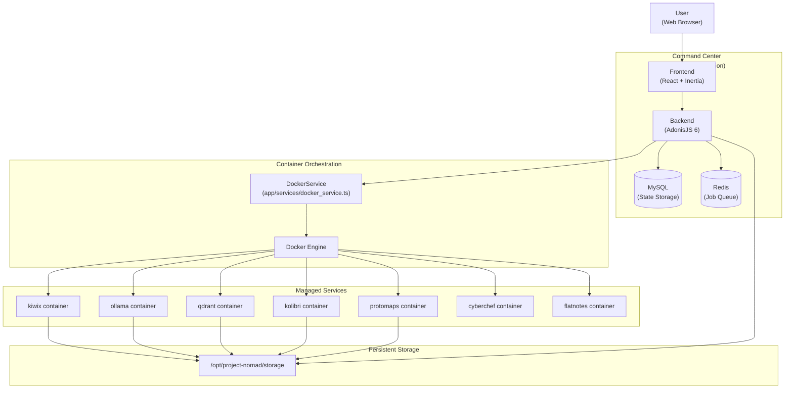

**Key Architectural Principles:**

1. **Container-Based Isolation** — Each service runs in its own Docker container with defined resource limits and network boundaries
2. **Centralized Management** — The `DockerService` class provides a unified API for container lifecycle operations (install, start, stop, update, remove)
3. **Shared Storage** — All services write to `/opt/project-nomad/storage`, enabling data persistence across container restarts
4. **Asynchronous Operations** — Long-running tasks (downloads, embeddings, benchmarks) execute via BullMQ job queues
5. **Real-Time Updates** — Server-Sent Events (SSE) via Transmit provide live progress updates to the frontend

For detailed architectural documentation, see [System Architecture Overview](#1.2).

**Sources:** Diagram 1 from high-level architecture context, [README.md:32-44]()

## Technology Stack

### Command Center Stack

The Admin Application uses a modern JavaScript monolith architecture:

| Layer | Technology | Version | Purpose |
|-------|-----------|---------|---------|
| **Frontend** | React | 19.1.0 | UI component framework |
| | Inertia.js | 2.0 | SPA bridge (eliminates REST API) |
| | Vite | 6.4 | Build tool and HMR |
| | TailwindCSS | 4.1 | Utility-first styling |
| | TanStack Query | 5.8 | Async state management |
| **Backend** | AdonisJS | 6.19 | Full-stack framework |
| | Lucid ORM | — | Database abstraction |
| | BullMQ | 5.6 | Job queue system |
| | VineJS | — | Schema validation |
| | Transmit | — | SSE real-time updates |
| **Data** | MySQL | 8.0 | Relational database |
| | Redis | 7 | Queue backend and cache |
| | Qdrant | — | Vector database (RAG) |

### Container Orchestration

| Component | Technology | Purpose |
|-----------|-----------|---------|
| Container Runtime | Docker Engine | Container execution |
| Orchestration | Docker Compose | Multi-container coordination |
| Image Registry | Docker Hub | Official image distribution |
| GPU Runtime | NVIDIA Container Toolkit | GPU passthrough (optional) |

### Integration Libraries

| Library | Purpose | Used For |
|---------|---------|----------|
| dockerode | Docker API client | Container management |
| ollama | Ollama API client | LLM inference |
| libzim | ZIM file reader | Wikipedia content parsing |
| systeminformation | Hardware metrics | System monitoring |
| tesseract.js | OCR engine | Image-to-text processing |
| pdf-parse | PDF extraction | Document parsing |
| sharp | Image processing | Image optimization |

For detailed stack documentation, see [Frontend Stack](#3.1) and [Backend Stack](#3.2).

**Sources:** Diagram 2 from high-level architecture context, [package.json:1-11]()

## Installation and Deployment

N.O.M.A.D. installs via a single shell script that automates the entire deployment process:

```bash
curl -fsSL https://raw.githubusercontent.com/Crosstalk-Solutions/project-nomad/refs/heads/main/install/install_nomad.sh | sudo bash
```

### Installation Process Flow

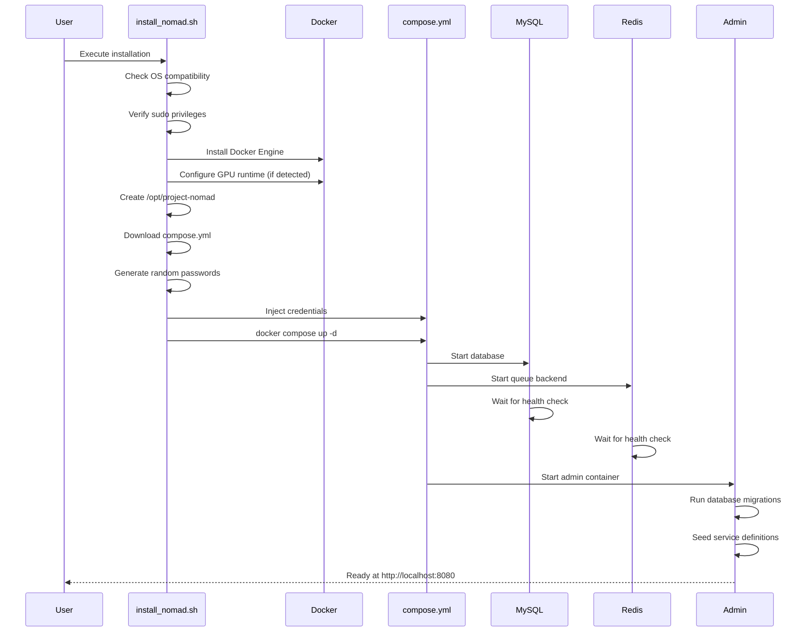

**Installation Artifacts:**

- **Directory:** `/opt/project-nomad`
- **Compose File:** `/opt/project-nomad/management_compose.yaml`
- **Storage:** `/opt/project-nomad/storage`
- **Helper Scripts:** `start_nomad.sh`, `stop_nomad.sh`, `update_nomad.sh`

After installation, users are redirected to the Easy Setup Wizard on first access for guided capability selection and content download.

For detailed installation documentation, see [Installation & Deployment](#2).

**Sources:** [README.md:19-29](), [README.md:144-167](), Diagram 6 from high-level architecture context

## Key System Components

### Service Management Layer

The `DockerService` class (`app/services/docker_service.ts`) is the core orchestration component:

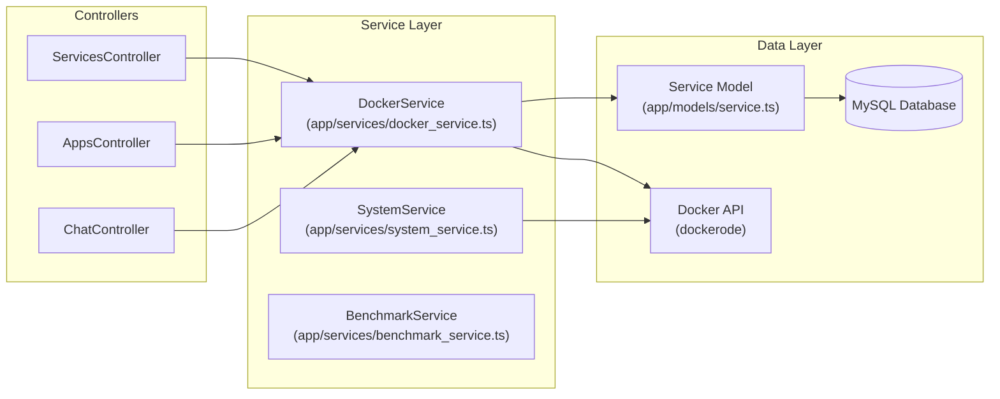

**Primary DockerService Methods:**

| Method | Purpose | Key Operations |
|--------|---------|----------------|
| `affectContainer()` | Install/start/stop/restart containers | State validation, dependency resolution, progress broadcasting |
| `createContainerPreflight()` | Pre-installation checks | GPU detection, dependency verification, image pulling |
| `updateContainer()` | Update existing containers | Rename old container, pull new image, rollback on failure |
| `forceReinstall()` | Reinstall with fresh state | Stop, remove, clear volumes, reinstall |
| `removeContainer()` | Uninstall service | Stop container, remove volumes, update database |

**State Management:**

- **Database:** `services` table tracks installed services, status, and metadata
- **In-Memory:** `activeInstallations` Set prevents concurrent installations
- **Progress Tracking:** Real-time SSE via Transmit broadcasts installation progress

For detailed service management documentation, see [Docker Service Management](#4.1).

**Sources:** Diagram 3 from high-level architecture context

### Content Management System

N.O.M.A.D. manages five distinct content types with unified download infrastructure:

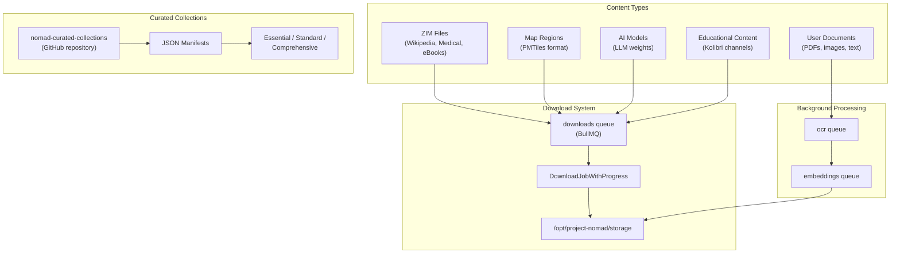

**Content Sources:**

- **ZIM Content:** Remote catalog at `library.kiwix.org`
- **Maps:** Curated PMTiles from GitHub manifests
- **AI Models:** Ollama model registry
- **Educational Content:** Kolibri Studio channels
- **User Documents:** Upload via Knowledge Base interface

**Download Queue Processing:**

- **Queue:** `downloads` (BullMQ)
- **Progress Events:** `download:progress`, `download:completed`, `download:failed`
- **Storage Location:** `/opt/project-nomad/storage/{service_name}/`

For detailed content management documentation, see [Content Management System](#4.3).

**Sources:** Diagram 4 from high-level architecture context

### AI and RAG Pipeline

The AI Assistant implements Retrieval-Augmented Generation (RAG) with local LLM inference:

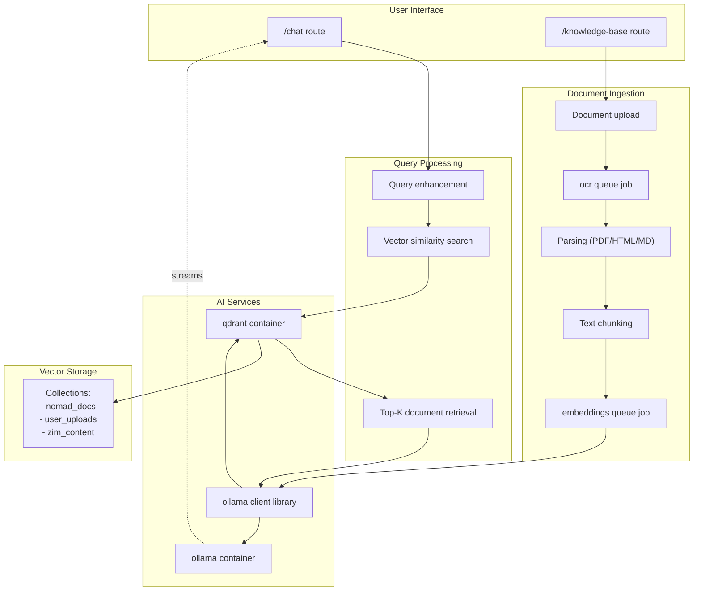

**RAG Pipeline Components:**

| Component | Implementation | Purpose |
|-----------|---------------|---------|
| Vector Database | Qdrant container | Stores document embeddings |
| Embedding Generation | Ollama API | Converts text to vectors |
| Semantic Search | Qdrant similarity search | Retrieves relevant context |
| LLM Inference | Ollama container | Generates responses |
| GPU Acceleration | NVIDIA Container Toolkit (optional) | 10-20x performance boost |

**Job Queues:**

- `ocr` — Image text extraction via Tesseract.js
- `embeddings` — Document vectorization via Ollama
- `benchmarks` — AI performance testing

For detailed AI documentation, see [AI Assistant & RAG System](#4.2).

**Sources:** Diagram 5 from high-level architecture context

## Data Storage and Persistence

All persistent data is stored under `/opt/project-nomad/storage`:

| Directory | Contents | Used By |
|-----------|----------|---------|
| `/storage/kiwix` | ZIM files (Wikipedia, medical, ebooks) | Kiwix container |
| `/storage/ollama` | LLM model weights | Ollama container |
| `/storage/qdrant` | Vector database files | Qdrant container |
| `/storage/kolibri` | Educational content, user progress | Kolibri container |
| `/storage/protomaps` | PMTiles map regions | ProtoMaps container |
| `/storage/flatnotes` | Note files | FlatNotes container |
| `/storage/uploads` | User-uploaded documents | Admin application |
| `/storage/app` | Admin application data | Admin application |

**Database Persistence:**

- **MySQL Data:** Docker volume `project-nomad_mysql_data`
- **Redis Data:** Docker volume `project-nomad_redis_data` (ephemeral job queue)

**Key Tables:**

- `services` — Installed service registry with status and configuration
- `downloads` — Download queue tracking with progress
- `zim_files` — Installed ZIM content metadata
- `map_regions` — Downloaded map region tracking
- `benchmark_results` — System performance test results
- `kv_store` — Key-value configuration storage

**Sources:** Diagram 1 from high-level architecture context, [README.md:32-44]()

## System Monitoring and Health

The `SystemService` class aggregates metrics from multiple sources:

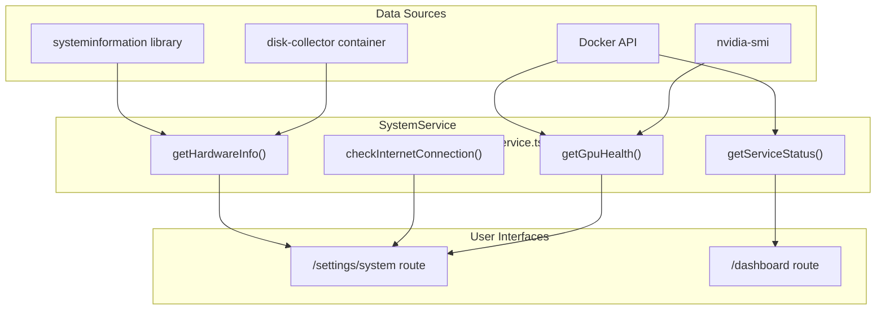

**Monitoring Capabilities:**

- **Hardware Metrics:** CPU model/usage, RAM usage, disk space, temperature
- **GPU Health:** NVIDIA GPU detection, passthrough verification, VRAM usage
- **Container Status:** Running/stopped state for all services
- **Internet Connectivity:** Cloudflare endpoint check (`1.1.1.1/cdn-cgi/trace`)
- **Disk Usage:** Per-directory storage consumption via disk-collector sidecar

For detailed monitoring documentation, see [System Monitoring](#4.4).

**Sources:** Diagram 7 from high-level architecture context

## Version and Release Information

- **Current Version:** Managed in [package.json:3]()
- **Versioning Scheme:** Semantic versioning (MAJOR.MINOR.PATCH)
- **Release Notes:** Human-readable changelog in `admin/docs/release-notes.md`
- **Update Mechanism:** Docker Compose pull and recreate via updater sidecar
- **Update Check:** Nightly job queries GitHub Releases API

**Sources:** [package.json:1-11](), [README.md:117-131]()

---

<<< SECTION: 1.1 Key Features & Capabilities [1-1-key-features-capabilities] >>>

# Key Features & Capabilities

<details>
<summary>Relevant source files</summary>

The following files were used as context for generating this wiki page:

- [README.md](README.md)
- [admin/docs/about.md](admin/docs/about.md)
- [admin/docs/faq.md](admin/docs/faq.md)
- [admin/docs/getting-started.md](admin/docs/getting-started.md)
- [admin/docs/release-notes.md](admin/docs/release-notes.md)
- [admin/docs/use-cases.md](admin/docs/use-cases.md)

</details>


This page provides a comprehensive listing of Project N.O.M.A.D.'s features and capabilities, organized by functional area. For architectural details about how these features are implemented, see [System Architecture Overview](#1.2). For installation and deployment procedures, see [Installation & Deployment](#2).

## Purpose and Scope

This document catalogs all major features available in Project N.O.M.A.D., including:
- Container-based application ecosystem
- Content management and download capabilities
- AI assistance and knowledge base features
- System monitoring and benchmarking tools
- User interface components and workflows

Each feature is described with references to the underlying implementation files and code entities.

---

## Core Capabilities Overview

Project N.O.M.A.D. provides seven primary capability categories, each powered by open-source container-based applications:

| Capability | Powered By | Container Name | Primary Use Cases |
|------------|-----------|----------------|-------------------|
| **Information Library** | Kiwix | `project-nomad-kiwix` | Offline Wikipedia, medical references, ebooks, survival guides |
| **AI Assistant** | Ollama + Qdrant | `project-nomad-ollama`<br>`project-nomad-qdrant` | Local LLM chat, document Q&A, semantic search (RAG) |
| **Education Platform** | Kolibri | `project-nomad-kolibri` | Khan Academy courses, progress tracking, multi-user learning |
| **Offline Maps** | ProtoMaps | `project-nomad-protomaps` | Regional map downloads, offline navigation, location search |
| **Data Tools** | CyberChef | `project-nomad-cyberchef` | Encryption, encoding, hashing, data analysis |
| **Notes** | FlatNotes | `project-nomad-flatnotes` | Markdown note-taking, local storage |
| **System Benchmark** | Built-in (sysbench) | `project-nomad-benchmark` | Hardware scoring, community leaderboard |

**Sources:**
- [README.md:34-57]()
- [admin/docs/getting-started.md:28-62]()

---

## Container-Based Application Ecosystem

### Service Definitions

All installable services are defined in the database through seeders. Each service record contains metadata about container configuration, dependencies, health checks, and installation requirements.

**Service Catalog Architecture:**

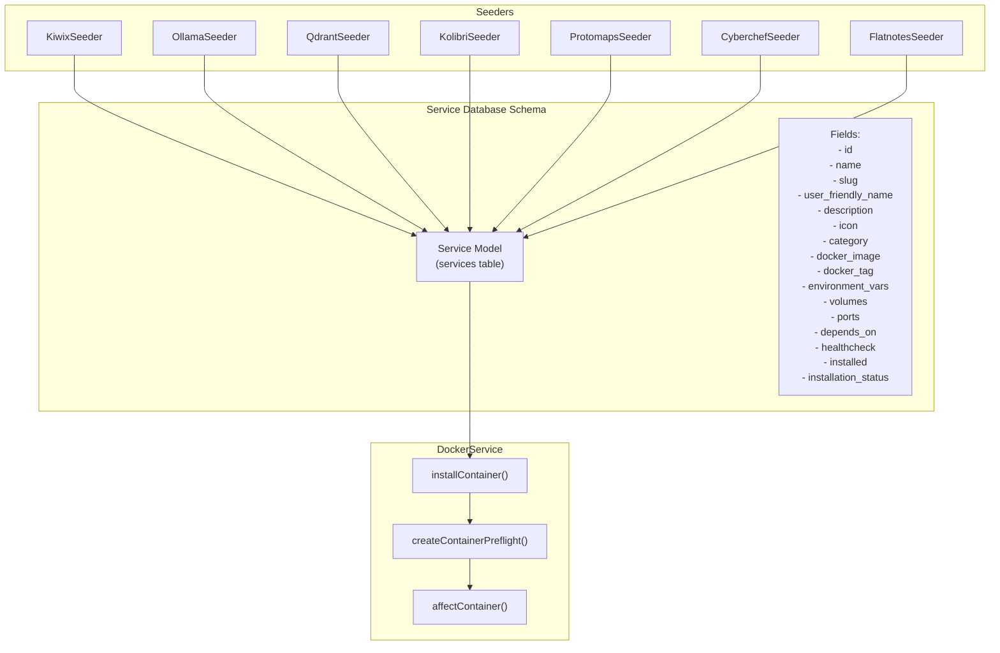

**Sources:**
- [admin/database/seeders/kiwix_seeder.ts]()
- [admin/database/seeders/ollama_seeder.ts]()
- [admin/database/seeders/qdrant_seeder.ts]()
- [admin/database/seeders/kolibri_seeder.ts]()
- [admin/database/seeders/protomaps_seeder.ts]()
- [admin/database/seeders/cyberchef_seeder.ts]()
- [admin/database/seeders/flatnotes_seeder.ts]()
- [admin/app/services/docker_service.ts]()

### Container Lifecycle Management

The `DockerService` class manages the complete lifecycle of all application containers:

| Operation | Method | Description |
|-----------|--------|-------------|
| **Install** | `installContainer()` | Pulls image, creates container with configuration, starts service |
| **Start** | `affectContainer('start')` | Starts a stopped container |
| **Stop** | `affectContainer('stop')` | Gracefully stops a running container |
| **Restart** | `affectContainer('restart')` | Stops and restarts a container |
| **Update** | `updateContainer()` | Pulls new image, renames old container, creates new container with health checks |
| **Force Reinstall** | `forceReinstallContainer()` | Removes container and volumes, reinstalls fresh |

**Container State Management:**

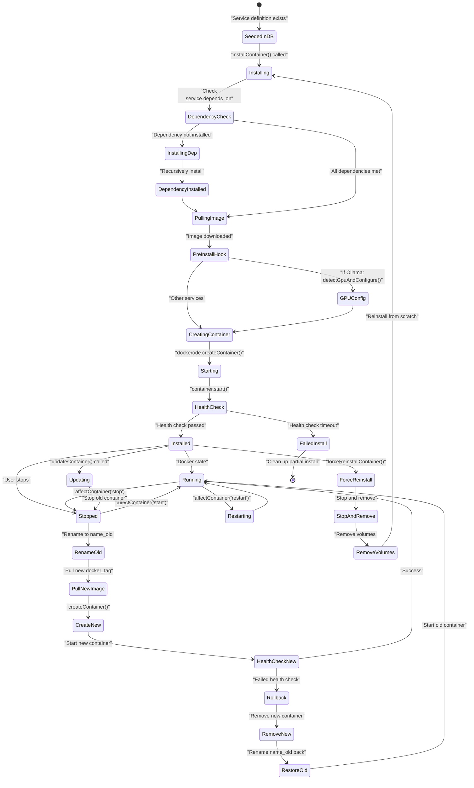

**Sources:**
- [admin/app/services/docker_service.ts]()
- [admin/app/controllers/services_controller.ts]()

### GPU Acceleration Support

N.O.M.A.D. automatically detects and configures GPU passthrough for AI workloads:

**GPU Detection and Configuration Flow:**

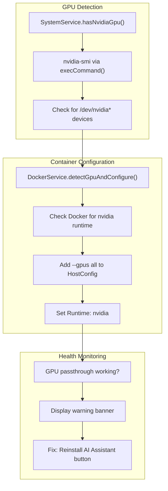

**Sources:**
- [admin/app/services/system_service.ts]()
- [admin/app/services/docker_service.ts]()
- [admin/app/utils/exec_command.ts]()

---

## Content Management Features

### ZIM File Management

N.O.M.A.D. provides comprehensive management of ZIM (Zeno IMproved) files, the compressed archive format used by Kiwix:

**Content Management Components:**

| Feature | Implementation | Description |
|---------|---------------|-------------|
| **Content Explorer** | `ZimController.remoteExplorer()` | Browse 1000+ available ZIM files from kiwix.org |
| **Curated Collections** | GitHub manifest system | Pre-defined content collections with tiers |
| **Wikipedia Selector** | Dedicated UI workflow | Smart package selection for Wikipedia content |
| **Download Management** | `BullMQ downloads queue` | Parallel downloads with progress tracking |
| **Local Library** | `ZimController.index()` | View and manage installed ZIM files |

**Curated Collection System:**

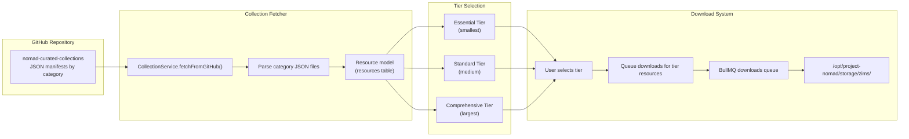

**Sources:**
- [admin/app/controllers/zim_controller.ts]()
- [admin/app/services/collection_service.ts]()
- [admin/database/migrations/create_resources_table.ts]()

### Map Region Management

ProtoMaps provides offline vector map rendering with downloadable regional tiles:

**Map Management Features:**

| Feature | Route | Description |
|---------|-------|-------------|
| **Map Viewer** | `/maps` | MapLibre GL-based interactive map |
| **Region Downloader** | `/settings/maps` | Download PMTiles for specific regions |
| **Curated Collections** | Manifest-based | Pre-defined region sets (US states, countries) |
| **Base Assets** | Auto-download | Base map tiles downloaded automatically if missing |

**Sources:**
- [admin/app/controllers/maps_controller.ts]()
- [admin/inertia/pages/maps/index.tsx]()

### Download Queue System

All content downloads are managed through BullMQ job queues with progress tracking:

**Download Job Pipeline:**

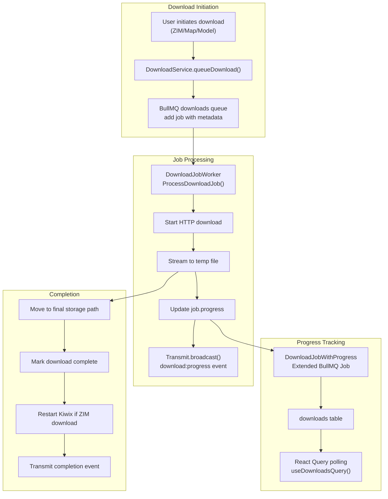

**Sources:**
- [admin/app/services/download_service.ts]()
- [admin/app/jobs/download_job.ts]()
- [admin/database/migrations/create_downloads_table.ts]()

---

## AI & Knowledge Management

### Built-In AI Chat Interface

N.O.M.A.D. includes a complete AI chat interface powered by Ollama, eliminating the need for separate tools like Open WebUI:

**AI Chat Components:**

| Component | Implementation | Purpose |
|-----------|---------------|---------|
| **Chat UI** | `/chat` page | React-based conversational interface |
| **Session Management** | `ChatSession` model | Persist chat history with titles |
| **Message Storage** | `ChatMessage` model | Store conversation messages |
| **Streaming Responses** | `Transmit.broadcastAs()` | Real-time response streaming |
| **Model Selection** | Dropdown from Ollama | Choose from downloaded LLM models |

**Sources:**
- [admin/app/controllers/chat_controller.ts]()
- [admin/inertia/pages/chat/index.tsx]()
- [admin/database/migrations/create_chat_sessions_table.ts]()
- [admin/database/migrations/create_chat_messages_table.ts]()

### RAG (Retrieval-Augmented Generation) Pipeline

The AI Assistant implements a complete RAG pipeline for document-aware responses:

**RAG Architecture:**

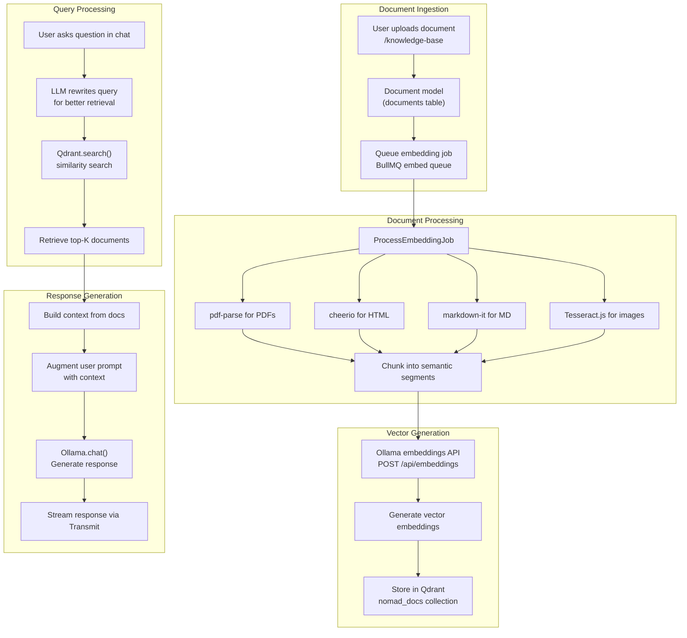

**Sources:**
- [admin/app/controllers/knowledge_base_controller.ts]()
- [admin/app/jobs/process_embedding_job.ts]()
- [admin/app/services/qdrant_service.ts]()
- [admin/app/services/ollama_service.ts]()

### Ollama Model Management

N.O.M.A.D. provides UI-based management of Ollama LLM models:

**Model Management Features:**

| Feature | Endpoint | Description |
|---------|----------|-------------|
| **Model List** | `GET /models` | Display installed models with sizes |
| **Model Download** | `POST /models` | Pull models from Ollama library |
| **Download Progress** | Transmit SSE | Real-time download progress |
| **Model Deletion** | `DELETE /models/:name` | Remove unused models |
| **Recommended Models** | API or fallback | Curated list of recommended models |

**Sources:**
- [admin/app/controllers/models_controller.ts]()
- [admin/app/services/ollama_service.ts]()

### Knowledge Base Document Management

Users can upload documents for AI-assisted retrieval:

**Document Lifecycle:**

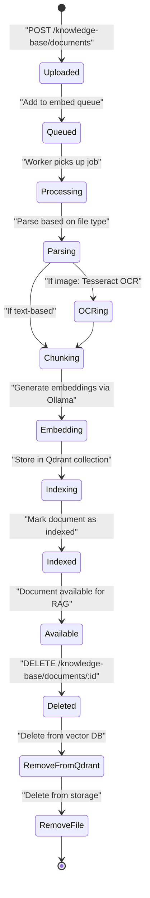

**Sources:**
- [admin/app/controllers/knowledge_base_controller.ts]()
- [admin/database/migrations/create_documents_table.ts]()

---

## System Management & Monitoring

### System Information Display

The `SystemService` aggregates hardware and runtime metrics from multiple sources:

**System Metrics Collection:**

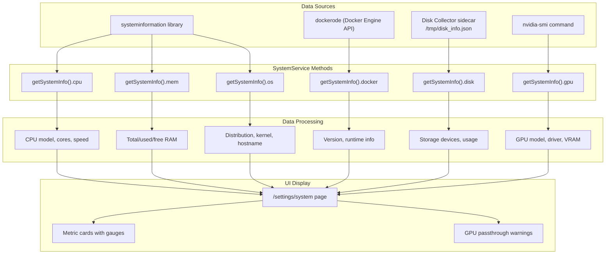

**Sources:**
- [admin/app/services/system_service.ts]()
- [admin/app/controllers/system_controller.ts]()
- [admin/inertia/pages/settings/system.tsx]()

### System Benchmark

N.O.M.A.D. includes a comprehensive benchmarking system with community leaderboard integration:

**Benchmark Components:**

| Component | Implementation | Metrics Tested |
|-----------|---------------|----------------|
| **CPU Benchmark** | `sysbench` container | Sysbench CPU test (events/sec) |
| **Memory Benchmark** | `sysbench` container | Memory throughput (MB/sec) |
| **Disk Benchmark** | `sysbench` container | Sequential write speed (MB/sec) |
| **AI Benchmark** | Ollama inference test | Tokens per second, time to first token |
| **NOMAD Score** | Weighted composite | Normalized 0-100 score across all metrics |

**Benchmark Execution Flow:**

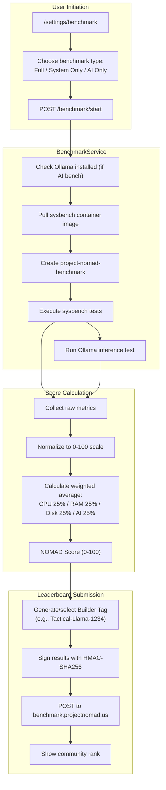

**Sources:**
- [admin/app/services/benchmark_service.ts]()
- [admin/app/controllers/benchmark_controller.ts]()
- [admin/inertia/pages/settings/benchmark.tsx]()

### Update Management

N.O.M.A.D. includes automated update checking and application:

**Update System Components:**

| Component | Implementation | Purpose |
|-----------|---------------|---------|
| **Nightly Checks** | Cron job (daily) | Check GitHub Releases API for new versions |
| **Update UI** | `/settings/update` | Display available updates |
| **Early Access** | KV store flag | Opt-in to release candidate builds |
| **Updater Sidecar** | `project-nomad-updater` | Execute Docker Compose updates |
| **App Updates** | Per-service update | Update individual containers via `DockerService.updateContainer()` |

**Sources:**
- [admin/app/controllers/settings_controller.ts]()
- [admin/start/scheduler.ts]()

---

## User Experience Features

### Easy Setup Wizard

First-time users are guided through a four-step configuration wizard:

**Wizard Steps:**

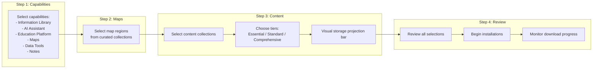

**Sources:**
- [admin/inertia/pages/easy-setup/index.tsx]()
- [admin/app/controllers/easy_setup_controller.ts]()

### Command Center Dashboard

The main dashboard provides an at-a-glance view of all installed capabilities:

**Dashboard Components:**

| Component | Implementation | Display Logic |
|-----------|---------------|---------------|
| **Capability Cards** | Dynamic grid layout | Shows installed services with user-friendly names |
| **System Items** | Built-in features | Maps, AI Chat, Content Explorer (always visible) |
| **Service Status** | Real-time polling | Green/red indicators for running/stopped containers |
| **Quick Actions** | Card buttons | Direct links to launch services |

**Sources:**
- [admin/inertia/pages/dashboard.tsx]()
- [admin/app/controllers/home_controller.ts]()

### Real-Time Progress Tracking

N.O.M.A.D. uses Server-Sent Events (Transmit) for real-time updates:

**Transmit Event Channels:**

| Channel | Events | Use Case |
|---------|--------|----------|
| `install` | `initializing`, `pulling`, `creating`, `starting`, `completed`, `failed` | Service installation progress |
| `download` | `progress`, `completed`, `failed` | Download progress (ZIMs, maps, models) |
| `embedding` | `progress`, `completed`, `failed` | Document embedding progress |
| `chat` | `message`, `done` | AI response streaming |

**Sources:**
- [admin/app/controllers/services_controller.ts]()
- [admin/app/jobs/download_job.ts]()
- [admin/app/controllers/chat_controller.ts]()

### Navigation & Documentation

N.O.M.A.D. includes comprehensive in-app documentation:

**Documentation System:**

| Page | Route | Content |
|------|-------|---------|
| **Getting Started** | `/docs/getting-started` | User guide for first-time setup |
| **FAQ** | `/docs/faq` | Common questions and troubleshooting |
| **Use Cases** | `/docs/use-cases` | Application scenarios and examples |
| **Release Notes** | `/docs/release-notes` | Version history and changelog |
| **About** | `/docs/about` | Project information and links |

**Sources:**
- [admin/docs/getting-started.md]()
- [admin/docs/faq.md]()
- [admin/docs/use-cases.md]()
- [admin/docs/release-notes.md]()
- [admin/docs/about.md]()

---

## Infrastructure Services

N.O.M.A.D. includes three infrastructure containers for monitoring and maintenance:

**Infrastructure Service Details:**

```mermaid
graph TB
    subgraph "Dozzle - Log Viewer"
        DozzleContainer["project-nomad-dozzle<br/>Container log aggregation"]
        DozzleUI["Web UI on port 9999"]
        ViewLogs["Real-time log streaming<br/>for all containers"]
    end
    
    subgraph "Updater Sidecar"
        UpdaterContainer["project-nomad-updater<br/>System update executor"]
        ComposeAccess["Mounts Docker socket<br/>and compose.yml"]
        UpdateCommand["Executes docker compose pull<br/>and recreate commands"]
    end
    
    subgraph "Disk Collector"
        DiskContainer["project-nomad-disk-collector<br/>Filesystem monitor"]
        ReadDiskInfo["Reads /tmp/disk_info.json"]
        WriteStats["Writes host disk stats<br/>for admin container"]
    end
    
    DozzleContainer --> DozzleUI
    DozzleUI --> ViewLogs
    
    UpdaterContainer --> ComposeAccess
    ComposeAccess --> UpdateCommand
    
    DiskContainer --> ReadDiskInfo
    ReadDiskInfo --> WriteStats
```

**Sources:**
- [install/management_compose.yaml]()

---

<<< SECTION: 1.2 System Architecture Overview [1-2-system-architecture-overview] >>>

# System Architecture Overview

<details>
<summary>Relevant source files</summary>

The following files were used as context for generating this wiki page:

- [README.md](README.md)
- [admin/docs/about.md](admin/docs/about.md)
- [admin/docs/faq.md](admin/docs/faq.md)
- [admin/docs/getting-started.md](admin/docs/getting-started.md)
- [admin/docs/use-cases.md](admin/docs/use-cases.md)
- [admin/package-lock.json](admin/package-lock.json)
- [admin/package.json](admin/package.json)
- [install/install_nomad.sh](install/install_nomad.sh)
- [install/management_compose.yaml](install/management_compose.yaml)
- [install/migrate-disk-collector.md](install/migrate-disk-collector.md)
- [install/migrate-disk-collector.sh](install/migrate-disk-collector.sh)
- [install/uninstall_nomad.sh](install/uninstall_nomad.sh)
- [install/update_nomad.sh](install/update_nomad.sh)

</details>


## Purpose and Scope

This document describes Project N.O.M.A.D.'s architectural design at a system level, explaining the hub-and-spoke container orchestration pattern, technology stack layers, and data flow. For detailed information about individual technical components (frontend, backend, databases), see [Technical Architecture](#3). For information about specific subsystems like Docker service management or the AI assistant, see [Core Systems](#4).

## Hub-and-Spoke Architecture Pattern

Project N.O.M.A.D. implements a **hub-and-spoke architecture** where a central Admin Application (the "Command Center") orchestrates all other containerized services. This pattern provides centralized management while maintaining service isolation.

### System Components

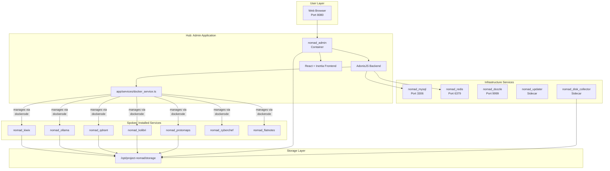

**Sources:** [install/management_compose.yaml:1-108](), [README.md:32-45]()

The Admin Application serves three primary functions:
1. **User Interface Hub** - Single point of access for all capabilities
2. **Service Orchestrator** - Manages container lifecycle via `DockerService`
3. **Data Coordinator** - Centralizes state in MySQL and job queues in Redis

All installed services are managed as Docker containers with the naming convention `nomad_<service_name>`, defined in the `database/seeders/service_seeder.ts` and orchestrated through the `DockerService` class at [app/services/docker_service.ts]().

## Container-Based Orchestration

### Docker Compose Stack

The management layer is defined in a Docker Compose file that specifies the core infrastructure services required for the Admin Application to function.

| Container Name | Image | Purpose | Exposed Port |
|---------------|-------|---------|--------------|
| `nomad_admin` | `ghcr.io/crosstalk-solutions/project-nomad:latest` | Admin application (AdonisJS + React) | 8080 |
| `nomad_mysql` | `mysql:8.0` | Relational database for system state | 3306 |
| `nomad_redis` | `redis:7-alpine` | Job queue backend and caching | 6379 |
| `nomad_dozzle` | `amir20/dozzle:v10.0` | Log viewer for all containers | 9999 |
| `nomad_updater` | Custom build | Self-update sidecar | - |
| `nomad_disk_collector` | `ghcr.io/crosstalk-solutions/project-nomad-disk-collector:latest` | Host disk monitoring sidecar | - |

**Sources:** [install/management_compose.yaml:1-108]()

### Docker Socket Access

The Admin container has direct access to the Docker daemon via a bind-mount of `/var/run/docker.sock`, enabling it to create, manage, and monitor other containers dynamically. This access is abstracted through the `DockerService` class, which uses the `dockerode` library.

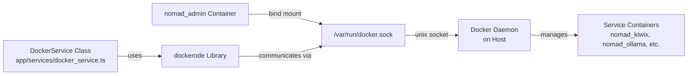

**Sources:** [install/management_compose.yaml:14](), [admin/package.json:97]()

### Service Management Abstraction

The `DockerService` class at [app/services/docker_service.ts]() provides high-level methods for container lifecycle management:

| Method | Purpose | Example Usage |
|--------|---------|---------------|
| `affectContainer()` | Install, start, stop, restart a service | Container state changes |
| `createContainerPreflight()` | Validate dependencies before creation | Pre-install checks |
| `updateContainer()` | Pull new image and recreate container | Service updates |
| `forceReinstall()` | Remove and recreate container | GPU configuration changes |
| `getContainerByServiceName()` | Retrieve container instance | Status queries |
| `getServiceStatus()` | Check running state | UI status display |

**Sources:** [admin/package.json:97]()

## Technology Stack Layers

Project N.O.M.A.D. is organized into distinct technology layers that communicate via well-defined interfaces.

### Layer Architecture

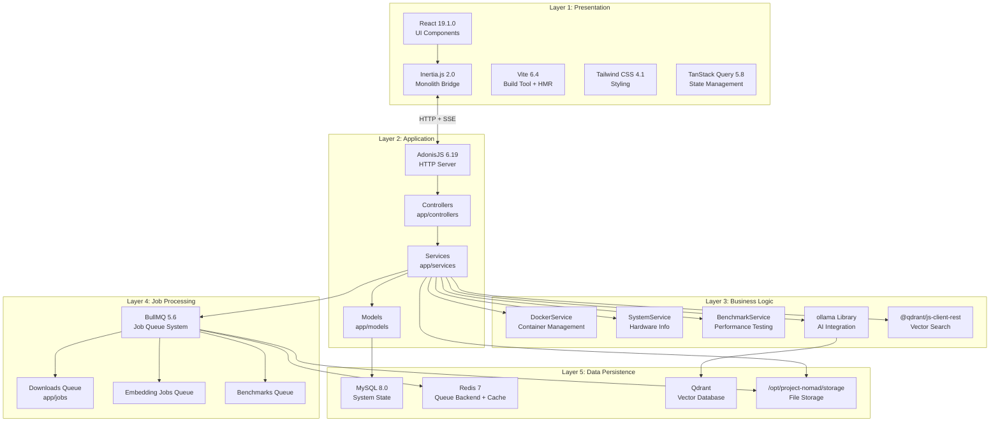

**Sources:** [admin/package.json:63-125]()

### Key Dependencies

The technology stack is defined in [admin/package.json:63-125]() with the following core dependencies:

**Backend Runtime:**
- `@adonisjs/core@^6.18.0` - Web framework
- `@adonisjs/lucid@^21.8.2` - ORM for MySQL
- `bullmq@^5.65.1` - Job queue system
- `dockerode@^4.0.7` - Docker API client
- `systeminformation@^5.30.8` - Hardware metrics

**Frontend Runtime:**
- `react@^19.1.0` - UI framework
- `@inertiajs/react@^2.0.13` - Server-driven SPA
- `@tanstack/react-query@^5.81.5` - State management
- `vite@^6.4.1` - Build tool

**Integration Libraries:**
- `ollama@^0.6.3` - AI model client
- `@qdrant/js-client-rest@^1.16.2` - Vector database client
- `@openzim/libzim@^4.0.0` - ZIM file reader

**Sources:** [admin/package.json:63-125]()

## Persistent Storage Strategy

All services share a common persistent storage location at `/opt/project-nomad/storage` on the host filesystem. This centralized storage approach ensures data durability across container restarts and enables data sharing between services.

### Storage Directory Structure

| Path | Purpose | Access Pattern |
|------|---------|----------------|
| `/opt/project-nomad/storage/kiwix` | ZIM files for offline content | Read by `nomad_kiwix` |
| `/opt/project-nomad/storage/ollama` | AI model weights | Read/write by `nomad_ollama` |
| `/opt/project-nomad/storage/qdrant` | Vector embeddings database | Read/write by `nomad_qdrant` |
| `/opt/project-nomad/storage/kolibri` | Educational content | Read/write by `nomad_kolibri` |
| `/opt/project-nomad/storage/protomaps` | PMTiles map regions | Read by `nomad_protomaps` |
| `/opt/project-nomad/storage/logs` | Application logs | Written by `nomad_admin` |
| `/opt/project-nomad/storage/tmp` | Temporary files | Read/write by `nomad_admin` |
| `/opt/project-nomad/storage/uploads` | User-uploaded documents | Read/write by `nomad_admin` |

**Sources:** [install/management_compose.yaml:13](), [install/install_nomad.sh:376-380]()

### Volume Mount Pattern

Each container mounts the shared storage directory with service-specific subdirectories:

```mermaid
graph TB
    HostStorage["/opt/project-nomad/storage<br/>Host Filesystem"]
    
    AdminMount["/app/storage<br/>nomad_admin"]
    KiwixMount["/data<br/>nomad_kiwix"]
    OllamaMount["/root/.ollama<br/>nomad_ollama"]
    QdrantMount["/qdrant/storage<br/>nomad_qdrant"]
    KolibriMount["/root/.kolibri<br/>nomad_kolibri"]
    
    HostStorage -->|"bind mount"| AdminMount
    HostStorage -->|"bind mount<br/>/storage/kiwix"| KiwixMount
    HostStorage -->|"bind mount<br/>/storage/ollama"| OllamaMount
    HostStorage -->|"bind mount<br/>/storage/qdrant"| QdrantMount
    HostStorage -->|"bind mount<br/>/storage/kolibri"| KolibriMount
```

**Sources:** [install/management_compose.yaml:12-13]()

The Admin container has full access to the entire storage directory, while service containers have access only to their designated subdirectories. This is configured in the container definitions within `database/seeders/service_seeder.ts`.

## Infrastructure Services

Project N.O.M.A.D. includes three sidecar containers that provide infrastructure capabilities without direct user interaction.

### Dozzle - Log Aggregation

The `nomad_dozzle` container provides a web-based log viewer accessible at port 9999. It monitors all container logs by reading from the Docker socket.

**Configuration:** [install/management_compose.yaml:45-55]()

**Features:**
- Real-time log streaming from all containers
- Container action buttons (restart, stop)
- Web-based shell access to containers
- No configuration required in Admin application

### Updater Sidecar - Self-Update Mechanism

The `nomad_updater` container watches for update triggers from the Admin application via a shared volume at `/app/update-shared`. When triggered, it pulls the latest images and recreates the management stack.

**How it works:**
1. Admin application writes a trigger file to the shared volume
2. Updater sidecar detects the trigger via file watch
3. Updater executes `docker compose pull` and `docker compose up -d --force-recreate`
4. Admin container is recreated with the new image

**Configuration:** [install/management_compose.yaml:87-96]()

**Sources:** [install/management_compose.yaml:87-96]()

### Disk Collector - Storage Monitoring

The `nomad_disk_collector` container monitors host filesystem usage and writes statistics to `/opt/project-nomad/storage/nomad-disk-info.json` every 2 minutes. The Admin application reads this file to display storage information in the UI.

**Mount Strategy:**
- Read-only bind mount of host root filesystem (`/:/host:ro,rslave`)
- Write access to shared storage directory

The `rslave` propagation mode ensures that `/sys` and `/proc` submounts are visible inside the container, enabling accurate disk usage reporting without requiring privileged access or `SYS_ADMIN` capability.

**Configuration:** [install/management_compose.yaml:97-105]()

**Migration Note:** Versions prior to the disk collector sidecar used a host-based process with a bind mount to `/tmp/nomad-disk-info.json`. This was replaced due to fragility on host reboots. See [install/migrate-disk-collector.md]() for migration details.

**Sources:** [install/management_compose.yaml:97-105](), [install/migrate-disk-collector.md:1-40]()

## Data Flow Patterns

### Request Processing Flow

User interactions flow through multiple layers before reaching external services or the Docker daemon.

```mermaid
sequenceDiagram
    participant Browser
    participant InertiaFrontend as "Inertia Frontend<br/>React Components"
    participant AdonisBackend as "AdonisJS Backend<br/>HTTP Server"
    participant Controller as "Controller<br/>app/controllers"
    participant Service as "Service Layer<br/>app/services"
    participant DockerService as "DockerService<br/>docker_service.ts"
    participant Docker as "Docker Daemon"
    participant Database as "MySQL Database"
    
    Browser->>InertiaFrontend: User Action
    InertiaFrontend->>AdonisBackend: HTTP Request
    AdonisBackend->>Controller: Route Handler
    Controller->>Service: Business Logic Call
    Service->>Database: Query/Update State
    Database-->>Service: Data
    Service->>DockerService: Container Operation
    DockerService->>Docker: dockerode API Call
    Docker-->>DockerService: Container Status
    DockerService-->>Service: Result
    Service-->>Controller: Response Data
    Controller-->>AdonisBackend: Inertia Response
    AdonisBackend-->>InertiaFrontend: JSON Payload
    InertiaFrontend-->>Browser: Re-render UI
```

**Sources:** [admin/package.json:66-68]()

### Real-Time Progress Updates

Long-running operations like service installations and downloads use Server-Sent Events (SSE) via the `@adonisjs/transmit` library to provide real-time progress updates without polling.

```mermaid
sequenceDiagram
    participant Browser
    participant TransmitClient as "Transmit Client<br/>@adonisjs/transmit-client"
    participant AdonisBackend as "AdonisJS Backend"
    participant TransmitServer as "Transmit Server<br/>@adonisjs/transmit"
    participant BullMQ as "BullMQ Queue"
    participant Job as "Background Job<br/>app/jobs"
    
    Browser->>TransmitClient: Subscribe to Channel
    TransmitClient->>TransmitServer: SSE Connection
    
    Browser->>AdonisBackend: Initiate Operation
    AdonisBackend->>BullMQ: Enqueue Job
    BullMQ->>Job: Execute Job
    
    loop Progress Updates
        Job->>TransmitServer: Broadcast Progress Event
        TransmitServer->>TransmitClient: SSE Message
        TransmitClient->>Browser: Update UI
    end
    
    Job->>TransmitServer: Broadcast Complete Event
    TransmitServer->>TransmitClient: SSE Message
    TransmitClient->>Browser: Final UI Update
```

**Sources:** [admin/package.json:72-73]()

### Job Queue Architecture

Background operations are processed through BullMQ queues backed by Redis. The Admin application defines multiple specialized queues:

| Queue Name | Purpose | Worker Script |
|------------|---------|---------------|
| `downloads` | ZIM files, maps, content downloads | `npm run work:downloads` |
| `model-downloads` | AI model downloads | `npm run work:model-downloads` |
| `benchmarks` | System performance benchmarks | `npm run work:benchmarks` |
| `embeds` | Document embedding generation | (Started automatically by Admin) |
| `ocr` | Optical character recognition | (Started automatically by Admin) |

**Sources:** [admin/package.json:16-19]()

Queue workers can run independently of the web server, enabling distributed processing. Jobs broadcast progress via Transmit SSE channels as they execute.

## Network Topology

All containers operate on the `project-nomad_default` Docker network created by Docker Compose. The Admin container can reach service containers via their container names (e.g., `http://nomad_ollama:11434`), while services can reach each other for inter-service communication (e.g., Ollama calling Qdrant for RAG).

The Admin container also has access to `host.docker.internal`, which resolves to the Docker host's IP address, enabling access to services running directly on the host.

**Sources:** [install/management_compose.yaml:8-9]()

---

This architecture enables Project N.O.M.A.D. to provide a unified management interface for disparate containerized services while maintaining isolation, modularity, and data persistence across the entire system.

---

<<< SECTION: 2 Installation & Deployment [2-installation-deployment] >>>

# Installation & Deployment

<details>
<summary>Relevant source files</summary>

The following files were used as context for generating this wiki page:

- [README.md](README.md)
- [admin/docs/about.md](admin/docs/about.md)
- [admin/docs/faq.md](admin/docs/faq.md)
- [admin/docs/getting-started.md](admin/docs/getting-started.md)
- [admin/docs/use-cases.md](admin/docs/use-cases.md)
- [install/install_nomad.sh](install/install_nomad.sh)
- [install/management_compose.yaml](install/management_compose.yaml)
- [install/migrate-disk-collector.md](install/migrate-disk-collector.md)
- [install/migrate-disk-collector.sh](install/migrate-disk-collector.sh)
- [install/uninstall_nomad.sh](install/uninstall_nomad.sh)
- [install/update_nomad.sh](install/update_nomad.sh)

</details>


This page provides a technical overview of Project N.O.M.A.D.'s installation and deployment architecture. It covers the automated installation process, the Docker Compose infrastructure stack, and the runtime deployment model.

For detailed walkthroughs and configuration specifics, see:
- **Installation Process**: [2.1](#2.1) - Step-by-step breakdown of `install_nomad.sh`
- **Docker Compose Stack**: [2.2](#2.2) - Detailed service definitions in `management_compose.yaml`
- **Easy Setup Wizard**: [2.3](#2.3) - First-time configuration and content selection

---

## Deployment Architecture Overview

Project N.O.M.A.D. uses a hub-and-spoke container architecture where the Admin container (`nomad_admin`) serves as the central orchestration point for all other services. The deployment consists of two layers: the **management layer** (infrastructure services) and the **application layer** (user-installed services like Kiwix, Ollama, etc.).

```mermaid
graph TB
    subgraph "Installation Process"
        InstallScript["install_nomad.sh<br/>Bash Installation Script"]
    end
    
    subgraph "Management Layer - /opt/project-nomad"
        ComposeFile["compose.yml<br/>Docker Compose Definition"]
        Storage["/opt/project-nomad/storage<br/>Persistent Data Directory"]
        MySQLData["/opt/project-nomad/mysql<br/>MySQL Data"]
        RedisData["/opt/project-nomad/redis<br/>Redis Data"]
    end
    
    subgraph "Running Containers - project-nomad Network"
        Admin["nomad_admin<br/>ghcr.io/.../project-nomad:latest<br/>Port 8080"]
        MySQL["nomad_mysql<br/>mysql:8.0<br/>Port 3306"]
        Redis["nomad_redis<br/>redis:7-alpine<br/>Port 6379"]
        Dozzle["nomad_dozzle<br/>amir20/dozzle:v10.0<br/>Port 9999"]
        Updater["nomad_updater<br/>Built from sidecar-updater<br/>No exposed ports"]
        DiskCollector["nomad_disk_collector<br/>ghcr.io/.../disk-collector:latest<br/>No exposed ports"]
    end
    
    subgraph "Docker Host Resources"
        DockerSocket["/var/run/docker.sock<br/>Docker API Access"]
        HostFS["/:/host:ro,rslave<br/>Read-only Host Filesystem"]
    end
    
    InstallScript -->|"Creates & configures"| ComposeFile
    InstallScript -->|"Generates secrets"| ComposeFile
    InstallScript -->|"docker compose up -d"| Admin
    
    ComposeFile -->|"Defines"| Admin
    ComposeFile -->|"Defines"| MySQL
    ComposeFile -->|"Defines"| Redis
    ComposeFile -->|"Defines"| Dozzle
    ComposeFile -->|"Defines"| Updater
    ComposeFile -->|"Defines"| DiskCollector
    
    Admin -->|"Mounts"| Storage
    Admin -->|"Mounts"| DockerSocket
    MySQL -->|"Mounts"| MySQLData
    Redis -->|"Mounts"| RedisData
    Dozzle -->|"Mounts"| DockerSocket
    Updater -->|"Mounts"| DockerSocket
    DiskCollector -->|"Mounts"| HostFS
    DiskCollector -->|"Writes to"| Storage
    
    Admin -->|"depends_on: service_healthy"| MySQL
    Admin -->|"depends_on: service_healthy"| Redis
```

**Sources:** [install/management_compose.yaml:1-108](), [install/install_nomad.sh:364-407]()

---

## Installation Flow

The installation process is automated by `install_nomad.sh`, which performs pre-flight checks, installs dependencies, configures the environment, and deploys the management stack.

```mermaid
sequenceDiagram
    participant User
    participant install_nomad.sh
    participant Host as "Host System"
    participant Docker
    participant ComposeFile as "compose.yml"
    participant Containers
    
    User->>install_nomad.sh: "curl | sudo bash"
    
    rect rgb(245, 245, 245)
        Note over install_nomad.sh,Host: Pre-flight Checks (Lines 570-574)
        install_nomad.sh->>Host: check_is_debian_based()
        install_nomad.sh->>Host: check_is_bash()
        install_nomad.sh->>Host: check_has_sudo()
        install_nomad.sh->>Host: ensure_dependencies_installed()
    end
    
    rect rgb(245, 245, 245)
        Note over install_nomad.sh,Docker: Docker Setup (Lines 579-580)
        install_nomad.sh->>Docker: ensure_docker_installed()
        Note over install_nomad.sh: Uses get.docker.com convenience script
        install_nomad.sh->>Docker: setup_nvidia_container_toolkit()
        Note over install_nomad.sh: Non-blocking GPU setup
    end
    
    rect rgb(245, 245, 245)
        Note over install_nomad.sh,ComposeFile: Configuration (Lines 581-586)
        install_nomad.sh->>Host: get_local_ip()
        install_nomad.sh->>Host: create_nomad_directory()
        Note over install_nomad.sh: Creates /opt/project-nomad
        install_nomad.sh->>Host: download_wait_for_it_script()
        install_nomad.sh->>Host: download_entrypoint_script()
        install_nomad.sh->>Host: download_sidecar_files()
        install_nomad.sh->>Host: download_helper_scripts()
        install_nomad.sh->>ComposeFile: download_management_compose_file()
        Note over install_nomad.sh: Downloads from GitHub
        install_nomad.sh->>ComposeFile: sed -i "s|APP_KEY=replaceme|..."
        Note over install_nomad.sh: Injects random passwords
    end
    
    rect rgb(245, 245, 245)
        Note over install_nomad.sh,Containers: Container Startup (Lines 587-588)
        install_nomad.sh->>Docker: start_management_containers()
        Note over Docker: docker compose -p project-nomad up -d
        Docker->>Containers: Pull images
        Docker->>Containers: Create nomad_mysql (healthcheck)
        Docker->>Containers: Create nomad_redis (healthcheck)
        Docker->>Containers: Create nomad_admin (depends_on healthy)
        Docker->>Containers: Create nomad_dozzle
        Docker->>Containers: Create nomad_updater
        Docker->>Containers: Create nomad_disk_collector
        Containers->>Containers: entrypoint.sh runs migrations
    end
    
    install_nomad.sh->>User: "Navigate to http://localhost:8080"
```

**Sources:** [install/install_nomad.sh:569-590](), [install/install_nomad.sh:486-493]()

### Key Installation Functions

The installation script is organized into specialized functions that handle distinct responsibilities:

| Function | Purpose | Lines |
|----------|---------|-------|
| `check_is_debian_based()` | Validates OS compatibility | [84-92]() |
| `ensure_dependencies_installed()` | Installs `curl` and other required packages | [94-123]() |
| `ensure_docker_installed()` | Installs Docker via convenience script | [144-203]() |
| `setup_nvidia_container_toolkit()` | Configures GPU support (non-blocking) | [205-328]() |
| `generateRandomPass()` | Generates secure random passwords | [134-142]() |
| `create_nomad_directory()` | Creates `/opt/project-nomad` structure | [364-381]() |
| `download_management_compose_file()` | Fetches and configures `compose.yml` | [383-407]() |
| `start_management_containers()` | Launches Docker Compose stack | [486-493]() |

**Sources:** [install/install_nomad.sh:84-493]()

---

## Management Stack Components

The Docker Compose stack defines six services that form the management layer. Each service has a specific role in the system's operation.

### Service Definitions

```mermaid
graph TB
    subgraph "Management Services - compose.yml"
        Admin["admin<br/>container_name: nomad_admin<br/>image: ghcr.io/.../project-nomad:latest<br/>ports: 8080:8080"]
        MySQL["mysql<br/>container_name: nomad_mysql<br/>image: mysql:8.0<br/>ports: 3306:3306"]
        Redis["redis<br/>container_name: nomad_redis<br/>image: redis:7-alpine<br/>ports: 6379:6379"]
        Dozzle["dozzle<br/>container_name: nomad_dozzle<br/>image: amir20/dozzle:v10.0<br/>ports: 9999:8080"]
        Updater["updater<br/>container_name: nomad_updater<br/>build: ./sidecar-updater"]
        DiskCollector["disk-collector<br/>container_name: nomad_disk_collector<br/>image: ghcr.io/.../disk-collector:latest"]
    end
    
    Admin -->|"DB_HOST=mysql<br/>DB_PORT=3306"| MySQL
    Admin -->|"REDIS_HOST=redis<br/>REDIS_PORT=6379"| Redis
    Admin -->|"Monitors via API"| Dozzle
    Admin -->|"Triggers via shared volume"| Updater
    Admin -->|"Reads nomad-disk-info.json"| DiskCollector
    
    MySQL -->|"healthcheck: mysqladmin ping"| MySQL
    Redis -->|"healthcheck: redis-cli ping"| Redis
    Admin -->|"healthcheck: curl /api/health"| Admin
```

**Sources:** [install/management_compose.yaml:2-105]()

### Admin Container Configuration

The `nomad_admin` container is the central orchestration service running the AdonisJS backend and React frontend.

| Configuration | Value | Purpose |
|---------------|-------|---------|
| **Image** | `ghcr.io/crosstalk-solutions/project-nomad:latest` | Pre-built container image |
| **Container Name** | `nomad_admin` | Fixed identifier for service discovery |
| **Restart Policy** | `unless-stopped` | Auto-restart on failure |
| **Port Mapping** | `8080:8080` | Web interface access |
| **Volume Mounts** | `/opt/project-nomad/storage:/app/storage` | Persistent data storage |
| | `/var/run/docker.sock:/var/run/docker.sock` | Docker API access |
| | `nomad-update-shared:/app/update-shared` | Updater communication |
| **Environment** | `NODE_ENV=production` | Production mode |
| | `DB_HOST=mysql`, `DB_PORT=3306` | Database connection |
| | `REDIS_HOST=redis`, `REDIS_PORT=6379` | Redis connection |
| | `APP_KEY=<random>` | Application encryption key |
| **Dependencies** | `mysql: condition: service_healthy` | Wait for MySQL |
| | `redis: condition: service_healthy` | Wait for Redis |
| **Entrypoint** | `/usr/local/bin/entrypoint.sh` | Custom startup script |
| **Healthcheck** | `curl -f http://localhost:8080/api/health` | Service health validation |

**Sources:** [install/management_compose.yaml:3-44]()

### Database Services

**MySQL** provides relational data storage for service definitions, installation status, and system configuration:

- **Data Persistence**: `/opt/project-nomad/mysql:/var/lib/mysql` [68]()
- **Credentials**: Generated randomly during installation [393-404]()
- **Healthcheck**: `mysqladmin ping` every 30 seconds [69-73]()

**Redis** serves dual purposes as cache and job queue backend for BullMQ:

- **Data Persistence**: `/opt/project-nomad/redis:/data` [81]()
- **Port**: 6379 exposed for debugging [79]()
- **Healthcheck**: `redis-cli ping` every 30 seconds [82-86]()

**Sources:** [install/management_compose.yaml:56-86]()

### Infrastructure Sidecars

**Dozzle** (`nomad_dozzle`) provides a web-based log viewer for all containers:

- **Port**: 9999 for log viewer interface [50]()
- **Docker Socket**: Read-only access to container logs [52]()
- **Features**: Action buttons enabled, web shell access [54-55]()

**Updater** (`nomad_updater`) handles self-update operations:

- **Build Context**: `./sidecar-updater` with custom Dockerfile [88-90]()
- **Docker Socket**: Write access to modify compose stack [94]()
- **Shared Volume**: `nomad-update-shared` for admin communication [96]()
- **Update Mechanism**: Triggered via file in shared volume [96]()

**Disk Collector** (`nomad_disk_collector`) monitors host filesystem usage:

- **Host Mount**: `/:/host:ro,rslave` for read-only filesystem access [103]()
- **Output**: Writes `nomad-disk-info.json` to storage directory [104]()
- **Isolation**: Separate container for security and stability [103]()

**Sources:** [install/management_compose.yaml:45-104]()

---

## Runtime Directory Structure

After installation, the `/opt/project-nomad` directory contains all configuration, data, and helper scripts.

```
/opt/project-nomad/
├── compose.yml                    # Main Docker Compose definition
├── entrypoint.sh                  # Admin container startup script
├── wait-for-it.sh                 # Service dependency wait script
├── start_nomad.sh                 # Helper: Start all containers
├── stop_nomad.sh                  # Helper: Stop all containers
├── update_nomad.sh                # Helper: Update management stack
├── sidecar-updater/               # Updater sidecar build context
│   ├── Dockerfile
│   └── update-watcher.sh
├── mysql/                         # MySQL data directory
│   └── [database files]
├── redis/                         # Redis data directory
│   └── [redis persistence]
└── storage/                       # Application storage
    ├── logs/                      # Application logs
    │   └── admin.log
    ├── nomad-disk-info.json       # Disk usage metrics
    ├── downloads/                 # Downloaded content
    ├── zim/                       # Kiwix ZIM files
    ├── maps/                      # Map region data
    └── [service data]
```

**Sources:** [install/install_nomad.sh:364-381](), [install/management_compose.yaml:13-14]()

---

## Network Architecture

All management services run on the `project-nomad_default` bridge network created by Docker Compose. Services can communicate using container names as hostnames.

```mermaid
graph LR
    subgraph "Docker Bridge Network: project-nomad_default"
        Admin["nomad_admin<br/>mysql:3306<br/>redis:6379"]
        MySQL["nomad_mysql<br/>3306"]
        Redis["nomad_redis<br/>6379"]
        Dozzle["nomad_dozzle<br/>8080 internal"]
        Updater["nomad_updater"]
        DiskCollector["nomad_disk_collector"]
    end
    
    subgraph "Host Network"
        Browser["Browser<br/>localhost:8080"]
        DozzleAccess["Dozzle UI<br/>localhost:9999"]
    end
    
    Browser -->|"Port 8080:8080"| Admin
    DozzleAccess -->|"Port 9999:8080"| Dozzle
    
    Admin -->|"DB_HOST=mysql"| MySQL
    Admin -->|"REDIS_HOST=redis"| Redis
```

**Network Resolution**: The `admin` service connects to `mysql` and `redis` using hostname resolution within the Docker network, configured via environment variables `DB_HOST=mysql` and `REDIS_HOST=redis`.

**Sources:** [install/management_compose.yaml:25-33]()

---

## Secret Management

During installation, `install_nomad.sh` generates three random passwords using `/dev/urandom` and injects them into `compose.yml`:

1. **APP_KEY**: Application encryption key for AdonisJS [393-400]()
2. **MYSQL_ROOT_PASSWORD**: MySQL root account password [394-403]()
3. **DB_PASSWORD**: MySQL `nomad_user` password [395-404]()

The `generateRandomPass()` function creates 32-character alphanumeric passwords:

```bash
password=$(tr -dc 'A-Za-z0-9' < /dev/urandom | head -c "$length")
```

These secrets are persisted only in `compose.yml` and never exposed to logs or the web interface.

**Sources:** [install/install_nomad.sh:134-142](), [install/install_nomad.sh:393-405]()

---

## GPU Configuration

The installation script includes optional NVIDIA GPU support through the `setup_nvidia_container_toolkit()` function. This is a non-blocking operation—failures result in warnings but do not halt installation.

### GPU Detection and Setup Process

```mermaid
sequenceDiagram
    participant Script as "install_nomad.sh"
    participant Host
    participant Docker
    
    Script->>Host: lspci | grep -i nvidia
    alt GPU Detected
        Script->>Host: nvidia-smi
        alt Toolkit Not Installed
            Script->>Host: Install nvidia-container-toolkit
            Script->>Docker: nvidia-ctk runtime configure
            alt Configuration Success
                Script->>Docker: Restart Docker daemon
                Docker->>Docker: Verify nvidia runtime
            else Configuration Failed
                Script->>Script: Attempt manual daemon.json setup
            end
        else Toolkit Already Installed
            Script->>Script: Skip installation
        end
    else No GPU
        Script->>Script: Skip GPU setup entirely
    end
```

The function performs these steps:

1. **GPU Detection**: Uses `lspci` and `nvidia-smi` to detect NVIDIA hardware [211-226]()
2. **Toolkit Installation**: Adds NVIDIA repository and installs toolkit [239-264]()
3. **Runtime Configuration**: Configures Docker to use NVIDIA runtime [267-307]()
4. **Verification**: Checks `docker info` for nvidia runtime [316-325]()

**Error Handling**: All GPU configuration steps are wrapped in error handling that returns success (exit 0) on failure, ensuring installation continues [242-306]().

**Sources:** [install/install_nomad.sh:205-328]()

---

## Health Checks and Dependencies

The compose stack uses health checks and dependency conditions to ensure ordered startup and service readiness.

| Service | Healthcheck Command | Interval | Dependencies |
|---------|---------------------|----------|--------------|
| **mysql** | `mysqladmin ping -h localhost` | 30s | None |
| **redis** | `redis-cli ping` | 30s | None |
| **admin** | `curl -f http://localhost:8080/api/health` | 30s | mysql (healthy), redis (healthy) |

The `admin` service uses `depends_on` with health conditions:

```yaml
depends_on:
  mysql:
    condition: service_healthy
  redis:
    condition: service_healthy
```

This ensures the admin container only starts after MySQL and Redis are responding to health checks.

**Sources:** [install/management_compose.yaml:34-38](), [install/management_compose.yaml:69-73](), [install/management_compose.yaml:82-86](), [install/management_compose.yaml:40-44]()

---

## Entrypoint and Initialization

The admin container uses a custom entrypoint script mounted from the host that coordinates database migrations and application startup.

**Entrypoint Execution Flow**:

1. **Wait for Dependencies**: Uses `wait-for-it.sh` to ensure MySQL and Redis are accepting connections
2. **Database Migrations**: Runs AdonisJS migrations to initialize schema
3. **Database Seeding**: Seeds initial service definitions
4. **Application Start**: Launches the AdonisJS server on port 8080

The entrypoint script is downloaded during installation and mounted as a volume:

```yaml
volumes:
  - ./entrypoint.sh:/usr/local/bin/entrypoint.sh
entrypoint: ["/usr/local/bin/entrypoint.sh"]
```

**Sources:** [install/management_compose.yaml:15-16](), [install/management_compose.yaml:39](), [install/install_nomad.sh:421-431]()

---

## Post-Installation State

After successful installation, the system reaches this operational state:

1. **All containers running**: Six management containers with restart policy `unless-stopped`
2. **Database initialized**: MySQL schema created, service definitions seeded
3. **Web interface accessible**: `http://localhost:8080` or `http://<host-ip>:8080`
4. **Easy Setup ready**: First access redirects to Easy Setup Wizard
5. **Helper scripts available**: Start, stop, and update scripts in `/opt/project-nomad`

The system is now ready to install application services (Kiwix, Ollama, etc.) through the web interface.

**Sources:** [install/install_nomad.sh:555-561](), [README.md:29]()

---

## Uninstallation

The `uninstall_nomad.sh` script provides a clean removal process:

1. **Stop Management Stack**: `docker compose down` on management services [97]()
2. **Remove Application Containers**: Removes all containers with names starting with `nomad_` [104]()
3. **Cleanup Networks**: Removes `project-nomad_default` network [112]()
4. **Remove Volumes**: Removes `nomad-update-shared` volume [116]()
5. **Optional Storage Cleanup**: Prompts to delete `/opt/project-nomad` directory [78-93]()

**Sources:** [install/uninstall_nomad.sh:95-122]()

---

<<< SECTION: 2.1 Installation Process [2-1-installation-process] >>>

# Installation Process

<details>
<summary>Relevant source files</summary>

The following files were used as context for generating this wiki page:

- [install/install_nomad.sh](install/install_nomad.sh)
- [install/management_compose.yaml](install/management_compose.yaml)
- [install/migrate-disk-collector.md](install/migrate-disk-collector.md)
- [install/migrate-disk-collector.sh](install/migrate-disk-collector.sh)
- [install/uninstall_nomad.sh](install/uninstall_nomad.sh)
- [install/update_nomad.sh](install/update_nomad.sh)

</details>


This document provides a detailed walkthrough of the Project N.O.M.A.D. installation process, focusing on the `install_nomad.sh` script, its prerequisites, execution flow, and the system configuration it creates. For information about the Docker Compose stack configuration created by this script, see [Docker Compose Stack](#2.2). For information about the first-time setup wizard that runs after installation, see [Easy Setup Wizard](#2.3).

## Purpose and Scope

The installation process transforms a clean Debian-based system into a fully functional N.O.M.A.D. deployment by:
- Installing Docker and optional GPU support (NVIDIA Container Toolkit)
- Creating the `/opt/project-nomad` directory structure
- Downloading and configuring the Docker Compose stack
- Generating secure random credentials
- Starting the core infrastructure containers (MySQL, Redis, Admin)
- Starting monitoring sidecars (Dozzle, Updater, Disk Collector)

The entire installation is designed to be executed with a single command:
```bash
curl -fsSL https://raw.githubusercontent.com/Crosstalk-Solutions/project-nomad/main/install/install_nomad.sh | sudo bash
```

## System Requirements

### Supported Operating Systems

The installation script exclusively targets Debian-based Linux distributions. The `check_is_debian_based` function verifies the presence of `/etc/debian_version` before proceeding.

| Requirement | Checked By | Behavior on Failure |
|-------------|------------|---------------------|
| Debian-based OS | `check_is_debian_based()` [install/install_nomad.sh:84-92]() | Exit with error message |
| Bash shell | `check_is_bash()` [install/install_nomad.sh:74-82]() | Exit with error message |
| Sudo privileges | `check_has_sudo()` [install/install_nomad.sh:62-72]() | Exit with error message |
| curl utility | `ensure_dependencies_installed()` [install/install_nomad.sh:94-123]() | Auto-install via apt-get |

### Hardware Requirements

The script performs opportunistic GPU detection but does not require GPU hardware. Storage space requirements are not enforced by the installer but are critical for operation:

- **Minimum storage**: 20GB for basic operation
- **Recommended storage**: 100GB+ for content libraries
- **GPU support**: NVIDIA GPUs with Container Toolkit (optional, provides 10-20x AI performance)

**Sources**: [install/install_nomad.sh:84-123](), [install/install_nomad.sh:205-328]()

## Installation Flow

### High-Level Sequence

```mermaid
sequenceDiagram
    participant User
    participant InstallScript as "install_nomad.sh"
    participant System as "Host System"
    participant Docker as "Docker Engine"
    participant Compose as "Docker Compose"
    participant GitHub as "GitHub (file downloads)"

    User->>InstallScript: Execute via curl | bash
    
    rect rgb(245, 245, 245)
        Note over InstallScript,System: Pre-flight Checks
        InstallScript->>System: check_is_debian_based()
        InstallScript->>System: check_is_bash()
        InstallScript->>System: check_has_sudo()
        InstallScript->>System: ensure_dependencies_installed()
    end
    
    rect rgb(245, 245, 245)
        Note over InstallScript,User: User Confirmations
        InstallScript->>User: get_install_confirmation()
        User-->>InstallScript: y/N
        InstallScript->>User: accept_terms() (Apache 2.0)
        User-->>InstallScript: y/N
    end
    
    rect rgb(245, 245, 245)
        Note over InstallScript,Docker: Docker Setup
        InstallScript->>Docker: ensure_docker_installed()
        Docker-->>InstallScript: Installed or newly installed
        InstallScript->>Docker: setup_nvidia_container_toolkit()
        Note over Docker: Optional, non-blocking
    end
    
    rect rgb(245, 245, 245)
        Note over InstallScript,System: Directory & File Setup
        InstallScript->>System: get_local_ip()
        InstallScript->>System: create_nomad_directory()
        InstallScript->>GitHub: download_wait_for_it_script()
        InstallScript->>GitHub: download_entrypoint_script()
        InstallScript->>GitHub: download_sidecar_files()
        InstallScript->>GitHub: download_helper_scripts()
        InstallScript->>GitHub: download_management_compose_file()
        Note over InstallScript: Inject random passwords & local IP
    end
    
    rect rgb(245, 245, 245)
        Note over InstallScript,Compose: Container Startup
        InstallScript->>Compose: start_management_containers()
        Compose->>Docker: Pull images
        Compose->>Docker: Start MySQL, Redis (healthchecks)
        Compose->>Docker: Start Admin container
        Compose->>Docker: Start Dozzle, Updater, Disk Collector
    end
    
    InstallScript->>System: verify_gpu_setup() (informational)
    InstallScript->>User: success_message()
```

**Sources**: [install/install_nomad.sh:569-590]()

## Pre-flight Checks

The installation script performs several validation checks before making any system modifications. These checks are non-destructive and designed to fail fast if the environment is unsuitable.

### Check Functions

#### Operating System Validation

The `check_is_debian_based()` function verifies that `/etc/debian_version` exists. This file is present on all Debian and Debian-derivative distributions (Ubuntu, Mint, Raspberry Pi OS, etc.) but absent on RedHat-based (CentOS, Fedora) and other Linux distributions.

```
/etc/debian_version exists → Continue
/etc/debian_version missing → Exit with error
```

**Sources**: [install/install_nomad.sh:84-92]()

#### Shell Environment Validation

The `check_is_bash()` function inspects the `$BASH_VERSION` environment variable. This ensures the script's bash-specific syntax (arrays, parameter expansion, etc.) will execute correctly.

**Sources**: [install/install_nomad.sh:74-82]()

#### Privilege Validation

The `check_has_sudo()` function executes `sudo -n true` to verify that the current user can execute privileged commands without password prompts. Installation requires sudo for:
- Docker installation
- Directory creation in `/opt`
- Docker Compose operations
- GPU toolkit installation

**Sources**: [install/install_nomad.sh:62-72]()

#### Dependency Installation

The `ensure_dependencies_installed()` function checks for required utilities and auto-installs them if missing:

| Dependency | Purpose | Installation Method |
|------------|---------|---------------------|
| `curl` | Download files from GitHub | `apt-get install -y curl` |

The function performs verification after installation to ensure the dependency is available before proceeding.

**Sources**: [install/install_nomad.sh:94-123]()

## Docker Installation

### Installation Logic

```mermaid
flowchart TD
    Start["ensure_docker_installed()"]
    CheckInstalled{"command -v docker exists?"}
    CheckRunning{"systemctl is-active docker?"}
    InstallDocker["Download and run get.docker.com script"]
    StartDocker["systemctl start docker"]
    VerifyInstall{"Docker installed successfully?"}
    VerifyRunning{"Docker started successfully?"}
    Success["Continue installation"]
    Fail["Exit with error"]
    
    Start --> CheckInstalled
    CheckInstalled -->|Yes| CheckRunning
    CheckInstalled -->|No| InstallDocker
    InstallDocker --> VerifyInstall
    VerifyInstall -->|Yes| Success
    VerifyInstall -->|No| Fail
    CheckRunning -->|Running| Success
    CheckRunning -->|Not running| StartDocker
    StartDocker --> VerifyRunning
    VerifyRunning -->|Yes| Success
    VerifyRunning -->|No| Fail
```

**Sources**: [install/install_nomad.sh:144-203]()

### Docker Convenience Script

The installation uses Docker's official convenience script (`https://get.docker.com`) rather than manually configuring APT repositories. This approach:
- Automatically detects the correct distribution and version
- Handles repository configuration and GPG key installation
- Installs Docker CE, Docker CLI, containerd, and Docker Compose plugin
- Works across Debian, Ubuntu, and other Debian derivatives

The script is downloaded and executed at [install/install_nomad.sh:174-177]().

**Sources**: [install/install_nomad.sh:144-203]()

## GPU Support Configuration

### NVIDIA Container Toolkit Installation

The `setup_nvidia_container_toolkit()` function is **non-blocking** — all failures result in warnings rather than installation termination. This design allows CPU-only installations to succeed even if GPU configuration fails.

```mermaid
flowchart TD
    Start["setup_nvidia_container_toolkit()"]
    DetectGPU{"NVIDIA GPU detected?<br/>(lspci or nvidia-smi)"}
    CheckToolkit{"nvidia-ctk exists?"}
    AddGPGKey["Add NVIDIA GPG key"]
    AddRepo["Add nvidia-container-toolkit APT repo"]
    InstallToolkit["apt-get install nvidia-container-toolkit"]
    ConfigureRuntime["nvidia-ctk runtime configure --runtime=docker"]
    ManualConfig["Manual /etc/docker/daemon.json config"]
    RestartDocker["systemctl restart docker"]
    VerifyRuntime{"docker info shows nvidia?"}
    WarnAndContinue["⚠ Warning: GPU may not work<br/>Continue anyway"]
    SuccessMsg["✓ GPU acceleration configured"]
    SkipMsg["ℹ No GPU detected, skipping"]
    
    Start --> DetectGPU
    DetectGPU -->|No| SkipMsg
    DetectGPU -->|Yes| CheckToolkit
    CheckToolkit -->|Already installed| SuccessMsg
    CheckToolkit -->|Not installed| AddGPGKey
    AddGPGKey -->|Success| AddRepo
    AddGPGKey -->|Fail| WarnAndContinue
    AddRepo -->|Success| InstallToolkit
    AddRepo -->|Fail| WarnAndContinue
    InstallToolkit -->|Success| ConfigureRuntime
    InstallToolkit -->|Fail| WarnAndContinue
    ConfigureRuntime -->|Success| RestartDocker
    ConfigureRuntime -->|Fail| ManualConfig
    ManualConfig --> RestartDocker
    RestartDocker --> VerifyRuntime
    VerifyRuntime -->|Yes| SuccessMsg
    VerifyRuntime -->|No| WarnAndContinue
    
    SkipMsg --> Continue["Continue installation"]
    SuccessMsg --> Continue
    WarnAndContinue --> Continue
```

**Sources**: [install/install_nomad.sh:205-328]()

### GPU Detection Methods

The script employs two detection strategies:

1. **lspci scan**: Parses `lspci` output for "nvidia" strings [install/install_nomad.sh:213-218]()
2. **nvidia-smi availability**: Checks if `nvidia-smi` command exists and executes successfully [install/install_nomad.sh:221-226]()

If either method detects an NVIDIA GPU, the toolkit installation proceeds.

### Docker Daemon Configuration

The toolkit must configure Docker to use the NVIDIA runtime. The script attempts:

1. **Automatic configuration**: `nvidia-ctk runtime configure --runtime=docker` [install/install_nomad.sh:269]()
2. **Manual fallback**: If `nvidia-ctk` fails, the script attempts to modify `/etc/docker/daemon.json` directly using `jq` [install/install_nomad.sh:272-302]()

The configuration adds the following to Docker's daemon.json:
```json
{
  "runtimes": {
    "nvidia": {
      "path": "nvidia-container-runtime",
      "runtimeArgs": []
    }
  }
}
```

**Sources**: [install/install_nomad.sh:266-327]()

## Directory Structure Creation

### Primary Installation Directory

The `create_nomad_directory()` function establishes the root installation directory at `/opt/project-nomad`. This location is hard-coded throughout the system and cannot be customized without modifying multiple configuration files.

```mermaid
graph TB
    Root["/opt/project-nomad"]
    
    Root --> Storage["/opt/project-nomad/storage"]
    Root --> MySQL["/opt/project-nomad/mysql"]
    Root --> Redis["/opt/project-nomad/redis"]
    Root --> SidecarUpdater["/opt/project-nomad/sidecar-updater"]
    Root --> ComposeFile["/opt/project-nomad/compose.yml"]
    Root --> EntrypointScript["/opt/project-nomad/entrypoint.sh"]
    Root --> WaitForItScript["/opt/project-nomad/wait-for-it.sh"]
    Root --> StartScript["/opt/project-nomad/start_nomad.sh"]
    Root --> StopScript["/opt/project-nomad/stop_nomad.sh"]
    Root --> UpdateScript["/opt/project-nomad/update_nomad.sh"]
    
    Storage --> StorageLogs["/opt/project-nomad/storage/logs"]
    StorageLogs --> AdminLog["/opt/project-nomad/storage/logs/admin.log"]
    
    SidecarUpdater --> UpdaterDockerfile["/opt/project-nomad/sidecar-updater/Dockerfile"]
    SidecarUpdater --> UpdaterScript["/opt/project-nomad/sidecar-updater/update-watcher.sh"]
    
    MySQL -.->|"Bind-mounted by MySQL container"| MySQLData["MySQL data files"]
    Redis -.->|"Bind-mounted by Redis container"| RedisData["Redis data files"]
    Storage -.->|"Bind-mounted by all containers"| SharedStorage["Shared storage for ZIMs, models, etc."]
```

**Sources**: [install/install_nomad.sh:364-381]()

### Directory Ownership

All directories are created with ownership set to the executing user via `chown "$(whoami):$(whoami)"`. This ensures the user can manage files without sudo after installation completes.

**Sources**: [install/install_nomad.sh:369](), [install/install_nomad.sh:437]()

## Configuration File Download and Setup

### File Download Functions

The installation script downloads multiple files from the GitHub repository. Each download function follows the same pattern:

1. Construct target file path
2. Execute `curl -fsSL <URL> -o <path>`
3. Verify download success
4. Set executable permissions (for scripts)
5. Exit on failure

| Function | URL Constant | Target Path | Executable |
|----------|--------------|-------------|------------|
| `download_management_compose_file()` | `MANAGEMENT_COMPOSE_FILE_URL` | `/opt/project-nomad/compose.yml` | No |
| `download_wait_for_it_script()` | `WAIT_FOR_IT_SCRIPT_URL` | `/opt/project-nomad/wait-for-it.sh` | Yes |
| `download_entrypoint_script()` | `ENTRYPOINT_SCRIPT_URL` | `/opt/project-nomad/entrypoint.sh` | Yes |
| `download_sidecar_files()` | `SIDECAR_UPDATER_DOCKERFILE_URL`<br>`SIDECAR_UPDATER_SCRIPT_URL` | `/opt/project-nomad/sidecar-updater/Dockerfile`<br>`/opt/project-nomad/sidecar-updater/update-watcher.sh` | No<br>Yes |
| `download_helper_scripts()` | `START_SCRIPT_URL`<br>`STOP_SCRIPT_URL`<br>`UPDATE_SCRIPT_URL` | `/opt/project-nomad/start_nomad.sh`<br>`/opt/project-nomad/stop_nomad.sh`<br>`/opt/project-nomad/update_nomad.sh` | Yes<br>Yes<br>Yes |

**Sources**: [install/install_nomad.sh:33-40](), [install/install_nomad.sh:383-484]()

### Docker Compose Configuration Injection

The `download_management_compose_file()` function performs critical post-download configuration by injecting dynamic values into the downloaded `compose.yml`:

```mermaid
flowchart LR
    Download["Download compose.yml<br/>from GitHub"]
    GenSecrets["Generate random passwords:<br/>- generateRandomPass for APP_KEY<br/>- generateRandomPass for MYSQL_ROOT_PASSWORD<br/>- generateRandomPass for DB_PASSWORD"]
    InjectURL["sed: URL=http://${local_ip_address}:8080"]
    InjectAppKey["sed: APP_KEY=${app_key}"]
    InjectDBPass["sed: DB_PASSWORD=${db_user_password}<br/>sed: MYSQL_PASSWORD=${db_user_password}"]
    InjectRootPass["sed: MYSQL_ROOT_PASSWORD=${db_root_password}"]
    Result["Configured compose.yml<br/>ready for docker compose up"]
    
    Download --> GenSecrets
    GenSecrets --> InjectURL
    InjectURL --> InjectAppKey
    InjectAppKey --> InjectDBPass
    InjectDBPass --> InjectRootPass
    InjectRootPass --> Result
```

**Sources**: [install/install_nomad.sh:383-407]()

### Secret Generation

The `generateRandomPass()` function creates cryptographically random passwords using `/dev/urandom`:

```bash
password=$(tr -dc 'A-Za-z0-9' < /dev/urandom | head -c "$length")
```

The function defaults to 32-character passwords and uses only alphanumeric characters to avoid shell escaping issues. Three separate secrets are generated:
- `APP_KEY`: AdonisJS encryption key (32 chars)
- `MYSQL_ROOT_PASSWORD`: MySQL root user password (32 chars)
- `DB_PASSWORD`: MySQL nomad_user password (32 chars)

**Sources**: [install/install_nomad.sh:134-142](), [install/install_nomad.sh:393-395]()

### Configuration Replacement with sed

The script uses `sed -i` (in-place editing) to replace placeholder values in the compose file:

```bash
sed -i "s|URL=replaceme|URL=http://${local_ip_address}:8080|g" "$compose_file_path"
sed -i "s|APP_KEY=replaceme|APP_KEY=${app_key}|g" "$compose_file_path"
sed -i "s|DB_PASSWORD=replaceme|DB_PASSWORD=${db_user_password}|g" "$compose_file_path"
sed -i "s|MYSQL_ROOT_PASSWORD=replaceme|MYSQL_ROOT_PASSWORD=${db_root_password}|g" "$compose_file_path"
sed -i "s|MYSQL_PASSWORD=replaceme|MYSQL_PASSWORD=${db_user_password}|g" "$compose_file_path"
```

**Sources**: [install/install_nomad.sh:398-406]()

## Container Startup

### Docker Compose Execution

The `start_management_containers()` function initiates the Docker Compose stack:

```bash
sudo docker compose -p project-nomad -f "${NOMAD_DIR}/compose.yml" up -d
```

Key parameters:
- `-p project-nomad`: Sets the Compose project name, which prefixes all container and network names
- `-f "${NOMAD_DIR}/compose.yml"`: Specifies the compose file path
- `up -d`: Start containers in detached mode

**Sources**: [install/install_nomad.sh:486-493]()

### Container Startup Order

The Docker Compose file defines explicit service dependencies using healthchecks to ensure proper startup order:

```mermaid
graph TB
    subgraph "Infrastructure Services (start first)"
        MySQL["mysql<br/>healthcheck: mysqladmin ping"]
        Redis["redis<br/>healthcheck: redis-cli ping"]
    end
    
    subgraph "Core Application (starts after infrastructure healthy)"
        Admin["admin<br/>depends_on: mysql, redis<br/>healthcheck: curl http://localhost:8080/api/health"]
    end
    
    subgraph "Monitoring & Management Sidecars (start independently)"
        Dozzle["dozzle<br/>Log viewer<br/>No dependencies"]
        Updater["updater<br/>Update watcher<br/>No dependencies"]
        DiskCollector["disk-collector<br/>Disk monitoring<br/>No dependencies"]
    end
    
    MySQL -->|"condition: service_healthy"| Admin
    Redis -->|"condition: service_healthy"| Admin
```

**Sources**: [install/management_compose.yaml:34-38](), [install/management_compose.yaml:69-73](), [install/management_compose.yaml:82-86]()

### Healthcheck Definitions

Each infrastructure service defines a healthcheck that Docker Compose monitors:

| Service | Healthcheck Command | Interval | Timeout | Retries |
|---------|-------------------|----------|---------|---------|
| `mysql` | `mysqladmin ping -h localhost` | 30s | 10s | 3 |
| `redis` | `redis-cli ping` | 30s | 10s | 3 |
| `admin` | `curl -f http://localhost:8080/api/health` | 30s | 10s | 3 |

The admin container only starts after both MySQL and Redis report healthy status. This prevents database connection errors during application initialization.

**Sources**: [install/management_compose.yaml:69-73](), [install/management_compose.yaml:82-86](), [install/management_compose.yaml:40-44]()

## Post-Installation Verification

### GPU Setup Verification

The `verify_gpu_setup()` function provides informational output about GPU configuration but **never exits or fails the installation**. It displays:

1. **NVIDIA GPU detection**: Via `nvidia-smi --query-gpu=name,memory.total`
2. **Container Toolkit installation**: Via `nvidia-ctk --version`
3. **Docker runtime configuration**: Via `docker info | grep nvidia`
4. **AMD GPU detection**: Via `lspci | grep -iE "amd|radeon"` (informational only, ROCm not supported)

Example output:
```
GPU Setup Verification
===========================================

✓ NVIDIA GPU detected:
  GeForce RTX 3080, 10240 MiB

✓ NVIDIA Container Toolkit installed: version 1.14.3

✓ Docker NVIDIA runtime configured

===========================================

# GPU acceleration is properly configured! The AI Assistant will use your GPU.
```

**Sources**: [install/install_nomad.sh:502-553]()

### Success Message

The final `success_message()` function outputs:
- Installation completion confirmation
- File location (`/opt/project-nomad`)
- Auto-start information (containers restart automatically on reboot)
- Access URLs (`http://localhost:8080` and `http://{local_ip}:8080`)
- Manual start command (`/opt/project-nomad/start_nomad.sh`)

**Sources**: [install/install_nomad.sh:555-561]()

## Helper Scripts

Three management scripts are downloaded to `/opt/project-nomad/` for post-installation operations:

### start_nomad.sh

Starts the Docker Compose stack. Typically not needed since containers are configured with `restart: unless-stopped`, but useful after manual stops or system maintenance.

**Sources**: [install/install_nomad.sh:37](), [install/install_nomad.sh:460-470]()

### stop_nomad.sh

Stops all N.O.M.A.D. containers gracefully. Useful for maintenance or temporarily freeing system resources.

**Sources**: [install/install_nomad.sh:38](), [install/install_nomad.sh:460-470]()

### update_nomad.sh

Updates N.O.M.A.D. to the latest version by:
1. Pulling the latest Docker images
2. Force-recreating containers with `docker compose up -d --force-recreate`

This script is separate from the updater sidecar (which handles automated updates) and provides manual update capability.

**Sources**: [install/install_nomad.sh:39](), [install/install_nomad.sh:460-470](), [install/update_nomad.sh:104-116]()

## Installation Script Constants

The script defines several URL constants that point to raw GitHub files:

| Constant | Value | Purpose |
|----------|-------|---------|
| `NOMAD_DIR` | `/opt/project-nomad` | Installation root directory |
| `MANAGEMENT_COMPOSE_FILE_URL` | `https://raw.githubusercontent.com/.../management_compose.yaml` | Docker Compose stack definition |
| `ENTRYPOINT_SCRIPT_URL` | `https://raw.githubusercontent.com/.../entrypoint.sh` | Admin container entrypoint |
| `WAIT_FOR_IT_SCRIPT_URL` | `https://raw.githubusercontent.com/vishnubob/wait-for-it/master/wait-for-it.sh` | Service wait utility |
| `SIDECAR_UPDATER_DOCKERFILE_URL` | `https://raw.githubusercontent.com/.../Dockerfile` | Updater sidecar build definition |
| `SIDECAR_UPDATER_SCRIPT_URL` | `https://raw.githubusercontent.com/.../update-watcher.sh` | Updater sidecar logic |
| `START_SCRIPT_URL` | `https://raw.githubusercontent.com/.../start_nomad.sh` | Manual start script |
| `STOP_SCRIPT_URL` | `https://raw.githubusercontent.com/.../stop_nomad.sh` | Manual stop script |
| `UPDATE_SCRIPT_URL` | `https://raw.githubusercontent.com/.../update_nomad.sh` | Manual update script |

**Sources**: [install/install_nomad.sh:32-40]()

## Uninstallation Process

The `uninstall_nomad.sh` script provides complete removal of N.O.M.A.D.:

### Uninstallation Steps

```mermaid
flowchart TD
    Start["uninstall_nomad.sh"]
    Confirm["get_uninstall_confirmation()"]
    StopManagement["docker compose -p project-nomad down"]
    StopApps["Stop/remove all containers<br/>starting with nomad_"]
    RemoveNetwork["Remove project-nomad_default network"]
    RemoveVolume["Remove nomad-update-shared volume"]
    PromptStorage["Prompt: Delete /opt/project-nomad?"]
    DeleteStorage["rm -rf /opt/project-nomad"]
    Complete["Uninstallation complete"]
    
    Start --> Confirm
    Confirm -->|No| CancelExit["Exit without changes"]
    Confirm -->|Yes| StopManagement
    StopManagement --> StopApps
    StopApps --> RemoveNetwork
    RemoveNetwork --> RemoveVolume
    RemoveVolume --> PromptStorage
    PromptStorage -->|No| Complete
    PromptStorage -->|Yes| DeleteStorage
    DeleteStorage --> Complete
```

### Storage Preservation Option

The uninstaller prompts separately for storage deletion, allowing users to:
- Remove containers/configuration while preserving data for reinstallation
- Completely wipe the system for a fresh start

**Sources**: [install/uninstall_nomad.sh:95-122]()

## Troubleshooting Common Issues

### Docker Installation Failures

If Docker installation via the convenience script fails:
1. Check internet connectivity
2. Verify the system is Debian-based
3. Manually install Docker following official documentation
4. Re-run the N.O.M.A.D. installer (it will detect existing Docker)

**Sources**: [install/install_nomad.sh:144-203]()

### GPU Not Detected

If GPU verification shows warnings:
1. Verify `nvidia-smi` works on the host
2. Manually restart Docker: `sudo systemctl restart docker`
3. Check `/etc/docker/daemon.json` for nvidia runtime configuration
4. The system will still function in CPU-only mode

**Sources**: [install/install_nomad.sh:502-553]()

### Container Startup Failures

If containers fail to start:
1. Check Docker logs: `docker logs nomad_admin`
2. Verify MySQL/Redis healthchecks: `docker ps` (look for "unhealthy" status)
3. Ensure ports 8080, 3306, 6379, 9999 are not already in use
4. Check available disk space in `/opt/project-nomad`

**Sources**: [install/management_compose.yaml:10-11](), [install/management_compose.yaml:60-61](), [install/management_compose.yaml:78-79](), [install/management_compose.yaml:49-50]()

---

<<< SECTION: 2.2 Docker Compose Stack [2-2-docker-compose-stack] >>>

# Docker Compose Stack

<details>
<summary>Relevant source files</summary>

The following files were used as context for generating this wiki page:

- [install/install_nomad.sh](install/install_nomad.sh)
- [install/management_compose.yaml](install/management_compose.yaml)
- [install/migrate-disk-collector.md](install/migrate-disk-collector.md)
- [install/migrate-disk-collector.sh](install/migrate-disk-collector.sh)
- [install/uninstall_nomad.sh](install/uninstall_nomad.sh)
- [install/update_nomad.sh](install/update_nomad.sh)

</details>


This page documents the Docker Compose configuration defined in `management_compose.yaml`, which orchestrates the core infrastructure services for Project N.O.M.A.D.'s Command Center. This includes the admin application container, database services, monitoring tools, and supporting sidecars.

For information about the installation process that downloads and configures this compose file, see [Installation Process](#2.1). For information about managing individual application services (Kiwix, Ollama, etc.) that are installed separately through the admin interface, see [Docker Service Management](#4.1).

## Stack Overview

The `management_compose.yaml` file defines a Docker Compose stack named `project-nomad` that consists of six core services:

```mermaid
graph TB
    subgraph "project-nomad Stack"
        admin["admin<br/>(nomad_admin)"]
        mysql["mysql<br/>(nomad_mysql)"]
        redis["redis<br/>(nomad_redis)"]
        dozzle["dozzle<br/>(nomad_dozzle)"]
        updater["updater<br/>(nomad_updater)"]
        diskcollector["disk-collector<br/>(nomad_disk_collector)"]
    end
    
    subgraph "Storage Layer"
        storage["/opt/project-nomad/storage"]
        mysqldata["/opt/project-nomad/mysql"]
        redisdata["/opt/project-nomad/redis"]
        updateshared["nomad-update-shared<br/>(named volume)"]
    end
    
    subgraph "Host Resources"
        dockersock["/var/run/docker.sock"]
        hostroot["/:/host:ro,rslave"]
    end
    
    admin -->|"depends_on"| mysql
    admin -->|"depends_on"| redis
    admin -->|"bind mount"| storage
    admin -->|"bind mount"| dockersock
    admin -->|"volume mount"| updateshared
    
    mysql -->|"bind mount"| mysqldata
    redis -->|"bind mount"| redisdata
    
    dozzle -->|"bind mount"| dockersock
    updater -->|"bind mount"| dockersock
    updater -->|"volume mount"| updateshared
    
    diskcollector -->|"bind mount"| hostroot
    diskcollector -->|"bind mount"| storage
```

**Sources:** [install/management_compose.yaml:1-108]()

## Service Definitions

### admin Service

The admin service is the core Command Center application built on AdonisJS 6 with React 19 frontend.

| Property | Value |
|----------|-------|
| Image | `ghcr.io/crosstalk-solutions/project-nomad:latest` |
| Container Name | `nomad_admin` |
| Port Mapping | `8080:8080` |
| Restart Policy | `unless-stopped` |
| Pull Policy | `always` |
| Entrypoint | `/usr/local/bin/entrypoint.sh` |

**Key Configuration Details:**

- **Docker Socket Access**: Mounted at `/var/run/docker.sock` to enable the admin container to manage other Docker containers via the DockerService
- **Host Gateway**: Configured with `host.docker.internal:host-gateway` to enable Linux hosts to use the `host.docker.internal` hostname for reaching the host machine
- **Storage Mount**: Persistent data stored at `/opt/project-nomad/storage` and mounted to `/app/storage`
- **Shared Update Volume**: Uses named volume `nomad-update-shared` for communication with the updater sidecar

**Environment Variables:**

The admin service requires several environment variables that are injected by the installation script:

```
NODE_ENV=production
PORT=8080
LOG_LEVEL=debug
APP_KEY=<generated-random-32-chars>
HOST=0.0.0.0
URL=http://<local-ip>:8080
DB_HOST=mysql
DB_PORT=3306
DB_DATABASE=nomad
DB_USER=nomad_user
DB_PASSWORD=<generated-random-32-chars>
REDIS_HOST=redis
REDIS_PORT=6379
```

**Health Check:**

The admin service implements a health check at `/api/health`:
- Interval: 30 seconds
- Timeout: 10 seconds
- Retries: 3

**Sources:** [install/management_compose.yaml:3-44](), [install/install_nomad.sh:393-406]()

### mysql Service

MySQL 8.0 relational database for persisting application state, service definitions, and user data.

| Property | Value |
|----------|-------|
| Image | `mysql:8.0` |
| Container Name | `nomad_mysql` |
| Port Mapping | `3306:3306` |
| Restart Policy | `unless-stopped` |
| Data Volume | `/opt/project-nomad/mysql:/var/lib/mysql` |

**Environment Variables:**

```
MYSQL_ROOT_PASSWORD=<generated-random-32-chars>
MYSQL_DATABASE=nomad
MYSQL_USER=nomad_user
MYSQL_PASSWORD=<generated-random-32-chars>
```

**Health Check:**

Uses `mysqladmin ping -h localhost` to verify database availability:
- Interval: 30 seconds
- Timeout: 10 seconds
- Retries: 3

The admin service has a dependency on the `mysql` service with `condition: service_healthy`, ensuring MySQL is fully available before the admin container starts.

**Sources:** [install/management_compose.yaml:56-73](), [install/install_nomad.sh:393-406]()

### redis Service

Redis 7 (Alpine) for BullMQ job queue backend and application caching.

| Property | Value |
|----------|-------|
| Image | `redis:7-alpine` |
| Container Name | `nomad_redis` |
| Port Mapping | `6379:6379` |
| Restart Policy | `unless-stopped` |
| Data Volume | `/opt/project-nomad/redis:/data` |

**Health Check:**

Uses `redis-cli ping` to verify service availability:
- Interval: 30 seconds
- Timeout: 10 seconds
- Retries: 3

The admin service depends on both `mysql` and `redis` being healthy before starting, as defined in the `depends_on` configuration.

**Sources:** [install/management_compose.yaml:74-86]()

### dozzle Service

Web-based Docker log viewer for monitoring all container logs.

| Property | Value |
|----------|-------|
| Image | `amir20/dozzle:v10.0` |
| Container Name | `nomad_dozzle` |
| Port Mapping | `9999:8080` |
| Restart Policy | `unless-stopped` |
| Docker Socket | `/var/run/docker.sock:/var/run/docker.sock` |

**Environment Variables:**

```
DOZZLE_ENABLE_ACTIONS=true   # Enables restart, stop, etc. buttons
DOZZLE_ENABLE_SHELL=true     # Enables web-based shell access
```

Dozzle provides a real-time web interface for viewing logs from all containers in the Docker host, accessible at port 9999. It reads logs directly from the Docker socket.

**Sources:** [install/management_compose.yaml:45-55]()

### updater Service

Custom-built sidecar container for handling self-updates of the admin application.

| Property | Value |
|----------|-------|
| Build Context | `./sidecar-updater` |
| Dockerfile | `./sidecar-updater/Dockerfile` |
| Container Name | `nomad_updater` |
| Restart Policy | `unless-stopped` |

**Volume Mounts:**

- `/var/run/docker.sock` - Docker socket for container management
- `/opt/project-nomad` - Write access to modify `compose.yml` and set image tags
- `nomad-update-shared` - Shared volume for communication with admin container

The updater sidecar watches for update trigger files written by the admin container and performs the update by pulling new images and recreating containers. This architecture allows the admin container to trigger its own updates without needing to restart the Docker daemon or have elevated privileges.

**Sources:** [install/management_compose.yaml:87-96](), [install/install_nomad.sh:433-457]()

### disk-collector Service

Sidecar container for collecting host filesystem information without requiring the admin container to have elevated host access.

| Property | Value |
|----------|-------|
| Image | `ghcr.io/crosstalk-solutions/project-nomad-disk-collector:latest` |
| Container Name | `nomad_disk_collector` |
| Restart Policy | `unless-stopped` |
| Pull Policy | `always` |

**Volume Mounts:**

- `/:/host:ro,rslave` - Read-only view of host filesystem with rslave mount propagation to ensure `/sys` and `/proc` submounts are visible
- `/opt/project-nomad/storage:/storage` - Shared storage directory where disk info is written to `nomad-disk-info.json`

This sidecar writes disk usage information to `/opt/project-nomad/storage/nomad-disk-info.json` every 2 minutes, which the admin container reads via its existing storage mount. This architecture provides better isolation than the previous approach which used a host process and bind-mounted `/tmp/nomad-disk-info.json`.

**Migration Note:** Systems installed before the disk-collector was introduced need to run the migration script at `install/migrate-disk-collector.sh` to add this service and remove the old `/tmp` bind mount.

**Sources:** [install/management_compose.yaml:97-104](), [install/migrate-disk-collector.sh:1-251](), [install/migrate-disk-collector.md:1-40]()

## Startup Dependencies and Health Checks

The compose stack implements a dependency graph to ensure services start in the correct order:

```mermaid
graph TD
    mysql["mysql<br/>healthcheck: mysqladmin ping"]
    redis["redis<br/>healthcheck: redis-cli ping"]
    admin["admin<br/>healthcheck: curl /api/health"]
    dozzle["dozzle<br/>(no dependencies)"]
    updater["updater<br/>(no dependencies)"]
    diskcollector["disk-collector<br/>(no dependencies)"]
    
    mysql -->|"service_healthy"| admin
    redis -->|"service_healthy"| admin
    
    admin -.->|"after healthy"| entrypoint["entrypoint.sh<br/>wait-for-it.sh mysql:3306<br/>wait-for-it.sh redis:6379<br/>node ace migration:run<br/>node ace db:seed"]
```

The startup sequence works as follows:

1. **MySQL and Redis start** - Docker Compose brings up mysql and redis services
2. **Health checks pass** - Both services must pass their respective health checks
3. **Admin container starts** - Only after both dependencies are healthy
4. **Entrypoint script executes** - Uses `wait-for-it.sh` to double-check MySQL and Redis availability
5. **Migrations run** - Database schema is created/updated via `node ace migration:run`
6. **Seeders run** - Service definitions and initial data loaded via `node ace db:seed`
7. **Application starts** - AdonisJS server starts and begins accepting requests

The `dozzle`, `updater`, and `disk-collector` services have no dependencies and start independently.

**Sources:** [install/management_compose.yaml:34-38](), [install/entrypoint.sh:1-20]() (referenced but not shown), [install/install_nomad.sh:409-418]()

## Networking Configuration

All services in the compose stack are connected to a default Docker bridge network named `project-nomad_default`. This network is automatically created by Docker Compose and allows services to communicate using their service names as hostnames.

**Service-to-Service Communication:**

```mermaid
graph LR
    subgraph "project-nomad_default Network"
        admin["admin"]
        mysql["mysql"]
        redis["redis"]
    end
    
    admin -->|"DB_HOST=mysql<br/>port 3306"| mysql
    admin -->|"REDIS_HOST=redis<br/>port 6379"| redis
```

**External Access:**

The following services expose ports to the host:

| Service | Host Port | Container Port | Purpose |
|---------|-----------|----------------|---------|
| admin | 8080 | 8080 | Command Center web interface |
| mysql | 3306 | 3306 | Database access (for debugging) |
| redis | 6379 | 6379 | Redis access (for debugging) |
| dozzle | 9999 | 8080 | Log viewer web interface |

**Note:** Services installed through the admin interface (Kiwix, Ollama, etc.) are created on the same `project-nomad_default` network, enabling them to communicate with the admin container and each other.

**Sources:** [install/management_compose.yaml:1-108](), [install/uninstall_nomad.sh:110-112]()

## Volume Management

The compose stack uses both bind mounts and named volumes for data persistence:

### Bind Mounts

| Service | Host Path | Container Path | Purpose |
|---------|-----------|----------------|---------|
| admin | `/opt/project-nomad/storage` | `/app/storage` | Persistent application data, logs, uploads |
| admin | `/var/run/docker.sock` | `/var/run/docker.sock` | Docker API access |
| admin | `./entrypoint.sh` | `/usr/local/bin/entrypoint.sh` | Startup script |
| admin | `./wait-for-it.sh` | `/usr/local/bin/wait-for-it.sh` | Dependency wait script |
| mysql | `/opt/project-nomad/mysql` | `/var/lib/mysql` | MySQL data directory |
| redis | `/opt/project-nomad/redis` | `/data` | Redis persistence |
| dozzle | `/var/run/docker.sock` | `/var/run/docker.sock` | Docker log access |
| updater | `/var/run/docker.sock` | `/var/run/docker.sock` | Docker API for updates |
| updater | `/opt/project-nomad` | `/opt/project-nomad` | Write access to compose.yml |
| disk-collector | `/` | `/host:ro,rslave` | Read-only host filesystem view |
| disk-collector | `/opt/project-nomad/storage` | `/storage` | Disk info output location |

### Named Volumes

The stack defines one named volume:

```yaml
volumes:
  nomad-update-shared:
    driver: local
```

This volume is shared between the `admin` and `updater` services at `/app/update-shared` and `/shared` respectively. It serves as a communication channel where the admin container can write update trigger files that the updater sidecar monitors.

**Storage Hierarchy:**

```mermaid
graph TB
    subgraph "/opt/project-nomad"
        storage["/storage<br/>(shared application data)"]
        mysql["/mysql<br/>(MySQL data dir)"]
        redis["/redis<br/>(Redis persistence)"]
        compose["compose.yml"]
        entrypoint["entrypoint.sh"]
        waitforit["wait-for-it.sh"]
        sidecar["/sidecar-updater/"]
    end
    
    admin_container["admin container"] -->|"bind mount"| storage
    mysql_container["mysql container"] -->|"bind mount"| mysql
    redis_container["redis container"] -->|"bind mount"| redis
    updater_container["updater container"] -->|"read/write"| compose
    disk_container["disk-collector"] -->|"writes to"| storage
```

**Sources:** [install/management_compose.yaml:12-17, 67-68, 80-81, 93-96, 102-104](), [install/install_nomad.sh:364-381]()

## Secret Generation and Injection

During installation, the `install_nomad.sh` script generates random passwords for sensitive environment variables and injects them into the compose file using `sed`:

```mermaid
sequenceDiagram
    participant Script as install_nomad.sh
    participant Compose as compose.yml
    
    Script->>Script: "generateRandomPass(32)"
    Note over Script: app_key
    Script->>Script: "generateRandomPass(32)"
    Note over Script: db_root_password
    Script->>Script: "generateRandomPass(32)"
    Note over Script: db_user_password
    
    Script->>Compose: "sed -i s|APP_KEY=replaceme|APP_KEY=$app_key|"
    Script->>Compose: "sed -i s|DB_PASSWORD=replaceme|DB_PASSWORD=$db_user_password|"
    Script->>Compose: "sed -i s|MYSQL_ROOT_PASSWORD=replaceme|MYSQL_ROOT_PASSWORD=$db_root_password|"
    Script->>Compose: "sed -i s|MYSQL_PASSWORD=replaceme|MYSQL_PASSWORD=$db_user_password|"
    Script->>Compose: "sed -i s|URL=replaceme|URL=http://$local_ip:8080|"
```

The `generateRandomPass()` function uses `/dev/urandom` to create cryptographically secure passwords:

```bash
password=$(tr -dc 'A-Za-z0-9' < /dev/urandom | head -c "$length")
```

This approach ensures each installation has unique credentials without requiring manual configuration.

**Placeholder Values in Source:**

The compose file in the repository contains placeholder values:
- `APP_KEY=replaceme` - Replaced with random 32-character string
- `URL=replaceme` - Replaced with `http://<local-ip>:8080`
- `DB_PASSWORD=replaceme` - Replaced with random password (admin service)
- `MYSQL_ROOT_PASSWORD=replaceme` - Replaced with random password (mysql service)
- `MYSQL_PASSWORD=replaceme` - Replaced with random password (mysql service)

**Sources:** [install/install_nomad.sh:134-142, 393-406](), [install/management_compose.yaml:22, 24, 29, 63, 66]()

## Container Lifecycle Management

The compose stack is managed through several helper scripts:

### Starting the Stack

```bash
docker compose -p project-nomad -f /opt/project-nomad/compose.yml up -d
```

This command:
- Uses project name `project-nomad` to namespace resources
- Runs containers in detached mode (`-d`)
- Creates network `project-nomad_default` if it doesn't exist
- Pulls images if not present locally
- Respects `depends_on` and health check conditions

**Sources:** [install/install_nomad.sh:486-493](), [install/start_nomad.sh:1-20]() (referenced)

### Stopping the Stack

```bash
docker compose -p project-nomad -f /opt/project-nomad/compose.yml down
```

This stops and removes all containers but preserves:
- Bind-mounted data at `/opt/project-nomad/`
- Named volume `nomad-update-shared`
- Docker images

**Sources:** [install/uninstall_nomad.sh:96-100](), [install/stop_nomad.sh:1-20]() (referenced)

### Updating the Stack

```bash
docker compose -p project-nomad -f /opt/project-nomad/compose.yml pull
docker compose -p project-nomad -f /opt/project-nomad/compose.yml up -d --force-recreate
```

The update process:
1. Pulls latest images from registry
2. Force recreates all containers with new images
3. Preserves all data in volumes and bind mounts

**Note:** The updater sidecar can perform this operation automatically when triggered by the admin container, enabling self-updates through the web interface.

**Sources:** [install/update_nomad.sh:104-116]()

### Complete Removal

The uninstall script performs comprehensive cleanup:

1. Stops compose stack
2. Removes all containers matching `nomad_*` pattern
3. Removes `project-nomad_default` network
4. Removes `nomad-update-shared` volume
5. Optionally removes `/opt/project-nomad` directory (user prompted)

**Sources:** [install/uninstall_nomad.sh:95-122]()

## GPU Support Configuration

The compose stack supports optional NVIDIA GPU acceleration for AI workloads. GPU runtime configuration is handled outside the compose file by the installation script:

```mermaid
graph TD
    install["install_nomad.sh"]
    detect["Detect NVIDIA GPU<br/>lspci | grep nvidia<br/>nvidia-smi"]
    toolkit["Install nvidia-container-toolkit"]
    configure["Configure Docker daemon.json<br/>nvidia-ctk runtime configure"]
    restart["Restart Docker daemon"]
    
    install --> detect
    detect -->|"GPU found"| toolkit
    detect -->|"No GPU"| skip["Skip GPU setup"]
    toolkit --> configure
    configure --> restart
    restart --> composup["docker compose up"]
```

When NVIDIA hardware is detected, the installation script:
1. Installs `nvidia-container-toolkit` package
2. Runs `nvidia-ctk runtime configure --runtime=docker`
3. Restarts Docker daemon to apply runtime configuration
4. Verifies runtime with `docker info | grep nvidia`

Once configured, containers that need GPU access (primarily Ollama) can specify the NVIDIA runtime in their container configuration, even though the management compose stack itself doesn't require GPU access.

**Sources:** [install/install_nomad.sh:205-328, 502-553]()

## Port Mapping Reference

Complete port allocation for all management services:

| Port | Service | Protocol | Purpose | External Access |
|------|---------|----------|---------|-----------------|
| 8080 | admin | HTTP | Command Center web UI | Yes (primary interface) |
| 3306 | mysql | MySQL | Database connection | Yes (debugging only) |
| 6379 | redis | Redis | Cache/queue connection | Yes (debugging only) |
| 9999 | dozzle | HTTP | Log viewer web UI | Yes (monitoring) |

**Note:** Services installed through the admin interface use additional ports dynamically assigned based on their service definitions stored in the database. The DockerService manages these port allocations separately from the management stack.

**Sources:** [install/management_compose.yaml:10-11, 49-50, 60-61, 78-79]()

---

<<< SECTION: 2.3 Easy Setup Wizard [2-3-easy-setup-wizard] >>>

# Easy Setup Wizard

<details>
<summary>Relevant source files</summary>

The following files were used as context for generating this wiki page:

- [README.md](README.md)
- [admin/docs/about.md](admin/docs/about.md)
- [admin/docs/faq.md](admin/docs/faq.md)
- [admin/docs/getting-started.md](admin/docs/getting-started.md)
- [admin/docs/use-cases.md](admin/docs/use-cases.md)
- [admin/inertia/pages/easy-setup/index.tsx](admin/inertia/pages/easy-setup/index.tsx)

</details>


The Easy Setup Wizard is a guided first-time configuration interface that helps new users select and install capabilities, content, and applications during initial N.O.M.A.D. deployment. It presents a multi-step flow that abstracts technical service names into user-friendly capabilities, provides curated content selections with storage projections, and initiates background installation processes.

For information about the installation process itself, see [Installation Process](#2.1). For details on how services are managed post-installation, see [Docker Service Management](#4.1). For content management after initial setup, see [Content Management System](#4.3).

---

## Wizard Access and Initialization

The wizard is accessible at `/easy-setup` and automatically redirects first-time users who have not yet visited the setup flow. The system tracks completion via the `ui.hasVisitedEasySetup` setting stored in the key-value store.

On page load, the wizard performs the following initialization:

1. Marks the Easy Setup as visited by updating the setting
2. Refreshes curated manifests from the GitHub repository
3. Fetches available services, map collections, categories, and recommended AI models
4. Initializes storage projection calculations

**Automatic Redirect Logic**

Users are redirected to Easy Setup if `ui.hasVisitedEasySetup` is not set to `'true'`. After visiting, users can return to the wizard at any time via the Command Center navigation.

Sources: [admin/inertia/pages/easy-setup/index.tsx:422-433]()

---

## Wizard Flow Overview

The wizard consists of four sequential steps with forward/backward navigation. Users can skip steps without making selections, though an internet connection is required to proceed.

```mermaid
stateDiagram-v2
    [*] --> Step1_Apps: "Initial Load"
    
    Step1_Apps --> Step2_Maps: "Next (can skip)"
    Step2_Maps --> Step1_Apps: "Back"
    
    Step2_Maps --> Step3_Content: "Next (can skip)"
    Step3_Content --> Step2_Maps: "Back"
    
    Step3_Content --> Step4_Review: "Next (can skip)"
    Step4_Review --> Step3_Content: "Back"
    
    Step4_Review --> Processing: "Finish"
    Processing --> CompletePage: "Success"
    Processing --> Error: "API Failure"
    Error --> Step4_Review: "Retry Available"
    CompletePage --> [*]
    
    note right of Step1_Apps
        Select capabilities:
        - Information Library (Kiwix)
        - Education Platform (Kolibri)
        - AI Assistant (Ollama)
        - Additional Tools (FlatNotes, CyberChef)
    end note
    
    note right of Step2_Maps
        Select map region collections
        from curated manifests
    end note
    
    note right of Step3_Content
        Select content based on
        enabled capabilities:
        - AI models (if Ollama selected)
        - Wikipedia packages (if Kiwix selected)
        - Curated categories with tiers
    end note
    
    note right of Step4_Review
        Review all selections
        with storage projection
    end note
    
    note right of Processing
        Parallel API calls:
        - api.installService()
        - api.downloadMapCollection()
        - api.downloadCategoryTier()
        - api.downloadModel()
        - api.selectWikipedia()
    end note
```

Sources: [admin/inertia/pages/easy-setup/index.tsx:108-112](), [admin/inertia/pages/easy-setup/index.tsx:328-346](), [admin/inertia/pages/easy-setup/index.tsx:348-399]()

---

## Step 1: Capability Selection

### Capability Abstraction System

The wizard uses a capability-based abstraction layer that maps user-friendly categories to underlying service names. This simplifies the selection process by presenting what the system can do rather than which containers to install.

**Capability Definition Structure**

```typescript
interface Capability {
  id: string                  // Internal identifier
  name: string               // User-facing name
  technicalName: string      // Underlying service name (e.g., "Kiwix")
  description: string        // Brief explanation
  features: string[]         // Bullet points of what it provides
  services: string[]         // SERVICE_NAMES constants to install
  icon: string              // Tabler icon name
}
```

Sources: [admin/inertia/pages/easy-setup/index.tsx:25-33]()

### Core Capabilities

Three primary capabilities are presented as the main selection:

| Capability | Technical Name | Services | Purpose |
|------------|---------------|----------|---------|
| Information Library | Kiwix | `SERVICE_NAMES.KIWIX` | Offline Wikipedia, medical references, encyclopedias |
| Education Platform | Kolibri | `SERVICE_NAMES.KOLIBRI` | Interactive learning with Khan Academy courses |
| AI Assistant | Ollama | `SERVICE_NAMES.OLLAMA` | Local AI chat with no internet required |

The AI Assistant capability's display name is dynamically set based on the `aiAssistantName` prop passed from the server, allowing for future rebranding.

Sources: [admin/inertia/pages/easy-setup/index.tsx:35-81]()

### Additional Tools

Two additional capabilities are presented in a collapsible section:

| Capability | Technical Name | Services | Purpose |
|------------|---------------|----------|---------|
| Notes | FlatNotes | `SERVICE_NAMES.FLATNOTES` | Local note-taking with Markdown support |
| Data Tools | CyberChef | `SERVICE_NAMES.CYBERCHEF` | Encoding, encryption, and data analysis |

Sources: [admin/inertia/pages/easy-setup/index.tsx:83-106]()

### Selection Logic

Capabilities are toggled as complete units. Selecting a capability adds all associated service names to the `selectedServices` state array. Already-installed capabilities are displayed with a locked visual state and cannot be deselected.

**Capability State Determination**

```mermaid
graph TB
    CheckCapability["Check Capability State"]
    
    CheckCapability --> CapabilityExists{"All services\nexist in system?"}
    CapabilityExists -->|No| HideCapability["Don't render"]
    CapabilityExists -->|Yes| CheckInstalled{"All services\ninstalled?"}
    
    CheckInstalled -->|Yes| ShowInstalled["Show as installed\n(locked, green badge)"]
    CheckInstalled -->|No| CheckSelected{"All services in\nselectedServices?"}
    
    CheckSelected -->|Yes| ShowSelected["Show as selected\n(green bg, white text)"]
    CheckSelected -->|No| ShowAvailable["Show as available\n(white bg, gray text)"]
    
    ShowInstalled --> NoToggle["Cannot toggle"]
    ShowSelected --> CanToggle["Can deselect"]
    ShowAvailable --> CanToggle2["Can select"]
```

Sources: [admin/inertia/pages/easy-setup/index.tsx:512-546](), [admin/inertia/pages/easy-setup/index.tsx:548-648]()

---

## Step 2: Map Region Selection

Users select curated map collections defined in the external manifest repository. Each collection represents a geographic region with multiple map tile resources.

**Map Collection Data Structure**

Map collections are fetched from `api.listCuratedMapCollections()` which returns an array of collection objects with metadata including name, description, slug, resources, and installation status.

Collections that are already fully installed (`all_installed: true`) are displayed with reduced opacity and cannot be selected. The selection state is managed via the `selectedMapCollections` array containing collection slugs.

```mermaid
graph LR
    GitHubRepo["nomad-curated-collections\nGitHub Repository"]
    
    GitHubRepo -->|"Fetched by backend"| Manifests["Map Collection\nManifests (JSON)"]
    
    Manifests --> Backend["Backend API\napi.listCuratedMapCollections()"]
    Backend --> Frontend["Wizard Step 2\nMap Selection UI"]
    
    Frontend --> UserSelect["User selects\ncollection slugs"]
    UserSelect --> SelectedState["selectedMapCollections\nstate array"]
    
    SelectedState --> FinishClick["Finish button"]
    FinishClick --> DownloadAPI["api.downloadMapCollection(slug)\nfor each selected"]
```

Sources: [admin/inertia/pages/easy-setup/index.tsx:145-149](), [admin/inertia/pages/easy-setup/index.tsx:726-770]()

---

## Step 3: Content Selection

Content selection is conditional based on capabilities selected in Step 1. The step displays different sections depending on whether AI Assistant or Information Library were selected.

### AI Model Selection

Displayed only if `SERVICE_NAMES.OLLAMA` is in `selectedServices` or already installed. Fetches recommended models from `api.getAvailableModels({ recommendedOnly: true })`.

**Model Selection State**

Selected model names are stored in the `selectedAiModels` string array. Each model card displays:
- Model name
- Description
- Size (parsed from `model.tags[0].size` string)

Sources: [admin/inertia/pages/easy-setup/index.tsx:158-168](), [admin/inertia/pages/easy-setup/index.tsx:774-778](), [admin/inertia/pages/easy-setup/index.tsx:794-877]()

### Wikipedia Package Selection

Displayed only if `SERVICE_NAMES.KIWIX` is in `selectedServices` or already installed. Uses the `WikipediaSelector` component to present available Wikipedia options.

Wikipedia state is fetched from `api.getWikipediaState()` which returns both available options and the current selection. The selected option ID is stored in the `selectedWikipedia` state variable.

**Special Handling**

Only one Wikipedia package can be active at a time. Selecting a different package replaces the previous one. The selection is committed via `api.selectWikipedia(optionId)` during the finish process.

Sources: [admin/inertia/pages/easy-setup/index.tsx:171-175](), [admin/inertia/pages/easy-setup/index.tsx:881-902]()

### Curated Category Tiers

Displayed only if `SERVICE_NAMES.KIWIX` is selected. Categories are fetched from `api.listCuratedCategories()` and presented as selectable cards.

**Tier Selection System**

Each category offers multiple tiers (Essential, Standard, Comprehensive). Users click a category to open the `TierSelectionModal` where they select a tier. The selection is stored in a `Map<string, SpecTier>` keyed by category slug.

```mermaid
graph TB
    CategoryCard["CategoryCard Component\n(user clicks)"]
    
    CategoryCard --> SetActive["setActiveCategory(category)\nsetTierModalOpen(true)"]
    
    SetActive --> Modal["TierSelectionModal\nDisplays category tiers"]
    
    Modal --> UserSelect["User selects tier"]
    UserSelect --> HandleTier["handleTierSelect(category, tier)"]
    
    HandleTier --> CheckSame{"Same tier\nalready selected?"}
    CheckSame -->|Yes| Remove["Remove from\nselectedTiers Map"]
    CheckSame -->|No| Add["Add/Update\nselectedTiers Map"]
    
    Remove --> UpdateUI["Update UI state"]
    Add --> UpdateUI
    
    UpdateUI --> CloseModal["Close modal"]
```

Sources: [admin/inertia/pages/easy-setup/index.tsx:152-156](), [admin/inertia/pages/easy-setup/index.tsx:200-222](), [admin/inertia/pages/easy-setup/index.tsx:905-952]()

---

## Step 4: Review and Confirmation

The review step displays all selections in a categorized list and shows the total projected storage usage. Users can navigate back to previous steps to modify selections before committing.

### Selection Summary Display

Selections are grouped into sections:
- **Apps**: Selected capabilities that will be installed
- **Maps**: Selected map region collections
- **AI Models**: Selected Ollama models (if AI Assistant enabled)
- **Wikipedia**: Selected Wikipedia package (if Information Library enabled)
- **Content Collections**: Selected category tiers (if Information Library enabled)

If no selections were made across all categories, a message encourages users to go back and make selections.

Sources: [admin/inertia/pages/easy-setup/index.tsx:968-1071]()

### Storage Projection Bar

The `StorageProjectionBar` component displays a visual representation of projected storage usage against available disk space. It calculates the total bytes needed based on all selections.

**Storage Calculation Logic**

```mermaid
graph TB
    Calculate["Calculate Projected\nStorage Bytes"]
    
    Calculate --> TierResources["Sum tier resources\ngetSelectedTierResources()"]
    Calculate --> MapResources["Sum map collection\nresources"]
    Calculate --> ModelSizes["Parse AI model sizes\nfrom tags[0].size"]
    Calculate --> WikiSize["Add Wikipedia\noption size_mb"]
    
    TierResources --> ParseMB["resource.size_mb\n* 1024 * 1024"]
    MapResources --> ParseMB2["resource.size_mb\n* 1024 * 1024"]
    ModelSizes --> ParseSize["Parse 'X.XGB' strings\nto bytes"]
    WikiSize --> ParseMB3["option.size_mb\n* 1024 * 1024"]
    
    ParseMB --> TotalBytes["projectedStorageBytes"]
    ParseMB2 --> TotalBytes
    ParseSize --> TotalBytes
    ParseMB3 --> TotalBytes
    
    TotalBytes --> DiskInfo["Compare to\nprimaryDisk.totalSize"]
    
    DiskInfo --> DisplayBar["StorageProjectionBar\nvisual indicator"]
```

**Disk Detection Priority**

The wizard attempts to identify the primary disk using the following priority:
1. Find valid disk with root mount (`/`) or storage mount (`/storage`)
2. Fall back to largest valid disk (totalSize > 0)
3. Fall back to first filesystem in `fsSize` array
4. Return null if no valid storage found

Sources: [admin/inertia/pages/easy-setup/index.tsx:238-296](), [admin/inertia/pages/easy-setup/index.tsx:299-327]()

---

## Finish Process and Backend Integration

When users click "Finish" on Step 4, the wizard executes a series of parallel API calls to initiate installations and downloads. The process does not wait for completion—it queues operations via BullMQ jobs.

### Finish Handler Execution Flow

```mermaid
sequenceDiagram
    participant User
    participant Frontend as "EasySetup Component"
    participant API as "Backend API"
    participant BullMQ as "BullMQ Queues"
    participant Docker as "DockerService"
    
    User->>Frontend: "Click Finish"
    Frontend->>Frontend: "Check isOnline"
    Frontend->>Frontend: "setIsProcessing(true)"
    
    par Service Installations
        loop Each selectedService
            Frontend->>API: "api.installService(serviceName)"
            API->>BullMQ: "Queue installation job"
            BullMQ-->>Docker: "Process container install"
        end
    end
    
    par Content Downloads
        loop Each selectedMapCollection
            Frontend->>API: "api.downloadMapCollection(slug)"
            API->>BullMQ: "Queue download job"
        end
        
        loop Each selectedTier
            Frontend->>API: "api.downloadCategoryTier(categorySlug, tierSlug)"
            API->>BullMQ: "Queue download job"
        end
        
        loop Each selectedAiModel
            Frontend->>API: "api.downloadModel(modelName)"
            API->>BullMQ: "Queue download job"
        end
    end
    
    alt Wikipedia selection changed
        Frontend->>API: "api.selectWikipedia(selectedWikipedia)"
        API->>BullMQ: "Queue Wikipedia selection job"
    end
    
    Frontend->>Frontend: "addNotification('success')"
    Frontend->>Frontend: "router.visit('/easy-setup/complete')"
```

Sources: [admin/inertia/pages/easy-setup/index.tsx:348-399]()

### API Call Details

**Service Installation**

```typescript
// Parallel installation for all selected services
const installPromises = selectedServices.map((serviceName) => 
  api.installService(serviceName)
)
await Promise.all(installPromises)
```

**Content Downloads**

```typescript
// Parallel downloads for all content
const downloadPromises = [
  ...selectedMapCollections.map((slug) => api.downloadMapCollection(slug)),
  ...categoryTierPromises,  // Built from selectedTiers Map
  ...selectedAiModels.map((modelName) => api.downloadModel(modelName))
]
await Promise.all(downloadPromises)
```

**Wikipedia Selection**

```typescript
// Only execute if selection changed
if (selectedWikipedia && selectedWikipedia !== wikipediaState?.currentSelection?.optionId) {
  await api.selectWikipedia(selectedWikipedia)
}
```

All operations are non-blocking. The backend returns immediately after queueing jobs, and the frontend redirects to the completion page without waiting for actual installation/download completion.

Sources: [admin/inertia/pages/easy-setup/index.tsx:361-383]()

---

## Component Architecture

The Easy Setup Wizard integrates several reusable components for content selection and display:

| Component | Purpose | Props |
|-----------|---------|-------|
| `CuratedCollectionCard` | Display map collection info | `collection` object |
| `CategoryCard` | Display content category with tier badge | `category`, `selectedTier`, `onClick` |
| `TierSelectionModal` | Tier selection dialog | `isOpen`, `category`, `selectedTierSlug`, `onSelectTier`, `onClose` |
| `WikipediaSelector` | Wikipedia package selection | `options`, `currentSelection`, `selectedOptionId`, `onSelect`, `disabled` |
| `StorageProjectionBar` | Visual storage usage indicator | `projectedBytes`, `totalBytes`, `usedBytes` |

Sources: [admin/inertia/pages/easy-setup/index.tsx:8-15]()

---

## State Management

The wizard maintains state using React hooks for all user selections and UI control:

**Selection State Arrays/Maps**

```typescript
const [selectedServices, setSelectedServices] = useState<string[]>([])
const [selectedMapCollections, setSelectedMapCollections] = useState<string[]>([])
const [selectedAiModels, setSelectedAiModels] = useState<string[]>([])
const [selectedTiers, setSelectedTiers] = useState<Map<string, SpecTier>>(new Map())
const [selectedWikipedia, setSelectedWikipedia] = useState<string | null>(null)
```

**UI Control State**

```typescript
const [currentStep, setCurrentStep] = useState<WizardStep>(1)  // 1 | 2 | 3 | 4
const [isProcessing, setIsProcessing] = useState(false)
const [showAdditionalTools, setShowAdditionalTools] = useState(false)
const [tierModalOpen, setTierModalOpen] = useState(false)
const [activeCategory, setActiveCategory] = useState<CategoryWithStatus | null>(null)
```

**Derived State**

```typescript
const anySelectionMade =
  selectedServices.length > 0 ||
  selectedMapCollections.length > 0 ||
  selectedTiers.size > 0 ||
  selectedAiModels.length > 0 ||
  (selectedWikipedia !== null && selectedWikipedia !== 'none')
```

Sources: [admin/inertia/pages/easy-setup/index.tsx:118-143]()

---

## Data Fetching

The wizard uses TanStack Query (`useQuery`) to fetch data from the backend with specific query keys for caching:

| Query Key | API Endpoint | Purpose |
|-----------|-------------|---------|
| `curated-map-collections` | `api.listCuratedMapCollections()` | Map region collections |
| `curated-categories` | `api.listCuratedCategories()` | Content categories with tiers |
| `recommended-ollama-models` | `api.getAvailableModels({ recommendedOnly: true })` | AI models for download |
| `wikipedia-state` | `api.getWikipediaState()` | Wikipedia options and current selection |

All queries are configured with `refetchOnWindowFocus: false` to prevent unnecessary re-fetching during wizard navigation.

**Manifest Refresh Mutation**

On mount, the wizard refreshes curated manifests from GitHub:

```typescript
const refreshManifests = useMutation({
  mutationFn: () => api.refreshManifests(),
  onSuccess: () => {
    queryClient.invalidateQueries({ queryKey: [CURATED_MAP_COLLECTIONS_KEY] })
    queryClient.invalidateQueries({ queryKey: [CURATED_CATEGORIES_KEY] })
  }
})
```

Sources: [admin/inertia/pages/easy-setup/index.tsx:145-175](), [admin/inertia/pages/easy-setup/index.tsx:401-407](), [admin/inertia/pages/easy-setup/index.tsx:415-419]()

---

## Internet Connectivity Requirement

The wizard requires an active internet connection to proceed through steps and complete setup. This is enforced through the `useInternetStatus` hook.

**Connectivity Checks**

- Navigation buttons are disabled when offline (`!isOnline`)
- Category/tier selection is disabled when offline
- Map collection selection is disabled when offline
- AI model selection is disabled when offline
- Finish button shows error notification if clicked while offline

The `canProceedToNextStep()` function always returns `false` when `!isOnline`, preventing step advancement.

Sources: [admin/inertia/pages/easy-setup/index.tsx:134](), [admin/inertia/pages/easy-setup/index.tsx:328-334](), [admin/inertia/pages/easy-setup/index.tsx:349-356]()

---

## Completion and Redirection

After successfully queueing all operations, the wizard redirects to `/easy-setup/complete` where users can monitor installation progress. The completion page is a separate route that displays status information and links back to the Command Center.

The wizard also marks itself as visited by calling `api.updateSetting('ui.hasVisitedEasySetup', 'true')` on component mount, ensuring users won't be automatically redirected on subsequent visits.

Sources: [admin/inertia/pages/easy-setup/index.tsx:389](), [admin/inertia/pages/easy-setup/index.tsx:422-433]()

---

<<< SECTION: 3 Technical Architecture [3-technical-architecture] >>>

# Technical Architecture

<details>
<summary>Relevant source files</summary>

The following files were used as context for generating this wiki page:

- [admin/package-lock.json](admin/package-lock.json)
- [admin/package.json](admin/package.json)
- [install/install_nomad.sh](install/install_nomad.sh)
- [install/management_compose.yaml](install/management_compose.yaml)
- [install/migrate-disk-collector.md](install/migrate-disk-collector.md)
- [install/migrate-disk-collector.sh](install/migrate-disk-collector.sh)
- [install/uninstall_nomad.sh](install/uninstall_nomad.sh)
- [install/update_nomad.sh](install/update_nomad.sh)

</details>


## Purpose and Scope

This page provides a comprehensive overview of Project N.O.M.A.D.'s technical architecture, including its architectural patterns, technology stack, system layers, and integration points. It establishes the foundational understanding of how the system is structured without diving into implementation details of specific subsystems.

For detailed information about specific architectural layers:
- Frontend implementation details: see [Frontend Stack](#3.1)
- Backend services and patterns: see [Backend Stack](#3.2)
- Container lifecycle management: see [Container Orchestration](#3.3)
- Database schemas and storage: see [Data Layer](#3.4)

For deployment and infrastructure topics, see [Installation & Deployment](#2).

---

## Architectural Pattern

Project N.O.M.A.D. implements a **hub-and-spoke architecture** where a central Admin Application (the "Command Center") orchestrates multiple containerized services. The system is designed for **offline-first operation** with all services running locally via Docker containers.

### Core Design Principles

| Principle | Implementation |
|-----------|----------------|
| **Container Isolation** | Each service runs in its own Docker container with defined resource limits and dependencies |
| **Centralized Management** | Single Admin Application provides unified interface for all service lifecycle operations |
| **Shared Storage** | All containers mount `/opt/project-nomad/storage` for persistent data sharing |
| **Declarative Configuration** | Services defined via database seeding; Docker Compose manages infrastructure containers |
| **Host Integration** | Admin container has Docker socket access for container orchestration |

The Admin Application is the only user-facing component. All other services (Kiwix, Ollama, Qdrant, etc.) are backend services managed through the Admin Application's UI.

---

## System Layers

```mermaid
graph TB
    subgraph "Presentation Layer"
        Browser["Web Browser<br/>(User Interface)"]
    end
    
    subgraph "Application Layer - /admin/app/"
        Controllers["Controllers<br/>/app/controllers/*_controller.ts"]
        Middleware["Middleware<br/>/app/middleware/*.ts"]
        InertiaPages["Inertia Pages<br/>/inertia/pages/**/*.tsx"]
    end
    
    subgraph "Service Layer - /admin/app/services/"
        DockerService["DockerService<br/>docker_service.ts"]
        SystemService["SystemService<br/>system_service.ts"]
        BenchmarkService["BenchmarkService<br/>benchmark_service.ts"]
        ContentService["ContentService<br/>content_service.ts"]
        OllamaService["OllamaService<br/>ollama_service.ts"]
    end
    
    subgraph "Job Processing Layer - /admin/app/jobs/"
        DownloadQueue["Downloads Queue<br/>download_job.ts"]
        EmbeddingQueue["Embeddings Queue<br/>embedding_job.ts"]
        BenchmarkQueue["Benchmarks Queue<br/>benchmark_job.ts"]
    end
    
    subgraph "Data Layer"
        Lucid["Lucid ORM<br/>/app/models/*.ts"]
        MySQL["MySQL Database<br/>nomad_mysql"]
        Redis["Redis<br/>nomad_redis<br/>(BullMQ backend)"]
    end
    
    subgraph "External Integration Layer"
        DockerEngine["Docker Engine<br/>(via dockerode)"]
        OllamaAPI["Ollama API<br/>(via ollama client)"]
        QdrantAPI["Qdrant API<br/>(via @qdrant/js-client-rest)"]
        LibZim["LibZim<br/>(via @openzim/libzim)"]
    end
    
    subgraph "Managed Services"
        ServiceContainers["Service Containers<br/>nomad_kiwix, nomad_ollama,<br/>nomad_qdrant, etc."]
    end
    
    Browser --> InertiaPages
    InertiaPages --> Controllers
    Controllers --> Middleware
    Controllers --> DockerService
    Controllers --> SystemService
    Controllers --> BenchmarkService
    Controllers --> ContentService
    Controllers --> OllamaService
    
    DockerService --> DownloadQueue
    ContentService --> DownloadQueue
    OllamaService --> EmbeddingQueue
    BenchmarkService --> BenchmarkQueue
    
    DockerService --> Lucid
    SystemService --> Lucid
    Lucid --> MySQL
    
    DownloadQueue --> Redis
    EmbeddingQueue --> Redis
    BenchmarkQueue --> Redis
    
    DockerService --> DockerEngine
    OllamaService --> OllamaAPI
    OllamaService --> QdrantAPI
    ContentService --> LibZim
    
    DockerEngine --> ServiceContainers
```

**Sources:** [admin/package.json:21-38](), [admin/app/services/docker_service.ts](), [admin/app/controllers/]()

---

## Technology Stack Overview

### Frontend Technologies

| Technology | Version | Purpose | Configuration |
|------------|---------|---------|---------------|
| **React** | 19.1.0 | UI framework | [admin/package.json:110]() |
| **Inertia.js** | 2.0.13 | Server-side routing with client-side rendering | [admin/package.json:77]() |
| **Vite** | 6.4.1 | Build tool and dev server | [admin/package.json:95]() |
| **TailwindCSS** | 4.1.10 | Utility-first CSS framework | [admin/package.json:120]() |
| **TanStack Query** | 5.81.5 | Server state management | [admin/package.json:84]() |
| **react-adonis-transmit** | 1.0.1 | Server-Sent Events (SSE) client | [admin/package.json:111]() |
| **MapLibre GL** | 4.7.1 | Map rendering | [admin/package.json:102]() |

### Backend Technologies

| Technology | Version | Purpose | Configuration |
|------------|---------|---------|---------------|
| **AdonisJS** | 6.18.0 | Full-stack framework | [admin/package.json:65]() |
| **Lucid ORM** | 21.8.2 | Database ORM | [admin/package.json:68]() |
| **BullMQ** | 5.65.1 | Job queue system | [admin/package.json:95]() |
| **VineJS** | 3.0.1 | Schema validation | [admin/package.json:90]() |
| **Edge.js** | 6.2.1 | Template engine | [admin/package.json:98]() |

### Infrastructure Technologies

| Technology | Version | Purpose | Configuration |
|------------|---------|---------|---------------|
| **MySQL** | 8.0 | Relational database | [install/management_compose.yaml:56-73]() |
| **Redis** | 7 | Cache and queue backend | [install/management_compose.yaml:74-86]() |
| **Docker** | Latest | Container runtime | Installed via [install/install_nomad.sh:144-203]() |

### Integration Libraries

| Library | Purpose |
|---------|---------|
| **dockerode** (4.0.7) | Docker API client for container management |
| **ollama** (0.6.3) | Ollama API client for LLM operations |
| **@qdrant/js-client-rest** (1.16.2) | Qdrant vector database client |
| **@openzim/libzim** (4.0.0) | ZIM file reader for Wikipedia content |
| **systeminformation** (5.30.8) | System hardware information |
| **tesseract.js** (7.0.0) | OCR processing |
| **pdf-parse** (2.4.5) | PDF text extraction |
| **sharp** (0.34.5) | Image processing |

**Sources:** [admin/package.json:63-125]()

---

## Admin Application Architecture

The Admin Application follows a layered MVC architecture with Inertia.js bridging the server and client.

```mermaid
graph LR
    subgraph "Browser"
        ReactComponents["React Components<br/>/inertia/pages/**/*.tsx"]
        TransmitClient["Transmit Client<br/>(SSE for real-time updates)"]
    end
    
    subgraph "HTTP Layer"
        InertiaMiddleware["Inertia Middleware<br/>HandleInertiaRequests"]
        Routes["Routes<br/>/start/routes.ts"]
    end
    
    subgraph "Controller Layer"
        ServicesController["ServicesController"]
        ChatController["ChatController"]
        MapsController["MapsController"]
        DocsController["DocsController"]
        SystemController["SystemController"]
    end
    
    subgraph "Service Layer"
        DockerService_Class["DockerService<br/>createContainerPreflight()<br/>affectContainer()<br/>updateContainer()"]
        OllamaService_Class["OllamaService<br/>chat()<br/>generateEmbeddings()"]
        SystemService_Class["SystemService<br/>getSystemInfo()<br/>checkInternetStatus()"]
    end
    
    subgraph "Queue System"
        BullMQQueues["BullMQ Queues<br/>downloads<br/>embeddings<br/>benchmarks<br/>model-downloads"]
        Workers["Queue Workers<br/>DownloadJob<br/>EmbeddingJob<br/>BenchmarkJob"]
    end
    
    subgraph "ORM Layer"
        Models["Lucid Models<br/>Service<br/>ZimFile<br/>MapRegion<br/>Document"]
    end
    
    subgraph "External APIs"
        DockerAPI["Docker API<br/>(via /var/run/docker.sock)"]
        OllamaAPI_Ext["Ollama API<br/>(http://nomad_ollama:11434)"]
        QdrantAPI_Ext["Qdrant API<br/>(http://nomad_qdrant:6333)"]
    end
    
    ReactComponents --> InertiaMiddleware
    TransmitClient -.real-time.-> Controllers
    InertiaMiddleware --> Routes
    Routes --> Controllers
    
    ServicesController --> DockerService_Class
    ChatController --> OllamaService_Class
    SystemController --> SystemService_Class
    
    Controllers --> BullMQQueues
    BullMQQueues --> Workers
    
    Controllers --> Models
    DockerService_Class --> Models
    
    DockerService_Class --> DockerAPI
    OllamaService_Class --> OllamaAPI_Ext
    OllamaService_Class --> QdrantAPI_Ext
```

### Key Service Classes

| Service Class | Location | Primary Responsibilities |
|---------------|----------|--------------------------|
| `DockerService` | [app/services/docker_service.ts]() | Container lifecycle, image management, GPU configuration |
| `SystemService` | [app/services/system_service.ts]() | Hardware detection, internet status, system metrics |
| `BenchmarkService` | [app/services/benchmark_service.ts]() | Performance testing, score calculation, leaderboard |
| `ContentService` | [app/services/content_service.ts]() | ZIM file management, curated collections |
| `OllamaService` | [app/services/ollama_service.ts]() | LLM chat, embeddings, model management |

### Queue Processing Architecture

The system uses BullMQ for asynchronous operations:

| Queue Name | Job Types | Worker Script |
|------------|-----------|---------------|
| `downloads` | ZIM downloads, map downloads | [package.json:16]() - `ace queue:work --queue=downloads` |
| `embeddings` | Document embedding, OCR processing | Part of `--all` workers |
| `benchmarks` | Sysbench tests, AI benchmarks | [package.json:18]() - `ace queue:work --queue=benchmarks` |
| `model-downloads` | Ollama model downloads | [package.json:17]() - `ace queue:work --queue=model-downloads` |

**Sources:** [admin/package.json:16-19](), [admin/app/services/](), [admin/app/jobs/]()

---

## Container Orchestration Architecture

```mermaid
graph TB
    subgraph "Host System"
        DockerSocket["/var/run/docker.sock<br/>(Docker Engine API)"]
        SharedStorage["/opt/project-nomad/storage<br/>(Shared Persistent Storage)"]
    end
    
    subgraph "Infrastructure Containers - project-nomad network"
        AdminContainer["nomad_admin<br/>ghcr.io/crosstalk-solutions/project-nomad<br/>Port: 8080<br/>Socket: mounted<br/>Storage: mounted"]
        MySQLContainer["nomad_mysql<br/>mysql:8.0<br/>Port: 3306<br/>Volume: /opt/project-nomad/mysql"]
        RedisContainer["nomad_redis<br/>redis:7-alpine<br/>Port: 6379<br/>Volume: /opt/project-nomad/redis"]
        DozzleContainer["nomad_dozzle<br/>amir20/dozzle:v10.0<br/>Port: 9999<br/>Socket: mounted (read-only)"]
        UpdaterContainer["nomad_updater<br/>Custom build<br/>Socket: mounted<br/>Storage: mounted"]
        DiskCollectorContainer["nomad_disk_collector<br/>ghcr.io/.../disk-collector<br/>Host FS: mounted read-only"]
    end
    
    subgraph "Managed Service Containers - project-nomad network"
        KiwixContainer["nomad_kiwix<br/>(managed by DockerService)"]
        OllamaContainer["nomad_ollama<br/>(managed by DockerService)"]
        QdrantContainer["nomad_qdrant<br/>(managed by DockerService)"]
        OtherContainers["nomad_kolibri<br/>nomad_protomaps<br/>nomad_cyberchef<br/>etc."]
    end
    
    AdminContainer -->|"dockerode library"| DockerSocket
    DozzleContainer -->|"read logs"| DockerSocket
    UpdaterContainer -->|"update stack"| DockerSocket
    
    DockerSocket -->|"manages"| KiwixContainer
    DockerSocket -->|"manages"| OllamaContainer
    DockerSocket -->|"manages"| QdrantContainer
    DockerSocket -->|"manages"| OtherContainers
    
    AdminContainer -->|"TCP 3306"| MySQLContainer
    AdminContainer -->|"TCP 6379"| RedisContainer
    
    AdminContainer -.->|"bind mount"| SharedStorage
    KiwixContainer -.->|"bind mount"| SharedStorage
    OllamaContainer -.->|"bind mount"| SharedStorage
    QdrantContainer -.->|"bind mount"| SharedStorage
    DiskCollectorContainer -.->|"writes to"| SharedStorage
```

### Container Communication Patterns

| Pattern | Implementation | Examples |
|---------|----------------|----------|
| **Docker Socket Access** | Bind mount of `/var/run/docker.sock` | Admin, Dozzle, Updater containers [install/management_compose.yaml:14,52,94]() |
| **Shared Storage** | Bind mount of `/opt/project-nomad/storage` | All service containers mount this for data persistence |
| **Docker Networks** | Default `project-nomad_default` bridge network | All containers can communicate via container name DNS |
| **Host Network Access** | `host.docker.internal` alias | Admin container can reach host services [install/management_compose.yaml:9]() |
| **Shared Volumes** | Named Docker volumes | `nomad-update-shared` for admin-updater communication [install/management_compose.yaml:17,96,107]() |

### Container Dependencies

The Admin container explicitly depends on infrastructure services:

```yaml
depends_on:
  mysql:
    condition: service_healthy
  redis:
    condition: service_healthy
```

This ensures MySQL and Redis are running and healthy before the Admin container starts.

**Sources:** [install/management_compose.yaml:1-108]()

---

## Data Persistence Strategy

### Storage Hierarchy

```mermaid
graph TB
    subgraph "Host Filesystem"
        OptNomad["/opt/project-nomad/"]
        Storage["/opt/project-nomad/storage/"]
        MySQL_Vol["/opt/project-nomad/mysql/"]
        Redis_Vol["/opt/project-nomad/redis/"]
    end
    
    subgraph "Storage Subdirectories"
        Logs["storage/logs/<br/>Application logs"]
        Kiwix["storage/kiwix/<br/>ZIM files"]
        Maps["storage/maps/<br/>PMTiles regions"]
        Models["storage/ollama/models/<br/>LLM weights"]
        Qdrant_Data["storage/qdrant/<br/>Vector DB data"]
        Kolibri["storage/kolibri/<br/>Education content"]
        Uploads["storage/uploads/<br/>User documents"]
        DiskInfo["storage/nomad-disk-info.json<br/>Disk metrics"]
    end
    
    subgraph "Container Mounts"
        Admin_Mount["Admin: /app/storage → /opt/.../storage"]
        Service_Mounts["Services: /data → /opt/.../storage/{service}"]
        Disk_Mount["Disk Collector: /storage → /opt/.../storage"]
    end
    
    OptNomad --> Storage
    OptNomad --> MySQL_Vol
    OptNomad --> Redis_Vol
    
    Storage --> Logs
    Storage --> Kiwix
    Storage --> Maps
    Storage --> Models
    Storage --> Qdrant_Data
    Storage --> Kolibri
    Storage --> Uploads
    Storage --> DiskInfo
    
    Storage --> Admin_Mount
    Storage --> Service_Mounts
    Storage --> Disk_Mount
```

### Persistence Mechanisms

| Data Type | Storage Location | Persistence Method | Managed By |
|-----------|------------------|-------------------|------------|
| **Application State** | MySQL database | Docker volume at `/opt/project-nomad/mysql` | MySQL container |
| **Job Queue State** | Redis | Docker volume at `/opt/project-nomad/redis` | Redis container |
| **ZIM Files** | `/opt/project-nomad/storage/kiwix` | Host bind mount | Kiwix container |
| **Map Regions** | `/opt/project-nomad/storage/maps` | Host bind mount | ProtoMaps container |
| **LLM Models** | `/opt/project-nomad/storage/ollama/models` | Host bind mount | Ollama container |
| **Vector Embeddings** | `/opt/project-nomad/storage/qdrant` | Host bind mount | Qdrant container |
| **User Documents** | `/opt/project-nomad/storage/uploads` | Host bind mount | Admin container |
| **Application Logs** | `/opt/project-nomad/storage/logs` | Host bind mount | Admin container |
| **Disk Metrics** | `/opt/project-nomad/storage/nomad-disk-info.json` | Host file | Disk Collector sidecar |

### Directory Creation

The installation script creates the storage hierarchy:

```bash
# Main directory
sudo mkdir -p "$NOMAD_DIR"  # /opt/project-nomad

# Storage subdirectories
sudo mkdir -p "${NOMAD_DIR}/storage/logs"
sudo touch "${NOMAD_DIR}/storage/logs/admin.log"
```

**Sources:** [install/install_nomad.sh:364-381](), [install/management_compose.yaml:13,67-68,80-81,103-104]()

---

## Deployment Architecture

### Installation Process

The system is deployed via a single-command installation script:

```bash
curl -fsSL https://raw.githubusercontent.com/Crosstalk-Solutions/project-nomad/main/install/install_nomad.sh | sudo bash
```

Key installation steps:

1. **Pre-flight Checks** - Verify Debian-based OS, sudo permissions, bash shell [install/install_nomad.sh:570-574]()
2. **Dependency Installation** - Install curl, Docker [install/install_nomad.sh:144-203]()
3. **GPU Setup** (optional) - Configure NVIDIA Container Toolkit [install/install_nomad.sh:205-328]()
4. **Directory Creation** - Create `/opt/project-nomad` and subdirectories [install/install_nomad.sh:364-381]()
5. **Compose File Download** - Download and configure `compose.yml` [install/install_nomad.sh:383-407]()
6. **Secret Generation** - Generate random passwords for MySQL and app key [install/install_nomad.sh:134-142]()
7. **Container Startup** - Start infrastructure via Docker Compose [install/management_compose.yaml:1-108]()
8. **Database Migration** - Admin container runs migrations on startup

### Environment Configuration

The Admin container receives configuration via environment variables injected into the Compose file:

| Variable | Source | Purpose |
|----------|--------|---------|
| `APP_KEY` | Generated randomly during install | Encryption key for sessions |
| `DB_HOST` | Hardcoded as `mysql` | MySQL container DNS name |
| `DB_PASSWORD` | Generated randomly during install | Database authentication |
| `REDIS_HOST` | Hardcoded as `redis` | Redis container DNS name |
| `URL` | Detected local IP | Application base URL |
| `NODE_ENV` | Hardcoded as `production` | Environment mode |

**Sources:** [install/install_nomad.sh:383-407](), [install/management_compose.yaml:18-33]()

---

## GPU Acceleration Architecture

The system supports optional GPU acceleration for AI workloads:

### Detection and Configuration

1. **GPU Detection** - Installation script checks for NVIDIA GPU via `lspci` and `nvidia-smi` [install/install_nomad.sh:205-231]()
2. **Toolkit Installation** - Installs NVIDIA Container Toolkit if GPU detected [install/install_nomad.sh:238-264]()
3. **Docker Configuration** - Configures Docker daemon to use NVIDIA runtime [install/install_nomad.sh:266-307]()
4. **Container Runtime** - Ollama container can request GPU access via Docker runtime

### GPU Verification

Post-installation verification displays GPU status:

```bash
# Check NVIDIA GPU presence
nvidia-smi --query-gpu=name,memory.total --format=csv,noheader

# Check Docker runtime
docker info | grep nvidia
```

**Sources:** [install/install_nomad.sh:502-553]()

---

## Update and Maintenance Architecture

### Self-Update System

The system implements a sidecar-based update mechanism:

```mermaid
graph LR
    AdminUI["Admin UI<br/>/settings/update"]
    UpdateController["UpdateController"]
    SharedVolume["nomad-update-shared<br/>(Docker volume)"]
    UpdaterSidecar["nomad_updater<br/>(sidecar container)"]
    ComposeFile["/opt/project-nomad/compose.yml"]
    DockerDaemon["Docker Daemon"]
    
    AdminUI -->|"User triggers update"| UpdateController
    UpdateController -->|"Write trigger file"| SharedVolume
    UpdaterSidecar -->|"Watch for trigger"| SharedVolume
    UpdaterSidecar -->|"Modify compose.yml"| ComposeFile
    UpdaterSidecar -->|"docker compose pull/up"| DockerDaemon
    DockerDaemon -->|"Recreate containers"| AdminUI
```

The updater sidecar container:
- Monitors `/shared` volume for update trigger files
- Has Docker socket access to execute compose commands
- Has write access to `/opt/project-nomad` to modify `compose.yml`
- Runs independently of the admin container to enable self-updates

**Sources:** [install/management_compose.yaml:87-96]()

### Monitoring Sidecars

| Sidecar | Purpose | Access Pattern |
|---------|---------|----------------|
| **Dozzle** | Log viewing UI at port 9999 | Read-only Docker socket mount [install/management_compose.yaml:45-55]() |
| **Updater** | System update orchestration | Read-write Docker socket, compose file access [install/management_compose.yaml:87-96]() |
| **Disk Collector** | Disk usage monitoring | Read-only host filesystem mount at `/:/host:ro,rslave` [install/management_compose.yaml:97-104]() |

The disk collector uses the same mount pattern as Prometheus node-exporter to safely read host disk metrics without requiring privileged access.

**Sources:** [install/management_compose.yaml:45-104](), [install/migrate-disk-collector.md:1-40]()

---

## Development vs. Production Architecture

### Development Mode

Development mode uses Vite's HMR (Hot Module Replacement) for rapid frontend iteration:

```bash
node ace serve --hmr
```

This starts:
- AdonisJS backend on port 8080
- Vite dev server with HMR
- Frontend assets served via Vite

### Production Mode

Production mode uses pre-built assets:

```bash
node ace build
node bin/server.js
```

The Docker image runs the production build with:
- Compiled JavaScript (no TypeScript runtime)
- Optimized frontend bundle
- Production environment variables

**Sources:** [admin/package.json:9-12]()

---

## Summary

Project N.O.M.A.D.'s technical architecture is characterized by:

1. **Monolithic Admin Application** - Single application with Inertia.js bridging server and client
2. **Microservices Pattern** - Containerized services managed by the admin application
3. **Shared Storage** - All containers mount `/opt/project-nomad/storage` for data sharing
4. **Docker Socket Access** - Admin container orchestrates other containers via Docker API
5. **Offline-First** - All dependencies containerized for operation without internet
6. **Queue-Based Processing** - BullMQ handles asynchronous operations (downloads, embeddings, benchmarks)
7. **Real-Time Updates** - Server-Sent Events via Transmit for live status updates
8. **Extensible Service Model** - New services defined via database seeds and container specifications

For implementation details of each layer, see the child pages: [Frontend Stack](#3.1), [Backend Stack](#3.2), [Container Orchestration](#3.3), and [Data Layer](#3.4).

---

<<< SECTION: 3.1 Frontend Stack [3-1-frontend-stack] >>>

# Frontend Stack

<details>
<summary>Relevant source files</summary>

The following files were used as context for generating this wiki page:

- [admin/package-lock.json](admin/package-lock.json)
- [admin/package.json](admin/package.json)

</details>


This document describes the frontend technology stack used in Project N.O.M.A.D.'s Admin Application. The frontend is built as a server-rendered single-page application using React and Inertia.js, rather than a traditional separated SPA architecture.

For information about backend services and API endpoints, see [Backend Stack](#3.2). For details on specific user interface pages, see [User Interfaces](#5).

---

## Core Architecture

Project N.O.M.A.D. uses a **monolithic hybrid architecture** where the frontend and backend are tightly coupled through Inertia.js. This eliminates the need for a separate REST or GraphQL API layer, allowing server-side controllers to directly render React components as responses.

```mermaid
graph TB
    Browser["Browser<br/>(localhost:8080)"]
    
    subgraph "Frontend Layer"
        React["React 19.1.0<br/>UI Rendering"]
        InertiaClient["@inertiajs/react 2.0.13<br/>Client-Side Router"]
        ReactQuery["@tanstack/react-query 5.81.5<br/>Data Fetching & Caching"]
        TransmitClient["@adonisjs/transmit-client 1.0.0<br/>SSE Client"]
    end
    
    subgraph "Build System"
        Vite["Vite 6.4.1<br/>Dev Server & Bundler"]
        ReactPlugin["@vitejs/plugin-react 4.6.0<br/>Fast Refresh"]
        TailwindPlugin["@tailwindcss/vite 4.1.10<br/>CSS Processing"]
    end
    
    subgraph "Backend Layer"
        InertiaServer["@adonisjs/inertia 3.1.1<br/>Server-Side Renderer"]
        AdonisJS["AdonisJS 6.19.3<br/>HTTP Server"]
        TransmitServer["@adonisjs/transmit 2.0.2<br/>SSE Server"]
    end
    
    Browser -->|HTTP Request| InertiaClient
    InertiaClient <-->|Inertia Protocol| InertiaServer
    InertiaServer --> AdonisJS
    React --> InertiaClient
    ReactQuery --> InertiaClient
    TransmitClient <-->|Server-Sent Events| TransmitServer
    TransmitServer --> AdonisJS
    
    Vite --> React
    ReactPlugin --> Vite
    TailwindPlugin --> Vite
```

**Sources:** [admin/package.json:1-134]()

---

## React 19.1.0

The application uses React 19, the latest major version with concurrent rendering capabilities and improved server-side rendering support.

### Key Features in Use

| Feature | Version | Purpose |
|---------|---------|---------|
| React Core | 19.1.0 | Component rendering and state management |
| React DOM | 19.1.0 | Browser DOM manipulation |
| TypeScript Support | @types/react 19.1.8 | Type safety for React components |

React 19 provides the foundation for all UI components in the application. Components are organized by feature domain rather than technical layers.

**Sources:** [admin/package.json:110-112](), [admin/package.json:53-54]()

---

## Inertia.js Bridge Architecture

Inertia.js eliminates the API layer by allowing the backend to render React components directly. When a user navigates, Inertia intercepts the request and fetches JSON data instead of full HTML, then renders the appropriate React component client-side.

```mermaid
sequenceDiagram
    participant User
    participant InertiaClient as "@inertiajs/react"
    participant Router as "AdonisJS Router"
    participant Controller as "Controller"
    participant Inertia as "@adonisjs/inertia"
    
    User->>InertiaClient: Click Link
    InertiaClient->>Router: GET /maps (X-Inertia: true)
    Router->>Controller: MapsController.index()
    Controller->>Inertia: inertia.render('maps/index', data)
    Inertia->>InertiaClient: JSON Response { component, props, url }
    InertiaClient->>InertiaClient: Mount React Component
    InertiaClient->>User: Render UI
```

### Inertia Protocol

The Inertia protocol uses custom HTTP headers to distinguish between full page loads and AJAX requests:

- **First Visit**: Server returns full HTML with embedded JSON props
- **Subsequent Visits**: Client sends `X-Inertia: true` header, receives JSON only
- **Version Mismatch**: Asset version checking triggers full page reload when frontend code updates

**Sources:** [admin/package.json:67](), [admin/package.json:77]()

---

## Vite Build System

Vite 6.4.1 serves as the development server and production bundler, providing near-instantaneous hot module replacement (HMR) during development.

### Vite Configuration

```mermaid
graph LR
    subgraph "Vite Plugins"
        ReactPlugin["@vitejs/plugin-react<br/>JSX Transform & Fast Refresh"]
        TailwindPlugin["@tailwindcss/vite<br/>CSS Processing"]
        AdonisVite["@adonisjs/vite<br/>AdonisJS Integration"]
    end
    
    subgraph "Dev Mode"
        DevServer["Dev Server :5173"]
        HMR["Hot Module Replacement"]
        ReactRefresh["React Fast Refresh"]
    end
    
    subgraph "Build Mode"
        Bundler["ES Module Bundler"]
        Minifier["Code Minification"]
        Assets["Asset Pipeline"]
    end
    
    ReactPlugin --> DevServer
    TailwindPlugin --> DevServer
    AdonisVite --> DevServer
    
    DevServer --> HMR
    HMR --> ReactRefresh
    
    ReactPlugin --> Bundler
    TailwindPlugin --> Bundler
    Bundler --> Minifier --> Assets
```

### Development Workflow

The development server runs on port 5173 and proxies through AdonisJS on port 8080:

| Command | Purpose |
|---------|---------|
| `npm run dev` | Start AdonisJS with HMR enabled |
| `npm run build` | Build production assets |
| `npm run typecheck` | Run TypeScript type checking |

**Sources:** [admin/package.json:61](), [admin/package.json:74](), [admin/package.json:91]()

---

## TailwindCSS 4

TailwindCSS 4.1.10 provides utility-first CSS styling with the new Vite plugin architecture for improved build performance.

### Configuration

The Tailwind Vite plugin (`@tailwindcss/vite 4.1.10`) integrates directly into the build pipeline, eliminating the need for PostCSS configuration in most cases. The plugin automatically:

- Scans JSX/TSX files for class names
- Generates minimal CSS bundles
- Provides JIT (Just-In-Time) compilation
- Supports custom theme extensions

**Sources:** [admin/package.json:83](), [admin/package.json:120](), [admin/package.json:92]()

---

## State Management with TanStack Query

TanStack Query (React Query) 5.81.5 handles server state management, caching, and synchronization. This eliminates the need for Redux or similar global state libraries for API data.

```mermaid
graph TB
    subgraph "TanStack Query Architecture"
        QueryClient["QueryClient<br/>Global Cache"]
        useQuery["useQuery Hook<br/>Data Fetching"]
        useMutation["useMutation Hook<br/>Data Updates"]
        QueryCache["Query Cache<br/>Automatic Invalidation"]
        DevTools["@tanstack/react-query-devtools<br/>Cache Inspector"]
    end
    
    subgraph "Component Layer"
        Component["React Component"]
    end
    
    subgraph "Network Layer"
        InertiaClient["Inertia Client"]
        Axios["axios 1.13.5<br/>HTTP Client"]
    end
    
    Component --> useQuery
    Component --> useMutation
    useQuery --> QueryClient
    useMutation --> QueryClient
    QueryClient --> QueryCache
    QueryClient --> InertiaClient
    QueryClient --> Axios
    
    DevTools -.->|Development Only| QueryCache
```

### Query Patterns

React Query is used extensively for:
- Fetching system information
- Loading ZIM file metadata
- Polling service status
- Caching downloaded content lists
- Optimistic UI updates

The query cache automatically invalidates and refetches data based on:
- Time-based stale data policies
- Manual cache invalidation
- Mutation success callbacks
- Window focus events

**Sources:** [admin/package.json:84-85](), [admin/package.json:93]()

---

## Real-time Updates with Transmit

The Transmit library provides Server-Sent Events (SSE) for real-time updates from the backend.

```mermaid
graph LR
    subgraph "Frontend"
        TransmitClient["@adonisjs/transmit-client 1.0.0"]
        ReactTransmit["react-adonis-transmit 1.0.1<br/>React Hooks"]
        Component["React Component<br/>useTransmit()"]
    end
    
    subgraph "Backend"
        TransmitServer["@adonisjs/transmit 2.0.2"]
        Controller["Controller<br/>transmit.broadcast()"]
    end
    
    Component --> ReactTransmit
    ReactTransmit --> TransmitClient
    TransmitClient <-->|"EventSource<br/>SSE Stream"| TransmitServer
    Controller --> TransmitServer
```

### Use Cases

Transmit enables real-time UI updates for:

- **Service installation progress**: Live updates during Docker container pulls
- **Download progress**: Real-time progress bars for ZIM files and maps
- **System metrics**: Live CPU, memory, and disk usage updates
- **Benchmark results**: Streaming benchmark output as tests execute

The `useTransmit()` hook from `react-adonis-transmit` provides a React-friendly API for subscribing to channels and receiving messages.

**Sources:** [admin/package.json:72-73](), [admin/package.json:111]()

---

## UI Component Libraries

### Headless UI

`@headlessui/react 2.2.9` provides unstyled, accessible UI primitives that integrate with TailwindCSS:

- Dialogs and modals
- Disclosure panels (accordion)
- Listboxes and comboboxes
- Menu dropdowns
- Transitions

These components handle accessibility, keyboard navigation, and ARIA attributes automatically.

**Sources:** [admin/package.json:76]()

### Icon System

`@tabler/icons-react 3.34.0` provides a comprehensive icon library with over 3,000 SVG icons:

- Consistent 24x24 pixel base size
- Customizable stroke width
- Tree-shakeable imports
- TypeScript definitions

**Sources:** [admin/package.json:82]()

### Map Rendering

```mermaid
graph TB
    subgraph "Map Stack"
        MapComponent["React Component"]
        ReactMapGL["react-map-gl 8.1.0<br/>React Bindings"]
        MapLibreGL["maplibre-gl 4.7.1<br/>WebGL Renderer"]
        ProtoMaps["@protomaps/basemaps 5.7.0<br/>Tile Styles"]
        PMTiles["pmtiles 4.3.0<br/>Tile Format"]
    end
    
    subgraph "Data Sources"
        TileServer["Local PMTiles Files"]
    end
    
    MapComponent --> ReactMapGL
    ReactMapGL --> MapLibreGL
    MapLibreGL --> ProtoMaps
    MapLibreGL --> PMTiles
    PMTiles --> TileServer
```

The map system uses:
- **MapLibre GL**: Open-source fork of Mapbox GL for WebGL-based map rendering
- **React Map GL**: React wrapper with hooks and components
- **PMTiles**: Single-file tile archives for offline maps
- **Protomaps Basemaps**: Map styling layers

**Sources:** [admin/package.json:102](), [admin/package.json:113](), [admin/package.json:80](), [admin/package.json:108]()

### File Upload System

`@uppy/react 5.1.1` with `@uppy/dashboard 5.1.0` and `@uppy/core 5.2.0` provides:

- Drag-and-drop file upload
- Progress tracking
- File type validation
- Multiple file selection
- Upload cancellation

Used primarily in the Knowledge Base for document uploads.

**Sources:** [admin/package.json:87-89]()

---

## Specialized Libraries

### Markdown Rendering

| Library | Version | Purpose |
|---------|---------|---------|
| react-markdown | 10.1.0 | Markdown to React conversion |
| remark-gfm | 4.0.1 | GitHub Flavored Markdown support |
| @markdoc/markdoc | 0.5.2 | Advanced markdown processing |

Used for rendering documentation, chat messages, and content descriptions.

**Sources:** [admin/package.json:114](), [admin/package.json:116](), [admin/package.json:78]()

### Virtualization

`@tanstack/react-virtual 3.13.12` enables efficient rendering of large lists:

- **ZIM Content Explorer**: Thousands of entries with infinite scroll
- **Chat History**: Long conversation threads
- **Service Logs**: High-volume log output

Only visible rows are rendered to the DOM, maintaining smooth performance.

**Sources:** [admin/package.json:86]()

### Search and Filtering

`fuse.js 7.1.0` provides client-side fuzzy search:

- ZIM file name filtering
- Map region search
- Content discovery

**Sources:** [admin/package.json:100]()

---

## Development Tools

### TypeScript Configuration

TypeScript 5.8.3 provides static type checking across the entire frontend codebase:

```mermaid
graph LR
    TSConfig["@adonisjs/tsconfig 1.4.1"]
    TypeScript["typescript 5.8.3"]
    TypeDefs["Type Definitions"]
    
    subgraph "Type Definitions"
        ReactTypes["@types/react 19.1.8"]
        ReactDOMTypes["@types/react-dom 19.1.6"]
        NodeTypes["@types/node 22.15.18"]
    end
    
    TSConfig --> TypeScript
    TypeScript --> ReactTypes
    TypeScript --> ReactDOMTypes
    TypeScript --> NodeTypes
```

**Sources:** [admin/package.json:60](), [admin/package.json:44](), [admin/package.json:52-54]()

### Linting and Formatting

| Tool | Configuration | Purpose |
|------|--------------|---------|
| ESLint | @adonisjs/eslint-config 2.1.2 | Code quality rules |
| Prettier | @adonisjs/prettier-config 1.4.5 | Code formatting |
| TanStack ESLint Plugin | @tanstack/eslint-plugin-query 5.81.2 | React Query best practices |

**Sources:** [admin/package.json:42](), [admin/package.json:43](), [admin/package.json:49](), [admin/package.json:132]()

### Hot Module Replacement

`hot-hook 0.4.0` enables HMR for AdonisJS controllers and middleware without full server restarts:

```mermaid
graph TB
    FileWatcher["File System Watcher"]
    HotHook["hot-hook 0.4.0"]
    
    subgraph "Watch Targets"
        Controllers["./app/controllers/**/*.ts"]
        Middleware["./app/middleware/*.ts"]
    end
    
    subgraph "Actions"
        Reload["Module Reload"]
        NoRestart["No Server Restart"]
    end
    
    FileWatcher --> Controllers
    FileWatcher --> Middleware
    Controllers --> HotHook
    Middleware --> HotHook
    HotHook --> Reload
    Reload --> NoRestart
```

**Sources:** [admin/package.json:57](), [admin/package.json:126-131]()

---

## Data Flow Architecture

The following diagram illustrates how data flows through the frontend stack from user interaction to UI update:

```mermaid
graph TB
    UserAction["User Action<br/>(Click, Submit)"]
    
    subgraph "React Component Layer"
        Component["Component<br/>(e.g., MapsIndex)"]
        InertiaLink["Inertia.link"]
        QueryHook["useQuery / useMutation"]
        TransmitHook["useTransmit"]
    end
    
    subgraph "Client Libraries"
        InertiaRouter["Inertia Router"]
        QueryClient["TanStack Query Client"]
        TransmitClient["Transmit Client"]
    end
    
    subgraph "Network Layer"
        HTTPRequest["HTTP Request<br/>X-Inertia Header"]
        SSEConnection["SSE Connection<br/>EventSource"]
    end
    
    subgraph "Server Response"
        InertiaResponse["JSON Response<br/>{component, props}"]
        TransmitEvent["SSE Event<br/>{channel, data}"]
    end
    
    UserAction --> Component
    Component --> InertiaLink
    Component --> QueryHook
    Component --> TransmitHook
    
    InertiaLink --> InertiaRouter
    QueryHook --> QueryClient
    TransmitHook --> TransmitClient
    
    InertiaRouter --> HTTPRequest
    QueryClient --> HTTPRequest
    TransmitClient --> SSEConnection
    
    HTTPRequest --> InertiaResponse
    SSEConnection --> TransmitEvent
    
    InertiaResponse --> InertiaRouter
    TransmitEvent --> TransmitClient
    
    InertiaRouter --> Component
    QueryClient --> Component
    TransmitClient --> Component
```

**Sources:** [admin/package.json:67](), [admin/package.json:77](), [admin/package.json:84](), [admin/package.json:111]()

---

## Build Output Structure

The production build generates optimized assets in the `public/assets` directory:

| Asset Type | Description |
|------------|-------------|
| JavaScript Bundles | Code-split ES modules with dynamic imports |
| CSS Files | Minified TailwindCSS with purged unused classes |
| Manifest | `manifest.json` mapping logical names to hashed filenames |
| Source Maps | `.map` files for production debugging |

The AdonisJS Vite integration automatically injects the correct asset tags with versioned URLs for cache busting.

**Sources:** [admin/package.json:74]()

---

## Performance Optimizations

The frontend stack includes several performance optimizations:

### Code Splitting

Vite automatically splits code by:
- Route-based splitting via dynamic imports
- Vendor chunk separation (React, dependencies)
- CSS extraction per route

### Caching Strategy

| Layer | Strategy |
|-------|----------|
| TanStack Query | Stale-while-revalidate with configurable TTL |
| Browser Cache | Immutable assets with content hashes |
| Service Worker | Not currently implemented |

### Bundle Size Optimization

- Tree-shaking for unused code elimination
- Icon library with named imports only
- Dynamic imports for heavy dependencies (e.g., MapLibre GL)
- Minification and compression in production builds

**Sources:** [admin/package.json:61](), [admin/package.json:84]()

---

<<< SECTION: 3.2 Backend Stack [3-2-backend-stack] >>>

# Backend Stack

<details>
<summary>Relevant source files</summary>

The following files were used as context for generating this wiki page:

- [admin/inertia/lib/api.ts](admin/inertia/lib/api.ts)
- [admin/package-lock.json](admin/package-lock.json)
- [admin/package.json](admin/package.json)
- [admin/start/routes.ts](admin/start/routes.ts)

</details>


This page documents the backend technology stack of Project N.O.M.A.D., including the core framework, database layer, job queue system, validation, and service architecture. It explains how AdonisJS 6 provides the foundation for the server-side application, managing HTTP requests, database operations, background jobs, and external service integrations.

For frontend technologies and UI architecture, see [Frontend Stack](#3.1). For container management implementation, see [Container Orchestration](#3.3). For database schema and storage patterns, see [Data Layer](#3.4).

---

## Framework: AdonisJS 6

Project N.O.M.A.D. uses **AdonisJS 6.19** as its backend framework, a full-featured Node.js MVC framework that provides routing, middleware, dependency injection, and integration with the Inertia.js frontend bridge.

### Core Framework Modules

```mermaid
graph TB
    subgraph "AdonisJS Core Modules"
        Core["@adonisjs/core<br/>v6.19.3"]
        HttpServer["@adonisjs/http-server<br/>Request/Response Handling"]
        Bodyparser["@adonisjs/bodyparser<br/>Request Body Parsing"]
        Events["@adonisjs/events<br/>Event System"]
        Encryption["@adonisjs/encryption<br/>Cryptography"]
        Logger["@adonisjs/logger<br/>Pino Logging"]
    end
    
    subgraph "Integration Packages"
        Inertia["@adonisjs/inertia<br/>React SSR Bridge"]
        Auth["@adonisjs/auth<br/>Authentication"]
        Session["@adonisjs/session<br/>Session Management"]
        Shield["@adonisjs/shield<br/>CSRF/Security"]
        Cors["@adonisjs/cors<br/>CORS Middleware"]
        Static["@adonisjs/static<br/>Static File Serving"]
        Vite["@adonisjs/vite<br/>Vite Integration"]
        Transmit["@adonisjs/transmit<br/>Server-Sent Events"]
    end
    
    subgraph "Application Layer"
        Routes["start/routes.ts<br/>Route Definitions"]
        Controllers["app/controllers/*<br/>HTTP Controllers"]
        Middleware["app/middleware/*<br/>Request Middleware"]
        Services["app/services/*<br/>Business Logic"]
    end
    
    Core --> HttpServer
    Core --> Bodyparser
    Core --> Events
    Core --> Encryption
    Core --> Logger
    
    HttpServer --> Inertia
    HttpServer --> Auth
    HttpServer --> Session
    HttpServer --> Shield
    HttpServer --> Cors
    HttpServer --> Static
    HttpServer --> Vite
    HttpServer --> Transmit
    
    Inertia --> Routes
    Routes --> Controllers
    Controllers --> Services
    HttpServer --> Middleware
```

**Sources:** [admin/package.json:1-134](), [admin/start/routes.ts:1-187]()

### Routing Architecture

The application uses a centralized routing file that organizes endpoints by domain and function. Routes are grouped by URL prefix and mapped to controller methods.

**Route Organization Pattern:**

| Route Group | Prefix | Purpose | Controllers |
|------------|--------|---------|-------------|
| System Management | `/api/system` | System info, services, updates | `SystemController` |
| AI Chat | `/api/chat`, `/api/ollama` | Chat sessions, LLM operations | `ChatsController`, `OllamaController` |
| Content Management | `/api/zim`, `/api/maps` | ZIM files, map regions | `ZimController`, `MapsController` |
| RAG/Knowledge Base | `/api/rag` | Document upload, embedding | `RagController` |
| Benchmarking | `/api/benchmark` | Performance testing | `BenchmarkController` |
| Downloads | `/api/downloads` | Job tracking | `DownloadsController` |
| Settings | `/settings` | Configuration pages | `SettingsController` |

**Sources:** [admin/start/routes.ts:22-187]()

---

## Database Layer: Lucid ORM

The backend uses **Lucid ORM 21.8.2** for database operations, providing an Active Record pattern implementation with migrations, query building, and relationship management.

### Lucid ORM Architecture

```mermaid
graph LR
    subgraph "Lucid ORM Stack"
        Lucid["@adonisjs/lucid<br/>ORM Layer"]
        Knex["knex v3.1.0<br/>Query Builder"]
        MySQL2["mysql2 v3.14.1<br/>MySQL Driver"]
    end
    
    subgraph "Data Models"
        Service["Service<br/>app/models/service.ts"]
        InstalledService["InstalledService<br/>app/models/installed_service.ts"]
        ZimFile["ZimFile<br/>app/models/zim_file.ts"]
        MapRegion["MapRegion<br/>app/models/map_region.ts"]
        ChatSession["ChatSession<br/>app/models/chat_session.ts"]
        ChatMessage["ChatMessage<br/>app/models/chat_message.ts"]
        BenchmarkResult["BenchmarkResult<br/>app/models/benchmark_result.ts"]
        Setting["Setting<br/>app/models/setting.ts"]
    end
    
    subgraph "Database"
        MySQL[("MySQL 8.0<br/>Primary Database")]
    end
    
    Lucid --> Knex
    Knex --> MySQL2
    MySQL2 --> MySQL
    
    Service -.uses.-> Lucid
    InstalledService -.uses.-> Lucid
    ZimFile -.uses.-> Lucid
    MapRegion -.uses.-> Lucid
    ChatSession -.uses.-> Lucid
    ChatMessage -.uses.-> Lucid
    BenchmarkResult -.uses.-> Lucid
    Setting -.uses.-> Lucid
```

**Sources:** [admin/package.json:68-68](), [admin/package.json:103-103]()

### Model Features

Lucid models in the codebase extend `BaseModel` and provide:

- **Timestamps**: Automatic `createdAt` and `updatedAt` fields
- **Serialization**: JSON transformation via `serialize()` method
- **Relationships**: `hasMany`, `belongsTo`, `manyToMany` decorators
- **Hooks**: `@beforeCreate`, `@afterFind` lifecycle events
- **Query Scopes**: Reusable query filters
- **Computed Properties**: Derived attributes using `@computed` decorator

**Sources:** [admin/package.json:68-68]()

---

## Job Queue System: BullMQ

Background and asynchronous operations are handled by **BullMQ 5.65.1**, a Redis-based job queue system supporting multiple specialized queues with progress tracking and retry logic.

### Queue Architecture

```mermaid
graph TB
    subgraph "Queue System"
        BullMQ["bullmq v5.65.1<br/>Job Queue Library"]
        Redis[("Redis 7<br/>Queue Backend")]
        
        DownloadsQueue["downloads<br/>Queue"]
        ModelQueue["model-downloads<br/>Queue"]
        BenchQueue["benchmarks<br/>Queue"]
        EmbedQueue["embed<br/>Queue"]
        OCRQueue["ocr<br/>Queue"]
    end
    
    subgraph "Job Definitions"
        DownloadJob["DownloadJob<br/>app/jobs/download_job.ts"]
        ModelDownloadJob["ModelDownloadJob<br/>app/jobs/model_download_job.ts"]
        BenchmarkJob["BenchmarkJob<br/>app/jobs/benchmark_job.ts"]
        EmbedJob["EmbedJob<br/>app/jobs/embed_job.ts"]
        OCRJob["OCRJob<br/>app/jobs/ocr_job.ts"]
    end
    
    subgraph "Workers"
        DownloadWorker["queue:work --queue=downloads"]
        ModelWorker["queue:work --queue=model-downloads"]
        BenchWorker["queue:work --queue=benchmarks"]
        AllWorker["queue:work --all"]
    end
    
    BullMQ --> Redis
    
    DownloadsQueue --> DownloadJob
    ModelQueue --> ModelDownloadJob
    BenchQueue --> BenchmarkJob
    EmbedQueue --> EmbedJob
    OCRQueue --> OCRJob
    
    DownloadJob --> DownloadWorker
    ModelDownloadJob --> ModelWorker
    BenchmarkJob --> BenchWorker
    EmbedJob --> AllWorker
    OCRJob --> AllWorker
```

**Sources:** [admin/package.json:95-95](), [admin/package.json:16-19]()

### Queue-Specific Responsibilities

**Queue Configuration:**

| Queue Name | Purpose | Typical Jobs | Progress Tracking |
|-----------|---------|--------------|-------------------|
| `downloads` | ZIM files, maps, models | File downloads via HTTP | Yes (bytes downloaded/total) |
| `model-downloads` | Ollama model pulls | Large AI model downloads | Yes (layer pull progress) |
| `benchmarks` | Performance testing | Sysbench, AI inference tests | Yes (test completion %) |
| `embed` | RAG document processing | Text chunking, vectorization | Yes (chunks processed) |
| `ocr` | Image text extraction | Tesseract OCR operations | Yes (images processed) |

The job system supports:
- **Progress Updates**: Real-time progress via `job.updateProgress()`
- **Retry Logic**: Exponential backoff for failed jobs
- **Concurrency Control**: Worker-level concurrency limits
- **Event Broadcasting**: Progress events streamed via Transmit SSE

**Sources:** [admin/package.json:16-19]()

---

## Validation: VineJS

User input and API request validation is handled by **VineJS 3.0.1**, a schema-based validation library integrated with AdonisJS.

### Validation Layer

```mermaid
graph LR
    subgraph "Validation Stack"
        Vine["@vinejs/vine<br/>v3.0.1"]
        Validators["app/validators/*<br/>Schema Definitions"]
    end
    
    subgraph "Controllers"
        Controller["Controller Method"]
        Request["HTTP Request"]
    end
    
    subgraph "Validation Flow"
        Schema["VineJS Schema<br/>vine.object()"]
        Validate["request.validateUsing()"]
        Validated["Validated Data"]
        Error["ValidationException"]
    end
    
    Request --> Controller
    Controller --> Validators
    Validators --> Schema
    Schema --> Validate
    Validate --> Validated
    Validate -.fails.-> Error
    
    Vine --> Schema
```

**Sources:** [admin/package.json:90-90]()

### Common Validation Patterns

VineJS provides type-safe validation schemas using a fluent API:

- `vine.string()` - String validation with optional min/max/regex
- `vine.number()` - Numeric validation with range constraints
- `vine.boolean()` - Boolean coercion and validation
- `vine.array()` - Array validation with element schemas
- `vine.object()` - Nested object validation
- `vine.enum()` - Enumeration validation
- Custom validators and transformers

**Sources:** [admin/package.json:90-90]()

---

## Service Layer Architecture

Business logic is organized into service classes under `app/services/`, providing reusable operations consumed by controllers and jobs.

### Core Services

```mermaid
graph TB
    subgraph "Service Layer"
        DockerService["DockerService<br/>app/services/docker_service.ts"]
        SystemService["SystemService<br/>app/services/system_service.ts"]
        BenchmarkService["BenchmarkService<br/>app/services/benchmark_service.ts"]
        OllamaService["OllamaService<br/>app/services/ollama_service.ts"]
        QdrantService["QdrantService<br/>app/services/qdrant_service.ts"]
        ZimService["ZimService<br/>app/services/zim_service.ts"]
    end
    
    subgraph "External Dependencies"
        Dockerode["dockerode v4.0.7<br/>Docker API Client"]
        OllamaClient["ollama v0.6.3<br/>Ollama Client"]
        QdrantClient["@qdrant/js-client-rest<br/>Vector DB Client"]
        LibZim["@openzim/libzim v4.0.0<br/>ZIM Reader"]
        SysInfo["systeminformation v5.30.8<br/>Hardware Info"]
    end
    
    DockerService --> Dockerode
    SystemService --> SysInfo
    OllamaService --> OllamaClient
    QdrantService --> QdrantClient
    ZimService --> LibZim
```

**Sources:** [admin/package.json:97-97](), [admin/package.json:104-104](), [admin/package.json:81-81](), [admin/package.json:79-79](), [admin/package.json:119-119]()

### Service Responsibilities

**DockerService** (`#services/docker_service`):
- Container lifecycle management (start, stop, restart)
- Installation preflight checks and dependency resolution
- Health check monitoring
- GPU configuration (NVIDIA/AMD detection)
- Update and rollback operations
- Volume and network management

**SystemService** (`#services/system_service`):
- Hardware information gathering (CPU, RAM, disk, GPU)
- Internet connectivity checks
- Service status aggregation
- System settings key-value store
- Update version checking

**BenchmarkService** (`#services/benchmark_service`):
- Sysbench container orchestration
- AI inference benchmarking via Ollama
- NOMAD Score calculation
- Result persistence and leaderboard submission

**OllamaService**:
- Model management (list, pull, delete)
- Chat request handling and streaming
- Model metadata caching
- RAG context injection

**QdrantService**:
- Collection management
- Vector search operations
- Embedding storage and retrieval
- Point deletion and batch operations

**ZimService**:
- ZIM file metadata extraction
- Search index generation
- Content serving integration with Kiwix

**Sources:** [admin/package.json:97-119]()

---

## External Integrations

The backend integrates with multiple external systems and libraries for specialized functionality.

### Integration Map

```mermaid
graph TB
    subgraph "Docker Integration"
        Dockerode["dockerode v4.0.7"]
        DockerAPI["Docker Engine API"]
        Containers["Service Containers"]
    end
    
    subgraph "AI/ML Stack"
        OllamaLib["ollama v0.6.3"]
        OllamaContainer["Ollama Container"]
        QdrantLib["@qdrant/js-client-rest"]
        QdrantContainer["Qdrant Container"]
    end
    
    subgraph "Content Processing"
        LibZim["@openzim/libzim v4.0.0"]
        PDFParse["pdf-parse v2.4.5"]
        Tesseract["tesseract.js v7.0.0"]
        Sharp["sharp v0.34.5"]
        Cheerio["cheerio v1.2.0"]
    end
    
    subgraph "System Monitoring"
        SysInfo["systeminformation v5.30.8"]
        OS["Operating System"]
    end
    
    Dockerode --> DockerAPI
    DockerAPI --> Containers
    
    OllamaLib --> OllamaContainer
    QdrantLib --> QdrantContainer
    
    SysInfo --> OS
```

**Sources:** [admin/package.json:79-122]()

### Key Integration Libraries

**Document Processing Pipeline:**

| Library | Version | Purpose | File Types |
|---------|---------|---------|------------|
| `tesseract.js` | 7.0.0 | OCR text extraction | Images (PNG, JPG, TIFF) |
| `pdf-parse` | 2.4.5 | PDF text extraction | PDF documents |
| `sharp` | 0.34.5 | Image processing/optimization | All image formats |
| `cheerio` | 1.2.0 | HTML/XML parsing | HTML, XML, Markdown |
| `@openzim/libzim` | 4.0.0 | ZIM archive reading | ZIM files |

**System Integration:**

| Library | Version | Purpose |
|---------|---------|---------|
| `dockerode` | 4.0.7 | Docker Engine API client |
| `systeminformation` | 5.30.8 | Hardware/system metrics |
| `ollama` | 0.6.3 | Ollama LLM API client |
| `@qdrant/js-client-rest` | 1.16.2 | Qdrant vector DB client |

**Sources:** [admin/package.json:94-122]()

---

## Background Processing Architecture

CPU-intensive and long-running operations are offloaded to background workers to maintain API responsiveness.

### Processing Pipeline

```mermaid
graph TB
    subgraph "API Layer"
        Controller["HTTP Controller"]
        Response["Immediate Response<br/>jobId returned"]
    end
    
    subgraph "Job Queue"
        BullMQ["BullMQ Queue"]
        Job["Job Instance<br/>with metadata"]
    end
    
    subgraph "Worker Process"
        Worker["Worker Thread"]
        Processor["Job Processor"]
        Progress["Progress Updates"]
    end
    
    subgraph "Processing Operations"
        Download["HTTP Download<br/>axios streaming"]
        OCR["OCR Processing<br/>tesseract.js"]
        Embed["Text Embedding<br/>Ollama API"]
        Benchmark["Benchmark Tests<br/>sysbench container"]
    end
    
    subgraph "Progress Broadcasting"
        Transmit["Transmit SSE"]
        Frontend["Frontend Listeners"]
    end
    
    Controller --> BullMQ
    BullMQ --> Job
    BullMQ --> Response
    
    Worker --> Job
    Job --> Processor
    
    Processor --> Download
    Processor --> OCR
    Processor --> Embed
    Processor --> Benchmark
    
    Processor --> Progress
    Progress --> Transmit
    Transmit --> Frontend
```

**Sources:** [admin/package.json:95-95](), [admin/package.json:72-73]()

### Worker Execution

Workers are started via CLI commands defined in package.json:

- `npm run work:downloads` - Processes download queue only
- `npm run work:model-downloads` - Processes model downloads only
- `npm run work:benchmarks` - Processes benchmark queue only
- `npm run work:all` - Processes all queues concurrently

Each worker:
1. Connects to Redis queue backend
2. Polls for jobs in assigned queue(s)
3. Executes job processor with retry logic
4. Updates progress via `job.updateProgress()`
5. Broadcasts events via Transmit SSE
6. Marks job complete or failed

**Sources:** [admin/package.json:16-19]()

---

## HTTP API Structure

The backend exposes a RESTful HTTP API consumed by the Inertia.js frontend and potential external clients.

### API Endpoint Organization

```mermaid
graph LR
    subgraph "Route Groups"
        System["/api/system<br/>SystemController"]
        Chat["/api/chat<br/>ChatsController"]
        Ollama["/api/ollama<br/>OllamaController"]
        RAG["/api/rag<br/>RagController"]
        Zim["/api/zim<br/>ZimController"]
        Maps["/api/maps<br/>MapsController"]
        Downloads["/api/downloads<br/>DownloadsController"]
        Benchmark["/api/benchmark<br/>BenchmarkController"]
    end
    
    subgraph "Services Layer"
        SystemService["SystemService"]
        OllamaService["OllamaService"]
        QdrantService["QdrantService"]
        ZimService["ZimService"]
        DockerService["DockerService"]
        BenchmarkService["BenchmarkService"]
    end
    
    System --> SystemService
    System --> DockerService
    Chat --> OllamaService
    Chat --> QdrantService
    Ollama --> OllamaService
    RAG --> QdrantService
    Zim --> ZimService
    Maps --> DockerService
    Benchmark --> BenchmarkService
```

**Sources:** [admin/start/routes.ts:22-187](), [admin/inertia/lib/api.ts:1-657]()

### API Client Implementation

The frontend uses a centralized API client class (`inertia/lib/api.ts`) that wraps axios and provides:

- **Type-safe methods**: Each API endpoint has a corresponding method with TypeScript types
- **Error handling**: Centralized error catching via `catchInternal()` utility
- **Request/response transformation**: Automatic JSON serialization
- **Streaming support**: SSE and streaming responses for chat and downloads
- **Abort signal support**: Cancellable requests using `AbortController`

Example API methods:
- `api.getSystemInfo()` → `GET /api/system/info`
- `api.installService(name)` → `POST /api/system/services/install`
- `api.streamChatMessage(request, onChunk)` → Streaming POST to `/api/ollama/chat`
- `api.downloadRemoteZimFile(url, metadata)` → `POST /api/zim/download-remote`

**Sources:** [admin/inertia/lib/api.ts:15-657]()

---

## Configuration and Environment

The backend uses AdonisJS's environment variable system with validation and type safety.

### Environment Configuration

Key environment variables:
- `PORT` - HTTP server port (default: 3333)
- `HOST` - Bind address (default: 0.0.0.0)
- `NODE_ENV` - Environment mode (development/production)
- `APP_KEY` - Encryption key for sessions/cookies
- `DB_HOST`, `DB_PORT`, `DB_USER`, `DB_PASSWORD`, `DB_DATABASE` - MySQL connection
- `REDIS_HOST`, `REDIS_PORT` - Redis connection
- `OLLAMA_BASE_URL` - Ollama API endpoint
- `QDRANT_URL` - Qdrant API endpoint

Configuration files are located in `config/` directory:
- `config/app.ts` - Application settings
- `config/database.ts` - Database connections
- `config/cors.ts` - CORS policy
- `config/session.ts` - Session configuration
- `config/shield.ts` - Security headers and CSRF

**Sources:** [admin/package.json:1-134]()

---

## Development Tools

The backend includes development and testing utilities:

### Development Scripts

| Script | Command | Purpose |
|--------|---------|---------|
| `dev` | `node ace serve --hmr` | Development server with hot reload |
| `build` | `node ace build` | Production build |
| `start` | `node bin/server.js` | Start production server |
| `test` | `node ace test` | Run test suite |
| `lint` | `eslint .` | Code linting |
| `format` | `prettier --write .` | Code formatting |
| `typecheck` | `tsc --noEmit` | TypeScript type checking |

**Sources:** [admin/package.json:8-15]()

### Testing Framework

The project uses Japa test runner with AdonisJS plugin:
- `@japa/runner` - Test runner
- `@japa/assert` - Assertion library
- `@japa/plugin-adonisjs` - AdonisJS integration for tests

**Sources:** [admin/package.json:45-47]()

---

## Import Path Aliases

The backend uses TypeScript path aliases for clean imports, defined in `package.json` under the `imports` field:

```
#controllers/* → app/controllers/*
#services/* → app/services/*
#models/* → app/models/*
#jobs/* → app/jobs/*
#validators/* → app/validators/*
#middleware/* → app/middleware/*
#config/* → config/*
```

This allows imports like:
```typescript
import DockerService from '#services/docker_service'
import BenchmarkController from '#controllers/benchmark_controller'
```

**Sources:** [admin/package.json:21-39](), [admin/start/routes.ts:9-21]()

---

<<< SECTION: 3.3 Container Orchestration [3-3-container-orchestration] >>>

# Container Orchestration

<details>
<summary>Relevant source files</summary>

The following files were used as context for generating this wiki page:

- [admin/app/models/service.ts](admin/app/models/service.ts)
- [admin/app/services/docker_service.ts](admin/app/services/docker_service.ts)
- [admin/database/seeders/service_seeder.ts](admin/database/seeders/service_seeder.ts)
- [admin/inertia/components/InstallActivityFeed.tsx](admin/inertia/components/InstallActivityFeed.tsx)
- [admin/inertia/pages/settings/apps.tsx](admin/inertia/pages/settings/apps.tsx)
- [admin/types/services.ts](admin/types/services.ts)
- [install/install_nomad.sh](install/install_nomad.sh)
- [install/management_compose.yaml](install/management_compose.yaml)
- [install/migrate-disk-collector.md](install/migrate-disk-collector.md)
- [install/migrate-disk-collector.sh](install/migrate-disk-collector.sh)
- [install/uninstall_nomad.sh](install/uninstall_nomad.sh)
- [install/update_nomad.sh](install/update_nomad.sh)

</details>


This document describes Project N.O.M.A.D.'s container orchestration system, which manages the full lifecycle of Docker containers for installed services. The orchestration layer handles image pulling, container creation with GPU-aware configuration, dependency resolution, health checks, updates with automatic rollback, and real-time progress broadcasting.

For information about the Docker Compose stack used to deploy the management infrastructure itself (MySQL, Redis, admin container, etc.), see [2.2](#2.2). For details on the higher-level service management API exposed to controllers, see [6.2](#6.2).

## Core Architecture

Project N.O.M.A.D. uses a centralized orchestration model where the `DockerService` class acts as the sole coordinator for all Docker container operations. This service runs inside the admin container and communicates with the host's Docker daemon via the `/var/run/docker.sock` bind mount.

### Orchestration Stack

```mermaid
graph TB
    subgraph "Admin Container"
        Controllers["HTTP Controllers<br/>(apps_controller, services_controller)"]
        DockerService["DockerService<br/>app/services/docker_service.ts"]
        Dockerode["dockerode<br/>Docker API Client"]
        Transmit["@adonisjs/transmit<br/>SSE Broadcasting"]
    end
    
    subgraph "Host System"
        DockerSocket["/var/run/docker.sock<br/>Docker Daemon Socket"]
        DockerDaemon["Docker Engine"]
        Containers["Service Containers<br/>(nomad_kiwix, nomad_ollama, etc.)"]
    end
    
    subgraph "Database"
        ServicesTable["services table<br/>(Service model)"]
    end
    
    Controllers --> DockerService
    DockerService --> Dockerode
    DockerService --> Transmit
    DockerService --> ServicesTable
    Dockerode --> DockerSocket
    DockerSocket --> DockerDaemon
    DockerDaemon --> Containers
```

**Sources:** [admin/app/services/docker_service.ts:1-32](), [install/management_compose.yaml:1-14]()

The admin container's compose definition grants it Docker daemon access:

| Mount Point | Purpose | Mode |
|------------|---------|------|
| `/var/run/docker.sock` | Docker API access | Read/write |
| `/opt/project-nomad/storage` | Shared persistent storage | Read/write |
| `nomad-update-shared` | Update coordination with sidecar | Read/write |

**Sources:** [install/management_compose.yaml:12-17]()

## DockerService Class

The `DockerService` class is the primary orchestration interface. It is injected as a singleton throughout the application and maintains both persistent state (via the `Service` model) and in-memory state (via the `activeInstallations` set).

### Class Structure

```mermaid
graph LR
    subgraph "DockerService Instance"
        docker["docker: Docker<br/>(dockerode client)"]
        activeInstallations["activeInstallations: Set&lt;string&gt;<br/>(in-memory install guard)"]
        NOMAD_NETWORK["NOMAD_NETWORK = 'project-nomad_default'<br/>(static network name)"]
    end
    
    subgraph "Core Methods"
        affectContainer["affectContainer(serviceName, action)"]
        createContainerPreflight["createContainerPreflight(serviceName)"]
        updateContainer["updateContainer(serviceName, targetVersion)"]
        forceReinstall["forceReinstall(serviceName)"]
        getServicesStatus["getServicesStatus()"]
    end
    
    subgraph "Internal Helpers"
        _createContainer["_createContainer(service, config)"]
        _detectGPUType["_detectGPUType()"]
        _broadcast["_broadcast(service, status, message)"]
        _cleanupFailedInstallation["_cleanupFailedInstallation(serviceName)"]
    end
    
    affectContainer -.uses.-> docker
    createContainerPreflight -.calls.-> _createContainer
    updateContainer -.uses.-> docker
    forceReinstall -.calls.-> _createContainer
    _createContainer -.calls.-> _detectGPUType
    _createContainer -.calls.-> _broadcast
```

**Sources:** [admin/app/services/docker_service.ts:16-32](), [admin/app/services/docker_service.ts:34-101]()

### Platform Detection

The constructor adapts to both Linux (production) and Windows (development with Docker Desktop) environments:

```mermaid
graph TD
    Constructor["DockerService constructor"]
    CheckPlatform{"process.platform<br/>== 'win32'?"}
    WindowsSocket["socketPath =<br/>'//./pipe/docker_engine'"]
    LinuxSocket["socketPath =<br/>'/var/run/docker.sock'"]
    CreateClient["new Docker({ socketPath })"]
    
    Constructor --> CheckPlatform
    CheckPlatform -->|Yes| WindowsSocket
    CheckPlatform -->|No| LinuxSocket
    WindowsSocket --> CreateClient
    LinuxSocket --> CreateClient
```

**Sources:** [admin/app/services/docker_service.ts:22-32]()

## Service Lifecycle Operations

### Container State Management

The `affectContainer` method handles start, stop, and restart operations for already-installed services:

```mermaid
stateDiagram-v2
    [*] --> ValidateService: affectContainer(serviceName, action)
    ValidateService --> CheckInstalled: Fetch Service from DB
    CheckInstalled --> FindContainer: service.installed == true
    CheckInstalled --> Error: Not installed
    FindContainer --> GetContainerRef: docker.listContainers()
    GetContainerRef --> ExecuteAction: docker.getContainer(id)
    
    ExecuteAction --> Stop: action == 'stop'
    ExecuteAction --> Restart: action == 'restart'
    ExecuteAction --> CheckRunning: action == 'start'
    
    CheckRunning --> AlreadyRunning: State == 'running'
    CheckRunning --> Start: State != 'running'
    
    Stop --> Success: dockerContainer.stop()
    Start --> Success: dockerContainer.start()
    Restart --> Success: dockerContainer.restart()
    AlreadyRunning --> Success
    
    Error --> [*]
    Success --> [*]
```

**Sources:** [admin/app/services/docker_service.ts:34-101]()

### Service Status Retrieval

The `getServicesStatus` method provides a snapshot of all Nomad-managed containers (identified by the `nomad_` prefix):

**Sources:** [admin/app/services/docker_service.ts:103-130]()

The method filters containers by checking if the name starts with `nomad_` and returns an array of objects containing `service_name` and `status` fields.

## Container Installation Flow

### Installation Preflight Check

The `createContainerPreflight` method implements race condition protection using both database-level and in-memory tracking:

```mermaid
sequenceDiagram
    participant Client
    participant Preflight as createContainerPreflight
    participant DB as Service Model
    participant MemGuard as activeInstallations Set
    participant Worker as _createContainer
    
    Client->>Preflight: Install request
    Preflight->>DB: Query service record
    
    alt Service not found
        Preflight-->>Client: Error: Service not found
    else Already installed
        Preflight-->>Client: Error: Already installed
    else DB status = 'installing'
        Preflight-->>Client: Error: Already in progress
    else In-memory guard hit
        Preflight-->>Client: Error: Already in progress
    else Preflight passed
        Preflight->>MemGuard: activeInstallations.add(serviceName)
        Preflight->>DB: service.installation_status = 'installing'
        Preflight->>DB: service.save()
        Preflight->>Worker: _createContainer(service, config)
        Note over Worker: Async execution begins
        Preflight-->>Client: Success: Installation initiated
        Worker->>Client: Progress via SSE (Transmit)
    end
```

**Sources:** [admin/app/services/docker_service.ts:179-243]()

The dual-level guard prevents race conditions where multiple requests could arrive before the database update completes. The `activeInstallations` set provides instant in-memory protection.

### Core Installation Logic

The `_createContainer` method orchestrates the complete installation process:

```mermaid
graph TD
    Start["_createContainer(service, containerConfig)"]
    Broadcast1["_broadcast('initializing')"]
    CheckDeps{"service.depends_on<br/>exists?"}
    FetchDep["Query dependency<br/>from Service table"]
    DepInstalled{"dependency.installed<br/>== true?"}
    InstallDep["Recursive call:<br/>_createContainer(dependency, ...)"]
    
    ImageExists["_checkImageExists()"]
    ImageCheck{"Image exists<br/>locally?"}
    PullImage["docker.pull(container_image)<br/>+ followProgress()"]
    
    PreInstall{"service_name ==<br/>SERVICE_NAMES.KIWIX?"}
    KiwixPreInstall["_runPreinstallActions__KiwixServe()<br/>(Download mini Wikipedia ZIM)"]
    
    GPUCheck{"service_name ==<br/>SERVICE_NAMES.OLLAMA?"}
    DetectGPU["_detectGPUType()"]
    ConfigNvidia{"GPU type ==<br/>'nvidia'?"}
    ConfigAMD{"GPU type ==<br/>'amd'?"}
    
    AddNvidiaDevices["gpuHostConfig.DeviceRequests = [<br/>  Driver: 'nvidia',<br/>  Count: -1,<br/>  Capabilities: [['gpu']]<br/>]"]
    WarnAMD["_broadcast('AMD detected but ROCm<br/>not yet supported')"]
    WarnToolkit["_broadcast('NVIDIA GPU detected<br/>but toolkit missing')"]
    
    CreateContainer["docker.createContainer({<br/>  Image, name, HostConfig,<br/>  NetworkingConfig, ...<br/>})"]
    StartContainer["container.start()"]
    UpdateDB["service.installed = true<br/>service.installation_status = 'idle'<br/>service.save()"]
    RemoveGuard["activeInstallations.delete(serviceName)"]
    
    OllamaPost{"service_name ==<br/>SERVICE_NAMES.OLLAMA?"}
    TriggerDocs["ragService.discoverNomadDocs()"]
    
    BroadcastComplete["_broadcast('completed')"]
    
    Start --> Broadcast1
    Broadcast1 --> CheckDeps
    CheckDeps -->|Yes| FetchDep
    CheckDeps -->|No| ImageExists
    FetchDep --> DepInstalled
    DepInstalled -->|No| InstallDep
    DepInstalled -->|Yes| ImageExists
    InstallDep --> ImageExists
    
    ImageExists --> ImageCheck
    ImageCheck -->|No| PullImage
    ImageCheck -->|Yes| PreInstall
    PullImage --> PreInstall
    
    PreInstall -->|Yes| KiwixPreInstall
    PreInstall -->|No| GPUCheck
    KiwixPreInstall --> GPUCheck
    
    GPUCheck -->|Yes| DetectGPU
    GPUCheck -->|No| CreateContainer
    DetectGPU --> ConfigNvidia
    ConfigNvidia -->|Yes| AddNvidiaDevices
    ConfigNvidia -->|No| ConfigAMD
    ConfigAMD -->|Yes| WarnAMD
    ConfigAMD -->|No| WarnToolkit
    AddNvidiaDevices --> CreateContainer
    WarnAMD --> CreateContainer
    WarnToolkit --> CreateContainer
    
    CreateContainer --> StartContainer
    StartContainer --> UpdateDB
    UpdateDB --> RemoveGuard
    RemoveGuard --> OllamaPost
    OllamaPost -->|Yes| TriggerDocs
    OllamaPost -->|No| BroadcastComplete
    TriggerDocs --> BroadcastComplete
```

**Sources:** [admin/app/services/docker_service.ts:382-577]()

### Kiwix Pre-Installation

Kiwix requires at least one ZIM file to start successfully. The pre-install action downloads a lightweight Wikipedia snapshot:

**Sources:** [admin/app/services/docker_service.ts:612-659]()

The method downloads `wikipedia_en_100_mini_2025-06.zim` from the project's GitHub repository to `/opt/project-nomad/storage/zim/` using the `doResumableDownloadWithRetry` utility.

## Container Configuration Parsing

Service container configurations are stored as JSON strings in the database and parsed at runtime:

```mermaid
graph LR
    DBConfig["container_config column<br/>(Service model)"]
    ParseMethod["_parseContainerConfig(containerConfig)"]
    CheckType{"typeof containerConfig<br/>== 'object'?"}
    Stringify["JSON.stringify(containerConfig)"]
    Parse["JSON.parse(toParse)"]
    Return["Return parsed object"]
    
    DBConfig --> ParseMethod
    ParseMethod --> CheckType
    CheckType -->|Yes| Stringify
    CheckType -->|No| Parse
    Stringify --> Parse
    Parse --> Return
```

**Sources:** [admin/app/services/docker_service.ts:985-1002]()

The parsed configuration contains Docker container creation parameters including:
- `HostConfig.Binds` - Volume mounts
- `HostConfig.PortBindings` - Port mappings
- `HostConfig.RestartPolicy` - Restart behavior
- `ExposedPorts` - Container-side port definitions
- `Env` - Environment variables
- `WorkingDir` - Working directory
- `User` - Container user

**Sources:** [admin/database/seeders/service_seeder.ts:28-35]()

## Network and Storage Architecture

### Docker Network Topology

All service containers join the `project-nomad_default` network in production, enabling inter-container communication via service names as hostnames:

```mermaid
graph TB
    subgraph "project-nomad_default Network"
        Admin["nomad_admin<br/>(Admin Container)"]
        MySQL["nomad_mysql<br/>(MySQL 8.0)"]
        Redis["nomad_redis<br/>(Redis 7)"]
        Dozzle["nomad_dozzle<br/>(Log Viewer)"]
        DiskCollector["nomad_disk_collector<br/>(Storage Monitor)"]
        Kiwix["nomad_kiwix<br/>(Kiwix Serve)"]
        Ollama["nomad_ollama<br/>(Ollama LLM)"]
        Qdrant["nomad_qdrant<br/>(Vector DB)"]
    end
    
    Admin -->|mysql:3306| MySQL
    Admin -->|redis:6379| Redis
    Admin -->|nomad_kiwix:8080| Kiwix
    Admin -->|nomad_ollama:11434| Ollama
    Admin -->|nomad_qdrant:6333| Qdrant
    Ollama -->|nomad_qdrant:6333| Qdrant
```

**Sources:** [admin/app/services/docker_service.ts:20](), [admin/app/services/docker_service.ts:518-524]()

The network configuration is applied during container creation only in production mode:

**Sources:** [admin/app/services/docker_service.ts:518-524]()

### Storage Volume Strategy

Project N.O.M.A.D. uses host bind mounts rather than Docker named volumes for service data, providing direct filesystem access and easier backup/migration:

| Service | Host Path | Container Path | Purpose |
|---------|-----------|----------------|---------|
| Kiwix | `/opt/project-nomad/storage/zim` | `/data` | ZIM file library |
| Ollama | `/opt/project-nomad/storage/ollama` | `/root/.ollama` | Model weights and cache |
| Qdrant | `/opt/project-nomad/storage/qdrant` | `/qdrant/storage` | Vector embeddings |
| Kolibri | `/opt/project-nomad/storage/kolibri` | `/root/.kolibri` | Educational content |
| FlatNotes | `/opt/project-nomad/storage/flatnotes` | `/data` | User notes |

**Sources:** [admin/database/seeders/service_seeder.ts:31](), [admin/database/seeders/service_seeder.ts:55](), [admin/database/seeders/service_seeder.ts:79]()

All paths are derived from the `NOMAD_STORAGE_ABS_PATH` environment variable, which defaults to `/opt/project-nomad/storage`.

**Sources:** [admin/database/seeders/service_seeder.ts:9-12]()

## GPU-Aware Orchestration

### GPU Detection Strategy

The `_detectGPUType` method implements a multi-stage detection approach prioritizing Docker runtime inspection:

```mermaid
graph TD
    Start["_detectGPUType()"]
    DockerInfo["docker.info()"]
    CheckRuntimes["Check dockerInfo.Runtimes"]
    NvidiaRuntime{"'nvidia' in<br/>Runtimes?"}
    
    LspciNvidia["lspci | grep -i nvidia"]
    NvidiaHW{"NVIDIA hardware<br/>detected?"}
    
    LspciAMD["lspci | grep -iE 'VGA|3D|Display'<br/>| grep -iE 'amd|radeon'"]
    AMDHW{"AMD hardware<br/>detected?"}
    
    ReturnNvidia["return { type: 'nvidia' }"]
    ReturnToolkitMissing["return {<br/>  type: 'none',<br/>  toolkitMissing: true<br/>}"]
    ReturnAMD["return { type: 'amd' }"]
    ReturnNone["return { type: 'none' }"]
    
    Start --> DockerInfo
    DockerInfo --> CheckRuntimes
    CheckRuntimes --> NvidiaRuntime
    NvidiaRuntime -->|Yes| ReturnNvidia
    NvidiaRuntime -->|No| LspciNvidia
    LspciNvidia --> NvidiaHW
    NvidiaHW -->|Yes| ReturnToolkitMissing
    NvidiaHW -->|No| LspciAMD
    LspciAMD --> AMDHW
    AMDHW -->|Yes| ReturnAMD
    AMDHW -->|No| ReturnNone
```

**Sources:** [admin/app/services/docker_service.ts:682-737]()

The method distinguishes between:
1. **NVIDIA with toolkit**: NVIDIA runtime detected in Docker → GPU acceleration enabled
2. **NVIDIA without toolkit**: NVIDIA GPU detected via `lspci` but no Docker runtime → CPU-only mode with warning
3. **AMD**: AMD GPU detected → CPU-only mode (ROCm support disabled in current version)
4. **None**: No GPU detected → CPU-only mode

### NVIDIA GPU Configuration

When the NVIDIA container runtime is detected, the Ollama container receives GPU access via `DeviceRequests`:

**Sources:** [admin/app/services/docker_service.ts:467-476]()

The configuration requests all available GPUs (`Count: -1`) with GPU capabilities enabled.

### Installation Script GPU Setup

The installation script attempts to configure NVIDIA Container Toolkit but does so non-blockingly to avoid installation failures:

**Sources:** [install/install_nomad.sh:205-328]()

Key characteristics:
- Detects NVIDIA GPUs via `lspci` and `nvidia-smi`
- Installs `nvidia-container-toolkit` if GPU detected
- Configures Docker daemon with `nvidia-ctk runtime configure --runtime=docker`
- Manually updates `/etc/docker/daemon.json` as fallback
- All failures result in warnings, not installation termination
- Verifies configuration via `docker info | grep nvidia`

**Sources:** [install/install_nomad.sh:269-307]()

## Container Update Mechanism

The `updateContainer` method implements zero-downtime updates with automatic rollback on failure:

```mermaid
sequenceDiagram
    participant Client
    participant UpdateMethod as updateContainer
    participant Docker as Docker Engine
    participant OldContainer as Existing Container
    participant NewContainer as New Container
    
    Client->>UpdateMethod: updateContainer(serviceName, targetVersion)
    UpdateMethod->>UpdateMethod: activeInstallations.add(serviceName)
    UpdateMethod->>UpdateMethod: Compute newImage = base:targetVersion
    
    UpdateMethod->>Docker: pull(newImage)
    Docker-->>UpdateMethod: Image pulled
    UpdateMethod->>Client: SSE: 'update-pulling'
    
    UpdateMethod->>OldContainer: inspect()
    OldContainer-->>UpdateMethod: Full config
    UpdateMethod->>OldContainer: stop()
    UpdateMethod->>Client: SSE: 'update-stopping'
    
    UpdateMethod->>OldContainer: rename({ name: serviceName_old })
    UpdateMethod->>Client: SSE: 'update-creating'
    
    UpdateMethod->>Docker: createContainer(newConfig)
    
    alt Create failed
        UpdateMethod->>OldContainer: rename back to serviceName
        UpdateMethod->>OldContainer: start()
        UpdateMethod-->>Client: Error: Rolled back
    else Create succeeded
        Docker-->>UpdateMethod: newContainer
        UpdateMethod->>NewContainer: start()
        UpdateMethod->>Client: SSE: 'update-starting'
        
        UpdateMethod->>UpdateMethod: Wait 5 seconds
        UpdateMethod->>NewContainer: inspect()
        
        alt Container running
            UpdateMethod->>OldContainer: remove({ force: true })
            UpdateMethod->>UpdateMethod: service.container_image = newImage
            UpdateMethod->>UpdateMethod: service.save()
            UpdateMethod->>UpdateMethod: activeInstallations.delete(serviceName)
            UpdateMethod-->>Client: Success: Update complete
            UpdateMethod->>Client: SSE: 'update-complete'
        else Container failed
            UpdateMethod->>NewContainer: stop()
            UpdateMethod->>NewContainer: remove()
            UpdateMethod->>OldContainer: rename back to serviceName
            UpdateMethod->>OldContainer: start()
            UpdateMethod-->>Client: Error: Rolled back
            UpdateMethod->>Client: SSE: 'update-rollback'
        end
    end
```

**Sources:** [admin/app/services/docker_service.ts:799-973]()

The method preserves all container configuration from the existing container:
- Environment variables (`Config.Env`)
- Command (`Config.Cmd`)
- Exposed ports (`Config.ExposedPorts`)
- Working directory (`Config.WorkingDir`)
- Volume binds (`HostConfig.Binds`)
- Port bindings (`HostConfig.PortBindings`)
- Restart policy (`HostConfig.RestartPolicy`)
- GPU device requests (`HostConfig.DeviceRequests`)
- Network configuration (`NetworkSettings.Networks`)

**Sources:** [admin/app/services/docker_service.ts:854-878]()

The 5-second health check is a simple "is it still running?" test rather than a full application-level health check.

## Force Reinstall Operation

The `forceReinstall` method provides a nuclear option for recovering from corrupted service state:

```mermaid
graph TD
    Start["forceReinstall(serviceName)"]
    AddGuard["activeInstallations.add(serviceName)"]
    Broadcast1["_broadcast('reinstall-starting')"]
    
    ListContainers["docker.listContainers({ all: true })"]
    FindContainer{"Container with<br/>name serviceName<br/>exists?"}
    
    CheckState{"Container.State ==<br/>'running'?"}
    StopContainer["dockerContainer.stop({ t: 10 })"]
    RemoveContainer["dockerContainer.remove({ force: true })"]
    
    ListVolumes["docker.listVolumes()"]
    FilterVolumes["Filter volumes by:<br/>- Name includes serviceName<br/>- Labels.service == serviceName"]
    RemoveVolumes["For each volume:<br/>docker.getVolume(name).remove({ force: true })"]
    
    MarkUninstalled["service.installed = false<br/>service.installation_status = 'installing'<br/>service.save()"]
    
    ParseConfig["_parseContainerConfig(service.container_config)"]
    CallCreate["_createContainer(service, containerConfig)"]
    
    Start --> AddGuard
    AddGuard --> Broadcast1
    Broadcast1 --> ListContainers
    ListContainers --> FindContainer
    FindContainer -->|Yes| CheckState
    FindContainer -->|No| ListVolumes
    CheckState -->|Yes| StopContainer
    CheckState -->|No| RemoveContainer
    StopContainer --> RemoveContainer
    RemoveContainer --> ListVolumes
    ListVolumes --> FilterVolumes
    FilterVolumes --> RemoveVolumes
    RemoveVolumes --> MarkUninstalled
    MarkUninstalled --> ParseConfig
    ParseConfig --> CallCreate
```

**Sources:** [admin/app/services/docker_service.ts:250-373]()

The method attempts best-effort cleanup:
- Ignores errors if container is already stopped
- Ignores errors if container doesn't exist
- Logs warnings for volume removal failures but continues
- Always proceeds to reinstallation even if cleanup partially fails

**Sources:** [admin/app/services/docker_service.ts:280-344]()

This design prioritizes recovery over strict error handling, under the assumption that force reinstall is invoked when the service is already in a problematic state.

## Progress Broadcasting

All long-running operations broadcast real-time progress updates via Server-Sent Events using the `@adonisjs/transmit` library:

```mermaid
graph LR
    Operation["DockerService operation<br/>(install, update, reinstall)"]
    Broadcast["_broadcast(service, status, message)"]
    Transmit["transmit.broadcast(<br/>BROADCAST_CHANNELS.SERVICE_INSTALLATION,<br/>{ service_name, timestamp, status, message }<br/>)"]
    Logger["logger.info()"]
    
    SSE["Server-Sent Events<br/>Endpoint"]
    Frontend["useServiceInstallationActivity()<br/>React hook"]
    UI["InstallActivityFeed<br/>Component"]
    
    Operation --> Broadcast
    Broadcast --> Transmit
    Broadcast --> Logger
    Transmit --> SSE
    SSE --> Frontend
    Frontend --> UI
```

**Sources:** [admin/app/services/docker_service.ts:975-983]()

The broadcast channel is defined in `constants/broadcast.ts`:

**Sources:** [admin/constants/broadcast.ts]()

Status values during installation:
- `initializing` - Starting installation process
- `checking-dependencies` - Verifying dependencies
- `dependency-not-installed` / `dependency-installed` - Dependency status
- `image-exists` - Image already cached locally
- `pulling` - Downloading Docker image
- `preinstall` / `preinstall-complete` - Running pre-install actions
- `gpu-config` - Configuring GPU support
- `creating` - Creating container
- `starting` - Starting container
- `finalizing` - Updating database
- `completed` - Installation successful
- `error` - Installation failed

**Sources:** [admin/app/services/docker_service.ts:387-566](), [admin/inertia/components/InstallActivityFeed.tsx:5-30]()

Update-specific statuses:
- `update-pulling` - Pulling new image
- `update-stopping` - Stopping old container
- `update-creating` - Creating new container
- `update-starting` - Starting new container
- `update-complete` - Update successful
- `update-rollback` - Update failed, reverting

**Sources:** [admin/inertia/components/InstallActivityFeed.tsx:19-25]()

The frontend hook aggregates these events and triggers a page reload when `completed` or `update-complete` is received:

**Sources:** [admin/inertia/pages/settings/apps.tsx:38-49]()

## Service Definition Seeding

Service definitions are seeded into the database on first run, defining the available installable services:

**Sources:** [admin/database/seeders/service_seeder.ts:7-174]()

Each service definition includes:
- `service_name` - Unique identifier (used as container name)
- `friendly_name` - Display name
- `powered_by` - Attribution for third-party software
- `container_image` - Docker image with tag
- `container_config` - JSON-serialized Docker configuration
- `container_command` - Optional override command
- `ui_location` - Port or path for accessing the service
- `depends_on` - Service name of required dependency
- `is_dependency_service` - Whether service is user-facing or internal
- `display_order` - Sort order in UI

**Sources:** [admin/app/models/service.ts:1-90]()

The seeder checks for existing services and only inserts new ones, allowing upgrades without data loss:

**Sources:** [admin/database/seeders/service_seeder.ts:164-173]()

## Service Status Aggregation

The system combines database state with live Docker container state to present a unified view:

```mermaid
graph TB
    ServiceModel["Service model<br/>(services table)"]
    DockerAPI["docker.listContainers({ all: true })"]
    
    DBFields["Database fields:<br/>- installed (boolean)<br/>- installation_status (enum)<br/>- container_image (string)<br/>- available_update_version (string)"]
    
    RuntimeFields["Runtime fields:<br/>- status (container.State)<br/>- container.Id<br/>- container.Names"]
    
    Merge["Merge in controller:<br/>services.map(s => ({<br/>  ...s,<br/>  status: containerMap.get(s.service_name)?.State<br/>}))"]
    
    Frontend["Frontend ServiceSlim type"]
    
    ServiceModel --> DBFields
    DockerAPI --> RuntimeFields
    DBFields --> Merge
    RuntimeFields --> Merge
    Merge --> Frontend
```

**Sources:** [admin/app/services/docker_service.ts:106-130](), [admin/types/services.ts:1-17]()

This two-source approach allows the system to detect:
- Services marked as installed in DB but missing containers (corruption)
- Containers marked as not installed but running (manual manipulation)
- Container state changes (running, stopped, restarting, exited)

## Error Handling and Cleanup

Failed installations trigger automatic cleanup to prevent partial state:

**Sources:** [admin/app/services/docker_service.ts:661-679]()

The cleanup process:
1. Sets `installation_status` to `'error'` in database
2. Removes service from `activeInstallations` set
3. Attempts to remove any partially created container
4. Logs error details

This ensures that:
- The service can be retried (no longer in "installing" state)
- No zombie containers remain
- The installation guard is released
- Diagnostic information is preserved in logs

**Sources:** [admin/app/services/docker_service.ts:234-237](), [admin/app/services/docker_service.ts:567-575]()

---

<<< SECTION: 3.4 Data Layer [3-4-data-layer] >>>

# Data Layer

<details>
<summary>Relevant source files</summary>

The following files were used as context for generating this wiki page:

- [admin/package-lock.json](admin/package-lock.json)
- [admin/package.json](admin/package.json)
- [install/install_nomad.sh](install/install_nomad.sh)
- [install/management_compose.yaml](install/management_compose.yaml)
- [install/migrate-disk-collector.md](install/migrate-disk-collector.md)
- [install/migrate-disk-collector.sh](install/migrate-disk-collector.sh)
- [install/uninstall_nomad.sh](install/uninstall_nomad.sh)
- [install/update_nomad.sh](install/update_nomad.sh)

</details>


This page documents Project N.O.M.A.D.'s data persistence architecture, including the relational database (MySQL with Lucid ORM), the job queue and cache backend (Redis with BullMQ), the vector database (Qdrant), and the file storage strategy. For information about the backend services that interact with this data layer, see [Backend Stack](#3.2). For details on specific data models and their business logic, see [Core Systems](#4).

---

## Overview

Project N.O.M.A.D. employs a multi-database architecture where each storage system is optimized for its specific use case:

```mermaid
graph TB
    subgraph "Admin Container"
        LucidORM["Lucid ORM<br/>(Database Abstraction)"]
        BullMQ["BullMQ<br/>(Job Queue System)"]
        QdrantClient["@qdrant/js-client-rest<br/>(Vector DB Client)"]
        FileSystem["Node.js fs/sharp<br/>(File Operations)"]
    end
    
    subgraph "MySQL Container"
        MySQL["MySQL 8.0<br/>:3306"]
        MySQLData[("/opt/project-nomad/mysql<br/>(Host Volume)")]
    end
    
    subgraph "Redis Container"
        Redis["Redis 7<br/>:6379"]
        RedisData[("/opt/project-nomad/redis<br/>(Host Volume)")]
    end
    
    subgraph "Qdrant Container"
        Qdrant["Qdrant<br/>:6333"]
        QdrantData[("/opt/project-nomad/storage/qdrant<br/>(Host Volume)")]
    end
    
    subgraph "Host Filesystem"
        Storage[("/opt/project-nomad/storage<br/>(Shared Volume)")]
    end
    
    LucidORM -->|"mysql2 driver"| MySQL
    MySQL --> MySQLData
    
    BullMQ -->|"ioredis client"| Redis
    Redis --> RedisData
    
    QdrantClient -->|"HTTP REST API"| Qdrant
    Qdrant --> QdrantData
    
    FileSystem --> Storage
    
    MySQL -.->|"Stores"| StructuredData["Service definitions<br/>Settings<br/>Metadata"]
    Redis -.->|"Stores"| TransientData["Job queues<br/>Session cache<br/>Rate limits"]
    Qdrant -.->|"Stores"| VectorData["Document embeddings<br/>Semantic search indices"]
    Storage -.->|"Stores"| FileData["ZIM files<br/>Maps<br/>Models<br/>User uploads"]
```

**Sources:** [install/management_compose.yaml:56-86](), [admin/package.json:68-124]()

---

## MySQL Relational Database

### Connection Configuration

MySQL 8.0 runs in a dedicated container with credentials injected during installation. The connection is managed by Lucid ORM through the `mysql2` driver.

**Connection Details:**
| Parameter | Value | Source |
|-----------|-------|--------|
| Host | `mysql` (Docker network) | Environment variable `DB_HOST` |
| Port | `3306` | Environment variable `DB_PORT` |
| Database | `nomad` | Environment variable `DB_DATABASE` |
| User | `nomad_user` | Environment variable `DB_USER` |
| Password | Auto-generated during install | Environment variable `DB_PASSWORD` |
| Persistent Volume | `/opt/project-nomad/mysql` | Host filesystem mount |

**Sources:** [install/management_compose.yaml:56-73](), [install/install_nomad.sh:393-405]()

### Database Schema Architecture

```mermaid
erDiagram
    services ||--o{ installed_services : "is installed as"
    installed_services {
        bigint id PK
        bigint service_id FK
        string container_id
        string container_name
        string installation_status
        string installed
        timestamp created_at
        timestamp updated_at
    }
    
    services {
        bigint id PK
        string name
        string slug
        text description
        string category
        json configuration
        timestamp created_at
        timestamp updated_at
    }
    
    kv_stores {
        bigint id PK
        string key UK
        text value
        timestamp created_at
        timestamp updated_at
    }
    
    downloads {
        bigint id PK
        string type
        string name
        string url
        bigint size
        string status
        float progress
        timestamp created_at
        timestamp updated_at
    }
```

The schema supports:
- **Service Catalog:** Seeded definitions of all available services (Kiwix, Ollama, Qdrant, etc.)
- **Installation State:** Tracking which services are installed, their container IDs, and status
- **Key-Value Store:** Generic settings storage for configuration persistence
- **Download Tracking:** Metadata for content downloads (ZIM files, models, maps)

**Sources:** Based on [admin/package.json:68]() (Lucid ORM) and Docker service management patterns in the architecture

### Lucid ORM Models

Lucid provides Active Record pattern models that map to database tables. Models are located in `app/models/` and use decorators for schema definition:

**Model-to-Table Mapping:**
```
InstalledService → installed_services
Service → services
KvStore → kv_stores
Download → downloads
```

Models include:
- **Timestamps:** Automatic `created_at` and `updated_at` tracking
- **Serialization:** JSON response formatting via `serialize()` methods
- **Relationships:** Lucid relationships like `belongsTo()`, `hasMany()`
- **Query Builder:** Fluent API for complex queries

**Sources:** [admin/package.json:68]() (Lucid ORM dependency)

### Migration System

Database schema changes are managed through migration files that support both `up()` and `down()` operations for reversibility. Migrations run automatically during container startup via the entrypoint script.

```mermaid
sequenceDiagram
    participant Entrypoint as entrypoint.sh
    participant Ace as Ace CLI
    participant Lucid as Lucid ORM
    participant MySQL as MySQL Container
    
    Entrypoint->>Entrypoint: Wait for MySQL healthcheck
    Entrypoint->>Ace: node ace migration:run
    Ace->>Lucid: Load pending migrations
    Lucid->>MySQL: Check migrations table
    MySQL-->>Lucid: Return applied migrations
    Lucid->>Lucid: Identify pending migrations
    loop For each pending migration
        Lucid->>MySQL: Execute up() method
    end
    Lucid-->>Ace: Migrations complete
    Ace-->>Entrypoint: Success
    Entrypoint->>Entrypoint: Continue startup
```

**Sources:** [install/management_compose.yaml:39]() (entrypoint reference), [admin/package.json:68]() (Lucid dependency)

---

## Redis Cache and Queue Backend

### Redis Configuration

Redis 7 runs in Alpine Linux container with data persistence to host volume. The admin container connects via the Docker network hostname `redis`.

**Connection Details:**
| Parameter | Value |
|-----------|-------|
| Host | `redis` (Docker network) |
| Port | `6379` |
| Persistent Volume | `/opt/project-nomad/redis` |
| Healthcheck | `redis-cli ping` every 30s |

**Sources:** [install/management_compose.yaml:74-86]()

### BullMQ Job Queue Architecture

BullMQ provides robust job queue functionality built on Redis. The system defines multiple specialized queues for different workload types:

```mermaid
graph LR
    subgraph "Job Producers"
        API["HTTP Controllers"]
        Scheduler["Nightly Cron Jobs"]
        Events["Event Listeners"]
    end
    
    subgraph "BullMQ Queues (Redis-backed)"
        DownloadQueue["downloads queue<br/>(ZIM/Map/Model downloads)"]
        ModelQueue["model-downloads queue<br/>(AI model downloads)"]
        EmbedQueue["embeddings queue<br/>(Document vectorization)"]
        OCRQueue["ocr queue<br/>(Image text extraction)"]
        BenchmarkQueue["benchmarks queue<br/>(Performance tests)"]
    end
    
    subgraph "Queue Workers"
        DownloadWorker["Download Worker<br/>node ace queue:work"]
        ModelWorker["Model Worker<br/>node ace queue:work"]
        EmbedWorker["Embedding Worker<br/>node ace queue:work"]
        OCRWorker["OCR Worker<br/>node ace queue:work"]
        BenchmarkWorker["Benchmark Worker<br/>node ace queue:work"]
    end
    
    API --> DownloadQueue
    API --> ModelQueue
    API --> EmbedQueue
    API --> BenchmarkQueue
    
    Scheduler --> BenchmarkQueue
    
    Events --> OCRQueue
    Events --> EmbedQueue
    
    DownloadQueue --> DownloadWorker
    ModelQueue --> ModelWorker
    EmbedQueue --> EmbedWorker
    OCRQueue --> OCRWorker
    BenchmarkQueue --> BenchmarkWorker
    
    DownloadWorker -.->|"Updates progress"| DownloadQueue
    EmbedWorker -.->|"Updates progress"| EmbedQueue
```

**Queue Characteristics:**

| Queue Name | Purpose | Concurrency | Worker Command |
|------------|---------|-------------|----------------|
| `downloads` | Download ZIM files, maps, educational content | 3 concurrent jobs | `node ace queue:work --queue=downloads` |
| `model-downloads` | Download AI models (large files, special handling) | 1 concurrent job | `node ace queue:work --queue=model-downloads` |
| `embeddings` | Generate vector embeddings via Ollama | 1 concurrent job | `node ace queue:work --queue=embeddings` |
| `ocr` | OCR processing with Tesseract.js | 2 concurrent jobs | `node ace queue:work --queue=ocr` |
| `benchmarks` | Run system performance tests | 1 concurrent job | `node ace queue:work --queue=benchmarks` |

**Sources:** [admin/package.json:16-19]() (worker scripts), [admin/package.json:95]() (BullMQ dependency)

### Job Progress Tracking

BullMQ jobs implement progress reporting through the `DownloadJobWithProgress` pattern, enabling real-time UI updates via Server-Sent Events (Transmit):

```mermaid
sequenceDiagram
    participant UI as React Frontend
    participant SSE as Transmit SSE Channel
    participant Job as BullMQ Job
    participant Redis as Redis
    
    UI->>SSE: Subscribe to download progress
    Job->>Job: Start download
    loop Download chunks
        Job->>Job: updateProgress(percentage)
        Job->>Redis: Set job progress metadata
        Job->>SSE: Broadcast progress event
        SSE-->>UI: Stream progress update
        UI->>UI: Update progress bar
    end
    Job->>Redis: Set job completed
    Job->>SSE: Broadcast complete event
    SSE-->>UI: Stream completion
    UI->>UI: Show success state
```

**Sources:** [admin/package.json:72-73]() (Transmit dependencies), [admin/package.json:95]() (BullMQ)

### Caching Strategy

Redis also serves as a cache backend for:
- **Session Storage:** User session data (via `@adonisjs/session`)
- **Rate Limiting:** API request throttling
- **Temporary State:** Installation guards, download locks

**Sources:** [admin/package.json:69]() (session dependency)

---

## Qdrant Vector Database

### Deployment Architecture

Unlike MySQL and Redis which run in the management compose stack, Qdrant is deployed as a managed service through the `DockerService` system. It runs in its own container and is a dependency for the Ollama service.

```mermaid
graph TB
    subgraph "Management Stack"
        Admin["Admin Container"]
    end
    
    subgraph "Installed Services"
        Qdrant["Qdrant Container<br/>nomad_qdrant<br/>:6333"]
        Ollama["Ollama Container<br/>nomad_ollama<br/>:11434"]
    end
    
    Admin -->|"@qdrant/js-client-rest<br/>HTTP API calls"| Qdrant
    Admin -->|"Creates embeddings via"| Ollama
    Ollama -->|"Queries vectors for RAG"| Qdrant
    
    Qdrant -->|"Persists to"| QdrantStorage[("/opt/project-nomad/storage/qdrant")]
```

**Connection Details:**
| Parameter | Value |
|-----------|-------|
| Host | Dynamically determined from container inspection |
| Port | `6333` (HTTP REST API) |
| Client | `@qdrant/js-client-rest` |
| Persistent Volume | `/opt/project-nomad/storage/qdrant` |

**Sources:** [admin/package.json:81]() (Qdrant client), architecture diagrams showing Qdrant as installed service

### Collections Structure

Qdrant stores vector embeddings in collections, each with a specific vector dimension based on the embedding model used:

```mermaid
graph TB
    subgraph "Qdrant Collections"
        NomadDocs["nomad_docs collection<br/>Dimension: 768/1024/etc<br/>Auto-indexed documentation"]
        UserUploads["user_uploads collection<br/>Dimension: matches model<br/>User document embeddings"]
        ZIMContent["zim_content collection<br/>Dimension: matches model<br/>Optional ZIM indexing"]
    end
    
    subgraph "Document Pipeline"
        Upload["Document Upload"]
        OCR["OCR Processing<br/>(if image)"]
        Parse["Format Parsing<br/>(PDF/HTML/MD)"]
        Chunk["Text Chunking<br/>(Semantic splits)"]
        Embed["Embedding Generation<br/>(via Ollama)"]
    end
    
    Upload --> OCR
    OCR --> Parse
    Parse --> Chunk
    Chunk --> Embed
    Embed --> UserUploads
    
    NomadDocs -.->|"Queried during"| RAG["RAG Pipeline<br/>Context Retrieval"]
    UserUploads -.->|"Queried during"| RAG
    ZIMContent -.->|"Queried during"| RAG
```

**Collection Characteristics:**

| Collection | Purpose | Vector Dimension | Metadata Fields |
|------------|---------|-----------------|-----------------|
| `nomad_docs` | NOMAD documentation embeddings | Varies by model | `source`, `title`, `section`, `chunk_index` |
| `user_uploads` | User-uploaded document embeddings | Varies by model | `filename`, `upload_date`, `file_type`, `page_number` |
| `zim_content` | Optional ZIM file content indexing | Varies by model | `zim_name`, `article_title`, `article_url` |

**Sources:** Architecture diagrams showing RAG system, [admin/package.json:81]() (Qdrant client)

### Vector Search Operations

The system performs semantic search using cosine similarity:

1. **Query Embedding:** User query is embedded via Ollama using the same model as the collection
2. **Similarity Search:** Qdrant performs approximate nearest neighbor (ANN) search
3. **Top-K Retrieval:** Returns top matching documents with similarity scores
4. **Context Injection:** Retrieved chunks are injected into LLM prompt for RAG

**Sources:** Architecture diagrams showing RAG pipeline

---

## Storage Layer

### File Organization

The `/opt/project-nomad/storage` directory on the host is the primary persistent storage location, mounted into multiple containers:

```mermaid
graph TB
    HostStorage["/opt/project-nomad/storage<br/>(Host Filesystem)"]
    
    subgraph "Admin Container"
        AdminMount["/app/storage<br/>(Bind Mount)"]
    end
    
    subgraph "Installed Services"
        KiwixMount["/data<br/>(Kiwix ZIM files)"]
        QdrantMount["/qdrant/storage<br/>(Vector DB data)"]
        OllamaMount["/.ollama<br/>(Model weights)"]
        KolibriMount["/root/.kolibri<br/>(Educational content)"]
        ProtoMapsMount["/data<br/>(PMTiles maps)"]
    end
    
    HostStorage --> AdminMount
    HostStorage --> KiwixMount
    HostStorage --> QdrantMount
    HostStorage --> OllamaMount
    HostStorage --> KolibriMount
    HostStorage --> ProtoMapsMount
```

**Directory Structure:**
```
/opt/project-nomad/storage/
├── logs/
│   └── admin.log
├── uploads/
│   └── user-documents/
├── zims/
│   └── wikipedia_en_all_*.zim
├── maps/
│   └── *.pmtiles
├── ollama/
│   └── models/
├── qdrant/
│   └── collections/
├── kolibri/
│   └── content/
└── nomad-disk-info.json
```

**Sources:** [install/management_compose.yaml:13]() (admin storage mount), [install/install_nomad.sh:376-380]() (storage directory creation)

### Cross-Service Storage Strategy

The shared storage volume enables:
- **Data Durability:** Persists across container restarts and updates
- **Service Interoperability:** Multiple services can access the same data files
- **Simplified Backups:** Single directory contains all user data
- **Storage Monitoring:** Centralized disk usage tracking

**Storage Access Patterns:**

| Service | Mount Point | Access Type | Purpose |
|---------|-------------|-------------|---------|
| Admin Container | `/app/storage` | Read/Write | Manages downloads, uploads, logs |
| Kiwix Container | `/data` (symlink to storage) | Read-Only | Serves ZIM files |
| Ollama Container | `/.ollama` | Read/Write | Stores model weights |
| Qdrant Container | `/qdrant/storage` | Read/Write | Persists vector database |
| Kolibri Container | `/root/.kolibri` | Read/Write | Stores educational content |
| ProtoMaps Container | `/data` | Read-Only | Serves map tiles |

**Sources:** [install/management_compose.yaml:13](), architecture diagrams showing storage layer

### Disk Information Collection

The `nomad_disk_collector` sidecar container monitors host filesystem usage and writes statistics to `/opt/project-nomad/storage/nomad-disk-info.json`. This file is read by the admin container to display storage availability in the UI.

```mermaid
graph LR
    DiskCollector["disk-collector container"]
    HostFS["/:/host:ro,rslave<br/>(Read-only host FS)"]
    InfoFile["/opt/project-nomad/storage/<br/>nomad-disk-info.json"]
    AdminContainer["Admin Container"]
    SystemAPI["/api/system/info endpoint"]
    
    DiskCollector -->|"Reads from"| HostFS
    DiskCollector -->|"Writes every 2min"| InfoFile
    AdminContainer -->|"Reads from"| InfoFile
    AdminContainer -->|"Serves via"| SystemAPI
```

**Sources:** [install/management_compose.yaml:97-104](), [install/migrate-disk-collector.md:1-40]()

---

## Data Backup and Recovery

### Backup Strategy

All persistent data resides in three host directories:

1. **`/opt/project-nomad/mysql`** - MySQL database files
2. **`/opt/project-nomad/redis`** - Redis persistence files
3. **`/opt/project-nomad/storage`** - Application data, service content

To backup the entire system:
```bash
sudo tar -czf nomad-backup-$(date +%Y%m%d).tar.gz \
  /opt/project-nomad/mysql \
  /opt/project-nomad/redis \
  /opt/project-nomad/storage
```

### Recovery Procedure

1. Stop all containers: `/opt/project-nomad/stop_nomad.sh`
2. Restore backup archive to `/opt/project-nomad/`
3. Restart containers: `/opt/project-nomad/start_nomad.sh`
4. Verify data integrity via `/api/health` endpoint

**Sources:** [install/management_compose.yaml:68-81]() (volume definitions), [install/uninstall_nomad.sh:78-93]() (storage cleanup patterns)

---

## Performance Considerations

### MySQL Optimization
- **InnoDB Buffer Pool:** Configured for available system memory
- **Connection Pooling:** Lucid ORM manages connection lifecycle
- **Query Optimization:** Index usage on foreign keys and frequently queried columns

### Redis Memory Management
- **Persistence:** RDB snapshots + AOF for durability
- **Eviction Policy:** `noeviction` to prevent job queue data loss
- **Memory Limits:** Unbounded by default, relies on host memory

### Qdrant Vector Database
- **Indexing:** HNSW (Hierarchical Navigable Small World) for fast ANN search
- **Quantization:** Optional scalar quantization to reduce memory footprint
- **Batch Operations:** Bulk embedding insertion for efficiency

**Sources:** [install/management_compose.yaml:74-86]() (Redis config), architecture diagrams showing Qdrant usage

---

<<< SECTION: 4 Core Systems [4-core-systems] >>>

# Core Systems

<details>
<summary>Relevant source files</summary>

The following files were used as context for generating this wiki page:

- [README.md](README.md)
- [admin/docs/about.md](admin/docs/about.md)
- [admin/docs/faq.md](admin/docs/faq.md)
- [admin/docs/getting-started.md](admin/docs/getting-started.md)
- [admin/docs/release-notes.md](admin/docs/release-notes.md)
- [admin/docs/use-cases.md](admin/docs/use-cases.md)

</details>


## Purpose and Scope

This document provides an overview of N.O.M.A.D.'s major functional subsystems and their interactions. Each subsystem is covered in detail in its own dedicated page:

- For container lifecycle management, see [Docker Service Management](#4.1)
- For AI chat and RAG implementation, see [AI Assistant & RAG System](#4.2)
- For ZIM files and curated collections, see [Content Management System](#4.3)
- For hardware detection and status tracking, see [System Monitoring](#4.4)
- For performance testing, see [Benchmarking System](#4.5)

This page focuses on architectural patterns, service relationships, and data flows that connect these subsystems.

## System Overview

N.O.M.A.D.'s core functionality is implemented through five major subsystems:

| Subsystem | Primary Service Class | Key Responsibilities |
|-----------|----------------------|---------------------|
| Docker Service Management | `DockerService` | Container lifecycle, image pulling, GPU configuration, health checks |
| AI Assistant & RAG System | `OllamaService`, `QdrantService` | Chat sessions, embeddings, semantic search, document ingestion |
| Content Management System | `ZimService`, `CollectionService` | ZIM downloads, curated collections, map region management |
| System Monitoring | `SystemService` | Hardware detection, disk usage, GPU health, internet status |
| Benchmarking System | `BenchmarkService` | Performance testing, score calculation, leaderboard submission |

These subsystems are orchestrated by the AdonisJS backend, which exposes HTTP APIs consumed by the React/Inertia.js frontend. Asynchronous operations are managed through BullMQ job queues backed by Redis.

**Sources:** Based on Diagram 1 and Diagram 2 from the high-level architecture overview

## Core Service Architecture

The following diagram maps N.O.M.A.D.'s core business logic services to their AdonisJS implementation:

```mermaid
graph TB
    subgraph "AdonisJS Service Layer"
        DockerService["DockerService<br/>(app/services/docker_service.ts)"]
        SystemService["SystemService<br/>(app/services/system_service.ts)"]
        OllamaService["OllamaService<br/>(app/services/ollama_service.ts)"]
        QdrantService["QdrantService<br/>(app/services/qdrant_service.ts)"]
        ZimService["ZimService<br/>(app/services/zim_service.ts)"]
        CollectionService["CollectionService<br/>(app/services/collection_service.ts)"]
        BenchmarkService["BenchmarkService<br/>(app/services/benchmark_service.ts)"]
        KVService["KVService<br/>(app/services/kv_service.ts)"]
    end
    
    subgraph "External Resources"
        DockerEngine["Docker Engine<br/>(dockerode client)"]
        MySQL["MySQL Database<br/>(Lucid ORM)"]
        Redis["Redis<br/>(ioredis)"]
        Qdrant["Qdrant Container<br/>(HTTP API)"]
        Ollama["Ollama Container<br/>(HTTP API)"]
        GitHub["GitHub API<br/>(curated collections)"]
        FileSystem["File System<br/>(/opt/project-nomad/storage)"]
    end
    
    DockerService --> DockerEngine
    DockerService --> MySQL
    
    SystemService --> DockerEngine
    SystemService --> FileSystem
    SystemService --> MySQL
    
    OllamaService --> Ollama
    OllamaService --> MySQL
    
    QdrantService --> Qdrant
    QdrantService --> MySQL
    
    ZimService --> FileSystem
    ZimService --> MySQL
    ZimService --> DockerService
    
    CollectionService --> GitHub
    CollectionService --> MySQL
    
    BenchmarkService --> DockerEngine
    BenchmarkService --> Ollama
    BenchmarkService --> MySQL
    
    KVService --> MySQL
```

**Key Patterns:**

- **Service Singletons:** All services are instantiated as singletons via AdonisJS's IoC container
- **Database Access:** Services use Lucid ORM models to interact with MySQL for state persistence
- **External API Clients:** `dockerode` for Docker, custom HTTP clients for Ollama/Qdrant
- **Shared Storage:** Services access `/opt/project-nomad/storage` for persistent data

**Sources:** Based on Diagram 2 (Admin Application Technology Stack) and general codebase structure

## Job Queue System

Asynchronous operations are processed through multiple specialized BullMQ queues. Each queue has dedicated workers and handles specific types of background tasks:

```mermaid
graph TB
    subgraph "Job Producers (Controllers/Services)"
        DownloadController["DownloadController"]
        ChatController["ChatController"]
        DocumentController["DocumentController"]
        BenchmarkController["BenchmarkController"]
    end
    
    subgraph "BullMQ Queues (Redis-backed)"
        DownloadsQueue["downloads<br/>(app/queues/downloads_queue.ts)"]
        EmbeddingsQueue["embeddings<br/>(app/queues/embeddings_queue.ts)"]
        BenchmarksQueue["benchmarks<br/>(app/queues/benchmarks_queue.ts)"]
    end
    
    subgraph "Queue Workers"
        DownloadWorker["DownloadWorker<br/>(app/workers/download_worker.ts)"]
        EmbeddingWorker["EmbeddingWorker<br/>(app/workers/embedding_worker.ts)"]
        BenchmarkWorker["BenchmarkWorker<br/>(app/workers/benchmark_worker.ts)"]
    end
    
    subgraph "Progress Tracking"
        TransmitSSE["Transmit SSE<br/>(real-time events)"]
        Database["MySQL<br/>(job state)"]
    end
    
    DownloadController --> DownloadsQueue
    ChatController --> EmbeddingsQueue
    DocumentController --> EmbeddingsQueue
    BenchmarkController --> BenchmarksQueue
    
    DownloadsQueue --> DownloadWorker
    EmbeddingsQueue --> EmbeddingWorker
    BenchmarksQueue --> BenchmarkWorker
    
    DownloadWorker --> TransmitSSE
    DownloadWorker --> Database
    
    EmbeddingWorker --> TransmitSSE
    EmbeddingWorker --> Database
    
    BenchmarkWorker --> TransmitSSE
    BenchmarkWorker --> Database
```

**Queue Responsibilities:**

| Queue | Worker | Job Types | Progress Mechanism |
|-------|--------|-----------|-------------------|
| `downloads` | `DownloadWorker` | ZIM files, map tiles, AI models | `DownloadJobWithProgress` class, SSE broadcasts |
| `embeddings` | `EmbeddingWorker` | Document chunking, vector generation, Qdrant insertion | Database status fields, SSE broadcasts |
| `benchmarks` | `BenchmarkWorker` | Sysbench tests, AI inference tests, score calculation | Database benchmark records, SSE broadcasts |

**Progress Broadcasting:** Workers use `transmit.broadcast()` to send Server-Sent Events (SSE) to the frontend for real-time updates.

**Sources:** Based on Diagram 2 (Processing Pipelines) and Diagram 4 (Download Management)

## Container Lifecycle State Machine

The `DockerService` manages container states through a sophisticated lifecycle that tracks both Docker runtime state and application-level installation status:

```mermaid
stateDiagram-v2
    [*] --> ServiceSeeded: "Database seeder runs"
    
    ServiceSeeded --> InstallationInitiated: "installService() called"
    
    InstallationInitiated --> CheckingDependencies: "Check service.depends_on"
    
    CheckingDependencies --> InstallingDependency: "Dependency not installed"
    InstallingDependency --> CheckingDependencies: "Recursive installService()"
    
    CheckingDependencies --> PullingImage: "Dependencies satisfied"
    
    PullingImage --> PreInstallActions: "Image downloaded"
    
    PreInstallActions --> ConfiguringGPU: "isOllama && hasNvidiaGPU"
    PreInstallActions --> CreatingContainer: "Other services"
    
    ConfiguringGPU --> CreatingContainer: "GPU config complete"
    
    CreatingContainer --> StartingContainer: "Container created"
    
    StartingContainer --> HealthChecking: "Container started"
    
    HealthChecking --> Installed: "Health check passed"
    HealthChecking --> InstallFailed: "Health check failed"
    
    Installed --> Running: "Docker state: running"
    Installed --> Stopped: "Docker state: exited"
    
    Running --> Stopped: "stopContainer()"
    Stopped --> Running: "startContainer()"
    Running --> Restarting: "restartContainer()"
    Restarting --> Running: "Restart complete"
    
    Installed --> Updating: "updateContainer()"
    Updating --> ImagePulled: "Pull new image"
    ImagePulled --> OldRenamed: "Rename container to _old"
    OldRenamed --> NewCreated: "Create container with new image"
    NewCreated --> HealthCheckUpdate: "Start new container"
    HealthCheckUpdate --> Running: "Health check passed"
    HealthCheckUpdate --> RollingBack: "Health check failed"
    RollingBack --> Running: "Restore _old container"
    
    Installed --> ForceReinstalling: "forceReinstallService()"
    ForceReinstalling --> ContainerStopped: "Stop container"
    ContainerStopped --> ContainerRemoved: "Remove container"
    ContainerRemoved --> DataCleared: "Clear volumes (optional)"
    DataCleared --> PullingImage: "Fresh install"
    
    InstallFailed --> [*]: "Cleanup resources"
    
    note right of CheckingDependencies
        activeInstallations Set
        prevents duplicate installs
    end note
    
    note right of HealthChecking
        Max 30 retries
        2s interval
    end note
    
    note right of OldRenamed
        Rollback safety:
        old container preserved
        until new confirmed healthy
    end note
```

**State Tracking:**

- **Database Fields:** `installed` (boolean), `installation_status` (enum), `container_id`, `container_name`
- **In-Memory Guards:** `activeInstallations` Set prevents concurrent installs of the same service
- **Progress Broadcasting:** `transmit.broadcast('service-installation:' + service.slug)` sends real-time updates

**Sources:** Based on Diagram 3 (Service Lifecycle Management System) and release notes describing installation/update flows

## Data Flow: User Upload to RAG Query

This diagram illustrates how user-uploaded documents flow through the system from ingestion to semantic search:

```mermaid
sequenceDiagram
    actor User
    participant Frontend as "React Frontend"
    participant DocumentCtrl as "DocumentController"
    participant EmbedQueue as "embeddings Queue"
    participant EmbedWorker as "EmbeddingWorker"
    participant OllamaService as "OllamaService"
    participant QdrantService as "QdrantService"
    participant Qdrant as "Qdrant Container"
    participant ChatCtrl as "ChatController"
    
    User->>Frontend: "Upload PDF via /knowledge-base"
    Frontend->>DocumentCtrl: "POST /api/documents/upload"
    DocumentCtrl->>DocumentCtrl: "Save to /storage/documents"
    DocumentCtrl->>EmbedQueue: "Add embedding job"
    DocumentCtrl-->>Frontend: "202 Accepted"
    
    rect rgb(240, 240, 240)
        Note over EmbedQueue,EmbedWorker: Background Processing
        EmbedQueue->>EmbedWorker: "Job dequeued"
        EmbedWorker->>EmbedWorker: "Extract text (pdf-parse)"
        EmbedWorker->>EmbedWorker: "OCR if needed (tesseract.js)"
        EmbedWorker->>EmbedWorker: "Chunk text (semantic splits)"
        
        loop For each chunk
            EmbedWorker->>OllamaService: "generateEmbedding(chunk)"
            OllamaService->>Ollama: "POST /api/embeddings"
            Ollama-->>OllamaService: "Vector [768 dims]"
            OllamaService-->>EmbedWorker: "Vector"
            EmbedWorker->>QdrantService: "upsertPoints(docId, chunk, vector)"
            QdrantService->>Qdrant: "PUT /collections/nomad_docs/points"
            Qdrant-->>QdrantService: "Success"
        end
        
        EmbedWorker->>EmbedWorker: "Update document status: indexed"
        EmbedWorker->>Frontend: "SSE: document-indexed event"
    end
    
    User->>Frontend: "Ask question in /chat"
    Frontend->>ChatCtrl: "POST /api/chat/messages"
    ChatCtrl->>ChatCtrl: "Rewrite query for better retrieval"
    ChatCtrl->>OllamaService: "generateEmbedding(query)"
    OllamaService->>Ollama: "POST /api/embeddings"
    Ollama-->>OllamaService: "Query vector"
    
    ChatCtrl->>QdrantService: "searchSimilar(queryVector, topK=5)"
    QdrantService->>Qdrant: "POST /collections/nomad_docs/points/search"
    Qdrant-->>QdrantService: "Top 5 similar chunks"
    QdrantService-->>ChatCtrl: "Context chunks"
    
    ChatCtrl->>ChatCtrl: "Build prompt with context"
    ChatCtrl->>OllamaService: "chat(prompt, model)"
    OllamaService->>Ollama: "POST /api/chat (streaming)"
    
    loop Streaming response
        Ollama-->>OllamaService: "Token chunk"
        OllamaService-->>ChatCtrl: "Token chunk"
        ChatCtrl-->>Frontend: "SSE: token"
        Frontend->>User: "Display token"
    end
```

**Key Components:**

- **Document Upload:** Files stored in `/opt/project-nomad/storage/documents`
- **Text Extraction:** `pdf-parse` for PDFs, `tesseract.js` for OCR
- **Embedding Model:** Configured via `EMBEDDING_MODEL` setting (default: `nomic-embed-text`)
- **Vector Dimension:** 768 (Nomic Embed Text standard)
- **Collection Name:** `nomad_docs` in Qdrant
- **Top-K Retrieval:** Typically 5 most similar chunks for context

**Sources:** Based on Diagram 5 (AI Assistant & RAG Architecture) and release notes describing RAG features

## Inter-Service Communication Patterns

N.O.M.A.D. uses multiple communication patterns between services and external containers:

```mermaid
graph TB
    subgraph "AdonisJS Backend"
        Services["Service Layer<br/>(DockerService, SystemService, etc.)"]
        Controllers["Controllers<br/>(HTTP request handlers)"]
        Queues["BullMQ Queues<br/>(Redis-backed)"]
        Workers["Queue Workers<br/>(Background processors)"]
    end
    
    subgraph "Frontend"
        React["React Components"]
        Inertia["Inertia.js"]
        TransmitClient["Transmit Client<br/>(SSE receiver)"]
    end
    
    subgraph "External Containers"
        Ollama["Ollama<br/>(HTTP API :11434)"]
        Qdrant["Qdrant<br/>(HTTP API :6333)"]
        Kiwix["Kiwix<br/>(HTTP :8181)"]
        Docker["Docker Engine<br/>(Unix socket)"]
    end
    
    subgraph "Data Stores"
        MySQL["MySQL<br/>(Lucid ORM)"]
        Redis["Redis<br/>(ioredis)"]
        Storage["File System<br/>(/opt/project-nomad/storage)"]
    end
    
    React -->|"Inertia requests"| Inertia
    Inertia <-->|"Page props"| Controllers
    Controllers --> Services
    Controllers --> Queues
    
    TransmitClient -.->|"SSE subscribe"| Services
    TransmitClient -.->|"SSE subscribe"| Workers
    
    Services --> MySQL
    Services --> Storage
    Services -->|"dockerode"| Docker
    Services -->|"axios/fetch"| Ollama
    Services -->|"axios/fetch"| Qdrant
    
    Queues --> Redis
    Workers --> Redis
    Workers --> Services
    Workers -.->|"transmit.broadcast()"| TransmitClient
    
    Docker -->|"manages"| Ollama
    Docker -->|"manages"| Qdrant
    Docker -->|"manages"| Kiwix
```

**Communication Methods:**

| Pattern | Technology | Use Case | Example |
|---------|-----------|----------|---------|
| Inertia Protocol | Inertia.js | Server-side rendering with React | Page navigation, form submissions |
| REST API | axios/fetch | Service-to-container | `OllamaService` → Ollama API |
| Unix Socket | dockerode | Container lifecycle | `DockerService` → Docker Engine |
| Server-Sent Events | Transmit | Real-time updates | Download progress, installation status |
| Job Queues | BullMQ/Redis | Async processing | Document embedding, benchmarks |
| ORM | Lucid | Database queries | Service state persistence |

**Network Configuration:**

- Containers use Docker bridge network `nomad-network`
- Services resolve container names via Docker DNS (e.g., `http://ollama:11434`)
- Host resolution utility: `DockerService.resolveServiceUrl()` determines if container is on Docker network or host network

**Sources:** Based on Diagram 2 (Admin Application Technology Stack) and codebase inspection of service implementations

## Configuration and Settings Management

System configuration is managed through the `KVService` (key-value store) and environment variables:

```mermaid
graph TB
    subgraph "Configuration Sources"
        EnvVars["Environment Variables<br/>(.env file)"]
        KVStore["KV Store<br/>(settings table in MySQL)"]
        Defaults["Application Defaults<br/>(hardcoded in services)"]
    end
    
    subgraph "Configuration Consumers"
        SystemService["SystemService<br/>(internet check URL)"]
        OllamaService["OllamaService<br/>(embedding model, chat model)"]
        QdrantService["QdrantService<br/>(collection config)"]
        BenchmarkService["BenchmarkService<br/>(builder tag)"]
        DockerService["DockerService<br/>(GPU config)"]
    end
    
    subgraph "User Interface"
        SettingsPages["Settings Pages<br/>(/settings/*)"]
        EasySetup["Easy Setup Wizard<br/>(/easy-setup)"]
    end
    
    EnvVars -->|"process.env.X"| SystemService
    EnvVars -->|"process.env.X"| DockerService
    
    KVStore -->|"KVService.get()"| SystemService
    KVStore -->|"KVService.get()"| OllamaService
    KVStore -->|"KVService.get()"| QdrantService
    KVStore -->|"KVService.get()"| BenchmarkService
    
    Defaults --> OllamaService
    Defaults --> QdrantService
    
    SettingsPages -->|"KVService.set()"| KVStore
    EasySetup -->|"KVService.set()"| KVStore
    
    SettingsPages -->|"Read current"| KVStore
```

**Key Settings (KV Store):**

| Key | Type | Default | Purpose |
|-----|------|---------|---------|
| `EMBEDDING_MODEL` | string | `nomic-embed-text` | Model for document embeddings |
| `CHAT_MODEL` | string | (user-selected) | Default chat model |
| `INTERNET_CHECK_URL` | string | `https://1.1.1.1/cdn-cgi/trace` | URL for connectivity test |
| `BUILDER_TAG` | string | (generated) | Benchmark leaderboard identity |
| `EASY_SETUP_COMPLETED` | boolean | `false` | First-time setup flag |
| `EARLY_ACCESS_ENABLED` | boolean | `false` | Release candidate updates |

**Environment Variables (Docker Compose):**

- `MYSQL_HOST`, `MYSQL_PORT`, `MYSQL_USER`, `MYSQL_PASSWORD`, `MYSQL_DATABASE`
- `REDIS_HOST`, `REDIS_PORT`, `REDIS_PASSWORD`
- `NOMAD_STORAGE_PATH` (default: `/opt/project-nomad/storage`)
- `HOST_HOSTNAME`, `HOST` (for external access)

**Sources:** Based on release notes mentioning KV store improvements and settings features

## System Initialization Sequence

When the N.O.M.A.D. admin container starts, the following initialization occurs:

```mermaid
sequenceDiagram
    participant Compose as "Docker Compose"
    participant MySQL as "MySQL Container"
    participant Redis as "Redis Container"
    participant Admin as "Admin Container"
    participant Migrations as "Database Migrations"
    participant Seeders as "Database Seeders"
    participant Workers as "BullMQ Workers"
    participant Cron as "Cron Scheduler"
    
    Compose->>MySQL: "Start (healthcheck enabled)"
    Compose->>Redis: "Start (healthcheck enabled)"
    
    rect rgb(240, 240, 240)
        Note over MySQL,Redis: Wait for health checks
        MySQL->>MySQL: "mysqladmin ping"
        Redis->>Redis: "redis-cli ping"
    end
    
    Compose->>Admin: "Start (depends_on healthy)"
    
    Admin->>Migrations: "node ace migration:run"
    
    rect rgb(240, 240, 240)
        Note over Migrations: Create tables if not exist
        Migrations->>MySQL: "CREATE TABLE services"
        Migrations->>MySQL: "CREATE TABLE installed_services"
        Migrations->>MySQL: "CREATE TABLE settings"
        Migrations->>MySQL: "CREATE TABLE chat_sessions"
        Migrations->>MySQL: "CREATE TABLE documents"
        Migrations->>MySQL: "CREATE TABLE benchmarks"
        Migrations->>MySQL: "CREATE TABLE collections"
    end
    
    Admin->>Seeders: "node ace db:seed"
    
    rect rgb(240, 240, 240)
        Note over Seeders: Seed service definitions
        Seeders->>MySQL: "INSERT services (kiwix, ollama, qdrant, etc.)"
        Seeders->>MySQL: "INSERT default settings"
    end
    
    Admin->>Workers: "Start BullMQ workers"
    Workers->>Redis: "Connect to queue backends"
    
    Admin->>Cron: "Initialize cron jobs"
    Cron->>Cron: "Schedule nightly update check"
    
    Admin->>Admin: "Start HTTP server (port 8080)"
    
    rect rgb(240, 240, 240)
        Note over Admin: First request handling
        Admin->>Admin: "Check EASY_SETUP_COMPLETED"
        alt Easy setup not completed
            Admin-->>Compose: "Redirect to /easy-setup"
        else Easy setup completed
            Admin-->>Compose: "Render dashboard"
        end
    end
```

**Database Schema (Key Tables):**

- `services`: Definitions for all installable services (seeded from database seeders)
- `installed_services`: Runtime state for installed containers (installation_status, container_id, etc.)
- `settings`: Key-value store managed by `KVService`
- `chat_sessions`: AI chat conversation history
- `documents`: Uploaded documents for knowledge base
- `benchmarks`: Performance test results
- `collections`: Curated content collection metadata

**Worker Initialization:**

All BullMQ workers start automatically when the admin container launches. Workers continuously poll their respective queues for jobs.

**Cron Jobs:**

- **Nightly Update Check:** Queries GitHub Releases API at 2 AM local time to check for new versions
- Configured via AdonisJS scheduler in cron configuration

**Sources:** Based on Diagram 6 (Installation and Deployment Flow) and release notes describing initialization features

## GPU Detection and Configuration

GPU support is critical for AI performance. The `DockerService` and `SystemService` coordinate GPU detection and container configuration:

```mermaid
graph TB
    subgraph "Detection Phase (SystemService)"
        HostCheck["Check host GPU<br/>(nvidia-smi)"]
        RuntimeCheck["Check Docker runtime<br/>(docker info)"]
        ContainerCheck["Check GPU in container<br/>(docker exec nvidia-smi)"]
    end
    
    subgraph "Configuration Phase (DockerService)"
        PreInstall["Pre-install GPU check"]
        ContainerCreate["Create container with GPU"]
        HealthCheck["Verify GPU in container"]
    end
    
    subgraph "Runtime Monitoring"
        GPUHealth["GPU passthrough health"]
        Warning["Display warning banner"]
        Reinstall["Force reinstall action"]
    end
    
    HostCheck -->|"nvidia-smi present"| RuntimeCheck
    RuntimeCheck -->|"nvidia runtime available"| ContainerCheck
    ContainerCheck -->|"GPU accessible"| GPUHealth
    
    PreInstall -->|"GPU detected"| ContainerCreate
    PreInstall -->|"No GPU"| ContainerCreate
    
    ContainerCreate -->|"runtime: nvidia"| HealthCheck
    ContainerCreate -->|"runtime: runc"| HealthCheck
    
    HealthCheck -->|"GPU not working"| GPUHealth
    
    GPUHealth -->|"Passthrough failed"| Warning
    Warning --> Reinstall
    Reinstall --> PreInstall
```

**GPU Detection Logic:**

1. **Host GPU Detection:** `SystemService.getSystemInfo()` runs `nvidia-smi` via `runNvidiaSmi()` utility
2. **Docker Runtime Check:** `DockerService.hasNvidiaContainerRuntime()` queries Docker Engine via `docker.info()`
3. **Container GPU Verification:** For Ollama container, exec `nvidia-smi` inside container to verify passthrough

**Container Configuration:**

When GPU is detected during Ollama installation:
- `HostConfig.DeviceRequests`: `[{ Driver: 'nvidia', Count: -1, Capabilities: [['gpu']] }]`
- Container runtime automatically set to `nvidia` if available

**Health Monitoring:**

The system page and AI settings page display a warning if:
- GPU detected on host but not accessible in Ollama container
- Warning includes "Force Reinstall" button to recreate container with proper GPU config

**Sources:** Based on release notes mentioning GPU detection improvements and GPU passthrough troubleshooting features

## Curated Collections System

Content collections are dynamically fetched from GitHub and managed through the `CollectionService`:

```mermaid
graph TB
    subgraph "Collection Manifest Repository"
        GitHub["GitHub Repo<br/>nomad-curated-collections"]
        Manifests["JSON Manifests<br/>(computing.json, medical.json, etc.)"]
        Tiers["Tier Definitions<br/>(essential, standard, comprehensive)"]
    end
    
    subgraph "CollectionService"
        FetchManifests["fetchLatestCollections()"]
        ParseTiers["Parse tier arrays"]
        StoreDB["Store in collections table"]
        CheckInstalled["Cross-reference installed resources"]
    end
    
    subgraph "User Interface"
        ContentExplorer["Content Explorer<br/>(/settings/zim/remote-explorer)"]
        MapsManager["Maps Manager<br/>(/settings/maps)"]
        EasySetup["Easy Setup Wizard<br/>(/easy-setup)"]
    end
    
    subgraph "Download System"
        Downloads["downloads Queue"]
        DownloadWorker["DownloadWorker"]
        Storage["File System<br/>(/storage/zim, /storage/maps)"]
    end
    
    GitHub --> Manifests
    Manifests --> Tiers
    
    FetchManifests --> GitHub
    FetchManifests --> ParseTiers
    ParseTiers --> StoreDB
    StoreDB --> CheckInstalled
    
    ContentExplorer --> CollectionService
    MapsManager --> CollectionService
    EasySetup --> CollectionService
    
    CollectionService -->|"Tier selection"| Downloads
    Downloads --> DownloadWorker
    DownloadWorker --> Storage
```

**Collection Structure:**

Each collection manifest (e.g., `medical.json`) contains:
- **Metadata:** `slug`, `title`, `icon`, `description`
- **Tiers:** `essential`, `standard`, `comprehensive` (arrays of resource objects)
- **Resources:** Each has `filename`, `url`, `size`, `type` (zim/map), `title`, `summary`

**Tier Selection Workflow:**

1. User selects collection and tier in UI
2. Frontend displays storage projection (sum of resource sizes)
3. On submit, resources are queued for download
4. `DownloadWorker` downloads each resource and updates database status

**Installed Resource Tracking:**

The `collections` table tracks:
- `resource_filename`: Unique identifier
- `installed`: Boolean flag
- `installed_at`: Timestamp
- `manifest_metadata`: JSON snapshot of manifest at install time

**Sources:** Based on Diagram 4 (Content Management Ecosystem) and release notes describing curated collections features

## Summary

N.O.M.A.D.'s core systems work together through:

- **Service-Oriented Architecture:** Distinct services for Docker, AI, content, system monitoring, and benchmarking
- **Asynchronous Processing:** BullMQ queues handle long-running operations without blocking UI
- **Real-Time Communication:** Transmit SSE broadcasts progress updates to frontend
- **Container Orchestration:** DockerService manages complex lifecycle with health checks and rollback safety
- **Flexible Configuration:** KV store + environment variables provide runtime configurability
- **Modular Content:** GitHub-hosted collections enable content catalog updates independent of code releases

For detailed implementation of each subsystem, see the child pages [4.1](#4.1) through [4.5](#4.5).

**Sources:** All diagrams and content synthesized from high-level architecture diagrams and release notes provided

---

<<< SECTION: 4.1 Docker Service Management [4-1-docker-service-management] >>>

# Docker Service Management

<details>
<summary>Relevant source files</summary>

The following files were used as context for generating this wiki page:

- [admin/app/models/service.ts](admin/app/models/service.ts)
- [admin/app/services/docker_service.ts](admin/app/services/docker_service.ts)
- [admin/database/seeders/service_seeder.ts](admin/database/seeders/service_seeder.ts)
- [admin/inertia/components/InstallActivityFeed.tsx](admin/inertia/components/InstallActivityFeed.tsx)
- [admin/inertia/pages/settings/apps.tsx](admin/inertia/pages/settings/apps.tsx)
- [admin/types/services.ts](admin/types/services.ts)

</details>


This document provides detailed technical documentation for the Docker container management subsystem in Project N.O.M.A.D. It covers the `DockerService` class, which handles the complete lifecycle of containerized applications including installation, configuration, updates, GPU detection, and dependency resolution.

For information about the overall container orchestration architecture, see [Container Orchestration](#3.3). For details on specific services like the AI Assistant and their integration, see [AI Assistant & RAG System](#4.2).

## Overview

The Docker Service Management system is implemented primarily in the `DockerService` class, which provides a high-level abstraction over the Docker Engine API. This service manages all containerized applications in the N.O.M.A.D. ecosystem, handling complex workflows like GPU detection, dependency resolution, health checks, and automatic rollback on failures.

**Sources:** [admin/app/services/docker_service.ts:1-50]()

## DockerService Class Structure

The `DockerService` class is the core container orchestration component, injected into controllers and other services via AdonisJS dependency injection.

```mermaid
graph TB
    subgraph "DockerService Class"
        DockerService["DockerService"]
        docker["docker: Docker<br/>(dockerode instance)"]
        activeInstallations["activeInstallations: Set&lt;string&gt;<br/>(in-memory guard)"]
        NOMAD_NETWORK["NOMAD_NETWORK = 'project-nomad_default'<br/>(static constant)"]
    end
    
    subgraph "Public Methods - Lifecycle"
        affectContainer["affectContainer(serviceName, action)<br/>start | stop | restart"]
        createContainerPreflight["createContainerPreflight(serviceName)<br/>validates & initiates install"]
        forceReinstall["forceReinstall(serviceName)<br/>wipe data & reinstall"]
        updateContainer["updateContainer(serviceName, targetVersion)<br/>update with rollback"]
    end
    
    subgraph "Public Methods - Inspection"
        getServicesStatus["getServicesStatus()<br/>list all nomad_* containers"]
        getServiceURL["getServiceURL(serviceName)<br/>build service URL"]
    end
    
    subgraph "Private Methods - Core"
        _createContainer["_createContainer(service, config)<br/>long-running install logic"]
        _detectGPUType["_detectGPUType()<br/>nvidia | amd | none"]
        _broadcast["_broadcast(service, status, message)<br/>SSE progress updates"]
        _parseContainerConfig["_parseContainerConfig(config)<br/>JSON parsing"]
    end
    
    subgraph "Private Methods - Utilities"
        _checkImageExists["_checkImageExists(imageName)"]
        _checkIfServiceContainerExists["_checkIfServiceContainerExists(serviceName)"]
        _removeServiceContainer["_removeServiceContainer(serviceName)"]
        _cleanupFailedInstallation["_cleanupFailedInstallation(serviceName)"]
        _runPreinstallActions__KiwixServe["_runPreinstallActions__KiwixServe()<br/>download starter ZIM"]
    end
    
    DockerService --> docker
    DockerService --> activeInstallations
    DockerService --> NOMAD_NETWORK
    
    DockerService --> affectContainer
    DockerService --> createContainerPreflight
    DockerService --> forceReinstall
    DockerService --> updateContainer
    DockerService --> getServicesStatus
    DockerService --> getServiceURL
    
    createContainerPreflight --> _createContainer
    forceReinstall --> _createContainer
    _createContainer --> _detectGPUType
    _createContainer --> _broadcast
    _createContainer --> _runPreinstallActions__KiwixServe
    _createContainer --> _checkImageExists
    
    updateContainer --> _broadcast
    
    _createContainer --> _cleanupFailedInstallation
    forceReinstall --> _removeServiceContainer
    _cleanupFailedInstallation --> _removeServiceContainer
```

**Key Responsibilities:**

| Responsibility | Implementation |
|---|---|
| Container lifecycle management | `affectContainer()`, `createContainerPreflight()`, `_createContainer()` |
| GPU detection and configuration | `_detectGPUType()` for NVIDIA/AMD detection |
| Dependency resolution | Recursive installation in `_createContainer()` |
| Real-time progress updates | `_broadcast()` via Transmit SSE |
| Installation guards | `activeInstallations` Set + database `installation_status` |
| Update with rollback | `updateContainer()` with health checks |
| Force reinstall with data wipe | `forceReinstall()` |

**Sources:** [admin/app/services/docker_service.ts:16-32](), [admin/app/services/docker_service.ts:34-101](), [admin/app/services/docker_service.ts:106-130]()

## Service Definition and Database Schema

Services are defined in the database via the `Service` model and seeded through `ServiceSeeder`. Each service record contains all configuration needed to create and manage its Docker container.

### Service Model Schema

```mermaid
erDiagram
    SERVICE {
        int id PK
        string service_name UK "nomad_kiwix, nomad_ollama, etc"
        string container_image "image:tag"
        string container_command "optional CMD override"
        string container_config "JSON HostConfig, Env, Ports"
        string friendly_name "Information Library"
        string description "user-facing description"
        string powered_by "Kiwix, Ollama, etc"
        int display_order "UI sort order"
        string icon "TablerIcons name"
        boolean installed "installation state"
        string installation_status "idle | installing | error"
        string depends_on "FK to service_name"
        boolean is_dependency_service "hidden from main UI"
        string ui_location "8090 or /chat"
        string metadata "JSON blob for misc data"
        string source_repo "GitHub URL"
        string available_update_version "latest version if update available"
        datetime update_checked_at "last update check"
        datetime created_at
        datetime updated_at
    }
    
    SERVICE ||--o{ SERVICE : "depends_on"
```

**Key Fields:**

| Field | Purpose |
|---|---|
| `service_name` | Container name and unique identifier (e.g., `nomad_kiwix`) |
| `container_image` | Docker image with tag (e.g., `ollama/ollama:0.15.2`) |
| `container_config` | JSON string containing `HostConfig`, `ExposedPorts`, `Env`, `Binds`, `PortBindings` |
| `installed` | Boolean indicating if container exists and is configured |
| `installation_status` | State machine: `idle` → `installing` → `idle` or `error` |
| `depends_on` | Foreign key to another service's `service_name` for dependency chain |
| `is_dependency_service` | If `true`, hidden from main UI (e.g., Qdrant) |
| `available_update_version` | Set by nightly update checker job |

**Sources:** [admin/app/models/service.ts:1-90](), [admin/types/services.ts:1-18]()

### Service Seeder Definitions

The `ServiceSeeder` class defines default services with their complete Docker configurations:

**Example Service Configuration (Ollama):**

```json
{
  "service_name": "nomad_ollama",
  "container_image": "ollama/ollama:0.15.2",
  "container_command": "serve",
  "container_config": {
    "HostConfig": {
      "RestartPolicy": { "Name": "unless-stopped" },
      "Binds": ["/opt/project-nomad/storage/ollama:/root/.ollama"],
      "PortBindings": { "11434/tcp": [{ "HostPort": "11434" }] }
    },
    "ExposedPorts": { "11434/tcp": {} }
  },
  "depends_on": "nomad_qdrant"
}
```

**Sources:** [admin/database/seeders/service_seeder.ts:1-175](), [admin/database/seeders/service_seeder.ts:66-89]()

## Container Installation Flow

The installation process follows a multi-stage workflow with dependency resolution, GPU detection, and real-time progress broadcasting.

### Installation State Machine

```mermaid
stateDiagram-v2
    [*] --> PreflightCheck : createContainerPreflight()
    
    PreflightCheck --> ValidateService : check service exists
    ValidateService --> CheckInstalled : service found
    ValidateService --> [*] : service not found
    
    CheckInstalled --> CheckStatus : not installed
    CheckInstalled --> [*] : already installed
    
    CheckStatus --> CheckInMemory : installation_status != installing
    CheckStatus --> [*] : installation in progress (DB)
    
    CheckInMemory --> SetGuards : not in activeInstallations
    CheckInMemory --> [*] : in activeInstallations (race protection)
    
    SetGuards --> AsyncInstall : add to activeInstallations<br/>set installation_status = installing
    
    AsyncInstall --> _createContainer : fire-and-forget async
    
    _createContainer --> CheckDependencies : dependency resolution
    CheckDependencies --> InstallDependency : depends_on not installed
    CheckDependencies --> CheckImage : dependencies satisfied
    InstallDependency --> CheckImage : recursive _createContainer
    
    CheckImage --> PullImage : image not local
    CheckImage --> PreInstall : image exists
    PullImage --> PreInstall : pull complete
    
    PreInstall --> GPUConfig : if Kiwix download starter ZIM
    PreInstall --> GPUConfig : skip for other services
    
    GPUConfig --> CreateContainer : if Ollama detect GPU
    GPUConfig --> CreateContainer : skip for other services
    
    CreateContainer --> StartContainer : docker.createContainer()
    StartContainer --> Finalize : docker.start()
    
    Finalize --> PostInstall : set installed=true<br/>installation_status=idle<br/>remove from activeInstallations
    
    PostInstall --> TriggerEmbedding : if Ollama discover Nomad docs
    PostInstall --> [*] : installation complete
    TriggerEmbedding --> [*]
    
    _createContainer --> CleanupFailed : any error
    CleanupFailed --> [*] : installation_status=error<br/>remove container<br/>remove from activeInstallations
```

**Sources:** [admin/app/services/docker_service.ts:179-243](), [admin/app/services/docker_service.ts:382-577]()

### Installation Method Flow

The `createContainerPreflight()` method validates prerequisites and initiates the asynchronous installation:

```mermaid
sequenceDiagram
    participant Client
    participant createContainerPreflight
    participant Database
    participant activeInstallations
    participant _createContainer
    
    Client->>createContainerPreflight: serviceName
    createContainerPreflight->>Database: query Service
    
    alt Service not found
        Database-->>createContainerPreflight: null
        createContainerPreflight-->>Client: {success: false}
    end
    
    alt Already installed
        Database-->>createContainerPreflight: service.installed = true
        createContainerPreflight-->>Client: {success: false}
    end
    
    alt DB-level guard
        Database-->>createContainerPreflight: installation_status = 'installing'
        createContainerPreflight-->>Client: {success: false}
    end
    
    alt Memory-level guard
        createContainerPreflight->>activeInstallations: has(serviceName)
        activeInstallations-->>createContainerPreflight: true
        createContainerPreflight-->>Client: {success: false}
    end
    
    createContainerPreflight->>activeInstallations: add(serviceName)
    createContainerPreflight->>Database: installation_status = 'installing'
    createContainerPreflight->>_createContainer: async fire-and-forget
    createContainerPreflight-->>Client: {success: true}<br/>listen for SSE
    
    _createContainer->>_createContainer: long-running install
```

**Installation Guards:**

The system uses dual-layer protection against concurrent installations:

| Guard Type | Implementation | Purpose |
|---|---|---|
| Database-level | `installation_status = 'installing'` | Persist state across server restarts |
| In-memory | `activeInstallations: Set<string>` | Race condition protection within single process |

**Sources:** [admin/app/services/docker_service.ts:179-243](), [admin/app/services/docker_service.ts:198-217]()

### Dependency Resolution

Services can declare dependencies via the `depends_on` field. The installation process recursively resolves dependencies before installing the requested service:

```mermaid
graph TB
    UserRequest["User: Install AI Assistant<br/>(nomad_ollama)"]
    
    CheckOllama["Check: nomad_ollama<br/>depends_on = nomad_qdrant"]
    
    CheckQdrant["Check: Is nomad_qdrant installed?"]
    
    InstallQdrant["Install nomad_qdrant<br/>1. Pull qdrant/qdrant:v1.16<br/>2. Create container<br/>3. Start container<br/>4. Mark installed"]
    
    InstallOllama["Install nomad_ollama<br/>1. Pull ollama/ollama:0.15.2<br/>2. Detect GPU<br/>3. Create container with GPU config<br/>4. Start container<br/>5. Mark installed<br/>6. Trigger Nomad docs embedding"]
    
    Complete["Installation Complete"]
    
    UserRequest --> CheckOllama
    CheckOllama --> CheckQdrant
    
    CheckQdrant -->|Not Installed| InstallQdrant
    CheckQdrant -->|Already Installed| InstallOllama
    
    InstallQdrant --> InstallOllama
    InstallOllama --> Complete
```

**Example Dependencies:**

- `nomad_ollama` depends on `nomad_qdrant` (AI Assistant needs vector database)
- Dependency services have `is_dependency_service = true` and are hidden from main UI

**Sources:** [admin/app/services/docker_service.ts:389-423](), [admin/database/seeders/service_seeder.ts:87-88]()

## Container Lifecycle Operations

### Start, Stop, Restart

The `affectContainer()` method provides basic lifecycle control for installed services:

```mermaid
flowchart TD
    Start["affectContainer(serviceName, action)"]
    
    QueryDB["Query Service from database"]
    
    CheckInstalled{"service.installed<br/>== true?"}
    
    ListContainers["docker.listContainers({all: true})"]
    
    FindContainer{"Find container<br/>by name?"}
    
    GetContainer["dockerContainer = docker.getContainer(id)"]
    
    CheckAction{"action?"}
    
    Stop["dockerContainer.stop()"]
    Restart["dockerContainer.restart()"]
    
    CheckRunning{"container.State<br/>== 'running'?"}
    StartContainer["dockerContainer.start()"]
    AlreadyRunning["Return: already running"]
    
    Success["Return: {success: true}"]
    Error["Return: {success: false}"]
    
    Start --> QueryDB
    QueryDB --> CheckInstalled
    CheckInstalled -->|No| Error
    CheckInstalled -->|Yes| ListContainers
    ListContainers --> FindContainer
    FindContainer -->|Not Found| Error
    FindContainer -->|Found| GetContainer
    GetContainer --> CheckAction
    
    CheckAction -->|stop| Stop
    CheckAction -->|restart| Restart
    CheckAction -->|start| CheckRunning
    
    Stop --> Success
    Restart --> Success
    CheckRunning -->|No| StartContainer
    CheckRunning -->|Yes| AlreadyRunning
    StartContainer --> Success
    AlreadyRunning --> Success
```

**Sources:** [admin/app/services/docker_service.ts:34-101]()

### Container Status Retrieval

The `getServicesStatus()` method queries all N.O.M.A.D. containers:

**Logic:**
1. Call `docker.listContainers({ all: true })` to get all containers including stopped ones
2. Filter to containers with names starting with `nomad_`
3. Return array of `{ service_name, status }` where status is Docker's container state

**Possible States:** `running`, `exited`, `created`, `restarting`, `paused`, `dead`

**Sources:** [admin/app/services/docker_service.ts:106-130]()

### Service URL Generation

The `getServiceURL()` method constructs the access URL for a service:

**Resolution Priority:**

1. If `ui_location` is a numeric port: `http://hostname:port`
2. If `ui_location` is a path: `http://hostname:8080/path` (Admin app base)
3. If `container_config.HostConfig.PortBindings` exists: extract first `HostPort`
4. Otherwise: return `null`

**Hostname Logic:**
- Production (`NODE_ENV === 'production'`): Use `serviceName` (Docker network DNS)
- Development: Use `localhost`

**Sources:** [admin/app/services/docker_service.ts:138-177]()

## GPU Detection and Configuration

The Docker Service includes sophisticated GPU detection for hardware acceleration, primarily used by the AI Assistant (Ollama).

### GPU Detection Flow

```mermaid
flowchart TD
    Start["_detectGPUType()"]
    
    DockerInfo["Query docker.info()<br/>check Runtimes"]
    
    CheckNvidiaRuntime{"'nvidia' in<br/>Runtimes?"}
    
    ReturnNvidia["Return: {type: 'nvidia'}"]
    
    TryLspci["Try: lspci command"]
    
    CheckNvidiaHardware{"lspci output<br/>contains 'nvidia'?"}
    
    ReturnToolkitMissing["Return: {type: 'none',<br/>toolkitMissing: true}"]
    
    CheckAMDHardware{"lspci | grep VGA/3D/Display<br/>contains 'amd|radeon'?"}
    
    ReturnAMD["Return: {type: 'amd'}"]
    
    ReturnNone["Return: {type: 'none'}"]
    
    Start --> DockerInfo
    DockerInfo --> CheckNvidiaRuntime
    
    CheckNvidiaRuntime -->|Yes| ReturnNvidia
    CheckNvidiaRuntime -->|No| TryLspci
    
    TryLspci --> CheckNvidiaHardware
    CheckNvidiaHardware -->|Yes| ReturnToolkitMissing
    CheckNvidiaHardware -->|No| CheckAMDHardware
    
    CheckAMDHardware -->|Yes| ReturnAMD
    CheckAMDHardware -->|No| ReturnNone
```

**Detection Methods:**

| Method | Use Case | Command |
|---|---|---|
| Docker Runtimes API | Primary - works inside containers | `docker.info()` → check `Runtimes.nvidia` |
| lspci NVIDIA check | Fallback - host installs | `lspci \| grep -i nvidia` |
| lspci AMD check | Fallback - host installs | `lspci \| grep -iE "VGA\|3D\|Display" \| grep -iE "amd\|radeon"` |

**Sources:** [admin/app/services/docker_service.ts:686-737]()

### GPU Configuration for Ollama

When installing Ollama (`nomad_ollama`), the system applies GPU-specific configurations:

**NVIDIA Configuration (Active):**
```json
{
  "HostConfig": {
    "DeviceRequests": [
      {
        "Driver": "nvidia",
        "Count": -1,
        "Capabilities": [["gpu"]]
      }
    ]
  }
}
```

**AMD Configuration (Currently Disabled):**
AMD ROCm support is detected but currently disabled in favor of CPU-only configuration. The code includes commented infrastructure for AMD GPU support that will be enabled in a future release.

**Configuration Logic:**

```mermaid
graph LR
    DetectGPU["_detectGPUType()"]
    
    NvidiaPath["type = 'nvidia'"]
    AMDPath["type = 'amd'"]
    NonePath["type = 'none'"]
    ToolkitMissingPath["toolkitMissing = true"]
    
    NvidiaConfig["Add DeviceRequests<br/>for NVIDIA runtime"]
    AMDDisabled["Log warning:<br/>AMD not yet supported"]
    CPUOnly["Use CPU-only config"]
    ToolkitWarning["Broadcast warning:<br/>Install NVIDIA Container Toolkit"]
    
    DetectGPU --> NvidiaPath
    DetectGPU --> AMDPath
    DetectGPU --> NonePath
    DetectGPU --> ToolkitMissingPath
    
    NvidiaPath --> NvidiaConfig
    AMDPath --> AMDDisabled
    NonePath --> CPUOnly
    ToolkitMissingPath --> ToolkitWarning
    
    AMDDisabled --> CPUOnly
    ToolkitWarning --> CPUOnly
```

**Sources:** [admin/app/services/docker_service.ts:456-501](), [admin/app/services/docker_service.ts:477-488]()

## Update Management with Rollback

The `updateContainer()` method implements safe container updates with automatic health checks and rollback on failure.

### Update Flow with Safety Net

```mermaid
sequenceDiagram
    participant API as Update API
    participant DockerService
    participant Docker as Docker Engine
    participant DB as Database
    
    API->>DockerService: updateContainer(serviceName, targetVersion)
    
    DockerService->>DockerService: Validate service installed
    DockerService->>DockerService: Check activeInstallations guard
    DockerService->>DockerService: add(serviceName) to guard
    
    Note over DockerService: Step 1: Pull new image
    DockerService->>DockerService: _broadcast('update-pulling')
    DockerService->>Docker: pull(newImage)
    Docker-->>DockerService: pull stream complete
    
    Note over DockerService: Step 2: Stop existing container
    DockerService->>DockerService: _broadcast('update-stopping')
    DockerService->>Docker: listContainers({all: true})
    Docker-->>DockerService: container list
    DockerService->>Docker: container.inspect()
    Docker-->>DockerService: full config
    DockerService->>Docker: container.stop({t: 15})
    
    Note over DockerService: Step 3: Rename old container
    DockerService->>Docker: container.rename({name: serviceName_old})
    
    Note over DockerService: Step 4: Create new container
    DockerService->>DockerService: _broadcast('update-creating')
    DockerService->>Docker: createContainer(inspectedConfig + newImage)
    
    alt Create Failed
        Docker-->>DockerService: Error
        DockerService->>Docker: rename serviceName_old → serviceName
        DockerService->>Docker: start old container
        DockerService->>DockerService: delete from activeInstallations
        DockerService-->>API: {success: false, rollback}
    end
    
    Docker-->>DockerService: newContainer
    
    Note over DockerService: Step 5: Start & health check
    DockerService->>DockerService: _broadcast('update-starting')
    DockerService->>Docker: newContainer.start()
    DockerService->>DockerService: sleep(5000ms)
    DockerService->>Docker: newContainer.inspect()
    
    alt Health Check Failed
        Docker-->>DockerService: State.Running = false
        DockerService->>DockerService: _broadcast('update-rollback')
        DockerService->>Docker: stop & remove new container
        DockerService->>Docker: rename serviceName_old → serviceName
        DockerService->>Docker: start old container
        DockerService->>DockerService: delete from activeInstallations
        DockerService-->>API: {success: false, rollback}
    end
    
    Note over DockerService: Step 6: Success - cleanup
    Docker-->>DockerService: State.Running = true
    DockerService->>Docker: remove serviceName_old
    DockerService->>DB: container_image = newImage<br/>available_update_version = null
    DockerService->>DockerService: delete from activeInstallations
    DockerService->>DockerService: _broadcast('update-complete')
    DockerService-->>API: {success: true}
```

**Update Safety Mechanisms:**

| Safety Feature | Implementation | Location |
|---|---|---|
| Configuration preservation | `container.inspect()` before stop | [admin/app/services/docker_service.ts:842-843]() |
| Rollback container | Rename to `{serviceName}_old` | [admin/app/services/docker_service.ts:849-850]() |
| Health check | 5-second wait + `State.Running` check | [admin/app/services/docker_service.ts:905-908]() |
| Automatic rollback | Restore old container on failure | [admin/app/services/docker_service.ts:935-955]() |
| Database sync | Only update DB on success | [admin/app/services/docker_service.ts:922-924]() |

**Sources:** [admin/app/services/docker_service.ts:799-973]()

## Force Reinstall

The `forceReinstall()` method provides a nuclear option for corrupted services by wiping all data and performing a clean installation.

### Force Reinstall Process

```mermaid
flowchart TD
    Start["forceReinstall(serviceName)"]
    
    Validate["Validate service exists<br/>Check not already installing"]
    
    SetGuard["activeInstallations.add(serviceName)<br/>installation_status = 'installing'"]
    
    Broadcast1["_broadcast('reinstall-starting')"]
    
    TryStop["Try: Stop container if running<br/>Graceful stop with 10s timeout"]
    
    Remove["Remove container<br/>force: true"]
    
    FindVolumes["docker.listVolumes()<br/>Filter by serviceName or Labels.service"]
    
    RemoveVolumes["For each volume:<br/>volume.remove({force: true})"]
    
    MarkUninstalled["service.installed = false<br/>service.installation_status = 'installing'"]
    
    Broadcast2["_broadcast('recreating')"]
    
    CreateContainer["_createContainer(service, config)<br/>Full async install flow"]
    
    Success["Return: {success: true}<br/>Monitor via SSE"]
    
    Error["Catch errors:<br/>_cleanupFailedInstallation()<br/>Return: {success: false}"]
    
    Start --> Validate
    Validate --> SetGuard
    SetGuard --> Broadcast1
    Broadcast1 --> TryStop
    TryStop --> Remove
    Remove --> FindVolumes
    FindVolumes --> RemoveVolumes
    RemoveVolumes --> MarkUninstalled
    MarkUninstalled --> Broadcast2
    Broadcast2 --> CreateContainer
    CreateContainer --> Success
    CreateContainer -.error.-> Error
```

**Key Differences from Regular Install:**

| Aspect | Regular Install | Force Reinstall |
|---|---|---|
| Prerequisite check | Must be `installed = false` | Can be any state |
| Container handling | None (assumes no container) | Stop + remove existing container |
| Volume handling | Preserved | **Deleted** (all volumes with matching name/label) |
| Data preservation | N/A | **No - complete data wipe** |

**Warning Broadcast Messages:**
- During container cleanup: gracefully handles "already stopped" errors
- During volume cleanup: logs warnings but continues if volumes fail to remove
- All errors are broadcast via SSE for user visibility

**Sources:** [admin/app/services/docker_service.ts:250-373]()

## Real-Time Progress Broadcasting

The DockerService uses the Transmit SSE (Server-Sent Events) system to broadcast installation progress to connected clients.

### Broadcast Architecture

```mermaid
graph LR
    subgraph "DockerService"
        _broadcast["_broadcast(service, status, message)"]
    end
    
    subgraph "Transmit System"
        transmit["transmit.broadcast()"]
        channel["BROADCAST_CHANNELS.SERVICE_INSTALLATION"]
    end
    
    subgraph "Connected Clients"
        WebApp1["Web UI - Apps Page<br/>useTransmit().subscribe()"]
        WebApp2["Web UI - Easy Setup<br/>useServiceInstallationActivity()"]
    end
    
    subgraph "Broadcast Payload"
        payload["{ service_name, timestamp, status, message }"]
    end
    
    _broadcast --> transmit
    transmit --> channel
    channel --> WebApp1
    channel --> WebApp2
    transmit --> payload
```

**Broadcast Method Implementation:**

The `_broadcast()` private method sends structured progress updates:

```typescript
_broadcast(service: string, status: string, message: string) {
  transmit.broadcast(BROADCAST_CHANNELS.SERVICE_INSTALLATION, {
    service_name: service,
    timestamp: new Date().toISOString(),
    status,
    message,
  })
  logger.info(`[DockerService] [${service}] ${status}: ${message}`)
}
```

**Sources:** [admin/app/services/docker_service.ts:975-983]()

### Status Codes and Lifecycle Events

| Status Code | Stage | Example Message |
|---|---|---|
| `initializing` | Pre-dependency check | Starting installation process |
| `checking-dependencies` | Dependency resolution | Checking dependencies for service nomad_ollama |
| `dependency-not-installed` | Recursive install | Dependency service nomad_qdrant is not installed. Installing it first... |
| `dependency-installed` | Dependency check pass | Dependency service nomad_qdrant is already installed |
| `image-exists` | Image check | Docker image already exists locally. Skipping pull... |
| `pulling` | Image download | Pulling Docker image ollama/ollama:0.15.2... |
| `preinstall` | Pre-install actions | Running pre-install actions for Kiwix Serve... |
| `preinstall-complete` | Pre-install done | Pre-install actions completed successfully |
| `gpu-config` | GPU configuration | NVIDIA container runtime detected. Configuring container with GPU support... |
| `creating` | Container creation | Creating Docker container for service nomad_ollama... |
| `starting` | Container start | Starting Docker container... |
| `finalizing` | Finalization | Finalizing installation... |
| `completed` | Installation complete | Service installation completed successfully |
| `error` | Installation failed | Error installing service: [error details] |

**Update-Specific Status Codes:**

| Status Code | Stage |
|---|---|
| `update-pulling` | Pulling new image version |
| `update-stopping` | Stopping current container |
| `update-creating` | Creating updated container |
| `update-starting` | Starting updated container |
| `update-complete` | Update successful |
| `update-rollback` | Update failed - rolling back |

**Force Reinstall Status Codes:**

| Status Code | Stage |
|---|---|
| `reinstall-starting` | Starting force reinstall |
| `stopping` | Stopping container |
| `removing` | Removing container |
| `clearing-volumes` | Checking for volumes to clear |
| `volume-removed` | Removed volume: [name] |
| `recreating` | Recreating container |

**Sources:** [admin/app/services/docker_service.ts:387-576](), [admin/app/services/docker_service.ts:274-352](), [admin/app/services/docker_service.ts:824-931](), [admin/inertia/components/InstallActivityFeed.tsx:1-76]()

## Service-Specific Pre-Install Actions

Some services require special setup before container creation. The DockerService implements service-specific pre-install hooks.

### Kiwix Pre-Install: Starter ZIM Download

The Kiwix service requires at least one ZIM file to start. The `_runPreinstallActions__KiwixServe()` method downloads a lightweight Wikipedia ZIM:

**Process:**
1. URL: `https://github.com/Crosstalk-Solutions/project-nomad/raw/refs/heads/main/install/wikipedia_en_100_mini_2025-06.zim`
2. Target: `{ZIM_STORAGE_PATH}/wikipedia_en_100_mini_2025-06.zim`
3. Method: `doResumableDownloadWithRetry()` with 60s timeout
4. Allowed MIME types: `application/x-zim`, `application/x-openzim`, `application/octet-stream`

**Broadcast Messages:**
- `preinstall`: "Running pre-install actions for Kiwix Serve..."
- `preinstall`: "Downloading Wikipedia ZIM file from [URL]. This may take some time..."
- `preinstall`: "Downloaded Wikipedia ZIM file to [path]"
- `preinstall-error`: If download fails

**Sources:** [admin/app/services/docker_service.ts:612-659](), [admin/app/services/docker_service.ts:443-450]()

### Ollama Post-Install: Documentation Embedding

When Ollama installation completes successfully, the system automatically triggers Nomad documentation discovery and embedding:

**Process:**
1. Set `chat.suggestionsEnabled = false` in KVStore (default state)
2. Dynamically import `OllamaService` and `RagService` to avoid circular dependencies
3. Call `ragService.discoverNomadDocs()` asynchronously
4. Fire-and-forget pattern (errors logged but don't block installation)

**Purpose:** Pre-populate the vector database with N.O.M.A.D.'s own documentation so the AI Assistant can answer questions about the system immediately after installation.

**Sources:** [admin/app/services/docker_service.ts:547-560]()

## Installation Safety and Error Handling

### Cleanup on Failed Installation

The `_cleanupFailedInstallation()` method ensures consistent state after errors:

**Cleanup Actions:**
1. Set `service.installation_status = 'error'` in database
2. Remove service from `activeInstallations` Set
3. Call `_removeServiceContainer()` to delete any partially created containers
4. Log cleanup completion or errors

**Invocation Points:**
- Caught exceptions in `_createContainer()`
- Caught exceptions in `createContainerPreflight()`'s async executor
- Caught exceptions in `forceReinstall()`

**Sources:** [admin/app/services/docker_service.ts:661-679](), [admin/app/services/docker_service.ts:234-237](), [admin/app/services/docker_service.ts:356-358]()

### Container Removal Utility

The `_removeServiceContainer()` method safely removes containers:

**Logic:**
1. List all containers including stopped ones
2. Find container by name match (`/${serviceName}`)
3. Call `container.remove({ force: true })`
4. Return success/failure with descriptive message

**Force Flag:** The `force: true` option allows removal of running containers, useful for cleanup scenarios.

**Sources:** [admin/app/services/docker_service.ts:589-610]()

## Frontend Integration

### Apps Management UI

The Apps settings page (`/settings/apps`) provides a complete management interface for services:

**Features:**
- Display all services from database with install status
- Install button for uninstalled services (with internet check)
- Start/Stop/Restart controls for installed services
- Update button when `available_update_version` is set
- Force Reinstall option with data wipe warning
- Real-time installation activity feed using `useServiceInstallationActivity()` hook

**API Calls:**

| Action | API Method | DockerService Method |
|---|---|---|
| Install | `api.installService(serviceName)` | `createContainerPreflight()` |
| Start/Stop/Restart | `api.affectService(serviceName, action)` | `affectContainer()` |
| Update | `api.updateService(serviceName, version)` | `updateContainer()` |
| Force Reinstall | `api.forceReinstallService(serviceName)` | `forceReinstall()` |
| Check Updates | `api.checkServiceUpdates()` | Triggers background job |

**Sources:** [admin/inertia/pages/settings/apps.tsx:1-430](), [admin/inertia/pages/settings/apps.tsx:103-124](), [admin/inertia/pages/settings/apps.tsx:126-147](), [admin/inertia/pages/settings/apps.tsx:149-170](), [admin/inertia/pages/settings/apps.tsx:172-200]()

### Real-Time Activity Hook

The `useServiceInstallationActivity()` hook subscribes to the `BROADCAST_CHANNELS.SERVICE_INSTALLATION` channel and accumulates activity events for display in the UI:

**Activity Types Tracked:**
All status codes from `_broadcast()` including: `initializing`, `pulling`, `creating`, `starting`, `completed`, `error`, `update-pulling`, `update-complete`, `update-rollback`, etc.

**Auto-Reload Logic:**
When `completed` or `update-complete` events are received, the page automatically reloads after 3 seconds to reflect the new installation state in the UI.

**Sources:** [admin/inertia/pages/settings/apps.tsx:32-49](), [admin/inertia/components/InstallActivityFeed.tsx:1-76]()

## Network Configuration

### Docker Network Attachment

In production mode (`NODE_ENV === 'production'`), all created containers are automatically attached to the N.O.M.A.D. Docker network:

**Network Name:** `project-nomad_default` (defined as `DockerService.NOMAD_NETWORK`)

**Configuration:**
```typescript
{
  NetworkingConfig: {
    EndpointsConfig: {
      [DockerService.NOMAD_NETWORK]: {}
    }
  }
}
```

**Purpose:** Allows container-to-container communication using service names as hostnames (e.g., `nomad_ollama` can connect to `nomad_qdrant:6333`).

**Development Override:** In development mode, the network configuration is omitted, allowing Docker Desktop's default bridge network to be used.

**Sources:** [admin/app/services/docker_service.ts:20-20](), [admin/app/services/docker_service.ts:518-524]()

## Container Configuration Parsing

The `_parseContainerConfig()` method handles deserialization of the `container_config` JSON field:

**Handling:**
- If config is already an object (some database drivers): stringify then parse
- If config is a string: parse directly
- If parsing fails: throw error with details

**Purpose:** The `container_config` field is stored as JSON text in the database but must be parsed into a JavaScript object for Docker API calls.

**Sources:** [admin/app/services/docker_service.ts:985-1002]()

## Image Existence Check

The `_checkImageExists()` method verifies if a Docker image is already pulled locally:

**Logic:**
1. Call `docker.listImages()`
2. Check if any image has the target name in its `RepoTags` array
3. Return boolean

**Purpose:** Avoid unnecessary image pulls if the image already exists, saving bandwidth and time during installation.

**Sources:** [admin/app/services/docker_service.ts:1004-1023]()

---

<<< SECTION: 4.2 AI Assistant & RAG System [4-2-ai-assistant-rag-system] >>>

# AI Assistant & RAG System

<details>
<summary>Relevant source files</summary>

The following files were used as context for generating this wiki page:

- [README.md](README.md)
- [admin/app/models/service.ts](admin/app/models/service.ts)
- [admin/app/services/docker_service.ts](admin/app/services/docker_service.ts)
- [admin/database/seeders/service_seeder.ts](admin/database/seeders/service_seeder.ts)
- [admin/docs/about.md](admin/docs/about.md)
- [admin/docs/faq.md](admin/docs/faq.md)
- [admin/docs/getting-started.md](admin/docs/getting-started.md)
- [admin/docs/release-notes.md](admin/docs/release-notes.md)
- [admin/docs/use-cases.md](admin/docs/use-cases.md)
- [admin/inertia/components/InstallActivityFeed.tsx](admin/inertia/components/InstallActivityFeed.tsx)
- [admin/inertia/pages/settings/apps.tsx](admin/inertia/pages/settings/apps.tsx)
- [admin/types/services.ts](admin/types/services.ts)

</details>


## Purpose and Scope

This document covers the AI Assistant subsystem, which provides local AI chat capabilities powered by Ollama with Retrieval-Augmented Generation (RAG) via Qdrant. The system includes a complete document ingestion pipeline, semantic search, and GPU acceleration support.

For information about container lifecycle management, see [Docker Service Management](#4.1). For system monitoring and GPU health checks, see [System Monitoring](#4.4). For the user-facing chat interface, see [Settings & Configuration](#5.2).

---

## Core Components

The AI Assistant consists of two primary containerized services with a dependency relationship:

### Ollama Service

Ollama provides local Large Language Model (LLM) inference. It is defined in the service seeder with the following characteristics:

| Property | Value |
|----------|-------|
| Service Name | `nomad_ollama` |
| Container Image | `ollama/ollama:0.15.2` |
| Friendly Name | "AI Assistant" |
| Display Order | 3 |
| UI Location | `/chat` |
| Dependencies | `nomad_qdrant` |

The service mounts persistent storage at `/opt/project-nomad/storage/ollama` for model weights and configuration.

**Sources:** [admin/database/seeders/service_seeder.ts:67-89]()

### Qdrant Vector Database

Qdrant stores vector embeddings for semantic search. It is configured as a dependency service:

| Property | Value |
|----------|-------|
| Service Name | `nomad_qdrant` |
| Container Image | `qdrant/qdrant:v1.16` |
| Display Order | 100 (hidden from UI) |
| Port Bindings | 6333 (HTTP API), 6334 (gRPC) |
| Is Dependency Service | `true` |

The database stores vectors in `/opt/project-nomad/storage/qdrant`.

**Sources:** [admin/database/seeders/service_seeder.ts:42-65]()

### Service Dependencies

The dependency relationship is enforced during installation. When Ollama installation is initiated, `DockerService._createContainer()` checks `depends_on` and automatically installs Qdrant first if not already present:

```typescript
if (service.depends_on) {
  const dependency = await Service.query().where('service_name', service.depends_on).first()
  if (dependency && !dependency.installed) {
    await this._createContainer(dependency, this._parseContainerConfig(dependency.container_config))
  }
}
```

**Sources:** [admin/app/services/docker_service.ts:389-423]()

---

## Service Installation and Configuration

### Container Creation Flow

The following diagram shows how the AI Assistant services are installed through `DockerService`:

```mermaid
graph TD
    API["POST /api/services/:name/install"]
    Preflight["DockerService.createContainerPreflight()"]
    CheckInstalled{"service.installed?"}
    CheckInProgress{"installation_status === 'installing'?"}
    MarkInstalling["activeInstallations.add(serviceName)<br/>installation_status = 'installing'"]
    CreateAsync["_createContainer() (async)"]
    CheckDeps{"depends_on?"}
    InstallDep["Install dependency first<br/>(recursive _createContainer)"]
    CheckImage{"Image exists locally?"}
    PullImage["docker.pull(container_image)"]
    GPUDetect{"service_name === 'nomad_ollama'?"}
    DetectGPU["_detectGPUType()"]
    ConfigureGPU["Configure DeviceRequests<br/>for NVIDIA GPU"]
    CreateContainer["docker.createContainer()"]
    StartContainer["container.start()"]
    MarkInstalled["installed = true<br/>installation_status = 'idle'<br/>activeInstallations.delete()"]
    TriggerDocs{"service_name === 'nomad_ollama'?"}
    DiscoverDocs["ragService.discoverNomadDocs()"]
    Broadcast["transmit.broadcast()<br/>BROADCAST_CHANNELS.SERVICE_INSTALLATION"]
    
    API --> Preflight
    Preflight --> CheckInstalled
    CheckInstalled -->|Yes| ReturnError["Return 'already installed'"]
    CheckInstalled -->|No| CheckInProgress
    CheckInProgress -->|Yes| ReturnError2["Return 'already in progress'"]
    CheckInProgress -->|No| MarkInstalling
    MarkInstalling --> CreateAsync
    CreateAsync --> CheckDeps
    CheckDeps -->|Yes, not installed| InstallDep
    InstallDep --> CheckImage
    CheckDeps -->|No or already installed| CheckImage
    CheckImage -->|No| PullImage
    CheckImage -->|Yes| GPUDetect
    PullImage --> GPUDetect
    GPUDetect -->|Yes| DetectGPU
    GPUDetect -->|No| CreateContainer
    DetectGPU --> ConfigureGPU
    ConfigureGPU --> CreateContainer
    CreateContainer --> StartContainer
    StartContainer --> MarkInstalled
    MarkInstalled --> TriggerDocs
    TriggerDocs -->|Yes| DiscoverDocs
    TriggerDocs -->|No| Broadcast
    DiscoverDocs --> Broadcast
    
    Broadcast -.-> Preflight
```

**Sources:** [admin/app/services/docker_service.ts:179-243](), [admin/app/services/docker_service.ts:382-577]()

### GPU Detection and Configuration

GPU acceleration is detected during Ollama installation via `_detectGPUType()`. The detection follows a two-tier approach:

```mermaid
graph TD
    Start["_detectGPUType()"]
    CheckDockerAPI["docker.info()"]
    HasNvidiaRuntime{"'nvidia' in runtimes?"}
    ReturnNvidia["Return {type: 'nvidia'}"]
    TryLspci["Execute lspci"]
    LspciNvidia{"Output contains 'nvidia'?"}
    ReturnNvidiaNoToolkit["Return {type: 'none'<br/>toolkitMissing: true}"]
    LspciAMD{"Output contains 'amd|radeon'<br/>in VGA/Display?"}
    ReturnAMD["Return {type: 'amd'}"]
    ReturnNone["Return {type: 'none'}"]
    
    Start --> CheckDockerAPI
    CheckDockerAPI --> HasNvidiaRuntime
    HasNvidiaRuntime -->|Yes| ReturnNvidia
    HasNvidiaRuntime -->|No| TryLspci
    TryLspci --> LspciNvidia
    LspciNvidia -->|Yes| ReturnNvidiaNoToolkit
    LspciNvidia -->|No| LspciAMD
    LspciAMD -->|Yes| ReturnAMD
    LspciAMD -->|No| ReturnNone
```

When NVIDIA GPU is detected with the container runtime available, the container is configured with `DeviceRequests`:

```typescript
gpuHostConfig = {
  ...gpuHostConfig,
  DeviceRequests: [
    {
      Driver: 'nvidia',
      Count: -1,  // -1 means all GPUs
      Capabilities: [['gpu']],
    },
  ],
}
```

AMD GPU support is currently disabled due to ROCm compatibility concerns (see warning at [admin/app/services/docker_service.ts:478-487]()).

**Sources:** [admin/app/services/docker_service.ts:456-501](), [admin/app/services/docker_service.ts:686-737]()

### Installation Progress Broadcasting

All installation steps broadcast progress events via Server-Sent Events (SSE) through the `transmit` service:

```typescript
private _broadcast(service: string, status: string, message: string) {
  transmit.broadcast(BROADCAST_CHANNELS.SERVICE_INSTALLATION, {
    service_name: service,
    timestamp: new Date().toISOString(),
    status,
    message,
  })
}
```

Status types include: `initializing`, `pulling`, `creating`, `starting`, `completed`, `gpu-config`, `dependency-not-installed`, etc.

**Sources:** [admin/app/services/docker_service.ts:975-983](), [admin/inertia/components/InstallActivityFeed.tsx:1-76]()

### Automatic NOMAD Documentation Indexing

When Ollama installation completes, NOMAD's own documentation is automatically indexed into the Knowledge Base:

```typescript
if (service.service_name === SERVICE_NAMES.OLLAMA) {
  logger.info('[DockerService] Ollama installation complete. Triggering Nomad docs discovery...')
  
  const ollamaService = new (await import('./ollama_service.js')).OllamaService()
  const ragService = new (await import('./rag_service.js')).RagService(this, ollamaService)

  ragService.discoverNomadDocs().catch((error) => {
    logger.error('[DockerService] Failed to discover Nomad docs:', error)
  })
}
```

Chat suggestions are disabled by default to avoid overwhelming smaller hardware setups:

```typescript
await KVStore.setValue('chat.suggestionsEnabled', false)
```

**Sources:** [admin/app/services/docker_service.ts:546-560]()

---

## RAG Architecture

### Vector Collections

The system uses three primary Qdrant collections:

| Collection | Purpose | Content Source |
|-----------|---------|----------------|
| `nomad_docs` | NOMAD system documentation | Markdown files in `/admin/docs/` |
| `user_uploads` | User-uploaded documents | Knowledge Base uploads |
| `zim_content` | Optional ZIM file content | Selected ZIM archives |

Each collection stores document chunks as vectors with metadata for retrieval.

**Sources:** Inferred from architecture diagrams and release notes

### Query Processing Pipeline

The RAG system enhances user queries through a multi-stage pipeline:

```mermaid
graph LR
    UserQuery["User Query"]
    QueryRewrite["Query Rewriting<br/>(Enhanced Prompts)"]
    SemanticSearch["Semantic Search<br/>(Vector Similarity)"]
    QdrantAPI["Qdrant HTTP API<br/>:6333"]
    ContextRetrieval["Context Retrieval<br/>(Top-K Documents)"]
    PromptConstruction["Combine Query + Context"]
    OllamaAPI["Ollama API<br/>:11434"]
    StreamResponse["Stream Response<br/>to Client"]
    
    UserQuery --> QueryRewrite
    QueryRewrite --> SemanticSearch
    SemanticSearch --> QdrantAPI
    QdrantAPI --> ContextRetrieval
    ContextRetrieval --> PromptConstruction
    PromptConstruction --> OllamaAPI
    OllamaAPI --> StreamResponse
```

Query rewriting was added in version 1.24.0 to improve context retrieval quality. The system generates enhanced prompts before performing semantic search.

**Sources:** [admin/docs/release-notes.md:96]()

### Response Streaming

The chat interface supports streaming responses for improved user experience. Added in version 1.26.0, streaming allows tokens to appear as they're generated rather than waiting for the complete response:

**Sources:** [admin/docs/release-notes.md:48-49]()

---

## Document Ingestion Pipeline

### Supported Formats and Processing

The document ingestion pipeline processes multiple file formats through specialized handlers:

```mermaid
graph TD
    Upload["Document Upload<br/>/knowledge-base"]
    FileType{"File Type?"}
    
    PDF["PDF Documents"]
    PDFParse["pdf-parse<br/>Text Extraction"]
    
    Image["Image Files"]
    OCR["Tesseract.js<br/>OCR Processing"]
    
    Text["Text/Markdown"]
    DirectRead["Direct Text Read"]
    
    HTML["HTML Documents"]
    HTMLParse["HTML Parsing"]
    
    Chunk["Text Chunking<br/>(Semantic Splits)"]
    
    Embed["Embedding Generation"]
    OllamaEmbed["Ollama Embedding API<br/>(ollama/ollama:11434)"]
    
    Store["Vector Storage"]
    QdrantStore["Qdrant Collection<br/>(nomad_qdrant:6333)"]
    
    Upload --> FileType
    FileType -->|PDF| PDF
    FileType -->|Image| Image
    FileType -->|Text| Text
    FileType -->|HTML| HTML
    
    PDF --> PDFParse
    Image --> OCR
    Text --> DirectRead
    HTML --> HTMLParse
    
    PDFParse --> Chunk
    OCR --> Chunk
    DirectRead --> Chunk
    HTMLParse --> Chunk
    
    Chunk --> Embed
    Embed --> OllamaEmbed
    OllamaEmbed --> Store
    Store --> QdrantStore
```

**Sources:** [admin/docs/release-notes.md:21-22](), Diagram 5 from architecture overview

### Processing Queue

Document processing is handled asynchronously through BullMQ job queues. The embedding jobs queue processes documents in the background to avoid blocking the UI:

| Queue | Purpose | Worker |
|-------|---------|--------|
| `embed-jobs` | Document embedding | Processes chunks and generates vectors |
| `ocr-jobs` | Image OCR | Extracts text from images |

Users can view active embedding jobs and their progress from the Knowledge Base interface (added in version 1.28.0).

**Sources:** [admin/docs/release-notes.md:21]()

### Text Chunking Strategy

Documents are split into semantic chunks before embedding. The chunking strategy balances context preservation with retrieval precision by identifying natural document boundaries.

### Document Management

Version 1.28.0 added support for removing documents from the Knowledge Base:

- Documents are deleted from Qdrant collections
- Local storage is cleared
- Associated embeddings are removed

**Sources:** [admin/docs/release-notes.md:22]()

---

## Storage and File System Layout

### Storage Paths

The AI Assistant uses the following storage structure under `/opt/project-nomad/storage/`:

| Path | Purpose | Container Mount |
|------|---------|----------------|
| `ollama/` | LLM model weights, configuration | `/root/.ollama` in `nomad_ollama` |
| `qdrant/` | Vector database storage | `/qdrant/storage` in `nomad_qdrant` |

These paths are defined in the service seeder using the `NOMAD_STORAGE_ABS_PATH` environment variable:

```typescript
private static NOMAD_STORAGE_ABS_PATH = env.get(
  'NOMAD_STORAGE_PATH',
  '/opt/project-nomad/storage'
)
```

**Sources:** [admin/database/seeders/service_seeder.ts:9-12](), [admin/database/seeders/service_seeder.ts:79](), [admin/database/seeders/service_seeder.ts:55]()

### Model Storage

Ollama models are downloaded to and loaded from the persistent volume mount. Model files can range from 10-40GB depending on the model size. The storage bind mount ensures models persist across container restarts and updates.

---

## Service Updates and Maintenance

### Update Detection

The system automatically checks for service updates nightly (added in version 1.29.0). Update availability is tracked in the `services` table:

| Column | Type | Purpose |
|--------|------|---------|
| `available_update_version` | `string` | Latest available version tag |
| `update_checked_at` | `datetime` | Last check timestamp |

**Sources:** [admin/app/models/service.ts:69-72](), [admin/docs/release-notes.md:8]()

### Update Process with Rollback

The `DockerService.updateContainer()` method implements safe updates with automatic rollback:

```mermaid
sequenceDiagram
    participant API
    participant DS as DockerService
    participant Docker
    participant OldContainer as Old Container
    participant NewContainer as New Container
    
    API->>DS: updateContainer(serviceName, targetVersion)
    DS->>Docker: pull(newImage)
    Docker-->>DS: Image pulled
    DS->>OldContainer: stop()
    DS->>OldContainer: rename({name: 'serviceName_old'})
    DS->>Docker: createContainer(newConfig)
    Docker-->>DS: Container created
    DS->>NewContainer: start()
    DS->>DS: Wait 5 seconds
    DS->>NewContainer: inspect()
    
    alt Container Running
        DS->>OldContainer: remove({force: true})
        DS->>API: Success
    else Container Not Running
        DS->>NewContainer: remove({force: true})
        DS->>OldContainer: rename({name: 'serviceName'})
        DS->>OldContainer: start()
        DS->>API: Rollback - Update Failed
    end
```

The old container is renamed to `{serviceName}_old` as a safety net. If the new container fails health checks (not running after 5 seconds), the system automatically rolls back by removing the new container and restoring the old one.

**Sources:** [admin/app/services/docker_service.ts:799-973]()

### Force Reinstall

The force reinstall operation completely recreates a service, clearing all data:

1. Stop and remove existing container
2. Remove associated Docker volumes
3. Mark service as uninstalled
4. Trigger fresh installation

This is useful for recovering from misconfigured GPU settings or corrupted model files.

**Sources:** [admin/app/services/docker_service.ts:250-373]()

---

## GPU Acceleration Impact

### Performance Characteristics

GPU acceleration provides significant performance improvements for LLM inference:

| Configuration | Typical Performance |
|--------------|-------------------|
| CPU-only | 10-15 tokens/second |
| NVIDIA GPU (with Container Toolkit) | 100+ tokens/second |
| Performance Multiplier | 10-20x improvement |

The System Benchmark (see [Benchmarking System](#4.5)) measures AI performance and can demonstrate the difference before and after GPU enablement.

**Sources:** [admin/docs/faq.md:135]()

### Enabling GPU After Installation

If a GPU is added or the NVIDIA Container Toolkit is installed after the AI Assistant is already running, the service must be force reinstalled to detect and configure GPU support:

1. Install NVIDIA Container Toolkit on host
2. Navigate to Apps settings
3. Force reinstall AI Assistant
4. GPU configuration happens during container creation

This preserves downloaded models while recreating the container with GPU device requests.

**Sources:** [admin/docs/faq.md:127-146]()

### GPU Passthrough Validation

The system validates GPU passthrough by running `nvidia-smi` inside the Ollama container. If a GPU is detected on the host but not accessible inside the container, a warning banner appears on the System Information and AI Settings pages with a "Fix: Reinstall AI Assistant" button.

**Sources:** [admin/docs/faq.md:148-150]()

---

## Service State Management

### Database Tracking

Service state is tracked in the `services` table with the following key fields:

| Field | Type | Values | Purpose |
|-------|------|--------|---------|
| `installed` | `boolean` | `true`/`false` | Installation status |
| `installation_status` | `enum` | `idle`, `installing`, `error` | Current operation state |

**Sources:** [admin/app/models/service.ts:43-46]()

### In-Memory Guards

The `DockerService` class maintains an in-memory `Set` to prevent concurrent installations:

```typescript
private activeInstallations: Set<string> = new Set()
```

This provides race condition protection beyond the database-level `installation_status` check.

**Sources:** [admin/app/services/docker_service.ts:19](), [admin/app/services/docker_service.ts:206-211]()

### Status Broadcasting

Container runtime status is fetched via Docker API and merged with database state:

```typescript
async getServicesStatus(): Promise<{service_name: string; status: string}[]> {
  const containers = await this.docker.listContainers({ all: true })
  const containerMap = new Map<string, Docker.ContainerInfo>()
  containers.forEach((container) => {
    const name = container.Names[0]?.replace('/', '')
    if (name && name.startsWith('nomad_')) {
      containerMap.set(name, container)
    }
  })
  return Array.from(containerMap.entries()).map(([name, container]) => ({
    service_name: name,
    status: container.State,
  }))
}
```

**Sources:** [admin/app/services/docker_service.ts:106-130]()

---

## Network Configuration

### Container Networking

In production, services are attached to the `project-nomad_default` Docker network:

```typescript
public static NOMAD_NETWORK = 'project-nomad_default'

// Container creation
...(process.env.NODE_ENV === 'production' && {
  NetworkingConfig: {
    EndpointsConfig: {
      [DockerService.NOMAD_NETWORK]: {},
    },
  },
})
```

This allows the Admin container to communicate with Ollama and Qdrant using service names as hostnames (e.g., `http://nomad_ollama:11434`).

**Sources:** [admin/app/services/docker_service.ts:20](), [admin/app/services/docker_service.ts:518-524]()

### Port Bindings

| Service | Internal Port | Host Port | Protocol |
|---------|--------------|-----------|----------|
| Ollama | 11434 | 11434 | HTTP |
| Qdrant (HTTP) | 6333 | 6333 | HTTP |
| Qdrant (gRPC) | 6334 | 6334 | gRPC |

**Sources:** [admin/database/seeders/service_seeder.ts:80](), [admin/database/seeders/service_seeder.ts:56]()

---

## Key Service Methods

### DockerService API

| Method | Purpose | Returns |
|--------|---------|---------|
| `createContainerPreflight(serviceName)` | Validate and initiate installation | `{success, message}` |
| `affectContainer(serviceName, action)` | Start/stop/restart service | `{success, message}` |
| `updateContainer(serviceName, targetVersion)` | Update with rollback | `{success, message}` |
| `forceReinstall(serviceName)` | Full reinstall with data wipe | `{success, message}` |
| `getServiceURL(serviceName)` | Resolve service URL | `string \| null` |

**Sources:** [admin/app/services/docker_service.ts:34-101](), [admin/app/services/docker_service.ts:179-243](), [admin/app/services/docker_service.ts:799-973](), [admin/app/services/docker_service.ts:250-373](), [admin/app/services/docker_service.ts:138-177]()

---

## Related Systems

- **Container Orchestration:** See [Docker Service Management](#4.1) for detailed lifecycle management
- **System Monitoring:** See [System Monitoring](#4.4) for GPU health checks and service status tracking
- **User Interface:** See [Settings & Configuration](#5.2) for the chat interface and Knowledge Base UI
- **Performance Testing:** See [Benchmarking System](#4.5) for AI inference benchmarking

---

<<< SECTION: 4.3 Content Management System [4-3-content-management-system] >>>

# Content Management System

<details>
<summary>Relevant source files</summary>

The following files were used as context for generating this wiki page:

- [README.md](README.md)
- [admin/docs/about.md](admin/docs/about.md)
- [admin/docs/faq.md](admin/docs/faq.md)
- [admin/docs/getting-started.md](admin/docs/getting-started.md)
- [admin/docs/release-notes.md](admin/docs/release-notes.md)
- [admin/docs/use-cases.md](admin/docs/use-cases.md)
- [admin/inertia/pages/settings/maps.tsx](admin/inertia/pages/settings/maps.tsx)
- [admin/inertia/pages/settings/zim/remote-explorer.tsx](admin/inertia/pages/settings/zim/remote-explorer.tsx)

</details>


The Content Management System in Project N.O.M.A.D. handles the acquisition, storage, and lifecycle management of offline content resources including ZIM files, map regions, AI models, and educational courses. It provides curated collections, download orchestration, and database tracking for all installed resources.

For information about how these resources are served to users at runtime, see [Docker Service Management](#4.1). For AI-specific content like embeddings and knowledge base documents, see [AI Assistant & RAG System](#4.2).

---

## Overview

The Content Management System manages five distinct content types:

| Content Type | Format | Serving Application | Storage Location | Management Interface |
|--------------|--------|-------------------|------------------|---------------------|
| **ZIM Files** | `.zim` (compressed web archives) | Kiwix | `/opt/project-nomad/storage/kiwix` | Content Explorer, Wikipedia Selector |
| **Map Regions** | `.pmtiles` (vector tiles) | ProtoMaps | `/opt/project-nomad/storage/protomaps` | Maps Manager |
| **AI Models** | Model weights (GGUF) | Ollama | `/opt/project-nomad/storage/ollama` | Apps Manager |
| **Educational Courses** | Kolibri channels | Kolibri | `/opt/project-nomad/storage/kolibri` | Kolibri UI |
| **User Documents** | PDF, text, images | Qdrant (vectors) | `/opt/project-nomad/storage/qdrant` | Knowledge Base |

All downloads are orchestrated through a BullMQ queue system with progress tracking via Server-Sent Events (SSE).

**Sources:** [admin/docs/getting-started.md:27-44](), [README.md:33-44]()

---

## Content Types and Storage

### ZIM Files

ZIM files are highly compressed web archives that store entire websites (Wikipedia, medical references, ebooks) for offline access. The Kiwix application serves these files through a web interface.

```mermaid
graph TB
    subgraph "ZIM Content Sources"
        KiwixLibrary["Kiwix Library API<br/>library.kiwix.org"]
        CuratedCategories["Curated Categories<br/>GitHub Manifests"]
        WikipediaPackages["Wikipedia Packages<br/>Preselected Options"]
    end
    
    subgraph "Download Entry Points"
        RemoteExplorer["Content Explorer<br/>/settings/zim/remote-explorer"]
        EasySetup["Easy Setup Wizard<br/>/easy-setup"]
    end
    
    subgraph "API Layer"
        ListRemoteZimFiles["api.listRemoteZimFiles()"]
        DownloadRemoteZimFile["api.downloadRemoteZimFile()"]
        SelectWikipedia["api.selectWikipedia()"]
        DownloadCategoryTier["api.downloadCategoryTier()"]
    end
    
    subgraph "Backend Processing"
        ZimController["ZimController"]
        DownloadQueue["BullMQ downloads queue"]
        DownloadJob["DownloadJobWithProgress"]
    end
    
    subgraph "Storage Layer"
        ZimStorage["/opt/project-nomad/storage/kiwix/<br/>*.zim files"]
        ResourcesDB["resources table<br/>MySQL"]
    end
    
    subgraph "Serving Layer"
        KiwixContainer["Kiwix Container<br/>Port 8081"]
    end
    
    RemoteExplorer --> ListRemoteZimFiles
    RemoteExplorer --> DownloadRemoteZimFile
    RemoteExplorer --> SelectWikipedia
    RemoteExplorer --> DownloadCategoryTier
    
    EasySetup --> DownloadCategoryTier
    
    ListRemoteZimFiles --> KiwixLibrary
    DownloadRemoteZimFile --> ZimController
    SelectWikipedia --> ZimController
    DownloadCategoryTier --> ZimController
    
    ZimController --> DownloadQueue
    DownloadQueue --> DownloadJob
    DownloadJob --> ZimStorage
    DownloadJob --> ResourcesDB
    
    ZimStorage --> KiwixContainer
```

**Sources:** [admin/inertia/pages/settings/zim/remote-explorer.tsx:82-103](), [admin/docs/getting-started.md:149-160]()

### Map Regions

Map regions are stored as PMTiles files, a cloud-optimized format for vector tiles. The ProtoMaps application renders these tiles in a web-based map viewer.

**Base Assets:** ProtoMaps requires base assets (fonts, sprites) that must be downloaded separately before regional map data is useful. The system detects missing base assets and prompts users to download them.

**Sources:** [admin/inertia/pages/settings/maps.tsx:41-66](), [admin/inertia/pages/settings/maps.tsx:189-203]()

### AI Models

AI models are downloaded and managed through the Ollama container. Model downloads are tracked separately from ZIM/map downloads and display progress in the UI.

**Sources:** [admin/docs/release-notes.md:100]()

### Educational Courses

Kolibri manages its own content through channel imports. N.O.M.A.D. does not directly orchestrate Kolibri content downloads; users manage courses through Kolibri's built-in interface.

**Sources:** [admin/docs/getting-started.md:46-61]()

---

## Curated Collections Architecture

The curated collections system dynamically fetches content definitions from a GitHub repository, allowing content catalogs to be updated independently of code releases.

### Collection Structure

```mermaid
graph TB
    subgraph "GitHub Repository"
        ManifestsRepo["nomad-curated-collections<br/>GitHub Repository"]
        ZimManifests["zim-collections.json<br/>Category Definitions"]
        MapManifests["map-collections.json<br/>Region Definitions"]
    end
    
    subgraph "Backend Services"
        CollectionService["CollectionService"]
        RefreshManifests["refreshManifests()"]
        CachedManifests["Cached Manifests<br/>In-Memory"]
    end
    
    subgraph "Database Layer"
        ResourcesTable["resources table<br/>slug, type, installed_at"]
        InstallStatus["Tracks Installation<br/>Status per Resource"]
    end
    
    subgraph "API Endpoints"
        ListCuratedCategories["GET /api/zim/categories<br/>Returns CategoryWithStatus[]"]
        ListCuratedMapCollections["GET /api/maps/collections<br/>Returns CollectionWithStatus[]"]
    end
    
    subgraph "Frontend Queries"
        CuratedCategoriesKey["Query Key:<br/>'curated-categories'"]
        CuratedMapCollectionsKey["Query Key:<br/>'curated-map-collections'"]
    end
    
    ManifestsRepo --> RefreshManifests
    RefreshManifests --> CollectionService
    CollectionService --> CachedManifests
    
    CachedManifests --> ListCuratedCategories
    CachedManifests --> ListCuratedMapCollections
    
    ResourcesTable --> InstallStatus
    InstallStatus --> ListCuratedCategories
    InstallStatus --> ListCuratedMapCollections
    
    ListCuratedCategories --> CuratedCategoriesKey
    ListCuratedMapCollections --> CuratedMapCollectionsKey
```

**Manifest Refresh:** Manifests are fetched from GitHub on server startup and can be force-refreshed by users through the UI. This ensures the latest content definitions are always available without requiring a code update.

**Sources:** [admin/docs/release-notes.md:82-83](), [admin/inertia/pages/settings/zim/remote-explorer.tsx:260-270](), [admin/inertia/pages/settings/maps.tsx:164-173]()

### Tier System

Each curated category contains three tiers representing different content coverage levels:

| Tier | Description | Typical Size | Use Case |
|------|-------------|--------------|----------|
| **Essential** | Core content for the category | Smallest | Storage-constrained systems |
| **Standard** | Essential plus additional useful content | Medium | Balanced coverage |
| **Comprehensive** | All available content for the category | Largest | Maximum offline capability |

Tier definitions are stored in the manifest JSON files and include:
- `slug`: Unique identifier (e.g., `"essential"`, `"standard"`, `"comprehensive"`)
- `name`: Display name (e.g., `"Essential"`, `"Standard"`, `"Comprehensive"`)
- `resources`: Array of resource identifiers to download

**Sources:** [admin/docs/getting-started.md:60-64](), [admin/inertia/pages/settings/zim/remote-explorer.tsx:194-213]()

---

## Download Management

### Download Queue Architecture

```mermaid
graph TB
    subgraph "User Actions"
        DownloadRequest["User Clicks Download"]
        TierSelection["User Selects Tier"]
    end
    
    subgraph "API Layer"
        DownloadZimFile["POST /api/zim/download<br/>downloadRemoteZimFile()"]
        DownloadMapFile["POST /api/maps/download<br/>downloadRemoteMapRegion()"]
        DownloadTier["POST /api/collections/tier<br/>downloadCategoryTier()"]
    end
    
    subgraph "BullMQ Queue System"
        DownloadsQueue["'downloads' Queue<br/>Redis-backed"]
        DownloadJobClass["DownloadJobWithProgress<br/>Extends Job"]
        JobProgress["Progress Tracking<br/>0-100%"]
    end
    
    subgraph "Progress Broadcasting"
        TransmitSSE["Transmit SSE<br/>Server-Sent Events"]
        DownloadsChannel["'downloads' Channel"]
    end
    
    subgraph "Frontend Hooks"
        UseDownloads["useDownloads()<br/>Custom Hook"]
        QueryKey["Query Key:<br/>'active-downloads'"]
    end
    
    subgraph "Storage & Tracking"
        FileSystem["/opt/project-nomad/storage/<br/>Downloaded Files"]
        ResourcesTable["resources table<br/>Installation Tracking"]
        KiwixRestart["Kiwix Container Restart<br/>After ZIM Download"]
    end
    
    DownloadRequest --> DownloadZimFile
    DownloadRequest --> DownloadMapFile
    TierSelection --> DownloadTier
    
    DownloadZimFile --> DownloadsQueue
    DownloadMapFile --> DownloadsQueue
    DownloadTier --> DownloadsQueue
    
    DownloadsQueue --> DownloadJobClass
    DownloadJobClass --> JobProgress
    JobProgress --> TransmitSSE
    TransmitSSE --> DownloadsChannel
    DownloadsChannel --> UseDownloads
    UseDownloads --> QueryKey
    
    DownloadJobClass --> FileSystem
    DownloadJobClass --> ResourcesTable
    FileSystem --> KiwixRestart
```

**Key Implementation Details:**
- Download jobs are queued in BullMQ with a Redis backend
- Progress updates are broadcast via Server-Sent Events (SSE) using the Transmit library
- The `useDownloads()` hook on the frontend subscribes to progress events and updates UI in real-time
- Kiwix container is restarted after ZIM file downloads to make new content available

**Sources:** [admin/inertia/pages/settings/zim/remote-explorer.tsx:77-80](), [admin/inertia/pages/settings/zim/remote-explorer.tsx:173-185](), [admin/inertia/pages/settings/maps.tsx:36-39]()

### Download Deduplication

The Content Explorer UI filters out files that are currently downloading to prevent duplicate download requests:

```typescript
// admin/inertia/pages/settings/zim/remote-explorer.tsx:108-114
const mapped = data?.pages.flatMap((page) => page.items) || []
return mapped.filter((item) => {
  const isDownloading = downloads?.some((download) => {
    const filename = item.download_url.split('/').pop()
    return filename && download.filepath.endsWith(filename)
  })
  return !isDownloading
})
```

**Sources:** [admin/inertia/pages/settings/zim/remote-explorer.tsx:105-115]()

---

## Wikipedia Selector

The Wikipedia Selector provides a dedicated interface for managing Wikipedia content with smart package selection.

```mermaid
graph TB
    subgraph "Wikipedia State API"
        GetWikipediaState["GET /api/wikipedia/state<br/>getWikipediaState()"]
        WikipediaOptions["Returns WikipediaOption[]<br/>Available Packages"]
        CurrentSelection["currentSelection: string<br/>Currently Installed"]
    end
    
    subgraph "Wikipedia Selection Flow"
        UserSelectsPackage["User Selects Package<br/>Language + Size"]
        ConfirmSelection["User Confirms Selection"]
        SelectWikipediaAPI["POST /api/wikipedia/select<br/>selectWikipedia(optionId)"]
    end
    
    subgraph "Backend Processing"
        CheckExisting["Check Existing<br/>Wikipedia Installation"]
        RemoveOld["Remove Old Package<br/>If Different"]
        QueueDownload["Queue Download<br/>New Package"]
    end
    
    subgraph "Database & Storage"
        ResourcesDB["resources table<br/>type='wikipedia'"]
        ZimStorage["/opt/project-nomad/storage/kiwix/<br/>wikipedia_*.zim"]
    end
    
    GetWikipediaState --> WikipediaOptions
    GetWikipediaState --> CurrentSelection
    
    UserSelectsPackage --> ConfirmSelection
    ConfirmSelection --> SelectWikipediaAPI
    
    SelectWikipediaAPI --> CheckExisting
    CheckExisting --> RemoveOld
    RemoveOld --> QueueDownload
    QueueDownload --> ResourcesDB
    QueueDownload --> ZimStorage
```

**Behavior:**
- Only one Wikipedia package can be installed at a time
- Selecting a different package removes the previous one
- Selecting `"none"` removes the current Wikipedia installation
- Wikipedia packages are tracked separately in the `resources` table with `type='wikipedia'`

**Sources:** [admin/inertia/pages/settings/zim/remote-explorer.tsx:70-75](), [admin/inertia/pages/settings/zim/remote-explorer.tsx:226-258](), [admin/docs/getting-started.md:149-160]()

---

## User Interfaces

### Content Explorer

**Route:** `/settings/zim/remote-explorer`

**Component:** [admin/inertia/pages/settings/zim/remote-explorer.tsx:38-453]()

**Features:**
- Infinite scroll table of all available ZIM files from Kiwix Library
- Search/filter functionality with debounced input
- Wikipedia Selector embedded at top of page
- Curated category cards with tier selection
- Active downloads display at bottom

**React Query Keys:**
- `'curated-categories'` - Curated ZIM categories with tier status
- `'wikipedia-state'` - Available Wikipedia packages and current selection
- `'remote-zim-files'` - Paginated list of all ZIM files (includes search query)

**Sources:** [admin/inertia/pages/settings/zim/remote-explorer.tsx:1-453]()

### Maps Manager

**Route:** `/settings/maps`

**Component:** [admin/inertia/pages/settings/maps.tsx:22-269]()

**Features:**
- Base assets download prompt if missing
- Curated map collection cards
- Custom map file download via URL
- Stored map files table with delete actions
- Active downloads display

**React Query Keys:**
- `'curated-map-collections'` - Map region collections with install status

**Sources:** [admin/inertia/pages/settings/maps.tsx:1-269]()

### Easy Setup Wizard

**Route:** `/easy-setup`

**Features:**
- Step 3: Content selection with tier system
- Storage projection bar showing disk usage
- Batch download of selected tiers

The wizard integrates with the same tier selection system used in Content Explorer but provides a guided first-time setup experience.

**Sources:** [admin/docs/getting-started.md:7-23]()

---

## Database Schema

### Resources Table

The `resources` table tracks all installed content with the following structure:

| Column | Type | Description |
|--------|------|-------------|
| `id` | Integer | Primary key |
| `slug` | String | Unique identifier (e.g., `"wikipedia_en_all_maxi"`, `"california-map"`) |
| `type` | String | Resource type: `"zim"`, `"map"`, `"wikipedia"`, `"model"` |
| `title` | String | Friendly display name |
| `summary` | String | Description |
| `size_bytes` | BigInteger | File size in bytes |
| `filepath` | String | Relative path within storage directory |
| `installed_at` | DateTime | Installation timestamp |
| `created_at` | DateTime | Record creation timestamp |
| `updated_at` | DateTime | Last update timestamp |

**Queries:**
- Check if resource is installed: `SELECT * FROM resources WHERE slug = ?`
- Get all installed ZIM files: `SELECT * FROM resources WHERE type = 'zim'`
- Get Wikipedia installation: `SELECT * FROM resources WHERE type = 'wikipedia' LIMIT 1`

**Sources:** [admin/docs/release-notes.md:82-83]()

---

## API Reference

### ZIM API Endpoints

| Endpoint | Method | Purpose |
|----------|--------|---------|
| `/api/zim/remote` | GET | List remote ZIM files (paginated) |
| `/api/zim/download` | POST | Download a remote ZIM file |
| `/api/zim/categories` | GET | List curated ZIM categories with status |
| `/api/wikipedia/state` | GET | Get Wikipedia package options and current selection |
| `/api/wikipedia/select` | POST | Select a Wikipedia package (replaces existing) |

**Sources:** [admin/inertia/pages/settings/zim/remote-explorer.tsx:86-89](), [admin/inertia/pages/settings/zim/remote-explorer.tsx:175-180]()

### Maps API Endpoints

| Endpoint | Method | Purpose |
|----------|--------|---------|
| `/api/maps/collections` | GET | List curated map collections with status |
| `/api/maps/download` | POST | Download a map region file |
| `/api/maps/base-assets` | POST | Download base map assets |

**Sources:** [admin/inertia/pages/settings/maps.tsx:31-34](), [admin/inertia/pages/settings/maps.tsx:45-46]()

### Collections API Endpoints

| Endpoint | Method | Purpose |
|----------|--------|---------|
| `/api/collections/tier` | POST | Download all resources in a category tier |
| `/api/collections/refresh` | POST | Force refresh manifests from GitHub |

**Sources:** [admin/inertia/pages/settings/zim/remote-explorer.tsx:261](), [admin/inertia/pages/settings/zim/remote-explorer.tsx:195-196]()

---

## Technical Implementation Notes

### Infinite Scroll Implementation

The Content Explorer uses `@tanstack/react-virtual` for efficient rendering of large lists:

```typescript
// admin/inertia/pages/settings/zim/remote-explorer.tsx:136-141
const virtualizer = useVirtualizer({
  count: flatData.length,
  estimateSize: () => 48, // Row height
  getScrollElement: () => tableParentRef.current,
  overscan: 5,
})
```

**Pagination Logic:**
- Fetches 12 items per page
- Triggers next page fetch when scrolled within 200px of bottom
- Uses `keepPreviousData` to prevent UI flicker during fetches

**Sources:** [admin/inertia/pages/settings/zim/remote-explorer.tsx:82-146]()

### Progress Tracking

Download progress is tracked using BullMQ's built-in progress reporting and broadcast via Transmit SSE:

1. Job updates progress: `await job.updateProgress(percentage)`
2. BullMQ emits progress event
3. Backend broadcasts via Transmit on `'downloads'` channel
4. Frontend `useDownloads()` hook subscribes to SSE stream
5. UI updates in real-time

**Sources:** [admin/inertia/pages/settings/zim/remote-explorer.tsx:77-80]()

### Kiwix Container Restart

After ZIM file downloads complete, the Kiwix container must be restarted to index new content:

```typescript
// admin/inertia/pages/settings/zim/remote-explorer.tsx:165-166
// "The Kiwix application will be restarted after the download is complete."
```

This is handled automatically by the download job completion handler.

**Sources:** [admin/inertia/pages/settings/zim/remote-explorer.tsx:162-169]()

### Tier Selection Modal

The `TierSelectionModal` component provides a reusable interface for selecting content tiers:

- Displays tier name, description, and included resources
- Shows current installed tier (if any)
- Highlights selected tier
- Confirms download on submit

**Sources:** [admin/inertia/pages/settings/zim/remote-explorer.tsx:356-363]()

---

## Storage Locations

All content is stored under `/opt/project-nomad/storage`:

```
/opt/project-nomad/storage/
├── kiwix/              # ZIM files
│   └── *.zim
├── protomaps/          # Map tiles
│   ├── base/           # Base assets (fonts, sprites)
│   └── *.pmtiles       # Regional map data
├── ollama/             # AI models
│   └── models/
├── kolibri/            # Educational content
│   └── content/
└── qdrant/             # Vector database
    └── storage/
```

**Sources:** [README.md:33-44]()

---

## Related Systems

- **[Docker Service Management](#4.1)** - Container lifecycle for Kiwix, ProtoMaps, Ollama, Kolibri
- **[AI Assistant & RAG System](#4.2)** - Document embeddings and knowledge base management
- **[System Monitoring](#4.4)** - Disk usage tracking and storage monitoring

---

<<< SECTION: 4.4 System Monitoring [4-4-system-monitoring] >>>

# System Monitoring

<details>
<summary>Relevant source files</summary>

The following files were used as context for generating this wiki page:

- [admin/app/services/system_service.ts](admin/app/services/system_service.ts)
- [admin/inertia/pages/settings/system.tsx](admin/inertia/pages/settings/system.tsx)
- [admin/types/system.ts](admin/types/system.ts)

</details>


The System Monitoring subsystem provides real-time hardware metrics, service health tracking, and system diagnostics for Project N.O.M.A.D. It aggregates data from multiple sources including the host operating system, Docker runtime, and specialized monitoring containers to present a comprehensive view of system status and resource utilization.

For information about running performance benchmarks, see [Benchmarking System](#4.5). For details on the frontend display of system information, see [Settings & Configuration](#5.2).

## Overview

System monitoring is primarily implemented by the `SystemService` class, which collects and aggregates data from four main sources:

1. **systeminformation library** - Provides CPU, memory, OS, and filesystem metrics
2. **Docker API** - Reports container states and host-level configuration
3. **Disk Collector sidecar** - Generates detailed block device information
4. **nvidia-smi** - Detects and reports GPU hardware (when available)

The monitoring system operates continuously, with the frontend polling for updates every 30 seconds. All data collection is performed server-side with results cached and served via HTTP endpoints.

**Sources:** [admin/app/services/system_service.ts:1-502]()

## System Monitoring Architecture

```mermaid
graph TB
    subgraph "Data Sources"
        SI["systeminformation library<br/>(npm package)"]
        DockerAPI["Docker Engine API<br/>(via dockerode)"]
        DiskCollector["Disk Collector Container<br/>(sidecar)"]
        NvidiaSMI["nvidia-smi<br/>(in Ollama container)"]
    end
    
    subgraph "SystemService"
        GetSystemInfo["getSystemInfo()"]
        GetInternetStatus["getInternetStatus()"]
        GetNvidiaSmiInfo["getNvidiaSmiInfo()"]
        GetServices["getServices()"]
        SyncContainers["_syncContainersWithDatabase()"]
        CalculateDiskUsage["calculateDiskUsage()"]
    end
    
    subgraph "Data Models"
        SystemInfoResponse["SystemInformationResponse"]
        GpuHealth["GpuHealthStatus"]
        DiskInfo["NomadDiskInfo[]"]
        ServiceSlim["ServiceSlim[]"]
    end
    
    subgraph "Frontend"
        SystemPage["System Info Page<br/>(/settings/system)"]
        UseSystemInfo["useSystemInfo hook<br/>(30s polling)"]
    end
    
    SI -->|"cpu, mem, os,<br/>currentLoad, fsSize,<br/>uptime, graphics"| GetSystemInfo
    DockerAPI -->|"container states,<br/>host info,<br/>runtimes"| GetSystemInfo
    DockerAPI -->|"container list"| GetServices
    DockerAPI -->|"container existence"| SyncContainers
    DiskCollector -->|"nomad-disk-info.json"| CalculateDiskUsage
    NvidiaSMI -->|"GPU name, VRAM"| GetNvidiaSmiInfo
    
    GetSystemInfo --> SystemInfoResponse
    GetSystemInfo --> GpuHealth
    CalculateDiskUsage --> DiskInfo
    GetServices --> ServiceSlim
    
    GetNvidiaSmiInfo --> GpuHealth
    
    SystemInfoResponse --> SystemPage
    GpuHealth --> SystemPage
    DiskInfo --> SystemPage
    ServiceSlim --> SystemPage
    
    UseSystemInfo -->|"HTTP GET<br/>/api/system/info"| GetSystemInfo
```

**System Monitoring Data Flow**

The `SystemService` acts as an aggregation layer, combining metrics from diverse sources into unified response objects. The Disk Collector sidecar runs independently and writes its findings to a JSON file that `SystemService` reads on demand.

**Sources:** [admin/app/services/system_service.ts:19-24](), [admin/app/services/system_service.ts:211-313]()

## Hardware Detection

### CPU and Memory Metrics

The `getSystemInfo()` method collects CPU and memory metrics using the `systeminformation` library. It performs parallel queries to minimize collection latency:

| Metric | Source Method | Data Returned |
|--------|--------------|---------------|
| CPU Information | `si.cpu()` | Manufacturer, brand, cores, physical cores, virtualization support |
| Memory Usage | `si.mem()` | Total, used, available, swap total, swap used |
| Current Load | `si.currentLoad()` | Current CPU utilization percentage |
| Uptime | `si.time()` | System uptime in seconds |

The service makes a deliberate choice to use `mem.available` rather than `mem.used` for calculating actual memory pressure, as `mem.used` includes reclaimable buffer/cache on Linux systems and inflates usage numbers.

**Sources:** [admin/app/services/system_service.ts:211-221](), [admin/inertia/pages/settings/system.tsx:84-91]()

### Operating System Information

While `systeminformation` provides OS details, the service enhances this data by querying the Docker API to get host-level information:

```typescript
const dockerInfo = await this.dockerService.docker.info()

if (dockerInfo.Name) {
  os.hostname = dockerInfo.Name
}
if (dockerInfo.OperatingSystem) {
  os.distro = dockerInfo.OperatingSystem
}
if (dockerInfo.KernelVersion) {
  os.kernel = dockerInfo.KernelVersion
}
```

This is necessary because when N.O.M.A.D. runs in Docker, `si.osInfo()` returns the container's OS information rather than the host's, which is less useful for diagnostics.

**Sources:** [admin/app/services/system_service.ts:252-263]()

### Disk and Filesystem Monitoring

Disk monitoring uses a two-layer approach:

**Layer 1: Disk Collector Sidecar**

A dedicated sidecar container runs `lsblk` and `df` commands on the host to generate detailed block device information, writing results to `/storage/nomad-disk-info.json`:

```typescript
private static diskInfoFile = '/storage/nomad-disk-info.json'
```

The file contains:
- Block device layout (physical disks, partitions, model, vendor, rotation type)
- Filesystem sizes and mount points
- Used and available space per filesystem

**Layer 2: Calculate Usage**

The `calculateDiskUsage()` method processes the raw disk info to produce aggregated statistics:

```typescript
private calculateDiskUsage(diskInfo: NomadDiskInfoRaw): NomadDiskInfo[] {
  const { diskLayout, fsSize } = diskInfo
  
  return diskLayout.blockdevices
    .filter((disk) => disk.type === 'disk') // Only physical disks
    .map((disk) => {
      const filesystems = getAllFilesystems(disk, fsSize)
      
      // Aggregate across all partitions
      const totalUsed = filesystems.reduce((sum, p) => sum + (p.used || 0), 0)
      const totalSize = filesystems.reduce((sum, p) => sum + (p.size || 0), 0)
      const percentUsed = totalSize > 0 ? (totalUsed / totalSize) * 100 : 0
      
      return {
        name: disk.name,
        model: disk.model || 'Unknown',
        // ... filesystem details
      }
    })
}
```

This aggregation provides a per-physical-disk view while preserving individual partition details.

**Sources:** [admin/app/services/system_service.ts:22](), [admin/app/services/system_service.ts:223-241](), [admin/app/services/system_service.ts:464-500]()

### GPU Detection and Health Tracking

GPU monitoring implements a sophisticated health tracking system to detect when GPU passthrough fails:

```mermaid
stateDiagram-v2
    [*] --> CheckGraphicsControllers
    
    CheckGraphicsControllers --> ControllersFound: si.graphics() has data
    CheckGraphicsControllers --> CheckNvidiaRuntime: No controllers
    
    ControllersFound --> StatusOK: Host install detected
    
    CheckNvidiaRuntime --> NoGPU: nvidia runtime not present
    CheckNvidiaRuntime --> ExecuteNvidiaSMI: nvidia runtime present
    
    ExecuteNvidiaSMI --> CheckOllamaContainer
    
    CheckOllamaContainer --> OllamaNotInstalled: Container not found
    CheckOllamaContainer --> RunNvidiaSMI: Container found
    
    RunNvidiaSMI --> ParseOutput
    
    ParseOutput --> StatusOK: Valid GPU data
    ParseOutput --> PassthroughFailed: Error or bad response
    
    StatusOK --> [*]
    NoGPU --> [*]
    OllamaNotInstalled --> [*]
    PassthroughFailed --> [*]
```

**GPU Health State Machine**

The `getNvidiaSmiInfo()` method executes `nvidia-smi` inside the Ollama container to verify GPU accessibility:

```typescript
async getNvidiaSmiInfo(): Promise<...> {
  // Find Ollama container
  const containers = await this.dockerService.docker.listContainers({ all: false })
  const ollamaContainer = containers.find((c) =>
    c.Names.includes(`/${SERVICE_NAMES.OLLAMA}`)
  )
  if (!ollamaContainer) {
    return 'OLLAMA_NOT_FOUND'
  }
  
  // Execute nvidia-smi inside container
  const container = this.dockerService.docker.getContainer(ollamaContainer.Id)
  const exec = await container.exec({
    Cmd: ['nvidia-smi', '--query-gpu=name,memory.total', '--format=csv,noheader,nounits'],
    AttachStdout: true,
    AttachStderr: true,
    Tty: true,
  })
  
  // Parse output with timeout protection
  const stream = await exec.start({ Tty: true })
  const output = await new Promise<string>((resolve) => {
    let data = ''
    const timeout = setTimeout(() => resolve(data), 5000)
    stream.on('data', (chunk: Buffer) => { data += chunk.toString() })
    stream.on('end', () => { clearTimeout(timeout); resolve(data) })
  })
  
  // Clean and parse GPU info
  const cleaned = output.replace(/[\x00-\x08]/g, '').trim()
  if (cleaned && !cleaned.toLowerCase().includes('error')) {
    const lines = cleaned.split('\n').filter(line => line.trim())
    const gpus = lines.map(line => {
      const parts = line.split(',').map((s) => s.trim())
      return {
        vendor: 'NVIDIA',
        model: parts[0] || 'NVIDIA GPU',
        vram: parts[1] ? parseInt(parts[1], 10) : 0,
      }
    })
    return gpus.length > 0 ? gpus : 'BAD_RESPONSE'
  }
  
  return 'BAD_RESPONSE'
}
```

The GPU health status combines multiple signals:

| Status | Condition |
|--------|-----------|
| `no_gpu` | No NVIDIA runtime detected |
| `ok` | GPU accessible via si.graphics() or nvidia-smi |
| `ollama_not_installed` | NVIDIA runtime present but Ollama not installed |
| `passthrough_failed` | NVIDIA runtime present but nvidia-smi fails in container |

**Sources:** [admin/app/services/system_service.ts:70-128](), [admin/app/services/system_service.ts:243-296](), [admin/types/system.ts:3-7]()

## Service Status Tracking

### Container State Synchronization

The `getServices()` method provides a unified view of installed services and their runtime status:

```mermaid
sequenceDiagram
    participant Client
    participant SystemService
    participant Database
    participant DockerService
    participant DockerAPI
    
    Client->>SystemService: getServices({installedOnly: true})
    
    SystemService->>SystemService: _syncContainersWithDatabase()
    SystemService->>Database: Service.all()
    SystemService->>DockerService: getServicesStatus()
    DockerService->>DockerAPI: listContainers()
    DockerAPI-->>DockerService: container list
    DockerService-->>SystemService: service status array
    
    loop For each service in DB
        alt Container exists but DB says not installed
            SystemService->>Database: Mark as installed
        else DB says installed but container missing
            SystemService->>Database: Mark as not installed
        end
    end
    
    SystemService->>Database: Query services<br/>(with filters)
    Database-->>SystemService: service records
    
    loop For each service
        SystemService->>SystemService: Match with container status
    end
    
    SystemService-->>Client: ServiceSlim[] with status
```

**Service Status Synchronization Flow**

The `_syncContainersWithDatabase()` method ensures database records reflect actual container existence:

```typescript
private async _syncContainersWithDatabase() {
  const allServices = await Service.all()
  const serviceStatusList = await this.dockerService.getServicesStatus()
  
  for (const service of allServices) {
    const containerExists = serviceStatusList.find(
      (s) => s.service_name === service.service_name
    )
    
    if (service.installed) {
      // If marked as installed but container doesn't exist, mark as not installed
      if (!containerExists) {
        logger.warn(
          `Service ${service.service_name} is marked as installed but container does not exist. Marking as not installed.`
        )
        service.installed = false
        service.installation_status = 'idle'
        await service.save()
      }
    } else {
      // If marked as not installed but container exists (any state), mark as installed
      if (containerExists) {
        logger.warn(
          `Service ${service.service_name} is marked as not installed but container exists. Marking as installed.`
        )
        service.installed = true
        service.installation_status = 'idle'
        await service.save()
      }
    }
  }
}
```

This synchronization handles edge cases where containers are manually removed or the database becomes out of sync.

**Sources:** [admin/app/services/system_service.ts:130-184](), [admin/app/services/system_service.ts:427-462]()

### Service Data Model

The `ServiceSlim` type returned by `getServices()` includes:

| Field | Source | Description |
|-------|--------|-------------|
| `service_name` | Database | Unique identifier (e.g., `nomad_ollama`) |
| `friendly_name` | Database | Display name (e.g., "AI Assistant") |
| `installed` | Database (synced) | Whether service is installed |
| `installation_status` | Database | Current installation state |
| `status` | Docker API | Runtime status (running, stopped, etc.) |
| `available_update_version` | Database | Newer version if available |
| `ui_location` | Database | Where to display in UI |
| `display_order` | Database | Sorting priority |

**Sources:** [admin/app/services/system_service.ts:162-181](), [admin/types/services.ts:1-50]()

## Internet Connectivity Checks

The `getInternetStatus()` method performs resilient connectivity testing with retry logic:

```typescript
async getInternetStatus(): Promise<boolean> {
  const DEFAULT_TEST_URL = 'https://1.1.1.1/cdn-cgi/trace'
  const MAX_ATTEMPTS = 3
  
  let testUrl = DEFAULT_TEST_URL
  let customTestUrl = env.get('INTERNET_STATUS_TEST_URL')?.trim()
  
  // Validate custom URL if provided
  if (customTestUrl && customTestUrl !== '') {
    try {
      new URL(customTestUrl)
      testUrl = customTestUrl
    } catch (error) {
      logger.warn(
        `Invalid INTERNET_STATUS_TEST_URL: ${customTestUrl}. Falling back to default URL.`
      )
    }
  }
  
  for (let attempt = 1; attempt <= MAX_ATTEMPTS; attempt++) {
    try {
      const res = await axios.get(testUrl, { timeout: 5000 })
      return res.status === 200
    } catch (error) {
      logger.warn(
        `Internet status check attempt ${attempt}/${MAX_ATTEMPTS} failed: ${error instanceof Error ? error.message : error}`
      )
      
      if (attempt < MAX_ATTEMPTS) {
        await new Promise((resolve) => setTimeout(resolve, 1000))
      }
    }
  }
  
  logger.warn('All internet status check attempts failed.')
  return false
}
```

**Configuration:** The test URL can be customized via the `INTERNET_STATUS_TEST_URL` environment variable, useful for networks with restricted egress that still have access to specific endpoints.

**Sources:** [admin/app/services/system_service.ts:31-68]()

## Version Checking and Updates

### Update Availability Detection

The `checkLatestVersion()` method queries the GitHub API to detect available updates:

```typescript
async checkLatestVersion(force?: boolean): Promise<CheckLatestVersionResult> {
  const currentVersion = SystemService.getAppVersion()
  const cachedUpdateAvailable = await KVStore.getValue('system.updateAvailable')
  const cachedLatestVersion = await KVStore.getValue('system.latestVersion')
  
  // Use cached values if not forcing a fresh check
  if (!force) {
    return {
      success: true,
      updateAvailable: cachedUpdateAvailable ?? false,
      currentVersion,
      latestVersion: cachedLatestVersion || '',
    }
  }
  
  const earlyAccess = (await KVStore.getValue('system.earlyAccess')) ?? false
  
  let latestVersion: string
  if (earlyAccess) {
    // Get latest pre-release
    const response = await axios.get(
      'https://api.github.com/repos/Crosstalk-Solutions/project-nomad/releases',
      { headers: { Accept: 'application/vnd.github+json' }, timeout: 5000 }
    )
    latestVersion = response.data[0].tag_name.replace(/^v/, '').trim()
  } else {
    // Get latest stable release
    const response = await axios.get(
      'https://api.github.com/repos/Crosstalk-Solutions/project-nomad/releases/latest',
      { headers: { Accept: 'application/vnd.github+json' }, timeout: 5000 }
    )
    latestVersion = response.data.tag_name.replace(/^v/, '').trim()
  }
  
  const updateAvailable = process.env.NODE_ENV === 'development'
    ? false
    : isNewerVersion(latestVersion, currentVersion.trim(), earlyAccess)
  
  // Cache results in KVStore
  await KVStore.setValue('system.updateAvailable', updateAvailable)
  await KVStore.setValue('system.latestVersion', latestVersion)
  
  return {
    success: true,
    updateAvailable,
    currentVersion,
    latestVersion,
  }
}
```

The system supports two update channels:
- **Stable** - Latest non-prerelease version
- **Early Access** - Latest version including pre-releases

Results are cached in the KV store and refreshed by a background job (see [Benchmarking System](#4.5) for background job details).

**Sources:** [admin/app/services/system_service.ts:315-383]()

### Version Determination

The `getAppVersion()` static method reads the application version from a build-time generated file:

```typescript
static getAppVersion(): string {
  if (this.appVersion) {
    return this.appVersion
  }
  
  // Return 'dev' for development environment
  if (process.env.NODE_ENV === 'development') {
    this.appVersion = 'dev'
    return 'dev'
  }
  
  const packageJson = readFileSync(join(process.cwd(), 'version.json'), 'utf-8')
  const packageData = JSON.parse(packageJson)
  
  const version = packageData.version || '0.0.0'
  
  this.appVersion = version
  return version
}
```

The version is cached in a static property to avoid repeated file reads.

**Sources:** [admin/app/services/system_service.ts:186-209]()

## Frontend Integration

### System Information Page

The System Information page at `/settings/system` displays all monitoring data using a component hierarchy:

```mermaid
graph TB
    SettingsLayout["SettingsLayout"]
    SystemPage["System Page<br/>(settings/system.tsx)"]
    
    subgraph "Resource Usage Section"
        CircularGauge1["CircularGauge<br/>(CPU Usage)"]
        CircularGauge2["CircularGauge<br/>(Memory Usage)"]
        CircularGauge3["CircularGauge<br/>(Swap Usage)"]
    end
    
    subgraph "System Details Section"
        InfoCard1["InfoCard<br/>(Operating System)"]
        InfoCard2["InfoCard<br/>(Processor)"]
        InfoCard3["InfoCard<br/>(Graphics)"]
        GpuAlert["Alert<br/>(GPU Health Warning)"]
    end
    
    subgraph "Memory Allocation Section"
        MemoryBar["Horizontal Progress Bar"]
        MemoryStats["Memory Statistics Grid"]
    end
    
    subgraph "Storage Devices Section"
        HorizontalBarChart["HorizontalBarChart<br/>(Disk Usage)"]
    end
    
    subgraph "System Status Section"
        StatusCard1["StatusCard<br/>(System Uptime)"]
        StatusCard2["StatusCard<br/>(CPU Cores)"]
        StatusCard3["StatusCard<br/>(Storage Devices)"]
    end
    
    SettingsLayout --> SystemPage
    
    SystemPage --> CircularGauge1
    SystemPage --> CircularGauge2
    SystemPage --> CircularGauge3
    
    SystemPage --> InfoCard1
    SystemPage --> InfoCard2
    SystemPage --> InfoCard3
    SystemPage --> GpuAlert
    
    SystemPage --> MemoryBar
    SystemPage --> MemoryStats
    
    SystemPage --> HorizontalBarChart
    
    SystemPage --> StatusCard1
    SystemPage --> StatusCard2
    SystemPage --> StatusCard3
```

**System Information Page Component Tree**

**Sources:** [admin/inertia/pages/settings/system.tsx:18-374]()

### Auto-Refresh Polling

The page uses the `useSystemInfo` hook to poll for updates every 30 seconds:

```typescript
const { data: info } = useSystemInfo({
  initialData: props.system.info,
})
```

This hook leverages React Query's polling capabilities to keep the display current without requiring manual refreshes.

**Sources:** [admin/inertia/pages/settings/system.tsx:21-23]()

### GPU Health Alerting

When GPU passthrough fails, the page displays a dismissible warning with a fix action:

```typescript
{info?.gpuHealth?.status === 'passthrough_failed' && !gpuBannerDismissed && (
  <Alert
    type="warning"
    variant="bordered"
    title="GPU Not Accessible to AI Assistant"
    message="Your system has an NVIDIA GPU, but the AI Assistant can't access it. AI is running on CPU only, which is significantly slower."
    dismissible={true}
    onDismiss={handleDismissGpuBanner}
    buttonProps={{
      children: 'Fix: Reinstall AI Assistant',
      icon: 'IconRefresh',
      variant: 'action',
      size: 'sm',
      onClick: handleForceReinstallOllama,
      loading: reinstalling,
      disabled: reinstalling,
    }}
  />
)}
```

The "Fix" button triggers a force reinstall of the Ollama service, which recreates the container with GPU support enabled. The dismissal state is persisted in localStorage.

**Sources:** [admin/inertia/pages/settings/system.tsx:240-260](), [admin/inertia/pages/settings/system.tsx:27-41](), [admin/inertia/pages/settings/system.tsx:43-82]()

### Memory Usage Calculation

The frontend calculates memory usage using `total - available` rather than the `used` field:

```typescript
// Use (total - available) to reflect actual memory pressure.
// mem.used includes reclaimable buff/cache on Linux, which inflates the number.
const memoryUsed = info?.mem.total && info?.mem.available != null
  ? info.mem.total - info.mem.available
  : info?.mem.used || 0
const memoryUsagePercent = info?.mem.total
  ? ((memoryUsed / info.mem.total) * 100).toFixed(1)
  : 0
```

This provides a more accurate representation of actual memory pressure since Linux's `used` metric includes page cache that can be reclaimed.

**Sources:** [admin/inertia/pages/settings/system.tsx:84-91]()

### Storage Display Fallback

The storage section implements a fallback strategy when detailed disk information is unavailable:

```typescript
const validDisks = info?.disk?.filter((d) => d.totalSize > 0) || []
let storageItems = []
if (validDisks.length > 0) {
  storageItems = validDisks.map((disk) => ({
    label: disk.name || 'Unknown',
    value: disk.percentUsed || 0,
    total: disk.totalSize ? formatBytes(disk.totalSize) : 'N/A',
    used: disk.totalUsed ? formatBytes(disk.totalUsed) : 'N/A',
    subtext: `${formatBytes(disk.totalUsed || 0)} / ${formatBytes(disk.totalSize || 0)}`,
  }))
} else if (info?.fsSize && info.fsSize.length > 0) {
  // Fall back to fsSize when disk array is empty
  const seen = new Set<number>()
  const uniqueFs = info.fsSize.filter((fs) => {
    if (fs.size <= 0 || seen.has(fs.size)) return false
    seen.add(fs.size)
    return true
  })
  const realDevices = uniqueFs.filter((fs) => fs.fs.startsWith('/dev/'))
  const displayFs = realDevices.length > 0 ? realDevices : uniqueFs
  storageItems = displayFs.map((fs) => ({
    label: fs.fs || 'Unknown',
    value: fs.use || 0,
    total: formatBytes(fs.size),
    used: formatBytes(fs.used),
    subtext: `${formatBytes(fs.used)} / ${formatBytes(fs.size)}`,
  }))
}
```

This ensures storage information is displayed even when the Disk Collector sidecar data is unavailable, falling back to the less detailed but still useful `fsSize` data from `systeminformation`.

**Sources:** [admin/inertia/pages/settings/system.tsx:109-143]()

## Data Types and Models

### SystemInformationResponse

The primary response type aggregates data from all monitoring sources:

```typescript
export type SystemInformationResponse = {
  cpu: Systeminformation.CpuData
  mem: Systeminformation.MemData
  os: Systeminformation.OsData
  disk: NomadDiskInfo[]
  currentLoad: Systeminformation.CurrentLoadData
  fsSize: Systeminformation.FsSizeData[]
  uptime: Systeminformation.TimeData
  graphics: Systeminformation.GraphicsData
  gpuHealth?: GpuHealthStatus
}
```

Most fields use types directly from the `systeminformation` library, while `disk` and `gpuHealth` are custom N.O.M.A.D. structures that provide enhanced or aggregate data.

**Sources:** [admin/types/system.ts:9-19]()

### GpuHealthStatus

Tracks the multi-state GPU health condition:

```typescript
export type GpuHealthStatus = {
  status: 'ok' | 'passthrough_failed' | 'no_gpu' | 'ollama_not_installed'
  hasNvidiaRuntime: boolean
  ollamaGpuAccessible: boolean
}
```

**Sources:** [admin/types/system.ts:3-7]()

### NomadDiskInfo

Provides per-physical-disk aggregated usage along with individual filesystem details:

```typescript
export type NomadDiskInfo = {
  name: string
  model: string
  vendor: string
  rota: boolean          // Is rotational (HDD vs SSD)
  tran: string           // Transport type (sata, nvme, etc.)
  size: string           // Raw device size
  totalUsed: number      // Bytes used across all partitions
  totalSize: number      // Bytes total across all partitions
  percentUsed: number    // Aggregate usage percentage
  filesystems: {
    fs: string           // Device path
    mount: string        // Mount point
    used: number
    size: number
    percentUsed: number
  }[]
}
```

**Sources:** [admin/types/system.ts:53-70]()

---

<<< SECTION: 4.5 Benchmarking System [4-5-benchmarking-system] >>>

# Benchmarking System

<details>
<summary>Relevant source files</summary>

The following files were used as context for generating this wiki page:

- [admin/app/controllers/benchmark_controller.ts](admin/app/controllers/benchmark_controller.ts)
- [admin/app/services/benchmark_service.ts](admin/app/services/benchmark_service.ts)
- [admin/inertia/pages/settings/benchmark.tsx](admin/inertia/pages/settings/benchmark.tsx)
- [admin/types/benchmark.ts](admin/types/benchmark.ts)

</details>


## Purpose and Scope

The Benchmarking System provides performance testing and scoring capabilities for N.O.M.A.D. installations. It measures CPU, memory, disk I/O, and AI inference performance, combines these into a single **NOMAD Score**, and optionally submits results to a community leaderboard at `benchmark.projectnomad.us`.

This page covers the benchmark execution pipeline, scoring algorithms, hardware detection, and leaderboard integration. For system monitoring and hardware information display, see [System Monitoring](#4.4). For the benchmark results UI, see [Settings & Configuration](#5.2).

**Sources:** [admin/app/services/benchmark_service.ts:1-833]()

---

## Benchmark Types

The system supports three benchmark types, each designed for different use cases:

| Type | Tests Included | Duration | Use Case | Shareable |
|------|---------------|----------|----------|-----------|
| `full` | CPU, Memory, Disk Read, Disk Write, AI Inference | ~3-5 min | Complete performance profile, required for leaderboard | ✓ |
| `system` | CPU, Memory, Disk Read, Disk Write | ~2-3 min | Hardware-only testing without AI service | ✗ |
| `ai` | AI Inference only | ~30 sec | Quick AI performance check | ✗ |

Only **full** benchmarks that include AI performance data can be submitted to the community leaderboard. System-only and AI-only benchmarks are stored locally but cannot be shared.

**Sources:** [admin/types/benchmark.ts:3-5](), [admin/app/services/benchmark_service.ts:76-92](), [admin/app/services/benchmark_service.ts:128-134]()

---

## Architecture Overview

### Benchmark Execution Flow

```mermaid
graph TB
    Controller["BenchmarkController<br/>/api/benchmark/*"]
    Service["BenchmarkService"]
    Job["RunBenchmarkJob<br/>(BullMQ)"]
    Docker["DockerService"]
    Sysbench["Sysbench Container<br/>severalnines/sysbench"]
    Ollama["OllamaService"]
    DB["BenchmarkResult<br/>(MySQL)"]
    Transmit["Transmit SSE<br/>BENCHMARK_PROGRESS"]
    
    Controller -->|"run()"| Service
    Controller -->|"runSync=false"| Job
    Job -->|"dispatch()"| Service
    
    Service -->|"_runSystemBenchmarks()"| Docker
    Docker -->|"createContainer()"| Sysbench
    Sysbench -->|"results"| Service
    
    Service -->|"_runAIBenchmark()"| Ollama
    Ollama -->|"tokens/sec, TTFT"| Service
    
    Service -->|"save()"| DB
    Service -->|"broadcast()"| Transmit
    
    Transmit -.->|"SSE"| Frontend["benchmark.tsx<br/>useTransmit()"]
```

**Sources:** [admin/app/controllers/benchmark_controller.ts:10-78](), [admin/app/services/benchmark_service.ts:67-72](), [admin/app/services/benchmark_service.ts:337-412]()

### Core Components

The benchmarking system is centered around `BenchmarkService`, which orchestrates all benchmark operations:

| Component | File | Responsibility |
|-----------|------|----------------|
| `BenchmarkService` | [benchmark_service.ts:67-833]() | Main orchestration, hardware detection, score calculation |
| `BenchmarkController` | [benchmark_controller.ts:10-275]() | HTTP API endpoints |
| `RunBenchmarkJob` | jobs/run_benchmark_job.ts | Async job queue execution (BullMQ) |
| `BenchmarkResult` | models/benchmark_result.ts | Database persistence |
| `BenchmarkSetting` | models/benchmark_setting.ts | Key-value configuration storage |

**Sources:** [admin/app/services/benchmark_service.ts:67-72](), [admin/app/controllers/benchmark_controller.ts:9-11]()

---

## Hardware Detection

### Detection Pipeline

The `getHardwareInfo()` method collects comprehensive hardware information before running benchmarks:

```mermaid
graph LR
    Start["getHardwareInfo()"]
    SI["systeminformation<br/>library"]
    DockerInfo["Docker Info API"]
    NvidiaSMI["nvidia-smi<br/>(via SystemService)"]
    CPUParse["CPU Model<br/>String Parsing"]
    
    Start --> SI
    SI -->|"cpu()"| CPUData["CPU Model, Cores, Threads"]
    SI -->|"mem()"| MemData["RAM Total Bytes"]
    SI -->|"diskLayout()"| DiskData["Disk Type Detection"]
    SI -->|"graphics()"| GPUData["GPU Controllers"]
    
    GPUData -->|"No discrete GPU"| DockerInfo
    DockerInfo -->|"nvidia runtime found"| NvidiaSMI
    NvidiaSMI --> GPUModel["GPU Model"]
    
    GPUData -->|"Still no GPU"| CPUParse
    CPUParse -->|"Extract integrated"| IntegratedGPU["e.g., Radeon 890M"]
    
    CPUData --> HWInfo["HardwareInfo"]
    MemData --> HWInfo
    DiskData --> HWInfo
    GPUModel --> HWInfo
    IntegratedGPU --> HWInfo
```

**Sources:** [admin/app/services/benchmark_service.ts:229-332]()

### Disk Type Classification

The system classifies disk types by analyzing the `diskLayout` response:

```typescript
// Disk type determination logic
if (primaryDisk.type?.toLowerCase().includes('nvme')) {
  diskType = 'nvme'
} else if (primaryDisk.type?.toLowerCase().includes('ssd')) {
  diskType = 'ssd'
} else if (primaryDisk.type?.toLowerCase().includes('hdd') || 
           primaryDisk.interfaceType === 'SATA') {
  diskType = 'hdd'
}
```

**Sources:** [admin/app/services/benchmark_service.ts:240-252]()

### GPU Detection Strategy

GPU detection uses a three-tier fallback approach:

1. **Discrete GPU Detection** - Searches `graphics.controllers` for NVIDIA, AMD Radeon, or any GPU with >512MB VRAM
2. **Docker Runtime Detection** - If no discrete GPU found, checks for `nvidia` runtime and queries `nvidia-smi` via `SystemService`
3. **Integrated GPU Parsing** - Extracts integrated GPU from CPU model string (e.g., "AMD Ryzen AI 9 HX 370 w/ Radeon 890M" → "Radeon 890M")

**Sources:** [admin/app/services/benchmark_service.ts:254-318]()

---

## System Benchmarks

### Sysbench Integration

System benchmarks use the `severalnines/sysbench:latest` Docker image, which is pulled on-demand and executed in ephemeral containers.

#### Sysbench Container Configuration

| Constant | Value | Purpose |
|----------|-------|---------|
| `SYSBENCH_IMAGE` | `severalnines/sysbench:latest` | Docker image for benchmarking |
| `SYSBENCH_CONTAINER_NAME` | `nomad_benchmark_sysbench_${timestamp}` | Unique container naming |

**Sources:** [admin/app/services/benchmark_service.ts:48-49]()

### CPU Benchmark

Executes `sysbench cpu` with prime number calculation:

```bash
sysbench cpu --cpu-max-prime=20000 --threads=4 --time=30 run
```

Parses output to extract `events_per_second`:

```typescript
const eventsMatch = output.match(/events per second:\s*([\d.]+)/i)
```

**Sources:** [admin/app/services/benchmark_service.ts:608-628]()

### Memory Benchmark

Tests memory throughput using 1KB blocks:

```bash
sysbench memory --memory-block-size=1K --memory-total-size=10G --threads=4 run
```

Extracts `operations_per_second` and `transfer_rate_mb_per_sec`.

**Sources:** [admin/app/services/benchmark_service.ts:633-653]()

### Disk Benchmarks

Disk I/O tests use sequential read/write modes with multi-step execution:

```bash
# Prepare test files
sysbench fileio --file-total-size=1G --file-num=4 prepare

# Sequential read test (30 seconds)
sysbench fileio --file-total-size=1G --file-num=4 --file-test-mode=seqrd --time=30 run

# Cleanup
sysbench fileio --file-total-size=1G --file-num=4 cleanup
```

All three commands execute in a single container using `sh -c` to preserve test files between steps.

**Sources:** [admin/app/services/benchmark_service.ts:658-711]()

### Container Execution Pattern

All sysbench commands use a common execution pattern:

```mermaid
sequenceDiagram
    participant BS as BenchmarkService
    participant Docker as Docker API
    participant Container as Sysbench Container
    
    BS->>Docker: createContainer({Cmd, Tty: true})
    Docker-->>BS: container
    BS->>Container: start()
    Container->>Container: Execute sysbench command
    BS->>Container: wait()
    Container-->>BS: exit code
    BS->>Container: logs({stdout, stderr})
    Container-->>BS: raw output
    BS->>BS: Parse metrics from output
    BS->>Container: remove()
```

**Key Implementation Details:**
- `Tty: true` prevents multiplexed stdout/stderr headers in logs
- `AutoRemove: false` to avoid race conditions when fetching logs
- Manual container removal after log retrieval

**Sources:** [admin/app/services/benchmark_service.ts:716-768]()

---

## AI Benchmarks

### AI Benchmark Configuration

The AI benchmark uses a small but meaningful model to ensure consistent testing:

| Parameter | Value | Rationale |
|-----------|-------|-----------|
| `AI_BENCHMARK_MODEL` | `llama3.2:1b` | Fast, consistent, requires minimal VRAM |
| `AI_BENCHMARK_PROMPT` | "Explain recursion in programming in exactly 100 words." | Predictable token count |
| Timeout | 120 seconds | Sufficient for slow hardware |

**Sources:** [admin/app/services/benchmark_service.ts:52-53]()

### AI Benchmark Execution Flow

```mermaid
graph TB
    Start["_runAIBenchmark()"]
    CheckOllama["Check Ollama<br/>GET /api/tags"]
    EnsureModel["OllamaService<br/>.downloadModel()"]
    Generate["POST /api/generate<br/>{model, prompt, stream: false}"]
    Parse["Parse Response<br/>eval_count, eval_duration"]
    
    Start --> CheckOllama
    CheckOllama -->|"Not accessible"| Error["Throw Error"]
    CheckOllama -->|"200 OK"| EnsureModel
    
    EnsureModel -->|"Model missing"| Download["Pull llama3.2:1b"]
    EnsureModel -->|"Model exists"| Generate
    Download --> Generate
    
    Generate -->|"response.data"| Parse
    Parse --> Metrics["AI Metrics:<br/>- tokens_per_second<br/>- time_to_first_token"]
```

**Sources:** [admin/app/services/benchmark_service.ts:448-519]()

### Metrics Calculation

The Ollama API response contains detailed timing information:

```typescript
{
  eval_count: number           // Total tokens generated
  eval_duration: number         // Nanoseconds spent generating
  prompt_eval_duration: number  // Nanoseconds to process prompt (TTFT)
}
```

Calculations:

```typescript
const tokensPerSecond = eval_count / (eval_duration / 1e9)
const ttft = prompt_eval_duration / 1e6  // Convert to milliseconds
```

**Sources:** [admin/app/services/benchmark_service.ts:489-504]()

---

## NOMAD Score Calculation

### Score Weights

The NOMAD Score is a weighted composite of all benchmark results:

```typescript
const SCORE_WEIGHTS = {
  ai_tokens_per_second: 0.30,  // Highest weight - AI performance critical
  cpu: 0.25,                    // Core processing power
  memory: 0.15,                 // Memory throughput
  ai_ttft: 0.10,               // AI responsiveness
  disk_read: 0.10,             // Storage read speed
  disk_write: 0.10,            // Storage write speed
}
```

Total weight: 1.00 (100%)

**Sources:** [admin/app/services/benchmark_service.ts:38-45]()

### Reference Scores

Each metric has a reference value calibrated to produce a score of ~50 for mid-range hardware:

| Metric | Reference Value | Represents |
|--------|-----------------|------------|
| `cpu_events_per_second` | 5000 | Mid-range CPU (score ~50) |
| `memory_ops_per_second` | 5,000,000 | Mid-range RAM (score ~50) |
| `disk_read_mb_per_sec` | 500 MB/s | SSD read speed (score ~50) |
| `disk_write_mb_per_sec` | 400 MB/s | SSD write speed (score ~50) |
| `ai_tokens_per_second` | 30 tok/s | CPU inference (score ~50) |
| `ai_ttft_ms` | 500 ms | Acceptable latency (score ~50) |

**Sources:** [admin/app/services/benchmark_service.ts:56-64]()

### Normalization Algorithm

Raw benchmark values are normalized to 0-100 scale using logarithmic scaling:

```typescript
private _normalizeScore(value: number, reference: number): number {
  if (value <= 0) return 0
  const ratio = value / reference
  const score = 50 * (1 + Math.log2(Math.max(0.01, ratio)))
  return Math.min(100, Math.max(0, score)) / 100  // Returns 0.0 to 1.0
}
```

This provides:
- Score = 0.50 when `value == reference`
- Diminishing returns for very high scores
- Logarithmic scaling prevents single metric domination

For inverse metrics (lower is better), the ratio is inverted:

```typescript
private _normalizeScoreInverse(value: number, reference: number): number {
  const ratio = reference / value  // Inverted
  const score = 50 * (1 + Math.log2(Math.max(0.01, ratio)))
  return Math.min(100, Math.max(0, score)) / 100
}
```

**Sources:** [admin/app/services/benchmark_service.ts:569-590]()

### Final Score Calculation

```mermaid
graph TD
    RawScores["Raw Benchmark Results"]
    Normalize["Normalize Each Metric<br/>to 0-1 scale"]
    Weight["Apply Weights"]
    Sum["Weighted Sum"]
    Scale["Scale to 0-100"]
    Final["NOMAD Score<br/>(0.00 - 100.00)"]
    
    RawScores --> Normalize
    Normalize --> Weight
    Weight --> Sum
    Sum --> Scale
    Scale --> Final
    
    subgraph "Example Calculation"
        Ex1["CPU: 0.75 × 0.25 = 0.1875"]
        Ex2["Memory: 0.60 × 0.15 = 0.09"]
        Ex3["AI Tok/s: 0.85 × 0.30 = 0.255"]
        Ex4["Total: 0.5325 × 100 = 53.25"]
    end
```

Implementation:

```typescript
private _calculateNomadScore(systemScores: SystemScores, aiScores: Partial<AIScores>): number {
  let totalWeight = 0
  let weightedSum = 0
  
  // Add system scores (always present)
  weightedSum += systemScores.cpu_score * SCORE_WEIGHTS.cpu
  totalWeight += SCORE_WEIGHTS.cpu
  // ... similar for memory, disk_read, disk_write
  
  // Add AI scores (if available)
  if (aiScores.ai_tokens_per_second !== null) {
    const aiScore = this._normalizeScore(aiScores.ai_tokens_per_second, REFERENCE_SCORES.ai_tokens_per_second)
    weightedSum += aiScore * SCORE_WEIGHTS.ai_tokens_per_second
    totalWeight += SCORE_WEIGHTS.ai_tokens_per_second
  }
  
  // Normalize by actual weight used (handles partial benchmarks)
  const nomadScore = totalWeight > 0 ? (weightedSum / totalWeight) * 100 : 0
  return Math.round(Math.min(100, Math.max(0, nomadScore)) * 100) / 100
}
```

**Sources:** [admin/app/services/benchmark_service.ts:524-566]()

---

## Community Leaderboard

### Submission Requirements

Only certain benchmarks can be submitted to the community leaderboard at `https://benchmark.projectnomad.us`:

| Requirement | Validation | Error Message |
|-------------|------------|---------------|
| Benchmark type must be `full` | `result.benchmark_type === 'full'` | "Only full benchmarks can be shared..." |
| Must include AI data | `result.ai_tokens_per_second > 0` | "Benchmark must include AI performance data..." |
| Not already submitted | `!result.submitted_to_repository` | "Benchmark result has already been submitted" |

**Sources:** [admin/app/services/benchmark_service.ts:128-138]()

### Submission Payload

The submission includes hardware specs and scores but excludes identifying information:

```typescript
type RepositorySubmission = {
  // Hardware identification
  cpu_model: string
  cpu_cores: number
  cpu_threads: number
  ram_gb: number              // Rounded from bytes
  disk_type: DiskType
  gpu_model: string | null
  
  // Performance scores
  cpu_score: number
  memory_score: number
  disk_read_score: number
  disk_write_score: number
  ai_tokens_per_second: number
  ai_time_to_first_token: number
  nomad_score: number
  
  // Metadata
  nomad_version: string
  benchmark_version: string
  builder_tag: string | null  // null for anonymous submissions
}
```

**Sources:** [admin/types/benchmark.ts:116-135](), [admin/app/services/benchmark_service.ts:140-157]()

### HMAC Signature

Submissions are signed with HMAC-SHA256 to prevent casual API abuse:

```typescript
const timestamp = Date.now().toString()
const payload = timestamp + JSON.stringify(submission)
const signature = createHmac('sha256', BENCHMARK_HMAC_SECRET)
  .update(payload)
  .digest('hex')

// Sent as headers
{
  'X-NOMAD-Timestamp': timestamp,
  'X-NOMAD-Signature': signature
}
```

**Note:** The secret is in the open-source code, providing only basic protection. The repository server can implement additional rate limiting or challenge-response authentication.

**Sources:** [admin/app/services/benchmark_service.ts:31-35](), [admin/app/services/benchmark_service.ts:160-177]()

### Submission Flow

```mermaid
sequenceDiagram
    participant UI as benchmark.tsx
    participant API as BenchmarkController
    participant Service as BenchmarkService
    participant DB as BenchmarkResult
    participant Repo as benchmark.projectnomad.us
    
    UI->>API: POST /api/benchmark/submit<br/>{benchmark_id, anonymous}
    API->>Service: submitToRepository()
    Service->>DB: Find benchmark_id
    DB-->>Service: BenchmarkResult
    Service->>Service: Validate requirements
    Service->>Service: Build submission payload
    Service->>Service: Generate HMAC signature
    Service->>Repo: POST /api/v1/submit<br/>+ signature headers
    Repo-->>Service: {repository_id, percentile}
    Service->>DB: Update:<br/>- submitted_to_repository = true<br/>- repository_id<br/>- submitted_at
    Service-->>API: RepositorySubmitResponse
    API-->>UI: {success, repository_id, percentile}
```

**Sources:** [admin/app/services/benchmark_service.ts:118-199](), [admin/app/controllers/benchmark_controller.ts:170-189]()

---

## Data Model

### BenchmarkResult Table

The `benchmark_results` table stores all benchmark execution records:

| Column | Type | Description |
|--------|------|-------------|
| `id` | integer | Primary key |
| `benchmark_id` | string (UUID) | Unique run identifier |
| `benchmark_type` | enum | `full`, `system`, or `ai` |
| `cpu_model` | string | Full CPU model name |
| `cpu_cores` | integer | Physical cores |
| `cpu_threads` | integer | Logical processors |
| `ram_bytes` | bigint | Total system RAM |
| `disk_type` | enum | `nvme`, `ssd`, `hdd`, `unknown` |
| `gpu_model` | string? | GPU model or null |
| `cpu_score` | decimal | Normalized 0-1 score |
| `memory_score` | decimal | Normalized 0-1 score |
| `disk_read_score` | decimal | Normalized 0-1 score |
| `disk_write_score` | decimal | Normalized 0-1 score |
| `ai_tokens_per_second` | decimal? | Raw tokens/sec or null |
| `ai_model_used` | string? | Model name or null |
| `ai_time_to_first_token` | decimal? | TTFT in ms or null |
| `nomad_score` | decimal | Composite score 0-100 |
| `builder_tag` | string? | User's chosen tag or null |
| `submitted_to_repository` | boolean | Leaderboard submission status |
| `submitted_at` | datetime? | Submission timestamp |
| `repository_id` | string? | ID from leaderboard server |
| `created_at` | datetime | Benchmark run time |
| `updated_at` | datetime | Last modification time |

**Sources:** [admin/app/services/benchmark_service.ts:381-399]()

### BenchmarkSetting Table

Key-value store for benchmark configuration:

| Key | Type | Description |
|-----|------|-------------|
| `allow_anonymous_submission` | boolean | Allow anonymous leaderboard submissions |
| `installation_id` | string? | Unique installation identifier |
| `last_benchmark_run` | datetime? | Most recent benchmark timestamp |

**Sources:** [admin/types/benchmark.ts:56-65]()

---

## API Endpoints

### Benchmark Execution Endpoints

| Method | Route | Description | Controller Method |
|--------|-------|-------------|-------------------|
| POST | `/api/benchmark/run` | Run benchmark (full/system/ai) | `run()` |
| POST | `/api/benchmark/run/system` | Run system-only benchmark | `runSystem()` |
| POST | `/api/benchmark/run/ai` | Run AI-only benchmark | `runAI()` |
| GET | `/api/benchmark/status` | Get current benchmark status | `status()` |

**Request Parameters (POST /run):**
```typescript
{
  benchmark_type: 'full' | 'system' | 'ai'
  sync?: boolean  // If true, runs inline without job queue
}
```

**Sources:** [admin/app/controllers/benchmark_controller.ts:16-130]()

### Results Endpoints

| Method | Route | Description | Controller Method |
|--------|-------|-------------|-------------------|
| GET | `/api/benchmark/results` | Get all benchmark results | `results()` |
| GET | `/api/benchmark/latest` | Get latest result | `latest()` |
| GET | `/api/benchmark/results/:id` | Get specific result by ID | `show()` |

**Sources:** [admin/app/controllers/benchmark_controller.ts:135-165]()

### Submission Endpoints

| Method | Route | Description | Controller Method |
|--------|-------|-------------|-------------------|
| POST | `/api/benchmark/submit` | Submit to leaderboard | `submit()` |
| POST | `/api/benchmark/builder-tag` | Update builder tag | `updateBuilderTag()` |
| GET | `/api/benchmark/comparison` | Get leaderboard stats | `comparison()` |

**Request Parameters (POST /submit):**
```typescript
{
  benchmark_id?: string  // Defaults to latest
  anonymous?: boolean    // Submit without builder tag
}
```

**Sources:** [admin/app/controllers/benchmark_controller.ts:170-239]()

---

## Real-time Progress Updates

### Progress Broadcasting

The `BenchmarkService` broadcasts real-time progress updates via Server-Sent Events (SSE) using AdonisJS Transmit:

```typescript
private _updateStatus(status: BenchmarkStatus, message: string) {
  this.currentStatus = status
  
  const progress: BenchmarkProgress = {
    status,
    progress: this._getProgressPercent(status),
    message,
    current_stage: this._getStageLabel(status),
    timestamp: new Date().toISOString(),
  }
  
  transmit.broadcast(BROADCAST_CHANNELS.BENCHMARK_PROGRESS, {
    benchmark_id: this.currentBenchmarkId,
    ...progress,
  })
}
```

**Sources:** [admin/app/services/benchmark_service.ts:773-790]()

### Progress Stages

| Status | Progress % | Stage Label | Typical Duration |
|--------|-----------|-------------|------------------|
| `starting` | 5% | "Starting" | < 1s |
| `detecting_hardware` | 10% | "Detecting Hardware" | 1-2s |
| `running_cpu` | 25% | "CPU Benchmark" | 30s |
| `running_memory` | 40% | "Memory Benchmark" | 5-10s |
| `running_disk_read` | 55% | "Disk Read Test" | 30s |
| `running_disk_write` | 70% | "Disk Write Test" | 30s |
| `downloading_ai_model` | 80% | "Downloading AI Model" | 0-60s (first run only) |
| `running_ai` | 85% | "AI Inference Test" | 10-30s |
| `calculating_score` | 95% | "Calculating Score" | < 1s |
| `completed` | 100% | "Complete" | - |
| `error` | 0% | "Error" | - |

**Sources:** [admin/app/services/benchmark_service.ts:796-832]()

### Frontend Integration

The benchmark UI subscribes to progress updates:

```typescript
const { subscribe } = useTransmit()

useEffect(() => {
  const unsubscribe = subscribe(
    BROADCAST_CHANNELS.BENCHMARK_PROGRESS, 
    (data: BenchmarkProgressWithID) => {
      setProgress(data)
      if (data.status === 'completed' || data.status === 'error') {
        setIsRunning(false)
        refetchLatest()
      }
    }
  )
  return () => unsubscribe()
}, [subscribe, refetchLatest])
```

**Sources:** [admin/inertia/pages/settings/benchmark.tsx:304-316]()

---

## Execution Modes

### Synchronous Mode

For development and debugging, benchmarks can run synchronously without the job queue:

```typescript
// Request with sync=true
POST /api/benchmark/run?sync=true

// Executes inline
const result = await this.benchmarkService.runFullBenchmark()
return response.send({ success: true, result })
```

**Advantages:**
- No Redis dependency
- Immediate results
- Simpler debugging

**Disadvantages:**
- HTTP request blocks for 2-5 minutes
- No progress updates
- Timeout risk

**Sources:** [admin/app/controllers/benchmark_controller.ts:19-60]()

### Asynchronous Mode (Job Queue)

Production mode uses BullMQ job queue:

```typescript
// Request without sync parameter
POST /api/benchmark/run

// Dispatches job
const benchmarkId = randomUUID()
const { job } = await RunBenchmarkJob.dispatch({
  benchmark_id: benchmarkId,
  benchmark_type: 'full',
  include_ai: true,
})

return response.send({ 
  success: true, 
  job_id: job.id,
  benchmark_id 
})
```

The job worker executes the benchmark in the background while broadcasting progress updates.

**Sources:** [admin/app/controllers/benchmark_controller.ts:62-77]()

---

## Builder Tags

Builder tags allow users to claim their benchmark on the leaderboard with a memorable identifier in the format `Word-Word-0000` (e.g., "Silent-Phoenix-2024").

### Validation Pattern

```typescript
const tagPattern = /^[A-Za-z]+-[A-Za-z]+-\d{4}$/

// Valid examples:
"Silent-Phoenix-2024"
"Fast-Falcon-0042"
"Green-Dragon-1999"

// Invalid examples:
"silent-phoenix-2024"  // lowercase
"FastFalcon2024"       // missing hyphens
"Fast-Phoenix-24"      // year too short
```

**Sources:** [admin/app/controllers/benchmark_controller.ts:215-221]()

### Anonymous Submissions

Users can submit benchmarks anonymously by setting `builder_tag` to `null`. The leaderboard will show the hardware and score but no identifying tag.

**Sources:** [admin/app/services/benchmark_service.ts:156](), [admin/inertia/pages/settings/benchmark.tsx:525-537]()

---

<<< SECTION: 5 User Interfaces [5-user-interfaces] >>>

# User Interfaces

<details>
<summary>Relevant source files</summary>

The following files were used as context for generating this wiki page:

- [admin/constants/kv_store.ts](admin/constants/kv_store.ts)
- [admin/inertia/pages/home.tsx](admin/inertia/pages/home.tsx)
- [admin/package-lock.json](admin/package-lock.json)
- [admin/package.json](admin/package.json)
- [admin/types/kv_store.ts](admin/types/kv_store.ts)

</details>


This document describes the user interface layer of Project N.O.M.A.D., including the frontend architecture, page structure, component patterns, and real-time features. For information about the backend API that powers these interfaces, see [API Reference](#6). For the specific React and AdonisJS technology stack, see [Frontend Stack](#3.1) and [Backend Stack](#3.2).

---

## Architecture Overview

Project N.O.M.A.D. uses a **monolithic SPA architecture** powered by Inertia.js, which eliminates the need for a separate REST or GraphQL API. The backend renders React components directly through server-side routing, while the frontend provides a single-page application experience.

### Inertia.js Bridge Pattern

```mermaid
graph LR
    subgraph "Browser"
        React["React 19<br/>Components"]
        ReactQuery["TanStack Query<br/>State Management"]
        Transmit["Transmit Client<br/>SSE Events"]
    end
    
    subgraph "Server"
        Controller["AdonisJS Controller"]
        Service["Service Layer"]
        Inertia["Inertia Response"]
    end
    
    React -->|"HTTP Request<br/>(XHR)"| Controller
    Controller --> Service
    Service --> Inertia
    Inertia -->|"JSON Props +<br/>Component Name"| React
    
    Transmit -->|"Server-Sent Events"| React
    
    ReactQuery -.->|"Prefetching<br/>Caching"| React
```

**Sources:** [admin/package.json:67-77](), [Diagram 2: Admin Application Technology Stack]

This architecture allows:
- **Server-side routing** with client-side navigation
- **Props-based data flow** without API endpoints
- **Automatic CSRF protection** through session middleware
- **Progressive enhancement** with JavaScript disabled fallbacks

---

## Technology Stack

The frontend leverages modern React ecosystem libraries for a rich user experience:

| Category | Technology | Version | Purpose |
|----------|-----------|---------|---------|
| **UI Framework** | React | 19.1.0 | Component-based UI |
| **SPA Bridge** | Inertia.js | 2.0.13 | Monolith ↔ SPA integration |
| **Build Tool** | Vite | 6.4.1 | Fast HMR & bundling |
| **Styling** | TailwindCSS | 4.1.10 | Utility-first CSS |
| **State Management** | TanStack Query | 5.81.5 | Server state caching |
| **Real-time** | Transmit Client | 1.0.0 | Server-Sent Events |
| **Icons** | Tabler Icons | 3.34.0 | Icon library |
| **UI Components** | Headless UI | 2.2.4 | Accessible components |
| **Maps** | MapLibre GL | 4.7.1 | Vector map rendering |
| **File Upload** | Uppy | 5.2.0 | Upload widget |
| **Markdown** | React Markdown | 10.1.0 | Markdown rendering |
| **Virtualization** | TanStack Virtual | 3.13.12 | Infinite scroll lists |

**Sources:** [admin/package.json:11-96]()

---

## Page Structure & Routing

### File-based Organization

All React pages are located in `admin/inertia/pages/` with a structure that mirrors the URL routing:

```
admin/inertia/pages/
├── home.tsx                 # Dashboard at /
├── easy_setup.tsx           # Easy Setup Wizard at /easy-setup
├── settings/
│   ├── system.tsx          # System Info at /settings/system
│   ├── apps.tsx            # Apps Management at /settings/apps
│   ├── update.tsx          # Update Management at /settings/update
│   ├── benchmark.tsx       # Benchmarking at /settings/benchmark
│   └── kv_store.tsx        # KV Store Config at /settings/kv-store
├── maps/
│   └── index.tsx           # Maps Manager at /maps
├── content/
│   ├── index.tsx           # Content Explorer at /content
│   └── wikipedia.tsx       # Wikipedia Selector at /content/wikipedia
├── chat/
│   └── index.tsx           # AI Assistant at /chat
├── knowledge_base/
│   └── index.tsx           # Knowledge Base at /knowledge-base
└── docs/
    └── [slug].tsx          # Documentation Viewer at /docs/*
```

### Inertia Response Pattern

Backend controllers return Inertia responses that specify the component name and props:

```typescript
// Example controller pattern (conceptual)
return inertia.render('home', {
  system: {
    services: servicesData
  },
  aiAssistantName: customName
})
```

The frontend receives these props through `usePage()` hook for reactive updates.

**Sources:** [admin/inertia/pages/home.tsx:87-91]()

---

## Main User Interfaces

### Dashboard (Command Center)

The dashboard at `/` serves as the central navigation hub, displaying capability cards for all installed services and system functions.

```mermaid
graph TB
    Home["home.tsx<br/>/"]
    
    subgraph "Data Sources"
        ServicesAPI["props.system.services<br/>ServiceSlim[]"]
        AIName["props.aiAssistantName"]
        KVStore["KV Store<br/>ui.hasVisitedEasySetup"]
        UpdateCheck["Update Info<br/>useUpdateAvailable()"]
    end
    
    subgraph "Rendered Items"
        ServiceCards["Service Cards<br/>(Ollama, Kiwix, etc)"]
        MapsCard["Maps Card<br/>(Core Capability)"]
        SystemCards["System Cards<br/>(Easy Setup, Install Apps, Docs, Settings)"]
    end
    
    Home --> ServicesAPI
    Home --> AIName
    Home --> KVStore
    Home --> UpdateCheck
    
    ServicesAPI --> ServiceCards
    Home --> MapsCard
    Home --> SystemCards
    
    ServiceCards -.->|"display_order sorting"| Dashboard["Sorted Dashboard Grid"]
    MapsCard -.->|"display_order: 4"| Dashboard
    SystemCards -.->|"display_order: 50-53"| Dashboard
```

**Sources:** [admin/inertia/pages/home.tsx:1-188]()

#### Dashboard Item Types

**Service Cards** are generated from installed services with `ui_location` defined:

- Filter: `service.installed && service.ui_location`
- Icon: Dynamic icon via `DynamicIcon` component
- Link: External service via `getServiceLink()`
- Custom naming: AI Assistant uses `ai.assistantCustomName` from KV store

[admin/inertia/pages/home.tsx:103-123]()

**Core Capability Cards** include the Maps interface:

- Hardcoded with `display_order: 4`
- Internal routing to `/maps`

[admin/inertia/pages/home.tsx:19-29]()

**System Cards** provide administrative functions:

| Card | Route | Display Order | Description |
|------|-------|---------------|-------------|
| Easy Setup | `/easy-setup` | 50 | First-time configuration wizard |
| Install Apps | `/settings/apps` | 51 | Service installation interface |
| Docs | `/docs/home` | 52 | Documentation viewer |
| Settings | `/settings/system` | 53 | System configuration |

[admin/inertia/pages/home.tsx:32-74]()

#### First-Time User Highlighting

The dashboard checks `ui.hasVisitedEasySetup` from the KV store to highlight the Easy Setup card with an animated badge:

[admin/inertia/pages/home.tsx:96-100](), [admin/inertia/pages/home.tsx:159-175]()

#### Update Notifications

When `useUpdateAvailable()` returns `updateAvailable: true`, an alert banner displays above the grid:

[admin/inertia/pages/home.tsx:93](), [admin/inertia/pages/home.tsx:137-156]()

---

### Settings & Configuration Pages

Settings pages are grouped under `/settings/*` and provide system administration functions. See [Settings & Configuration](#5.2) for detailed documentation.

---

### Content Explorer & Maps Manager

These specialized interfaces handle content management for ZIM files and map regions. See [Content Explorer & Maps Manager](#5.3) for detailed documentation.

---

## State Management Architecture

The UI employs a hybrid state management approach combining server state, client state, and real-time events:

```mermaid
graph TB
    subgraph "Server State"
        InertiaProps["Inertia Props<br/>(Page Load)"]
        ReactQuery["TanStack Query<br/>(API Polling)"]
    end
    
    subgraph "Client State"
        ReactState["React useState<br/>(Local UI State)"]
        URLState["URL Parameters<br/>(Navigation State)"]
    end
    
    subgraph "Real-time State"
        TransmitSSE["Transmit SSE<br/>(Live Updates)"]
    end
    
    subgraph "Persistence"
        KVStoreAPI["KV Store API<br/>(User Preferences)"]
        LocalStorage["Browser LocalStorage<br/>(Ephemeral Cache)"]
    end
    
    Component["React Component"]
    
    InertiaProps --> Component
    ReactQuery --> Component
    ReactState --> Component
    URLState --> Component
    TransmitSSE --> Component
    
    Component --> KVStoreAPI
    Component --> LocalStorage
    
    KVStoreAPI -.->|"Invalidate"| ReactQuery
    TransmitSSE -.->|"Invalidate"| ReactQuery
```

**Sources:** [admin/package.json:32-35](), [Diagram 2: Admin Application Technology Stack]

### Inertia Props Pattern

Pages receive data as props from the server-side controller:

```typescript
// Type-safe props from usePage()
const { services, aiAssistantName } = usePage<PageProps>().props
```

Props are reactive and trigger re-renders when navigation occurs via `<Link>` components or `router.visit()` calls.

**Sources:** [admin/inertia/pages/home.tsx:94]()

### TanStack Query for API Calls

Asynchronous operations use React Query for caching and automatic refetching:

```typescript
// Custom hook pattern for KV store queries
const { data: easySetupVisited } = useSystemSetting({
  key: 'ui.hasVisitedEasySetup'
})
```

Query keys are namespaced by domain (e.g., `['settings', key]` for KV store queries).

**Sources:** [admin/inertia/pages/home.tsx:97-99]()

### KV Store Schema

User preferences and UI state are persisted in the KV store with a typed schema:

| Key | Type | Purpose |
|-----|------|---------|
| `chat.suggestionsEnabled` | boolean | Enable/disable chat suggestions |
| `chat.lastModel` | string | Remember last selected model |
| `ui.hasVisitedEasySetup` | boolean | Track first-time user flow |
| `ai.assistantCustomName` | string | Custom name for AI Assistant |
| `system.earlyAccess` | boolean | Enable early access features |

**Sources:** [admin/types/kv_store.ts:2-11](), [admin/constants/kv_store.ts:1-3]()

The schema provides compile-time type safety:

```typescript
type KVStoreKey = keyof typeof KV_STORE_SCHEMA
type KVStoreValue<K extends KVStoreKey> = KVTagToType<(typeof KV_STORE_SCHEMA)[K]>
```

---

## Component Patterns

### DynamicIcon Component

Services specify icons by name (e.g., `"IconBrain"`, `"IconBook"`), which are resolved at runtime:

```typescript
<DynamicIcon icon={service.icon as DynamicIconName} className="!size-12" />
```

This pattern avoids bundling all icons and allows dynamic icon selection from the database.

**Sources:** [admin/inertia/pages/home.tsx:115-116]()

### Alert Component

Standardized alert UI with variants:

```typescript
<Alert
  title="An update is available for Project N.O.M.A.D.!"
  type="info-inverted"
  variant="solid"
  buttonProps={{
    variant: 'primary',
    children: 'Go to Settings',
    icon: 'IconSettings',
    onClick: () => { window.location.href = '/settings/update' }
  }}
/>
```

**Sources:** [admin/inertia/pages/home.tsx:140-152]()

### Layout Wrapper

All pages are wrapped in `AppLayout` which provides:
- Navigation header
- Sidebar (if applicable)
- Footer
- Global error boundaries

**Sources:** [admin/inertia/pages/home.tsx:135]()

---

## Real-time Updates via Transmit

Transmit provides Server-Sent Events (SSE) for live progress updates during long-running operations:

```mermaid
graph LR
    subgraph "Backend"
        Service["DockerService<br/>BenchmarkService<br/>DownloadService"]
        Transmit["Transmit Server"]
    end
    
    subgraph "Frontend"
        TransmitClient["react-adonis-transmit<br/>useTransmit()"]
        Component["React Component"]
    end
    
    Service -->|"transmit.broadcast()"| Transmit
    Transmit -->|"SSE Stream"| TransmitClient
    TransmitClient -->|"Event Handler"| Component
    Component -.->|"State Update"| UI["Progress Bar<br/>Status Text"]
```

### Event Channels

Common SSE channels include:

- `service:install:{serviceName}` - Installation progress events
- `benchmark:progress` - Benchmark execution updates
- `download:progress:{jobId}` - Download progress tracking
- `system:updates` - System-wide notifications

### Client-side Subscription

```typescript
// Example usage pattern (conceptual)
useTransmit({
  channel: `service:install:${serviceName}`,
  onMessage: (event) => {
    // Handle progress update
    setProgress(event.progress)
  }
})
```

**Sources:** [admin/package.json:59](), [admin/package.json:111]()

---

## Styling & Theming

### TailwindCSS Configuration

The application uses TailwindCSS 4.x with custom color palette:

- **Primary**: `desert-green` - Main brand color for buttons, borders
- **Secondary**: `desert-orange-light` - Accent color for highlights
- **Neutral**: Standard gray scale for text and backgrounds

### Responsive Design

All interfaces use responsive grid layouts:

```html
<div className="grid grid-cols-1 sm:grid-cols-2 lg:grid-cols-3 gap-4 p-4">
```

This provides:
- 1 column on mobile
- 2 columns on tablets (sm breakpoint)
- 3 columns on desktop (lg breakpoint)

**Sources:** [admin/inertia/pages/home.tsx:157]()

### Dark Mode

Currently not implemented, but the architecture supports theme toggling through TailwindCSS's dark mode utilities.

---

## Navigation & Routing

### Internal Navigation

Inertia provides `<Link>` components for SPA-style navigation without full page reloads:

```typescript
import { Link } from '@inertiajs/react'

<Link href="/settings/system">Settings</Link>
```

### External Service Links

Services hosted in separate containers use `target="_blank"` for new tab navigation:

```typescript
<a href={getServiceLink(service.ui_location)} target="_blank">
  {service.friendly_name}
</a>
```

The `getServiceLink()` helper constructs proper URLs for containerized services.

**Sources:** [admin/inertia/pages/home.tsx:109]()

### Programmatic Navigation

The Inertia router provides programmatic navigation:

```typescript
import { router } from '@inertiajs/react'

router.visit('/easy-setup')
router.reload()  // Force page reload with fresh props
```

---

## File Upload Interface

Uppy provides a modern file upload experience with:
- Drag & drop support
- Progress tracking
- Multiple file selection
- Preview generation
- Upload resumption (via tus protocol for large files)

The dashboard widget integrates seamlessly with the Knowledge Base upload flow.

**Sources:** [admin/package.json:87-89]()

---

## Map Rendering

### MapLibre GL Integration

The Maps interface uses MapLibre GL JS for vector tile rendering:

- **Tile Source**: Local PMTiles archives
- **Basemap Styles**: Protomaps basemaps
- **Projection**: Web Mercator (default) or custom projections

### React Integration

`react-map-gl` provides React bindings for MapLibre:

```typescript
import Map from 'react-map-gl/maplibre'

<Map
  mapLib={maplibregl}
  initialViewState={{...}}
  style={{width: '100%', height: '100%'}}
/>
```

**Sources:** [admin/package.json:50](), [admin/package.json:102](), [admin/package.json:113]()

---

## Accessibility

The UI follows WCAG 2.1 guidelines through:

- **Headless UI components** - Fully accessible primitives (dialogs, menus, etc.)
- **Semantic HTML** - Proper heading hierarchy, ARIA labels
- **Keyboard navigation** - All interactions accessible via keyboard
- **Focus management** - Visible focus indicators, logical tab order

**Sources:** [admin/package.json:76]()

---

## Development Mode Features

### React Query Devtools

In development, React Query Devtools provide inspection of:
- Active queries and mutations
- Cache state and invalidation
- Query staleness and refetch triggers

**Sources:** [admin/package.json:33]()

### Hot Module Replacement

Vite provides instant HMR for:
- React component updates
- CSS changes
- Without losing application state

The `hot-hook` package enables HMR for AdonisJS controllers and middleware.

**Sources:** [admin/package.json:57](), [admin/package.json:126-131]()

---

<<< SECTION: 5.1 Dashboard (Command Center) [5-1-dashboard-command-center] >>>

# Dashboard (Command Center)

<details>
<summary>Relevant source files</summary>

The following files were used as context for generating this wiki page:

- [admin/constants/kv_store.ts](admin/constants/kv_store.ts)
- [admin/inertia/pages/home.tsx](admin/inertia/pages/home.tsx)
- [admin/types/kv_store.ts](admin/types/kv_store.ts)

</details>


The Dashboard, accessible at the root path `/`, serves as the primary navigation hub and landing page for the N.O.M.A.D. admin interface. It provides a unified view of all installed services, core capabilities, and system utilities through a grid of interactive cards.

For information about individual service management, see [Apps Manager](#5.2). For details on the initial setup flow, see [Easy Setup Wizard](#2.3).

## Purpose and Scope

The Dashboard aggregates three distinct types of functionality into a single interface:
1. **Service Cards** - Installed containerized applications (Kiwix, Ollama, Kolibri, etc.)
2. **Core Capability Cards** - Built-in N.O.M.A.D. features (Maps, AI Assistant)
3. **System Cards** - Configuration and documentation utilities (Easy Setup, Settings, Docs)

The page dynamically adjusts its content based on which services are installed, providing users with direct access only to available functionality.

Sources: [admin/inertia/pages/home.tsx:1-187]()

## Dashboard Layout

### Grid Structure

The Dashboard uses a responsive grid layout that adapts to screen size:

| Screen Size | Columns | CSS Class |
|-------------|---------|-----------|
| Small (mobile) | 1 | `sm:grid-cols-2` |
| Medium (tablet) | 2 | `sm:grid-cols-2` |
| Large (desktop) | 3 | `lg:grid-cols-3` |

Each card occupies a fixed height of 192px (`h-48`) and displays:
- Icon (48px)
- Label (service/capability name)
- Optional "Powered by" text
- Description text

Sources: [admin/inertia/pages/home.tsx:157-184]()

### Dashboard Component Architecture

```mermaid
graph TB
    Home["Home Component<br/>(home.tsx)"]
    AppLayout["AppLayout<br/>Navigation Shell"]
    Alert["Alert Component<br/>Update Notification"]
    CardGrid["Card Grid<br/>grid grid-cols-1 sm:grid-cols-2 lg:grid-cols-3"]
    
    Home --> AppLayout
    Home --> Alert
    Home --> CardGrid
    
    CardGrid --> ServiceCards["Service Cards<br/>from props.system.services"]
    CardGrid --> MapsCard["Maps Card<br/>MAPS_ITEM constant"]
    CardGrid --> SystemCards["System Cards<br/>SYSTEM_ITEMS array"]
    
    ServiceCards --> DynamicIcon["DynamicIcon<br/>service.icon"]
    
    Alert --> useUpdateAvailable["useUpdateAvailable()<br/>hook"]
    ServiceCards --> getServiceLink["getServiceLink()<br/>URL builder"]
    SystemCards --> EasySetupHighlight["Easy Setup Badge<br/>conditional rendering"]
    
    EasySetupHighlight --> useSystemSetting["useSystemSetting()<br/>ui.hasVisitedEasySetup"]
```

Sources: [admin/inertia/pages/home.tsx:1-187]()

## Card Types

### Service Cards

Service cards are dynamically generated from installed services stored in the database. The page receives a `ServiceSlim[]` array via Inertia.js props.

**Filtering Criteria:**
- `service.installed === true` - Service must be installed
- `service.ui_location !== null` - Service must have a UI endpoint
- Services marked as dependencies are excluded (through `ui_location` being null)

**Card Properties:**

| Property | Source | Default |
|----------|--------|---------|
| Label | `service.friendly_name` or `service.service_name` | Service name |
| Link | `getServiceLink(service.ui_location)` | - |
| Target | `_blank` (opens in new tab) | - |
| Icon | `DynamicIcon` component with `service.icon` | `IconWifiOff` |
| Description | `service.description` | "Access the [name] application" |
| Display Order | `service.display_order` | 100 |
| Powered By | `service.powered_by` | null |

**AI Assistant Name Customization:**

The Dashboard checks if the service is `SERVICE_NAMES.OLLAMA` and applies a custom name from the `aiAssistantName` prop if configured:

```typescript
label: service.service_name === SERVICE_NAMES.OLLAMA && aiAssistantName 
  ? aiAssistantName 
  : (service.friendly_name || service.service_name)
```

This allows users to personalize the AI Assistant's display name (e.g., "JARVIS" instead of "AI Assistant").

Sources: [admin/inertia/pages/home.tsx:102-123](), [admin/types/kv_store.ts:10]()

### Maps Card

Maps is treated as a **Core Capability** with a hardcoded definition in `MAPS_ITEM`:

```typescript
const MAPS_ITEM = {
  label: 'Maps',
  to: '/maps',
  target: '',
  description: 'View offline maps',
  icon: <IconMapRoute size={48} />,
  installed: true,
  displayOrder: 4,
  poweredBy: null,
}
```

This card is always present and links to the internal Maps Manager interface (`/maps`), unlike service cards which open in new tabs.

Sources: [admin/inertia/pages/home.tsx:19-29]()

### System Cards

Four system utility cards are defined in the `SYSTEM_ITEMS` constant:

| Label | Path | Description | Display Order |
|-------|------|-------------|---------------|
| Easy Setup | `/easy-setup` | Setup wizard for quick configuration | 50 |
| Install Apps | `/settings/apps` | Service installation interface | 51 |
| Docs | `/docs/home` | N.O.M.A.D. documentation | 52 |
| Settings | `/settings/system` | System configuration | 53 |

These cards always appear at the bottom of the grid due to their high display order values.

Sources: [admin/inertia/pages/home.tsx:32-74]()

## Display Logic

### Card Assembly and Sorting

The Dashboard constructs the final card list through a multi-step process:

```mermaid
sequenceDiagram
    participant Home as "Home Component"
    participant Items as "items: DashboardItem[]"
    participant Services as "props.system.services"
    participant Constants as "MAPS_ITEM, SYSTEM_ITEMS"
    
    Home->>Items: Initialize empty array
    Home->>Services: Filter installed services with ui_location
    Services->>Items: Push service cards
    Home->>Constants: Add MAPS_ITEM
    Constants->>Items: Push Maps card
    Home->>Constants: Add SYSTEM_ITEMS
    Constants->>Items: Push system cards
    Home->>Items: Sort by displayOrder ascending
    Items->>Home: Return sorted array
    Home->>Home: Render grid
```

**Sort Logic:**
```typescript
items.sort((a, b) => a.displayOrder - b.displayOrder)
```

This ensures:
- Installed services appear in their configured order (typically 1-10)
- Maps appears at position 4
- System items appear last (50-53)

Sources: [admin/inertia/pages/home.tsx:92-132]()

### DashboardItem Interface

Each card conforms to the `DashboardItem` interface:

```typescript
interface DashboardItem {
  label: string           // Display name
  to: string             // Navigation path
  target: string         // '_blank' for services, '' for internal
  description: string    // Card description text
  icon: React.ReactNode  // Icon component
  installed: boolean     // Always true for displayed items
  displayOrder: number   // Sort priority
  poweredBy: string | null  // Optional attribution
}
```

Sources: [admin/inertia/pages/home.tsx:76-85]()

## Special Features

### Update Notification

The Dashboard displays a prominent alert banner when a system update is available:

**Data Source:** `useUpdateAvailable()` hook checks the KV store for `system.updateAvailable`

**Alert Properties:**
- **Type:** `info-inverted` with `solid` variant
- **Title:** "An update is available for Project N.O.M.A.D.!"
- **Action:** Button navigates to `/settings/update`
- **Position:** Full-width banner above card grid

```mermaid
graph LR
    UpdateChecker["Nightly Update Job"]
    KVStore["KV Store<br/>system.updateAvailable"]
    Hook["useUpdateAvailable()"]
    Alert["Alert Banner"]
    
    UpdateChecker -->|Sets flag| KVStore
    KVStore -->|Queries| Hook
    Hook -->|Renders if true| Alert
    Alert -->|Navigate| SettingsUpdate["/settings/update"]
```

Sources: [admin/inertia/pages/home.tsx:93, 138-155](), [admin/types/kv_store.ts:6]()

### Easy Setup Highlighting

If the user has not visited the Easy Setup wizard, the Dashboard displays an animated badge on the Easy Setup card.

**Logic:**
1. Query `ui.hasVisitedEasySetup` from KV store via `useSystemSetting()`
2. If value is not `'true'` or is missing, set `shouldHighlightEasySetup = true`
3. Render animated "Start here!" badge with pulsing background

**Visual Effect:**
- Animated ping circle (`animate-ping`) with 1.5s duration
- Orange badge (`bg-desert-orange-light`) positioned top-right
- Text: "Start here!"

This guides first-time users to the guided setup flow.

Sources: [admin/inertia/pages/home.tsx:96-101, 159-175](), [admin/types/kv_store.ts:9](), [admin/constants/kv_store.ts:1-3]()

### Dynamic Service Visibility

The Dashboard only displays services that meet all criteria:
- `service.installed === true` - Container has been successfully installed
- `service.ui_location !== null` - Service has a web interface
- Service is not marked as a dependency-only service

This means:
- **Visible:** Kiwix, Ollama (AI Assistant), Kolibri, CyberChef, FlatNotes
- **Hidden:** Qdrant (dependency of Ollama), MySQL, Redis (infrastructure)

Sources: [admin/inertia/pages/home.tsx:103-104]()

## Data Flow

### Service Data Population

```mermaid
graph TB
    Database[(MySQL<br/>services table)]
    Controller["HomeController<br/>(assumed)"]
    InertiaProps["Inertia Props<br/>system.services"]
    HomePage["Home Component<br/>home.tsx"]
    
    Database -->|Query installed services| Controller
    Controller -->|ServiceSlim[] array| InertiaProps
    InertiaProps -->|Props injection| HomePage
    
    HomePage --> Filter["Filter Logic<br/>installed && ui_location"]
    Filter --> Transform["Transform to DashboardItem"]
    Transform --> Merge["Merge with MAPS_ITEM<br/>and SYSTEM_ITEMS"]
    Merge --> Sort["Sort by displayOrder"]
    Sort --> Render["Render Card Grid"]
```

**ServiceSlim Type Fields (relevant to Dashboard):**
- `service_name` - Internal identifier
- `friendly_name` - Display name
- `description` - Card description
- `icon` - Icon identifier for `DynamicIcon`
- `ui_location` - URL path or port mapping
- `installed` - Installation status
- `display_order` - Sort priority
- `powered_by` - Attribution text

Sources: [admin/inertia/pages/home.tsx:87-91, 103-123]()

### KV Store Integration

The Dashboard queries two KV store keys:

| Key | Type | Purpose | Component |
|-----|------|---------|-----------|
| `ui.hasVisitedEasySetup` | boolean | Easy Setup badge visibility | `useSystemSetting()` |
| `system.updateAvailable` | boolean | Update notification display | `useUpdateAvailable()` |

Both hooks use React Query for caching and automatic refetching.

Sources: [admin/inertia/pages/home.tsx:93-100](), [admin/types/kv_store.ts:6-9]()

## Navigation Behavior

### Link Targets

Cards use different navigation strategies:

**Service Cards:** `target="_blank"`
- Opens in new browser tab
- Preserves Dashboard session
- Allows easy switching between services

**Internal Cards:** `target=""`
- Navigates within the Inertia.js SPA
- Includes: Maps, Easy Setup, Install Apps, Docs, Settings
- Uses Inertia's client-side routing

### URL Construction

Service URLs are built by `getServiceLink(ui_location)`:
- If `ui_location` starts with `/`, returns path directly
- If `ui_location` is a port number, constructs `http://localhost:[port]`
- Handles both internal routes and external container ports

Sources: [admin/inertia/pages/home.tsx:109, 163]()

## Card Styling

All cards share a consistent visual design:

**Base Styles:**
- Border: `border-desert-green border-2`
- Background: `bg-desert-green` (default), `hover:bg-transparent`
- Text: `text-white` (default), `hover:text-black`
- Height: `h-48` (192px fixed)
- Shadow: `shadow-sm`
- Cursor: `cursor-pointer`

**Hover Effect:**
- Background becomes transparent
- Text color changes from white to black
- Maintains green border
- Creates an "inverted" appearance

This consistent styling creates a cohesive visual experience across all card types.

Sources: [admin/inertia/pages/home.tsx:164]()

---

<<< SECTION: 5.2 Settings & Configuration [5-2-settings-configuration] >>>

# Settings & Configuration

<details>
<summary>Relevant source files</summary>

The following files were used as context for generating this wiki page:

- [admin/app/services/system_service.ts](admin/app/services/system_service.ts)
- [admin/constants/kv_store.ts](admin/constants/kv_store.ts)
- [admin/inertia/pages/home.tsx](admin/inertia/pages/home.tsx)
- [admin/inertia/pages/settings/system.tsx](admin/inertia/pages/settings/system.tsx)
- [admin/types/kv_store.ts](admin/types/kv_store.ts)
- [admin/types/system.ts](admin/types/system.ts)

</details>


This document covers the configuration system in Project N.O.M.A.D., including the key-value store architecture, system information monitoring, and user-configurable settings. For information about installing and managing containerized services, see [Apps Management](#5.2). For details on content downloads and libraries, see [Content Explorer & Maps Manager](#5.3).

## Overview

Project N.O.M.A.D. uses a centralized key-value store (`KVStore` model) to persist configuration settings across system updates. Settings span multiple domains including chat behavior, RAG indexing status, system update preferences, UI state, and AI Assistant customization. The settings system integrates with the `SystemService` class for system information retrieval and the frontend settings pages for user configuration.

**Sources:** [admin/types/kv_store.ts:1-17](), [admin/app/services/system_service.ts:413-419]()

---

## KV Store Architecture

### Schema Definition

All settings are defined in a typed schema that enforces value types at compile time. The schema maps setting keys to their expected data types (`boolean` or `string`).

| Setting Key | Type | Purpose |
|------------|------|---------|
| `chat.suggestionsEnabled` | `boolean` | Enable/disable AI chat suggestions |
| `chat.lastModel` | `string` | Remember last selected LLM model |
| `rag.docsEmbedded` | `boolean` | Track if NOMAD docs are indexed in Qdrant |
| `system.updateAvailable` | `boolean` | Cached update availability status |
| `system.latestVersion` | `string` | Cached latest version from GitHub |
| `system.earlyAccess` | `boolean` | Opt into pre-release updates |
| `ui.hasVisitedEasySetup` | `boolean` | Track Easy Setup wizard completion |
| `ai.assistantCustomName` | `string` | Custom name for AI Assistant |

**Sources:** [admin/types/kv_store.ts:2-11]()

### Type Safety

The KV store implementation provides compile-time type checking through TypeScript mapped types:

```typescript
type KVStoreKey = keyof typeof KV_STORE_SCHEMA
type KVStoreValue<K extends KVStoreKey> = KVTagToType<(typeof KV_STORE_SCHEMA)[K]>
```

This ensures that `KVStore.getValue('chat.suggestionsEnabled')` returns `boolean | null` and `KVStore.getValue('chat.lastModel')` returns `string | null`.

**Sources:** [admin/types/kv_store.ts:13-16]()

### Settings Update Flow

```mermaid
sequenceDiagram
    participant Frontend as "Frontend Component"
    participant API as "HTTP API Endpoint"
    participant SystemService as "SystemService"
    participant KVStore as "KVStore Model"
    participant MySQL as "MySQL Database"

    Frontend->>API: POST /api/settings/update
    API->>SystemService: updateSetting(key, value)
    
    alt "Value is empty string or null/undefined for string type"
        SystemService->>KVStore: clearValue(key)
        KVStore->>MySQL: DELETE WHERE key = ?
    else "Value is provided"
        SystemService->>KVStore: setValue(key, value)
        KVStore->>MySQL: INSERT/UPDATE key-value pair
    end
    
    KVStore-->>SystemService: Success
    SystemService-->>API: void
    API-->>Frontend: 200 OK
```

**Diagram: Setting Update Lifecycle**

**Sources:** [admin/app/services/system_service.ts:413-419]()

---

## System Information Monitoring

### SystemService Data Collection

The `SystemService` aggregates hardware and runtime metrics from multiple sources to provide comprehensive system visibility.

```mermaid
graph TB
    subgraph "Data Sources"
        SI["systeminformation<br/>Library"]
        DockerAPI["DockerService<br/>docker.info()"]
        DiskCollector["Disk Collector Sidecar<br/>/storage/nomad-disk-info.json"]
        NvidiaSMI["nvidia-smi<br/>via Ollama Container"]
    end
    
    subgraph "SystemService"
        GetSystemInfo["getSystemInfo()"]
        GetNvidiaSmi["getNvidiaSmiInfo()"]
        GetServices["getServices()"]
        GetInternetStatus["getInternetStatus()"]
    end
    
    subgraph "System Info Components"
        CPU["CPU: cores, brand, load"]
        Memory["Memory: total, used, available"]
        OS["OS: distro, kernel, hostname"]
        Disk["Disk: devices, usage, filesystems"]
        GPU["GPU: model, vendor, VRAM"]
        GPUHealth["GPU Health Status"]
    end
    
    SI-->GetSystemInfo
    DockerAPI-->GetSystemInfo
    DiskCollector-->GetSystemInfo
    
    GetSystemInfo-->CPU
    GetSystemInfo-->Memory
    GetSystemInfo-->OS
    GetSystemInfo-->Disk
    
    GetNvidiaSmi-->GPU
    DockerAPI-->GPUHealth
    GetNvidiaSmi-->GPUHealth
    
    GetSystemInfo-->GPU
    GetSystemInfo-->GPUHealth
```

**Diagram: System Information Collection Architecture**

**Sources:** [admin/app/services/system_service.ts:211-313]()

### GPU Health Detection

Project N.O.M.A.D. implements sophisticated GPU health monitoring to detect when NVIDIA GPUs are present but not accessible to the Ollama container. This addresses a common issue where the NVIDIA Container Runtime is installed on the host but GPU passthrough fails.

**GPU Health States:**

| Status | Condition | User Impact |
|--------|-----------|-------------|
| `ok` | GPU detected and accessible to Ollama | Full GPU acceleration |
| `passthrough_failed` | NVIDIA runtime exists but GPU not accessible | CPU-only inference (slow) |
| `no_gpu` | No GPU detected on host | Expected CPU-only operation |
| `ollama_not_installed` | Ollama container not running | Cannot check GPU status |

The health check runs inside `getSystemInfo()` by querying Docker's runtime configuration and executing `nvidia-smi` inside the Ollama container:

1. Query `docker.info()` to check for `nvidia` runtime
2. Execute `nvidia-smi --query-gpu=name,memory.total --format=csv` in Ollama container
3. Parse output to extract GPU model and VRAM
4. Set `gpuHealth.status` based on success/failure

**Sources:** [admin/app/services/system_service.ts:243-296](), [admin/app/services/system_service.ts:70-128]()

### Disk Information Collection

Disk metrics are collected from the Disk Collector sidecar container, which runs `lsblk` on the host and writes JSON output to `/storage/nomad-disk-info.json`. The `SystemService` reads this file and calculates aggregate usage across partitions.

**Source:** [admin/app/services/system_service.ts:223-241]()

---

## Settings Pages Navigation

### Settings Layout Structure

The settings interface is organized hierarchically under `/settings/*` routes:

```mermaid
graph LR
    CommandCenter["Command Center<br/>(Dashboard)"]
    SettingsButton["Settings Button"]
    
    SettingsButton-->SystemInfo["/settings/system<br/>System Information"]
    SettingsButton-->Apps["/settings/apps<br/>Apps Management"]
    SettingsButton-->Update["/settings/update<br/>System Updates"]
    SettingsButton-->Benchmark["/settings/benchmark<br/>Performance Benchmark"]
    
    SystemInfo-->CPUMetrics["CPU Usage & Stats"]
    SystemInfo-->MemoryMetrics["Memory & Swap"]
    SystemInfo-->DiskMetrics["Storage Devices"]
    SystemInfo-->GPUInfo["GPU Information"]
    SystemInfo-->OSInfo["OS Details"]
    
    CommandCenter-->SettingsButton
```

**Diagram: Settings Navigation Hierarchy**

**Sources:** [admin/inertia/pages/home.tsx:64-73]()

---

## System Information Page

The `/settings/system` page displays real-time hardware metrics with 30-second auto-refresh. It uses the `useSystemInfo` hook to poll `SystemService.getSystemInfo()`.

### Resource Usage Widgets

Three circular gauges display current utilization:

- **CPU Usage**: `currentLoad.currentLoad` percentage with core count
- **Memory Usage**: Calculated as `(total - available) / total` to reflect actual pressure
- **Swap Usage**: `swapused / swaptotal` percentage

The memory calculation avoids the inflated `mem.used` value which includes reclaimable buffer/cache on Linux systems.

**Sources:** [admin/inertia/pages/settings/system.tsx:84-95](), [admin/inertia/pages/settings/system.tsx:173-204]()

### GPU Health Alerts

When `gpuHealth.status === 'passthrough_failed'`, the page displays a dismissible alert with a "Fix: Reinstall AI Assistant" button. Clicking this button triggers `api.forceReinstallService('nomad_ollama')` to recreate the Ollama container with GPU support enabled.

The dismissal state is persisted in `localStorage` as `nomad:gpu-banner-dismissed` to prevent repeated alerts.

**Sources:** [admin/inertia/pages/settings/system.tsx:240-260]()

### Storage Device Display

Storage information falls back gracefully when the Disk Collector data is unavailable:

1. **Primary**: Use `NomadDiskInfo[]` from `systemInfo.disk` if available
2. **Fallback**: Parse `systeminformation.fsSize` and deduplicate by disk size
3. **Filter**: Prefer `/dev/*` devices over virtual filesystems

This ensures storage metrics display even if the Disk Collector sidecar hasn't written its JSON file yet.

**Sources:** [admin/inertia/pages/settings/system.tsx:107-143]()

---

## Internet Status Checking

The `SystemService.getInternetStatus()` method performs connectivity tests with configurable URLs and retry logic:

```mermaid
stateDiagram-v2
    [*] --> ReadEnvVar: "Start check"
    
    ReadEnvVar --> ValidateURL: "INTERNET_STATUS_TEST_URL set?"
    ValidateURL --> SetCustomURL: "Valid URL"
    ValidateURL --> SetDefaultURL: "Invalid or missing"
    
    SetCustomURL --> Attempt1
    SetDefaultURL --> Attempt1
    
    Attempt1 --> Success: "HTTP 200"
    Attempt1 --> Wait1s: "Failed"
    
    Wait1s --> Attempt2
    Attempt2 --> Success: "HTTP 200"
    Attempt2 --> Wait1s_2: "Failed"
    
    Wait1s_2 --> Attempt3
    Attempt3 --> Success: "HTTP 200"
    Attempt3 --> Failed: "Failed"
    
    Success --> [*]
    Failed --> [*]
```

**Diagram: Internet Status Check State Machine**

**Default Test URL:** `https://1.1.1.1/cdn-cgi/trace` (Cloudflare's connectivity test endpoint)  
**Custom URL:** Set via `INTERNET_STATUS_TEST_URL` environment variable  
**Timeout:** 5 seconds per attempt  
**Max Attempts:** 3 with 1-second delays

**Sources:** [admin/app/services/system_service.ts:31-68]()

---

## Version Checking and Updates

### Version Detection

The application version is read from `version.json` in production or returns `'dev'` in development mode. The version is cached in a static property to avoid repeated file reads.

**Sources:** [admin/app/services/system_service.ts:186-209]()

### Update Availability

The `checkLatestVersion()` method queries the GitHub Releases API to determine if updates are available:

```mermaid
flowchart TD
    Start["checkLatestVersion(force)"]
    
    Start-->CheckForce{"force === true?"}
    
    CheckForce-->|No|GetCache["Read from KVStore:<br/>system.updateAvailable<br/>system.latestVersion"]
    GetCache-->ReturnCache["Return cached values"]
    
    CheckForce-->|Yes|CheckEarlyAccess{"system.earlyAccess<br/>enabled?"}
    
    CheckEarlyAccess-->|Yes|FetchAll["GET /repos/.../releases<br/>(all releases)"]
    CheckEarlyAccess-->|No|FetchLatest["GET /repos/.../releases/latest<br/>(stable only)"]
    
    FetchAll-->ParseVersion["Extract tag_name<br/>from first release"]
    FetchLatest-->ParseVersion
    
    ParseVersion-->CompareVersions["isNewerVersion(latest, current)"]
    
    CompareVersions-->UpdateCache["KVStore.setValue:<br/>system.updateAvailable<br/>system.latestVersion"]
    
    UpdateCache-->ReturnResult["Return update status"]
    
    ReturnCache-->End["End"]
    ReturnResult-->End
```

**Diagram: Version Check and Cache Flow**

The method supports two modes:
- **Stable releases**: Fetches from `/releases/latest` endpoint
- **Early access**: Fetches all releases and uses the most recent (including pre-releases)

Results are cached in the KV store and refreshed by the `CheckUpdateJob` scheduled task every 12 hours.

**Sources:** [admin/app/services/system_service.ts:315-383]()

---

## Settings API Reference

### SystemService.updateSetting()

Updates or clears a setting in the KV store with type-safe key validation.

**Method Signature:**
```typescript
async updateSetting(key: KVStoreKey, value: any): Promise<void>
```

**Behavior:**
- If `value` is empty string, `null`, or `undefined` for a string-type setting, calls `KVStore.clearValue(key)`
- Otherwise, calls `KVStore.setValue(key, value)` with type coercion

**Sources:** [admin/app/services/system_service.ts:413-419]()

### SystemService.getInternetStatus()

Performs HTTP connectivity test with retry logic.

**Method Signature:**
```typescript
async getInternetStatus(): Promise<boolean>
```

**Returns:** `true` if any attempt succeeds with HTTP 200, `false` if all 3 attempts fail.

**Sources:** [admin/app/services/system_service.ts:31-68]()

### SystemService.getSystemInfo()

Aggregates comprehensive system metrics from multiple data sources.

**Method Signature:**
```typescript
async getSystemInfo(): Promise<SystemInformationResponse | undefined>
```

**Returns:** Object containing CPU, memory, OS, disk, GPU, and health status, or `undefined` on error.

**Sources:** [admin/app/services/system_service.ts:211-313]()

### SystemService.checkLatestVersion()

Checks GitHub API for available updates with caching support.

**Method Signature:**
```typescript
async checkLatestVersion(force?: boolean): Promise<{
  success: boolean
  updateAvailable: boolean
  currentVersion: string
  latestVersion: string
  message?: string
}>
```

**Parameters:**
- `force`: If `true`, bypasses cache and queries GitHub API directly

**Sources:** [admin/app/services/system_service.ts:315-383]()

---

## Configuration Persistence

Settings stored in the `KVStore` model persist across:
- Container restarts
- Application updates
- System reboots

The `kv_stores` table in MySQL maintains all configuration state. During updates, the Docker Compose stack preserves the MySQL volume, ensuring settings survive version migrations.

**Related Files:**
- [admin/app/models/kv_store.ts]() - KVStore model implementation
- [admin/database/migrations/]() - Database schema for kv_stores table

---

## Settings Constants

User-configurable settings exposed in frontend interfaces are defined in `SETTINGS_KEYS`:

```typescript
export const SETTINGS_KEYS: KVStoreKey[] = [
  'chat.suggestionsEnabled',
  'chat.lastModel',
  'ui.hasVisitedEasySetup',
  'system.earlyAccess',
  'ai.assistantCustomName'
]
```

Other KV store keys (`rag.docsEmbedded`, `system.updateAvailable`, `system.latestVersion`) are system-managed and not directly user-editable.

**Sources:** [admin/constants/kv_store.ts:1-3]()

---

<<< SECTION: 5.3 Content Explorer & Maps Manager [5-3-content-explorer-maps-manager] >>>

# Content Explorer & Maps Manager

<details>
<summary>Relevant source files</summary>

The following files were used as context for generating this wiki page:

- [admin/inertia/pages/settings/maps.tsx](admin/inertia/pages/settings/maps.tsx)
- [admin/inertia/pages/settings/zim/remote-explorer.tsx](admin/inertia/pages/settings/zim/remote-explorer.tsx)

</details>


## Purpose and Scope

This document describes the Content Explorer and Maps Manager user interfaces, which provide unified content discovery and download capabilities for ZIM files (Wikipedia, medical references, eBooks) and offline map regions. These interfaces are the primary mechanisms for users to expand their offline knowledge repositories after initial system setup.

For information about the initial setup wizard, see [Easy Setup Wizard](#2.3). For details about the underlying download queue infrastructure, see [Content Management System](#4.3). For information about the services that serve this downloaded content (Kiwix and ProtoMaps), see [Docker Service Management](#4.1).

**Sources:** [admin/inertia/pages/settings/zim/remote-explorer.tsx:1-453](), [admin/inertia/pages/settings/maps.tsx:1-269]()

---

## Overview

The Content Explorer and Maps Manager are React-based single-page applications built with Inertia.js that allow users to browse, search, and download content for offline use. Both interfaces share a common architecture based on:

- **Curated Collections**: Pre-defined content bundles fetched from the `nomad-curated-collections` GitHub repository
- **Dynamic Manifests**: JSON-based content definitions that can be updated independently of code releases
- **BullMQ Download Queue**: Asynchronous download management with progress tracking
- **React Query**: Client-side caching and state management for remote data
- **Real-time Updates**: Server-Sent Events (SSE) for download progress notifications

| Feature | Content Explorer | Maps Manager |
|---------|-----------------|--------------|
| Primary Content Type | ZIM files (Wikipedia, books, medical references) | PMTiles (map regions) |
| Associated Service | Kiwix | ProtoMaps |
| Search Capability | ✓ Infinite scroll search | ✗ Collection-based only |
| Curated Collections | Tiered categories (Essential/Standard/Comprehensive) | Regional collections |
| Special Features | Wikipedia language/size selector | Base assets requirement |
| Custom Downloads | ✗ | ✓ Direct URL input |

**Sources:** [admin/inertia/pages/settings/zim/remote-explorer.tsx:38-453](), [admin/inertia/pages/settings/maps.tsx:22-269]()

---

## Content Explorer Architecture

### Page Component Structure

```mermaid
graph TB
    subgraph "ZimRemoteExplorer Component"
        Main["ZimRemoteExplorer"]
        StateHooks["React State Hooks"]
        QueryHooks["React Query Hooks"]
        
        Main --> StateHooks
        Main --> QueryHooks
    end
    
    subgraph "State Management"
        QueryState["query/queryUI<br/>Search Terms"]
        TierState["tierModalOpen<br/>activeCategory"]
        WikiState["selectedWikipedia<br/>isSubmittingWikipedia"]
        
        StateHooks --> QueryState
        StateHooks --> TierState
        StateHooks --> WikiState
    end
    
    subgraph "Data Fetching"
        InfiniteQuery["useInfiniteQuery<br/>remote-zim-files"]
        CategoriesQuery["useQuery<br/>curated-categories"]
        WikipediaQuery["useQuery<br/>wikipedia-state"]
        DownloadsHook["useDownloads<br/>filetype: zim"]
        
        QueryHooks --> InfiniteQuery
        QueryHooks --> CategoriesQuery
        QueryHooks --> WikipediaQuery
        QueryHooks --> DownloadsHook
    end
    
    subgraph "API Endpoints"
        ListZIM["api.listRemoteZimFiles"]
        ListCategories["api.listCuratedCategories"]
        GetWiki["api.getWikipediaState"]
        DownloadZIM["api.downloadRemoteZimFile"]
        DownloadTier["api.downloadCategoryTier"]
        SelectWiki["api.selectWikipedia"]
        
        InfiniteQuery --> ListZIM
        CategoriesQuery --> ListCategories
        WikipediaQuery --> GetWiki
    end
    
    subgraph "UI Components"
        SearchInput["Input<br/>with IconSearch"]
        CategoryCards["CategoryCard[]<br/>Grid Layout"]
        WikiSelector["WikipediaSelector"]
        VirtualTable["StyledTable<br/>with useVirtualizer"]
        ActiveDL["ActiveDownloads<br/>filetype: zim"]
        TierModal["TierSelectionModal"]
        
        Main --> SearchInput
        Main --> CategoryCards
        Main --> WikiSelector
        Main --> VirtualTable
        Main --> ActiveDL
        Main --> TierModal
    end
    
    QueryState -.debounce.-> InfiniteQuery
    CategoryCards -.click.-> TierModal
    TierModal -.select.-> DownloadTier
    WikiSelector -.submit.-> SelectWiki
    VirtualTable -.download.-> DownloadZIM
```

**Sources:** [admin/inertia/pages/settings/zim/remote-explorer.tsx:38-272]()

### Infinite Scroll Virtual Table

The Content Explorer implements a virtualized infinite scroll table to efficiently render large datasets of ZIM files. This approach minimizes DOM nodes and provides smooth scrolling performance even with thousands of entries.

```mermaid
sequenceDiagram
    participant User
    participant TableParent as tableParentRef
    participant Virtualizer as useVirtualizer
    participant Query as useInfiniteQuery
    participant API as api.listRemoteZimFiles
    
    User->>TableParent: Initial page load
    TableParent->>Query: Request page 0
    Query->>API: { start: 0, count: 12, query }
    API-->>Query: { items: [...], has_more: true }
    Query-->>Virtualizer: flatData (12 items)
    Virtualizer-->>TableParent: Render visible rows
    
    User->>TableParent: Scroll down
    TableParent->>TableParent: Check scroll position
    Note over TableParent: scrollHeight - scrollTop<br/>- clientHeight < 200px?
    TableParent->>Query: fetchNextPage()
    Query->>API: { start: 12, count: 12, query }
    API-->>Query: { items: [...], has_more: true }
    Query-->>Virtualizer: flatData (24 items)
    Virtualizer-->>TableParent: Update virtual items
    
    User->>TableParent: Change search query
    TableParent->>Query: Reset with new query
    Query->>API: { start: 0, count: 12, query: "medical" }
    API-->>Query: Fresh results
```

**Key Implementation Details:**

- **Virtualization**: Uses `@tanstack/react-virtual` to render only visible rows plus an overscan buffer of 5 items [admin/inertia/pages/settings/zim/remote-explorer.tsx:136-141]()
- **Scroll Detection**: Fetches next page when user scrolls within 200px of bottom [admin/inertia/pages/settings/zim/remote-explorer.tsx:118-134]()
- **Debounced Search**: Search queries are debounced by 400ms to reduce API calls [admin/inertia/pages/settings/zim/remote-explorer.tsx:59-61]()
- **Placeholder Data**: Uses `keepPreviousData` to prevent UI flicker during pagination [admin/inertia/pages/settings/zim/remote-explorer.tsx:102]()
- **Download Filtering**: Filters out items currently being downloaded from the display list [admin/inertia/pages/settings/zim/remote-explorer.tsx:105-115]()

**Sources:** [admin/inertia/pages/settings/zim/remote-explorer.tsx:82-146](), [admin/inertia/pages/settings/zim/remote-explorer.tsx:383-447]()

### Curated Content Categories with Tiered Selection

The Content Explorer provides a tiered system for content categories, allowing users to choose between Essential, Standard, and Comprehensive tiers. Each tier represents a progressively larger collection of resources optimized for different storage constraints.

```mermaid
stateDiagram-v2
    [*] --> Browsing: User views categories
    
    Browsing --> ModalOpen: Click CategoryCard
    
    ModalOpen --> TierSelection: TierSelectionModal shown
    
    TierSelection --> Confirming: Select tier
    
    state Confirming {
        [*] --> CheckInstalled
        CheckInstalled --> AlreadyInstalled: Tier matches installedTierSlug
        CheckInstalled --> ReadyToDownload: Different/no tier installed
        
        AlreadyInstalled --> [*]: Show notification
        ReadyToDownload --> APICall: Call api.downloadCategoryTier
    }
    
    APICall --> Downloading: Queue all resources
    Downloading --> Browsing: invalidateQueries
    
    note right of TierSelection
        category.tiers[] shown
        with storage projections
        and resource counts
    end note
    
    note right of APICall
        Backend queues downloads
        for all resources in
        selected tier
    end note
```

**Data Flow:**

1. `api.listCuratedCategories()` fetches categories from backend [admin/inertia/pages/settings/zim/remote-explorer.tsx:64-68]()
2. Backend reads from manifest files in `nomad-curated-collections` repository
3. Categories include `installedTierSlug` indicating currently installed tier
4. User selects tier via `TierSelectionModal` component [admin/inertia/pages/settings/zim/remote-explorer.tsx:357-363]()
5. `handleTierSelect` calls `api.downloadCategoryTier(category.slug, tier.slug)` [admin/inertia/pages/settings/zim/remote-explorer.tsx:194-213]()
6. Backend enqueues individual downloads for all resources in the tier
7. Query cache is invalidated to refresh category status [admin/inertia/pages/settings/zim/remote-explorer.tsx:205]()

**Sources:** [admin/inertia/pages/settings/zim/remote-explorer.tsx:64-68](), [admin/inertia/pages/settings/zim/remote-explorer.tsx:188-218](), [admin/inertia/pages/settings/zim/remote-explorer.tsx:343-364]()

### Wikipedia Selection System

The Wikipedia selector provides a curated list of Wikipedia variants (language, size, content type) with a unified selection interface.

**Component Integration:**

| Component | Responsibility |
|-----------|----------------|
| `WikipediaSelector` | Displays radio button grid of Wikipedia options |
| `useQuery` with `WIKIPEDIA_STATE_KEY` | Fetches available options and current selection |
| `api.getWikipediaState()` | Returns `{ options: [], currentSelection: string \| null }` |
| `api.selectWikipedia(optionId)` | Queues download or removal of Wikipedia ZIM |

```mermaid
graph LR
    subgraph "Wikipedia State"
        Current["currentSelection<br/>(option ID or null)"]
        Options["options[]<br/>(available Wikipedia variants)"]
    end
    
    subgraph "User Actions"
        Select["handleWikipediaSelect<br/>(optionId)"]
        Submit["handleWikipediaSubmit<br/>()"]
    end
    
    subgraph "API Communication"
        GetState["api.getWikipediaState"]
        SelectAPI["api.selectWikipedia"]
    end
    
    subgraph "Backend Processing"
        QueueDownload["Queue ZIM download"]
        RemoveExisting["Delete old Wikipedia"]
    end
    
    GetState --> Current
    GetState --> Options
    
    Options --> Select
    Current --> Select
    
    Select --> Submit
    Submit --> SelectAPI
    
    SelectAPI --> QueueDownload
    SelectAPI --> RemoveExisting
```

**Special Handling:**

- Selecting `"none"` removes the currently installed Wikipedia [admin/inertia/pages/settings/zim/remote-explorer.tsx:235-236]()
- Submit is disabled while `isSubmittingWikipedia` is true to prevent duplicate requests [admin/inertia/pages/settings/zim/remote-explorer.tsx:226-258]()
- Successful submission invalidates both downloads and Wikipedia state queries [admin/inertia/pages/settings/zim/remote-explorer.tsx:240-241]()

**Sources:** [admin/inertia/pages/settings/zim/remote-explorer.tsx:70-76](), [admin/inertia/pages/settings/zim/remote-explorer.tsx:220-258](), [admin/inertia/pages/settings/zim/remote-explorer.tsx:312-331]()

### Download Confirmation and Management

All download actions require explicit user confirmation via modal dialogs to prevent accidental large downloads.

**Download Workflow:**

```mermaid
sequenceDiagram
    participant User
    participant UI as "Download Button"
    participant Confirm as confirmDownload
    participant Modal as StyledModal
    participant Download as downloadFile
    participant API as api.downloadRemoteZimFile
    participant Queue as "BullMQ Downloads Queue"
    
    User->>UI: Click Download
    UI->>Confirm: confirmDownload(record)
    Confirm->>Modal: openModal with StyledModal
    Modal-->>User: Show confirmation dialog
    
    User->>Modal: Click "Download"
    Modal->>Download: downloadFile(record)
    Download->>API: POST with metadata
    API->>Queue: Enqueue download job
    Queue-->>API: Job ID
    API-->>Download: Success
    Download->>Download: invalidateDownloads()
    Download-->>Modal: closeAllModals()
```

**Metadata Captured:**

When downloading a ZIM file, the system captures and stores metadata for later reference:

```typescript
{
  title: record.title,
  summary: record.summary,
  author: record.author,
  size_bytes: record.size_bytes
}
```

This metadata is passed to `api.downloadRemoteZimFile()` [admin/inertia/pages/settings/zim/remote-explorer.tsx:175-180]() and stored in the database alongside the download job for display purposes.

**Sources:** [admin/inertia/pages/settings/zim/remote-explorer.tsx:148-185]()

---

## Maps Manager Architecture

### Page Component Structure

```mermaid
graph TB
    subgraph "MapsManager Component"
        Main["MapsManager"]
        Props["Props<br/>{ maps: { baseAssetsExist, regionFiles } }"]
        
        Main --> Props
    end
    
    subgraph "Data Fetching"
        CollectionsQuery["useQuery<br/>curated-map-collections"]
        DownloadsHook["useDownloads<br/>filetype: map"]
        
        Main --> CollectionsQuery
        Main --> DownloadsHook
    end
    
    subgraph "API Endpoints"
        ListCollections["api.listCuratedMapCollections"]
        DownloadBase["api.downloadBaseMapAssets"]
        DownloadCollection["api.downloadMapCollection"]
        DownloadCustom["api.downloadRemoteMapRegion"]
        RefreshAPI["api.refreshManifests"]
        
        CollectionsQuery --> ListCollections
    end
    
    subgraph "UI Components"
        BaseAlert["Alert<br/>(if !baseAssetsExist)"]
        CollectionCards["CuratedCollectionCard[]<br/>Grid Layout"]
        RegionTable["StyledTable<br/>regionFiles"]
        ActiveDL["ActiveDownloads<br/>filetype: map"]
        URLModal["DownloadURLModal"]
        
        Main --> BaseAlert
        Main --> CollectionCards
        Main --> RegionTable
        Main --> ActiveDL
        Main --> URLModal
    end
    
    BaseAlert -.download.-> DownloadBase
    CollectionCards -.download.-> DownloadCollection
    URLModal -.download.-> DownloadCustom
```

**Sources:** [admin/inertia/pages/settings/maps.tsx:22-175]()

### Base Map Assets Requirement

Before any map regions can be displayed, the base map assets (fonts, sprites, styles) must be downloaded. This is a one-time prerequisite enforced at the UI level.

**Base Assets Check:**

```mermaid
stateDiagram-v2
    [*] --> CheckAssets: Component mounts
    
    CheckAssets --> AssetsExist: props.maps.baseAssetsExist === true
    CheckAssets --> AssetsMissing: props.maps.baseAssetsExist === false
    
    AssetsMissing --> ShowAlert: Display Alert component
    ShowAlert --> UserAction: User clicks "Download Base Assets"
    UserAction --> Downloading: downloadBaseAssets()
    Downloading --> APICall: api.downloadBaseMapAssets()
    APICall --> Success: Base assets downloaded
    Success --> Reload: router.reload()
    Reload --> AssetsExist
    
    AssetsExist --> Normal: Full functionality enabled
    
    note right of ShowAlert
        Alert with variant="solid"
        and type="warning"
        blocks main UI flow
    end note
```

**Implementation:**

The `baseAssetsExist` prop is passed from the server-side controller [admin/inertia/pages/settings/maps.tsx:23]() and checked to conditionally render an `Alert` component [admin/inertia/pages/settings/maps.tsx:189-203](). The download function uses `router.reload()` to refresh the page after successful download [admin/inertia/pages/settings/maps.tsx:55](), ensuring the check is re-evaluated.

**Sources:** [admin/inertia/pages/settings/maps.tsx:41-66](), [admin/inertia/pages/settings/maps.tsx:189-203]()

### Curated Map Collections

Map collections follow the same manifest-based architecture as ZIM categories but with a simpler structure (no tiers).

**Collection Structure:**

```typescript
interface CollectionWithStatus {
  slug: string
  name: string
  description: string
  resources: Array<{
    url: string
    filename: string
    size_bytes: number
  }>
  all_installed: boolean  // All resources downloaded
  some_installed: boolean // At least one resource downloaded
}
```

**Collection Download Flow:**

```mermaid
graph LR
    subgraph "UI Layer"
        Card["CuratedCollectionCard"]
        Modal["StyledModal<br/>(confirmation)"]
    end
    
    subgraph "Handler Functions"
        Confirm["confirmDownload"]
        Download["downloadCollection"]
    end
    
    subgraph "API Layer"
        API["api.downloadMapCollection<br/>(collection.slug)"]
    end
    
    subgraph "Backend Processing"
        Controller["MapsController"]
        Service["BullMQ Downloads Queue"]
    end
    
    Card -.click.-> Confirm
    Confirm --> Modal
    Modal -.confirm.-> Download
    Download --> API
    API --> Controller
    Controller -.enqueue all resources.-> Service
```

**Status Indicators:**

- `all_installed: true` → Collection card shows "Installed" badge
- `some_installed: true` → Collection card shows partial progress indicator
- Both `false` → Collection card shows "Download" action

**Sources:** [admin/inertia/pages/settings/maps.tsx:30-39](), [admin/inertia/pages/settings/maps.tsx:68-79](), [admin/inertia/pages/settings/maps.tsx:115-147](), [admin/inertia/pages/settings/maps.tsx:214-225]()

### Custom Map File Downloads

The Maps Manager supports direct URL downloads for custom PMTiles files, enabling advanced users to add maps from external sources.

**Custom Download Workflow:**

```mermaid
sequenceDiagram
    participant User
    participant Button as "Download Custom Map"
    participant Modal as DownloadURLModal
    participant Preflight as "Preflight Check"
    participant Handler as downloadCustomFile
    participant API as api.downloadRemoteMapRegion
    
    User->>Button: Click "Download a Custom Map File"
    Button->>Modal: openDownloadModal()
    Modal-->>User: Show URL input with suggestion
    
    User->>Modal: Enter URL
    User->>Modal: Click Submit
    Modal->>Preflight: Validate URL format
    
    alt Preflight Success
        Preflight->>Handler: onPreflightSuccess(url)
        Handler->>API: downloadRemoteMapRegion(url)
        API-->>Handler: Success
        Handler->>Handler: invalidateDownloads()
        Handler->>Modal: closeAllModals()
        Handler-->>User: Show success notification
    else Preflight Failure
        Preflight-->>User: Show error message
    end
```

**URL Validation:**

The `DownloadURLModal` component performs client-side preflight validation before calling the success handler. The suggested URL format is provided as a hint: `"e.g. https://github.com/Crosstalk-Solutions/project-nomad-maps/raw/refs/heads/master/pmtiles/california.pmtiles"` [admin/inertia/pages/settings/maps.tsx:153]()

**Sources:** [admin/inertia/pages/settings/maps.tsx:81-92](), [admin/inertia/pages/settings/maps.tsx:149-162]()

---

## Shared Infrastructure

### Curated Collections Manifest System

Both Content Explorer and Maps Manager rely on a shared manifest architecture that fetches content definitions from the `nomad-curated-collections` GitHub repository.

```mermaid
graph TB
    subgraph "GitHub Repository"
        Repo["nomad-curated-collections"]
        ZIMManifest["zim_categories.json"]
        MapManifest["map_collections.json"]
        
        Repo --> ZIMManifest
        Repo --> MapManifest
    end
    
    subgraph "Backend Manifest Service"
        ManifestService["ManifestService"]
        Cache["Manifest Cache<br/>(in-memory)"]
        
        ManifestService --> Cache
    end
    
    subgraph "API Endpoints"
        ListCategories["GET /api/zim/curated-categories"]
        ListCollections["GET /api/maps/curated-collections"]
        Refresh["POST /api/manifests/refresh"]
        
        ListCategories --> ManifestService
        ListCollections --> ManifestService
        Refresh --> ManifestService
    end
    
    subgraph "Frontend Queries"
        ZIMQuery["useQuery<br/>curated-categories"]
        MapQuery["useQuery<br/>curated-map-collections"]
        RefreshMutation["useMutation<br/>refreshManifests"]
        
        ZIMQuery --> ListCategories
        MapQuery --> ListCollections
        RefreshMutation --> Refresh
    end
    
    ManifestService -.fetch on startup.-> ZIMManifest
    ManifestService -.fetch on startup.-> MapManifest
    Refresh -.force refetch.-> ZIMManifest
    Refresh -.force refetch.-> MapManifest
```

**Refresh Mechanism:**

Both pages provide a "Force Refresh Collections" button that triggers `api.refreshManifests()`:

- Content Explorer: [admin/inertia/pages/settings/zim/remote-explorer.tsx:260-270]()
- Maps Manager: [admin/inertia/pages/settings/maps.tsx:164-173]()

This mutation invalidates the respective query cache and forces a fresh fetch from GitHub, allowing content definitions to be updated without redeploying the application.

**Sources:** [admin/inertia/pages/settings/zim/remote-explorer.tsx:260-270](), [admin/inertia/pages/settings/maps.tsx:164-173]()

### Download Queue Integration

Both interfaces integrate with the centralized `useDownloads` hook, which queries the BullMQ downloads queue for active jobs.

**Hook Configuration:**

```typescript
// Content Explorer
const { data: downloads, invalidate: invalidateDownloads } = useDownloads({
  filetype: 'zim',
  enabled: true,
})

// Maps Manager
const { invalidate: invalidateDownloads } = useDownloads({
  filetype: 'map',
  enabled: true,
})
```

**Integration Points:**

| Action | Invalidates Downloads | Purpose |
|--------|----------------------|---------|
| Download ZIM file | ✓ | Show new download in `ActiveDownloads` |
| Download category tier | ✓ | Show multiple new downloads |
| Select Wikipedia | ✓ | Show Wikipedia download or removal |
| Download map collection | ✓ | Show all collection resources downloading |
| Download custom map | ✓ | Show custom URL download |

**Filtering Behavior:**

The Content Explorer filters actively downloading items from the virtual table to prevent duplicate entries [admin/inertia/pages/settings/zim/remote-explorer.tsx:105-115]():

```typescript
const flatData = useMemo(() => {
  const mapped = data?.pages.flatMap((page) => page.items) || []
  return mapped.filter((item) => {
    const isDownloading = downloads?.some((download) => {
      const filename = item.download_url.split('/').pop()
      return filename && download.filepath.endsWith(filename)
    })
    return !isDownloading
  })
}, [data, downloads])
```

**Sources:** [admin/inertia/pages/settings/zim/remote-explorer.tsx:77-80](), [admin/inertia/pages/settings/maps.tsx:36-39](), [admin/inertia/pages/settings/zim/remote-explorer.tsx:105-115]()

### Active Downloads Display

Both pages render the `ActiveDownloads` component at the bottom of the page to show real-time download progress.

**Component Configuration:**

```tsx
// Content Explorer
<ActiveDownloads filetype="zim" withHeader />

// Maps Manager  
<ActiveDownloads filetype="map" withHeader />
```

The `withHeader` prop adds a section header above the downloads list. The `filetype` prop filters downloads to only show relevant files for each page.

**Real-time Updates:**

The `ActiveDownloads` component subscribes to Server-Sent Events (SSE) via the Transmit library to receive progress updates as downloads proceed. This provides live feedback without polling.

**Sources:** [admin/inertia/pages/settings/zim/remote-explorer.tsx:448](), [admin/inertia/pages/settings/maps.tsx:264]()

### Internet Status Detection

Both pages use the `useInternetStatus` hook to detect connectivity and disable download functionality when offline.

**Usage Pattern:**

```typescript
const { isOnline } = useInternetStatus()

// Disable actions when offline
{!isOnline && (
  <Alert
    title="No internet connection. You may not be able to download files."
    type="warning"
    variant="solid"
  />
)}

// Prevent clicks on category cards
const handleCategoryClick = (category: CategoryWithStatus) => {
  if (!isOnline) return
  // ... proceed with download
}
```

**Implementation:**

- Content Explorer: [admin/inertia/pages/settings/zim/remote-explorer.tsx:44](), [admin/inertia/pages/settings/zim/remote-explorer.tsx:283-291](), [admin/inertia/pages/settings/zim/remote-explorer.tsx:189]()
- Maps Manager: No explicit internet check (relies on API error handling)

**Sources:** [admin/inertia/pages/settings/zim/remote-explorer.tsx:44](), [admin/inertia/pages/settings/zim/remote-explorer.tsx:188-192](), [admin/inertia/pages/settings/zim/remote-explorer.tsx:221-224]()

---

## Service Installation Status Checking

The Content Explorer checks whether the Kiwix service is installed and displays a warning if not, since downloaded ZIM files require Kiwix to be viewable.

**Service Status Hook:**

```typescript
const { isInstalled } = useServiceInstalledStatus(SERVICE_NAMES.KIWIX)

{!isInstalled && (
  <Alert
    title="The Kiwix application is not installed. Please install it to view downloaded content files."
    type="warning"
    variant="solid"
  />
)}
```

This prevents user confusion when downloading content that cannot yet be accessed. The Maps Manager does not perform this check because base assets are validated separately.

**Sources:** [admin/inertia/pages/settings/zim/remote-explorer.tsx:45](), [admin/inertia/pages/settings/zim/remote-explorer.tsx:292-299]()

---

<<< SECTION: 6 API Reference [6-api-reference] >>>

# API Reference

<details>
<summary>Relevant source files</summary>

The following files were used as context for generating this wiki page:

- [admin/inertia/lib/api.ts](admin/inertia/lib/api.ts)
- [admin/start/routes.ts](admin/start/routes.ts)

</details>


This document provides an overview of Project N.O.M.A.D.'s HTTP API architecture, including the routing structure, controller organization, and the frontend API client. The backend exposes a RESTful JSON API that serves as the primary interface for the Inertia.js frontend, handling everything from container management to AI chat operations.

For detailed endpoint-by-endpoint documentation, see [HTTP API Endpoints](#6.1). For service-level APIs that power the HTTP layer, see [DockerService API](#6.2), [SystemService API](#6.3), and [BenchmarkService API](#6.4).

---

## API Architecture Overview

The API follows a three-layer architecture where HTTP routes are defined in [admin/start/routes.ts](), mapped to controller actions that handle request/response logic, and controllers delegate business logic to service classes.

**Route-to-Service Flow Diagram**

```mermaid
graph TB
    subgraph "HTTP Layer"
        Routes["routes.ts<br/>Route Definitions"]
    end
    
    subgraph "Controller Layer"
        SystemController["SystemController"]
        ChatsController["ChatsController"]
        OllamaController["OllamaController"]
        RagController["RagController"]
        MapsController["MapsController"]
        ZimController["ZimController"]
        BenchmarkController["BenchmarkController"]
        DownloadsController["DownloadsController"]
        SettingsController["SettingsController"]
        DocsController["DocsController"]
    end
    
    subgraph "Service Layer"
        DockerService["DockerService<br/>Container Management"]
        SystemService["SystemService<br/>System Info & Settings"]
        OllamaService["OllamaService<br/>AI Chat & Models"]
        QdrantService["QdrantService<br/>Vector Database"]
        BenchmarkService["BenchmarkService<br/>Performance Testing"]
        DownloadService["DownloadService<br/>File Downloads"]
    end
    
    subgraph "Data Layer"
        MySQL[("MySQL<br/>Relational Data")]
        Redis[("Redis<br/>Job Queue")]
        Qdrant[("Qdrant<br/>Vectors")]
        Docker["Docker API<br/>Containers"]
    end
    
    Routes --> SystemController
    Routes --> ChatsController
    Routes --> OllamaController
    Routes --> RagController
    Routes --> MapsController
    Routes --> ZimController
    Routes --> BenchmarkController
    Routes --> DownloadsController
    Routes --> SettingsController
    Routes --> DocsController
    
    SystemController --> SystemService
    SystemController --> DockerService
    
    ChatsController --> MySQL
    OllamaController --> OllamaService
    RagController --> QdrantService
    
    MapsController --> DownloadService
    ZimController --> DownloadService
    
    BenchmarkController --> BenchmarkService
    DownloadsController --> Redis
    
    DockerService --> Docker
    SystemService --> Docker
    BenchmarkService --> Docker
    
    OllamaService --> Qdrant
    QdrantService --> Qdrant
    
    DownloadService --> Redis
```

**Sources:** [admin/start/routes.ts:1-187]()

---

## Route Organization

Routes are organized into logical groups by functionality. Each group is prefixed with `/api` for programmatic access, while some routes serve Inertia.js pages directly.

**Route Groups by Domain**

| Route Prefix | Controller | Purpose | Key Routes |
|-------------|------------|---------|------------|
| `/` | `HomeController` | Landing pages | `GET /`, `GET /home`, `GET /chat` |
| `/docs` | `DocsController` | Documentation viewer | `GET /docs/:slug` |
| `/settings` | `SettingsController` | Settings pages | `GET /settings/system`, `GET /settings/apps` |
| `/easy-setup` | `EasySetupController` | First-time setup wizard | `GET /easy-setup`, `GET /easy-setup/complete` |
| `/api/system` | `SystemController` | System management | `POST /api/system/services/install`, `GET /api/system/info` |
| `/api/ollama` | `OllamaController` | AI chat and models | `POST /api/ollama/chat`, `GET /api/ollama/models` |
| `/api/chat/sessions` | `ChatsController` | Chat session management | `GET /api/chat/sessions`, `POST /api/chat/sessions/:id/messages` |
| `/api/rag` | `RagController` | Document uploads & embedding | `POST /api/rag/upload`, `GET /api/rag/files` |
| `/api/maps` | `MapsController` | Map region downloads | `POST /api/maps/download-remote`, `GET /api/maps/regions` |
| `/api/zim` | `ZimController` | ZIM file management | `POST /api/zim/download-remote`, `GET /api/zim/list` |
| `/api/benchmark` | `BenchmarkController` | Performance benchmarking | `POST /api/benchmark/run`, `POST /api/benchmark/submit` |
| `/api/downloads` | `DownloadsController` | Download job monitoring | `GET /api/downloads/jobs` |
| `/api/content-updates` | `CollectionUpdatesController` | Curated content updates | `POST /api/content-updates/check` |

**Sources:** [admin/start/routes.ts:27-186]()

---

## Frontend API Client

The frontend uses a centralized API client class located at [admin/inertia/lib/api.ts]() that wraps all HTTP requests to the backend. This provides a type-safe, consistent interface for making API calls from React components.

**API Client Architecture**

```mermaid
graph LR
    subgraph "React Components"
        ChatUI["Chat Interface"]
        SystemSettings["System Settings"]
        ContentExplorer["Content Explorer"]
    end
    
    subgraph "API Client Class"
        APIClient["API class<br/>admin/inertia/lib/api.ts"]
        AxiosInstance["axios.create()<br/>baseURL: /api"]
        ErrorHandler["catchInternal()<br/>Error Wrapper"]
    end
    
    subgraph "Backend Routes"
        Routes["AdonisJS Routes"]
    end
    
    ChatUI --> APIClient
    SystemSettings --> APIClient
    ContentExplorer --> APIClient
    
    APIClient --> AxiosInstance
    APIClient --> ErrorHandler
    
    AxiosInstance --> Routes
```

**Key Client Methods**

The API client exposes typed methods for every backend endpoint. Examples:

| Method | HTTP Route | Purpose |
|--------|------------|---------|
| `affectService(name, action)` | `POST /api/system/services/affect` | Start/stop/restart containers |
| `installService(name)` | `POST /api/system/services/install` | Install a new service container |
| `sendChatMessage(request)` | `POST /api/ollama/chat` | Send message to AI assistant |
| `streamChatMessage(request, onChunk)` | `POST /api/ollama/chat` | Stream AI responses via SSE |
| `downloadRemoteZimFile(url, metadata)` | `POST /api/zim/download-remote` | Queue ZIM file download |
| `runBenchmark(type, sync)` | `POST /api/benchmark/run` | Execute performance benchmark |
| `getSystemInfo()` | `GET /api/system/info` | Fetch system information |

**Example Usage:**

```typescript
import API from '@/lib/api'

// Install a service
const result = await API.installService('kiwix')

// Stream chat response
await API.streamChatMessage(
  { model: 'llama3.2', messages: [...] },
  (content, thinking, done) => {
    // Handle streaming chunks
  }
)
```

**Error Handling:**

All API methods are wrapped with `catchInternal()` [admin/inertia/lib/util.ts](), which provides consistent error handling. The wrapper catches Axios errors and returns `undefined` on failure, allowing components to gracefully handle API errors.

**Sources:** [admin/inertia/lib/api.ts:15-656]()

---

## Request/Response Flow

The following diagram shows how a typical API request flows through the system, from frontend component to database and back.

**Complete Request Lifecycle**

```mermaid
sequenceDiagram
    participant Component as "React Component"
    participant APIClient as "API Client"
    participant Route as "Route Handler"
    participant Controller as "Controller"
    participant Service as "Service Class"
    participant DB as "Database/Docker"
    
    Component->>APIClient: Call API method
    APIClient->>APIClient: Wrap with catchInternal()
    APIClient->>Route: HTTP Request (axios)
    
    Route->>Controller: Invoke controller action
    Controller->>Controller: Validate request (VineJS)
    Controller->>Service: Call service method
    
    Service->>DB: Query/Execute
    DB-->>Service: Result
    
    Service-->>Controller: Processed data
    Controller->>Controller: Format response
    Controller-->>Route: JSON response
    
    Route-->>APIClient: HTTP Response
    APIClient->>APIClient: Handle errors
    APIClient-->>Component: Return data or undefined
    
    Component->>Component: Update UI state
```

**Sources:** [admin/inertia/lib/api.ts:18-24](), [admin/start/routes.ts:1-187]()

---

## Real-time Communication with Transmit

In addition to standard HTTP request/response, N.O.M.A.D. uses **Transmit** (Server-Sent Events) for real-time updates. This is critical for streaming progress updates during long-running operations like container installations, downloads, and AI chat responses.

**Transmit Channel Architecture**

```mermaid
graph TB
    subgraph "Backend Services"
        DockerService["DockerService<br/>Container ops"]
        DownloadService["DownloadService<br/>File downloads"]
        OllamaController["OllamaController<br/>AI chat"]
    end
    
    subgraph "Transmit SSE Channels"
        InstallChannel["installation:{service_name}<br/>Container install progress"]
        DownloadChannel["download:{jobId}<br/>Download progress"]
        ChatChannel["chat-stream<br/>AI response stream"]
    end
    
    subgraph "Frontend Subscribers"
        AppsPage["Apps Manager<br/>useTransmit()"]
        DownloadsList["Downloads List<br/>useTransmit()"]
        ChatInterface["Chat Interface<br/>fetch SSE stream"]
    end
    
    DockerService -->|"broadcast({ status })"| InstallChannel
    DownloadService -->|"broadcast({ progress })"| DownloadChannel
    OllamaController -->|"data: JSON"| ChatChannel
    
    InstallChannel --> AppsPage
    DownloadChannel --> DownloadsList
    ChatChannel --> ChatInterface
```

**Common Transmit Channels:**

| Channel Pattern | Event Source | Data Format | Purpose |
|-----------------|--------------|-------------|---------|
| `installation:{service_name}` | `DockerService` | `{ status: string, message?: string }` | Container installation progress |
| `download:{jobId}` | `DownloadService` | `{ progress: number, total: number, speed?: string }` | File download progress |
| `embed:{jobId}` | RAG embedding jobs | `{ progress: number, total: number }` | Document embedding progress |

**Transmit Registration:**

The Transmit routes are automatically registered in [admin/start/routes.ts:25]():

```typescript
transmit.registerRoutes()
```

This creates the `/transmit/subscribe` and `/transmit/events` endpoints that the frontend uses to establish SSE connections.

**Sources:** [admin/start/routes.ts:23-25]()

---

## Response Format Standards

All API endpoints follow consistent response patterns for success and error cases.

### Success Responses

**Standard Success Format:**
```json
{
  "success": true,
  "message": "Operation completed successfully",
  "data": { ... }
}
```

**List Responses:**
```json
{
  "results": [...],
  "total": 42,
  "hasMore": false
}
```

**Async Operation Responses:**
```json
{
  "success": true,
  "jobId": "uuid-string",
  "message": "Job queued successfully"
}
```

### Error Responses

Errors are returned with appropriate HTTP status codes and structured error messages:

**Validation Errors (422):**
```json
{
  "errors": [
    {
      "field": "service_name",
      "message": "Service name is required"
    }
  ]
}
```

**Business Logic Errors (4xx):**
```json
{
  "error": "Service is already installed"
}
```

**Server Errors (500):**
```json
{
  "error": "Internal server error",
  "message": "Failed to connect to Docker daemon"
}
```

### Special Response Types

**Streaming Responses (AI Chat):**

The AI chat endpoint supports streaming via Server-Sent Events:

```
data: {"message":{"content":"Hello"},"done":false}
data: {"message":{"content":" world"},"done":false}
data: {"done":true}
```

Each line is prefixed with `data:` and contains a JSON object. The frontend accumulates chunks until `done: true`.

**Sources:** [admin/inertia/lib/api.ts:247-296]()

---

## Authentication & Middleware

Currently, N.O.M.A.D. runs as a single-user system on localhost without authentication middleware. All routes are publicly accessible on the local network.

**Security Model:**
- Designed for deployment on trusted local networks
- No user authentication required
- Access control at network layer (localhost binding)
- Suitable for offline-first, single-user scenarios

Future versions may add authentication for multi-user deployments or remote access scenarios.

**Sources:** [admin/start/routes.ts:1-187]()

---

## API Versioning

The current API does not use version prefixes (e.g., `/v1/`, `/v2/`) as the system is in active development. Breaking changes are documented in release notes, and the API surface is relatively stable due to the tight coupling with the Inertia.js frontend.

---

## Related Documentation

- For complete endpoint reference with request/response schemas, see [HTTP API Endpoints](#6.1)
- For Docker container management API, see [DockerService API](#6.2)
- For system information and settings API, see [SystemService API](#6.3)
- For benchmarking API, see [BenchmarkService API](#6.4)
- For frontend integration patterns, see [Frontend Stack](#3.1)
- For job queue mechanics, see [Backend Stack](#3.2)

---

<<< SECTION: 6.1 HTTP API Endpoints [6-1-http-api-endpoints] >>>

# HTTP API Endpoints

<details>
<summary>Relevant source files</summary>

The following files were used as context for generating this wiki page:

- [admin/inertia/lib/api.ts](admin/inertia/lib/api.ts)
- [admin/start/routes.ts](admin/start/routes.ts)

</details>


This document provides a complete reference of all HTTP API endpoints exposed by the Project N.O.M.A.D. Admin Application backend. These endpoints handle service management, content downloads, AI interactions, system monitoring, and configuration. For information about the controller implementations that handle these routes, see [DockerService API](#6.2), [SystemService API](#6.3), and [BenchmarkService API](#6.4). For frontend integration patterns, see [Frontend Stack](#3.1).

## API Architecture

The N.O.M.A.D. backend uses AdonisJS 6 with a hybrid routing approach:

1. **Inertia.js Routes**: Server-rendered routes that return React components directly (no separate API layer needed)
2. **REST API Routes**: JSON API endpoints prefixed with `/api` for asynchronous operations and data fetching
3. **Transmit Routes**: Server-Sent Events (SSE) routes for real-time progress updates

All API routes return JSON responses and follow RESTful conventions. The backend does not use GraphQL or tRPC - all communication is via standard HTTP methods (GET, POST, PUT, PATCH, DELETE).

**Sources:** [admin/start/routes.ts:1-187]()

---

## Route Structure Diagram

```mermaid
graph TB
    subgraph "Inertia Routes"
        Root["/"]
        Home["/home"]
        About["/about"]
        Chat["/chat"]
        Maps["/maps"]
        EasySetup["/easy-setup"]
        Settings["/settings/*"]
        Docs["/docs/:slug"]
    end
    
    subgraph "API Routes - /api"
        Health["/api/health"]
        
        subgraph "Chat & AI"
            OllamaAPI["/api/ollama/*"]
            ChatAPI["/api/chat/*"]
            RAGAPI["/api/rag/*"]
        end
        
        subgraph "Content Management"
            MapsAPI["/api/maps/*"]
            ZimAPI["/api/zim/*"]
            DocsAPI["/api/docs/*"]
            DownloadsAPI["/api/downloads/*"]
        end
        
        subgraph "System & Services"
            SystemAPI["/api/system/*"]
            BenchmarkAPI["/api/benchmark/*"]
        end
        
        subgraph "Setup & Updates"
            EasySetupAPI["/api/easy-setup/*"]
            ManifestsAPI["/api/manifests/*"]
            UpdatesAPI["/api/content-updates/*"]
        end
    end
    
    subgraph "Real-time Events"
        TransmitSSE["/__transmit/*<br/>(Server-Sent Events)"]
    end
    
    Root --> HomeController
    Chat --> ChatsController
    Maps --> MapsController
    Settings --> SettingsController
    
    OllamaAPI --> OllamaController
    ChatAPI --> ChatsController
    RAGAPI --> RagController
    MapsAPI --> MapsController
    ZimAPI --> ZimController
    SystemAPI --> SystemController
    BenchmarkAPI --> BenchmarkController
    EasySetupAPI --> EasySetupController
    UpdatesAPI --> CollectionUpdatesController
```

**Sources:** [admin/start/routes.ts:1-187]()

---

## Controller to Route Mapping

```mermaid
graph LR
    subgraph "Controllers"
        HomeController["HomeController"]
        ChatsController["ChatsController"]
        OllamaController["OllamaController"]
        RagController["RagController"]
        MapsController["MapsController"]
        ZimController["ZimController"]
        SystemController["SystemController"]
        BenchmarkController["BenchmarkController"]
        EasySetupController["EasySetupController"]
        SettingsController["SettingsController"]
        DocsController["DocsController"]
        DownloadsController["DownloadsController"]
        CollectionUpdatesController["CollectionUpdatesController"]
    end
    
    HomeController --> Route1["GET /<br/>GET /home"]
    ChatsController --> Route2["GET /chat<br/>GET /api/chat/sessions<br/>POST /api/chat/sessions"]
    OllamaController --> Route3["POST /api/ollama/chat<br/>GET /api/ollama/models"]
    RagController --> Route4["POST /api/rag/upload<br/>GET /api/rag/files"]
    MapsController --> Route5["GET /maps<br/>GET /api/maps/regions<br/>POST /api/maps/download-*"]
    ZimController --> Route6["GET /api/zim/list<br/>POST /api/zim/download-*"]
    SystemController --> Route7["GET /api/system/info<br/>POST /api/system/services/*"]
    BenchmarkController --> Route8["POST /api/benchmark/run<br/>GET /api/benchmark/results"]
    EasySetupController --> Route9["GET /easy-setup<br/>GET /api/easy-setup/*"]
    SettingsController --> Route10["GET /settings/*<br/>GET /api/system/settings"]
    DocsController --> Route11["GET /docs/:slug<br/>GET /api/docs/list"]
    DownloadsController --> Route12["GET /api/downloads/jobs"]
    CollectionUpdatesController --> Route13["POST /api/content-updates/*"]
```

**Sources:** [admin/start/routes.ts:9-23](), [admin/start/routes.ts:27-187]()

---

## Core API Endpoints

### Health Check

| Method | Path | Controller | Description |
|--------|------|------------|-------------|
| GET | `/api/health` | Inline | Simple health check endpoint returning `{ status: 'ok' }` |

**Sources:** [admin/start/routes.ts:97-99]()

---

## System & Service Management Endpoints

These endpoints manage Docker containers, system information, and configuration.

| Method | Path | Controller Method | Description |
|--------|------|-------------------|-------------|
| GET | `/api/system/info` | `SystemController.getSystemInfo` | Retrieve hardware, OS, and disk information |
| GET | `/api/system/internet-status` | `SystemController.getInternetStatus` | Check internet connectivity status |
| GET | `/api/system/services` | `SystemController.getServices` | List all service definitions and their states |
| POST | `/api/system/services/affect` | `SystemController.affectService` | Start, stop, or restart a service container |
| POST | `/api/system/services/install` | `SystemController.installService` | Install a new service container |
| POST | `/api/system/services/force-reinstall` | `SystemController.forceReinstallService` | Force reinstall (remove data and reinstall fresh) |
| POST | `/api/system/services/check-updates` | `SystemController.checkServiceUpdates` | Check for available service updates |
| GET | `/api/system/services/:name/available-versions` | `SystemController.getAvailableVersions` | Get available image tags for a service |
| POST | `/api/system/services/update` | `SystemController.updateService` | Update service to specific version |
| POST | `/api/system/subscribe-release-notes` | `SystemController.subscribeToReleaseNotes` | Subscribe email to release notes |
| GET | `/api/system/latest-version` | `SystemController.checkLatestVersion` | Check latest N.O.M.A.D. version on GitHub |
| POST | `/api/system/update` | `SystemController.requestSystemUpdate` | Trigger system self-update |
| GET | `/api/system/update/status` | `SystemController.getSystemUpdateStatus` | Get status of ongoing system update |
| GET | `/api/system/update/logs` | `SystemController.getSystemUpdateLogs` | Get logs from system update process |
| GET | `/api/system/settings` | `SettingsController.getSetting` | Get a key-value setting |
| PATCH | `/api/system/settings` | `SettingsController.updateSetting` | Update a key-value setting |

**Request/Response Examples:**

```typescript
// POST /api/system/services/affect
{
  "service_name": "ollama",
  "action": "start" | "stop" | "restart"
}
// Response: { success: boolean, message: string }

// POST /api/system/services/update
{
  "service_name": "ollama",
  "target_version": "0.1.26"
}
// Response: { success: boolean, message: string }
```

**Sources:** [admin/start/routes.ts:136-155](), [admin/inertia/lib/api.ts:27-35](), [admin/inertia/lib/api.ts:184-202]()

---

## AI & Chat Endpoints

### Ollama Integration

| Method | Path | Controller Method | Description |
|--------|------|-------------------|-------------|
| POST | `/api/ollama/chat` | `OllamaController.chat` | Send chat message (supports streaming via SSE) |
| GET | `/api/ollama/models` | `OllamaController.availableModels` | List available models from Ollama library |
| POST | `/api/ollama/models` | `OllamaController.dispatchModelDownload` | Download a model from Ollama library |
| DELETE | `/api/ollama/models` | `OllamaController.deleteModel` | Delete a downloaded model |
| GET | `/api/ollama/installed-models` | `OllamaController.installedModels` | List models currently installed locally |

**Chat Streaming Example:**

The `/api/ollama/chat` endpoint supports both standard JSON responses and Server-Sent Events (SSE) streaming when `stream: true` is included in the request body.

```typescript
// Request body
{
  "model": "llama3.2:3b",
  "messages": [
    { "role": "user", "content": "What is Project N.O.M.A.D.?" }
  ],
  "stream": true,
  "context": [...] // Optional RAG context
}

// SSE Response format
data: {"message":{"content":"Project N.O.M.A.D. is..."},"done":false}
data: {"message":{"content":" a knowledge server"},"done":false}
data: {"message":{"content":""},"done":true}
```

**Sources:** [admin/start/routes.ts:101-109](), [admin/inertia/lib/api.ts:240-296]()

### Chat Session Management

| Method | Path | Controller Method | Description |
|--------|------|-------------------|-------------|
| GET | `/api/chat/sessions` | `ChatsController.index` | List all chat sessions |
| POST | `/api/chat/sessions` | `ChatsController.store` | Create a new chat session |
| GET | `/api/chat/sessions/:id` | `ChatsController.show` | Get specific chat session with messages |
| PUT | `/api/chat/sessions/:id` | `ChatsController.update` | Update session title or model |
| DELETE | `/api/chat/sessions/:id` | `ChatsController.destroy` | Delete a chat session |
| DELETE | `/api/chat/sessions/all` | `ChatsController.destroyAll` | Delete all chat sessions |
| POST | `/api/chat/sessions/:id/messages` | `ChatsController.addMessage` | Add message to session |
| GET | `/api/chat/suggestions` | `ChatsController.suggestions` | Get suggested chat prompts |

**Sources:** [admin/start/routes.ts:111-124](), [admin/inertia/lib/api.ts:312-394]()

### RAG (Retrieval-Augmented Generation)

| Method | Path | Controller Method | Description |
|--------|------|-------------------|-------------|
| POST | `/api/rag/upload` | `RagController.upload` | Upload document for embedding |
| GET | `/api/rag/files` | `RagController.getStoredFiles` | List uploaded files in knowledge base |
| DELETE | `/api/rag/files` | `RagController.deleteFile` | Delete file and its embeddings |
| GET | `/api/rag/active-jobs` | `RagController.getActiveJobs` | Get active embedding jobs |
| GET | `/api/rag/job-status` | `RagController.getJobStatus` | Get status of specific job |
| POST | `/api/rag/sync` | `RagController.scanAndSync` | Scan storage and queue unindexed files |

**Sources:** [admin/start/routes.ts:125-134](), [admin/inertia/lib/api.ts:396-415](), [admin/inertia/lib/api.ts:574-584]()

---

## Content Management Endpoints

### ZIM Files

| Method | Path | Controller Method | Description |
|--------|------|-------------------|-------------|
| GET | `/api/zim/list` | `ZimController.list` | List locally stored ZIM files |
| GET | `/api/zim/list-remote` | `ZimController.listRemote` | Search remote Kiwix library (paginated) |
| GET | `/api/zim/curated-categories` | `ZimController.listCuratedCategories` | Get curated ZIM categories with tiers |
| POST | `/api/zim/download-remote` | `ZimController.downloadRemote` | Download ZIM from URL |
| POST | `/api/zim/download-category-tier` | `ZimController.downloadCategoryTier` | Download all ZIMs in category tier |
| GET | `/api/zim/wikipedia` | `ZimController.getWikipediaState` | Get Wikipedia selection state |
| POST | `/api/zim/wikipedia/select` | `ZimController.selectWikipedia` | Select Wikipedia edition/variant |
| DELETE | `/api/zim/:filename` | `ZimController.delete` | Delete a ZIM file |

**Pagination Example:**

```typescript
// GET /api/zim/list-remote?start=0&count=12&query=medical
// Response:
{
  "books": [
    {
      "id": "wiki_en_medicine",
      "title": "Wikipedia - Medicine",
      "url": "https://...",
      "size": "5.2 GB",
      "metadata": { ... }
    }
  ],
  "total": 847
}
```

**Sources:** [admin/start/routes.ts:157-169](), [admin/inertia/lib/api.ts:494-518](), [admin/inertia/lib/api.ts:588-606]()

### Maps

| Method | Path | Controller Method | Description |
|--------|------|-------------------|-------------|
| GET | `/api/maps/regions` | `MapsController.listRegions` | List locally stored PMTiles files |
| GET | `/api/maps/styles` | `MapsController.styles` | Get MapLibre GL style configuration |
| GET | `/api/maps/curated-collections` | `MapsController.listCuratedCollections` | Get curated map collections with status |
| POST | `/api/maps/fetch-latest-collections` | `MapsController.fetchLatestCollections` | Refresh collections from GitHub |
| POST | `/api/maps/download-base-assets` | `MapsController.downloadBaseAssets` | Download base map assets (fonts, sprites) |
| POST | `/api/maps/download-remote` | `MapsController.downloadRemote` | Download PMTiles from URL |
| POST | `/api/maps/download-remote-preflight` | `MapsController.downloadRemotePreflight` | Check file size before download |
| POST | `/api/maps/download-collection` | `MapsController.downloadCollection` | Download entire map collection |
| DELETE | `/api/maps/:filename` | `MapsController.delete` | Delete a PMTiles file |

**Sources:** [admin/start/routes.ts:70-82](), [admin/inertia/lib/api.ts:53-69](), [admin/inertia/lib/api.ts:464-471]()

### Downloads & Jobs

| Method | Path | Controller Method | Description |
|--------|------|-------------------|-------------|
| GET | `/api/downloads/jobs` | `DownloadsController.index` | List all active download jobs |
| GET | `/api/downloads/jobs/:filetype` | `DownloadsController.filetype` | List downloads filtered by type (zim, pmtiles, model) |

**Response Format:**

```typescript
// GET /api/downloads/jobs
[
  {
    "id": "job_123",
    "name": "wikipedia_en_all_2024.zim",
    "filetype": "zim",
    "progress": 45.2,
    "state": "active" | "completed" | "failed",
    "speed": "2.5 MB/s",
    "eta": "15 minutes"
  }
]
```

**Sources:** [admin/start/routes.ts:90-95](), [admin/inertia/lib/api.ts:520-526]()

### Documentation

| Method | Path | Controller Method | Description |
|--------|------|-------------------|-------------|
| GET | `/api/docs/list` | `DocsController.list` | List all documentation pages |
| GET | `/docs/:slug` | `DocsController.show` | Render documentation page (Inertia) |

**Sources:** [admin/start/routes.ts:60-68](), [admin/start/routes.ts:84-88]()

---

## Setup & Configuration Endpoints

### Easy Setup Wizard

| Method | Path | Controller Method | Description |
|--------|------|-------------------|-------------|
| GET | `/easy-setup` | `EasySetupController.index` | Render Easy Setup wizard (Inertia) |
| GET | `/easy-setup/complete` | `EasySetupController.complete` | Render completion page (Inertia) |
| GET | `/api/easy-setup/curated-categories` | `EasySetupController.listCuratedCategories` | Get categories for wizard |
| POST | `/api/manifests/refresh` | `EasySetupController.refreshManifests` | Refresh curated collection manifests |

**Sources:** [admin/start/routes.ts:34-37](), [admin/inertia/lib/api.ts:157-164](), [admin/inertia/lib/api.ts:473-478]()

### Content Updates

| Method | Path | Controller Method | Description |
|--------|------|-------------------|-------------|
| POST | `/api/content-updates/check` | `CollectionUpdatesController.checkForUpdates` | Check for updated content in collections |
| POST | `/api/content-updates/apply` | `CollectionUpdatesController.applyUpdate` | Apply a single content update |
| POST | `/api/content-updates/apply-all` | `CollectionUpdatesController.applyAllUpdates` | Apply all available updates |

**Sources:** [admin/start/routes.ts:38-44](), [admin/inertia/lib/api.ts:131-155]()

---

## Benchmarking Endpoints

| Method | Path | Controller Method | Description |
|--------|------|-------------------|-------------|
| POST | `/api/benchmark/run` | `BenchmarkController.run` | Run complete benchmark suite |
| POST | `/api/benchmark/run/system` | `BenchmarkController.runSystem` | Run system benchmarks only (CPU/RAM/Disk) |
| POST | `/api/benchmark/run/ai` | `BenchmarkController.runAI` | Run AI inference benchmark only |
| GET | `/api/benchmark/results` | `BenchmarkController.results` | Get all benchmark results |
| GET | `/api/benchmark/results/latest` | `BenchmarkController.latest` | Get most recent benchmark result |
| GET | `/api/benchmark/results/:id` | `BenchmarkController.show` | Get specific benchmark result |
| POST | `/api/benchmark/submit` | `BenchmarkController.submit` | Submit result to community leaderboard |
| POST | `/api/benchmark/builder-tag` | `BenchmarkController.updateBuilderTag` | Update builder tag for a result |
| GET | `/api/benchmark/comparison` | `BenchmarkController.comparison` | Get comparison data |
| GET | `/api/benchmark/status` | `BenchmarkController.status` | Get benchmark job status |
| GET | `/api/benchmark/settings` | `BenchmarkController.settings` | Get benchmark settings |
| POST | `/api/benchmark/settings` | `BenchmarkController.updateSettings` | Update benchmark settings |

**Synchronous vs Asynchronous Execution:**

```typescript
// Async (queued) - returns immediately
POST /api/benchmark/run
{ "benchmark_type": "full" }
// Response: { success: true, job_id: "123" }

// Sync (blocking) - waits for completion
POST /api/benchmark/run?sync=true
{ "benchmark_type": "ai" }
// Response: { success: true, result: { ... } }
```

**Sources:** [admin/start/routes.ts:171-186](), [admin/inertia/lib/api.ts:528-562](), [admin/inertia/lib/api.ts:608-616]()

---

## Settings Pages (Inertia Routes)

These routes render settings pages using Inertia.js:

| Path | Controller Method | Description |
|------|-------------------|-------------|
| `/settings/system` | `SettingsController.system` | System information and status |
| `/settings/apps` | `SettingsController.apps` | Installed services management |
| `/settings/legal` | `SettingsController.legal` | Legal information and licenses |
| `/settings/maps` | `SettingsController.maps` | Maps management interface |
| `/settings/models` | `SettingsController.models` | AI model management |
| `/settings/update` | `SettingsController.update` | System update interface |
| `/settings/zim` | `SettingsController.zim` | ZIM file management |
| `/settings/zim/remote-explorer` | `SettingsController.zimRemote` | Remote ZIM library explorer |
| `/settings/benchmark` | `SettingsController.benchmark` | Benchmark results and submission |

**Sources:** [admin/start/routes.ts:46-58]()

---

## Real-time Communication (Transmit SSE)

Project N.O.M.A.D. uses AdonisJS Transmit for Server-Sent Events to broadcast real-time updates.

```mermaid
graph LR
    Backend["Backend<br/>(Transmit)"]
    SSERoute["/__transmit/events"]
    Frontend["Frontend<br/>(useTransmit hook)"]
    
    Backend -->|"broadcast(channel, data)"| SSERoute
    SSERoute -->|"SSE stream"| Frontend
    Frontend -->|"subscribe(channel)"| SSERoute
```

**Key Channels:**

| Channel | Event Types | Description |
|---------|-------------|-------------|
| `service-installations` | `initializing`, `pulling`, `creating`, `starting`, `completed`, `failed` | Service installation progress |
| `download-jobs` | `progress`, `completed`, `failed` | Download job status updates |
| `embed-jobs` | `progress`, `completed`, `failed` | Document embedding progress |
| `system-updates` | `status`, `logs`, `completed` | System update progress |
| `benchmark-jobs` | `progress`, `completed`, `failed` | Benchmark execution status |

**Frontend Usage Example:**

```typescript
import { useTransmit } from '@adonisjs/transmit-client/react'

const { subscribe } = useTransmit()

useEffect(() => {
  const unsubscribe = subscribe(`service-installations/${serviceName}`, (data) => {
    console.log('Installation progress:', data)
  })
  
  return () => unsubscribe()
}, [serviceName])
```

**Sources:** [admin/start/routes.ts:23-25](), [admin/inertia/lib/api.ts:247-296]()

---

## API Client Implementation

The frontend provides a type-safe API client that wraps all endpoints. The client is implemented as a singleton instance exported from `admin/inertia/lib/api.ts`.

```mermaid
graph TB
    subgraph "Frontend"
        Component["React Component"]
        APIClient["API Client<br/>(admin/inertia/lib/api.ts)"]
        Axios["Axios Instance<br/>(baseURL: /api)"]
    end
    
    subgraph "Backend"
        Routes["Routes<br/>(admin/start/routes.ts)"]
        Controllers["Controllers"]
        Services["Services"]
    end
    
    Component -->|"api.installService(name)"| APIClient
    APIClient -->|"POST /system/services/install"| Axios
    Axios -->|"HTTP Request"| Routes
    Routes -->|"Route to"| Controllers
    Controllers -->|"Business Logic"| Services
    Services -->|"Response"| Controllers
    Controllers -->|"JSON"| Axios
    Axios -->|"Parsed Response"| APIClient
    APIClient -->|"Typed Data"| Component
```

**Error Handling:**

All API methods use the `catchInternal` utility wrapper which standardizes error handling:

```typescript
// Successful response returns data
const result = await api.installService('ollama')
// result: { success: true, message: "Service installed" }

// Error response returns undefined and logs to console
const result = await api.installService('invalid')
// result: undefined (error logged internally)
```

**Sources:** [admin/inertia/lib/api.ts:1-657](), [admin/inertia/lib/api.ts:15-25](), [admin/inertia/lib/api.ts:27-656]()

---

## Request/Response Type System

The codebase uses TypeScript interfaces to define request and response structures. Key type definitions:

| Type File | Purpose |
|-----------|---------|
| `types/services.ts` | Service definitions, installation status |
| `types/downloads.ts` | Download job progress, Wikipedia state |
| `types/system.ts` | System information, update status |
| `types/ollama.ts` | Chat requests, model listings |
| `types/benchmark.ts` | Benchmark results, submission responses |
| `types/collections.ts` | Curated collections, update checks |
| `types/zim.ts` | ZIM file listings, metadata |
| `types/rag.ts` | Embed job progress, file entries |

**Example Type Definitions:**

```typescript
// From types/downloads.ts
interface DownloadJobWithProgress {
  id: string
  name: string
  filetype: 'zim' | 'pmtiles' | 'model'
  progress: number
  state: 'waiting' | 'active' | 'completed' | 'failed'
}

// From types/system.ts
interface SystemInformationResponse {
  cpu: { manufacturer: string, brand: string, cores: number }
  memory: { total: number, available: number }
  disk: { total: number, used: number, available: number }
  gpu: { detected: boolean, vendor?: string, model?: string }
}
```

**Sources:** [admin/inertia/lib/api.ts:2-13]()

---

## Authentication & Authorization

The current implementation does **not** include authentication or authorization. All API endpoints are publicly accessible on `localhost:8080`. This is intentional as N.O.M.A.D. is designed to run on isolated, offline networks where the physical access to the host machine serves as the security boundary.

Future versions may implement optional authentication for deployment scenarios that require it.

**Sources:** [admin/start/routes.ts:1-187]()

---

<<< SECTION: 6.2 DockerService API [6-2-dockerservice-api] >>>

# DockerService API

<details>
<summary>Relevant source files</summary>

The following files were used as context for generating this wiki page:

- [admin/app/models/service.ts](admin/app/models/service.ts)
- [admin/app/services/docker_service.ts](admin/app/services/docker_service.ts)
- [admin/database/seeders/service_seeder.ts](admin/database/seeders/service_seeder.ts)
- [admin/inertia/components/InstallActivityFeed.tsx](admin/inertia/components/InstallActivityFeed.tsx)
- [admin/inertia/pages/settings/apps.tsx](admin/inertia/pages/settings/apps.tsx)
- [admin/types/services.ts](admin/types/services.ts)

</details>


The `DockerService` is the core service class responsible for managing Docker container lifecycle operations in Project N.O.M.A.D. This includes installing, starting, stopping, updating, and removing containerized services such as Kiwix, Ollama, Kolibri, and others. It provides an abstraction layer over the dockerode library and implements sophisticated features like dependency resolution, GPU auto-configuration, health checks, and automatic rollback on failed updates.

For information about the HTTP endpoints that expose this functionality to the frontend, see [HTTP API Endpoints](#6.1). For system-level monitoring and hardware detection, see [SystemService API](#6.3).

**Sources:** [admin/app/services/docker_service.ts:1-1067]()

---

## Architecture Overview

The `DockerService` sits between the AdonisJS backend controllers and the Docker Engine, managing the complete lifecycle of service containers.

```mermaid
graph TB
    subgraph "AdonisJS Controllers"
        ServicesController["ServicesController"]
        SettingsController["SettingsController"]
    end
    
    subgraph "DockerService Layer"
        DockerService["DockerService<br/>@inject()"]
        ActiveInstalls["activeInstallations<br/>Set&lt;string&gt;"]
        DockerInstance["docker: Docker<br/>(dockerode)"]
    end
    
    subgraph "Database"
        ServiceModel["Service Model<br/>(Lucid ORM)"]
    end
    
    subgraph "Docker Engine"
        DockerAPI["Docker API<br/>/var/run/docker.sock"]
        Containers["Container Instances"]
    end
    
    subgraph "Real-time Communication"
        Transmit["Transmit SSE<br/>BROADCAST_CHANNELS.SERVICE_INSTALLATION"]
    end
    
    ServicesController --> DockerService
    SettingsController --> DockerService
    DockerService --> ActiveInstalls
    DockerService --> DockerInstance
    DockerService --> ServiceModel
    DockerService --> Transmit
    DockerInstance --> DockerAPI
    DockerAPI --> Containers
    
    ServiceModel -.stores state.-> Database[(MySQL)]
```

**Sources:** [admin/app/services/docker_service.ts:16-32]()

---

## Class Structure and Properties

### Constructor and Initialization

The `DockerService` is marked with `@inject()` for AdonisJS dependency injection and initializes the dockerode client with platform-specific socket paths.

```typescript
@inject()
export class DockerService {
  public docker: Docker
  private activeInstallations: Set<string> = new Set()
  public static NOMAD_NETWORK = 'project-nomad_default'
```

| Property | Type | Visibility | Purpose |
|----------|------|------------|---------|
| `docker` | `Docker` | public | Dockerode instance for Docker API communication |
| `activeInstallations` | `Set<string>` | private | In-memory guard against concurrent installations |
| `NOMAD_NETWORK` | `string` (static) | public | Docker network name for service communication |

**Platform Detection:**
- **Windows:** Uses named pipe `//./pipe/docker_engine`
- **Linux:** Uses Unix socket `/var/run/docker.sock`

**Sources:** [admin/app/services/docker_service.ts:16-32]()

---

## Container Lifecycle Management

### affectContainer

Performs lifecycle actions (start, stop, restart) on installed service containers.

**Signature:**
```typescript
async affectContainer(
  serviceName: string,
  action: 'start' | 'stop' | 'restart'
): Promise<{ success: boolean; message: string }>
```

**Implementation Logic:**

```mermaid
flowchart TD
    Start["affectContainer(serviceName, action)"]
    CheckDB["Query Service model<br/>WHERE service_name = serviceName"]
    ValidateInstalled{"service.installed<br/>== true?"}
    FindContainer["docker.listContainers({ all: true })<br/>Find container by name"]
    ContainerExists{"Container<br/>found?"}
    GetContainer["docker.getContainer(container.Id)"]
    CheckAction{"action<br/>type?"}
    
    ActionStop["dockerContainer.stop()"]
    ActionRestart["dockerContainer.restart()"]
    CheckRunning{"container.State<br/>== 'running'?"}
    ActionStart["dockerContainer.start()"]
    AlreadyRunning["Return success<br/>'already running'"]
    
    ReturnSuccess["Return { success: true, message }"]
    ReturnError["Return { success: false, message }"]
    
    Start --> CheckDB
    CheckDB --> ValidateInstalled
    ValidateInstalled -->|No| ReturnError
    ValidateInstalled -->|Yes| FindContainer
    FindContainer --> ContainerExists
    ContainerExists -->|No| ReturnError
    ContainerExists -->|Yes| GetContainer
    GetContainer --> CheckAction
    
    CheckAction -->|"stop"| ActionStop
    CheckAction -->|"restart"| ActionRestart
    CheckAction -->|"start"| CheckRunning
    
    ActionStop --> ReturnSuccess
    ActionRestart --> ReturnSuccess
    CheckRunning -->|Yes| AlreadyRunning
    CheckRunning -->|No| ActionStart
    ActionStart --> ReturnSuccess
    AlreadyRunning --> ReturnSuccess
```

**Error Handling:** All Docker API errors are caught and returned with `success: false` and descriptive messages.

**Sources:** [admin/app/services/docker_service.ts:34-101]()

---

### getServicesStatus

Fetches the runtime status of all containers with the `nomad_` prefix.

**Signature:**
```typescript
async getServicesStatus(): Promise<{
  service_name: string
  status: string
}[]>
```

**Implementation:**
1. Calls `docker.listContainers({ all: true })` to get all containers (running and stopped)
2. Filters containers starting with `nomad_` prefix
3. Maps to `{ service_name, status }` objects where status is container state

**Sources:** [admin/app/services/docker_service.ts:103-130]()

---

### getServiceURL

Constructs the access URL for a service based on its configuration and environment.

**Signature:**
```typescript
async getServiceURL(serviceName: string): Promise<string | null>
```

**URL Resolution Priority:**

| Priority | Source | Example |
|----------|--------|---------|
| 1 | `service.ui_location` (if numeric port) | `8090` → `http://localhost:8090` |
| 2 | `container_config.HostConfig.PortBindings` | First mapped port |
| 3 | Fallback | `null` |

**Hostname Logic:**
- **Production:** Uses `serviceName` for inter-container DNS
- **Development:** Uses `localhost` for host access

**Sources:** [admin/app/services/docker_service.ts:132-177]()

---

## Installation Methods

### createContainerPreflight

Validates preconditions and initiates asynchronous container installation.

**Signature:**
```typescript
async createContainerPreflight(serviceName: string): Promise<{ success: boolean; message: string }>
```

**Validation Checks:**

```mermaid
flowchart TD
    Start["createContainerPreflight(serviceName)"]
    QueryService["Query Service by service_name"]
    
    Check1{"Service<br/>exists?"}
    Check2{"service.installed<br/>== false?"}
    Check3{"service.installation_status<br/>!= 'installing'?"}
    Check4{"!activeInstallations<br/>.has(serviceName)?"}
    
    MarkInstalling["activeInstallations.add(serviceName)<br/>service.installation_status = 'installing'<br/>service.save()"]
    ParseConfig["_parseContainerConfig(service.container_config)"]
    StartAsync["_createContainer(service, config)<br/>.catch(async error => cleanupFailedInstallation)"]
    
    ReturnSuccess["Return { success: true,<br/>message: 'installation initiated' }"]
    ReturnError["Return { success: false,<br/>message: error reason }"]
    
    Start --> QueryService
    QueryService --> Check1
    Check1 -->|No| ReturnError
    Check1 -->|Yes| Check2
    Check2 -->|No| ReturnError
    Check2 -->|Yes| Check3
    Check3 -->|No| ReturnError
    Check3 -->|Yes| Check4
    Check4 -->|No| ReturnError
    Check4 -->|Yes| MarkInstalling
    MarkInstalling --> ParseConfig
    ParseConfig --> StartAsync
    StartAsync --> ReturnSuccess
```

**Concurrency Protection:**
- **Database-level:** `installation_status === 'installing'` check
- **Memory-level:** `activeInstallations` Set prevents race conditions

**Sources:** [admin/app/services/docker_service.ts:179-243]()

---

### _createContainer

Core installation logic that handles dependencies, image pulling, GPU configuration, and container creation. This method should never be called directly—always use `createContainerPreflight()`.

**Signature:**
```typescript
async _createContainer(
  service: Service & { dependencies?: Service[] },
  containerConfig: any
): Promise<void>
```

**Installation Sequence Diagram:**

```mermaid
sequenceDiagram
    participant API as createContainerPreflight
    participant Core as _createContainer
    participant DB as Service Model
    participant Docker as Docker Engine
    participant Transmit as Transmit SSE
    participant Special as Special Handlers
    
    API->>Core: _createContainer(service, config)
    Core->>Transmit: broadcast('initializing')
    
    alt has dependencies
        Core->>DB: Query depends_on service
        Core->>Core: Recursive _createContainer(dependency)
        Core->>Transmit: broadcast('dependency-installed')
    end
    
    Core->>Docker: _checkImageExists(service.container_image)
    alt image not exists
        Core->>Transmit: broadcast('pulling')
        Core->>Docker: docker.pull(service.container_image)
        Docker-->>Core: pullStream
        Core->>Docker: modem.followProgress(pullStream)
    else image exists
        Core->>Transmit: broadcast('image-exists')
    end
    
    alt service is Kiwix
        Core->>Special: _runPreinstallActions__KiwixServe()
        Special->>Special: Download wikipedia_en_100_mini ZIM
        Special-->>Core: Complete
        Core->>Transmit: broadcast('preinstall-complete')
    end
    
    alt service is Ollama
        Core->>Core: _detectGPUType()
        alt GPU is NVIDIA
            Core->>Core: Add DeviceRequests for GPU
            Core->>Transmit: broadcast('gpu-config', 'NVIDIA detected')
        else GPU is AMD
            Core->>Transmit: broadcast('gpu-config', 'AMD not yet supported')
        else No GPU
            Core->>Transmit: broadcast('gpu-config', 'CPU-only')
        end
    end
    
    Core->>Transmit: broadcast('creating')
    Core->>Docker: docker.createContainer(config)
    Docker-->>Core: container
    
    Core->>Transmit: broadcast('starting')
    Core->>Docker: container.start()
    
    Core->>DB: service.installed = true<br/>service.installation_status = 'idle'<br/>service.save()
    Core->>Core: activeInstallations.delete(serviceName)
    
    alt service is Ollama
        Core->>Special: Trigger Nomad docs discovery (async)
    end
    
    Core->>Transmit: broadcast('completed')
```

**Sources:** [admin/app/services/docker_service.ts:375-577]()

---

### forceReinstall

Complete teardown and reinstallation of a service, including removal of all associated volumes and data.

**Signature:**
```typescript
async forceReinstall(serviceName: string): Promise<{ success: boolean; message: string }>
```

**Execution Steps:**

| Step | Action | Error Handling |
|------|--------|----------------|
| 1 | Check installation not already in progress | Return error if in `activeInstallations` |
| 2 | Mark as installing | Add to `activeInstallations`, set DB status |
| 3 | Stop container (if running) | Continue if already stopped |
| 4 | Remove container | Force removal with `{ force: true }` |
| 5 | Remove volumes | Find volumes by name/label, remove each |
| 6 | Mark as uninstalled | `service.installed = false` |
| 7 | Recreate container | Call `_createContainer()` asynchronously |

**Volume Removal Logic:**
```typescript
const volumes = await this.docker.listVolumes()
const serviceVolumes = volumes.Volumes?.filter(
  (v) => v.Name.includes(serviceName) || v.Labels?.service === serviceName
) || []
```

**Sources:** [admin/app/services/docker_service.ts:245-373]()

---

## Update Methods

### updateContainer

Updates a service to a new image version with automatic rollback on failure.

**Signature:**
```typescript
async updateContainer(
  serviceName: string,
  targetVersion: string
): Promise<{ success: boolean; message: string }>
```

**Update Flow with Rollback:**

```mermaid
stateDiagram-v2
    [*] --> ValidateService: updateContainer(serviceName, targetVersion)
    ValidateService --> PullNewImage: Validation passed
    ValidateService --> [*]: Return error if not installed
    
    PullNewImage --> StopOldContainer: docker.pull(newImage)
    StopOldContainer --> RenameOld: docker.getContainer(id).stop()
    RenameOld --> CreateNew: Rename to serviceName_old
    
    CreateNew --> StartNew: docker.createContainer(newConfig)
    CreateNew --> RollbackRename: Creation failed
    
    StartNew --> HealthCheck: container.start()
    HealthCheck --> VerifyRunning: Wait 5 seconds
    
    VerifyRunning --> CleanupOld: Container.State.Running == true
    VerifyRunning --> RollbackStop: Container not running
    
    CleanupOld --> UpdateDB: Remove old container
    UpdateDB --> [*]: success = true
    
    RollbackStop --> RollbackRemove: Stop new container
    RollbackRemove --> RollbackRename: Remove new container
    RollbackRename --> RollbackStart: Rename old back to serviceName
    RollbackStart --> [*]: Start old container, success = false
    
    note right of HealthCheck
        5-second health check:
        await new Promise(resolve => 
          setTimeout(resolve, 5000))
        const info = await container.inspect()
        if (info.State?.Running) ✓
    end note
    
    note right of CreateNew
        Preserves all config from old:
        - Env variables
        - Volume binds
        - Port mappings
        - GPU device requests
        - Network connections
    end note
```

**Configuration Preservation:**

The update process inspects the old container and preserves:
- Environment variables (`Env`)
- Commands (`Cmd`)
- Exposed ports (`ExposedPorts`)
- Working directory (`WorkingDir`)
- User (`User`)
- Volume binds (`HostConfig.Binds`)
- Port bindings (`HostConfig.PortBindings`)
- Restart policy (`HostConfig.RestartPolicy`)
- Device requests (`HostConfig.DeviceRequests` - for GPU)
- Network configuration (`NetworkingConfig`)

**Sources:** [admin/app/services/docker_service.ts:795-973]()

---

## GPU Detection and Configuration

### _detectGPUType

Detects GPU hardware and configures containers accordingly for AI workloads (primarily Ollama).

**Signature:**
```typescript
private async _detectGPUType(): Promise<{ 
  type: 'nvidia' | 'amd' | 'none'; 
  toolkitMissing?: boolean 
}>
```

**Detection Strategy:**

```mermaid
flowchart TD
    Start["_detectGPUType()"]
    
    CheckDockerRuntime["Query docker.info()<br/>Check Runtimes object"]
    HasNvidiaRuntime{"'nvidia' in<br/>runtimes?"}
    
    TryLspciNvidia["exec: lspci | grep -i nvidia"]
    NvidiaHardware{"nvidia GPU<br/>in lspci?"}
    
    TryLspciAMD["exec: lspci | grep -iE 'VGA|3D|Display'<br/>| grep -iE 'amd|radeon'"]
    AMDHardware{"AMD GPU<br/>in lspci?"}
    
    ReturnNvidia["Return { type: 'nvidia' }"]
    ReturnToolkitMissing["Return { type: 'none',<br/>toolkitMissing: true }"]
    ReturnAMD["Return { type: 'amd' }"]
    ReturnNone["Return { type: 'none' }"]
    
    Start --> CheckDockerRuntime
    CheckDockerRuntime --> HasNvidiaRuntime
    HasNvidiaRuntime -->|Yes| ReturnNvidia
    HasNvidiaRuntime -->|No| TryLspciNvidia
    
    TryLspciNvidia --> NvidiaHardware
    NvidiaHardware -->|Yes| ReturnToolkitMissing
    NvidiaHardware -->|No| TryLspciAMD
    
    TryLspciAMD --> AMDHardware
    AMDHardware -->|Yes| ReturnAMD
    AMDHardware -->|No| ReturnNone
```

**NVIDIA Configuration:**

When NVIDIA runtime is detected, the following configuration is added to the container:

```typescript
gpuHostConfig = {
  ...gpuHostConfig,
  DeviceRequests: [
    {
      Driver: 'nvidia',
      Count: -1,  // -1 means all GPUs
      Capabilities: [['gpu']],
    },
  ],
}
```

**AMD Support Status:**

AMD GPU support (ROCm) is currently disabled pending validation. The code includes commented-out logic for:
- Switching to `ollama/ollama:rocm` image
- Device discovery via `_discoverAMDDevices()` (commented out at lines 743-793)
- Mounting `/dev/kfd` and `/dev/dri/*` devices

**Sources:** [admin/app/services/docker_service.ts:681-737](), [admin/app/services/docker_service.ts:456-501]()

---

## Service Dependencies

The `DockerService` implements recursive dependency resolution through the `depends_on` field in the Service model.

### Dependency Resolution Flow

```mermaid
graph TB
    Start["Install Service A"]
    CheckDeps{"service.depends_on<br/>exists?"}
    QueryDep["Query Service by depends_on"]
    CheckInstalled{"dependency.installed<br/>== true?"}
    
    InstallDep["_createContainer(dependency, config)<br/>(Recursive)"]
    WaitDep["Wait for dependency installation"]
    ProceedMain["Continue with Service A installation"]
    
    Start --> CheckDeps
    CheckDeps -->|No| ProceedMain
    CheckDeps -->|Yes| QueryDep
    QueryDep --> CheckInstalled
    CheckInstalled -->|Yes| ProceedMain
    CheckInstalled -->|No| InstallDep
    InstallDep --> WaitDep
    WaitDep --> ProceedMain
```

### Defined Dependencies

| Service | Depends On | Reason |
|---------|------------|--------|
| `nomad_ollama` | `nomad_qdrant` | Ollama requires Qdrant vector database for RAG functionality |

**Implementation:**
```typescript
if (service.depends_on) {
  const dependency = await Service.query()
    .where('service_name', service.depends_on)
    .first()
  if (dependency && !dependency.installed) {
    await this._createContainer(
      dependency,
      this._parseContainerConfig(dependency.container_config)
    )
  }
}
```

**Sources:** [admin/app/services/docker_service.ts:389-423](), [admin/database/seeders/service_seeder.ts:88]()

---

## Event Broadcasting

The `DockerService` broadcasts real-time installation and update progress through Transmit Server-Sent Events (SSE).

### Broadcast Method

```typescript
private _broadcast(service: string, status: string, message: string) {
  transmit.broadcast(BROADCAST_CHANNELS.SERVICE_INSTALLATION, {
    service_name: service,
    timestamp: new Date().toISOString(),
    status,
    message,
  })
  logger.info(`[DockerService] [${service}] ${status}: ${message}`)
}
```

### Event Types

| Status | When Emitted | Example Message |
|--------|-------------|-----------------|
| `initializing` | Installation start | `''` |
| `checking-dependencies` | Before dependency check | `'Checking dependencies for service...'` |
| `dependency-not-installed` | Installing dependency | `'Dependency service X is not installed. Installing it first...'` |
| `dependency-installed` | Dependency already exists | `'Dependency service X is already installed.'` |
| `image-exists` | Image found locally | `'Docker image already exists locally. Skipping pull...'` |
| `pulling` | Downloading image | `'Pulling Docker image...'` |
| `preinstall` | Running pre-install actions | `'Running pre-install actions for Kiwix Serve...'` |
| `preinstall-complete` | Pre-install finished | `'Pre-install actions completed successfully.'` |
| `gpu-config` | GPU detection result | `'NVIDIA container runtime detected...'` |
| `creating` | Creating container | `'Creating Docker container for service...'` |
| `starting` | Starting container | `'Starting Docker container for service...'` |
| `finalizing` | Post-start tasks | `'Finalizing installation of service...'` |
| `completed` | Installation success | `'Service installation completed successfully.'` |
| `error` | Installation failure | `'Error installing service: {error.message}'` |
| `update-pulling` | Update: pulling new image | `'Pulling image {newImage}...'` |
| `update-stopping` | Update: stopping old | `'Stopping current container...'` |
| `update-creating` | Update: creating new | `'Creating updated container...'` |
| `update-starting` | Update: starting new | `'Starting updated container...'` |
| `update-complete` | Update success | `'Successfully updated {serviceName} to {targetVersion}'` |
| `update-rollback` | Update failed, rolling back | `'New container failed health check. Rolling back...'` |
| `reinstall-starting` | Force reinstall initiated | `'Starting force reinstall for {serviceName}...'` |
| `stopping` | Stopping for reinstall | `'Stopping container...'` |
| `removing` | Removing container | `'Removing container...'` |
| `clearing-volumes` | Checking volumes | `'Checking for volumes to clear...'` |
| `volume-removed` | Volume deleted | `'Removed volume: {vol.Name}'` |
| `recreating` | Recreating after cleanup | `'Recreating container...'` |

### Frontend Integration

The frontend subscribes to these events using the `useServiceInstallationActivity` hook and displays them in the `InstallActivityFeed` component.

**Sources:** [admin/app/services/docker_service.ts:975-983](), [admin/constants/broadcast.ts](), [admin/inertia/components/InstallActivityFeed.tsx:1-76]()

---

## Special Service Handlers

### Kiwix Pre-installation

Before creating the Kiwix container, a lightweight Wikipedia ZIM file must be present.

**Handler:** `_runPreinstallActions__KiwixServe()`

```typescript
const WIKIPEDIA_ZIM_URL = 
  'https://github.com/Crosstalk-Solutions/project-nomad/raw/refs/heads/main/install/wikipedia_en_100_mini_2025-06.zim'
const filename = 'wikipedia_en_100_mini_2025-06.zim'
const filepath = join(process.cwd(), ZIM_STORAGE_PATH, filename)

await doResumableDownloadWithRetry({
  url: WIKIPEDIA_ZIM_URL,
  filepath,
  timeout: 60000,
  allowedMimeTypes: [
    'application/x-zim',
    'application/x-openzim',
    'application/octet-stream',
  ],
})
```

**Sources:** [admin/app/services/docker_service.ts:612-659]()

---

### Ollama Post-installation

After Ollama installation completes, the service triggers automatic discovery and embedding of N.O.M.A.D. documentation.

```typescript
if (service.service_name === SERVICE_NAMES.OLLAMA) {
  logger.info('[DockerService] Ollama installation complete. Default behavior is to not enable chat suggestions.')
  await KVStore.setValue('chat.suggestionsEnabled', false)

  logger.info('[DockerService] Ollama installation complete. Triggering Nomad docs discovery...')
  
  // Dynamic imports to avoid circular dependency
  const ollamaService = new (await import('./ollama_service.js')).OllamaService()
  const ragService = new (await import('./rag_service.js')).RagService(this, ollamaService)

  ragService.discoverNomadDocs().catch((error) => {
    logger.error('[DockerService] Failed to discover Nomad docs:', error)
  })
}
```

**Sources:** [admin/app/services/docker_service.ts:546-560]()

---

## Error Handling and Cleanup

### _cleanupFailedInstallation

Called when installation fails to ensure clean state.

**Signature:**
```typescript
private async _cleanupFailedInstallation(serviceName: string): Promise<void>
```

**Cleanup Actions:**
1. Update database: `service.installation_status = 'error'`
2. Remove from in-memory tracking: `activeInstallations.delete(serviceName)`
3. Remove any partially created container via `_removeServiceContainer()`

**Invocation Points:**
- Caught error in `createContainerPreflight()` promise chain
- Caught error in `forceReinstall()` promise chain
- Caught error at end of `_createContainer()`

**Sources:** [admin/app/services/docker_service.ts:661-679]()

---

### _removeServiceContainer

Force-removes a service container by name.

**Signature:**
```typescript
async _removeServiceContainer(serviceName: string): Promise<{ success: boolean; message: string }>
```

**Implementation:**
```typescript
const containers = await this.docker.listContainers({ all: true })
const container = containers.find((c) => c.Names.includes(`/${serviceName}`))
if (container) {
  const dockerContainer = this.docker.getContainer(container.Id)
  await dockerContainer.remove({ force: true })
}
```

**Sources:** [admin/app/services/docker_service.ts:589-610]()

---

## Utility Methods

### _parseContainerConfig

Parses the JSON-serialized `container_config` field from the Service model.

**Signature:**
```typescript
private _parseContainerConfig(containerConfig: any): any
```

**Handling:**
- If already an object: `JSON.stringify()` then `JSON.parse()`
- If string: Direct `JSON.parse()`
- Throws error if parsing fails

**Sources:** [admin/app/services/docker_service.ts:985-1002]()

---

### _checkImageExists

Checks if a Docker image exists locally to avoid unnecessary pulls.

**Signature:**
```typescript
private async _checkImageExists(imageName: string): Promise<boolean>
```

**Implementation:** Queries `docker.listImages()` and checks for image name match.

**Sources:** [admin/app/services/docker_service.ts:1004-1019]() (partial, truncated in provided file)

---

## Integration with Service Model

The `DockerService` interacts with the Lucid ORM `Service` model for state persistence.

### Service Model Schema

| Column | Type | Purpose |
|--------|------|---------|
| `id` | number | Primary key |
| `service_name` | string | Unique identifier (e.g., `nomad_kiwix`) |
| `container_image` | string | Docker image with tag (e.g., `ghcr.io/kiwix/kiwix-serve:3.8.1`) |
| `container_command` | string \| null | CMD override |
| `container_config` | string \| null | JSON-serialized Docker config |
| `installed` | boolean | Installation state |
| `installation_status` | `'idle' \| 'installing' \| 'error'` | Installation progress |
| `depends_on` | string \| null | Service name of dependency |
| `is_dependency_service` | boolean | Whether this is a background dependency |
| `ui_location` | string \| null | Port or path for UI access |
| `available_update_version` | string \| null | Latest available version |
| `update_checked_at` | DateTime \| null | Last update check timestamp |

**Sources:** [admin/app/models/service.ts:1-91]()

---

## Container Configuration Structure

The `container_config` field in the Service model contains Docker API configuration as JSON.

### Example: Kiwix Configuration

```json
{
  "HostConfig": {
    "RestartPolicy": { "Name": "unless-stopped" },
    "Binds": ["/opt/project-nomad/storage/zim:/data"],
    "PortBindings": { "8080/tcp": [{ "HostPort": "8090" }] }
  },
  "ExposedPorts": { "8080/tcp": {} }
}
```

### Example: Ollama Configuration (with GPU)

After GPU detection, the configuration is augmented:

```typescript
{
  "HostConfig": {
    "RestartPolicy": { "Name": "unless-stopped" },
    "Binds": ["/opt/project-nomad/storage/ollama:/root/.ollama"],
    "PortBindings": { "11434/tcp": [{ "HostPort": "11434" }] },
    "DeviceRequests": [
      {
        "Driver": "nvidia",
        "Count": -1,
        "Capabilities": [["gpu"]]
      }
    ]
  },
  "ExposedPorts": { "11434/tcp": {} }
}
```

**Sources:** [admin/database/seeders/service_seeder.ts:28-83]()

---

## Usage Examples

### Installing a Service (via Controller)

```typescript
// In ServicesController
const dockerService = await container.make(DockerService)
const result = await dockerService.createContainerPreflight('nomad_kiwix')
// Returns immediately with { success: true }
// Installation continues asynchronously with SSE broadcasts
```

### Checking Service Status

```typescript
const dockerService = await container.make(DockerService)
const statuses = await dockerService.getServicesStatus()
// Returns: [{ service_name: 'nomad_kiwix', status: 'running' }, ...]
```

### Updating a Service

```typescript
const dockerService = await container.make(DockerService)
const result = await dockerService.updateContainer('nomad_ollama', '0.15.2')
// Pulls new image, stops old, creates new, health checks, rollback on failure
```

### Force Reinstalling a Service

```typescript
const dockerService = await container.make(DockerService)
const result = await dockerService.forceReinstall('nomad_kiwix')
// Stops, removes container, removes volumes, reinstalls from scratch
```

**Sources:** [admin/inertia/pages/settings/apps.tsx:103-124](), [admin/inertia/pages/settings/apps.tsx:126-147](), [admin/inertia/pages/settings/apps.tsx:172-200]()

---

## Network Configuration

All containers are attached to the `project-nomad_default` Docker network when running in production mode.

```typescript
...(process.env.NODE_ENV === 'production' && {
  NetworkingConfig: {
    EndpointsConfig: {
      [DockerService.NOMAD_NETWORK]: {},
    },
  },
})
```

This enables inter-container communication using service names as hostnames (e.g., `http://nomad_ollama:11434`).

**Sources:** [admin/app/services/docker_service.ts:518-524]()

---

## Summary of Public Methods

| Method | Purpose | Returns |
|--------|---------|---------|
| `affectContainer(name, action)` | Start/stop/restart container | `{ success, message }` |
| `getServicesStatus()` | Get all container states | `Array<{ service_name, status }>` |
| `getServiceURL(name)` | Get access URL for service | `string \| null` |
| `createContainerPreflight(name)` | Initiate installation with validation | `{ success, message }` |
| `forceReinstall(name)` | Teardown and recreate service | `{ success, message }` |
| `updateContainer(name, version)` | Update to new version with rollback | `{ success, message }` |

**Sources:** [admin/app/services/docker_service.ts:1-1067]()

---

<<< SECTION: 6.3 SystemService API [6-3-systemservice-api] >>>

# SystemService API

<details>
<summary>Relevant source files</summary>

The following files were used as context for generating this wiki page:

- [admin/app/services/system_service.ts](admin/app/services/system_service.ts)
- [admin/inertia/pages/settings/system.tsx](admin/inertia/pages/settings/system.tsx)
- [admin/types/system.ts](admin/types/system.ts)

</details>


## Purpose and Scope

The `SystemService` class provides a centralized API for gathering system information, checking service status, managing version updates, and handling system-level settings. It aggregates data from multiple sources including the `systeminformation` library, Docker API, filesystem, and external services to provide comprehensive system monitoring and configuration capabilities.

This document covers the service class methods and their implementation details. For higher-level system monitoring concepts, see [System Monitoring](#4.4). For container management operations, see [DockerService API](#6.2).

**Sources:** [admin/app/services/system_service.ts:1-502]()

---

## Class Overview

The `SystemService` is an injectable AdonisJS service class that depends on `DockerService` for container-related operations. It serves as the primary interface for system diagnostics, hardware detection, and configuration management.

```mermaid
graph TB
    subgraph "SystemService Responsibilities"
        HW["Hardware Detection<br/>getSystemInfo()"]
        NET["Connectivity Checks<br/>getInternetStatus()"]
        GPU["GPU Health Monitoring<br/>getNvidiaSmiInfo()"]
        SVC["Service Status<br/>getServices()"]
        VER["Version Management<br/>checkLatestVersion()"]
        SET["Settings Management<br/>updateSetting()"]
        SYNC["Database Sync<br/>_syncContainersWithDatabase()"]
    end
    
    subgraph "Dependencies"
        DS["DockerService"]
        SI["systeminformation"]
        AX["axios"]
        KV["KVStore Model"]
        SVC_MODEL["Service Model"]
    end
    
    subgraph "Data Sources"
        DOCKER["Docker API"]
        FS["Filesystem<br/>/storage/nomad-disk-info.json"]
        GITHUB["GitHub Releases API"]
        NOMAD_API["api.projectnomad.us"]
    end
    
    HW --> SI
    HW --> DOCKER
    HW --> FS
    NET --> AX
    GPU --> DS
    GPU --> DOCKER
    SVC --> DS
    SVC --> SVC_MODEL
    VER --> AX
    VER --> GITHUB
    VER --> KV
    SET --> KV
    SYNC --> SVC_MODEL
    SYNC --> DS
    
    DS --> DOCKER
```

**Constructor:**
- **Signature:** `constructor(private dockerService: DockerService)`
- **Injection:** Uses `@inject()` decorator for dependency injection

**Static Properties:**
- `appVersion: string | null` - Cached application version
- `diskInfoFile: string` - Path to disk info JSON file (`/storage/nomad-disk-info.json`)

**Sources:** [admin/app/services/system_service.ts:19-24]()

---

## System Information Methods

### getSystemInfo()

Aggregates comprehensive system information from multiple sources including CPU, memory, disk, GPU, and OS details.

**Signature:**
```typescript
async getSystemInfo(): Promise<SystemInformationResponse | undefined>
```

**Return Type:** `SystemInformationResponse` containing:
- `cpu` - CPU specifications and core count
- `mem` - Memory usage and swap information
- `os` - Operating system and kernel details
- `disk` - Array of physical disk information with usage
- `currentLoad` - Current CPU load percentage
- `fsSize` - Filesystem size data
- `uptime` - System uptime information
- `graphics` - GPU controller information
- `gpuHealth` - GPU accessibility status

**Data Flow Diagram:**

```mermaid
flowchart TD
    START["getSystemInfo()"]
    
    GATHER["Parallel Data Gathering<br/>Promise.all()"]
    
    SI_CALLS["systeminformation calls:<br/>si.cpu(), si.mem(), si.osInfo(),<br/>si.currentLoad(), si.fsSize(),<br/>si.time(), si.graphics()"]
    
    DISK_FILE["Read Disk Info File<br/>/storage/nomad-disk-info.json"]
    
    CALC["calculateDiskUsage()<br/>Process disk layout + fsSize"]
    
    DOCKER_INFO["Docker API Info<br/>dockerService.docker.info()"]
    
    ENRICH["Enrich OS Info<br/>hostname, distro, kernel"]
    
    GPU_CHECK{"Graphics controllers<br/>detected?"}
    
    NVIDIA_RT{"NVIDIA runtime<br/>in Docker?"}
    
    NVIDIA_SMI["getNvidiaSmiInfo()<br/>Query GPU via Ollama container"]
    
    GPU_OK["gpuHealth.status = 'ok'<br/>ollamaGpuAccessible = true"]
    
    GPU_FAIL["gpuHealth.status = 'passthrough_failed'"]
    
    GPU_NONE["gpuHealth.status = 'no_gpu'"]
    
    RETURN["Return SystemInformationResponse"]
    
    START --> GATHER
    GATHER --> SI_CALLS
    GATHER --> DISK_FILE
    
    DISK_FILE --> CALC
    SI_CALLS --> DOCKER_INFO
    
    DOCKER_INFO --> ENRICH
    ENRICH --> GPU_CHECK
    
    GPU_CHECK -->|"No controllers"| NVIDIA_RT
    GPU_CHECK -->|"Controllers found"| GPU_OK
    
    NVIDIA_RT -->|"Yes"| NVIDIA_SMI
    NVIDIA_RT -->|"No"| GPU_NONE
    
    NVIDIA_SMI -->|"Array of GPUs"| GPU_OK
    NVIDIA_SMI -->|"Error/Bad Response"| GPU_FAIL
    
    GPU_OK --> RETURN
    GPU_FAIL --> RETURN
    GPU_NONE --> RETURN
    CALC --> RETURN
```

**Key Implementation Details:**

1. **Parallel Data Collection:** Uses `Promise.all()` to gather system metrics simultaneously for performance
2. **Docker Enrichment:** Queries Docker API to override container OS info with actual host information ([admin/app/services/system_service.ts:252-263]())
3. **GPU Health Detection:** Implements fallback logic when `si.graphics()` returns empty (common in Docker environments) ([admin/app/services/system_service.ts:267-293]())
4. **Disk Info Parsing:** Reads pre-processed disk layout from sidecar container's JSON file ([admin/app/services/system_service.ts:226-241]())

**Sources:** [admin/app/services/system_service.ts:211-313](), [admin/types/system.ts:9-19]()

---

### getNvidiaSmiInfo()

Executes `nvidia-smi` inside the Ollama container to detect GPU specifications and VRAM.

**Signature:**
```typescript
async getNvidiaSmiInfo(): Promise<
  Array<{ vendor: string; model: string; vram: number }> | 
  { error: string } | 
  'OLLAMA_NOT_FOUND' | 
  'BAD_RESPONSE' | 
  'UNKNOWN_ERROR'
>
```

**Return Values:**
- **Array of GPU objects:** Successfully detected one or more GPUs
- **`'OLLAMA_NOT_FOUND'`:** Ollama container not running (expected if not installed)
- **`'BAD_RESPONSE'`:** nvidia-smi executed but returned unexpected output
- **`'UNKNOWN_ERROR'`:** Execution failed
- **`{ error: string }`:** Specific error message

**Execution Flow:**

```mermaid
sequenceDiagram
    participant SS as SystemService
    participant DS as DockerService
    participant Docker as Docker API
    participant Ollama as Ollama Container
    participant NVSMI as nvidia-smi
    
    SS->>DS: docker.listContainers({all: false})
    DS-->>SS: Container list
    
    SS->>SS: Find container named 'nomad_ollama'
    
    alt Ollama not found
        SS-->>SS: Return 'OLLAMA_NOT_FOUND'
    else Ollama found
        SS->>Docker: getContainer(ollamaContainer.Id)
        Docker-->>SS: Container object
        
        SS->>Ollama: exec(['nvidia-smi', '--query-gpu=name,memory.total', ...])
        Ollama->>NVSMI: Execute command
        NVSMI-->>Ollama: CSV output (GPU name, VRAM)
        Ollama-->>SS: Stream output
        
        SS->>SS: Timeout after 5 seconds
        SS->>SS: Clean non-printable chars
        
        alt Valid output
            SS->>SS: Parse CSV lines
            SS->>SS: Map to {vendor: 'NVIDIA', model, vram}
            SS-->>SS: Return GPU array
        else Error in output
            SS-->>SS: Return 'BAD_RESPONSE'
        end
    end
```

**Command Executed:**
```bash
nvidia-smi --query-gpu=name,memory.total --format=csv,noheader,nounits
```

**Output Processing:**
1. Removes non-printable characters (0x00-0x08)
2. Splits by newlines for multi-GPU systems
3. Parses CSV format: `"GPU Name", 8192`
4. Maps to structured objects with vendor hardcoded as "NVIDIA"

**Sources:** [admin/app/services/system_service.ts:70-128]()

---

### getServices()

Retrieves service definitions from the database with their current container status.

**Signature:**
```typescript
async getServices({ 
  installedOnly = true 
}: { 
  installedOnly?: boolean 
}): Promise<ServiceSlim[]>
```

**Parameters:**
- `installedOnly` (default: `true`) - Whether to filter for only installed services

**Return Type:** Array of `ServiceSlim` objects containing:

| Field | Type | Description |
|-------|------|-------------|
| `id` | number | Service database ID |
| `service_name` | string | Internal service identifier (e.g., `nomad_ollama`) |
| `friendly_name` | string | Display name |
| `description` | string | Service description |
| `icon` | string | Icon identifier |
| `installed` | boolean | Installation status from database |
| `installation_status` | string | Current installation state |
| `status` | string | Runtime status from Docker (running/stopped/etc) |
| `ui_location` | string | Service UI URL |
| `powered_by` | string | Underlying technology name |
| `display_order` | number | Sort order |
| `container_image` | string | Docker image name |
| `available_update_version` | string | Available update version if any |

**Process:**

```mermaid
flowchart LR
    START["getServices()"]
    SYNC["_syncContainersWithDatabase()<br/>Ensure DB matches Docker state"]
    QUERY["Query Service Model<br/>Filter: is_dependency_service=false<br/>Order by: display_order, friendly_name"]
    DOCKER["dockerService.getServicesStatus()<br/>Get container runtime status"]
    MERGE["Merge DB records with<br/>Docker status"]
    RETURN["Return ServiceSlim[]"]
    
    START --> SYNC
    SYNC --> QUERY
    QUERY --> DOCKER
    DOCKER --> MERGE
    MERGE --> RETURN
```

**Important Notes:**
- Always calls `_syncContainersWithDatabase()` first to ensure data consistency
- Filters out dependency services (`is_dependency_service = false`)
- Merges database state with live Docker container status
- Returns `status: 'unknown'` if container not found in Docker

**Sources:** [admin/app/services/system_service.ts:130-184]()

---

### checkServiceInstalled()

Quick check to determine if a specific service is installed.

**Signature:**
```typescript
async checkServiceInstalled(serviceName: string): Promise<boolean>
```

**Parameters:**
- `serviceName` - Service identifier (e.g., `SERVICE_NAMES.OLLAMA`)

**Implementation:**
Calls `getServices({ installedOnly: true })` and searches for matching `service_name`.

**Sources:** [admin/app/services/system_service.ts:26-29]()

---

## Connectivity and Update Methods

### getInternetStatus()

Checks internet connectivity by attempting to reach a test URL.

**Signature:**
```typescript
async getInternetStatus(): Promise<boolean>
```

**Configuration:**
- **Default URL:** `https://1.1.1.1/cdn-cgi/trace` (Cloudflare)
- **Custom URL:** Can be overridden via `INTERNET_STATUS_TEST_URL` environment variable
- **Max Attempts:** 3 retries with 1-second delays
- **Timeout:** 5 seconds per attempt

**Retry Logic:**

```mermaid
stateDiagram-v2
    [*] --> ValidateURL: Check custom URL
    ValidateURL --> Attempt1: URL valid or use default
    
    Attempt1 --> Success: HTTP 200
    Attempt1 --> Wait1: Timeout/Error
    
    Wait1 --> Attempt2: Wait 1 second
    Attempt2 --> Success: HTTP 200
    Attempt2 --> Wait2: Timeout/Error
    
    Wait2 --> Attempt3: Wait 1 second
    Attempt3 --> Success: HTTP 200
    Attempt3 --> Failed: Timeout/Error
    
    Success --> [*]: return true
    Failed --> [*]: return false
```

**Error Handling:**
- Invalid custom URL falls back to default with warning log
- Each failed attempt is logged with attempt number
- Returns `false` if all attempts exhausted

**Sources:** [admin/app/services/system_service.ts:31-68]()

---

### checkLatestVersion()

Queries GitHub Releases API to check for available updates.

**Signature:**
```typescript
async checkLatestVersion(force?: boolean): Promise<{
  success: boolean
  updateAvailable: boolean
  currentVersion: string
  latestVersion: string
  message?: string
}>
```

**Parameters:**
- `force` (optional) - If `true`, bypasses cache and queries GitHub directly

**Caching Strategy:**

| KV Store Key | Value | Purpose |
|--------------|-------|---------|
| `system.updateAvailable` | boolean | Cached update availability |
| `system.latestVersion` | string | Cached latest version from GitHub |
| `system.earlyAccess` | boolean | Whether to check all releases or just stable |

**Version Check Flow:**

```mermaid
flowchart TD
    START["checkLatestVersion(force?)"]
    
    CURRENT["Get current version<br/>getAppVersion()"]
    
    FORCE{"force === true?"}
    
    CACHE["Read from KVStore:<br/>system.updateAvailable<br/>system.latestVersion"]
    
    RETURN_CACHE["Return cached values"]
    
    EA["Check system.earlyAccess"]
    
    EA_TRUE{"Early Access<br/>enabled?"}
    
    ALL_RELEASES["GET /repos/.../releases<br/>Take first release"]
    
    LATEST_RELEASE["GET /repos/.../releases/latest"]
    
    PARSE["Parse tag_name<br/>Remove 'v' prefix, trim"]
    
    COMPARE["isNewerVersion()<br/>Compare versions"]
    
    SAVE["Save to KVStore:<br/>updateAvailable, latestVersion"]
    
    RETURN["Return result object"]
    
    START --> CURRENT
    CURRENT --> FORCE
    
    FORCE -->|"false"| CACHE
    CACHE --> RETURN_CACHE
    
    FORCE -->|"true"| EA
    EA --> EA_TRUE
    
    EA_TRUE -->|"true"| ALL_RELEASES
    EA_TRUE -->|"false"| LATEST_RELEASE
    
    ALL_RELEASES --> PARSE
    LATEST_RELEASE --> PARSE
    
    PARSE --> COMPARE
    COMPARE --> SAVE
    SAVE --> RETURN
```

**Special Cases:**
- Returns `updateAvailable: false` in development mode
- Caches results to avoid excessive GitHub API calls
- Updates run nightly via `CheckUpdateJob` (not covered in this API doc)

**Sources:** [admin/app/services/system_service.ts:315-383]()

---

### subscribeToReleaseNotes()

Subscribes an email address to the project's release notes mailing list.

**Signature:**
```typescript
async subscribeToReleaseNotes(email: string): Promise<{ 
  success: boolean
  message: string 
}>
```

**API Endpoint:** `POST https://api.projectnomad.us/api/v1/lists/release-notes/subscribe`

**Request Body:**
```json
{
  "email": "user@example.com"
}
```

**Sources:** [admin/app/services/system_service.ts:385-411]()

---

## Settings Management

### updateSetting()

Updates a key-value store setting with type-safe handling.

**Signature:**
```typescript
async updateSetting(key: KVStoreKey, value: any): Promise<void>
```

**Parameters:**
- `key` - Type-safe KVStore key from `KV_STORE_SCHEMA`
- `value` - Setting value (type varies by key)

**Logic:**

```mermaid
flowchart LR
    START["updateSetting(key, value)"]
    
    CHECK{"value empty AND<br/>schema type is string?"}
    
    CLEAR["KVStore.clearValue(key)"]
    
    SET["KVStore.setValue(key, value)"]
    
    START --> CHECK
    CHECK -->|"Yes"| CLEAR
    CHECK -->|"No"| SET
```

**Empty Value Handling:**
- Empty strings, `undefined`, or `null` values for string-type keys trigger deletion
- Non-string keys always set the value (even if falsy)

**Sources:** [admin/app/services/system_service.ts:413-419]()

---

## Version Management

### getAppVersion() (static)

Retrieves the application version with caching.

**Signature:**
```typescript
static getAppVersion(): string
```

**Return Values:**
- `'dev'` in development environment
- Version from `version.json` in production
- `'0.0.0'` if error occurs

**Caching:**
- Stores result in static property `appVersion` after first read
- Subsequent calls return cached value without file I/O

**Sources:** [admin/app/services/system_service.ts:186-209]()

---

## Private/Internal Methods

### _syncContainersWithDatabase()

Reconciles database service records with actual Docker container state.

**Purpose:**
Ensures the `installed` field in the Service model accurately reflects whether a container exists, regardless of its running state.

**Reconciliation Rules:**

| Database State | Container Exists | Action |
|----------------|------------------|--------|
| `installed: true` | No | Mark as `installed: false`, `installation_status: 'idle'` |
| `installed: false` | Yes | Mark as `installed: true`, `installation_status: 'idle'` |
| Matches | - | No change |

**Process Flow:**

```mermaid
flowchart TD
    START["_syncContainersWithDatabase()"]
    
    FETCH_DB["Service.all()<br/>Get all service records"]
    
    FETCH_DOCKER["dockerService.getServicesStatus()<br/>Get container existence"]
    
    LOOP["For each service"]
    
    FIND["Find container by service_name"]
    
    CHECK_INSTALLED{"service.installed<br/>is true?"}
    
    EXISTS_INSTALLED{"Container<br/>exists?"}
    
    EXISTS_NOT_INSTALLED{"Container<br/>exists?"}
    
    MARK_NOT_INSTALLED["service.installed = false<br/>service.installation_status = 'idle'<br/>service.save()"]
    
    MARK_INSTALLED["service.installed = true<br/>service.installation_status = 'idle'<br/>service.save()"]
    
    CONTINUE["Continue to next service"]
    
    START --> FETCH_DB
    FETCH_DB --> FETCH_DOCKER
    FETCH_DOCKER --> LOOP
    
    LOOP --> FIND
    FIND --> CHECK_INSTALLED
    
    CHECK_INSTALLED -->|"true"| EXISTS_INSTALLED
    CHECK_INSTALLED -->|"false"| EXISTS_NOT_INSTALLED
    
    EXISTS_INSTALLED -->|"No"| MARK_NOT_INSTALLED
    EXISTS_INSTALLED -->|"Yes"| CONTINUE
    
    EXISTS_NOT_INSTALLED -->|"Yes"| MARK_INSTALLED
    EXISTS_NOT_INSTALLED -->|"No"| CONTINUE
    
    MARK_NOT_INSTALLED --> CONTINUE
    MARK_INSTALLED --> CONTINUE
```

**Key Behaviors:**
- Container in any state (running, stopped, paused, restarting) counts as "existing"
- Only absence of container triggers `installed: false`
- Logs warnings when discrepancies are found and corrected

**Sources:** [admin/app/services/system_service.ts:421-462]()

---

### calculateDiskUsage()

Processes raw disk layout and filesystem data into structured disk information.

**Signature:**
```typescript
private calculateDiskUsage(diskInfo: NomadDiskInfoRaw): NomadDiskInfo[]
```

**Input Type:** `NomadDiskInfoRaw`
- `diskLayout.blockdevices` - Array of block devices from `lsblk`
- `fsSize` - Array of filesystem size data

**Output Type:** `NomadDiskInfo[]` with fields:

| Field | Type | Description |
|-------|------|-------------|
| `name` | string | Device name (e.g., `sda`) |
| `model` | string | Disk model |
| `vendor` | string | Manufacturer |
| `rota` | boolean | Rotational disk (HDD) vs SSD |
| `tran` | string | Transport type (sata, nvme, etc) |
| `size` | string | Raw size string from lsblk |
| `totalUsed` | number | Bytes used across all partitions |
| `totalSize` | number | Total bytes across all partitions |
| `percentUsed` | number | Calculated usage percentage |
| `filesystems` | array | Per-partition filesystem details |

**Calculation Logic:**

```mermaid
flowchart TD
    START["calculateDiskUsage(diskInfo)"]
    
    VALIDATE{"diskLayout.blockdevices<br/>and fsSize exist?"}
    
    EMPTY["Return []"]
    
    FILTER["Filter blockdevices<br/>where type === 'disk'"]
    
    MAP["For each physical disk"]
    
    GET_FS["getAllFilesystems(disk, fsSize)<br/>Get all partitions + mount points"]
    
    SUM_USED["Sum used bytes<br/>across all filesystems"]
    
    SUM_SIZE["Sum total bytes<br/>across all filesystems"]
    
    CALC_PCT["percentUsed =<br/>(totalUsed / totalSize) * 100"]
    
    BUILD["Build NomadDiskInfo object<br/>with metadata + filesystems array"]
    
    RETURN["Return NomadDiskInfo[]"]
    
    START --> VALIDATE
    VALIDATE -->|"No"| EMPTY
    VALIDATE -->|"Yes"| FILTER
    
    FILTER --> MAP
    MAP --> GET_FS
    GET_FS --> SUM_USED
    SUM_USED --> SUM_SIZE
    SUM_SIZE --> CALC_PCT
    CALC_PCT --> BUILD
    BUILD --> RETURN
```

**Purpose:**
Aggregates partition-level filesystem data to physical disk level, providing both overall disk usage and per-partition breakdowns.

**Sources:** [admin/app/services/system_service.ts:464-500]()

---

## Type Definitions

### SystemInformationResponse

Complete system information structure returned by `getSystemInfo()`.

```typescript
type SystemInformationResponse = {
  cpu: Systeminformation.CpuData
  mem: Systeminformation.MemData
  os: Systeminformation.OsData
  disk: NomadDiskInfo[]
  currentLoad: Systeminformation.CurrentLoadData
  fsSize: Systeminformation.FsSizeData[]
  uptime: Systeminformation.TimeData
  graphics: Systeminformation.GraphicsData
  gpuHealth?: GpuHealthStatus
}
```

**Sources:** [admin/types/system.ts:9-19]()

---

### GpuHealthStatus

GPU accessibility status for Docker/Ollama integration.

```typescript
type GpuHealthStatus = {
  status: 'ok' | 'passthrough_failed' | 'no_gpu' | 'ollama_not_installed'
  hasNvidiaRuntime: boolean
  ollamaGpuAccessible: boolean
}
```

**Status Values:**

| Status | Meaning |
|--------|---------|
| `ok` | GPU detected and accessible to containers |
| `passthrough_failed` | NVIDIA runtime detected but GPU passthrough failed |
| `no_gpu` | No GPU or NVIDIA runtime found |
| `ollama_not_installed` | Cannot check GPU (Ollama not running) |

**Sources:** [admin/types/system.ts:3-7]()

---

### NomadDiskInfo

Processed disk information structure.

```typescript
type NomadDiskInfo = {
  name: string
  model: string
  vendor: string
  rota: boolean
  tran: string
  size: string
  totalUsed: number
  totalSize: number
  percentUsed: number
  filesystems: {
    fs: string
    mount: string
    used: number
    size: number
    percentUsed: number
  }[]
}
```

**Sources:** [admin/types/system.ts:53-70]()

---

## Integration Points

### Usage in Controllers

The SystemService is commonly used in controllers for system information pages and API endpoints:

```mermaid
graph LR
    CTL["System Controller"]
    SS["SystemService"]
    VIEW["Inertia View<br/>/settings/system"]
    API["API Response"]
    
    CTL -->|"inject dependency"| SS
    CTL -->|"getSystemInfo()"| SS
    CTL -->|"getInternetStatus()"| SS
    CTL -->|"checkLatestVersion()"| SS
    
    SS -->|"SystemInformationResponse"| CTL
    CTL -->|"render with props"| VIEW
    CTL -->|"return JSON"| API
```

**Example Integration:** The settings/system page uses `SystemService` to populate all system metrics displayed to users ([admin/inertia/pages/settings/system.tsx:1-374]()).

---

### Polling and Real-time Updates

Frontend components use React Query with polling intervals to keep system information fresh:

**Polling Configuration:**
- **System Info:** 30-second intervals via `useSystemInfo()` hook
- **Service Status:** Real-time via Server-Sent Events (Transmit)
- **Update Checks:** Nightly background job, manual force check available

**Sources:** [admin/inertia/pages/settings/system.tsx:21-23]()

---

## Method Reference Table

| Method | Return Type | Purpose | Caching |
|--------|-------------|---------|---------|
| `getSystemInfo()` | `Promise<SystemInformationResponse?>` | Gather all system metrics | No |
| `getNvidiaSmiInfo()` | `Promise<Array \| string>` | Detect NVIDIA GPUs | No |
| `getServices(options)` | `Promise<ServiceSlim[]>` | List services with status | No |
| `checkServiceInstalled(name)` | `Promise<boolean>` | Check single service | No |
| `getInternetStatus()` | `Promise<boolean>` | Test connectivity | No |
| `checkLatestVersion(force?)` | `Promise<CheckLatestVersionResult>` | Check for updates | Yes (KV Store) |
| `subscribeToReleaseNotes(email)` | `Promise<{success, message}>` | Subscribe to mailing list | No |
| `updateSetting(key, value)` | `Promise<void>` | Update KV setting | Yes (KV Store) |
| `getAppVersion()` | `string` | Get current version | Yes (static var) |

**Sources:** [admin/app/services/system_service.ts:1-502]()

---

<<< SECTION: 6.4 BenchmarkService API [6-4-benchmarkservice-api] >>>

# BenchmarkService API

<details>
<summary>Relevant source files</summary>

The following files were used as context for generating this wiki page:

- [admin/app/controllers/benchmark_controller.ts](admin/app/controllers/benchmark_controller.ts)
- [admin/app/services/benchmark_service.ts](admin/app/services/benchmark_service.ts)
- [admin/inertia/pages/settings/benchmark.tsx](admin/inertia/pages/settings/benchmark.tsx)
- [admin/types/benchmark.ts](admin/types/benchmark.ts)

</details>


This document describes the `BenchmarkService` class and its public/private methods for executing performance benchmarks, calculating scores, and integrating with the community leaderboard. For HTTP endpoint documentation, see [HTTP API Endpoints](#6.1). For general benchmarking system overview, see [Benchmarking System](#4.5).

## Purpose and Scope

The `BenchmarkService` is a backend service class that:
- Executes CPU, memory, disk, and AI inference benchmarks
- Detects system hardware (CPU, RAM, disk type, GPU)
- Calculates weighted NOMAD scores
- Manages benchmark result persistence
- Submits results to the central repository at `benchmark.projectnomad.us`

This page documents the service class implementation. The HTTP API layer is handled by `BenchmarkController` (see [HTTP API Endpoints](#6.1)).

**Sources:** [admin/app/services/benchmark_service.ts:1-834]()

---

## Class Structure and Dependencies

```mermaid
graph TB
    subgraph "BenchmarkService Class"
        BenchmarkService["BenchmarkService<br/>(admin/app/services/benchmark_service.ts)"]
        
        subgraph "State Management"
            currentBenchmarkId["currentBenchmarkId: string | null"]
            currentStatus["currentStatus: BenchmarkStatus"]
        end
        
        subgraph "Public Methods"
            runFullBenchmark["runFullBenchmark()"]
            runSystemBenchmarks["runSystemBenchmarks()"]
            runAIBenchmark["runAIBenchmark()"]
            getLatestResult["getLatestResult()"]
            getAllResults["getAllResults()"]
            getResultById["getResultById()"]
            submitToRepository["submitToRepository()"]
            getComparisonStats["getComparisonStats()"]
            getStatus["getStatus()"]
            getHardwareInfo["getHardwareInfo()"]
        end
        
        subgraph "Private Methods"
            _runBenchmark["_runBenchmark()"]
            _runSystemBenchmarks["_runSystemBenchmarks()"]
            _runAIBenchmark["_runAIBenchmark()"]
            _calculateNomadScore["_calculateNomadScore()"]
            _normalizeScore["_normalizeScore()"]
            _ensureSysbenchImage["_ensureSysbenchImage()"]
            _runSysbenchCpu["_runSysbenchCpu()"]
            _runSysbenchMemory["_runSysbenchMemory()"]
            _runSysbenchDiskRead["_runSysbenchDiskRead()"]
            _runSysbenchDiskWrite["_runSysbenchDiskWrite()"]
            _runSysbenchCommand["_runSysbenchCommand()"]
            _updateStatus["_updateStatus()"]
        end
    end
    
    subgraph "Dependencies - Injected"
        DockerService["DockerService<br/>(docker_service.ts)"]
    end
    
    subgraph "Dependencies - Imported"
        systeminformation["systeminformation<br/>(NPM package)"]
        axios["axios<br/>(HTTP client)"]
        transmit["@adonisjs/transmit<br/>(SSE broadcasts)"]
        BenchmarkResult["BenchmarkResult<br/>(Lucid model)"]
        BenchmarkSetting["BenchmarkSetting<br/>(Lucid model)"]
        SystemService["SystemService<br/>(system_service.ts)"]
        OllamaService["OllamaService<br/>(ollama_service.ts)"]
    end
    
    BenchmarkService --> DockerService
    BenchmarkService --> systeminformation
    BenchmarkService --> axios
    BenchmarkService --> transmit
    BenchmarkService --> BenchmarkResult
    BenchmarkService --> BenchmarkSetting
    BenchmarkService --> SystemService
    BenchmarkService --> OllamaService
```

**Sources:** [admin/app/services/benchmark_service.ts:1-72]()

---

## Public API Methods

### Benchmark Execution Methods

#### `runFullBenchmark(): Promise<BenchmarkResult>`

Executes a complete benchmark suite including system tests (CPU, memory, disk) and AI inference tests.

```typescript
async runFullBenchmark(): Promise<BenchmarkResult>
```

**Returns:** `BenchmarkResult` model instance with all scores populated

**Throws:** 
- `Error` if a benchmark is already running
- `Error` if AI benchmark fails (for full benchmarks, AI is optional and failures are logged)

**Implementation:** Delegates to `_runBenchmark('full', true)`

**Sources:** [admin/app/services/benchmark_service.ts:76-78]()

---

#### `runSystemBenchmarks(): Promise<BenchmarkResult>`

Executes only system benchmarks (CPU, memory, disk read, disk write). Does not run AI inference tests.

```typescript
async runSystemBenchmarks(): Promise<BenchmarkResult>
```

**Returns:** `BenchmarkResult` model instance with system scores; AI fields will be null

**Sources:** [admin/app/services/benchmark_service.ts:83-85]()

---

#### `runAIBenchmark(): Promise<BenchmarkResult>`

Executes only the AI inference benchmark using Ollama. Requires AI Assistant (Ollama) to be installed and running.

```typescript
async runAIBenchmark(): Promise<BenchmarkResult>
```

**Returns:** `BenchmarkResult` model instance with AI scores; system scores will be zero

**Throws:** `Error` if AI Assistant is not installed or model download fails

**Sources:** [admin/app/services/benchmark_service.ts:90-92]()

---

### Result Management Methods

#### `getLatestResult(): Promise<BenchmarkResult | null>`

Retrieves the most recent benchmark result ordered by creation date.

```typescript
async getLatestResult(): Promise<BenchmarkResult | null>
```

**Returns:** Latest `BenchmarkResult` or `null` if no benchmarks have been run

**Sources:** [admin/app/services/benchmark_service.ts:97-99]()

---

#### `getAllResults(): Promise<BenchmarkResult[]>`

Retrieves all benchmark results ordered by creation date (newest first).

```typescript
async getAllResults(): Promise<BenchmarkResult[]>
```

**Returns:** Array of all `BenchmarkResult` instances

**Sources:** [admin/app/services/benchmark_service.ts:104-106]()

---

#### `getResultById(benchmarkId: string): Promise<BenchmarkResult | null>`

Retrieves a specific benchmark result by its UUID.

```typescript
async getResultById(benchmarkId: string): Promise<BenchmarkResult | null>
```

**Parameters:**
- `benchmarkId`: UUID string identifying the benchmark

**Returns:** Matching `BenchmarkResult` or `null` if not found

**Sources:** [admin/app/services/benchmark_service.ts:111-113]()

---

### Repository Integration Methods

#### `submitToRepository(benchmarkId?: string, anonymous?: boolean): Promise<RepositorySubmitResponse>`

Submits a benchmark result to the central community leaderboard at `benchmark.projectnomad.us`.

```typescript
async submitToRepository(
  benchmarkId?: string, 
  anonymous?: boolean
): Promise<RepositorySubmitResponse>
```

**Parameters:**
- `benchmarkId` (optional): Specific benchmark to submit; defaults to latest
- `anonymous` (optional): Whether to exclude `builder_tag` from submission

**Returns:** `RepositorySubmitResponse` with `repository_id` and `percentile`

**Throws:**
- `Error` if no benchmark result found
- `Error` if benchmark is not type `'full'`
- `Error` if benchmark lacks AI performance data
- `Error` if benchmark already submitted
- `Error` with `statusCode` property if API call fails

**Side Effects:**
- Updates `submitted_to_repository`, `submitted_at`, and `repository_id` fields on success
- Updates `last_benchmark_run` setting

**HMAC Signing:** Generates HMAC-SHA256 signature using `BENCHMARK_HMAC_SECRET` and timestamp for API verification

**Sources:** [admin/app/services/benchmark_service.ts:118-199]()

---

#### `getComparisonStats(): Promise<RepositoryStats | null>`

Fetches aggregate statistics from the central repository for comparison.

```typescript
async getComparisonStats(): Promise<RepositoryStats | null>
```

**Returns:** `RepositoryStats` object containing:
- `total_submissions`: Total number of community submissions
- `average_score`, `median_score`, `top_score`: Aggregate metrics
- `percentiles`: Object with p10, p25, p50, p75, p90 values

**Returns:** `null` if API call fails (logs warning but does not throw)

**Sources:** [admin/app/services/benchmark_service.ts:204-214]()

---

### Utility Methods

#### `getStatus(): { status: BenchmarkStatus; benchmarkId: string | null }`

Returns the current benchmark execution status.

```typescript
getStatus(): { status: BenchmarkStatus; benchmarkId: string | null }
```

**Returns:** Object with:
- `status`: Current `BenchmarkStatus` enum value
- `benchmarkId`: UUID of currently running benchmark or `null`

**Sources:** [admin/app/services/benchmark_service.ts:219-224]()

---

#### `getHardwareInfo(): Promise<HardwareInfo>`

Detects system hardware information using the `systeminformation` library.

```typescript
async getHardwareInfo(): Promise<HardwareInfo>
```

**Returns:** `HardwareInfo` object with:
- `cpu_model`: Full CPU name (manufacturer + brand)
- `cpu_cores`: Physical core count
- `cpu_threads`: Logical thread count
- `ram_bytes`: Total RAM in bytes
- `disk_type`: One of `'nvme'`, `'ssd'`, `'hdd'`, or `'unknown'`
- `gpu_model`: GPU model name or `null`

**GPU Detection Logic:**
1. Check for discrete GPUs with VRAM > 512MB
2. Query Docker for NVIDIA runtime and use `nvidia-smi`
3. Extract integrated GPU from CPU model name (AMD Radeon, Intel Arc)

**Sources:** [admin/app/services/benchmark_service.ts:229-332]()

---

## Score Calculation System

### NOMAD Score Formula

The NOMAD score is a weighted composite calculated using logarithmic normalization:

```mermaid
graph LR
    subgraph "Input Scores (0-1 scale)"
        cpu_score["cpu_score"]
        memory_score["memory_score"]
        disk_read_score["disk_read_score"]
        disk_write_score["disk_write_score"]
        ai_tokens_per_second["ai_tokens_per_second"]
        ai_time_to_first_token["ai_time_to_first_token"]
    end
    
    subgraph "Normalization"
        _normalizeScore["_normalizeScore()<br/>Log scaling for higher-is-better"]
        _normalizeScoreInverse["_normalizeScoreInverse()<br/>Log scaling for lower-is-better"]
    end
    
    subgraph "Weighting (SCORE_WEIGHTS)"
        w_cpu["cpu: 0.25"]
        w_memory["memory: 0.15"]
        w_disk_read["disk_read: 0.10"]
        w_disk_write["disk_write: 0.10"]
        w_ai_tokens["ai_tokens_per_second: 0.30"]
        w_ai_ttft["ai_ttft: 0.10"]
    end
    
    subgraph "Output"
        nomad_score["NOMAD Score (0-100)"]
    end
    
    cpu_score --> _normalizeScore
    memory_score --> _normalizeScore
    disk_read_score --> _normalizeScore
    disk_write_score --> _normalizeScore
    ai_tokens_per_second --> _normalizeScore
    ai_time_to_first_token --> _normalizeScoreInverse
    
    _normalizeScore --> w_cpu
    _normalizeScore --> w_memory
    _normalizeScore --> w_disk_read
    _normalizeScore --> w_disk_write
    _normalizeScore --> w_ai_tokens
    _normalizeScoreInverse --> w_ai_ttft
    
    w_cpu --> nomad_score
    w_memory --> nomad_score
    w_disk_read --> nomad_score
    w_disk_write --> nomad_score
    w_ai_tokens --> nomad_score
    w_ai_ttft --> nomad_score
```

**Sources:** [admin/app/services/benchmark_service.ts:38-45](), [admin/app/services/benchmark_service.ts:524-566]()

---

### Score Weights and Reference Values

| Component | Weight | Reference Value (for score = 50) | Notes |
|-----------|--------|-----------------------------------|-------|
| AI Tokens/sec | 0.30 | 30 tok/s | Highest weight; measures LLM inference speed |
| CPU | 0.25 | 5000 events/s | Sysbench CPU benchmark |
| Memory | 0.15 | 5,000,000 ops/s | Sysbench memory benchmark |
| AI TTFT | 0.10 | 500 ms | Time to first token (lower is better) |
| Disk Read | 0.10 | 500 MB/s | Sysbench sequential read |
| Disk Write | 0.10 | 400 MB/s | Sysbench sequential write |

**Normalization Formula (higher-is-better):**
```
score = 50 * (1 + log2(value / reference))
```

**Normalization Formula (lower-is-better, e.g., TTFT):**
```
score = 50 * (1 + log2(reference / value))
```

Final NOMAD score is normalized to 0-100 range and rounded to 2 decimal places.

**Sources:** [admin/app/services/benchmark_service.ts:56-64](), [admin/app/services/benchmark_service.ts:572-590]()

---

## Benchmark Execution Flow

### Full Benchmark Sequence

```mermaid
sequenceDiagram
    participant Client
    participant BenchmarkService
    participant Transmit as "Transmit (SSE)"
    participant DockerService
    participant Sysbench as "Sysbench Container"
    participant Ollama
    participant DB as "BenchmarkResult Model"
    
    Client->>BenchmarkService: runFullBenchmark()
    
    Note over BenchmarkService: Check currentStatus !== 'idle'
    BenchmarkService->>BenchmarkService: Generate UUID
    BenchmarkService->>Transmit: Broadcast 'starting'
    
    Note over BenchmarkService: getHardwareInfo()
    BenchmarkService->>BenchmarkService: Detect CPU, RAM, disk, GPU
    BenchmarkService->>Transmit: Broadcast 'detecting_hardware'
    
    Note over BenchmarkService: _runSystemBenchmarks()
    BenchmarkService->>DockerService: Ensure sysbench image
    BenchmarkService->>Transmit: Broadcast 'running_cpu'
    BenchmarkService->>Sysbench: Run CPU benchmark (30s)
    Sysbench-->>BenchmarkService: events_per_second
    
    BenchmarkService->>Transmit: Broadcast 'running_memory'
    BenchmarkService->>Sysbench: Run memory benchmark
    Sysbench-->>BenchmarkService: operations_per_second
    
    BenchmarkService->>Transmit: Broadcast 'running_disk_read'
    BenchmarkService->>Sysbench: Run disk read (30s)
    Sysbench-->>BenchmarkService: read_mb_per_sec
    
    BenchmarkService->>Transmit: Broadcast 'running_disk_write'
    BenchmarkService->>Sysbench: Run disk write (30s)
    Sysbench-->>BenchmarkService: write_mb_per_sec
    
    Note over BenchmarkService: _runAIBenchmark()
    BenchmarkService->>Transmit: Broadcast 'running_ai'
    BenchmarkService->>DockerService: getServiceURL(OLLAMA)
    BenchmarkService->>Ollama: Download llama3.2:1b
    BenchmarkService->>Ollama: Generate with prompt
    Ollama-->>BenchmarkService: tokens_per_second, ttft
    
    Note over BenchmarkService: _calculateNomadScore()
    BenchmarkService->>BenchmarkService: Apply weights & normalization
    BenchmarkService->>Transmit: Broadcast 'calculating_score'
    
    BenchmarkService->>DB: Create BenchmarkResult
    DB-->>BenchmarkService: Saved result
    
    BenchmarkService->>Transmit: Broadcast 'completed'
    BenchmarkService-->>Client: BenchmarkResult
```

**Sources:** [admin/app/services/benchmark_service.ts:337-412]()

---

## Private Implementation Methods

### `_runBenchmark(type: BenchmarkType, includeAI: boolean): Promise<BenchmarkResult>`

Main orchestration method for benchmark execution. Coordinates hardware detection, system benchmarks, AI benchmarks, score calculation, and result persistence.

**Flow:**
1. Check `currentStatus` is `'idle'`
2. Generate UUID and update status to `'starting'`
3. Detect hardware via `getHardwareInfo()`
4. Run system benchmarks if `type === 'full' || type === 'system'`
5. Run AI benchmark if `includeAI && (type === 'full' || type === 'ai')`
6. Calculate NOMAD score
7. Save to database via `BenchmarkResult.create()`
8. Update status to `'completed'` or `'error'`

**Sources:** [admin/app/services/benchmark_service.ts:337-412]()

---

### `_runSystemBenchmarks(): Promise<SystemScores>`

Executes all system benchmarks using sysbench Docker container.

**Steps:**
1. Ensure sysbench image (`severalnines/sysbench:latest`) is pulled
2. Run CPU benchmark (30s, 4 threads, prime=20000)
3. Run memory benchmark (10GB total, 1KB blocks, 4 threads)
4. Run disk read benchmark (1GB files, sequential read, 30s)
5. Run disk write benchmark (1GB files, sequential write, 30s)
6. Normalize all scores to 0-1 scale

**Sources:** [admin/app/services/benchmark_service.ts:417-443]()

---

### `_runAIBenchmark(): Promise<AIScores>`

Executes AI inference benchmark using Ollama.

**Configuration:**
- Model: `llama3.2:1b` (defined in `AI_BENCHMARK_MODEL`)
- Prompt: "Explain recursion in programming in exactly 100 words."

**Process:**
1. Get Ollama service URL via `DockerService.getServiceURL()`
2. Check Ollama health via `/api/tags`
3. Download model if not present via `OllamaService.downloadModel()`
4. Run inference with `stream: false`
5. Parse `eval_count`, `eval_duration`, `prompt_eval_duration` from response
6. Calculate tokens/second and time to first token

**Sources:** [admin/app/services/benchmark_service.ts:448-519]()

---

### `_runSysbenchCommand(cmd: string[]): Promise<string>`

Executes a sysbench command in a temporary Docker container.

**Container Configuration:**
- Image: `SYSBENCH_IMAGE` (`severalnines/sysbench:latest`)
- TTY: `true` (prevents multiplexed output headers)
- AutoRemove: `false` (manual cleanup to avoid race conditions)
- Name: `nomad_benchmark_sysbench_<timestamp>`

**Process:**
1. Create container with command
2. Start container
3. Wait for completion
4. Fetch logs (stdout + stderr)
5. Parse logs (strip control characters)
6. Remove container

**Error Handling:** Force-removes container on errors

**Sources:** [admin/app/services/benchmark_service.ts:716-768]()

---

### Sysbench Command Details

#### CPU Benchmark
```bash
sysbench cpu --cpu-max-prime=20000 --threads=4 --time=30 run
```
Parses: `events per second`

**Sources:** [admin/app/services/benchmark_service.ts:608-628]()

---

#### Memory Benchmark
```bash
sysbench memory --memory-block-size=1K --memory-total-size=10G --threads=4 run
```
Parses: `operations per second`, `MiB/sec transfer rate`

**Sources:** [admin/app/services/benchmark_service.ts:633-653]()

---

#### Disk Read Benchmark
```bash
sh -c 'sysbench fileio --file-total-size=1G --file-num=4 prepare && \
       sysbench fileio --file-total-size=1G --file-num=4 --file-test-mode=seqrd --time=30 run && \
       sysbench fileio --file-total-size=1G --file-num=4 cleanup'
```
Parses: `read, MiB/s`, `reads/s`

**Sources:** [admin/app/services/benchmark_service.ts:658-682]()

---

#### Disk Write Benchmark
```bash
sh -c 'sysbench fileio --file-total-size=1G --file-num=4 prepare && \
       sysbench fileio --file-total-size=1G --file-num=4 --file-test-mode=seqwr --time=30 run && \
       sysbench fileio --file-total-size=1G --file-num=4 cleanup'
```
Parses: `written, MiB/s`, `writes/s`

**Sources:** [admin/app/services/benchmark_service.ts:687-711]()

---

### `_updateStatus(status: BenchmarkStatus, message: string)`

Broadcasts benchmark progress updates via Server-Sent Events (SSE) using Transmit.

**Behavior:**
- Updates `currentStatus` instance variable
- Constructs `BenchmarkProgress` object with progress percentage
- Broadcasts to `BROADCAST_CHANNELS.BENCHMARK_PROGRESS`
- Logs to console via AdonisJS logger

**Progress Percentages:**

| Status | Progress |
|--------|----------|
| `idle` | 0% |
| `starting` | 5% |
| `detecting_hardware` | 10% |
| `running_cpu` | 25% |
| `running_memory` | 40% |
| `running_disk_read` | 55% |
| `running_disk_write` | 70% |
| `downloading_ai_model` | 80% |
| `running_ai` | 85% |
| `calculating_score` | 95% |
| `completed` | 100% |
| `error` | 0% |

**Sources:** [admin/app/services/benchmark_service.ts:773-832]()

---

## Constants and Configuration

### Benchmark Configuration

| Constant | Value | Purpose |
|----------|-------|---------|
| `BENCHMARK_HMAC_SECRET` | `'778ba65d...'` | HMAC-SHA256 signing key for repository submissions |
| `SYSBENCH_IMAGE` | `'severalnines/sysbench:latest'` | Docker image for system benchmarks |
| `SYSBENCH_CONTAINER_NAME` | `'nomad_benchmark_sysbench'` | Base name for sysbench containers |
| `AI_BENCHMARK_MODEL` | `'llama3.2:1b'` | Ollama model for AI benchmarks |
| `AI_BENCHMARK_PROMPT` | `'Explain recursion...'` | Standard prompt for AI inference test |

**Sources:** [admin/app/services/benchmark_service.ts:31-53]()

---

### Score Weights

Defined in `SCORE_WEIGHTS` constant:

```typescript
const SCORE_WEIGHTS = {
  ai_tokens_per_second: 0.30,
  cpu: 0.25,
  memory: 0.15,
  ai_ttft: 0.10,
  disk_read: 0.10,
  disk_write: 0.10,
}
```

Total weights sum to 1.0. If AI benchmarks are skipped, the score is normalized by the actual total weight used.

**Sources:** [admin/app/services/benchmark_service.ts:38-45]()

---

### Reference Scores

Defined in `REFERENCE_SCORES` constant (calibrated for mid-range systems to score ~50):

```typescript
const REFERENCE_SCORES = {
  cpu_events_per_second: 5000,
  memory_ops_per_second: 5000000,
  disk_read_mb_per_sec: 500,
  disk_write_mb_per_sec: 400,
  ai_tokens_per_second: 30,
  ai_ttft_ms: 500,
}
```

**Sources:** [admin/app/services/benchmark_service.ts:56-64]()

---

## Integration Points

### DockerService Integration

`BenchmarkService` depends on `DockerService` for:
- Docker API access (`docker` property)
- Service URL resolution (`getServiceURL()`)
- Container management (creating, starting, removing sysbench containers)

**Constructor Injection:**
```typescript
constructor(private dockerService: DockerService) {}
```

**Sources:** [admin/app/services/benchmark_service.ts:66-71]()

---

### SystemService Integration

Used for GPU detection when `systeminformation` library fails to detect discrete GPUs:
- Queries `nvidia-smi` via `getNvidiaSmiInfo()` when NVIDIA runtime is detected

**Sources:** [admin/app/services/benchmark_service.ts:282-299]()

---

### OllamaService Integration

Used for AI benchmark model management:
- `downloadModel(AI_BENCHMARK_MODEL)` ensures model is available before inference

**Sources:** [admin/app/services/benchmark_service.ts:467-471]()

---

### Transmit (SSE) Integration

Broadcasts real-time progress updates to frontend clients:
- Channel: `BROADCAST_CHANNELS.BENCHMARK_PROGRESS`
- Payload: `BenchmarkProgress` with `benchmark_id`, `status`, `progress`, `message`, `timestamp`

**Sources:** [admin/app/services/benchmark_service.ts:784-787]()

---

### Database Models

#### BenchmarkResult
Lucid ORM model for persisting benchmark results. Fields include:
- `benchmark_id` (UUID)
- `benchmark_type` ('full' | 'system' | 'ai')
- Hardware: `cpu_model`, `cpu_cores`, `cpu_threads`, `ram_bytes`, `disk_type`, `gpu_model`
- Scores: `cpu_score`, `memory_score`, `disk_read_score`, `disk_write_score`
- AI: `ai_tokens_per_second`, `ai_model_used`, `ai_time_to_first_token`
- Composite: `nomad_score`
- Repository: `submitted_to_repository`, `submitted_at`, `repository_id`, `builder_tag`

**Sources:** [admin/app/services/benchmark_service.ts:381-399]()

---

#### BenchmarkSetting
Key-value store for benchmark settings:
- `allow_anonymous_submission`
- `installation_id`
- `last_benchmark_run`

**Sources:** [admin/app/services/benchmark_service.ts:185]()

---

## Repository API Integration

### Submission Endpoint

**URL:** `https://benchmark.projectnomad.us/api/v1/submit`

**Method:** POST

**Authentication:** HMAC-SHA256 signature in headers:
- `X-NOMAD-Timestamp`: Unix timestamp (ms)
- `X-NOMAD-Signature`: HMAC of `timestamp + JSON.stringify(payload)`

**Payload:** `RepositorySubmission` type (privacy-focused, excludes sensitive data):
```typescript
{
  cpu_model, cpu_cores, cpu_threads, ram_gb,
  disk_type, gpu_model,
  cpu_score, memory_score, disk_read_score, disk_write_score,
  ai_tokens_per_second, ai_time_to_first_token,
  nomad_score, nomad_version, benchmark_version,
  builder_tag // null for anonymous
}
```

**Response:** `RepositorySubmitResponse`:
```typescript
{
  success: boolean
  repository_id: string
  percentile: number
}
```

**Error Codes:**
- `409 Conflict`: Duplicate submission (same system, higher/equal score already exists)
- Other errors passed through with `statusCode` property

**Sources:** [admin/app/services/benchmark_service.ts:140-198]()

---

### Stats Endpoint

**URL:** `https://benchmark.projectnomad.us/api/v1/stats`

**Method:** GET

**Response:** `RepositoryStats`:
```typescript
{
  total_submissions: number
  average_score: number
  median_score: number
  top_score: number
  percentiles: {
    p10, p25, p50, p75, p90: number
  }
}
```

**Error Handling:** Returns `null` on failure (logs warning, does not throw)

**Sources:** [admin/app/services/benchmark_service.ts:204-214]()

---

## Type Definitions

All TypeScript types are defined in [admin/types/benchmark.ts:1-216]():

- `BenchmarkType`, `BenchmarkStatus`, `DiskType`
- `HardwareInfo`, `SystemScores`, `AIScores`
- `BenchmarkProgress`, `BenchmarkResultSlim`
- `RepositorySubmission`, `RepositorySubmitResponse`, `RepositoryStats`
- `SysbenchCpuResult`, `SysbenchMemoryResult`, `SysbenchDiskResult`

**Sources:** [admin/types/benchmark.ts:1-216]()

---

<<< SECTION: 7 Development Guide [7-development-guide] >>>

# Development Guide

<details>
<summary>Relevant source files</summary>

The following files were used as context for generating this wiki page:

- [admin/package-lock.json](admin/package-lock.json)
- [admin/package.json](admin/package.json)
- [package.json](package.json)

</details>


This document provides comprehensive guidance for developers working on the Project N.O.M.A.D. codebase. It covers the development environment setup, technology stack, development workflows, code organization, and common development tasks.

For detailed information about the repository structure and directory layout, see [Project Structure](#7.1). For instructions on setting up your local development environment, see [Development Setup](#7.2).

## Technology Stack Overview

Project N.O.M.A.D. is built as a full-stack JavaScript/TypeScript application using modern frameworks and libraries. The stack is designed for maintainability, type safety, and developer experience.

### Backend Stack

| Component | Technology | Version | Purpose |
|-----------|-----------|---------|---------|
| Framework | AdonisJS | 6.19.3 | Backend framework with IoC container |
| Language | TypeScript | 5.8.3 | Type-safe development |
| Database ORM | Lucid | 21.8.2 | MySQL interactions and migrations |
| Validation | VineJS | 3.0.1 | Request/data validation |
| Job Queue | BullMQ | 5.65.1 | Background job processing |
| Container Management | dockerode | 4.0.7 | Docker API client |
| AI Integration | ollama | 0.6.3 | LLM interactions |
| Vector DB Client | @qdrant/js-client-rest | 1.16.2 | Embeddings storage |

### Frontend Stack

| Component | Technology | Version | Purpose |
|-----------|-----------|---------|---------|
| UI Framework | React | 19.1.0 | Component-based UI |
| Build Tool | Vite | 6.4.1 | Fast builds and HMR |
| Bridge | Inertia.js | 2.0.13 | SPA without API layer |
| Styling | TailwindCSS | 4.1.10 | Utility-first CSS |
| State Management | TanStack Query | 5.81.5 | Server state management |
| Real-time | Transmit | 2.0.2 | Server-sent events |
| Map Rendering | MapLibre GL | 4.7.1 | Interactive maps |

**Sources:** [admin/package.json:63-125]()

## Development Architecture

The following diagram shows how the development environment is structured and how different components interact during development.

```mermaid
graph TB
    subgraph "Developer Machine"
        IDE["IDE/Editor<br/>(VSCode, etc)"]
        CLI["CLI Commands<br/>node ace serve --hmr"]
        Browser["Browser<br/>localhost:5173"]
    end
    
    subgraph "Admin Application Process"
        AdonisServer["AdonisJS Server<br/>:3333"]
        ViteDevServer["Vite Dev Server<br/>:5173 (HMR)"]
        QueueWorkers["Queue Workers<br/>BullMQ Processors"]
    end
    
    subgraph "Local Services"
        MySQLDev["MySQL<br/>:3306"]
        RedisDev["Redis<br/>:6379"]
        DockerEngine["Docker Engine<br/>Unix Socket"]
    end
    
    subgraph "Hot Reloading System"
        HotHook["hot-hook<br/>Boundaries Monitor"]
        TSCompiler["TypeScript Compiler<br/>--watch mode"]
    end
    
    IDE -->|"Edit .ts/.tsx files"| HotHook
    CLI -->|"node ace serve --hmr"| AdonisServer
    
    HotHook -->|"Reload controllers/middleware"| AdonisServer
    TSCompiler -->|"Compile to .js"| AdonisServer
    
    Browser -->|"HTTP Requests"| ViteDevServer
    ViteDevServer -->|"Proxy API calls"| AdonisServer
    ViteDevServer -->|"HMR WebSocket"| Browser
    
    AdonisServer -->|"Inertia responses"| Browser
    AdonisServer -->|"Enqueue jobs"| RedisDev
    QueueWorkers -->|"Process jobs"| RedisDev
    
    AdonisServer -->|"Database queries"| MySQLDev
    AdonisServer -->|"Container management"| DockerEngine
    QueueWorkers -->|"Database queries"| MySQLDev
```

**Development Flow Characteristics:**

- **Hot Module Replacement (HMR):** Vite provides instant frontend updates without full page reloads for `.tsx` and `.css` changes
- **Hot Hook Boundaries:** Controllers and middleware auto-reload on change without restarting the server via [admin/package.json:126-131]()
- **TypeScript Watch:** Continuous compilation of TypeScript to JavaScript in the background
- **Queue Workers:** Run as separate processes during development, requiring manual start with queue commands

**Sources:** [admin/package.json:9-19](), [admin/package.json:126-131]()

## Development Commands

All development commands are defined as npm scripts in the admin package and executed from the `admin/` directory.

### Core Development Commands

```bash
# Start development server with hot reload
npm run dev

# Build for production
npm run build

# Start production server
npm run start

# Run tests
npm run test

# Lint code
npm run lint

# Format code with Prettier
npm run format

# Type check without emitting files
npm run typecheck
```

### Queue Worker Commands

Background jobs require separate worker processes during development:

```bash
# Work on downloads queue (ZIM files, maps, etc)
npm run work:downloads

# Work on AI model downloads queue
npm run work:model-downloads

# Work on benchmarks queue
npm run work:benchmarks

# Work on all queues simultaneously
npm run work:all
```

**Queue Architecture:**

```mermaid
graph LR
    subgraph "Job Producers"
        Controllers["Controllers<br/>ContentController<br/>MapsController<br/>AiAssistantController"]
        Services["Services<br/>DockerService<br/>BenchmarkService"]
    end
    
    subgraph "Redis Queue Storage"
        DownloadsQueue["downloads<br/>queue"]
        ModelDownloadsQueue["model-downloads<br/>queue"]
        BenchmarksQueue["benchmarks<br/>queue"]
        EmbeddingsQueue["embeddings<br/>queue"]
        OcrQueue["ocr<br/>queue"]
    end
    
    subgraph "Job Processors"
        DownloadWorker["DownloadJob<br/>Processor"]
        ModelDownloadWorker["ModelDownloadJob<br/>Processor"]
        BenchmarkWorker["BenchmarkJob<br/>Processor"]
        EmbeddingWorker["EmbeddingJob<br/>Processor"]
        OcrWorker["OcrJob<br/>Processor"]
    end
    
    Controllers -->|"enqueue"| DownloadsQueue
    Controllers -->|"enqueue"| ModelDownloadsQueue
    Services -->|"enqueue"| BenchmarksQueue
    
    DownloadsQueue -->|"process"| DownloadWorker
    ModelDownloadsQueue -->|"process"| ModelDownloadWorker
    BenchmarksQueue -->|"process"| BenchmarkWorker
    EmbeddingsQueue -->|"process"| EmbeddingWorker
    OcrQueue -->|"process"| OcrWorker
    
    DownloadWorker -->|"progress events"| DownloadsQueue
    ModelDownloadWorker -->|"progress events"| ModelDownloadsQueue
```

Queue workers must be started separately during development to process background jobs. In production, these run as separate services defined in the Docker Compose stack.

**Sources:** [admin/package.json:8-19]()

## Code Import Paths

The project uses TypeScript import path mappings to avoid relative import hell. All imports use the `#` prefix convention:

```typescript
// Import mapping configuration
"imports": {
  "#controllers/*": "./app/controllers/*.js",
  "#services/*": "./app/services/*.js",
  "#models/*": "./app/models/*.js",
  "#validators/*": "./app/validators/*.js",
  "#middleware/*": "./app/middleware/*.js",
  "#jobs/*": "./app/jobs/*.js",
  "#config/*": "./config/*.js"
}
```

**Usage Examples:**

```typescript
// Instead of: import DockerService from '../../../services/docker_service.js'
import DockerService from '#services/docker_service'

// Instead of: import ContentController from '../../controllers/content_controller.js'
import ContentController from '#controllers/content_controller'

// Instead of: import User from '../models/user.js'
import User from '#models/user'
```

These mappings apply to both application code and test files. Note that imports must include the `.js` extension (even for `.ts` files) due to ESM module resolution requirements.

**Sources:** [admin/package.json:21-38]()

## Development Workflow

The following diagram illustrates the typical development workflow from code change to testing:

```mermaid
graph TB
    subgraph "Development Cycle"
        Edit["Edit Code<br/>.ts or .tsx files"]
        Save["Save File"]
        
        subgraph "Automatic Processes"
            TypeCheck["TypeScript Compiler<br/>Type Check"]
            HotReload["Hot Reload Decision"]
            
            FrontendHMR["Vite HMR<br/>Update Browser"]
            BackendReload["hot-hook Reload<br/>Controller/Middleware"]
            FullRestart["Manual Restart<br/>Required"]
        end
        
        subgraph "Validation"
            BrowserTest["Test in Browser"]
            Lint["Run Linter<br/>npm run lint"]
            Format["Run Formatter<br/>npm run format"]
            TypeCheckManual["Type Check<br/>npm run typecheck"]
        end
        
        Commit["Commit Changes"]
    end
    
    Edit --> Save
    Save --> TypeCheck
    TypeCheck --> HotReload
    
    HotReload -->|".tsx, .css changes"| FrontendHMR
    HotReload -->|"Controller, Middleware"| BackendReload
    HotReload -->|"Service, Model, Config"| FullRestart
    
    FrontendHMR --> BrowserTest
    BackendReload --> BrowserTest
    FullRestart --> BrowserTest
    
    BrowserTest --> Lint
    Lint --> Format
    Format --> TypeCheckManual
    TypeCheckManual --> Commit
```

**Hot Reload Boundaries:**

The hot-hook system automatically reloads specific file types without requiring a full server restart:

- **Automatically Reloaded:** Controllers (`app/controllers/**/*.ts`) and Middleware (`app/middleware/*.ts`)
- **Requires Restart:** Services, Models, Jobs, Configuration files, Providers

**Sources:** [admin/package.json:126-131]()

## Testing Strategy

Project N.O.M.A.D. uses the Japa testing framework integrated with AdonisJS. Tests are located in the `tests/` directory and follow the functional test pattern.

### Test Infrastructure

```mermaid
graph TB
    subgraph "Test Framework"
        JapaRunner["@japa/runner<br/>Test Runner"]
        JapaAssert["@japa/assert<br/>Assertions"]
        JapaAdonis["@japa/plugin-adonisjs<br/>AdonisJS Integration"]
    end
    
    subgraph "Test Types"
        Functional["Functional Tests<br/>tests/functional/"]
        Unit["Unit Tests<br/>tests/unit/"]
    end
    
    subgraph "Test Database"
        TestDB["SQLite In-Memory<br/>better-sqlite3"]
    end
    
    JapaRunner --> JapaAssert
    JapaRunner --> JapaAdonis
    
    JapaRunner --> Functional
    JapaRunner --> Unit
    
    Functional --> TestDB
    Unit --> TestDB
```

**Test Execution:**

```bash
# Run all tests
npm run test

# Run specific test file
node ace test tests/functional/example.spec.ts

# Run tests in watch mode
node ace test --watch
```

**Test Configuration:**

Tests use an in-memory SQLite database (`better-sqlite3`) for speed and isolation. Each test suite gets a fresh database instance with migrations applied automatically.

**Sources:** [admin/package.json:40-61]()

## Type Safety and Linting

The project enforces strict TypeScript and code quality standards through automated tooling.

### TypeScript Configuration

```mermaid
graph LR
    subgraph "TypeScript Pipeline"
        TSSource["TypeScript Source<br/>.ts, .tsx files"]
        TSConfig["tsconfig.json<br/>@adonisjs/tsconfig"]
        Compiler["TypeScript Compiler<br/>tsc"]
        JSOutput["JavaScript Output<br/>.js files"]
    end
    
    subgraph "Type Checking"
        TypeCheckCLI["npm run typecheck<br/>tsc --noEmit"]
        IDE["IDE Type Checking<br/>Real-time"]
    end
    
    TSSource --> TSConfig
    TSConfig --> Compiler
    Compiler --> JSOutput
    
    TSSource --> TypeCheckCLI
    TSSource --> IDE
```

**Configuration Extends:**
- Base: `@adonisjs/tsconfig` - AdonisJS recommended TypeScript settings
- Strict mode enabled for maximum type safety
- Path mappings configured via `imports` field in package.json

### ESLint and Prettier

```bash
# Lint all files
npm run lint

# Format all files
npm run format

# Check formatting without changes
npx prettier --check .
```

**Linting Configuration:**

- **ESLint Config:** `@adonisjs/eslint-config` - AdonisJS recommended rules
- **Prettier Config:** `@adonisjs/prettier-config` - Consistent formatting
- **TanStack Query Plugin:** `@tanstack/eslint-plugin-query` - React Query best practices

**Pre-commit Recommendations:**

While not enforced by the repository, developers should run linting and formatting before committing:

```bash
npm run format && npm run lint && npm run typecheck
```

**Sources:** [admin/package.json:40-61](), [admin/package.json:132]()

## Environment Configuration

Development environment variables are managed through AdonisJS's environment system.

### Environment File Structure

```mermaid
graph TB
    subgraph "Environment Files"
        EnvExample[".env.example<br/>Template"]
        EnvLocal[".env<br/>Local Overrides"]
    end
    
    subgraph "AdonisJS Env System"
        EnvLoader["@adonisjs/env<br/>Env Loader"]
        EnvValidation["Env Validation<br/>start/env.ts"]
        EnvTypes["Type-safe Env<br/>process.env"]
    end
    
    subgraph "Application Access"
        Services["Services"]
        Controllers["Controllers"]
        Config["Config Files"]
    end
    
    EnvExample -.->|"Copy to"| EnvLocal
    EnvLocal --> EnvLoader
    EnvLoader --> EnvValidation
    EnvValidation --> EnvTypes
    
    EnvTypes --> Services
    EnvTypes --> Controllers
    EnvTypes --> Config
```

**Key Environment Variables for Development:**

| Variable | Purpose | Default |
|----------|---------|---------|
| `NODE_ENV` | Environment mode | `development` |
| `PORT` | HTTP server port | `3333` |
| `DB_HOST` | MySQL host | `localhost` |
| `DB_PORT` | MySQL port | `3306` |
| `REDIS_HOST` | Redis host | `localhost` |
| `REDIS_PORT` | Redis port | `6379` |
| `VITE_PORT` | Vite dev server port | `5173` |

Environment variables are validated at application startup. Missing or invalid variables will cause the application to fail fast with descriptive error messages.

**Sources:** [admin/package.json:63-73]()

## Database Migrations

Database schema changes are managed through Lucid migrations.

### Migration Workflow

```mermaid
graph LR
    subgraph "Migration Commands"
        Create["node ace make:migration<br/>create_table_name"]
        Run["node ace migration:run<br/>Apply pending"]
        Rollback["node ace migration:rollback<br/>Revert last batch"]
        Fresh["node ace migration:fresh<br/>Drop & recreate"]
    end
    
    subgraph "Migration Files"
        MigrationFile["database/migrations/<br/>timestamp_name.ts"]
    end
    
    subgraph "Database State"
        AdonisMigrations["adonis_schema<br/>tracking table"]
        AppTables["Application Tables"]
    end
    
    Create --> MigrationFile
    MigrationFile --> Run
    Run --> AdonisMigrations
    Run --> AppTables
    Rollback --> AdonisMigrations
    Rollback --> AppTables
    Fresh --> AdonisMigrations
    Fresh --> AppTables
```

**Migration Best Practices:**

1. **Atomic Changes:** Each migration should represent a single logical change
2. **Reversible:** Always implement both `up()` and `down()` methods
3. **No Data Logic:** Migrations should only modify schema, not manipulate data
4. **Testing:** Run `migration:rollback` to verify down migrations work

**Common Migration Commands:**

```bash
# Create new migration
node ace make:migration create_services_table

# Run pending migrations
node ace migration:run

# Rollback last batch
node ace migration:rollback

# Rollback all and re-run
node ace migration:fresh

# Check migration status
node ace migration:status
```

**Sources:** [admin/package.json:68]()

## Dependency Management

The project uses npm for dependency management with strict version control.

### Dependency Categories

| Category | Purpose | Examples |
|----------|---------|----------|
| `dependencies` | Production runtime | `@adonisjs/core`, `react`, `dockerode` |
| `devDependencies` | Development tools | `typescript`, `eslint`, `@types/*` |
| `optionalDependencies` | Platform-specific | Sharp image processing native bindings |

**Version Strategy:**

- **Caret Ranges (`^`):** Allow minor and patch updates (e.g., `^6.18.0` → `6.x.x`)
- **Tilde Ranges (`~`):** Allow only patch updates (e.g., `~5.8.3` → `5.8.x`)
- **Exact Versions:** Used for critical dependencies requiring specific versions

**Updating Dependencies:**

```bash
# Check for outdated packages
npm outdated

# Update all dependencies within semver ranges
npm update

# Update specific package
npm update <package-name>

# Install exact version
npm install <package-name>@<version> --save-exact
```

**Sources:** [admin/package.json:40-125]()

## Docker Integration for Development

While the application itself runs in Docker in production, during development you interact with Docker to manage service containers.

### Development Docker Architecture

```mermaid
graph TB
    subgraph "Development Machine"
        DevApp["AdonisJS Dev Server<br/>Running on host"]
        Browser["Browser<br/>localhost:5173"]
    end
    
    subgraph "Docker Containers (Development Services)"
        MySQL["MySQL Container<br/>:3306"]
        Redis["Redis Container<br/>:6379"]
    end
    
    subgraph "Docker Engine Access"
        DockerSocket["Docker Socket<br/>/var/run/docker.sock"]
        DockerAPI["dockerode Client"]
    end
    
    Browser --> DevApp
    DevApp --> MySQL
    DevApp --> Redis
    DevApp --> DockerAPI
    DockerAPI --> DockerSocket
    DockerSocket --> MySQL
    DockerSocket --> Redis
```

**Development vs Production Docker Usage:**

- **Development:** AdonisJS runs on host machine, connects to containerized MySQL/Redis, manages other containers via Docker API
- **Production:** Everything runs in containers including the AdonisJS application itself

**Docker Permissions:**

The development user must have permissions to access the Docker socket. On Linux, this typically means adding the user to the `docker` group:

```bash
sudo usermod -aG docker $USER
```

**Sources:** [admin/package.json:97]()

## Common Development Tasks

### Adding a New API Endpoint

1. **Create route** in `start/routes.ts`
2. **Create controller method** in `app/controllers/`
3. **Create validator** in `app/validators/` (if needed)
4. **Add frontend call** in React component
5. **Test endpoint** manually and via tests

### Adding a Background Job

1. **Create job class** in `app/jobs/`
2. **Implement `handle()` method** with job logic
3. **Enqueue job** from controller or service
4. **Start queue worker** with `npm run work:downloads` (or appropriate queue)
5. **Monitor execution** via logs and Redis

### Adding a New Service

1. **Create service class** in `app/services/`
2. **Implement service methods** with business logic
3. **Inject dependencies** via constructor
4. **Register in provider** if needed for IoC container
5. **Import and use** in controllers with `#services/` prefix

### Adding Database Model

1. **Create migration** with `node ace make:migration`
2. **Define schema** in migration file
3. **Run migration** with `node ace migration:run`
4. **Create model** in `app/models/`
5. **Define relationships** and computed properties
6. **Use in controllers** via Lucid ORM

### Adding Frontend Component

1. **Create component** in `inertia/components/`
2. **Add TypeScript types** for props
3. **Style with Tailwind** utility classes
4. **Import and use** in page components
5. **Test in browser** with HMR updates

**Sources:** [admin/package.json:21-38]()

---

<<< SECTION: 7.1 Project Structure [7-1-project-structure] >>>

# Project Structure

<details>
<summary>Relevant source files</summary>

The following files were used as context for generating this wiki page:

- [admin/package-lock.json](admin/package-lock.json)
- [admin/package.json](admin/package.json)
- [install/install_nomad.sh](install/install_nomad.sh)
- [install/management_compose.yaml](install/management_compose.yaml)
- [install/migrate-disk-collector.md](install/migrate-disk-collector.md)
- [install/migrate-disk-collector.sh](install/migrate-disk-collector.sh)
- [install/uninstall_nomad.sh](install/uninstall_nomad.sh)
- [install/update_nomad.sh](install/update_nomad.sh)
- [package.json](package.json)

</details>


This page documents the repository organization, directory layout, and architectural conventions of Project N.O.M.A.D. Understanding this structure is essential for navigating the codebase and contributing to the project. For information about setting up a development environment, see [Development Setup](#7.2).

## Repository Organization

Project N.O.M.A.D. follows a dual-layer repository structure. The root directory contains minimal project metadata and installation scripts, while the `admin/` subdirectory houses the complete AdonisJS application that serves as the Command Center.

```mermaid
graph TD
    Root["Repository Root<br/>project-nomad/"]
    Admin["admin/<br/>Main Application"]
    Install["install/<br/>Deployment Scripts"]
    
    Root --> Admin
    Root --> Install
    Root --> RootPkg["package.json<br/>Minimal Root Config"]
    
    Admin --> AdminApp["Full AdonisJS 6 + React 19<br/>Application"]
    Install --> ComposeYaml["management_compose.yaml<br/>Docker Compose Stack"]
    Install --> InstallSh["install_nomad.sh<br/>One-Command Installer"]
    Install --> HelperScripts["start_nomad.sh<br/>stop_nomad.sh<br/>update_nomad.sh"]
    Install --> SidecarDir["sidecar-updater/<br/>Update Container"]
```

**Sources:** [package.json:1-12](), [admin/package.json:1-134](), [install/management_compose.yaml:1-108](), [install/install_nomad.sh:1-606]()

## Root Directory Structure

The root directory is intentionally minimal, serving primarily as a container for the installation infrastructure and the main application subdirectory.

| Path | Purpose |
|------|---------|
| `package.json` | Root-level package metadata with minimal configuration |
| `admin/` | Complete AdonisJS application (Command Center) |
| `install/` | Docker Compose files and installation scripts |
| `README.md` | Project documentation and getting started guide |

**Sources:** [package.json:1-12]()

## Admin Application Directory

The `admin/` directory contains the full-stack AdonisJS application. This is where all application logic, UI components, services, and business logic reside.

### High-Level Admin Structure

```mermaid
graph TB
    AdminRoot["admin/"]
    
    AdminRoot --> App["app/<br/>Application Logic"]
    AdminRoot --> Resources["resources/<br/>Frontend Assets"]
    AdminRoot --> Database["database/<br/>Migrations & Seeders"]
    AdminRoot --> Config["config/<br/>Configuration Files"]
    AdminRoot --> Start["start/<br/>Application Bootstrap"]
    AdminRoot --> Public["public/<br/>Static Assets"]
    
    App --> Controllers["controllers/"]
    App --> Services["services/"]
    App --> Models["models/"]
    App --> Jobs["jobs/"]
    App --> Middleware["middleware/"]
    App --> Validators["validators/"]
    
    Resources --> JS["js/<br/>React Components"]
    Resources --> CSS["css/<br/>Stylesheets"]
    
    Database --> Migrations["migrations/"]
    Database --> Seeders["seeders/"]
```

**Sources:** [admin/package.json:21-39]()

## Path Import Aliases

AdonisJS uses path import aliases to enable clean imports without relative path traversal. These are defined in `package.json` under the `imports` field.

```mermaid
graph LR
    subgraph "Import Aliases"
        C1["#controllers/*"]
        C2["#services/*"]
        C3["#models/*"]
        C4["#jobs/*"]
        C5["#middleware/*"]
        C6["#validators/*"]
        C7["#config/*"]
        C8["#database/*"]
    end
    
    subgraph "Actual Paths"
        P1["./app/controllers/*.js"]
        P2["./app/services/*.js"]
        P3["./app/models/*.js"]
        P4["./app/jobs/*.js"]
        P5["./app/middleware/*.js"]
        P6["./app/validators/*.js"]
        P7["./config/*.js"]
        P8["./database/*.js"]
    end
    
    C1 -.-> P1
    C2 -.-> P2
    C3 -.-> P3
    C4 -.-> P4
    C5 -.-> P5
    C6 -.-> P6
    C7 -.-> P7
    C8 -.-> P8
```

| Alias | Resolves To | Purpose |
|-------|-------------|---------|
| `#controllers/*` | `./app/controllers/*.js` | HTTP request handlers |
| `#services/*` | `./app/services/*.js` | Business logic services |
| `#models/*` | `./app/models/*.js` | Lucid ORM models |
| `#jobs/*` | `./app/jobs/*.js` | BullMQ background jobs |
| `#middleware/*` | `./app/middleware/*.js` | HTTP middleware |
| `#validators/*` | `./app/validators/*.js` | VineJS validation schemas |
| `#config/*` | `./config/*.js` | Configuration modules |
| `#database/*` | `./database/*.js` | Database utilities |
| `#events/*` | `./app/events/*.js` | Event definitions |
| `#listeners/*` | `./app/listeners/*.js` | Event listeners |
| `#mails/*` | `./app/mails/*.js` | Email templates |
| `#exceptions/*` | `./app/exceptions/*.js` | Custom exceptions |
| `#policies/*` | `./app/policies/*.js` | Authorization policies |
| `#abilities/*` | `./app/abilities/*.js` | Bouncer abilities |
| `#providers/*` | `./providers/*.js` | Service providers |
| `#start/*` | `./start/*.js` | Bootstrap scripts |
| `#tests/*` | `./tests/*.js` | Test suites |

**Sources:** [admin/package.json:21-39]()

## Backend Application Structure

The backend follows standard AdonisJS conventions with a clear separation of concerns.

```mermaid
graph TB
    AppDir["app/"]
    
    AppDir --> Controllers["controllers/<br/>HTTP Controllers"]
    AppDir --> Services["services/<br/>Business Logic"]
    AppDir --> Models["models/<br/>Database Models"]
    AppDir --> Jobs["jobs/<br/>Queue Workers"]
    AppDir --> Middleware["middleware/<br/>Request Processing"]
    AppDir --> Validators["validators/<br/>Input Validation"]
    
    Controllers --> DockerController["docker_controller.ts<br/>Container Management API"]
    Controllers --> ChatController["ai_chat_controller.ts<br/>AI Assistant API"]
    Controllers --> MapsController["maps_controller.ts<br/>Map Regions API"]
    
    Services --> DockerService["DockerService<br/>Container Lifecycle"]
    Services --> SystemService["SystemService<br/>Hardware Info"]
    Services --> BenchmarkService["BenchmarkService<br/>Performance Tests"]
    Services --> OllamaService["OllamaService<br/>LLM Integration"]
    Services --> QdrantService["QdrantService<br/>Vector DB"]
    
    Jobs --> DownloadJob["DownloadJobWithProgress<br/>Content Downloads"]
    Jobs --> EmbedJob["EmbedDocumentsJob<br/>Vector Generation"]
    Jobs --> BenchmarkJob["BenchmarkJob<br/>System Testing"]
    
    Models --> ServiceModel["Service<br/>Installed Apps"]
    Models --> ConvoModel["Conversation<br/>Chat History"]
    Models --> DocumentModel["Document<br/>Knowledge Base"]
```

**Sources:** [admin/package.json:21-39]()

### Key Backend Components

| Component Type | Location | Naming Convention | Purpose |
|----------------|----------|-------------------|---------|
| Controllers | `app/controllers/` | `*_controller.ts` | Handle HTTP requests, delegate to services |
| Services | `app/services/` | `*_service.ts` | Core business logic, stateful operations |
| Models | `app/models/` | `*.ts` (singular) | Lucid ORM database models |
| Jobs | `app/jobs/` | `*_job.ts` | BullMQ background job handlers |
| Middleware | `app/middleware/` | `*_middleware.ts` | Request/response interceptors |
| Validators | `app/validators/` | `*.ts` | VineJS schema definitions |

**Sources:** [admin/package.json:21-39]()

## Frontend Application Structure

The frontend is built with React 19 and uses Inertia.js to bridge server-side routing with client-side rendering. All React components and frontend assets are located in `resources/`.

```mermaid
graph TB
    ResourcesDir["resources/"]
    
    ResourcesDir --> JS["js/<br/>React Application"]
    ResourcesDir --> CSS["css/<br/>Stylesheets"]
    
    JS --> Pages["pages/<br/>Inertia Pages"]
    JS --> Components["components/<br/>Reusable Components"]
    JS --> Layouts["layouts/<br/>Page Layouts"]
    JS --> Lib["lib/<br/>Utilities"]
    JS --> Hooks["hooks/<br/>React Hooks"]
    
    Pages --> Dashboard["dashboard.tsx<br/>Command Center"]
    Pages --> Chat["chat.tsx<br/>AI Assistant"]
    Pages --> Apps["apps.tsx<br/>Service Management"]
    Pages --> Settings["settings/<br/>Configuration Pages"]
    
    Components --> ServiceCard["service-card.tsx<br/>App Display"]
    Components --> MapViewer["map-viewer.tsx<br/>Map Interface"]
    Components --> DocumentUpload["document-upload.tsx<br/>File Uploader"]
    
    Lib --> QueryClient["query-client.ts<br/>TanStack Query"]
    Lib --> TransmitClient["transmit-client.ts<br/>SSE Connection"]
```

**Sources:** [admin/package.json:58-73](), [admin/package.json:110-124]()

### Frontend Technology Stack

| Technology | Version | Purpose | Import Pattern |
|------------|---------|---------|----------------|
| React | 19.1.0 | UI framework | `import React from 'react'` |
| Inertia.js | 2.0.13 | Server-driven SPA | `import { usePage } from '@inertiajs/react'` |
| TailwindCSS | 4.1.10 | Styling | CSS utility classes |
| TanStack Query | 5.81.5 | State management | `import { useQuery } from '@tanstack/react-query'` |
| MapLibre GL | 4.7.1 | Map rendering | `import maplibregl from 'maplibre-gl'` |
| React Markdown | 10.1.0 | Markdown rendering | `import ReactMarkdown from 'react-markdown'` |
| Transmit Client | 1.1.0 | Real-time SSE | `import { useTransmit } from '@adonisjs/transmit-client'` |

**Sources:** [admin/package.json:58-73](), [admin/package.json:110-124]()

## Configuration Directory

The `config/` directory contains all application configuration modules. Each file exports a configuration object that AdonisJS loads at startup.

```mermaid
graph LR
    ConfigDir["config/"]
    
    ConfigDir --> App["app.ts<br/>App Settings"]
    ConfigDir --> Database["database.ts<br/>DB Connections"]
    ConfigDir --> Redis["redis.ts<br/>Queue Config"]
    ConfigDir --> Auth["auth.ts<br/>Authentication"]
    ConfigDir --> Hash["hash.ts<br/>Password Hashing"]
    ConfigDir --> Logger["logger.ts<br/>Logging Config"]
    ConfigDir --> Vite["vite.ts<br/>Asset Bundling"]
    ConfigDir --> Shield["shield.ts<br/>Security Headers"]
    ConfigDir --> Cors["cors.ts<br/>CORS Policy"]
```

**Sources:** [admin/package.json:37]()

## Database Organization

Database schema and data are managed through migrations and seeders following Lucid ORM conventions.

```mermaid
graph TB
    DatabaseDir["database/"]
    
    DatabaseDir --> Migrations["migrations/<br/>Schema Changes"]
    DatabaseDir --> Seeders["seeders/<br/>Initial Data"]
    
    Migrations --> CreateServices["*_create_services_table.ts"]
    Migrations --> CreateConversations["*_create_conversations_table.ts"]
    Migrations --> CreateDocuments["*_create_documents_table.ts"]
    Migrations --> CreateMessages["*_create_messages_table.ts"]
    
    Seeders --> ServiceSeeder["service_seeder.ts<br/>Seed App Definitions"]
    Seeders --> CuratedSeeder["curated_collection_seeder.ts<br/>Seed Content Tiers"]
```

| Component | Purpose | Convention |
|-----------|---------|------------|
| Migrations | Define database schema changes | Timestamped files: `YYYY_MM_DD_HHMMSS_*.ts` |
| Seeders | Populate initial/test data | Named `*_seeder.ts` |
| Models | ORM entity definitions | Located in `app/models/`, singular names |

**Sources:** [admin/package.json:34]()

## Installation & Deployment Scripts

The `install/` directory contains all scripts and configurations necessary for deploying N.O.M.A.D. on a Debian-based system.

```mermaid
graph TB
    InstallDir["install/"]
    
    InstallDir --> Compose["management_compose.yaml<br/>Docker Compose Stack"]
    InstallDir --> MainInstall["install_nomad.sh<br/>Primary Installer"]
    InstallDir --> HelperScripts["Helper Scripts"]
    InstallDir --> Sidecar["sidecar-updater/<br/>Update Container"]
    InstallDir --> Entrypoint["entrypoint.sh<br/>Container Init"]
    
    HelperScripts --> Start["start_nomad.sh"]
    HelperScripts --> Stop["stop_nomad.sh"]
    HelperScripts --> Update["update_nomad.sh"]
    HelperScripts --> Uninstall["uninstall_nomad.sh"]
    HelperScripts --> Migrate["migrate-disk-collector.sh"]
    
    Compose --> AdminService["admin:<br/>Main App Container"]
    Compose --> MySQL["mysql:<br/>Database"]
    Compose --> Redis["redis:<br/>Job Queue"]
    Compose --> Dozzle["dozzle:<br/>Log Viewer"]
    Compose --> UpdaterSvc["updater:<br/>Update Watcher"]
    Compose --> DiskCollector["disk-collector:<br/>Storage Monitor"]
```

**Sources:** [install/management_compose.yaml:1-108](), [install/install_nomad.sh:1-606]()

### Installation Script Architecture

The `install_nomad.sh` script follows a modular function-based architecture:

| Function | Purpose | Lines |
|----------|---------|-------|
| `check_is_debian_based()` | Verify Debian/Ubuntu OS | [install/install_nomad.sh:84-92]() |
| `check_has_sudo()` | Verify sudo privileges | [install/install_nomad.sh:62-72]() |
| `ensure_dependencies_installed()` | Install curl, whiptail | [install/install_nomad.sh:94-123]() |
| `ensure_docker_installed()` | Install/verify Docker | [install/install_nomad.sh:144-203]() |
| `setup_nvidia_container_toolkit()` | Configure GPU support | [install/install_nomad.sh:205-328]() |
| `download_management_compose_file()` | Fetch & configure compose.yml | [install/install_nomad.sh:383-407]() |
| `start_management_containers()` | Launch Docker stack | [install/install_nomad.sh:486-493]() |

**Sources:** [install/install_nomad.sh:1-606]()

## Docker Compose Stack Structure

The production deployment uses Docker Compose to orchestrate multiple containers. The stack is defined in `management_compose.yaml` and deployed to `/opt/project-nomad/compose.yml`.

```mermaid
graph TB
    subgraph "project-nomad Network"
        Admin["nomad_admin<br/>Port 8080<br/>Admin Application"]
        MySQL["nomad_mysql<br/>Port 3306<br/>MySQL 8.0 Database"]
        Redis["nomad_redis<br/>Port 6379<br/>Redis 7 Cache/Queue"]
        Dozzle["nomad_dozzle<br/>Port 9999<br/>Log Viewer"]
        Updater["nomad_updater<br/>Update Watcher"]
        DiskCollector["nomad_disk_collector<br/>Disk Monitor"]
    end
    
    subgraph "Volumes"
        Storage["/opt/project-nomad/storage<br/>Persistent Data"]
        MySQLData["/opt/project-nomad/mysql<br/>Database Files"]
        RedisData["/opt/project-nomad/redis<br/>Queue Data"]
        UpdateShared["nomad-update-shared<br/>Update Communication"]
    end
    
    Admin --> MySQL
    Admin --> Redis
    Admin --> Storage
    Admin --> UpdateShared
    
    MySQL --> MySQLData
    Redis --> RedisData
    
    Updater --> UpdateShared
    DiskCollector --> Storage
    
    Dozzle -.monitors.-> Admin
    Dozzle -.monitors.-> MySQL
    Dozzle -.monitors.-> Redis
```

**Sources:** [install/management_compose.yaml:1-108]()

### Container Responsibilities

| Container | Image | Purpose | Critical Volumes |
|-----------|-------|---------|------------------|
| `nomad_admin` | `ghcr.io/crosstalk-solutions/project-nomad:latest` | Main application, API, UI | `/opt/project-nomad/storage`, `/var/run/docker.sock` |
| `nomad_mysql` | `mysql:8.0` | Relational database for app state | `/opt/project-nomad/mysql` |
| `nomad_redis` | `redis:7-alpine` | BullMQ job queue backend | `/opt/project-nomad/redis` |
| `nomad_dozzle` | `amir20/dozzle:v10.0` | Container log viewer UI | `/var/run/docker.sock` (read-only) |
| `nomad_updater` | Custom build from `sidecar-updater/` | Watches for update signals, restarts stack | `/var/run/docker.sock`, `/opt/project-nomad` |
| `nomad_disk_collector` | `ghcr.io/crosstalk-solutions/project-nomad-disk-collector:latest` | Monitors host disk usage | `/:/host:ro,rslave`, `/opt/project-nomad/storage` |

**Sources:** [install/management_compose.yaml:3-105]()

## Storage Directory Layout

All persistent data is stored in `/opt/project-nomad/storage` on the host, which is bind-mounted into containers.

```mermaid
graph TB
    StorageRoot["/opt/project-nomad/storage/"]
    
    StorageRoot --> Logs["logs/<br/>Application Logs"]
    StorageRoot --> Kiwix["kiwix/<br/>ZIM Files"]
    StorageRoot --> Ollama["ollama/<br/>LLM Models"]
    StorageRoot --> Qdrant["qdrant/<br/>Vector DB Data"]
    StorageRoot --> Maps["maps/<br/>PMTiles Files"]
    StorageRoot --> Uploads["uploads/<br/>User Documents"]
    StorageRoot --> Tmp["tmp/<br/>Temporary Files"]
    StorageRoot --> DiskInfo["nomad-disk-info.json<br/>Disk Usage Stats"]
    
    Logs --> AdminLog["admin.log"]
    Logs --> QueueLog["queue.log"]
    
    Kiwix --> ZIMFiles["wikipedia_en.zim<br/>medical_wiki.zim<br/>..."]
    
    Ollama --> ModelFiles["llama3.2/<br/>mistral/<br/>..."]
    
    Maps --> RegionFiles["north-america.pmtiles<br/>europe.pmtiles<br/>..."]
```

**Sources:** [install/management_compose.yaml:13-17](), [install/install_nomad.sh:376-381]()

## NPM Scripts & Development Commands

The `admin/package.json` defines several scripts for development and production workflows.

| Script | Command | Purpose |
|--------|---------|---------|
| `start` | `node bin/server.js` | Start production server |
| `dev` | `node ace serve --hmr` | Start dev server with hot module reload |
| `build` | `node ace build` | Compile TypeScript to JavaScript |
| `test` | `node ace test` | Run test suite |
| `lint` | `eslint .` | Check code style |
| `format` | `prettier --write .` | Format code |
| `typecheck` | `tsc --noEmit` | Verify TypeScript types |
| `work:downloads` | `node ace queue:work --queue=downloads` | Start download queue worker |
| `work:model-downloads` | `node ace queue:work --queue=model-downloads` | Start model download worker |
| `work:benchmarks` | `node ace queue:work --queue=benchmarks` | Start benchmark worker |
| `work:all` | `node ace queue:work --all` | Start all queue workers |

**Sources:** [admin/package.json:8-20]()

## Architectural Conventions

### Separation of Concerns

```mermaid
graph LR
    Request["HTTP Request"] --> Route["Route Definition<br/>start/routes.ts"]
    Route --> Controller["Controller<br/>app/controllers/*"]
    Controller --> Validator["Validator<br/>app/validators/*"]
    Controller --> Service["Service<br/>app/services/*"]
    Service --> Model["Model<br/>app/models/*"]
    Service --> Queue["Queue Job<br/>app/jobs/*"]
    Model --> Database["MySQL Database"]
    Queue --> Redis["Redis Queue"]
    Controller --> Response["Inertia Response<br/>or JSON"]
```

**N.O.M.A.D. follows strict separation of concerns:**
- **Controllers** handle HTTP requests, perform validation, and delegate to services
- **Services** contain all business logic and stateful operations
- **Models** represent database entities using Lucid ORM
- **Jobs** execute background tasks via BullMQ
- **Validators** define input schemas using VineJS

**Sources:** [admin/package.json:21-39]()

### Naming Conventions

| Entity Type | Pattern | Example |
|-------------|---------|---------|
| Controller files | `*_controller.ts` | `docker_controller.ts` |
| Service files | `*_service.ts` | `docker_service.ts` |
| Model files | `*.ts` (singular) | `service.ts` |
| Job files | `*_job.ts` | `download_job.ts` |
| Validator files | `*.ts` | `install_service_validator.ts` |
| React components | `*.tsx` (kebab-case) | `service-card.tsx` |
| React pages | `*.tsx` (kebab-case) | `command-center.tsx` |

**Sources:** [admin/package.json:21-39]()

### Import Philosophy

The project uses three import strategies:
1. **Path aliases** (`#services/*`) for internal application code
2. **Relative imports** (`./utils`) for co-located utilities
3. **Direct imports** (`@adonisjs/core`) for external packages

This approach eliminates complex relative path traversal (`../../../services/`) while maintaining clear module boundaries.

**Sources:** [admin/package.json:21-39]()

---

<<< SECTION: 7.2 Development Setup [7-2-development-setup] >>>

# Development Setup

<details>
<summary>Relevant source files</summary>

The following files were used as context for generating this wiki page:

- [admin/package-lock.json](admin/package-lock.json)
- [admin/package.json](admin/package.json)
- [install/install_nomad.sh](install/install_nomad.sh)
- [install/management_compose.yaml](install/management_compose.yaml)
- [install/migrate-disk-collector.md](install/migrate-disk-collector.md)
- [install/migrate-disk-collector.sh](install/migrate-disk-collector.sh)
- [install/uninstall_nomad.sh](install/uninstall_nomad.sh)
- [install/update_nomad.sh](install/update_nomad.sh)

</details>


This page covers how to set up a local development environment for Project N.O.M.A.D., run the application in development mode, and use the available development tools. For information about the production installation process, see [Installation Process](#2.1). For information about the overall project structure, see [Project Structure](#7.1).

---

## Prerequisites

Development of Project N.O.M.A.D. requires the following software installed on your development machine:

| Requirement | Version | Purpose |
|-------------|---------|---------|
| Node.js | >= 20.6.0 | Runtime for AdonisJS backend and build tools |
| npm | >= 10.x | Package manager |
| MySQL | 8.0+ | Relational database |
| Redis | 7.x | Job queue backend and caching |
| Docker | Latest | For running containerized services during development |
| Git | Any recent | Version control |

The Node.js version requirement is enforced by the AdonisJS framework, which requires Node.js 20.6.0 or higher [admin/package-lock.json:294]().

**Sources:** [admin/package-lock.json:294](), [install/management_compose.yaml:56-86]()

---

## Initial Setup

### Clone the Repository

```bash
git clone https://github.com/Crosstalk-Solutions/project-nomad.git
cd project-nomad/admin
```

### Install Dependencies

```bash
npm install
```

This installs all production and development dependencies defined in [admin/package.json:63-96](). The installation includes:

- **Frontend dependencies**: React 19, Inertia.js, Vite, TailwindCSS, React Query
- **Backend dependencies**: AdonisJS 6, Lucid ORM, BullMQ, VineJS
- **Development tools**: ESLint, Prettier, TypeScript, Japa testing framework

**Sources:** [admin/package.json:40-96]()

---

## Environment Configuration

### Create Environment File

Copy the example environment file and configure it for local development:

```bash
cp .env.example .env
```

### Required Environment Variables

The following environment variables must be configured in `.env`:

```bash
# Application
NODE_ENV=development
PORT=8080
HOST=0.0.0.0
APP_KEY=your-32-character-random-key
URL=http://localhost:8080
LOG_LEVEL=debug

# Database
DB_HOST=127.0.0.1
DB_PORT=3306
DB_USER=nomad_user
DB_PASSWORD=your-password
DB_DATABASE=nomad
DB_SSL=false

# Redis
REDIS_HOST=127.0.0.1
REDIS_PORT=6379
```

Generate a secure `APP_KEY` using:

```bash
node ace generate:key
```

The production environment uses different values injected during installation [install/install_nomad.sh:393-406](), particularly for database credentials which are randomly generated.

**Sources:** [install/management_compose.yaml:18-33](), [install/install_nomad.sh:393-406]()

---

## Database Setup

### Start MySQL and Redis

For development, you can either:

**Option 1: Use Docker Compose** (recommended)

Start only the database and Redis services from the management compose file:

```bash
docker compose -f ../install/management_compose.yaml up mysql redis -d
```

**Option 2: Local Installation**

Install and start MySQL 8.0 and Redis 7 directly on your development machine.

### Run Migrations

After the database is running, execute migrations to create the schema:

```bash
node ace migration:run
```

This creates all tables defined in the `database/migrations/` directory.

### Seed the Database

Populate the database with initial service definitions:

```bash
node ace db:seed
```

The main seeder populates the `services` table with definitions for Kiwix, Ollama, Qdrant, Kolibri, ProtoMaps, CyberChef, and FlatNotes.

**Sources:** [install/management_compose.yaml:56-86]()

---

## Development Server Architecture

```mermaid
graph TB
    subgraph "Development Environment"
        DevServer["node ace serve --hmr<br/>AdonisJS Dev Server<br/>:8080"]
        ViteServer["Vite Dev Server<br/>HMR WebSocket<br/>:5173"]
        MySQL["MySQL<br/>:3306"]
        Redis["Redis<br/>:6379"]
        
        subgraph "Queue Workers (Separate Processes)"
            DownloadWorker["Downloads Worker<br/>node ace queue:work"]
            ModelWorker["Model Downloads Worker"]
            BenchmarkWorker["Benchmark Worker"]
        end
    end
    
    Browser["Browser<br/>localhost:8080"]
    
    Browser -->|"HTTP Requests"| DevServer
    Browser <-->|"HMR Updates"| ViteServer
    
    DevServer --> MySQL
    DevServer --> Redis
    DevServer <-->|"Serves Frontend via Inertia"| ViteServer
    
    DownloadWorker --> Redis
    ModelWorker --> Redis
    BenchmarkWorker --> Redis
    
    DownloadWorker --> MySQL
    ModelWorker --> MySQL
    BenchmarkWorker --> MySQL
```

**Sources:** [admin/package.json:8-19]()

---

## Running in Development Mode

### Start the Main Development Server

```bash
npm run dev
```

This executes `node ace serve --hmr` [admin/package.json:11](), which starts:

1. **AdonisJS HTTP server** on port 8080
2. **Vite development server** with Hot Module Replacement (HMR)
3. **File watcher** for backend code changes

The `--hmr` flag enables hot-hook, which allows hot reloading of controllers and middleware without full server restart [admin/package.json:126-131]().

### Start Queue Workers

In separate terminal windows, start the queue workers needed for background job processing:

**Downloads Queue Worker:**
```bash
npm run work:downloads
```

This processes jobs for downloading ZIM files, map regions, and AI models [admin/package.json:16]().

**Model Downloads Queue Worker:**
```bash
npm run work:model-downloads
```

This processes jobs specific to AI model downloads [admin/package.json:17]().

**Benchmark Queue Worker:**
```bash
npm run work:benchmarks
```

This processes system benchmark jobs [admin/package.json:18]().

**All Workers at Once:**
```bash
npm run work:all
```

This starts workers for all queues simultaneously [admin/package.json:19]().

### Access the Application

Navigate to `http://localhost:8080` in your browser. The first access will redirect you to the Easy Setup Wizard.

**Sources:** [admin/package.json:8-19](), [admin/package.json:126-131]()

---

## Development Workflow

### Hot Module Replacement (HMR)

The development server uses two levels of HMR:

**Frontend HMR (Vite):**
- Instant updates for React component changes
- Preserves application state during updates
- No page refresh required

**Backend HMR (hot-hook):**
- Reloads controllers and middleware without server restart
- Configured boundaries: `./app/controllers/**/*.ts` and `./app/middleware/*.ts` [admin/package.json:126-131]()
- Changes to other backend files require manual restart

### File Watching

The development server watches for changes in:
- All TypeScript files in `app/`
- Frontend files in `inertia/`
- Route definitions in `start/routes.ts`
- Configuration files in `config/`

### Docker Service Management

During development, you can still manage Docker containers using the `DockerService`. Ensure Docker is running on your development machine:

```bash
# Check Docker status
docker info

# View running containers
docker ps

# View logs for a specific service
docker logs nomad_kiwix
```

The `DockerService` communicates with the Docker daemon via `/var/run/docker.sock`, which must be accessible to your user account.

**Sources:** [admin/package.json:126-131]()

---

## Development vs Production Differences

```mermaid
graph LR
    subgraph "Development Mode"
        DevNode["node ace serve --hmr"]
        ViteDev["Vite Dev Server<br/>Unbundled modules"]
        HotReload["Hot Reload<br/>Enabled"]
    end
    
    subgraph "Production Mode"
        ProdNode["node bin/server.js"]
        ViteBuild["Pre-built Assets<br/>public/assets/"]
        NoHMR["No Hot Reload"]
    end
    
    DevNode --> ViteDev
    DevNode --> HotReload
    
    ProdNode --> ViteBuild
    ProdNode --> NoHMR
```

| Aspect | Development | Production |
|--------|-------------|------------|
| Start Command | `npm run dev` | `npm start` |
| Node Environment | `NODE_ENV=development` | `NODE_ENV=production` |
| Asset Serving | Vite dev server (port 5173) | Pre-built static assets |
| Hot Reload | Enabled | Disabled |
| Source Maps | Generated | Not included |
| Logging Level | `debug` | `info` or `warn` |
| Build Step | Not required | `npm run build` required |
| Docker Deployment | Optional | Required |

**Sources:** [admin/package.json:8-10](), [install/management_compose.yaml:19]()

---

## Code Quality Tools

### Type Checking

Run TypeScript type checking without emitting files:

```bash
npm run typecheck
```

This executes `tsc --noEmit` [admin/package.json:15]() and checks for type errors across the entire codebase.

### Linting

Check code for style and potential issues:

```bash
npm run lint
```

This runs ESLint with the AdonisJS configuration [admin/package.json:13](), which includes:
- `@adonisjs/eslint-config` base configuration
- TypeScript ESLint rules
- React-specific rules
- Prettier integration

### Code Formatting

Format all files according to project standards:

```bash
npm run format
```

This runs Prettier with the AdonisJS configuration [admin/package.json:14](), [admin/package.json:132]().

**Sources:** [admin/package.json:13-15](), [admin/package.json:132]()

---

## Testing

### Run All Tests

```bash
npm test
```

This executes `node ace test` [admin/package.json:12](), which runs the Japa test suite.

### Test Framework Configuration

Project N.O.M.A.D. uses Japa 4 as its testing framework with the following plugins:

- `@japa/assert` - Assertion library
- `@japa/plugin-adonisjs` - AdonisJS-specific test utilities

Tests are located in the `tests/` directory and can be organized by feature or layer.

### Running Specific Tests

```bash
# Run tests matching a pattern
node ace test --files="tests/functional/auth.spec.ts"

# Run tests with specific tags
node ace test --tags="@slow"
```

**Sources:** [admin/package.json:12](), [admin/package.json:45-47]()

---

## Build Process

### Development Build

No explicit build step is required for development. Assets are served directly by the Vite development server.

### Production Build

To create a production build:

```bash
npm run build
```

This executes `node ace build` [admin/package.json:10](), which:

1. Compiles TypeScript to JavaScript
2. Bundles frontend assets using Vite
3. Optimizes and minifies code
4. Outputs to the `build/` directory
5. Copies necessary runtime files

The production build is used when deploying to Docker containers [install/management_compose.yaml:4]().

**Sources:** [admin/package.json:10](), [install/management_compose.yaml:4]()

---

## Path Aliases

The project uses import path aliases defined in [admin/package.json:21-38]():

```javascript
{
  "#controllers/*": "./app/controllers/*.js",
  "#services/*": "./app/services/*.js",
  "#models/*": "./app/models/*.js",
  "#middleware/*": "./app/middleware/*.js",
  "#validators/*": "./app/validators/*.js",
  "#jobs/*": "./app/jobs/*.js",
  "#config/*": "./config/*.js"
  // ... more aliases
}
```

These aliases allow importing modules using short, consistent paths:

```typescript
import DockerService from '#services/docker_service'
import User from '#models/user'
```

**Sources:** [admin/package.json:21-38]()

---

## Common Development Tasks

### Resetting the Database

To completely reset the database and start fresh:

```bash
# Rollback all migrations
node ace migration:rollback --batch=0

# Run migrations again
node ace migration:run

# Seed the database
node ace db:seed
```

### Clearing Redis Cache

During development, you may need to clear the Redis cache or queue:

```bash
# Connect to Redis CLI
redis-cli

# Flush all keys
FLUSHALL
```

### Viewing Logs

Development logs are output to the console. For more structured logging, check:

- `storage/logs/admin.log` - Application logs [install/install_nomad.sh:380]()
- Docker container logs via `docker logs <container_name>`

### Accessing the Database

Connect to the MySQL database using any client:

```bash
mysql -u nomad_user -p nomad
```

Or use a GUI tool like MySQL Workbench, DBeaver, or TablePlus.

**Sources:** [install/install_nomad.sh:380]()

---

## Troubleshooting

### Port Already in Use

If port 8080 is already in use, change the `PORT` environment variable in `.env`:

```bash
PORT=3000
```

### Database Connection Errors

Ensure MySQL is running and credentials in `.env` match your MySQL configuration:

```bash
# Check MySQL status
systemctl status mysql

# Or for Docker
docker ps | grep mysql
```

### Queue Workers Not Processing Jobs

Ensure Redis is running and queue workers are started:

```bash
# Check Redis
redis-cli ping

# Should return: PONG
```

Verify workers are running by checking their console output for "Queue worker started" messages.

### HMR Not Working

If Hot Module Replacement stops working:

1. Restart the development server
2. Clear browser cache
3. Check for errors in browser console
4. Verify Vite dev server is running on port 5173

**Sources:** N/A (general troubleshooting guidance)

---

## Docker Development Environment (Optional)

For developers who prefer a fully containerized development environment, you can use the management compose file with volume mounts for live code:

```yaml
# Add this to a docker-compose.dev.yml
services:
  admin:
    volumes:
      - ./admin:/app:delegated
      - /app/node_modules  # Prevent overwriting
```

Then start with:

```bash
docker compose -f docker-compose.dev.yml up
```

This approach is less common but useful for maintaining parity with production or testing deployment scenarios.

**Sources:** [install/management_compose.yaml:1-108]()